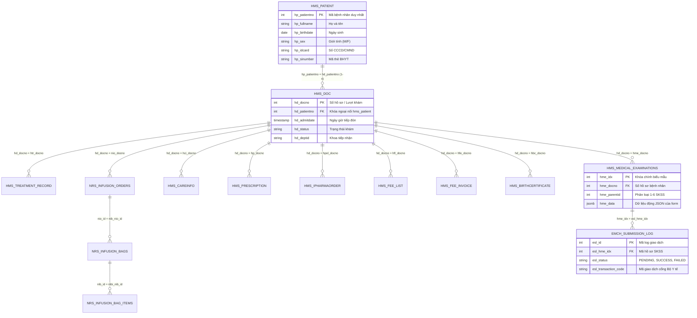

# Từ Điển Schema Cơ Sở Dữ Liệu VIMES (Database Schema Dictionary)

> **Thời gian trích xuất:** 10:56:32 14/8/2026  
> **Máy chủ trích xuất:** `10.1.3.214:55051` | **Instance:** `vimes_jsc`  
> **Tổng số bảng & View:** `1170` bảng | **Tổng số cột:** `19712` cột  
> **Quyền truy cập:** Read-Only (Truy vấn metadata qua từ điển hệ thống `information_schema`)

---

## 📑 Mục Lục Điều Hướng Nhanh

1. [Phần 1: Quản lý Bệnh nhân & Hành chính Tiếp đón (Patient & Admission)](#patient) *(27 bảng/view)*
2. [Phần 2: Hồ sơ Bệnh án, Phiếu khám & Phiếu điều trị (Clinical Records, Medical Sheets & EMR)](#clinical) *(62 bảng/view)*
3. [Phần 3: Dược, Kê đơn Thuốc & Quản lý Kho Dược/Vật tư (Pharmacy & Inventory)](#pharmacy) *(108 bảng/view)*
4. [Phần 4: Cận lâm sàng, Xét nghiệm (LIS) & Chẩn đoán hình ảnh (PACS/RIS)](#paraclinical) *(59 bảng/view)*
5. [Phần 5: Viện phí, Thu ngân & Bảo hiểm Y tế (Billing, Invoicing & BHYT)](#billing) *(136 bảng/view)*
6. [Phần 6: Danh mục Dùng chung & Cấu hình Hệ thống (Master Data & System Config)](#system) *(112 bảng/view)*
7. [Phần 7: Tích hợp Bên thứ 3, Cổng Quốc gia & Logs (Integrations, Webhook & Audit)](#integration) *(31 bảng/view)*
8. [Phần 8: Phân hệ Mở rộng Khác (HRM Nhân sự, FAM Tài sản, CRM, Đào tạo)](#other) *(635 bảng/view)*
9. [Sơ Đồ Quan Hệ Thực Thể Cốt Lõi (Core ERD)](#core-erd)
10. [Mẫu Truy Vấn Nối Bảng Thường Dùng (SQL Cheat Sheet)](#sql-cheatsheet)

---

## 📌 Quy Ước Tiền Tố Bảng (Prefix Conventions)

Hệ thống VIMES sử dụng quy ước tiền tố chuẩn hóa để phân tách các phân hệ nghiệp vụ:

| Tiền tố | Phân hệ / Ý nghĩa | Ví dụ bảng tiêu biểu |
| :--- | :--- | :--- |
| `hms_` | **Hospital Management System** - Nghiệp vụ bệnh viện cốt lõi | `hms_patient`, `hms_doc`, `hms_treatment_record`, `hms_fee` |
| `sys_` / `system_` | **System Core** - Danh mục hệ thống, tài khoản, khoa phòng | `sys_company`, `sys_dept`, `sys_room`, `sys_user`, `sys_sel` |
| `m_` | **Material & Pharmacy** - Quản lý dược, vật tư y tế, kho | `m_productitem`, `m_transaction`, `m_storage` |
| `emr_` | **Electronic Medical Record** - Bệnh án điện tử & Ký số | `emr_document`, `emr_template`, `emr_sign` |
| `nrs_` | **Nursing Services** - Y lệnh điều dưỡng, truyền dịch | `nrs_infusion_orders`, `nrs_infusion_bags`, `nrs_care_record` |
| `bh_` | **Bảo Hiểm Y Tế** - Dữ liệu liên thông cổng BHYT 4210/130 | `bh_xml1`, `bh_xml2`, `bh_xml3`, `bh_xml4`, `bh_xml5` |
| `lims_` / `pacs_` / `dicom_` | **Paraclinical** - Xét nghiệm, Chẩn đoán hình ảnh | `lims_order`, `pacs_study`, `dicom_series` |
| `emch_` | **e-MCH** - Liên thông cổng Sức khỏe Sinh sản Bộ Y Tế | `emch_submission_log` |
| `hrm_` | **Human Resource** - Quản lý nhân sự, chấm công | `hrm_employee`, `hrm_contract`, `hrm_timesheet` |
| `fam_` | **Fixed Asset Management** - Quản lý tài sản, trang thiết bị | `fam_asset`, `fam_maintenance` |

---

<a id="patient"></a>
## 📁 Phần 1: Quản lý Bệnh nhân & Hành chính Tiếp đón (Patient & Admission)

> Chứa các bảng lưu trữ thông tin định danh người bệnh, lượt khám (hồ sơ tiếp đón), nhân thân, địa chỉ và giấy tờ hộ tịch.

**Tổng số:** `27` bảng/view

| STT | Tên Bảng | Loại | Số Cột | Khóa Chính / Cột Nhận Diện | Chú Thích Nghiệp Vụ |
| :---: | :--- | :---: | :---: | :--- | :--- |
| 1 | [**`chemo_optimizer_patient`**](#table-chemo_optimizer_patient) | `TABLE` | 17 | `optimizer_patient_id` |  |
| 2 | [**`hiv_patient`**](#table-hiv_patient) | `TABLE` | 8 | `hip_idx` |  |
| 3 | [**`hms_birthcertificate`**](#table-hms_birthcertificate) | `TABLE` | 50 | `hbc_idx` |  |
| 4 | [**`hms_doc`**](#table-hms_doc) | `TABLE` | 108 | `hd_patientno` |  |
| 5 | [**`hms_html_view`**](#table-hms_html_view) | `VIEW` | 168 | `card_id` |  |
| 6 | [**`hms_html_view_exam`**](#table-hms_html_view_exam) | `VIEW` | 102 | `card_id` |  |
| 7 | [**`hms_outpatient`**](#table-hms_outpatient) | `TABLE` | 12 | `hop_docno` |  |
| 8 | [**`hms_outpatient_record`**](#table-hms_outpatient_record) | `TABLE` | 19 | `hor_idx` |  |
| 9 | [**`hms_patient`**](#table-hms_patient) | `TABLE` | 42 | `hp_patientno` |  |
| 10 | [**`hms_patient_encrypt`**](#table-hms_patient_encrypt) | `TABLE` | 13 | `hpe_patientno` |  |
| 11 | [**`hms_patient_files`**](#table-hms_patient_files) | `TABLE` | 9 | `hpf_idx` |  |
| 12 | [**`hms_patient_record`**](#table-hms_patient_record) | `TABLE` | 29 | `hpr_patientno` |  |
| 13 | [**`hms_patient_record_tranfer`**](#table-hms_patient_record_tranfer) | `TABLE` | 10 | `hprt_idx` |  |
| 14 | [**`hms_patient_returndrug`**](#table-hms_patient_returndrug) | `TABLE` | 6 | `hprd_docno` |  |
| 15 | [**`hms_patient_secure`**](#table-hms_patient_secure) | `TABLE` | 2 | `hps_patientno` |  |
| 16 | [**`hms_patient_tmp`**](#table-hms_patient_tmp) | `TABLE` | 28 | `hp_patientno` |  |
| 17 | [**`hms_patient_tmp_k1`**](#table-hms_patient_tmp_k1) | `TABLE` | 28 | `hp_patientno` |  |
| 18 | [**`hms_patient_vitual_acount`**](#table-hms_patient_vitual_acount) | `TABLE` | 5 | `patientno` |  |
| 19 | [**`hms_patientdeath`**](#table-hms_patientdeath) | `TABLE` | 48 | `hpd_patientno` |  |
| 20 | [**`hms_patientrec_id`**](#table-hms_patientrec_id) | `TABLE` | 3 | `hpi_idx` |  |
| 21 | [**`hms_patientrecord`**](#table-hms_patientrecord) | `TABLE` | 22 | `hpr_patientno` |  |
| 22 | [**`hms_patientrecord_idx`**](#table-hms_patientrecord_idx) | `TABLE` | 8 | `N/A` |  |
| 23 | [**`hms_recordno_outpatient_seq`**](#table-hms_recordno_outpatient_seq) | `TABLE` | 3 | `hrs_idx` |  |
| 24 | [**`hms_relative`**](#table-hms_relative) | `TABLE` | 21 | `hr_relative_id` |  |
| 25 | [**`lims_patient`**](#table-lims_patient) | `TABLE` | 25 | `limsp_docno` |  |
| 26 | [**`portal_patient_profiles`**](#table-portal_patient_profiles) | `TABLE` | 13 | `id` | Stores extended patient profile information for portal users, linked to HIS via patient_no |
| 27 | [**`qms_patient`**](#table-qms_patient) | `TABLE` | 62 | `qms_idx` |  |


### 🔍 Chi tiết cấu trúc các bảng cốt lõi trong nhóm

<a id="table-chemo_optimizer_patient"></a>
#### 📋 Bảng: `chemo_optimizer_patient` (BASE TABLE)

| STT | Tên Cột | Kiểu Dữ Liệu | Nullable | Mặc Định |
| :---: | :--- | :--- | :---: | :--- |
| 1 | **`optimizer_patient_id`** 🔑 | `bigint` | **NO** | `nextval('chemo_optimizer_patient_optimizer_patient_id_seq')` |
| 2 | **`optimizer_group_id`** 🔑 | `bigint` | **NO** |  |
| 3 | **`order_id`** 🔑 | `bigint` | **NO** |  |
| 4 | `docno` | `bigint` | YES |  |
| 5 | `patientno` | `bigint` | YES |  |
| 6 | `treatidx` | `bigint` | YES |  |
| 7 | `patient_name` | `character varying(255)` | YES |  |
| 8 | **`doctor_id`** 🔑 | `character varying(100)` | YES |  |
| 9 | `prescribed_strength` | `numeric` | **NO** | `0` |
| 10 | `original_strength` | `numeric` | **NO** | `0` |
| 11 | `allocated_excess` | `numeric` | **NO** | `0` |
| 12 | `charge_strength` | `numeric` | **NO** | `0` |
| 13 | `is_manual` | `character(1)` | **NO** | `'N'::bpchar` |
| 14 | `manual_by` | `character varying(100)` | YES |  |
| 15 | `manual_date` | `timestamp without time zone` | YES |  |
| 16 | `manual_reason` | `text` | YES |  |
| 17 | `validation_message` | `text` | YES |  |

---

<a id="table-hiv_patient"></a>
#### 📋 Bảng: `hiv_patient` (BASE TABLE)

| STT | Tên Cột | Kiểu Dữ Liệu | Nullable | Mặc Định |
| :---: | :--- | :--- | :---: | :--- |
| 1 | **`hip_idx`** 🔑 | `integer` | **NO** | `nextval('hiv_patient_hip_idx_seq')` |
| 2 | `hip_patientno` | `integer` | **NO** |  |
| 3 | `hip_adress` | `character varying(254)` | YES |  |
| 4 | `hip_starthospital` | `character varying(5)` | YES |  |
| 5 | `hip_startdatearv` | `date` | YES |  |
| 6 | `hip_startarvinhospital` | `date` | YES |  |
| 7 | `hip_icd10` | `character varying(5)` | YES |  |
| 8 | `hip_diagnostic` | `character varying(254)` | YES |  |

---

<a id="table-hms_birthcertificate"></a>
#### 📋 Bảng: `hms_birthcertificate` (BASE TABLE)

| STT | Tên Cột | Kiểu Dữ Liệu | Nullable | Mặc Định |
| :---: | :--- | :--- | :---: | :--- |
| 1 | **`hbc_idx`** 🔑 | `integer` | **NO** | `nextval('hms_birthcertificate_hbc_idx_seq1')` |
| 2 | `hbc_docno` | `integer` | **NO** |  |
| 3 | `hbc_patientname` | `character varying(65)` | YES |  |
| 4 | `hbc_yearofbirth` | `integer` | YES |  |
| 5 | `hbc_placeregistration` | `character varying(254)` | YES | `'CTCCSQLHC VỀ TTXH'::character varying` |
| 6 | `hbc_idcard` | `character varying(15)` | YES |  |
| 7 | `hbc_ethnic` | `integer` | YES |  |
| 8 | `hbc_datetimeofbirth` | `timestamp without time zone` | YES |  |
| 9 | `hbc_hospitalname` | `character varying(128)` | YES |  |
| 10 | `hbc_numberborn` | `integer` | YES |  |
| 11 | `hbc_numberoflive` | `integer` | YES |  |
| 12 | `hbc_numberlive` | `integer` | YES |  |
| 13 | `hbc_sex` | `character varying(1)` | YES |  |
| 14 | `hbc_weigh` | `numeric` | YES |  |
| 15 | `hbc_healthstatus` | `character varying(50)` | YES |  |
| 16 | `hbc_childrenname` | `character varying(50)` | YES |  |
| 17 | `hbc_themidwifery` | `character varying(50)` | YES |  |
| 18 | `hbc_bookno` | `integer` | YES | `79` |
| 19 | `hbc_number` | `integer` | YES |  |
| 20 | `hbc_tencha` | `character varying(128)` | YES |  |
| 21 | `hbc_ngaycap` | `date` | YES |  |
| 22 | `hbc_bhyt` | `character varying(20)` | YES |  |
| 23 | `hbc_index` | `integer` | YES | `1` |
| 24 | `hbc_year` | `integer` | YES |  |
| 25 | `hbc_surgery` | `character varying(1)` | YES | `'N'::character varying` |
| 26 | `hbc_underweeks32` | `character varying(1)` | YES | `'N'::character varying` |
| 27 | `hbc_voter` | `character varying(50)` | YES |  |
| 28 | `hbc_address` | `character varying(255)` | YES |  |
| 29 | `hbc_noicap` | `character varying(128)` | YES | `NULL::character varying` |
| 30 | `hbc_ghichu` | `character varying(128)` | YES | `NULL::character varying` |
| 31 | `hb_serial` | `character varying(24)` | YES | `NULL::character varying` |
| 32 | `hbc_machungtu` | `character varying(24)` | YES | `NULL::character varying` |
| 33 | `hbc_matinh` | `character varying(10)` | YES | `NULL::character varying` |
| 34 | `hbc_mahuyen` | `character varying(10)` | YES | `NULL::character varying` |
| 35 | `hbc_maxa` | `character varying(10)` | YES | `NULL::character varying` |
| 36 | `hbc_masobh` | `character varying(15)` | YES | `NULL::character varying` |
| 37 | `hbc_quoctich` | `character varying(5)` | YES | `NULL::character varying` |
| 38 | `hbc_mathetam` | `character varying(20)` | YES | `NULL::character varying` |
| 39 | `hbc_magcs` | `character varying(20)` | YES | `NULL::character varying` |
| 40 | `hbc_madinhdanh` | `character varying(20)` | YES | `NULL::character varying` |
| 41 | `hbc_ngaychungtu` | `date` | YES |  |
| 42 | `hbc_thutruongdv` | `character varying(20)` | YES | `NULL::character varying` |
| 43 | `hbc_note` | `character varying(254)` | YES | `NULL::character varying` |
| 44 | `hbc_loaigiayto` | `integer` | YES |  |
| 45 | `hbc_status` | `character varying(1)` | YES | `NULL::character varying` |
| 46 | `hbc_signdata` | `text` | YES |  |
| 47 | `hbc_signedby` | `character varying(15)` | YES | `NULL::character varying` |
| 48 | `hbc_createddate` | `timestamp without time zone` | YES | `now()` |
| 49 | `hbc_signeddate` | `timestamp without time zone` | YES |  |
| 50 | `hbc_ma_giao_dich` | `character varying(124)` | YES |  |

---

<a id="table-hms_doc"></a>
#### 📋 Bảng: `hms_doc` (BASE TABLE)

| STT | Tên Cột | Kiểu Dữ Liệu | Nullable | Mặc Định |
| :---: | :--- | :--- | :---: | :--- |
| 1 | `hd_createdby` | `character varying(15)` | YES |  |
| 2 | `hd_createddate` | `timestamp without time zone` | YES | `now()` |
| 3 | `hd_updatedby` | `character varying(15)` | YES |  |
| 4 | `hd_updateddate` | `timestamp without time zone` | YES | `now()` |
| 5 | `hd_patientno` | `integer` | YES |  |
| 6 | `hd_docno` | `integer` | **NO** |  |
| 7 | `hd_status` | `character varying(1)` | YES | `'O'::character varying` |
| 8 | `hd_yofage` | `integer` | YES |  |
| 9 | `hd_mofage` | `integer` | YES |  |
| 10 | `hd_dofege` | `integer` | YES |  |
| 11 | `hd_telephone` | `character varying(30)` | YES |  |
| 12 | `hd_relative` | `character varying(65)` | YES |  |
| 13 | `hd_relation` | `integer` | YES |  |
| 14 | `hd_contactaddr` | `character varying(254)` | YES |  |
| 15 | `hd_contacttel` | `character varying(30)` | YES |  |
| 16 | `hd_emergency` | `character varying(1)` | YES | `'N'::character varying` |
| 17 | `hd_object` | `integer` | YES |  |
| 18 | `hd_cardno` | `character varying(25)` | YES |  |
| 19 | `hd_cardidx` | `integer` | YES | `0` |
| 20 | `hd_disrate` | `numeric` | YES | `0` |
| 21 | `hd_insline` | `character varying(1)` | YES | `'N'::character varying` |
| 22 | `hd_transplace` | `character varying(254)` | YES |  |
| 23 | `hd_transdiagn` | `character varying(254)` | YES |  |
| 24 | `hd_admitstate` | `character varying(1)` | YES |  |
| 25 | `hd_admitdept` | `character varying(7)` | YES |  |
| 26 | `hd_admitdate` | `timestamp without time zone` | YES | `now()` |
| 27 | `hd_outstate` | `integer` | YES |  |
| 28 | `hd_enddept` | `character varying(7)` | YES |  |
| 29 | `hd_enddate` | `timestamp without time zone` | YES |  |
| 30 | `hd_icd` | `character varying(13)` | YES |  |
| 31 | `hd_diagnostic` | `character varying(512)` | YES |  |
| 32 | `hd_reldisease` | `character varying(766)` | YES |  |
| 33 | `hd_conclusion` | `character varying(512)` | YES |  |
| 34 | `hd_suggestion` | `character varying(1)` | YES |  |
| 35 | `hd_result` | `character varying(1)` | YES |  |
| 36 | `hd_doctor` | `character varying(15)` | YES |  |
| 37 | `hd_indept` | `character varying(7)` | YES |  |
| 38 | `hd_tohosid` | `character varying(13)` | YES |  |
| 39 | `hd_outpatient` | `character varying(1)` | YES |  |
| 40 | `hd_areceptidx` | `integer` | YES | `0` |
| 41 | `hd_treatmethod` | `character varying(254)` | YES |  |
| 42 | `hdf_invoicefee` | `integer` | YES | `0` |
| 43 | `hdf_acceptedfee` | `character varying(1)` | YES | `'N'::character varying` |
| 44 | `hdf_accepteddate` | `timestamp without time zone` | YES |  |
| 45 | `hdf_acceptedby` | `character varying(15)` | YES |  |
| 46 | `hd_transplaceid` | `character varying(7)` | YES |  |
| 47 | `hd_transicd` | `character varying(11)` | YES |  |
| 48 | `hd_insregdate` | `timestamp without time zone` | YES |  |
| 49 | `hd_xobject` | `integer` | YES |  |
| 50 | `hd_xcardno` | `character varying(25)` | YES |  |
| 51 | `hd_xissueplace` | `character varying(128)` | YES |  |
| 52 | `hd_xissuedate` | `timestamp without time zone` | YES |  |
| 53 | `hd_xrate` | `integer` | YES |  |
| 54 | `hd_insexpdate` | `timestamp without time zone` | YES |  |
| 55 | `hpc_iscomplete` | `character varying(1)` | YES | `'N'::character varying` |
| 56 | `hpo_iscomplete` | `character varying(1)` | YES | `'N'::character varying` |
| 57 | `hfe_deposit_amount` | `numeric` | YES | `0` |
| 58 | `hfe_discount_amount` | `numeric` | YES | `0` |
| 59 | `hd_recordno` | `character varying(20)` | YES |  |
| 60 | `hd_isinpatient` | `character varying(1)` | YES | `'N'::character varying` |
| 61 | `hfe_inspaid_amount` | `numeric` | YES | `0` |
| 62 | `hfe_patpaid_amount` | `numeric` | YES | `0` |
| 63 | `hfe_cost` | `numeric` | YES | `0` |
| 64 | `hfe_eat_amount` | `numeric` | YES | `0` |
| 65 | `hd_printed` | `integer` | YES |  |
| 66 | `hd_position` | `integer` | YES |  |
| 67 | `hd_rank` | `integer` | YES |  |
| 68 | `hd_isjo` | `character varying(1)` | YES | `'N'::character varying` |
| 69 | `hd_healthexam` | `character varying(1)` | YES | `'N'::character varying` |
| 70 | `hd_severse_disease` | `character varying(1)` | YES | `'N'::character varying` |
| 71 | `hd_zviettel_co` | `character varying(1)` | YES | `'N'::character varying` |
| 72 | `hd_over5year` | `character varying(1)` | YES | `'N'::character varying` |
| 73 | `hd_isreq` | `character varying(1)` | YES |  |
| 74 | `hd_nonexam` | `character varying(1)` | YES | `'N'::character varying` |
| 75 | `hd_istransplant` | `character varying(1)` | YES |  |
| 76 | `hdf_insinvoice` | `integer` | YES | `0` |
| 77 | `hd_sugg2` | `character varying(256)` | YES |  |
| 78 | `hd_datediscountall` | `date` | YES |  |
| 79 | `hd_xcardidx` | `integer` | YES | `0` |
| 80 | `hd_xregdate` | `date` | YES |  |
| 81 | `hd_xexpdate` | `date` | YES |  |
| 82 | `hd_infertility` | `character varying(1)` | YES |  |
| 83 | `hd_hasfeepaper` | `character varying(1)` | YES |  |
| 84 | `hd_over5yeardate` | `date` | YES |  |
| 85 | `hd_sameinslevel` | `character varying(1)` | YES |  |
| 86 | `hd_terminatedby` | `character varying(15)` | YES |  |
| 87 | `hd_ttrang_rv` | `integer` | YES |  |
| 88 | `hd_covid19` | `character varying(1)` | YES |  |
| 89 | `ho_covid_object` | `character varying(5)` | YES |  |
| 90 | `hd_record_type` | `integer` | YES |  |
| 91 | `hd_isrelative` | `character varying(1)` | YES |  |
| 92 | `hd_requestsendhospital` | `character varying(1)` | YES |  |
| 93 | `hd_ma_doituong_kcb` | `character varying(4)` | YES |  |
| 94 | `hd_ma_loai_kcb` | `character varying(3)` | YES |  |
| 95 | `hd_buyblood` | `character varying(1)` | YES |  |
| 96 | `hd_advice` | `character varying(254)` | YES |  |
| 97 | `hd_passwd` | `character varying(24)` | YES |  |
| 98 | `hd_locked` | `character varying(1)` | YES |  |
| 99 | `hd_paper_trans` | `character varying(48)` | YES |  |
| 100 | `hd_matbenh_dungtuyen` | `character varying(10)` | YES |  |
| 101 | **`hd_xorg_id`** 🔑 | `character varying(5)` | YES |  |
| 102 | `hd_transdate` | `date` | YES |  |
| 103 | `hd_provid` | `integer` | YES |  |
| 104 | `hd_distid` | `integer` | YES |  |
| 105 | `hd_villid` | `integer` | YES |  |
| 106 | `hd_dtladdr` | `character varying(254)` | YES |  |
| 107 | `hd_mabenh_dungtuyen` | `character varying(1)` | YES |  |
| 108 | `hd_reexam` | `character(1)` | YES |  |

---

<a id="table-hms_html_view"></a>
#### 📋 Bảng: `hms_html_view` (VIEW)

| STT | Tên Cột | Kiểu Dữ Liệu | Nullable | Mặc Định |
| :---: | :--- | :--- | :---: | :--- |
| 1 | `coso_yte` | `character varying(254)` | YES |  |
| 2 | `ten_benhvien` | `character varying(254)` | YES |  |
| 3 | `sohoso` | `integer` | YES |  |
| 4 | `khoa_dieutri` | `character varying(254)` | YES |  |
| 5 | `giuong` | `character varying(254)` | YES |  |
| 6 | `mabenhnhan` | `integer` | YES |  |
| 7 | `so_luutru` | `character varying(15)` | YES |  |
| 8 | `ten_benhnhan` | `text` | YES |  |
| 9 | `nguoilamdon_ten` | `text` | YES |  |
| 10 | `gender` | `character varying` | YES |  |
| 11 | `gioi_tinh` | `character varying` | YES |  |
| 12 | `nguoilamdon_gt` | `character varying` | YES |  |
| 13 | `hp_sex` | `character varying(1)` | YES |  |
| 14 | `ngay_sinh` | `text` | YES |  |
| 15 | `nam_sinh` | `double precision` | YES |  |
| 16 | `nguoilamdon_namsinh` | `double precision` | YES |  |
| 17 | `tuoi_benhnhan` | `character varying` | YES |  |
| 18 | `nguoilamdon_tuoi` | `character varying` | YES |  |
| 19 | `dan_toc` | `character varying` | YES |  |
| 20 | `gt_nam` | `text` | YES |  |
| 21 | `gt_nu` | `text` | YES |  |
| 22 | `nghe_nghiep` | `character varying` | YES |  |
| 23 | `phone` | `character varying(30)` | YES |  |
| 24 | `nguoilamdon_dt` | `character varying(30)` | YES |  |
| 25 | `dia_chi` | `character varying` | YES |  |
| 26 | `address` | `character varying` | YES |  |
| 27 | `nguoilamdon_diachi` | `character varying` | YES |  |
| 28 | `thon_xom` | `character varying(254)` | YES |  |
| 29 | `xa_phuong` | `character varying` | YES |  |
| 30 | `quan_huyen` | `character varying` | YES |  |
| 31 | `tinh_thanhpho` | `character varying` | YES |  |
| 32 | `rank` | `character varying(256)` | YES |  |
| 33 | `position` | `character varying(256)` | YES |  |
| 34 | `org_address` | `character varying(256)` | YES |  |
| 35 | `doi_tuong` | `character varying` | YES |  |
| 36 | `que_quan` | `character varying` | YES |  |
| 37 | `work_place` | `character varying(254)` | YES |  |
| 38 | `nation` | `character varying(254)` | YES |  |
| 39 | `ngoai_kieu` | `character varying(254)` | YES |  |
| 40 | `noi_lamviec` | `character varying(254)` | YES |  |
| 41 | `the_bhyt` | `text` | YES |  |
| 42 | `han_the_tu` | `text` | YES |  |
| 43 | `han_the_den` | `text` | YES |  |
| 44 | `han_the_den1` | `text` | YES |  |
| 45 | `han_the` | `text` | YES |  |
| 46 | `bhyt` | `text` | YES |  |
| 47 | `thuphi` | `text` | YES |  |
| 48 | `miengiam` | `text` | YES |  |
| 49 | `khac` | `text` | YES |  |
| 50 | **`card_id`** 🔑 | `character varying(12)` | YES |  |
| 51 | `the_bhyt_1` | `text` | YES |  |
| 52 | `the_bhyt_2` | `text` | YES |  |
| 53 | `the_bhyt_3` | `text` | YES |  |
| 54 | `the_bhyt_4` | `text` | YES |  |
| 55 | `the_bhyt_5` | `text` | YES |  |
| 56 | `ngay_bat_dau` | `timestamp without time zone` | YES |  |
| 57 | `ngay_ket_thuc` | `timestamp without time zone` | YES |  |
| 58 | `nguoi_nha` | `character varying` | YES |  |
| 59 | `so_dt_ng_than` | `character varying(30)` | YES |  |
| 60 | `ho_ten_nguoi_than` | `character varying(65)` | YES |  |
| 61 | `ho_ten_nguoi_nha` | `character varying(65)` | YES |  |
| 62 | `dia_chi_nguoi_than` | `character varying(254)` | YES |  |
| 63 | `so_dt_nguoi_than` | `character varying(30)` | YES |  |
| 64 | `main_disease` | `character varying` | YES |  |
| 65 | **`icd_chuyenden_id`** 🔑 | `character varying(11)` | YES |  |
| 66 | `icd_chuyenden` | `character varying(254)` | YES |  |
| 67 | **`icd_khoakb_id`** 🔑 | `character varying(13)` | YES |  |
| 68 | `icd_khoakb` | `character varying` | YES |  |
| 69 | **`icd_vaokhoa_id`** 🔑 | `character varying(13)` | YES |  |
| 70 | `icd_vaokhoa` | `character varying(254)` | YES |  |
| 71 | `chan_doan` | `character varying(512)` | YES |  |
| 72 | `bac_sy_ket_thuc` | `character varying` | YES |  |
| 73 | `bac_sy_dieu_tri` | `character varying` | YES |  |
| 74 | `ngay_vaovien` | `text` | YES |  |
| 75 | `ngay_ravien` | `text` | YES |  |
| 76 | `noi_gioi_thieu1` | `text` | YES |  |
| 77 | `noi_gioi_thieu2` | `text` | YES |  |
| 78 | `noi_gioi_thieu3` | `text` | YES |  |
| 79 | `noi_nhan1` | `text` | YES |  |
| 80 | `noi_nhan2` | `text` | YES |  |
| 81 | `noi_nhan3` | `text` | YES |  |
| 82 | `quatrinh_benhly` | `character varying(1024)` | YES |  |
| 83 | `gio_vao1` | `text` | YES |  |
| 84 | `vao_khoa1` | `character varying(7)` | YES |  |
| 85 | `ngay_dt1` | `integer` | YES |  |
| 86 | `gio_chuyen2` | `text` | YES |  |
| 87 | `chuyen_khoa2` | `character varying(7)` | YES |  |
| 88 | `ngay_dt2` | `integer` | YES |  |
| 89 | `gio_chuyen3` | `text` | YES |  |
| 90 | `chuyen_khoa3` | `character varying(7)` | YES |  |
| 91 | `gio_chuyen4` | `text` | YES |  |
| 92 | `chuyen_khoa4` | `character varying(7)` | YES |  |
| 93 | `gio_chuyen5` | `text` | YES |  |
| 94 | `chuyen_khoa5` | `character varying(7)` | YES |  |
| 95 | `ngay_dt3` | `integer` | YES |  |
| 96 | `ngay_dt4` | `integer` | YES |  |
| 97 | `ngay_dt5` | `integer` | YES |  |
| 98 | `tong_ngaydt` | `text` | YES |  |
| 99 | **`benh_chinh_id`** 🔑 | `character varying(13)` | YES |  |
| 100 | `benh_chinh` | `character varying(512)` | YES |  |
| 101 | `chan_doan_ra_vien` | `character varying(512)` | YES |  |
| 102 | `chan_doan_vao_vien` | `character varying(254)` | YES |  |
| 103 | `benh_kem` | `character varying(512)` | YES |  |
| 104 | `phuong_phapdt` | `character varying(1024)` | YES |  |
| 105 | `tinhtrang_ravien` | `character varying(254)` | YES |  |
| 106 | `tom_tatcls` | `character varying` | YES |  |
| 107 | `mach` | `text` | YES |  |
| 108 | `nhiet_do` | `double precision` | YES |  |
| 109 | `huyet_ap` | `text` | YES |  |
| 110 | `nhip_tho` | `text` | YES |  |
| 111 | `chieu_cao` | `text` | YES |  |
| 112 | `chieu_cao_cm` | `text` | YES |  |
| 113 | `can_nang` | `text` | YES |  |
| 114 | `chiso_bmi` | `text` | YES |  |
| 115 | `chi_so_bmi` | `text` | YES |  |
| 116 | `ngay_ky` | `text` | YES |  |
| 117 | `ngay_ky1` | `text` | YES |  |
| 118 | `ngay_ky2` | `text` | YES |  |
| 119 | `ngay_gioky` | `text` | YES |  |
| 120 | `kinh_gui` | `text` | YES |  |
| 121 | `buong` | `character varying(250)` | YES |  |
| 122 | `tuyen_tren` | `text` | YES |  |
| 123 | `tuyen_duoi` | `text` | YES |  |
| 124 | `tuyen_chuyenkhoa` | `text` | YES |  |
| 125 | `tinhtrang_ravien1` | `text` | YES |  |
| 126 | `tinhtrang_ravien2` | `text` | YES |  |
| 127 | `tinhtrang_ravien3` | `text` | YES |  |
| 128 | `ketqua_dieutri1` | `text` | YES |  |
| 129 | `ketqua_dieutri2` | `text` | YES |  |
| 130 | `ketqua_dieutri3` | `text` | YES |  |
| 131 | `ketqua_dieutri4` | `text` | YES |  |
| 132 | `ketqua_dieutri5` | `text` | YES |  |
| 133 | `treatment_dept` | `character varying(254)` | YES |  |
| 134 | `doc_no` | `integer` | YES |  |
| 135 | `nhiet_do2` | `bigint` | YES |  |
| 136 | `nhiet_do3` | `double precision` | YES |  |
| 137 | `nhiet_do4` | `real` | YES |  |
| 138 | `quan_he` | `integer` | YES |  |
| 139 | `ten_benhnhan2` | `text` | YES |  |
| 140 | `quanhe_benhnhan` | `character varying(256)` | YES |  |
| 141 | `khoa_khambenh` | `character varying(254)` | YES |  |
| 142 | `lydo_vaovien` | `character varying(254)` | YES |  |
| 143 | `kinh_gui_giam_doc` | `text` | YES |  |
| 144 | `kinh_gui_benh_vien` | `text` | YES |  |
| 145 | `kinh_gui_benh_vien2` | `text` | YES |  |
| 146 | `huong_dieutri` | `character varying(256)` | YES |  |
| 147 | `huong_dieutri_nt` | `character varying(256)` | YES |  |
| 148 | `so_cmnd` | `character varying(12)` | YES |  |
| 149 | `ma_yte` | `text` | YES |  |
| 150 | `ngay_gio_ky` | `text` | YES |  |
| 151 | `ngaygio_chuyenda` | `text` | YES |  |
| 152 | `ngay_gio_ky2` | `text` | YES |  |
| 153 | `nhom_mau` | `character varying(3)` | YES |  |
| 154 | `huong_dieutri_ravien` | `character varying(512)` | YES |  |
| 155 | `ngay_ravien1` | `text` | YES |  |
| 156 | **`benh_kem_id`** 🔑 | `text` | YES |  |
| 157 | `ten_cskcb` | `character varying(254)` | YES |  |
| 158 | `ten_bvkcb` | `character varying(254)` | YES |  |
| 159 | `nam_sinh2` | `double precision` | YES |  |
| 160 | `doc_no2` | `integer` | YES |  |
| 161 | `ngay_kham` | `text` | YES |  |
| 162 | `ngay_cap` | `text` | YES |  |
| 163 | `sieu_am` | `integer` | YES |  |
| 164 | `x_quang` | `integer` | YES |  |
| 165 | `ct_scanner` | `integer` | YES |  |
| 166 | `xet_nghiem` | `integer` | YES |  |
| 167 | `hoso_khac` | `integer` | YES |  |
| 168 | `toan_bo` | `integer` | YES |  |

---

<a id="table-hms_html_view_exam"></a>
#### 📋 Bảng: `hms_html_view_exam` (VIEW)

| STT | Tên Cột | Kiểu Dữ Liệu | Nullable | Mặc Định |
| :---: | :--- | :--- | :---: | :--- |
| 1 | `coso_yte` | `character varying(254)` | YES |  |
| 2 | `ten_benhvien` | `character varying(254)` | YES |  |
| 3 | `sohoso` | `integer` | YES |  |
| 4 | `mabenhnhan` | `integer` | YES |  |
| 5 | `ten_benhnhan` | `text` | YES |  |
| 6 | `gioi_tinh` | `character varying` | YES |  |
| 7 | `hp_sex` | `character varying(1)` | YES |  |
| 8 | `ngay_sinh` | `text` | YES |  |
| 9 | `nam_sinh` | `double precision` | YES |  |
| 10 | `tuoi_benhnhan` | `character varying` | YES |  |
| 11 | `dan_toc` | `character varying` | YES |  |
| 12 | `gt_nam` | `text` | YES |  |
| 13 | `gt_nu` | `text` | YES |  |
| 14 | `nghe_nghiep` | `character varying` | YES |  |
| 15 | `phone` | `character varying(30)` | YES |  |
| 16 | `dia_chi` | `character varying` | YES |  |
| 17 | `thon_xom` | `character varying(254)` | YES |  |
| 18 | `xa_phuong` | `character varying` | YES |  |
| 19 | `quan_huyen` | `character varying` | YES |  |
| 20 | `tinh_thanhpho` | `character varying` | YES |  |
| 21 | `rank` | `character varying(256)` | YES |  |
| 22 | `position` | `character varying(256)` | YES |  |
| 23 | `org_address` | `character varying(256)` | YES |  |
| 24 | `doi_tuong` | `character varying` | YES |  |
| 25 | `que_quan` | `character varying` | YES |  |
| 26 | `work_place` | `character varying(254)` | YES |  |
| 27 | `ngoai_kieu` | `character varying(254)` | YES |  |
| 28 | `noi_lamviec` | `character varying(254)` | YES |  |
| 29 | `the_bhyt` | `character varying(25)` | YES |  |
| 30 | `han_the_tu` | `text` | YES |  |
| 31 | `han_the_den` | `text` | YES |  |
| 32 | `han_the` | `text` | YES |  |
| 33 | `bhyt` | `text` | YES |  |
| 34 | `thuphi` | `text` | YES |  |
| 35 | `miengiam` | `text` | YES |  |
| 36 | `khac` | `text` | YES |  |
| 37 | **`card_id`** 🔑 | `character varying(12)` | YES |  |
| 38 | `the_bhyt_1` | `text` | YES |  |
| 39 | `the_bhyt_2` | `text` | YES |  |
| 40 | `the_bhyt_3` | `text` | YES |  |
| 41 | `the_bhyt_4` | `text` | YES |  |
| 42 | `the_bhyt_5` | `text` | YES |  |
| 43 | `ngay_bat_dau` | `timestamp without time zone` | YES |  |
| 44 | `ngay_ket_thuc` | `timestamp without time zone` | YES |  |
| 45 | `ho_ten_nguoi_than` | `character varying(65)` | YES |  |
| 46 | `dia_chi_nguoi_than` | `character varying(254)` | YES |  |
| 47 | `so_dt_nguoi_than` | `character varying(30)` | YES |  |
| 48 | `main_disease` | `character varying` | YES |  |
| 49 | **`icd_chuyenden_id`** 🔑 | `character varying(11)` | YES |  |
| 50 | `icd_chuyenden` | `character varying(254)` | YES |  |
| 51 | **`icd_khoakb_id`** 🔑 | `character varying(13)` | YES |  |
| 52 | `icd_khoakb` | `character varying` | YES |  |
| 53 | `chan_doan` | `character varying(512)` | YES |  |
| 54 | `bac_sy_ket_thuc` | `character varying` | YES |  |
| 55 | `quatrinh_benhly` | `character varying(1024)` | YES |  |
| 56 | `toan_than` | `character varying(1024)` | YES |  |
| 57 | `cac_bo_phan` | `character varying(512)` | YES |  |
| 58 | **`benh_chinh_id`** 🔑 | `character varying(13)` | YES |  |
| 59 | `benh_chinh` | `character varying(512)` | YES |  |
| 60 | `benh_kem` | `character varying(766)` | YES |  |
| 61 | `tom_tatcls` | `character varying` | YES |  |
| 62 | `mach` | `text` | YES |  |
| 63 | `nhiet_do` | `double precision` | YES |  |
| 64 | `huyet_ap` | `text` | YES |  |
| 65 | `nhip_tho` | `text` | YES |  |
| 66 | `chieu_cao` | `text` | YES |  |
| 67 | `can_nang` | `text` | YES |  |
| 68 | `chiso_bmi` | `double precision` | YES |  |
| 69 | `ngay_ky` | `text` | YES |  |
| 70 | `ngay_ky1` | `text` | YES |  |
| 71 | `ngay_ky2` | `text` | YES |  |
| 72 | `ngay_gioky` | `text` | YES |  |
| 73 | `kinh_gui` | `text` | YES |  |
| 74 | `tuyen_tren` | `text` | YES |  |
| 75 | `tuyen_duoi` | `text` | YES |  |
| 76 | `tuyen_chuyenkhoa` | `text` | YES |  |
| 77 | `tinhtrang_ravien1` | `text` | YES |  |
| 78 | `tinhtrang_ravien2` | `text` | YES |  |
| 79 | `tinhtrang_ravien3` | `text` | YES |  |
| 80 | `ketqua_dieutri1` | `text` | YES |  |
| 81 | `ketqua_dieutri2` | `text` | YES |  |
| 82 | `ketqua_dieutri3` | `text` | YES |  |
| 83 | `ketqua_dieutri4` | `text` | YES |  |
| 84 | `ketqua_dieutri5` | `text` | YES |  |
| 85 | `doc_no` | `integer` | YES |  |
| 86 | `nhiet_do2` | `bigint` | YES |  |
| 87 | `nhiet_do3` | `double precision` | YES |  |
| 88 | `nhiet_do4` | `real` | YES |  |
| 89 | `quan_he` | `integer` | YES |  |
| 90 | `ten_benhnhan2` | `text` | YES |  |
| 91 | `quanhe_benhnhan` | `character varying(256)` | YES |  |
| 92 | `khoa_khambenh` | `character varying(254)` | YES |  |
| 93 | `khoa_dieutri` | `character varying(254)` | YES |  |
| 94 | `lydo_vaovien` | `character varying(254)` | YES |  |
| 95 | `kinh_gui_giam_doc` | `text` | YES |  |
| 96 | `kinh_gui_benh_vien` | `text` | YES |  |
| 97 | `kinh_gui_benh_vien2` | `text` | YES |  |
| 98 | `so_cmnd` | `character varying(12)` | YES |  |
| 99 | `ma_yte` | `text` | YES |  |
| 100 | `ngay_gio_ky` | `text` | YES |  |
| 101 | `ngaygio_chuyenda` | `text` | YES |  |
| 102 | `ngay_gio_ky2` | `text` | YES |  |

---

<a id="table-hms_outpatient"></a>
#### 📋 Bảng: `hms_outpatient` (BASE TABLE)

| STT | Tên Cột | Kiểu Dữ Liệu | Nullable | Mặc Định |
| :---: | :--- | :--- | :---: | :--- |
| 1 | `hop_docno` | `integer` | **NO** |  |
| 2 | `hop_deptid` | `character varying(7)` | YES |  |
| 3 | `hop_roomid` | `integer` | YES |  |
| 4 | `hop_refidx` | `integer` | YES |  |
| 5 | `hop_status` | `character varying(1)` | YES |  |
| 6 | `hop_fromdate` | `timestamp without time zone` | YES |  |
| 7 | `hop_todate` | `timestamp without time zone` | YES |  |
| 8 | `hop_treatdays` | `integer` | YES |  |
| 9 | `hop_result` | `character varying(254)` | YES |  |
| 10 | `hop_conlusion` | `character varying(254)` | YES |  |
| 11 | `hop_note` | `character varying(254)` | YES |  |
| 12 | `hop_notexam` | `character varying(1)` | YES | `'N'::character varying` |

---

<a id="table-hms_outpatient_record"></a>
#### 📋 Bảng: `hms_outpatient_record` (BASE TABLE)

| STT | Tên Cột | Kiểu Dữ Liệu | Nullable | Mặc Định |
| :---: | :--- | :--- | :---: | :--- |
| 1 | **`hor_idx`** 🔑 | `integer` | **NO** | `nextval('hms_outpatient_record_hor_idx_seq')` |
| 2 | `hor_year` | `integer` | YES |  |
| 3 | `hor_typeid` | `integer` | YES |  |
| 4 | `hor_patientno` | `integer` | YES |  |
| 5 | `hor_deptid` | `character varying(15)` | YES |  |
| 6 | `hor_roomid` | `integer` | YES |  |
| 7 | `hor_doctor` | `character varying(15)` | YES |  |
| 8 | `hor_recordno` | `character varying(24)` | YES |  |
| 9 | `hor_startdate` | `date` | YES |  |
| 10 | `hor_enddate` | `date` | YES |  |
| 11 | `hor_status` | `character varying(1)` | YES |  |
| 12 | `hor_icd` | `character varying(10)` | YES |  |
| 13 | `hor_conclusion` | `character varying(254)` | YES |  |
| 14 | `hor_reldisease` | `character varying(254)` | YES |  |
| 15 | `hor_record` | `integer` | **NO** |  |
| 16 | `bh_used` | `character varying(1)` | YES |  |
| 17 | `bh_approveddate` | `timestamp without time zone` | YES |  |
| 18 | `bh_approvedby` | `character varying(15)` | YES |  |
| 19 | `hor_type_prefix` | `integer` | YES |  |

---

<a id="table-hms_patient"></a>
#### 📋 Bảng: `hms_patient` (BASE TABLE)

| STT | Tên Cột | Kiểu Dữ Liệu | Nullable | Mặc Định |
| :---: | :--- | :--- | :---: | :--- |
| 1 | `hp_createdby` | `character varying(15)` | YES |  |
| 2 | `hp_createddate` | `timestamp without time zone` | YES |  |
| 3 | `hp_updatedby` | `character varying(15)` | YES |  |
| 4 | `hp_updateddate` | `timestamp without time zone` | YES | `now()` |
| 5 | `hp_patientno` | `integer` | **NO** |  |
| 6 | `hp_patientid` | `character varying(15)` | YES |  |
| 7 | `hp_surname` | `character varying(15)` | YES |  |
| 8 | `hp_midname` | `character varying(45)` | YES |  |
| 9 | `hp_firstname` | `character varying(54)` | YES |  |
| 10 | `hp_birthdate` | `date` | YES |  |
| 11 | `hp_sex` | `character varying(1)` | YES |  |
| 12 | `hp_ethnic` | `integer` | YES |  |
| 13 | `hp_religion` | `integer` | YES |  |
| 14 | `hp_sin` | `character varying(12)` | YES |  |
| 15 | `hp_provid` | `integer` | YES |  |
| 16 | `hp_distid` | `integer` | YES |  |
| 17 | `hp_villid` | `integer` | YES |  |
| 18 | `hp_dtladdr` | `character varying(254)` | YES |  |
| 19 | `hp_occupation` | `integer` | YES |  |
| 20 | `hp_workplaceid` | `character varying(13)` | YES |  |
| 21 | `hp_workplace` | `character varying(254)` | YES |  |
| 22 | `hp_rank` | `integer` | YES |  |
| 23 | `hp_position` | `integer` | YES |  |
| 24 | `hp_status` | `character varying(1)` | YES |  |
| 25 | `hp_type` | `character varying(1)` | YES |  |
| 26 | `hp_cancer` | `character varying(1)` | YES | `'N'::character varying` |
| 27 | `hp_nationality` | `character varying(3)` | YES | `'VIE'::character varying` |
| 28 | `hp_department` | `character varying(7)` | YES |  |
| 29 | `hp_recordno` | `character varying(15)` | YES |  |
| 30 | `hp_yearofbirth` | `character varying(1)` | YES | `'N'::character varying` |
| 31 | `hp_noicap` | `character varying(54)` | YES |  |
| 32 | `hp_ngaycap` | `date` | YES |  |
| 33 | `hp_namekey` | `character varying(7)` | YES |  |
| 34 | `hp_pid` | `character varying(20)` | YES |  |
| 35 | `hp_abo` | `character varying(3)` | YES |  |
| 36 | `hp_rh` | `character varying(12)` | YES |  |
| 37 | `hpa_recordno` | `character varying(1)` | YES |  |
| 38 | `hpa_abo` | `character varying(1)` | YES |  |
| 39 | `hpa_rh` | `character varying(1)` | YES |  |
| 40 | `hp_cmnddate` | `date` | YES |  |
| 41 | `hp_contacttel` | `character varying(11)` | YES |  |
| 42 | `hp_phone` | `character varying(20)` | YES |  |

---

<a id="table-hms_patient_encrypt"></a>
#### 📋 Bảng: `hms_patient_encrypt` (BASE TABLE)

| STT | Tên Cột | Kiểu Dữ Liệu | Nullable | Mặc Định |
| :---: | :--- | :--- | :---: | :--- |
| 1 | `hpe_createdby` | `character varying(20)` | YES |  |
| 2 | `hpe_createddate` | `timestamp without time zone` | YES |  |
| 3 | `hpe_patientno` | `integer` | **NO** |  |
| 4 | `hpe_pname` | `character varying(128)` | YES |  |
| 5 | `hpe_birthdate` | `character varying(20)` | YES |  |
| 6 | `hpe_gender` | `character varying(3)` | YES |  |
| 7 | **`hpe_provill_id`** 🔑 | `character varying(20)` | YES |  |
| 8 | **`hpe_district_id`** 🔑 | `character varying(20)` | YES |  |
| 9 | **`hpe_village_id`** 🔑 | `character varying(20)` | YES |  |
| 10 | `hpe_dtladdress` | `character varying(20)` | YES |  |
| 11 | `hpe_rank` | `character varying(20)` | YES |  |
| 12 | `hpe_position` | `character varying(20)` | YES |  |
| 13 | `hpe_workplace` | `character varying(254)` | YES |  |

---

<a id="table-hms_patient_files"></a>
#### 📋 Bảng: `hms_patient_files` (BASE TABLE)

| STT | Tên Cột | Kiểu Dữ Liệu | Nullable | Mặc Định |
| :---: | :--- | :--- | :---: | :--- |
| 1 | **`hpf_idx`** 🔑 | `integer` | **NO** | `nextval('hms_patient_files_hpf_idx_seq')` |
| 2 | `hpf_createdby` | `character varying(15)` | YES |  |
| 3 | `hpf_createddate` | `timestamp without time zone` | YES |  |
| 4 | `hpf_docno` | `integer` | **NO** |  |
| 5 | `hpf_orderid` | `integer` | YES |  |
| 6 | `hpf_name` | `character varying(254)` | YES |  |
| 7 | `hpf_type` | `character varying(5)` | YES |  |
| 8 | `hpf_signaturename` | `character varying(60)` | YES |  |
| 9 | `hpf_signatureid` | `character varying(60)` | YES |  |

---

<a id="table-hms_patient_record"></a>
#### 📋 Bảng: `hms_patient_record` (BASE TABLE)

| STT | Tên Cột | Kiểu Dữ Liệu | Nullable | Mặc Định |
| :---: | :--- | :--- | :---: | :--- |
| 1 | `hpr_createdby` | `character varying(15)` | YES |  |
| 2 | `hpr_createddate` | `timestamp without time zone` | YES |  |
| 3 | `hpr_updatedby` | `character varying(15)` | YES |  |
| 4 | `hpr_updateddate` | `timestamp without time zone` | YES |  |
| 5 | `hpr_patientno` | `integer` | YES |  |
| 6 | `hpr_docno` | `integer` | YES |  |
| 7 | **`hpr_idx`** 🔑 | `integer` | **NO** | `nextval('hms_patient_record_hpr_idx_seq')` |
| 8 | `hpr_docrec` | `character varying(35)` | **NO** |  |
| 9 | `hpr_admitdeptid` | `character varying(7)` | YES |  |
| 10 | `hpr_enddeptid` | `character varying(7)` | YES |  |
| 11 | `hpr_admitdate` | `timestamp without time zone` | YES |  |
| 12 | `hpr_enddate` | `timestamp without time zone` | YES |  |
| 13 | `hpr_storeddate` | `timestamp without time zone` | YES |  |
| 14 | `hpr_status` | `character varying(1)` | YES |  |
| 15 | `hpr_roomidx` | `integer` | YES |  |
| 16 | `hpr_cabinetidx` | `integer` | YES |  |
| 17 | `hpr_draweridx` | `integer` | YES |  |
| 18 | `hpr_position` | `integer` | YES |  |
| 19 | `hpr_shortcut` | `character varying(13)` | YES |  |
| 20 | `hpr_comment` | `character varying(512)` | YES |  |
| 21 | `hpr_reverse` | `character varying(1)` | YES |  |
| 22 | `hpr_rvsreason` | `character varying(512)` | YES |  |
| 23 | `hpr_class` | `character varying(1)` | YES |  |
| 24 | `hpr_type` | `character varying(1)` | YES | `'N'::character varying` |
| 25 | `hpr_dead` | `character varying(1)` | YES | `'N'::character varying` |
| 26 | `hpr_treattime` | `integer` | YES |  |
| 27 | `bh_used` | `character varying(1)` | YES |  |
| 28 | `bh_approveddate` | `timestamp without time zone` | YES |  |
| 29 | `bh_approvedby` | `character varying(15)` | YES |  |

---

<a id="table-hms_patient_record_tranfer"></a>
#### 📋 Bảng: `hms_patient_record_tranfer` (BASE TABLE)

| STT | Tên Cột | Kiểu Dữ Liệu | Nullable | Mặc Định |
| :---: | :--- | :--- | :---: | :--- |
| 1 | **`hprt_idx`** 🔑 | `integer` | **NO** | `nextval('hms_patient_record_tranfer_hprt_idx_seq')` |
| 2 | `hprt_docno` | `integer` | YES |  |
| 3 | `hprt_treattime` | `integer` | YES |  |
| 4 | `hprt_userid` | `character varying(15)` | YES |  |
| 5 | `hprt_times` | `timestamp without time zone` | YES |  |
| 6 | `hprt_status_old` | `character varying(1)` | YES |  |
| 7 | `hprt_status_new` | `character varying(1)` | YES |  |
| 8 | `hprt_admitdate` | `timestamp without time zone` | YES |  |
| 9 | `hprt_dischargedate` | `timestamp without time zone` | YES |  |
| 10 | `hprt_note` | `character varying(254)` | YES |  |

---

<a id="table-hms_patient_returndrug"></a>
#### 📋 Bảng: `hms_patient_returndrug` (BASE TABLE)

| STT | Tên Cột | Kiểu Dữ Liệu | Nullable | Mặc Định |
| :---: | :--- | :--- | :---: | :--- |
| 1 | `hprd_serial` | `integer` | **NO** | `nextval('hms_patient_returndrug_hprd_serial_seq')` |
| 2 | `hprd_refid` | `character varying(15)` | YES |  |
| 3 | `hprd_docno` | `integer` | **NO** |  |
| 4 | `hprd_orderid` | `integer` | **NO** |  |
| 5 | `hprd_sitemid` | `integer` | **NO** |  |
| 6 | `hprd_qty` | `integer` | **NO** |  |

---

<a id="table-hms_patient_secure"></a>
#### 📋 Bảng: `hms_patient_secure` (BASE TABLE)

| STT | Tên Cột | Kiểu Dữ Liệu | Nullable | Mặc Định |
| :---: | :--- | :--- | :---: | :--- |
| 1 | `hps_patientno` | `integer` | **NO** |  |
| 2 | `hps_userid` | `character varying(20)` | **NO** |  |

---

<a id="table-hms_patient_tmp"></a>
#### 📋 Bảng: `hms_patient_tmp` (BASE TABLE)

| STT | Tên Cột | Kiểu Dữ Liệu | Nullable | Mặc Định |
| :---: | :--- | :--- | :---: | :--- |
| 1 | `hp_createdby` | `character varying(15)` | YES |  |
| 2 | `hp_createddate` | `timestamp without time zone` | YES |  |
| 3 | `hp_updatedby` | `character varying(15)` | YES |  |
| 4 | `hp_updateddate` | `timestamp without time zone` | YES |  |
| 5 | `hp_patientno` | `integer` | YES |  |
| 6 | `hp_patientid` | `character varying(15)` | YES |  |
| 7 | `hp_surname` | `character varying(15)` | YES |  |
| 8 | `hp_midname` | `character varying(45)` | YES |  |
| 9 | `hp_firstname` | `character varying(15)` | YES |  |
| 10 | `hp_birthdate` | `date` | YES |  |
| 11 | `hp_sex` | `character varying(1)` | YES |  |
| 12 | `hp_ethnic` | `integer` | YES |  |
| 13 | `hp_religion` | `integer` | YES |  |
| 14 | `hp_sin` | `character varying(13)` | YES |  |
| 15 | `hp_provid` | `integer` | YES |  |
| 16 | `hp_distid` | `integer` | YES |  |
| 17 | `hp_villid` | `integer` | YES |  |
| 18 | `hp_dtladdr` | `character varying(254)` | YES |  |
| 19 | `hp_occupation` | `integer` | YES |  |
| 20 | `hp_workplaceid` | `character varying(13)` | YES |  |
| 21 | `hp_workplace` | `character varying(254)` | YES |  |
| 22 | `hp_rank` | `integer` | YES |  |
| 23 | `hp_position` | `integer` | YES |  |
| 24 | `hp_status` | `character varying(1)` | YES |  |
| 25 | `hp_type` | `character varying(1)` | YES |  |
| 26 | `hp_cmnd` | `character varying(13)` | YES |  |
| 27 | `hp_yearofbirth` | `character varying(1)` | YES |  |
| 28 | `hp_nationality` | `character varying(3)` | YES |  |

---

<a id="table-hms_patient_tmp_k1"></a>
#### 📋 Bảng: `hms_patient_tmp_k1` (BASE TABLE)

| STT | Tên Cột | Kiểu Dữ Liệu | Nullable | Mặc Định |
| :---: | :--- | :--- | :---: | :--- |
| 1 | `hp_createdby` | `character varying(15)` | YES |  |
| 2 | `hp_createddate` | `timestamp without time zone` | YES |  |
| 3 | `hp_updatedby` | `character varying(15)` | YES |  |
| 4 | `hp_updateddate` | `timestamp without time zone` | YES |  |
| 5 | `hp_patientno` | `integer` | YES |  |
| 6 | `hp_patientid` | `character varying(15)` | YES |  |
| 7 | `hp_surname` | `character varying(15)` | YES |  |
| 8 | `hp_midname` | `character varying(45)` | YES |  |
| 9 | `hp_firstname` | `character varying(15)` | YES |  |
| 10 | `hp_birthdate` | `date` | YES |  |
| 11 | `hp_sex` | `character varying(1)` | YES |  |
| 12 | `hp_ethnic` | `integer` | YES |  |
| 13 | `hp_religion` | `integer` | YES |  |
| 14 | `hp_sin` | `character varying(13)` | YES |  |
| 15 | `hp_provid` | `integer` | YES |  |
| 16 | `hp_distid` | `integer` | YES |  |
| 17 | `hp_villid` | `integer` | YES |  |
| 18 | `hp_dtladdr` | `character varying(254)` | YES |  |
| 19 | `hp_occupation` | `integer` | YES |  |
| 20 | `hp_workplaceid` | `character varying(13)` | YES |  |
| 21 | `hp_workplace` | `character varying(254)` | YES |  |
| 22 | `hp_rank` | `integer` | YES |  |
| 23 | `hp_position` | `integer` | YES |  |
| 24 | `hp_status` | `character varying(1)` | YES |  |
| 25 | `hp_type` | `character varying(1)` | YES |  |
| 26 | `hp_cmnd` | `character varying(13)` | YES |  |
| 27 | `hp_yearofbirth` | `character varying(1)` | YES |  |
| 28 | `hp_nationality` | `character varying(3)` | YES |  |

---

<a id="table-hms_patient_vitual_acount"></a>
#### 📋 Bảng: `hms_patient_vitual_acount` (BASE TABLE)

| STT | Tên Cột | Kiểu Dữ Liệu | Nullable | Mặc Định |
| :---: | :--- | :--- | :---: | :--- |
| 1 | `patientno` | `integer` | YES |  |
| 2 | `docno` | `integer` | YES |  |
| 3 | `accountno` | `character varying(20)` | YES |  |
| 4 | `qrcode` | `text` | YES |  |
| 5 | `accountname` | `character varying(254)` | YES |  |

---

<a id="table-hms_patientdeath"></a>
#### 📋 Bảng: `hms_patientdeath` (BASE TABLE)

| STT | Tên Cột | Kiểu Dữ Liệu | Nullable | Mặc Định |
| :---: | :--- | :--- | :---: | :--- |
| 1 | `hpd_patientno` | `integer` | **NO** |  |
| 2 | `hpd_nationality` | `character varying(75)` | YES |  |
| 3 | `hpd_populationid` | `integer` | YES |  |
| 4 | `hpd_dtladdr` | `character varying(254)` | YES |  |
| 5 | `hpd_paper` | `character varying(75)` | YES |  |
| 6 | `hpd_issuedate` | `timestamp without time zone` | YES |  |
| 7 | `hpd_issueplace` | `character varying(75)` | YES |  |
| 8 | `hpd_die_placeid` | `integer` | YES |  |
| 9 | `hpd_die_dtladdr` | `character varying(254)` | YES |  |
| 10 | `hpd_diedate` | `timestamp without time zone` | YES |  |
| 11 | `hpd_diestate` | `character varying(1)` | YES |  |
| 12 | `hpd_diereason` | `character varying(254)` | YES |  |
| 13 | `hpd_docno` | `integer` | YES |  |
| 14 | `hpd_magbt` | `character varying(254)` | YES |  |
| 15 | `hpd_recordno` | `character varying(100)` | YES |  |
| 16 | `hpd_hoten` | `character varying(255)` | YES |  |
| 17 | `hpd_ngaysinh` | `date` | YES |  |
| 18 | `hpd_sex` | `character varying(1)` | YES |  |
| 19 | `hpd_mathebhyt` | `character varying(15)` | YES |  |
| 20 | `hpd_madantoc` | `character varying(2)` | YES |  |
| 21 | `hpd_maquoctich` | `character varying(3)` | YES |  |
| 22 | `hpd_diachi_thuongtru` | `character varying(255)` | YES |  |
| 23 | `hpd_matinh_thuongtru` | `integer` | YES |  |
| 24 | `hpd_mahuyen_thuongtru` | `integer` | YES |  |
| 25 | `hpd_maxa_thuongtru` | `integer` | YES |  |
| 26 | `hpd_dc_hientai` | `character varying(250)` | YES |  |
| 27 | `hpd_matinh_hientai` | `integer` | YES |  |
| 28 | `hpd_mahuyen_hientai` | `integer` | YES |  |
| 29 | `hpd_maxa_hientai` | `integer` | YES |  |
| 30 | `hpd_loai_giayto` | `character varying(1)` | YES |  |
| 31 | `hpd_ngaygio_vv` | `timestamp without time zone` | YES |  |
| 32 | `hpd_nguoi_ghigiay` | `character varying(15)` | YES |  |
| 33 | `hpd_ngaycapgiaybaotu` | `date` | YES |  |
| 34 | `hpd_nguoi_thanthich` | `character varying(255)` | YES |  |
| 35 | `hpd_ttruong_dv` | `character varying(15)` | YES |  |
| 36 | `hpd_so_baotu` | `character varying(255)` | YES |  |
| 37 | `hpd_quyen_so` | `character varying(50)` | YES |  |
| 38 | `hpd_so_baotu_bd` | `character varying(255)` | YES |  |
| 39 | `hpd_quyen_so_nd` | `character varying(50)` | YES |  |
| 40 | `hpd_macskcb` | `character varying(5)` | YES |  |
| 41 | `hpd_diachi_cskcb` | `character varying(255)` | YES |  |
| 42 | `hpd_createddate` | `timestamp without time zone` | YES | `now()` |
| 43 | `hpd_signedby` | `character varying(15)` | YES |  |
| 44 | `hpd_signeddate` | `timestamp without time zone` | YES |  |
| 45 | `hpd_status` | `character varying(1)` | YES |  |
| 46 | `hpd_ma_giao_dich` | `character varying(250)` | YES |  |
| 47 | `hpd_signdata` | `text` | YES |  |
| 48 | `hpd_tinhtrang_tv` | `integer` | YES |  |

---

<a id="table-hms_patientrec_id"></a>
#### 📋 Bảng: `hms_patientrec_id` (BASE TABLE)

| STT | Tên Cột | Kiểu Dữ Liệu | Nullable | Mặc Định |
| :---: | :--- | :--- | :---: | :--- |
| 1 | **`hpi_idx`** 🔑 | `integer` | **NO** | `nextval('hms_patientrec_id_hpi_idx_seq')` |
| 2 | `hpi_code` | `character varying(7)` | YES |  |
| 3 | `hpi_desc` | `character varying(81)` | YES |  |

---

<a id="table-hms_patientrecord"></a>
#### 📋 Bảng: `hms_patientrecord` (BASE TABLE)

| STT | Tên Cột | Kiểu Dữ Liệu | Nullable | Mặc Định |
| :---: | :--- | :--- | :---: | :--- |
| 1 | `hpr_patientno` | `integer` | YES |  |
| 2 | `hpr_docno` | `integer` | YES |  |
| 3 | `hpr_docrec` | `character varying(35)` | **NO** |  |
| 4 | `hpr_startfacid` | `integer` | YES |  |
| 5 | `hpr_endfacid` | `integer` | YES |  |
| 6 | `hpr_chkindte` | `timestamp without time zone` | YES |  |
| 7 | `hpr_chkoutdte` | `timestamp without time zone` | YES |  |
| 8 | `hpr_storedte` | `timestamp without time zone` | YES |  |
| 9 | `hpr_createdte` | `timestamp without time zone` | YES |  |
| 10 | `hpr_updatedte` | `timestamp without time zone` | YES |  |
| 11 | `hpr_createuserid` | `character varying(15)` | YES |  |
| 12 | `hpr_updateuserid` | `character varying(15)` | YES |  |
| 13 | `hpr_status` | `character varying(1)` | YES |  |
| 14 | `hpr_roomidx` | `integer` | YES |  |
| 15 | `hpr_cabinetidx` | `integer` | YES |  |
| 16 | `hpr_draweridx` | `integer` | YES |  |
| 17 | `hpr_position` | `integer` | YES |  |
| 18 | `hpr_shortcut` | `character varying(13)` | YES |  |
| 19 | `hpr_comment` | `character varying(512)` | YES |  |
| 20 | `hpr_reverse` | `character varying(1)` | YES |  |
| 21 | `hpr_rvsreason` | `character varying(512)` | YES |  |
| 22 | **`hpr_idx`** 🔑 | `integer` | **NO** |  |

---

<a id="table-hms_patientrecord_idx"></a>
#### 📋 Bảng: `hms_patientrecord_idx` (BASE TABLE)

| STT | Tên Cột | Kiểu Dữ Liệu | Nullable | Mặc Định |
| :---: | :--- | :--- | :---: | :--- |
| 1 | `hpr_strdv` | `character varying(5)` | YES |  |
| 2 | `hpr_strbh` | `character varying(5)` | YES |  |
| 3 | `hpr_strte` | `character varying(5)` | YES |  |
| 4 | `hpr_strother` | `character varying(5)` | YES |  |
| 5 | `hpr_idxdv` | `integer` | YES |  |
| 6 | `hpr_idxbh` | `integer` | YES |  |
| 7 | `hpr_idxte` | `integer` | YES |  |
| 8 | `hpr_idxother` | `integer` | YES |  |

---

<a id="table-hms_recordno_outpatient_seq"></a>
#### 📋 Bảng: `hms_recordno_outpatient_seq` (BASE TABLE)

| STT | Tên Cột | Kiểu Dữ Liệu | Nullable | Mặc Định |
| :---: | :--- | :--- | :---: | :--- |
| 1 | `hrs_year` | `integer` | **NO** |  |
| 2 | **`hrs_idx`** 🔑 | `integer` | **NO** |  |
| 3 | `hrs_record_type` | `integer` | **NO** |  |

---

<a id="table-hms_relative"></a>
#### 📋 Bảng: `hms_relative` (BASE TABLE)

| STT | Tên Cột | Kiểu Dữ Liệu | Nullable | Mặc Định |
| :---: | :--- | :--- | :---: | :--- |
| 1 | **`hr_relative_id`** 🔑 | `integer` | **NO** | `nextval('hms_relative_hr_relative_id_seq')` |
| 2 | `hr_createdby` | `character varying(15)` | YES |  |
| 3 | `hr_createddate` | `timestamp without time zone` | YES |  |
| 4 | `hr_updatedby` | `character varying(15)` | YES |  |
| 5 | `hr_updateddate` | `timestamp without time zone` | YES |  |
| 6 | `hr_docno` | `integer` | **NO** |  |
| 7 | `hr_patientno` | `integer` | **NO** |  |
| 8 | `hr_refdocno` | `integer` | **NO** |  |
| 9 | `hr_name` | `character varying(64)` | YES |  |
| 10 | `hr_sin` | `character varying(13)` | YES |  |
| 11 | `hr_relation` | `integer` | YES |  |
| 12 | `hr_birthdate` | `date` | YES |  |
| 13 | `hr_sex` | `character varying(1)` | YES |  |
| 14 | `hr_provid` | `integer` | YES |  |
| 15 | `hr_distid` | `integer` | YES |  |
| 16 | `hr_villid` | `integer` | YES |  |
| 17 | `hr_address` | `character varying(254)` | YES |  |
| 18 | `hr_reference` | `character varying(128)` | YES |  |
| 19 | `hr_note` | `character varying(254)` | YES |  |
| 20 | `hr_cardnumber` | `character varying(15)` | YES |  |
| 21 | `hr_phone` | `character varying(64)` | YES |  |

---

<a id="table-lims_patient"></a>
#### 📋 Bảng: `lims_patient` (BASE TABLE)

| STT | Tên Cột | Kiểu Dữ Liệu | Nullable | Mặc Định |
| :---: | :--- | :--- | :---: | :--- |
| 1 | `limsp_createdby` | `character varying(15)` | YES |  |
| 2 | `limsp_createddate` | `timestamp without time zone` | YES |  |
| 3 | `limsp_updatedby` | `character varying(15)` | YES |  |
| 4 | `limsp_updateddate` | `timestamp without time zone` | YES | `now()` |
| 5 | `limsp_docno` | `integer` | **NO** |  |
| 6 | `limsp_object` | `integer` | YES |  |
| 7 | `limsp_emergcy` | `character varying(1)` | YES |  |
| 8 | `limsp_pid` | `character varying(15)` | YES |  |
| 9 | `limsp_pname` | `character varying(65)` | YES |  |
| 10 | `limsp_birthdate` | `timestamp without time zone` | YES |  |
| 11 | `limsp_age` | `character varying(15)` | YES |  |
| 12 | `limsp_sex` | `character varying(1)` | YES |  |
| 13 | `limsp_address` | `character varying(254)` | YES |  |
| 14 | `limsp_phone` | `character varying(13)` | YES |  |
| 15 | `limsp_occupation` | `integer` | YES |  |
| 16 | `limsp_diagnostic` | `character varying(254)` | YES |  |
| 17 | `limsp_icd10` | `character varying(13)` | YES |  |
| 18 | `limsp_doctorid` | `character varying(15)` | YES |  |
| 19 | `limsp_orderdate` | `timestamp without time zone` | YES |  |
| 20 | `limsp_orderdept` | `character varying(7)` | YES |  |
| 21 | `limsp_orderroom` | `integer` | YES |  |
| 22 | `limsp_performdate` | `timestamp without time zone` | YES |  |
| 23 | `limsp_performdept` | `character varying(7)` | YES |  |
| 24 | `limsp_performroom` | `integer` | YES |  |
| 25 | `limsp_performerid` | `character varying(15)` | YES |  |

---

<a id="table-portal_patient_profiles"></a>
#### 📋 Bảng: `portal_patient_profiles` (BASE TABLE)

*Mô tả:* **Stores extended patient profile information for portal users, linked to HIS via patient_no**

| STT | Tên Cột | Kiểu Dữ Liệu | Nullable | Mặc Định |
| :---: | :--- | :--- | :---: | :--- |
| 1 | **`id`** 🔑 | `integer` | **NO** | `nextval('portal_patient_profiles_id_seq1')` |
| 2 | **`account_id`** 🔑 | `uuid` | **NO** |  |
| 3 | `patient_no` | `character varying(20)` | **NO** |  |
| 4 | `phone` | `character varying(20)` | YES |  |
| 5 | `id_card` | `character varying(12)` | YES |  |
| 6 | `id_card_issue_date` | `date` | YES |  |
| 7 | `province_code` | `character varying(5)` | YES |  |
| 8 | `district_code` | `character varying(5)` | YES |  |
| 9 | `address_detail` | `text` | YES |  |
| 10 | `relationship` | `character varying(50)` | YES | `'Bản thân'::character varying` |
| 11 | `is_primary` | `boolean` | YES | `false` |
| 12 | `created_at` | `timestamp without time zone` | YES | `now()` |
| 13 | `updated_at` | `timestamp without time zone` | YES | `now()` |

---

<a id="table-qms_patient"></a>
#### 📋 Bảng: `qms_patient` (BASE TABLE)

| STT | Tên Cột | Kiểu Dữ Liệu | Nullable | Mặc Định |
| :---: | :--- | :--- | :---: | :--- |
| 1 | `qms_createdby` | `character varying(15)` | YES |  |
| 2 | `qms_createddate` | `timestamp without time zone` | YES | `now()` |
| 3 | `qms_updatedby` | `character varying(15)` | YES |  |
| 4 | `qms_updateddate` | `timestamp without time zone` | YES | `now()` |
| 5 | **`qms_idx`** 🔑 | `integer` | **NO** | `nextval('qms_idx_asq')` |
| 6 | `qms_patientname` | `character varying(65)` | **NO** |  |
| 7 | `qms_sex` | `character varying(1)` | **NO** |  |
| 8 | `qms_birthdate` | `date` | YES |  |
| 9 | `qms_address` | `character varying(254)` | YES |  |
| 10 | `qms_patientno` | `integer` | YES |  |
| 11 | `qms_docno` | `integer` | YES |  |
| 12 | `qms_startfacid` | `integer` | YES |  |
| 13 | `qms_endfacid` | `integer` | YES |  |
| 14 | `qms_chkindte` | `timestamp without time zone` | YES |  |
| 15 | `qms_chkoutdte` | `timestamp without time zone` | YES |  |
| 16 | `qms_storedte` | `timestamp without time zone` | YES |  |
| 17 | `qms_status` | `character varying(1)` | YES |  |
| 18 | `qms_roomid` | `integer` | YES |  |
| 19 | `qms_cabinetid` | `integer` | YES |  |
| 20 | `qms_drawerid` | `integer` | YES |  |
| 21 | `qms_position` | `integer` | YES |  |
| 22 | `qms_patientid` | `integer` | YES |  |
| 23 | `qms_cardid` | `character varying(20)` | YES |  |
| 24 | `qms_comment` | `character varying(512)` | YES |  |
| 25 | `qms_reason` | `character varying(512)` | YES |  |
| 26 | `qms_type` | `character varying(10)` | YES |  |
| 27 | `qms_receptno` | `integer` | YES |  |
| 28 | `qms_tungay` | `date` | YES |  |
| 29 | `qms_denngay` | `date` | YES |  |
| 30 | `qms_madkbd` | `character varying(11)` | YES |  |
| 31 | `qms_cqbhxh` | `character varying(254)` | YES |  |
| 32 | `qms_mahuong` | `character varying(3)` | YES |  |
| 33 | `qms_makv` | `character varying(3)` | YES | `'UNK'::character varying` |
| 34 | `qms_trangthai` | `character varying(1)` | YES | `'N'::character varying` |
| 35 | `qms_du5nam` | `date` | YES |  |
| 36 | `qms_gate` | `integer` | YES |  |
| 37 | **`qms_prov_id`** 🔑 | `integer` | YES |  |
| 38 | **`qms_dist_id`** 🔑 | `integer` | YES |  |
| 39 | **`qms_vill_id`** 🔑 | `integer` | YES |  |
| 40 | `qms_contact` | `character varying(32)` | YES |  |
| 41 | `qms_email` | `character varying(32)` | YES |  |
| 42 | **`qms_examtype_id`** 🔑 | `character varying(15)` | YES |  |
| 43 | **`qms_fee_id`** 🔑 | `character varying(15)` | YES |  |
| 44 | `qms_examdate` | `date` | YES |  |
| 45 | `qms_amount` | `numeric` | YES |  |
| 46 | `qms_deptid` | `character varying(15)` | YES |  |
| 47 | `qms_onepay_code` | `integer` | **NO** | `nextval('qms_patient_qms_onepay_code_seq')` |
| 48 | `qms_onepay_status` | `character varying(1)` | YES | `'N'::character varying` |
| 49 | `qms_macheckin` | `character varying(15)` | YES |  |
| 50 | `qms_cardno` | `character varying(15)` | YES |  |
| 51 | `qms_priority` | `boolean` | YES |  |
| 52 | **`qms_koisk_id`** 🔑 | `character varying(20)` | YES |  |
| 53 | `qms_idcard` | `character varying(12)` | YES |  |
| 54 | `qms_idcard_issuedate` | `date` | YES |  |
| 55 | `qms_appointment_date` | `date` | YES |  |
| 56 | `qms_appointment_time` | `character varying(10)` | YES |  |
| 57 | `qms_doctor` | `character varying(15)` | YES |  |
| 58 | `qms_ethnic` | `integer` | YES |  |
| 59 | `qms_occupation` | `integer` | YES |  |
| 60 | `qms_is_priority` | `boolean` | YES |  |
| 61 | `qms_is_insurance` | `boolean` | YES |  |
| 62 | `qms_specialty_code` | `character varying(15)` | YES |  |

---

<a id="clinical"></a>
## 📁 Phần 2: Hồ sơ Bệnh án, Phiếu khám & Phiếu điều trị (Clinical Records, Medical Sheets & EMR)

> Chứa các bảng quản lý diễn biến khám ngoại trú, điều trị nội trú, sinh hiệu, phẫu thuật/thủ thuật, y lệnh điều dưỡng, hóa trị và bệnh án điện tử.

**Tổng số:** `62` bảng/view

| STT | Tên Bảng | Loại | Số Cột | Khóa Chính / Cột Nhận Diện | Chú Thích Nghiệp Vụ |
| :---: | :--- | :---: | :---: | :--- | :--- |
| 1 | [**`chemo_drug_group`**](#table-chemo_drug_group) | `TABLE` | 13 | `cdg_group_id` |  |
| 2 | [**`chemo_drug_group_product`**](#table-chemo_drug_group_product) | `TABLE` | 11 | `cdgp_group_product_id` |  |
| 3 | [**`chemo_optimizer`**](#table-chemo_optimizer) | `TABLE` | 14 | `optimizer_id` | Header moi lan chay Chemo Batch Optimizer tren mot phieu DMO |
| 4 | [**`chemo_optimizer_detail`**](#table-chemo_optimizer_detail) | `TABLE` | 17 | `optimizer_detail_id` | Snapshot OrderLine, Sprint 3 khong ghi nguoc vao HIS |
| 5 | [**`chemo_optimizer_group`**](#table-chemo_optimizer_group) | `TABLE` | 11 | `optimizer_group_id` |  |
| 6 | [**`chemo_optimizer_log`**](#table-chemo_optimizer_log) | `TABLE` | 9 | `optimizer_log_id` |  |
| 7 | [**`chemo_optimizer_plan`**](#table-chemo_optimizer_plan) | `TABLE` | 15 | `optimizer_plan_id` |  |
| 8 | [**`edu_transferorder`**](#table-edu_transferorder) | `TABLE` | 24 | `eto_id` |  |
| 9 | [**`edu_transferorder_line`**](#table-edu_transferorder_line) | `TABLE` | 35 | `etol_id` |  |
| 10 | [**`fam_assettransfer`**](#table-fam_assettransfer) | `TABLE` | 15 | `fat_idx` |  |
| 11 | [**`fam_transfer`**](#table-fam_transfer) | `TABLE` | 15 | `ft_idx` |  |
| 12 | [**`fam_transfer_line`**](#table-fam_transfer_line) | `TABLE` | 12 | `ftl_idx` |  |
| 13 | [**`hms_bienbanhoichan`**](#table-hms_bienbanhoichan) | `TABLE` | 18 | `hc_id` |  |
| 14 | [**`hms_careinfo`**](#table-hms_careinfo) | `TABLE` | 45 | `hci_patientno` |  |
| 15 | [**`hms_careinfo_form`**](#table-hms_careinfo_form) | `TABLE` | 22 | `hcif_idx` |  |
| 16 | [**`hms_careinfo_form_html`**](#table-hms_careinfo_form_html) | `TABLE` | 6 | `id` |  |
| 17 | [**`hms_careinfo_hist`**](#table-hms_careinfo_hist) | `TABLE` | 45 | `hci_patientno` |  |
| 18 | [**`hms_clinical_record`**](#table-hms_clinical_record) | `TABLE` | 77 | `hcr_patientno` |  |
| 19 | [**`hms_clinical_record_ex`**](#table-hms_clinical_record_ex) | `TABLE` | 2 | `hcre_docno` |  |
| 20 | [**`hms_clinical_record_tmp`**](#table-hms_clinical_record_tmp) | `TABLE` | 57 | `hcr_patientno` |  |
| 21 | [**`hms_clinical_record_tmp_k1`**](#table-hms_clinical_record_tmp_k1) | `TABLE` | 57 | `hcr_patientno` |  |
| 22 | [**`hms_clinical_treattime`**](#table-hms_clinical_treattime) | `TABLE` | 4 | `hct_docno` |  |
| 23 | [**`hms_curedtreatment`**](#table-hms_curedtreatment) | `TABLE` | 48 | `hct_docno` |  |
| 24 | [**`hms_dentaltreatment`**](#table-hms_dentaltreatment) | `TABLE` | 14 | `hdt_dentaltreatment_id` |  |
| 25 | [**`hms_exam`**](#table-hms_exam) | `TABLE` | 53 | `he_patientno` |  |
| 26 | [**`hms_exam_pending`**](#table-hms_exam_pending) | `TABLE` | 12 | `hep_docno` |  |
| 27 | [**`hms_exam_tmp`**](#table-hms_exam_tmp) | `TABLE` | 59 | `he_patientno` |  |
| 28 | [**`hms_exam_tmp_k`**](#table-hms_exam_tmp_k) | `TABLE` | 59 | `he_patientno` |  |
| 29 | [**`hms_examing`**](#table-hms_examing) | `TABLE` | 5 | `N/A` |  |
| 30 | [**`hms_examroom_pos`**](#table-hms_examroom_pos) | `TABLE` | 2 | `herp_examtype_pos_id` |  |
| 31 | [**`hms_examtype_pos`**](#table-hms_examtype_pos) | `TABLE` | 3 | `hetp_id` |  |
| 32 | [**`hms_examview`**](#table-hms_examview) | `TABLE` | 6 | `N/A` |  |
| 33 | [**`hms_giaychungnhanphauthuat`**](#table-hms_giaychungnhanphauthuat) | `TABLE` | 20 | `hgpt_id` |  |
| 34 | [**`hms_medical_examinations`**](#table-hms_medical_examinations) | `TABLE` | 12 | `hme_id` | Bảng lưu trữ thông tin khám chữa bệnh lĩnh vực SKBMTE/SKSS theo Quyết định /QĐ-BYT |
| 35 | [**`hms_phacdo_treatment_day`**](#table-hms_phacdo_treatment_day) | `TABLE` | 7 | `phacdo_id` |  |
| 36 | [**`hms_phieu_gayme`**](#table-hms_phieu_gayme) | `TABLE` | 23 | `operation_id` |  |
| 37 | [**`hms_phieu_gaymeline`**](#table-hms_phieu_gaymeline) | `TABLE` | 4 | `line_id` |  |
| 38 | [**`hms_procedures`**](#table-hms_procedures) | `TABLE` | 20 | `hproc_idx` |  |
| 39 | [**`hms_surgery_drugtype`**](#table-hms_surgery_drugtype) | `TABLE` | 10 | `hsd_id` |  |
| 40 | [**`hms_surgery_schedule`**](#table-hms_surgery_schedule) | `TABLE` | 8 | `hss_idx` |  |
| 41 | [**`hms_surgery_schedule_line`**](#table-hms_surgery_schedule_line) | `TABLE` | 9 | `N/A` |  |
| 42 | [**`hms_surgery_seq`**](#table-hms_surgery_seq) | `TABLE` | 5 | `hss_docno` |  |
| 43 | [**`hms_surgery_table`**](#table-hms_surgery_table) | `TABLE` | 3 | `hst_idx` |  |
| 44 | [**`hms_surgery_type`**](#table-hms_surgery_type) | `TABLE` | 2 | `hst_idx` |  |
| 45 | [**`hms_transfer_paper`**](#table-hms_transfer_paper) | `TABLE` | 12 | `htp_id` |  |
| 46 | [**`hms_treatment_appointment`**](#table-hms_treatment_appointment) | `TABLE` | 19 | `hta_idx` |  |
| 47 | [**`hms_treatment_dttd`**](#table-hms_treatment_dttd) | `TABLE` | 4 | `htd_docno` |  |
| 48 | [**`hms_treatment_information`**](#table-hms_treatment_information) | `TABLE` | 26 | `hti_docno` |  |
| 49 | [**`hms_treatment_mode`**](#table-hms_treatment_mode) | `TABLE` | 12 | `htm_docno` |  |
| 50 | [**`hms_treatment_plan`**](#table-hms_treatment_plan) | `TABLE` | 43 | `htp_idx` |  |
| 51 | [**`hms_treatment_record`**](#table-hms_treatment_record) | `TABLE` | 37 | `htr_patientno` |  |
| 52 | [**`hms_treatment_record_215`**](#table-hms_treatment_record_215) | `TABLE` | 35 | `htr_patientno` |  |
| 53 | [**`hms_treatment_record_tmp`**](#table-hms_treatment_record_tmp) | `TABLE` | 29 | `htr_patientno` |  |
| 54 | [**`hmsv_paraclinical`**](#table-hmsv_paraclinical) | `VIEW` | 24 | `hpc_patientno` |  |
| 55 | [**`hmsv_paraclinical_line`**](#table-hmsv_paraclinical_line) | `VIEW` | 7 | `hpcl_docno` |  |
| 56 | [**`map_procedures`**](#table-map_procedures) | `TABLE` | 20 | `hproc_idx` |  |
| 57 | [**`mds_paraclinical_list`**](#table-mds_paraclinical_list) | `TABLE` | 4 | `mdspl_idx` |  |
| 58 | [**`mds_paraclinical_report`**](#table-mds_paraclinical_report) | `TABLE` | 6 | `N/A` |  |
| 59 | [**`mds_treatment_list`**](#table-mds_treatment_list) | `TABLE` | 3 | `mdstl_idx` |  |
| 60 | [**`mds_treatment_report`**](#table-mds_treatment_report) | `TABLE` | 18 | `N/A` |  |
| 61 | [**`surgery_feelist`**](#table-surgery_feelist) | `TABLE` | 26 | `hfl_idx` |  |
| 62 | [**`v_treatmentsummary_operation`**](#table-v_treatmentsummary_operation) | `VIEW` | 4 | `doc_no` |  |


### 🔍 Chi tiết cấu trúc các bảng cốt lõi trong nhóm

<a id="table-chemo_drug_group"></a>
#### 📋 Bảng: `chemo_drug_group` (BASE TABLE)

| STT | Tên Cột | Kiểu Dữ Liệu | Nullable | Mặc Định |
| :---: | :--- | :--- | :---: | :--- |
| 1 | **`cdg_group_id`** 🔑 | `integer` | **NO** | `nextval('chemo_drug_group_cdg_group_id_seq')` |
| 2 | **`cdg_org_id`** 🔑 | `character varying(32)` | YES |  |
| 3 | **`cdg_client_id`** 🔑 | `character varying(32)` | YES |  |
| 4 | `cdg_createdby` | `character varying(32)` | YES |  |
| 5 | `cdg_createddate` | `timestamp without time zone` | YES | `now()` |
| 6 | `cdg_updatedby` | `character varying(32)` | YES |  |
| 7 | `cdg_updateddate` | `timestamp without time zone` | YES | `now()` |
| 8 | `cdg_isactive` | `character varying(1)` | YES | `'Y'::character varying` |
| 9 | `cdg_code` | `character varying(30)` | **NO** |  |
| 10 | `cdg_name` | `character varying(255)` | **NO** |  |
| 11 | **`cdg_active_ingredient_id`** 🔑 | `integer` | **NO** |  |
| 12 | **`cdg_manufacturer_id`** 🔑 | `integer` | **NO** |  |
| 13 | `cdg_note` | `character varying(500)` | YES |  |

---

<a id="table-chemo_drug_group_product"></a>
#### 📋 Bảng: `chemo_drug_group_product` (BASE TABLE)

| STT | Tên Cột | Kiểu Dữ Liệu | Nullable | Mặc Định |
| :---: | :--- | :--- | :---: | :--- |
| 1 | **`cdgp_group_product_id`** 🔑 | `integer` | **NO** | `nextval('chemo_drug_group_product_cdgp_group_product_id_seq')` |
| 2 | **`cdgp_org_id`** 🔑 | `character varying(32)` | YES |  |
| 3 | **`cdgp_client_id`** 🔑 | `character varying(32)` | YES |  |
| 4 | `cdgp_createdby` | `character varying(32)` | YES |  |
| 5 | `cdgp_createddate` | `timestamp without time zone` | YES | `now()` |
| 6 | `cdgp_updatedby` | `character varying(32)` | YES |  |
| 7 | `cdgp_updateddate` | `timestamp without time zone` | YES | `now()` |
| 8 | `cdgp_isactive` | `character varying(1)` | YES | `'Y'::character varying` |
| 9 | **`cdgp_group_id`** 🔑 | `integer` | **NO** |  |
| 10 | **`cdgp_product_id`** 🔑 | `integer` | **NO** |  |
| 11 | `cdgp_priority` | `smallint` | YES | `1` |

---

<a id="table-chemo_optimizer"></a>
#### 📋 Bảng: `chemo_optimizer` (BASE TABLE)

*Mô tả:* **Header moi lan chay Chemo Batch Optimizer tren mot phieu DMO**

| STT | Tên Cột | Kiểu Dữ Liệu | Nullable | Mặc Định |
| :---: | :--- | :--- | :---: | :--- |
| 1 | **`optimizer_id`** 🔑 | `bigint` | **NO** | `nextval('chemo_optimizer_optimizer_id_seq')` |
| 2 | **`transaction_id`** 🔑 | `bigint` | **NO** |  |
| 3 | `version_no` | `integer` | **NO** |  |
| 4 | `status` | `character varying(30)` | **NO** | `'CREATING'::character varying` |
| 5 | `algorithm_version` | `character varying(30)` | **NO** | `'CHEMO_DP_V1'::character varying` |
| 6 | `createdby` | `character varying(100)` | **NO** |  |
| 7 | `createddate` | `timestamp without time zone` | **NO** | `now()` |
| 8 | `updatedby` | `character varying(100)` | YES |  |
| 9 | `updateddate` | `timestamp without time zone` | **NO** | `now()` |
| 10 | `appliedby` | `character varying(100)` | YES |  |
| 11 | `applieddate` | `timestamp without time zone` | YES |  |
| 12 | `cancelledby` | `character varying(100)` | YES |  |
| 13 | `cancelleddate` | `timestamp without time zone` | YES |  |
| 14 | `note` | `text` | YES |  |

---

<a id="table-chemo_optimizer_detail"></a>
#### 📋 Bảng: `chemo_optimizer_detail` (BASE TABLE)

*Mô tả:* **Snapshot OrderLine, Sprint 3 khong ghi nguoc vao HIS**

| STT | Tên Cột | Kiểu Dữ Liệu | Nullable | Mặc Định |
| :---: | :--- | :--- | :---: | :--- |
| 1 | **`optimizer_detail_id`** 🔑 | `bigint` | **NO** | `nextval('chemo_optimizer_detail_optimizer_detail_id_seq')` |
| 2 | **`optimizer_patient_id`** 🔑 | `bigint` | **NO** |  |
| 3 | **`orderline_id`** 🔑 | `bigint` | **NO** |  |
| 4 | **`product_id`** 🔑 | `bigint` | **NO** |  |
| 5 | **`product_item_id`** 🔑 | `bigint` | **NO** |  |
| 6 | **`storage_id`** 🔑 | `bigint` | YES |  |
| 7 | `unit_strength` | `numeric` | **NO** |  |
| 8 | `strength_unit` | `character varying(20)` | **NO** | `'mg'::character varying` |
| 9 | `source_strength_text` | `character varying(100)` | YES |  |
| 10 | `source_concentration` | `character varying(100)` | YES |  |
| 11 | `source_volume_ml` | `numeric` | YES |  |
| 12 | `source_actual_qty` | `numeric` | YES |  |
| 13 | `source_actual_unit` | `character varying(100)` | YES |  |
| 14 | `source_warning` | `text` | YES |  |
| 15 | `original_qty` | `numeric` | **NO** | `0` |
| 16 | `optimized_qty` | `numeric` | **NO** | `0` |
| 17 | `action` | `character varying(20)` | **NO** | `'KEEP'::character varying` |

---

<a id="table-chemo_optimizer_group"></a>
#### 📋 Bảng: `chemo_optimizer_group` (BASE TABLE)

| STT | Tên Cột | Kiểu Dữ Liệu | Nullable | Mặc Định |
| :---: | :--- | :--- | :---: | :--- |
| 1 | **`optimizer_group_id`** 🔑 | `bigint` | **NO** | `nextval('chemo_optimizer_group_optimizer_group_id_seq')` |
| 2 | **`optimizer_id`** 🔑 | `bigint` | **NO** |  |
| 3 | **`drug_group_id`** 🔑 | `bigint` | **NO** |  |
| 4 | `strength_unit` | `character varying(20)` | **NO** | `'mg'::character varying` |
| 5 | `prescribed_strength` | `numeric` | **NO** | `0` |
| 6 | `original_strength` | `numeric` | **NO** | `0` |
| 7 | `optimized_strength` | `numeric` | **NO** | `0` |
| 8 | `excess_strength` | `numeric` | **NO** | `0` |
| 9 | `patient_count` | `integer` | **NO** | `0` |
| 10 | `status` | `character varying(30)` | **NO** | `'LOADED'::character varying` |
| 11 | `validation_message` | `text` | YES |  |

---

<a id="table-chemo_optimizer_log"></a>
#### 📋 Bảng: `chemo_optimizer_log` (BASE TABLE)

| STT | Tên Cột | Kiểu Dữ Liệu | Nullable | Mặc Định |
| :---: | :--- | :--- | :---: | :--- |
| 1 | **`optimizer_log_id`** 🔑 | `bigint` | **NO** | `nextval('chemo_optimizer_log_optimizer_log_id_seq')` |
| 2 | **`optimizer_id`** 🔑 | `bigint` | **NO** |  |
| 3 | `action` | `character varying(30)` | **NO** |  |
| 4 | `createdby` | `character varying(100)` | **NO** |  |
| 5 | `createddate` | `timestamp without time zone` | **NO** | `now()` |
| 6 | `before_data` | `jsonb` | YES |  |
| 7 | `after_data` | `jsonb` | YES |  |
| 8 | `extra_data` | `jsonb` | YES |  |
| 9 | `message` | `text` | YES |  |

---

<a id="table-chemo_optimizer_plan"></a>
#### 📋 Bảng: `chemo_optimizer_plan` (BASE TABLE)

| STT | Tên Cột | Kiểu Dữ Liệu | Nullable | Mặc Định |
| :---: | :--- | :--- | :---: | :--- |
| 1 | **`optimizer_plan_id`** 🔑 | `bigint` | **NO** | `nextval('chemo_optimizer_plan_optimizer_plan_id_seq')` |
| 2 | **`optimizer_group_id`** 🔑 | `bigint` | **NO** |  |
| 3 | **`product_id`** 🔑 | `bigint` | **NO** |  |
| 4 | **`product_item_id`** 🔑 | `bigint` | **NO** |  |
| 5 | **`storage_id`** 🔑 | `bigint` | YES |  |
| 6 | `product_code` | `character varying(100)` | YES |  |
| 7 | `product_name` | `character varying(500)` | YES |  |
| 8 | `unit_name` | `character varying(100)` | YES |  |
| 9 | `unit_strength` | `numeric` | **NO** |  |
| 10 | `strength_unit` | `character varying(20)` | **NO** | `'mg'::character varying` |
| 11 | `source_strength_text` | `character varying(100)` | YES |  |
| 12 | `concentration_text` | `character varying(100)` | YES |  |
| 13 | `volume_ml` | `numeric` | YES |  |
| 14 | `original_qty` | `numeric` | **NO** | `0` |
| 15 | `optimized_qty` | `numeric` | **NO** | `0` |

---

<a id="table-edu_transferorder"></a>
#### 📋 Bảng: `edu_transferorder` (BASE TABLE)

| STT | Tên Cột | Kiểu Dữ Liệu | Nullable | Mặc Định |
| :---: | :--- | :--- | :---: | :--- |
| 1 | `eto_createdby` | `character varying(15)` | YES |  |
| 2 | `eto_createddate` | `timestamp without time zone` | YES |  |
| 3 | `eto_updatedby` | `character varying(15)` | YES |  |
| 4 | `eto_updateddate` | `timestamp without time zone` | YES | `now()` |
| 5 | **`eto_id`** 🔑 | `integer` | **NO** | `nextval('edu_transferorder_id_seq')` |
| 6 | **`eto_doc_id`** 🔑 | `character varying(10)` | YES |  |
| 7 | `eto_name` | `character varying(50)` | YES |  |
| 8 | `eto_date` | `timestamp without time zone` | YES |  |
| 9 | `eto_start_time` | `timestamp without time zone` | YES |  |
| 10 | `eto_end_time` | `timestamp without time zone` | YES |  |
| 11 | `eto_managerid` | `character varying(15)` | YES |  |
| 12 | `eto_teacher` | `character varying(15)` | YES |  |
| 13 | `eto_teacher1` | `character varying(15)` | YES |  |
| 14 | `eto_teacher2` | `character varying(15)` | YES |  |
| 15 | `eto_teacher3` | `character varying(15)` | YES |  |
| 16 | `eto_workunit` | `character varying(10)` | YES |  |
| 17 | `eto_location` | `character varying(30)` | YES |  |
| 18 | `eto_content` | `character varying(200)` | YES |  |
| 19 | `eto_sourceid` | `character varying(2)` | YES |  |
| 20 | `eto_project` | `character varying(20)` | YES |  |
| 21 | `eto_result` | `character varying(2)` | YES |  |
| 22 | `eto_typeid` | `character varying(2)` | YES |  |
| 23 | `eto_note` | `character varying(200)` | YES |  |
| 24 | `eto_status` | `character varying(1)` | YES |  |

---

<a id="table-edu_transferorder_line"></a>
#### 📋 Bảng: `edu_transferorder_line` (BASE TABLE)

| STT | Tên Cột | Kiểu Dữ Liệu | Nullable | Mặc Định |
| :---: | :--- | :--- | :---: | :--- |
| 1 | **`etol_id`** 🔑 | `integer` | **NO** | `nextval('edu_transferorder_line_id_seq')` |
| 2 | `etol_createdby` | `character varying(15)` | YES |  |
| 3 | `etol_createddate` | `timestamp without time zone` | YES | `now()` |
| 4 | `etol_updatedby` | `character varying(15)` | YES |  |
| 5 | `etol_updateddate` | `timestamp without time zone` | YES |  |
| 6 | **`etol_transfer_id`** 🔑 | `integer` | YES |  |
| 7 | **`etol_student_id`** 🔑 | `character varying(15)` | YES |  |
| 8 | `etol_name` | `character varying(65)` | YES |  |
| 9 | `etol_birthdate` | `date` | YES |  |
| 10 | `etol_sex` | `character varying(3)` | YES |  |
| 11 | `etol_ethnic` | `integer` | YES | `1` |
| 12 | `etol_address` | `character varying(254)` | YES |  |
| 13 | `etol_occupation` | `integer` | YES |  |
| 14 | `etol_position` | `integer` | YES |  |
| 15 | `etol_rank` | `integer` | YES | `0` |
| 16 | `etol_phone` | `character varying(12)` | YES |  |
| 17 | `etol_cardid` | `character varying(25)` | YES |  |
| 18 | `etol_date` | `date` | YES |  |
| 19 | `etol_startdate` | `date` | YES |  |
| 20 | `etol_enddate` | `date` | YES |  |
| 21 | `etol_deptid` | `character varying(7)` | YES |  |
| 22 | `etol_technique` | `character varying(1)` | YES |  |
| 23 | `etol_certificate` | `character varying(15)` | YES |  |
| 24 | `etol_decide` | `character varying(15)` | YES |  |
| 25 | `etol_decidedate` | `date` | YES |  |
| 26 | `etol_content` | `character varying(115)` | YES |  |
| 27 | `etol_projectid` | `character varying(5)` | YES |  |
| 28 | **`etol_placetol_id`** 🔑 | `character varying(5)` | YES |  |
| 29 | `etol_certificate_receive` | `character varying(115)` | YES |  |
| 30 | `etol_deptid_receive` | `character varying(7)` | YES |  |
| 31 | `etol_result` | `character varying(1)` | YES |  |
| 32 | `etol_typeid` | `character varying(2)` | YES |  |
| 33 | `etol_workunit` | `character varying(2)` | YES |  |
| 34 | `etol_note` | `character varying(254)` | YES |  |
| 35 | `etol_status` | `character varying(1)` | YES | `'O'::character varying` |

---

<a id="table-fam_assettransfer"></a>
#### 📋 Bảng: `fam_assettransfer` (BASE TABLE)

| STT | Tên Cột | Kiểu Dữ Liệu | Nullable | Mặc Định |
| :---: | :--- | :--- | :---: | :--- |
| 1 | `fat_createdby` | `character varying(15)` | YES |  |
| 2 | `fat_createddate` | `timestamp without time zone` | YES |  |
| 3 | `fat_updatedby` | `character varying(15)` | YES |  |
| 4 | `fat_updateddate` | `timestamp without time zone` | YES |  |
| 5 | `fat_transferid` | `character varying(30)` | YES |  |
| 6 | **`fat_idx`** 🔑 | `integer` | YES |  |
| 7 | `fat_assetno` | `character varying(30)` | YES |  |
| 8 | `fat_olddept` | `character varying(10)` | YES |  |
| 9 | `fat_newdept` | `character varying(10)` | YES |  |
| 10 | `fat_deliveby` | `character varying(15)` | YES |  |
| 11 | `fat_receiveby` | `character varying(15)` | YES |  |
| 12 | `fat_qtylevel` | `character varying(2)` | YES |  |
| 13 | `fat_date` | `timestamp without time zone` | YES |  |
| 14 | `fat_status` | `character varying(1)` | YES |  |
| 15 | `fat_desc` | `character varying(250)` | YES |  |

---

<a id="table-fam_transfer"></a>
#### 📋 Bảng: `fam_transfer` (BASE TABLE)

| STT | Tên Cột | Kiểu Dữ Liệu | Nullable | Mặc Định |
| :---: | :--- | :--- | :---: | :--- |
| 1 | `ft_createdby` | `character varying(15)` | YES |  |
| 2 | `ft_createddate` | `timestamp without time zone` | YES |  |
| 3 | `ft_updatedby` | `character varying(15)` | YES |  |
| 4 | `ft_updateddate` | `timestamp without time zone` | YES |  |
| 5 | `ft_transferid` | `character varying(30)` | YES |  |
| 6 | **`ft_idx`** 🔑 | `integer` | YES |  |
| 7 | `ft_assetno` | `character varying(30)` | YES |  |
| 8 | `ft_olddept` | `character varying(10)` | YES |  |
| 9 | `ft_newdept` | `character varying(10)` | YES |  |
| 10 | `ft_deliveby` | `character varying(15)` | YES |  |
| 11 | `ft_receiveby` | `character varying(15)` | YES |  |
| 12 | `ft_qtylevel` | `character varying(2)` | YES |  |
| 13 | `ft_date` | `timestamp without time zone` | YES |  |
| 14 | `ft_status` | `character varying(1)` | YES |  |
| 15 | `ft_desc` | `character varying(250)` | YES |  |

---

<a id="table-fam_transfer_line"></a>
#### 📋 Bảng: `fam_transfer_line` (BASE TABLE)

| STT | Tên Cột | Kiểu Dữ Liệu | Nullable | Mặc Định |
| :---: | :--- | :--- | :---: | :--- |
| 1 | `ftl_createdby` | `character varying(15)` | YES |  |
| 2 | `ftl_createddate` | `timestamp without time zone` | YES |  |
| 3 | `ftl_updatedby` | `character varying(15)` | YES |  |
| 4 | `ftl_updateddate` | `timestamp without time zone` | YES |  |
| 5 | `ftl_transferid` | `character varying(15)` | YES |  |
| 6 | **`ftl_idx`** 🔑 | `integer` | YES |  |
| 7 | `ftl_assetno` | `character varying(30)` | YES |  |
| 8 | `ftl_assetname` | `character varying(250)` | YES |  |
| 9 | `ftl_qtylevel` | `character varying(1)` | YES |  |
| 10 | `ftl_date` | `timestamp without time zone` | YES |  |
| 11 | `ftl_qty` | `integer` | YES |  |
| 12 | `ftl_qtystock` | `integer` | YES |  |

---

<a id="table-hms_bienbanhoichan"></a>
#### 📋 Bảng: `hms_bienbanhoichan` (BASE TABLE)

| STT | Tên Cột | Kiểu Dữ Liệu | Nullable | Mặc Định |
| :---: | :--- | :--- | :---: | :--- |
| 1 | `hc_createdby` | `character varying(15)` | YES |  |
| 2 | `hc_createddate` | `timestamp without time zone` | YES |  |
| 3 | `hc_updatedby` | `character varying(15)` | YES |  |
| 4 | `hc_updateddate` | `timestamp without time zone` | YES |  |
| 5 | **`hc_id`** 🔑 | `integer` | **NO** | `nextval('hms_bienbanhoichan_hc_id_seq')` |
| 6 | `hc_docno` | `integer` | YES |  |
| 7 | `hc_tungay` | `timestamp without time zone` | YES |  |
| 8 | `hc_denngay` | `timestamp without time zone` | YES |  |
| 9 | `hc_chandoanbenh` | `character varying(1024)` | YES |  |
| 10 | `hc_ngaythuchien` | `timestamp without time zone` | YES |  |
| 11 | `hc_dienbien` | `character varying(1024)` | YES |  |
| 12 | `hc_ketluan` | `character varying(250)` | YES |  |
| 13 | `hc_huongdieutri` | `character varying(250)` | YES |  |
| 14 | `hc_thuky` | `character varying(60)` | YES |  |
| 15 | `hc_chutoa` | `character varying(60)` | YES |  |
| 16 | `hc_thanhvien` | `character varying(512)` | YES |  |
| 17 | `hc_roomid` | `integer` | YES |  |
| 18 | `hc_bedid` | `integer` | YES |  |

---

<a id="table-hms_careinfo"></a>
#### 📋 Bảng: `hms_careinfo` (BASE TABLE)

| STT | Tên Cột | Kiểu Dữ Liệu | Nullable | Mặc Định |
| :---: | :--- | :--- | :---: | :--- |
| 1 | `hci_createdby` | `character varying(15)` | YES |  |
| 2 | `hci_createddate` | `timestamp without time zone` | YES |  |
| 3 | `hci_updatedby` | `character varying(15)` | YES |  |
| 4 | `hci_updateddate` | `timestamp without time zone` | YES |  |
| 5 | `hci_deptid` | `character varying(7)` | **NO** |  |
| 6 | `hci_roomid` | `integer` | YES |  |
| 7 | `hci_bedid` | `integer` | YES |  |
| 8 | `hci_patientno` | `integer` | **NO** |  |
| 9 | `hci_docno` | `integer` | **NO** |  |
| 10 | `hci_refidx` | `integer` | **NO** |  |
| 11 | **`hci_idx`** 🔑 | `integer` | **NO** | `nextval('hms_careinfo_hci_idx_seq')` |
| 12 | `hci_date` | `timestamp without time zone` | YES |  |
| 13 | `hci_doctor` | `character varying(15)` | YES |  |
| 14 | `hci_nurse` | `character varying(15)` | YES |  |
| 15 | `hci_disease` | `character varying(2000)` | YES |  |
| 16 | `hci_care` | `character varying(1024)` | YES |  |
| 17 | `hci_pulse` | `double precision` | YES |  |
| 18 | `hci_temperature` | `double precision` | YES |  |
| 19 | `hci_bloodpressure` | `integer` | YES |  |
| 20 | `hci_bloodpressurex` | `integer` | YES |  |
| 21 | `hci_breathinterval` | `double precision` | YES |  |
| 22 | `hci_weight` | `double precision` | YES |  |
| 23 | `hci_height` | `double precision` | YES |  |
| 24 | `hci_index` | `integer` | YES | `0` |
| 25 | `hci_state` | `character varying(1)` | YES |  |
| 26 | `hci_locked` | `character varying(1)` | YES | `'N'::character varying` |
| 27 | `hci_printcount` | `integer` | YES | `0` |
| 28 | `hci_type` | `character varying(4)` | YES |  |
| 29 | `hci_reference` | `character varying(20)` | YES |  |
| 30 | `hci_treatidx` | `integer` | YES |  |
| 31 | `hci_sp02` | `numeric` | YES |  |
| 32 | `hci_treattime` | `integer` | YES |  |
| 33 | `hci_chandoan` | `character varying(1024)` | YES |  |
| 34 | `hci_danhgia` | `character varying(1024)` | YES |  |
| 35 | `hci_bmi` | `double precision` | YES |  |
| 36 | `hci_nuoctieu` | `character varying(48)` | YES |  |
| 37 | `hci_phan` | `character varying(48)` | YES |  |
| 38 | `hci_thomay` | `character varying(128)` | YES |  |
| 39 | `hci_oxy` | `character varying(128)` | YES |  |
| 40 | `hci_dichdanluu` | `character varying(128)` | YES |  |
| 41 | `hci_anquasonde` | `character varying(128)` | YES |  |
| 42 | `hci_trigiac` | `character varying(254)` | YES |  |
| 43 | `hci_anquasone` | `character varying(128)` | YES |  |
| 44 | `hci_thomaykoxamlan` | `character varying(1)` | YES |  |
| 45 | `hci_isphieutheodoi` | `character varying(1)` | YES |  |

---

<a id="table-hms_careinfo_form"></a>
#### 📋 Bảng: `hms_careinfo_form` (BASE TABLE)

| STT | Tên Cột | Kiểu Dữ Liệu | Nullable | Mặc Định |
| :---: | :--- | :--- | :---: | :--- |
| 1 | `hci_nurse` | `character varying(15)` | YES |  |
| 2 | `hci_name` | `character varying(254)` | YES |  |
| 3 | `hci_disease` | `character varying(2000)` | YES |  |
| 4 | `hci_care` | `character varying(1024)` | YES |  |
| 5 | `hci_pulse` | `double precision` | YES |  |
| 6 | `hci_temperature` | `double precision` | YES |  |
| 7 | `hci_bloodpressure` | `integer` | YES |  |
| 8 | `hci_bloodpressurex` | `integer` | YES |  |
| 9 | `hci_breathinterval` | `double precision` | YES |  |
| 10 | `hci_weight` | `double precision` | YES |  |
| 11 | `hci_height` | `double precision` | YES |  |
| 12 | `hci_state` | `character varying(1)` | YES |  |
| 13 | `hci_type` | `character varying(4)` | YES |  |
| 14 | `hci_reference` | `character varying(20)` | YES |  |
| 15 | `hci_sp02` | `numeric` | YES |  |
| 16 | `hci_treattime` | `integer` | YES |  |
| 17 | **`hcif_idx`** 🔑 | `integer` | **NO** | `nextval('hms_careinfo_form_hcif_idx_seq')` |
| 18 | `hci_chandoan` | `character varying(1024)` | YES |  |
| 19 | `hci_danhgia` | `character varying(1024)` | YES |  |
| 20 | `hci_bmi` | `double precision` | YES |  |
| 21 | `hci_nuoctieu` | `character varying(48)` | YES |  |
| 22 | `hci_phan` | `character varying(48)` | YES |  |

---

<a id="table-hms_careinfo_form_html"></a>
#### 📋 Bảng: `hms_careinfo_form_html` (BASE TABLE)

| STT | Tên Cột | Kiểu Dữ Liệu | Nullable | Mặc Định |
| :---: | :--- | :--- | :---: | :--- |
| 1 | **`id`** 🔑 | `integer` | **NO** | `nextval('hms_careinfo_form_html_id_seq')` |
| 2 | `name` | `character varying(254)` | YES |  |
| 3 | `form_type` | `character varying(25)` | YES |  |
| 4 | `userid` | `character varying(15)` | YES |  |
| 5 | `data` | `text` | YES |  |
| 6 | `deptid` | `character varying(10)` | YES |  |

---

<a id="table-hms_careinfo_hist"></a>
#### 📋 Bảng: `hms_careinfo_hist` (BASE TABLE)

| STT | Tên Cột | Kiểu Dữ Liệu | Nullable | Mặc Định |
| :---: | :--- | :--- | :---: | :--- |
| 1 | `hci_createdby` | `character varying(15)` | YES |  |
| 2 | `hci_createddate` | `timestamp without time zone` | YES |  |
| 3 | `hci_updatedby` | `character varying(15)` | YES |  |
| 4 | `hci_updateddate` | `timestamp without time zone` | YES |  |
| 5 | `hci_deptid` | `character varying(7)` | **NO** |  |
| 6 | `hci_roomid` | `integer` | YES |  |
| 7 | `hci_bedid` | `integer` | YES |  |
| 8 | `hci_patientno` | `integer` | **NO** |  |
| 9 | `hci_docno` | `integer` | **NO** |  |
| 10 | `hci_refidx` | `integer` | **NO** |  |
| 11 | **`hci_idx`** 🔑 | `integer` | YES |  |
| 12 | `hci_date` | `timestamp without time zone` | YES |  |
| 13 | `hci_doctor` | `character varying(15)` | YES |  |
| 14 | `hci_nurse` | `character varying(15)` | YES |  |
| 15 | `hci_disease` | `character varying(2000)` | YES |  |
| 16 | `hci_care` | `character varying(1024)` | YES |  |
| 17 | `hci_pulse` | `double precision` | YES |  |
| 18 | `hci_temperature` | `double precision` | YES |  |
| 19 | `hci_bloodpressure` | `integer` | YES |  |
| 20 | `hci_bloodpressurex` | `integer` | YES |  |
| 21 | `hci_breathinterval` | `double precision` | YES |  |
| 22 | `hci_weight` | `double precision` | YES |  |
| 23 | `hci_height` | `double precision` | YES |  |
| 24 | `hci_index` | `integer` | YES | `0` |
| 25 | `hci_state` | `character varying(1)` | YES |  |
| 26 | `hci_locked` | `character varying(1)` | YES | `'N'::character varying` |
| 27 | `hci_printcount` | `integer` | YES | `0` |
| 28 | `hci_type` | `character varying(4)` | YES |  |
| 29 | `hci_reference` | `character varying(20)` | YES |  |
| 30 | `hci_treatidx` | `integer` | YES |  |
| 31 | `hci_sp02` | `numeric` | YES |  |
| 32 | `hci_treattime` | `integer` | YES |  |
| 33 | `hci_chandoan` | `character varying(1024)` | YES |  |
| 34 | `hci_danhgia` | `character varying(1024)` | YES |  |
| 35 | `hci_bmi` | `double precision` | YES |  |
| 36 | `hci_nuoctieu` | `character varying(48)` | YES |  |
| 37 | `hci_phan` | `character varying(48)` | YES |  |
| 38 | `hci_thomay` | `character varying(128)` | YES |  |
| 39 | `hci_oxy` | `character varying(128)` | YES |  |
| 40 | `hci_dichdanluu` | `character varying(128)` | YES |  |
| 41 | `hci_anquasonde` | `character varying(128)` | YES |  |
| 42 | `hci_trigiac` | `character varying(254)` | YES |  |
| 43 | `hci_anquasone` | `character varying(128)` | YES |  |
| 44 | `hci_thomaykoxamlan` | `character varying(1)` | YES |  |
| 45 | `hci_isphieutheodoi` | `character varying(1)` | YES |  |

---

<a id="table-hms_clinical_record"></a>
#### 📋 Bảng: `hms_clinical_record` (BASE TABLE)

| STT | Tên Cột | Kiểu Dữ Liệu | Nullable | Mặc Định |
| :---: | :--- | :--- | :---: | :--- |
| 1 | `hcr_createdby` | `character varying(15)` | YES |  |
| 2 | `hcr_createddate` | `timestamp without time zone` | YES |  |
| 3 | `hcr_updatedby` | `character varying(15)` | YES |  |
| 4 | `hcr_updateddate` | `timestamp without time zone` | YES |  |
| 5 | `hcr_patientno` | `integer` | **NO** |  |
| 6 | `hcr_docno` | `integer` | **NO** |  |
| 7 | `hcr_recordno` | `character varying(15)` | YES |  |
| 8 | `hcr_status` | `character varying(1)` | YES |  |
| 9 | `hcr_instate` | `character varying(1)` | YES |  |
| 10 | `hcr_admitdate` | `timestamp without time zone` | YES |  |
| 11 | `hcr_admitdept` | `character varying(7)` | YES |  |
| 12 | `hcr_admiticd` | `character varying(13)` | YES |  |
| 13 | `hcr_admitdisease` | `character varying(254)` | YES |  |
| 14 | `hcr_mainicd` | `character varying(13)` | YES |  |
| 15 | `hcr_maindisease` | `character varying(512)` | YES |  |
| 16 | `hcr_reldisease` | `character varying(512)` | YES |  |
| 17 | `hcr_dischargedate` | `timestamp without time zone` | YES |  |
| 18 | `hcr_dischargedept` | `character varying(7)` | YES |  |
| 19 | `hcr_reason` | `character varying(254)` | YES |  |
| 20 | `hcr_pathological` | `character varying(1024)` | YES |  |
| 21 | `hcr_systemic` | `character varying(1024)` | YES |  |
| 22 | `hcr_partsbody` | `character varying(1024)` | YES |  |
| 23 | `hcr_speciality` | `character varying(1024)` | YES |  |
| 24 | `hcr_tests` | `character varying(2048)` | YES |  |
| 25 | `hcr_summarize` | `character varying(1024)` | YES |  |
| 26 | `hcr_prognosis` | `character varying(254)` | YES |  |
| 27 | `hcr_suggestion` | `character varying(1)` | YES |  |
| 28 | `hcr_gpathological` | `character varying(1024)` | YES |  |
| 29 | `hcr_gtests` | `character varying(1024)` | YES |  |
| 30 | `hcr_gmethod` | `character varying(1024)` | YES |  |
| 31 | `hcr_goutstate` | `character varying(254)` | YES |  |
| 32 | `hcr_gsuggestion` | `character varying(1)` | YES |  |
| 33 | `hcr_gsuggestion2` | `character varying(512)` | YES |  |
| 34 | `hcr_transstate` | `character varying(1)` | YES |  |
| 35 | `hcr_transhosid` | `character varying(15)` | YES |  |
| 36 | `hcr_discharge` | `character varying(1)` | YES |  |
| 37 | `hcr_sumtreat` | `integer` | YES |  |
| 38 | `hcr_result` | `character varying(2)` | YES |  |
| 39 | `hcr_diedate` | `timestamp without time zone` | YES |  |
| 40 | `hcr_diestate` | `character varying(1)` | YES |  |
| 41 | `hcr_diereason` | `character varying(254)` | YES |  |
| 42 | `hcr_conclusion` | `character varying(512)` | YES |  |
| 43 | `hcr_clindoctor` | `character varying(15)` | YES |  |
| 44 | `hcr_treatdoctor` | `character varying(15)` | YES |  |
| 45 | `hcr_sender` | `character varying(15)` | YES |  |
| 46 | `hcr_receiver` | `character varying(15)` | YES |  |
| 47 | `hcr_hospitalid` | `character varying(11)` | YES |  |
| 48 | `hcr_admitdirect` | `integer` | YES |  |
| 49 | `hcr_transplace` | `integer` | YES |  |
| 50 | `hcr_treattime` | `integer` | YES |  |
| 51 | `hcr_refidx` | `integer` | YES |  |
| 52 | `hcr_foodmode` | `character varying(35)` | YES |  |
| 53 | `hcr_numinward` | `integer` | YES |  |
| 54 | `hcr_alterobj` | `character varying(1)` | YES | `'N'::character varying` |
| 55 | `hcrf_acceptedby` | `character varying(20)` | YES |  |
| 56 | `hcrf_accepteddate` | `timestamp without time zone` | YES |  |
| 57 | `hcrf_acceptedfee` | `character varying(1)` | YES | `'N'::character varying` |
| 58 | `hcrf_invoicefee` | `integer` | YES | `0` |
| 59 | `hcrf_payment` | `character varying(1)` | YES | `'N'::character varying` |
| 60 | `hcr_priority` | `integer` | YES | `0` |
| 61 | `hcr_gsuggestion3` | `character varying(1024)` | YES |  |
| 62 | `hcr_docterm` | `character varying(1)` | YES | `'N'::character varying` |
| 63 | `hcr_cancer` | `character varying(1)` | YES | `'N'::character varying` |
| 64 | `hcr_cancer_time` | `integer` | YES | `0` |
| 65 | `hcr_rollback` | `character varying(1)` | YES | `'N'::character varying` |
| 66 | `hcr_motherdisease` | `character varying(1024)` | YES |  |
| 67 | `hcr_suggestion2` | `character varying(1024)` | YES |  |
| 68 | `hcrf_getpaymentexit` | `character varying(1)` | YES | `'N'::character varying` |
| 69 | `hcrf_receivded` | `character varying(20)` | YES |  |
| 70 | `hcrf_date_getpaymentexit` | `timestamp without time zone` | YES |  |
| 71 | `hcr_drugs` | `character varying(1024)` | YES |  |
| 72 | `hcr_ttrang_rv` | `integer` | YES |  |
| 73 | `hcr_record_type` | `integer` | YES |  |
| 74 | `hcr_istnt` | `character varying(1)` | YES |  |
| 75 | `hcr_locked` | `character varying(1)` | YES |  |
| 76 | `hcr_ttrang_ravien` | `character varying(254)` | YES |  |
| 77 | **`hcr_record_id`** 🔑 | `integer` | YES |  |

---

<a id="table-hms_clinical_record_ex"></a>
#### 📋 Bảng: `hms_clinical_record_ex` (BASE TABLE)

| STT | Tên Cột | Kiểu Dữ Liệu | Nullable | Mặc Định |
| :---: | :--- | :--- | :---: | :--- |
| 1 | `hcre_docno` | `integer` | **NO** |  |
| 2 | `hcre_emergency_period` | `integer` | YES |  |

---

<a id="table-hms_clinical_record_tmp"></a>
#### 📋 Bảng: `hms_clinical_record_tmp` (BASE TABLE)

| STT | Tên Cột | Kiểu Dữ Liệu | Nullable | Mặc Định |
| :---: | :--- | :--- | :---: | :--- |
| 1 | `hcr_createdby` | `character varying(15)` | YES |  |
| 2 | `hcr_createddate` | `timestamp without time zone` | YES |  |
| 3 | `hcr_updatedby` | `character varying(15)` | YES |  |
| 4 | `hcr_updateddate` | `timestamp without time zone` | YES |  |
| 5 | `hcr_patientno` | `integer` | YES |  |
| 6 | `hcr_docno` | `integer` | YES |  |
| 7 | `hcr_recordno` | `character varying(15)` | YES |  |
| 8 | `hcr_status` | `character varying(1)` | YES |  |
| 9 | `hcr_instate` | `character varying(1)` | YES |  |
| 10 | `hcr_admitdate` | `timestamp without time zone` | YES |  |
| 11 | `hcr_admitdept` | `character varying(7)` | YES |  |
| 12 | `hcr_admiticd` | `character varying(13)` | YES |  |
| 13 | `hcr_admitdisease` | `character varying(254)` | YES |  |
| 14 | `hcr_mainicd` | `character(13)` | YES |  |
| 15 | `hcr_maindisease` | `character(254)` | YES |  |
| 16 | `hcr_reldisease` | `character(512)` | YES |  |
| 17 | `hcr_dischargedate` | `timestamp without time zone` | YES |  |
| 18 | `hcr_dischargedept` | `character varying(7)` | YES |  |
| 19 | `hcr_reason` | `character varying(128)` | YES |  |
| 20 | `hcr_pathological` | `character varying(1024)` | YES |  |
| 21 | `hcr_systemic` | `character varying(1024)` | YES |  |
| 22 | `hcr_partsbody` | `character varying(1024)` | YES |  |
| 23 | `hcr_speciality` | `character varying(1024)` | YES |  |
| 24 | `hcr_tests` | `character varying(512)` | YES |  |
| 25 | `hcr_summarize` | `character varying(1024)` | YES |  |
| 26 | `hcr_prognosis` | `character varying(254)` | YES |  |
| 27 | `hcr_suggestion` | `character varying(1)` | YES |  |
| 28 | `hcr_gpathological` | `character varying(1024)` | YES |  |
| 29 | `hcr_gtests` | `character varying(512)` | YES |  |
| 30 | `hcr_gmethod` | `character varying(1024)` | YES |  |
| 31 | `hcr_goutstate` | `character varying(254)` | YES |  |
| 32 | `hcr_gsuggestion` | `character varying(1)` | YES |  |
| 33 | `hcr_gsuggestion2` | `character varying(254)` | YES |  |
| 34 | `hcr_transstate` | `character varying(1)` | YES |  |
| 35 | `hcr_transhosid` | `character varying(15)` | YES |  |
| 36 | `hcr_discharge` | `character varying(1)` | YES |  |
| 37 | `hcr_sumtreat` | `integer` | YES |  |
| 38 | `hcr_result` | `character varying(2)` | YES |  |
| 39 | `hcr_diedate` | `timestamp without time zone` | YES |  |
| 40 | `hcr_diestate` | `character varying(1)` | YES |  |
| 41 | `hcr_diereason` | `character varying(254)` | YES |  |
| 42 | `hcr_conclusion` | `character varying(512)` | YES |  |
| 43 | `hcr_clindoctor` | `character varying(15)` | YES |  |
| 44 | `hcr_treatdoctor` | `character varying(15)` | YES |  |
| 45 | `hcr_sender` | `character varying(15)` | YES |  |
| 46 | `hcr_receiver` | `character varying(15)` | YES |  |
| 47 | `hcr_hospitalid` | `character(11)` | YES |  |
| 48 | `hcr_admitdirect` | `integer` | YES |  |
| 49 | `hcr_transplace` | `integer` | YES |  |
| 50 | `hcr_treattime` | `integer` | YES |  |
| 51 | `hcr_refidx` | `integer` | YES |  |
| 52 | `hcr_admitnumber` | `integer` | YES |  |
| 53 | `hcr_numinward` | `integer` | YES |  |
| 54 | `hcr_record_type` | `integer` | YES |  |
| 55 | `hcr_priority` | `integer` | YES |  |
| 56 | `hcr_ttrang_rv` | `integer` | YES |  |
| 57 | `hcrf_acceptedfee` | `character varying(1)` | YES |  |

---

<a id="table-hms_clinical_record_tmp_k1"></a>
#### 📋 Bảng: `hms_clinical_record_tmp_k1` (BASE TABLE)

| STT | Tên Cột | Kiểu Dữ Liệu | Nullable | Mặc Định |
| :---: | :--- | :--- | :---: | :--- |
| 1 | `hcr_createdby` | `character varying(15)` | YES |  |
| 2 | `hcr_createddate` | `timestamp without time zone` | YES |  |
| 3 | `hcr_updatedby` | `character varying(15)` | YES |  |
| 4 | `hcr_updateddate` | `timestamp without time zone` | YES |  |
| 5 | `hcr_patientno` | `integer` | YES |  |
| 6 | `hcr_docno` | `integer` | YES |  |
| 7 | `hcr_recordno` | `character varying(15)` | YES |  |
| 8 | `hcr_status` | `character varying(1)` | YES |  |
| 9 | `hcr_instate` | `character varying(1)` | YES |  |
| 10 | `hcr_admitdate` | `timestamp without time zone` | YES |  |
| 11 | `hcr_admitdept` | `character varying(7)` | YES |  |
| 12 | `hcr_admiticd` | `character varying(13)` | YES |  |
| 13 | `hcr_admitdisease` | `character varying(254)` | YES |  |
| 14 | `hcr_mainicd` | `character(13)` | YES |  |
| 15 | `hcr_maindisease` | `character(254)` | YES |  |
| 16 | `hcr_reldisease` | `character(512)` | YES |  |
| 17 | `hcr_dischargedate` | `timestamp without time zone` | YES |  |
| 18 | `hcr_dischargedept` | `character varying(7)` | YES |  |
| 19 | `hcr_reason` | `character varying(128)` | YES |  |
| 20 | `hcr_pathological` | `character varying(1024)` | YES |  |
| 21 | `hcr_systemic` | `character varying(1024)` | YES |  |
| 22 | `hcr_partsbody` | `character varying(1024)` | YES |  |
| 23 | `hcr_speciality` | `character varying(1024)` | YES |  |
| 24 | `hcr_tests` | `character varying(512)` | YES |  |
| 25 | `hcr_summarize` | `character varying(1024)` | YES |  |
| 26 | `hcr_prognosis` | `character varying(254)` | YES |  |
| 27 | `hcr_suggestion` | `character varying(1)` | YES |  |
| 28 | `hcr_gpathological` | `character varying(1024)` | YES |  |
| 29 | `hcr_gtests` | `character varying(512)` | YES |  |
| 30 | `hcr_gmethod` | `character varying(1024)` | YES |  |
| 31 | `hcr_goutstate` | `character varying(254)` | YES |  |
| 32 | `hcr_gsuggestion` | `character varying(1)` | YES |  |
| 33 | `hcr_gsuggestion2` | `character varying(254)` | YES |  |
| 34 | `hcr_transstate` | `character varying(1)` | YES |  |
| 35 | `hcr_transhosid` | `character varying(15)` | YES |  |
| 36 | `hcr_discharge` | `character varying(1)` | YES |  |
| 37 | `hcr_sumtreat` | `integer` | YES |  |
| 38 | `hcr_result` | `character varying(2)` | YES |  |
| 39 | `hcr_diedate` | `timestamp without time zone` | YES |  |
| 40 | `hcr_diestate` | `character varying(1)` | YES |  |
| 41 | `hcr_diereason` | `character varying(254)` | YES |  |
| 42 | `hcr_conclusion` | `character varying(512)` | YES |  |
| 43 | `hcr_clindoctor` | `character varying(15)` | YES |  |
| 44 | `hcr_treatdoctor` | `character varying(15)` | YES |  |
| 45 | `hcr_sender` | `character varying(15)` | YES |  |
| 46 | `hcr_receiver` | `character varying(15)` | YES |  |
| 47 | `hcr_hospitalid` | `character(11)` | YES |  |
| 48 | `hcr_admitdirect` | `integer` | YES |  |
| 49 | `hcr_transplace` | `integer` | YES |  |
| 50 | `hcr_treattime` | `integer` | YES |  |
| 51 | `hcr_refidx` | `integer` | YES |  |
| 52 | `hcr_admitnumber` | `integer` | YES |  |
| 53 | `hcr_numinward` | `integer` | YES |  |
| 54 | `hcr_record_type` | `integer` | YES |  |
| 55 | `hcr_priority` | `integer` | YES |  |
| 56 | `hcr_ttrang_rv` | `integer` | YES |  |
| 57 | `hcrf_acceptedfee` | `character varying(1)` | YES |  |

---

<a id="table-hms_clinical_treattime"></a>
#### 📋 Bảng: `hms_clinical_treattime` (BASE TABLE)

| STT | Tên Cột | Kiểu Dữ Liệu | Nullable | Mặc Định |
| :---: | :--- | :--- | :---: | :--- |
| 1 | `hct_createddate` | `timestamp without time zone` | YES | `CURRENT_TIMESTAMP` |
| 2 | `hct_docno` | `integer` | YES |  |
| 3 | `hct_refidx` | `integer` | YES |  |
| 4 | `hct_treattime` | `integer` | YES | `1` |

---

<a id="table-hms_curedtreatment"></a>
#### 📋 Bảng: `hms_curedtreatment` (BASE TABLE)

| STT | Tên Cột | Kiểu Dữ Liệu | Nullable | Mặc Định |
| :---: | :--- | :--- | :---: | :--- |
| 1 | `hct_createdby` | `character varying(15)` | YES |  |
| 2 | `hct_createddate` | `timestamp without time zone` | YES | `now()` |
| 3 | `hct_updatedby` | `character varying(15)` | YES |  |
| 4 | `hct_updateddate` | `timestamp without time zone` | YES | `now()` |
| 5 | `hct_docno` | `integer` | YES |  |
| 6 | **`hct_idx`** 🔑 | `integer` | YES |  |
| 7 | `hct_date` | `timestamp without time zone` | YES |  |
| 8 | `hct_extraction` | `integer` | YES |  |
| 9 | `hct_s3` | `integer` | YES |  |
| 10 | `hct_t2` | `integer` | YES |  |
| 11 | `hct_t3` | `integer` | YES |  |
| 12 | `hct_tm` | `integer` | YES |  |
| 13 | `hct_cr` | `integer` | YES |  |
| 14 | `hct_vqr` | `integer` | YES |  |
| 15 | `hct_b` | `integer` | YES |  |
| 16 | `hct_cc` | `integer` | YES |  |
| 17 | `hct_im` | `integer` | YES |  |
| 18 | `hct_ht` | `integer` | YES |  |
| 19 | `hct_hk` | `integer` | YES |  |
| 20 | `hct_nd` | `integer` | YES |  |
| 21 | `hct_cau_n` | `integer` | YES |  |
| 22 | `hct_cau_d` | `integer` | YES |  |
| 23 | `hct_cau_dtt` | `integer` | YES |  |
| 24 | `hct_cau_s` | `integer` | YES |  |
| 25 | `hct_cau_stt` | `integer` | YES |  |
| 26 | `hct_cau_scc` | `integer` | YES |  |
| 27 | `hct_pivo_n` | `integer` | YES |  |
| 28 | `hct_pivo_d` | `integer` | YES |  |
| 29 | `hct_pivo_dtt` | `integer` | YES |  |
| 30 | `hct_pivo_s` | `integer` | YES |  |
| 31 | `hct_pivo_stt` | `integer` | YES |  |
| 32 | `hct_pivo_scc` | `integer` | YES |  |
| 33 | `hct_chup_n` | `integer` | YES |  |
| 34 | `hct_chup_d` | `integer` | YES |  |
| 35 | `hct_chup_dtt` | `integer` | YES |  |
| 36 | `hct_chup_s` | `integer` | YES |  |
| 37 | `hct_chup_stt` | `integer` | YES |  |
| 38 | `hct_chup_scc` | `integer` | YES |  |
| 39 | `hct_dg` | `integer` | YES |  |
| 40 | `hct_oc` | `integer` | YES |  |
| 41 | `hct_br` | `integer` | YES |  |
| 42 | `hct_xpos` | `integer` | YES |  |
| 43 | `hct_va` | `integer` | YES |  |
| 44 | `hct_r8` | `integer` | YES |  |
| 45 | `hct_mcl` | `integer` | YES |  |
| 46 | `hct_gcc` | `integer` | YES |  |
| 47 | `hct_hkt` | `integer` | YES |  |
| 48 | `hct_hkmnd` | `integer` | YES |  |

---

<a id="table-hms_dentaltreatment"></a>
#### 📋 Bảng: `hms_dentaltreatment` (BASE TABLE)

| STT | Tên Cột | Kiểu Dữ Liệu | Nullable | Mặc Định |
| :---: | :--- | :--- | :---: | :--- |
| 1 | **`hdt_dentaltreatment_id`** 🔑 | `integer` | **NO** |  |
| 2 | `hdt_createdby` | `character varying(15)` | YES |  |
| 3 | `hdt_createddate` | `timestamp without time zone` | YES | `now()` |
| 4 | `hdt_updatedby` | `character varying(15)` | YES |  |
| 5 | `hdt_updateddate` | `timestamp without time zone` | YES | `now()` |
| 6 | `hdt_docno` | `integer` | YES |  |
| 7 | `hdt_new` | `integer` | YES |  |
| 8 | `hdt_time` | `integer` | YES |  |
| 9 | `hdt_preservetreatment` | `integer` | YES |  |
| 10 | `hdt_denture` | `integer` | YES |  |
| 11 | `hdt_extraction` | `integer` | YES |  |
| 12 | `hdt_curedtreatment` | `integer` | YES |  |
| 13 | `hdt_date` | `timestamp without time zone` | YES |  |
| 14 | `hdt_endtreatment` | `character varying(1)` | YES | `'N'::character varying` |

---

<a id="table-hms_exam"></a>
#### 📋 Bảng: `hms_exam` (BASE TABLE)

| STT | Tên Cột | Kiểu Dữ Liệu | Nullable | Mặc Định |
| :---: | :--- | :--- | :---: | :--- |
| 1 | `he_createdby` | `character varying(15)` | YES |  |
| 2 | `he_createddate` | `timestamp without time zone` | YES |  |
| 3 | `he_updatedby` | `character varying(15)` | YES |  |
| 4 | `he_updateddate` | `timestamp without time zone` | YES |  |
| 5 | `he_patientno` | `integer` | **NO** |  |
| 6 | `he_docno` | `integer` | **NO** |  |
| 7 | `he_deptid` | `character varying(7)` | **NO** |  |
| 8 | `he_roomid` | `integer` | YES |  |
| 9 | `he_receptno` | `integer` | YES |  |
| 10 | `he_receptidx` | `integer` | **NO** |  |
| 11 | `he_examtype` | `character varying(13)` | YES |  |
| 12 | `he_status` | `character varying(1)` | YES | `'O'::character varying` |
| 13 | `he_examdate` | `timestamp without time zone` | YES |  |
| 14 | `he_doctor` | `character varying(15)` | YES |  |
| 15 | `he_medical` | `character varying(1024)` | YES |  |
| 16 | `he_examine` | `character varying(1024)` | YES |  |
| 17 | `he_pulse` | `real` | YES |  |
| 18 | `he_temperature` | `real` | YES |  |
| 19 | `he_bloodpressure` | `integer` | YES |  |
| 20 | `he_bloodpressurex` | `integer` | YES |  |
| 21 | `he_breathinterval` | `real` | YES |  |
| 22 | `he_weight` | `real` | YES |  |
| 23 | `he_height` | `real` | YES |  |
| 24 | `he_prediagnostic` | `character varying(254)` | YES |  |
| 25 | `he_icd10` | `character varying(15)` | YES |  |
| 26 | `he_diagnostic` | `character varying(512)` | YES |  |
| 27 | `he_typeid` | `integer` | YES |  |
| 28 | `he_hasfee` | `character varying(1)` | YES | `'Y'::character varying` |
| 29 | `he_payment` | `character varying(1)` | YES | `'N'::character varying` |
| 30 | `he_emergency` | `character varying(1)` | YES |  |
| 31 | `he_priority` | `integer` | YES |  |
| 32 | `hfe_refrowid` | `integer` | YES | `0` |
| 33 | `hfe_refstatus` | `character varying(1)` | YES | `'O'::character varying` |
| 34 | `he_feeidx` | `integer` | YES | `0` |
| 35 | `he_exammove` | `character varying(1)` | YES |  |
| 36 | `he_hatd` | `character varying(1)` | YES |  |
| 37 | `he_isjo` | `character varying(1)` | YES | `'N'::character varying` |
| 38 | `he_isreq` | `character varying(1)` | YES |  |
| 39 | `he_fdeptid` | `character varying(12)` | YES |  |
| 40 | `he_froomid` | `integer` | YES |  |
| 41 | `he_bmi` | `double precision` | YES |  |
| 42 | `he_parts` | `character varying(512)` | YES |  |
| 43 | **`he_record_id`** 🔑 | `integer` | YES |  |
| 44 | `he_category` | `character varying(7)` | YES |  |
| 45 | `he_paidfor` | `character varying(1)` | YES |  |
| 46 | `he_roomkey` | `integer` | YES |  |
| 47 | `he_remark` | `character varying(512)` | YES |  |
| 48 | `he_treattime` | `integer` | YES |  |
| 49 | `he_passdiffpaid` | `character varying(1)` | YES |  |
| 50 | **`he_xorg_id`** 🔑 | `character varying(15)` | YES |  |
| 51 | `he_zone` | `character varying(2)` | YES |  |
| 52 | `he_type` | `integer` | YES |  |
| 53 | `he_specialty_data` | `jsonb` | YES | `'{}'` |

---

<a id="table-hms_exam_pending"></a>
#### 📋 Bảng: `hms_exam_pending` (BASE TABLE)

| STT | Tên Cột | Kiểu Dữ Liệu | Nullable | Mặc Định |
| :---: | :--- | :--- | :---: | :--- |
| 1 | `hep_docno` | `integer` | **NO** |  |
| 2 | `hep_deptid` | `character varying(7)` | **NO** |  |
| 3 | `hep_roomid` | `integer` | **NO** |  |
| 4 | `hep_receptidx` | `integer` | **NO** |  |
| 5 | `hep_pending` | `character(1)` | YES | `'Y'::bpchar` |
| 6 | `hep_index` | `integer` | YES | `0` |
| 7 | `hep_date` | `date` | YES |  |
| 8 | `hep_callstatus` | `character varying(1)` | YES |  |
| 9 | `hep_receptno` | `integer` | YES |  |
| 10 | `hep_orderid` | `integer` | **NO** |  |
| 11 | `hep_type` | `character varying(1)` | YES |  |
| 12 | `hep_feeid` | `character varying(15)` | YES |  |

---

<a id="table-hms_exam_tmp"></a>
#### 📋 Bảng: `hms_exam_tmp` (BASE TABLE)

| STT | Tên Cột | Kiểu Dữ Liệu | Nullable | Mặc Định |
| :---: | :--- | :--- | :---: | :--- |
| 1 | `he_createdby` | `character varying(15)` | YES |  |
| 2 | `he_createddate` | `timestamp without time zone` | YES |  |
| 3 | `he_updatedby` | `character varying(15)` | YES |  |
| 4 | `he_updateddate` | `timestamp without time zone` | YES |  |
| 5 | `he_patientno` | `integer` | YES |  |
| 6 | `he_docno` | `integer` | YES |  |
| 7 | `he_deptid` | `character varying(7)` | YES |  |
| 8 | `he_roomid` | `integer` | YES |  |
| 9 | `he_receptno` | `integer` | YES |  |
| 10 | `he_receptidx` | `integer` | YES |  |
| 11 | `he_examtype` | `character varying(13)` | YES |  |
| 12 | `he_status` | `character varying(1)` | YES |  |
| 13 | `he_examdate` | `timestamp without time zone` | YES |  |
| 14 | `he_doctor` | `character varying(15)` | YES |  |
| 15 | `he_medical` | `character varying(254)` | YES |  |
| 16 | `he_examine` | `character varying(512)` | YES |  |
| 17 | `he_pulse` | `double precision` | YES |  |
| 18 | `he_temperature` | `double precision` | YES |  |
| 19 | `he_bloodpressure` | `integer` | YES |  |
| 20 | `he_bloodpressurex` | `integer` | YES |  |
| 21 | `he_breathinterval` | `double precision` | YES |  |
| 22 | `he_weight` | `double precision` | YES |  |
| 23 | `he_height` | `double precision` | YES |  |
| 24 | `he_prediagnostic` | `character varying(512)` | YES |  |
| 25 | `he_icd10` | `character varying(15)` | YES |  |
| 26 | `he_diagnostic` | `character varying(512)` | YES |  |
| 27 | `he_typeid` | `integer` | YES |  |
| 28 | `he_hasfee` | `character varying(1)` | YES |  |
| 29 | `he_payment` | `character varying(1)` | YES |  |
| 30 | `he_emergency` | `character varying(1)` | YES |  |
| 31 | `he_priority` | `integer` | YES |  |
| 32 | `hfe_group` | `character varying(7)` | YES |  |
| 33 | `hfe_invoiceno` | `integer` | YES |  |
| 34 | `hfe_insinvoice` | `integer` | YES |  |
| 35 | `hfe_status` | `character varying(1)` | YES |  |
| 36 | `hfe_iaccept` | `character varying(1)` | YES |  |
| 37 | `hfe_unitprice` | `numeric` | YES |  |
| 38 | `hfe_cost` | `numeric` | YES |  |
| 39 | `hfe_difcost` | `numeric` | YES |  |
| 40 | `hfe_discount` | `numeric` | YES |  |
| 41 | `hfe_patdebt` | `numeric` | YES |  |
| 42 | `hfe_patpaid` | `numeric` | YES |  |
| 43 | `hfe_difpaid` | `numeric` | YES |  |
| 44 | `hfe_insprice` | `numeric` | YES |  |
| 45 | `hfe_inspaid` | `numeric` | YES |  |
| 46 | `hfe_request` | `character varying(1)` | YES |  |
| 47 | `hfe_freecost` | `numeric` | YES |  |
| 48 | `hfe_disrate` | `numeric` | YES |  |
| 49 | `hfe_cardidx` | `integer` | YES |  |
| 50 | `hfe_ratio` | `integer` | YES |  |
| 51 | **`hfe_price_id`** 🔑 | `integer` | YES |  |
| 52 | **`he_xorg_id`** 🔑 | `character varying(15)` | YES |  |
| 53 | `hfe_inspay` | `character varying(1)` | YES |  |
| 54 | `he_roomkey` | `integer` | YES |  |
| 55 | `hfe_tekstatus` | `character varying(1)` | YES |  |
| 56 | `hfe_invoice_tek` | `character varying(36)` | YES |  |
| 57 | `he_enddate` | `timestamp without time zone` | YES |  |
| 58 | `he_bmi` | `numeric` | YES |  |
| 59 | `hfe_invoice_pay` | `integer` | YES |  |

---

<a id="table-hms_exam_tmp_k"></a>
#### 📋 Bảng: `hms_exam_tmp_k` (BASE TABLE)

| STT | Tên Cột | Kiểu Dữ Liệu | Nullable | Mặc Định |
| :---: | :--- | :--- | :---: | :--- |
| 1 | `he_createdby` | `character varying(15)` | YES |  |
| 2 | `he_createddate` | `timestamp without time zone` | YES |  |
| 3 | `he_updatedby` | `character varying(15)` | YES |  |
| 4 | `he_updateddate` | `timestamp without time zone` | YES |  |
| 5 | `he_patientno` | `integer` | YES |  |
| 6 | `he_docno` | `integer` | YES |  |
| 7 | `he_deptid` | `character varying(7)` | YES |  |
| 8 | `he_roomid` | `integer` | YES |  |
| 9 | `he_receptno` | `integer` | YES |  |
| 10 | `he_receptidx` | `integer` | YES |  |
| 11 | `he_examtype` | `character varying(13)` | YES |  |
| 12 | `he_status` | `character varying(1)` | YES |  |
| 13 | `he_examdate` | `timestamp without time zone` | YES |  |
| 14 | `he_doctor` | `character varying(15)` | YES |  |
| 15 | `he_medical` | `character varying(254)` | YES |  |
| 16 | `he_examine` | `character varying(512)` | YES |  |
| 17 | `he_pulse` | `double precision` | YES |  |
| 18 | `he_temperature` | `double precision` | YES |  |
| 19 | `he_bloodpressure` | `integer` | YES |  |
| 20 | `he_bloodpressurex` | `integer` | YES |  |
| 21 | `he_breathinterval` | `double precision` | YES |  |
| 22 | `he_weight` | `double precision` | YES |  |
| 23 | `he_height` | `double precision` | YES |  |
| 24 | `he_prediagnostic` | `character varying(512)` | YES |  |
| 25 | `he_icd10` | `character varying(15)` | YES |  |
| 26 | `he_diagnostic` | `character varying(512)` | YES |  |
| 27 | `he_typeid` | `integer` | YES |  |
| 28 | `he_hasfee` | `character varying(1)` | YES |  |
| 29 | `he_payment` | `character varying(1)` | YES |  |
| 30 | `he_emergency` | `character varying(1)` | YES |  |
| 31 | `he_priority` | `integer` | YES |  |
| 32 | `hfe_group` | `character varying(7)` | YES |  |
| 33 | `hfe_invoiceno` | `integer` | YES |  |
| 34 | `hfe_insinvoice` | `integer` | YES |  |
| 35 | `hfe_status` | `character varying(1)` | YES |  |
| 36 | `hfe_iaccept` | `character varying(1)` | YES |  |
| 37 | `hfe_unitprice` | `numeric` | YES |  |
| 38 | `hfe_cost` | `numeric` | YES |  |
| 39 | `hfe_difcost` | `numeric` | YES |  |
| 40 | `hfe_discount` | `numeric` | YES |  |
| 41 | `hfe_patdebt` | `numeric` | YES |  |
| 42 | `hfe_patpaid` | `numeric` | YES |  |
| 43 | `hfe_difpaid` | `numeric` | YES |  |
| 44 | `hfe_insprice` | `numeric` | YES |  |
| 45 | `hfe_inspaid` | `numeric` | YES |  |
| 46 | `hfe_request` | `character varying(1)` | YES |  |
| 47 | `hfe_freecost` | `numeric` | YES |  |
| 48 | `hfe_disrate` | `numeric` | YES |  |
| 49 | `hfe_cardidx` | `integer` | YES |  |
| 50 | `hfe_ratio` | `integer` | YES |  |
| 51 | **`hfe_price_id`** 🔑 | `integer` | YES |  |
| 52 | **`he_xorg_id`** 🔑 | `character varying(15)` | YES |  |
| 53 | `hfe_inspay` | `character varying(1)` | YES |  |
| 54 | `he_roomkey` | `integer` | YES |  |
| 55 | `hfe_tekstatus` | `character varying(1)` | YES |  |
| 56 | `hfe_invoice_tek` | `character varying(36)` | YES |  |
| 57 | `he_enddate` | `timestamp without time zone` | YES |  |
| 58 | `he_bmi` | `numeric` | YES |  |
| 59 | `hfe_invoice_pay` | `integer` | YES |  |

---

<a id="table-hms_examing"></a>
#### 📋 Bảng: `hms_examing` (BASE TABLE)

| STT | Tên Cột | Kiểu Dữ Liệu | Nullable | Mặc Định |
| :---: | :--- | :--- | :---: | :--- |
| 1 | `he_deptid` | `character varying(7)` | **NO** |  |
| 2 | `he_roomid` | `double precision` | **NO** |  |
| 3 | `he_receptid` | `double precision` | YES |  |
| 4 | `he_examtime` | `timestamp without time zone` | YES |  |
| 5 | `he_status` | `character varying(1)` | YES |  |

---

<a id="table-hms_examroom_pos"></a>
#### 📋 Bảng: `hms_examroom_pos` (BASE TABLE)

| STT | Tên Cột | Kiểu Dữ Liệu | Nullable | Mặc Định |
| :---: | :--- | :--- | :---: | :--- |
| 1 | **`herp_examtype_pos_id`** 🔑 | `integer` | YES |  |
| 2 | `herp_roomid` | `integer` | YES |  |

---

<a id="table-hms_examtype_pos"></a>
#### 📋 Bảng: `hms_examtype_pos` (BASE TABLE)

| STT | Tên Cột | Kiểu Dữ Liệu | Nullable | Mặc Định |
| :---: | :--- | :--- | :---: | :--- |
| 1 | **`hetp_id`** 🔑 | `integer` | YES |  |
| 2 | `hetp_description` | `character varying(128)` | YES |  |
| 3 | `hetp_examtype` | `character varying(20)` | YES |  |

---

<a id="table-hms_examview"></a>
#### 📋 Bảng: `hms_examview` (BASE TABLE)

| STT | Tên Cột | Kiểu Dữ Liệu | Nullable | Mặc Định |
| :---: | :--- | :--- | :---: | :--- |
| 1 | `he_deptid` | `character varying(7)` | **NO** |  |
| 2 | `he_roomid` | `double precision` | **NO** |  |
| 3 | `he_receptreg` | `double precision` | YES |  |
| 4 | `he_examed` | `double precision` | YES |  |
| 5 | `he_examtime` | `timestamp without time zone` | YES |  |
| 6 | `he_insreg` | `double precision` | YES | `0` |

---

<a id="table-hms_giaychungnhanphauthuat"></a>
#### 📋 Bảng: `hms_giaychungnhanphauthuat` (BASE TABLE)

| STT | Tên Cột | Kiểu Dữ Liệu | Nullable | Mặc Định |
| :---: | :--- | :--- | :---: | :--- |
| 1 | `hgpt_createdby` | `character varying(15)` | YES |  |
| 2 | `hgpt_createddate` | `timestamp without time zone` | YES |  |
| 3 | `hgpt_updatedby` | `character varying(15)` | YES |  |
| 4 | `hgpt_updateddate` | `timestamp without time zone` | YES |  |
| 5 | **`hgpt_id`** 🔑 | `integer` | YES |  |
| 6 | `hgpt_docno` | `integer` | YES |  |
| 7 | `hgpt_maphauthuat` | `integer` | YES |  |
| 8 | `hgpt_ngayvaovien` | `timestamp without time zone` | YES |  |
| 9 | `hgpt_ngayravien` | `timestamp without time zone` | YES |  |
| 10 | `hgpt_solutru` | `character varying(20)` | YES |  |
| 11 | `hgpt_chandoanbenh` | `character varying(512)` | YES |  |
| 12 | `hgpt_ngayphauthuat` | `timestamp without time zone` | YES |  |
| 13 | `hgpt_tenphauthuat` | `character varying(254)` | YES |  |
| 14 | `hgpt_ppphauthuat` | `character varying(254)` | YES |  |
| 15 | `hgpt_pppvocam` | `character varying(254)` | YES |  |
| 16 | `hgpt_phauthuatvien` | `character varying(254)` | YES |  |
| 17 | `hgpt_tinhtrangravien` | `character varying(254)` | YES |  |
| 18 | `hgpt_nhommau` | `character varying(60)` | YES |  |
| 19 | `hgpt_yeuto_rh` | `character varying(60)` | YES |  |
| 20 | `hgpt_ketquagpb` | `character varying(254)` | YES |  |

---

<a id="table-hms_medical_examinations"></a>
#### 📋 Bảng: `hms_medical_examinations` (BASE TABLE)

*Mô tả:* **Bảng lưu trữ thông tin khám chữa bệnh lĩnh vực SKBMTE/SKSS theo Quyết định /QĐ-BYT**

| STT | Tên Cột | Kiểu Dữ Liệu | Nullable | Mặc Định |
| :---: | :--- | :--- | :---: | :--- |
| 1 | **`hme_id`** 🔑 | `bigint` | **NO** | `nextval('hms_medical_examinations_hme_id_seq')` |
| 2 | **`hme_idx`** 🔑 | `integer` | **NO** |  |
| 3 | `hme_orderid` | `character varying(100)` | YES |  |
| 4 | `hme_docno` | `integer` | YES |  |
| 5 | `hme_parentid` | `integer` | **NO** |  |
| 6 | `hme_userid` | `character varying(32)` | YES |  |
| 7 | `hme_deptid` | `character varying(32)` | YES |  |
| 8 | `hme_roomid` | `integer` | YES |  |
| 9 | `hme_data` | `jsonb` | **NO** |  |
| 10 | `hme_title` | `character varying(32)` | YES |  |
| 11 | `hme_created_at` | `timestamp with time zone` | YES | `CURRENT_TIMESTAMP` |
| 12 | `hme_updated_at` | `timestamp with time zone` | YES | `CURRENT_TIMESTAMP` |

---

<a id="table-hms_phacdo_treatment_day"></a>
#### 📋 Bảng: `hms_phacdo_treatment_day` (BASE TABLE)

| STT | Tên Cột | Kiểu Dữ Liệu | Nullable | Mặc Định |
| :---: | :--- | :--- | :---: | :--- |
| 1 | **`phacdo_id`** 🔑 | `integer` | YES |  |
| 2 | **`treatment_day_id`** 🔑 | `integer` | **NO** | `nextval('hms_phacdo_treatment_day_treatment_day_id_seq')` |
| 3 | `number_day` | `integer` | YES |  |
| 4 | `note` | `character varying(254)` | YES |  |
| 5 | `huong_xu_tri` | `character varying(254)` | YES |  |
| 6 | `che_do_an` | `character varying(5)` | YES |  |
| 7 | `che_do_chamsoc` | `character varying(254)` | YES |  |

---

<a id="table-hms_phieu_gayme"></a>
#### 📋 Bảng: `hms_phieu_gayme` (BASE TABLE)

| STT | Tên Cột | Kiểu Dữ Liệu | Nullable | Mặc Định |
| :---: | :--- | :--- | :---: | :--- |
| 1 | **`operation_id`** 🔑 | `bigint` | **NO** |  |
| 2 | `time_tien_me` | `timestamp without time zone` | YES |  |
| 3 | `tien_me_key` | `character varying(255)` | YES |  |
| 4 | `tac_dung` | `text` | YES |  |
| 5 | `time_bat_dau_gay_me` | `timestamp without time zone` | YES |  |
| 6 | `time_bat_dau_mo` | `timestamp without time zone` | YES |  |
| 7 | `time_ket_thuc_mo` | `timestamp without time zone` | YES |  |
| 8 | `time_ket_thuc_gay_me` | `timestamp without time zone` | YES |  |
| 9 | `chan_doan` | `text` | YES |  |
| 10 | `abo` | `character varying(3)` | YES |  |
| 11 | `weight` | `numeric` | YES |  |
| 12 | `bs_gay_me_key` | `character varying(255)` | YES |  |
| 13 | `phuong_phap_phau_thuat` | `character varying(254)` | YES |  |
| 14 | `phuong_phap_vo_cam_key` | `character varying(255)` | YES |  |
| 15 | `bs_phau_thuat_key` | `character varying(255)` | YES |  |
| 16 | `nguoi_tao` | `character varying(15)` | YES |  |
| 17 | `nguoi_update` | `character varying(15)` | YES |  |
| 18 | `created_at` | `timestamp without time zone` | YES | `now()` |
| 19 | `updated_at` | `timestamp without time zone` | YES | `now()` |
| 20 | `time_nb_vao` | `timestamp without time zone` | YES |  |
| 21 | `time_nb_roi` | `timestamp without time zone` | YES |  |
| 22 | `time_ekip_comat` | `timestamp without time zone` | YES |  |
| 23 | `time_kipme_comat` | `timestamp without time zone` | YES |  |

---

<a id="table-hms_phieu_gaymeline"></a>
#### 📋 Bảng: `hms_phieu_gaymeline` (BASE TABLE)

| STT | Tên Cột | Kiểu Dữ Liệu | Nullable | Mặc Định |
| :---: | :--- | :--- | :---: | :--- |
| 1 | `oid` | `integer` | YES |  |
| 2 | **`line_id`** 🔑 | `integer` | **NO** | `nextval('hms_phieu_gaymeline_line_id_seq')` |
| 3 | `line_value` | `text` | YES |  |
| 4 | `createdby` | `character varying(15)` | YES |  |

---

<a id="table-hms_procedures"></a>
#### 📋 Bảng: `hms_procedures` (BASE TABLE)

| STT | Tên Cột | Kiểu Dữ Liệu | Nullable | Mặc Định |
| :---: | :--- | :--- | :---: | :--- |
| 1 | **`hproc_idx`** 🔑 | `integer` | **NO** |  |
| 2 | **`hproc_id`** 🔑 | `character varying(7)` | YES |  |
| 3 | `hproc_type` | `character varying(1)` | **NO** |  |
| 4 | `hproc_catid` | `character varying(7)` | YES |  |
| 5 | `hproc_grpid` | `character varying(7)` | YES |  |
| 6 | `hproc_testgrp` | `character varying(2)` | YES |  |
| 7 | `hproc_lnidx` | `integer` | YES |  |
| 8 | `hproc_actset` | `character varying(4)` | YES |  |
| 9 | `hproc_normcost` | `real` | YES |  |
| 10 | `hproc_inscost` | `real` | YES |  |
| 11 | `hproc_discost` | `real` | YES |  |
| 12 | `hproc_unit` | `character varying(13)` | YES |  |
| 13 | `hproc_fnorm` | `character varying(13)` | YES |  |
| 14 | `hproc_mnorm` | `character varying(13)` | YES |  |
| 15 | `hproc_desc` | `character varying(254)` | YES |  |
| 16 | `hproc_note` | `character varying(35)` | YES |  |
| 17 | `hproc_inspaid` | `character varying(1)` | YES |  |
| 18 | `hproc_dispaid` | `character varying(1)` | YES |  |
| 19 | `hproc_free` | `character varying(1)` | YES |  |
| 20 | `hproc_remainpaid` | `character varying(1)` | YES |  |

---

<a id="table-hms_surgery_drugtype"></a>
#### 📋 Bảng: `hms_surgery_drugtype` (BASE TABLE)

| STT | Tên Cột | Kiểu Dữ Liệu | Nullable | Mặc Định |
| :---: | :--- | :--- | :---: | :--- |
| 1 | **`hsd_id`** 🔑 | `character varying(7)` | **NO** |  |
| 2 | `hsd_name` | `character varying(165)` | YES |  |
| 3 | `hsd_index` | `integer` | YES |  |
| 4 | `hsd_level` | `integer` | YES |  |
| 5 | `hsd_active` | `character varying(1)` | YES |  |
| 6 | `hsd_subitem` | `character varying(7)` | YES |  |
| 7 | `hsd_desc` | `character varying(81)` | YES |  |
| 8 | `hsd_type` | `character varying(3)` | YES |  |
| 9 | `hsd_feeidx` | `integer` | YES |  |
| 10 | `hsd_isprinted` | `character varying(1)` | YES | `'Y'::character varying` |

---

<a id="table-hms_surgery_schedule"></a>
#### 📋 Bảng: `hms_surgery_schedule` (BASE TABLE)

| STT | Tên Cột | Kiểu Dữ Liệu | Nullable | Mặc Định |
| :---: | :--- | :--- | :---: | :--- |
| 1 | `hss_createdby` | `character varying(15)` | YES |  |
| 2 | `hss_createddate` | `timestamp without time zone` | YES |  |
| 3 | `hss_updatedby` | `character varying(15)` | YES |  |
| 4 | `hss_updateddate` | `timestamp without time zone` | YES |  |
| 5 | **`hss_idx`** 🔑 | `integer` | **NO** |  |
| 6 | `hss_starttime` | `timestamp without time zone` | YES |  |
| 7 | `hss_endtime` | `timestamp without time zone` | YES |  |
| 8 | `hss_status` | `character varying(1)` | YES |  |

---

<a id="table-hms_surgery_schedule_line"></a>
#### 📋 Bảng: `hms_surgery_schedule_line` (BASE TABLE)

| STT | Tên Cột | Kiểu Dữ Liệu | Nullable | Mặc Định |
| :---: | :--- | :--- | :---: | :--- |
| 1 | `hssl_refidx` | `integer` | **NO** |  |
| 2 | `hssl_doctor` | `character varying(15)` | YES |  |
| 3 | `hssl_doctor1` | `character varying(15)` | YES |  |
| 4 | `hssl_nurse1` | `character varying(15)` | YES |  |
| 5 | `hssl_nurse2` | `character varying(15)` | YES |  |
| 6 | `hssl_nurse3` | `character varying(15)` | YES |  |
| 7 | `hssl_nurse4` | `character varying(15)` | YES |  |
| 8 | `hssl_nurse5` | `character varying(15)` | YES |  |
| 9 | `hssl_nurse6` | `character varying(15)` | YES |  |

---

<a id="table-hms_surgery_seq"></a>
#### 📋 Bảng: `hms_surgery_seq` (BASE TABLE)

| STT | Tên Cột | Kiểu Dữ Liệu | Nullable | Mặc Định |
| :---: | :--- | :--- | :---: | :--- |
| 1 | `hss_docno` | `integer` | YES |  |
| 2 | **`hss_id`** 🔑 | `integer` | **NO** |  |
| 3 | `hss_updatedby` | `character varying(15)` | YES |  |
| 4 | `hss_updateddate` | `timestamp without time zone` | YES | `CURRENT_TIMESTAMP` |
| 5 | `hss_description` | `character(2000)` | YES |  |

---

<a id="table-hms_surgery_table"></a>
#### 📋 Bảng: `hms_surgery_table` (BASE TABLE)

| STT | Tên Cột | Kiểu Dữ Liệu | Nullable | Mặc Định |
| :---: | :--- | :--- | :---: | :--- |
| 1 | **`hst_idx`** 🔑 | `integer` | **NO** |  |
| 2 | `hst_name` | `character varying(35)` | YES |  |
| 3 | **`hst_xorg_id`** 🔑 | `character varying(32)` | YES |  |

---

<a id="table-hms_surgery_type"></a>
#### 📋 Bảng: `hms_surgery_type` (BASE TABLE)

| STT | Tên Cột | Kiểu Dữ Liệu | Nullable | Mặc Định |
| :---: | :--- | :--- | :---: | :--- |
| 1 | **`hst_idx`** 🔑 | `integer` | **NO** |  |
| 2 | `hst_name` | `character varying(128)` | YES |  |

---

<a id="table-hms_transfer_paper"></a>
#### 📋 Bảng: `hms_transfer_paper` (BASE TABLE)

| STT | Tên Cột | Kiểu Dữ Liệu | Nullable | Mặc Định |
| :---: | :--- | :--- | :---: | :--- |
| 1 | **`htp_id`** 🔑 | `integer` | **NO** | `nextval('hms_transfer_paper_htp_id_seq')` |
| 2 | `htp_patientno` | `integer` | **NO** |  |
| 3 | `htp_docno` | `integer` | **NO** |  |
| 4 | `htp_cardno` | `character varying(20)` | YES |  |
| 5 | **`htp_hospital_id`** 🔑 | `character varying(5)` | YES |  |
| 6 | `htp_transdate` | `date` | YES |  |
| 7 | `htp_apply_oneyear` | `character varying(1)` | YES |  |
| 8 | `htp_createdby` | `character varying(50)` | YES |  |
| 9 | `htp_createdate` | `timestamp without time zone` | YES | `CURRENT_TIMESTAMP` |
| 10 | `htp_disease` | `character varying(255)` | YES |  |
| 11 | `htp_transno` | `character varying(54)` | YES |  |
| 12 | `htp_status` | `character varying(1)` | YES | `'A'::character varying` |

---

<a id="table-hms_treatment_appointment"></a>
#### 📋 Bảng: `hms_treatment_appointment` (BASE TABLE)

| STT | Tên Cột | Kiểu Dữ Liệu | Nullable | Mặc Định |
| :---: | :--- | :--- | :---: | :--- |
| 1 | **`hta_idx`** 🔑 | `integer` | **NO** |  |
| 2 | `hta_docno` | `integer` | YES |  |
| 3 | `hta_docid` | `integer` | YES |  |
| 4 | `hta_shape` | `character varying(15)` | YES |  |
| 5 | `hta_metastasis` | `character varying(15)` | YES |  |
| 6 | `hta_tgatg` | `character varying(15)` | YES |  |
| 7 | `hta_sche_treatment` | `character varying(15)` | YES |  |
| 8 | `hta_sche_diagnose` | `character varying(15)` | YES |  |
| 9 | `hta_sche_i131` | `character varying(15)` | YES |  |
| 10 | `hta_doctor_date` | `character varying(15)` | YES |  |
| 11 | `hta_pharmacist_date` | `character varying(15)` | YES |  |
| 12 | `hta_note` | `character varying(100)` | YES |  |
| 13 | `hta_status` | `character varying(1)` | YES | `'Y'::character varying` |
| 14 | `hta_type` | `character varying(15)` | YES |  |
| 15 | `hta_test_date` | `timestamp without time zone` | YES |  |
| 16 | `hta_treatment_date` | `timestamp without time zone` | YES |  |
| 17 | `hta_phone` | `character varying(50)` | YES |  |
| 18 | `hta_appoint_date` | `timestamp without time zone` | YES |  |
| 19 | `hta_patientno` | `integer` | YES |  |

---

<a id="table-hms_treatment_dttd"></a>
#### 📋 Bảng: `hms_treatment_dttd` (BASE TABLE)

| STT | Tên Cột | Kiểu Dữ Liệu | Nullable | Mặc Định |
| :---: | :--- | :--- | :---: | :--- |
| 1 | `htd_docno` | `integer` | **NO** |  |
| 2 | `htd_date` | `timestamp without time zone` | YES |  |
| 3 | `htd_group` | `character varying(1)` | YES |  |
| 4 | `htd_type` | `character varying(1)` | YES |  |

---

<a id="table-hms_treatment_information"></a>
#### 📋 Bảng: `hms_treatment_information` (BASE TABLE)

| STT | Tên Cột | Kiểu Dữ Liệu | Nullable | Mặc Định |
| :---: | :--- | :--- | :---: | :--- |
| 1 | `hti_orderid` | `integer` | YES |  |
| 2 | `hti_createdby` | `character varying(20)` | YES |  |
| 3 | `hti_createddate` | `timestamp without time zone` | YES |  |
| 4 | `hti_updatedby` | `character varying(20)` | YES |  |
| 5 | `hti_updateddate` | `timestamp without time zone` | YES |  |
| 6 | `hti_isactive` | `character varying(1)` | YES | `'Y'::character varying` |
| 7 | `hti_docno` | `integer` | YES |  |
| 8 | `hti_deptid` | `character varying(7)` | YES |  |
| 9 | `hti_roomid` | `integer` | YES |  |
| 10 | `hti_refidx` | `integer` | YES |  |
| 11 | `hti_date` | `timestamp without time zone` | YES |  |
| 12 | `hti_description` | `character varying(2000)` | YES |  |
| 13 | `hti_paraclinic_res` | `character varying(2000)` | YES |  |
| 14 | `hti_dael` | `character varying(2000)` | YES |  |
| 15 | `hti_state` | `character varying(1)` | YES |  |
| 16 | `hti_intime` | `character varying(1)` | YES | `'Y'::character varying` |
| 17 | `hti_outtime` | `character varying(1)` | YES | `'N'::character varying` |
| 18 | `hti_spy` | `character varying(1)` | YES | `'N'::character varying` |
| 19 | `hti_doctor` | `character varying(20)` | YES |  |
| 20 | `hti_nurse1` | `character varying(20)` | YES |  |
| 21 | `hti_nurse2` | `character varying(20)` | YES |  |
| 22 | `hti_nurse3` | `character varying(20)` | YES |  |
| 23 | `hti_nurse4` | `character varying(20)` | YES |  |
| 24 | `hti_nurse5` | `character varying(20)` | YES |  |
| 25 | `hti_duty` | `integer` | YES | `0` |
| 26 | `hti_index` | `integer` | YES | `0` |

---

<a id="table-hms_treatment_mode"></a>
#### 📋 Bảng: `hms_treatment_mode` (BASE TABLE)

| STT | Tên Cột | Kiểu Dữ Liệu | Nullable | Mặc Định |
| :---: | :--- | :--- | :---: | :--- |
| 1 | `htm_createdby` | `character varying(15)` | YES |  |
| 2 | `htm_createddate` | `timestamp without time zone` | YES |  |
| 3 | `htm_updatedby` | `character varying(15)` | YES |  |
| 4 | `htm_updateddate` | `timestamp without time zone` | YES |  |
| 5 | `htm_docno` | `integer` | **NO** |  |
| 6 | `htm_startdate` | `timestamp without time zone` | **NO** |  |
| 7 | `htm_enddate` | `timestamp without time zone` | YES |  |
| 8 | `htm_treatment_type` | `character varying(15)` | YES |  |
| 9 | `htm_note` | `character varying(254)` | YES |  |
| 10 | `htm_status` | `character varying(1)` | YES |  |
| 11 | `htm_deptid` | `character varying(7)` | YES |  |
| 12 | `htm_refidx` | `integer` | YES |  |

---

<a id="table-hms_treatment_plan"></a>
#### 📋 Bảng: `hms_treatment_plan` (BASE TABLE)

| STT | Tên Cột | Kiểu Dữ Liệu | Nullable | Mặc Định |
| :---: | :--- | :--- | :---: | :--- |
| 1 | **`htp_idx`** 🔑 | `integer` | **NO** |  |
| 2 | `htp_createddate` | `timestamp without time zone` | YES |  |
| 3 | `htp_patientno` | `integer` | YES |  |
| 4 | `htp_docid` | `character varying(15)` | YES |  |
| 5 | `htp_detect_time` | `timestamp without time zone` | YES |  |
| 6 | `htp_symptom` | `character varying(250)` | YES |  |
| 7 | `htp_surgery` | `character varying(250)` | YES |  |
| 8 | `htp_add_surgery` | `character varying(250)` | YES |  |
| 9 | `htp_after_surgery` | `character varying(250)` | YES |  |
| 10 | `htp_gpbl` | `character varying(250)` | YES |  |
| 11 | `htp_disease_combine` | `character varying(250)` | YES |  |
| 12 | `htp_using_drug` | `character varying(250)` | YES |  |
| 13 | `htp_family` | `character varying(5)` | YES |  |
| 14 | `htp_cqkhac` | `character varying(250)` | YES |  |
| 15 | `htp_tsh` | `character varying(25)` | YES |  |
| 16 | `htp_canxi` | `character varying(25)` | YES |  |
| 17 | `htp_kali` | `character varying(25)` | YES |  |
| 18 | `htp_testthai` | `character varying(25)` | YES |  |
| 19 | `htp_tgatg_change` | `character varying(250)` | YES |  |
| 20 | `htp_tg` | `character varying(15)` | YES |  |
| 21 | `htp_atg` | `character varying(15)` | YES |  |
| 22 | `htp_dose` | `character varying(15)` | YES |  |
| 23 | `htp_time` | `character varying(15)` | YES |  |
| 24 | `htp_other_blood` | `character varying(5)` | YES |  |
| 25 | `htp_blood_weirdo` | `character varying(50)` | YES |  |
| 26 | `htp_blood_formula` | `character varying(5)` | YES |  |
| 27 | `htp_usonic_neck` | `character varying(25)` | YES |  |
| 28 | `htp_usonic_abdomen` | `character varying(25)` | YES |  |
| 29 | `htp_ita_spot` | `character varying(25)` | YES |  |
| 30 | `htp_ita_all` | `character varying(25)` | YES |  |
| 31 | `htp_i2m_spot` | `character varying(25)` | YES |  |
| 32 | `htp_i2m_all` | `character varying(25)` | YES |  |
| 33 | `htp_bi_spect` | `character varying(25)` | YES |  |
| 34 | `htp_bi_ct` | `character varying(25)` | YES |  |
| 35 | `htp_diagnose` | `character varying(500)` | YES |  |
| 36 | `htp_stage` | `character varying(25)` | YES |  |
| 37 | `htp_expected` | `character varying(25)` | YES |  |
| 38 | `htp_treatment_reason` | `character varying(25)` | YES |  |
| 39 | `htp_neck_ganglion` | `character varying(250)` | YES |  |
| 40 | `htp_relapse_risk` | `character varying(50)` | YES |  |
| 41 | `htp_after_i131` | `character varying(50)` | YES |  |
| 42 | `htp_relation_disease` | `character varying(250)` | YES |  |
| 43 | `htp_docno` | `integer` | YES |  |

---

<a id="table-hms_treatment_record"></a>
#### 📋 Bảng: `hms_treatment_record` (BASE TABLE)

| STT | Tên Cột | Kiểu Dữ Liệu | Nullable | Mặc Định |
| :---: | :--- | :--- | :---: | :--- |
| 1 | `htr_createdby` | `character varying(15)` | YES |  |
| 2 | `htr_createddate` | `timestamp without time zone` | YES |  |
| 3 | `htr_updatedby` | `character varying(15)` | YES |  |
| 4 | `htr_updateddate` | `timestamp without time zone` | YES |  |
| 5 | `htr_patientno` | `integer` | **NO** |  |
| 6 | `htr_docno` | `integer` | **NO** |  |
| 7 | `htr_deptid` | `character varying(7)` | YES |  |
| 8 | `htr_recordno` | `character varying(15)` | YES |  |
| 9 | **`htr_idx`** 🔑 | `integer` | **NO** | `0` |
| 10 | `htr_status` | `character varying(1)` | YES |  |
| 11 | `htr_admitdate` | `timestamp without time zone` | YES |  |
| 12 | `htr_dischargedate` | `timestamp without time zone` | YES |  |
| 13 | `htr_mainicd` | `character varying(15)` | YES |  |
| 14 | `htr_maindisease` | `character varying(512)` | YES |  |
| 15 | `htr_suggestion` | `character varying(1)` | YES |  |
| 16 | `htr_sumtreat` | `integer` | YES |  |
| 17 | `htr_doctor` | `character varying(15)` | YES |  |
| 18 | `htr_outpatient` | `character varying(1)` | YES |  |
| 19 | `htr_tdeptid` | `character varying(7)` | YES |  |
| 20 | `htrf_invoicefee` | `integer` | YES | `0` |
| 21 | `htrf_acceptedfee` | `character varying(1)` | YES | `'N'::character varying` |
| 22 | `htrf_accepteddate` | `timestamp without time zone` | YES |  |
| 23 | `htrf_acceptedby` | `character varying(15)` | YES |  |
| 24 | `htr_emergency` | `character varying(1)` | YES | `'N'::character varying` |
| 25 | `htr_ward` | `character varying(7)` | YES |  |
| 26 | `htr_ctdeptid` | `character varying(7)` | YES |  |
| 27 | `htr_combinedtreat` | `character varying(1)` | YES | `'N'::character varying` |
| 28 | `htr_treattime` | `integer` | YES | `0` |
| 29 | `htr_docterm` | `character varying(1)` | YES | `'N'::character varying` |
| 30 | `htr_combine_ew` | `integer` | YES | `0` |
| 31 | `htr_numinward` | `integer` | YES |  |
| 32 | **`htr_xorg_id`** 🔑 | `character varying(15)` | YES |  |
| 33 | **`htr_to_xorg_id`** 🔑 | `character varying(5)` | YES |  |
| 34 | `htr_indate` | `timestamp without time zone` | YES |  |
| 35 | `htr_enddate` | `timestamp without time zone` | YES |  |
| 36 | `htr_flow` | `character varying(1)` | YES |  |
| 37 | `htr_flow_by` | `character varying(15)` | YES |  |

---

<a id="table-hms_treatment_record_215"></a>
#### 📋 Bảng: `hms_treatment_record_215` (BASE TABLE)

| STT | Tên Cột | Kiểu Dữ Liệu | Nullable | Mặc Định |
| :---: | :--- | :--- | :---: | :--- |
| 1 | `htr_createdby` | `character varying(15)` | YES |  |
| 2 | `htr_createddate` | `timestamp without time zone` | YES |  |
| 3 | `htr_updatedby` | `character varying(15)` | YES |  |
| 4 | `htr_updateddate` | `timestamp without time zone` | YES |  |
| 5 | `htr_patientno` | `integer` | **NO** |  |
| 6 | `htr_docno` | `integer` | **NO** |  |
| 7 | `htr_deptid` | `character varying(7)` | YES |  |
| 8 | `htr_recordno` | `character varying(15)` | YES |  |
| 9 | **`htr_idx`** 🔑 | `integer` | **NO** | `0` |
| 10 | `htr_status` | `character varying(1)` | YES |  |
| 11 | `htr_admitdate` | `timestamp without time zone` | YES |  |
| 12 | `htr_dischargedate` | `timestamp without time zone` | YES |  |
| 13 | `htr_mainicd` | `character varying(15)` | YES |  |
| 14 | `htr_maindisease` | `character varying(512)` | YES |  |
| 15 | `htr_suggestion` | `character varying(1)` | YES |  |
| 16 | `htr_sumtreat` | `integer` | YES |  |
| 17 | `htr_doctor` | `character varying(15)` | YES |  |
| 18 | `htr_outpatient` | `character varying(1)` | YES |  |
| 19 | `htr_tdeptid` | `character varying(7)` | YES |  |
| 20 | `htrf_invoicefee` | `integer` | YES | `0` |
| 21 | `htrf_acceptedfee` | `character varying(1)` | YES | `'N'::character varying` |
| 22 | `htrf_accepteddate` | `timestamp without time zone` | YES |  |
| 23 | `htrf_acceptedby` | `character varying(15)` | YES |  |
| 24 | `htr_emergency` | `character varying(1)` | YES | `'N'::character varying` |
| 25 | `htr_ward` | `character varying(7)` | YES |  |
| 26 | `htr_ctdeptid` | `character varying(7)` | YES |  |
| 27 | `htr_combinedtreat` | `character varying(1)` | YES | `'N'::character varying` |
| 28 | `htr_treattime` | `integer` | YES | `0` |
| 29 | `htr_docterm` | `character varying(1)` | YES | `'N'::character varying` |
| 30 | `htr_combine_ew` | `integer` | YES | `0` |
| 31 | `htr_numinward` | `integer` | YES |  |
| 32 | **`htr_xorg_id`** 🔑 | `character varying(15)` | YES |  |
| 33 | **`htr_to_xorg_id`** 🔑 | `character varying(5)` | YES |  |
| 34 | `htr_indate` | `timestamp without time zone` | YES |  |
| 35 | `htr_enddate` | `timestamp without time zone` | YES |  |

---

<a id="table-hms_treatment_record_tmp"></a>
#### 📋 Bảng: `hms_treatment_record_tmp` (BASE TABLE)

| STT | Tên Cột | Kiểu Dữ Liệu | Nullable | Mặc Định |
| :---: | :--- | :--- | :---: | :--- |
| 1 | `htr_createdby` | `character varying(15)` | YES |  |
| 2 | `htr_createddate` | `timestamp without time zone` | YES |  |
| 3 | `htr_updatedby` | `character varying(15)` | YES |  |
| 4 | `htr_updateddate` | `timestamp without time zone` | YES |  |
| 5 | `htr_patientno` | `integer` | YES |  |
| 6 | `htr_docno` | `integer` | YES |  |
| 7 | `htr_deptid` | `character varying(7)` | YES |  |
| 8 | `htr_recordno` | `character varying(15)` | YES |  |
| 9 | **`htr_idx`** 🔑 | `integer` | YES |  |
| 10 | `htr_status` | `character varying(1)` | YES |  |
| 11 | `htr_admitdate` | `timestamp without time zone` | YES |  |
| 12 | `htr_dischargedate` | `timestamp without time zone` | YES |  |
| 13 | `htr_mainicd` | `character varying(15)` | YES |  |
| 14 | `htr_maindisease` | `character varying(254)` | YES |  |
| 15 | `htr_suggestion` | `character varying(1)` | YES |  |
| 16 | `htr_sumtreat` | `integer` | YES |  |
| 17 | `htr_doctor` | `character varying(15)` | YES |  |
| 18 | `htr_outpatient` | `character(1)` | YES |  |
| 19 | `htr_tdeptid` | `character varying(7)` | YES |  |
| 20 | `htrf_invoicefee` | `integer` | YES |  |
| 21 | `htrf_acceptedfee` | `character varying(1)` | YES |  |
| 22 | `htrf_accepteddate` | `timestamp without time zone` | YES |  |
| 23 | `htrf_acceptedby` | `character varying(15)` | YES |  |
| 24 | `htr_emergency` | `character varying(1)` | YES |  |
| 25 | `htr_ward` | `character varying(7)` | YES |  |
| 26 | `htr_numberindept` | `integer` | YES |  |
| 27 | `htr_typeid` | `integer` | YES |  |
| 28 | **`htr_to_xorg_id`** 🔑 | `character varying(15)` | YES |  |
| 29 | `htr_treat_combine` | `character varying(1)` | YES |  |

---

<a id="table-hmsv_paraclinical"></a>
#### 📋 Bảng: `hmsv_paraclinical` (VIEW)

| STT | Tên Cột | Kiểu Dữ Liệu | Nullable | Mặc Định |
| :---: | :--- | :--- | :---: | :--- |
| 1 | `hpc_createdby` | `character varying(15)` | YES |  |
| 2 | `hpc_createddate` | `timestamp without time zone` | YES |  |
| 3 | `hpc_updatedby` | `character varying(15)` | YES |  |
| 4 | `hpc_updateddate` | `timestamp without time zone` | YES |  |
| 5 | `hpc_orderid` | `integer` | YES |  |
| 6 | `hpc_patientno` | `integer` | YES |  |
| 7 | `hpc_docno` | `integer` | YES |  |
| 8 | `hpc_deptid` | `character varying(7)` | YES |  |
| 9 | `hpc_refidx` | `integer` | YES |  |
| 10 | `hpc_roomid` | `integer` | YES |  |
| 11 | `hpc_bedid` | `integer` | YES |  |
| 12 | `hpc_instid` | `integer` | YES |  |
| 13 | `hpc_sid` | `integer` | YES |  |
| 14 | `hpc_orderdate` | `timestamp without time zone` | YES |  |
| 15 | `hpc_doctor` | `character varying(15)` | YES |  |
| 16 | `hpc_pdeptid` | `character varying(7)` | YES |  |
| 17 | `hpc_proomid` | `integer` | YES |  |
| 18 | `hpc_practitioner` | `character varying(15)` | YES |  |
| 19 | `hpc_performdate` | `timestamp without time zone` | YES |  |
| 20 | `hpc_groupid` | `character varying(5)` | YES |  |
| 21 | `hpc_status` | `character varying(1)` | YES |  |
| 22 | `hpc_note` | `character varying(81)` | YES |  |
| 23 | `hpc_emergency` | `character varying(1)` | YES |  |
| 24 | `hpc_priority` | `integer` | YES |  |

---

<a id="table-hmsv_paraclinical_line"></a>
#### 📋 Bảng: `hmsv_paraclinical_line` (VIEW)

| STT | Tên Cột | Kiểu Dữ Liệu | Nullable | Mặc Định |
| :---: | :--- | :--- | :---: | :--- |
| 1 | `hpcl_docno` | `integer` | YES |  |
| 2 | `hpcl_orderid` | `integer` | YES |  |
| 3 | `hpcl_orderlineid` | `integer` | YES |  |
| 4 | `hpcl_itemid` | `character varying(15)` | YES |  |
| 5 | `hpcl_result` | `character varying` | YES |  |
| 6 | `hpcl_hasfee` | `character varying(1)` | YES |  |
| 7 | `hpcl_qty` | `integer` | YES |  |

---

<a id="table-map_procedures"></a>
#### 📋 Bảng: `map_procedures` (BASE TABLE)

| STT | Tên Cột | Kiểu Dữ Liệu | Nullable | Mặc Định |
| :---: | :--- | :--- | :---: | :--- |
| 1 | **`hproc_idx`** 🔑 | `integer` | **NO** |  |
| 2 | **`hproc_id`** 🔑 | `character varying(28)` | YES |  |
| 3 | `hproc_type` | `character varying(4)` | **NO** |  |
| 4 | `hproc_catid` | `character varying(28)` | YES |  |
| 5 | `hproc_grpid` | `character varying(28)` | YES |  |
| 6 | `hproc_testgrp` | `character varying(8)` | YES |  |
| 7 | `hproc_lnidx` | `integer` | YES |  |
| 8 | `hproc_actset` | `character varying(16)` | YES |  |
| 9 | `hproc_normcost` | `numeric` | YES |  |
| 10 | `hproc_inscost` | `numeric` | YES |  |
| 11 | `hproc_discost` | `numeric` | YES |  |
| 12 | `hproc_unit` | `character varying(52)` | YES |  |
| 13 | `hproc_fnorm` | `character varying(52)` | YES |  |
| 14 | `hproc_mnorm` | `character varying(52)` | YES |  |
| 15 | `hproc_desc` | `character varying(1016)` | YES |  |
| 16 | `hproc_note` | `character varying(140)` | YES |  |
| 17 | `hproc_inspaid` | `character varying(4)` | YES |  |
| 18 | `hproc_dispaid` | `character varying(4)` | YES |  |
| 19 | `hproc_free` | `character varying(4)` | YES |  |
| 20 | `hproc_remainpaid` | `character varying(4)` | YES |  |

---

<a id="table-mds_paraclinical_list"></a>
#### 📋 Bảng: `mds_paraclinical_list` (BASE TABLE)

| STT | Tên Cột | Kiểu Dữ Liệu | Nullable | Mặc Định |
| :---: | :--- | :--- | :---: | :--- |
| 1 | **`mdspl_idx`** 🔑 | `integer` | **NO** |  |
| 2 | `mdspl_name` | `character varying(81)` | YES |  |
| 3 | `mdspl_unit` | `character varying(15)` | YES |  |
| 4 | `mdspl_group` | `character varying(7)` | YES |  |

---

<a id="table-mds_paraclinical_report"></a>
#### 📋 Bảng: `mds_paraclinical_report` (BASE TABLE)

| STT | Tên Cột | Kiểu Dữ Liệu | Nullable | Mặc Định |
| :---: | :--- | :--- | :---: | :--- |
| 1 | `mdspr_serial` | `integer` | **NO** | `nextval('mds_paraclinical_report_mdspr_serial_seq')` |
| 2 | `mdspr_refidx` | `integer` | **NO** |  |
| 3 | `mdspr_date` | `timestamp without time zone` | YES |  |
| 4 | `mdspr_ttl_patient` | `integer` | **NO** |  |
| 5 | `mdspr_ttl_inpatient` | `integer` | **NO** |  |
| 6 | `mdspr_category` | `character varying(1)` | YES |  |

---

<a id="table-mds_treatment_list"></a>
#### 📋 Bảng: `mds_treatment_list` (BASE TABLE)

| STT | Tên Cột | Kiểu Dữ Liệu | Nullable | Mặc Định |
| :---: | :--- | :--- | :---: | :--- |
| 1 | **`mdstl_idx`** 🔑 | `integer` | **NO** |  |
| 2 | `mdstl_deptname` | `character varying(81)` | YES |  |
| 3 | `mdstl_deptid` | `character varying(7)` | YES |  |

---

<a id="table-mds_treatment_report"></a>
#### 📋 Bảng: `mds_treatment_report` (BASE TABLE)

| STT | Tên Cột | Kiểu Dữ Liệu | Nullable | Mặc Định |
| :---: | :--- | :--- | :---: | :--- |
| 1 | `mdstr_serial` | `integer` | **NO** | `nextval('mds_treatment_report_mdstr_serial_seq')` |
| 2 | `mdstr_refidx` | `integer` | **NO** |  |
| 3 | `mdstr_date` | `timestamp without time zone` | YES |  |
| 4 | `mdstr_ttl_bed` | `integer` | **NO** |  |
| 5 | `mdstr_ttl_oldpatient` | `integer` | **NO** |  |
| 6 | `mdstr_ttl_inpatient` | `integer` | **NO** |  |
| 7 | `mdstr_ttl_inpatient_childrenu6` | `integer` | **NO** |  |
| 8 | `mdstr_ttl_inpatient_childrenu2` | `integer` | **NO** |  |
| 9 | `mdstr_ttl_inpatient_emergency` | `integer` | **NO** |  |
| 10 | `mdstr_ttl_treatmentday` | `integer` | **NO** |  |
| 11 | `mdstr_ttl_treatmentday_dto` | `integer` | **NO** |  |
| 12 | `mdstr_ttl_disease` | `integer` | **NO** |  |
| 13 | `mdstr_ttl_disease_childrenu6ag` | `integer` | **NO** |  |
| 14 | `mdstr_ttl_disease_childrenu28d` | `integer` | **NO** |  |
| 15 | `mdstr_ttl_disease_before24h` | `integer` | **NO** |  |
| 16 | `mdstr_ttl_insurance` | `integer` | **NO** |  |
| 17 | `mdstr_ttl_remaining` | `integer` | **NO** |  |
| 18 | `mdstr_category` | `character varying(1)` | YES |  |

---

<a id="table-surgery_feelist"></a>
#### 📋 Bảng: `surgery_feelist` (BASE TABLE)

| STT | Tên Cột | Kiểu Dữ Liệu | Nullable | Mặc Định |
| :---: | :--- | :--- | :---: | :--- |
| 1 | `hfl_createdby` | `character varying(15)` | YES |  |
| 2 | `hfl_createddate` | `timestamp without time zone` | YES | `now()` |
| 3 | `hfl_updatedby` | `character varying(15)` | YES |  |
| 4 | `hfl_updateddate` | `timestamp without time zone` | YES | `now()` |
| 5 | `hfl_feeid` | `character varying(13)` | **NO** |  |
| 6 | **`hfl_idx`** 🔑 | `integer` | YES |  |
| 7 | `hfl_line` | `integer` | YES | `1000` |
| 8 | `hfl_deptid` | `character varying(35)` | YES |  |
| 9 | `hfl_typeid` | `character varying(3)` | YES |  |
| 10 | `hfl_groupid` | `character varying(5)` | YES |  |
| 11 | `hfl_itype` | `character varying(1)` | YES |  |
| 12 | `hfl_subgroup` | `character varying(11)` | YES |  |
| 13 | `hfl_subitem` | `character varying(11)` | YES |  |
| 14 | `hfl_name` | `character varying(254)` | YES |  |
| 15 | `hfl_unit` | `character varying(15)` | YES |  |
| 16 | `hfl_index1` | `character varying(15)` | YES |  |
| 17 | `hfl_index2` | `character varying(15)` | YES |  |
| 18 | `hfl_servprice` | `numeric` | YES |  |
| 19 | `hfl_reqprice` | `numeric` | YES |  |
| 20 | `hfl_insprice` | `numeric` | YES |  |
| 21 | `hfl_polprice` | `numeric` | YES |  |
| 22 | `hfl_inspaid` | `character varying(1)` | YES | `'Y'::character varying` |
| 23 | `hfl_polpaid` | `character varying(1)` | YES | `'Y'::character varying` |
| 24 | `hfl_diffpaid` | `character varying(1)` | YES | `'N'::character varying` |
| 25 | `hfl_hitech` | `character varying(1)` | YES |  |
| 26 | `hfl_active` | `character varying(1)` | YES | `'Y'::character varying` |

---

<a id="table-v_treatmentsummary_operation"></a>
#### 📋 Bảng: `v_treatmentsummary_operation` (VIEW)

| STT | Tên Cột | Kiểu Dữ Liệu | Nullable | Mặc Định |
| :---: | :--- | :--- | :---: | :--- |
| 1 | `doc_no` | `integer` | YES |  |
| 2 | `2` | `character varying(512)` | YES |  |
| 3 | `3` | `character varying(60)` | YES |  |
| 4 | `4` | `numeric` | YES |  |

---

<a id="pharmacy"></a>
## 📁 Phần 3: Dược, Kê đơn Thuốc & Quản lý Kho Dược/Vật tư (Pharmacy & Inventory)

> Chứa các bảng kê đơn thuốc ngoại trú, y lệnh thuốc nội trú, danh mục biệt dược, kho dược và xuất nhập tồn.

**Tổng số:** `108` bảng/view

| STT | Tên Bảng | Loại | Số Cột | Khóa Chính / Cột Nhận Diện | Chú Thích Nghiệp Vụ |
| :---: | :--- | :---: | :---: | :--- | :--- |
| 1 | [**`hms_danhmuc_duoc_quocgia`**](#table-hms_danhmuc_duoc_quocgia) | `TABLE` | 10 | `N/A` |  |
| 2 | [**`hms_ipharma_dispense`**](#table-hms_ipharma_dispense) | `TABLE` | 16 | `hms_ipharma_dispense_id` |  |
| 3 | [**`hms_ipharma_dispenseln`**](#table-hms_ipharma_dispenseln) | `TABLE` | 11 | `hms_ipharma_dispenseln_id` |  |
| 4 | [**`hms_ipharmaorder`**](#table-hms_ipharmaorder) | `TABLE` | 62 | `hpo_org_id` |  |
| 5 | [**`hms_ipharmaorder_dosage`**](#table-hms_ipharmaorder_dosage) | `TABLE` | 21 | `hms_ipharmaorder_dosage_id` |  |
| 6 | [**`hms_ipharmaorder_usage`**](#table-hms_ipharmaorder_usage) | `TABLE` | 11 | `hpou_product_id` |  |
| 7 | [**`hms_ipharmaorderline`**](#table-hms_ipharmaorderline) | `TABLE` | 49 | `hpol_org_id` |  |
| 8 | [**`hms_ipharmaorderline_r`**](#table-hms_ipharmaorderline_r) | `TABLE` | 16 | `hpolr_docno` |  |
| 9 | [**`hms_ipharmaorderline_view`**](#table-hms_ipharmaorderline_view) | `VIEW` | 21 | `hpol_docno` |  |
| 10 | [**`hms_lienthong_duoc`**](#table-hms_lienthong_duoc) | `TABLE` | 5 | `hld_id` |  |
| 11 | [**`hms_lienthong_duoc_xxx`**](#table-hms_lienthong_duoc_xxx) | `TABLE` | 5 | `hld_id` |  |
| 12 | [**`hms_prescription`**](#table-hms_prescription) | `TABLE` | 16 | `hp_docno` |  |
| 13 | [**`hms_prescription_lock`**](#table-hms_prescription_lock) | `TABLE` | 3 | `hpl_storage_id` |  |
| 14 | [**`m_inventory`**](#table-m_inventory) | `TABLE` | 45 | `mi_inventory_id` |  |
| 15 | [**`m_inventory_view`**](#table-m_inventory_view) | `VIEW` | 11 | `storage_id` |  |
| 16 | [**`m_inventoryline`**](#table-m_inventoryline) | `TABLE` | 17 | `mil_inventoryline_id` |  |
| 17 | [**`m_product`**](#table-m_product) | `TABLE` | 127 | `mp_product_id` |  |
| 18 | [**`m_product_category`**](#table-m_product_category) | `TABLE` | 15 | `mpc_product_category_id` |  |
| 19 | [**`m_product_class`**](#table-m_product_class) | `TABLE` | 24 | `mpc_product_class_id` |  |
| 20 | [**`m_product_class_interaction`**](#table-m_product_class_interaction) | `TABLE` | 3 | `mpci_class_id` |  |
| 21 | [**`m_product_class_interactionline`**](#table-m_product_class_interactionline) | `TABLE` | 9 | `mpcil_id` |  |
| 22 | [**`m_product_classline`**](#table-m_product_classline) | `TABLE` | 2 | `mpcl_class_id` |  |
| 23 | [**`m_product_extra`**](#table-m_product_extra) | `TABLE` | 56 | `pmi_id` |  |
| 24 | [**`m_product_extra_info`**](#table-m_product_extra_info) | `TABLE` | 39 | `mpei_product_id` |  |
| 25 | [**`m_product_extra_info_khoa`**](#table-m_product_extra_info_khoa) | `TABLE` | 4 | `ml_product_id` |  |
| 26 | [**`m_product_extra_info_ma`**](#table-m_product_extra_info_ma) | `TABLE` | 30 | `mmei_product_id` |  |
| 27 | [**`m_product_extra_info_new`**](#table-m_product_extra_info_new) | `TABLE` | 3 | `N/A` |  |
| 28 | [**`m_product_import`**](#table-m_product_import) | `TABLE` | 33 | `product_id` |  |
| 29 | [**`m_product_import_order`**](#table-m_product_import_order) | `TABLE` | 10 | `m_product_import_order_id` |  |
| 30 | [**`m_product_import_pm`**](#table-m_product_import_pm) | `TABLE` | 62 | `m_product_id` |  |
| 31 | [**`m_product_item`**](#table-m_product_item) | `TABLE` | 36 | `mpi_product_item_id` |  |
| 32 | [**`m_product_location`**](#table-m_product_location) | `TABLE` | 3 | `mpl_storage_id` |  |
| 33 | [**`m_product_minqty`**](#table-m_product_minqty) | `TABLE` | 3 | `mpm_storage_id` |  |
| 34 | [**`m_product_old`**](#table-m_product_old) | `TABLE` | 96 | `mp_product_id` |  |
| 35 | [**`m_product_onhand_view`**](#table-m_product_onhand_view) | `VIEW` | 6 | `mt_transaction_id` |  |
| 36 | [**`m_product_price`**](#table-m_product_price) | `TABLE` | 23 | `mpp_product_price_id` |  |
| 37 | [**`m_product_resource`**](#table-m_product_resource) | `TABLE` | 10 | `mpr_product_resource_id` |  |
| 38 | [**`m_product_reuse`**](#table-m_product_reuse) | `TABLE` | 17 | `mpr_product_reuse_id` |  |
| 39 | [**`m_product_tmp`**](#table-m_product_tmp) | `TABLE` | 104 | `mp_product_id` |  |
| 40 | [**`m_product_type`**](#table-m_product_type) | `TABLE` | 12 | `mpt_product_type_id` |  |
| 41 | [**`m_product_type_x`**](#table-m_product_type_x) | `TABLE` | 10 | `mpt_product_type_id` |  |
| 42 | [**`m_product_uncheck_report_pm`**](#table-m_product_uncheck_report_pm) | `TABLE` | 1 | `mpu_product_id` |  |
| 43 | [**`m_product_uom`**](#table-m_product_uom) | `TABLE` | 12 | `mpu_product_uom_id` |  |
| 44 | [**`m_product_view`**](#table-m_product_view) | `VIEW` | 85 | `product_org_id` |  |
| 45 | [**`m_product_view2`**](#table-m_product_view2) | `VIEW` | 65 | `product_org_id` |  |
| 46 | [**`m_product_x`**](#table-m_product_x) | `TABLE` | 56 | `pmi_id` |  |
| 47 | [**`m_productitem_view`**](#table-m_productitem_view) | `VIEW` | 111 | `product_org_id` |  |
| 48 | [**`m_storage_category`**](#table-m_storage_category) | `TABLE` | 5 | `msc_storage_category_id` |  |
| 49 | [**`m_storage_checkonhand_view`**](#table-m_storage_checkonhand_view) | `VIEW` | 5 | `storage_id` |  |
| 50 | [**`m_storage_default`**](#table-m_storage_default) | `TABLE` | 8 | `msd_storage_id` |  |
| 51 | [**`m_storage_default_b5`**](#table-m_storage_default_b5) | `TABLE` | 5 | `msd_storage_id` |  |
| 52 | [**`m_storage_default_ex`**](#table-m_storage_default_ex) | `TABLE` | 6 | `msd_storage_id` |  |
| 53 | [**`m_storage_duty`**](#table-m_storage_duty) | `TABLE` | 3 | `msd_storage_id` |  |
| 54 | [**`m_storage_pending`**](#table-m_storage_pending) | `TABLE` | 20 | `msp_storage_pending_id` |  |
| 55 | [**`m_storage_product`**](#table-m_storage_product) | `TABLE` | 4 | `msb_storage_id` |  |
| 56 | [**`m_storage_tracking`**](#table-m_storage_tracking) | `TABLE` | 8 | `storage_id` |  |
| 57 | [**`m_storage_transaction`**](#table-m_storage_transaction) | `TABLE` | 13 | `mst_storage_transaction_id` |  |
| 58 | [**`m_storage_view`**](#table-m_storage_view) | `VIEW` | 27 | `msl_storage_id` |  |
| 59 | [**`m_storagebin`**](#table-m_storagebin) | `TABLE` | 5 | `msb_storagebin_id` |  |
| 60 | [**`m_storageline`**](#table-m_storageline) | `TABLE` | 19 | `msl_storageline_id` |  |
| 61 | [**`m_storageline_backup`**](#table-m_storageline_backup) | `TABLE` | 19 | `msl_storageline_id` |  |
| 62 | [**`m_storageline_bh`**](#table-m_storageline_bh) | `TABLE` | 6 | `msl_storage_id` |  |
| 63 | [**`m_storageline_vt`**](#table-m_storageline_vt) | `TABLE` | 4 | `mp_product_id` |  |
| 64 | [**`m_storagelist`**](#table-m_storagelist) | `TABLE` | 27 | `msl_storage_id` |  |
| 65 | [**`m_transaction`**](#table-m_transaction) | `TABLE` | 65 | `mt_transaction_id` |  |
| 66 | [**`m_transaction_batch`**](#table-m_transaction_batch) | `TABLE` | 17 | `mtb_transaction_batch_id` |  |
| 67 | [**`m_transaction_debit`**](#table-m_transaction_debit) | `TABLE` | 14 | `mtd_transaction_debit_id` |  |
| 68 | [**`m_transaction_notice`**](#table-m_transaction_notice) | `TABLE` | 7 | `mtn_transaction_notice_id` |  |
| 69 | [**`m_transaction_refline`**](#table-m_transaction_refline) | `TABLE` | 14 | `mtr_transaction_refline_id` |  |
| 70 | [**`m_transactionline`**](#table-m_transactionline) | `TABLE` | 32 | `mtl_transactionline_id` |  |
| 71 | [**`m_transactionline_c`**](#table-m_transactionline_c) | `TABLE` | 32 | `mtl_transactionline_id` |  |
| 72 | [**`m_transactionline_o`**](#table-m_transactionline_o) | `TABLE` | 8 | `mtlo_transaction_id` |  |
| 73 | [**`m_transactionline_ref`**](#table-m_transactionline_ref) | `TABLE` | 7 | `mtlr_transaction_id` |  |
| 74 | [**`m_transactionline_ref2`**](#table-m_transactionline_ref2) | `TABLE` | 4 | `mtlr_old_transaction_id` |  |
| 75 | [**`pms_contractor_setup`**](#table-pms_contractor_setup) | `TABLE` | 9 | `pcs_idx` |  |
| 76 | [**`pms_contractorlist`**](#table-pms_contractorlist) | `TABLE` | 31 | `pmc_id` |  |
| 77 | [**`pms_drugtype`**](#table-pms_drugtype) | `TABLE` | 10 | `pmdt_id` |  |
| 78 | [**`pms_drugtype2`**](#table-pms_drugtype2) | `TABLE` | 10 | `pmdt_id` |  |
| 79 | [**`pms_drugtype3`**](#table-pms_drugtype3) | `TABLE` | 10 | `pmdt_id` |  |
| 80 | [**`pms_generic`**](#table-pms_generic) | `TABLE` | 19 | `pmg_id` |  |
| 81 | [**`pms_group`**](#table-pms_group) | `TABLE` | 15 | `mpc_product_category_id` |  |
| 82 | [**`pms_itemfull`**](#table-pms_itemfull) | `TABLE` | 18 | `pmi_id` |  |
| 83 | [**`pms_items`**](#table-pms_items) | `TABLE` | 45 | `pmi_id` |  |
| 84 | [**`pms_items_full`**](#table-pms_items_full) | `TABLE` | 56 | `pmi_id` |  |
| 85 | [**`pms_items_k1`**](#table-pms_items_k1) | `TABLE` | 49 | `pmi_id` |  |
| 86 | [**`pms_last_inventory`**](#table-pms_last_inventory) | `TABLE` | 25 | `org_id` |  |
| 87 | [**`pms_last_inventory_duoc`**](#table-pms_last_inventory_duoc) | `TABLE` | 20 | `org_id` |  |
| 88 | [**`pms_last_inventory_old`**](#table-pms_last_inventory_old) | `TABLE` | 25 | `org_id` |  |
| 89 | [**`pms_mfg`**](#table-pms_mfg) | `TABLE` | 8 | `pmm_id` |  |
| 90 | [**`pms_product_category`**](#table-pms_product_category) | `TABLE` | 14 | `pmspc_product_category_id` |  |
| 91 | [**`pms_purchase_order`**](#table-pms_purchase_order) | `TABLE` | 32 | `pmpo_id` |  |
| 92 | [**`pms_purchase_order_line`**](#table-pms_purchase_order_line) | `TABLE` | 9 | `pmpol_id` |  |
| 93 | [**`pms_purchaseimpprice`**](#table-pms_purchaseimpprice) | `TABLE` | 7 | `pmip_id` |  |
| 94 | [**`pms_stockitems`**](#table-pms_stockitems) | `TABLE` | 25 | `pmsi_id` |  |
| 95 | [**`pms_stocklist`**](#table-pms_stocklist) | `TABLE` | 14 | `pmsl_org_id` |  |
| 96 | [**`pms_suppliers`**](#table-pms_suppliers) | `TABLE` | 13 | `pms_id` |  |
| 97 | [**`pms_uom`**](#table-pms_uom) | `TABLE` | 10 | `pmsu_uom_id` |  |
| 98 | [**`pms_usedrug`**](#table-pms_usedrug) | `TABLE` | 4 | `pu_id` |  |
| 99 | [**`pms_xitems`**](#table-pms_xitems) | `TABLE` | 40 | `pmi_id` |  |
| 100 | [**`purchase_order`**](#table-purchase_order) | `TABLE` | 70 | `po_purchase_order_id` |  |
| 101 | [**`purchase_orderline`**](#table-purchase_orderline) | `TABLE` | 41 | `pol_purchase_orderline_id` |  |
| 102 | [**`purchase_orderline2`**](#table-purchase_orderline2) | `TABLE` | 14 | `pol_purchase_order_id` |  |
| 103 | [**`purchase_payment`**](#table-purchase_payment) | `TABLE` | 50 | `pp_purchase_payment_id` |  |
| 104 | [**`sale_order`**](#table-sale_order) | `TABLE` | 69 | `so_sale_order_id` |  |
| 105 | [**`sale_order_usage`**](#table-sale_order_usage) | `TABLE` | 3 | `sou_product_id` |  |
| 106 | [**`sale_orderline`**](#table-sale_orderline) | `TABLE` | 35 | `sol_sale_orderline_id` |  |
| 107 | [**`sale_orderline_view`**](#table-sale_orderline_view) | `VIEW` | 23 | `hpol_docno` |  |
| 108 | [**`thuocthieu`**](#table-thuocthieu) | `TABLE` | 56 | `pmi_id` |  |


### 🔍 Chi tiết cấu trúc các bảng cốt lõi trong nhóm

<a id="table-hms_danhmuc_duoc_quocgia"></a>
#### 📋 Bảng: `hms_danhmuc_duoc_quocgia` (BASE TABLE)

| STT | Tên Cột | Kiểu Dữ Liệu | Nullable | Mặc Định |
| :---: | :--- | :--- | :---: | :--- |
| 1 | `hdd_mathuoc` | `character varying(24)` | YES |  |
| 2 | `hdd_tenthuoc` | `character varying(1024)` | YES |  |
| 3 | `hdd_so_dang_ky` | `character varying(512)` | YES |  |
| 4 | `hdd_hoatchat` | `character varying(1024)` | YES |  |
| 5 | `hdd_ham_luong` | `character varying(1024)` | YES |  |
| 6 | `hdd_quycach` | `character varying(1024)` | YES |  |
| 7 | `hdd_hang_san_xuat` | `character varying(1024)` | YES |  |
| 8 | `hdd_nuoc_sx` | `character varying(1024)` | YES |  |
| 9 | `hdd_don_vi` | `character varying(24)` | YES |  |
| 10 | `hdd_mahis` | `character varying(15)` | YES |  |

---

<a id="table-hms_ipharma_dispense"></a>
#### 📋 Bảng: `hms_ipharma_dispense` (BASE TABLE)

| STT | Tên Cột | Kiểu Dữ Liệu | Nullable | Mặc Định |
| :---: | :--- | :--- | :---: | :--- |
| 1 | **`hms_ipharma_dispense_id`** 🔑 | `integer` | **NO** | `nextval('hms_ipharma_dispense_hms_ipharma_dispense_id_seq')` |
| 2 | `docno` | `integer` | YES |  |
| 3 | `treattime` | `integer` | YES | `0` |
| 4 | **`dept_id`** 🔑 | `character varying(32)` | YES |  |
| 5 | **`room_id`** 🔑 | `integer` | YES |  |
| 6 | `dispense_date` | `date` | **NO** |  |
| 7 | `dispensed_by` | `character varying(100)` | YES |  |
| 8 | `recipient_name` | `character varying(100)` | YES |  |
| 9 | `recipient_relationship` | `character varying(50)` | YES |  |
| 10 | `recipient_signature` | `bytea` | YES |  |
| 11 | `next_dispense_date` | `date` | YES |  |
| 12 | `status` | `character varying(1)` | YES | `'O'::character varying` |
| 13 | `approved` | `character varying(1)` | YES | `'N'::character varying` |
| 14 | `approved_date` | `timestamp without time zone` | YES |  |
| 15 | **`signature_id`** 🔑 | `character varying(32)` | YES |  |
| 16 | `treatidx` | `integer` | YES |  |

---

<a id="table-hms_ipharma_dispenseln"></a>
#### 📋 Bảng: `hms_ipharma_dispenseln` (BASE TABLE)

| STT | Tên Cột | Kiểu Dữ Liệu | Nullable | Mặc Định |
| :---: | :--- | :--- | :---: | :--- |
| 1 | **`hms_ipharma_dispenseln_id`** 🔑 | `integer` | **NO** | `nextval('hms_ipharma_dispenseln_id_asq')` |
| 2 | **`ipharma_dispense_id`** 🔑 | `integer` | YES |  |
| 3 | `docno` | `integer` | YES |  |
| 4 | **`order_id`** 🔑 | `integer` | YES |  |
| 5 | `order_date` | `timestamp without time zone` | YES |  |
| 6 | **`orderline_id`** 🔑 | `integer` | **NO** |  |
| 7 | `product_itemid` | `integer` | YES |  |
| 8 | `quantity` | `numeric` | YES | `0` |
| 9 | `quantity_dispensed` | `numeric` | **NO** |  |
| 10 | `notes` | `character varying(254)` | YES |  |
| 11 | `approved` | `character varying(1)` | YES | `'N'::character varying` |

---

<a id="table-hms_ipharmaorder"></a>
#### 📋 Bảng: `hms_ipharmaorder` (BASE TABLE)

| STT | Tên Cột | Kiểu Dữ Liệu | Nullable | Mặc Định |
| :---: | :--- | :--- | :---: | :--- |
| 1 | `hpo_orderid` | `integer` | **NO** |  |
| 2 | **`hpo_org_id`** 🔑 | `character varying(32)` | YES |  |
| 3 | **`hpo_client_id`** 🔑 | `character varying(32)` | YES |  |
| 4 | `hpo_createdby` | `character varying(15)` | YES |  |
| 5 | `hpo_createddate` | `timestamp without time zone` | YES | `now()` |
| 6 | `hpo_updatedby` | `character varying(15)` | YES |  |
| 7 | `hpo_updateddate` | `timestamp without time zone` | YES | `now()` |
| 8 | `hpo_isactive` | `character varying(1)` | YES | `'Y'::character varying` |
| 9 | `hpo_patientno` | `integer` | YES |  |
| 10 | `hpo_docno` | `integer` | YES |  |
| 11 | `hpo_depttype` | `character varying(3)` | YES |  |
| 12 | `hpo_deptid` | `character varying(7)` | YES |  |
| 13 | `hpo_roomid` | `integer` | YES | `0` |
| 14 | `hpo_bedid` | `integer` | YES | `0` |
| 15 | `hpo_refidx` | `integer` | YES | `0` |
| 16 | `hpo_floor` | `integer` | YES |  |
| 17 | `hpo_doctor` | `character varying(15)` | YES |  |
| 18 | `hpo_doctype` | `character varying(3)` | YES | `'PPO'::character varying` |
| 19 | **`hpo_storage_id`** 🔑 | `integer` | YES |  |
| 20 | `hpo_ordertype` | `character varying(3)` | YES | `'E'::character varying` |
| 21 | `hpo_orderdate` | `timestamp without time zone` | YES | `now()` |
| 22 | `hpo_orderstatus` | `character varying(1)` | YES | `'O'::character varying` |
| 23 | `hpo_approvedate` | `timestamp without time zone` | YES | `now()` |
| 24 | `hpo_approveby` | `character varying(32)` | YES |  |
| 25 | **`hpo_transaction_id`** 🔑 | `integer` | YES | `0` |
| 26 | **`hpo_refitem_id`** 🔑 | `character varying(15)` | YES |  |
| 27 | `hpo_payment` | `character varying(1)` | YES | `'N'::character varying` |
| 28 | `hpo_advice` | `character varying(128)` | YES |  |
| 29 | `hpo_scaledrug` | `integer` | YES |  |
| 30 | `hpo_amount` | `numeric` | YES | `0` |
| 31 | `hpo_processed` | `character varying(1)` | YES | `'N'::character varying` |
| 32 | `hpo_locked` | `character varying(1)` | YES | `'N'::character varying` |
| 33 | `hpo_printed` | `integer` | **NO** | `0` |
| 34 | `hpo_invoiceno` | `integer` | **NO** | `0` |
| 35 | **`hpo_object_id`** 🔑 | `integer` | YES | `0` |
| 36 | **`hpo_reference_id`** 🔑 | `integer` | YES | `0` |
| 37 | `hpo_processeddate` | `timestamp without time zone` | YES |  |
| 38 | `hpo_processedby` | `character varying(20)` | YES |  |
| 39 | `hpo_feetype` | `character varying(2)` | YES | `'CP'::character varying` |
| 40 | **`hpo_batch_id`** 🔑 | `integer` | YES | `0` |
| 41 | `hpo_treattime` | `integer` | YES | `0` |
| 42 | `hpo_isreq` | `character varying(1)` | YES |  |
| 43 | `hpo_treatidx` | `integer` | YES |  |
| 44 | `hpo_orderno` | `character varying(12)` | YES |  |
| 45 | `hfe_electronic` | `character varying(1)` | YES |  |
| 46 | `hfe_elekey` | `numeric` | YES |  |
| 47 | `hpo_isfuncfood` | `character varying(1)` | YES |  |
| 48 | `hpo_ma_qg` | `character varying(56)` | YES |  |
| 49 | `hpo_ma_hd_qg` | `character varying(56)` | YES |  |
| 50 | `hpo_lock_up` | `character varying(1)` | YES |  |
| 51 | `hpo_lockeddate` | `timestamp without time zone` | YES |  |
| 52 | `hpo_outpatient_order` | `character varying(1)` | YES |  |
| 53 | `hpo_payment_methord` | `character varying(2)` | YES |  |
| 54 | `hpo_luotdieutri` | `integer` | YES |  |
| 55 | `hpo_receptno` | `integer` | YES |  |
| 56 | `hpo_ma_don_thuoc` | `character varying(7)` | YES |  |
| 57 | `hpo_fdate` | `timestamp without time zone` | YES |  |
| 58 | `hpo_tdate` | `timestamp without time zone` | YES |  |
| 59 | `hpo_decoction` | `character varying(254)` | YES |  |
| 60 | `hpo_dosage` | `character varying(254)` | YES |  |
| 61 | `hpo_daysofuse` | `integer` | YES |  |
| 62 | `hpo_ref_blood` | `integer` | YES |  |

---

<a id="table-hms_ipharmaorder_dosage"></a>
#### 📋 Bảng: `hms_ipharmaorder_dosage` (BASE TABLE)

| STT | Tên Cột | Kiểu Dữ Liệu | Nullable | Mặc Định |
| :---: | :--- | :--- | :---: | :--- |
| 1 | **`hms_ipharmaorder_dosage_id`** 🔑 | `character varying(32)` | **NO** | `oracle.sys_guid()` |
| 2 | `docno` | `integer` | YES |  |
| 3 | **`order_id`** 🔑 | `integer` | YES |  |
| 4 | **`product_id`** 🔑 | `integer` | YES |  |
| 5 | `use_qty` | `numeric` | YES |  |
| 6 | `use_time` | `character varying(5)` | YES |  |
| 7 | `note` | `character varying(254)` | YES |  |
| 8 | `status` | `character(1)` | YES | `'O'::bpchar` |
| 9 | `issue_date` | `timestamp without time zone` | YES |  |
| 10 | `issue_by` | `character varying(15)` | YES |  |
| 11 | `time_start` | `character varying(15)` | YES |  |
| 12 | `time_end` | `character varying(15)` | YES |  |
| 13 | `product_itemid` | `integer` | YES |  |
| 14 | `locked` | `character(1)` | YES | `'N'::bpchar` |
| 15 | `started_by` | `character varying(15)` | YES |  |
| 16 | `started_time` | `timestamp without time zone` | YES |  |
| 17 | `ended_by` | `character varying(15)` | YES |  |
| 18 | `ended_time` | `timestamp without time zone` | YES |  |
| 19 | `is_infusion` | `character varying(1)` | YES | `'N'::character varying` |
| 20 | `processed` | `character varying(1)` | YES | `'N'::character varying` |
| 21 | `reverse_qty` | `numeric` | YES |  |

---

<a id="table-hms_ipharmaorder_usage"></a>
#### 📋 Bảng: `hms_ipharmaorder_usage` (BASE TABLE)

| STT | Tên Cột | Kiểu Dữ Liệu | Nullable | Mặc Định |
| :---: | :--- | :--- | :---: | :--- |
| 1 | `hpou_orderid` | `integer` | **NO** |  |
| 2 | **`hpou_product_id`** 🔑 | `integer` | **NO** |  |
| 3 | `hpou_dousage` | `character varying(254)` | YES |  |
| 4 | **`hpou_user_id`** 🔑 | `character varying(32)` | YES |  |
| 5 | **`hpou_country_id`** 🔑 | `character varying(3)` | YES |  |
| 6 | `hpou_qtyorder` | `numeric` | YES | `0` |
| 7 | `hpou_qtyissue` | `numeric` | YES | `0` |
| 8 | `hpou_docno` | `integer` | YES | `0` |
| 9 | `hpou_speed` | `character varying(20)` | YES |  |
| 10 | `hpou_index` | `integer` | YES |  |
| 11 | **`hpou_indication_id`** 🔑 | `integer` | YES | `0` |

---

<a id="table-hms_ipharmaorderline"></a>
#### 📋 Bảng: `hms_ipharmaorderline` (BASE TABLE)

| STT | Tên Cột | Kiểu Dữ Liệu | Nullable | Mặc Định |
| :---: | :--- | :--- | :---: | :--- |
| 1 | `hpol_orderlineid` | `integer` | **NO** |  |
| 2 | **`hpol_org_id`** 🔑 | `character varying(32)` | YES |  |
| 3 | **`hpol_client_id`** 🔑 | `character varying(32)` | YES |  |
| 4 | `hpol_createdby` | `character varying(32)` | YES |  |
| 5 | `hpol_createddate` | `timestamp without time zone` | YES | `now()` |
| 6 | `hpol_updatedby` | `character varying(32)` | YES |  |
| 7 | `hpol_updateddate` | `timestamp without time zone` | YES | `now()` |
| 8 | `hpol_isactive` | `character varying(1)` | YES | `'Y'::character varying` |
| 9 | `hpol_docno` | `integer` | YES |  |
| 10 | `hpol_orderid` | `integer` | YES |  |
| 11 | `hpol_line` | `integer` | YES | `0` |
| 12 | **`hpol_product_id`** 🔑 | `integer` | YES | `0` |
| 13 | **`hpol_product_item_id`** 🔑 | `integer` | YES | `0` |
| 14 | `hpol_qtyorder` | `numeric` | YES | `0` |
| 15 | `hpol_qtyissue` | `numeric` | YES | `0` |
| 16 | `hpol_qtyreverse` | `numeric` | YES | `0` |
| 17 | `hpol_unitprice` | `numeric` | YES | `0` |
| 18 | **`hpol_country_id`** 🔑 | `character varying(3)` | YES | `'VIE'::character varying` |
| 19 | `hfe_refstatus` | `character varying(1)` | YES | `'O'::character varying` |
| 20 | **`hpol_retorder_id`** 🔑 | `integer` | YES | `0` |
| 21 | **`hpol_storage_id`** 🔑 | `integer` | YES | `0` |
| 22 | `hpol_inoperation` | `character varying(1)` | YES | `'N'::character varying` |
| 23 | `hpol_inspaid` | `character varying(1)` | YES | `'Y'::character varying` |
| 24 | `hpol_qtyinside` | `numeric` | YES | `0` |
| 25 | `hpol_supplement` | `character varying(1)` | YES | `'N'::character varying` |
| 26 | `hpol_dousage` | `character varying(254)` | YES |  |
| 27 | **`hpol_batch_id`** 🔑 | `integer` | YES | `0` |
| 28 | `hpol_processed` | `character varying(1)` | YES | `'N'::character varying` |
| 29 | `hpol_freeamount` | `numeric` | YES | `0` |
| 30 | `hpol_isfree` | `character varying(1)` | YES | `'N'::character varying` |
| 31 | `hpol_hitech` | `character varying(1)` | YES | `'N'::character varying` |
| 32 | `hpol_inslimit` | `numeric` | YES | `0` |
| 33 | `hpol_isjo` | `character varying(1)` | YES | `'N'::character varying` |
| 34 | `hpol_qtydiffpaid` | `numeric` | YES | `0` |
| 35 | `hpol_refline` | `integer` | YES |  |
| 36 | `hpol_payrate` | `integer` | YES | `100` |
| 37 | `hpol_stent` | `character varying(1)` | YES | `'N'::character varying` |
| 38 | `hpol_inpackage` | `character varying(1)` | YES | `'N'::character varying` |
| 39 | `hpol_stent_line` | `integer` | YES | `1` |
| 40 | `hpol_hoursqty` | `numeric` | YES |  |
| 41 | `hpol_pointoxy` | `character varying(2)` | YES |  |
| 42 | `hpol_isdonation` | `character varying(1)` | YES |  |
| 43 | `hpol_qtyused` | `numeric` | YES |  |
| 44 | `hpol_category` | `character varying(7)` | YES |  |
| 45 | `hpol_paidfor` | `character varying(1)` | YES |  |
| 46 | **`hpol_parent_id`** 🔑 | `integer` | YES |  |
| 47 | `hpol_actualqty` | `numeric` | YES |  |
| 48 | `hpol_actualunit` | `integer` | YES |  |
| 49 | `hpol_type` | `character varying(1)` | YES |  |

---

<a id="table-hms_ipharmaorderline_r"></a>
#### 📋 Bảng: `hms_ipharmaorderline_r` (BASE TABLE)

| STT | Tên Cột | Kiểu Dữ Liệu | Nullable | Mặc Định |
| :---: | :--- | :--- | :---: | :--- |
| 1 | `hpolr_createdby` | `character varying(20)` | YES |  |
| 2 | `hpolr_createddate` | `timestamp without time zone` | YES |  |
| 3 | `hpolr_docno` | `integer` | YES |  |
| 4 | `hpolr_orderid` | `integer` | YES |  |
| 5 | `hpolr_orderline` | `integer` | **NO** |  |
| 6 | **`hpolr_product_id`** 🔑 | `integer` | YES |  |
| 7 | **`hpolr_product_item_id`** 🔑 | `integer` | YES |  |
| 8 | `hpolr_qtyorder` | `numeric` | YES |  |
| 9 | `hpolr_qtyissue` | `numeric` | YES |  |
| 10 | `hpolr_qtyreverse` | `numeric` | YES |  |
| 11 | `hpolr_unitprice` | `numeric` | YES |  |
| 12 | `hpolr_status` | `character varying(1)` | YES | `'O'::character varying` |
| 13 | **`hpolr_retorder_id`** 🔑 | `integer` | YES | `0` |
| 14 | **`hpolr_storage_id`** 🔑 | `integer` | YES | `0` |
| 15 | `hpolr_orderlineid` | `integer` | YES |  |
| 16 | `hpolr_treatidx` | `integer` | YES |  |

---

<a id="table-hms_ipharmaorderline_view"></a>
#### 📋 Bảng: `hms_ipharmaorderline_view` (VIEW)

| STT | Tên Cột | Kiểu Dữ Liệu | Nullable | Mặc Định |
| :---: | :--- | :--- | :---: | :--- |
| 1 | `hpol_docno` | `integer` | YES |  |
| 2 | `hpol_orderid` | `integer` | YES |  |
| 3 | `hpol_orderlineid` | `integer` | YES |  |
| 4 | **`hpol_product_id`** 🔑 | `integer` | YES |  |
| 5 | **`hpol_product_item_id`** 🔑 | `integer` | YES |  |
| 6 | `hpol_line` | `integer` | YES |  |
| 7 | `hpol_productcode` | `character varying(32)` | YES |  |
| 8 | `hpol_productname` | `character varying(512)` | YES |  |
| 9 | `hpol_productuom` | `character varying(15)` | YES |  |
| 10 | `hpol_productcountryid` | `character varying(3)` | YES |  |
| 11 | `hpol_productcountry` | `character varying(254)` | YES |  |
| 12 | `hpol_producttype` | `character varying(60)` | YES |  |
| 13 | `hpol_lotno` | `character varying(35)` | YES |  |
| 14 | `hpol_expdate` | `date` | YES |  |
| 15 | `hpol_unitprice` | `numeric` | YES |  |
| 16 | `hpol_qtyorder` | `numeric` | YES |  |
| 17 | `hpol_qtyissue` | `numeric` | YES |  |
| 18 | `hpol_qtyreverse` | `numeric` | YES |  |
| 19 | `hpol_generic` | `character varying(254)` | YES |  |
| 20 | `hpol_usage` | `character varying(254)` | YES |  |
| 21 | `hpol_content` | `character varying(512)` | YES |  |

---

<a id="table-hms_lienthong_duoc"></a>
#### 📋 Bảng: `hms_lienthong_duoc` (BASE TABLE)

| STT | Tên Cột | Kiểu Dữ Liệu | Nullable | Mặc Định |
| :---: | :--- | :--- | :---: | :--- |
| 1 | `hld_user` | `character varying(50)` | YES |  |
| 2 | `hld_password` | `character varying(20)` | YES |  |
| 3 | **`hld_id`** 🔑 | `character varying(20)` | YES |  |
| 4 | `hld_name` | `character varying(124)` | YES |  |
| 5 | `hld_stockid` | `character varying(12)` | YES |  |

---

<a id="table-hms_lienthong_duoc_xxx"></a>
#### 📋 Bảng: `hms_lienthong_duoc_xxx` (BASE TABLE)

| STT | Tên Cột | Kiểu Dữ Liệu | Nullable | Mặc Định |
| :---: | :--- | :--- | :---: | :--- |
| 1 | `hld_user` | `character varying(50)` | **NO** |  |
| 2 | `hld_password` | `character varying(20)` | YES |  |
| 3 | **`hld_id`** 🔑 | `character varying(20)` | YES |  |
| 4 | `hld_name` | `character varying(124)` | YES |  |
| 5 | `hld_stockid` | `character varying(12)` | YES |  |

---

<a id="table-hms_prescription"></a>
#### 📋 Bảng: `hms_prescription` (BASE TABLE)

| STT | Tên Cột | Kiểu Dữ Liệu | Nullable | Mặc Định |
| :---: | :--- | :--- | :---: | :--- |
| 1 | `hp_createdby` | `character varying(15)` | YES |  |
| 2 | `hp_createddate` | `timestamp without time zone` | YES |  |
| 3 | `hp_updatedby` | `character varying(15)` | YES |  |
| 4 | `hp_updateddate` | `timestamp without time zone` | YES | `now()` |
| 5 | `hp_docno` | `integer` | YES |  |
| 6 | `hp_receptidx` | `integer` | YES |  |
| 7 | **`hp_idx`** 🔑 | `integer` | **NO** | `nextval('hms_prescription_hp_idx_seq')` |
| 8 | `hp_drugname` | `character varying(81)` | YES |  |
| 9 | `hp_unit` | `character varying(15)` | YES |  |
| 10 | `hp_quantity` | `integer` | YES |  |
| 11 | `hp_usage` | `character varying(128)` | YES |  |
| 12 | `hp_dose` | `character varying(35)` | YES |  |
| 13 | **`hp_uom_id`** 🔑 | `integer` | YES |  |
| 14 | `hp_speed` | `character varying(60)` | YES |  |
| 15 | `hp_qtyused` | `integer` | YES | `0` |
| 16 | `hp_ischemo` | `character varying(1)` | YES | `'N'::character varying` |

---

<a id="table-hms_prescription_lock"></a>
#### 📋 Bảng: `hms_prescription_lock` (BASE TABLE)

| STT | Tên Cột | Kiểu Dữ Liệu | Nullable | Mặc Định |
| :---: | :--- | :--- | :---: | :--- |
| 1 | **`hpl_storage_id`** 🔑 | `integer` | **NO** |  |
| 2 | **`hpl_product_id`** 🔑 | `integer` | **NO** |  |
| 3 | `hpl_userid` | `character varying(20)` | **NO** |  |

---

<a id="table-m_inventory"></a>
#### 📋 Bảng: `m_inventory` (BASE TABLE)

| STT | Tên Cột | Kiểu Dữ Liệu | Nullable | Mặc Định |
| :---: | :--- | :--- | :---: | :--- |
| 1 | **`mi_inventory_id`** 🔑 | `integer` | **NO** |  |
| 2 | **`mi_client_id`** 🔑 | `character varying(20)` | YES |  |
| 3 | **`mi_org_id`** 🔑 | `character varying(20)` | YES |  |
| 4 | `mi_isactive` | `character varying(1)` | YES | `'Y'::character varying` |
| 5 | `mi_createddate` | `timestamp without time zone` | YES | `now()` |
| 6 | `mi_createdby` | `character varying(20)` | YES |  |
| 7 | `mi_updateddate` | `timestamp without time zone` | YES | `now()` |
| 8 | `mi_updatedby` | `character varying(20)` | YES |  |
| 9 | `mi_orderno` | `character varying(15)` | YES |  |
| 10 | `mi_description` | `character varying(254)` | YES |  |
| 11 | **`mi_storage_id`** 🔑 | `integer` | YES |  |
| 12 | `mi_date` | `timestamp without time zone` | YES | `now()` |
| 13 | `mi_posted` | `character varying(60)` | YES | `'N'::character varying` |
| 14 | `mi_posteddate` | `timestamp without time zone` | YES | `now()` |
| 15 | `mi_processed` | `character varying(1)` | YES | `'N'::character varying` |
| 16 | `mi_status` | `character varying(1)` | YES | `'O'::character varying` |
| 17 | `mi_updateqty` | `character varying(1)` | YES | `'N'::character varying` |
| 18 | `mi_generatelist` | `character varying(1)` | YES | `'Y'::character varying` |
| 19 | **`mi_asset_id`** 🔑 | `character varying(20)` | YES |  |
| 20 | **`mi_user1_id`** 🔑 | `character varying(20)` | YES |  |
| 21 | `mi_position1` | `character varying(128)` | YES |  |
| 22 | **`mi_user2_id`** 🔑 | `character varying(20)` | YES |  |
| 23 | `mi_position2` | `character varying(128)` | YES |  |
| 24 | **`mi_user3_id`** 🔑 | `character varying(20)` | YES |  |
| 25 | `mi_position3` | `character varying(128)` | YES |  |
| 26 | **`mi_user4_id`** 🔑 | `character varying(20)` | YES |  |
| 27 | `mi_position4` | `character varying(128)` | YES |  |
| 28 | **`mi_user5_id`** 🔑 | `character varying(20)` | YES |  |
| 29 | `mi_position5` | `character varying(128)` | YES |  |
| 30 | **`mi_user6_id`** 🔑 | `character varying(20)` | YES |  |
| 31 | `mi_position6` | `character varying(128)` | YES |  |
| 32 | **`mi_user7_id`** 🔑 | `character varying(20)` | YES |  |
| 33 | `mi_position7` | `character varying(128)` | YES |  |
| 34 | **`mi_user8_id`** 🔑 | `character varying(20)` | YES |  |
| 35 | `mi_position8` | `character varying(128)` | YES |  |
| 36 | **`mi_user9_id`** 🔑 | `character varying(20)` | YES |  |
| 37 | `mi_position9` | `character varying(128)` | YES |  |
| 38 | **`mi_user10_id`** 🔑 | `character varying(20)` | YES |  |
| 39 | `mi_position10` | `character varying(128)` | YES |  |
| 40 | `mi_doctype` | `character varying(3)` | YES | `'ADO'::character varying` |
| 41 | `mi_orderdate` | `timestamp without time zone` | YES | `now()` |
| 42 | **`mi_storage_to_id`** 🔑 | `integer` | YES |  |
| 43 | `mi_totalamount` | `integer` | YES |  |
| 44 | `mi_approveddate` | `timestamp without time zone` | YES | `now()` |
| 45 | **`mi_department_id`** 🔑 | `character varying(7)` | YES |  |

---

<a id="table-m_inventory_view"></a>
#### 📋 Bảng: `m_inventory_view` (VIEW)

| STT | Tên Cột | Kiểu Dữ Liệu | Nullable | Mặc Định |
| :---: | :--- | :--- | :---: | :--- |
| 1 | **`storage_id`** 🔑 | `integer` | YES |  |
| 2 | **`order_id`** 🔑 | `integer` | YES |  |
| 3 | `order_no` | `character varying(15)` | YES |  |
| 4 | `order_date` | `timestamp without time zone` | YES |  |
| 5 | **`department_id`** 🔑 | `character varying(7)` | YES |  |
| 6 | **`product_item_id`** 🔑 | `integer` | YES |  |
| 7 | `qtyonhand` | `numeric` | YES |  |
| 8 | `qtybook` | `numeric` | YES |  |
| 9 | `qtyadj` | `numeric` | YES |  |
| 10 | `iotype` | `character varying(3)` | YES |  |
| 11 | `category` | `character varying(1)` | YES |  |

---

<a id="table-m_inventoryline"></a>
#### 📋 Bảng: `m_inventoryline` (BASE TABLE)

| STT | Tên Cột | Kiểu Dữ Liệu | Nullable | Mặc Định |
| :---: | :--- | :--- | :---: | :--- |
| 1 | **`mil_inventoryline_id`** 🔑 | `integer` | **NO** |  |
| 2 | **`mil_client_id`** 🔑 | `character varying(20)` | YES |  |
| 3 | **`mil_org_id`** 🔑 | `character varying(20)` | YES |  |
| 4 | `mil_isactive` | `character(1)` | YES | `'Y'::bpchar` |
| 5 | `mil_created` | `timestamp without time zone` | YES | `now()` |
| 6 | `mil_createdby` | `character varying(20)` | YES |  |
| 7 | `mil_updated` | `timestamp without time zone` | YES | `now()` |
| 8 | `mil_updatedby` | `character varying(20)` | YES |  |
| 9 | **`mil_inventory_id`** 🔑 | `integer` | YES |  |
| 10 | **`mil_locator_id`** 🔑 | `integer` | YES | `0` |
| 11 | `mil_line` | `integer` | YES | `0` |
| 12 | **`mil_product_id`** 🔑 | `integer` | YES | `0` |
| 13 | **`mil_product_item_id`** 🔑 | `integer` | YES |  |
| 14 | `mil_qtyonhand` | `numeric` | YES | `0` |
| 15 | `mil_qtybook` | `numeric` | YES | `0` |
| 16 | `mil_qtyadj` | `numeric` | YES | `0` |
| 17 | `mil_description` | `character varying(254)` | YES |  |

---

<a id="table-m_product"></a>
#### 📋 Bảng: `m_product` (BASE TABLE)

| STT | Tên Cột | Kiểu Dữ Liệu | Nullable | Mặc Định |
| :---: | :--- | :--- | :---: | :--- |
| 1 | **`mp_product_id`** 🔑 | `integer` | **NO** |  |
| 2 | **`mp_client_id`** 🔑 | `character varying(32)` | YES |  |
| 3 | **`mp_org_id`** 🔑 | `character varying(32)` | YES |  |
| 4 | `mp_isactive` | `character varying(1)` | YES | `'Y'::character varying` |
| 5 | `mp_createddate` | `timestamp without time zone` | YES | `now()` |
| 6 | `mp_createdby` | `character varying(32)` | YES |  |
| 7 | `mp_updateddate` | `timestamp without time zone` | YES | `now()` |
| 8 | `mp_updatedby` | `character varying(32)` | YES |  |
| 9 | `mp_code` | `character varying(32)` | YES |  |
| 10 | `mp_value` | `character varying(40)` | YES |  |
| 11 | `mp_name` | `character varying(512)` | YES |  |
| 12 | `mp_description` | `character varying(255)` | YES |  |
| 13 | `mp_documentnote` | `character varying(2000)` | YES |  |
| 14 | `mp_help` | `character varying(2000)` | YES |  |
| 15 | **`mp_uom_id`** 🔑 | `integer` | YES | `0` |
| 16 | `mp_issummary` | `character varying(1)` | YES | `'N'::character varying` |
| 17 | `mp_isstocked` | `character varying(1)` | YES | `'Y'::character varying` |
| 18 | `mp_ispurchased` | `character varying(1)` | YES | `'Y'::character varying` |
| 19 | `mp_issold` | `character varying(1)` | YES | `'Y'::character varying` |
| 20 | `mp_isbom` | `character varying(1)` | YES | `'N'::character varying` |
| 21 | `mp_isinvoiceprintdetails` | `character varying(1)` | YES | `'N'::character varying` |
| 22 | `mp_ispicklistprintdetails` | `character varying(1)` | YES | `'N'::character varying` |
| 23 | `mp_isverified` | `character varying(1)` | YES | `'N'::character varying` |
| 24 | **`mp_product_category_id`** 🔑 | `integer` | YES |  |
| 25 | `mp_classification` | `character varying(1)` | YES |  |
| 26 | `mp_volume` | `integer` | YES | `0` |
| 27 | `mp_weight` | `integer` | YES | `0` |
| 28 | `mp_shelfwidth` | `integer` | YES |  |
| 29 | `mp_shelfheight` | `integer` | YES |  |
| 30 | `mp_shelfdepth` | `integer` | YES |  |
| 31 | `mp_unitsperpallet` | `integer` | YES |  |
| 32 | **`mp_taxcategory_id`** 🔑 | `character varying(32)` | YES |  |
| 33 | **`mp_resource_id`** 🔑 | `character varying(32)` | YES |  |
| 34 | `mp_discontinued` | `character varying(1)` | YES | `'N'::character varying` |
| 35 | `mp_discontinuedby` | `timestamp without time zone` | YES |  |
| 36 | `mp_processing` | `character varying(1)` | YES | `'N'::character varying` |
| 37 | **`mp_expensetype_id`** 🔑 | `character varying(32)` | YES |  |
| 38 | `mp_producttype` | `character varying(60)` | YES | `'I'::character varying` |
| 39 | `mp_imageurl` | `character varying(120)` | YES |  |
| 40 | `mp_descriptionurl` | `character varying(120)` | YES |  |
| 41 | `mp_guaranteedays` | `integer` | YES |  |
| 42 | `mp_versionno` | `character varying(20)` | YES |  |
| 43 | **`mp_attributeset_id`** 🔑 | `integer` | YES |  |
| 44 | **`mp_attributesetinstance_id`** 🔑 | `integer` | YES |  |
| 45 | `mp_downloadurl` | `character varying(120)` | YES |  |
| 46 | **`mp_freightcategory_id`** 🔑 | `character varying(32)` | YES |  |
| 47 | **`mp_locator_id`** 🔑 | `character varying(32)` | YES |  |
| 48 | **`mp_image_id`** 🔑 | `character varying(32)` | YES |  |
| 49 | **`mp_bpartner_id`** 🔑 | `character varying(32)` | YES |  |
| 50 | `mp_ispriceprinted` | `character varying(1)` | YES |  |
| 51 | `mp_name2` | `character varying(512)` | YES |  |
| 52 | `mp_costtype` | `character varying(60)` | YES |  |
| 53 | `mp_coststd` | `numeric` | YES |  |
| 54 | `mp_stock_min` | `integer` | YES |  |
| 55 | `mp_enforce_attribute` | `character varying(1)` | YES | `'N'::character varying` |
| 56 | `mp_calculated` | `character varying(1)` | YES | `'N'::character varying` |
| 57 | `mp_qtymax` | `numeric` | YES | `0` |
| 58 | `mp_qtymin` | `numeric` | YES | `0` |
| 59 | `mp_qtystd` | `numeric` | YES | `0` |
| 60 | `mp_qtywarning` | `numeric` | YES | `0` |
| 61 | `mp_qtytype` | `character varying(1)` | YES |  |
| 62 | `mp_stockmin` | `numeric` | YES | `0` |
| 63 | `mp_periodnumber` | `numeric` | YES | `0` |
| 64 | **`mp_product_class_id`** 🔑 | `integer` | YES |  |
| 65 | `mp_unitprice` | `numeric` | YES | `0` |
| 66 | `mp_saleprice1` | `numeric` | YES | `0` |
| 67 | `mp_saleprice2` | `numeric` | YES | `0` |
| 68 | `mp_saleprice3` | `numeric` | YES | `0` |
| 69 | `mp_saleprice4` | `numeric` | YES | `0` |
| 70 | `mp_ispaid1` | `character varying(1)` | YES | `'Y'::character varying` |
| 71 | `mp_ispaid2` | `character varying(1)` | YES | `'Y'::character varying` |
| 72 | `mp_ispaid3` | `character varying(1)` | YES | `'N'::character varying` |
| 73 | `mp_isprecision` | `character varying(1)` | YES | `'N'::character varying` |
| 74 | `mp_isround` | `character varying(1)` | YES | `'N'::character varying` |
| 75 | `mp_priority` | `integer` | YES | `0` |
| 76 | `mp_atccode` | `character varying(32)` | YES |  |
| 77 | **`mp_manufacture_id`** 🔑 | `integer` | YES |  |
| 78 | **`mp_product_uom_id`** 🔑 | `integer` | YES | `0` |
| 79 | `mp_product_uom_rate` | `numeric` | YES | `1` |
| 80 | `mp_specification` | `character varying(254)` | YES |  |
| 81 | `mp_serial` | `character varying(25)` | YES |  |
| 82 | `mp_storage_acct` | `character varying(20)` | YES |  |
| 83 | `mp_expense_acct` | `character varying(20)` | YES |  |
| 84 | `mp_revenue_acct` | `character varying(20)` | YES |  |
| 85 | `mp_asset_acct` | `character varying(20)` | YES |  |
| 86 | `mp_line` | `integer` | YES | `0` |
| 87 | **`mp_product_type_id`** 🔑 | `character varying(15)` | YES |  |
| 88 | **`mp_country_id`** 🔑 | `character varying(3)` | YES | `'VIE'::character varying` |
| 89 | `mp_hasexpdate` | `character varying(1)` | YES | `'N'::character varying` |
| 90 | `mp_ispaid4` | `character varying(1)` | YES | `'Y'::character varying` |
| 91 | `mp_insmax` | `character varying(1)` | YES | `'N'::character varying` |
| 92 | `mp_hitech` | `character varying(1)` | YES | `'N'::character varying` |
| 93 | `mp_hasroundfee` | `character varying(1)` | YES | `'N'::character varying` |
| 94 | `mp_damagepercent` | `numeric` | YES | `1` |
| 95 | `mp_customtype` | `character varying(15)` | YES |  |
| 96 | `mp_mathuoc_cu` | `character varying(15)` | YES |  |
| 97 | `mp_stent` | `character varying(1)` | YES | `'N'::character varying` |
| 98 | `mp_reuse` | `character varying(1)` | YES | `'N'::character varying` |
| 99 | `mp_reuse_max` | `integer` | YES | `1` |
| 100 | `mp_reuse_rate` | `numeric` | YES |  |
| 101 | `mp_debacteria_cost` | `numeric` | YES |  |
| 102 | `mp_decision` | `character varying(50)` | YES |  |
| 103 | `mp_package_no` | `character varying(35)` | YES |  |
| 104 | `mp_isoxy` | `character varying(1)` | YES | `'N'::character varying` |
| 105 | `mp_tradename` | `character varying(128)` | YES |  |
| 106 | `mp_blood_ml` | `character varying(3)` | YES |  |
| 107 | `mp_blood_itemid` | `integer` | YES |  |
| 108 | `mp_blood_typeid` | `character varying(3)` | YES |  |
| 109 | `mp_insname` | `character varying(254)` | YES |  |
| 110 | `mp_insmap` | `character varying(24)` | YES |  |
| 111 | `mp_group` | `character varying(5)` | YES |  |
| 112 | `mp_regcode` | `character varying(128)` | YES |  |
| 113 | `mp_decideprice` | `numeric` | YES |  |
| 114 | `mp_decidecode` | `character varying(24)` | YES |  |
| 115 | `mp_decidequanlity` | `numeric` | YES |  |
| 116 | `mp_unit` | `character varying(54)` | YES |  |
| 117 | `mp_directforuse` | `character varying(54)` | YES |  |
| 118 | `mp_resource_payment` | `character varying(12)` | YES |  |
| 119 | `mp_vttt` | `character varying(1)` | YES |  |
| 120 | `mp_usetodate` | `date` | YES |  |
| 121 | `mp_acounting_type` | `integer` | YES |  |
| 122 | `mp_zone` | `character varying(1)` | YES | `'A'::character varying` |
| 123 | `mp_soluot` | `character varying(1)` | YES |  |
| 124 | `mp_manhom` | `character varying(2)` | YES | `'4'::character varying` |
| 125 | `mp_isset_payrate` | `character varying(1)` | YES |  |
| 126 | `mp_use_content` | `character varying(1)` | YES |  |
| 127 | `mp_concentration` | `character varying(60)` | YES |  |

---

<a id="table-m_product_category"></a>
#### 📋 Bảng: `m_product_category` (BASE TABLE)

| STT | Tên Cột | Kiểu Dữ Liệu | Nullable | Mặc Định |
| :---: | :--- | :--- | :---: | :--- |
| 1 | **`mpc_product_category_id`** 🔑 | `integer` | **NO** |  |
| 2 | **`mpc_client_id`** 🔑 | `character varying(32)` | YES |  |
| 3 | **`mpc_org_id`** 🔑 | `character varying(32)` | YES |  |
| 4 | `mpc_createdby` | `character varying(15)` | YES |  |
| 5 | `mpc_createddate` | `timestamp without time zone` | YES |  |
| 6 | `mpc_updatedby` | `character varying(15)` | YES |  |
| 7 | `mpc_updateddate` | `timestamp without time zone` | YES | `now()` |
| 8 | `mpc_isactive` | `character varying(1)` | YES | `'Y'::character varying` |
| 9 | `mpc_name` | `character varying(254)` | YES |  |
| 10 | **`mpc_parent_id`** 🔑 | `integer` | YES |  |
| 11 | **`mpc_type_id`** 🔑 | `integer` | YES |  |
| 12 | `mpc_level` | `integer` | YES |  |
| 13 | `mpc_subitem` | `integer` | YES | `0` |
| 14 | `mpc_line` | `integer` | YES | `0` |
| 15 | `mpc_code` | `character varying(14)` | YES |  |

---

<a id="table-m_product_class"></a>
#### 📋 Bảng: `m_product_class` (BASE TABLE)

| STT | Tên Cột | Kiểu Dữ Liệu | Nullable | Mặc Định |
| :---: | :--- | :--- | :---: | :--- |
| 1 | **`mpc_product_class_id`** 🔑 | `integer` | **NO** |  |
| 2 | **`mpc_client_id`** 🔑 | `character varying(32)` | YES |  |
| 3 | **`mpc_org_id`** 🔑 | `character varying(32)` | YES |  |
| 4 | `mpc_createdby` | `character varying(15)` | YES |  |
| 5 | `mpc_createddate` | `timestamp without time zone` | YES | `now()` |
| 6 | `mpc_updatedby` | `character varying(15)` | YES |  |
| 7 | `mpc_updateddate` | `timestamp without time zone` | YES | `now()` |
| 8 | `mpc_isactive` | `character varying(1)` | YES | `'Y'::character varying` |
| 9 | **`mpc_product_type_id`** 🔑 | `character varying(7)` | YES |  |
| 10 | **`mpc_product_category_id`** 🔑 | `integer` | YES |  |
| 11 | `mpc_name` | `character varying(254)` | YES |  |
| 12 | `mpc_atccode` | `character varying(15)` | YES |  |
| 13 | `mpc_prepare` | `character varying(81)` | YES |  |
| 14 | `mpc_doseage` | `character varying(128)` | YES |  |
| 15 | `mpc_indication` | `character varying(81)` | YES |  |
| 16 | `mpc_level` | `integer` | YES |  |
| 17 | `mpc_line` | `integer` | YES |  |
| 18 | `mpc_description` | `character varying(254)` | YES |  |
| 19 | `mpc_generic_code` | `character varying(32)` | YES |  |
| 20 | `mpc_icd10` | `character varying(124)` | YES |  |
| 21 | `mpc_count_use` | `character varying(1)` | YES | `'N'::character varying` |
| 22 | `mpc_follow` | `character varying(1)` | YES |  |
| 23 | `mpc_warning` | `character varying(1024)` | YES |  |
| 24 | `mpc_icd10_ccd` | `character varying(254)` | YES |  |

---

<a id="table-m_product_class_interaction"></a>
#### 📋 Bảng: `m_product_class_interaction` (BASE TABLE)

| STT | Tên Cột | Kiểu Dữ Liệu | Nullable | Mặc Định |
| :---: | :--- | :--- | :---: | :--- |
| 1 | **`mpci_class_id`** 🔑 | `integer` | **NO** |  |
| 2 | `mpci_icd` | `character varying(7)` | **NO** |  |
| 3 | `mpci_iscondision` | `character varying(1)` | YES | `'N'::character varying` |

---

<a id="table-m_product_class_interactionline"></a>
#### 📋 Bảng: `m_product_class_interactionline` (BASE TABLE)

| STT | Tên Cột | Kiểu Dữ Liệu | Nullable | Mặc Định |
| :---: | :--- | :--- | :---: | :--- |
| 1 | **`mpcil_id`** 🔑 | `integer` | **NO** | `nextval('m_product_class_interactionline_mpcil_id_seq')` |
| 2 | **`mpcil_class_id`** 🔑 | `integer` | YES |  |
| 3 | `mpcil_icd` | `character varying(7)` | YES |  |
| 4 | `mpcil_feeid` | `character varying(15)` | YES |  |
| 5 | `mpcil_condision` | `character varying(24)` | YES |  |
| 6 | `mpcil_value` | `numeric` | YES |  |
| 7 | `mpcil_unit` | `character varying(24)` | YES |  |
| 8 | `mpcil_desc` | `character varying(254)` | YES |  |
| 9 | `mpcil_value2` | `numeric` | YES |  |

---

<a id="table-m_product_classline"></a>
#### 📋 Bảng: `m_product_classline` (BASE TABLE)

| STT | Tên Cột | Kiểu Dữ Liệu | Nullable | Mặc Định |
| :---: | :--- | :--- | :---: | :--- |
| 1 | **`mpcl_class_id`** 🔑 | `integer` | **NO** |  |
| 2 | `mpcl_refid` | `integer` | **NO** |  |

---

<a id="table-m_product_extra"></a>
#### 📋 Bảng: `m_product_extra` (BASE TABLE)

| STT | Tên Cột | Kiểu Dữ Liệu | Nullable | Mặc Định |
| :---: | :--- | :--- | :---: | :--- |
| 1 | `pmi_createdby` | `character varying(15)` | YES |  |
| 2 | `pmi_createddate` | `timestamp without time zone` | YES |  |
| 3 | `pmi_updatedby` | `character varying(15)` | YES |  |
| 4 | `pmi_updateddate` | `timestamp without time zone` | YES |  |
| 5 | **`pmi_id`** 🔑 | `character varying(15)` | YES |  |
| 6 | `pmi_barcode` | `character varying(15)` | YES |  |
| 7 | `pmi_typeid` | `character varying(5)` | YES |  |
| 8 | `pmi_groupid` | `character varying(15)` | YES |  |
| 9 | `pmi_genericid` | `character varying(15)` | YES |  |
| 10 | `pmi_name` | `character varying(254)` | YES |  |
| 11 | `pmi_punit` | `character varying(15)` | YES |  |
| 12 | `pmi_cvtrate` | `integer` | YES |  |
| 13 | `pmi_unit` | `character varying(15)` | YES |  |
| 14 | `pmi_countryid` | `character varying(3)` | YES |  |
| 15 | `pmi_specification` | `character varying(35)` | YES |  |
| 16 | `pmi_dosage` | `character varying(254)` | YES |  |
| 17 | `pmi_bidingprice` | `numeric` | YES |  |
| 18 | `pmi_insprice` | `numeric` | YES |  |
| 19 | `pmi_normproduct` | `numeric` | YES |  |
| 20 | `pmi_level` | `integer` | YES |  |
| 21 | `pmi_nonresident` | `character varying(1)` | YES |  |
| 22 | `pmi_resident` | `character varying(1)` | YES |  |
| 23 | `pmi_paraclinical` | `character varying(1)` | YES |  |
| 24 | `pmi_inspaid` | `character(1)` | YES |  |
| 25 | `pmi_polpaid` | `character(1)` | YES |  |
| 26 | `pmi_diffpaid` | `character(1)` | YES |  |
| 27 | `pmi_active` | `character varying(1)` | YES |  |
| 28 | `pmi_servprice` | `numeric` | YES |  |
| 29 | `pmi_index` | `integer` | YES |  |
| 30 | `pmi_mfgid` | `character varying(15)` | YES |  |
| 31 | `pmi_dblprecision` | `character varying(1)` | YES |  |
| 32 | `pmi_dblround` | `character varying(1)` | YES |  |
| 33 | `pmi_atccode` | `character varying(15)` | YES |  |
| 34 | `pmi_content` | `character varying(15)` | YES |  |
| 35 | `pmi_regcode` | `character varying(15)` | YES |  |
| 36 | `pmi_insdisrate` | `integer` | YES |  |
| 37 | `pmi_dauthau` | `character varying(254)` | YES |  |
| 38 | `pmi_insuranceid` | `character varying(20)` | YES |  |
| 39 | `pmi_damages` | `integer` | YES |  |
| 40 | **`pmi_org_id`** 🔑 | `character varying(7)` | YES |  |
| 41 | `pmi_sourceid` | `character varying(128)` | YES |  |
| 42 | `ma_duong_dung` | `character varying(6)` | YES |  |
| 43 | `so_luong` | `integer` | YES |  |
| 44 | `so_luong_da_dung` | `integer` | YES |  |
| 45 | `ma_nhathau` | `character varying(128)` | YES |  |
| 46 | `quyet_dinh` | `character varying(50)` | YES |  |
| 47 | `cong_bo` | `character varying(35)` | YES |  |
| 48 | `loai_thuoc` | `character varying(35)` | YES |  |
| 49 | `loai_thau` | `character varying(35)` | YES |  |
| 50 | `nhom_thau` | `character varying(35)` | YES |  |
| 51 | `pmi_hitech` | `character varying(1)` | YES |  |
| 52 | `pmi_ceilingprice` | `numeric` | YES |  |
| 53 | `pmi_iscelling` | `character varying(1)` | YES |  |
| 54 | `pmi_inopreation` | `character varying(1)` | YES |  |
| 55 | `pmi_servobject` | `character varying(1)` | YES |  |
| 56 | **`org_id`** 🔑 | `character varying(2)` | YES |  |

---

<a id="table-m_product_extra_info"></a>
#### 📋 Bảng: `m_product_extra_info` (BASE TABLE)

| STT | Tên Cột | Kiểu Dữ Liệu | Nullable | Mặc Định |
| :---: | :--- | :--- | :---: | :--- |
| 1 | **`mpei_product_id`** 🔑 | `integer` | YES |  |
| 2 | `mpei_stt` | `integer` | YES |  |
| 3 | `mpei_ma_hoat_chat` | `character varying(254)` | YES |  |
| 4 | `mpei_hoat_chat` | `character varying(512)` | YES |  |
| 5 | `mpei_ma_duong_dung` | `character varying(254)` | YES |  |
| 6 | `mpei_duong_dung` | `character varying(254)` | YES |  |
| 7 | `mpei_ham_luong` | `character varying(1024)` | YES |  |
| 8 | `mpei_ten_thuoc` | `character varying(254)` | YES |  |
| 9 | `mpei_ma_loai` | `character varying(254)` | YES |  |
| 10 | `mpei_so_dang_ky` | `character varying(254)` | YES |  |
| 11 | `mpei_dong_goi` | `character varying(254)` | YES |  |
| 12 | `mpei_don_vi_tinh` | `character varying(254)` | YES |  |
| 13 | `mpei_don_gia` | `numeric` | YES |  |
| 14 | `mpei_don_gia_tt` | `numeric` | YES |  |
| 15 | `mpei_so_luong` | `integer` | YES |  |
| 16 | `mpei_ma_cskcb` | `character varying(254)` | YES | `'01014'::character varying` |
| 17 | `mpei_hang_sx` | `character varying(254)` | YES |  |
| 18 | `mpei_nuoc_sx` | `character varying(254)` | YES |  |
| 19 | `mpei_nha_thau` | `character varying(254)` | YES |  |
| 20 | `mpei_quyet_dinh` | `character varying(254)` | YES |  |
| 21 | `mpei_cong_bo` | `timestamp without time zone` | YES |  |
| 22 | `mpei_ma_thuoc_bv` | `character varying(254)` | YES |  |
| 23 | `mpei_ma_nhom_vtyt` | `character varying(254)` | YES |  |
| 24 | `mpei_ten_nhom_vtyt` | `character varying(254)` | YES |  |
| 25 | `mpei_ma_hieu` | `character varying(254)` | YES |  |
| 26 | `mpei_dinh_muc` | `numeric` | YES |  |
| 27 | `mpei_loai_thau` | `integer` | YES |  |
| 28 | **`mpei_id`** 🔑 | `integer` | **NO** |  |
| 29 | `mpei_group` | `character varying(128)` | YES |  |
| 30 | `mpei_package` | `character varying(128)` | YES |  |
| 31 | **`mpei_org_id`** 🔑 | `character varying(5)` | YES |  |
| 32 | `mpei_createdby` | `character varying(20)` | YES |  |
| 33 | `mpei_createddate` | `timestamp without time zone` | YES | `now()` |
| 34 | **`mpei_contract_id`** 🔑 | `integer` | YES |  |
| 35 | `mpei_ma_hop_dong` | `integer` | YES |  |
| 36 | `mpei_so_luong_thuc_hien` | `integer` | YES |  |
| 37 | `mpei_hop_dong` | `character varying(254)` | YES |  |
| 38 | `mpei_ngay_ky` | `date` | YES |  |
| 39 | `mpei_pp_chebien` | `character varying(254)` | YES |  |

---

<a id="table-m_product_extra_info_khoa"></a>
#### 📋 Bảng: `m_product_extra_info_khoa` (BASE TABLE)

| STT | Tên Cột | Kiểu Dữ Liệu | Nullable | Mặc Định |
| :---: | :--- | :--- | :---: | :--- |
| 1 | **`ml_product_id`** 🔑 | `integer` | YES |  |
| 2 | `ml_nhom` | `character varying(254)` | YES |  |
| 3 | `ml_goi` | `character varying(254)` | YES |  |
| 4 | `ml_ten_thuoc` | `character varying(254)` | YES |  |

---

<a id="table-m_product_extra_info_ma"></a>
#### 📋 Bảng: `m_product_extra_info_ma` (BASE TABLE)

| STT | Tên Cột | Kiểu Dữ Liệu | Nullable | Mặc Định |
| :---: | :--- | :--- | :---: | :--- |
| 1 | **`mmei_product_id`** 🔑 | `integer` | YES |  |
| 2 | `mmei_ma_nhom_vtyt` | `character varying(20)` | YES |  |
| 3 | `mmei_ma_nhom_ax` | `character varying(20)` | YES |  |
| 4 | `mmei_ten_nhom_vtyt` | `character varying(512)` | YES |  |
| 5 | `mmei_ten_nhom_ax` | `character varying(512)` | YES |  |
| 6 | `mmei_ma_hieu` | `character varying(254)` | YES |  |
| 7 | `mmei_ma_vtyt_bv` | `character varying(20)` | YES |  |
| 8 | `mmei_ten_vtyt_bv` | `character varying(254)` | YES |  |
| 9 | `mmei_quy_cach` | `character varying(254)` | YES |  |
| 10 | `mmei_nuoc_sx` | `character varying(254)` | YES |  |
| 11 | `mmei_hang_sx` | `character varying(254)` | YES |  |
| 12 | `mmei_don_vi_tinh` | `character varying(254)` | YES |  |
| 13 | `mmei_don_gia` | `numeric` | YES |  |
| 14 | `mmei_don_gia_tt` | `numeric` | YES |  |
| 15 | `mmei_nha_thau` | `character varying(254)` | YES |  |
| 16 | `mmei_quyet_dinh` | `character varying(128)` | YES |  |
| 17 | `mmei_cong_bo` | `date` | YES |  |
| 18 | `mmei_dinh_muc` | `character varying(128)` | YES |  |
| 19 | `mmei_so_luong` | `numeric` | YES |  |
| 20 | `mmei_ma_cskcb` | `character varying(5)` | YES |  |
| 21 | `mmei_loai_thau` | `integer` | YES |  |
| 22 | `mmei_manhom_9324` | `integer` | YES |  |
| 23 | **`mmei_id`** 🔑 | `integer` | **NO** | `nextval('m_product_extra_info_ma_mmei_id_seq')` |
| 24 | `mmei_stt` | `integer` | YES |  |
| 25 | `mmei_ma_hoat_chat` | `character varying(254)` | YES |  |
| 26 | `mmei_hoat_chat` | `character varying(254)` | YES |  |
| 27 | `mmei_ma_duong_dung` | `character varying(254)` | YES |  |
| 28 | `mmei_duong_dung` | `character varying(254)` | YES |  |
| 29 | `mmei_ham_luong` | `character varying(254)` | YES |  |
| 30 | `mmei_so_dang_ky` | `character varying(254)` | YES |  |

---

<a id="table-m_product_extra_info_new"></a>
#### 📋 Bảng: `m_product_extra_info_new` (BASE TABLE)

| STT | Tên Cột | Kiểu Dữ Liệu | Nullable | Mặc Định |
| :---: | :--- | :--- | :---: | :--- |
| 1 | `mpei_product_id_new` | `integer` | YES |  |
| 2 | `mpei_stt` | `integer` | YES |  |
| 3 | `mpei_ten_thuoc_new` | `character varying(254)` | YES |  |

---

<a id="table-m_product_import"></a>
#### 📋 Bảng: `m_product_import` (BASE TABLE)

| STT | Tên Cột | Kiểu Dữ Liệu | Nullable | Mặc Định |
| :---: | :--- | :--- | :---: | :--- |
| 1 | `idx` | `integer` | **NO** | `nextval('m_product_import_idx_seq')` |
| 2 | `stt` | `integer` | YES |  |
| 3 | `ma_nhom_vtyt` | `character varying(32)` | YES |  |
| 4 | `ten_nhom_vtyt` | `character varying(254)` | YES |  |
| 5 | `ma_hieu` | `character varying(64)` | YES |  |
| 6 | `ma_vtyt_bv` | `character varying(32)` | YES |  |
| 7 | `ten_vtyt_bv` | `character varying(254)` | YES |  |
| 8 | `quy_cach` | `character varying(128)` | YES |  |
| 9 | `nuoc_sx` | `character varying(254)` | YES |  |
| 10 | `hang_sx` | `character varying(254)` | YES |  |
| 11 | `ma_hang_sx_bv` | `character varying(24)` | YES |  |
| 12 | `don_vi_tinh` | `character varying(48)` | YES |  |
| 13 | `don_gia` | `numeric` | YES | `0` |
| 14 | `don_gia_dv` | `numeric` | YES | `0` |
| 15 | `don_gia_tt` | `numeric` | YES | `0` |
| 16 | `nha_thau` | `character varying(254)` | YES |  |
| 17 | `ma_nha_thau_bv` | `character varying(24)` | YES |  |
| 18 | `quyet_dinh` | `character varying(40)` | YES |  |
| 19 | `cong_bo` | `date` | YES |  |
| 20 | `dinh_muc` | `integer` | YES |  |
| 21 | `so_luong` | `numeric` | YES | `0` |
| 22 | `ma_cskcb` | `character varying(5)` | YES |  |
| 23 | `loai_thau` | `character varying(2)` | YES |  |
| 24 | `nhom_thau` | `character varying(5)` | YES |  |
| 25 | `goi_thau` | `character varying(5)` | YES |  |
| 26 | `is_active` | `character varying(1)` | YES |  |
| 27 | `gui_uid` | `uuid` | YES |  |
| 28 | `ma_loai_bv` | `character varying(10)` | YES |  |
| 29 | `ma_nhom_bv` | `character varying(10)` | YES |  |
| 30 | `ma_don_vi_tinh_bv` | `integer` | YES |  |
| 31 | **`product_id`** 🔑 | `integer` | YES |  |
| 32 | `so_hop_dong` | `character varying(54)` | YES |  |
| 33 | `is_import` | `character varying(1)` | YES |  |

---

<a id="table-m_product_import_order"></a>
#### 📋 Bảng: `m_product_import_order` (BASE TABLE)

| STT | Tên Cột | Kiểu Dữ Liệu | Nullable | Mặc Định |
| :---: | :--- | :--- | :---: | :--- |
| 1 | **`m_product_import_order_id`** 🔑 | `character varying(15)` | **NO** |  |
| 2 | **`org_id`** 🔑 | `character varying(15)` | YES |  |
| 3 | `createdby` | `character varying(15)` | YES |  |
| 4 | `createddate` | `timestamp without time zone` | YES | `now()` |
| 5 | `updatedby` | `character varying(15)` | YES |  |
| 6 | `updateddate` | `timestamp without time zone` | YES | `now()` |
| 7 | `order_date` | `timestamp without time zone` | YES |  |
| 8 | `description` | `character varying(254)` | YES |  |
| 9 | `file_name` | `character varying(254)` | YES |  |
| 10 | **`file_id`** 🔑 | `integer` | YES |  |

---

<a id="table-m_product_import_pm"></a>
#### 📋 Bảng: `m_product_import_pm` (BASE TABLE)

| STT | Tên Cột | Kiểu Dữ Liệu | Nullable | Mặc Định |
| :---: | :--- | :--- | :---: | :--- |
| 1 | `idx` | `integer` | **NO** | `nextval('m_product_import_pm_idx_seq')` |
| 2 | `m_product_import_uid` | `character varying(32)` | YES |  |
| 3 | **`m_product_id`** 🔑 | `integer` | YES |  |
| 4 | `isactive` | `character varying(1)` | YES |  |
| 5 | `isvalid` | `character varying(1)` | YES | `'N'::character varying` |
| 6 | `islocked` | `character varying(1)` | YES | `'N'::character varying` |
| 7 | `stt` | `integer` | YES |  |
| 8 | `ma_hoat_chat` | `character varying(32)` | YES |  |
| 9 | `ma_ax` | `character varying(32)` | YES |  |
| 10 | `hoat_chat` | `character varying(512)` | YES |  |
| 11 | `hoatchat_ax` | `character varying(512)` | YES |  |
| 12 | `ma_duong_dung` | `character varying(5)` | YES |  |
| 13 | `ma_duongdung_ax` | `character varying(5)` | YES |  |
| 14 | `duong_dung` | `character varying(128)` | YES |  |
| 15 | `duongdung_ax` | `character varying(128)` | YES |  |
| 16 | `ham_luong` | `character varying(512)` | YES |  |
| 17 | `hamluong_ax` | `character varying(512)` | YES |  |
| 18 | `ten_thuoc` | `character varying(512)` | YES |  |
| 19 | `tenthuoc_ax` | `character varying(512)` | YES |  |
| 20 | `so_dang_ky` | `character varying(254)` | YES |  |
| 21 | `sodangky_ax` | `character varying(254)` | YES |  |
| 22 | `dong_goi` | `character varying(254)` | YES |  |
| 23 | `don_vi_tinh` | `character varying(24)` | YES |  |
| 24 | `don_gia` | `numeric` | YES |  |
| 25 | `don_gia_tt` | `numeric` | YES |  |
| 26 | `so_luong` | `numeric` | YES |  |
| 27 | `ma_cskcb` | `character varying(5)` | YES |  |
| 28 | `hang_sx` | `character varying(254)` | YES |  |
| 29 | `nuoc_sx` | `character varying(254)` | YES |  |
| 30 | `nha_thau` | `character varying(254)` | YES |  |
| 31 | `quyet_dinh` | `character varying(100)` | YES |  |
| 32 | `ma_quyet_dinh_bv` | `integer` | YES |  |
| 33 | `cong_bo` | `date` | YES |  |
| 34 | `ma_thuoc_bv` | `character varying(32)` | YES |  |
| 35 | `loai_thuoc` | `integer` | YES |  |
| 36 | `goi_thau` | `character varying(3)` | YES |  |
| 37 | `loai_thau` | `integer` | YES |  |
| 38 | `nhom_thau` | `character varying(5)` | YES |  |
| 39 | `manhom_9324` | `integer` | YES |  |
| 40 | `hieuluc` | `character varying(12)` | YES |  |
| 41 | `ketqua` | `character varying(24)` | YES |  |
| 42 | `lydotuchoi` | `character varying(254)` | YES |  |
| 43 | `gui_uid` | `uuid` | YES |  |
| 44 | `ma_nuoc_sx` | `character varying(15)` | YES |  |
| 45 | `ma_nha_thau` | `character varying(15)` | YES |  |
| 46 | `ma_hang_sx` | `character varying(15)` | YES |  |
| 47 | `ma_hoat_chat_bv` | `character varying(15)` | YES |  |
| 48 | `ma_loai_bv` | `character varying(15)` | YES |  |
| 49 | `ma_nhom_bv` | `character varying(15)` | YES |  |
| 50 | `hu_hao` | `integer` | YES | `0` |
| 51 | **`org_id`** 🔑 | `character varying(15)` | YES |  |
| 52 | `ad_contract_package_uid` | `integer` | YES |  |
| 53 | **`ad_contact_id`** 🔑 | `integer` | YES |  |
| 54 | **`ad_partner_id`** 🔑 | `character varying(32)` | YES |  |
| 55 | **`ad_manufacture_id`** 🔑 | `integer` | YES |  |
| 56 | **`ad_uom_id`** 🔑 | `integer` | YES |  |
| 57 | **`m_product_type_id`** 🔑 | `character varying(15)` | YES |  |
| 58 | **`m_product_category_id`** 🔑 | `integer` | YES |  |
| 59 | **`m_product_class_id`** 🔑 | `integer` | YES |  |
| 60 | `don_gia_dv` | `numeric` | YES |  |
| 61 | `so_hop_dong` | `character varying(52)` | YES |  |
| 62 | `quy_cach` | `character varying(254)` | YES |  |

---

<a id="table-m_product_item"></a>
#### 📋 Bảng: `m_product_item` (BASE TABLE)

| STT | Tên Cột | Kiểu Dữ Liệu | Nullable | Mặc Định |
| :---: | :--- | :--- | :---: | :--- |
| 1 | **`mpi_product_item_id`** 🔑 | `integer` | **NO** |  |
| 2 | **`mpi_client_id`** 🔑 | `character varying(32)` | YES |  |
| 3 | **`mpi_org_id`** 🔑 | `character varying(32)` | YES |  |
| 4 | `mpi_createdby` | `character varying(32)` | YES |  |
| 5 | `mpi_createddate` | `timestamp without time zone` | YES | `now()` |
| 6 | `mpi_updatedby` | `character varying(32)` | YES |  |
| 7 | `mpi_updateddate` | `timestamp without time zone` | YES | `now()` |
| 8 | `mpi_isactive` | `character varying(1)` | YES | `'Y'::character varying` |
| 9 | **`mpi_product_id`** 🔑 | `integer` | YES |  |
| 10 | `mpi_unitprice` | `numeric` | YES |  |
| 11 | `mpi_taxprice` | `numeric` | YES |  |
| 12 | `mpi_saleprice1` | `numeric` | YES |  |
| 13 | `mpi_saleprice2` | `numeric` | YES |  |
| 14 | `mpi_saleprice3` | `numeric` | YES |  |
| 15 | `mpi_saleprice4` | `numeric` | YES |  |
| 16 | `mpi_ispaid1` | `character varying(1)` | YES | `'Y'::character varying` |
| 17 | `mpi_ispaid2` | `character varying(1)` | YES | `'Y'::character varying` |
| 18 | `mpi_ispaid3` | `character varying(1)` | YES | `'N'::character varying` |
| 19 | `mpi_ispaid4` | `character varying(1)` | YES | `'N'::character varying` |
| 20 | **`mpi_tax_id`** 🔑 | `integer` | YES |  |
| 21 | `mpi_taxrate` | `numeric` | YES |  |
| 22 | `mpi_lotno` | `character varying(35)` | YES |  |
| 23 | `mpi_hasexp` | `character varying(1)` | YES | `'N'::character varying` |
| 24 | `mpi_expdate` | `date` | YES |  |
| 25 | **`mpi_resource_id`** 🔑 | `integer` | YES |  |
| 26 | `mpi_isconsignment` | `character varying(1)` | YES |  |
| 27 | **`mpi_partner_id`** 🔑 | `character varying(20)` | YES |  |
| 28 | `expdate` | `date` | YES |  |
| 29 | **`mpi_productextra_id`** 🔑 | `integer` | YES | `0` |
| 30 | **`mpi_purchase_order_id`** 🔑 | `integer` | YES | `0` |
| 31 | `mpi_damagepercent` | `integer` | YES | `0` |
| 32 | `mpi_codeidx` | `character varying(40)` | YES |  |
| 33 | `mpi_regcode` | `character varying(254)` | YES |  |
| 34 | `mpi_ma_cuc_duoc` | `character varying(24)` | YES |  |
| 35 | `mpi_resource_payment` | `character varying(12)` | YES |  |
| 36 | `mpi_ngay_dieuche` | `date` | YES |  |

---

<a id="table-m_product_location"></a>
#### 📋 Bảng: `m_product_location` (BASE TABLE)

| STT | Tên Cột | Kiểu Dữ Liệu | Nullable | Mặc Định |
| :---: | :--- | :--- | :---: | :--- |
| 1 | **`mpl_storage_id`** 🔑 | `integer` | **NO** |  |
| 2 | **`mpl_product_id`** 🔑 | `integer` | **NO** |  |
| 3 | **`mpl_location_id`** 🔑 | `integer` | **NO** |  |

---

<a id="table-m_product_minqty"></a>
#### 📋 Bảng: `m_product_minqty` (BASE TABLE)

| STT | Tên Cột | Kiểu Dữ Liệu | Nullable | Mặc Định |
| :---: | :--- | :--- | :---: | :--- |
| 1 | **`mpm_storage_id`** 🔑 | `integer` | **NO** |  |
| 2 | **`mpm_product_id`** 🔑 | `integer` | **NO** |  |
| 3 | `mpm_qty` | `integer` | YES |  |

---

<a id="table-m_product_old"></a>
#### 📋 Bảng: `m_product_old` (BASE TABLE)

| STT | Tên Cột | Kiểu Dữ Liệu | Nullable | Mặc Định |
| :---: | :--- | :--- | :---: | :--- |
| 1 | **`mp_product_id`** 🔑 | `integer` | YES |  |
| 2 | **`mp_client_id`** 🔑 | `character varying(32)` | YES |  |
| 3 | **`mp_org_id`** 🔑 | `character varying(32)` | YES |  |
| 4 | `mp_isactive` | `character varying(1)` | YES |  |
| 5 | `mp_createddate` | `timestamp without time zone` | YES |  |
| 6 | `mp_createdby` | `character varying(32)` | YES |  |
| 7 | `mp_updateddate` | `timestamp without time zone` | YES |  |
| 8 | `mp_updatedby` | `character varying(32)` | YES |  |
| 9 | `mp_code` | `character varying(15)` | YES |  |
| 10 | `mp_value` | `character varying(40)` | YES |  |
| 11 | `mp_name` | `character varying(254)` | YES |  |
| 12 | `mp_description` | `character varying(255)` | YES |  |
| 13 | `mp_documentnote` | `character varying(2000)` | YES |  |
| 14 | `mp_help` | `character varying(2000)` | YES |  |
| 15 | **`mp_uom_id`** 🔑 | `integer` | YES |  |
| 16 | `mp_issummary` | `character varying(1)` | YES |  |
| 17 | `mp_isstocked` | `character varying(1)` | YES |  |
| 18 | `mp_ispurchased` | `character varying(1)` | YES |  |
| 19 | `mp_issold` | `character varying(1)` | YES |  |
| 20 | `mp_isbom` | `character varying(1)` | YES |  |
| 21 | `mp_isinvoiceprintdetails` | `character varying(1)` | YES |  |
| 22 | `mp_ispicklistprintdetails` | `character varying(1)` | YES |  |
| 23 | `mp_isverified` | `character varying(1)` | YES |  |
| 24 | **`mp_product_category_id`** 🔑 | `integer` | YES |  |
| 25 | `mp_classification` | `character varying(1)` | YES |  |
| 26 | `mp_volume` | `integer` | YES |  |
| 27 | `mp_weight` | `integer` | YES |  |
| 28 | `mp_shelfwidth` | `integer` | YES |  |
| 29 | `mp_shelfheight` | `integer` | YES |  |
| 30 | `mp_shelfdepth` | `integer` | YES |  |
| 31 | `mp_unitsperpallet` | `integer` | YES |  |
| 32 | **`mp_taxcategory_id`** 🔑 | `character varying(32)` | YES |  |
| 33 | **`mp_resource_id`** 🔑 | `character varying(32)` | YES |  |
| 34 | `mp_discontinued` | `character varying(1)` | YES |  |
| 35 | `mp_discontinuedby` | `timestamp without time zone` | YES |  |
| 36 | `mp_processing` | `character varying(1)` | YES |  |
| 37 | **`mp_expensetype_id`** 🔑 | `character varying(32)` | YES |  |
| 38 | `mp_producttype` | `character varying(60)` | YES |  |
| 39 | `mp_imageurl` | `character varying(120)` | YES |  |
| 40 | `mp_descriptionurl` | `character varying(120)` | YES |  |
| 41 | `mp_guaranteedays` | `integer` | YES |  |
| 42 | `mp_versionno` | `character varying(20)` | YES |  |
| 43 | **`mp_attributeset_id`** 🔑 | `integer` | YES |  |
| 44 | **`mp_attributesetinstance_id`** 🔑 | `integer` | YES |  |
| 45 | `mp_downloadurl` | `character varying(120)` | YES |  |
| 46 | **`mp_freightcategory_id`** 🔑 | `character varying(32)` | YES |  |
| 47 | **`mp_locator_id`** 🔑 | `character varying(32)` | YES |  |
| 48 | **`mp_image_id`** 🔑 | `character varying(32)` | YES |  |
| 49 | **`mp_bpartner_id`** 🔑 | `character varying(32)` | YES |  |
| 50 | `mp_ispriceprinted` | `character varying(1)` | YES |  |
| 51 | `mp_name2` | `character varying(60)` | YES |  |
| 52 | `mp_costtype` | `character varying(60)` | YES |  |
| 53 | `mp_coststd` | `numeric` | YES |  |
| 54 | `mp_stock_min` | `integer` | YES |  |
| 55 | `mp_enforce_attribute` | `character varying(1)` | YES |  |
| 56 | `mp_calculated` | `character varying(1)` | YES |  |
| 57 | `mp_qtymax` | `numeric` | YES |  |
| 58 | `mp_qtymin` | `numeric` | YES |  |
| 59 | `mp_qtystd` | `numeric` | YES |  |
| 60 | `mp_qtywarning` | `numeric` | YES |  |
| 61 | `mp_qtytype` | `character varying(1)` | YES |  |
| 62 | `mp_stockmin` | `numeric` | YES |  |
| 63 | `mp_periodnumber` | `numeric` | YES |  |
| 64 | **`mp_product_class_id`** 🔑 | `integer` | YES |  |
| 65 | `mp_unitprice` | `numeric` | YES |  |
| 66 | `mp_saleprice1` | `numeric` | YES |  |
| 67 | `mp_saleprice2` | `numeric` | YES |  |
| 68 | `mp_saleprice3` | `numeric` | YES |  |
| 69 | `mp_saleprice4` | `numeric` | YES |  |
| 70 | `mp_ispaid1` | `character varying(1)` | YES |  |
| 71 | `mp_ispaid2` | `character varying(1)` | YES |  |
| 72 | `mp_ispaid3` | `character varying(1)` | YES |  |
| 73 | `mp_isprecision` | `character varying(1)` | YES |  |
| 74 | `mp_isround` | `character varying(1)` | YES |  |
| 75 | `mp_priority` | `integer` | YES |  |
| 76 | `mp_atccode` | `character varying(32)` | YES |  |
| 77 | **`mp_manufacture_id`** 🔑 | `integer` | YES |  |
| 78 | **`mp_product_uom_id`** 🔑 | `integer` | YES |  |
| 79 | `mp_product_uom_rate` | `numeric` | YES |  |
| 80 | `mp_specification` | `character varying(254)` | YES |  |
| 81 | `mp_serial` | `character varying(25)` | YES |  |
| 82 | `mp_storage_acct` | `character varying(20)` | YES |  |
| 83 | `mp_expense_acct` | `character varying(20)` | YES |  |
| 84 | `mp_revenue_acct` | `character varying(20)` | YES |  |
| 85 | `mp_asset_acct` | `character varying(20)` | YES |  |
| 86 | `mp_line` | `integer` | YES |  |
| 87 | **`mp_product_type_id`** 🔑 | `character varying(15)` | YES |  |
| 88 | **`mp_country_id`** 🔑 | `character varying(3)` | YES |  |
| 89 | `mp_hasexpdate` | `character varying(1)` | YES |  |
| 90 | `mp_ispaid4` | `character varying(1)` | YES |  |
| 91 | `mp_insmax` | `character varying(1)` | YES |  |
| 92 | `mp_hitech` | `character varying(1)` | YES |  |
| 93 | `mp_hasroundfee` | `character varying(1)` | YES |  |
| 94 | `mp_damagepercent` | `numeric` | YES |  |
| 95 | `mp_customtype` | `character varying(15)` | YES |  |
| 96 | `mp_mathuoc_cu` | `character varying(15)` | YES |  |

---

<a id="table-m_product_onhand_view"></a>
#### 📋 Bảng: `m_product_onhand_view` (VIEW)

| STT | Tên Cột | Kiểu Dữ Liệu | Nullable | Mặc Định |
| :---: | :--- | :--- | :---: | :--- |
| 1 | **`mt_transaction_id`** 🔑 | `integer` | YES |  |
| 2 | `mt_orderno` | `character varying(15)` | YES |  |
| 3 | **`mtl_product_item_id`** 🔑 | `integer` | YES |  |
| 4 | `mtl_qtyorder` | `numeric` | YES |  |
| 5 | `msl_qtyonhand` | `numeric` | YES |  |
| 6 | `msl_qtyordered` | `numeric` | YES |  |

---

<a id="table-m_product_price"></a>
#### 📋 Bảng: `m_product_price` (BASE TABLE)

| STT | Tên Cột | Kiểu Dữ Liệu | Nullable | Mặc Định |
| :---: | :--- | :--- | :---: | :--- |
| 1 | **`mpp_product_price_id`** 🔑 | `integer` | **NO** |  |
| 2 | **`mpp_client_id`** 🔑 | `character varying(32)` | YES |  |
| 3 | **`mpp_org_id`** 🔑 | `character varying(32)` | YES |  |
| 4 | `mpp_isactive` | `character varying(1)` | YES | `'Y'::character varying` |
| 5 | `mpp_createddate` | `timestamp without time zone` | YES | `now()` |
| 6 | `mpp_createdby` | `character varying(32)` | YES |  |
| 7 | `mpp_updateddate` | `timestamp without time zone` | YES | `now()` |
| 8 | `mpp_updatedby` | `character varying(32)` | YES |  |
| 9 | **`mpp_product_id`** 🔑 | `integer` | **NO** |  |
| 10 | **`mpp_manufacture_id`** 🔑 | `integer` | YES |  |
| 11 | **`mpp_partner_id`** 🔑 | `character varying(32)` | YES |  |
| 12 | `mpp_unitprice` | `numeric` | YES | `0` |
| 13 | `mpp_saleprice1` | `numeric` | YES | `0` |
| 14 | `mpp_saleprice2` | `numeric` | YES | `0` |
| 15 | `mpp_saleprice3` | `numeric` | YES | `0` |
| 16 | `mpp_saleprice4` | `numeric` | YES | `0` |
| 17 | `mpp_ispaid1` | `character varying(1)` | YES | `'Y'::character varying` |
| 18 | `mpp_ispaid2` | `character varying(1)` | YES | `'Y'::character varying` |
| 19 | `mpp_ispaid3` | `character varying(1)` | YES | `'N'::character varying` |
| 20 | `mpp_ispaid4` | `character varying(1)` | YES | `'N'::character varying` |
| 21 | `mpp_fromdate` | `timestamp without time zone` | YES |  |
| 22 | `mpp_todate` | `timestamp without time zone` | YES |  |
| 23 | `mpp_insmax` | `character varying(1)` | YES | `'N'::character varying` |

---

<a id="table-m_product_resource"></a>
#### 📋 Bảng: `m_product_resource` (BASE TABLE)

| STT | Tên Cột | Kiểu Dữ Liệu | Nullable | Mặc Định |
| :---: | :--- | :--- | :---: | :--- |
| 1 | **`mpr_product_resource_id`** 🔑 | `integer` | **NO** |  |
| 2 | **`mpr_client_id`** 🔑 | `character varying(32)` | YES |  |
| 3 | **`mpr_org_id`** 🔑 | `character varying(32)` | YES |  |
| 4 | `mpr_createdby` | `character varying(15)` | YES |  |
| 5 | `mpr_createddate` | `timestamp without time zone` | YES | `now()` |
| 6 | `mpr_updatedby` | `character varying(15)` | YES |  |
| 7 | `mpr_updateddate` | `timestamp without time zone` | YES | `now()` |
| 8 | `mpr_isactive` | `character varying(1)` | YES | `'Y'::character varying` |
| 9 | `mpr_name` | `character varying(35)` | YES |  |
| 10 | `mpr_free` | `character varying(1)` | YES | `'N'::character varying` |

---

<a id="table-m_product_reuse"></a>
#### 📋 Bảng: `m_product_reuse` (BASE TABLE)

| STT | Tên Cột | Kiểu Dữ Liệu | Nullable | Mặc Định |
| :---: | :--- | :--- | :---: | :--- |
| 1 | **`mpr_product_reuse_id`** 🔑 | `integer` | **NO** | `nextval('m_product_reuse_mpr_product_reuse_id_seq')` |
| 2 | `mpr_docno` | `integer` | YES |  |
| 3 | `mpr_orderid` | `integer` | YES |  |
| 4 | **`mpr_storage_id`** 🔑 | `integer` | YES |  |
| 5 | **`mpr_product_id`** 🔑 | `integer` | YES |  |
| 6 | **`mpr_product_item_id`** 🔑 | `integer` | YES |  |
| 7 | `mpr_qty` | `integer` | YES |  |
| 8 | `mpr_status` | `character varying(1)` | YES | `'O'::character varying` |
| 9 | `mpr_time` | `integer` | YES | `1` |
| 10 | `mpr_tdocno` | `integer` | YES |  |
| 11 | `mpr_torderid` | `integer` | YES |  |
| 12 | **`mpr_transaction_id`** 🔑 | `integer` | YES |  |
| 13 | `mpr_deptid` | `character varying(13)` | YES |  |
| 14 | `mpr_desc` | `character varying(1024)` | YES |  |
| 15 | `mpr_name` | `character varying(1024)` | YES |  |
| 16 | `mpr_size` | `character varying(1024)` | YES |  |
| 17 | `mpr_orderlineid` | `integer` | YES |  |

---

<a id="table-m_product_tmp"></a>
#### 📋 Bảng: `m_product_tmp` (BASE TABLE)

| STT | Tên Cột | Kiểu Dữ Liệu | Nullable | Mặc Định |
| :---: | :--- | :--- | :---: | :--- |
| 1 | **`mp_product_id`** 🔑 | `integer` | YES |  |
| 2 | **`mp_client_id`** 🔑 | `character varying(32)` | YES |  |
| 3 | **`mp_org_id`** 🔑 | `character varying(32)` | YES |  |
| 4 | `mp_isactive` | `character varying(1)` | YES |  |
| 5 | `mp_createddate` | `timestamp without time zone` | YES |  |
| 6 | `mp_createdby` | `character varying(32)` | YES |  |
| 7 | `mp_updateddate` | `timestamp without time zone` | YES |  |
| 8 | `mp_updatedby` | `character varying(32)` | YES |  |
| 9 | `mp_code` | `character varying(15)` | YES |  |
| 10 | `mp_value` | `character varying(40)` | YES |  |
| 11 | `mp_name` | `character varying(254)` | YES |  |
| 12 | `mp_description` | `character varying(255)` | YES |  |
| 13 | `mp_documentnote` | `character varying(2000)` | YES |  |
| 14 | `mp_help` | `character varying(2000)` | YES |  |
| 15 | **`mp_uom_id`** 🔑 | `integer` | YES |  |
| 16 | `mp_issummary` | `character varying(1)` | YES |  |
| 17 | `mp_isstocked` | `character varying(1)` | YES |  |
| 18 | `mp_ispurchased` | `character varying(1)` | YES |  |
| 19 | `mp_issold` | `character varying(1)` | YES |  |
| 20 | `mp_isbom` | `character varying(1)` | YES |  |
| 21 | `mp_isinvoiceprintdetails` | `character varying(1)` | YES |  |
| 22 | `mp_ispicklistprintdetails` | `character varying(1)` | YES |  |
| 23 | `mp_isverified` | `character varying(1)` | YES |  |
| 24 | **`mp_product_category_id`** 🔑 | `integer` | YES |  |
| 25 | `mp_classification` | `character varying(1)` | YES |  |
| 26 | `mp_volume` | `integer` | YES |  |
| 27 | `mp_weight` | `integer` | YES |  |
| 28 | `mp_shelfwidth` | `integer` | YES |  |
| 29 | `mp_shelfheight` | `integer` | YES |  |
| 30 | `mp_shelfdepth` | `integer` | YES |  |
| 31 | `mp_unitsperpallet` | `integer` | YES |  |
| 32 | **`mp_taxcategory_id`** 🔑 | `character varying(32)` | YES |  |
| 33 | **`mp_resource_id`** 🔑 | `character varying(32)` | YES |  |
| 34 | `mp_discontinued` | `character varying(1)` | YES |  |
| 35 | `mp_discontinuedby` | `timestamp without time zone` | YES |  |
| 36 | `mp_processing` | `character varying(1)` | YES |  |
| 37 | **`mp_expensetype_id`** 🔑 | `character varying(32)` | YES |  |
| 38 | `mp_producttype` | `character varying(60)` | YES |  |
| 39 | `mp_imageurl` | `character varying(120)` | YES |  |
| 40 | `mp_descriptionurl` | `character varying(120)` | YES |  |
| 41 | `mp_guaranteedays` | `integer` | YES |  |
| 42 | `mp_versionno` | `character varying(20)` | YES |  |
| 43 | **`mp_attributeset_id`** 🔑 | `integer` | YES |  |
| 44 | **`mp_attributesetinstance_id`** 🔑 | `integer` | YES |  |
| 45 | `mp_downloadurl` | `character varying(120)` | YES |  |
| 46 | **`mp_freightcategory_id`** 🔑 | `character varying(32)` | YES |  |
| 47 | **`mp_locator_id`** 🔑 | `character varying(32)` | YES |  |
| 48 | **`mp_image_id`** 🔑 | `character varying(32)` | YES |  |
| 49 | **`mp_bpartner_id`** 🔑 | `character varying(32)` | YES |  |
| 50 | `mp_ispriceprinted` | `character varying(1)` | YES |  |
| 51 | `mp_name2` | `character varying(60)` | YES |  |
| 52 | `mp_costtype` | `character varying(60)` | YES |  |
| 53 | `mp_coststd` | `numeric` | YES |  |
| 54 | `mp_stock_min` | `integer` | YES |  |
| 55 | `mp_enforce_attribute` | `character varying(1)` | YES |  |
| 56 | `mp_calculated` | `character varying(1)` | YES |  |
| 57 | `mp_qtymax` | `numeric` | YES |  |
| 58 | `mp_qtymin` | `numeric` | YES |  |
| 59 | `mp_qtystd` | `numeric` | YES |  |
| 60 | `mp_qtywarning` | `numeric` | YES |  |
| 61 | `mp_qtytype` | `character varying(1)` | YES |  |
| 62 | `mp_stockmin` | `numeric` | YES |  |
| 63 | `mp_periodnumber` | `numeric` | YES |  |
| 64 | **`mp_product_class_id`** 🔑 | `integer` | YES |  |
| 65 | `mp_unitprice` | `numeric` | YES |  |
| 66 | `mp_saleprice1` | `numeric` | YES |  |
| 67 | `mp_saleprice2` | `numeric` | YES |  |
| 68 | `mp_saleprice3` | `numeric` | YES |  |
| 69 | `mp_saleprice4` | `numeric` | YES |  |
| 70 | `mp_ispaid1` | `character varying(1)` | YES |  |
| 71 | `mp_ispaid2` | `character varying(1)` | YES |  |
| 72 | `mp_ispaid3` | `character varying(1)` | YES |  |
| 73 | `mp_isprecision` | `character varying(1)` | YES |  |
| 74 | `mp_isround` | `character varying(1)` | YES |  |
| 75 | `mp_priority` | `integer` | YES |  |
| 76 | `mp_atccode` | `character varying(32)` | YES |  |
| 77 | **`mp_manufacture_id`** 🔑 | `integer` | YES |  |
| 78 | **`mp_product_uom_id`** 🔑 | `integer` | YES |  |
| 79 | `mp_product_uom_rate` | `numeric` | YES |  |
| 80 | `mp_specification` | `character varying(254)` | YES |  |
| 81 | `mp_serial` | `character varying(25)` | YES |  |
| 82 | `mp_storage_acct` | `character varying(20)` | YES |  |
| 83 | `mp_expense_acct` | `character varying(20)` | YES |  |
| 84 | `mp_revenue_acct` | `character varying(20)` | YES |  |
| 85 | `mp_asset_acct` | `character varying(20)` | YES |  |
| 86 | `mp_line` | `integer` | YES |  |
| 87 | **`mp_product_type_id`** 🔑 | `character varying(15)` | YES |  |
| 88 | **`mp_country_id`** 🔑 | `character varying(3)` | YES |  |
| 89 | `mp_hasexpdate` | `character varying(1)` | YES |  |
| 90 | `mp_ispaid4` | `character varying(1)` | YES |  |
| 91 | `mp_insmax` | `character varying(1)` | YES |  |
| 92 | `mp_hitech` | `character varying(1)` | YES |  |
| 93 | `mp_hasroundfee` | `character varying(1)` | YES |  |
| 94 | `mp_damagepercent` | `numeric` | YES |  |
| 95 | `mp_customtype` | `character varying(15)` | YES |  |
| 96 | `mp_mathuoc_cu` | `character varying(15)` | YES |  |
| 97 | `mp_stent` | `character varying(1)` | YES |  |
| 98 | `mp_reuse` | `character varying(1)` | YES |  |
| 99 | `mp_reuse_max` | `integer` | YES |  |
| 100 | `mp_reuse_rate` | `numeric` | YES |  |
| 101 | `mp_debacteria_cost` | `numeric` | YES |  |
| 102 | `mp_decision` | `character varying(50)` | YES |  |
| 103 | `mp_package_no` | `character varying(35)` | YES |  |
| 104 | `mp_isoxy` | `character varying(1)` | YES |  |

---

<a id="table-m_product_type"></a>
#### 📋 Bảng: `m_product_type` (BASE TABLE)

| STT | Tên Cột | Kiểu Dữ Liệu | Nullable | Mặc Định |
| :---: | :--- | :--- | :---: | :--- |
| 1 | **`mpt_product_type_id`** 🔑 | `character varying(7)` | **NO** |  |
| 2 | **`mpt_client_id`** 🔑 | `character varying(32)` | YES |  |
| 3 | **`mpt_org_id`** 🔑 | `character varying(32)` | YES |  |
| 4 | `mpt_createdby` | `character varying(15)` | YES |  |
| 5 | `mpt_createddate` | `timestamp without time zone` | YES | `now()` |
| 6 | `mpt_updatedby` | `character varying(15)` | YES |  |
| 7 | `mpt_updateddate` | `timestamp without time zone` | YES | `now()` |
| 8 | `mpt_isactive` | `character varying(1)` | YES | `'Y'::character varying` |
| 9 | `mpt_name` | `character varying(254)` | YES |  |
| 10 | `mpt_description` | `character varying(254)` | YES |  |
| 11 | `mpt_type` | `character varying(2)` | YES |  |
| 12 | `mpt_index` | `integer` | YES |  |

---

<a id="table-m_product_type_x"></a>
#### 📋 Bảng: `m_product_type_x` (BASE TABLE)

| STT | Tên Cột | Kiểu Dữ Liệu | Nullable | Mặc Định |
| :---: | :--- | :--- | :---: | :--- |
| 1 | **`mpt_product_type_id`** 🔑 | `character varying(255)` | YES |  |
| 2 | `mpt_name` | `character varying(255)` | YES |  |
| 3 | `hfg_depts` | `character varying(255)` | YES |  |
| 4 | `hfg_level` | `character varying(255)` | YES |  |
| 5 | `hfg_index` | `character varying(255)` | YES |  |
| 6 | `hfg_feeid` | `character varying(255)` | YES |  |
| 7 | `mpt_isactive` | `character varying(255)` | YES |  |
| 8 | `hfg_report` | `character varying(255)` | YES |  |
| 9 | `hfg_deptid` | `character varying(255)` | YES |  |
| 10 | **`mpt_org_id`** 🔑 | `character varying(255)` | YES |  |

---

<a id="table-m_product_uncheck_report_pm"></a>
#### 📋 Bảng: `m_product_uncheck_report_pm` (BASE TABLE)

| STT | Tên Cột | Kiểu Dữ Liệu | Nullable | Mặc Định |
| :---: | :--- | :--- | :---: | :--- |
| 1 | **`mpu_product_id`** 🔑 | `integer` | YES |  |

---

<a id="table-m_product_uom"></a>
#### 📋 Bảng: `m_product_uom` (BASE TABLE)

| STT | Tên Cột | Kiểu Dữ Liệu | Nullable | Mặc Định |
| :---: | :--- | :--- | :---: | :--- |
| 1 | **`mpu_product_uom_id`** 🔑 | `integer` | YES |  |
| 2 | **`mpu_client_id`** 🔑 | `character varying(32)` | YES |  |
| 3 | **`mpu_org_id`** 🔑 | `character varying(32)` | YES |  |
| 4 | `mpu_isactive` | `character(1)` | YES | `'Y'::bpchar` |
| 5 | `mpu_created` | `timestamp without time zone` | YES | `now()` |
| 6 | `mpu_createdby` | `character varying(32)` | YES |  |
| 7 | `mpu_updated` | `timestamp without time zone` | YES | `now()` |
| 8 | `mpu_updatedby` | `character varying(32)` | YES |  |
| 9 | **`mpu_product_id`** 🔑 | `integer` | **NO** |  |
| 10 | **`mpu_uom_id`** 🔑 | `integer` | **NO** |  |
| 11 | `mpu_rate` | `numeric` | YES | `1` |
| 12 | `mpu_ismin` | `character varying(1)` | YES | `'N'::character varying` |

---

<a id="table-m_product_view"></a>
#### 📋 Bảng: `m_product_view` (VIEW)

| STT | Tên Cột | Kiểu Dữ Liệu | Nullable | Mặc Định |
| :---: | :--- | :--- | :---: | :--- |
| 1 | **`product_org_id`** 🔑 | `character varying(32)` | YES |  |
| 2 | **`product_id`** 🔑 | `integer` | YES |  |
| 3 | `product_value` | `character varying(40)` | YES |  |
| 4 | `product_name` | `character varying(512)` | YES |  |
| 5 | `product_name2` | `character varying(512)` | YES |  |
| 6 | `product_description` | `character varying(255)` | YES |  |
| 7 | `product_documentnote` | `character varying(2000)` | YES |  |
| 8 | `product_help` | `character varying(2000)` | YES |  |
| 9 | `product_purchase_uomid` | `integer` | YES |  |
| 10 | `product_purchase_uomname` | `character varying` | YES |  |
| 11 | `product_issummary` | `character varying(1)` | YES |  |
| 12 | `product_isstocked` | `character varying(1)` | YES |  |
| 13 | `product_purchased` | `character varying(1)` | YES |  |
| 14 | `product_issold` | `character varying(1)` | YES |  |
| 15 | `product_isbom` | `character varying(1)` | YES |  |
| 16 | `product_isinvoiceprintdetails` | `character varying(1)` | YES |  |
| 17 | `product_ispicklistpricedetails` | `character varying(1)` | YES |  |
| 18 | `product_isverified` | `character varying(1)` | YES |  |
| 19 | `product_classification` | `character varying(1)` | YES |  |
| 20 | `product_volume` | `integer` | YES |  |
| 21 | `product_weight` | `integer` | YES |  |
| 22 | `product_shelfwith` | `integer` | YES |  |
| 23 | `product_shelheight` | `integer` | YES |  |
| 24 | `product_shelfdept` | `integer` | YES |  |
| 25 | `product_unitsperpallet` | `integer` | YES |  |
| 26 | `product_taxcategoryid` | `character varying(32)` | YES |  |
| 27 | `product_resourceid` | `character varying(32)` | YES |  |
| 28 | `product_discontinued` | `character varying(1)` | YES |  |
| 29 | `product_discontinuedby` | `timestamp without time zone` | YES |  |
| 30 | `product_processing` | `character varying(1)` | YES |  |
| 31 | `product_expensetypeid` | `character varying(32)` | YES |  |
| 32 | `product_producttype` | `character varying(60)` | YES |  |
| 33 | `product_imageurl` | `character varying(120)` | YES |  |
| 34 | `product_descriptionurl` | `character varying(120)` | YES |  |
| 35 | `product_guaranteedays` | `integer` | YES |  |
| 36 | `product_versionno` | `character varying(20)` | YES |  |
| 37 | `product_attributeid` | `integer` | YES |  |
| 38 | `product_downloadurl` | `character varying(120)` | YES |  |
| 39 | `product_freightcategoryid` | `character varying(32)` | YES |  |
| 40 | `product_locatorid` | `character varying(32)` | YES |  |
| 41 | `product_imageid` | `character varying(32)` | YES |  |
| 42 | `product_bpartnerid` | `character varying(32)` | YES |  |
| 43 | `product_ispriceprinted` | `character varying(1)` | YES |  |
| 44 | `product_costtype` | `character varying(60)` | YES |  |
| 45 | `product_coststd` | `numeric` | YES |  |
| 46 | `product_enattribute` | `character varying(1)` | YES |  |
| 47 | `product_calculated` | `character varying(1)` | YES |  |
| 48 | `product_qtymax` | `numeric` | YES |  |
| 49 | `product_qtymin` | `numeric` | YES |  |
| 50 | `product_qtystd` | `numeric` | YES |  |
| 51 | `product_qtywarning` | `numeric` | YES |  |
| 52 | `product_qtytype` | `character varying(1)` | YES |  |
| 53 | `product_stockmin` | `numeric` | YES |  |
| 54 | `product_periodnumeric` | `numeric` | YES |  |
| 55 | `product_unitprice` | `numeric` | YES |  |
| 56 | `product_saleprice1` | `numeric` | YES |  |
| 57 | `product_saleprice2` | `numeric` | YES |  |
| 58 | `product_saleprice3` | `numeric` | YES |  |
| 59 | `product_saleprice4` | `numeric` | YES |  |
| 60 | `product_isprecision` | `character varying(1)` | YES |  |
| 61 | `product_isround` | `character varying(1)` | YES |  |
| 62 | `product_priority` | `integer` | YES |  |
| 63 | `product_countryid` | `character varying(3)` | YES |  |
| 64 | `product_countryname` | `character varying(254)` | YES |  |
| 65 | `product_manufactureid` | `integer` | YES |  |
| 66 | `product_manufacturename` | `character varying(254)` | YES |  |
| 67 | `product_line` | `integer` | YES |  |
| 68 | `product_code` | `character varying(32)` | YES |  |
| 69 | `product_uomid` | `integer` | YES |  |
| 70 | `product_uomname` | `character varying` | YES |  |
| 71 | `product_uomrate` | `numeric` | YES |  |
| 72 | `product_categoryid` | `integer` | YES |  |
| 73 | `product_category` | `character varying(254)` | YES |  |
| 74 | `product_classid` | `integer` | YES |  |
| 75 | `product_classname` | `character varying(254)` | YES |  |
| 76 | `product_serial` | `character varying(25)` | YES |  |
| 77 | `product_specification` | `character varying(254)` | YES |  |
| 78 | `product_isactive` | `character varying(1)` | YES |  |
| 79 | `product_hasexpdate` | `character varying(1)` | YES |  |
| 80 | `product_isstent` | `character varying(1)` | YES |  |
| 81 | `product_ispaid1` | `character varying(1)` | YES |  |
| 82 | `product_isreuse` | `character varying(1)` | YES |  |
| 83 | `product_usetodate` | `date` | YES |  |
| 84 | `product_regcode` | `character varying(128)` | YES |  |
| 85 | `product_zone` | `character varying(1)` | YES |  |

---

<a id="table-m_product_view2"></a>
#### 📋 Bảng: `m_product_view2` (VIEW)

| STT | Tên Cột | Kiểu Dữ Liệu | Nullable | Mặc Định |
| :---: | :--- | :--- | :---: | :--- |
| 1 | **`product_org_id`** 🔑 | `character varying(32)` | YES |  |
| 2 | **`product_id`** 🔑 | `integer` | YES |  |
| 3 | `product_value` | `character varying(40)` | YES |  |
| 4 | `product_name` | `character varying(512)` | YES |  |
| 5 | `product_name2` | `character varying(512)` | YES |  |
| 6 | `product_description` | `character varying(255)` | YES |  |
| 7 | `product_documentnote` | `character varying(2000)` | YES |  |
| 8 | `product_help` | `character varying(2000)` | YES |  |
| 9 | `product_purchase_uomid` | `integer` | YES |  |
| 10 | `product_purchase_uomname` | `character varying` | YES |  |
| 11 | `product_uomid` | `integer` | YES |  |
| 12 | `product_uomname` | `character varying` | YES |  |
| 13 | `product_isactive` | `character varying(1)` | YES |  |
| 14 | `product_hasexpdate` | `character varying(1)` | YES |  |
| 15 | `product_issummary` | `character varying(1)` | YES |  |
| 16 | `product_isstocked` | `character varying(1)` | YES |  |
| 17 | `product_purchased` | `character varying(1)` | YES |  |
| 18 | `product_issold` | `character varying(1)` | YES |  |
| 19 | `product_isbom` | `character varying(1)` | YES |  |
| 20 | `product_isinvoiceprintdetails` | `character varying(1)` | YES |  |
| 21 | `product_ispicklistpricedetails` | `character varying(1)` | YES |  |
| 22 | `product_isverified` | `character varying(1)` | YES |  |
| 23 | `product_classification` | `character varying(1)` | YES |  |
| 24 | `product_volume` | `integer` | YES |  |
| 25 | `product_weight` | `integer` | YES |  |
| 26 | `product_shelfwith` | `integer` | YES |  |
| 27 | `product_shelheight` | `integer` | YES |  |
| 28 | `product_shelfdept` | `integer` | YES |  |
| 29 | `product_unitsperpallet` | `integer` | YES |  |
| 30 | `product_taxcategoryid` | `character varying(32)` | YES |  |
| 31 | `product_resourceid` | `character varying(32)` | YES |  |
| 32 | `product_discontinued` | `character varying(1)` | YES |  |
| 33 | `product_discontinuedby` | `timestamp without time zone` | YES |  |
| 34 | `product_processing` | `character varying(1)` | YES |  |
| 35 | `product_expensetypeid` | `character varying(32)` | YES |  |
| 36 | `product_producttype` | `character varying(60)` | YES |  |
| 37 | `product_imageurl` | `character varying(120)` | YES |  |
| 38 | `product_descriptionurl` | `character varying(120)` | YES |  |
| 39 | `product_guaranteedays` | `integer` | YES |  |
| 40 | `product_versionno` | `character varying(20)` | YES |  |
| 41 | `product_attributeid` | `integer` | YES |  |
| 42 | `product_downloadurl` | `character varying(120)` | YES |  |
| 43 | `product_freightcategoryid` | `character varying(32)` | YES |  |
| 44 | `product_locatorid` | `character varying(32)` | YES |  |
| 45 | `product_imageid` | `character varying(32)` | YES |  |
| 46 | `product_bpartnerid` | `character varying(32)` | YES |  |
| 47 | `product_ispriceprinted` | `character varying(1)` | YES |  |
| 48 | `product_costtype` | `character varying(60)` | YES |  |
| 49 | `product_coststd` | `numeric` | YES |  |
| 50 | `product_enattribute` | `character varying(1)` | YES |  |
| 51 | `product_calculated` | `character varying(1)` | YES |  |
| 52 | `product_qtymax` | `numeric` | YES |  |
| 53 | `product_qtymin` | `numeric` | YES |  |
| 54 | `product_qtystd` | `numeric` | YES |  |
| 55 | `product_qtywarning` | `numeric` | YES |  |
| 56 | `product_qtytype` | `character varying(1)` | YES |  |
| 57 | `product_stockmin` | `numeric` | YES |  |
| 58 | `product_periodnumeric` | `numeric` | YES |  |
| 59 | `product_unitprice` | `numeric` | YES |  |
| 60 | `product_saleprice1` | `numeric` | YES |  |
| 61 | `product_saleprice2` | `numeric` | YES |  |
| 62 | `product_saleprice3` | `numeric` | YES |  |
| 63 | `product_saleprice4` | `numeric` | YES |  |
| 64 | `product_isprecision` | `character varying(1)` | YES |  |
| 65 | `product_isround` | `character varying(1)` | YES |  |

---

<a id="table-m_product_x"></a>
#### 📋 Bảng: `m_product_x` (BASE TABLE)

| STT | Tên Cột | Kiểu Dữ Liệu | Nullable | Mặc Định |
| :---: | :--- | :--- | :---: | :--- |
| 1 | `pmi_createdby` | `character varying(255)` | YES |  |
| 2 | `pmi_createddate` | `character varying(255)` | YES |  |
| 3 | `pmi_updatedby` | `character varying(255)` | YES |  |
| 4 | `pmi_updateddate` | `character varying(255)` | YES |  |
| 5 | **`pmi_id`** 🔑 | `character varying(255)` | YES |  |
| 6 | `pmi_barcode` | `character varying(255)` | YES |  |
| 7 | `pmi_typeid` | `character varying(255)` | YES |  |
| 8 | `pmi_groupid` | `character varying(255)` | YES |  |
| 9 | `pmi_genericid` | `character varying(255)` | YES |  |
| 10 | `pmi_name` | `character varying(255)` | YES |  |
| 11 | `pmi_punit` | `character varying(255)` | YES |  |
| 12 | `pmi_cvtrate` | `character varying(255)` | YES |  |
| 13 | `pmi_unit` | `character varying(255)` | YES |  |
| 14 | `pmi_countryid` | `character varying(255)` | YES |  |
| 15 | `pmi_specification` | `character varying(255)` | YES |  |
| 16 | `pmi_dosage` | `character varying(255)` | YES |  |
| 17 | `pmi_bidingprice` | `character varying(255)` | YES |  |
| 18 | `pmi_insprice` | `character varying(255)` | YES |  |
| 19 | `pmi_normproduct` | `character varying(255)` | YES |  |
| 20 | `pmi_level` | `character varying(255)` | YES |  |
| 21 | `pmi_nonresident` | `character varying(255)` | YES |  |
| 22 | `pmi_resident` | `character varying(255)` | YES |  |
| 23 | `pmi_paraclinical` | `character varying(255)` | YES |  |
| 24 | `pmi_inspaid` | `character varying(255)` | YES |  |
| 25 | `pmi_polpaid` | `character varying(255)` | YES |  |
| 26 | `pmi_diffpaid` | `character varying(255)` | YES |  |
| 27 | `pmi_active` | `character varying(255)` | YES |  |
| 28 | `pmi_servprice` | `character varying(255)` | YES |  |
| 29 | `pmi_index` | `character varying(255)` | YES |  |
| 30 | `pmi_mfgid` | `character varying(255)` | YES |  |
| 31 | `pmi_dblprecision` | `character varying(255)` | YES |  |
| 32 | `pmi_dblround` | `character varying(255)` | YES |  |
| 33 | `pmi_atccode` | `character varying(255)` | YES |  |
| 34 | `pmi_content` | `character varying(255)` | YES |  |
| 35 | `pmi_regcode` | `character varying(255)` | YES |  |
| 36 | `pmi_insdisrate` | `character varying(255)` | YES |  |
| 37 | `pmi_dauthau` | `character varying(255)` | YES |  |
| 38 | `pmi_insuranceid` | `character varying(255)` | YES |  |
| 39 | `pmi_damages` | `character varying(255)` | YES |  |
| 40 | **`pmi_org_id`** 🔑 | `character varying(255)` | YES |  |
| 41 | `pmi_sourceid` | `character varying(255)` | YES |  |
| 42 | `ma_duong_dung` | `character varying(255)` | YES |  |
| 43 | `so_luong` | `character varying(255)` | YES |  |
| 44 | `so_luong_da_dung` | `character varying(255)` | YES |  |
| 45 | `ma_nhathau` | `character varying(255)` | YES |  |
| 46 | `quyet_dinh` | `character varying(255)` | YES |  |
| 47 | `cong_bo` | `character varying(255)` | YES |  |
| 48 | `loai_thuoc` | `character varying(255)` | YES |  |
| 49 | `loai_thau` | `character varying(255)` | YES |  |
| 50 | `nhom_thau` | `character varying(255)` | YES |  |
| 51 | `pmi_hitech` | `character varying(255)` | YES |  |
| 52 | `pmi_ceilingprice` | `character varying(255)` | YES |  |
| 53 | `pmi_iscelling` | `character varying(255)` | YES |  |
| 54 | `pmi_inopreation` | `character varying(255)` | YES |  |
| 55 | `pmi_servobject` | `character varying(255)` | YES |  |
| 56 | **`org_id`** 🔑 | `character varying(255)` | YES |  |

---

<a id="table-m_productitem_view"></a>
#### 📋 Bảng: `m_productitem_view` (VIEW)

| STT | Tên Cột | Kiểu Dữ Liệu | Nullable | Mặc Định |
| :---: | :--- | :--- | :---: | :--- |
| 1 | **`product_org_id`** 🔑 | `character varying(32)` | YES |  |
| 2 | **`product_item_id`** 🔑 | `integer` | YES |  |
| 3 | **`product_id`** 🔑 | `integer` | YES |  |
| 4 | `product_code` | `character varying(32)` | YES |  |
| 5 | `product_value` | `character varying(40)` | YES |  |
| 6 | `product_name` | `character varying(512)` | YES |  |
| 7 | `product_name2` | `character varying(512)` | YES |  |
| 8 | `product_description` | `character varying(255)` | YES |  |
| 9 | `product_documentnote` | `character varying(2000)` | YES |  |
| 10 | `product_help` | `character varying(2000)` | YES |  |
| 11 | `product_purchase_uomid` | `integer` | YES |  |
| 12 | `product_purchase_uomname` | `character varying(15)` | YES |  |
| 13 | `product_issummary` | `character varying(1)` | YES |  |
| 14 | `product_isstocked` | `character varying(1)` | YES |  |
| 15 | `product_purchased` | `character varying(1)` | YES |  |
| 16 | `product_issold` | `character varying(1)` | YES |  |
| 17 | `product_isbom` | `character varying(1)` | YES |  |
| 18 | `product_isinvoiceprintdetails` | `character varying(1)` | YES |  |
| 19 | `product_ispicklistpricedetails` | `character varying(1)` | YES |  |
| 20 | `product_isverified` | `character varying(1)` | YES |  |
| 21 | `product_classification` | `character varying(1)` | YES |  |
| 22 | `product_volume` | `integer` | YES |  |
| 23 | `product_weight` | `integer` | YES |  |
| 24 | `product_shelfwith` | `integer` | YES |  |
| 25 | `product_shelheight` | `integer` | YES |  |
| 26 | `product_shelfdept` | `integer` | YES |  |
| 27 | `product_unitsperpallet` | `integer` | YES |  |
| 28 | `product_taxcategoryid` | `character varying(32)` | YES |  |
| 29 | `product_resourceid` | `integer` | YES |  |
| 30 | `product_discontinued` | `character varying(1)` | YES |  |
| 31 | `product_discontinuedby` | `timestamp without time zone` | YES |  |
| 32 | `product_processing` | `character varying(1)` | YES |  |
| 33 | `product_expensetypeid` | `character varying(32)` | YES |  |
| 34 | `product_producttype` | `character varying(60)` | YES |  |
| 35 | `product_typename` | `character varying(254)` | YES |  |
| 36 | `product_imageurl` | `character varying(120)` | YES |  |
| 37 | `product_descriptionurl` | `character varying(120)` | YES |  |
| 38 | `product_guaranteedays` | `integer` | YES |  |
| 39 | `product_versionno` | `character varying(20)` | YES |  |
| 40 | `product_attributeid` | `integer` | YES |  |
| 41 | `product_downloadurl` | `character varying(120)` | YES |  |
| 42 | `product_freightcategoryid` | `character varying(32)` | YES |  |
| 43 | `product_locatorid` | `character varying(32)` | YES |  |
| 44 | `product_imageid` | `character varying(32)` | YES |  |
| 45 | `product_bpartnerid` | `character varying(32)` | YES |  |
| 46 | `product_ispriceprinted` | `character varying(1)` | YES |  |
| 47 | `product_costtype` | `character varying(60)` | YES |  |
| 48 | `product_coststd` | `numeric` | YES |  |
| 49 | `product_enforceattribute` | `character varying(1)` | YES |  |
| 50 | `product_calculated` | `character varying(1)` | YES |  |
| 51 | `product_qtymax` | `numeric` | YES |  |
| 52 | `product_qtymin` | `numeric` | YES |  |
| 53 | `product_qtystd` | `numeric` | YES |  |
| 54 | `product_qtywarning` | `numeric` | YES |  |
| 55 | `product_qtytype` | `character varying(1)` | YES |  |
| 56 | `product_stockmin` | `numeric` | YES |  |
| 57 | `product_periodnumber` | `numeric` | YES |  |
| 58 | `product_unitprice` | `numeric` | YES |  |
| 59 | `product_vatprice` | `numeric` | YES |  |
| 60 | `product_saleprice1` | `numeric` | YES |  |
| 61 | `product_saleprice2` | `numeric` | YES |  |
| 62 | `product_saleprice3` | `numeric` | YES |  |
| 63 | `product_saleprice4` | `numeric` | YES |  |
| 64 | `product_ispaid1` | `character varying(1)` | YES |  |
| 65 | `product_ispaid2` | `character varying(1)` | YES |  |
| 66 | `product_ispaid3` | `character varying(1)` | YES |  |
| 67 | `product_ispaid4` | `character varying(1)` | YES |  |
| 68 | `product_isprecision` | `character varying(1)` | YES |  |
| 69 | `product_isround` | `character varying(1)` | YES |  |
| 70 | `product_priority` | `integer` | YES |  |
| 71 | `product_countryid` | `character varying(3)` | YES |  |
| 72 | `product_countryname` | `character varying(254)` | YES |  |
| 73 | `product_manufactureid` | `integer` | YES |  |
| 74 | `product_manufacturecode` | `character varying(32)` | YES |  |
| 75 | `product_manufacturename` | `character varying(254)` | YES |  |
| 76 | `product_line` | `integer` | YES |  |
| 77 | `product_uomid` | `integer` | YES |  |
| 78 | `product_uomname` | `character varying(15)` | YES |  |
| 79 | `product_uomindex` | `integer` | YES |  |
| 80 | `product_uomrate` | `numeric` | YES |  |
| 81 | `product_categoryid` | `integer` | YES |  |
| 82 | `product_categoryname` | `character varying(254)` | YES |  |
| 83 | `product_classid` | `integer` | YES |  |
| 84 | `product_classname` | `character varying(254)` | YES |  |
| 85 | `product_lotno` | `character varying(35)` | YES |  |
| 86 | `product_hasexp` | `character varying(1)` | YES |  |
| 87 | `product_expdate` | `date` | YES |  |
| 88 | **`product_tax_id`** 🔑 | `integer` | YES |  |
| 89 | `product_taxrate` | `numeric` | YES |  |
| 90 | `product_taxprice` | `numeric` | YES |  |
| 91 | `product_isactive` | `character varying(1)` | YES |  |
| 92 | `product_isconsignment` | `character varying(1)` | YES |  |
| 93 | `product_groupid` | `character varying` | YES |  |
| 94 | `product_groupname` | `character varying` | YES |  |
| 95 | `product_rootid` | `character varying(15)` | YES |  |
| 96 | `product_rootname` | `character varying(15)` | YES |  |
| 97 | `product_insmax` | `character varying(1)` | YES |  |
| 98 | `product_roundfee` | `character varying(1)` | YES |  |
| 99 | **`productextra_id`** 🔑 | `integer` | YES |  |
| 100 | `product_ma_cuc_duoc` | `character varying(24)` | YES |  |
| 101 | `product_icd10` | `character varying(124)` | YES |  |
| 102 | `product_isuse_icd10` | `text` | YES |  |
| 103 | `product_regcode` | `character varying(254)` | YES |  |
| 104 | `product_acounting_type` | `integer` | YES |  |
| 105 | `product_specification` | `character varying(254)` | YES |  |
| 106 | `product_warning` | `character varying(1024)` | YES |  |
| 107 | `product_icd10_ccd` | `character varying(254)` | YES |  |
| 108 | `soquyetdinh` | `character varying(254)` | YES |  |
| 109 | `sodangky` | `character varying(254)` | YES |  |
| 110 | `nha_cung_cap` | `character varying(255)` | YES |  |
| 111 | `resource_payment` | `character varying(12)` | YES |  |

---

<a id="table-m_storage_category"></a>
#### 📋 Bảng: `m_storage_category` (BASE TABLE)

| STT | Tên Cột | Kiểu Dữ Liệu | Nullable | Mặc Định |
| :---: | :--- | :--- | :---: | :--- |
| 1 | **`msc_storage_category_id`** 🔑 | `character varying(3)` | **NO** |  |
| 2 | **`msc_client_id`** 🔑 | `character varying(32)` | YES |  |
| 3 | **`msc_org_id`** 🔑 | `character varying(32)` | YES |  |
| 4 | `msc_isactive` | `character varying(1)` | YES | `'Y'::character varying` |
| 5 | `msc_name` | `character varying(128)` | YES |  |

---

<a id="table-m_storage_checkonhand_view"></a>
#### 📋 Bảng: `m_storage_checkonhand_view` (VIEW)

| STT | Tên Cột | Kiểu Dữ Liệu | Nullable | Mặc Định |
| :---: | :--- | :--- | :---: | :--- |
| 1 | **`storage_id`** 🔑 | `integer` | YES |  |
| 2 | **`product_item_id`** 🔑 | `integer` | YES |  |
| 3 | `qtyonhand` | `numeric` | YES |  |
| 4 | `msl_qtyonhand` | `numeric` | YES |  |
| 5 | `msl_qtyordered` | `numeric` | YES |  |

---

<a id="table-m_storage_default"></a>
#### 📋 Bảng: `m_storage_default` (BASE TABLE)

| STT | Tên Cột | Kiểu Dữ Liệu | Nullable | Mặc Định |
| :---: | :--- | :--- | :---: | :--- |
| 1 | **`msd_storage_id`** 🔑 | `integer` | **NO** |  |
| 2 | **`msd_department_id`** 🔑 | `character varying(7)` | YES |  |
| 3 | **`msd_object_id`** 🔑 | `integer` | **NO** |  |
| 4 | `msd_printtype` | `integer` | YES |  |
| 5 | `msd_type` | `character varying(1)` | YES |  |
| 6 | **`msd_org_id`** 🔑 | `character varying(32)` | YES |  |
| 7 | `msd_default` | `character varying(1)` | YES |  |
| 8 | `msd_zone` | `character varying(5)` | **NO** |  |

---

<a id="table-m_storage_default_b5"></a>
#### 📋 Bảng: `m_storage_default_b5` (BASE TABLE)

| STT | Tên Cột | Kiểu Dữ Liệu | Nullable | Mặc Định |
| :---: | :--- | :--- | :---: | :--- |
| 1 | **`msd_storage_id`** 🔑 | `integer` | **NO** |  |
| 2 | **`msd_department_id`** 🔑 | `character varying(7)` | YES |  |
| 3 | **`msd_object_id`** 🔑 | `integer` | **NO** |  |
| 4 | `msd_printtype` | `integer` | YES |  |
| 5 | `msd_zone` | `character varying(5)` | YES |  |

---

<a id="table-m_storage_default_ex"></a>
#### 📋 Bảng: `m_storage_default_ex` (BASE TABLE)

| STT | Tên Cột | Kiểu Dữ Liệu | Nullable | Mặc Định |
| :---: | :--- | :--- | :---: | :--- |
| 1 | **`msd_storage_id`** 🔑 | `integer` | **NO** |  |
| 2 | **`msd_department_id`** 🔑 | `character varying(7)` | **NO** |  |
| 3 | **`msd_object_id`** 🔑 | `integer` | **NO** |  |
| 4 | `msd_printtype` | `integer` | YES |  |
| 5 | `msd_default` | `character varying(1)` | YES |  |
| 6 | `msd_zone` | `character varying(1)` | YES |  |

---

<a id="table-m_storage_duty"></a>
#### 📋 Bảng: `m_storage_duty` (BASE TABLE)

| STT | Tên Cột | Kiểu Dữ Liệu | Nullable | Mặc Định |
| :---: | :--- | :--- | :---: | :--- |
| 1 | **`msd_storage_id`** 🔑 | `integer` | **NO** |  |
| 2 | **`msd_product_item_id`** 🔑 | `integer` | **NO** |  |
| 3 | `msd_qtyorder_limit` | `numeric` | YES |  |

---

<a id="table-m_storage_pending"></a>
#### 📋 Bảng: `m_storage_pending` (BASE TABLE)

| STT | Tên Cột | Kiểu Dữ Liệu | Nullable | Mặc Định |
| :---: | :--- | :--- | :---: | :--- |
| 1 | **`msp_storage_pending_id`** 🔑 | `integer` | **NO** |  |
| 2 | `msp_orderid` | `integer` | **NO** |  |
| 3 | **`msp_product_id`** 🔑 | `integer` | **NO** |  |
| 4 | **`msp_product_item_id`** 🔑 | `integer` | **NO** |  |
| 5 | `msp_qtyonhand` | `numeric` | YES | `0` |
| 6 | `msp_qtyorder` | `numeric` | YES | `0` |
| 7 | `msp_qtyissue` | `numeric` | YES | `0` |
| 8 | `msp_dousage` | `character varying(254)` | YES |  |
| 9 | `msp_type` | `character varying(1)` | YES |  |
| 10 | `msp_unitprice` | `numeric` | YES | `0` |
| 11 | `msp_taxprice` | `numeric` | YES | `0` |
| 12 | `msp_saleprice1` | `numeric` | YES | `0` |
| 13 | `msp_saleprice2` | `numeric` | YES | `0` |
| 14 | `msp_saleprice3` | `numeric` | YES | `0` |
| 15 | `msp_saleprice4` | `numeric` | YES | `0` |
| 16 | `msp_ispaid1` | `character varying(1)` | YES | `'Y'::character varying` |
| 17 | `msp_ispaid2` | `character varying(1)` | YES | `'Y'::character varying` |
| 18 | `msp_ispaid3` | `character varying(1)` | YES | `'N'::character varying` |
| 19 | `msp_ispaid4` | `character varying(1)` | YES | `'N'::character varying` |
| 20 | `msp_expdate` | `timestamp without time zone` | YES |  |

---

<a id="table-m_storage_product"></a>
#### 📋 Bảng: `m_storage_product` (BASE TABLE)

| STT | Tên Cột | Kiểu Dữ Liệu | Nullable | Mặc Định |
| :---: | :--- | :--- | :---: | :--- |
| 1 | **`msb_storage_id`** 🔑 | `integer` | YES |  |
| 2 | **`msb_product_id`** 🔑 | `integer` | YES |  |
| 3 | `msb_qtyonhand` | `numeric` | YES |  |
| 4 | `msb_qtyordered` | `numeric` | YES |  |

---

<a id="table-m_storage_tracking"></a>
#### 📋 Bảng: `m_storage_tracking` (BASE TABLE)

| STT | Tên Cột | Kiểu Dữ Liệu | Nullable | Mặc Định |
| :---: | :--- | :--- | :---: | :--- |
| 1 | **`storage_id`** 🔑 | `integer` | YES |  |
| 2 | **`product_id`** 🔑 | `integer` | YES |  |
| 3 | **`product_item_id`** 🔑 | `integer` | YES |  |
| 4 | `invocieno` | `character varying(20)` | YES |  |
| 5 | `approved_date` | `timestamp without time zone` | YES |  |
| 6 | `qtyimport` | `numeric` | YES |  |
| 7 | `qtyexport` | `numeric` | YES |  |
| 8 | `qtyonhand` | `numeric` | YES |  |

---

<a id="table-m_storage_transaction"></a>
#### 📋 Bảng: `m_storage_transaction` (BASE TABLE)

| STT | Tên Cột | Kiểu Dữ Liệu | Nullable | Mặc Định |
| :---: | :--- | :--- | :---: | :--- |
| 1 | **`mst_storage_transaction_id`** 🔑 | `integer` | **NO** |  |
| 2 | `mst_updatedby` | `character varying(32)` | YES |  |
| 3 | `mst_updateddate` | `timestamp without time zone` | YES | `now()` |
| 4 | **`mst_order_id`** 🔑 | `integer` | YES |  |
| 5 | `mst_doctype` | `character varying(3)` | YES |  |
| 6 | `mst_orderno` | `character varying(15)` | YES |  |
| 7 | **`mst_storage_id`** 🔑 | `integer` | YES |  |
| 8 | **`mst_product_item_id`** 🔑 | `integer` | YES |  |
| 9 | `mst_description` | `character varying(254)` | YES |  |
| 10 | `mst_date` | `timestamp without time zone` | YES | `now()` |
| 11 | `mst_qtyimport` | `numeric` | YES | `0` |
| 12 | `mst_qtyexport` | `numeric` | YES | `0` |
| 13 | `mst_qtyonhand` | `numeric` | YES | `0` |

---

<a id="table-m_storage_view"></a>
#### 📋 Bảng: `m_storage_view` (VIEW)

| STT | Tên Cột | Kiểu Dữ Liệu | Nullable | Mặc Định |
| :---: | :--- | :--- | :---: | :--- |
| 1 | **`msl_storage_id`** 🔑 | `integer` | YES |  |
| 2 | **`msl_product_id`** 🔑 | `integer` | YES |  |
| 3 | **`msl_product_item_id`** 🔑 | `integer` | YES |  |
| 4 | `msl_product_name` | `character varying(512)` | YES |  |
| 5 | `msl_product_uomname` | `character varying(15)` | YES |  |
| 6 | `msl_classname` | `character varying(254)` | YES |  |
| 7 | `msl_countryname` | `character varying(254)` | YES |  |
| 8 | `msl_unitprice` | `numeric` | YES |  |
| 9 | `msl_saleprice1` | `numeric` | YES |  |
| 10 | `msl_saleprice2` | `numeric` | YES |  |
| 11 | `msl_saleprice3` | `numeric` | YES |  |
| 12 | `msl_saleprice4` | `numeric` | YES |  |
| 13 | `msl_taxrate` | `numeric` | YES |  |
| 14 | `msl_taxprice` | `numeric` | YES |  |
| 15 | `msl_ispaid1` | `character varying(1)` | YES |  |
| 16 | `msl_ispaid2` | `character varying(1)` | YES |  |
| 17 | `msl_ispaid3` | `character varying(1)` | YES |  |
| 18 | `msl_ispaid4` | `character varying(1)` | YES |  |
| 19 | `msl_isprecision` | `character varying(1)` | YES |  |
| 20 | `msl_isround` | `character varying(1)` | YES |  |
| 21 | `msl_datelastinventory` | `timestamp without time zone` | YES |  |
| 22 | `msl_expdate` | `timestamp without time zone` | YES |  |
| 23 | `msl_qtyonhand` | `numeric` | YES |  |
| 24 | `msl_qtyordered` | `numeric` | YES |  |
| 25 | `msl_qtypreordered` | `numeric` | YES |  |
| 26 | `msl_qtyavaiable` | `numeric` | YES |  |
| 27 | `msl_isactive` | `character(1)` | YES |  |

---

<a id="table-m_storagebin"></a>
#### 📋 Bảng: `m_storagebin` (BASE TABLE)

| STT | Tên Cột | Kiểu Dữ Liệu | Nullable | Mặc Định |
| :---: | :--- | :--- | :---: | :--- |
| 1 | **`msb_storagebin_id`** 🔑 | `integer` | YES |  |
| 2 | **`msb_storage_id`** 🔑 | `integer` | YES |  |
| 3 | **`msb_product_id`** 🔑 | `integer` | YES |  |
| 4 | `msb_objecttype` | `character varying(1)` | YES |  |
| 5 | `msb_qtyonhand` | `numeric` | YES | `0` |

---

<a id="table-m_storageline"></a>
#### 📋 Bảng: `m_storageline` (BASE TABLE)

| STT | Tên Cột | Kiểu Dữ Liệu | Nullable | Mặc Định |
| :---: | :--- | :--- | :---: | :--- |
| 1 | **`msl_storageline_id`** 🔑 | `integer` | **NO** |  |
| 2 | **`msl_client_id`** 🔑 | `character varying(32)` | YES |  |
| 3 | **`msl_org_id`** 🔑 | `character varying(32)` | YES |  |
| 4 | `msl_isactive` | `character(1)` | YES | `'Y'::bpchar` |
| 5 | `msl_createddate` | `timestamp without time zone` | YES | `now()` |
| 6 | `msl_createdby` | `character varying(32)` | YES |  |
| 7 | `msl_updateddate` | `timestamp without time zone` | YES | `now()` |
| 8 | `msl_updatedby` | `character varying(32)` | YES |  |
| 9 | **`msl_storage_id`** 🔑 | `integer` | YES |  |
| 10 | **`msl_product_id`** 🔑 | `integer` | YES |  |
| 11 | **`msl_uom_id`** 🔑 | `integer` | YES |  |
| 12 | **`msl_product_uom_id`** 🔑 | `integer` | YES |  |
| 13 | **`msl_attrinstance_id`** 🔑 | `integer` | YES |  |
| 14 | **`msl_product_item_id`** 🔑 | `integer` | YES |  |
| 15 | `msl_qtyonhand` | `numeric` | YES | `0` |
| 16 | `msl_qtyordered` | `numeric` | YES | `0` |
| 17 | `msl_datelastinventory` | `timestamp without time zone` | YES |  |
| 18 | `msl_qtypreonhand` | `numeric` | YES | `0` |
| 19 | `msl_qtypreordered` | `numeric` | YES | `0` |

---

<a id="table-m_storageline_backup"></a>
#### 📋 Bảng: `m_storageline_backup` (BASE TABLE)

| STT | Tên Cột | Kiểu Dữ Liệu | Nullable | Mặc Định |
| :---: | :--- | :--- | :---: | :--- |
| 1 | **`msl_storageline_id`** 🔑 | `integer` | YES |  |
| 2 | **`msl_client_id`** 🔑 | `character varying(32)` | YES |  |
| 3 | **`msl_org_id`** 🔑 | `character varying(32)` | YES |  |
| 4 | `msl_isactive` | `character(1)` | YES |  |
| 5 | `msl_createddate` | `timestamp without time zone` | YES |  |
| 6 | `msl_createdby` | `character varying(32)` | YES |  |
| 7 | `msl_updateddate` | `timestamp without time zone` | YES |  |
| 8 | `msl_updatedby` | `character varying(32)` | YES |  |
| 9 | **`msl_storage_id`** 🔑 | `integer` | YES |  |
| 10 | **`msl_product_id`** 🔑 | `integer` | YES |  |
| 11 | **`msl_uom_id`** 🔑 | `integer` | YES |  |
| 12 | **`msl_product_uom_id`** 🔑 | `integer` | YES |  |
| 13 | **`msl_attrinstance_id`** 🔑 | `integer` | YES |  |
| 14 | **`msl_product_item_id`** 🔑 | `integer` | YES |  |
| 15 | `msl_qtyonhand` | `numeric` | YES |  |
| 16 | `msl_qtyordered` | `numeric` | YES |  |
| 17 | `msl_datelastinventory` | `timestamp without time zone` | YES |  |
| 18 | `msl_qtypreonhand` | `numeric` | YES |  |
| 19 | `msl_qtypreordered` | `numeric` | YES |  |

---

<a id="table-m_storageline_bh"></a>
#### 📋 Bảng: `m_storageline_bh` (BASE TABLE)

| STT | Tên Cột | Kiểu Dữ Liệu | Nullable | Mặc Định |
| :---: | :--- | :--- | :---: | :--- |
| 1 | **`msl_storage_id`** 🔑 | `integer` | YES |  |
| 2 | **`msl_product_item_id`** 🔑 | `integer` | YES |  |
| 3 | **`mp_product_id`** 🔑 | `integer` | **NO** |  |
| 4 | `mp_name` | `character varying(128)` | YES |  |
| 5 | `mp_saleprice2` | `numeric` | YES |  |
| 6 | `saleprice` | `double precision` | YES |  |

---

<a id="table-m_storageline_vt"></a>
#### 📋 Bảng: `m_storageline_vt` (BASE TABLE)

| STT | Tên Cột | Kiểu Dữ Liệu | Nullable | Mặc Định |
| :---: | :--- | :--- | :---: | :--- |
| 1 | **`mp_product_id`** 🔑 | `integer` | **NO** |  |
| 2 | `mp_name` | `character varying(128)` | YES |  |
| 3 | `mp_saleprice1` | `numeric` | YES |  |
| 4 | `saleprice` | `double precision` | YES |  |

---

<a id="table-m_storagelist"></a>
#### 📋 Bảng: `m_storagelist` (BASE TABLE)

| STT | Tên Cột | Kiểu Dữ Liệu | Nullable | Mặc Định |
| :---: | :--- | :--- | :---: | :--- |
| 1 | **`msl_storage_id`** 🔑 | `integer` | **NO** |  |
| 2 | **`msl_client_id`** 🔑 | `character varying(32)` | YES |  |
| 3 | **`msl_org_id`** 🔑 | `character varying(32)` | YES |  |
| 4 | `msl_createddate` | `timestamp without time zone` | YES | `now()` |
| 5 | `msl_createdby` | `character varying(32)` | YES |  |
| 6 | `msl_updateddate` | `timestamp without time zone` | YES | `now()` |
| 7 | `msl_isactive` | `character varying(1)` | YES | `'Y'::character varying` |
| 8 | `msl_code` | `character varying(32)` | YES |  |
| 9 | `msl_name` | `character varying(128)` | YES |  |
| 10 | `msl_value` | `character varying(64)` | YES |  |
| 11 | `msl_description` | `character varying(255)` | YES |  |
| 12 | `msl_type` | `character varying(1)` | YES |  |
| 13 | `msl_category` | `character varying(1)` | YES |  |
| 14 | **`msl_dept_id`** 🔑 | `character varying(7)` | YES |  |
| 15 | `msl_depts` | `character varying(254)` | YES |  |
| 16 | `msl_objects` | `character varying(81)` | YES |  |
| 17 | `msl_storageman` | `character varying(32)` | YES |  |
| 18 | `msl_address` | `character varying(128)` | YES |  |
| 19 | `msl_phone` | `character varying(20)` | YES |  |
| 20 | `msl_acct` | `character varying(20)` | YES |  |
| 21 | `msl_locked` | `character varying(1)` | YES | `'N'::character varying` |
| 22 | `msl_zone` | `character varying(1)` | YES | `'A'::character varying` |
| 23 | `msl_direct` | `character varying(1)` | YES | `'N'::character varying` |
| 24 | `msl_showalldept` | `character varying(1)` | YES |  |
| 25 | **`msl_xorg_id`** 🔑 | `character varying(32)` | YES |  |
| 26 | `msl_show_intodieutri` | `character varying(1)` | YES |  |
| 27 | `msl_return_notcheck` | `character varying(1)` | YES |  |

---

<a id="table-m_transaction"></a>
#### 📋 Bảng: `m_transaction` (BASE TABLE)

| STT | Tên Cột | Kiểu Dữ Liệu | Nullable | Mặc Định |
| :---: | :--- | :--- | :---: | :--- |
| 1 | **`mt_transaction_id`** 🔑 | `integer` | **NO** |  |
| 2 | **`mt_client_id`** 🔑 | `character varying(32)` | YES |  |
| 3 | **`mt_org_id`** 🔑 | `character varying(32)` | YES |  |
| 4 | `mt_isactive` | `character varying(1)` | YES | `'Y'::character varying` |
| 5 | `mt_createddate` | `timestamp without time zone` | YES | `now()` |
| 6 | `mt_createdby` | `character varying(32)` | YES |  |
| 7 | `mt_updatedby` | `character varying(32)` | YES |  |
| 8 | `mt_updateddate` | `timestamp without time zone` | YES | `now()` |
| 9 | `mt_orderno` | `character varying(15)` | YES |  |
| 10 | `mt_description` | `character varying(255)` | YES |  |
| 11 | `mt_orderdate` | `timestamp without time zone` | YES |  |
| 12 | `mt_acctdate` | `timestamp without time zone` | YES |  |
| 13 | `mt_posted` | `character varying(1)` | YES | `'N'::character varying` |
| 14 | `mt_posteddate` | `timestamp without time zone` | YES |  |
| 15 | `mt_status` | `character varying(1)` | YES | `'O'::character varying` |
| 16 | **`mt_orgtrx_id`** 🔑 | `character varying(32)` | YES |  |
| 17 | **`mt_project_id`** 🔑 | `character varying(32)` | YES |  |
| 18 | **`mt_activity_id`** 🔑 | `character varying(32)` | YES |  |
| 19 | **`mt_user1_id`** 🔑 | `character varying(32)` | YES |  |
| 20 | **`mt_user2_id`** 🔑 | `character varying(32)` | YES |  |
| 21 | `mt_documentno` | `character varying(30)` | YES |  |
| 22 | **`mt_asset_id`** 🔑 | `character varying(32)` | YES |  |
| 23 | **`mt_storage_id`** 🔑 | `integer` | YES |  |
| 24 | **`mt_storage_to_id`** 🔑 | `integer` | YES |  |
| 25 | **`mt_department_id`** 🔑 | `character varying(7)` | YES |  |
| 26 | **`mt_department_to_id`** 🔑 | `character varying(7)` | YES |  |
| 27 | `mt_deliveryby` | `character varying(65)` | YES |  |
| 28 | `mt_receiveby` | `character varying(65)` | YES |  |
| 29 | `mt_deliverydate` | `timestamp without time zone` | YES |  |
| 30 | `mt_isprinted` | `character varying(1)` | YES | `'N'::character varying` |
| 31 | `mt_category` | `character varying(1)` | YES |  |
| 32 | `mt_ordertype` | `character varying(1)` | YES |  |
| 33 | `mt_doctype` | `character varying(3)` | **NO** |  |
| 34 | **`mt_partner_id`** 🔑 | `character varying(32)` | YES |  |
| 35 | `mt_exptype` | `character varying(1)` | YES |  |
| 36 | `mt_netamount` | `numeric` | YES | `0` |
| 37 | `mt_taxamount` | `numeric` | YES | `0` |
| 38 | `mt_disamount` | `numeric` | YES | `0` |
| 39 | `mt_totalamount` | `numeric` | YES | `0` |
| 40 | `mt_postedby` | `character varying(20)` | YES |  |
| 41 | `mt_transaction_type` | `integer` | YES | `0` |
| 42 | **`mt_transport_method_id`** 🔑 | `integer` | YES | `0` |
| 43 | **`mt_delivery_method_id`** 🔑 | `character varying(20)` | YES |  |
| 44 | **`mt_delivery_terms_id`** 🔑 | `character varying(20)` | YES |  |
| 45 | `mt_deliveryaddress` | `character varying(254)` | YES |  |
| 46 | **`mt_payment_terms_id`** 🔑 | `integer` | YES | `0` |
| 47 | **`mt_payment_method_id`** 🔑 | `integer` | YES | `0` |
| 48 | `mt_reference` | `character varying(254)` | YES |  |
| 49 | **`mt_contract_id`** 🔑 | `integer` | YES | `0` |
| 50 | **`mt_expense_id`** 🔑 | `integer` | YES | `0` |
| 51 | `mt_exchangerate` | `numeric` | YES | `1` |
| 52 | **`mt_currency_id`** 🔑 | `character varying(3)` | YES | `'VND'::character varying` |
| 53 | `mt_note` | `character varying(2000)` | YES |  |
| 54 | `mt_approvedby` | `character varying(20)` | YES |  |
| 55 | `mt_approveddate` | `timestamp without time zone` | YES | `now()` |
| 56 | `mt_processed` | `character varying(1)` | YES | `'N'::character varying` |
| 57 | `mt_processedby` | `character varying(20)` | YES |  |
| 58 | `mt_processeddate` | `timestamp without time zone` | YES |  |
| 59 | `mt_objecttype` | `character varying(1)` | YES | `'N'::character varying` |
| 60 | `mt_storagetype` | `character varying(1)` | YES | `'N'::character varying` |
| 61 | `mt_isexport` | `character varying(1)` | YES |  |
| 62 | `mt_isimport` | `character varying(1)` | YES |  |
| 63 | `mt_reinvoice` | `integer` | YES |  |
| 64 | `mt_receiveaddress` | `character varying(254)` | YES |  |
| 65 | **`mt_xorg_id`** 🔑 | `character varying(5)` | YES |  |

---

<a id="table-m_transaction_batch"></a>
#### 📋 Bảng: `m_transaction_batch` (BASE TABLE)

| STT | Tên Cột | Kiểu Dữ Liệu | Nullable | Mặc Định |
| :---: | :--- | :--- | :---: | :--- |
| 1 | **`mtb_transaction_batch_id`** 🔑 | `integer` | **NO** |  |
| 2 | **`mtb_org_id`** 🔑 | `character varying(3)` | YES |  |
| 3 | **`mtb_client_id`** 🔑 | `character varying(20)` | YES |  |
| 4 | `mtb_createdby` | `character varying(20)` | YES |  |
| 5 | `mtb_createddate` | `timestamp without time zone` | YES |  |
| 6 | `mtb_updatedby` | `character varying(20)` | YES |  |
| 7 | `mtb_updateddate` | `timestamp without time zone` | YES |  |
| 8 | `mtb_isactive` | `character varying(1)` | YES | `'Y'::character varying` |
| 9 | `mtb_orderno` | `character varying(20)` | **NO** |  |
| 10 | `mtb_orderdate` | `timestamp without time zone` | YES |  |
| 11 | `mtb_status` | `character varying(1)` | YES | `'O'::character varying` |
| 12 | `mtb_description` | `character varying(254)` | YES |  |
| 13 | **`mtb_department_to_id`** 🔑 | `character varying(7)` | YES |  |
| 14 | `mtb_postedby` | `character varying(20)` | YES |  |
| 15 | `mtb_posteddate` | `timestamp without time zone` | YES |  |
| 16 | `mtb_ordertype` | `character varying(1)` | YES |  |
| 17 | `mtb_direct` | `character varying(1)` | YES | `'N'::character varying` |

---

<a id="table-m_transaction_debit"></a>
#### 📋 Bảng: `m_transaction_debit` (BASE TABLE)

| STT | Tên Cột | Kiểu Dữ Liệu | Nullable | Mặc Định |
| :---: | :--- | :--- | :---: | :--- |
| 1 | **`mtd_transaction_debit_id`** 🔑 | `integer` | **NO** |  |
| 2 | `mtd_createddate` | `timestamp without time zone` | YES |  |
| 3 | `mtd_createdby` | `character varying(20)` | YES |  |
| 4 | **`mtd_transaction_id`** 🔑 | `integer` | YES |  |
| 5 | **`mtd_product_id`** 🔑 | `integer` | YES |  |
| 6 | **`mtd_product_item_id`** 🔑 | `integer` | YES |  |
| 7 | `mtd_qtydebit` | `integer` | YES |  |
| 8 | `mtd_note` | `character varying(254)` | YES |  |
| 9 | **`mtd_storage_id`** 🔑 | `integer` | YES |  |
| 10 | **`mtd_cstorage_id`** 🔑 | `integer` | YES | `0` |
| 11 | **`mtd_department_id`** 🔑 | `character varying(7)` | YES |  |
| 12 | `mtd_status` | `character varying(1)` | YES | `'O'::character varying` |
| 13 | **`mtd_reftransaction_id`** 🔑 | `integer` | YES |  |
| 14 | **`mtd_transactionline_id`** 🔑 | `integer` | YES |  |

---

<a id="table-m_transaction_notice"></a>
#### 📋 Bảng: `m_transaction_notice` (BASE TABLE)

| STT | Tên Cột | Kiểu Dữ Liệu | Nullable | Mặc Định |
| :---: | :--- | :--- | :---: | :--- |
| 1 | **`mtn_transaction_notice_id`** 🔑 | `integer` | **NO** |  |
| 2 | **`mtn_transaction_id`** 🔑 | `integer` | YES |  |
| 3 | `mtn_createdby` | `character varying(20)` | YES |  |
| 4 | `mtn_createddate` | `timestamp without time zone` | YES |  |
| 5 | `mtn_notice` | `character varying(1024)` | YES |  |
| 6 | `mtn_isactive` | `character varying(1)` | YES | `'Y'::character varying` |
| 7 | `mtn_orderno` | `character varying(20)` | YES |  |

---

<a id="table-m_transaction_refline"></a>
#### 📋 Bảng: `m_transaction_refline` (BASE TABLE)

| STT | Tên Cột | Kiểu Dữ Liệu | Nullable | Mặc Định |
| :---: | :--- | :--- | :---: | :--- |
| 1 | **`mtr_transaction_refline_id`** 🔑 | `integer` | YES |  |
| 2 | **`mtr_org_id`** 🔑 | `character varying(32)` | YES |  |
| 3 | **`mtr_client_id`** 🔑 | `character varying(32)` | YES |  |
| 4 | `mtr_createdby` | `character varying(32)` | YES |  |
| 5 | `mtr_createddate` | `timestamp without time zone` | YES | `now()` |
| 6 | `mtr_updatedby` | `character varying(32)` | YES |  |
| 7 | `mtr_updateddate` | `timestamp without time zone` | YES | `now()` |
| 8 | **`mtr_order_id`** 🔑 | `integer` | YES |  |
| 9 | **`mtr_orderline_id`** 🔑 | `integer` | YES |  |
| 10 | **`mtr_storage_id`** 🔑 | `integer` | YES |  |
| 11 | **`mtr_product_id`** 🔑 | `integer` | YES |  |
| 12 | **`mtr_product_item_id`** 🔑 | `integer` | YES |  |
| 13 | `mtr_qtyorder` | `numeric` | YES | `0` |
| 14 | **`mtr_product_uom_id`** 🔑 | `integer` | YES | `0` |

---

<a id="table-m_transactionline"></a>
#### 📋 Bảng: `m_transactionline` (BASE TABLE)

| STT | Tên Cột | Kiểu Dữ Liệu | Nullable | Mặc Định |
| :---: | :--- | :--- | :---: | :--- |
| 1 | **`mtl_transactionline_id`** 🔑 | `integer` | **NO** |  |
| 2 | **`mtl_client_id`** 🔑 | `character varying(32)` | YES |  |
| 3 | **`mtl_org_id`** 🔑 | `character varying(32)` | YES |  |
| 4 | `mtl_isactive` | `character(1)` | YES | `'Y'::bpchar` |
| 5 | `mtl_createddate` | `timestamp without time zone` | YES | `now()` |
| 6 | `mtl_createdby` | `character varying(32)` | YES |  |
| 7 | `mtl_updateddate` | `timestamp without time zone` | YES | `now()` |
| 8 | `mtl_updatedby` | `character varying(32)` | YES |  |
| 9 | **`mtl_transaction_id`** 🔑 | `integer` | YES |  |
| 10 | **`mtl_storage_id`** 🔑 | `integer` | YES |  |
| 11 | **`mtl_storage_to_id`** 🔑 | `integer` | YES |  |
| 12 | **`mtl_product_id`** 🔑 | `integer` | YES |  |
| 13 | **`mtl_uom_id`** 🔑 | `integer` | YES |  |
| 14 | `mtl_line` | `integer` | YES |  |
| 15 | `mtl_qtyorder` | `numeric` | YES | `0` |
| 16 | `mtl_qtydelivery` | `numeric` | YES | `0` |
| 17 | `mtl_description` | `character varying(255)` | YES |  |
| 18 | **`mtl_product_item_id`** 🔑 | `integer` | YES | `0` |
| 19 | `mtl_qtyother` | `numeric` | YES | `0` |
| 20 | `mtl_qtyotherins` | `numeric` | YES | `0` |
| 21 | `mtl_qtypolicy` | `numeric` | YES | `0` |
| 22 | `mtl_qtyservice` | `numeric` | YES | `0` |
| 23 | `mtl_qtysold` | `numeric` | YES | `0` |
| 24 | `mtl_qtysoldins` | `numeric` | YES | `0` |
| 25 | `mtl_unitprice` | `numeric` | YES | `0` |
| 26 | **`mtl_xproduct_id`** 🔑 | `integer` | YES | `0` |
| 27 | `mtl_status` | `character varying(1)` | **NO** | `'Y'::character varying` |
| 28 | `mtl_netamount` | `numeric` | YES | `0` |
| 29 | `mtl_taxamount` | `numeric` | YES | `0` |
| 30 | `mtl_taxprice` | `numeric` | YES | `0` |
| 31 | `mtl_ttlamount` | `numeric` | YES | `0` |
| 32 | `mtl_saleprice` | `numeric` | YES | `0` |

---

<a id="table-m_transactionline_c"></a>
#### 📋 Bảng: `m_transactionline_c` (BASE TABLE)

| STT | Tên Cột | Kiểu Dữ Liệu | Nullable | Mặc Định |
| :---: | :--- | :--- | :---: | :--- |
| 1 | **`mtl_transactionline_id`** 🔑 | `integer` | **NO** |  |
| 2 | **`mtl_client_id`** 🔑 | `character varying(32)` | YES |  |
| 3 | **`mtl_org_id`** 🔑 | `character varying(32)` | YES |  |
| 4 | `mtl_isactive` | `character(1)` | YES | `'Y'::bpchar` |
| 5 | `mtl_createddate` | `timestamp without time zone` | YES | `now()` |
| 6 | `mtl_createdby` | `character varying(32)` | YES |  |
| 7 | `mtl_updateddate` | `timestamp without time zone` | YES | `now()` |
| 8 | `mtl_updatedby` | `character varying(32)` | YES |  |
| 9 | **`mtl_transaction_id`** 🔑 | `integer` | YES |  |
| 10 | **`mtl_storage_id`** 🔑 | `integer` | YES |  |
| 11 | **`mtl_storage_to_id`** 🔑 | `integer` | YES |  |
| 12 | **`mtl_product_id`** 🔑 | `integer` | YES |  |
| 13 | **`mtl_uom_id`** 🔑 | `integer` | YES |  |
| 14 | `mtl_line` | `integer` | YES |  |
| 15 | `mtl_qtyorder` | `numeric` | YES | `0` |
| 16 | `mtl_qtydelivery` | `numeric` | YES | `0` |
| 17 | `mtl_description` | `character varying(255)` | YES |  |
| 18 | **`mtl_product_item_id`** 🔑 | `integer` | YES | `0` |
| 19 | `mtl_qtyother` | `numeric` | YES | `0` |
| 20 | `mtl_qtyotherins` | `numeric` | YES | `0` |
| 21 | `mtl_qtypolicy` | `numeric` | YES | `0` |
| 22 | `mtl_qtyservice` | `numeric` | YES | `0` |
| 23 | `mtl_qtysold` | `numeric` | YES | `0` |
| 24 | `mtl_qtysoldins` | `numeric` | YES | `0` |
| 25 | `mtl_unitprice` | `numeric` | YES | `0` |
| 26 | **`mtl_xproduct_id`** 🔑 | `integer` | YES | `0` |
| 27 | `mtl_status` | `character varying(1)` | **NO** | `'Y'::character varying` |
| 28 | `mtl_netamount` | `numeric` | YES | `0` |
| 29 | `mtl_taxamount` | `numeric` | YES | `0` |
| 30 | `mtl_taxprice` | `numeric` | YES | `0` |
| 31 | `mtl_ttlamount` | `numeric` | YES | `0` |
| 32 | `mtl_saleprice` | `numeric` | YES | `0` |

---

<a id="table-m_transactionline_o"></a>
#### 📋 Bảng: `m_transactionline_o` (BASE TABLE)

| STT | Tên Cột | Kiểu Dữ Liệu | Nullable | Mặc Định |
| :---: | :--- | :--- | :---: | :--- |
| 1 | **`mtlo_transaction_id`** 🔑 | `integer` | YES |  |
| 2 | **`mtlo_product_item_id`** 🔑 | `integer` | YES |  |
| 3 | **`mtlo_object_id`** 🔑 | `integer` | YES | `0` |
| 4 | `mtlo_qtyorder` | `numeric` | YES | `0` |
| 5 | `mtlo_qtyissue` | `numeric` | YES | `0` |
| 6 | **`mtlo_product_id`** 🔑 | `integer` | YES |  |
| 7 | **`mtlo_transactionline_id`** 🔑 | `integer` | YES |  |
| 8 | `mtlo_unitprice` | `numeric` | YES | `0` |

---

<a id="table-m_transactionline_ref"></a>
#### 📋 Bảng: `m_transactionline_ref` (BASE TABLE)

| STT | Tên Cột | Kiểu Dữ Liệu | Nullable | Mặc Định |
| :---: | :--- | :--- | :---: | :--- |
| 1 | **`mtlr_transaction_id`** 🔑 | `integer` | **NO** |  |
| 2 | **`mtlr_transactionline_id`** 🔑 | `integer` | **NO** |  |
| 3 | **`mtlr_reftransactionline_id`** 🔑 | `integer` | **NO** |  |
| 4 | **`mtlr_product_item_id`** 🔑 | `integer` | YES |  |
| 5 | **`mtlr_refproduct_item_id`** 🔑 | `integer` | YES |  |
| 6 | `mtlr_qtyorder` | `numeric` | YES | `0` |
| 7 | `mtlr_type` | `character varying(1)` | YES | `'O'::character varying` |

---

<a id="table-m_transactionline_ref2"></a>
#### 📋 Bảng: `m_transactionline_ref2` (BASE TABLE)

| STT | Tên Cột | Kiểu Dữ Liệu | Nullable | Mặc Định |
| :---: | :--- | :--- | :---: | :--- |
| 1 | **`mtlr_old_transaction_id`** 🔑 | `integer` | **NO** |  |
| 2 | **`mtlr_new_transaction_id`** 🔑 | `integer` | **NO** |  |
| 3 | **`mtlr_product_item_id`** 🔑 | `integer` | **NO** |  |
| 4 | `mtlr_qty` | `numeric` | YES | `0` |

---

<a id="table-pms_contractor_setup"></a>
#### 📋 Bảng: `pms_contractor_setup` (BASE TABLE)

| STT | Tên Cột | Kiểu Dữ Liệu | Nullable | Mặc Định |
| :---: | :--- | :--- | :---: | :--- |
| 1 | **`pcs_idx`** 🔑 | `integer` | **NO** | `nextval('pms_contractor_setup_pcs_idx_seq')` |
| 2 | **`pcs_contractor_id`** 🔑 | `character varying(25)` | **NO** |  |
| 3 | `pcs_contractor_name` | `character varying(250)` | YES |  |
| 4 | `pcs_publishdate` | `timestamp without time zone` | YES |  |
| 5 | `pcs_decision` | `character varying(45)` | YES |  |
| 6 | `pcs_cskb` | `character varying(10)` | YES |  |
| 7 | `pcs_package` | `character varying(2)` | YES |  |
| 8 | `pcs_expdate` | `timestamp without time zone` | YES |  |
| 9 | `pcs_donvibanhanh` | `character varying(50)` | YES |  |

---

<a id="table-pms_contractorlist"></a>
#### 📋 Bảng: `pms_contractorlist` (BASE TABLE)

| STT | Tên Cột | Kiểu Dữ Liệu | Nullable | Mặc Định |
| :---: | :--- | :--- | :---: | :--- |
| 1 | `pmc_createdby` | `character varying(15)` | YES |  |
| 2 | `pmc_createddate` | `timestamp without time zone` | YES | `now()` |
| 3 | `pmc_updatedby` | `character varying(15)` | YES |  |
| 4 | `pmc_updateddate` | `timestamp without time zone` | YES | `now()` |
| 5 | **`pmc_id`** 🔑 | `character varying(20)` | **NO** |  |
| 6 | `pmc_mahoatchat` | `character varying(16)` | YES |  |
| 7 | `pmc_mathuoc` | `character varying(64)` | YES |  |
| 8 | `pmc_maduongdung` | `character varying(64)` | YES |  |
| 9 | `pmc_hamluong` | `character varying(128)` | YES | `0` |
| 10 | `pmc_sodangky` | `character varying(200)` | YES |  |
| 11 | `pmc_donggoi` | `character varying(256)` | YES |  |
| 12 | `pmc_manhathau` | `character varying(64)` | YES |  |
| 13 | `pmc_ngaycongbo` | `timestamp without time zone` | YES |  |
| 14 | `pmc_quyetdinh` | `character varying(45)` | YES |  |
| 15 | `pmc_macskb` | `character varying(10)` | YES |  |
| 16 | `pmc_qty` | `integer` | YES |  |
| 17 | `pmc_unitprice` | `numeric` | YES |  |
| 18 | `pmc_tenthuoc` | `character varying(256)` | YES |  |
| 19 | `pmc_duongdung` | `character varying(256)` | YES |  |
| 20 | `pmc_nhomvtyt` | `character varying(256)` | YES |  |
| 21 | `pmc_group` | `character varying(25)` | YES |  |
| 22 | `pmc_package` | `character varying(25)` | YES |  |
| 23 | **`pmc_contract_id`** 🔑 | `integer` | YES | `0` |
| 24 | `pmc_tenbietduoc` | `character varying(255)` | YES |  |
| 25 | `pmc_drugunit` | `character varying(25)` | YES |  |
| 26 | `pmc_mfgcountry` | `character varying(15)` | YES |  |
| 27 | `pmc_mfg` | `character varying(15)` | YES |  |
| 28 | `pmc_uid` | `integer` | **NO** | `nextval('pms_contractorlist_pmc_uid_seq1')` |
| 29 | **`pmc_xorg_id`** 🔑 | `character varying(15)` | YES |  |
| 30 | `pmc_ghichu` | `character varying(255)` | YES |  |
| 31 | `pmc_nhomkythuat` | `integer` | YES |  |

---

<a id="table-pms_drugtype"></a>
#### 📋 Bảng: `pms_drugtype` (BASE TABLE)

| STT | Tên Cột | Kiểu Dữ Liệu | Nullable | Mặc Định |
| :---: | :--- | :--- | :---: | :--- |
| 1 | **`pmdt_id`** 🔑 | `character varying(3)` | YES |  |
| 2 | `pmdt_name` | `character varying(81)` | YES |  |
| 3 | `pmdt_desc` | `character varying(128)` | YES |  |
| 4 | `pmdt_printtype` | `character varying(7)` | YES |  |
| 5 | `pmdt_name2` | `character varying(81)` | YES |  |
| 6 | `pmdt_reportname` | `character varying(35)` | YES |  |
| 7 | `pmdt_index` | `numeric` | YES |  |
| 8 | `pmdt_reportname2` | `character varying(35)` | YES |  |
| 9 | `pmdt_moduleid` | `character varying(3)` | YES |  |
| 10 | `ID` | `integer` | **NO** | `nextval('"pms_drugtype_ID_seq"')` |

---

<a id="table-pms_drugtype2"></a>
#### 📋 Bảng: `pms_drugtype2` (BASE TABLE)

| STT | Tên Cột | Kiểu Dữ Liệu | Nullable | Mặc Định |
| :---: | :--- | :--- | :---: | :--- |
| 1 | **`pmdt_id`** 🔑 | `character varying(3)` | YES |  |
| 2 | `pmdt_name` | `character varying(81)` | YES |  |
| 3 | `pmdt_desc` | `character varying(128)` | YES |  |
| 4 | `pmdt_printtype` | `character varying(7)` | YES |  |
| 5 | `pmdt_name2` | `character varying(81)` | YES |  |
| 6 | `pmdt_reportname` | `character varying(35)` | YES |  |
| 7 | `pmdt_index` | `numeric` | YES |  |
| 8 | `pmdt_reportname2` | `character varying(35)` | YES |  |
| 9 | `pmdt_moduleid` | `character varying(3)` | YES |  |
| 10 | `ID` | `integer` | **NO** |  |

---

<a id="table-pms_drugtype3"></a>
#### 📋 Bảng: `pms_drugtype3` (BASE TABLE)

| STT | Tên Cột | Kiểu Dữ Liệu | Nullable | Mặc Định |
| :---: | :--- | :--- | :---: | :--- |
| 1 | **`pmdt_id`** 🔑 | `character varying(3)` | YES |  |
| 2 | `pmdt_name` | `character varying(81)` | YES |  |
| 3 | `pmdt_desc` | `character varying(128)` | YES |  |
| 4 | `pmdt_printtype` | `character varying(7)` | YES |  |
| 5 | `pmdt_name2` | `character varying(81)` | YES |  |
| 6 | `pmdt_reportname` | `character varying(35)` | YES |  |
| 7 | `pmdt_index` | `numeric` | YES |  |
| 8 | `pmdt_reportname2` | `character varying(35)` | YES |  |
| 9 | `pmdt_moduleid` | `character varying(3)` | YES |  |
| 10 | `ID` | `integer` | **NO** |  |

---

<a id="table-pms_generic"></a>
#### 📋 Bảng: `pms_generic` (BASE TABLE)

| STT | Tên Cột | Kiểu Dữ Liệu | Nullable | Mặc Định |
| :---: | :--- | :--- | :---: | :--- |
| 1 | `pmg_createdby` | `character varying(15)` | YES |  |
| 2 | `pmg_createddate` | `timestamp without time zone` | YES | `now()` |
| 3 | `pmg_updatedby` | `character varying(15)` | YES |  |
| 4 | `pmg_updateddate` | `timestamp without time zone` | YES | `now()` |
| 5 | **`pmg_id`** 🔑 | `character varying(15)` | **NO** |  |
| 6 | `pmg_actcode` | `character varying(15)` | YES |  |
| 7 | `pmg_name` | `character varying(254)` | YES |  |
| 8 | `pmg_unit` | `character varying(15)` | YES |  |
| 9 | `pmg_groupid` | `character varying(7)` | YES |  |
| 10 | `pmg_typeid` | `character varying(3)` | YES |  |
| 11 | `pmg_prepare` | `character varying(81)` | YES |  |
| 12 | `pmg_doseage` | `character varying(128)` | YES |  |
| 13 | `pmg_indication` | `character varying(81)` | YES |  |
| 14 | `pmg_level` | `integer` | YES |  |
| 15 | `pmg_atccode` | `character varying(15)` | YES |  |
| 16 | `pmg_index` | `integer` | YES |  |
| 17 | `pmg_dosemaximum` | `character varying(128)` | YES |  |
| 18 | `pmg_require` | `character varying(1)` | YES | `'N'::character varying` |
| 19 | `pmg_count_use` | `character varying(1)` | YES | `'N'::character varying` |

---

<a id="table-pms_group"></a>
#### 📋 Bảng: `pms_group` (BASE TABLE)

| STT | Tên Cột | Kiểu Dữ Liệu | Nullable | Mặc Định |
| :---: | :--- | :--- | :---: | :--- |
| 1 | **`mpc_product_category_id`** 🔑 | `integer` | YES |  |
| 2 | **`mpc_client_id`** 🔑 | `character varying(32)` | YES |  |
| 3 | **`mpc_org_id`** 🔑 | `character varying(32)` | YES |  |
| 4 | `mpc_createdby` | `character varying(15)` | YES |  |
| 5 | `mpc_createddate` | `timestamp without time zone` | YES |  |
| 6 | `mpc_updatedby` | `character varying(15)` | YES |  |
| 7 | `mpc_updateddate` | `timestamp without time zone` | YES |  |
| 8 | `mpc_isactive` | `character varying(1)` | YES |  |
| 9 | `mpc_name` | `character varying(254)` | YES |  |
| 10 | **`mpc_parent_id`** 🔑 | `integer` | YES |  |
| 11 | **`mpc_type_id`** 🔑 | `integer` | YES |  |
| 12 | `mpc_level` | `integer` | YES |  |
| 13 | `mpc_subitem` | `integer` | YES |  |
| 14 | `mpc_line` | `integer` | YES |  |
| 15 | `mpc_code` | `character varying(14)` | YES |  |

---

<a id="table-pms_itemfull"></a>
#### 📋 Bảng: `pms_itemfull` (BASE TABLE)

| STT | Tên Cột | Kiểu Dữ Liệu | Nullable | Mặc Định |
| :---: | :--- | :--- | :---: | :--- |
| 1 | **`pmi_id`** 🔑 | `character varying(255)` | YES |  |
| 2 | `pmi_name` | `character varying(255)` | YES |  |
| 3 | `hoat_chat` | `character varying(255)` | YES |  |
| 4 | `pmi_typeid` | `character varying(255)` | YES |  |
| 5 | `tenloai` | `character varying(255)` | YES |  |
| 6 | `pmi_groupid` | `character varying(255)` | YES |  |
| 7 | `tennhom` | `character varying(255)` | YES |  |
| 8 | `pmc_maduongdung` | `character varying(255)` | YES |  |
| 9 | `pu_name` | `character varying(255)` | YES |  |
| 10 | `pmc_hamluong` | `character varying(255)` | YES |  |
| 11 | `pmc_donggoi` | `character varying(255)` | YES |  |
| 12 | `pmc_drugunit` | `character varying(255)` | YES |  |
| 13 | `pmi_atccode` | `character varying(255)` | YES |  |
| 14 | `pmc_mathuoc` | `character varying(255)` | YES |  |
| 15 | `pmc_sodangky` | `character varying(255)` | YES |  |
| 16 | `nhacungcap` | `character varying(255)` | YES |  |
| 17 | `nhasanxuat` | `character varying(255)` | YES |  |
| 18 | `nuocsx` | `character varying(255)` | YES |  |

---

<a id="table-pms_items"></a>
#### 📋 Bảng: `pms_items` (BASE TABLE)

| STT | Tên Cột | Kiểu Dữ Liệu | Nullable | Mặc Định |
| :---: | :--- | :--- | :---: | :--- |
| 1 | `pmi_createdby` | `character varying(15)` | YES |  |
| 2 | `pmi_createddate` | `timestamp without time zone` | YES | `now()` |
| 3 | `pmi_updatedby` | `character varying(15)` | YES |  |
| 4 | `pmi_updateddate` | `timestamp without time zone` | YES | `now()` |
| 5 | **`pmi_id`** 🔑 | `character varying(15)` | **NO** |  |
| 6 | `pmi_barcode` | `character varying(15)` | YES |  |
| 7 | `pmi_typeid` | `character varying(5)` | YES |  |
| 8 | `pmi_groupid` | `character varying(15)` | YES |  |
| 9 | `pmi_genericid` | `character varying(15)` | YES |  |
| 10 | `pmi_name` | `character varying(256)` | YES |  |
| 11 | `pmi_punit` | `character varying(15)` | YES |  |
| 12 | `pmi_cvtrate` | `integer` | YES |  |
| 13 | `pmi_unit` | `character varying(15)` | YES |  |
| 14 | `pmi_countryid` | `character varying(3)` | YES |  |
| 15 | `pmi_specification` | `character varying(35)` | YES |  |
| 16 | `pmi_dosage` | `character varying(254)` | YES |  |
| 17 | `pmi_bidingprice` | `numeric` | YES |  |
| 18 | `pmi_insprice` | `numeric` | YES |  |
| 19 | `pmi_normproduct` | `numeric` | YES |  |
| 20 | `pmi_level` | `integer` | YES |  |
| 21 | `pmi_nonresident` | `character varying(1)` | YES |  |
| 22 | `pmi_resident` | `character varying(1)` | YES |  |
| 23 | `pmi_paraclinical` | `character varying(1)` | YES |  |
| 24 | `pmi_inspaid` | `character varying(1)` | YES | `'Y'::character varying` |
| 25 | `pmi_polpaid` | `character varying(1)` | YES | `'Y'::character varying` |
| 26 | `pmi_diffpaid` | `character varying(1)` | YES |  |
| 27 | `pmi_active` | `character varying(1)` | YES | `'Y'::character varying` |
| 28 | `pmi_dblprecision` | `character varying(1)` | YES |  |
| 29 | `pmi_dblround` | `character varying(1)` | YES |  |
| 30 | `pmi_servprice` | `numeric` | YES |  |
| 31 | `pmi_index` | `integer` | YES |  |
| 32 | `pmi_mfgid` | `character varying(15)` | YES |  |
| 33 | `pmi_atccode` | `character varying(15)` | YES |  |
| 34 | `pmi_content` | `character varying(15)` | YES |  |
| 35 | `pmi_damages` | `integer` | YES |  |
| 36 | `pmi_insdisrate` | `integer` | **NO** | `0` |
| 37 | `pmi_contentid` | `integer` | YES |  |
| 38 | `pmi_unitid` | `integer` | YES |  |
| 39 | `pmi_regcode` | `character varying(25)` | YES |  |
| 40 | `pmi_insuranceid` | `character varying(20)` | YES |  |
| 41 | `pmi_free` | `character varying(1)` | YES |  |
| 42 | `pmi_hitech` | `character varying(1)` | YES | `'N'::character varying` |
| 43 | **`pmi_org_id`** 🔑 | `character varying(7)` | YES |  |
| 44 | `pmi_othercost` | `numeric` | YES | `0` |
| 45 | `pmi_count_use` | `character varying(1)` | YES |  |

---

<a id="table-pms_items_full"></a>
#### 📋 Bảng: `pms_items_full` (BASE TABLE)

| STT | Tên Cột | Kiểu Dữ Liệu | Nullable | Mặc Định |
| :---: | :--- | :--- | :---: | :--- |
| 1 | `pmi_createdby` | `character varying(15)` | YES |  |
| 2 | `pmi_createddate` | `timestamp without time zone` | YES |  |
| 3 | `pmi_updatedby` | `character varying(15)` | YES |  |
| 4 | `pmi_updateddate` | `timestamp without time zone` | YES |  |
| 5 | **`pmi_id`** 🔑 | `character varying(15)` | YES |  |
| 6 | `pmi_barcode` | `character varying(15)` | YES |  |
| 7 | `pmi_typeid` | `character varying(5)` | YES |  |
| 8 | `pmi_groupid` | `character varying(15)` | YES |  |
| 9 | `pmi_genericid` | `character varying(15)` | YES |  |
| 10 | `pmi_name` | `character varying(254)` | YES |  |
| 11 | `pmi_punit` | `character varying(15)` | YES |  |
| 12 | `pmi_cvtrate` | `integer` | YES |  |
| 13 | `pmi_unit` | `character varying(15)` | YES |  |
| 14 | `pmi_countryid` | `character varying(3)` | YES |  |
| 15 | `pmi_specification` | `character varying(35)` | YES |  |
| 16 | `pmi_dosage` | `character varying(254)` | YES |  |
| 17 | `pmi_bidingprice` | `numeric` | YES |  |
| 18 | `pmi_insprice` | `numeric` | YES |  |
| 19 | `pmi_normproduct` | `numeric` | YES |  |
| 20 | `pmi_level` | `integer` | YES |  |
| 21 | `pmi_nonresident` | `character varying(1)` | YES |  |
| 22 | `pmi_resident` | `character varying(1)` | YES |  |
| 23 | `pmi_paraclinical` | `character varying(1)` | YES |  |
| 24 | `pmi_inspaid` | `character(1)` | YES |  |
| 25 | `pmi_polpaid` | `character(1)` | YES |  |
| 26 | `pmi_diffpaid` | `character(1)` | YES |  |
| 27 | `pmi_active` | `character varying(1)` | YES |  |
| 28 | `pmi_servprice` | `numeric` | YES |  |
| 29 | `pmi_index` | `integer` | YES |  |
| 30 | `pmi_mfgid` | `character varying(15)` | YES |  |
| 31 | `pmi_dblprecision` | `character varying(1)` | YES |  |
| 32 | `pmi_dblround` | `character varying(1)` | YES |  |
| 33 | `pmi_atccode` | `character varying(15)` | YES |  |
| 34 | `pmi_content` | `character varying(15)` | YES |  |
| 35 | `pmi_regcode` | `character varying(15)` | YES |  |
| 36 | `pmi_insdisrate` | `integer` | YES |  |
| 37 | `pmi_dauthau` | `character varying(254)` | YES |  |
| 38 | `pmi_insuranceid` | `character varying(20)` | YES |  |
| 39 | `pmi_damages` | `integer` | YES |  |
| 40 | **`pmi_org_id`** 🔑 | `character varying(7)` | YES |  |
| 41 | `pmi_sourceid` | `character varying(128)` | YES |  |
| 42 | `ma_duong_dung` | `character varying(6)` | YES |  |
| 43 | `so_luong` | `integer` | YES |  |
| 44 | `so_luong_da_dung` | `integer` | YES |  |
| 45 | `ma_nhathau` | `character varying(128)` | YES |  |
| 46 | `quyet_dinh` | `character varying(50)` | YES |  |
| 47 | `cong_bo` | `character varying(35)` | YES |  |
| 48 | `loai_thuoc` | `character varying(35)` | YES |  |
| 49 | `loai_thau` | `character varying(35)` | YES |  |
| 50 | `nhom_thau` | `character varying(35)` | YES |  |
| 51 | `pmi_hitech` | `character varying(1)` | YES |  |
| 52 | `pmi_ceilingprice` | `numeric` | YES |  |
| 53 | `pmi_iscelling` | `character varying(1)` | YES |  |
| 54 | `pmi_inopreation` | `character varying(1)` | YES |  |
| 55 | `pmi_servobject` | `character varying(1)` | YES |  |
| 56 | **`org_id`** 🔑 | `character varying(2)` | YES |  |

---

<a id="table-pms_items_k1"></a>
#### 📋 Bảng: `pms_items_k1` (BASE TABLE)

| STT | Tên Cột | Kiểu Dữ Liệu | Nullable | Mặc Định |
| :---: | :--- | :--- | :---: | :--- |
| 1 | `pmi_createdby` | `character varying(15)` | YES |  |
| 2 | `pmi_createddate` | `timestamp without time zone` | YES | `now()` |
| 3 | `pmi_updatedby` | `character varying(15)` | YES |  |
| 4 | `pmi_updateddate` | `timestamp without time zone` | YES | `now()` |
| 5 | **`pmi_id`** 🔑 | `character varying(15)` | **NO** |  |
| 6 | `pmi_barcode` | `character varying(15)` | YES |  |
| 7 | `pmi_typeid` | `character varying(5)` | YES |  |
| 8 | `pmi_groupid` | `character varying(15)` | YES |  |
| 9 | `pmi_genericid` | `character varying(15)` | YES |  |
| 10 | `pmi_name` | `character varying(256)` | YES |  |
| 11 | `pmi_punit` | `character varying(15)` | YES |  |
| 12 | `pmi_cvtrate` | `integer` | YES |  |
| 13 | `pmi_unit` | `character varying(15)` | YES |  |
| 14 | `pmi_countryid` | `character varying(3)` | YES |  |
| 15 | `pmi_specification` | `character varying(35)` | YES |  |
| 16 | `pmi_dosage` | `character varying(254)` | YES |  |
| 17 | `pmi_bidingprice` | `numeric` | YES |  |
| 18 | `pmi_insprice` | `numeric` | YES |  |
| 19 | `pmi_normproduct` | `numeric` | YES |  |
| 20 | `pmi_level` | `integer` | YES |  |
| 21 | `pmi_nonresident` | `character varying(1)` | YES |  |
| 22 | `pmi_resident` | `character varying(1)` | YES |  |
| 23 | `pmi_paraclinical` | `character varying(1)` | YES |  |
| 24 | `pmi_inspaid` | `character varying(1)` | YES | `'Y'::character varying` |
| 25 | `pmi_polpaid` | `character varying(1)` | YES | `'Y'::character varying` |
| 26 | `pmi_diffpaid` | `character varying(1)` | YES |  |
| 27 | `pmi_active` | `character varying(1)` | YES | `'Y'::character varying` |
| 28 | `pmi_dblprecision` | `character varying(1)` | YES |  |
| 29 | `pmi_dblround` | `character varying(1)` | YES |  |
| 30 | `pmi_servprice` | `numeric` | YES |  |
| 31 | `pmi_index` | `integer` | YES |  |
| 32 | `pmi_mfgid` | `character varying(15)` | YES |  |
| 33 | `pmi_atccode` | `character varying(15)` | YES |  |
| 34 | `pmi_content` | `character varying(15)` | YES |  |
| 35 | `pmi_damages` | `integer` | YES |  |
| 36 | `pmi_insdisrate` | `integer` | **NO** | `0` |
| 37 | `pmi_contentid` | `integer` | YES |  |
| 38 | `pmi_unitid` | `integer` | YES |  |
| 39 | `pmi_regcode` | `character varying(25)` | YES |  |
| 40 | `pmi_insuranceid` | `character varying(20)` | YES |  |
| 41 | `pmi_free` | `character varying(1)` | YES |  |
| 42 | `pmi_hitech` | `character varying(1)` | YES | `'N'::character varying` |
| 43 | **`pmi_org_id`** 🔑 | `character varying(7)` | YES |  |
| 44 | `pmi_othercost` | `numeric` | YES | `0` |
| 45 | `pmi_count_use` | `character varying(1)` | YES |  |
| 46 | **`mp_uom_id`** 🔑 | `integer` | YES |  |
| 47 | **`mp_product_class_id`** 🔑 | `integer` | YES |  |
| 48 | **`mp_manufacture_id`** 🔑 | `integer` | YES |  |
| 49 | **`mp_bpartner_id`** 🔑 | `character varying(35)` | YES |  |

---

<a id="table-pms_last_inventory"></a>
#### 📋 Bảng: `pms_last_inventory` (BASE TABLE)

| STT | Tên Cột | Kiểu Dữ Liệu | Nullable | Mặc Định |
| :---: | :--- | :--- | :---: | :--- |
| 1 | **`org_id`** 🔑 | `character varying(7)` | YES |  |
| 2 | `originalid` | `integer` | YES |  |
| 3 | `stockid` | `integer` | YES |  |
| 4 | `idx` | `integer` | YES |  |
| 5 | `drugid` | `character varying(15)` | YES |  |
| 6 | `typeid` | `character varying(5)` | YES |  |
| 7 | `drugname` | `character varying(1024)` | YES |  |
| 8 | `unit` | `character varying(15)` | YES |  |
| 9 | `lotno` | `character varying(50)` | YES |  |
| 10 | `mfgid` | `character varying(35)` | YES |  |
| 11 | `country` | `character varying(3)` | YES |  |
| 12 | `expdate` | `date` | YES |  |
| 13 | `price` | `numeric` | YES |  |
| 14 | `regcode` | `character varying(150)` | YES |  |
| 15 | `codeidx` | `character varying(35)` | YES |  |
| 16 | `instock` | `numeric` | YES |  |
| 17 | `instockamount` | `numeric` | YES |  |
| 18 | `contract_name` | `character varying(254)` | YES |  |
| 19 | `amount` | `numeric` | YES |  |
| 20 | `saleprice` | `numeric` | YES |  |
| 21 | `suppid` | `character varying(15)` | YES |  |
| 22 | `invoicedate` | `date` | YES |  |
| 23 | `impdate` | `timestamp without time zone` | YES |  |
| 24 | `invoiceno` | `character varying(30)` | YES |  |
| 25 | `numberno` | `character varying(30)` | YES |  |

---

<a id="table-pms_last_inventory_duoc"></a>
#### 📋 Bảng: `pms_last_inventory_duoc` (BASE TABLE)

| STT | Tên Cột | Kiểu Dữ Liệu | Nullable | Mặc Định |
| :---: | :--- | :--- | :---: | :--- |
| 1 | **`org_id`** 🔑 | `character varying(7)` | YES |  |
| 2 | `originalid` | `integer` | YES |  |
| 3 | `stockid` | `integer` | YES |  |
| 4 | `idx` | `integer` | YES |  |
| 5 | `drugid` | `character varying(15)` | YES |  |
| 6 | `typeid` | `character varying(5)` | YES |  |
| 7 | `drugname` | `character varying(1024)` | YES |  |
| 8 | `unit` | `character varying(15)` | YES |  |
| 9 | `lotno` | `character varying(50)` | YES |  |
| 10 | `mfgid` | `character varying(35)` | YES |  |
| 11 | `country` | `character varying(3)` | YES |  |
| 12 | `expdate` | `date` | YES |  |
| 13 | `price` | `numeric` | YES |  |
| 14 | `regcode` | `character varying(150)` | YES |  |
| 15 | `codeidx` | `character varying(35)` | YES |  |
| 16 | `instock` | `numeric` | YES |  |
| 17 | `instockamount` | `numeric` | YES |  |
| 18 | `contract_name` | `character varying(254)` | YES |  |
| 19 | `amount` | `numeric` | YES |  |
| 20 | `saleprice` | `numeric` | YES |  |

---

<a id="table-pms_last_inventory_old"></a>
#### 📋 Bảng: `pms_last_inventory_old` (BASE TABLE)

| STT | Tên Cột | Kiểu Dữ Liệu | Nullable | Mặc Định |
| :---: | :--- | :--- | :---: | :--- |
| 1 | **`org_id`** 🔑 | `character varying(7)` | YES |  |
| 2 | `originalid` | `integer` | YES |  |
| 3 | `stockid` | `integer` | YES |  |
| 4 | `idx` | `integer` | YES |  |
| 5 | `drugid` | `character varying(15)` | YES |  |
| 6 | `typeid` | `character varying(5)` | YES |  |
| 7 | `drugname` | `character varying(1024)` | YES |  |
| 8 | `unit` | `character varying(15)` | YES |  |
| 9 | `lotno` | `character varying(50)` | YES |  |
| 10 | `mfgid` | `character varying(35)` | YES |  |
| 11 | `country` | `character varying(3)` | YES |  |
| 12 | `expdate` | `date` | YES |  |
| 13 | `price` | `numeric` | YES |  |
| 14 | `regcode` | `character varying(150)` | YES |  |
| 15 | `codeidx` | `character varying(35)` | YES |  |
| 16 | `instock` | `numeric` | YES |  |
| 17 | `instockamount` | `numeric` | YES |  |
| 18 | `contract_name` | `character varying(254)` | YES |  |
| 19 | `amount` | `numeric` | YES |  |
| 20 | `saleprice` | `numeric` | YES |  |
| 21 | `suppid` | `character varying(15)` | YES |  |
| 22 | `invoicedate` | `date` | YES |  |
| 23 | `impdate` | `timestamp without time zone` | YES |  |
| 24 | `invoiceno` | `character varying(30)` | YES |  |
| 25 | `numberno` | `character varying(30)` | YES |  |

---

<a id="table-pms_mfg"></a>
#### 📋 Bảng: `pms_mfg` (BASE TABLE)

| STT | Tên Cột | Kiểu Dữ Liệu | Nullable | Mặc Định |
| :---: | :--- | :--- | :---: | :--- |
| 1 | `pmm_createdby` | `character varying(15)` | YES |  |
| 2 | `pmm_createddate` | `timestamp without time zone` | YES |  |
| 3 | `pmm_updatedby` | `character varying(15)` | YES |  |
| 4 | `pmm_updateddate` | `timestamp without time zone` | YES | `now()` |
| 5 | **`pmm_id`** 🔑 | `character varying(15)` | **NO** |  |
| 6 | `pmm_name` | `character varying(65)` | YES |  |
| 7 | `pmm_countryid` | `character varying(3)` | YES |  |
| 8 | `pmm_active` | `character varying(1)` | YES |  |

---

<a id="table-pms_product_category"></a>
#### 📋 Bảng: `pms_product_category` (BASE TABLE)

| STT | Tên Cột | Kiểu Dữ Liệu | Nullable | Mặc Định |
| :---: | :--- | :--- | :---: | :--- |
| 1 | **`pmspc_product_category_id`** 🔑 | `double precision` | **NO** |  |
| 2 | **`pmspc_client_id`** 🔑 | `character varying(32)` | YES |  |
| 3 | **`pmspc_org_id`** 🔑 | `character varying(32)` | YES |  |
| 4 | `pmspc_createdby` | `character varying(15)` | YES |  |
| 5 | `pmspc_createddate` | `timestamp without time zone` | YES |  |
| 6 | `pmspc_updatedby` | `character varying(15)` | YES |  |
| 7 | `pmspc_updateddate` | `timestamp without time zone` | YES | `now()` |
| 8 | `pmspc_isactive` | `character varying(1)` | YES | `'Y'::character varying` |
| 9 | `pmspc_name` | `character varying(81)` | YES |  |
| 10 | **`pmspc_parent_id`** 🔑 | `double precision` | YES |  |
| 11 | **`pmspc_type_id`** 🔑 | `numeric` | YES |  |
| 12 | `pmspc_level` | `numeric` | YES |  |
| 13 | `pmspc_subitem` | `numeric` | YES | `0` |
| 14 | `pmspc_line` | `double precision` | YES | `0` |

---

<a id="table-pms_purchase_order"></a>
#### 📋 Bảng: `pms_purchase_order` (BASE TABLE)

| STT | Tên Cột | Kiểu Dữ Liệu | Nullable | Mặc Định |
| :---: | :--- | :--- | :---: | :--- |
| 1 | `pmpo_createdby` | `character varying(30)` | YES |  |
| 2 | `pmpo_createddate` | `timestamp without time zone` | YES |  |
| 3 | `pmpo_updatedby` | `character varying(15)` | YES |  |
| 4 | `pmpo_updateddate` | `timestamp without time zone` | YES | `now()` |
| 5 | **`pmpo_id`** 🔑 | `character varying(15)` | **NO** |  |
| 6 | `pmpo_date` | `date` | YES |  |
| 7 | `pmpo_stockid` | `integer` | YES |  |
| 8 | `pmpo_originalid` | `integer` | YES |  |
| 9 | `pmpo_impdate` | `timestamp without time zone` | YES |  |
| 10 | `pmpo_suppid` | `character varying(11)` | YES |  |
| 11 | `pmpo_deliverer` | `character varying(65)` | YES |  |
| 12 | `pmpo_receiver` | `character varying(65)` | YES |  |
| 13 | `pmpo_status` | `character varying(1)` | YES |  |
| 14 | `pmpo_subtotal` | `numeric` | YES |  |
| 15 | `pmpo_totalnet` | `numeric` | YES |  |
| 16 | `pmpo_shipping` | `numeric` | YES |  |
| 17 | `pmpo_total` | `numeric` | YES |  |
| 18 | `pmpo_payment` | `numeric` | YES |  |
| 19 | `pmpo_credit` | `character varying(7)` | YES |  |
| 20 | `pmpo_debit` | `character varying(7)` | YES |  |
| 21 | `pmpo_tax1` | `double precision` | YES |  |
| 22 | `pmpo_tax1amt` | `numeric` | YES |  |
| 23 | `pmpo_tax2` | `double precision` | YES |  |
| 24 | `pmpo_tax2amt` | `numeric` | YES |  |
| 25 | `pmpo_discount` | `double precision` | YES |  |
| 26 | `pmpo_disamt` | `numeric` | YES |  |
| 27 | `pmpo_printed` | `integer` | YES | `0` |
| 28 | `pmpo_invoiceno` | `character varying(30)` | YES |  |
| 29 | `pmpo_numberno` | `integer` | YES |  |
| 30 | `pmpo_desc` | `character varying(254)` | YES |  |
| 31 | **`pmpo_org_id`** 🔑 | `character varying(7)` | YES |  |
| 32 | **`pmpo_xorg_id`** 🔑 | `character varying(15)` | YES |  |

---

<a id="table-pms_purchase_order_line"></a>
#### 📋 Bảng: `pms_purchase_order_line` (BASE TABLE)

| STT | Tên Cột | Kiểu Dữ Liệu | Nullable | Mặc Định |
| :---: | :--- | :--- | :---: | :--- |
| 1 | **`pmpol_id`** 🔑 | `character varying(15)` | **NO** |  |
| 2 | `pmpol_lineidx` | `integer` | **NO** | `nextval('pms_purchase_order_line_pmpol_lineidx_seq')` |
| 3 | `pmpol_sitemid` | `integer` | **NO** |  |
| 4 | `pmpol_qty` | `numeric` | YES |  |
| 5 | `pmpol_itemid` | `character varying(15)` | YES |  |
| 6 | `pmpol_ratio` | `integer` | YES |  |
| 7 | `pmpol_unit` | `character varying(35)` | YES |  |
| 8 | `pmpol_unitprice` | `numeric` | YES |  |
| 9 | `pmpol_vat` | `integer` | YES | `0` |

---

<a id="table-pms_purchaseimpprice"></a>
#### 📋 Bảng: `pms_purchaseimpprice` (BASE TABLE)

| STT | Tên Cột | Kiểu Dữ Liệu | Nullable | Mặc Định |
| :---: | :--- | :--- | :---: | :--- |
| 1 | **`pmip_id`** 🔑 | `integer` | **NO** | `nextval('pms_purchaseimpprice_pmip_id_seq')` |
| 2 | `pmip_createdby` | `character varying(15)` | YES |  |
| 3 | `pmip_createddate` | `time without time zone` | YES |  |
| 4 | `pmip_updatedby` | `character varying(15)` | YES |  |
| 5 | `pmip_updateddate` | `time without time zone` | YES |  |
| 6 | `pmip_unitprice` | `numeric` | YES |  |
| 7 | `pmip_percent` | `numeric` | YES |  |

---

<a id="table-pms_stockitems"></a>
#### 📋 Bảng: `pms_stockitems` (BASE TABLE)

| STT | Tên Cột | Kiểu Dữ Liệu | Nullable | Mặc Định |
| :---: | :--- | :--- | :---: | :--- |
| 1 | `pmsi_createdby` | `character varying(15)` | YES |  |
| 2 | `pmsi_createddate` | `timestamp without time zone` | YES |  |
| 3 | `pmsi_updatedby` | `character varying(15)` | YES |  |
| 4 | `pmsi_updateddate` | `timestamp without time zone` | YES | `now()` |
| 5 | **`pmsi_id`** 🔑 | `integer` | **NO** |  |
| 6 | `pmsi_poid` | `character varying(15)` | YES |  |
| 7 | `pmsi_itemid` | `character varying(15)` | YES |  |
| 8 | `pmsi_barcode` | `character varying(15)` | YES |  |
| 9 | `pmsi_unitprice` | `numeric` | YES |  |
| 10 | `pmsi_vatprice` | `numeric` | YES |  |
| 11 | `pmsi_servprice` | `numeric` | YES |  |
| 12 | `pmsi_retailprice` | `numeric` | YES |  |
| 13 | `pmsi_hasexp` | `character varying(1)` | YES |  |
| 14 | `pmsi_expdate` | `date` | YES |  |
| 15 | `pmsi_lotno` | `character varying(54)` | YES |  |
| 16 | `pmsi_countryid` | `character varying(3)` | YES |  |
| 17 | `pmsi_mfgid` | `character varying(35)` | YES |  |
| 18 | `pmsi_originalid` | `integer` | YES |  |
| 19 | `pmsi_refidx` | `integer` | YES |  |
| 20 | `pmsi_pmrefidx` | `integer` | YES |  |
| 21 | `pmsi_insprice` | `numeric` | YES |  |
| 22 | `pmsi_codeidx` | `character varying(20)` | YES |  |
| 23 | `pmsi_regcode` | `character varying(128)` | YES |  |
| 24 | `pmsi_contractlist_uid` | `integer` | YES | `0` |
| 25 | `pmsi_ma_cuc_duoc` | `character varying(54)` | YES |  |

---

<a id="table-pms_stocklist"></a>
#### 📋 Bảng: `pms_stocklist` (BASE TABLE)

| STT | Tên Cột | Kiểu Dữ Liệu | Nullable | Mặc Định |
| :---: | :--- | :--- | :---: | :--- |
| 1 | `pmsl_stockid` | `integer` | **NO** |  |
| 2 | `pmsl_name` | `character varying(81)` | YES |  |
| 3 | `pmsl_type` | `character varying(1)` | YES |  |
| 4 | `pmsl_deptid` | `character varying(7)` | YES |  |
| 5 | `pmsl_depts` | `character varying(254)` | YES |  |
| 6 | `pmsl_objects` | `character varying(81)` | YES |  |
| 7 | `pmsl_active` | `character varying(1)` | YES |  |
| 8 | `pmsl_category` | `character varying(1)` | YES |  |
| 9 | `pmsl_index` | `integer` | YES |  |
| 10 | `pmsl_policy` | `character varying(7)` | YES |  |
| 11 | `pmsl_depttype` | `character varying(1)` | YES |  |
| 12 | **`pmsl_org_id`** 🔑 | `character varying(7)` | YES |  |
| 13 | **`pmsl_xorg_id`** 🔑 | `character varying(15)` | YES |  |
| 14 | `pmsl_address` | `character varying(254)` | YES |  |

---

<a id="table-pms_suppliers"></a>
#### 📋 Bảng: `pms_suppliers` (BASE TABLE)

| STT | Tên Cột | Kiểu Dữ Liệu | Nullable | Mặc Định |
| :---: | :--- | :--- | :---: | :--- |
| 1 | `pms_createdby` | `character varying(15)` | YES |  |
| 2 | `pms_createddate` | `timestamp without time zone` | YES | `now()` |
| 3 | `pms_updatedby` | `character varying(15)` | YES |  |
| 4 | `pms_updateddate` | `timestamp without time zone` | YES | `now()` |
| 5 | **`pms_id`** 🔑 | `character varying(11)` | **NO** |  |
| 6 | `pms_name` | `character varying(254)` | YES |  |
| 7 | `pms_address` | `character varying(254)` | YES |  |
| 8 | `pms_phone` | `character varying(15)` | YES |  |
| 9 | `pms_email` | `character varying(35)` | YES |  |
| 10 | `pms_website` | `character varying(35)` | YES |  |
| 11 | `pms_account` | `character varying(15)` | YES |  |
| 12 | `pms_type` | `character varying(3)` | YES |  |
| 13 | `pms_taxcode` | `character varying(15)` | YES |  |

---

<a id="table-pms_uom"></a>
#### 📋 Bảng: `pms_uom` (BASE TABLE)

| STT | Tên Cột | Kiểu Dữ Liệu | Nullable | Mặc Định |
| :---: | :--- | :--- | :---: | :--- |
| 1 | **`pmsu_uom_id`** 🔑 | `double precision` | **NO** |  |
| 2 | **`pmsu_client_id`** 🔑 | `character varying(32)` | YES |  |
| 3 | **`pmsu_org_id`** 🔑 | `character varying(32)` | YES |  |
| 4 | `pmsu_createdby` | `character varying(32)` | YES |  |
| 5 | `pmsu_createddate` | `timestamp without time zone` | YES | `now()` |
| 6 | `pmsu_updatedby` | `character varying(32)` | YES |  |
| 7 | `pmsu_updateddate` | `timestamp without time zone` | YES | `now()` |
| 8 | `pmsu_isactive` | `character varying(1)` | YES | `'Y'::character varying` |
| 9 | `pmsu_name` | `character varying(15)` | YES |  |
| 10 | `pmsu_description` | `character varying(254)` | YES |  |

---

<a id="table-pms_usedrug"></a>
#### 📋 Bảng: `pms_usedrug` (BASE TABLE)

| STT | Tên Cột | Kiểu Dữ Liệu | Nullable | Mặc Định |
| :---: | :--- | :--- | :---: | :--- |
| 1 | **`pu_id`** 🔑 | `character varying(4)` | **NO** |  |
| 2 | `pu_name` | `character varying(65)` | YES |  |
| 3 | `pu_index` | `integer` | YES |  |
| 4 | `pu_search` | `character varying(255)` | YES |  |

---

<a id="table-pms_xitems"></a>
#### 📋 Bảng: `pms_xitems` (BASE TABLE)

| STT | Tên Cột | Kiểu Dữ Liệu | Nullable | Mặc Định |
| :---: | :--- | :--- | :---: | :--- |
| 1 | `pmi_createdby` | `character varying(15)` | YES |  |
| 2 | `pmi_createddate` | `timestamp without time zone` | YES |  |
| 3 | `pmi_updatedby` | `character varying(15)` | YES |  |
| 4 | `pmi_updateddate` | `timestamp without time zone` | YES |  |
| 5 | **`pmi_id`** 🔑 | `character varying(15)` | **NO** |  |
| 6 | `pmi_barcode` | `character varying(15)` | YES |  |
| 7 | `pmi_typeid` | `character varying(5)` | YES |  |
| 8 | `pmi_groupid` | `character varying(15)` | YES |  |
| 9 | `pmi_genericid` | `character varying(1024)` | YES |  |
| 10 | `pmi_name` | `character varying(81)` | YES |  |
| 11 | `pmi_convertunit` | `character varying(25)` | YES |  |
| 12 | `pmi_convertrate` | `numeric` | YES |  |
| 13 | `pmi_unit` | `character varying(25)` | YES |  |
| 14 | `pmi_countryid` | `character varying(3)` | YES |  |
| 15 | `pmi_specification` | `character varying(35)` | YES |  |
| 16 | `pmi_dosage` | `character varying(254)` | YES |  |
| 17 | `pmi_unitprice` | `numeric` | YES |  |
| 18 | `pmi_insprice` | `numeric` | YES |  |
| 19 | `pmi_minquantity` | `numeric` | YES |  |
| 20 | `pmi_level` | `numeric` | YES |  |
| 21 | `pmi_nonresident` | `character varying(1)` | YES |  |
| 22 | `pmi_resident` | `character varying(1)` | YES |  |
| 23 | `pmi_paraclinical` | `character varying(1)` | YES |  |
| 24 | `pmi_inspaid` | `character varying(1)` | YES |  |
| 25 | `pmi_polpaid` | `character varying(1)` | YES |  |
| 26 | `pmi_diffpaid` | `character varying(1)` | YES |  |
| 27 | `pmi_active` | `character varying(1)` | YES |  |
| 28 | `pmi_servprice` | `numeric` | YES |  |
| 29 | `pmi_sortindex` | `numeric` | YES |  |
| 30 | `pmi_mfgid` | `character varying(15)` | YES |  |
| 31 | `pmi_dblprecision` | `character varying(1)` | YES |  |
| 32 | `pmi_dblround` | `character varying(1)` | YES |  |
| 33 | `pmi_categoryid` | `double precision` | YES |  |
| 34 | `pmi_regcode` | `character varying(25)` | YES |  |
| 35 | `pmi_prepare` | `character varying(128)` | YES |  |
| 36 | `pmi_presentation` | `character varying(128)` | YES |  |
| 37 | `pmi_content` | `character varying(35)` | YES |  |
| 38 | `pmi_maxquantity` | `double precision` | YES |  |
| 39 | `pmi_moduleid` | `character varying(3)` | YES |  |
| 40 | `pmi_discount` | `character varying(1)` | YES |  |

---

<a id="table-purchase_order"></a>
#### 📋 Bảng: `purchase_order` (BASE TABLE)

| STT | Tên Cột | Kiểu Dữ Liệu | Nullable | Mặc Định |
| :---: | :--- | :--- | :---: | :--- |
| 1 | **`po_purchase_order_id`** 🔑 | `integer` | **NO** |  |
| 2 | **`po_client_id`** 🔑 | `character varying(32)` | YES |  |
| 3 | **`po_org_id`** 🔑 | `character varying(32)` | YES |  |
| 4 | **`po_user_id`** 🔑 | `character varying(32)` | **NO** |  |
| 5 | `po_isactive` | `character(1)` | **NO** | `'Y'::bpchar` |
| 6 | `po_createddate` | `timestamp without time zone` | **NO** | `now()` |
| 7 | `po_createdby` | `character varying(32)` | **NO** |  |
| 8 | `po_updateddate` | `timestamp without time zone` | **NO** | `now()` |
| 9 | `po_updatedby` | `character varying(32)` | **NO** |  |
| 10 | `po_doctype` | `character varying(3)` | **NO** |  |
| 11 | `po_orderno` | `character varying(15)` | **NO** |  |
| 12 | `po_orderdate` | `timestamp without time zone` | YES |  |
| 13 | `po_acctdate` | `timestamp without time zone` | YES |  |
| 14 | **`po_currency_id`** 🔑 | `character varying(3)` | YES |  |
| 15 | `po_exchangerate` | `integer` | YES |  |
| 16 | `po_debitacct` | `character varying(32)` | YES |  |
| 17 | `po_creditacct` | `character varying(32)` | YES |  |
| 18 | **`po_contract_id`** 🔑 | `character varying(32)` | YES |  |
| 19 | **`po_project_id`** 🔑 | `character varying(32)` | YES |  |
| 20 | **`po_partner_type_id`** 🔑 | `character varying(32)` | YES |  |
| 21 | **`po_partner_id`** 🔑 | `character varying(32)` | YES |  |
| 22 | `po_partneraddress` | `character varying(255)` | YES |  |
| 23 | `po_partnercontact` | `character varying(255)` | YES |  |
| 24 | `po_partnerphone` | `character varying(15)` | YES |  |
| 25 | `po_reference` | `character varying(255)` | YES |  |
| 26 | `po_documentno` | `character varying(60)` | YES |  |
| 27 | `po_memo` | `character varying(1024)` | YES |  |
| 28 | `po_description` | `character varying(255)` | YES |  |
| 29 | `po_transactor` | `character varying(128)` | YES |  |
| 30 | **`po_saleperson_id`** 🔑 | `character varying(32)` | YES |  |
| 31 | **`po_payment_method_id`** 🔑 | `character varying(15)` | YES |  |
| 32 | **`po_payment_terms_id`** 🔑 | `character varying(15)` | YES |  |
| 33 | `po_expirationdate` | `timestamp without time zone` | YES |  |
| 34 | **`po_delivery_method_id`** 🔑 | `character varying(15)` | YES |  |
| 35 | **`po_delivery_terms_id`** 🔑 | `character varying(15)` | YES |  |
| 36 | `po_deliverydate` | `timestamp without time zone` | YES |  |
| 37 | `po_deliveryaddress` | `character varying(255)` | YES |  |
| 38 | `po_beginingbalance` | `integer` | YES | `0` |
| 39 | `po_endingbalance` | `integer` | YES | `0` |
| 40 | `po_status` | `character varying(1)` | YES | `'O'::character varying` |
| 41 | `po_posted` | `character varying(1)` | **NO** | `'N'::character varying` |
| 42 | `po_postedby` | `character varying(32)` | YES |  |
| 43 | `po_posteddate` | `timestamp without time zone` | YES |  |
| 44 | `po_locked` | `character varying(1)` | **NO** | `'N'::character varying` |
| 45 | `po_netamount` | `numeric` | YES | `0` |
| 46 | `po_disamount` | `numeric` | YES | `0` |
| 47 | `po_taxamount` | `numeric` | YES | `0` |
| 48 | `po_totalamount` | `numeric` | YES | `0` |
| 49 | `po_exchangeamount` | `numeric` | YES | `0` |
| 50 | `po_isprinted` | `character varying(1)` | YES | `'N'::character varying` |
| 51 | `po_istaxincluded` | `character varying(1)` | YES | `'N'::character varying` |
| 52 | `po_isdiscount` | `character varying(1)` | YES | `'N'::character varying` |
| 53 | **`po_expense_id`** 🔑 | `character varying(32)` | YES | `'00'::character varying` |
| 54 | `po_deliveryby` | `character varying(60)` | YES |  |
| 55 | `po_receivedby` | `character varying(60)` | YES |  |
| 56 | `po_approveddate` | `timestamp without time zone` | YES |  |
| 57 | `po_approvedby` | `character varying(20)` | YES |  |
| 58 | **`po_storage_id`** 🔑 | `integer` | YES | `0` |
| 59 | **`po_tax_id`** 🔑 | `integer` | YES | `0` |
| 60 | **`po_resource_id`** 🔑 | `integer` | YES |  |
| 61 | **`po_cash_id`** 🔑 | `integer` | YES |  |
| 62 | **`po_department_id`** 🔑 | `character varying(7)` | YES |  |
| 63 | `po_invoicedate` | `timestamp without time zone` | YES |  |
| 64 | `po_invoiceno` | `character varying(20)` | YES |  |
| 65 | `po_paidamount` | `numeric` | YES | `0` |
| 66 | `po_payment` | `character varying(1)` | YES | `'N'::character varying` |
| 67 | **`po_refpayment_id`** 🔑 | `integer` | YES | `0` |
| 68 | `po_payment_times` | `integer` | YES |  |
| 69 | **`po_package_id`** 🔑 | `character varying(24)` | YES |  |
| 70 | `po_resourcepayment` | `character varying(15)` | YES |  |

---

<a id="table-purchase_orderline"></a>
#### 📋 Bảng: `purchase_orderline` (BASE TABLE)

| STT | Tên Cột | Kiểu Dữ Liệu | Nullable | Mặc Định |
| :---: | :--- | :--- | :---: | :--- |
| 1 | **`pol_purchase_orderline_id`** 🔑 | `integer` | **NO** |  |
| 2 | **`pol_client_id`** 🔑 | `character varying(32)` | YES |  |
| 3 | **`pol_org_id`** 🔑 | `character varying(32)` | YES |  |
| 4 | `pol_createdby` | `character varying(32)` | YES |  |
| 5 | `pol_createddate` | `timestamp without time zone` | YES | `now()` |
| 6 | `pol_updatedby` | `character varying(32)` | YES |  |
| 7 | `pol_updateddate` | `timestamp without time zone` | YES | `now()` |
| 8 | `pol_isactive` | `character varying(1)` | YES | `'Y'::character varying` |
| 9 | **`pol_purchase_order_id`** 🔑 | `integer` | **NO** |  |
| 10 | `pol_line` | `integer` | YES | `0` |
| 11 | **`pol_storage_id`** 🔑 | `integer` | YES | `0` |
| 12 | **`pol_product_id`** 🔑 | `integer` | YES | `0` |
| 13 | **`pol_product_item_id`** 🔑 | `integer` | YES | `0` |
| 14 | **`pol_uom_id`** 🔑 | `integer` | YES | `0` |
| 15 | `pol_lotno` | `character varying(35)` | YES |  |
| 16 | `pol_hasexp` | `character varying(1)` | YES | `'N'::character varying` |
| 17 | `pol_expdate` | `timestamp without time zone` | YES |  |
| 18 | **`pol_manufacture_id`** 🔑 | `integer` | YES |  |
| 19 | **`pol_resource_id`** 🔑 | `integer` | YES |  |
| 20 | **`pol_asset_id`** 🔑 | `integer` | YES |  |
| 21 | `pol_unitprice` | `numeric` | YES | `0` |
| 22 | `pol_qtyorder` | `numeric` | YES | `0` |
| 23 | `pol_qtyreserve` | `numeric` | YES | `0` |
| 24 | `pol_qtydelivery` | `numeric` | YES | `0` |
| 25 | `pol_qtyinvoice` | `numeric` | YES | `0` |
| 26 | **`pol_currency_id`** 🔑 | `character varying(3)` | YES | `'0'::character varying` |
| 27 | **`pol_tax_id`** 🔑 | `integer` | YES | `0` |
| 28 | `pol_taxrate` | `numeric` | YES | `0` |
| 29 | `pol_netamount` | `numeric` | YES | `0` |
| 30 | `pol_taxamount` | `numeric` | YES | `0` |
| 31 | `pol_disamount` | `numeric` | YES | `0` |
| 32 | **`pol_charge_id`** 🔑 | `integer` | YES | `0` |
| 33 | `pol_chargeamount` | `numeric` | YES | `0` |
| 34 | `pol_totalamount` | `numeric` | YES | `0` |
| 35 | `pol_qtyreverse` | `numeric` | YES | `0` |
| 36 | `pol_isauto` | `character varying(1)` | YES | `'N'::character varying` |
| 37 | `pol_saleprice` | `numeric` | YES |  |
| 38 | `pol_qtyimport` | `numeric` | YES | `0` |
| 39 | `pol_uom_rate` | `numeric` | YES | `1` |
| 40 | `pol_country` | `character varying(3)` | YES |  |
| 41 | **`pol_country_id`** 🔑 | `character varying(3)` | YES |  |

---

<a id="table-purchase_orderline2"></a>
#### 📋 Bảng: `purchase_orderline2` (BASE TABLE)

| STT | Tên Cột | Kiểu Dữ Liệu | Nullable | Mặc Định |
| :---: | :--- | :--- | :---: | :--- |
| 1 | **`pol_purchase_order_id`** 🔑 | `integer` | **NO** |  |
| 2 | `pol_docno` | `integer` | **NO** |  |
| 3 | `pol_orderid` | `integer` | **NO** |  |
| 4 | **`pol_product_id`** 🔑 | `integer` | **NO** |  |
| 5 | `pol_qty` | `numeric` | YES |  |
| 6 | `pol_status` | `character varying(1)` | YES | `'N'::character varying` |
| 7 | `pol_processed` | `character varying(1)` | YES | `'N'::character varying` |
| 8 | **`pol_product_item_id`** 🔑 | `integer` | YES |  |
| 9 | **`pol_transaction_id`** 🔑 | `integer` | YES |  |
| 10 | `pol_unitprice` | `numeric` | **NO** |  |
| 11 | `pol_qtyorder` | `numeric` | YES | `0` |
| 12 | `pol_qtyissue` | `numeric` | YES | `0` |
| 13 | `pol_saleprice` | `numeric` | YES | `0` |
| 14 | `pol_isupdate_item` | `character varying(1)` | YES | `'N'::character varying` |

---

<a id="table-purchase_payment"></a>
#### 📋 Bảng: `purchase_payment` (BASE TABLE)

| STT | Tên Cột | Kiểu Dữ Liệu | Nullable | Mặc Định |
| :---: | :--- | :--- | :---: | :--- |
| 1 | **`pp_purchase_payment_id`** 🔑 | `integer` | **NO** |  |
| 2 | **`pp_client_id`** 🔑 | `character varying(32)` | YES |  |
| 3 | **`pp_org_id`** 🔑 | `character varying(32)` | YES |  |
| 4 | **`pp_user_id`** 🔑 | `character varying(32)` | YES |  |
| 5 | `pp_isactive` | `character(1)` | **NO** | `'Y'::bpchar` |
| 6 | `pp_createddate` | `timestamp without time zone` | **NO** | `now()` |
| 7 | `pp_createdby` | `character varying(32)` | YES |  |
| 8 | `pp_updateddate` | `timestamp without time zone` | **NO** | `now()` |
| 9 | `pp_updatedby` | `character varying(32)` | YES |  |
| 10 | `pp_orderno` | `character varying(15)` | YES |  |
| 11 | `pp_orderdate` | `timestamp without time zone` | **NO** |  |
| 12 | `pp_acctdate` | `timestamp without time zone` | YES |  |
| 13 | **`pp_currency_id`** 🔑 | `character varying(3)` | YES |  |
| 14 | `pp_exchangerate` | `integer` | YES |  |
| 15 | `pp_debitacct` | `character varying(32)` | YES |  |
| 16 | `pp_creditacct` | `character varying(32)` | YES |  |
| 17 | `pp_description` | `character varying(255)` | YES |  |
| 18 | `pp_transactor` | `character varying(128)` | YES |  |
| 19 | **`pp_saleperson_id`** 🔑 | `character varying(32)` | YES |  |
| 20 | **`pp_payment_method_id`** 🔑 | `character varying(15)` | YES |  |
| 21 | **`pp_payment_terms_id`** 🔑 | `character varying(15)` | YES |  |
| 22 | `pp_expirationdate` | `timestamp without time zone` | YES |  |
| 23 | **`pp_delivery_method_id`** 🔑 | `character varying(15)` | YES |  |
| 24 | **`pp_delivery_terms_id`** 🔑 | `character varying(15)` | YES |  |
| 25 | `pp_deliverydate` | `timestamp without time zone` | YES |  |
| 26 | `pp_deliveryaddress` | `character varying(255)` | YES |  |
| 27 | `pp_beginingbalance` | `integer` | YES | `0` |
| 28 | `pp_endingbalance` | `integer` | YES | `0` |
| 29 | `pp_status` | `character varying(1)` | YES | `'O'::character varying` |
| 30 | `pp_posted` | `character varying(1)` | **NO** | `'N'::character varying` |
| 31 | `pp_postedby` | `character varying(32)` | YES |  |
| 32 | `pp_posteddate` | `timestamp without time zone` | YES |  |
| 33 | `pp_locked` | `character varying(1)` | **NO** | `'N'::character varying` |
| 34 | `pp_netamount` | `integer` | YES | `0` |
| 35 | `pp_disamount` | `integer` | YES | `0` |
| 36 | `pp_taxamount` | `integer` | YES | `0` |
| 37 | `pp_totalamount` | `integer` | YES | `0` |
| 38 | `pp_exchangeamount` | `numeric` | YES | `0` |
| 39 | `pp_isprinted` | `character varying(1)` | YES | `'N'::character varying` |
| 40 | `pp_istaxincluded` | `character varying(1)` | YES | `'N'::character varying` |
| 41 | `pp_isdiscount` | `character varying(1)` | YES | `'N'::character varying` |
| 42 | **`pp_expense_id`** 🔑 | `character varying(32)` | YES | `'00'::character varying` |
| 43 | `pp_deliveryby` | `character varying(60)` | YES |  |
| 44 | `pp_receivedby` | `character varying(60)` | YES |  |
| 45 | `pp_approveddate` | `timestamp without time zone` | YES |  |
| 46 | `pp_approvedby` | `character varying(20)` | YES |  |
| 47 | **`pp_cash_id`** 🔑 | `integer` | YES |  |
| 48 | `pp_paidamount` | `numeric` | YES | `0` |
| 49 | `pp_depositnumber` | `character varying(20)` | YES |  |
| 50 | **`pp_payment_resource_id`** 🔑 | `character varying(3)` | YES |  |

---

<a id="table-sale_order"></a>
#### 📋 Bảng: `sale_order` (BASE TABLE)

| STT | Tên Cột | Kiểu Dữ Liệu | Nullable | Mặc Định |
| :---: | :--- | :--- | :---: | :--- |
| 1 | **`so_sale_order_id`** 🔑 | `integer` | **NO** |  |
| 2 | **`so_client_id`** 🔑 | `character varying(20)` | YES |  |
| 3 | **`so_org_id`** 🔑 | `character varying(20)` | YES |  |
| 4 | **`so_user_id`** 🔑 | `character varying(20)` | **NO** |  |
| 5 | `so_isactive` | `character varying(1)` | **NO** | `'Y'::character varying` |
| 6 | `so_createddate` | `timestamp without time zone` | **NO** | `now()` |
| 7 | `so_createdby` | `character varying(20)` | **NO** |  |
| 8 | `so_updateddate` | `timestamp without time zone` | **NO** | `now()` |
| 9 | `so_updatedby` | `character varying(20)` | **NO** |  |
| 10 | `so_doctype` | `character varying(3)` | **NO** |  |
| 11 | `so_orderno` | `character varying(15)` | **NO** |  |
| 12 | `so_orderdate` | `timestamp without time zone` | YES |  |
| 13 | `so_acctdate` | `timestamp without time zone` | YES |  |
| 14 | **`so_currency_id`** 🔑 | `character varying(3)` | YES |  |
| 15 | `so_exchangerate` | `integer` | YES |  |
| 16 | `so_debitacct` | `character varying(20)` | YES |  |
| 17 | `so_creditacct` | `character varying(20)` | YES |  |
| 18 | **`so_contract_id`** 🔑 | `character varying(20)` | YES |  |
| 19 | **`so_project_id`** 🔑 | `character varying(20)` | YES |  |
| 20 | **`so_partner_type_id`** 🔑 | `character varying(3)` | YES |  |
| 21 | **`so_partner_id`** 🔑 | `character varying(20)` | YES |  |
| 22 | `so_partnername` | `character varying(128)` | YES |  |
| 23 | `so_partneraddress` | `character varying(255)` | YES |  |
| 24 | `so_partnercontact` | `character varying(255)` | YES |  |
| 25 | `so_partnerphone` | `character varying(15)` | YES |  |
| 26 | `so_reference` | `character varying(255)` | YES |  |
| 27 | `so_documentno` | `character varying(60)` | YES |  |
| 28 | `so_memo` | `character varying(1024)` | YES |  |
| 29 | `so_description` | `character varying(255)` | YES |  |
| 30 | `so_transactor` | `character varying(128)` | YES |  |
| 31 | **`so_saleperson_id`** 🔑 | `character varying(20)` | YES |  |
| 32 | **`so_payment_method_id`** 🔑 | `character varying(15)` | YES |  |
| 33 | **`so_payment_terms_id`** 🔑 | `character varying(15)` | YES |  |
| 34 | `so_expirationdate` | `timestamp without time zone` | YES |  |
| 35 | **`so_delivery_method_id`** 🔑 | `character varying(15)` | YES |  |
| 36 | **`so_delivery_terms_id`** 🔑 | `character varying(15)` | YES |  |
| 37 | `so_deliverydate` | `timestamp without time zone` | YES |  |
| 38 | `so_deliveryaddress` | `character varying(255)` | YES |  |
| 39 | `so_beginingbalance` | `integer` | YES | `0` |
| 40 | `so_endingbalance` | `integer` | YES | `0` |
| 41 | `so_status` | `character varying(1)` | YES | `'O'::character varying` |
| 42 | `so_posted` | `character varying(1)` | **NO** | `'N'::character varying` |
| 43 | `so_postedby` | `character varying(20)` | YES |  |
| 44 | `so_posteddate` | `timestamp without time zone` | YES |  |
| 45 | `so_locked` | `character varying(1)` | **NO** | `'N'::character varying` |
| 46 | `so_netamount` | `integer` | YES | `0` |
| 47 | `so_disamount` | `integer` | YES | `0` |
| 48 | `so_taxamount` | `integer` | YES | `0` |
| 49 | `so_totalamount` | `integer` | YES | `0` |
| 50 | `so_exchangeamount` | `numeric` | YES | `0` |
| 51 | `so_isprinted` | `character varying(1)` | YES | `'N'::character varying` |
| 52 | `so_istaxincluded` | `character varying(1)` | YES | `'N'::character varying` |
| 53 | `so_isdiscount` | `character varying(1)` | YES | `'N'::character varying` |
| 54 | **`so_expense_id`** 🔑 | `character varying(20)` | YES | `'00'::character varying` |
| 55 | `so_deliveryby` | `character varying(60)` | YES |  |
| 56 | `so_receivedby` | `character varying(60)` | YES |  |
| 57 | `so_approveddate` | `timestamp without time zone` | YES |  |
| 58 | `so_approvedby` | `character varying(20)` | YES |  |
| 59 | **`so_storage_id`** 🔑 | `integer` | YES | `0` |
| 60 | **`so_tax_id`** 🔑 | `integer` | YES | `0` |
| 61 | `so_payment` | `character varying(1)` | YES | `'N'::character varying` |
| 62 | `so_docno` | `integer` | YES |  |
| 63 | `so_invoiceno` | `integer` | YES |  |
| 64 | `so_patientno` | `integer` | YES |  |
| 65 | `hfe_electronic` | `character varying(1)` | YES |  |
| 66 | `hfe_elekey` | `numeric` | YES |  |
| 67 | `so_ma_qg` | `character varying(56)` | YES |  |
| 68 | `so_ma_hd_qg` | `character varying(56)` | YES |  |
| 69 | `so_payment_methord` | `character varying(2)` | YES |  |

---

<a id="table-sale_order_usage"></a>
#### 📋 Bảng: `sale_order_usage` (BASE TABLE)

| STT | Tên Cột | Kiểu Dữ Liệu | Nullable | Mặc Định |
| :---: | :--- | :--- | :---: | :--- |
| 1 | `sou_orderid` | `integer` | **NO** |  |
| 2 | **`sou_product_id`** 🔑 | `integer` | **NO** |  |
| 3 | **`sou_indication_id`** 🔑 | `integer` | YES |  |

---

<a id="table-sale_orderline"></a>
#### 📋 Bảng: `sale_orderline` (BASE TABLE)

| STT | Tên Cột | Kiểu Dữ Liệu | Nullable | Mặc Định |
| :---: | :--- | :--- | :---: | :--- |
| 1 | **`sol_sale_orderline_id`** 🔑 | `integer` | **NO** |  |
| 2 | **`sol_client_id`** 🔑 | `character varying(20)` | YES |  |
| 3 | **`sol_org_id`** 🔑 | `character varying(20)` | YES |  |
| 4 | `sol_createdby` | `character varying(20)` | YES |  |
| 5 | `sol_createddate` | `timestamp without time zone` | YES | `now()` |
| 6 | `sol_updatedby` | `character varying(20)` | YES |  |
| 7 | `sol_updateddate` | `timestamp without time zone` | YES | `now()` |
| 8 | `sol_isactive` | `character varying(1)` | YES | `'Y'::character varying` |
| 9 | **`sol_sale_order_id`** 🔑 | `integer` | **NO** |  |
| 10 | `sol_line` | `integer` | YES | `0` |
| 11 | **`sol_storage_id`** 🔑 | `integer` | YES | `0` |
| 12 | **`sol_product_id`** 🔑 | `double precision` | YES | `0` |
| 13 | **`sol_product_item_id`** 🔑 | `integer` | YES | `0` |
| 14 | **`sol_uom_id`** 🔑 | `integer` | YES | `0` |
| 15 | `sol_lotno` | `character varying(15)` | YES |  |
| 16 | `sol_hasexp` | `character varying(1)` | YES | `'N'::character varying` |
| 17 | `sol_expdate` | `timestamp without time zone` | YES |  |
| 18 | **`sol_manufacture_id`** 🔑 | `integer` | YES |  |
| 19 | **`sol_resource_id`** 🔑 | `integer` | YES |  |
| 20 | **`sol_asset_id`** 🔑 | `integer` | YES |  |
| 21 | `sol_description` | `character varying(254)` | YES |  |
| 22 | `sol_unitprice` | `numeric` | YES | `0` |
| 23 | `sol_qtyorder` | `numeric` | YES | `0` |
| 24 | `sol_qtyreserve` | `numeric` | YES | `0` |
| 25 | `sol_qtydelivery` | `numeric` | YES | `0` |
| 26 | `sol_qtyinvoice` | `numeric` | YES | `0` |
| 27 | `sol_qtyreverse` | `numeric` | YES | `0` |
| 28 | **`sol_tax_id`** 🔑 | `integer` | YES | `0` |
| 29 | `sol_taxrate` | `numeric` | YES | `0` |
| 30 | `sol_netamount` | `numeric` | YES | `0` |
| 31 | `sol_taxamount` | `numeric` | YES | `0` |
| 32 | `sol_disamount` | `numeric` | YES | `0` |
| 33 | **`sol_charge_id`** 🔑 | `integer` | YES | `0` |
| 34 | `sol_chargeamount` | `numeric` | YES | `0` |
| 35 | `sol_totalamount` | `numeric` | YES | `0` |

---

<a id="table-sale_orderline_view"></a>
#### 📋 Bảng: `sale_orderline_view` (VIEW)

| STT | Tên Cột | Kiểu Dữ Liệu | Nullable | Mặc Định |
| :---: | :--- | :--- | :---: | :--- |
| 1 | `hpol_docno` | `integer` | YES |  |
| 2 | `hpol_orderid` | `integer` | YES |  |
| 3 | `hpol_orderlineid` | `integer` | YES |  |
| 4 | **`hpol_product_id`** 🔑 | `double precision` | YES |  |
| 5 | **`hpol_product_item_id`** 🔑 | `integer` | YES |  |
| 6 | `hpol_line` | `integer` | YES |  |
| 7 | `hpol_priority` | `integer` | YES |  |
| 8 | `hpol_productcode` | `character varying(32)` | YES |  |
| 9 | `hpol_productname` | `character varying(512)` | YES |  |
| 10 | `hpol_generic` | `character varying(254)` | YES |  |
| 11 | `hpol_productuom` | `character varying(15)` | YES |  |
| 12 | `hpol_productcountryid` | `character varying(3)` | YES |  |
| 13 | `hpol_productcountry` | `character varying(254)` | YES |  |
| 14 | `hpol_producttype` | `character varying(60)` | YES |  |
| 15 | `hpol_lotno` | `character varying(35)` | YES |  |
| 16 | `hpol_expdate` | `date` | YES |  |
| 17 | `hpol_unitprice` | `numeric` | YES |  |
| 18 | `hpol_qtyorder` | `numeric` | YES |  |
| 19 | `hol_qtyissue` | `numeric` | YES |  |
| 20 | `hol_qtyreverse` | `numeric` | YES |  |
| 21 | `hfe_refstatus` | `text` | YES |  |
| 22 | `hpol_usage` | `text` | YES |  |
| 23 | `hpol_content` | `character varying(512)` | YES |  |

---

<a id="table-thuocthieu"></a>
#### 📋 Bảng: `thuocthieu` (BASE TABLE)

| STT | Tên Cột | Kiểu Dữ Liệu | Nullable | Mặc Định |
| :---: | :--- | :--- | :---: | :--- |
| 1 | `pmi_createdby` | `character varying(255)` | YES |  |
| 2 | `pmi_createddate` | `character varying(255)` | YES |  |
| 3 | `pmi_updatedby` | `character varying(255)` | YES |  |
| 4 | `pmi_updateddate` | `character varying(255)` | YES |  |
| 5 | **`pmi_id`** 🔑 | `character varying(255)` | YES |  |
| 6 | `pmi_barcode` | `character varying(255)` | YES |  |
| 7 | `pmi_typeid` | `character varying(255)` | YES |  |
| 8 | `pmi_groupid` | `character varying(255)` | YES |  |
| 9 | `pmi_genericid` | `character varying(255)` | YES |  |
| 10 | `pmi_name` | `character varying(255)` | YES |  |
| 11 | `pmi_punit` | `character varying(255)` | YES |  |
| 12 | `pmi_cvtrate` | `character varying(255)` | YES |  |
| 13 | `pmi_unit` | `character varying(255)` | YES |  |
| 14 | `pmi_countryid` | `character varying(255)` | YES |  |
| 15 | `pmi_specification` | `character varying(255)` | YES |  |
| 16 | `pmi_dosage` | `character varying(255)` | YES |  |
| 17 | `pmi_bidingprice` | `character varying(255)` | YES |  |
| 18 | `pmi_insprice` | `character varying(255)` | YES |  |
| 19 | `pmi_normproduct` | `character varying(255)` | YES |  |
| 20 | `pmi_level` | `character varying(255)` | YES |  |
| 21 | `pmi_nonresident` | `character varying(255)` | YES |  |
| 22 | `pmi_resident` | `character varying(255)` | YES |  |
| 23 | `pmi_paraclinical` | `character varying(255)` | YES |  |
| 24 | `pmi_inspaid` | `character varying(255)` | YES |  |
| 25 | `pmi_polpaid` | `character varying(255)` | YES |  |
| 26 | `pmi_diffpaid` | `character varying(255)` | YES |  |
| 27 | `pmi_active` | `character varying(255)` | YES |  |
| 28 | `pmi_servprice` | `character varying(255)` | YES |  |
| 29 | `pmi_index` | `character varying(255)` | YES |  |
| 30 | `pmi_mfgid` | `character varying(255)` | YES |  |
| 31 | `pmi_dblprecision` | `character varying(255)` | YES |  |
| 32 | `pmi_dblround` | `character varying(255)` | YES |  |
| 33 | `pmi_atccode` | `character varying(255)` | YES |  |
| 34 | `pmi_content` | `character varying(255)` | YES |  |
| 35 | `pmi_regcode` | `character varying(255)` | YES |  |
| 36 | `pmi_insdisrate` | `character varying(255)` | YES |  |
| 37 | `pmi_dauthau` | `character varying(255)` | YES |  |
| 38 | `pmi_insuranceid` | `character varying(255)` | YES |  |
| 39 | `pmi_damages` | `character varying(255)` | YES |  |
| 40 | **`pmi_org_id`** 🔑 | `character varying(255)` | YES |  |
| 41 | `pmi_sourceid` | `character varying(255)` | YES |  |
| 42 | `ma_duong_dung` | `character varying(255)` | YES |  |
| 43 | `so_luong` | `character varying(255)` | YES |  |
| 44 | `so_luong_da_dung` | `character varying(255)` | YES |  |
| 45 | `ma_nhathau` | `character varying(255)` | YES |  |
| 46 | `quyet_dinh` | `character varying(255)` | YES |  |
| 47 | `cong_bo` | `character varying(255)` | YES |  |
| 48 | `loai_thuoc` | `character varying(255)` | YES |  |
| 49 | `loai_thau` | `character varying(255)` | YES |  |
| 50 | `nhom_thau` | `character varying(255)` | YES |  |
| 51 | `pmi_hitech` | `character varying(255)` | YES |  |
| 52 | `pmi_ceilingprice` | `character varying(255)` | YES |  |
| 53 | `pmi_iscelling` | `character varying(255)` | YES |  |
| 54 | `pmi_inopreation` | `character varying(255)` | YES |  |
| 55 | `pmi_servobject` | `character varying(255)` | YES |  |
| 56 | **`org_id`** 🔑 | `character varying(255)` | YES |  |

---

<a id="paraclinical"></a>
## 📁 Phần 4: Cận lâm sàng, Xét nghiệm (LIS) & Chẩn đoán hình ảnh (PACS/RIS)

> Chứa các bảng chỉ định dịch vụ kỹ thuật, trả kết quả xét nghiệm, chẩn đoán hình ảnh (X-Quang, CT, MRI, Siêu âm, Nội soi).

**Tổng số:** `59` bảng/view

| STT | Tên Bảng | Loại | Số Cột | Khóa Chính / Cột Nhận Diện | Chú Thích Nghiệp Vụ |
| :---: | :--- | :---: | :---: | :--- | :--- |
| 1 | [**`dicom_client`**](#table-dicom_client) | `TABLE` | 19 | `N/A` |  |
| 2 | [**`dicom_filmsize`**](#table-dicom_filmsize) | `TABLE` | 5 | `df_idx` |  |
| 3 | [**`dicom_modality`**](#table-dicom_modality) | `TABLE` | 3 | `dm_idx` |  |
| 4 | [**`dicom_printer`**](#table-dicom_printer) | `TABLE` | 10 | `dp_idx` |  |
| 5 | [**`dicom_server`**](#table-dicom_server) | `TABLE` | 8 | `ds_idx` |  |
| 6 | [**`dicom_window_preset`**](#table-dicom_window_preset) | `TABLE` | 5 | `dwp_idx` |  |
| 7 | [**`gpb_giaiphaubenh`**](#table-gpb_giaiphaubenh) | `TABLE` | 33 | `gpb_idx` |  |
| 8 | [**`gpb_hoamomiendich`**](#table-gpb_hoamomiendich) | `TABLE` | 22 | `N/A` |  |
| 9 | [**`gpb_magiaiphaubenh`**](#table-gpb_magiaiphaubenh) | `TABLE` | 6 | `gp_id` |  |
| 10 | [**`gpb_magiaiphaubenh_x`**](#table-gpb_magiaiphaubenh_x) | `TABLE` | 6 | `gp_id` |  |
| 11 | [**`gpb_mahoamo`**](#table-gpb_mahoamo) | `TABLE` | 2 | `gpbhm_id` |  |
| 12 | [**`gpb_miendich`**](#table-gpb_miendich) | `TABLE` | 23 | `gpbmd_idx` |  |
| 13 | [**`gpb_miendichvu`**](#table-gpb_miendichvu) | `TABLE` | 23 | `gpbmdv_idx` |  |
| 14 | [**`gpb_phieuxetnghiem`**](#table-gpb_phieuxetnghiem) | `TABLE` | 28 | `gpb_patientno` |  |
| 15 | [**`gpb_tieuban`**](#table-gpb_tieuban) | `TABLE` | 26 | `gpbtb_idx` |  |
| 16 | [**`gpb_tucthi`**](#table-gpb_tucthi) | `TABLE` | 23 | `gpbtt_idx` |  |
| 17 | [**`gpb_tucung`**](#table-gpb_tucung) | `TABLE` | 42 | `gpbt_idx` |  |
| 18 | [**`gpb_vtst`**](#table-gpb_vtst) | `TABLE` | 8 | `tv_idx` |  |
| 19 | [**`hl7_inp_result`**](#table-hl7_inp_result) | `TABLE` | 9 | `hir_docno` |  |
| 20 | [**`hl7_inp_result_ris`**](#table-hl7_inp_result_ris) | `TABLE` | 9 | `hir_docno` |  |
| 21 | [**`hl7_testresult`**](#table-hl7_testresult) | `VIEW` | 11 | `docno` |  |
| 22 | [**`hms_anesthesia_result`**](#table-hms_anesthesia_result) | `TABLE` | 2 | `har_idx` |  |
| 23 | [**`hms_other_diagnostic`**](#table-hms_other_diagnostic) | `TABLE` | 14 | `hod_patientno` |  |
| 24 | [**`hms_pacs_comment`**](#table-hms_pacs_comment) | `TABLE` | 6 | `N/A` |  |
| 25 | [**`hms_pacs_file`**](#table-hms_pacs_file) | `TABLE` | 8 | `hpl_docno` |  |
| 26 | [**`hms_pacs_form`**](#table-hms_pacs_form) | `TABLE` | 12 | `hpf_id` |  |
| 27 | [**`hms_pacs_form_backup`**](#table-hms_pacs_form_backup) | `TABLE` | 10 | `hpf_id` |  |
| 28 | [**`hms_pacs_form_menu`**](#table-hms_pacs_form_menu) | `TABLE` | 3 | `N/A` |  |
| 29 | [**`hms_pacs_layout`**](#table-hms_pacs_layout) | `TABLE` | 18 | `hpl_id` |  |
| 30 | [**`hms_pacs_layout_old`**](#table-hms_pacs_layout_old) | `TABLE` | 16 | `hpl_id` |  |
| 31 | [**`hms_pacs_line`**](#table-hms_pacs_line) | `TABLE` | 21 | `hpcl_idx` |  |
| 32 | [**`hms_pacs_obr_status`**](#table-hms_pacs_obr_status) | `TABLE` | 8 | `hpos_docno` |  |
| 33 | [**`hms_pacs_result`**](#table-hms_pacs_result) | `TABLE` | 5 | `hpr_docno` |  |
| 34 | [**`hms_pacs_test_view`**](#table-hms_pacs_test_view) | `VIEW` | 5 | `hpc_docno` |  |
| 35 | [**`hms_pacs_worklist`**](#table-hms_pacs_worklist) | `TABLE` | 30 | `hpw_docno` |  |
| 36 | [**`hms_pacs_worklist_log`**](#table-hms_pacs_worklist_log) | `TABLE` | 11 | `hpw_docno` |  |
| 37 | [**`hms_pacsmap_config`**](#table-hms_pacsmap_config) | `TABLE` | 4 | `N/A` |  |
| 38 | [**`hms_pacsorder`**](#table-hms_pacsorder) | `TABLE` | 54 | `hpc_patientno` |  |
| 39 | [**`hms_pacsorder_view`**](#table-hms_pacsorder_view) | `VIEW` | 11 | `hpc_docno` |  |
| 40 | [**`hms_pacsorderline`**](#table-hms_pacsorderline) | `TABLE` | 56 | `hpcl_docno` |  |
| 41 | [**`hms_pacsview`**](#table-hms_pacsview) | `TABLE` | 6 | `hpv_maxreceptno` |  |
| 42 | [**`lims_barcode_control`**](#table-lims_barcode_control) | `TABLE` | 4 | `limsbc_id` |  |
| 43 | [**`lims_group`**](#table-lims_group) | `TABLE` | 4 | `limsg_id` |  |
| 44 | [**`lims_instrument`**](#table-lims_instrument) | `TABLE` | 20 | `limsi_id` |  |
| 45 | [**`lims_instrument_data`**](#table-lims_instrument_data) | `TABLE` | 21 | `N/A` |  |
| 46 | [**`lims_order`**](#table-lims_order) | `TABLE` | 30 | `limso_docno` |  |
| 47 | [**`lims_order_extra`**](#table-lims_order_extra) | `TABLE` | 29 | `limsoe_docno` |  |
| 48 | [**`lims_order_extra_cancel`**](#table-lims_order_extra_cancel) | `TABLE` | 29 | `limsoe_docno` |  |
| 49 | [**`lims_order_line`**](#table-lims_order_line) | `TABLE` | 22 | `N/A` |  |
| 50 | [**`lims_order_log`**](#table-lims_order_log) | `TABLE` | 9 | `limso_docno` |  |
| 51 | [**`lims_order_pending`**](#table-lims_order_pending) | `TABLE` | 4 | `limsop_performby_id` |  |
| 52 | [**`lims_order_refmap`**](#table-lims_order_refmap) | `TABLE` | 13 | `limsor_docno` |  |
| 53 | [**`lims_order_refmap_line`**](#table-lims_order_refmap_line) | `TABLE` | 2 | `N/A` |  |
| 54 | [**`lims_protocol`**](#table-lims_protocol) | `TABLE` | 17 | `limsp_id` |  |
| 55 | [**`lims_sample_store`**](#table-lims_sample_store) | `TABLE` | 6 | `lss_store_id` |  |
| 56 | [**`lims_sample_storeline`**](#table-lims_sample_storeline) | `TABLE` | 7 | `lssl_store_id` |  |
| 57 | [**`tb_phieuxetnghiem`**](#table-tb_phieuxetnghiem) | `TABLE` | 26 | `tp_patientno` |  |
| 58 | [**`tmp_chuanhoaxetnghiem`**](#table-tmp_chuanhoaxetnghiem) | `TABLE` | 5 | `N/A` |  |
| 59 | [**`tmp_dmxetnghiem`**](#table-tmp_dmxetnghiem) | `TABLE` | 7 | `N/A` |  |


### 🔍 Chi tiết cấu trúc các bảng cốt lõi trong nhóm

<a id="table-dicom_client"></a>
#### 📋 Bảng: `dicom_client` (BASE TABLE)

| STT | Tên Cột | Kiểu Dữ Liệu | Nullable | Mặc Định |
| :---: | :--- | :--- | :---: | :--- |
| 1 | `dc_userid` | `character varying(15)` | **NO** |  |
| 2 | `dc_aetitle` | `character varying(35)` | YES |  |
| 3 | `dc_address` | `character varying(35)` | YES |  |
| 4 | `dc_port` | `integer` | YES |  |
| 5 | `dc_timeout` | `integer` | YES |  |
| 6 | `dc_maxconn` | `integer` | YES |  |
| 7 | `dc_pdusize` | `integer` | YES |  |
| 8 | `dc_compression` | `character varying(35)` | YES |  |
| 9 | `dc_varify_called_aet` | `character varying(1)` | YES |  |
| 10 | `dc_varify_calling_aet` | `character varying(1)` | YES |  |
| 11 | `dc_varify_clientip` | `character varying(1)` | YES |  |
| 12 | `dc_background_color` | `character varying(15)` | YES |  |
| 13 | `dc_border_color` | `character varying(15)` | YES |  |
| 14 | `dc_line_color` | `character varying(15)` | YES |  |
| 15 | `dc_line_width` | `integer` | YES |  |
| 16 | `dc_dicom_info_font` | `character varying(35)` | YES |  |
| 17 | `dc_dicom_info_color` | `character varying(15)` | YES |  |
| 18 | `dc_annotations_font` | `character varying(35)` | YES |  |
| 19 | `dc_annotations_color` | `character varying(15)` | YES |  |

---

<a id="table-dicom_filmsize"></a>
#### 📋 Bảng: `dicom_filmsize` (BASE TABLE)

| STT | Tên Cột | Kiểu Dữ Liệu | Nullable | Mặc Định |
| :---: | :--- | :--- | :---: | :--- |
| 1 | **`df_idx`** 🔑 | `integer` | **NO** | `nextval('dicom_filmsize_df_idx_seq')` |
| 2 | `df_userid` | `character varying(15)` | YES |  |
| 3 | `df_size` | `character varying(15)` | YES |  |
| 4 | `df_width` | `integer` | YES |  |
| 5 | `df_height` | `integer` | YES |  |

---

<a id="table-dicom_modality"></a>
#### 📋 Bảng: `dicom_modality` (BASE TABLE)

| STT | Tên Cột | Kiểu Dữ Liệu | Nullable | Mặc Định |
| :---: | :--- | :--- | :---: | :--- |
| 1 | **`dm_idx`** 🔑 | `integer` | **NO** | `nextval('dicom_modality_dm_idx_seq')` |
| 2 | **`dm_id`** 🔑 | `character varying(15)` | YES |  |
| 3 | `dm_desc` | `character varying(128)` | YES |  |

---

<a id="table-dicom_printer"></a>
#### 📋 Bảng: `dicom_printer` (BASE TABLE)

| STT | Tên Cột | Kiểu Dữ Liệu | Nullable | Mặc Định |
| :---: | :--- | :--- | :---: | :--- |
| 1 | **`dp_idx`** 🔑 | `integer` | **NO** | `nextval('dicom_printer_dp_idx_seq')` |
| 2 | `dp_userid` | `character varying(15)` | YES |  |
| 3 | `dp_name` | `character varying(35)` | YES |  |
| 4 | `dp_aetitle` | `character varying(35)` | YES |  |
| 5 | `dp_address` | `character varying(35)` | YES |  |
| 6 | `dp_port` | `integer` | YES |  |
| 7 | `dp_priority` | `character varying(35)` | YES |  |
| 8 | `dp_type` | `character varying(35)` | YES |  |
| 9 | `dp_destination` | `character varying(35)` | YES |  |
| 10 | `dp_magnification` | `character varying(35)` | YES |  |

---

<a id="table-dicom_server"></a>
#### 📋 Bảng: `dicom_server` (BASE TABLE)

| STT | Tên Cột | Kiểu Dữ Liệu | Nullable | Mặc Định |
| :---: | :--- | :--- | :---: | :--- |
| 1 | **`ds_idx`** 🔑 | `integer` | **NO** | `nextval('dicom_server_ds_idx_seq')` |
| 2 | `ds_userid` | `character varying(15)` | YES |  |
| 3 | `ds_name` | `character varying(35)` | YES |  |
| 4 | `ds_aetitle` | `character varying(35)` | YES |  |
| 5 | `ds_address` | `character varying(35)` | YES |  |
| 6 | `ds_port` | `integer` | YES |  |
| 7 | `ds_sending` | `character varying(1)` | YES |  |
| 8 | `ds_exploring` | `character varying(1)` | YES |  |

---

<a id="table-dicom_window_preset"></a>
#### 📋 Bảng: `dicom_window_preset` (BASE TABLE)

| STT | Tên Cột | Kiểu Dữ Liệu | Nullable | Mặc Định |
| :---: | :--- | :--- | :---: | :--- |
| 1 | **`dwp_idx`** 🔑 | `integer` | **NO** | `nextval('dicom_window_preset_dwp_idx_seq')` |
| 2 | `dwp_groupid` | `character varying(15)` | YES |  |
| 3 | `dwp_title` | `character varying(128)` | YES |  |
| 4 | `dwp_level` | `integer` | YES |  |
| 5 | `dwp_window` | `integer` | YES |  |

---

<a id="table-gpb_giaiphaubenh"></a>
#### 📋 Bảng: `gpb_giaiphaubenh` (BASE TABLE)

| STT | Tên Cột | Kiểu Dữ Liệu | Nullable | Mặc Định |
| :---: | :--- | :--- | :---: | :--- |
| 1 | `gpb_createdby` | `character varying(15)` | YES |  |
| 2 | `gpb_createddate` | `timestamp without time zone` | YES |  |
| 3 | `gpb_updatedby` | `character varying(15)` | YES |  |
| 4 | `gpb_updateddate` | `timestamp without time zone` | YES |  |
| 5 | **`gpb_idx`** 🔑 | `integer` | **NO** | `nextval('gpb_giaiphaubenh_gpb_idx_seq')` |
| 6 | `gpb_patientno` | `integer` | YES |  |
| 7 | `gpb_docno` | `integer` | **NO** |  |
| 8 | `gpb_deptid` | `character varying(7)` | YES |  |
| 9 | `gpb_orderid` | `integer` | **NO** |  |
| 10 | `gpb_orderdate` | `timestamp without time zone` | YES |  |
| 11 | `gpb_doctor` | `character varying(15)` | YES |  |
| 12 | `gpb_pdeptid` | `character varying(7)` | YES |  |
| 13 | `gpb_practitioner` | `character varying(15)` | YES |  |
| 14 | `gpb_performdate` | `timestamp without time zone` | YES |  |
| 15 | `gpb_mast` | `character varying(13)` | YES |  |
| 16 | `gpb_matb` | `character varying(13)` | YES |  |
| 17 | `gpb_magp` | `character varying(13)` | YES |  |
| 18 | `gpb_cdlamsang` | `character varying(1024)` | YES |  |
| 19 | `gpb_vithe` | `character varying(1024)` | YES |  |
| 20 | `gpb_daithe` | `character varying(1024)` | YES |  |
| 21 | `gpb_ketluan` | `character varying(1024)` | YES |  |
| 22 | `gpb_hoichan` | `character varying(1024)` | YES |  |
| 23 | `gpb_itemid` | `character varying(13)` | YES |  |
| 24 | `gpb_groupid` | `character varying(15)` | YES |  |
| 25 | `gpb_status` | `character varying(1)` | YES |  |
| 26 | `gpb_emergency` | `character varying(1)` | YES |  |
| 27 | `gpb_depttype` | `character varying(1)` | YES |  |
| 28 | `gpb_type` | `character varying(1)` | **NO** |  |
| 29 | `gpb_ghichu` | `character varying(256)` | YES |  |
| 30 | `gpb_magpb` | `character varying(20)` | **NO** |  |
| 31 | `gpb_typexn` | `character varying(2)` | YES |  |
| 32 | `gpb_tenst` | `character varying(200)` | YES |  |
| 33 | `gpb_tengp` | `character varying(200)` | YES |  |

---

<a id="table-gpb_hoamomiendich"></a>
#### 📋 Bảng: `gpb_hoamomiendich` (BASE TABLE)

| STT | Tên Cột | Kiểu Dữ Liệu | Nullable | Mặc Định |
| :---: | :--- | :--- | :---: | :--- |
| 1 | `gpbmd_orderid` | `integer` | YES |  |
| 2 | `gpbmd_stt` | `integer` | **NO** | `nextval('gpb_hoamomiendich_gpbmd_stt_seq')` |
| 3 | `gpbmd_mast` | `character varying(13)` | YES |  |
| 4 | `gpbmd_matb` | `character varying(13)` | YES |  |
| 5 | `gpbmd_manhuom` | `character varying(13)` | YES |  |
| 6 | `gpbmd_duongtinh` | `character varying(1)` | YES |  |
| 7 | `gpbmd_cuongdo` | `character varying(20)` | YES |  |
| 8 | `gpbmd_mucdoc` | `character varying(20)` | YES |  |
| 9 | `gpbmd_ghichu` | `character varying(50)` | YES |  |
| 10 | `gpbmdv_er_duongtinh` | `character varying(1)` | YES |  |
| 11 | `gpbmdv_er_tyle` | `integer` | YES |  |
| 12 | `gpbmdv_er_cuongdo` | `integer` | YES |  |
| 13 | `gpbmdv_pr_duongtinh` | `character varying(1)` | YES |  |
| 14 | `gpbmdv_pr_tyle` | `integer` | YES |  |
| 15 | `gpbmdv_pr_cuongdo` | `integer` | YES |  |
| 16 | `gpbmdv_her2_duongtinh` | `character varying(5)` | YES |  |
| 17 | `gpbmdv_her2_amtinh` | `character varying(5)` | YES |  |
| 18 | `gpbmdv_ki67_tyle` | `character varying(25)` | YES |  |
| 19 | `gpbmd_type` | `character varying(1)` | YES |  |
| 20 | `gpbmd_chandoan` | `character varying(254)` | YES |  |
| 21 | `gpbmdv_er_diem` | `character varying(20)` | YES |  |
| 22 | `gpbmdv_pr_diem` | `character varying(20)` | YES |  |

---

<a id="table-gpb_magiaiphaubenh"></a>
#### 📋 Bảng: `gpb_magiaiphaubenh` (BASE TABLE)

| STT | Tên Cột | Kiểu Dữ Liệu | Nullable | Mặc Định |
| :---: | :--- | :--- | :---: | :--- |
| 1 | **`gp_id`** 🔑 | `character varying(13)` | YES |  |
| 2 | `gp_name` | `character varying(254)` | YES |  |
| 3 | `gp_createdby` | `character varying(15)` | YES |  |
| 4 | `gp_createddate` | `time without time zone` | YES |  |
| 5 | `gp_updatedby` | `character varying(15)` | YES |  |
| 6 | `gp_updateddate` | `time without time zone` | YES |  |

---

<a id="table-gpb_magiaiphaubenh_x"></a>
#### 📋 Bảng: `gpb_magiaiphaubenh_x` (BASE TABLE)

| STT | Tên Cột | Kiểu Dữ Liệu | Nullable | Mặc Định |
| :---: | :--- | :--- | :---: | :--- |
| 1 | **`gp_id`** 🔑 | `character varying(13)` | YES |  |
| 2 | `gp_name` | `character varying(254)` | YES |  |
| 3 | `gp_createdby` | `character varying(15)` | YES |  |
| 4 | `gp_createddate` | `time without time zone` | YES |  |
| 5 | `gp_updatedby` | `character varying(15)` | YES |  |
| 6 | `gp_updateddate` | `time without time zone` | YES |  |

---

<a id="table-gpb_mahoamo"></a>
#### 📋 Bảng: `gpb_mahoamo` (BASE TABLE)

| STT | Tên Cột | Kiểu Dữ Liệu | Nullable | Mặc Định |
| :---: | :--- | :--- | :---: | :--- |
| 1 | **`gpbhm_id`** 🔑 | `character varying(7)` | **NO** |  |
| 2 | `gpbhm_name` | `character varying(25)` | YES |  |

---

<a id="table-gpb_miendich"></a>
#### 📋 Bảng: `gpb_miendich` (BASE TABLE)

| STT | Tên Cột | Kiểu Dữ Liệu | Nullable | Mặc Định |
| :---: | :--- | :--- | :---: | :--- |
| 1 | `gpbmd_createdby` | `character varying(15)` | YES |  |
| 2 | `gpbmd_createddate` | `timestamp without time zone` | YES |  |
| 3 | `gpbmd_updatedby` | `character varying(15)` | YES |  |
| 4 | `gpbmd_updateddate` | `timestamp without time zone` | YES |  |
| 5 | **`gpbmd_idx`** 🔑 | `integer` | **NO** | `nextval('gpb_miendich_gpbmd_idx_seq')` |
| 6 | `gpbmd_deptid` | `character varying(7)` | YES |  |
| 7 | `gpbmd_orderid` | `integer` | **NO** |  |
| 8 | `gpbmd_orderdate` | `timestamp without time zone` | YES |  |
| 9 | `gpbmd_doctor` | `character varying(15)` | YES |  |
| 10 | `gpbmd_pdeptid` | `character varying(7)` | YES |  |
| 11 | `gpbmd_performdate` | `timestamp without time zone` | YES |  |
| 12 | `gpbmd_mast` | `character varying(13)` | YES |  |
| 13 | `gpbmd_magp` | `character varying(13)` | YES |  |
| 14 | `gpbmd_vithe` | `character varying(1024)` | YES |  |
| 15 | `gpbmd_daithe` | `character varying(1024)` | YES |  |
| 16 | `gpbmd_ketluan` | `character varying(1024)` | YES |  |
| 17 | `gpbmd_hoichan` | `character varying(1024)` | YES |  |
| 18 | `gpbmd_status` | `character varying(1)` | YES |  |
| 19 | `gpbmd_type` | `character varying(1)` | **NO** |  |
| 20 | `gpbmd_docno` | `integer` | YES |  |
| 21 | `gpbmd_reforderid` | `integer` | YES |  |
| 22 | `gpbmd_tenst` | `character varying(200)` | YES |  |
| 23 | `gpbmd_magpb` | `character varying(20)` | YES |  |

---

<a id="table-gpb_miendichvu"></a>
#### 📋 Bảng: `gpb_miendichvu` (BASE TABLE)

| STT | Tên Cột | Kiểu Dữ Liệu | Nullable | Mặc Định |
| :---: | :--- | :--- | :---: | :--- |
| 1 | `gpbmdv_createdby` | `character varying(15)` | YES |  |
| 2 | `gpbmdv_createddate` | `timestamp without time zone` | YES |  |
| 3 | `gpbmdv_updatedby` | `character varying(15)` | YES |  |
| 4 | `gpbmdv_updateddate` | `timestamp without time zone` | YES |  |
| 5 | **`gpbmdv_idx`** 🔑 | `integer` | **NO** | `nextval('gpb_miendichvu_gpbmdv_idx_seq')` |
| 6 | `gpbmdv_deptid` | `character varying(7)` | YES |  |
| 7 | `gpbmdv_orderid` | `integer` | **NO** |  |
| 8 | `gpbmdv_orderdate` | `timestamp without time zone` | YES |  |
| 9 | `gpbmdv_doctor` | `character varying(15)` | YES |  |
| 10 | `gpbmdv_pdeptid` | `character varying(7)` | YES |  |
| 11 | `gpbmdv_performdate` | `timestamp without time zone` | YES |  |
| 12 | `gpbmdv_mast` | `character varying(13)` | YES |  |
| 13 | `gpbmdv_magp` | `character varying(13)` | YES |  |
| 14 | `gpbmdv_vithe` | `character varying(1024)` | YES |  |
| 15 | `gpbmdv_daithe` | `character varying(1024)` | YES |  |
| 16 | `gpbmdv_ketluan` | `character varying(1024)` | YES |  |
| 17 | `gpbmdv_hoichan` | `character varying(1024)` | YES |  |
| 18 | `gpbmdv_status` | `character varying(1)` | YES |  |
| 19 | `gpbmdv_type` | `character varying(1)` | **NO** |  |
| 20 | `gpbmdv_docno` | `integer` | YES |  |
| 21 | `gpbmdv_reforderid` | `integer` | YES |  |
| 22 | `gpbmdv_tenst` | `character varying(200)` | YES |  |
| 23 | `gpbmdv_magpb` | `character varying(20)` | YES |  |

---

<a id="table-gpb_phieuxetnghiem"></a>
#### 📋 Bảng: `gpb_phieuxetnghiem` (BASE TABLE)

| STT | Tên Cột | Kiểu Dữ Liệu | Nullable | Mặc Định |
| :---: | :--- | :--- | :---: | :--- |
| 1 | `gpb_createdby` | `character varying(15)` | YES |  |
| 2 | `gpb_createddate` | `timestamp without time zone` | YES |  |
| 3 | `gpb_updatedby` | `character varying(15)` | YES |  |
| 4 | `gpb_updateddate` | `timestamp without time zone` | YES |  |
| 5 | `gpb_patientno` | `integer` | YES |  |
| 6 | `gpb_docno` | `integer` | **NO** |  |
| 7 | `gpb_deptid` | `character varying(7)` | YES |  |
| 8 | `gpb_roomid` | `integer` | YES |  |
| 9 | `gpb_bedid` | `integer` | YES |  |
| 10 | `gpb_refidx` | `integer` | YES |  |
| 11 | `gpb_orderid` | `integer` | **NO** |  |
| 12 | `gpb_orderdate` | `timestamp without time zone` | YES |  |
| 13 | `gpb_doctor` | `character varying(15)` | YES |  |
| 14 | `gpb_pdeptid` | `character varying(7)` | YES |  |
| 15 | `gpb_proomid` | `integer` | YES |  |
| 16 | `gpb_practitioner` | `character varying(15)` | YES |  |
| 17 | `gpb_performdate` | `timestamp without time zone` | YES |  |
| 18 | `gpb_madvyc` | `character varying(13)` | YES |  |
| 19 | `gpb_cdlamsang` | `character varying(1024)` | YES |  |
| 20 | `gpb_vithe` | `character varying(1024)` | YES |  |
| 21 | `gpb_daithe` | `character varying(1024)` | YES |  |
| 22 | `gpb_ketluan` | `character varying(1024)` | YES |  |
| 23 | `gpb_hoichan` | `character varying(1024)` | YES |  |
| 24 | `gpb_groupid` | `character varying(5)` | YES |  |
| 25 | `gpb_status` | `character varying(1)` | YES |  |
| 26 | `gpb_emergency` | `character varying(1)` | YES |  |
| 27 | `gpb_depttype` | `character varying(1)` | YES |  |
| 28 | `gpb_receivedate` | `timestamp without time zone` | YES |  |

---

<a id="table-gpb_tieuban"></a>
#### 📋 Bảng: `gpb_tieuban` (BASE TABLE)

| STT | Tên Cột | Kiểu Dữ Liệu | Nullable | Mặc Định |
| :---: | :--- | :--- | :---: | :--- |
| 1 | `gpbtb_createdby` | `character varying(15)` | YES |  |
| 2 | `gpbtb_createddate` | `timestamp without time zone` | YES |  |
| 3 | `gpbtb_updatedby` | `character varying(15)` | YES |  |
| 4 | `gpbtb_updateddate` | `timestamp without time zone` | YES |  |
| 5 | **`gpbtb_idx`** 🔑 | `integer` | **NO** | `nextval('gpb_tieuban_gpbtb_idx_seq')` |
| 6 | `gpbtb_deptid` | `character varying(7)` | YES |  |
| 7 | `gpbtb_orderid` | `integer` | **NO** |  |
| 8 | `gpbtb_orderdate` | `timestamp without time zone` | YES |  |
| 9 | `gpbtb_doctor` | `character varying(15)` | YES |  |
| 10 | `gpbtb_pdeptid` | `character varying(7)` | YES |  |
| 11 | `gpbtb_performdate` | `timestamp without time zone` | YES |  |
| 12 | `gpbtb_mast` | `character varying(13)` | YES |  |
| 13 | `gpbtb_magp` | `character varying(13)` | YES |  |
| 14 | `gpbtb_vithe` | `character varying(1024)` | YES |  |
| 15 | `gpbtb_daithe` | `character varying(1024)` | YES |  |
| 16 | `gpbtb_ketluan` | `character varying(1024)` | YES |  |
| 17 | `gpbtb_hoichan` | `character varying(1024)` | YES |  |
| 18 | `gpbtb_status` | `character varying(1)` | YES |  |
| 19 | `gpbtb_type` | `character varying(1)` | **NO** |  |
| 20 | `gpbtb_ppnhuom` | `character varying(15)` | YES |  |
| 21 | `gpbtb_cdlamsang` | `character varying(256)` | YES |  |
| 22 | `gpbtb_itemid` | `character varying(13)` | **NO** |  |
| 23 | `gpbtb_docno` | `integer` | YES |  |
| 24 | `gpbtb_reforderid` | `integer` | YES |  |
| 25 | `gpbtb_tenst` | `character varying(200)` | YES |  |
| 26 | `gpbtb_magpb` | `character varying(20)` | YES |  |

---

<a id="table-gpb_tucthi"></a>
#### 📋 Bảng: `gpb_tucthi` (BASE TABLE)

| STT | Tên Cột | Kiểu Dữ Liệu | Nullable | Mặc Định |
| :---: | :--- | :--- | :---: | :--- |
| 1 | `gpbtt_createdby` | `character varying(15)` | YES |  |
| 2 | `gpbtt_createddate` | `timestamp without time zone` | YES |  |
| 3 | `gpbtt_updatedby` | `character varying(15)` | YES |  |
| 4 | `gpbtt_updateddate` | `timestamp without time zone` | YES |  |
| 5 | **`gpbtt_idx`** 🔑 | `integer` | **NO** | `nextval('gpb_tucthi_gpbtt_idx_seq')` |
| 6 | `gpbtt_deptid` | `character varying(7)` | YES |  |
| 7 | `gpbtt_orderid` | `integer` | **NO** |  |
| 8 | `gpbtt_orderdate` | `timestamp without time zone` | YES |  |
| 9 | `gpbtt_doctor` | `character varying(15)` | YES |  |
| 10 | `gpbtt_pdeptid` | `character varying(7)` | YES |  |
| 11 | `gpbtt_performdate` | `timestamp without time zone` | YES |  |
| 12 | `gpbtt_vithe` | `character varying(1024)` | YES |  |
| 13 | `gpbtt_daithe` | `character varying(1024)` | YES |  |
| 14 | `gpbtt_ketluan` | `character varying(1024)` | YES |  |
| 15 | `gpbtt_hoichan` | `character varying(1024)` | YES |  |
| 16 | `gpbtt_status` | `character varying(1)` | YES |  |
| 17 | `gpbtt_type` | `character varying(1)` | **NO** |  |
| 18 | `gpbtt_itemid` | `character varying(13)` | YES |  |
| 19 | `gpbtt_mast` | `character varying(13)` | YES |  |
| 20 | `gpbtt_cdlamsang` | `character varying(512)` | YES |  |
| 21 | `gpbtt_magpb` | `character varying(20)` | YES |  |
| 22 | `gpbtt_tenst` | `character varying(200)` | YES |  |
| 23 | `gpbtt_tengp` | `character varying(200)` | YES |  |

---

<a id="table-gpb_tucung"></a>
#### 📋 Bảng: `gpb_tucung` (BASE TABLE)

| STT | Tên Cột | Kiểu Dữ Liệu | Nullable | Mặc Định |
| :---: | :--- | :--- | :---: | :--- |
| 1 | `gpbt_createdby` | `character varying(15)` | YES |  |
| 2 | `gpbt_createddate` | `timestamp without time zone` | YES |  |
| 3 | `gpbt_updatedby` | `character varying(15)` | YES |  |
| 4 | `gpbt_updateddate` | `timestamp without time zone` | YES |  |
| 5 | **`gpbt_idx`** 🔑 | `integer` | **NO** | `nextval('gpb_tucung_gpbt_idx_seq')` |
| 6 | `gpbt_patientno` | `integer` | YES |  |
| 7 | `gpbt_docno` | `integer` | **NO** |  |
| 8 | `gpbt_deptid` | `character varying(7)` | YES |  |
| 9 | `gpbt_orderid` | `integer` | **NO** |  |
| 10 | `gpbt_orderdate` | `timestamp without time zone` | YES |  |
| 11 | `gpbt_doctor` | `character varying(15)` | YES |  |
| 12 | `gpbt_pdeptid` | `character varying(7)` | YES |  |
| 13 | `gpbt_practitioner` | `character varying(15)` | YES |  |
| 14 | `gpbt_performdate` | `timestamp without time zone` | YES |  |
| 15 | `gpbt_binhthuong` | `character varying(1)` | YES |  |
| 16 | `gpbt_lanhtinh` | `character varying(1)` | YES |  |
| 17 | `gpbt_tricho` | `character varying(1)` | YES |  |
| 18 | `gpbt_herpes` | `character varying(1)` | YES |  |
| 19 | `gpbt_candida` | `character varying(1)` | YES |  |
| 20 | `gpbt_tapkhuan` | `character varying(1)` | YES |  |
| 21 | `gpbt_actinom` | `character varying(1)` | YES |  |
| 22 | `gpbt_khac` | `character varying(1)` | YES |  |
| 23 | `gpbt_batthuong` | `character varying(1)` | YES |  |
| 24 | `gpbt_ascus` | `character varying(1)` | YES |  |
| 25 | `gpbt_lsil` | `character varying(1)` | YES |  |
| 26 | `gpbt_asch` | `character varying(1)` | YES |  |
| 27 | `gpbt_hsil` | `character varying(1)` | YES |  |
| 28 | `gpbt_scc` | `character varying(1)` | YES |  |
| 29 | `gpbt_agcus` | `character varying(1)` | YES |  |
| 30 | `gpbt_adc` | `character varying(1)` | YES |  |
| 31 | `gpbt_ngoaiki` | `character varying(1)` | YES |  |
| 32 | `gpbt_khac1` | `character varying(1)` | YES |  |
| 33 | `gpbt_ungthu` | `character varying(1)` | YES |  |
| 34 | `gpbt_dat` | `character varying(1)` | YES |  |
| 35 | `gpbt_khongdat` | `character varying(1)` | YES |  |
| 36 | `gpbt_lydo` | `character varying(256)` | YES |  |
| 37 | `gpbt_ketluan` | `character varying(1024)` | YES |  |
| 38 | `gpbt_hoichan` | `character varying(1024)` | YES |  |
| 39 | `gpbt_itemid` | `character varying(13)` | YES |  |
| 40 | `gpbt_groupid` | `character varying(5)` | YES |  |
| 41 | `gpbt_status` | `character varying(1)` | YES |  |
| 42 | `gpbt_type` | `character varying(1)` | **NO** |  |

---

<a id="table-gpb_vtst"></a>
#### 📋 Bảng: `gpb_vtst` (BASE TABLE)

| STT | Tên Cột | Kiểu Dữ Liệu | Nullable | Mặc Định |
| :---: | :--- | :--- | :---: | :--- |
| 1 | `tv_vtstid` | `character varying(13)` | **NO** |  |
| 2 | `tv_tenvtst` | `character varying(254)` | YES |  |
| 3 | `tv_createdby` | `character varying(15)` | YES |  |
| 4 | `tv_createddate` | `timestamp without time zone` | YES |  |
| 5 | `tv_updatedby` | `character varying(15)` | YES |  |
| 6 | `tv_updateddate` | `timestamp without time zone` | YES |  |
| 7 | `tv_groupid` | `integer` | YES |  |
| 8 | **`tv_idx`** 🔑 | `integer` | YES |  |

---

<a id="table-hl7_inp_result"></a>
#### 📋 Bảng: `hl7_inp_result` (BASE TABLE)

| STT | Tên Cột | Kiểu Dữ Liệu | Nullable | Mặc Định |
| :---: | :--- | :--- | :---: | :--- |
| 1 | `hir_index` | `integer` | YES |  |
| 2 | `hir_studyid` | `integer` | YES |  |
| 3 | `hir_docno` | `integer` | YES |  |
| 4 | `hir_orderid` | `integer` | **NO** |  |
| 5 | `hir_itemid` | `character varying(11)` | **NO** |  |
| 6 | `hir_name` | `character varying(15)` | **NO** |  |
| 7 | `hir_desc` | `character varying(35)` | YES |  |
| 8 | `hir_result` | `character varying(2000)` | YES |  |
| 9 | `hir_status` | `character varying(1)` | YES |  |

---

<a id="table-hl7_inp_result_ris"></a>
#### 📋 Bảng: `hl7_inp_result_ris` (BASE TABLE)

| STT | Tên Cột | Kiểu Dữ Liệu | Nullable | Mặc Định |
| :---: | :--- | :--- | :---: | :--- |
| 1 | `hir_index` | `integer` | YES |  |
| 2 | `hir_studyid` | `integer` | YES |  |
| 3 | `hir_docno` | `integer` | YES |  |
| 4 | `hir_orderid` | `integer` | **NO** |  |
| 5 | `hir_itemid` | `character varying(11)` | **NO** |  |
| 6 | `hir_name` | `character varying(15)` | **NO** |  |
| 7 | `hir_desc` | `character varying(35)` | YES |  |
| 8 | `hir_result` | `character varying(2000)` | YES |  |
| 9 | `hir_status` | `character varying(1)` | YES |  |

---

<a id="table-hl7_testresult"></a>
#### 📋 Bảng: `hl7_testresult` (VIEW)

| STT | Tên Cột | Kiểu Dữ Liệu | Nullable | Mặc Định |
| :---: | :--- | :--- | :---: | :--- |
| 1 | `itemname` | `character varying(512)` | YES |  |
| 2 | `don_vi` | `character varying(60)` | YES |  |
| 3 | `ketqua` | `character varying(128)` | YES |  |
| 4 | `chiso_bt` | `character varying(512)` | YES |  |
| 5 | `docno` | `integer` | YES |  |
| 6 | `groupid` | `character varying(10)` | YES |  |
| 7 | `orderlineid` | `integer` | YES |  |
| 8 | `orderid` | `integer` | YES |  |
| 9 | `note` | `character varying(128)` | YES |  |
| 10 | `grpname` | `character varying(162)` | YES |  |
| 11 | `orderdate` | `date` | YES |  |

---

<a id="table-hms_anesthesia_result"></a>
#### 📋 Bảng: `hms_anesthesia_result` (BASE TABLE)

| STT | Tên Cột | Kiểu Dữ Liệu | Nullable | Mặc Định |
| :---: | :--- | :--- | :---: | :--- |
| 1 | **`har_idx`** 🔑 | `integer` | **NO** |  |
| 2 | `har_name` | `character varying(128)` | YES |  |

---

<a id="table-hms_other_diagnostic"></a>
#### 📋 Bảng: `hms_other_diagnostic` (BASE TABLE)

| STT | Tên Cột | Kiểu Dữ Liệu | Nullable | Mặc Định |
| :---: | :--- | :--- | :---: | :--- |
| 1 | `hod_patientno` | `integer` | **NO** |  |
| 2 | `hod_docno` | `integer` | **NO** |  |
| 3 | **`hod_idx`** 🔑 | `integer` | **NO** |  |
| 4 | `hod_diagnostic1` | `character varying(13)` | YES |  |
| 5 | `hod_diagnostic2` | `character varying(13)` | YES |  |
| 6 | `hod_diagnostic3` | `character varying(13)` | YES |  |
| 7 | `hod_diagnostic4` | `character varying(13)` | YES |  |
| 8 | `hod_diagnostic5` | `character varying(13)` | YES |  |
| 9 | `hod_mainicd` | `character varying(13)` | YES |  |
| 10 | `hod_conclusion` | `character varying(1024)` | YES |  |
| 11 | `hod_doctor` | `character varying(15)` | YES |  |
| 12 | `hod_date` | `timestamp without time zone` | YES |  |
| 13 | `hod_roomid` | `integer` | YES |  |
| 14 | `hod_deptid` | `character varying(7)` | YES |  |

---

<a id="table-hms_pacs_comment"></a>
#### 📋 Bảng: `hms_pacs_comment` (BASE TABLE)

| STT | Tên Cột | Kiểu Dữ Liệu | Nullable | Mặc Định |
| :---: | :--- | :--- | :---: | :--- |
| 1 | `hpc_orderid` | `integer` | YES |  |
| 2 | `hpc_itemid` | `character varying(15)` | YES |  |
| 3 | `hpc_year` | `integer` | YES |  |
| 4 | `hpc_date` | `character varying(10)` | YES |  |
| 5 | `hpc_filename` | `character varying(128)` | YES |  |
| 6 | `hpc_comment` | `character varying(128)` | YES |  |

---

<a id="table-hms_pacs_file"></a>
#### 📋 Bảng: `hms_pacs_file` (BASE TABLE)

| STT | Tên Cột | Kiểu Dữ Liệu | Nullable | Mặc Định |
| :---: | :--- | :--- | :---: | :--- |
| 1 | `hpl_orderid` | `integer` | **NO** |  |
| 2 | `hpl_itemid` | `character varying(30)` | **NO** |  |
| 3 | `hpl_year` | `integer` | YES |  |
| 4 | `hpl_date` | `character varying(20)` | YES |  |
| 5 | `hpl_filename` | `character varying(256)` | **NO** |  |
| 6 | `hpl_comment` | `character varying(256)` | YES |  |
| 7 | `hpl_docno` | `integer` | YES |  |
| 8 | `hpl_uploaded` | `character varying(1)` | YES |  |

---

<a id="table-hms_pacs_form"></a>
#### 📋 Bảng: `hms_pacs_form` (BASE TABLE)

| STT | Tên Cột | Kiểu Dữ Liệu | Nullable | Mặc Định |
| :---: | :--- | :--- | :---: | :--- |
| 1 | **`hpf_id`** 🔑 | `character varying(30)` | **NO** |  |
| 2 | `hpf_name` | `character varying(162)` | YES |  |
| 3 | `hpf_reportname` | `character varying(70)` | YES |  |
| 4 | `hpf_groupid` | `character varying(22)` | YES |  |
| 5 | `hpf_index` | `integer` | YES |  |
| 6 | `hpf_active` | `character varying(2)` | YES |  |
| 7 | `hpf_width` | `integer` | YES |  |
| 8 | `hpf_height` | `integer` | YES |  |
| 9 | `hpf_menuid` | `integer` | YES | `0` |
| 10 | `hpf_number_rpt` | `integer` | YES |  |
| 11 | `hpf_imgcol` | `integer` | YES |  |
| 12 | `hpf_imgrow` | `integer` | YES |  |

---

<a id="table-hms_pacs_form_backup"></a>
#### 📋 Bảng: `hms_pacs_form_backup` (BASE TABLE)

| STT | Tên Cột | Kiểu Dữ Liệu | Nullable | Mặc Định |
| :---: | :--- | :--- | :---: | :--- |
| 1 | **`hpf_id`** 🔑 | `character varying(30)` | YES |  |
| 2 | `hpf_name` | `character varying(162)` | YES |  |
| 3 | `hpf_reportname` | `character varying(70)` | YES |  |
| 4 | `hpf_groupid` | `character varying(22)` | YES |  |
| 5 | `hpf_index` | `integer` | YES |  |
| 6 | `hpf_active` | `character varying(2)` | YES |  |
| 7 | `hpf_width` | `integer` | YES |  |
| 8 | `hpf_height` | `integer` | YES |  |
| 9 | `hpf_menuid` | `integer` | YES |  |
| 10 | `hpf_number_rpt` | `integer` | YES |  |

---

<a id="table-hms_pacs_form_menu"></a>
#### 📋 Bảng: `hms_pacs_form_menu` (BASE TABLE)

| STT | Tên Cột | Kiểu Dữ Liệu | Nullable | Mặc Định |
| :---: | :--- | :--- | :---: | :--- |
| 1 | `hpfm_itemid` | `character varying(13)` | **NO** |  |
| 2 | `hpfm_formid` | `character varying(25)` | **NO** |  |
| 3 | `hpfm_index` | `integer` | YES |  |

---

<a id="table-hms_pacs_layout"></a>
#### 📋 Bảng: `hms_pacs_layout` (BASE TABLE)

| STT | Tên Cột | Kiểu Dữ Liệu | Nullable | Mặc Định |
| :---: | :--- | :--- | :---: | :--- |
| 1 | **`hpl_id`** 🔑 | `character varying(35)` | **NO** |  |
| 2 | `hpl_index` | `integer` | YES |  |
| 3 | `hpl_name` | `character varying(35)` | **NO** |  |
| 4 | `hpl_caption` | `character varying(81)` | YES |  |
| 5 | `hpl_type` | `integer` | YES |  |
| 6 | `hpl_xpos` | `integer` | YES |  |
| 7 | `hpl_ypos` | `integer` | YES |  |
| 8 | `hpl_width` | `integer` | YES |  |
| 9 | `hpl_height` | `integer` | YES |  |
| 10 | `hpl_multiline` | `integer` | YES |  |
| 11 | `hpl_defval` | `character varying(4096)` | YES |  |
| 12 | `hpl_values` | `character varying(4096)` | YES |  |
| 13 | `hpl_checkvalue` | `integer` | YES |  |
| 14 | `hpl_maxvalue` | `integer` | YES |  |
| 15 | `hpl_hl7id` | `character varying(30)` | YES |  |
| 16 | `hpl_data` | `character varying(24)` | YES |  |
| 17 | `hpl_insid` | `character varying(5)` | YES |  |
| 18 | `hpl_insname` | `character varying(50)` | YES |  |

---

<a id="table-hms_pacs_layout_old"></a>
#### 📋 Bảng: `hms_pacs_layout_old` (BASE TABLE)

| STT | Tên Cột | Kiểu Dữ Liệu | Nullable | Mặc Định |
| :---: | :--- | :--- | :---: | :--- |
| 1 | **`hpl_id`** 🔑 | `character varying(15)` | **NO** |  |
| 2 | `hpl_index` | `integer` | YES |  |
| 3 | `hpl_name` | `character varying(35)` | **NO** |  |
| 4 | `hpl_caption` | `character varying(81)` | YES |  |
| 5 | `hpl_type` | `integer` | YES |  |
| 6 | `hpl_xpos` | `integer` | YES |  |
| 7 | `hpl_ypos` | `integer` | YES |  |
| 8 | `hpl_width` | `integer` | YES |  |
| 9 | `hpl_height` | `integer` | YES |  |
| 10 | `hpl_multiline` | `integer` | YES |  |
| 11 | `hpl_defval` | `character varying(1024)` | YES |  |
| 12 | `hpl_values` | `character varying(512)` | YES |  |
| 13 | `hpl_checkvalue` | `integer` | YES |  |
| 14 | `hpl_maxvalue` | `integer` | YES |  |
| 15 | `hpl_hl7id` | `character varying(30)` | YES |  |
| 16 | `hpl_data` | `character varying(24)` | YES |  |

---

<a id="table-hms_pacs_line"></a>
#### 📋 Bảng: `hms_pacs_line` (BASE TABLE)

| STT | Tên Cột | Kiểu Dữ Liệu | Nullable | Mặc Định |
| :---: | :--- | :--- | :---: | :--- |
| 1 | **`hpcl_idx`** 🔑 | `integer` | **NO** |  |
| 2 | `hpcl_docno` | `integer` | **NO** |  |
| 3 | `hpcl_orderid` | `integer` | YES |  |
| 4 | `hpcl_itemid` | `character varying(15)` | YES |  |
| 5 | `hpcl_instid` | `integer` | YES |  |
| 6 | `hpcl_instcode` | `character varying(15)` | YES |  |
| 7 | `hpcl_barcord` | `character varying(254)` | YES |  |
| 8 | `hpcl_status` | `character varying(1)` | YES | `'O'::character varying` |
| 9 | `hpcl_qty` | `integer` | YES | `1` |
| 10 | `hpcl_hasfee` | `character varying(1)` | YES |  |
| 11 | `hpcl_remark` | `character varying(254)` | YES |  |
| 12 | `hpcl_conclusion` | `character varying(1024)` | YES |  |
| 13 | `hpcl_result` | `character varying(2000)` | YES |  |
| 14 | `hpcl_note` | `character varying(128)` | YES |  |
| 15 | `hpcl_formid` | `character varying(35)` | YES |  |
| 16 | `hpcl_staffid` | `character varying(15)` | YES |  |
| 17 | `hpcl_practitioner` | `character varying(254)` | YES |  |
| 18 | `hpcl_date` | `timestamp without time zone` | YES |  |
| 19 | `hfe_refstatus` | `character varying(1)` | YES |  |
| 20 | `hfe_refhitech` | `character varying(1)` | YES | `'N'::character varying` |
| 21 | `hfe_refrowid` | `integer` | YES |  |

---

<a id="table-hms_pacs_obr_status"></a>
#### 📋 Bảng: `hms_pacs_obr_status` (BASE TABLE)

| STT | Tên Cột | Kiểu Dữ Liệu | Nullable | Mặc Định |
| :---: | :--- | :--- | :---: | :--- |
| 1 | `hpos_docno` | `numeric` | YES |  |
| 2 | `hpos_orderid` | `numeric` | **NO** |  |
| 3 | `hpos_orderlineid` | `numeric` | **NO** |  |
| 4 | `hpos_orderdate` | `timestamp without time zone` | YES |  |
| 5 | `hpos_urlview` | `character varying(1024)` | YES |  |
| 6 | `hpos_urlresult` | `character varying(1024)` | YES |  |
| 7 | `hpos_modality` | `character varying(20)` | YES |  |
| 8 | `hpos_status` | `character varying(1)` | YES |  |

---

<a id="table-hms_pacs_result"></a>
#### 📋 Bảng: `hms_pacs_result` (BASE TABLE)

| STT | Tên Cột | Kiểu Dữ Liệu | Nullable | Mặc Định |
| :---: | :--- | :--- | :---: | :--- |
| 1 | `hpr_docno` | `integer` | YES |  |
| 2 | `hpr_orderid` | `integer` | **NO** |  |
| 3 | `hpr_itemid` | `character varying(11)` | **NO** |  |
| 4 | `hpr_name` | `character varying(35)` | **NO** |  |
| 5 | `hpr_desc` | `character varying(4096)` | YES |  |

---

<a id="table-hms_pacs_test_view"></a>
#### 📋 Bảng: `hms_pacs_test_view` (VIEW)

| STT | Tên Cột | Kiểu Dữ Liệu | Nullable | Mặc Định |
| :---: | :--- | :--- | :---: | :--- |
| 1 | `hpc_docno` | `integer` | YES |  |
| 2 | `hpc_orderid` | `integer` | YES |  |
| 3 | `hpc_orderdate` | `timestamp without time zone` | YES |  |
| 4 | `hpc_performdate` | `timestamp without time zone` | YES |  |
| 5 | `hpc_status` | `character varying(1)` | YES |  |

---

<a id="table-hms_pacs_worklist"></a>
#### 📋 Bảng: `hms_pacs_worklist` (BASE TABLE)

| STT | Tên Cột | Kiểu Dữ Liệu | Nullable | Mặc Định |
| :---: | :--- | :--- | :---: | :--- |
| 1 | `hpw_docno` | `numeric` | YES |  |
| 2 | `hpw_orderid` | `numeric` | YES |  |
| 3 | `hpw_orderdate` | `timestamp without time zone` | YES |  |
| 4 | `hpw_control` | `character varying(3)` | YES |  |
| 5 | `hpw_status` | `character varying(1)` | YES |  |
| 6 | `hpw_class` | `character varying(1)` | YES |  |
| 7 | `hpw_processed` | `character varying(1)` | YES |  |
| 8 | `hpw_posted` | `character varying(1)` | YES |  |
| 9 | `hpw_deleted` | `character varying(1)` | YES |  |
| 10 | `hpw_doctor` | `character varying(15)` | YES |  |
| 11 | `hpw_deptid` | `character varying(7)` | YES |  |
| 12 | `hpw_roomid` | `numeric` | YES |  |
| 13 | `hpw_bedid` | `numeric` | YES |  |
| 14 | `hpw_pending` | `character varying(1)` | YES |  |
| 15 | `hpw_diagnostic` | `character varying(254)` | YES |  |
| 16 | `hpw_orderlineid` | `numeric` | **NO** |  |
| 17 | `hpw_itemid` | `character varying(15)` | YES |  |
| 18 | `hpw_modality` | `character varying(5)` | YES |  |
| 19 | `hpw_qty` | `numeric` | YES |  |
| 20 | `hpw_result_status` | `character varying(1)` | YES |  |
| 21 | `hpw_remark` | `character varying(512)` | YES |  |
| 22 | `hpw_description` | `character varying(2000)` | YES |  |
| 23 | `hpw_conclusion` | `character varying(2000)` | YES |  |
| 24 | `hpw_resend` | `character varying(1)` | YES |  |
| 25 | `hpw_patientno` | `numeric` | YES |  |
| 26 | `hpw_cardidx` | `numeric` | YES |  |
| 27 | **`hpw_xorg_id`** 🔑 | `character varying(5)` | YES |  |
| 28 | `hpw_createddate` | `timestamp without time zone` | YES | `now()` |
| 29 | `hpw_is_payment` | `character varying(1)` | YES |  |
| 30 | `hpw_emergency` | `character varying(1)` | YES |  |

---

<a id="table-hms_pacs_worklist_log"></a>
#### 📋 Bảng: `hms_pacs_worklist_log` (BASE TABLE)

| STT | Tên Cột | Kiểu Dữ Liệu | Nullable | Mặc Định |
| :---: | :--- | :--- | :---: | :--- |
| 1 | `hpw_docno` | `integer` | YES |  |
| 2 | `hpw_orderid` | `integer` | YES |  |
| 3 | `hpw_orderlineid` | `integer` | YES |  |
| 4 | `hpw_createddate` | `timestamp without time zone` | YES |  |
| 5 | `hpw_pending` | `character varying(1)` | YES | `'N'::character varying` |
| 6 | `hpw_processed` | `character varying(1)` | YES | `'N'::character varying` |
| 7 | `hpw_posted` | `character varying(1)` | YES | `'N'::character varying` |
| 8 | `hpw_url` | `character varying(256)` | YES |  |
| 9 | `hpw_status` | `character varying(20)` | YES |  |
| 10 | `hpw_data` | `character varying(2000)` | YES |  |
| 11 | `hpw_result` | `character varying(1000)` | YES |  |

---

<a id="table-hms_pacsmap_config"></a>
#### 📋 Bảng: `hms_pacsmap_config` (BASE TABLE)

| STT | Tên Cột | Kiểu Dữ Liệu | Nullable | Mặc Định |
| :---: | :--- | :--- | :---: | :--- |
| 1 | `hpc_userid` | `character varying(20)` | **NO** |  |
| 2 | `hpc_deptid` | `character varying(7)` | **NO** |  |
| 3 | `hpc_roomid` | `integer` | **NO** |  |
| 4 | `hpc_groups` | `character varying(128)` | YES |  |

---

<a id="table-hms_pacsorder"></a>
#### 📋 Bảng: `hms_pacsorder` (BASE TABLE)

| STT | Tên Cột | Kiểu Dữ Liệu | Nullable | Mặc Định |
| :---: | :--- | :--- | :---: | :--- |
| 1 | `hpc_createdby` | `character varying(15)` | YES |  |
| 2 | `hpc_createddate` | `timestamp without time zone` | YES | `now()` |
| 3 | `hpc_updatedby` | `character varying(15)` | YES |  |
| 4 | `hpc_updateddate` | `timestamp without time zone` | YES | `now()` |
| 5 | `hpc_orderid` | `integer` | **NO** |  |
| 6 | `hpc_patientno` | `integer` | YES |  |
| 7 | `hpc_docno` | `integer` | YES |  |
| 8 | `hpc_deptid` | `character varying(7)` | YES |  |
| 9 | `hpc_refidx` | `integer` | YES |  |
| 10 | `hpc_roomid` | `integer` | YES |  |
| 11 | `hpc_bedid` | `integer` | YES |  |
| 12 | `hpc_instid` | `integer` | YES | `0` |
| 13 | `hpc_sid` | `integer` | YES | `0` |
| 14 | `hpc_orderdate` | `timestamp without time zone` | YES |  |
| 15 | `hpc_doctor` | `character varying(15)` | YES |  |
| 16 | `hpc_pdeptid` | `character varying(7)` | YES |  |
| 17 | `hpc_proomid` | `integer` | YES |  |
| 18 | `hpc_practitioner` | `character varying(15)` | YES |  |
| 19 | `hpc_performdate` | `timestamp without time zone` | YES |  |
| 20 | `hpc_groupid` | `character varying(5)` | YES |  |
| 21 | `hpc_status` | `character varying(1)` | YES | `'O'::character varying` |
| 22 | `hpc_note` | `character varying(81)` | YES |  |
| 23 | `hpc_emergency` | `character varying(1)` | YES | `'N'::character varying` |
| 24 | `hpc_priority` | `integer` | YES |  |
| 25 | `hpc_payment` | `character varying(1)` | YES | `'N'::character varying` |
| 26 | `hpc_processed` | `character varying(1)` | YES | `'N'::character varying` |
| 27 | `hpc_locked` | `character varying(1)` | YES | `'N'::character varying` |
| 28 | `hpc_invoiceno` | `integer` | YES |  |
| 29 | `hpc_class` | `character varying(1)` | YES | `'E'::character varying` |
| 30 | `hpc_object` | `integer` | YES | `0` |
| 31 | `hpc_inspaid` | `character varying(1)` | YES | `'Y'::character varying` |
| 32 | `hpc_treattime` | `integer` | YES | `0` |
| 33 | `hpc_isreq` | `character varying(1)` | YES |  |
| 34 | `hpc_treatidx` | `integer` | YES |  |
| 35 | `hpc_before_opt` | `character varying(254)` | YES |  |
| 36 | `hpc_after_opt` | `character varying(254)` | YES |  |
| 37 | `hpc_anesthetist` | `character varying(35)` | YES |  |
| 38 | `hpc_anesthesia` | `character varying(35)` | YES |  |
| 39 | `hpc_receiveddate` | `timestamp without time zone` | YES |  |
| 40 | `hpc_receivedby` | `character varying(15)` | YES |  |
| 41 | `hpc_signature` | `character varying(1)` | YES |  |
| 42 | `hpc_assistant` | `character varying(15)` | YES |  |
| 43 | `hpc_user4` | `character varying(15)` | YES |  |
| 44 | `hpc_icd` | `character varying(13)` | YES |  |
| 45 | `hpc_diagnostic` | `character varying(254)` | YES |  |
| 46 | `hpc_user5` | `character varying(15)` | YES |  |
| 47 | `hpc_signed_labo` | `character varying(1)` | YES |  |
| 48 | `hpc_startdate` | `timestamp without time zone` | YES |  |
| 49 | `hpc_approvalby` | `character varying(15)` | YES |  |
| 50 | `hpc_pathology` | `character varying(20)` | YES |  |
| 51 | **`hpc_xorg_id`** 🔑 | `character varying(15)` | YES |  |
| 52 | `hpc_inpackage` | `character varying(1)` | YES |  |
| 53 | `hpc_comment` | `character varying(200)` | YES |  |
| 54 | `hpc_doctor2` | `character varying(15)` | YES |  |

---

<a id="table-hms_pacsorder_view"></a>
#### 📋 Bảng: `hms_pacsorder_view` (VIEW)

| STT | Tên Cột | Kiểu Dữ Liệu | Nullable | Mặc Định |
| :---: | :--- | :--- | :---: | :--- |
| 1 | `hpc_docno` | `integer` | YES |  |
| 2 | `hpc_orderid` | `integer` | YES |  |
| 3 | `hpc_orderdate` | `timestamp without time zone` | YES |  |
| 4 | `hpc_status` | `character varying(1)` | YES |  |
| 5 | `hpc_invoiceno` | `integer` | YES |  |
| 6 | `hpc_payment` | `character varying(1)` | YES |  |
| 7 | `hpc_class` | `character varying(1)` | YES |  |
| 8 | `hpc_doctor` | `character varying(15)` | YES |  |
| 9 | `hpc_deptid` | `character varying(7)` | YES |  |
| 10 | `hpc_roomid` | `integer` | YES |  |
| 11 | `hpc_bedid` | `integer` | YES |  |

---

<a id="table-hms_pacsorderline"></a>
#### 📋 Bảng: `hms_pacsorderline` (BASE TABLE)

| STT | Tên Cột | Kiểu Dữ Liệu | Nullable | Mặc Định |
| :---: | :--- | :--- | :---: | :--- |
| 1 | `hpcl_orderlineid` | `integer` | **NO** |  |
| 2 | `hpcl_orderid` | `integer` | YES |  |
| 3 | `hpcl_docno` | `integer` | **NO** |  |
| 4 | `hpcl_itemid` | `character varying(15)` | YES |  |
| 5 | `hpcl_instid` | `integer` | YES |  |
| 6 | `hpcl_instcode` | `character varying(15)` | YES |  |
| 7 | `hpcl_barcord` | `character varying(254)` | YES |  |
| 8 | `hpcl_status` | `character varying(1)` | YES | `'O'::character varying` |
| 9 | `hpcl_qty` | `integer` | YES | `1` |
| 10 | `hpcl_hasfee` | `character varying(1)` | YES |  |
| 11 | `hpcl_remark` | `character varying(254)` | YES |  |
| 12 | `hpcl_conclusion` | `character varying(1024)` | YES |  |
| 13 | `hpcl_result` | `character varying(2000)` | YES |  |
| 14 | `hpcl_note` | `character varying(128)` | YES |  |
| 15 | `hpcl_formid` | `character varying(35)` | YES |  |
| 16 | `hpcl_staffid` | `character varying(15)` | YES |  |
| 17 | `hpcl_practitioner` | `character varying(254)` | YES |  |
| 18 | `hpcl_date` | `timestamp without time zone` | YES |  |
| 19 | `hfe_refhitech` | `character varying(1)` | YES | `'N'::character varying` |
| 20 | `hfe_refrowid` | `integer` | YES |  |
| 21 | `hfe_refstatus` | `character varying(1)` | YES |  |
| 22 | `hpcl_proomid` | `integer` | YES |  |
| 23 | `hpcl_freeamount` | `numeric` | YES | `0` |
| 24 | `hpcl_isfree` | `character varying(1)` | YES | `'N'::character varying` |
| 25 | `hpcl_perform_deptid` | `character varying(7)` | YES |  |
| 26 | `hpcl_inspaid` | `character varying(1)` | YES | `'A'::character varying` |
| 27 | `hpcl_isjo` | `character varying(1)` | YES | `'N'::character varying` |
| 28 | `hpcl_receptno` | `double precision` | YES | `0` |
| 29 | `hpcl_updateddate` | `timestamp without time zone` | YES |  |
| 30 | `hpcl_updatedby` | `character varying(20)` | YES |  |
| 31 | `hpcl_statusmap` | `character varying(1)` | YES | `'O'::character varying` |
| 32 | `hpcl_regnum` | `integer` | YES |  |
| 33 | `hpcl_request` | `character varying(1)` | YES |  |
| 34 | `hpcl_local_ip` | `character varying(24)` | YES |  |
| 35 | `hpcl_local_computername` | `character varying(120)` | YES |  |
| 36 | `hpcl_use_kiot` | `character varying(1)` | YES |  |
| 37 | `hpcl_normal` | `character varying(20)` | YES |  |
| 38 | `hpcl_category` | `character varying(7)` | YES |  |
| 39 | `hpcl_paidfor` | `character varying(1)` | YES |  |
| 40 | `hpcl_mapdate` | `timestamp without time zone` | YES |  |
| 41 | `hpcl_modality` | `character varying(5)` | YES |  |
| 42 | `hpcl_comment` | `character varying(254)` | YES |  |
| 43 | `hpcl_signed_lab` | `character varying(1)` | YES |  |
| 44 | `hpcl_image` | `character varying(254)` | YES |  |
| 45 | `hpcl_startdate` | `timestamp without time zone` | YES |  |
| 46 | `hpcl_approvalby` | `character varying(15)` | YES |  |
| 47 | `hpcl_ma_gpb` | `character varying(5)` | YES |  |
| 48 | `hpcl_passdiffpaid` | `character varying(1)` | YES |  |
| 49 | `hpcl_machinecode` | `character varying(54)` | YES |  |
| 50 | `hpcl_phuluc` | `character varying(24)` | YES |  |
| 51 | `hpcl_doctor2` | `character varying(15)` | YES |  |
| 52 | `hpcl_anesthetist` | `character varying(15)` | YES |  |
| 53 | `hpcl_assistant` | `character varying(15)` | YES |  |
| 54 | `hpcl_assistant2` | `character varying(15)` | YES |  |
| 55 | `hpcl_receiveddate` | `timestamp without time zone` | YES |  |
| 56 | `hpcl_receivedby` | `character varying(15)` | YES |  |

---

<a id="table-hms_pacsview"></a>
#### 📋 Bảng: `hms_pacsview` (BASE TABLE)

| STT | Tên Cột | Kiểu Dữ Liệu | Nullable | Mặc Định |
| :---: | :--- | :--- | :---: | :--- |
| 1 | `hpv_deptid` | `character varying(7)` | **NO** |  |
| 2 | `hpv_roomid` | `double precision` | **NO** |  |
| 3 | `hpv_receptreg` | `double precision` | YES |  |
| 4 | `hpv_examed` | `double precision` | YES |  |
| 5 | `hpv_examtime` | `timestamp without time zone` | YES |  |
| 6 | `hpv_maxreceptno` | `integer` | YES | `0` |

---

<a id="table-lims_barcode_control"></a>
#### 📋 Bảng: `lims_barcode_control` (BASE TABLE)

| STT | Tên Cột | Kiểu Dữ Liệu | Nullable | Mặc Định |
| :---: | :--- | :--- | :---: | :--- |
| 1 | **`limsbc_id`** 🔑 | `integer` | **NO** |  |
| 2 | `limsbc_minval` | `integer` | YES |  |
| 3 | `limsbc_maxval` | `integer` | YES |  |
| 4 | `limsbc_curval` | `integer` | YES |  |

---

<a id="table-lims_group"></a>
#### 📋 Bảng: `lims_group` (BASE TABLE)

| STT | Tên Cột | Kiểu Dữ Liệu | Nullable | Mặc Định |
| :---: | :--- | :--- | :---: | :--- |
| 1 | **`limsg_id`** 🔑 | `character varying(7)` | **NO** |  |
| 2 | `limsg_name` | `character varying(128)` | YES |  |
| 3 | `limsg_deptid` | `character varying(7)` | YES |  |
| 4 | `limsg_reportname` | `character varying(81)` | YES |  |

---

<a id="table-lims_instrument"></a>
#### 📋 Bảng: `lims_instrument` (BASE TABLE)

| STT | Tên Cột | Kiểu Dữ Liệu | Nullable | Mặc Định |
| :---: | :--- | :--- | :---: | :--- |
| 1 | **`limsi_id`** 🔑 | `integer` | **NO** |  |
| 2 | `limsi_name` | `character varying(50)` | YES |  |
| 3 | `limsi_model` | `character varying(50)` | YES |  |
| 4 | `limsi_protocol` | `character varying(15)` | YES |  |
| 5 | `limsi_ip` | `character varying(15)` | YES |  |
| 6 | `limsi_port` | `character varying(7)` | YES |  |
| 7 | `limsi_baudrate` | `integer` | YES |  |
| 8 | `limsi_databits` | `integer` | YES |  |
| 9 | `limsi_parity` | `integer` | YES |  |
| 10 | `limsi_stopbits` | `double precision` | YES |  |
| 11 | `limsi_flowcontrol` | `integer` | YES |  |
| 12 | `limsi_sendtype` | `integer` | YES |  |
| 13 | `limsi_groupid` | `character(35)` | YES |  |
| 14 | `limsi_active` | `character(1)` | YES | `'Y'::bpchar` |
| 15 | `limsi_deptid` | `character varying(14)` | YES |  |
| 16 | `limsi_timeout` | `integer` | YES | `1000` |
| 17 | `limsi_remote_host` | `character varying(32)` | YES |  |
| 18 | `limsi_remote_port` | `integer` | YES |  |
| 19 | `limsi_isiso` | `character varying(1)` | YES |  |
| 20 | `limsi_insuranceid` | `character varying(20)` | YES |  |

---

<a id="table-lims_instrument_data"></a>
#### 📋 Bảng: `lims_instrument_data` (BASE TABLE)

| STT | Tên Cột | Kiểu Dữ Liệu | Nullable | Mặc Định |
| :---: | :--- | :--- | :---: | :--- |
| 1 | `limsid_instid` | `integer` | **NO** |  |
| 2 | `limsid_index` | `integer` | YES |  |
| 3 | `limsid_code` | `character varying(15)` | **NO** |  |
| 4 | `limsid_codein` | `character varying(15)` | YES |  |
| 5 | `limsid_testid` | `character varying(13)` | **NO** |  |
| 6 | `limsid_name` | `character varying(128)` | YES |  |
| 7 | `limsid_unit` | `character varying(15)` | YES |  |
| 8 | `limsid_fnorm` | `character varying(15)` | YES |  |
| 9 | `limsid_mnorm` | `character varying(15)` | YES |  |
| 10 | `limsid_print` | `character varying(1)` | YES |  |
| 11 | `limsid_active` | `character varying(1)` | YES |  |
| 12 | `limsid_calc` | `character varying(1)` | YES |  |
| 13 | `limsid_formula` | `character varying(81)` | YES |  |
| 14 | `limsid_testid2` | `character varying(15)` | YES |  |
| 15 | `limsid_testid3` | `character varying(15)` | YES |  |
| 16 | `limsid_testid4` | `character varying(15)` | YES |  |
| 17 | `limsid_testid5` | `numeric` | YES |  |
| 18 | `limsid_mmin` | `numeric` | YES |  |
| 19 | `limsid_mmax` | `numeric` | YES |  |
| 20 | `limsid_fmin` | `numeric` | YES |  |
| 21 | `limsid_fmax` | `numeric` | YES |  |

---

<a id="table-lims_order"></a>
#### 📋 Bảng: `lims_order` (BASE TABLE)

| STT | Tên Cột | Kiểu Dữ Liệu | Nullable | Mặc Định |
| :---: | :--- | :--- | :---: | :--- |
| 1 | `limso_createdby` | `character varying(15)` | YES |  |
| 2 | `limso_createddate` | `timestamp without time zone` | YES | `now()` |
| 3 | `limso_updatedby` | `character varying(15)` | YES |  |
| 4 | `limso_updateddate` | `timestamp without time zone` | YES | `now()` |
| 5 | `limso_instid` | `integer` | YES |  |
| 6 | `limso_machine` | `character varying(35)` | YES |  |
| 7 | `limso_docno` | `integer` | YES |  |
| 8 | `limso_orderid` | `integer` | YES |  |
| 9 | `limso_oid` | `integer` | **NO** |  |
| 10 | `limso_barcode` | `character varying(35)` | YES |  |
| 11 | `limso_tray` | `integer` | YES |  |
| 12 | `limso_cup` | `integer` | YES |  |
| 13 | `limso_rack` | `integer` | YES |  |
| 14 | `limso_typeid` | `character varying(7)` | YES |  |
| 15 | `limso_groupid` | `character varying(5)` | YES |  |
| 16 | `limso_status` | `character varying(1)` | YES |  |
| 17 | `limso_doctorid` | `character varying(15)` | YES |  |
| 18 | `limso_orderdate` | `timestamp without time zone` | YES | `now()` |
| 19 | `limso_orderdept` | `character varying(7)` | YES |  |
| 20 | `limso_orderroom` | `integer` | YES |  |
| 21 | `limso_performdate` | `timestamp without time zone` | YES | `now()` |
| 22 | `limso_performdept` | `character varying(7)` | YES |  |
| 23 | `limso_performroom` | `integer` | YES |  |
| 24 | `limso_performerid` | `character varying(15)` | YES |  |
| 25 | `limso_acceptby` | `character varying(15)` | YES |  |
| 26 | `limso_locked` | `character varying(1)` | YES | `'N'::character varying` |
| 27 | `limso_pname` | `character varying(65)` | YES |  |
| 28 | `limso_age` | `character varying(15)` | YES |  |
| 29 | `limso_birthdate` | `timestamp without time zone` | YES |  |
| 30 | `limso_sex` | `character varying(1)` | YES |  |

---

<a id="table-lims_order_extra"></a>
#### 📋 Bảng: `lims_order_extra` (BASE TABLE)

| STT | Tên Cột | Kiểu Dữ Liệu | Nullable | Mặc Định |
| :---: | :--- | :--- | :---: | :--- |
| 1 | `limsoe_docno` | `integer` | YES |  |
| 2 | `limsoe_barcode` | `integer` | YES |  |
| 3 | `limsoe_orderid` | `integer` | **NO** |  |
| 4 | `limsoe_doctor` | `character varying(15)` | YES |  |
| 5 | `limsoe_status` | `character varying(1)` | YES |  |
| 6 | `limsoe_order_date` | `timestamp without time zone` | YES |  |
| 7 | `limsoe_map` | `character varying(1)` | YES | `'N'::character varying` |
| 8 | `limsoe_map_by` | `character varying(15)` | YES |  |
| 9 | `limsoe_map_date` | `timestamp without time zone` | YES |  |
| 10 | `limsoe_sample` | `character varying(1)` | YES | `'N'::character varying` |
| 11 | `limsoe_sample_date` | `timestamp without time zone` | YES |  |
| 12 | `limsoe_sample_by` | `character varying(15)` | YES |  |
| 13 | `limsoe_receive` | `character varying(1)` | YES | `'N'::character varying` |
| 14 | `limsoe_receive_date` | `timestamp without time zone` | YES |  |
| 15 | `limsoe_receive_by` | `character varying(15)` | YES |  |
| 16 | `limsoe_run_date` | `timestamp without time zone` | YES |  |
| 17 | `limsoe_perform_date` | `timestamp without time zone` | YES |  |
| 18 | `limsoe_groupid` | `character varying(5)` | YES |  |
| 19 | `limsoe_class` | `character varying(1)` | YES |  |
| 20 | `limsoe_orderdept` | `character varying(7)` | YES |  |
| 21 | `limsoe_duty` | `character varying(1)` | YES |  |
| 22 | `limsoe_gate` | `character varying(5)` | YES |  |
| 23 | `limsoe_pdept` | `character varying(5)` | YES |  |
| 24 | `limsoe_comment` | `character varying(100)` | YES |  |
| 25 | **`limsoe_batch_id`** 🔑 | `integer` | YES |  |
| 26 | `limsoe_perform_deptid` | `character varying(7)` | YES |  |
| 27 | **`limsoe_idx`** 🔑 | `integer` | YES | `0` |
| 28 | `limsoe_batch_adddate` | `timestamp without time zone` | YES |  |
| 29 | `limsoe_samplestatus` | `character varying(1)` | YES |  |

---

<a id="table-lims_order_extra_cancel"></a>
#### 📋 Bảng: `lims_order_extra_cancel` (BASE TABLE)

| STT | Tên Cột | Kiểu Dữ Liệu | Nullable | Mặc Định |
| :---: | :--- | :--- | :---: | :--- |
| 1 | `limsoe_cancel_by` | `character varying(15)` | YES |  |
| 2 | `limsoe_cancel_date` | `timestamp without time zone` | YES |  |
| 3 | `limsoe_docno` | `integer` | YES |  |
| 4 | `limsoe_barcode` | `integer` | YES |  |
| 5 | `limsoe_orderid` | `integer` | **NO** |  |
| 6 | `limsoe_doctor` | `character varying(15)` | YES |  |
| 7 | `limsoe_status` | `character varying(1)` | YES |  |
| 8 | `limsoe_order_date` | `timestamp without time zone` | YES |  |
| 9 | `limsoe_map` | `character varying(1)` | YES | `'N'::character varying` |
| 10 | `limsoe_map_by` | `character varying(15)` | YES |  |
| 11 | `limsoe_map_date` | `timestamp without time zone` | YES |  |
| 12 | `limsoe_sample` | `character varying(1)` | YES | `'N'::character varying` |
| 13 | `limsoe_sample_date` | `timestamp without time zone` | YES |  |
| 14 | `limsoe_sample_by` | `character varying(15)` | YES |  |
| 15 | `limsoe_receive` | `character varying(1)` | YES | `'N'::character varying` |
| 16 | `limsoe_receive_date` | `timestamp without time zone` | YES |  |
| 17 | `limsoe_receive_by` | `character varying(15)` | YES |  |
| 18 | `limsoe_run_date` | `timestamp without time zone` | YES |  |
| 19 | `limsoe_perform_date` | `timestamp without time zone` | YES |  |
| 20 | `limsoe_groupid` | `character varying(5)` | YES |  |
| 21 | `limsoe_class` | `character varying(1)` | YES |  |
| 22 | `limsoe_orderdept` | `character varying(7)` | YES |  |
| 23 | `limsoe_duty` | `character varying(1)` | YES |  |
| 24 | `limsoe_gate` | `character varying(5)` | YES |  |
| 25 | `limsoe_pdept` | `character varying(5)` | YES |  |
| 26 | `limsoe_comment` | `character varying(100)` | YES |  |
| 27 | **`limsoe_batch_id`** 🔑 | `integer` | YES |  |
| 28 | `limsoe_perform_deptid` | `character varying(7)` | YES |  |
| 29 | **`limsoe_idx`** 🔑 | `integer` | YES | `0` |

---

<a id="table-lims_order_line"></a>
#### 📋 Bảng: `lims_order_line` (BASE TABLE)

| STT | Tên Cột | Kiểu Dữ Liệu | Nullable | Mặc Định |
| :---: | :--- | :--- | :---: | :--- |
| 1 | `limsol_oid` | `integer` | **NO** |  |
| 2 | `limsol_instid` | `integer` | YES | `0` |
| 3 | `limsol_orderid` | `integer` | **NO** |  |
| 4 | `limsol_itemid` | `character varying(15)` | **NO** |  |
| 5 | `limsol_instcode` | `character varying(15)` | **NO** |  |
| 6 | `limsol_result` | `character varying(128)` | YES |  |
| 7 | `limsol_result2` | `character varying(20)` | YES |  |
| 8 | `limsol_result3` | `character varying(20)` | YES |  |
| 9 | `limsol_result4` | `character varying(20)` | YES |  |
| 10 | `limsol_note` | `character varying(128)` | YES |  |
| 11 | `limsol_hasfee` | `character varying(1)` | YES |  |
| 12 | `limsol_payment` | `character varying(1)` | YES |  |
| 13 | `limsol_status` | `character varying(1)` | YES | `'O'::character varying` |
| 14 | `limsol_min` | `numeric` | YES |  |
| 15 | `limsol_max` | `numeric` | YES |  |
| 16 | `limsol_limit` | `character varying(1)` | YES |  |
| 17 | `limsol_barcode` | `integer` | YES |  |
| 18 | `limsol_fmax` | `numeric` | YES |  |
| 19 | `limsol_fmin` | `numeric` | YES |  |
| 20 | `limsol_mmax` | `numeric` | YES |  |
| 21 | `limsol_mmin` | `numeric` | YES |  |
| 22 | `limsol_sex` | `character varying(1)` | YES |  |

---

<a id="table-lims_order_log"></a>
#### 📋 Bảng: `lims_order_log` (BASE TABLE)

| STT | Tên Cột | Kiểu Dữ Liệu | Nullable | Mặc Định |
| :---: | :--- | :--- | :---: | :--- |
| 1 | `limso_createddate` | `timestamp without time zone` | YES | `now()` |
| 2 | `limso_updatedby` | `character varying(15)` | YES |  |
| 3 | `limso_updateddate` | `timestamp without time zone` | YES | `now()` |
| 4 | `limso_instid` | `integer` | YES |  |
| 5 | `limso_machine` | `character varying(35)` | YES |  |
| 6 | `limso_docno` | `integer` | YES |  |
| 7 | `limso_orderid` | `integer` | YES |  |
| 8 | `limso_note` | `text` | YES |  |
| 9 | **`id`** 🔑 | `integer` | **NO** |  |

---

<a id="table-lims_order_pending"></a>
#### 📋 Bảng: `lims_order_pending` (BASE TABLE)

| STT | Tên Cột | Kiểu Dữ Liệu | Nullable | Mặc Định |
| :---: | :--- | :--- | :---: | :--- |
| 1 | `limsop_orderid` | `integer` | **NO** |  |
| 2 | `limsop_performdate` | `timestamp without time zone` | **NO** |  |
| 3 | **`limsop_performby_id`** 🔑 | `character varying(20)` | YES |  |
| 4 | `limsop_status` | `character varying(1)` | **NO** | `'O'::character varying` |

---

<a id="table-lims_order_refmap"></a>
#### 📋 Bảng: `lims_order_refmap` (BASE TABLE)

| STT | Tên Cột | Kiểu Dữ Liệu | Nullable | Mặc Định |
| :---: | :--- | :--- | :---: | :--- |
| 1 | `limsor_createddate` | `timestamp without time zone` | YES | `now()` |
| 2 | `limsor_docno` | `integer` | **NO** |  |
| 3 | `limsor_oid` | `integer` | **NO** |  |
| 4 | `limsor_barcode` | `integer` | **NO** |  |
| 5 | `limsor_deviceid` | `integer` | **NO** |  |
| 6 | `limsor_orderdate` | `timestamp without time zone` | YES |  |
| 7 | `limsor_class` | `character varying(1)` | YES | `'E'::character varying` |
| 8 | `limsor_orderid` | `integer` | YES |  |
| 9 | `limsor_edit` | `character varying(1)` | YES | `'N'::character varying` |
| 10 | `limsor_pname` | `character varying(64)` | YES |  |
| 11 | `limsor_birthdate` | `timestamp without time zone` | YES |  |
| 12 | `limsor_sex` | `character varying(1)` | YES |  |
| 13 | `limsor_orderdept` | `character varying(7)` | YES |  |

---

<a id="table-lims_order_refmap_line"></a>
#### 📋 Bảng: `lims_order_refmap_line` (BASE TABLE)

| STT | Tên Cột | Kiểu Dữ Liệu | Nullable | Mặc Định |
| :---: | :--- | :--- | :---: | :--- |
| 1 | `limsorl_oid` | `integer` | **NO** |  |
| 2 | `limsorl_ip` | `character varying(15)` | **NO** |  |

---

<a id="table-lims_protocol"></a>
#### 📋 Bảng: `lims_protocol` (BASE TABLE)

| STT | Tên Cột | Kiểu Dữ Liệu | Nullable | Mặc Định |
| :---: | :--- | :--- | :---: | :--- |
| 1 | **`limsp_id`** 🔑 | `character varying(15)` | **NO** |  |
| 2 | `limsp_name` | `character varying(35)` | YES |  |
| 3 | `limsp_type` | `integer` | YES |  |
| 4 | `limsp_mode` | `integer` | YES |  |
| 5 | `limsp_timeout` | `real` | YES |  |
| 6 | `limsp_buffsize` | `integer` | YES |  |
| 7 | `limsp_sof` | `character varying(254)` | YES |  |
| 8 | `limsp_eof` | `character varying(254)` | YES |  |
| 9 | `limsp_hor` | `character varying(254)` | YES |  |
| 10 | `limsp_por` | `character varying(254)` | YES |  |
| 11 | `limsp_oor` | `character varying(254)` | YES |  |
| 12 | `limsp_ror` | `character varying(254)` | YES |  |
| 13 | `limsp_qor` | `character varying(254)` | YES |  |
| 14 | `limsp_sep` | `character varying(254)` | YES |  |
| 15 | `limsp_tor` | `character varying(254)` | YES |  |
| 16 | `limsp_init` | `character varying(254)` | YES |  |
| 17 | `limsp_active` | `character varying(1)` | YES |  |

---

<a id="table-lims_sample_store"></a>
#### 📋 Bảng: `lims_sample_store` (BASE TABLE)

| STT | Tên Cột | Kiểu Dữ Liệu | Nullable | Mặc Định |
| :---: | :--- | :--- | :---: | :--- |
| 1 | `lss_createdby` | `character varying(15)` | YES |  |
| 2 | `lss_createddate` | `timestamp without time zone` | YES | `now()` |
| 3 | `lss_updatedby` | `character varying(15)` | YES |  |
| 4 | `lss_updateddate` | `timestamp without time zone` | YES | `now()` |
| 5 | **`lss_store_id`** 🔑 | `integer` | **NO** |  |
| 6 | `lss_deptid` | `character varying(7)` | YES |  |

---

<a id="table-lims_sample_storeline"></a>
#### 📋 Bảng: `lims_sample_storeline` (BASE TABLE)

| STT | Tên Cột | Kiểu Dữ Liệu | Nullable | Mặc Định |
| :---: | :--- | :--- | :---: | :--- |
| 1 | **`lssl_store_id`** 🔑 | `integer` | **NO** |  |
| 2 | `lssl_docno` | `integer` | **NO** |  |
| 3 | `lssl_order` | `integer` | **NO** |  |
| 4 | `lssl_deptid` | `character varying(7)` | YES |  |
| 5 | `lssl_date` | `timestamp without time zone` | YES | `now()` |
| 6 | **`lssl_idx`** 🔑 | `integer` | YES |  |
| 7 | `lssl_sampletype` | `character varying` | YES |  |

---

<a id="table-tb_phieuxetnghiem"></a>
#### 📋 Bảng: `tb_phieuxetnghiem` (BASE TABLE)

| STT | Tên Cột | Kiểu Dữ Liệu | Nullable | Mặc Định |
| :---: | :--- | :--- | :---: | :--- |
| 1 | `tp_createdby` | `character varying(15)` | YES |  |
| 2 | `tp_createddate` | `timestamp without time zone` | YES |  |
| 3 | `tp_updatedby` | `character varying(15)` | YES |  |
| 4 | `tp_updateddate` | `timestamp without time zone` | YES |  |
| 5 | `tp_patientno` | `integer` | YES |  |
| 6 | `tp_docno` | `integer` | **NO** |  |
| 7 | `tp_deptid` | `character varying(7)` | YES |  |
| 8 | `tp_roomid` | `integer` | YES |  |
| 9 | `tp_bedid` | `integer` | YES |  |
| 10 | `tp_refidx` | `integer` | YES |  |
| 11 | `tp_orderid` | `integer` | **NO** |  |
| 12 | `tp_orderdate` | `timestamp without time zone` | YES |  |
| 13 | `tp_doctor` | `character varying(15)` | YES |  |
| 14 | `tp_pdeptid` | `character varying(7)` | YES |  |
| 15 | `tp_proomid` | `integer` | YES |  |
| 16 | `tp_practitioner` | `character varying(15)` | YES |  |
| 17 | `tp_performdate` | `timestamp without time zone` | YES |  |
| 18 | `tp_madvyc` | `character varying(13)` | YES |  |
| 19 | `tp_cdlamsang` | `character varying(1024)` | YES |  |
| 20 | `tp_nhanxetvithe` | `character varying(1024)` | YES |  |
| 21 | `tp_ketluan` | `character varying(1024)` | YES |  |
| 22 | `tp_groupid` | `character varying(5)` | YES |  |
| 23 | `tp_status` | `character varying(1)` | YES |  |
| 24 | `tp_emergency` | `character varying(1)` | YES |  |
| 25 | `tp_depttype` | `character varying(1)` | YES |  |
| 26 | `tp_receivedate` | `timestamp without time zone` | YES |  |

---

<a id="table-tmp_chuanhoaxetnghiem"></a>
#### 📋 Bảng: `tmp_chuanhoaxetnghiem` (BASE TABLE)

| STT | Tên Cột | Kiểu Dữ Liệu | Nullable | Mặc Định |
| :---: | :--- | :--- | :---: | :--- |
| 1 | `ma_dvkt` | `character varying(24)` | YES |  |
| 2 | `ten_dvkt` | `character varying(512)` | YES |  |
| 3 | `chiso_thamchieu` | `character varying(512)` | YES |  |
| 4 | `donvi_xn` | `character varying(512)` | YES |  |
| 5 | `ma_nhom_his` | `character varying(24)` | YES |  |

---

<a id="table-tmp_dmxetnghiem"></a>
#### 📋 Bảng: `tmp_dmxetnghiem` (BASE TABLE)

| STT | Tên Cột | Kiểu Dữ Liệu | Nullable | Mặc Định |
| :---: | :--- | :--- | :---: | :--- |
| 1 | `testcode` | `character varying(50)` | YES |  |
| 2 | `testname` | `character varying(512)` | YES |  |
| 3 | `category` | `character varying(100)` | YES |  |
| 4 | `type` | `character varying(100)` | YES |  |
| 5 | `normalrange` | `character varying(512)` | YES |  |
| 6 | `profile` | `character varying(255)` | YES |  |
| 7 | `unit` | `character varying(50)` | YES |  |

---

<a id="billing"></a>
## 📁 Phần 5: Viện phí, Thu ngân & Bảo hiểm Y tế (Billing, Invoicing & BHYT)

> Chứa các bảng tính chi phí dịch vụ, hóa đơn thu tiền, tạm ứng, hoàn ứng, miễn giảm và dữ liệu trích xuất cổng BHYT (XML 130/4210).

**Tổng số:** `136` bảng/view

| STT | Tên Bảng | Loại | Số Cột | Khóa Chính / Cột Nhận Diện | Chú Thích Nghiệp Vụ |
| :---: | :--- | :---: | :---: | :--- | :--- |
| 1 | [**`bcvp_thttcpdt`**](#table-bcvp_thttcpdt) | `TABLE` | 18 | `recordno` |  |
| 2 | [**`bh_130_view`**](#table-bh_130_view) | `VIEW` | 20 | `N/A` |  |
| 3 | [**`bh_bang_ct_cls`**](#table-bh_bang_ct_cls) | `TABLE` | 11 | `N/A` |  |
| 4 | [**`bh_bang_ct_cls_medteck`**](#table-bh_bang_ct_cls_medteck) | `TABLE` | 11 | `N/A` |  |
| 5 | [**`bh_bang_ctdv`**](#table-bh_bang_ctdv) | `TABLE` | 37 | `row_id` |  |
| 6 | [**`bh_bang_ctdv_medteck`**](#table-bh_bang_ctdv_medteck) | `TABLE` | 37 | `row_id` |  |
| 7 | [**`bh_bang_ctthuoc`**](#table-bh_bang_ctthuoc) | `TABLE` | 35 | `hfe_fee_id` |  |
| 8 | [**`bh_bang_ctthuoc_medteck`**](#table-bh_bang_ctthuoc_medteck) | `TABLE` | 35 | `hfe_fee_id` |  |
| 9 | [**`bh_bang_dienbienbenh`**](#table-bh_bang_dienbienbenh) | `TABLE` | 7 | `N/A` |  |
| 10 | [**`bh_bang_dienbienbenh_medteck`**](#table-bh_bang_dienbienbenh_medteck) | `TABLE` | 7 | `N/A` |  |
| 11 | [**`bh_cardinfo`**](#table-bh_cardinfo) | `TABLE` | 11 | `docno` |  |
| 12 | [**`bh_chuyentuyen`**](#table-bh_chuyentuyen) | `TABLE` | 21 | `N/A` |  |
| 13 | [**`bh_ct03`**](#table-bh_ct03) | `TABLE` | 37 | `docno` |  |
| 14 | [**`bh_ct05`**](#table-bh_ct05) | `TABLE` | 30 | `docno` |  |
| 15 | [**`bh_ct07`**](#table-bh_ct07) | `TABLE` | 29 | `docno` |  |
| 16 | [**`bh_diachi_loi_tmp`**](#table-bh_diachi_loi_tmp) | `TABLE` | 6 | `N/A` |  |
| 17 | [**`bh_dschuyenvien`**](#table-bh_dschuyenvien) | `TABLE` | 6 | `N/A` |  |
| 18 | [**`bh_error`**](#table-bh_error) | `TABLE` | 2 | `N/A` |  |
| 19 | [**`bh_error_detail`**](#table-bh_error_detail) | `TABLE` | 5 | `N/A` |  |
| 20 | [**`bh_error_medteck`**](#table-bh_error_medteck) | `TABLE` | 6 | `tag_id` |  |
| 21 | [**`bh_error_setting_medteck`**](#table-bh_error_setting_medteck) | `TABLE` | 4 | `id` |  |
| 22 | [**`bh_send_hsct`**](#table-bh_send_hsct) | `TABLE` | 12 | `docno` |  |
| 23 | [**`bh_send_xml`**](#table-bh_send_xml) | `TABLE` | 8 | `docno` |  |
| 24 | [**`bh_thongtin_importk1_tmp`**](#table-bh_thongtin_importk1_tmp) | `TABLE` | 46 | `his_docno` |  |
| 25 | [**`bh_thongtinbenhnhan`**](#table-bh_thongtinbenhnhan) | `TABLE` | 10 | `N/A` |  |
| 26 | [**`bh_thongtinchitiet_tonghop`**](#table-bh_thongtinchitiet_tonghop) | `TABLE` | 52 | `N/A` |  |
| 27 | [**`bh_thongtinchitiet_tonghop_medteck`**](#table-bh_thongtinchitiet_tonghop_medteck) | `TABLE` | 56 | `N/A` |  |
| 28 | [**`bh_thongtinvaovien`**](#table-bh_thongtinvaovien) | `TABLE` | 23 | `N/A` |  |
| 29 | [**`bh_view`**](#table-bh_view) | `VIEW` | 16 | `N/A` |  |
| 30 | [**`bh_view_medteck`**](#table-bh_view_medteck) | `VIEW` | 16 | `N/A` |  |
| 31 | [**`bh_xml`**](#table-bh_xml) | `TABLE` | 9 | `cardno` |  |
| 32 | [**`bh_xml_0`**](#table-bh_xml_0) | `TABLE` | 27 | `N/A` |  |
| 33 | [**`bh_xml_1`**](#table-bh_xml_1) | `TABLE` | 69 | `N/A` |  |
| 34 | [**`bh_xml_10`**](#table-bh_xml_10) | `TABLE` | 14 | `N/A` |  |
| 35 | [**`bh_xml_11`**](#table-bh_xml_11) | `TABLE` | 25 | `N/A` |  |
| 36 | [**`bh_xml_12`**](#table-bh_xml_12) | `TABLE` | 38 | `N/A` |  |
| 37 | [**`bh_xml_13`**](#table-bh_xml_13) | `TABLE` | 44 | `N/A` |  |
| 38 | [**`bh_xml_14`**](#table-bh_xml_14) | `TABLE` | 24 | `N/A` |  |
| 39 | [**`bh_xml_2`**](#table-bh_xml_2) | `TABLE` | 44 | `row_id` |  |
| 40 | [**`bh_xml_3`**](#table-bh_xml_3) | `TABLE` | 51 | `N/A` |  |
| 41 | [**`bh_xml_4`**](#table-bh_xml_4) | `TABLE` | 13 | `N/A` |  |
| 42 | [**`bh_xml_5`**](#table-bh_xml_5) | `TABLE` | 10 | `N/A` |  |
| 43 | [**`bh_xml_6`**](#table-bh_xml_6) | `TABLE` | 33 | `N/A` |  |
| 44 | [**`bh_xml_7`**](#table-bh_xml_7) | `TABLE` | 28 | `N/A` |  |
| 45 | [**`bh_xml_8`**](#table-bh_xml_8) | `TABLE` | 24 | `N/A` |  |
| 46 | [**`bh_xml_9`**](#table-bh_xml_9) | `TABLE` | 37 | `N/A` |  |
| 47 | [**`bh_xml_detail`**](#table-bh_xml_detail) | `TABLE` | 4 | `cardno` |  |
| 48 | [**`fa_bankstatement`**](#table-fa_bankstatement) | `TABLE` | 44 | `fabs_bankstatement_id` |  |
| 49 | [**`fa_bankstatementline`**](#table-fa_bankstatementline) | `TABLE` | 15 | `fabsl_bankstatementline_id` |  |
| 50 | [**`fa_bankstatementtax`**](#table-fa_bankstatementtax) | `TABLE` | 11 | `fabst_bankstatementtax_id` |  |
| 51 | [**`fa_cash`**](#table-fa_cash) | `TABLE` | 48 | `fac_cash_id` |  |
| 52 | [**`fa_cash_acct`**](#table-fa_cash_acct) | `TABLE` | 5 | `faca_cash_acct_id` |  |
| 53 | [**`fa_cashline`**](#table-fa_cashline) | `TABLE` | 24 | `facl_cashline_id` |  |
| 54 | [**`fa_cashtax`**](#table-fa_cashtax) | `TABLE` | 18 | `fact_cashtax_id` |  |
| 55 | [**`fa_contract`**](#table-fa_contract) | `TABLE` | 34 | `fac_contract_id` |  |
| 56 | [**`fa_invoice`**](#table-fa_invoice) | `TABLE` | 42 | `fi_invoice_id` |  |
| 57 | [**`fa_invoice_acct`**](#table-fa_invoice_acct) | `TABLE` | 7 | `fia_invoice_acct_id` |  |
| 58 | [**`fa_invoiceline`**](#table-fa_invoiceline) | `TABLE` | 20 | `fil_invoiceline_id` |  |
| 59 | [**`fa_order`**](#table-fa_order) | `TABLE` | 49 | `fao_order_id` |  |
| 60 | [**`fa_partner`**](#table-fa_partner) | `TABLE` | 43 | `fap_partner_id` |  |
| 61 | [**`fa_partner_contact`**](#table-fa_partner_contact) | `TABLE` | 14 | `fapc_partner_contact_id` |  |
| 62 | [**`hms_auto_invoiceno`**](#table-hms_auto_invoiceno) | `TABLE` | 17 | `hifcl_serialno` |  |
| 63 | [**`hms_discount_control`**](#table-hms_discount_control) | `TABLE` | 10 | `N/A` |  |
| 64 | [**`hms_electronicinvoice`**](#table-hms_electronicinvoice) | `TABLE` | 10 | `hfe_docno` |  |
| 65 | [**`hms_fee`**](#table-hms_fee) | `TABLE` | 62 | `hfe_fee_id` |  |
| 66 | [**`hms_fee_approval`**](#table-hms_fee_approval) | `TABLE` | 27 | `hfe_invoiceno` |  |
| 67 | [**`hms_fee_approve`**](#table-hms_fee_approve) | `TABLE` | 50 | `hfe_invoiceno` |  |
| 68 | [**`hms_fee_approve_bach`**](#table-hms_fee_approve_bach) | `TABLE` | 3 | `N/A` |  |
| 69 | [**`hms_fee_approve_tmp`**](#table-hms_fee_approve_tmp) | `TABLE` | 3 | `N/A` |  |
| 70 | [**`hms_fee_cancel`**](#table-hms_fee_cancel) | `TABLE` | 62 | `hfe_fee_id` |  |
| 71 | [**`hms_fee_cancel_reason`**](#table-hms_fee_cancel_reason) | `TABLE` | 7 | `hfcr_docno` |  |
| 72 | [**`hms_fee_close`**](#table-hms_fee_close) | `TABLE` | 37 | `hfe_idx` |  |
| 73 | [**`hms_fee_control`**](#table-hms_fee_control) | `TABLE` | 14 | `hfc_receiptno` |  |
| 74 | [**`hms_fee_cost`**](#table-hms_fee_cost) | `TABLE` | 18 | `hfe_idx` |  |
| 75 | [**`hms_fee_deposit`**](#table-hms_fee_deposit) | `TABLE` | 36 | `hfe_org_id` |  |
| 76 | [**`hms_fee_discount`**](#table-hms_fee_discount) | `TABLE` | 36 | `hfe_org_id` |  |
| 77 | [**`hms_fee_discountline`**](#table-hms_fee_discountline) | `TABLE` | 13 | `hfe_invoiceno` |  |
| 78 | [**`hms_fee_electronic`**](#table-hms_fee_electronic) | `TABLE` | 17 | `N/A` |  |
| 79 | [**`hms_fee_electronicinvoice`**](#table-hms_fee_electronicinvoice) | `TABLE` | 14 | `hfe_patientno` |  |
| 80 | [**`hms_fee_electronicline`**](#table-hms_fee_electronicline) | `TABLE` | 35 | `hfe_patientno` |  |
| 81 | [**`hms_fee_electronicline_detail`**](#table-hms_fee_electronicline_detail) | `TABLE` | 6 | `N/A` |  |
| 82 | [**`hms_fee_electronicline_tmp`**](#table-hms_fee_electronicline_tmp) | `TABLE` | 5 | `id` |  |
| 83 | [**`hms_fee_extra`**](#table-hms_fee_extra) | `TABLE` | 48 | `hfe_fee_id` |  |
| 84 | [**`hms_fee_group`**](#table-hms_fee_group) | `TABLE` | 25 | `hfg_id` |  |
| 85 | [**`hms_fee_insapprove`**](#table-hms_fee_insapprove) | `TABLE` | 27 | `hfe_invoiceno` |  |
| 86 | [**`hms_fee_invoice`**](#table-hms_fee_invoice) | `TABLE` | 59 | `hfe_org_id` |  |
| 87 | [**`hms_fee_invoice_bank`**](#table-hms_fee_invoice_bank) | `TABLE` | 50 | `hfb_docno` |  |
| 88 | [**`hms_fee_invoice_cancel`**](#table-hms_fee_invoice_cancel) | `TABLE` | 59 | `hfe_org_id` |  |
| 89 | [**`hms_fee_invoice_card`**](#table-hms_fee_invoice_card) | `TABLE` | 13 | `hfec_patientno` |  |
| 90 | [**`hms_fee_invoice_hung`**](#table-hms_fee_invoice_hung) | `TABLE` | 5 | `N/A` |  |
| 91 | [**`hms_fee_invoice_qronline`**](#table-hms_fee_invoice_qronline) | `TABLE` | 22 | `hfiq_idx` |  |
| 92 | [**`hms_fee_invoice_tmp_k1`**](#table-hms_fee_invoice_tmp_k1) | `TABLE` | 51 | `hfi_patientno` |  |
| 93 | [**`hms_fee_invoice_view`**](#table-hms_fee_invoice_view) | `VIEW` | 30 | `hfe_org_id` |  |
| 94 | [**`hms_fee_invoice_view_v2`**](#table-hms_fee_invoice_view_v2) | `VIEW` | 50 | `hfe_org_id` |  |
| 95 | [**`hms_fee_invoice_view2`**](#table-hms_fee_invoice_view2) | `VIEW` | 35 | `hfe_org_id` |  |
| 96 | [**`hms_fee_invoiceline`**](#table-hms_fee_invoiceline) | `TABLE` | 11 | `hfe_invoiceline_id` |  |
| 97 | [**`hms_fee_item_v1`**](#table-hms_fee_item_v1) | `VIEW` | 29 | `patientno` |  |
| 98 | [**`hms_fee_list`**](#table-hms_fee_list) | `TABLE` | 117 | `hfl_idx` |  |
| 99 | [**`hms_fee_list_3112_2025`**](#table-hms_fee_list_3112_2025) | `TABLE` | 108 | `hfl_idx` |  |
| 100 | [**`hms_fee_list_edit`**](#table-hms_fee_list_edit) | `TABLE` | 117 | `hfl_idx` |  |
| 101 | [**`hms_fee_list_payment_source`**](#table-hms_fee_list_payment_source) | `TABLE` | 6 | `hflp_resourch_id` |  |
| 102 | [**`hms_fee_list_t9`**](#table-hms_fee_list_t9) | `TABLE` | 5 | `N/A` |  |
| 103 | [**`hms_fee_list_tt39`**](#table-hms_fee_list_tt39) | `TABLE` | 70 | `hfl_idx` |  |
| 104 | [**`hms_fee_list_xn`**](#table-hms_fee_list_xn) | `TABLE` | 4 | `N/A` |  |
| 105 | [**`hms_fee_list_yc`**](#table-hms_fee_list_yc) | `TABLE` | 4 | `N/A` |  |
| 106 | [**`hms_fee_note`**](#table-hms_fee_note) | `TABLE` | 4 | `hfn_docno` |  |
| 107 | [**`hms_fee_opt`**](#table-hms_fee_opt) | `TABLE` | 36 | `hfe_idx` |  |
| 108 | [**`hms_fee_refinvoice`**](#table-hms_fee_refinvoice) | `TABLE` | 4 | `hfe_invoiceno` |  |
| 109 | [**`hms_fee_refund`**](#table-hms_fee_refund) | `TABLE` | 39 | `hfe_org_id` |  |
| 110 | [**`hms_fee_refundline`**](#table-hms_fee_refundline) | `TABLE` | 36 | `hfe_fee_refundline_id` |  |
| 111 | [**`hms_fee_sold`**](#table-hms_fee_sold) | `TABLE` | 23 | `hfe_fee_id` |  |
| 112 | [**`hms_fee_test`**](#table-hms_fee_test) | `TABLE` | 6 | `hfe_docno` |  |
| 113 | [**`hms_fee_timing_config`**](#table-hms_fee_timing_config) | `TABLE` | 7 | `id` |  |
| 114 | [**`hms_fee_type`**](#table-hms_fee_type) | `TABLE` | 2 | `hft_id` |  |
| 115 | [**`hms_fee_view`**](#table-hms_fee_view) | `VIEW` | 45 | `hfe_fee_id` |  |
| 116 | [**`hms_fee_view_dt2`**](#table-hms_fee_view_dt2) | `VIEW` | 37 | `hfe_docno` |  |
| 117 | [**`hms_feefood`**](#table-hms_feefood) | `TABLE` | 34 | `hfo_patientno` |  |
| 118 | [**`hms_feefood_tmp`**](#table-hms_feefood_tmp) | `TABLE` | 34 | `hfo_patientno` |  |
| 119 | [**`hms_feefoodcance`**](#table-hms_feefoodcance) | `TABLE` | 23 | `hfoc_docno` |  |
| 120 | [**`hms_feefoodcancel`**](#table-hms_feefoodcancel) | `TABLE` | 23 | `hfoc_docno` |  |
| 121 | [**`hms_feefoodcancel_tmp`**](#table-hms_feefoodcancel_tmp) | `TABLE` | 23 | `hfoc_docno` |  |
| 122 | [**`hms_feefoodline`**](#table-hms_feefoodline) | `TABLE` | 45 | `hfol_docno` |  |
| 123 | [**`hms_feelist`**](#table-hms_feelist) | `TABLE` | 86 | `hfl_idx` |  |
| 124 | [**`hms_feelist_cv`**](#table-hms_feelist_cv) | `TABLE` | 86 | `hfl_idx` |  |
| 125 | [**`hms_feelist_line`**](#table-hms_feelist_line) | `TABLE` | 21 | `hfll_idx` |  |
| 126 | [**`hms_feelist_line_import`**](#table-hms_feelist_line_import) | `TABLE` | 5 | `N/A` |  |
| 127 | [**`hms_pos_invoice`**](#table-hms_pos_invoice) | `TABLE` | 10 | `hpi_pos_invoice_id` |  |
| 128 | [**`hms_refinvoice`**](#table-hms_refinvoice) | `TABLE` | 3 | `hri_invoiceno` |  |
| 129 | [**`hms_smartcard_deposit`**](#table-hms_smartcard_deposit) | `TABLE` | 11 | `hsd_idx` |  |
| 130 | [**`hms_smartcard_invoice`**](#table-hms_smartcard_invoice) | `TABLE` | 14 | `hsi_idx` |  |
| 131 | [**`hms_smartcard_refund_fee`**](#table-hms_smartcard_refund_fee) | `TABLE` | 14 | `hsr_idx` |  |
| 132 | [**`invoicerec`**](#table-invoicerec) | `TABLE` | 15 | `cardno` |  |
| 133 | [**`tmp_invoice_18_03`**](#table-tmp_invoice_18_03) | `TABLE` | 57 | `hfe_org_id` |  |
| 134 | [**`tmp_invoice_arv`**](#table-tmp_invoice_arv) | `TABLE` | 57 | `hfe_org_id` |  |
| 135 | [**`tmp_invoice_doingay`**](#table-tmp_invoice_doingay) | `TABLE` | 57 | `hfe_org_id` |  |
| 136 | [**`v_checkdeposit`**](#table-v_checkdeposit) | `TABLE` | 1 | `N/A` |  |


### 🔍 Chi tiết cấu trúc các bảng cốt lõi trong nhóm

<a id="table-bcvp_thttcpdt"></a>
#### 📋 Bảng: `bcvp_thttcpdt` (BASE TABLE)

| STT | Tên Cột | Kiểu Dữ Liệu | Nullable | Mặc Định |
| :---: | :--- | :--- | :---: | :--- |
| 1 | `pname` | `character varying(77)` | YES |  |
| 2 | `recordno` | `character varying(15)` | YES |  |
| 3 | `recvdate` | `timestamp without time zone` | YES |  |
| 4 | `ngaydt` | `numeric` | YES |  |
| 5 | `deptid` | `character varying(20)` | YES |  |
| 6 | `deptname` | `character varying(2000)` | YES |  |
| 7 | `phigiuong` | `double precision` | YES |  |
| 8 | `ptktc` | `double precision` | YES |  |
| 9 | `boiduongpt` | `double precision` | YES |  |
| 10 | `dcvtch` | `double precision` | YES |  |
| 11 | `thuocch` | `double precision` | YES |  |
| 12 | `diennuoc` | `double precision` | YES |  |
| 13 | `quantrang` | `double precision` | YES |  |
| 14 | `thuockd` | `double precision` | YES |  |
| 15 | `dcvttb` | `double precision` | YES |  |
| 16 | `tienan` | `double precision` | YES |  |
| 17 | `monhanh` | `double precision` | YES |  |
| 18 | `total` | `double precision` | YES |  |

---

<a id="table-bh_130_view"></a>
#### 📋 Bảng: `bh_130_view` (VIEW)

| STT | Tên Cột | Kiểu Dữ Liệu | Nullable | Mặc Định |
| :---: | :--- | :--- | :---: | :--- |
| 1 | `ma_lk` | `character varying(24)` | YES |  |
| 2 | `ma_dich_vu` | `character varying` | YES |  |
| 3 | `ma_nhom` | `character varying(2)` | YES |  |
| 4 | `ten_dich_vu` | `character varying(1024)` | YES |  |
| 5 | `don_vi_tinh` | `character varying(50)` | YES |  |
| 6 | `so_luong` | `numeric` | YES |  |
| 7 | `don_gia_bv` | `numeric` | YES |  |
| 8 | `don_gia_bh` | `numeric` | YES |  |
| 9 | `thanh_tien_bv` | `numeric` | YES |  |
| 10 | `thanh_tien_bh` | `numeric` | YES |  |
| 11 | `t_nguonkhac_nsnn` | `numeric` | YES |  |
| 12 | `t_nguonkhac_vtnn` | `numeric` | YES |  |
| 13 | `t_nguonkhac_vttn` | `numeric` | YES |  |
| 14 | `t_nguonkhac_cl` | `numeric` | YES |  |
| 15 | `t_nguonkhac` | `numeric` | YES |  |
| 16 | `t_bntt` | `numeric` | YES |  |
| 17 | `t_bncct` | `numeric` | YES |  |
| 18 | `t_bhtt` | `numeric` | YES |  |
| 19 | `ma_khoa` | `character varying` | YES |  |
| 20 | `ma_dich_vu_cs` | `character varying` | YES |  |

---

<a id="table-bh_bang_ct_cls"></a>
#### 📋 Bảng: `bh_bang_ct_cls` (BASE TABLE)

| STT | Tên Cột | Kiểu Dữ Liệu | Nullable | Mặc Định |
| :---: | :--- | :--- | :---: | :--- |
| 1 | `ma_lk` | `character varying(15)` | **NO** |  |
| 2 | `stt` | `integer` | **NO** |  |
| 3 | `ma_dich_vu` | `character varying(48)` | YES |  |
| 4 | `ma_chi_so` | `character varying(50)` | YES |  |
| 5 | `ten_chi_so` | `character varying(255)` | YES |  |
| 6 | `gia_tri` | `character varying(255)` | YES |  |
| 7 | `ma_may` | `character varying(50)` | YES |  |
| 8 | `mo_ta` | `character varying(1024)` | YES |  |
| 9 | `ket_luan` | `character varying(1024)` | YES |  |
| 10 | `ngay_kq` | `character varying(12)` | YES |  |
| 11 | `trangthaigui` | `character varying(1)` | YES | `'N'::character varying` |

---

<a id="table-bh_bang_ct_cls_medteck"></a>
#### 📋 Bảng: `bh_bang_ct_cls_medteck` (BASE TABLE)

| STT | Tên Cột | Kiểu Dữ Liệu | Nullable | Mặc Định |
| :---: | :--- | :--- | :---: | :--- |
| 1 | `ma_lk` | `character varying(15)` | YES |  |
| 2 | `stt` | `integer` | YES |  |
| 3 | `ma_dich_vu` | `character varying(48)` | YES |  |
| 4 | `ma_chi_so` | `character varying(50)` | YES |  |
| 5 | `ten_chi_so` | `character varying(255)` | YES |  |
| 6 | `gia_tri` | `character varying(255)` | YES |  |
| 7 | `ma_may` | `character varying(50)` | YES |  |
| 8 | `mo_ta` | `character varying(1024)` | YES |  |
| 9 | `ket_luan` | `character varying(1024)` | YES |  |
| 10 | `ngay_kq` | `character varying(12)` | YES |  |
| 11 | `trangthaigui` | `character varying(1)` | YES |  |

---

<a id="table-bh_bang_ctdv"></a>
#### 📋 Bảng: `bh_bang_ctdv` (BASE TABLE)

| STT | Tên Cột | Kiểu Dữ Liệu | Nullable | Mặc Định |
| :---: | :--- | :--- | :---: | :--- |
| 1 | `ma_lk` | `character varying(15)` | **NO** |  |
| 2 | `stt` | `integer` | **NO** |  |
| 3 | `ma_dich_vu` | `character varying(32)` | YES |  |
| 4 | `ma_vat_tu` | `character varying(254)` | YES |  |
| 5 | `ma_nhom` | `character varying(4)` | YES |  |
| 6 | `ten_dich_vu` | `character varying(255)` | YES |  |
| 7 | `don_vi_tinh` | `character varying(50)` | YES |  |
| 8 | `so_luong` | `numeric` | YES |  |
| 9 | `don_gia` | `numeric` | YES |  |
| 10 | `tyle_tt` | `integer` | YES |  |
| 11 | `thanh_tien` | `numeric` | YES |  |
| 12 | `ma_khoa` | `character varying(12)` | YES |  |
| 13 | `ma_bac_si` | `character varying(254)` | YES |  |
| 14 | `ma_benh` | `character varying(128)` | YES |  |
| 15 | `ngay_yl` | `character varying(12)` | YES |  |
| 16 | `ngay_kq` | `character varying(12)` | YES |  |
| 17 | `trangthaigui` | `character varying(1)` | YES | `'N'::character varying` |
| 18 | `ten_khoabv` | `character varying(255)` | YES |  |
| 19 | `don_gia_bv` | `numeric` | YES |  |
| 20 | `ma_dich_vu_cs` | `character varying(50)` | YES |  |
| 21 | `ma_vat_tu_cs` | `character varying(50)` | YES |  |
| 22 | `t_bntt` | `numeric` | YES |  |
| 23 | `t_bhtt` | `numeric` | YES |  |
| 24 | `ma_pttt` | `integer` | YES |  |
| 25 | `t_bncct` | `numeric` | YES |  |
| 26 | `ma_giuong` | `character varying(10)` | YES |  |
| 27 | `muc_huong` | `integer` | YES |  |
| 28 | `goi_vtyt` | `character varying(2)` | YES |  |
| 29 | `pham_vi` | `integer` | YES |  |
| 30 | `tt_thau` | `character varying(48)` | YES |  |
| 31 | `t_trantt` | `numeric` | YES |  |
| 32 | `ten_vat_tu` | `character varying(254)` | YES |  |
| 33 | `t_nguonkhac` | `numeric` | YES |  |
| 34 | `t_ngoaids` | `numeric` | YES |  |
| 35 | `t_nguon_khac` | `numeric` | YES |  |
| 36 | **`row_id`** 🔑 | `integer` | YES |  |
| 37 | `hfe_orderid` | `character varying(60)` | YES |  |

---

<a id="table-bh_bang_ctdv_medteck"></a>
#### 📋 Bảng: `bh_bang_ctdv_medteck` (BASE TABLE)

| STT | Tên Cột | Kiểu Dữ Liệu | Nullable | Mặc Định |
| :---: | :--- | :--- | :---: | :--- |
| 1 | `ma_lk` | `character varying(15)` | YES |  |
| 2 | `stt` | `integer` | YES |  |
| 3 | `ma_dich_vu` | `character varying(24)` | YES |  |
| 4 | `ma_vat_tu` | `character varying(254)` | YES |  |
| 5 | `ma_nhom` | `character varying(4)` | YES |  |
| 6 | `ten_dich_vu` | `character varying(255)` | YES |  |
| 7 | `don_vi_tinh` | `character varying(50)` | YES |  |
| 8 | `so_luong` | `numeric` | YES |  |
| 9 | `don_gia` | `numeric` | YES |  |
| 10 | `tyle_tt` | `integer` | YES |  |
| 11 | `thanh_tien` | `numeric` | YES |  |
| 12 | `ma_khoa` | `character varying(12)` | YES |  |
| 13 | `ma_bac_si` | `character varying(254)` | YES |  |
| 14 | `ma_benh` | `character varying(128)` | YES |  |
| 15 | `ngay_yl` | `character varying(12)` | YES |  |
| 16 | `ngay_kq` | `character varying(12)` | YES |  |
| 17 | `trangthaigui` | `character varying(1)` | YES |  |
| 18 | `ten_khoabv` | `character varying(255)` | YES |  |
| 19 | `don_gia_bv` | `numeric` | YES |  |
| 20 | `ma_dich_vu_cs` | `character varying(50)` | YES |  |
| 21 | `ma_vat_tu_cs` | `character varying(50)` | YES |  |
| 22 | `t_bntt` | `numeric` | YES |  |
| 23 | `t_bhtt` | `numeric` | YES |  |
| 24 | `ma_pttt` | `integer` | YES |  |
| 25 | `t_bncct` | `numeric` | YES |  |
| 26 | `ma_giuong` | `character varying(10)` | YES |  |
| 27 | `muc_huong` | `integer` | YES |  |
| 28 | `goi_vtyt` | `character varying(2)` | YES |  |
| 29 | `pham_vi` | `integer` | YES |  |
| 30 | `tt_thau` | `character varying(48)` | YES |  |
| 31 | `t_trantt` | `numeric` | YES |  |
| 32 | `ten_vat_tu` | `character varying(254)` | YES |  |
| 33 | `t_nguonkhac` | `numeric` | YES |  |
| 34 | `t_ngoaids` | `numeric` | YES |  |
| 35 | `t_nguon_khac` | `numeric` | YES |  |
| 36 | **`row_id`** 🔑 | `integer` | YES |  |
| 37 | `hfe_orderid` | `character varying(60)` | YES |  |

---

<a id="table-bh_bang_ctthuoc"></a>
#### 📋 Bảng: `bh_bang_ctthuoc` (BASE TABLE)

| STT | Tên Cột | Kiểu Dữ Liệu | Nullable | Mặc Định |
| :---: | :--- | :--- | :---: | :--- |
| 1 | `ma_lk` | `character varying(15)` | **NO** |  |
| 2 | `stt` | `integer` | **NO** |  |
| 3 | `ma_thuoc` | `character varying(25)` | YES |  |
| 4 | `ma_nhom` | `character varying(4)` | YES |  |
| 5 | `ten_thuoc` | `character varying(255)` | YES |  |
| 6 | `don_vi_tinh` | `character varying(50)` | YES |  |
| 7 | `ham_luong` | `character varying(512)` | YES |  |
| 8 | `duong_dung` | `character varying(50)` | YES |  |
| 9 | `so_dang_ky` | `character varying(128)` | YES |  |
| 10 | `so_luong` | `numeric` | YES |  |
| 11 | `don_gia` | `numeric` | YES |  |
| 12 | `tyle_tt` | `integer` | YES |  |
| 13 | `thanh_tien` | `numeric` | YES |  |
| 14 | `ma_khoa` | `character varying(12)` | YES |  |
| 15 | `ma_bac_si` | `character varying(254)` | YES |  |
| 16 | `ma_benh` | `character varying(128)` | YES |  |
| 17 | `ngay_yl` | `character varying(12)` | YES |  |
| 18 | `trangthaigui` | `character varying(1)` | YES | `'N'::character varying` |
| 19 | `ten_khoabv` | `character varying(255)` | YES |  |
| 20 | `don_gia_bv` | `numeric` | YES |  |
| 21 | `ma_thuoc_cs` | `character varying(32)` | YES |  |
| 22 | `t_bntt` | `numeric` | YES |  |
| 23 | `t_bhtt` | `numeric` | YES |  |
| 24 | `ma_pttt` | `integer` | YES |  |
| 25 | `lieu_dung` | `character varying(255)` | YES |  |
| 26 | `tt_thau` | `character varying(24)` | YES |  |
| 27 | `pham_vi` | `integer` | YES |  |
| 28 | `muc_huong` | `integer` | YES |  |
| 29 | `t_bncct` | `numeric` | YES |  |
| 30 | `t_nguonkhac` | `numeric` | YES |  |
| 31 | `t_ngoaids` | `numeric` | YES |  |
| 32 | `t_nguon_khac` | `numeric` | YES |  |
| 33 | **`hfe_fee_id`** 🔑 | `character varying(60)` | YES |  |
| 34 | `hfe_rowid` | `character varying(60)` | YES |  |
| 35 | **`category_id`** 🔑 | `character varying(60)` | YES |  |

---

<a id="table-bh_bang_ctthuoc_medteck"></a>
#### 📋 Bảng: `bh_bang_ctthuoc_medteck` (BASE TABLE)

| STT | Tên Cột | Kiểu Dữ Liệu | Nullable | Mặc Định |
| :---: | :--- | :--- | :---: | :--- |
| 1 | `ma_lk` | `character varying(15)` | YES |  |
| 2 | `stt` | `integer` | YES |  |
| 3 | `ma_thuoc` | `character varying(25)` | YES |  |
| 4 | `ma_nhom` | `character varying(4)` | YES |  |
| 5 | `ten_thuoc` | `character varying(255)` | YES |  |
| 6 | `don_vi_tinh` | `character varying(50)` | YES |  |
| 7 | `ham_luong` | `character varying(254)` | YES |  |
| 8 | `duong_dung` | `character varying(50)` | YES |  |
| 9 | `so_dang_ky` | `character varying(128)` | YES |  |
| 10 | `so_luong` | `numeric` | YES |  |
| 11 | `don_gia` | `numeric` | YES |  |
| 12 | `tyle_tt` | `integer` | YES |  |
| 13 | `thanh_tien` | `numeric` | YES |  |
| 14 | `ma_khoa` | `character varying(12)` | YES |  |
| 15 | `ma_bac_si` | `character varying(254)` | YES |  |
| 16 | `ma_benh` | `character varying(128)` | YES |  |
| 17 | `ngay_yl` | `character varying(12)` | YES |  |
| 18 | `trangthaigui` | `character varying(1)` | YES |  |
| 19 | `ten_khoabv` | `character varying(255)` | YES |  |
| 20 | `don_gia_bv` | `numeric` | YES |  |
| 21 | `ma_thuoc_cs` | `character varying(32)` | YES |  |
| 22 | `t_bntt` | `numeric` | YES |  |
| 23 | `t_bhtt` | `numeric` | YES |  |
| 24 | `ma_pttt` | `integer` | YES |  |
| 25 | `lieu_dung` | `character varying(255)` | YES |  |
| 26 | `tt_thau` | `character varying(24)` | YES |  |
| 27 | `pham_vi` | `integer` | YES |  |
| 28 | `muc_huong` | `integer` | YES |  |
| 29 | `t_bncct` | `numeric` | YES |  |
| 30 | `t_nguonkhac` | `numeric` | YES |  |
| 31 | `t_ngoaids` | `numeric` | YES |  |
| 32 | `t_nguon_khac` | `numeric` | YES |  |
| 33 | **`hfe_fee_id`** 🔑 | `character varying(60)` | YES |  |
| 34 | `hfe_rowid` | `character varying(60)` | YES |  |
| 35 | **`category_id`** 🔑 | `character varying(60)` | YES |  |

---

<a id="table-bh_bang_dienbienbenh"></a>
#### 📋 Bảng: `bh_bang_dienbienbenh` (BASE TABLE)

| STT | Tên Cột | Kiểu Dữ Liệu | Nullable | Mặc Định |
| :---: | :--- | :--- | :---: | :--- |
| 1 | `ma_lk` | `character varying(15)` | **NO** |  |
| 2 | `stt` | `integer` | **NO** |  |
| 3 | `dien_bien` | `character varying(2048)` | YES |  |
| 4 | `hoi_chan` | `character varying(2048)` | YES |  |
| 5 | `phau_thuat` | `character varying(2048)` | YES |  |
| 6 | `ngay_yl` | `character varying(12)` | YES |  |
| 7 | `trangthaigui` | `character varying(1)` | YES | `'N'::character varying` |

---

<a id="table-bh_bang_dienbienbenh_medteck"></a>
#### 📋 Bảng: `bh_bang_dienbienbenh_medteck` (BASE TABLE)

| STT | Tên Cột | Kiểu Dữ Liệu | Nullable | Mặc Định |
| :---: | :--- | :--- | :---: | :--- |
| 1 | `ma_lk` | `character varying(15)` | YES |  |
| 2 | `stt` | `integer` | YES |  |
| 3 | `dien_bien` | `character varying(1024)` | YES |  |
| 4 | `hoi_chan` | `character varying(1024)` | YES |  |
| 5 | `phau_thuat` | `character varying(1024)` | YES |  |
| 6 | `ngay_yl` | `character varying(12)` | YES |  |
| 7 | `trangthaigui` | `character varying(1)` | YES |  |

---

<a id="table-bh_cardinfo"></a>
#### 📋 Bảng: `bh_cardinfo` (BASE TABLE)

| STT | Tên Cột | Kiểu Dữ Liệu | Nullable | Mặc Định |
| :---: | :--- | :--- | :---: | :--- |
| 1 | `docno` | `integer` | **NO** |  |
| 2 | `mathe` | `character varying(20)` | **NO** |  |
| 3 | `hoten` | `character varying(85)` | YES |  |
| 4 | `ngaydk` | `character varying(12)` | YES |  |
| 5 | `ngayhh` | `character varying(12)` | YES |  |
| 6 | `ngaysinh` | `character varying(14)` | YES |  |
| 7 | `gioitinh` | `character varying(5)` | YES |  |
| 8 | `diachi` | `character varying(250)` | YES |  |
| 9 | `kcbbd` | `character varying(10)` | YES |  |
| 10 | `du5nam` | `character varying(12)` | YES |  |
| 11 | `trangthai` | `character varying(1)` | YES | `'N'::character varying` |

---

<a id="table-bh_chuyentuyen"></a>
#### 📋 Bảng: `bh_chuyentuyen` (BASE TABLE)

| STT | Tên Cột | Kiểu Dữ Liệu | Nullable | Mặc Định |
| :---: | :--- | :--- | :---: | :--- |
| 1 | `ma_lk` | `character varying(15)` | **NO** |  |
| 2 | `sohoso` | `character varying(10)` | YES |  |
| 3 | `sochuyentuyen` | `character varying(10)` | YES |  |
| 4 | `ma_bv_chuyenden` | `character varying(10)` | YES |  |
| 5 | `ma_bv_khambenh` | `character varying(10)` | YES |  |
| 6 | `ten_cs_khambenh` | `character varying(255)` | YES |  |
| 7 | `nghenghiep` | `character varying(255)` | YES |  |
| 8 | `noilamviec` | `character varying(255)` | YES |  |
| 9 | `lamsang` | `character varying(1024)` | YES |  |
| 10 | `ketquaxetnghiem` | `character varying(255)` | YES |  |
| 11 | `chandoan` | `character varying(255)` | YES |  |
| 12 | `phuongphapdieutri` | `character varying(255)` | YES |  |
| 13 | `tinhtrangnguoibenh` | `character varying(255)` | YES |  |
| 14 | `lydo_chuyentuyen` | `integer` | YES |  |
| 15 | `huongdieutri` | `character varying(255)` | YES |  |
| 16 | `thoigian_chuyen` | `character varying(12)` | YES |  |
| 17 | `phuongtien` | `character varying(255)` | YES |  |
| 18 | `nguoi_hotong` | `character varying(255)` | YES |  |
| 19 | `ma_quoctich` | `character varying(5)` | YES |  |
| 20 | `ma_dantoc` | `integer` | YES |  |
| 21 | `trangthaigui` | `character varying(1)` | YES | `'N'::character varying` |

---

<a id="table-bh_ct03"></a>
#### 📋 Bảng: `bh_ct03` (BASE TABLE)

| STT | Tên Cột | Kiểu Dữ Liệu | Nullable | Mặc Định |
| :---: | :--- | :--- | :---: | :--- |
| 1 | `docno` | `integer` | **NO** |  |
| 2 | `so_luu_tru` | `character varying(200)` | YES |  |
| 3 | `ma_yte` | `character varying(200)` | YES |  |
| 4 | `ma_khoa` | `character varying(20)` | **NO** |  |
| 5 | `ma_bhxh` | `character varying(10)` | **NO** |  |
| 6 | `ma_the` | `character varying(15)` | YES |  |
| 7 | `ho_ten` | `character varying(200)` | **NO** |  |
| 8 | `ngay_sinh` | `character varying(8)` | **NO** |  |
| 9 | `gioi_tinh` | `character varying(1)` | **NO** |  |
| 10 | `ma_dantoc` | `character varying(10)` | YES |  |
| 11 | `nghe_nghiep` | `character varying(500)` | YES |  |
| 12 | `dia_chi` | `character varying(500)` | **NO** |  |
| 13 | `ngay_vao` | `character varying(12)` | **NO** |  |
| 14 | `ngay_ra` | `character varying(12)` | **NO** |  |
| 15 | `dinh_chi_thai_nghen` | `character varying(1)` | YES |  |
| 16 | `tuoi_thai` | `character varying(2)` | YES |  |
| 17 | `chan_doan` | `character varying(1500)` | **NO** |  |
| 18 | `pp_dieutri` | `character varying(1500)` | **NO** |  |
| 19 | `ghi_chu` | `character varying(1500)` | YES |  |
| 20 | `thu_truong_dvi` | `character varying(200)` | YES |  |
| 21 | `ma_cchn_truongkhoa` | `character varying(1500)` | **NO** |  |
| 22 | `ten_truongkhoa` | `character varying(1500)` | **NO** |  |
| 23 | `ngay_chung_tu` | `character varying(1500)` | **NO** |  |
| 24 | `tekt` | `character varying(1)` | YES | `0` |
| 25 | `ho_ten_cha` | `character varying(200)` | YES |  |
| 26 | `ho_ten_me` | `character varying(200)` | YES |  |
| 27 | `ngoaitru_tungay` | `character varying(8)` | YES |  |
| 28 | `ngoaitru_denngay` | `character varying(8)` | YES |  |
| 29 | `createddate` | `timestamp without time zone` | YES | `now()` |
| 30 | `trangthaigui` | `character varying(1)` | YES | `'N'::character varying` |
| 31 | `idx` | `integer` | YES |  |
| 32 | `loai_giayto` | `character varying(1)` | YES |  |
| 33 | `so_cccd` | `character varying(12)` | YES |  |
| 34 | `ngaycap_cccd` | `character varying(8)` | YES |  |
| 35 | `noicap_cccd` | `character varying(254)` | YES |  |
| 36 | **`benhicd10_id`** 🔑 | `character varying(6)` | YES |  |
| 37 | `tenbenhicd10` | `character varying(512)` | YES |  |

---

<a id="table-bh_ct05"></a>
#### 📋 Bảng: `bh_ct05` (BASE TABLE)

| STT | Tên Cột | Kiểu Dữ Liệu | Nullable | Mặc Định |
| :---: | :--- | :--- | :---: | :--- |
| 1 | `docno` | `integer` | **NO** |  |
| 2 | `ma_ct` | `character varying(200)` | YES |  |
| 3 | `so_seri` | `character varying(200)` | YES |  |
| 4 | `ma_bhxh_nnd` | `character varying(10)` | **NO** |  |
| 5 | `ma_the_nnd` | `character varying(15)` | YES |  |
| 6 | `hoten_nnd` | `character varying(200)` | **NO** |  |
| 7 | `ngaysinh_nnd` | `character varying(8)` | **NO** |  |
| 8 | `ma_dantoc_nnd` | `character varying(200)` | **NO** |  |
| 9 | `so_cmnd_nnd` | `character varying(200)` | YES |  |
| 10 | `ngaycap_cmnd_nnd` | `character varying(8)` | YES |  |
| 11 | `noicap_cmnd_nnd` | `character varying(500)` | YES |  |
| 12 | `noi_dk_thuongtru_nnd` | `character varying(500)` | **NO** |  |
| 13 | `ho_ten_cha` | `character varying(200)` | YES |  |
| 14 | `ten_con` | `character varying(200)` | YES |  |
| 15 | `gioi_tinh_con` | `character varying(1)` | **NO** |  |
| 16 | `so_con` | `character varying(10)` | **NO** |  |
| 17 | `can_nang_con` | `character varying(10)` | YES |  |
| 18 | `ngay_sinh_con` | `character varying(12)` | **NO** |  |
| 19 | `noi_sinh_con` | `character varying(500)` | **NO** |  |
| 20 | `tinh_trang_con` | `character varying(500)` | **NO** |  |
| 21 | `sinhcon_phauthuat` | `character varying(1)` | YES |  |
| 22 | `sinhcon_duoi32tuan` | `character varying(1)` | YES |  |
| 23 | `ghi_chu` | `character varying(1500)` | YES |  |
| 24 | `nguoi_do_de` | `character varying(200)` | **NO** |  |
| 25 | `nguoi_ghi_phieu` | `character varying(200)` | **NO** |  |
| 26 | `thu_truong_dvi` | `character varying(200)` | YES |  |
| 27 | `ngay_ct` | `character varying(8)` | **NO** |  |
| 28 | `so` | `character varying(200)` | YES |  |
| 29 | `quyen_so` | `character varying(200)` | YES |  |
| 30 | `idx` | `integer` | YES |  |

---

<a id="table-bh_ct07"></a>
#### 📋 Bảng: `bh_ct07` (BASE TABLE)

| STT | Tên Cột | Kiểu Dữ Liệu | Nullable | Mặc Định |
| :---: | :--- | :--- | :---: | :--- |
| 1 | `docno` | `integer` | **NO** |  |
| 2 | `ma_ct` | `character varying(200)` | YES |  |
| 3 | `so_seri` | `character varying(200)` | YES |  |
| 4 | `so_kcb` | `character varying(200)` | **NO** |  |
| 5 | `ma_bhxh` | `character varying(10)` | **NO** |  |
| 6 | `ma_the` | `character varying(15)` | YES |  |
| 7 | `ho_ten` | `character varying(200)` | **NO** |  |
| 8 | `ngay_sinh` | `character varying(8)` | **NO** |  |
| 9 | `gioi_tinh` | `character varying(1)` | **NO** |  |
| 10 | `don_vi` | `character varying(500)` | **NO** |  |
| 11 | `chandoan_dieutri` | `character varying(1500)` | **NO** |  |
| 12 | `tu_ngay` | `character varying(8)` | **NO** |  |
| 13 | `den_ngay` | `character varying(8)` | **NO** |  |
| 14 | `ho_ten_cha` | `character varying(200)` | YES |  |
| 15 | `ho_ten_me` | `character varying(200)` | YES |  |
| 16 | `thu_truong_dv` | `character varying(200)` | YES |  |
| 17 | `ma_cchn` | `character varying(200)` | **NO** |  |
| 18 | `ten_nguoi_hanh_nghe` | `character varying(200)` | **NO** |  |
| 19 | `ngay_chung_tu` | `character varying(8)` | YES |  |
| 20 | `tekt` | `character varying(1)` | **NO** | `'0'::character varying` |
| 21 | `mau_so` | `character varying(5)` | YES |  |
| 22 | `idx` | `integer` | YES |  |
| 23 | `loai_giayto` | `character varying(1)` | YES |  |
| 24 | `so_cccd` | `character varying(200)` | YES |  |
| 25 | `ngaycap_cccd` | `character varying(200)` | YES |  |
| 26 | `ngay_kcb` | `character varying(200)` | YES |  |
| 27 | `noicap_cccd` | `character varying(254)` | YES |  |
| 28 | **`benh_icd10_id`** 🔑 | `character varying(6)` | YES |  |
| 29 | `benh_icd10_ten` | `character varying(512)` | YES |  |

---

<a id="table-bh_diachi_loi_tmp"></a>
#### 📋 Bảng: `bh_diachi_loi_tmp` (BASE TABLE)

| STT | Tên Cột | Kiểu Dữ Liệu | Nullable | Mặc Định |
| :---: | :--- | :--- | :---: | :--- |
| 1 | `stt` | `integer` | YES |  |
| 2 | `ma_lk` | `character varying(15)` | YES |  |
| 3 | `ma_bn` | `character varying(10)` | YES |  |
| 4 | `tinh_cu_tru` | `character varying(130)` | YES |  |
| 5 | `huyen_cu_tru` | `character varying(130)` | YES |  |
| 6 | `xa_cu_tru` | `character varying(150)` | YES |  |

---

<a id="table-bh_dschuyenvien"></a>
#### 📋 Bảng: `bh_dschuyenvien` (BASE TABLE)

| STT | Tên Cột | Kiểu Dữ Liệu | Nullable | Mặc Định |
| :---: | :--- | :--- | :---: | :--- |
| 1 | `ma_lk` | `character varying(15)` | **NO** |  |
| 2 | `mabv` | `character varying(10)` | YES |  |
| 3 | `tuyen` | `character varying(5)` | YES |  |
| 4 | `tungay` | `character varying(8)` | YES |  |
| 5 | `denngay` | `character varying(8)` | YES |  |
| 6 | `trangthaigui` | `character varying(1)` | YES | `'N'::character varying` |

---

<a id="table-bh_error"></a>
#### 📋 Bảng: `bh_error` (BASE TABLE)

| STT | Tên Cột | Kiểu Dữ Liệu | Nullable | Mặc Định |
| :---: | :--- | :--- | :---: | :--- |
| 1 | `ma_lk` | `character varying(15)` | **NO** |  |
| 2 | `v_error` | `double precision` | YES |  |

---

<a id="table-bh_error_detail"></a>
#### 📋 Bảng: `bh_error_detail` (BASE TABLE)

| STT | Tên Cột | Kiểu Dữ Liệu | Nullable | Mặc Định |
| :---: | :--- | :--- | :---: | :--- |
| 1 | `bed_ma_lk` | `character varying(15)` | YES |  |
| 2 | `bed_type` | `integer` | YES |  |
| 3 | `bed_col1` | `character varying(250)` | YES |  |
| 4 | `bed_col2` | `character varying(250)` | YES |  |
| 5 | `bed_desc` | `character varying(250)` | YES |  |

---

<a id="table-bh_error_medteck"></a>
#### 📋 Bảng: `bh_error_medteck` (BASE TABLE)

| STT | Tên Cột | Kiểu Dữ Liệu | Nullable | Mặc Định |
| :---: | :--- | :--- | :---: | :--- |
| 1 | `ma_lk` | `character varying(12)` | YES |  |
| 2 | `type_xml` | `character varying(12)` | YES |  |
| 3 | **`tag_id`** 🔑 | `character varying(24)` | YES |  |
| 4 | **`error_id`** 🔑 | `integer` | YES |  |
| 5 | `error_desc` | `character varying(1024)` | YES |  |
| 6 | `stt_dv` | `integer` | YES |  |

---

<a id="table-bh_error_setting_medteck"></a>
#### 📋 Bảng: `bh_error_setting_medteck` (BASE TABLE)

| STT | Tên Cột | Kiểu Dữ Liệu | Nullable | Mặc Định |
| :---: | :--- | :--- | :---: | :--- |
| 1 | **`id`** 🔑 | `integer` | **NO** |  |
| 2 | `desc_error` | `character varying(1024)` | YES |  |
| 3 | **`tag_id`** 🔑 | `character varying(24)` | YES |  |
| 4 | `xmltype` | `character varying(12)` | YES |  |

---

<a id="table-bh_send_hsct"></a>
#### 📋 Bảng: `bh_send_hsct` (BASE TABLE)

| STT | Tên Cột | Kiểu Dữ Liệu | Nullable | Mặc Định |
| :---: | :--- | :--- | :---: | :--- |
| 1 | `docno` | `integer` | YES |  |
| 2 | `maketqua` | `integer` | YES |  |
| 3 | `magiaodich` | `character varying(128)` | YES |  |
| 4 | `thoigiangui` | `timestamp without time zone` | YES | `now()` |
| 5 | `maloixml` | `character varying(3)` | YES |  |
| 6 | `mataloi` | `character varying(1024)` | YES |  |
| 7 | `user_post` | `character varying(24)` | YES |  |
| 8 | `ma_lk` | `character varying(20)` | YES |  |
| 9 | `checked` | `character varying(1)` | YES | `'N'::character varying` |
| 10 | `loai_ct` | `character varying(5)` | YES |  |
| 11 | `idx` | `integer` | YES | `0` |
| 12 | **`id`** 🔑 | `bigint` | **NO** | `nextval('bh_send_hsct_id_seq')` |

---

<a id="table-bh_send_xml"></a>
#### 📋 Bảng: `bh_send_xml` (BASE TABLE)

| STT | Tên Cột | Kiểu Dữ Liệu | Nullable | Mặc Định |
| :---: | :--- | :--- | :---: | :--- |
| 1 | `docno` | `integer` | YES |  |
| 2 | `maketqua` | `integer` | YES |  |
| 3 | `magiaodich` | `character varying(128)` | YES |  |
| 4 | `thoigiangui` | `timestamp without time zone` | YES | `now()` |
| 5 | `maloixml` | `character varying(3)` | YES |  |
| 6 | `mataloi` | `character varying(1024)` | YES |  |
| 7 | `user_post` | `character varying(24)` | YES |  |
| 8 | `checked` | `character varying(1)` | YES |  |

---

<a id="table-bh_thongtin_importk1_tmp"></a>
#### 📋 Bảng: `bh_thongtin_importk1_tmp` (BASE TABLE)

| STT | Tên Cột | Kiểu Dữ Liệu | Nullable | Mặc Định |
| :---: | :--- | :--- | :---: | :--- |
| 1 | `stt` | `numeric` | YES |  |
| 2 | `ma_bn` | `character varying(10)` | YES |  |
| 3 | `ho_ten` | `character varying(255)` | YES |  |
| 4 | `ngay_sinh` | `character varying(8)` | YES |  |
| 5 | `gioi_tinh` | `numeric` | YES |  |
| 6 | `dia_chi` | `character varying(255)` | YES |  |
| 7 | `ma_the` | `character varying(140)` | YES |  |
| 8 | `ma_dkbd` | `character varying(140)` | YES |  |
| 9 | `gt_the_tu` | `character varying(140)` | YES |  |
| 10 | `gt_the_den` | `character varying(140)` | YES |  |
| 11 | `ma_benh` | `character varying(10)` | YES |  |
| 12 | `ma_benhkhac` | `character varying(124)` | YES |  |
| 13 | `ma_lydo_vvien` | `numeric` | YES |  |
| 14 | `ma_noi_chuyen` | `character varying(10)` | YES |  |
| 15 | `ngay_vao` | `character varying(12)` | YES |  |
| 16 | `ngay_ra` | `character varying(12)` | YES |  |
| 17 | `so_ngay_dtri` | `numeric` | YES |  |
| 18 | `ket_qua_dtri` | `numeric` | YES |  |
| 19 | `tinh_trang_rv` | `numeric` | YES |  |
| 20 | `t_tongchi` | `numeric` | YES |  |
| 21 | `t_xn` | `numeric` | YES |  |
| 22 | `t_cdha` | `numeric` | YES |  |
| 23 | `t_thuoc` | `numeric` | YES |  |
| 24 | `t_mau` | `numeric` | YES |  |
| 25 | `t_pttt` | `numeric` | YES |  |
| 26 | `t_vtyt` | `numeric` | YES |  |
| 27 | `t_dvkt_tyle` | `numeric` | YES |  |
| 28 | `t_thuoc_tyle` | `numeric` | YES |  |
| 29 | `t_vtyt_tyle` | `numeric` | YES |  |
| 30 | `t_giuong` | `numeric` | YES |  |
| 31 | `t_kham` | `numeric` | YES |  |
| 32 | `t_vchuyen` | `numeric` | YES |  |
| 33 | `t_bhtt` | `numeric` | YES |  |
| 34 | `t_nguonkhac` | `numeric` | YES |  |
| 35 | `t_bntt` | `numeric` | YES |  |
| 36 | `t_ngoaids` | `numeric` | YES |  |
| 37 | `ma_khoa` | `character varying(5)` | YES |  |
| 38 | `nam_qt` | `numeric` | YES |  |
| 39 | `thang_qt` | `numeric` | YES |  |
| 40 | `ma_khuvuc` | `character varying(2)` | YES |  |
| 41 | `ma_loai_kcb` | `numeric` | YES |  |
| 42 | `ma_cskcb` | `character varying(10)` | YES |  |
| 43 | `tenkhoaphong` | `character varying(250)` | YES |  |
| 44 | `bh_process` | `character varying(1)` | YES |  |
| 45 | `his_docno` | `integer` | YES |  |
| 46 | `his_admitdept` | `character varying(15)` | YES |  |

---

<a id="table-bh_thongtinbenhnhan"></a>
#### 📋 Bảng: `bh_thongtinbenhnhan` (BASE TABLE)

| STT | Tên Cột | Kiểu Dữ Liệu | Nullable | Mặc Định |
| :---: | :--- | :--- | :---: | :--- |
| 1 | `ma_lk` | `character varying(15)` | **NO** |  |
| 2 | `ngaygiovao` | `character varying(12)` | YES |  |
| 3 | `ngaygiora` | `character varying(12)` | YES |  |
| 4 | `mabenhvien` | `character varying(10)` | YES |  |
| 5 | `chandoan` | `character varying(10)` | YES |  |
| 6 | `trangthai` | `integer` | YES |  |
| 7 | `ketqua` | `integer` | YES |  |
| 8 | `sodienthoai_lh` | `character varying(30)` | YES |  |
| 9 | `nguoilienhe` | `character varying(255)` | YES |  |
| 10 | `trangthaigui` | `character varying(1)` | YES | `'N'::character varying` |

---

<a id="table-bh_thongtinchitiet_tonghop"></a>
#### 📋 Bảng: `bh_thongtinchitiet_tonghop` (BASE TABLE)

| STT | Tên Cột | Kiểu Dữ Liệu | Nullable | Mặc Định |
| :---: | :--- | :--- | :---: | :--- |
| 1 | `ma_lk` | `character varying(15)` | **NO** |  |
| 2 | `stt` | `integer` | YES |  |
| 3 | `ma_bn` | `character varying(15)` | **NO** |  |
| 4 | `ho_ten` | `character varying(255)` | **NO** |  |
| 5 | `ngay_sinh` | `character varying(15)` | **NO** |  |
| 6 | `gioi_tinh` | `integer` | YES |  |
| 7 | `dia_chi` | `character varying(255)` | YES |  |
| 8 | `ma_the` | `character varying(31)` | YES |  |
| 9 | `ma_dkbd` | `character varying(11)` | YES |  |
| 10 | `gt_the_tu` | `character varying(17)` | YES |  |
| 11 | `gt_the_den` | `character varying(17)` | YES |  |
| 12 | `ma_benh` | `character varying(8)` | YES |  |
| 13 | `ma_benhkhac` | `character varying(128)` | YES |  |
| 14 | `ten_benh` | `character varying(1024)` | YES |  |
| 15 | `ma_lydo_vvien` | `integer` | YES |  |
| 16 | `ma_noi_chuyen` | `character varying(5)` | YES |  |
| 17 | `ma_tai_nan` | `integer` | YES |  |
| 18 | `ngay_vao` | `character varying(12)` | YES |  |
| 19 | `ngay_ra` | `character varying(12)` | YES |  |
| 20 | `so_ngay_dtri` | `integer` | YES |  |
| 21 | `ket_qua_dtri` | `integer` | YES |  |
| 22 | `tinh_trang_rv` | `integer` | YES |  |
| 23 | `ngay_ttoan` | `character varying(12)` | YES |  |
| 24 | `muc_huong` | `integer` | YES |  |
| 25 | `t_tongchi` | `numeric` | YES |  |
| 26 | `t_bntt` | `numeric` | YES |  |
| 27 | `t_bhtt` | `numeric` | YES |  |
| 28 | `t_nguonkhac` | `numeric` | YES |  |
| 29 | `t_ngoaids` | `numeric` | YES |  |
| 30 | `nam_qt` | `integer` | YES |  |
| 31 | `thang_qt` | `integer` | YES |  |
| 32 | `ma_loai_kcb` | `integer` | YES |  |
| 33 | `ma_cskcb` | `character varying(5)` | YES |  |
| 34 | `ma_khuvuc` | `character varying(2)` | YES |  |
| 35 | `ma_pttt_qt` | `character varying(5)` | YES |  |
| 36 | `so_phieu` | `character varying(15)` | YES |  |
| 37 | `trangthaigui` | `character varying(1)` | YES | `'N'::character varying` |
| 38 | `ngay_quyettoan` | `character varying(8)` | YES |  |
| 39 | `ma_khoa` | `character varying(40)` | YES |  |
| 40 | `ma_khoabv` | `character varying(40)` | YES |  |
| 41 | `ten_khoabv` | `character varying(250)` | YES |  |
| 42 | `nguoi_lien_he` | `character varying(250)` | YES |  |
| 43 | `loai_giayto_dikem` | `integer` | YES |  |
| 44 | `ten_loai_giayto` | `character varying(250)` | YES |  |
| 45 | `t_thuoc` | `numeric` | YES |  |
| 46 | `t_vtyt` | `numeric` | YES |  |
| 47 | `can_nang` | `numeric` | YES |  |
| 48 | `t_bncct` | `numeric` | YES |  |
| 49 | `mien_cung_ct` | `character varying(8)` | YES |  |
| 50 | `ngay_vao_noi_tru` | `character varying(12)` | YES |  |
| 51 | `ma_noi_di` | `character varying(5)` | YES |  |
| 52 | `ma_noi_den` | `character varying(5)` | YES |  |

---

<a id="table-bh_thongtinchitiet_tonghop_medteck"></a>
#### 📋 Bảng: `bh_thongtinchitiet_tonghop_medteck` (BASE TABLE)

| STT | Tên Cột | Kiểu Dữ Liệu | Nullable | Mặc Định |
| :---: | :--- | :--- | :---: | :--- |
| 1 | `ma_lk` | `character varying(15)` | YES |  |
| 2 | `stt` | `integer` | YES |  |
| 3 | `ma_bn` | `character varying(15)` | YES |  |
| 4 | `ho_ten` | `character varying(255)` | YES |  |
| 5 | `ngay_sinh` | `character varying(15)` | YES |  |
| 6 | `gioi_tinh` | `integer` | YES |  |
| 7 | `dia_chi` | `character varying(255)` | YES |  |
| 8 | `ma_the` | `character varying(31)` | YES |  |
| 9 | `ma_dkbd` | `character varying(11)` | YES |  |
| 10 | `gt_the_tu` | `character varying(17)` | YES |  |
| 11 | `gt_the_den` | `character varying(17)` | YES |  |
| 12 | `ma_benh` | `character varying(8)` | YES |  |
| 13 | `ma_benhkhac` | `character varying(128)` | YES |  |
| 14 | `ten_benh` | `character varying(1024)` | YES |  |
| 15 | `ma_lydo_vvien` | `integer` | YES |  |
| 16 | `ma_noi_chuyen` | `character varying(5)` | YES |  |
| 17 | `ma_tai_nan` | `integer` | YES |  |
| 18 | `ngay_vao` | `character varying(12)` | YES |  |
| 19 | `ngay_ra` | `character varying(12)` | YES |  |
| 20 | `so_ngay_dtri` | `integer` | YES |  |
| 21 | `ket_qua_dtri` | `integer` | YES |  |
| 22 | `tinh_trang_rv` | `integer` | YES |  |
| 23 | `ngay_ttoan` | `character varying(12)` | YES |  |
| 24 | `muc_huong` | `integer` | YES |  |
| 25 | `t_tongchi` | `numeric` | YES |  |
| 26 | `t_bntt` | `numeric` | YES |  |
| 27 | `t_bhtt` | `numeric` | YES |  |
| 28 | `t_nguonkhac` | `numeric` | YES |  |
| 29 | `t_ngoaids` | `numeric` | YES |  |
| 30 | `nam_qt` | `integer` | YES |  |
| 31 | `thang_qt` | `integer` | YES |  |
| 32 | `ma_loai_kcb` | `integer` | YES |  |
| 33 | `ma_cskcb` | `character varying(5)` | YES |  |
| 34 | `ma_khuvuc` | `character varying(2)` | YES |  |
| 35 | `ma_pttt_qt` | `character varying(5)` | YES |  |
| 36 | `so_phieu` | `character varying(15)` | YES |  |
| 37 | `trangthaigui` | `character varying(1)` | YES |  |
| 38 | `ngay_quyettoan` | `character varying(8)` | YES |  |
| 39 | `ma_khoa` | `character varying(40)` | YES |  |
| 40 | `ma_khoabv` | `character varying(40)` | YES |  |
| 41 | `ten_khoabv` | `character varying(250)` | YES |  |
| 42 | `nguoi_lien_he` | `character varying(250)` | YES |  |
| 43 | `loai_giayto_dikem` | `integer` | YES |  |
| 44 | `ten_loai_giayto` | `character varying(250)` | YES |  |
| 45 | `t_thuoc` | `numeric` | YES |  |
| 46 | `t_vtyt` | `numeric` | YES |  |
| 47 | `can_nang` | `numeric` | YES |  |
| 48 | `t_bncct` | `numeric` | YES |  |
| 49 | `mien_cung_ct` | `character varying(8)` | YES |  |
| 50 | `ngay_vao_noi_tru` | `character varying(12)` | YES |  |
| 51 | `ma_noi_di` | `character varying(5)` | YES |  |
| 52 | `ma_noi_den` | `character varying(5)` | YES |  |
| 53 | `issend` | `character varying(1)` | YES |  |
| 54 | `time_send` | `timestamp without time zone` | YES |  |
| 55 | `ischecked` | `character varying(1)` | YES |  |
| 56 | `time_checked` | `timestamp without time zone` | YES |  |

---

<a id="table-bh_thongtinvaovien"></a>
#### 📋 Bảng: `bh_thongtinvaovien` (BASE TABLE)

| STT | Tên Cột | Kiểu Dữ Liệu | Nullable | Mặc Định |
| :---: | :--- | :--- | :---: | :--- |
| 1 | `ma_lk` | `character varying(15)` | **NO** |  |
| 2 | `mathe` | `character varying(25)` | YES |  |
| 3 | `makcbbd` | `character varying(10)` | YES |  |
| 4 | `hoten` | `character varying(255)` | YES |  |
| 5 | `ngaysinh` | `character varying(8)` | YES |  |
| 6 | `gioitinh` | `integer` | YES |  |
| 7 | `diachi` | `character varying(255)` | YES |  |
| 8 | `tu_ngay` | `character varying(8)` | YES |  |
| 9 | `den_ngay` | `character varying(8)` | YES |  |
| 10 | `matinhquanhuyen` | `character varying(15)` | YES |  |
| 11 | `ngaygiovao` | `character varying(12)` | YES |  |
| 12 | `ngaydu5nam` | `character varying(12)` | YES |  |
| 13 | `mabenhvien` | `character varying(10)` | YES |  |
| 14 | `ma_noichuyenden` | `character varying(10)` | YES |  |
| 15 | `lydodenkham` | `character varying(254)` | YES |  |
| 16 | `tinhtrangvaovien` | `integer` | YES |  |
| 17 | `sokhambenh` | `integer` | YES |  |
| 18 | `sodienthoai_lh` | `character varying(12)` | YES |  |
| 19 | `nguoilienhe` | `character varying(255)` | YES |  |
| 20 | `trangthaicapnhat` | `integer` | YES |  |
| 21 | `ma_khuvuc` | `character varying(2)` | YES |  |
| 22 | `namsinh` | `integer` | YES |  |
| 23 | `trangthaigui` | `character varying(1)` | YES | `'N'::character varying` |

---

<a id="table-bh_view"></a>
#### 📋 Bảng: `bh_view` (VIEW)

| STT | Tên Cột | Kiểu Dữ Liệu | Nullable | Mặc Định |
| :---: | :--- | :--- | :---: | :--- |
| 1 | `ma_lk` | `character varying(15)` | YES |  |
| 2 | `ma_dich_vu` | `character varying` | YES |  |
| 3 | `ma_nhom` | `character varying(4)` | YES |  |
| 4 | `ten_dich_vu` | `character varying(255)` | YES |  |
| 5 | `don_vi_tinh` | `character varying(50)` | YES |  |
| 6 | `so_luong` | `numeric` | YES |  |
| 7 | `don_gia` | `numeric` | YES |  |
| 8 | `thanh_tien` | `numeric` | YES |  |
| 9 | `ma_khoa` | `character varying(12)` | YES |  |
| 10 | `don_gia_bv` | `numeric` | YES |  |
| 11 | `t_bntt` | `numeric` | YES |  |
| 12 | `t_bhtt` | `numeric` | YES |  |
| 13 | `t_bncct` | `numeric` | YES |  |
| 14 | `t_nguonkhac` | `numeric` | YES |  |
| 15 | `ma_dich_vu_cs` | `character varying` | YES |  |
| 16 | `t_nguon_khac` | `numeric` | YES |  |

---

<a id="table-bh_view_medteck"></a>
#### 📋 Bảng: `bh_view_medteck` (VIEW)

| STT | Tên Cột | Kiểu Dữ Liệu | Nullable | Mặc Định |
| :---: | :--- | :--- | :---: | :--- |
| 1 | `ma_lk` | `character varying(15)` | YES |  |
| 2 | `ma_dich_vu` | `character varying` | YES |  |
| 3 | `ma_nhom` | `character varying(4)` | YES |  |
| 4 | `ten_dich_vu` | `character varying(255)` | YES |  |
| 5 | `don_vi_tinh` | `character varying(50)` | YES |  |
| 6 | `so_luong` | `numeric` | YES |  |
| 7 | `don_gia` | `numeric` | YES |  |
| 8 | `thanh_tien` | `numeric` | YES |  |
| 9 | `ma_khoa` | `character varying(12)` | YES |  |
| 10 | `don_gia_bv` | `numeric` | YES |  |
| 11 | `t_bntt` | `numeric` | YES |  |
| 12 | `t_bhtt` | `numeric` | YES |  |
| 13 | `t_bncct` | `numeric` | YES |  |
| 14 | `t_nguonkhac` | `numeric` | YES |  |
| 15 | `ma_dich_vu_cs` | `character varying` | YES |  |
| 16 | `t_nguon_khac` | `numeric` | YES |  |

---

<a id="table-bh_xml"></a>
#### 📋 Bảng: `bh_xml` (BASE TABLE)

| STT | Tên Cột | Kiểu Dữ Liệu | Nullable | Mặc Định |
| :---: | :--- | :--- | :---: | :--- |
| 1 | `cardno` | `text` | **NO** |  |
| 2 | `mahoso` | `text` | **NO** |  |
| 3 | `macskcb` | `text` | YES |  |
| 4 | `tungay` | `text` | YES |  |
| 5 | `denngay` | `text` | YES |  |
| 6 | `tenbenh` | `text` | YES |  |
| 7 | `tinhtrang` | `text` | YES |  |
| 8 | `kqdieutri` | `text` | YES |  |
| 9 | `trangthai` | `text` | YES | `'N'::text` |

---

<a id="table-bh_xml_0"></a>
#### 📋 Bảng: `bh_xml_0` (BASE TABLE)

| STT | Tên Cột | Kiểu Dữ Liệu | Nullable | Mặc Định |
| :---: | :--- | :--- | :---: | :--- |
| 1 | `ma_lk` | `character varying(100)` | YES |  |
| 2 | `stt` | `integer` | YES |  |
| 3 | `ma_bn` | `character varying(100)` | YES |  |
| 4 | `ho_ten` | `character varying(255)` | YES |  |
| 5 | `so_cccd` | `character varying(15)` | YES |  |
| 6 | `ngay_sinh` | `character varying(12)` | YES |  |
| 7 | `gioi_tinh` | `integer` | YES |  |
| 8 | `ma_the_bhyt` | `character varying(15)` | YES |  |
| 9 | `ma_dkbd` | `character varying(5)` | YES |  |
| 10 | `gt_the_tu` | `character varying(8)` | YES |  |
| 11 | `gt_the_den` | `character varying(8)` | YES |  |
| 12 | `ma_doituong_kcb` | `character varying(4)` | YES |  |
| 13 | `ngay_vao` | `character varying(12)` | YES |  |
| 14 | `ngay_vao_noi_tru` | `character varying(12)` | YES |  |
| 15 | `ly_do_vnt` | `character varying` | YES |  |
| 16 | `ma_ly_do_vnt` | `character varying(5)` | YES |  |
| 17 | `ma_loai_kcb` | `character varying(2)` | YES |  |
| 18 | `ma_cskcb` | `character varying(5)` | YES |  |
| 19 | `ma_dich_vu` | `character varying(50)` | YES |  |
| 20 | `ten_dich_vu` | `character varying(1024)` | YES |  |
| 21 | `ma_thuoc` | `character varying(255)` | YES |  |
| 22 | `ten_thuoc` | `character varying(1024)` | YES |  |
| 23 | `ma_vat_tu` | `character varying(255)` | YES |  |
| 24 | `ten_vat_tu` | `character varying(1024)` | YES |  |
| 25 | `ngay_yl` | `character varying(12)` | YES |  |
| 26 | `du_phong` | `character varying` | YES |  |
| 27 | `trangthai` | `character varying(1)` | YES |  |

---

<a id="table-bh_xml_1"></a>
#### 📋 Bảng: `bh_xml_1` (BASE TABLE)

| STT | Tên Cột | Kiểu Dữ Liệu | Nullable | Mặc Định |
| :---: | :--- | :--- | :---: | :--- |
| 1 | `ma_lk` | `character varying(24)` | **NO** |  |
| 2 | `stt` | `integer` | **NO** |  |
| 3 | `ma_bn` | `character varying(10)` | **NO** |  |
| 4 | `ho_ten` | `character varying(80)` | **NO** |  |
| 5 | `so_cccd` | `character varying(15)` | **NO** |  |
| 6 | `ngay_sinh` | `character varying(12)` | **NO** |  |
| 7 | `gioi_tinh` | `integer` | **NO** |  |
| 8 | `ma_quoctich` | `character varying(3)` | **NO** |  |
| 9 | `ma_dantoc` | `character varying(5)` | YES |  |
| 10 | `ma_nghe_nghiep` | `character varying(5)` | YES |  |
| 11 | `dia_chi` | `character varying(512)` | YES |  |
| 12 | `matinh_cu_tru` | `character varying(3)` | YES |  |
| 13 | `mahuyen_cu_tru` | `character varying(3)` | YES |  |
| 14 | `maxa_cu_tru` | `character varying(5)` | YES |  |
| 15 | `dien_thoai` | `character varying(15)` | YES |  |
| 16 | `ma_the_bhyt` | `character varying` | YES |  |
| 17 | `ma_dkbd` | `character varying(11)` | YES |  |
| 18 | `gt_the_tu` | `character varying(17)` | **NO** |  |
| 19 | `gt_the_den` | `character varying(17)` | **NO** |  |
| 20 | `ngay_mien_cct` | `character varying(12)` | YES |  |
| 21 | `ly_do_vv` | `character varying` | YES |  |
| 22 | `ly_do_vnt` | `character varying` | YES |  |
| 23 | `ma_ly_do_vnt` | `character varying(5)` | YES |  |
| 24 | `chan_doan_vao` | `character varying` | YES |  |
| 25 | `chan_doan_rv` | `character varying` | YES |  |
| 26 | `ma_benh_chinh` | `character varying(50)` | **NO** |  |
| 27 | `ma_benh_kt` | `character varying(100)` | YES |  |
| 28 | `ma_benh_yhct` | `character varying(20)` | YES |  |
| 29 | `ma_pttt_qt` | `character varying(125)` | YES |  |
| 30 | `ma_doituong_kcb` | `character varying(5)` | YES |  |
| 31 | `ma_noi_di` | `character varying(5)` | YES |  |
| 32 | `ma_noi_den` | `character varying(5)` | YES |  |
| 33 | `ma_tai_nan` | `integer` | YES |  |
| 34 | `ngay_vao` | `character varying(12)` | YES |  |
| 35 | `ngay_vao_noi_tru` | `character varying(12)` | YES |  |
| 36 | `ngay_ra` | `character varying(12)` | YES |  |
| 37 | `giay_chuyen_tuyen` | `character varying(50)` | YES |  |
| 38 | `so_ngay_dtri` | `integer` | YES |  |
| 39 | `pp_dieu_tri` | `character varying` | YES |  |
| 40 | `ket_qua_dtri` | `integer` | YES |  |
| 41 | `ma_loai_rv` | `integer` | YES |  |
| 42 | `ghi_chu` | `character varying` | YES |  |
| 43 | `ngay_ttoan` | `character varying(12)` | YES |  |
| 44 | `t_thuoc` | `numeric` | YES |  |
| 45 | `t_vtyt` | `numeric` | YES |  |
| 46 | `t_tongchi_bv` | `numeric` | YES |  |
| 47 | `t_tongchi_bh` | `numeric` | YES |  |
| 48 | `t_bntt` | `numeric` | YES |  |
| 49 | `t_bncct` | `numeric` | YES |  |
| 50 | `t_bhtt` | `numeric` | YES |  |
| 51 | `t_nguonkhac` | `numeric` | YES |  |
| 52 | `t_bhtt_gdv` | `numeric` | YES |  |
| 53 | `nam_qt` | `integer` | YES |  |
| 54 | `thang_qt` | `integer` | YES |  |
| 55 | `ma_loai_kcb` | `character varying(5)` | YES |  |
| 56 | `ma_khoa` | `character varying(50)` | YES |  |
| 57 | `ma_cskcb` | `character varying(5)` | YES |  |
| 58 | `ma_khuvuc` | `character varying(2)` | YES |  |
| 59 | `can_nang` | `character varying(6)` | YES |  |
| 60 | `can_nang_con` | `character varying(15)` | YES |  |
| 61 | `nam_nam_lien_tuc` | `character varying(8)` | YES |  |
| 62 | `ngay_tai_kham` | `character varying(50)` | YES |  |
| 63 | `ma_hsba` | `character varying(10)` | YES |  |
| 64 | `ma_ttdv` | `character varying(24)` | YES |  |
| 65 | `du_phong` | `character varying` | YES |  |
| 66 | `trangthai` | `character varying(1)` | YES |  |
| 67 | `nhom_mau` | `character varying(5)` | YES |  |
| 68 | `lock_status` | `character varying(1)` | YES | `'N'::character varying` |
| 69 | `created_date` | `timestamp without time zone` | YES | `CURRENT_TIMESTAMP` |

---

<a id="table-bh_xml_10"></a>
#### 📋 Bảng: `bh_xml_10` (BASE TABLE)

| STT | Tên Cột | Kiểu Dữ Liệu | Nullable | Mặc Định |
| :---: | :--- | :--- | :---: | :--- |
| 1 | `ma_lk` | `character varying(24)` | **NO** |  |
| 2 | `stt` | `integer` | **NO** |  |
| 3 | `so_seri` | `character varying(20)` | YES |  |
| 4 | `so_ct` | `character varying(20)` | YES |  |
| 5 | `so_ngay` | `smallint` | YES |  |
| 6 | `don_vi` | `character varying(200)` | YES |  |
| 7 | `chan_doan_rv` | `text` | YES |  |
| 8 | `tu_ngay` | `character varying(8)` | YES |  |
| 9 | `den_ngay` | `character varying(8)` | YES |  |
| 10 | `ma_ttdv` | `smallint` | YES |  |
| 11 | `ten_bs` | `character varying(80)` | YES |  |
| 12 | `ma_bs` | `character varying(20)` | YES |  |
| 13 | `ngay_ct` | `character varying(8)` | YES |  |
| 14 | `trangthai` | `character varying(1)` | YES |  |

---

<a id="table-bh_xml_11"></a>
#### 📋 Bảng: `bh_xml_11` (BASE TABLE)

| STT | Tên Cột | Kiểu Dữ Liệu | Nullable | Mặc Định |
| :---: | :--- | :--- | :---: | :--- |
| 1 | `ma_lk` | `character varying(24)` | **NO** |  |
| 2 | `stt` | `integer` | **NO** |  |
| 3 | `so_ct` | `character varying(20)` | YES |  |
| 4 | `so_seri` | `character varying(20)` | YES |  |
| 5 | `so_kcb` | `character varying(20)` | YES |  |
| 6 | `don_vi` | `character varying(1024)` | YES |  |
| 7 | `ma_bhxh` | `character varying(15)` | YES |  |
| 8 | `ma_the_bhyt` | `character varying(20)` | YES |  |
| 9 | `chan_doan_rv` | `character varying(1024)` | YES |  |
| 10 | `pp_dieutri` | `character varying` | YES |  |
| 11 | `ma_dinh_chi_thai` | `integer` | YES |  |
| 12 | `nguyennhan_dinhchi` | `character varying` | YES |  |
| 13 | `tuoi_thai` | `integer` | YES |  |
| 14 | `so_ngay_nghi` | `integer` | YES |  |
| 15 | `tu_ngay` | `character varying(8)` | YES |  |
| 16 | `den_ngay` | `character varying(8)` | YES |  |
| 17 | `ho_ten_cha` | `character varying(255)` | YES |  |
| 18 | `ho_ten_me` | `character varying(255)` | YES |  |
| 19 | `ma_ttdv` | `character varying(32)` | YES |  |
| 20 | `ma_bs` | `character varying(200)` | YES |  |
| 21 | `ngay_ct` | `character varying(8)` | YES |  |
| 22 | `ma_the_tam` | `character varying(15)` | YES |  |
| 23 | `mau_so` | `character varying(5)` | YES |  |
| 24 | `trangthai` | `character varying(1)` | YES |  |
| 25 | `du_phong` | `character varying(1)` | YES |  |

---

<a id="table-bh_xml_12"></a>
#### 📋 Bảng: `bh_xml_12` (BASE TABLE)

| STT | Tên Cột | Kiểu Dữ Liệu | Nullable | Mặc Định |
| :---: | :--- | :--- | :---: | :--- |
| 1 | `ma_lk` | `character varying(24)` | **NO** |  |
| 2 | `stt` | `integer` | **NO** |  |
| 3 | `nguoi_chu_tri` | `character varying(80)` | YES |  |
| 4 | `chuc_vu` | `integer` | YES |  |
| 5 | `ngay_hop` | `character varying(8)` | YES |  |
| 6 | `ho_ten` | `character varying(80)` | YES |  |
| 7 | `ngay_sinh` | `character varying(8)` | YES |  |
| 8 | `so_cccd` | `character varying(15)` | YES |  |
| 9 | `ngay_cap_cccd` | `character varying(8)` | YES |  |
| 10 | `noi_cap_cccd` | `character varying(200)` | YES |  |
| 11 | `dia_chi` | `character varying(200)` | YES |  |
| 12 | `matinh_cu_tru` | `character varying(3)` | YES |  |
| 13 | `mahuyen_cu_tru` | `character varying(3)` | YES |  |
| 14 | `maxa_cu_tru` | `character varying(5)` | YES |  |
| 15 | `ma_bhxh` | `integer` | YES |  |
| 16 | `ma_the_bhyt` | `character varying(15)` | YES |  |
| 17 | `nghe_nghiep` | `character varying(100)` | YES |  |
| 18 | `dien_thoai` | `character varying(15)` | YES |  |
| 19 | `ma_doi_tuong` | `character varying(20)` | YES |  |
| 20 | `kham_giam_dinh` | `integer` | YES |  |
| 21 | `so_bien_ban` | `character varying(20)` | YES |  |
| 22 | `tyle_ttct_cu` | `integer` | YES |  |
| 23 | `dang_huong_che_do` | `integer` | YES |  |
| 24 | `ngay_chung_tu` | `character varying(8)` | YES |  |
| 25 | `so_giay_gioi_thieu` | `character varying(20)` | YES |  |
| 26 | `ngay_de_nghi` | `character varying(8)` | YES |  |
| 27 | `ma_donvi` | `character varying(20)` | YES |  |
| 28 | `gioi_thieu_cua` | `character varying(200)` | YES |  |
| 29 | `ket_qua_kham` | `character varying` | YES |  |
| 30 | `so_van_ban_can_cu` | `character varying(200)` | YES |  |
| 31 | `tyle_ttct_moi` | `integer` | YES |  |
| 32 | `tong_tyle_ttct` | `integer` | YES |  |
| 33 | `dang_khuyettat` | `integer` | YES |  |
| 34 | `muc_do_khuyettat` | `integer` | YES |  |
| 35 | `de_nghi` | `character varying` | YES |  |
| 36 | `duoc_xacdinh` | `character varying` | YES |  |
| 37 | `du_phong` | `character varying` | YES |  |
| 38 | `trangthai` | `character varying(1)` | YES |  |

---

<a id="table-bh_xml_13"></a>
#### 📋 Bảng: `bh_xml_13` (BASE TABLE)

| STT | Tên Cột | Kiểu Dữ Liệu | Nullable | Mặc Định |
| :---: | :--- | :--- | :---: | :--- |
| 1 | `ma_lk` | `character varying(24)` | **NO** |  |
| 2 | `stt` | `integer` | **NO** |  |
| 3 | `so_hoso` | `character varying(50)` | YES |  |
| 4 | `so_chuyentuyen` | `character varying(50)` | YES |  |
| 5 | `giay_chuyen_tuyen` | `character varying(50)` | YES |  |
| 6 | `ma_cskcb` | `character varying(5)` | YES |  |
| 7 | `ma_noi_di` | `character varying(5)` | YES |  |
| 8 | `ma_noi_den` | `character varying(5)` | YES |  |
| 9 | `ho_ten` | `character varying(255)` | YES |  |
| 10 | `ngay_sinh` | `character varying(12)` | YES |  |
| 11 | `gioi_tinh` | `integer` | YES |  |
| 12 | `ma_quoctich` | `character varying(3)` | YES |  |
| 13 | `ma_dantoc` | `character varying(2)` | YES |  |
| 14 | `ma_nghe_nghiep` | `character varying(5)` | YES |  |
| 15 | `dia_chi` | `character varying(1024)` | YES |  |
| 16 | `ma_the_bhyt` | `character varying(50)` | YES |  |
| 17 | `gt_the_den` | `character varying(50)` | YES |  |
| 18 | `ngay_vao` | `character varying(12)` | YES |  |
| 19 | `ngay_vao_noi_tru` | `character varying(12)` | YES |  |
| 20 | `ngay_ra` | `character varying(12)` | YES |  |
| 21 | `dau_hieu_ls` | `character varying(1024)` | YES |  |
| 22 | `chan_doan_rv` | `character varying(1024)` | YES |  |
| 23 | `qt_benhly` | `character varying(1024)` | YES |  |
| 24 | `tomtat_kq` | `character varying(1024)` | YES |  |
| 25 | `pp_dieutri` | `character varying(1024)` | YES |  |
| 26 | `ma_benh_chinh` | `character varying(7)` | YES |  |
| 27 | `ma_benh_kt` | `character varying(100)` | YES |  |
| 28 | `ma_benh_yhct` | `character varying(255)` | YES |  |
| 29 | `ten_dich_vu` | `character varying(1024)` | YES |  |
| 30 | `ten_thuoc` | `character varying(1024)` | YES |  |
| 31 | `pp_dieu_tri` | `character varying(1024)` | YES |  |
| 32 | `ma_loai_rv` | `integer` | YES |  |
| 33 | `ma_lydo_ct` | `integer` | YES |  |
| 34 | `huong_dieu_tri` | `character varying(1024)` | YES |  |
| 35 | `phuongtien_vc` | `character varying(255)` | YES |  |
| 36 | `hoten_nguoi_ht` | `character varying(255)` | YES |  |
| 37 | `chucdanh_nguoi_ht` | `character varying(255)` | YES |  |
| 38 | `ma_bac_si` | `character varying(255)` | YES |  |
| 39 | `ma_ttdv` | `character varying(24)` | YES |  |
| 40 | `du_phong` | `character varying(15)` | YES |  |
| 41 | `trangthai` | `character varying(1)` | YES |  |
| 42 | `ma_cskcb_di` | `character varying(5)` | YES |  |
| 43 | `ma_cskcb_den` | `character varying(5)` | YES |  |
| 44 | `tinh_trang_ct` | `character varying(4000)` | YES |  |

---

<a id="table-bh_xml_14"></a>
#### 📋 Bảng: `bh_xml_14` (BASE TABLE)

| STT | Tên Cột | Kiểu Dữ Liệu | Nullable | Mặc Định |
| :---: | :--- | :--- | :---: | :--- |
| 1 | `ma_lk` | `character varying(24)` | **NO** |  |
| 2 | `stt` | `integer` | **NO** |  |
| 3 | `so_giayhen_kl` | `character varying(50)` | YES |  |
| 4 | `ma_cskcb` | `character varying(5)` | YES |  |
| 5 | `ho_ten` | `character varying(255)` | YES |  |
| 6 | `ngay_sinh` | `character varying(12)` | YES |  |
| 7 | `gioi_tinh` | `integer` | YES |  |
| 8 | `dia_chi` | `character varying(1024)` | YES |  |
| 9 | `ma_the_bhyt` | `character varying(50)` | YES |  |
| 10 | `gt_the_den` | `character varying(20)` | YES |  |
| 11 | `ngay_vao` | `character varying(12)` | YES |  |
| 12 | `ngay_vao_noi_tru` | `character varying(12)` | YES |  |
| 13 | `ngay_ra` | `character varying(12)` | YES |  |
| 14 | `ngay_hen_kl` | `character varying(12)` | YES |  |
| 15 | `chan_doan_rv` | `character varying(1024)` | YES |  |
| 16 | `ma_benh_chinh` | `character varying(32)` | YES |  |
| 17 | `ma_benh_kt` | `character varying(100)` | YES |  |
| 18 | `ma_benh_yhct` | `character varying(255)` | YES |  |
| 19 | `ma_doituong_kcb` | `character varying(4)` | YES |  |
| 20 | `ma_bac_si` | `character varying(255)` | YES |  |
| 21 | `ma_ttdv` | `character varying(24)` | YES |  |
| 22 | `ngay_ct` | `character varying(8)` | YES |  |
| 23 | `du_phong` | `character varying(15)` | YES |  |
| 24 | `trangthai` | `character varying(1)` | YES |  |

---

<a id="table-bh_xml_2"></a>
#### 📋 Bảng: `bh_xml_2` (BASE TABLE)

| STT | Tên Cột | Kiểu Dữ Liệu | Nullable | Mặc Định |
| :---: | :--- | :--- | :---: | :--- |
| 1 | `ma_lk` | `character varying(24)` | **NO** |  |
| 2 | `stt` | `integer` | **NO** |  |
| 3 | `ma_thuoc` | `character varying(255)` | YES |  |
| 4 | `ma_pp_chebien` | `character varying(255)` | YES |  |
| 5 | `ma_cskcb_thuoc` | `character varying(10)` | YES |  |
| 6 | `ma_nhom` | `character varying(2)` | YES |  |
| 7 | `ten_thuoc` | `character varying(1024)` | YES |  |
| 8 | `don_vi_tinh` | `character varying(50)` | YES |  |
| 9 | `ham_luong` | `character varying(1024)` | YES |  |
| 10 | `duong_dung` | `character varying(4)` | YES |  |
| 11 | `dang_bao_che` | `character varying(1024)` | YES |  |
| 12 | `lieu_dung` | `character varying(1024)` | YES |  |
| 13 | `cach_dung` | `character varying(1024)` | YES |  |
| 14 | `so_dang_ky` | `character varying(255)` | YES |  |
| 15 | `tt_thau` | `character varying(50)` | YES |  |
| 16 | `pham_vi` | `integer` | YES |  |
| 17 | `tyle_tt_bh` | `integer` | YES |  |
| 18 | `so_luong` | `numeric` | YES |  |
| 19 | `don_gia` | `numeric` | YES |  |
| 20 | `thanh_tien_bv` | `numeric` | YES |  |
| 21 | `thanh_tien_bh` | `numeric` | YES |  |
| 22 | `t_nguonkhac_nsnn` | `numeric` | YES |  |
| 23 | `t_nguonkhac_vtnn` | `numeric` | YES |  |
| 24 | `t_nguonkhac_vttn` | `numeric` | YES |  |
| 25 | `t_nguonkhac_cl` | `numeric` | YES |  |
| 26 | `t_nguonkhac` | `numeric` | YES |  |
| 27 | `muc_huong` | `integer` | YES |  |
| 28 | `t_bntt` | `numeric` | YES |  |
| 29 | `t_bncct` | `numeric` | YES |  |
| 30 | `t_bhtt` | `numeric` | YES |  |
| 31 | `ma_khoa` | `character varying(15)` | YES |  |
| 32 | `ma_bac_si` | `character varying(255)` | YES |  |
| 33 | `ma_dich_vu` | `character varying(255)` | YES |  |
| 34 | `ngay_yl` | `character varying(12)` | YES |  |
| 35 | `ma_pttt` | `integer` | YES |  |
| 36 | `nguon_ctra` | `integer` | YES |  |
| 37 | `vet_thuong_tp` | `character varying(1)` | YES |  |
| 38 | `du_phong` | `character varying` | YES |  |
| 39 | `trangthai` | `character varying(1)` | YES |  |
| 40 | **`row_id`** 🔑 | `integer` | YES |  |
| 41 | **`fee_id`** 🔑 | `character varying(12)` | YES |  |
| 42 | `hfe_rowid` | `integer` | YES |  |
| 43 | `ngay_th_yl` | `character varying(12)` | YES |  |
| 44 | `ma_thuoc_cs` | `character varying(12)` | YES |  |

---

<a id="table-bh_xml_3"></a>
#### 📋 Bảng: `bh_xml_3` (BASE TABLE)

| STT | Tên Cột | Kiểu Dữ Liệu | Nullable | Mặc Định |
| :---: | :--- | :--- | :---: | :--- |
| 1 | `ma_lk` | `character varying(24)` | **NO** |  |
| 2 | `stt` | `integer` | **NO** |  |
| 3 | `ma_dich_vu` | `character varying(50)` | YES |  |
| 4 | `ma_pttt_qt` | `character varying(255)` | YES |  |
| 5 | `ma_vat_tu` | `character varying(255)` | YES |  |
| 6 | `ma_nhom` | `character varying(2)` | YES |  |
| 7 | `goi_vtyt` | `character varying(3)` | YES |  |
| 8 | `ten_vat_tu` | `character varying(1024)` | YES |  |
| 9 | `ten_dich_vu` | `character varying(1024)` | YES |  |
| 10 | `ma_xang_dau` | `character varying(20)` | YES |  |
| 11 | `don_vi_tinh` | `character varying(50)` | YES |  |
| 12 | `pham_vi` | `integer` | YES |  |
| 13 | `so_luong` | `numeric` | YES |  |
| 14 | `don_gia_bv` | `numeric` | YES |  |
| 15 | `don_gia_bh` | `numeric` | YES |  |
| 16 | `tt_thau` | `character varying(50)` | YES |  |
| 17 | `tyle_tt_dv` | `integer` | YES |  |
| 18 | `tyle_tt_bh` | `integer` | YES |  |
| 19 | `thanh_tien_bv` | `numeric` | YES |  |
| 20 | `thanh_tien_bh` | `numeric` | YES |  |
| 21 | `t_trantt` | `numeric` | YES |  |
| 22 | `muc_huong` | `integer` | YES |  |
| 23 | `t_nguonkhac_nsnn` | `numeric` | YES |  |
| 24 | `t_nguonkhac_vtnn` | `numeric` | YES |  |
| 25 | `t_nguonkhac_vttn` | `numeric` | YES |  |
| 26 | `t_nguonkhac_cl` | `numeric` | YES |  |
| 27 | `t_nguonkhac` | `numeric` | YES |  |
| 28 | `t_bntt` | `numeric` | YES |  |
| 29 | `t_bncct` | `numeric` | YES |  |
| 30 | `t_bhtt` | `numeric` | YES |  |
| 31 | `ma_khoa` | `character varying(20)` | YES |  |
| 32 | `ma_giuong` | `character varying(50)` | YES |  |
| 33 | `ma_bac_si` | `character varying(255)` | YES |  |
| 34 | `nguoi_thuc_hien` | `character varying(255)` | YES |  |
| 35 | `ma_benh` | `character varying(100)` | YES |  |
| 36 | `ma_benh_yhct` | `character varying(255)` | YES |  |
| 37 | `ngay_yl` | `character varying(12)` | YES |  |
| 38 | `ngay_th_yl` | `character varying(12)` | YES |  |
| 39 | `ngay_kq` | `character varying(12)` | YES |  |
| 40 | `ma_pttt` | `integer` | YES |  |
| 41 | `vet_thuong_tp` | `character varying(1)` | YES |  |
| 42 | `pp_vo_cam` | `character varying(1)` | YES |  |
| 43 | `vi_tri_th_dvkt` | `character varying(3)` | YES |  |
| 44 | `ma_may` | `character varying(1024)` | YES |  |
| 45 | `ma_hieu_sp` | `character varying(255)` | YES |  |
| 46 | `tai_su_dung` | `character varying(1)` | YES |  |
| 47 | `du_phong` | `character varying` | YES |  |
| 48 | `trangthai` | `character varying(1)` | YES |  |
| 49 | `hfe_orderid` | `integer` | YES |  |
| 50 | `rowid` | `integer` | YES |  |
| 51 | `ma_dich_vu_cs` | `character varying(50)` | YES |  |

---

<a id="table-bh_xml_4"></a>
#### 📋 Bảng: `bh_xml_4` (BASE TABLE)

| STT | Tên Cột | Kiểu Dữ Liệu | Nullable | Mặc Định |
| :---: | :--- | :--- | :---: | :--- |
| 1 | `ma_lk` | `character varying(24)` | **NO** |  |
| 2 | `stt` | `integer` | **NO** |  |
| 3 | `ma_dich_vu` | `character varying(15)` | YES |  |
| 4 | `ma_chi_so` | `character varying(50)` | YES |  |
| 5 | `ten_chi_so` | `character varying(255)` | YES |  |
| 6 | `gia_tri` | `character varying(50)` | YES |  |
| 7 | `don_vi_do` | `character varying(50)` | YES |  |
| 8 | `mo_ta` | `character varying` | YES |  |
| 9 | `ket_luan` | `character varying` | YES |  |
| 10 | `ngay_kq` | `character varying(12)` | YES |  |
| 11 | `ma_bs_doc_kq` | `character varying(255)` | YES |  |
| 12 | `du_phong` | `character varying` | YES |  |
| 13 | `trangthai` | `character varying(1)` | YES |  |

---

<a id="table-bh_xml_5"></a>
#### 📋 Bảng: `bh_xml_5` (BASE TABLE)

| STT | Tên Cột | Kiểu Dữ Liệu | Nullable | Mặc Định |
| :---: | :--- | :--- | :---: | :--- |
| 1 | `ma_lk` | `character varying(24)` | **NO** |  |
| 2 | `stt` | `integer` | **NO** |  |
| 3 | `dien_bien_ls` | `character varying` | YES |  |
| 4 | `giai_doan_benh` | `character varying` | YES |  |
| 5 | `hoi_chan` | `character varying` | YES |  |
| 6 | `phau_thuat` | `character varying` | YES |  |
| 7 | `thoi_diem_dbls` | `character varying(12)` | YES |  |
| 8 | `nguoi_thuc_hien` | `character varying(255)` | YES |  |
| 9 | `du_phong` | `character varying` | YES |  |
| 10 | `trangthai` | `character varying(1)` | YES |  |

---

<a id="table-bh_xml_6"></a>
#### 📋 Bảng: `bh_xml_6` (BASE TABLE)

| STT | Tên Cột | Kiểu Dữ Liệu | Nullable | Mặc Định |
| :---: | :--- | :--- | :---: | :--- |
| 1 | `ma_lk` | `character varying(24)` | **NO** |  |
| 2 | `stt` | `integer` | **NO** |  |
| 3 | `ma_the_bhyt` | `character varying` | YES |  |
| 4 | `so_cccd` | `character varying(15)` | **NO** |  |
| 5 | `ngaykd_hiv` | `character varying(8)` | YES |  |
| 6 | `bddt_arv` | `character varying(8)` | YES |  |
| 7 | `ma_phac_do_dieu_tri_bd` | `character varying(20)` | YES |  |
| 8 | `ma_bac_phac_do_bd` | `integer` | YES |  |
| 9 | `ma_lydo_dtri` | `integer` | YES |  |
| 10 | `loai_dtri_lao` | `integer` | YES |  |
| 11 | `phacdo_dtri_lao` | `integer` | YES |  |
| 12 | `ngaybd_dtri_lao` | `character varying(8)` | **NO** |  |
| 13 | `ngaykt_dtri_lao` | `character varying(8)` | YES |  |
| 14 | `ma_lydo_xntl_vr` | `integer` | YES |  |
| 15 | `ngay_xn_tlvr` | `character varying(8)` | YES |  |
| 16 | `kq_xntl_vr` | `integer` | YES |  |
| 17 | `ngay_kq_xn_tlvr` | `character varying(8)` | YES |  |
| 18 | `ma_loai_bn` | `integer` | YES |  |
| 19 | `ma_tinh_trang_dk` | `character varying(18)` | YES |  |
| 20 | `lan_xn_pcr` | `integer` | YES |  |
| 21 | `ngay_xn_pcr` | `character varying(8)` | YES |  |
| 22 | `ngay_kq_xn_pcr` | `character varying(8)` | YES |  |
| 23 | `ma_kq_xn_pcr` | `integer` | YES |  |
| 24 | `ngay_nhan_tt_mang_thai` | `character varying(8)` | YES |  |
| 25 | `ngay_bat_dau_dt_ctx` | `character varying(8)` | YES |  |
| 26 | `ma_xu_tri` | `integer` | YES |  |
| 27 | `ngay_bat_dau_xu_tri` | `character varying(8)` | YES |  |
| 28 | `ngay_ket_thuc_xu_tri` | `character varying(8)` | YES |  |
| 29 | `ma_phac_do_dieu_tri` | `character varying(20)` | YES |  |
| 30 | `ma_bac_phac_do` | `integer` | YES |  |
| 31 | `so_ngay_cap_thuoc_arv` | `integer` | YES |  |
| 32 | `du_phong` | `character varying` | YES |  |
| 33 | `trangthai` | `character varying(1)` | YES |  |

---

<a id="table-bh_xml_7"></a>
#### 📋 Bảng: `bh_xml_7` (BASE TABLE)

| STT | Tên Cột | Kiểu Dữ Liệu | Nullable | Mặc Định |
| :---: | :--- | :--- | :---: | :--- |
| 1 | `ma_lk` | `character varying(24)` | **NO** |  |
| 2 | `stt` | `integer` | **NO** |  |
| 3 | `so_luu_tru` | `character varying(24)` | **NO** |  |
| 4 | `ma_yte` | `character varying(48)` | YES |  |
| 5 | `ma_khoa_rv` | `character varying(15)` | YES |  |
| 6 | `ngay_vao` | `character varying(12)` | YES |  |
| 7 | `ngay_ra` | `character varying(12)` | YES |  |
| 8 | `ma_dinh_chi_thai` | `integer` | YES |  |
| 9 | `nguyennhan_dinhchi` | `text` | YES |  |
| 10 | `thoigian_dinhchi` | `character varying(12)` | YES |  |
| 11 | `tuoi_thai` | `smallint` | YES |  |
| 12 | `chan_doan_rv` | `character varying(1500)` | YES |  |
| 13 | `pp_dieutri` | `character varying(1500)` | YES |  |
| 14 | `ghi_chu` | `character varying(1500)` | YES |  |
| 15 | `ma_ttdv` | `character varying(255)` | YES |  |
| 16 | `ma_bs` | `character varying(255)` | YES |  |
| 17 | `ten_bs` | `character varying(80)` | YES |  |
| 18 | `ngay_ct` | `character varying(8)` | YES |  |
| 19 | `ma_cha` | `character varying(10)` | YES |  |
| 20 | `ma_me` | `character varying(10)` | YES |  |
| 21 | `ma_the_tam` | `character varying(15)` | YES |  |
| 22 | `ho_ten_cha` | `character varying(80)` | YES |  |
| 23 | `ho_ten_me` | `character varying(80)` | YES |  |
| 24 | `so_ngay_nghi` | `smallint` | YES |  |
| 25 | `ngoaitru_tungay` | `character varying(8)` | YES |  |
| 26 | `ngoaitru_denngay` | `character varying(8)` | YES |  |
| 27 | `trangthai` | `character varying(1)` | YES |  |
| 28 | `du_phong` | `character varying(10)` | YES |  |

---

<a id="table-bh_xml_8"></a>
#### 📋 Bảng: `bh_xml_8` (BASE TABLE)

| STT | Tên Cột | Kiểu Dữ Liệu | Nullable | Mặc Định |
| :---: | :--- | :--- | :---: | :--- |
| 1 | `ma_lk` | `character varying(24)` | **NO** |  |
| 2 | `stt` | `integer` | **NO** |  |
| 3 | `ma_loai_kcb` | `character varying(3)` | YES |  |
| 4 | `ho_ten_cha` | `character varying(80)` | YES |  |
| 5 | `ho_ten_me` | `character varying(80)` | YES |  |
| 6 | `nguoi_giam_ho` | `character varying(80)` | YES |  |
| 7 | `don_vi` | `character varying(100)` | YES |  |
| 8 | `ngay_vao` | `character varying(12)` | YES |  |
| 9 | `ngay_ra` | `character varying(12)` | YES |  |
| 10 | `chan_doan_vao` | `character varying` | YES |  |
| 11 | `chan_doan_rv` | `character varying` | YES |  |
| 12 | `qt_benhly` | `character varying` | YES |  |
| 13 | `tomtat_kq` | `character varying` | YES |  |
| 14 | `pp_dieutri` | `character varying` | YES |  |
| 15 | `ngay_sinhcon` | `character varying(8)` | YES |  |
| 16 | `ngay_conchet` | `character varying(8)` | YES |  |
| 17 | `so_conchet` | `smallint` | YES |  |
| 18 | `ket_qua_dtri` | `smallint` | YES |  |
| 19 | `ghi_chu` | `text` | YES |  |
| 20 | `ma_ttdv` | `character varying(10)` | YES |  |
| 21 | `ngay_ct` | `character varying(8)` | YES |  |
| 22 | `ma_the_tam` | `character varying(15)` | YES |  |
| 23 | `du_phong` | `character varying` | YES |  |
| 24 | `trangthai` | `character varying(1)` | YES |  |

---

<a id="table-bh_xml_9"></a>
#### 📋 Bảng: `bh_xml_9` (BASE TABLE)

| STT | Tên Cột | Kiểu Dữ Liệu | Nullable | Mặc Định |
| :---: | :--- | :--- | :---: | :--- |
| 1 | `ma_lk` | `character varying(24)` | **NO** |  |
| 2 | `stt` | `integer` | **NO** |  |
| 3 | `ma_bhxh_nnd` | `character varying(10)` | YES |  |
| 4 | `ma_the_nnd` | `character varying(15)` | YES |  |
| 5 | `ho_ten_nnd` | `character varying(80)` | YES |  |
| 6 | `ngaysinh_nnd` | `character varying(8)` | YES |  |
| 7 | `ma_dantoc_nnd` | `smallint` | YES |  |
| 8 | `so_cccd_nnd` | `character varying(15)` | YES |  |
| 9 | `ngaycap_cccd_nnd` | `character varying(8)` | YES |  |
| 10 | `noicap_cccd_nnd` | `character varying(200)` | YES |  |
| 11 | `noi_cu_tru_nnd` | `character varying(200)` | YES |  |
| 12 | `ma_quoctich` | `character varying(3)` | YES |  |
| 13 | `matinh_cu_tru` | `character varying(3)` | YES |  |
| 14 | `mahuyen_cu_tru` | `character varying(3)` | YES |  |
| 15 | `maxa_cu_tru` | `character varying(5)` | YES |  |
| 16 | `ho_ten_cha` | `character varying(80)` | YES |  |
| 17 | `ma_the_tam` | `character varying(15)` | YES |  |
| 18 | `ho_ten_con` | `character varying(80)` | YES |  |
| 19 | `gioi_tinh_con` | `smallint` | YES |  |
| 20 | `so_con` | `smallint` | YES |  |
| 21 | `lan_sinh` | `smallint` | YES |  |
| 22 | `so_con_song` | `smallint` | YES |  |
| 23 | `can_nang_con` | `integer` | YES |  |
| 24 | `ngay_sinh_con` | `character varying(12)` | YES |  |
| 25 | `noi_sinh_con` | `character varying(200)` | YES |  |
| 26 | `tinh_trang_con` | `character varying` | YES |  |
| 27 | `sinhcon_phauthuat` | `smallint` | YES |  |
| 28 | `sinhcon_duoi32tuan` | `smallint` | YES |  |
| 29 | `ghi_chu` | `character varying` | YES |  |
| 30 | `nguoi_do_de` | `character varying(80)` | YES |  |
| 31 | `nguoi_ghi_phieu` | `character varying(80)` | YES |  |
| 32 | `ngay_ct` | `character varying(8)` | YES |  |
| 33 | `so` | `character varying(20)` | YES |  |
| 34 | `quyen_so` | `character varying(20)` | YES |  |
| 35 | `ma_ttdv` | `character varying(10)` | YES |  |
| 36 | `trangthai` | `character varying(1)` | YES |  |
| 37 | `du_phong` | `character varying(254)` | YES |  |

---

<a id="table-bh_xml_detail"></a>
#### 📋 Bảng: `bh_xml_detail` (BASE TABLE)

| STT | Tên Cột | Kiểu Dữ Liệu | Nullable | Mặc Định |
| :---: | :--- | :--- | :---: | :--- |
| 1 | `xml_type` | `text` | YES |  |
| 2 | `cardno` | `text` | YES |  |
| 3 | `mahoso` | `text` | YES |  |
| 4 | `data` | `json` | YES |  |

---

<a id="table-fa_bankstatement"></a>
#### 📋 Bảng: `fa_bankstatement` (BASE TABLE)

| STT | Tên Cột | Kiểu Dữ Liệu | Nullable | Mặc Định |
| :---: | :--- | :--- | :---: | :--- |
| 1 | **`fabs_bankstatement_id`** 🔑 | `character varying(32)` | **NO** |  |
| 2 | **`fabs_client_id`** 🔑 | `character varying(32)` | **NO** |  |
| 3 | **`fabs_org_id`** 🔑 | `character varying(32)` | **NO** |  |
| 4 | **`fabs_user_id`** 🔑 | `character varying(32)` | **NO** |  |
| 5 | `fabs_createddate` | `timestamp without time zone` | YES | `now()` |
| 6 | `fabs_createdby` | `character varying(32)` | YES |  |
| 7 | `fabs_updateddate` | `timestamp without time zone` | **NO** | `now()` |
| 8 | `fabs_updatedby` | `character varying(32)` | YES |  |
| 9 | `fabs_isactive` | `character varying(1)` | **NO** | `'Y'::character varying` |
| 10 | `fabs_invoicetype` | `character varying(1)` | **NO** |  |
| 11 | `fabs_invoiceno` | `character varying(32)` | **NO** |  |
| 12 | `fabs_invoicedate` | `timestamp without time zone` | YES |  |
| 13 | `fabs_acctdate` | `timestamp without time zone` | YES |  |
| 14 | **`fabs_currency_id`** 🔑 | `character varying(32)` | YES |  |
| 15 | `fabs_exchangerate` | `integer` | YES |  |
| 16 | **`fabs_bankstatementbook_id`** 🔑 | `character varying(32)` | YES |  |
| 17 | **`fabs_contract_id`** 🔑 | `character varying(32)` | YES |  |
| 18 | **`fabs_project_id`** 🔑 | `character varying(32)` | YES |  |
| 19 | **`fabs_partner_type_id`** 🔑 | `character varying(32)` | YES |  |
| 20 | **`fabs_partner_id`** 🔑 | `character varying(32)` | YES |  |
| 21 | `fabs_partner_address` | `character varying(255)` | YES |  |
| 22 | `fabs_partner_bank_account` | `character varying(32)` | YES |  |
| 23 | `fabs_transactor` | `character varying(128)` | YES |  |
| 24 | `fabs_transactor_note` | `character varying(255)` | YES |  |
| 25 | `fabs_description` | `character varying(255)` | YES |  |
| 26 | `fabs_bank_account` | `character varying(32)` | YES |  |
| 27 | `fabs_reason` | `character varying(255)` | YES |  |
| 28 | `fabs_paymethod` | `character varying(3)` | YES |  |
| 29 | `fabs_beginingbalance` | `integer` | YES | `0` |
| 30 | `fabs_endingbalance` | `integer` | YES | `0` |
| 31 | `fabs_statementdifference` | `integer` | YES | `0` |
| 32 | `fabs_status` | `character varying(1)` | YES | `'O'::character varying` |
| 33 | `fabs_posted` | `character varying(1)` | **NO** | `'N'::character varying` |
| 34 | `fabs_posteddate` | `timestamp without time zone` | YES |  |
| 35 | `fabs_locked` | `character varying(1)` | **NO** | `'N'::character varying` |
| 36 | `fabs_baseamt` | `integer` | YES | `0` |
| 37 | `fabs_amount` | `integer` | YES | `0` |
| 38 | `fabs_discountamt` | `integer` | YES | `0` |
| 39 | `fabs_taxamt` | `integer` | YES | `0` |
| 40 | `fabs_isprinted` | `character varying(1)` | YES | `'N'::character varying` |
| 41 | `fabs_istaxincluded` | `character varying(1)` | YES | `'N'::character varying` |
| 42 | `fabs_isdiscount` | `character varying(1)` | YES | `'N'::character varying` |
| 43 | `fabs_postedby` | `character varying(32)` | YES |  |
| 44 | **`fabs_expense_id`** 🔑 | `character varying(32)` | YES | `'00'::character varying` |

---

<a id="table-fa_bankstatementline"></a>
#### 📋 Bảng: `fa_bankstatementline` (BASE TABLE)

| STT | Tên Cột | Kiểu Dữ Liệu | Nullable | Mặc Định |
| :---: | :--- | :--- | :---: | :--- |
| 1 | **`fabsl_bankstatementline_id`** 🔑 | `character varying(32)` | **NO** |  |
| 2 | **`fabsl_bankstatement_id`** 🔑 | `character varying(32)` | YES |  |
| 3 | `fabsl_line` | `integer` | YES | `0` |
| 4 | `fabsl_description` | `character varying(255)` | YES |  |
| 5 | `fabsl_invoicetype` | `character varying(32)` | YES |  |
| 6 | `fabsl_debit_acct` | `character varying(32)` | YES |  |
| 7 | `fabsl_credit_acct` | `character varying(32)` | YES |  |
| 8 | **`fabsl_tax_id`** 🔑 | `character varying(3)` | YES |  |
| 9 | `fabsl_tax_acct` | `character varying(32)` | YES |  |
| 10 | `fabsl_baseamt` | `numeric` | YES | `0` |
| 11 | `fabsl_taxamt` | `numeric` | YES | `0` |
| 12 | `fabsl_amount` | `numeric` | YES | `0` |
| 13 | `fabsl_istax` | `character varying(1)` | YES | `'N'::character varying` |
| 14 | `fabsl_isdiscount` | `character varying(1)` | YES | `'N'::character varying` |
| 15 | **`fabsl_job_id`** 🔑 | `character varying(32)` | YES |  |

---

<a id="table-fa_bankstatementtax"></a>
#### 📋 Bảng: `fa_bankstatementtax` (BASE TABLE)

| STT | Tên Cột | Kiểu Dữ Liệu | Nullable | Mặc Định |
| :---: | :--- | :--- | :---: | :--- |
| 1 | **`fabst_bankstatementtax_id`** 🔑 | `character varying(32)` | **NO** |  |
| 2 | **`fabst_bankstatement_id`** 🔑 | `character varying(32)` | YES |  |
| 3 | **`fabst_invoicetax_id`** 🔑 | `character varying(32)` | YES |  |
| 4 | `fabst_line` | `integer` | YES |  |
| 5 | `fabst_description` | `character varying(255)` | YES |  |
| 6 | `fabst_tax_acct` | `character varying(32)` | YES |  |
| 7 | `fabst_baseamt` | `numeric` | YES |  |
| 8 | **`fabst_tax_id`** 🔑 | `character varying(3)` | YES |  |
| 9 | `fabst_taxrate` | `numeric` | YES |  |
| 10 | `fabst_amount` | `numeric` | YES |  |
| 11 | `fabst_date` | `timestamp without time zone` | YES | `now()` |

---

<a id="table-fa_cash"></a>
#### 📋 Bảng: `fa_cash` (BASE TABLE)

| STT | Tên Cột | Kiểu Dữ Liệu | Nullable | Mặc Định |
| :---: | :--- | :--- | :---: | :--- |
| 1 | **`fac_cash_id`** 🔑 | `double precision` | **NO** |  |
| 2 | **`fac_client_id`** 🔑 | `character varying(32)` | YES |  |
| 3 | **`fac_org_id`** 🔑 | `character varying(32)` | YES |  |
| 4 | **`fac_user_id`** 🔑 | `character varying(32)` | YES |  |
| 5 | `fac_createddate` | `timestamp without time zone` | YES | `now()` |
| 6 | `fac_createdby` | `character varying(32)` | YES |  |
| 7 | `fac_updateddate` | `timestamp without time zone` | YES | `now()` |
| 8 | `fac_updatedby` | `character varying(32)` | YES |  |
| 9 | `fac_isactive` | `character varying(1)` | YES | `'Y'::character varying` |
| 10 | `fac_invoicetype` | `character varying(1)` | YES |  |
| 11 | `fac_invoiceno` | `character varying(32)` | YES |  |
| 12 | `fac_invoicedate` | `timestamp without time zone` | YES |  |
| 13 | `fac_acctdate` | `timestamp without time zone` | YES |  |
| 14 | **`fac_currency_id`** 🔑 | `character varying(32)` | YES |  |
| 15 | `fac_exchangerate` | `integer` | YES |  |
| 16 | `fac_debit_acct` | `character varying(32)` | YES |  |
| 17 | `fac_credit_acct` | `character varying(32)` | YES |  |
| 18 | **`fac_cashbook_id`** 🔑 | `character varying(32)` | YES |  |
| 19 | **`fac_contract_id`** 🔑 | `character varying(32)` | YES |  |
| 20 | **`fac_project_id`** 🔑 | `character varying(32)` | YES |  |
| 21 | **`fac_partner_type_id`** 🔑 | `character varying(32)` | YES |  |
| 22 | **`fac_partner_id`** 🔑 | `character varying(32)` | YES |  |
| 23 | `fac_partner_address` | `character varying(255)` | YES |  |
| 24 | `fac_reason` | `character varying(255)` | YES |  |
| 25 | `fac_description` | `character varying(255)` | YES |  |
| 26 | `fac_transactor` | `character varying(128)` | YES |  |
| 27 | `fac_org_document` | `character varying(255)` | YES |  |
| 28 | `fac_beginingbalance` | `integer` | YES | `0` |
| 29 | `fac_endingbalance` | `integer` | YES | `0` |
| 30 | `fac_statementdifference` | `integer` | YES | `0` |
| 31 | `fac_status` | `character varying(1)` | YES | `'O'::character varying` |
| 32 | `fac_posted` | `character varying(1)` | YES | `'N'::character varying` |
| 33 | `fac_posteddate` | `timestamp without time zone` | YES |  |
| 34 | `fac_locked` | `character varying(1)` | YES | `'N'::character varying` |
| 35 | `fac_baseamt` | `integer` | YES | `0` |
| 36 | `fac_discountamt` | `integer` | YES | `0` |
| 37 | `fac_taxamt` | `integer` | YES | `0` |
| 38 | `fac_amount` | `integer` | YES | `0` |
| 39 | `fac_cvtamount` | `integer` | YES | `0` |
| 40 | `fac_isprinted` | `character varying(1)` | YES | `'N'::character varying` |
| 41 | `fac_istaxincluded` | `character varying(1)` | YES | `'N'::character varying` |
| 42 | `fac_isdiscount` | `character varying(1)` | YES | `'N'::character varying` |
| 43 | `fac_postedby` | `character varying(32)` | YES |  |
| 44 | **`fac_expense_id`** 🔑 | `character varying(32)` | YES | `'00'::character varying` |
| 45 | `fac_approvedby` | `character varying(20)` | YES |  |
| 46 | `fac_approved` | `character varying(1)` | YES | `'N'::character varying` |
| 47 | `fac_approveddate` | `timestamp without time zone` | YES |  |
| 48 | `fac_postedamt` | `numeric` | YES | `0` |

---

<a id="table-fa_cash_acct"></a>
#### 📋 Bảng: `fa_cash_acct` (BASE TABLE)

| STT | Tên Cột | Kiểu Dữ Liệu | Nullable | Mặc Định |
| :---: | :--- | :--- | :---: | :--- |
| 1 | **`faca_cash_acct_id`** 🔑 | `integer` | YES |  |
| 2 | **`faca_cash_id`** 🔑 | `integer` | YES |  |
| 3 | `faca_debit_acct` | `character varying(20)` | YES |  |
| 4 | `faca_credit_acct` | `character varying(20)` | YES |  |
| 5 | `faca_amount` | `numeric` | YES |  |

---

<a id="table-fa_cashline"></a>
#### 📋 Bảng: `fa_cashline` (BASE TABLE)

| STT | Tên Cột | Kiểu Dữ Liệu | Nullable | Mặc Định |
| :---: | :--- | :--- | :---: | :--- |
| 1 | **`facl_cashline_id`** 🔑 | `character varying(32)` | **NO** |  |
| 2 | **`facl_client_id`** 🔑 | `character varying(32)` | YES |  |
| 3 | **`facl_org_id`** 🔑 | `character varying(32)` | YES |  |
| 4 | `facl_createdby` | `character varying(32)` | YES |  |
| 5 | `facl_createddate` | `timestamp without time zone` | YES | `now()` |
| 6 | `facl_updatedby` | `character varying(32)` | YES |  |
| 7 | `facl_updateddate` | `timestamp without time zone` | YES | `now()` |
| 8 | `facl_isactive` | `character varying(1)` | YES | `'Y'::character varying` |
| 9 | **`facl_cash_id`** 🔑 | `character varying(32)` | YES |  |
| 10 | `facl_line` | `integer` | YES | `0` |
| 11 | `facl_description` | `character varying(255)` | YES |  |
| 12 | `facl_invoicetype` | `character varying(32)` | YES |  |
| 13 | `facl_debit_acct` | `character varying(32)` | YES |  |
| 14 | `facl_credit_acct` | `character varying(32)` | YES |  |
| 15 | **`facl_tax_id`** 🔑 | `character varying(3)` | YES |  |
| 16 | `facl_tax_acct` | `character varying(32)` | YES |  |
| 17 | `facl_baseamt` | `numeric` | YES | `0` |
| 18 | `facl_taxamt` | `numeric` | YES | `0` |
| 19 | `facl_amount` | `numeric` | YES | `0` |
| 20 | `facl_cvtamount` | `numeric` | YES | `0` |
| 21 | `facl_istax` | `character varying(1)` | YES | `'N'::character varying` |
| 22 | `facl_isdiscount` | `character varying(1)` | YES | `'N'::character varying` |
| 23 | **`facl_job_id`** 🔑 | `character varying(32)` | YES |  |
| 24 | **`facl_reforder_id`** 🔑 | `integer` | YES |  |

---

<a id="table-fa_cashtax"></a>
#### 📋 Bảng: `fa_cashtax` (BASE TABLE)

| STT | Tên Cột | Kiểu Dữ Liệu | Nullable | Mặc Định |
| :---: | :--- | :--- | :---: | :--- |
| 1 | **`fact_cashtax_id`** 🔑 | `character varying(32)` | **NO** |  |
| 2 | **`fact_client_id`** 🔑 | `character varying(32)` | YES |  |
| 3 | **`fact_org_id`** 🔑 | `character varying(32)` | YES |  |
| 4 | `fact_createdby` | `character varying(32)` | YES |  |
| 5 | `fact_createddate` | `timestamp without time zone` | YES | `now()` |
| 6 | `fact_updatedby` | `character varying(32)` | YES |  |
| 7 | `fact_updateddate` | `timestamp without time zone` | YES | `now()` |
| 8 | `fact_isactive` | `character varying(1)` | YES | `'Y'::character varying` |
| 9 | **`fact_cash_id`** 🔑 | `character varying(32)` | YES |  |
| 10 | **`fact_invoicetax_id`** 🔑 | `character varying(32)` | YES |  |
| 11 | `fact_line` | `integer` | YES |  |
| 12 | `fact_description` | `character varying(255)` | YES |  |
| 13 | `fact_tax_acct` | `character varying(32)` | YES |  |
| 14 | `fact_baseamt` | `numeric` | YES |  |
| 15 | **`fact_tax_id`** 🔑 | `character varying(3)` | YES |  |
| 16 | `fact_taxrate` | `numeric` | YES |  |
| 17 | `fact_amount` | `numeric` | YES |  |
| 18 | `fact_date` | `timestamp without time zone` | YES | `now()` |

---

<a id="table-fa_contract"></a>
#### 📋 Bảng: `fa_contract` (BASE TABLE)

| STT | Tên Cột | Kiểu Dữ Liệu | Nullable | Mặc Định |
| :---: | :--- | :--- | :---: | :--- |
| 1 | **`fac_contract_id`** 🔑 | `character varying(32)` | **NO** |  |
| 2 | **`fac_client_id`** 🔑 | `character varying(32)` | YES |  |
| 3 | **`fac_org_id`** 🔑 | `character varying(32)` | YES |  |
| 4 | **`fac_user_id`** 🔑 | `character varying(32)` | YES |  |
| 5 | `fac_createdby` | `character varying(32)` | YES |  |
| 6 | `fac_createddate` | `timestamp without time zone` | YES | `now()` |
| 7 | `fac_updatedby` | `character varying(32)` | YES |  |
| 8 | `fac_updateddate` | `timestamp without time zone` | YES | `now()` |
| 9 | `fac_isactive` | `character varying(1)` | YES | `'Y'::character varying` |
| 10 | `fac_contract_name` | `character varying(128)` | YES |  |
| 11 | `fac_contract_type` | `character varying(1)` | YES |  |
| 12 | `fac_contract_category` | `character varying(15)` | YES |  |
| 13 | `fac_contract_date` | `timestamp without time zone` | YES |  |
| 14 | `fac_perform_date` | `timestamp without time zone` | YES |  |
| 15 | `fac_signature_by` | `character varying(15)` | YES |  |
| 16 | `fac_position` | `character varying(128)` | YES |  |
| 17 | **`fac_currency_id`** 🔑 | `character varying(3)` | YES |  |
| 18 | `fac_exchange_rate` | `numeric` | YES |  |
| 19 | `fac_orgamount` | `numeric` | YES |  |
| 20 | `fac_orgpayment` | `numeric` | YES |  |
| 21 | `fac_amount` | `numeric` | YES |  |
| 22 | `fac_payment` | `numeric` | YES |  |
| 23 | **`fac_partner_id`** 🔑 | `character varying(15)` | YES |  |
| 24 | `fac_partner_sign` | `character varying(65)` | YES |  |
| 25 | `fac_partner_position` | `character varying(128)` | YES |  |
| 26 | `fac_partner_tel` | `character varying(15)` | YES |  |
| 27 | `fac_partner_fax` | `character varying(15)` | YES |  |
| 28 | `fac_partner_account` | `character varying(15)` | YES |  |
| 29 | `fac_partner_bank` | `character varying(254)` | YES |  |
| 30 | `fac_description` | `character varying(1024)` | YES |  |
| 31 | `fac_status` | `character varying(3)` | YES |  |
| 32 | `fac_end_date` | `timestamp without time zone` | YES |  |
| 33 | `fac_end_reason` | `character varying(128)` | YES |  |
| 34 | `fac_cost_spy` | `character varying(1)` | YES |  |

---

<a id="table-fa_invoice"></a>
#### 📋 Bảng: `fa_invoice` (BASE TABLE)

| STT | Tên Cột | Kiểu Dữ Liệu | Nullable | Mặc Định |
| :---: | :--- | :--- | :---: | :--- |
| 1 | **`fi_invoice_id`** 🔑 | `integer` | **NO** |  |
| 2 | **`fi_org_id`** 🔑 | `character varying(20)` | YES |  |
| 3 | **`fi_client_id`** 🔑 | `character varying(20)` | YES |  |
| 4 | `fi_createdby` | `character varying(20)` | YES |  |
| 5 | `fi_createddate` | `timestamp without time zone` | YES |  |
| 6 | `fi_updatedby` | `character varying(20)` | YES |  |
| 7 | `fi_updateddate` | `timestamp without time zone` | YES |  |
| 8 | `fi_isactive` | `character varying(1)` | YES | `'Y'::character varying` |
| 9 | `fi_invoiceno` | `character varying(20)` | YES |  |
| 10 | `fi_invoicedate` | `timestamp without time zone` | YES |  |
| 11 | `fi_acctdate` | `timestamp without time zone` | YES |  |
| 12 | `fi_isdiscount` | `character varying(1)` | YES | `'N'::character varying` |
| 13 | **`fi_currency_id`** 🔑 | `character varying(3)` | YES | `'VND'::character varying` |
| 14 | `fi_exchangerate` | `numeric` | YES | `1` |
| 15 | `fi_doctype` | `character varying(10)` | YES |  |
| 16 | `fi_documentno` | `character varying(20)` | YES |  |
| 17 | `fi_docstatus` | `character varying(10)` | YES |  |
| 18 | `fi_docaction` | `character varying(20)` | YES |  |
| 19 | `fi_reference` | `character varying(254)` | YES |  |
| 20 | `fi_processing` | `character varying(1)` | YES | `'Y'::character varying` |
| 21 | `fi_processed` | `character varying(1)` | YES | `'N'::character varying` |
| 22 | `fi_posted` | `character varying(1)` | YES | `'N'::character varying` |
| 23 | `fi_isprinted` | `character varying(1)` | YES | `'N'::character varying` |
| 24 | **`fi_partner_id`** 🔑 | `character varying(20)` | YES |  |
| 25 | `fi_partner_name` | `character varying(254)` | YES |  |
| 26 | `fi_partner_location` | `character varying(254)` | YES |  |
| 27 | `fi_description` | `character varying(254)` | YES |  |
| 28 | `fi_reason` | `character varying(254)` | YES |  |
| 29 | `fi_netamount` | `numeric` | YES | `0` |
| 30 | `fi_taxamount` | `numeric` | YES | `0` |
| 31 | `fi_discountamount` | `numeric` | YES | `0` |
| 32 | `fi_exchangeamount` | `numeric` | YES | `0` |
| 33 | `fi_amount` | `numeric` | YES | `0` |
| 34 | `fi_bankaccount_no` | `character varying(20)` | YES |  |
| 35 | `fi_bankname` | `character varying(254)` | YES |  |
| 36 | `fi_pbankaccount_no` | `character varying(20)` | YES |  |
| 37 | `fi_pbankname` | `character varying(254)` | YES |  |
| 38 | `fi_idcard` | `character varying(20)` | YES |  |
| 39 | `fi_issuedate` | `timestamp without time zone` | YES |  |
| 40 | `fi_issueplace` | `character varying(254)` | YES |  |
| 41 | `fi_debit_acct` | `character varying(32)` | YES |  |
| 42 | `fi_credit_acct` | `character varying(32)` | YES |  |

---

<a id="table-fa_invoice_acct"></a>
#### 📋 Bảng: `fa_invoice_acct` (BASE TABLE)

| STT | Tên Cột | Kiểu Dữ Liệu | Nullable | Mặc Định |
| :---: | :--- | :--- | :---: | :--- |
| 1 | **`fia_invoice_acct_id`** 🔑 | `integer` | YES |  |
| 2 | **`fia_invoice_id`** 🔑 | `integer` | YES |  |
| 3 | **`fia_invoiceline_id`** 🔑 | `integer` | YES |  |
| 4 | `fia_debit_acct` | `character varying(10)` | YES |  |
| 5 | `fia_credit_acct` | `character varying(10)` | YES |  |
| 6 | `fia_amount` | `numeric` | YES | `0` |
| 7 | `fia_istaxincluded` | `character varying(1)` | **NO** | `'N'::character varying` |

---

<a id="table-fa_invoiceline"></a>
#### 📋 Bảng: `fa_invoiceline` (BASE TABLE)

| STT | Tên Cột | Kiểu Dữ Liệu | Nullable | Mặc Định |
| :---: | :--- | :--- | :---: | :--- |
| 1 | **`fil_invoiceline_id`** 🔑 | `integer` | **NO** |  |
| 2 | **`fil_invoice_id`** 🔑 | `integer` | YES |  |
| 3 | `fil_line` | `integer` | YES | `0` |
| 4 | **`fil_product_id`** 🔑 | `integer` | YES |  |
| 5 | `fil_description` | `character varying(254)` | YES |  |
| 6 | **`fil_uom_id`** 🔑 | `integer` | YES |  |
| 7 | **`fil_tax_id`** 🔑 | `integer` | YES |  |
| 8 | `fil_taxrate` | `numeric` | YES |  |
| 9 | `fil_qtyorder` | `numeric` | YES |  |
| 10 | `fil_qtyinvoice` | `numeric` | YES |  |
| 11 | `fil_unitprice` | `numeric` | YES |  |
| 12 | `fil_netamount` | `numeric` | YES | `0` |
| 13 | `fil_taxamount` | `numeric` | YES | `0` |
| 14 | `fil_discountamount` | `numeric` | YES | `0` |
| 15 | `fil_exchangeamount` | `numeric` | YES | `0` |
| 16 | `fil_amount` | `numeric` | YES | `0` |
| 17 | `fil_debit_acct` | `character varying(10)` | YES |  |
| 18 | `fil_credit_acct` | `character varying(10)` | YES |  |
| 19 | `fil_istaxincluded` | `character varying(1)` | YES | `'Y'::character varying` |
| 20 | `fil_tax_acct` | `character varying(10)` | YES |  |

---

<a id="table-fa_order"></a>
#### 📋 Bảng: `fa_order` (BASE TABLE)

| STT | Tên Cột | Kiểu Dữ Liệu | Nullable | Mặc Định |
| :---: | :--- | :--- | :---: | :--- |
| 1 | **`fao_order_id`** 🔑 | `character varying(32)` | **NO** |  |
| 2 | **`fao_client_id`** 🔑 | `character varying(32)` | YES |  |
| 3 | **`fao_org_id`** 🔑 | `character varying(32)` | YES |  |
| 4 | **`fao_user_id`** 🔑 | `character varying(32)` | **NO** |  |
| 5 | `fao_isactive` | `character(1)` | **NO** | `'Y'::bpchar` |
| 6 | `fao_createddate` | `timestamp without time zone` | **NO** | `now()` |
| 7 | `fao_createdby` | `character varying(32)` | **NO** |  |
| 8 | `fao_updateddate` | `timestamp without time zone` | **NO** | `now()` |
| 9 | `fao_updatedby` | `character varying(32)` | **NO** |  |
| 10 | `fao_ordertype` | `character varying(1)` | **NO** |  |
| 11 | `fao_orderno` | `character varying(32)` | **NO** |  |
| 12 | `fao_orderdate` | `timestamp without time zone` | YES |  |
| 13 | `fao_acctdate` | `timestamp without time zone` | YES |  |
| 14 | **`fao_currency_id`** 🔑 | `character varying(32)` | YES |  |
| 15 | `fao_exchangerate` | `integer` | YES |  |
| 16 | `fao_debitacct` | `character varying(32)` | YES |  |
| 17 | `fao_creditacct` | `character varying(32)` | YES |  |
| 18 | **`fao_contract_id`** 🔑 | `character varying(32)` | YES |  |
| 19 | **`fao_project_id`** 🔑 | `character varying(32)` | YES |  |
| 20 | **`fao_partner_type_id`** 🔑 | `character varying(32)` | YES |  |
| 21 | **`fao_partner_id`** 🔑 | `character varying(32)` | YES |  |
| 22 | `fao_partneraddress` | `character varying(255)` | YES |  |
| 23 | `fao_partnercontact` | `character varying(255)` | YES |  |
| 24 | `fao_partnerphone` | `character varying(15)` | YES |  |
| 25 | `fao_refecence` | `character varying(255)` | YES |  |
| 26 | `fao_documentno` | `character varying(255)` | YES |  |
| 27 | `fao_memo` | `character varying(1024)` | YES |  |
| 28 | `fao_description` | `character varying(255)` | YES |  |
| 29 | `fao_transactor` | `character varying(128)` | YES |  |
| 30 | **`fao_saleperson_id`** 🔑 | `character varying(32)` | YES |  |
| 31 | **`fao_payment_terms_id`** 🔑 | `character varying(32)` | YES |  |
| 32 | `fao_expirationdate` | `timestamp without time zone` | YES |  |
| 33 | `fao_deliverydate` | `timestamp without time zone` | YES |  |
| 34 | `fao_beginingbalance` | `integer` | YES | `0` |
| 35 | `fao_endingbalance` | `integer` | YES | `0` |
| 36 | `fao_status` | `character varying(1)` | YES | `'O'::character varying` |
| 37 | `fao_posted` | `character varying(1)` | **NO** | `'N'::character varying` |
| 38 | `fao_postedby` | `character varying(32)` | YES |  |
| 39 | `fao_posteddate` | `timestamp without time zone` | YES |  |
| 40 | `fao_locked` | `character varying(1)` | **NO** | `'N'::character varying` |
| 41 | `fao_netamount` | `integer` | YES | `0` |
| 42 | `fao_discountamount` | `integer` | YES | `0` |
| 43 | `fao_taxamount` | `integer` | YES | `0` |
| 44 | `fao_totalamount` | `integer` | YES | `0` |
| 45 | `fao_convertamount` | `integer` | YES | `0` |
| 46 | `fao_isprinted` | `character varying(1)` | YES | `'N'::character varying` |
| 47 | `fao_istaxincluded` | `character varying(1)` | YES | `'N'::character varying` |
| 48 | `fao_isdiscount` | `character varying(1)` | YES | `'N'::character varying` |
| 49 | **`fao_expense_id`** 🔑 | `character varying(32)` | YES | `'00'::character varying` |

---

<a id="table-fa_partner"></a>
#### 📋 Bảng: `fa_partner` (BASE TABLE)

| STT | Tên Cột | Kiểu Dữ Liệu | Nullable | Mặc Định |
| :---: | :--- | :--- | :---: | :--- |
| 1 | **`fap_partner_id`** 🔑 | `character varying(32)` | **NO** |  |
| 2 | **`fap_client_id`** 🔑 | `character varying(32)` | YES |  |
| 3 | **`fap_org_id`** 🔑 | `character varying(32)` | YES |  |
| 4 | **`fap_user_id`** 🔑 | `character varying(32)` | YES |  |
| 5 | `fap_createdby` | `character varying(32)` | YES |  |
| 6 | `fap_createddate` | `timestamp without time zone` | YES | `now()` |
| 7 | `fap_updatedby` | `character varying(32)` | YES |  |
| 8 | `fap_updateddate` | `timestamp without time zone` | YES | `now()` |
| 9 | `fap_isactive` | `character varying(1)` | YES | `'Y'::character varying` |
| 10 | **`fap_partner_type_id`** 🔑 | `character varying(32)` | YES |  |
| 11 | **`fap_partner_category_id`** 🔑 | `character varying(32)` | YES |  |
| 12 | **`fap_bank_id`** 🔑 | `character varying(15)` | YES |  |
| 13 | **`fap_payment_term_id`** 🔑 | `character varying(15)` | YES |  |
| 14 | `fap_name` | `character varying(255)` | YES |  |
| 15 | `fap_ispersonal` | `character varying(1)` | YES |  |
| 16 | `fap_isvendor` | `character varying(1)` | YES |  |
| 17 | `fap_iscustomer` | `character varying(1)` | YES |  |
| 18 | `fap_isemployee` | `character varying(1)` | YES |  |
| 19 | **`fap_provill_id`** 🔑 | `integer` | YES |  |
| 20 | **`fap_district_id`** 🔑 | `integer` | YES |  |
| 21 | **`fap_village_id`** 🔑 | `integer` | YES |  |
| 22 | `fap_address` | `character varying(255)` | YES |  |
| 23 | `fap_taxcode` | `character varying(15)` | YES |  |
| 24 | `fap_tel` | `character varying(15)` | YES |  |
| 25 | `fap_fax` | `character varying(15)` | YES |  |
| 26 | `fap_email` | `character varying(128)` | YES |  |
| 27 | `fap_website` | `character varying(255)` | YES |  |
| 28 | `fap_bankaccount` | `character varying(15)` | YES |  |
| 29 | `fap_description` | `character varying(255)` | YES |  |
| 30 | `fap_maxdebit` | `numeric` | YES |  |
| 31 | `fap_deadline` | `integer` | YES |  |
| 32 | `fap_contact_name` | `character varying(65)` | YES |  |
| 33 | **`fap_contact_id`** 🔑 | `character varying(15)` | YES |  |
| 34 | `fap_contact_title` | `character varying(128)` | YES |  |
| 35 | `fap_contact_address` | `character varying(255)` | YES |  |
| 36 | `fap_contact_cardid` | `character varying(15)` | YES |  |
| 37 | `fap_contact_issuedate` | `timestamp without time zone` | YES |  |
| 38 | `fap_contact_issueplace` | `character varying(128)` | YES |  |
| 39 | `fap_contact_officephone` | `character varying(15)` | YES |  |
| 40 | `fap_contact_homephone` | `character varying(15)` | YES |  |
| 41 | `fap_contact_mobilephone` | `character varying(15)` | YES |  |
| 42 | `fap_contact_mobilephone2` | `character varying(15)` | YES |  |
| 43 | `fap_contact_email` | `character varying(128)` | YES |  |

---

<a id="table-fa_partner_contact"></a>
#### 📋 Bảng: `fa_partner_contact` (BASE TABLE)

| STT | Tên Cột | Kiểu Dữ Liệu | Nullable | Mặc Định |
| :---: | :--- | :--- | :---: | :--- |
| 1 | **`fapc_partner_contact_id`** 🔑 | `character varying(32)` | **NO** |  |
| 2 | **`fapc_client_id`** 🔑 | `character varying(32)` | YES |  |
| 3 | **`fapc_org_id`** 🔑 | `character varying(32)` | YES |  |
| 4 | **`fapc_user_id`** 🔑 | `character varying(32)` | YES |  |
| 5 | `fapc_createdby` | `character varying(32)` | YES |  |
| 6 | `fapc_createddate` | `timestamp without time zone` | YES |  |
| 7 | `fapc_updatedby` | `character varying(32)` | YES |  |
| 8 | `fapc_updateddate` | `timestamp without time zone` | YES |  |
| 9 | `fapc_name` | `character varying(35)` | YES |  |
| 10 | `fapc_title` | `character varying(4)` | YES |  |
| 11 | `fapc_phone` | `character varying(15)` | YES |  |
| 12 | `fapc_email` | `character varying(81)` | YES |  |
| 13 | `fapc_isprimary` | `character varying(1)` | YES |  |
| 14 | `fapc_isactive` | `character varying(1)` | YES |  |

---

<a id="table-hms_auto_invoiceno"></a>
#### 📋 Bảng: `hms_auto_invoiceno` (BASE TABLE)

| STT | Tên Cột | Kiểu Dữ Liệu | Nullable | Mặc Định |
| :---: | :--- | :--- | :---: | :--- |
| 1 | `hifcl_userid` | `character varying(15)` | YES |  |
| 2 | `hifcl_serialno` | `character varying(15)` | **NO** |  |
| 3 | `hifcl_bookno` | `integer` | **NO** |  |
| 4 | `hifcl_recvno` | `integer` | YES |  |
| 5 | `hifcl_type` | `character varying(1)` | **NO** |  |
| 6 | `hifcl_objecttype` | `character varying(1)` | YES |  |
| 7 | `hifcl_depttype` | `character varying(1)` | YES |  |
| 8 | `hifcl_invoiceno` | `integer` | YES |  |
| 9 | `hifcl_servinvoice` | `character varying(1)` | YES |  |
| 10 | `hifcl_year` | `character varying(4)` | YES |  |
| 11 | **`hifcl_id`** 🔑 | `integer` | **NO** | `nextval('hms_auto_invoiceno_hifcl_id_seq')` |
| 12 | `hifcl_maxno` | `integer` | YES |  |
| 13 | `hifcl_comment` | `character varying(254)` | YES |  |
| 14 | `hifcl_month` | `character varying(2)` | YES |  |
| 15 | **`hifcl_idx`** 🔑 | `integer` | **NO** | `nextval('hms_auto_invoiceno_hifcl_idx_seq')` |
| 16 | `hifcl_active` | `character varying(1)` | YES | `'N'::character varying` |
| 17 | `hifcl_gates` | `numeric` | YES |  |

---

<a id="table-hms_discount_control"></a>
#### 📋 Bảng: `hms_discount_control` (BASE TABLE)

| STT | Tên Cột | Kiểu Dữ Liệu | Nullable | Mặc Định |
| :---: | :--- | :--- | :---: | :--- |
| 1 | `hdc_rowid` | `integer` | **NO** |  |
| 2 | `hdc_createdby` | `character varying(20)` | YES |  |
| 3 | `hdc_createddate` | `timestamp without time zone` | YES |  |
| 4 | `hdc_updatedby` | `character varying(20)` | YES |  |
| 5 | `hdc_updateddate` | `timestamp without time zone` | YES |  |
| 6 | `hdc_isactive` | `character varying(1)` | YES | `'Y'::character varying` |
| 7 | `hdc_fromdate` | `timestamp without time zone` | YES |  |
| 8 | `hdc_todate` | `timestamp without time zone` | YES |  |
| 9 | `hdc_discount` | `numeric` | YES | `0` |
| 10 | `hdc_inc_drug` | `character varying(1)` | YES | `'N'::character varying` |

---

<a id="table-hms_electronicinvoice"></a>
#### 📋 Bảng: `hms_electronicinvoice` (BASE TABLE)

| STT | Tên Cột | Kiểu Dữ Liệu | Nullable | Mặc Định |
| :---: | :--- | :--- | :---: | :--- |
| 1 | `hfe_docno` | `integer` | YES | `0` |
| 2 | `hfe_cusname` | `character varying(60)` | YES |  |
| 3 | `hfe_invoiceno` | `integer` | **NO** | `0` |
| 4 | `hfe_pattern` | `character varying(60)` | YES |  |
| 5 | `hfe_status` | `character varying(60)` | YES |  |
| 6 | `hfe_createdate` | `timestamp without time zone` | YES | `now()` |
| 7 | `hfe_arisingdate` | `timestamp without time zone` | YES |  |
| 8 | `hfe_serial` | `character varying(60)` | YES |  |
| 9 | `hfe_amount` | `numeric` | YES | `0` |
| 10 | `hfe_type` | `character varying(60)` | YES |  |

---

<a id="table-hms_fee"></a>
#### 📋 Bảng: `hms_fee` (BASE TABLE)

| STT | Tên Cột | Kiểu Dữ Liệu | Nullable | Mặc Định |
| :---: | :--- | :--- | :---: | :--- |
| 1 | **`hfe_fee_id`** 🔑 | `integer` | **NO** |  |
| 2 | `hfe_createdby` | `character varying(32)` | YES | `'AUTO'::character varying` |
| 3 | `hfe_createddate` | `timestamp without time zone` | YES | `now()` |
| 4 | `hfe_updatedby` | `character varying(32)` | YES | `'AUTO'::character varying` |
| 5 | `hfe_updateddate` | `timestamp without time zone` | YES | `now()` |
| 6 | `hfe_line` | `integer` | YES | `0` |
| 7 | `hfe_rowid` | `integer` | YES | `0` |
| 8 | `hfe_deptid` | `character varying(7)` | YES |  |
| 9 | `hfe_refidx` | `integer` | YES | `0` |
| 10 | `hfe_patientno` | `integer` | YES |  |
| 11 | `hfe_docno` | `integer` | YES |  |
| 12 | `hfe_invoiceno` | `integer` | YES | `0` |
| 13 | `hfe_insinvoice` | `integer` | YES | `0` |
| 14 | `hfe_class` | `character varying(1)` | YES | `'E'::character varying` |
| 15 | `hfe_type` | `character varying(1)` | YES | `'X'::character varying` |
| 16 | `hfe_group` | `character varying(15)` | YES |  |
| 17 | `hfe_subgroup` | `character varying(15)` | YES | `'XX'::character varying` |
| 18 | `hfe_category` | `character varying(15)` | YES | `'XX'::character varying` |
| 19 | `hfe_feegroup` | `character varying(15)` | YES | `'XX'::character varying` |
| 20 | `hfe_itemid` | `character varying(15)` | YES |  |
| 21 | `hfe_status` | `character varying(1)` | YES | `'O'::character varying` |
| 22 | `hfe_date` | `timestamp without time zone` | YES | `now()` |
| 23 | `hfe_hitech` | `character varying(1)` | YES | `'N'::character varying` |
| 24 | `hfe_desc` | `character varying(512)` | YES |  |
| 25 | `hfe_unit` | `character varying(15)` | YES |  |
| 26 | `hfe_quantity` | `numeric` | YES | `1` |
| 27 | `hfe_unitprice` | `numeric` | YES | `0` |
| 28 | `hfe_insprice` | `numeric` | YES | `0` |
| 29 | `hfe_polprice` | `numeric` | YES | `0` |
| 30 | `hfe_cost` | `numeric` | YES | `0` |
| 31 | `hfe_inspaid` | `numeric` | YES | `0` |
| 32 | `hfe_discount` | `numeric` | YES | `0` |
| 33 | `hfe_diffcost` | `numeric` | YES | `0` |
| 34 | `hfe_patdebt` | `numeric` | YES | `0` |
| 35 | `hfe_diffpaid` | `numeric` | YES | `0` |
| 36 | `hfe_patpaid` | `numeric` | YES | `0` |
| 37 | `hfe_orderid` | `integer` | YES | `0` |
| 38 | `hfe_orderline` | `integer` | YES | `0` |
| 39 | `hfe_isapprove` | `character varying(1)` | YES | `'N'::character varying` |
| 40 | `hfe_isgen` | `character varying(1)` | YES | `'N'::character varying` |
| 41 | `hfe_object` | `integer` | YES | `0` |
| 42 | `hfe_general_rank` | `character varying(1)` | YES | `'N'::character varying` |
| 43 | `hfe_treattime` | `integer` | YES | `0` |
| 44 | `hfe_isreq` | `character varying(1)` | YES |  |
| 45 | `hfe_rpt_group` | `character varying(15)` | YES |  |
| 46 | `hfe_doctor` | `character varying(20)` | YES |  |
| 47 | `hfe_cardidx` | `integer` | YES | `0` |
| 48 | `hfe_payrate` | `integer` | YES |  |
| 49 | `hfe_disrate` | `integer` | YES |  |
| 50 | `hfe_trantt` | `numeric` | YES |  |
| 51 | `hfe_stent` | `character varying(1)` | YES | `'N'::character varying` |
| 52 | `hfe_stent_line` | `integer` | YES | `0` |
| 53 | `hfe_note` | `character varying(512)` | YES |  |
| 54 | `hfe_roomid` | `integer` | YES |  |
| 55 | `hfe_otherpaid` | `numeric` | YES |  |
| 56 | **`hfe_treat_package_id`** 🔑 | `integer` | YES | `0` |
| 57 | `hfe_treat_inpackage` | `character varying(1)` | YES | `'N'::character varying` |
| 58 | `hfe_ispatpaid` | `character varying(1)` | YES | `'Y'::character varying` |
| 59 | `hfe_paidfor` | `character varying(1)` | YES |  |
| 60 | `hfe_servprice` | `numeric` | YES |  |
| 61 | `hfe_type_iv` | `character varying(2)` | YES |  |
| 62 | `hfe_dot_gia` | `integer` | YES |  |

---

<a id="table-hms_fee_approval"></a>
#### 📋 Bảng: `hms_fee_approval` (BASE TABLE)

| STT | Tên Cột | Kiểu Dữ Liệu | Nullable | Mặc Định |
| :---: | :--- | :--- | :---: | :--- |
| 1 | `hfe_invoiceno` | `integer` | **NO** | `nextval('hms_fee_approval_hfe_invoiceno_seq')` |
| 2 | `hfe_deptid` | `character varying(7)` | YES |  |
| 3 | `hfe_refidx` | `integer` | YES |  |
| 4 | `hfe_docno` | `integer` | YES |  |
| 5 | `hfe_date` | `timestamp without time zone` | YES |  |
| 6 | `hfe_approvalby` | `character varying(15)` | YES |  |
| 7 | `hfe_status` | `character varying(1)` | YES | `'O'::character varying` |
| 8 | `hfe_deskno` | `integer` | YES |  |
| 9 | `hfe_bookno` | `character varying(11)` | YES |  |
| 10 | `hfe_serialno` | `character varying(15)` | YES |  |
| 11 | `hfe_recvno` | `integer` | YES |  |
| 12 | `hfe_recvdate` | `timestamp without time zone` | YES |  |
| 13 | `hfe_receiveby` | `character varying(15)` | YES |  |
| 14 | `hfe_locked` | `character varying(1)` | YES | `'N'::character varying` |
| 15 | `hfe_lockeddate` | `timestamp without time zone` | YES |  |
| 16 | `hfe_lockedby` | `character varying(15)` | YES |  |
| 17 | `hfe_posted` | `character varying(1)` | YES | `'N'::character varying` |
| 18 | `hfe_posteddate` | `timestamp without time zone` | YES |  |
| 19 | `hfe_postedby` | `character varying(15)` | YES |  |
| 20 | `hfe_desc` | `character varying(254)` | YES |  |
| 21 | `hfe_ttlcost` | `numeric` | YES | `0` |
| 22 | `hfe_ttlinscost` | `numeric` | YES | `0` |
| 23 | `hfe_ttldiscount` | `numeric` | YES | `0` |
| 24 | `hfe_ttldiffcost` | `numeric` | YES | `0` |
| 25 | `hfe_ttlpatpaid` | `numeric` | YES | `0` |
| 26 | `hfe_printed` | `integer` | YES | `0` |
| 27 | `hfe_approvaltreat` | `character varying(1)` | YES |  |

---

<a id="table-hms_fee_approve"></a>
#### 📋 Bảng: `hms_fee_approve` (BASE TABLE)

| STT | Tên Cột | Kiểu Dữ Liệu | Nullable | Mặc Định |
| :---: | :--- | :--- | :---: | :--- |
| 1 | `hfe_invoiceno` | `integer` | **NO** |  |
| 2 | `hfe_deptid` | `character varying(7)` | YES |  |
| 3 | `hfe_refidx` | `integer` | YES |  |
| 4 | `hfe_docno` | `integer` | YES |  |
| 5 | `hfe_status` | `character varying(1)` | YES | `'O'::character varying` |
| 6 | `hfe_approvedate` | `timestamp without time zone` | YES |  |
| 7 | `hfe_approveby` | `character varying(15)` | YES |  |
| 8 | `hfe_deskno` | `integer` | YES |  |
| 9 | `hfe_bookno` | `character varying(11)` | YES |  |
| 10 | `hfe_serialno` | `character varying(15)` | YES |  |
| 11 | `hfe_recvno` | `integer` | YES |  |
| 12 | `hfe_recvdate` | `timestamp without time zone` | YES |  |
| 13 | `hfe_receiveby` | `character varying(15)` | YES |  |
| 14 | `hfe_locked` | `character varying(1)` | YES | `'N'::character varying` |
| 15 | `hfe_lockeddate` | `timestamp without time zone` | YES |  |
| 16 | `hfe_lockedby` | `character varying(32)` | YES |  |
| 17 | `hfe_posted` | `character varying(1)` | YES | `'N'::character varying` |
| 18 | `hfe_posteddate` | `timestamp without time zone` | YES |  |
| 19 | `hfe_postedby` | `character varying(32)` | YES |  |
| 20 | `hfe_desc` | `character varying(254)` | YES |  |
| 21 | `hfe_printed` | `integer` | YES | `0` |
| 22 | `hfe_approvetreat` | `character varying(1)` | YES |  |
| 23 | `hfe_class` | `character varying(1)` | YES | `'E'::character varying` |
| 24 | `hfe_ismultiinvoice` | `character varying(1)` | YES | `'N'::character varying` |
| 25 | `hfe_treattime` | `integer` | YES | `0` |
| 26 | `hfe_comfirminsurance` | `character(1)` | YES | `'N'::character varying(1)` |
| 27 | `hfe_object` | `character varying(2)` | YES |  |
| 28 | `hfe_disrate` | `numeric` | YES |  |
| 29 | `hfe_cardidx` | `integer` | YES |  |
| 30 | `hfe_checkout` | `character varying(1)` | YES |  |
| 31 | `hfe_outpatient` | `character varying(1)` | YES |  |
| 32 | `hfe_admiticd` | `character varying(13)` | YES |  |
| 33 | `hfe_admitdisease` | `character varying(254)` | YES |  |
| 34 | `hfe_mainicd` | `character(13)` | YES |  |
| 35 | `hfe_maindisease` | `character varying(512)` | YES |  |
| 36 | `hfe_reldisease` | `character(512)` | YES |  |
| 37 | `hfe_reason` | `character varying(128)` | YES |  |
| 38 | `hfe_result` | `character varying(2)` | YES |  |
| 39 | `hfe_ma_doituong_kcb` | `character varying(4)` | YES |  |
| 40 | `hfe_ma_loai_kcb` | `character varying(3)` | YES |  |
| 41 | `hfe_ttrang_rv` | `integer` | YES |  |
| 42 | `hfe_ketqua_dt` | `integer` | YES |  |
| 43 | `hfe_treatqty` | `numeric` | YES |  |
| 44 | `hfe_fromdate` | `timestamp without time zone` | YES |  |
| 45 | `hfe_todate` | `timestamp without time zone` | YES |  |
| 46 | `hfe_type` | `character varying(1)` | YES |  |
| 47 | `hfe_cardno` | `character varying(25)` | YES |  |
| 48 | `hfe_regdate` | `date` | YES |  |
| 49 | `hfe_expdate` | `date` | YES |  |
| 50 | `hfe_regcode` | `character varying(10)` | YES |  |

---

<a id="table-hms_fee_approve_bach"></a>
#### 📋 Bảng: `hms_fee_approve_bach` (BASE TABLE)

| STT | Tên Cột | Kiểu Dữ Liệu | Nullable | Mặc Định |
| :---: | :--- | :--- | :---: | :--- |
| 1 | `ma_lk_bach` | `character varying(17)` | YES |  |
| 2 | `hfe_cardno_bach` | `character varying(20)` | YES |  |
| 3 | `hfe_regcode_bach` | `character varying(5)` | YES |  |

---

<a id="table-hms_fee_approve_tmp"></a>
#### 📋 Bảng: `hms_fee_approve_tmp` (BASE TABLE)

| STT | Tên Cột | Kiểu Dữ Liệu | Nullable | Mặc Định |
| :---: | :--- | :--- | :---: | :--- |
| 1 | `ma_lk_tmp` | `character varying(17)` | YES |  |
| 2 | `hfe_fromdate_tmp` | `timestamp without time zone` | YES |  |
| 3 | `hfe_todate_tmp` | `timestamp without time zone` | YES |  |

---

<a id="table-hms_fee_cancel"></a>
#### 📋 Bảng: `hms_fee_cancel` (BASE TABLE)

| STT | Tên Cột | Kiểu Dữ Liệu | Nullable | Mặc Định |
| :---: | :--- | :--- | :---: | :--- |
| 1 | **`hfe_fee_id`** 🔑 | `integer` | YES |  |
| 2 | `hfe_createdby` | `character varying(32)` | YES |  |
| 3 | `hfe_createddate` | `timestamp without time zone` | YES |  |
| 4 | `hfe_updatedby` | `character varying(32)` | YES |  |
| 5 | `hfe_updateddate` | `timestamp without time zone` | YES |  |
| 6 | `hfe_line` | `integer` | YES |  |
| 7 | `hfe_rowid` | `integer` | YES |  |
| 8 | `hfe_deptid` | `character varying(7)` | YES |  |
| 9 | `hfe_refidx` | `integer` | YES |  |
| 10 | `hfe_patientno` | `integer` | YES |  |
| 11 | `hfe_docno` | `integer` | YES |  |
| 12 | `hfe_invoiceno` | `integer` | YES |  |
| 13 | `hfe_insinvoice` | `integer` | YES |  |
| 14 | `hfe_class` | `character varying(1)` | YES |  |
| 15 | `hfe_type` | `character varying(1)` | YES |  |
| 16 | `hfe_group` | `character varying(15)` | YES |  |
| 17 | `hfe_subgroup` | `character varying(15)` | YES |  |
| 18 | `hfe_category` | `character varying(15)` | YES |  |
| 19 | `hfe_feegroup` | `character varying(15)` | YES |  |
| 20 | `hfe_itemid` | `character varying(15)` | YES |  |
| 21 | `hfe_status` | `character varying(1)` | YES |  |
| 22 | `hfe_date` | `timestamp without time zone` | YES |  |
| 23 | `hfe_hitech` | `character varying(1)` | YES |  |
| 24 | `hfe_desc` | `character varying(512)` | YES |  |
| 25 | `hfe_unit` | `character varying(15)` | YES |  |
| 26 | `hfe_quantity` | `numeric` | YES |  |
| 27 | `hfe_unitprice` | `numeric` | YES |  |
| 28 | `hfe_insprice` | `numeric` | YES |  |
| 29 | `hfe_polprice` | `numeric` | YES |  |
| 30 | `hfe_cost` | `numeric` | YES |  |
| 31 | `hfe_inspaid` | `numeric` | YES |  |
| 32 | `hfe_discount` | `numeric` | YES |  |
| 33 | `hfe_diffcost` | `numeric` | YES |  |
| 34 | `hfe_patdebt` | `numeric` | YES |  |
| 35 | `hfe_diffpaid` | `numeric` | YES |  |
| 36 | `hfe_patpaid` | `numeric` | YES |  |
| 37 | `hfe_orderid` | `integer` | YES |  |
| 38 | `hfe_orderline` | `integer` | YES |  |
| 39 | `hfe_isapprove` | `character varying(1)` | YES |  |
| 40 | `hfe_isgen` | `character varying(1)` | YES |  |
| 41 | `hfe_object` | `integer` | YES |  |
| 42 | `hfe_general_rank` | `character varying(1)` | YES |  |
| 43 | `hfe_treattime` | `integer` | YES |  |
| 44 | `hfe_isreq` | `character varying(1)` | YES |  |
| 45 | `hfe_rpt_group` | `character varying(15)` | YES |  |
| 46 | `hfe_doctor` | `character varying(20)` | YES |  |
| 47 | `hfe_cardidx` | `integer` | YES |  |
| 48 | `hfe_payrate` | `integer` | YES |  |
| 49 | `hfe_disrate` | `integer` | YES |  |
| 50 | `hfe_trantt` | `numeric` | YES |  |
| 51 | `hfe_stent` | `character varying(1)` | YES |  |
| 52 | `hfe_stent_line` | `integer` | YES |  |
| 53 | `hfe_note` | `character varying(512)` | YES |  |
| 54 | `hfe_roomid` | `integer` | YES |  |
| 55 | `hfe_otherpaid` | `numeric` | YES |  |
| 56 | **`hfe_treat_package_id`** 🔑 | `integer` | YES |  |
| 57 | `hfe_treat_inpackage` | `character varying(1)` | YES |  |
| 58 | `hfe_ispatpaid` | `character varying(1)` | YES |  |
| 59 | `hfe_paidfor` | `character varying(1)` | YES |  |
| 60 | `hfe_servprice` | `numeric` | YES |  |
| 61 | `hfe_type_iv` | `character varying(2)` | YES |  |
| 62 | `hfe_dot_gia` | `integer` | YES |  |

---

<a id="table-hms_fee_cancel_reason"></a>
#### 📋 Bảng: `hms_fee_cancel_reason` (BASE TABLE)

| STT | Tên Cột | Kiểu Dữ Liệu | Nullable | Mặc Định |
| :---: | :--- | :--- | :---: | :--- |
| 1 | `hfcr_docno` | `integer` | **NO** |  |
| 2 | `hfcr_invoiceno` | `integer` | **NO** |  |
| 3 | `hfcr_reason` | `character varying(254)` | YES |  |
| 4 | `hfcr_canceleddate` | `timestamp without time zone` | **NO** |  |
| 5 | `hfcr_canceledby` | `character varying(20)` | YES |  |
| 6 | `hfcr_staffdate` | `timestamp without time zone` | YES |  |
| 7 | `hfcr_staff` | `character varying(15)` | YES |  |

---

<a id="table-hms_fee_close"></a>
#### 📋 Bảng: `hms_fee_close` (BASE TABLE)

| STT | Tên Cột | Kiểu Dữ Liệu | Nullable | Mặc Định |
| :---: | :--- | :--- | :---: | :--- |
| 1 | `hfe_createdby` | `character varying(15)` | YES |  |
| 2 | `hfe_createddate` | `timestamp without time zone` | YES | `now()` |
| 3 | `hfe_updatedby` | `character varying(15)` | YES |  |
| 4 | `hfe_updateddate` | `timestamp without time zone` | YES | `now()` |
| 5 | **`hfe_idx`** 🔑 | `integer` | **NO** |  |
| 6 | `hfe_deptid` | `character varying(7)` | YES |  |
| 7 | `hfe_refidx` | `integer` | YES |  |
| 8 | `hfe_patientno` | `integer` | YES |  |
| 9 | `hfe_docno` | `integer` | YES |  |
| 10 | `hfe_invoiceno` | `integer` | YES |  |
| 11 | `hfe_insinvoice` | `integer` | YES |  |
| 12 | `hfe_class` | `character varying(1)` | YES |  |
| 13 | `hfe_type` | `character varying(15)` | YES |  |
| 14 | `hfe_group` | `character varying(15)` | YES |  |
| 15 | `hfe_subgroup` | `character varying(15)` | YES |  |
| 16 | `hfe_category` | `character varying(15)` | YES |  |
| 17 | `hfe_feegroup` | `character varying(15)` | YES |  |
| 18 | `hfe_itemid` | `character varying(15)` | YES |  |
| 19 | `hfe_orderid` | `integer` | YES |  |
| 20 | `hfe_orderline` | `integer` | YES |  |
| 21 | `hfe_objectid` | `integer` | YES |  |
| 22 | `hfe_status` | `character varying(1)` | YES |  |
| 23 | `hfe_date` | `timestamp without time zone` | YES |  |
| 24 | `hfe_hitech` | `character varying(1)` | YES |  |
| 25 | `hfe_desc` | `character varying(254)` | YES |  |
| 26 | `hfe_unit` | `character varying(15)` | YES |  |
| 27 | `hfe_quantity` | `numeric` | YES |  |
| 28 | `hfe_unitprice` | `numeric` | YES |  |
| 29 | `hfe_insprice` | `numeric` | YES |  |
| 30 | `hfe_polprice` | `numeric` | YES |  |
| 31 | `hfe_cost` | `numeric` | YES |  |
| 32 | `hfe_inspaid` | `numeric` | YES |  |
| 33 | `hfe_discount` | `numeric` | YES |  |
| 34 | `hfe_diffcost` | `numeric` | YES |  |
| 35 | `hfe_patdebt` | `numeric` | YES |  |
| 36 | `hfe_diffpaid` | `numeric` | YES |  |
| 37 | `hfe_patpaid` | `numeric` | YES |  |

---

<a id="table-hms_fee_control"></a>
#### 📋 Bảng: `hms_fee_control` (BASE TABLE)

| STT | Tên Cột | Kiểu Dữ Liệu | Nullable | Mặc Định |
| :---: | :--- | :--- | :---: | :--- |
| 1 | `hfc_userid` | `character varying(15)` | **NO** |  |
| 2 | `hfc_recvdate` | `timestamp without time zone` | YES | `now()` |
| 3 | `hfc_examfee` | `character varying(1)` | YES |  |
| 4 | `hfc_drugfee` | `character varying(1)` | YES |  |
| 5 | `hfc_pcmsfee` | `character varying(1)` | YES |  |
| 6 | `hfc_deposit` | `character varying(1)` | YES |  |
| 7 | `hfc_refund` | `character varying(1)` | YES |  |
| 8 | `hfc_remission` | `character varying(1)` | YES |  |
| 9 | `hfc_objects` | `character varying(35)` | YES |  |
| 10 | `hfc_outpatient` | `character varying(1)` | YES |  |
| 11 | `hfc_inpatient` | `character varying(1)` | YES |  |
| 12 | `hfc_receiptno` | `double precision` | YES |  |
| 13 | `hfc_serialno` | `character varying(15)` | YES |  |
| 14 | `hfc_lastlockeddate` | `timestamp without time zone` | YES |  |

---

<a id="table-hms_fee_cost"></a>
#### 📋 Bảng: `hms_fee_cost` (BASE TABLE)

| STT | Tên Cột | Kiểu Dữ Liệu | Nullable | Mặc Định |
| :---: | :--- | :--- | :---: | :--- |
| 1 | **`hfe_idx`** 🔑 | `integer` | **NO** |  |
| 2 | `hfe_deptid` | `character varying(7)` | YES |  |
| 3 | `hfe_refidx` | `integer` | YES |  |
| 4 | `hfe_patientno` | `integer` | YES |  |
| 5 | `hfe_docno` | `integer` | YES |  |
| 6 | `hfe_class` | `character varying(1)` | YES |  |
| 7 | `hfe_status` | `character varying(1)` | YES |  |
| 8 | `hfe_cost` | `numeric` | YES |  |
| 9 | `hfe_inspaid` | `numeric` | YES |  |
| 10 | `hfe_discount` | `numeric` | YES |  |
| 11 | `hfe_diffpaid` | `numeric` | YES |  |
| 12 | `hfe_patpaid` | `numeric` | YES |  |
| 13 | `hfe_deposit` | `numeric` | YES |  |
| 14 | `hfe_refund` | `numeric` | YES |  |
| 15 | `hfe_disrate` | `integer` | YES |  |
| 16 | `hfe_insregdate` | `timestamp without time zone` | YES |  |
| 17 | `hfe_insexpdate` | `timestamp without time zone` | YES |  |
| 18 | `hfe_insapplydate` | `timestamp without time zone` | YES |  |

---

<a id="table-hms_fee_deposit"></a>
#### 📋 Bảng: `hms_fee_deposit` (BASE TABLE)

| STT | Tên Cột | Kiểu Dữ Liệu | Nullable | Mặc Định |
| :---: | :--- | :--- | :---: | :--- |
| 1 | **`hfe_org_id`** 🔑 | `character varying(32)` | YES |  |
| 2 | **`hfe_client_id`** 🔑 | `character varying(32)` | YES |  |
| 3 | `hfe_createdby` | `character varying(32)` | YES | `'AUTO'::character varying` |
| 4 | `hfe_createddate` | `timestamp without time zone` | YES |  |
| 5 | `hfe_updatedby` | `character varying(32)` | YES | `'AUTO'::character varying` |
| 6 | `hfe_updateddate` | `timestamp without time zone` | YES |  |
| 7 | `hfe_isactive` | `character varying(1)` | YES |  |
| 8 | `hfe_invoiceno` | `integer` | **NO** |  |
| 9 | `hfe_deptid` | `character varying(7)` | YES |  |
| 10 | `hfe_refidx` | `integer` | YES |  |
| 11 | `hfe_patientno` | `integer` | YES |  |
| 12 | `hfe_docno` | `integer` | YES |  |
| 13 | `hfe_type` | `character varying(1)` | YES |  |
| 14 | `hfe_class` | `character varying(1)` | YES | `'E'::character varying` |
| 15 | `hfe_objectid` | `integer` | YES |  |
| 16 | `hfe_status` | `character varying(1)` | YES | `'O'::character varying` |
| 17 | `hfe_staff` | `character varying(32)` | YES |  |
| 18 | `hfe_serialno` | `character varying(15)` | YES |  |
| 19 | `hfe_receiptno` | `integer` | YES |  |
| 20 | `hfe_date` | `timestamp without time zone` | YES |  |
| 21 | `hfe_locked` | `character varying(1)` | YES | `'N'::character varying` |
| 22 | `hfe_lockedby` | `character varying(32)` | YES |  |
| 23 | `hfe_lockeddate` | `timestamp without time zone` | YES |  |
| 24 | `hfe_posted` | `character varying(1)` | YES | `'N'::character varying` |
| 25 | `hfe_postedby` | `character varying(32)` | YES |  |
| 26 | `hfe_posteddate` | `timestamp without time zone` | YES |  |
| 27 | `hfe_desc` | `character varying(254)` | YES |  |
| 28 | `hfe_amount` | `numeric` | YES |  |
| 29 | `hfe_patpaid` | `numeric` | YES |  |
| 30 | `hfe_print` | `integer` | YES |  |
| 31 | **`hfe_cash_id`** 🔑 | `integer` | YES |  |
| 32 | `hfe_receipttime` | `integer` | YES |  |
| 33 | `hfe_treattime` | `integer` | YES | `0` |
| 34 | `hfe_payment_method` | `character varying(3)` | YES | `'TM1'::character varying` |
| 35 | `hfe_isreq` | `character varying(1)` | YES | `'N'::character varying` |
| 36 | **`hfe_xorg_id`** 🔑 | `character varying(5)` | YES | `'01906'::character varying` |

---

<a id="table-hms_fee_discount"></a>
#### 📋 Bảng: `hms_fee_discount` (BASE TABLE)

| STT | Tên Cột | Kiểu Dữ Liệu | Nullable | Mặc Định |
| :---: | :--- | :--- | :---: | :--- |
| 1 | **`hfe_org_id`** 🔑 | `character varying(32)` | YES |  |
| 2 | **`hfe_client_id`** 🔑 | `character varying(32)` | YES |  |
| 3 | `hfe_createdby` | `character varying(32)` | YES | `'AUTO'::character varying` |
| 4 | `hfe_createddate` | `timestamp without time zone` | YES | `now()` |
| 5 | `hfe_updatedby` | `character varying(32)` | YES | `'AUTO'::character varying` |
| 6 | `hfe_updateddate` | `timestamp without time zone` | YES | `now()` |
| 7 | `hfe_isactive` | `character varying(1)` | YES | `'Y'::character varying` |
| 8 | `hfe_invoiceno` | `integer` | **NO** | `0` |
| 9 | `hfe_deptid` | `character varying(7)` | YES |  |
| 10 | `hfe_refidx` | `integer` | YES | `0` |
| 11 | `hfe_patientno` | `integer` | YES | `0` |
| 12 | `hfe_docno` | `integer` | YES | `0` |
| 13 | `hfe_type` | `character varying(1)` | YES |  |
| 14 | `hfe_class` | `character varying(1)` | YES | `'E'::character varying` |
| 15 | `hfe_objectid` | `integer` | YES |  |
| 16 | `hfe_status` | `character varying(1)` | YES | `'O'::character varying` |
| 17 | `hfe_staff` | `character varying(32)` | YES |  |
| 18 | `hfe_serialno` | `character varying(15)` | YES |  |
| 19 | `hfe_receiptno` | `integer` | YES | `0` |
| 20 | `hfe_date` | `timestamp without time zone` | YES | `now()` |
| 21 | `hfe_locked` | `character varying(1)` | YES | `'N'::character varying` |
| 22 | `hfe_lockedby` | `character varying(32)` | YES |  |
| 23 | `hfe_lockeddate` | `timestamp without time zone` | YES |  |
| 24 | `hfe_posted` | `character varying(1)` | YES | `'N'::character varying` |
| 25 | `hfe_postedby` | `character varying(32)` | YES |  |
| 26 | `hfe_posteddate` | `timestamp without time zone` | YES |  |
| 27 | `hfe_desc` | `character varying(254)` | YES |  |
| 28 | `hfe_amount` | `numeric` | YES | `0` |
| 29 | `hfe_patpaid` | `numeric` | YES | `0` |
| 30 | `hfe_print` | `integer` | YES | `0` |
| 31 | **`hfe_cash_id`** 🔑 | `integer` | YES | `0` |
| 32 | `hfe_treattime` | `integer` | YES | `0` |
| 33 | `hfe_beforepay` | `character varying(1)` | YES | `'N'::character varying` |
| 34 | `hfe_payment_method` | `character varying(3)` | YES | `'TM1'::character varying` |
| 35 | `hfe_isreq` | `character varying(1)` | YES | `'N'::character varying` |
| 36 | `hfe_signer` | `character varying(15)` | YES |  |

---

<a id="table-hms_fee_discountline"></a>
#### 📋 Bảng: `hms_fee_discountline` (BASE TABLE)

| STT | Tên Cột | Kiểu Dữ Liệu | Nullable | Mặc Định |
| :---: | :--- | :--- | :---: | :--- |
| 1 | `hfe_invoiceno` | `integer` | **NO** |  |
| 2 | **`hfe_invoiceline_id`** 🔑 | `integer` | **NO** |  |
| 3 | `hfe_docno` | `integer` | **NO** |  |
| 4 | `hfe_type` | `character varying(1)` | YES |  |
| 5 | `hfe_itemid` | `character varying(15)` | **NO** |  |
| 6 | `hfe_desc` | `character varying(254)` | YES |  |
| 7 | `hfe_unit` | `character varying(20)` | YES |  |
| 8 | `hfe_unitprice` | `numeric` | YES |  |
| 9 | `hfe_qty` | `numeric` | YES |  |
| 10 | `hfe_amount` | `numeric` | YES |  |
| 11 | `hfe_status` | `character varying(1)` | YES | `'O'::character varying` |
| 12 | `hfe_group` | `character varying(15)` | YES |  |
| 13 | `hfe_refidx` | `integer` | YES |  |

---

<a id="table-hms_fee_electronic"></a>
#### 📋 Bảng: `hms_fee_electronic` (BASE TABLE)

| STT | Tên Cột | Kiểu Dữ Liệu | Nullable | Mặc Định |
| :---: | :--- | :--- | :---: | :--- |
| 1 | `hfe_createdby` | `character varying(15)` | YES |  |
| 2 | `hfe_createddate` | `timestamp without time zone` | YES | `now()` |
| 3 | `hfe_updatedby` | `character varying(15)` | YES |  |
| 4 | `hfe_updateddate` | `timestamp without time zone` | YES | `now()` |
| 5 | `hfe_postedby` | `character varying(15)` | YES |  |
| 6 | `hfe_posteddate` | `timestamp without time zone` | YES | `now()` |
| 7 | `hfe_orderid` | `integer` | **NO** | `nextval('hms_fee_electronic_hfe_orderid_seq')` |
| 8 | `hfe_status` | `character varying(1)` | YES | `'O'::character varying` |
| 9 | `hfe_date` | `timestamp without time zone` | YES | `now()` |
| 10 | `hfe_desc` | `character varying(254)` | YES |  |
| 11 | `hfe_amount` | `numeric` | YES | `0` |
| 12 | `hfe_number` | `integer` | YES |  |
| 13 | `hfe_key` | `integer` | YES |  |
| 14 | `hfe_pkey` | `integer` | YES |  |
| 15 | `hfe_patter` | `character varying(120)` | YES |  |
| 16 | `hfe_serial` | `character varying(120)` | YES |  |
| 17 | `hfe_type` | `character varying(1)` | YES |  |

---

<a id="table-hms_fee_electronicinvoice"></a>
#### 📋 Bảng: `hms_fee_electronicinvoice` (BASE TABLE)

| STT | Tên Cột | Kiểu Dữ Liệu | Nullable | Mặc Định |
| :---: | :--- | :--- | :---: | :--- |
| 1 | `hfe_createdby` | `character varying(15)` | YES |  |
| 2 | `hfe_createddate` | `timestamp without time zone` | YES | `now()` |
| 3 | `hfe_updatedby` | `character varying(15)` | YES |  |
| 4 | `hfe_updateddate` | `timestamp without time zone` | YES | `now()` |
| 5 | `hfe_patientno` | `integer` | YES | `0` |
| 6 | `hfe_docno` | `integer` | YES | `0` |
| 7 | `hfe_invoiceno` | `integer` | **NO** | `0` |
| 8 | `hfe_elecinvoiceno` | `character varying(15)` | **NO** | `0` |
| 9 | `hfe_class` | `character varying(1)` | YES | `'E'::character varying` |
| 10 | `hfe_status` | `character varying(1)` | YES | `'O'::character varying` |
| 11 | `hfe_date` | `timestamp without time zone` | YES | `now()` |
| 12 | `hfe_desc` | `character varying(254)` | YES |  |
| 13 | `hfe_amount` | `numeric` | YES | `0` |
| 14 | `hfe_type` | `character(1)` | YES |  |

---

<a id="table-hms_fee_electronicline"></a>
#### 📋 Bảng: `hms_fee_electronicline` (BASE TABLE)

| STT | Tên Cột | Kiểu Dữ Liệu | Nullable | Mặc Định |
| :---: | :--- | :--- | :---: | :--- |
| 1 | `hfe_patientno` | `integer` | YES | `0` |
| 2 | `hfe_orderid` | `integer` | YES | `0` |
| 3 | `hfe_docno` | `integer` | YES | `0` |
| 4 | `hfe_cusname` | `character varying(65)` | YES |  |
| 5 | `hfe_cusaddress` | `character varying(265)` | YES |  |
| 6 | `hfe_key` | `integer` | **NO** | `nextval('hms_fee_electronicline_hfe_key_seq')` |
| 7 | `hfe_pkey` | `integer` | YES | `0` |
| 8 | `hfe_class` | `character varying(1)` | YES | `'E'::character varying` |
| 9 | `hfe_status` | `character varying(1)` | YES | `'O'::character varying` |
| 10 | `hfe_date` | `timestamp without time zone` | YES | `now()` |
| 11 | `hfe_desc` | `character varying(254)` | YES |  |
| 12 | `hfe_amount` | `numeric` | YES | `0` |
| 13 | `hfe_vatamount` | `numeric` | YES | `0` |
| 14 | `hfe_patpaid` | `numeric` | YES | `0` |
| 15 | `hfe_type` | `character varying(1)` | YES |  |
| 16 | `hfe_payment` | `integer` | YES |  |
| 17 | `hfe_patter` | `character varying(120)` | YES |  |
| 18 | `hfe_serial` | `character varying(120)` | YES |  |
| 19 | `hfe_depttype` | `character varying(2)` | YES |  |
| 20 | `hfe_postedby` | `character varying(15)` | YES |  |
| 21 | `hfe_print` | `integer` | YES |  |
| 22 | `hfe_printuser` | `character varying(15)` | YES |  |
| 23 | `hfe_lockeddate` | `date` | YES |  |
| 24 | `hfe_buyer` | `character varying(150)` | YES |  |
| 25 | `hfe_custaxcode` | `character varying(15)` | YES |  |
| 26 | **`hfe_id`** 🔑 | `character varying(50)` | YES |  |
| 27 | `hfe_invoice_number` | `character varying(15)` | YES |  |
| 28 | `hfe_link_download_pdf` | `character varying(254)` | YES |  |
| 29 | `hfe_invoice_date` | `timestamp without time zone` | YES |  |
| 30 | `hfe_discount` | `numeric` | YES |  |
| 31 | `hfe_freecost` | `numeric` | YES |  |
| 32 | `hfe_log` | `character varying(1024)` | YES |  |
| 33 | `hfe_pkey_invoice` | `character varying(15)` | YES |  |
| 34 | `hfe_invoiceno` | `integer` | YES |  |
| 35 | `hfe_cccd` | `character varying(15)` | YES |  |

---

<a id="table-hms_fee_electronicline_detail"></a>
#### 📋 Bảng: `hms_fee_electronicline_detail` (BASE TABLE)

| STT | Tên Cột | Kiểu Dữ Liệu | Nullable | Mặc Định |
| :---: | :--- | :--- | :---: | :--- |
| 1 | `hfeld_key` | `integer` | YES |  |
| 2 | `hfeld_desc` | `character varying(254)` | YES |  |
| 3 | `hfeld_amount` | `numeric` | YES | `0` |
| 4 | `hfeld_qty` | `integer` | YES |  |
| 5 | `hfeld_price` | `numeric` | YES |  |
| 6 | `hfeld_unit` | `character varying(50)` | YES |  |

---

<a id="table-hms_fee_electronicline_tmp"></a>
#### 📋 Bảng: `hms_fee_electronicline_tmp` (BASE TABLE)

| STT | Tên Cột | Kiểu Dữ Liệu | Nullable | Mặc Định |
| :---: | :--- | :--- | :---: | :--- |
| 1 | **`id`** 🔑 | `integer` | YES |  |
| 2 | `invoice_number` | `integer` | YES |  |
| 3 | `invoice_date` | `timestamp without time zone` | YES |  |
| 4 | `customer_code` | `integer` | YES |  |
| 5 | `buyer_name` | `character varying(265)` | YES |  |

---

<a id="table-hms_fee_extra"></a>
#### 📋 Bảng: `hms_fee_extra` (BASE TABLE)

| STT | Tên Cột | Kiểu Dữ Liệu | Nullable | Mặc Định |
| :---: | :--- | :--- | :---: | :--- |
| 1 | **`hfe_fee_id`** 🔑 | `integer` | YES |  |
| 2 | `hfe_createdby` | `character varying(32)` | YES |  |
| 3 | `hfe_createddate` | `timestamp without time zone` | YES |  |
| 4 | `hfe_updatedby` | `character varying(32)` | YES |  |
| 5 | `hfe_updateddate` | `timestamp without time zone` | YES |  |
| 6 | `hfe_line` | `integer` | YES |  |
| 7 | `hfe_rowid` | `integer` | YES |  |
| 8 | `hfe_deptid` | `character varying(7)` | YES |  |
| 9 | `hfe_refidx` | `integer` | YES |  |
| 10 | `hfe_patientno` | `integer` | YES |  |
| 11 | `hfe_docno` | `integer` | YES |  |
| 12 | `hfe_invoiceno` | `integer` | YES |  |
| 13 | `hfe_insinvoice` | `integer` | YES |  |
| 14 | `hfe_class` | `character varying(1)` | YES |  |
| 15 | `hfe_type` | `character varying(1)` | YES |  |
| 16 | `hfe_group` | `character varying(15)` | YES |  |
| 17 | `hfe_subgroup` | `character varying(15)` | YES |  |
| 18 | `hfe_category` | `character varying(15)` | YES |  |
| 19 | `hfe_feegroup` | `character varying(15)` | YES |  |
| 20 | `hfe_itemid` | `character varying(15)` | YES |  |
| 21 | `hfe_status` | `character varying(1)` | YES |  |
| 22 | `hfe_date` | `timestamp without time zone` | YES |  |
| 23 | `hfe_hitech` | `character varying(1)` | YES |  |
| 24 | `hfe_desc` | `character varying(512)` | YES |  |
| 25 | `hfe_unit` | `character varying(15)` | YES |  |
| 26 | `hfe_quantity` | `numeric` | YES |  |
| 27 | `hfe_unitprice` | `numeric` | YES |  |
| 28 | `hfe_insprice` | `numeric` | YES |  |
| 29 | `hfe_polprice` | `numeric` | YES |  |
| 30 | `hfe_cost` | `numeric` | YES |  |
| 31 | `hfe_inspaid` | `numeric` | YES |  |
| 32 | `hfe_discount` | `numeric` | YES |  |
| 33 | `hfe_diffcost` | `numeric` | YES |  |
| 34 | `hfe_patdebt` | `numeric` | YES |  |
| 35 | `hfe_diffpaid` | `numeric` | YES |  |
| 36 | `hfe_patpaid` | `numeric` | YES |  |
| 37 | `hfe_orderid` | `integer` | YES |  |
| 38 | `hfe_orderline` | `integer` | YES |  |
| 39 | `hfe_isapprove` | `character varying(1)` | YES |  |
| 40 | `hfe_isgen` | `character varying(1)` | YES |  |
| 41 | `hfe_object` | `integer` | YES |  |
| 42 | `hfe_general_rank` | `character varying(1)` | YES |  |
| 43 | `hfe_treattime` | `integer` | YES |  |
| 44 | `hfe_isreq` | `character varying(1)` | YES |  |
| 45 | `hfe_rpt_group` | `character varying(15)` | YES |  |
| 46 | `hfe_doctor` | `character varying(20)` | YES |  |
| 47 | `hfe_disrate` | `integer` | YES |  |
| 48 | `hfe_payrate` | `integer` | YES |  |

---

<a id="table-hms_fee_group"></a>
#### 📋 Bảng: `hms_fee_group` (BASE TABLE)

| STT | Tên Cột | Kiểu Dữ Liệu | Nullable | Mặc Định |
| :---: | :--- | :--- | :---: | :--- |
| 1 | **`hfg_id`** 🔑 | `character varying(10)` | **NO** |  |
| 2 | `hfg_name` | `character varying(162)` | YES |  |
| 3 | `hfg_depts` | `character varying(162)` | YES |  |
| 4 | `hfg_level` | `integer` | YES |  |
| 5 | `hfg_index` | `character varying(10)` | YES |  |
| 6 | `hfg_feeid` | `character varying(2)` | YES |  |
| 7 | `hfg_active` | `character varying(2)` | YES | `'Y'::character varying` |
| 8 | `hfg_report` | `character varying(35)` | YES |  |
| 9 | `hfg_desc` | `character varying(35)` | YES |  |
| 10 | `hfg_deptid` | `character varying(7)` | YES |  |
| 11 | **`hfg_type_id`** 🔑 | `double precision` | YES |  |
| 12 | `hfg_name2` | `character varying(128)` | YES |  |
| 13 | `hfg_index2` | `integer` | YES | `0` |
| 14 | `hfg_name3` | `character varying(128)` | YES |  |
| 15 | `hfg_orderdept` | `character varying(7)` | YES |  |
| 16 | `hfg_sampleid` | `character varying(3)` | YES |  |
| 17 | `hfg_reportdoc` | `character varying(64)` | YES |  |
| 18 | `hfg_title` | `character varying(128)` | YES |  |
| 19 | `hfg_mauso` | `character varying(64)` | YES |  |
| 20 | `hfg_noithuchien1` | `character varying(254)` | YES |  |
| 21 | `hfg_noithuchien2` | `character varying(254)` | YES |  |
| 22 | `hfg_times_finish` | `integer` | YES |  |
| 23 | `hfg_worklist` | `character varying(10)` | YES |  |
| 24 | `hfg_machine` | `character varying(20)` | YES |  |
| 25 | **`hfg_level_id`** 🔑 | `integer` | YES |  |

---

<a id="table-hms_fee_insapprove"></a>
#### 📋 Bảng: `hms_fee_insapprove` (BASE TABLE)

| STT | Tên Cột | Kiểu Dữ Liệu | Nullable | Mặc Định |
| :---: | :--- | :--- | :---: | :--- |
| 1 | `hfe_invoiceno` | `integer` | **NO** |  |
| 2 | `hfe_deptid` | `character varying(7)` | YES |  |
| 3 | `hfe_refidx` | `integer` | YES |  |
| 4 | `hfe_docno` | `integer` | YES |  |
| 5 | `hfe_date` | `timestamp without time zone` | YES |  |
| 6 | `hfe_approvalby` | `character varying(15)` | YES |  |
| 7 | `hfe_status` | `character varying(1)` | YES | `'O'::character varying` |
| 8 | `hfe_deskno` | `integer` | YES |  |
| 9 | `hfe_bookno` | `character varying(11)` | YES |  |
| 10 | `hfe_serialno` | `character varying(15)` | YES |  |
| 11 | `hfe_recvno` | `integer` | YES |  |
| 12 | `hfe_recvdate` | `timestamp without time zone` | YES |  |
| 13 | `hfe_receiveby` | `character varying(15)` | YES |  |
| 14 | `hfe_locked` | `character varying(1)` | YES | `'N'::character varying` |
| 15 | `hfe_lockeddate` | `timestamp without time zone` | YES |  |
| 16 | `hfe_lockedby` | `character varying(15)` | YES |  |
| 17 | `hfe_posted` | `character varying(1)` | YES | `'N'::character varying` |
| 18 | `hfe_posteddate` | `timestamp without time zone` | YES |  |
| 19 | `hfe_postedby` | `character varying(15)` | YES |  |
| 20 | `hfe_desc` | `character varying(254)` | YES |  |
| 21 | `hfe_ttlcost` | `numeric` | YES | `0` |
| 22 | `hfe_ttlinscost` | `numeric` | YES | `0` |
| 23 | `hfe_ttldiscount` | `numeric` | YES | `0` |
| 24 | `hfe_ttldiffcost` | `numeric` | YES | `0` |
| 25 | `hfe_ttlpatpaid` | `numeric` | YES | `0` |
| 26 | `hfe_printed` | `integer` | YES | `0` |
| 27 | `hfe_approvaltreat` | `character varying(1)` | YES |  |

---

<a id="table-hms_fee_invoice"></a>
#### 📋 Bảng: `hms_fee_invoice` (BASE TABLE)

| STT | Tên Cột | Kiểu Dữ Liệu | Nullable | Mặc Định |
| :---: | :--- | :--- | :---: | :--- |
| 1 | **`hfe_org_id`** 🔑 | `character varying(32)` | YES |  |
| 2 | **`hfe_client_id`** 🔑 | `character varying(32)` | YES |  |
| 3 | `hfe_createdby` | `character varying(32)` | YES | `'AUTO'::character varying` |
| 4 | `hfe_createddate` | `timestamp without time zone` | YES | `now()` |
| 5 | `hfe_updatedby` | `character varying(32)` | YES | `'AUTO'::character varying` |
| 6 | `hfe_updateddate` | `timestamp without time zone` | YES | `now()` |
| 7 | `hfe_isactive` | `character varying(1)` | YES | `'Y'::character varying` |
| 8 | `hfe_invoiceno` | `integer` | **NO** | `0` |
| 9 | `hfe_deptid` | `character varying(20)` | YES |  |
| 10 | `hfe_refidx` | `integer` | YES | `0` |
| 11 | `hfe_patientno` | `integer` | YES | `0` |
| 12 | `hfe_docno` | `integer` | YES | `0` |
| 13 | `hfe_type` | `character varying(1)` | YES |  |
| 14 | `hfe_class` | `character varying(1)` | YES | `'E'::character varying` |
| 15 | `hfe_objectid` | `integer` | YES |  |
| 16 | `hfe_status` | `character varying(1)` | YES | `'O'::character varying` |
| 17 | `hfe_staff` | `character varying(32)` | YES |  |
| 18 | `hfe_serialno` | `character varying(15)` | YES |  |
| 19 | `hfe_receiptno` | `integer` | YES | `0` |
| 20 | `hfe_date` | `timestamp without time zone` | YES | `now()` |
| 21 | `hfe_locked` | `character varying(1)` | YES | `'N'::character varying` |
| 22 | `hfe_lockedby` | `character varying(32)` | YES |  |
| 23 | `hfe_lockeddate` | `timestamp without time zone` | YES |  |
| 24 | `hfe_posted` | `character varying(1)` | YES | `'N'::character varying` |
| 25 | `hfe_postedby` | `character varying(32)` | YES |  |
| 26 | `hfe_posteddate` | `timestamp without time zone` | YES |  |
| 27 | `hfe_desc` | `character varying(254)` | YES |  |
| 28 | `hfe_amount` | `numeric` | YES | `0` |
| 29 | `hfe_inspaid` | `numeric` | YES | `0` |
| 30 | `hfe_discount` | `numeric` | YES | `0` |
| 31 | `hfe_deposit` | `numeric` | YES | `0` |
| 32 | `hfe_patpaid` | `numeric` | YES | `0` |
| 33 | `hfe_diffcost` | `numeric` | YES | `0` |
| 34 | `hfe_payment` | `numeric` | YES | `0` |
| 35 | `hfe_refund` | `numeric` | YES | `0` |
| 36 | `hfe_diffpaid` | `character varying(20)` | YES | `'N'::character varying` |
| 37 | `hfe_freeamount` | `numeric` | YES | `0` |
| 38 | `hfe_printreceipt` | `integer` | YES | `0` |
| 39 | `hfe_print` | `integer` | YES | `0` |
| 40 | **`hfe_cash_id`** 🔑 | `integer` | YES | `0` |
| 41 | `hfe_approveid` | `integer` | YES | `0` |
| 42 | `hfe_general_rank` | `character varying(1)` | YES | `'N'::character varying` |
| 43 | `hfe_treattime` | `integer` | YES | `0` |
| 44 | `hfe_sold_refund` | `numeric` | YES | `0` |
| 45 | `hfe_approved` | `character varying(1)` | YES | `'N'::character varying` |
| 46 | `hfe_approvedby` | `character varying(20)` | YES |  |
| 47 | `hfe_approveddate` | `timestamp without time zone` | YES |  |
| 48 | `hfe_otherpaid` | `numeric` | YES | `0` |
| 49 | `hfe_copayment` | `numeric` | YES | `0` |
| 50 | `hfe_payment_method` | `character varying(3)` | YES | `'TM1'::character varying` |
| 51 | `hfe_isreq` | `character varying(1)` | YES |  |
| 52 | `hfe_ttldeposit` | `numeric` | YES | `0` |
| 53 | `hfe_discount_percent` | `integer` | YES | `0` |
| 54 | `hfe_admitdate` | `timestamp without time zone` | YES |  |
| 55 | `hfe_dischargedate` | `timestamp without time zone` | YES |  |
| 56 | `hfe_electronic` | `character varying(1)` | YES |  |
| 57 | `hfe_elekey` | `numeric` | YES |  |
| 58 | `hfe_tronvien` | `character varying(1)` | YES |  |
| 59 | **`hfe_xorg_id`** 🔑 | `character varying(5)` | YES | `'01906'::character varying` |

---

<a id="table-hms_fee_invoice_bank"></a>
#### 📋 Bảng: `hms_fee_invoice_bank` (BASE TABLE)

| STT | Tên Cột | Kiểu Dữ Liệu | Nullable | Mặc Định |
| :---: | :--- | :--- | :---: | :--- |
| 1 | `hfb_key` | `integer` | **NO** |  |
| 2 | `hfb_docno` | `integer` | YES |  |
| 3 | `hfb_invoiceno` | `integer` | YES |  |
| 4 | `hfb_posid` | `character varying(20)` | YES |  |
| 5 | `hfb_type` | `character varying(1)` | YES |  |
| 6 | `hfb_requestid` | `character varying(50)` | YES |  |
| 7 | `hfb_clientid` | `character varying(50)` | YES |  |
| 8 | `hfb_command` | `character varying(12)` | YES |  |
| 9 | `hfb_status` | `character varying(7)` | YES |  |
| 10 | `hfb_transtype` | `character varying(5)` | YES |  |
| 11 | `hfb_cardno` | `character varying(20)` | YES |  |
| 12 | `hfb_amount` | `numeric` | YES |  |
| 13 | `hfb_time` | `timestamp without time zone` | YES | `now()` |
| 14 | `hfb_expiredate` | `character varying(5)` | YES |  |
| 15 | `hfb_refno` | `character varying(12)` | YES |  |
| 16 | `hfb_approvalcode` | `character varying(6)` | YES |  |
| 17 | `hfb_returncode` | `character varying(2)` | YES |  |
| 18 | `hfb_tid` | `character varying(50)` | YES |  |
| 19 | `hfb_mid` | `character varying(15)` | YES |  |
| 20 | `hfb_currencycode` | `character varying(3)` | YES |  |
| 21 | `hfb_batchno` | `character varying(20)` | YES |  |
| 22 | `hfb_receiptno` | `character varying(20)` | YES |  |
| 23 | `hfb_cardtype` | `character varying(20)` | YES |  |
| 24 | `hfb_cardholder` | `character varying(124)` | YES |  |
| 25 | `hfb_cardinput` | `character varying(1)` | YES |  |
| 26 | `hfb_posserial` | `character varying(50)` | YES |  |
| 27 | `hfb_transname` | `character varying(128)` | YES |  |
| 28 | `hfb_transstatus` | `character varying(12)` | YES |  |
| 29 | `hfb_sequence` | `character varying(15)` | YES |  |
| 30 | `hfb_deptid` | `character varying(15)` | YES |  |
| 31 | `hfb_userid` | `character varying(15)` | YES |  |
| 32 | `hfb_patientno` | `integer` | YES |  |
| 33 | `hfb_txnid` | `character varying(20)` | YES |  |
| 34 | `hfb_createddate` | `timestamp without time zone` | YES |  |
| 35 | `hfb_data` | `json` | YES |  |
| 36 | `hfb_checksum` | `character varying(250)` | YES |  |
| 37 | `hfb_qrcode` | `character varying(250)` | YES |  |
| 38 | `hfb_desc` | `character varying(150)` | YES |  |
| 39 | `hfb_paydate` | `timestamp without time zone` | YES |  |
| 40 | `hfb_teller` | `character varying(50)` | YES |  |
| 41 | `hfb_postingdate` | `character varying(50)` | YES |  |
| 42 | `hfb_costcenter` | `character varying(50)` | YES |  |
| 43 | `hfb_pctime` | `character varying(10)` | YES |  |
| 44 | `hfb_log` | `json` | YES |  |
| 45 | `hfb_orderid` | `integer` | YES |  |
| 46 | `hfb_sequance` | `character varying(50)` | YES |  |
| 47 | **`hfb_xorg_id`** 🔑 | `character varying(15)` | YES |  |
| 48 | `hfb_qraccount` | `character varying(21)` | YES |  |
| 49 | `hfb_staff` | `character varying(15)` | YES |  |
| 50 | `hfb_bankid` | `character varying(5)` | YES |  |

---

<a id="table-hms_fee_invoice_cancel"></a>
#### 📋 Bảng: `hms_fee_invoice_cancel` (BASE TABLE)

| STT | Tên Cột | Kiểu Dữ Liệu | Nullable | Mặc Định |
| :---: | :--- | :--- | :---: | :--- |
| 1 | **`hfe_org_id`** 🔑 | `character varying(32)` | YES |  |
| 2 | **`hfe_client_id`** 🔑 | `character varying(32)` | YES |  |
| 3 | `hfe_createdby` | `character varying(32)` | YES |  |
| 4 | `hfe_createddate` | `timestamp without time zone` | YES |  |
| 5 | `hfe_updatedby` | `character varying(32)` | YES |  |
| 6 | `hfe_updateddate` | `timestamp without time zone` | YES |  |
| 7 | `hfe_isactive` | `character varying(1)` | YES |  |
| 8 | `hfe_invoiceno` | `integer` | YES |  |
| 9 | `hfe_deptid` | `character varying(20)` | YES |  |
| 10 | `hfe_refidx` | `integer` | YES |  |
| 11 | `hfe_patientno` | `integer` | YES |  |
| 12 | `hfe_docno` | `integer` | YES |  |
| 13 | `hfe_type` | `character varying(1)` | YES |  |
| 14 | `hfe_class` | `character varying(1)` | YES |  |
| 15 | `hfe_objectid` | `integer` | YES |  |
| 16 | `hfe_status` | `character varying(1)` | YES |  |
| 17 | `hfe_staff` | `character varying(32)` | YES |  |
| 18 | `hfe_serialno` | `character varying(15)` | YES |  |
| 19 | `hfe_receiptno` | `integer` | YES |  |
| 20 | `hfe_date` | `timestamp without time zone` | YES |  |
| 21 | `hfe_locked` | `character varying(1)` | YES |  |
| 22 | `hfe_lockedby` | `character varying(32)` | YES |  |
| 23 | `hfe_lockeddate` | `timestamp without time zone` | YES |  |
| 24 | `hfe_posted` | `character varying(1)` | YES |  |
| 25 | `hfe_postedby` | `character varying(32)` | YES |  |
| 26 | `hfe_posteddate` | `timestamp without time zone` | YES |  |
| 27 | `hfe_desc` | `character varying(254)` | YES |  |
| 28 | `hfe_amount` | `numeric` | YES |  |
| 29 | `hfe_inspaid` | `numeric` | YES |  |
| 30 | `hfe_discount` | `numeric` | YES |  |
| 31 | `hfe_deposit` | `numeric` | YES |  |
| 32 | `hfe_patpaid` | `numeric` | YES |  |
| 33 | `hfe_diffcost` | `numeric` | YES |  |
| 34 | `hfe_payment` | `numeric` | YES |  |
| 35 | `hfe_refund` | `numeric` | YES |  |
| 36 | `hfe_diffpaid` | `character varying(20)` | YES |  |
| 37 | `hfe_freeamount` | `numeric` | YES |  |
| 38 | `hfe_printreceipt` | `integer` | YES |  |
| 39 | `hfe_print` | `integer` | YES |  |
| 40 | **`hfe_cash_id`** 🔑 | `integer` | YES |  |
| 41 | `hfe_approveid` | `integer` | YES |  |
| 42 | `hfe_general_rank` | `character varying(1)` | YES |  |
| 43 | `hfe_treattime` | `integer` | YES |  |
| 44 | `hfe_sold_refund` | `numeric` | YES |  |
| 45 | `hfe_approved` | `character varying(1)` | YES |  |
| 46 | `hfe_approvedby` | `character varying(20)` | YES |  |
| 47 | `hfe_approveddate` | `timestamp without time zone` | YES |  |
| 48 | `hfe_otherpaid` | `numeric` | YES |  |
| 49 | `hfe_copayment` | `numeric` | YES |  |
| 50 | `hfe_payment_method` | `character varying(3)` | YES |  |
| 51 | `hfe_isreq` | `character varying(1)` | YES |  |
| 52 | `hfe_ttldeposit` | `numeric` | YES |  |
| 53 | `hfe_discount_percent` | `integer` | YES |  |
| 54 | `hfe_admitdate` | `timestamp without time zone` | YES |  |
| 55 | `hfe_dischargedate` | `timestamp without time zone` | YES |  |
| 56 | `hfe_electronic` | `character varying(1)` | YES |  |
| 57 | `hfe_elekey` | `numeric` | YES |  |
| 58 | `hfe_tronvien` | `character varying(1)` | YES |  |
| 59 | **`hfe_xorg_id`** 🔑 | `character varying(15)` | YES |  |

---

<a id="table-hms_fee_invoice_card"></a>
#### 📋 Bảng: `hms_fee_invoice_card` (BASE TABLE)

| STT | Tên Cột | Kiểu Dữ Liệu | Nullable | Mặc Định |
| :---: | :--- | :--- | :---: | :--- |
| 1 | `hfec_patientno` | `integer` | YES |  |
| 2 | `hfec_docno` | `integer` | **NO** |  |
| 3 | `hfec_invoiceno` | `integer` | **NO** |  |
| 4 | `hfec_cardno` | `character varying(20)` | **NO** |  |
| 5 | `hfec_cardidx` | `integer` | YES |  |
| 6 | `hfec_discount` | `integer` | YES |  |
| 7 | `hfec_code` | `character varying(3)` | YES |  |
| 8 | `hfec_regplace` | `character varying(20)` | YES |  |
| 9 | `hfec_regdate` | `date` | YES |  |
| 10 | `hfec_expdate` | `date` | YES |  |
| 11 | `hfec_company` | `character varying(254)` | YES |  |
| 12 | `hfec_group` | `character varying(5)` | YES |  |
| 13 | `hfec_line` | `integer` | YES |  |

---

<a id="table-hms_fee_invoice_hung"></a>
#### 📋 Bảng: `hms_fee_invoice_hung` (BASE TABLE)

| STT | Tên Cột | Kiểu Dữ Liệu | Nullable | Mặc Định |
| :---: | :--- | :--- | :---: | :--- |
| 1 | `hfe_invoiceno_hung` | `integer` | YES |  |
| 2 | `hfe_patientno_hung` | `integer` | YES |  |
| 3 | `hfe_docno_hung` | `integer` | YES |  |
| 4 | `hfe_serialno_hung` | `character varying(15)` | YES |  |
| 5 | `hfe_receiptno_hung` | `integer` | YES |  |

---

<a id="table-hms_fee_invoice_qronline"></a>
#### 📋 Bảng: `hms_fee_invoice_qronline` (BASE TABLE)

| STT | Tên Cột | Kiểu Dữ Liệu | Nullable | Mặc Định |
| :---: | :--- | :--- | :---: | :--- |
| 1 | **`hfiq_idx`** 🔑 | `integer` | **NO** | `nextval('hms_fee_invoice_qronline_hfiq_idx_seq')` |
| 2 | `hfiq_code` | `character varying(3)` | YES |  |
| 3 | `hfiq_msgtype` | `character varying(1)` | YES |  |
| 4 | `hfiq_txnid` | `character varying(10)` | YES |  |
| 5 | `hfiq_qrtrace` | `character varying(10)` | YES |  |
| 6 | `hfiq_bankcode` | `character varying(10)` | YES |  |
| 7 | `hfiq_mobile` | `character varying(11)` | YES |  |
| 8 | `hfiq_accountno` | `character varying(11)` | YES |  |
| 9 | `hfiq_amount` | `numeric` | YES |  |
| 10 | `hfiq_paydate` | `timestamp without time zone` | YES |  |
| 11 | `hfiq_mastermercode` | `character varying(11)` | YES |  |
| 12 | `hfiq_merchantcode` | `character varying(11)` | YES |  |
| 13 | `hfiq_terminalid` | `character varying(11)` | YES |  |
| 14 | `hfiq_adddata` | `json` | YES |  |
| 15 | `hfiq_checksum` | `character varying(254)` | YES |  |
| 16 | `hfiq_urlmerchant` | `character varying(254)` | YES |  |
| 17 | `hfiq_ccy` | `character varying(3)` | YES |  |
| 18 | `hfiq_address` | `character varying(128)` | YES |  |
| 19 | `hfiq_status` | `character varying(1)` | YES |  |
| 20 | `hfiq_docno` | `integer` | YES |  |
| 21 | `hfiq_invoiceno` | `integer` | YES |  |
| 22 | `hfiq_createdby` | `character varying(15)` | YES |  |

---

<a id="table-hms_fee_invoice_tmp_k1"></a>
#### 📋 Bảng: `hms_fee_invoice_tmp_k1` (BASE TABLE)

| STT | Tên Cột | Kiểu Dữ Liệu | Nullable | Mặc Định |
| :---: | :--- | :--- | :---: | :--- |
| 1 | `hfi_createdby` | `character varying(15)` | YES |  |
| 2 | `hfi_createddate` | `timestamp without time zone` | YES |  |
| 3 | `hfi_updatedby` | `character varying(15)` | YES |  |
| 4 | `hfi_updateddate` | `timestamp without time zone` | YES |  |
| 5 | `hfi_patientno` | `integer` | YES |  |
| 6 | `hfi_docno` | `integer` | YES |  |
| 7 | `hfi_invoiceno` | `integer` | YES |  |
| 8 | `hfi_type` | `character varying(1)` | YES |  |
| 9 | `hfi_class` | `character varying(1)` | YES |  |
| 10 | `hfi_category` | `character varying(1)` | YES |  |
| 11 | `hfi_object` | `character varying(1)` | YES |  |
| 12 | `hfi_cardidx` | `integer` | YES |  |
| 13 | `hfi_status` | `character varying(1)` | YES |  |
| 14 | `hfi_deskno` | `integer` | YES |  |
| 15 | `hfi_bookno` | `character varying(11)` | YES |  |
| 16 | `hfi_serialno` | `character varying(15)` | YES |  |
| 17 | `hfi_recvno` | `integer` | YES |  |
| 18 | `hfi_recvdate` | `timestamp without time zone` | YES |  |
| 19 | `hfi_receiver` | `character varying(15)` | YES |  |
| 20 | `hfi_locked` | `character varying(1)` | YES |  |
| 21 | `hfi_lockeddate` | `timestamp without time zone` | YES |  |
| 22 | `hfi_locker` | `character varying(15)` | YES |  |
| 23 | `hfi_posted` | `character varying(1)` | YES |  |
| 24 | `hfi_posteddate` | `timestamp without time zone` | YES |  |
| 25 | `hfi_poster` | `character varying(15)` | YES |  |
| 26 | `hfi_desc` | `character varying(254)` | YES |  |
| 27 | `hfi_cost` | `numeric` | YES |  |
| 28 | `hfi_discount` | `numeric` | YES |  |
| 29 | `hfi_patpaid` | `numeric` | YES |  |
| 30 | `hfi_printed` | `integer` | YES |  |
| 31 | `hfi_depts` | `character varying(81)` | YES |  |
| 32 | `hfi_deptid` | `character varying(7)` | YES |  |
| 33 | `hfi_refinvoice` | `integer` | YES |  |
| 34 | `hfi_advanceamt` | `numeric` | YES |  |
| 35 | `hfi_advpayment` | `numeric` | YES |  |
| 36 | `hfi_refundamt` | `numeric` | YES |  |
| 37 | `hfi_free` | `numeric` | YES |  |
| 38 | `hfi_refidx` | `integer` | YES |  |
| 39 | `hfi_insinvoice` | `integer` | YES |  |
| 40 | `hfi_insrecvdate` | `timestamp without time zone` | YES |  |
| 41 | `hfi_disrate` | `numeric` | YES |  |
| 42 | `hfi_paymentbank` | `character varying(1)` | YES |  |
| 43 | `hfi_electronic` | `character varying(1)` | YES |  |
| 44 | `hfi_elekey` | `integer` | YES |  |
| 45 | `hfi_content` | `character varying(254)` | YES |  |
| 46 | **`hfi_xorg_id`** 🔑 | `character varying(15)` | YES |  |
| 47 | `hfi_invoice_tek` | `character varying(36)` | YES |  |
| 48 | `hfi_isreturncard` | `character varying(1)` | YES |  |
| 49 | `hfi_sotientrathe` | `numeric` | YES |  |
| 50 | `hfi_inspaid` | `numeric` | YES |  |
| 51 | `hfi_paybank` | `integer` | YES |  |

---

<a id="table-hms_fee_invoice_view"></a>
#### 📋 Bảng: `hms_fee_invoice_view` (VIEW)

| STT | Tên Cột | Kiểu Dữ Liệu | Nullable | Mặc Định |
| :---: | :--- | :--- | :---: | :--- |
| 1 | **`hfe_org_id`** 🔑 | `character varying(32)` | YES |  |
| 2 | **`hfe_client_id`** 🔑 | `character varying(32)` | YES |  |
| 3 | `hfe_createdby` | `character varying(32)` | YES |  |
| 4 | `hfe_createddate` | `timestamp without time zone` | YES |  |
| 5 | `hfe_updatedby` | `character varying(32)` | YES |  |
| 6 | `hfe_updateddate` | `timestamp without time zone` | YES |  |
| 7 | `hfe_isactive` | `character varying(1)` | YES |  |
| 8 | `hfe_invoiceno` | `integer` | YES |  |
| 9 | `hfe_deptid` | `character varying` | YES |  |
| 10 | `hfe_refidx` | `integer` | YES |  |
| 11 | `hfe_patientno` | `integer` | YES |  |
| 12 | `hfe_docno` | `integer` | YES |  |
| 13 | `hfe_type` | `character varying(1)` | YES |  |
| 14 | `hfe_class` | `character varying(1)` | YES |  |
| 15 | `hfe_objectid` | `integer` | YES |  |
| 16 | `hfe_status` | `character varying(1)` | YES |  |
| 17 | `hfe_staff` | `character varying(32)` | YES |  |
| 18 | `hfe_serialno` | `character varying(15)` | YES |  |
| 19 | `hfe_receiptno` | `integer` | YES |  |
| 20 | `hfe_date` | `timestamp without time zone` | YES |  |
| 21 | `hfe_locked` | `character varying(1)` | YES |  |
| 22 | `hfe_lockedby` | `character varying(32)` | YES |  |
| 23 | `hfe_lockeddate` | `timestamp without time zone` | YES |  |
| 24 | `hfe_posted` | `character varying(1)` | YES |  |
| 25 | `hfe_postedby` | `character varying(32)` | YES |  |
| 26 | `hfe_posteddate` | `timestamp without time zone` | YES |  |
| 27 | `hfe_desc` | `character varying(254)` | YES |  |
| 28 | `hfe_amount` | `numeric` | YES |  |
| 29 | `hfe_patpaid` | `numeric` | YES |  |
| 30 | `hfe_print` | `integer` | YES |  |

---

<a id="table-hms_fee_invoice_view_v2"></a>
#### 📋 Bảng: `hms_fee_invoice_view_v2` (VIEW)

| STT | Tên Cột | Kiểu Dữ Liệu | Nullable | Mặc Định |
| :---: | :--- | :--- | :---: | :--- |
| 1 | **`hfe_org_id`** 🔑 | `character varying(32)` | YES |  |
| 2 | **`hfe_client_id`** 🔑 | `character varying(32)` | YES |  |
| 3 | `hfe_createdby` | `character varying(32)` | YES |  |
| 4 | `hfe_createddate` | `timestamp without time zone` | YES |  |
| 5 | `hfe_updatedby` | `character varying(32)` | YES |  |
| 6 | `hfe_updateddate` | `timestamp without time zone` | YES |  |
| 7 | `hfe_isactive` | `character varying(1)` | YES |  |
| 8 | `hfe_invoiceno` | `integer` | YES |  |
| 9 | `hfe_deptid` | `character varying(20)` | YES |  |
| 10 | `hfe_refidx` | `integer` | YES |  |
| 11 | `hfe_patientno` | `integer` | YES |  |
| 12 | `hfe_docno` | `integer` | YES |  |
| 13 | `hfe_type` | `character varying(1)` | YES |  |
| 14 | `hfe_class` | `character varying(1)` | YES |  |
| 15 | `hfe_objectid` | `integer` | YES |  |
| 16 | `hfe_status` | `character varying(1)` | YES |  |
| 17 | `hfe_staff` | `character varying(32)` | YES |  |
| 18 | `hfe_serialno` | `character varying(15)` | YES |  |
| 19 | `hfe_receiptno` | `integer` | YES |  |
| 20 | `hfe_date` | `timestamp without time zone` | YES |  |
| 21 | `hfe_locked` | `character varying(1)` | YES |  |
| 22 | `hfe_lockedby` | `character varying(32)` | YES |  |
| 23 | `hfe_lockeddate` | `timestamp without time zone` | YES |  |
| 24 | `hfe_posted` | `character varying(1)` | YES |  |
| 25 | `hfe_postedby` | `character varying(32)` | YES |  |
| 26 | `hfe_posteddate` | `timestamp without time zone` | YES |  |
| 27 | `hfe_desc` | `character varying(254)` | YES |  |
| 28 | `hfe_amount` | `numeric` | YES |  |
| 29 | `hfe_inspaid` | `numeric` | YES |  |
| 30 | `hfe_discount` | `numeric` | YES |  |
| 31 | `hfe_deposit` | `numeric` | YES |  |
| 32 | `hfe_patpaid` | `numeric` | YES |  |
| 33 | `hfe_diffcost` | `numeric` | YES |  |
| 34 | `hfe_payment` | `numeric` | YES |  |
| 35 | `hfe_refund` | `numeric` | YES |  |
| 36 | `hfe_diffpaid` | `character varying(20)` | YES |  |
| 37 | `hfe_freeamount` | `numeric` | YES |  |
| 38 | `hfe_printreceipt` | `integer` | YES |  |
| 39 | `hfe_print` | `integer` | YES |  |
| 40 | **`hfe_cash_id`** 🔑 | `integer` | YES |  |
| 41 | `hfe_approveid` | `integer` | YES |  |
| 42 | `hfe_general_rank` | `character varying(1)` | YES |  |
| 43 | `hfe_treattime` | `integer` | YES |  |
| 44 | `hfe_sold_refund` | `numeric` | YES |  |
| 45 | `hfe_approved` | `character varying(1)` | YES |  |
| 46 | `hfe_approvedby` | `character varying(20)` | YES |  |
| 47 | `hfe_approveddate` | `timestamp without time zone` | YES |  |
| 48 | `hfe_otherpaid` | `numeric` | YES |  |
| 49 | `hfe_copayment` | `numeric` | YES |  |
| 50 | `hfe_isreq` | `character varying(1)` | YES |  |

---

<a id="table-hms_fee_invoice_view2"></a>
#### 📋 Bảng: `hms_fee_invoice_view2` (VIEW)

| STT | Tên Cột | Kiểu Dữ Liệu | Nullable | Mặc Định |
| :---: | :--- | :--- | :---: | :--- |
| 1 | **`hfe_org_id`** 🔑 | `character varying(32)` | YES |  |
| 2 | **`hfe_client_id`** 🔑 | `character varying(32)` | YES |  |
| 3 | `hfe_createdby` | `character varying(32)` | YES |  |
| 4 | `hfe_createddate` | `timestamp without time zone` | YES |  |
| 5 | `hfe_updatedby` | `character varying(32)` | YES |  |
| 6 | `hfe_updateddate` | `timestamp without time zone` | YES |  |
| 7 | `hfe_isactive` | `character varying(1)` | YES |  |
| 8 | `hfe_invoiceno` | `integer` | YES |  |
| 9 | `hfe_deptid` | `character varying` | YES |  |
| 10 | `hfe_refidx` | `integer` | YES |  |
| 11 | `hfe_patientno` | `integer` | YES |  |
| 12 | `hfe_docno` | `integer` | YES |  |
| 13 | `hfe_type` | `character varying(1)` | YES |  |
| 14 | `hfe_class` | `character varying(1)` | YES |  |
| 15 | `hfe_objectid` | `integer` | YES |  |
| 16 | `hfe_status` | `character varying(1)` | YES |  |
| 17 | `hfe_staff` | `character varying(32)` | YES |  |
| 18 | `hfe_serialno` | `character varying(15)` | YES |  |
| 19 | `hfe_receiptno` | `integer` | YES |  |
| 20 | `hfe_date` | `timestamp without time zone` | YES |  |
| 21 | `hfe_locked` | `character varying(1)` | YES |  |
| 22 | `hfe_lockedby` | `character varying(32)` | YES |  |
| 23 | `hfe_lockeddate` | `timestamp without time zone` | YES |  |
| 24 | `hfe_posted` | `character varying(1)` | YES |  |
| 25 | `hfe_postedby` | `character varying(32)` | YES |  |
| 26 | `hfe_posteddate` | `timestamp without time zone` | YES |  |
| 27 | `hfe_desc` | `character varying(254)` | YES |  |
| 28 | `hfe_amount` | `numeric` | YES |  |
| 29 | `hfe_patpaid` | `numeric` | YES |  |
| 30 | `hfe_payment` | `numeric` | YES |  |
| 31 | `hfe_copayment` | `numeric` | YES |  |
| 32 | `hfe_print` | `integer` | YES |  |
| 33 | **`hfe_cash_id`** 🔑 | `integer` | YES |  |
| 34 | `hfe_invoicetype` | `character varying(1)` | YES |  |
| 35 | `hfe_payment_method` | `character varying(3)` | YES |  |

---

<a id="table-hms_fee_invoiceline"></a>
#### 📋 Bảng: `hms_fee_invoiceline` (BASE TABLE)

| STT | Tên Cột | Kiểu Dữ Liệu | Nullable | Mặc Định |
| :---: | :--- | :--- | :---: | :--- |
| 1 | **`hfe_invoiceline_id`** 🔑 | `integer` | YES |  |
| 2 | `hfe_invoiceno` | `integer` | YES |  |
| 3 | `hfe_docno` | `integer` | YES |  |
| 4 | `hfe_type` | `character varying(1)` | YES |  |
| 5 | `hfe_group` | `character varying(1)` | YES |  |
| 6 | `hfe_itemid` | `character varying(15)` | YES |  |
| 7 | `hfe_qty` | `numeric` | YES | `0` |
| 8 | `hfe_unitprice` | `numeric` | YES | `0` |
| 9 | `hfe_amount` | `numeric` | YES | `0` |
| 10 | `hfe_desc` | `character varying(254)` | YES |  |
| 11 | `hfe_unit` | `character varying(20)` | YES |  |

---

<a id="table-hms_fee_item_v1"></a>
#### 📋 Bảng: `hms_fee_item_v1` (VIEW)

| STT | Tên Cột | Kiểu Dữ Liệu | Nullable | Mặc Định |
| :---: | :--- | :--- | :---: | :--- |
| 1 | `created` | `character varying` | YES |  |
| 2 | `createddate` | `timestamp without time zone` | YES |  |
| 3 | `updated` | `character varying` | YES |  |
| 4 | `updateddate` | `timestamp without time zone` | YES |  |
| 5 | `orderid` | `integer` | YES |  |
| 6 | `ordertype` | `text` | YES |  |
| 7 | `patientno` | `integer` | YES |  |
| 8 | `docno` | `integer` | YES |  |
| 9 | `deptid` | `character varying(7)` | YES |  |
| 10 | `refidx` | `integer` | YES |  |
| 11 | `roomid` | `integer` | YES |  |
| 12 | `bedid` | `integer` | YES |  |
| 13 | `orderdate` | `timestamp without time zone` | YES |  |
| 14 | `doctor` | `character varying` | YES |  |
| 15 | `pdeptid` | `character varying(7)` | YES |  |
| 16 | `proomid` | `integer` | YES |  |
| 17 | `practitioner` | `character varying` | YES |  |
| 18 | `performdate` | `timestamp without time zone` | YES |  |
| 19 | `groupid` | `character varying` | YES |  |
| 20 | `status` | `character varying` | YES |  |
| 21 | `description` | `character varying` | YES |  |
| 22 | `treattime` | `integer` | YES |  |
| 23 | `treatidx` | `integer` | YES |  |
| 24 | `sortindex` | `integer` | YES |  |
| 25 | `status_line` | `character varying` | YES |  |
| 26 | `orderlineid` | `integer` | YES |  |
| 27 | `roomtype` | `text` | YES |  |
| 28 | `insprice` | `numeric` | YES |  |
| 29 | `performplace` | `character varying(7)` | YES |  |

---

<a id="table-hms_fee_list"></a>
#### 📋 Bảng: `hms_fee_list` (BASE TABLE)

| STT | Tên Cột | Kiểu Dữ Liệu | Nullable | Mặc Định |
| :---: | :--- | :--- | :---: | :--- |
| 1 | `hfl_createdby` | `character varying(60)` | YES |  |
| 2 | `hfl_createddate` | `timestamp without time zone` | YES |  |
| 3 | `hfl_updatedby` | `character varying(20)` | YES |  |
| 4 | `hfl_updateddate` | `timestamp without time zone` | YES |  |
| 5 | `hfl_feeid` | `character varying(15)` | **NO** |  |
| 6 | **`hfl_idx`** 🔑 | `integer` | YES |  |
| 7 | `hfl_line` | `integer` | YES | `1000` |
| 8 | `hfl_deptid` | `character varying(7)` | YES |  |
| 9 | `hfl_typeid` | `character varying(20)` | YES | `'X'::character varying` |
| 10 | `hfl_groupid` | `character varying(20)` | YES | `'X'::character varying` |
| 11 | `hfl_itype` | `character varying(1)` | YES | `'N'::character varying` |
| 12 | `hfl_subgroup` | `character varying(15)` | YES | `'N'::character varying` |
| 13 | `hfl_subitem` | `character varying(15)` | YES | `'0'::character varying` |
| 14 | `hfl_name` | `character varying(512)` | YES |  |
| 15 | `hfl_unit` | `character varying(60)` | YES |  |
| 16 | `hfl_index1` | `character varying(512)` | YES |  |
| 17 | `hfl_index2` | `character varying(512)` | YES |  |
| 18 | `hfl_servprice` | `numeric` | YES | `0` |
| 19 | `hfl_reqprice` | `numeric` | YES | `0` |
| 20 | `hfl_insprice` | `numeric` | YES | `0` |
| 21 | `hfl_polprice` | `numeric` | YES | `0` |
| 22 | `hfl_inspaid` | `character varying(1)` | YES | `'Y'::character varying` |
| 23 | `hfl_polpaid` | `character varying(1)` | YES | `'Y'::character varying` |
| 24 | `hfl_diffpaid` | `character varying(1)` | YES | `'N'::character varying` |
| 25 | `hfl_hitech` | `character varying(1)` | YES | `'N'::character varying` |
| 26 | `hfl_active` | `character varying(1)` | YES | `'Y'::character varying` |
| 27 | `hfl_printsubitem` | `character varying(1)` | YES | `'N'::character varying` |
| 28 | `hfl_report` | `character varying(1)` | YES | `'Y'::character varying` |
| 29 | `hfl_retprice` | `numeric` | YES | `0` |
| 30 | `hfl_result1` | `character varying(30)` | YES |  |
| 31 | `hfl_result2` | `character varying(30)` | YES |  |
| 32 | `hfl_oldid` | `character varying(15)` | YES |  |
| 33 | `hfl_name2` | `character varying(512)` | YES |  |
| 34 | `hfl_plasticsurgery` | `character varying(2)` | YES | `'N'::character varying` |
| 35 | `hfl_hitechmachine` | `character varying(1)` | YES | `'N'::character varying` |
| 36 | `hfl_insdiff` | `numeric` | YES | `0` |
| 37 | `hfl_poldiff` | `numeric` | YES | `0` |
| 38 | `hfl_bloodfee` | `character varying(1)` | YES | `'N'::character varying` |
| 39 | `hfl_categoryid` | `integer` | YES |  |
| 40 | `hfl_hostname` | `character varying(100)` | YES |  |
| 41 | `hfl_numimg` | `integer` | **NO** | `1` |
| 42 | `hfl_object` | `character varying(1)` | YES | `'A'::character varying` |
| 43 | **`hfl_org_id`** 🔑 | `character varying(3)` | YES | `'GL'::character varying` |
| 44 | `hfl_rpt_group` | `character varying(15)` | YES |  |
| 45 | `hfl_isopt_group` | `character varying(1)` | YES |  |
| 46 | `hfl_applydate` | `timestamp without time zone` | YES |  |
| 47 | `hfl_01072016price` | `numeric` | YES |  |
| 48 | `hfl_reqapply` | `character varying(1)` | YES | `'N'::character varying` |
| 49 | `hfl_opt_group` | `character varying(15)` | YES |  |
| 50 | `hfl_opt_ref` | `character varying(15)` | YES |  |
| 51 | `hfl_scale` | `integer` | YES |  |
| 52 | `hfl_print_bold` | `character varying(1)` | YES | `'N'::character varying` |
| 53 | `hfl_isprint` | `character varying(1)` | YES |  |
| 54 | `hfl_regcode` | `character varying(30)` | YES |  |
| 55 | `hfl_price07` | `numeric` | YES |  |
| 56 | `hfl_insuranceid` | `character varying(30)` | YES |  |
| 57 | `hfl_circularid` | `character varying(30)` | YES |  |
| 58 | `hfl_circular` | `character varying(30)` | YES |  |
| 59 | `hfl_decision` | `character varying(254)` | YES |  |
| 60 | `hfl_hastransfer` | `character varying(1)` | YES | `'N'::character varying` |
| 61 | `hfl_chemistry_price` | `numeric` | YES |  |
| 62 | `hfl_insmap` | `character varying(7)` | YES |  |
| 63 | `hfl_termapply` | `integer` | YES |  |
| 64 | `hfl_serial` | `character varying(10)` | YES |  |
| 65 | `hfl_insprice15` | `numeric` | YES |  |
| 66 | `hfl_price39` | `numeric` | YES |  |
| 67 | `hfl_icd9` | `character varying(30)` | YES |  |
| 68 | `hfl_servprice_prev` | `numeric` | YES | `0` |
| 69 | `hfl_insprice_prev` | `numeric` | YES | `0` |
| 70 | `hfl_polprice_prev` | `numeric` | YES | `0` |
| 71 | `hfl_price13` | `numeric` | YES |  |
| 72 | `hfl_price14` | `numeric` | YES |  |
| 73 | `hfl_reqprice_prev` | `numeric` | YES | `0` |
| 74 | `hfl_feepaid` | `character varying(1)` | YES |  |
| 75 | `hfl_noisoi` | `character varying(1)` | YES |  |
| 76 | `hfl_print_form` | `character varying(24)` | YES |  |
| 77 | `hfl_healthprice` | `numeric` | YES |  |
| 78 | `hfl_performplace` | `character varying(254)` | YES |  |
| 79 | `hfl_performaddress` | `character varying(254)` | YES |  |
| 80 | `hfl_healthprice_prev` | `numeric` | YES |  |
| 81 | `hfl_keyword` | `character varying(24)` | YES |  |
| 82 | `hfl_isiso` | `character varying(1)` | YES | `'N'::character varying` |
| 83 | `hfl_uptop` | `character varying(1)` | YES | `'N'::character varying` |
| 84 | `hfl_ma_chi_so` | `character varying(25)` | YES |  |
| 85 | `hfl_manhom` | `character varying(2)` | YES |  |
| 86 | `hfl_iscovid_test` | `character varying(1)` | YES |  |
| 87 | `hfl_number_use` | `integer` | YES |  |
| 88 | `hfl_usechangeprice` | `character varying(1)` | YES |  |
| 89 | `hfl_unit2` | `character varying(60)` | YES |  |
| 90 | `hfl_line2` | `integer` | YES |  |
| 91 | `hfl_manhom_old` | `character varying(2)` | YES |  |
| 92 | `hfl_notuselims` | `character varying(1)` | YES |  |
| 93 | `hfl_retname` | `character varying(254)` | YES |  |
| 94 | `hfl_materialcost` | `numeric` | YES |  |
| 95 | `hfl_materialdesc` | `character varying(254)` | YES |  |
| 96 | `hfl_timefinish` | `integer` | YES |  |
| 97 | `hfl_ghi_chu` | `character varying(54)` | YES |  |
| 98 | `hfl_ghi_chu2` | `character varying(54)` | YES |  |
| 99 | `hfl_ghi_chu1` | `character varying(54)` | YES |  |
| 100 | `hfl_reportname` | `character varying(54)` | YES |  |
| 101 | `hfl_modality` | `character varying(5)` | YES |  |
| 102 | `hfl_handmade` | `character varying(1)` | YES |  |
| 103 | `hfl_noithuchien` | `character varying(254)` | YES |  |
| 104 | `hfl_ghichu` | `character varying(254)` | YES |  |
| 105 | `hfl_loaiong` | `character varying(52)` | YES |  |
| 106 | `hfl_alone_ong` | `character varying(1)` | YES |  |
| 107 | `hfl_number_tube` | `integer` | YES |  |
| 108 | `hfl_diswithoutresults` | `character varying(1)` | YES |  |
| 109 | **`hfl_procedures_id`** 🔑 | `character varying(32)` | YES |  |
| 110 | `hfl_giaiphaubenh` | `character varying(1)` | YES |  |
| 111 | `hfl_petroqty` | `numeric` | YES |  |
| 112 | `hfl_loaidv` | `character varying(5)` | YES |  |
| 113 | `hfl_malis` | `character varying(128)` | YES |  |
| 114 | `hfl_visinh` | `character varying(1)` | YES |  |
| 115 | `hfl_iscanquang` | `character varying(1)` | YES |  |
| 116 | `hfl_isapps` | `character(1)` | YES |  |
| 117 | `hfl_approve_when_save` | `character varying(1)` | YES |  |

---

<a id="table-hms_fee_list_3112_2025"></a>
#### 📋 Bảng: `hms_fee_list_3112_2025` (BASE TABLE)

| STT | Tên Cột | Kiểu Dữ Liệu | Nullable | Mặc Định |
| :---: | :--- | :--- | :---: | :--- |
| 1 | `hfl_createdby` | `character varying(60)` | YES |  |
| 2 | `hfl_createddate` | `timestamp without time zone` | YES |  |
| 3 | `hfl_updatedby` | `character varying(20)` | YES |  |
| 4 | `hfl_updateddate` | `timestamp without time zone` | YES |  |
| 5 | `hfl_feeid` | `character varying(15)` | YES |  |
| 6 | **`hfl_idx`** 🔑 | `integer` | YES |  |
| 7 | `hfl_line` | `integer` | YES |  |
| 8 | `hfl_deptid` | `character varying(7)` | YES |  |
| 9 | `hfl_typeid` | `character varying(20)` | YES |  |
| 10 | `hfl_groupid` | `character varying(20)` | YES |  |
| 11 | `hfl_itype` | `character varying(1)` | YES |  |
| 12 | `hfl_subgroup` | `character varying(15)` | YES |  |
| 13 | `hfl_subitem` | `character varying(15)` | YES |  |
| 14 | `hfl_name` | `character varying(512)` | YES |  |
| 15 | `hfl_unit` | `character varying(60)` | YES |  |
| 16 | `hfl_index1` | `character varying(254)` | YES |  |
| 17 | `hfl_index2` | `character varying(254)` | YES |  |
| 18 | `hfl_servprice` | `numeric` | YES |  |
| 19 | `hfl_reqprice` | `numeric` | YES |  |
| 20 | `hfl_insprice` | `numeric` | YES |  |
| 21 | `hfl_polprice` | `numeric` | YES |  |
| 22 | `hfl_inspaid` | `character varying(1)` | YES |  |
| 23 | `hfl_polpaid` | `character varying(1)` | YES |  |
| 24 | `hfl_diffpaid` | `character varying(1)` | YES |  |
| 25 | `hfl_hitech` | `character varying(1)` | YES |  |
| 26 | `hfl_active` | `character varying(1)` | YES |  |
| 27 | `hfl_printsubitem` | `character varying(1)` | YES |  |
| 28 | `hfl_report` | `character varying(1)` | YES |  |
| 29 | `hfl_retprice` | `numeric` | YES |  |
| 30 | `hfl_result1` | `character varying(30)` | YES |  |
| 31 | `hfl_result2` | `character varying(30)` | YES |  |
| 32 | `hfl_oldid` | `character varying(15)` | YES |  |
| 33 | `hfl_name2` | `character varying(512)` | YES |  |
| 34 | `hfl_plasticsurgery` | `character varying(2)` | YES |  |
| 35 | `hfl_hitechmachine` | `character varying(1)` | YES |  |
| 36 | `hfl_insdiff` | `numeric` | YES |  |
| 37 | `hfl_poldiff` | `numeric` | YES |  |
| 38 | `hfl_bloodfee` | `character varying(1)` | YES |  |
| 39 | `hfl_categoryid` | `integer` | YES |  |
| 40 | `hfl_hostname` | `character varying(100)` | YES |  |
| 41 | `hfl_numimg` | `integer` | YES |  |
| 42 | `hfl_object` | `character varying(1)` | YES |  |
| 43 | **`hfl_org_id`** 🔑 | `character varying(3)` | YES |  |
| 44 | `hfl_rpt_group` | `character varying(15)` | YES |  |
| 45 | `hfl_isopt_group` | `character varying(1)` | YES |  |
| 46 | `hfl_applydate` | `timestamp without time zone` | YES |  |
| 47 | `hfl_01072016price` | `numeric` | YES |  |
| 48 | `hfl_reqapply` | `character varying(1)` | YES |  |
| 49 | `hfl_opt_group` | `character varying(15)` | YES |  |
| 50 | `hfl_opt_ref` | `character varying(15)` | YES |  |
| 51 | `hfl_scale` | `integer` | YES |  |
| 52 | `hfl_print_bold` | `character varying(1)` | YES |  |
| 53 | `hfl_isprint` | `character varying(1)` | YES |  |
| 54 | `hfl_regcode` | `character varying(30)` | YES |  |
| 55 | `hfl_price07` | `numeric` | YES |  |
| 56 | `hfl_insuranceid` | `character varying(30)` | YES |  |
| 57 | `hfl_circularid` | `character varying(30)` | YES |  |
| 58 | `hfl_circular` | `character varying(30)` | YES |  |
| 59 | `hfl_decision` | `character varying(60)` | YES |  |
| 60 | `hfl_hastransfer` | `character varying(1)` | YES |  |
| 61 | `hfl_chemistry_price` | `numeric` | YES |  |
| 62 | `hfl_insmap` | `character varying(7)` | YES |  |
| 63 | `hfl_termapply` | `integer` | YES |  |
| 64 | `hfl_serial` | `character varying(10)` | YES |  |
| 65 | `hfl_insprice15` | `numeric` | YES |  |
| 66 | `hfl_price39` | `numeric` | YES |  |
| 67 | `hfl_icd9` | `character varying(30)` | YES |  |
| 68 | `hfl_servprice_prev` | `numeric` | YES |  |
| 69 | `hfl_insprice_prev` | `numeric` | YES |  |
| 70 | `hfl_polprice_prev` | `numeric` | YES |  |
| 71 | `hfl_price13` | `numeric` | YES |  |
| 72 | `hfl_price14` | `numeric` | YES |  |
| 73 | `hfl_reqprice_prev` | `numeric` | YES |  |
| 74 | `hfl_feepaid` | `character varying(1)` | YES |  |
| 75 | `hfl_noisoi` | `character varying(1)` | YES |  |
| 76 | `hfl_print_form` | `character varying(24)` | YES |  |
| 77 | `hfl_healthprice` | `numeric` | YES |  |
| 78 | `hfl_performplace` | `character varying(254)` | YES |  |
| 79 | `hfl_performaddress` | `character varying(254)` | YES |  |
| 80 | `hfl_healthprice_prev` | `numeric` | YES |  |
| 81 | `hfl_keyword` | `character varying(24)` | YES |  |
| 82 | `hfl_isiso` | `character varying(1)` | YES |  |
| 83 | `hfl_uptop` | `character varying(1)` | YES |  |
| 84 | `hfl_ma_chi_so` | `character varying(25)` | YES |  |
| 85 | `hfl_manhom` | `character varying(2)` | YES |  |
| 86 | `hfl_iscovid_test` | `character varying(1)` | YES |  |
| 87 | `hfl_number_use` | `integer` | YES |  |
| 88 | `hfl_usechangeprice` | `character varying(1)` | YES |  |
| 89 | `hfl_unit2` | `character varying(60)` | YES |  |
| 90 | `hfl_line2` | `integer` | YES |  |
| 91 | `hfl_manhom_old` | `character varying(2)` | YES |  |
| 92 | `hfl_notuselims` | `character varying(1)` | YES |  |
| 93 | `hfl_retname` | `character varying(254)` | YES |  |
| 94 | `hfl_materialcost` | `numeric` | YES |  |
| 95 | `hfl_materialdesc` | `character varying(254)` | YES |  |
| 96 | `hfl_timefinish` | `integer` | YES |  |
| 97 | `hfl_ghi_chu` | `character varying(54)` | YES |  |
| 98 | `hfl_ghi_chu2` | `character varying(54)` | YES |  |
| 99 | `hfl_ghi_chu1` | `character varying(54)` | YES |  |
| 100 | `hfl_reportname` | `character varying(54)` | YES |  |
| 101 | `hfl_modality` | `character varying(5)` | YES |  |
| 102 | `hfl_handmade` | `character varying(1)` | YES |  |
| 103 | `hfl_noithuchien` | `character varying(254)` | YES |  |
| 104 | `hfl_ghichu` | `character varying(254)` | YES |  |
| 105 | `hfl_loaiong` | `character varying(52)` | YES |  |
| 106 | `hfl_alone_ong` | `character varying(1)` | YES |  |
| 107 | `hfl_number_tube` | `integer` | YES |  |
| 108 | `hfl_diswithoutresults` | `character varying(1)` | YES |  |

---

<a id="table-hms_fee_list_edit"></a>
#### 📋 Bảng: `hms_fee_list_edit` (BASE TABLE)

| STT | Tên Cột | Kiểu Dữ Liệu | Nullable | Mặc Định |
| :---: | :--- | :--- | :---: | :--- |
| 1 | `hfl_createdby` | `character varying(60)` | YES |  |
| 2 | `hfl_createddate` | `timestamp without time zone` | YES |  |
| 3 | `hfl_updatedby` | `character varying(20)` | YES |  |
| 4 | `hfl_updateddate` | `timestamp without time zone` | YES |  |
| 5 | `hfl_feeid` | `character varying(15)` | YES |  |
| 6 | **`hfl_idx`** 🔑 | `integer` | YES |  |
| 7 | `hfl_line` | `integer` | YES |  |
| 8 | `hfl_deptid` | `character varying(7)` | YES |  |
| 9 | `hfl_typeid` | `character varying(20)` | YES |  |
| 10 | `hfl_groupid` | `character varying(20)` | YES |  |
| 11 | `hfl_itype` | `character varying(1)` | YES |  |
| 12 | `hfl_subgroup` | `character varying(15)` | YES |  |
| 13 | `hfl_subitem` | `character varying(15)` | YES |  |
| 14 | `hfl_name` | `character varying(512)` | YES |  |
| 15 | `hfl_unit` | `character varying(60)` | YES |  |
| 16 | `hfl_index1` | `character varying(512)` | YES |  |
| 17 | `hfl_index2` | `character varying(512)` | YES |  |
| 18 | `hfl_servprice` | `numeric` | YES |  |
| 19 | `hfl_reqprice` | `numeric` | YES |  |
| 20 | `hfl_insprice` | `numeric` | YES |  |
| 21 | `hfl_polprice` | `numeric` | YES |  |
| 22 | `hfl_inspaid` | `character varying(1)` | YES |  |
| 23 | `hfl_polpaid` | `character varying(1)` | YES |  |
| 24 | `hfl_diffpaid` | `character varying(1)` | YES |  |
| 25 | `hfl_hitech` | `character varying(1)` | YES |  |
| 26 | `hfl_active` | `character varying(1)` | YES |  |
| 27 | `hfl_printsubitem` | `character varying(1)` | YES |  |
| 28 | `hfl_report` | `character varying(1)` | YES |  |
| 29 | `hfl_retprice` | `numeric` | YES |  |
| 30 | `hfl_result1` | `character varying(30)` | YES |  |
| 31 | `hfl_result2` | `character varying(30)` | YES |  |
| 32 | `hfl_oldid` | `character varying(15)` | YES |  |
| 33 | `hfl_name2` | `character varying(512)` | YES |  |
| 34 | `hfl_plasticsurgery` | `character varying(2)` | YES |  |
| 35 | `hfl_hitechmachine` | `character varying(1)` | YES |  |
| 36 | `hfl_insdiff` | `numeric` | YES |  |
| 37 | `hfl_poldiff` | `numeric` | YES |  |
| 38 | `hfl_bloodfee` | `character varying(1)` | YES |  |
| 39 | `hfl_categoryid` | `integer` | YES |  |
| 40 | `hfl_hostname` | `character varying(100)` | YES |  |
| 41 | `hfl_numimg` | `integer` | YES |  |
| 42 | `hfl_object` | `character varying(1)` | YES |  |
| 43 | **`hfl_org_id`** 🔑 | `character varying(3)` | YES |  |
| 44 | `hfl_rpt_group` | `character varying(15)` | YES |  |
| 45 | `hfl_isopt_group` | `character varying(1)` | YES |  |
| 46 | `hfl_applydate` | `timestamp without time zone` | YES |  |
| 47 | `hfl_01072016price` | `numeric` | YES |  |
| 48 | `hfl_reqapply` | `character varying(1)` | YES |  |
| 49 | `hfl_opt_group` | `character varying(15)` | YES |  |
| 50 | `hfl_opt_ref` | `character varying(15)` | YES |  |
| 51 | `hfl_scale` | `integer` | YES |  |
| 52 | `hfl_print_bold` | `character varying(1)` | YES |  |
| 53 | `hfl_isprint` | `character varying(1)` | YES |  |
| 54 | `hfl_regcode` | `character varying(30)` | YES |  |
| 55 | `hfl_price07` | `numeric` | YES |  |
| 56 | `hfl_insuranceid` | `character varying(30)` | YES |  |
| 57 | `hfl_circularid` | `character varying(30)` | YES |  |
| 58 | `hfl_circular` | `character varying(30)` | YES |  |
| 59 | `hfl_decision` | `character varying(254)` | YES |  |
| 60 | `hfl_hastransfer` | `character varying(1)` | YES |  |
| 61 | `hfl_chemistry_price` | `numeric` | YES |  |
| 62 | `hfl_insmap` | `character varying(7)` | YES |  |
| 63 | `hfl_termapply` | `integer` | YES |  |
| 64 | `hfl_serial` | `character varying(10)` | YES |  |
| 65 | `hfl_insprice15` | `numeric` | YES |  |
| 66 | `hfl_price39` | `numeric` | YES |  |
| 67 | `hfl_icd9` | `character varying(30)` | YES |  |
| 68 | `hfl_servprice_prev` | `numeric` | YES |  |
| 69 | `hfl_insprice_prev` | `numeric` | YES |  |
| 70 | `hfl_polprice_prev` | `numeric` | YES |  |
| 71 | `hfl_price13` | `numeric` | YES |  |
| 72 | `hfl_price14` | `numeric` | YES |  |
| 73 | `hfl_reqprice_prev` | `numeric` | YES |  |
| 74 | `hfl_feepaid` | `character varying(1)` | YES |  |
| 75 | `hfl_noisoi` | `character varying(1)` | YES |  |
| 76 | `hfl_print_form` | `character varying(24)` | YES |  |
| 77 | `hfl_healthprice` | `numeric` | YES |  |
| 78 | `hfl_performplace` | `character varying(254)` | YES |  |
| 79 | `hfl_performaddress` | `character varying(254)` | YES |  |
| 80 | `hfl_healthprice_prev` | `numeric` | YES |  |
| 81 | `hfl_keyword` | `character varying(24)` | YES |  |
| 82 | `hfl_isiso` | `character varying(1)` | YES |  |
| 83 | `hfl_uptop` | `character varying(1)` | YES |  |
| 84 | `hfl_ma_chi_so` | `character varying(25)` | YES |  |
| 85 | `hfl_manhom` | `character varying(2)` | YES |  |
| 86 | `hfl_iscovid_test` | `character varying(1)` | YES |  |
| 87 | `hfl_number_use` | `integer` | YES |  |
| 88 | `hfl_usechangeprice` | `character varying(1)` | YES |  |
| 89 | `hfl_unit2` | `character varying(60)` | YES |  |
| 90 | `hfl_line2` | `integer` | YES |  |
| 91 | `hfl_manhom_old` | `character varying(2)` | YES |  |
| 92 | `hfl_notuselims` | `character varying(1)` | YES |  |
| 93 | `hfl_retname` | `character varying(254)` | YES |  |
| 94 | `hfl_materialcost` | `numeric` | YES |  |
| 95 | `hfl_materialdesc` | `character varying(254)` | YES |  |
| 96 | `hfl_timefinish` | `integer` | YES |  |
| 97 | `hfl_ghi_chu` | `character varying(54)` | YES |  |
| 98 | `hfl_ghi_chu2` | `character varying(54)` | YES |  |
| 99 | `hfl_ghi_chu1` | `character varying(54)` | YES |  |
| 100 | `hfl_reportname` | `character varying(54)` | YES |  |
| 101 | `hfl_modality` | `character varying(5)` | YES |  |
| 102 | `hfl_handmade` | `character varying(1)` | YES |  |
| 103 | `hfl_noithuchien` | `character varying(254)` | YES |  |
| 104 | `hfl_ghichu` | `character varying(254)` | YES |  |
| 105 | `hfl_loaiong` | `character varying(52)` | YES |  |
| 106 | `hfl_alone_ong` | `character varying(1)` | YES |  |
| 107 | `hfl_number_tube` | `integer` | YES |  |
| 108 | `hfl_diswithoutresults` | `character varying(1)` | YES |  |
| 109 | **`hfl_procedures_id`** 🔑 | `character varying(32)` | YES |  |
| 110 | `hfl_giaiphaubenh` | `character varying(1)` | YES |  |
| 111 | `hfl_petroqty` | `numeric` | YES |  |
| 112 | `hfl_loaidv` | `character varying(5)` | YES |  |
| 113 | `hfl_malis` | `character varying(128)` | YES |  |
| 114 | `hfl_visinh` | `character varying(1)` | YES |  |
| 115 | `hfl_iscanquang` | `character varying(1)` | YES |  |
| 116 | `hfl_isapps` | `character varying(5)` | YES |  |
| 117 | `hfl_approve_when_save` | `character varying(1)` | YES |  |

---

<a id="table-hms_fee_list_payment_source"></a>
#### 📋 Bảng: `hms_fee_list_payment_source` (BASE TABLE)

| STT | Tên Cột | Kiểu Dữ Liệu | Nullable | Mặc Định |
| :---: | :--- | :--- | :---: | :--- |
| 1 | `hflp_feeid` | `character varying(15)` | YES |  |
| 2 | **`hflp_resourch_id`** 🔑 | `character varying(15)` | YES |  |
| 3 | `hflp_fromdate` | `date` | YES |  |
| 4 | `hflp_todate` | `date` | YES |  |
| 5 | `hflp_active` | `character varying(1)` | YES | `'N'::character varying` |
| 6 | **`hflp_idx`** 🔑 | `integer` | **NO** | `nextval('hms_fee_list_payment_source_hflp_idx_seq')` |

---

<a id="table-hms_fee_list_t9"></a>
#### 📋 Bảng: `hms_fee_list_t9` (BASE TABLE)

| STT | Tên Cột | Kiểu Dữ Liệu | Nullable | Mặc Định |
| :---: | :--- | :--- | :---: | :--- |
| 1 | `hfl_createdby` | `character varying(60)` | YES |  |
| 2 | `hfl_createddate` | `timestamp without time zone` | YES |  |
| 3 | `hfl_feeid` | `character varying(15)` | **NO** |  |
| 4 | `hfl_active` | `character varying(1)` | YES | `'Y'::character varying` |
| 5 | `hfl_name2` | `character varying(512)` | YES |  |

---

<a id="table-hms_fee_list_tt39"></a>
#### 📋 Bảng: `hms_fee_list_tt39` (BASE TABLE)

| STT | Tên Cột | Kiểu Dữ Liệu | Nullable | Mặc Định |
| :---: | :--- | :--- | :---: | :--- |
| 1 | `hfl_createdby` | `character varying(60)` | YES |  |
| 2 | `hfl_createddate` | `timestamp without time zone` | YES |  |
| 3 | `hfl_updatedby` | `character varying(20)` | YES |  |
| 4 | `hfl_updateddate` | `timestamp without time zone` | YES |  |
| 5 | `hfl_feeid` | `character varying(15)` | YES |  |
| 6 | **`hfl_idx`** 🔑 | `integer` | YES |  |
| 7 | `hfl_line` | `integer` | YES |  |
| 8 | `hfl_deptid` | `character varying(7)` | YES |  |
| 9 | `hfl_typeid` | `character varying(20)` | YES |  |
| 10 | `hfl_groupid` | `character varying(20)` | YES |  |
| 11 | `hfl_itype` | `character varying(1)` | YES |  |
| 12 | `hfl_subgroup` | `character varying(15)` | YES |  |
| 13 | `hfl_subitem` | `character varying(15)` | YES |  |
| 14 | `hfl_name` | `character varying(512)` | YES |  |
| 15 | `hfl_unit` | `character varying(60)` | YES |  |
| 16 | `hfl_index1` | `character varying(60)` | YES |  |
| 17 | `hfl_index2` | `character varying(60)` | YES |  |
| 18 | `hfl_servprice` | `numeric` | YES |  |
| 19 | `hfl_reqprice` | `numeric` | YES |  |
| 20 | `hfl_insprice` | `numeric` | YES |  |
| 21 | `hfl_polprice` | `numeric` | YES |  |
| 22 | `hfl_inspaid` | `character varying(1)` | YES |  |
| 23 | `hfl_polpaid` | `character varying(1)` | YES |  |
| 24 | `hfl_diffpaid` | `character varying(1)` | YES |  |
| 25 | `hfl_hitech` | `character varying(1)` | YES |  |
| 26 | `hfl_active` | `character varying(1)` | YES |  |
| 27 | `hfl_printsubitem` | `character varying(1)` | YES |  |
| 28 | `hfl_report` | `character varying(1)` | YES |  |
| 29 | `hfl_retprice` | `numeric` | YES |  |
| 30 | `hfl_result1` | `character varying(30)` | YES |  |
| 31 | `hfl_result2` | `character varying(30)` | YES |  |
| 32 | `hfl_oldid` | `character varying(15)` | YES |  |
| 33 | `hfl_name2` | `character varying(512)` | YES |  |
| 34 | `hfl_plasticsurgery` | `character varying(2)` | YES |  |
| 35 | `hfl_hitechmachine` | `character varying(1)` | YES |  |
| 36 | `hfl_insdiff` | `numeric` | YES |  |
| 37 | `hfl_poldiff` | `numeric` | YES |  |
| 38 | `hfl_bloodfee` | `character varying(1)` | YES |  |
| 39 | `hfl_categoryid` | `integer` | YES |  |
| 40 | `hfl_hostname` | `character varying(100)` | YES |  |
| 41 | `hfl_numimg` | `integer` | YES |  |
| 42 | `hfl_object` | `character varying(1)` | YES |  |
| 43 | **`hfl_org_id`** 🔑 | `character varying(3)` | YES |  |
| 44 | `hfl_rpt_group` | `character varying(15)` | YES |  |
| 45 | `hfl_isopt_group` | `character varying(1)` | YES |  |
| 46 | `hfl_applydate` | `timestamp without time zone` | YES |  |
| 47 | `hfl_01072016price` | `numeric` | YES |  |
| 48 | `hfl_reqapply` | `character varying(1)` | YES |  |
| 49 | `hfl_opt_group` | `character varying(15)` | YES |  |
| 50 | `hfl_opt_ref` | `character varying(15)` | YES |  |
| 51 | `hfl_scale` | `integer` | YES |  |
| 52 | `hfl_print_bold` | `character varying(1)` | YES |  |
| 53 | `hfl_isprint` | `character varying(1)` | YES |  |
| 54 | `hfl_regcode` | `character varying(30)` | YES |  |
| 55 | `hfl_price07` | `numeric` | YES |  |
| 56 | `hfl_insuranceid` | `character varying(30)` | YES |  |
| 57 | `hfl_circularid` | `character varying(30)` | YES |  |
| 58 | `hfl_circular` | `character varying(30)` | YES |  |
| 59 | `hfl_decision` | `character varying(60)` | YES |  |
| 60 | `hfl_hastransfer` | `character varying(1)` | YES |  |
| 61 | `hfl_chemistry_price` | `numeric` | YES |  |
| 62 | `hfl_insmap` | `character varying(7)` | YES |  |
| 63 | `hfl_termapply` | `integer` | YES |  |
| 64 | `hfl_serial` | `character varying(10)` | YES |  |
| 65 | `hfl_insprice15` | `numeric` | YES |  |
| 66 | `hfl_price39` | `numeric` | YES |  |
| 67 | `hfl_icd9` | `character varying(30)` | YES |  |
| 68 | `hfl_servprice_prev` | `numeric` | YES |  |
| 69 | `hfl_insprice_prev` | `numeric` | YES |  |
| 70 | `hfl_polprice_prev` | `numeric` | YES |  |

---

<a id="table-hms_fee_list_xn"></a>
#### 📋 Bảng: `hms_fee_list_xn` (BASE TABLE)

| STT | Tên Cột | Kiểu Dữ Liệu | Nullable | Mặc Định |
| :---: | :--- | :--- | :---: | :--- |
| 1 | `hfl_feeid` | `character varying(15)` | **NO** |  |
| 2 | `hfl_index2` | `character varying(512)` | YES |  |
| 3 | `hfl_regcode` | `character varying(30)` | **NO** |  |
| 4 | `hfl_manhom` | `character varying(15)` | **NO** |  |

---

<a id="table-hms_fee_list_yc"></a>
#### 📋 Bảng: `hms_fee_list_yc` (BASE TABLE)

| STT | Tên Cột | Kiểu Dữ Liệu | Nullable | Mặc Định |
| :---: | :--- | :--- | :---: | :--- |
| 1 | `hfl_feeid_tmp` | `character varying(15)` | **NO** |  |
| 2 | `hfl_name_tmp` | `character varying(512)` | YES |  |
| 3 | `hfl_reqprice_tmp` | `numeric` | YES |  |
| 4 | `hfl_reqapply` | `character varying(1)` | **NO** |  |

---

<a id="table-hms_fee_note"></a>
#### 📋 Bảng: `hms_fee_note` (BASE TABLE)

| STT | Tên Cột | Kiểu Dữ Liệu | Nullable | Mặc Định |
| :---: | :--- | :--- | :---: | :--- |
| 1 | `hfn_docno` | `integer` | **NO** |  |
| 2 | `hfn_note` | `character varying(512)` | YES |  |
| 3 | `hfn_updatedby` | `character varying(20)` | YES |  |
| 4 | `hfn_updateddate` | `timestamp without time zone` | YES |  |

---

<a id="table-hms_fee_opt"></a>
#### 📋 Bảng: `hms_fee_opt` (BASE TABLE)

| STT | Tên Cột | Kiểu Dữ Liệu | Nullable | Mặc Định |
| :---: | :--- | :--- | :---: | :--- |
| 1 | `hfe_createdby` | `character varying(15)` | YES |  |
| 2 | `hfe_createddate` | `timestamp without time zone` | YES | `now()` |
| 3 | `hfe_updatedby` | `character varying(15)` | YES |  |
| 4 | `hfe_updateddate` | `timestamp without time zone` | YES | `now()` |
| 5 | **`hfe_idx`** 🔑 | `integer` | **NO** |  |
| 6 | `hfe_rowid` | `integer` | YES |  |
| 7 | `hfe_deptid` | `character varying(7)` | YES |  |
| 8 | `hfe_refidx` | `integer` | YES |  |
| 9 | `hfe_patientno` | `integer` | YES |  |
| 10 | `hfe_docno` | `integer` | YES |  |
| 11 | `hfe_invoiceno` | `integer` | YES |  |
| 12 | `hfe_insinvoice` | `integer` | YES |  |
| 13 | `hfe_class` | `character varying(1)` | YES |  |
| 14 | `hfe_type` | `character varying(15)` | YES |  |
| 15 | `hfe_group` | `character varying(15)` | YES |  |
| 16 | `hfe_subgroup` | `character varying(15)` | YES |  |
| 17 | `hfe_category` | `character varying(15)` | YES |  |
| 18 | `hfe_feegroup` | `character varying(15)` | YES |  |
| 19 | `hfe_itemid` | `character varying(15)` | YES |  |
| 20 | `hfe_objectid` | `integer` | YES |  |
| 21 | `hfe_status` | `character varying(1)` | YES |  |
| 22 | `hfe_date` | `timestamp without time zone` | YES |  |
| 23 | `hfe_hitech` | `character varying(1)` | YES |  |
| 24 | `hfe_desc` | `character varying(254)` | YES |  |
| 25 | `hfe_unit` | `character varying(15)` | YES |  |
| 26 | `hfe_quantity` | `numeric` | YES |  |
| 27 | `hfe_unitprice` | `numeric` | YES |  |
| 28 | `hfe_insprice` | `numeric` | YES |  |
| 29 | `hfe_polprice` | `numeric` | YES |  |
| 30 | `hfe_cost` | `numeric` | YES |  |
| 31 | `hfe_inspaid` | `numeric` | YES |  |
| 32 | `hfe_discount` | `numeric` | YES |  |
| 33 | `hfe_diffcost` | `numeric` | YES |  |
| 34 | `hfe_patdebt` | `numeric` | YES |  |
| 35 | `hfe_diffpaid` | `numeric` | YES |  |
| 36 | `hfe_patpaid` | `numeric` | YES |  |

---

<a id="table-hms_fee_refinvoice"></a>
#### 📋 Bảng: `hms_fee_refinvoice` (BASE TABLE)

| STT | Tên Cột | Kiểu Dữ Liệu | Nullable | Mặc Định |
| :---: | :--- | :--- | :---: | :--- |
| 1 | `hfe_invoiceno` | `integer` | **NO** |  |
| 2 | `hfe_refinvoice` | `integer` | **NO** |  |
| 3 | `hfe_amount` | `numeric` | YES |  |
| 4 | `hfe_docno` | `integer` | YES |  |

---

<a id="table-hms_fee_refund"></a>
#### 📋 Bảng: `hms_fee_refund` (BASE TABLE)

| STT | Tên Cột | Kiểu Dữ Liệu | Nullable | Mặc Định |
| :---: | :--- | :--- | :---: | :--- |
| 1 | **`hfe_org_id`** 🔑 | `character varying(32)` | YES |  |
| 2 | **`hfe_client_id`** 🔑 | `character varying(32)` | YES |  |
| 3 | `hfe_createdby` | `character varying(32)` | YES | `'AUTO'::character varying` |
| 4 | `hfe_createddate` | `timestamp without time zone` | YES | `now()` |
| 5 | `hfe_updatedby` | `character varying(32)` | YES | `'AUTO'::character varying` |
| 6 | `hfe_updateddate` | `timestamp without time zone` | YES | `now()` |
| 7 | `hfe_isactive` | `character varying(1)` | YES | `'Y'::character varying` |
| 8 | `hfe_invoiceno` | `integer` | **NO** | `0` |
| 9 | `hfe_deptid` | `character varying(7)` | YES |  |
| 10 | `hfe_refidx` | `integer` | YES | `0` |
| 11 | `hfe_patientno` | `integer` | YES | `0` |
| 12 | `hfe_docno` | `integer` | YES | `0` |
| 13 | `hfe_type` | `character varying(1)` | YES |  |
| 14 | `hfe_class` | `character varying(1)` | YES | `'E'::character varying` |
| 15 | `hfe_objectid` | `integer` | YES |  |
| 16 | `hfe_status` | `character varying(1)` | YES | `'O'::character varying` |
| 17 | `hfe_staff` | `character varying(32)` | YES |  |
| 18 | `hfe_serialno` | `character varying(15)` | YES |  |
| 19 | `hfe_receiptno` | `integer` | YES | `0` |
| 20 | `hfe_date` | `timestamp without time zone` | YES | `now()` |
| 21 | `hfe_locked` | `character varying(1)` | YES | `'N'::character varying` |
| 22 | `hfe_lockedby` | `character varying(32)` | YES |  |
| 23 | `hfe_lockeddate` | `timestamp without time zone` | YES |  |
| 24 | `hfe_posted` | `character varying(1)` | YES | `'N'::character varying` |
| 25 | `hfe_postedby` | `character varying(32)` | YES |  |
| 26 | `hfe_posteddate` | `timestamp without time zone` | YES |  |
| 27 | `hfe_desc` | `character varying(254)` | YES |  |
| 28 | `hfe_amount` | `numeric` | YES | `0` |
| 29 | `hfe_patpaid` | `numeric` | YES | `0` |
| 30 | `hfe_print` | `integer` | YES | `0` |
| 31 | **`hfe_cash_id`** 🔑 | `integer` | YES | `0` |
| 32 | `hfe_treattime` | `integer` | YES | `0` |
| 33 | `hfe_group` | `character varying(3)` | YES | `'XX'::character varying` |
| 34 | `hfe_isdischarge` | `character varying(1)` | YES | `'N'::character varying` |
| 35 | `hfe_payment_method` | `character varying(3)` | YES | `'TM1'::character varying` |
| 36 | `hfe_isreq` | `character varying(1)` | YES | `'N'::character varying` |
| 37 | `hfe_electronic` | `character varying(1)` | YES |  |
| 38 | `hfe_elekey` | `numeric` | YES |  |
| 39 | **`hfe_xorg_id`** 🔑 | `character varying(5)` | YES | `'01906'::character varying` |

---

<a id="table-hms_fee_refundline"></a>
#### 📋 Bảng: `hms_fee_refundline` (BASE TABLE)

| STT | Tên Cột | Kiểu Dữ Liệu | Nullable | Mặc Định |
| :---: | :--- | :--- | :---: | :--- |
| 1 | **`hfe_fee_refundline_id`** 🔑 | `integer` | **NO** |  |
| 2 | `hfe_createdby` | `character varying(32)` | YES | `'AUTO'::character varying` |
| 3 | `hfe_createddate` | `timestamp without time zone` | YES | `now()` |
| 4 | `hfe_updatedby` | `character varying(32)` | YES | `'AUTO'::character varying` |
| 5 | `hfe_updateddate` | `timestamp without time zone` | YES | `now()` |
| 6 | `hfe_rowid` | `integer` | YES |  |
| 7 | `hfe_deptid` | `character varying(7)` | YES |  |
| 8 | `hfe_refidx` | `integer` | YES |  |
| 9 | `hfe_patientno` | `integer` | YES |  |
| 10 | `hfe_docno` | `integer` | **NO** |  |
| 11 | `hfe_invoiceno` | `integer` | YES |  |
| 12 | `hfe_insinvoice` | `integer` | YES |  |
| 13 | `hfe_class` | `character varying(1)` | YES | `'E'::character varying` |
| 14 | `hfe_type` | `character varying(1)` | YES |  |
| 15 | `hfe_group` | `character varying(15)` | YES |  |
| 16 | `hfe_subgroup` | `character varying(15)` | YES |  |
| 17 | `hfe_category` | `character varying(15)` | YES |  |
| 18 | `hfe_feegroup` | `character varying(15)` | YES |  |
| 19 | `hfe_itemid` | `character varying(15)` | YES |  |
| 20 | `hfe_objectid` | `integer` | YES |  |
| 21 | `hfe_status` | `character varying(1)` | YES | `'O'::character varying` |
| 22 | `hfe_date` | `timestamp without time zone` | YES |  |
| 23 | `hfe_hitech` | `character varying(1)` | YES |  |
| 24 | `hfe_desc` | `character varying(254)` | YES |  |
| 25 | `hfe_unit` | `character varying(15)` | YES |  |
| 26 | `hfe_quantity` | `numeric` | YES |  |
| 27 | `hfe_unitprice` | `numeric` | YES |  |
| 28 | `hfe_insprice` | `numeric` | YES |  |
| 29 | `hfe_polprice` | `numeric` | YES |  |
| 30 | `hfe_cost` | `numeric` | YES |  |
| 31 | `hfe_inspaid` | `numeric` | YES |  |
| 32 | `hfe_discount` | `numeric` | YES |  |
| 33 | `hfe_diffcost` | `numeric` | YES |  |
| 34 | `hfe_patdebt` | `numeric` | YES |  |
| 35 | `hfe_diffpaid` | `numeric` | YES |  |
| 36 | `hfe_patpaid` | `numeric` | YES |  |

---

<a id="table-hms_fee_sold"></a>
#### 📋 Bảng: `hms_fee_sold` (BASE TABLE)

| STT | Tên Cột | Kiểu Dữ Liệu | Nullable | Mặc Định |
| :---: | :--- | :--- | :---: | :--- |
| 1 | `hfe_createdby` | `character varying(20)` | YES |  |
| 2 | `hfe_createddate` | `timestamp without time zone` | YES |  |
| 3 | `hfe_updatedby` | `character varying(20)` | YES |  |
| 4 | `hfe_updateddate` | `timestamp without time zone` | YES |  |
| 5 | **`hfe_fee_id`** 🔑 | `integer` | **NO** |  |
| 6 | `hfe_deptid` | `character varying(7)` | YES |  |
| 7 | `hfe_refidx` | `integer` | YES |  |
| 8 | `hfe_patientno` | `integer` | YES |  |
| 9 | `hfe_docno` | `integer` | YES |  |
| 10 | `hfe_invoiceno` | `integer` | YES |  |
| 11 | `hfe_date` | `timestamp without time zone` | YES |  |
| 12 | `hfe_locked` | `character varying(1)` | YES | `'N'::character varying` |
| 13 | `hfe_lockeddate` | `timestamp without time zone` | YES |  |
| 14 | `hfe_staff` | `character varying(20)` | YES | `'0'::character varying` |
| 15 | `hfe_salary_amount` | `numeric` | YES | `0` |
| 16 | `hfe_train_amount` | `numeric` | YES | `0` |
| 17 | `hfe_eat_amount` | `numeric` | YES | `0` |
| 18 | `hfe_stamp_amount` | `numeric` | YES | `0` |
| 19 | `hfe_holiday_amount` | `numeric` | YES | `0` |
| 20 | `hfe_other_amount` | `numeric` | YES | `0` |
| 21 | `hfe_total_amount` | `numeric` | YES | `0` |
| 22 | `hfe_note` | `character varying(512)` | YES |  |
| 23 | `hfe_treattime` | `integer` | YES | `0` |

---

<a id="table-hms_fee_test"></a>
#### 📋 Bảng: `hms_fee_test` (BASE TABLE)

| STT | Tên Cột | Kiểu Dữ Liệu | Nullable | Mặc Định |
| :---: | :--- | :--- | :---: | :--- |
| 1 | `hfe_rowid` | `integer` | **NO** |  |
| 2 | `hfe_docno` | `integer` | YES |  |
| 3 | `hfe_status` | `character varying(1)` | YES |  |
| 4 | `hfe_cost` | `numeric` | YES |  |
| 5 | `hfe_year` | `double precision` | YES |  |
| 6 | `hfe_date` | `timestamp without time zone` | YES |  |

---

<a id="table-hms_fee_timing_config"></a>
#### 📋 Bảng: `hms_fee_timing_config` (BASE TABLE)

| STT | Tên Cột | Kiểu Dữ Liệu | Nullable | Mặc Định |
| :---: | :--- | :--- | :---: | :--- |
| 1 | **`id`** 🔑 | `integer` | **NO** | `nextval('hms_fee_timing_config_id_seq')` |
| 2 | **`fee_id`** 🔑 | `character varying` | **NO** |  |
| 3 | **`department_id`** 🔑 | `character varying` | **NO** |  |
| 4 | `threshold_minutes` | `integer` | **NO** |  |
| 5 | `note` | `text` | YES |  |
| 6 | `created_at` | `timestamp without time zone` | YES | `CURRENT_TIMESTAMP` |
| 7 | `updated_at` | `timestamp without time zone` | YES | `CURRENT_TIMESTAMP` |

---

<a id="table-hms_fee_type"></a>
#### 📋 Bảng: `hms_fee_type` (BASE TABLE)

| STT | Tên Cột | Kiểu Dữ Liệu | Nullable | Mặc Định |
| :---: | :--- | :--- | :---: | :--- |
| 1 | **`hft_id`** 🔑 | `integer` | **NO** |  |
| 2 | `hft_name` | `character varying(254)` | YES |  |

---

<a id="table-hms_fee_view"></a>
#### 📋 Bảng: `hms_fee_view` (VIEW)

| STT | Tên Cột | Kiểu Dữ Liệu | Nullable | Mặc Định |
| :---: | :--- | :--- | :---: | :--- |
| 1 | **`hfe_fee_id`** 🔑 | `integer` | YES |  |
| 2 | `hfe_createdby` | `character varying(32)` | YES |  |
| 3 | `hfe_createddate` | `timestamp without time zone` | YES |  |
| 4 | `hfe_updatedby` | `character varying(32)` | YES |  |
| 5 | `hfe_updateddate` | `timestamp without time zone` | YES |  |
| 6 | `hfe_line` | `integer` | YES |  |
| 7 | `hfe_rowid` | `integer` | YES |  |
| 8 | `hfe_deptid` | `character varying(7)` | YES |  |
| 9 | `hfe_refidx` | `integer` | YES |  |
| 10 | `hfe_patientno` | `integer` | YES |  |
| 11 | `hfe_docno` | `integer` | YES |  |
| 12 | `hfe_invoiceno` | `integer` | YES |  |
| 13 | `hfe_insinvoice` | `integer` | YES |  |
| 14 | `hfe_class` | `character varying(1)` | YES |  |
| 15 | `hfe_type` | `character varying(1)` | YES |  |
| 16 | `hfe_group` | `character varying(15)` | YES |  |
| 17 | `hfe_subgroup` | `character varying(15)` | YES |  |
| 18 | `hfe_category` | `character varying(15)` | YES |  |
| 19 | `hfe_feegroup` | `character varying(15)` | YES |  |
| 20 | `hfe_itemid` | `character varying(15)` | YES |  |
| 21 | `hfe_status` | `character varying(1)` | YES |  |
| 22 | `hfe_date` | `timestamp without time zone` | YES |  |
| 23 | `hfe_hitech` | `character varying(1)` | YES |  |
| 24 | `hfe_desc` | `character varying(512)` | YES |  |
| 25 | `hfe_unit` | `character varying(15)` | YES |  |
| 26 | `hfe_quantity` | `numeric` | YES |  |
| 27 | `hfe_unitprice` | `numeric` | YES |  |
| 28 | `hfe_insprice` | `numeric` | YES |  |
| 29 | `hfe_polprice` | `numeric` | YES |  |
| 30 | `hfe_cost` | `numeric` | YES |  |
| 31 | `hfe_inspaid` | `numeric` | YES |  |
| 32 | `hfe_discount` | `numeric` | YES |  |
| 33 | `hfe_diffcost` | `numeric` | YES |  |
| 34 | `hfe_patdebt` | `numeric` | YES |  |
| 35 | `hfe_diffpaid` | `numeric` | YES |  |
| 36 | `hfe_patpaid` | `numeric` | YES |  |
| 37 | `hfe_orderid` | `integer` | YES |  |
| 38 | `hfe_orderline` | `integer` | YES |  |
| 39 | `hfe_object` | `integer` | YES |  |
| 40 | `hfe_disrate` | `integer` | YES |  |
| 41 | `hfe_payrate` | `integer` | YES |  |
| 42 | `hfe_trantt` | `numeric` | YES |  |
| 43 | `hfe_stent` | `character varying(1)` | YES |  |
| 44 | `hfe_stent_line` | `integer` | YES |  |
| 45 | `hfe_otherpaid` | `numeric` | YES |  |

---

<a id="table-hms_fee_view_dt2"></a>
#### 📋 Bảng: `hms_fee_view_dt2` (VIEW)

| STT | Tên Cột | Kiểu Dữ Liệu | Nullable | Mặc Định |
| :---: | :--- | :--- | :---: | :--- |
| 1 | `hfe_docno` | `integer` | YES |  |
| 2 | `hfe_invoiceno` | `integer` | YES |  |
| 3 | `hfe_insinvoice` | `integer` | YES |  |
| 4 | `hfe_typeindex` | `double precision` | YES |  |
| 5 | `hfe_type` | `character varying(1)` | YES |  |
| 6 | `hfe_category` | `character varying(15)` | YES |  |
| 7 | `hfe_class` | `character varying(1)` | YES |  |
| 8 | `hfe_deptid` | `character varying(7)` | YES |  |
| 9 | `hfe_status` | `character varying(1)` | YES |  |
| 10 | `hfe_groupid` | `text` | YES |  |
| 11 | `hfe_groupid3` | `text` | YES |  |
| 12 | `hfe_subgroup` | `character varying(15)` | YES |  |
| 13 | `hfe_group` | `character varying(15)` | YES |  |
| 14 | `hfe_orderid` | `integer` | YES |  |
| 15 | `hfe_itemid` | `text` | YES |  |
| 16 | `hfe_name` | `character varying(512)` | YES |  |
| 17 | `hfe_unit` | `character varying(15)` | YES |  |
| 18 | `hfe_hitech` | `character varying(1)` | YES |  |
| 19 | `hfe_objecttype` | `character varying(1)` | YES |  |
| 20 | `hfe_inlist` | `integer` | YES |  |
| 21 | `hfe_unitprice` | `numeric` | YES |  |
| 22 | `hfe_qty` | `numeric` | YES |  |
| 23 | `hfe_cost` | `numeric` | YES |  |
| 24 | `hfe_inscost` | `numeric` | YES |  |
| 25 | `hfe_discount` | `numeric` | YES |  |
| 26 | `hfe_diffcost` | `numeric` | YES |  |
| 27 | `hfe_patdebt` | `numeric` | YES |  |
| 28 | `hfe_copayment` | `numeric` | YES |  |
| 29 | `hfe_patpaid` | `numeric` | YES |  |
| 30 | `hfe_disrate` | `integer` | YES |  |
| 31 | `hfe_payrate` | `integer` | YES |  |
| 32 | `hfe_stent` | `character varying(1)` | YES |  |
| 33 | `hfe_stent_line` | `integer` | YES |  |
| 34 | `hfe_trantt` | `numeric` | YES |  |
| 35 | `hfe_polprice` | `numeric` | YES |  |
| 36 | `hfe_insprice` | `numeric` | YES |  |
| 37 | `hfe_otherpaid` | `numeric` | YES |  |

---

<a id="table-hms_feefood"></a>
#### 📋 Bảng: `hms_feefood` (BASE TABLE)

| STT | Tên Cột | Kiểu Dữ Liệu | Nullable | Mặc Định |
| :---: | :--- | :--- | :---: | :--- |
| 1 | `hfo_orderid` | `integer` | **NO** |  |
| 2 | `hfo_createdby` | `character varying(15)` | YES |  |
| 3 | `hfo_createddate` | `timestamp without time zone` | YES | `now()` |
| 4 | `hfo_updatedby` | `character varying(15)` | YES |  |
| 5 | `hfo_updateddate` | `timestamp without time zone` | YES | `now()` |
| 6 | `hfo_isactive` | `character varying(1)` | YES | `'Y'::character varying` |
| 7 | `hfo_patientno` | `integer` | YES |  |
| 8 | `hfo_docno` | `integer` | YES |  |
| 9 | `hfo_depttype` | `character varying(3)` | YES |  |
| 10 | `hfo_deptid` | `character varying(7)` | YES |  |
| 11 | `hfo_roomid` | `integer` | YES | `0` |
| 12 | `hfo_bedid` | `integer` | YES | `0` |
| 13 | `hfo_refidx` | `integer` | YES | `0` |
| 14 | `hfo_floor` | `integer` | YES |  |
| 15 | `hfo_doctor` | `character varying(15)` | YES |  |
| 16 | `hfo_doctype` | `character varying(3)` | YES | `'PPO'::character varying` |
| 17 | `hfo_ordertype` | `character varying(3)` | YES | `'E'::character varying` |
| 18 | `hfo_orderdate` | `timestamp without time zone` | YES | `now()` |
| 19 | `hfo_orderstatus` | `character varying(1)` | YES | `'O'::character varying` |
| 20 | `hfo_approvedate` | `timestamp without time zone` | YES | `now()` |
| 21 | `hfo_approveby` | `character varying(32)` | YES |  |
| 22 | **`hfo_reforder_id`** 🔑 | `integer` | YES |  |
| 23 | **`hfo_refitem_id`** 🔑 | `character varying(15)` | YES |  |
| 24 | `hfo_payment` | `character varying(1)` | YES | `'N'::character varying` |
| 25 | `hfo_advice` | `character varying(128)` | YES |  |
| 26 | `hfo_scaledrug` | `integer` | YES |  |
| 27 | `hfo_amount` | `numeric` | YES | `0` |
| 28 | `hfo_processed` | `character varying(1)` | YES | `'N'::character varying` |
| 29 | `hfo_locked` | `character varying(1)` | YES | `'N'::character varying` |
| 30 | `hfo_printed` | `integer` | **NO** | `0` |
| 31 | `hfo_invoiceno` | `integer` | **NO** | `0` |
| 32 | **`hfo_object_id`** 🔑 | `integer` | YES |  |
| 33 | `hfo_object` | `integer` | YES | `0` |
| 34 | `hfo_isreq` | `character varying(1)` | YES |  |

---

<a id="table-hms_feefood_tmp"></a>
#### 📋 Bảng: `hms_feefood_tmp` (BASE TABLE)

| STT | Tên Cột | Kiểu Dữ Liệu | Nullable | Mặc Định |
| :---: | :--- | :--- | :---: | :--- |
| 1 | `hfo_orderid` | `integer` | **NO** |  |
| 2 | `hfo_createdby` | `character varying(15)` | YES |  |
| 3 | `hfo_createddate` | `timestamp without time zone` | YES | `now()` |
| 4 | `hfo_updatedby` | `character varying(15)` | YES |  |
| 5 | `hfo_updateddate` | `timestamp without time zone` | YES | `now()` |
| 6 | `hfo_isactive` | `character varying(1)` | YES | `'Y'::character varying` |
| 7 | `hfo_patientno` | `integer` | YES |  |
| 8 | `hfo_docno` | `integer` | YES |  |
| 9 | `hfo_depttype` | `character varying(3)` | YES |  |
| 10 | `hfo_deptid` | `character varying(7)` | YES |  |
| 11 | `hfo_roomid` | `integer` | YES | `0` |
| 12 | `hfo_bedid` | `integer` | YES | `0` |
| 13 | `hfo_refidx` | `integer` | YES | `0` |
| 14 | `hfo_floor` | `integer` | YES |  |
| 15 | `hfo_doctor` | `character varying(15)` | YES |  |
| 16 | `hfo_doctype` | `character varying(3)` | YES | `'PPO'::character varying` |
| 17 | `hfo_ordertype` | `character varying(3)` | YES | `'E'::character varying` |
| 18 | `hfo_orderdate` | `timestamp without time zone` | YES | `now()` |
| 19 | `hfo_orderstatus` | `character varying(1)` | YES | `'O'::character varying` |
| 20 | `hfo_approvedate` | `timestamp without time zone` | YES | `now()` |
| 21 | `hfo_approveby` | `character varying(32)` | YES |  |
| 22 | **`hfo_reforder_id`** 🔑 | `integer` | YES |  |
| 23 | **`hfo_refitem_id`** 🔑 | `character varying(15)` | YES |  |
| 24 | `hfo_payment` | `character varying(1)` | YES | `'N'::character varying` |
| 25 | `hfo_advice` | `character varying(128)` | YES |  |
| 26 | `hfo_scaledrug` | `integer` | YES |  |
| 27 | `hfo_amount` | `numeric` | YES | `0` |
| 28 | `hfo_processed` | `character varying(1)` | YES | `'N'::character varying` |
| 29 | `hfo_locked` | `character varying(1)` | YES | `'N'::character varying` |
| 30 | `hfo_printed` | `integer` | **NO** | `0` |
| 31 | `hfo_invoiceno` | `integer` | **NO** | `0` |
| 32 | **`hfo_object_id`** 🔑 | `integer` | YES |  |
| 33 | `hfo_object` | `integer` | YES | `0` |
| 34 | `hfo_isreq` | `character varying(1)` | YES |  |

---

<a id="table-hms_feefoodcance"></a>
#### 📋 Bảng: `hms_feefoodcance` (BASE TABLE)

| STT | Tên Cột | Kiểu Dữ Liệu | Nullable | Mặc Định |
| :---: | :--- | :--- | :---: | :--- |
| 1 | `hfoc_orderlineid` | `integer` | **NO** |  |
| 2 | `hfoc_createdby` | `character varying(32)` | YES |  |
| 3 | `hfoc_createddate` | `timestamp without time zone` | YES | `now()` |
| 4 | `hfoc_updatedby` | `character varying(32)` | YES |  |
| 5 | `hfoc_updateddate` | `timestamp without time zone` | YES | `now()` |
| 6 | `hfoc_isactive` | `character varying(1)` | YES | `'Y'::character varying` |
| 7 | `hfoc_line` | `numeric` | YES |  |
| 8 | `hfoc_docno` | `integer` | YES |  |
| 9 | `hfoc_orderid` | `integer` | YES |  |
| 10 | `hfoc_groupid` | `character varying(15)` | YES |  |
| 11 | `hfoc_desc` | `character varying(254)` | YES |  |
| 12 | `hfoc_itemid` | `character varying(15)` | YES |  |
| 13 | `hfoc_qtyorder` | `numeric` | YES | `0` |
| 14 | `hfoc_qtyissue` | `numeric` | YES | `0` |
| 15 | `hfoc_qtyreverse` | `numeric` | YES | `0` |
| 16 | `hfoc_unitprice` | `numeric` | YES | `0` |
| 17 | `hfe_refstatus` | `character varying(1)` | YES | `'O'::character varying` |
| 18 | **`hfoc_retorder_id`** 🔑 | `numeric` | YES | `0` |
| 19 | `hfoc_type` | `character varying(20)` | YES |  |
| 20 | `hfoc_chg_itemid` | `character varying(15)` | YES |  |
| 21 | `hfoc_status` | `character varying(1)` | YES | `'O'::character varying` |
| 22 | `hfoc_level` | `numeric` | YES | `0` |
| 23 | `hfoc_isjo` | `character varying(1)` | YES | `'N'::character varying` |

---

<a id="table-hms_feefoodcancel"></a>
#### 📋 Bảng: `hms_feefoodcancel` (BASE TABLE)

| STT | Tên Cột | Kiểu Dữ Liệu | Nullable | Mặc Định |
| :---: | :--- | :--- | :---: | :--- |
| 1 | `hfoc_orderlineid` | `integer` | **NO** |  |
| 2 | `hfoc_createdby` | `character varying(32)` | YES |  |
| 3 | `hfoc_createddate` | `timestamp without time zone` | YES | `now()` |
| 4 | `hfoc_updatedby` | `character varying(32)` | YES |  |
| 5 | `hfoc_updateddate` | `timestamp without time zone` | YES | `now()` |
| 6 | `hfoc_isactive` | `character varying(1)` | YES | `'Y'::character varying` |
| 7 | `hfoc_line` | `integer` | YES |  |
| 8 | `hfoc_docno` | `integer` | YES |  |
| 9 | `hfoc_orderid` | `integer` | YES |  |
| 10 | `hfoc_groupid` | `character varying(15)` | YES |  |
| 11 | `hfoc_desc` | `character varying(254)` | YES |  |
| 12 | `hfoc_itemid` | `character varying(15)` | YES |  |
| 13 | `hfoc_qtyorder` | `integer` | YES | `0` |
| 14 | `hfoc_qtyissue` | `integer` | YES | `0` |
| 15 | `hfoc_qtyreverse` | `numeric` | YES | `0` |
| 16 | `hfoc_unitprice` | `numeric` | YES | `0` |
| 17 | `hfe_refstatus` | `character varying(1)` | YES | `'O'::character varying` |
| 18 | **`hfoc_retorder_id`** 🔑 | `integer` | YES | `0` |
| 19 | `hfoc_type` | `character varying(20)` | YES |  |
| 20 | `hfoc_chg_itemid` | `character varying(15)` | YES |  |
| 21 | `hfoc_status` | `character varying(1)` | YES |  |
| 22 | `hfoc_level` | `integer` | YES | `0` |
| 23 | `hfoc_isjo` | `character varying(1)` | YES | `'N'::character varying` |

---

<a id="table-hms_feefoodcancel_tmp"></a>
#### 📋 Bảng: `hms_feefoodcancel_tmp` (BASE TABLE)

| STT | Tên Cột | Kiểu Dữ Liệu | Nullable | Mặc Định |
| :---: | :--- | :--- | :---: | :--- |
| 1 | `hfoc_orderlineid` | `integer` | **NO** |  |
| 2 | `hfoc_createdby` | `character varying(32)` | YES |  |
| 3 | `hfoc_createddate` | `timestamp without time zone` | YES | `now()` |
| 4 | `hfoc_updatedby` | `character varying(32)` | YES |  |
| 5 | `hfoc_updateddate` | `timestamp without time zone` | YES | `now()` |
| 6 | `hfoc_isactive` | `character varying(1)` | YES | `'Y'::character varying` |
| 7 | `hfoc_line` | `integer` | YES |  |
| 8 | `hfoc_docno` | `integer` | YES |  |
| 9 | `hfoc_orderid` | `integer` | YES |  |
| 10 | `hfoc_groupid` | `character varying(15)` | YES |  |
| 11 | `hfoc_desc` | `character varying(254)` | YES |  |
| 12 | `hfoc_itemid` | `character varying(15)` | YES |  |
| 13 | `hfoc_qtyorder` | `integer` | YES | `0` |
| 14 | `hfoc_qtyissue` | `integer` | YES | `0` |
| 15 | `hfoc_qtyreverse` | `numeric` | YES | `0` |
| 16 | `hfoc_unitprice` | `numeric` | YES | `0` |
| 17 | `hfe_refstatus` | `character varying(1)` | YES | `'O'::character varying` |
| 18 | **`hfoc_retorder_id`** 🔑 | `integer` | YES | `0` |
| 19 | `hfoc_type` | `character varying(20)` | YES |  |
| 20 | `hfoc_chg_itemid` | `character varying(15)` | YES |  |
| 21 | `hfoc_status` | `character varying(1)` | YES |  |
| 22 | `hfoc_level` | `integer` | YES | `0` |
| 23 | `hfoc_isjo` | `character varying(1)` | YES | `'N'::character varying` |

---

<a id="table-hms_feefoodline"></a>
#### 📋 Bảng: `hms_feefoodline` (BASE TABLE)

| STT | Tên Cột | Kiểu Dữ Liệu | Nullable | Mặc Định |
| :---: | :--- | :--- | :---: | :--- |
| 1 | `hfol_orderlineid` | `integer` | **NO** | `nextval('hms_feefoodline_hfol_orderlineid_seq')` |
| 2 | `hfol_createdby` | `character varying(32)` | YES |  |
| 3 | `hfol_createddate` | `timestamp without time zone` | YES | `now()` |
| 4 | `hfol_updatedby` | `character varying(32)` | YES |  |
| 5 | `hfol_updateddate` | `timestamp without time zone` | YES | `now()` |
| 6 | `hfol_isactive` | `character varying(1)` | YES | `'Y'::character varying` |
| 7 | `hfol_line` | `numeric` | YES |  |
| 8 | `hfol_docno` | `integer` | YES |  |
| 9 | `hfol_orderid` | `integer` | YES |  |
| 10 | `hfol_groupid` | `character varying(7)` | YES |  |
| 11 | `hfol_desc` | `character varying(254)` | YES |  |
| 12 | `hfol_itemid` | `character varying(15)` | YES |  |
| 13 | `hfol_qtyorder` | `numeric` | YES | `0` |
| 14 | `hfol_qtyissue` | `numeric` | YES | `0` |
| 15 | `hfol_qtyreverse` | `numeric` | YES | `0` |
| 16 | `hfol_unitprice` | `numeric` | YES | `0` |
| 17 | `hfe_refstatus` | `character varying(1)` | YES | `'O'::character varying` |
| 18 | **`hfol_retorder_id`** 🔑 | `numeric` | YES | `0` |
| 19 | `hfol_type` | `character varying(20)` | YES |  |
| 20 | `hfol_chg_itemid` | `character varying(15)` | YES |  |
| 21 | `hfol_status` | `character varying(1)` | YES | `'O'::character varying` |
| 22 | `hfol_level` | `numeric` | YES | `0` |
| 23 | `hfol_isjo` | `character varying(1)` | YES | `'N'::character varying` |
| 24 | `hfe_cost` | `numeric` | YES |  |
| 25 | `hfe_difcost` | `numeric` | YES |  |
| 26 | `hfe_discount` | `numeric` | YES |  |
| 27 | `hfe_patdebt` | `numeric` | YES |  |
| 28 | `hfe_patpaid` | `numeric` | YES |  |
| 29 | `hfe_difpaid` | `numeric` | YES |  |
| 30 | `hfe_insprice` | `numeric` | YES |  |
| 31 | `hfe_inspaid` | `numeric` | YES |  |
| 32 | `hfe_invoiceno` | `integer` | YES |  |
| 33 | `hfe_insinvoice` | `integer` | YES |  |
| 34 | `hfe_freecost` | `numeric` | YES |  |
| 35 | `hfol_sheet_orderid` | `integer` | YES |  |
| 36 | `hfol_orderdate` | `timestamp without time zone` | YES |  |
| 37 | `hfol_refidx` | `integer` | YES |  |
| 38 | `hfol_roomid` | `integer` | YES |  |
| 39 | `hfol_bedid` | `integer` | YES |  |
| 40 | `hfol_deptid` | `character varying(7)` | YES |  |
| 41 | `hfol_doctor` | `character varying(15)` | YES |  |
| 42 | **`hfe_price_id`** 🔑 | `integer` | YES |  |
| 43 | `hfe_tekstatus` | `character varying(1)` | YES |  |
| 44 | `hfe_invoice_tek` | `character varying(36)` | YES |  |
| 45 | `hfe_invoice_pay` | `integer` | YES |  |

---

<a id="table-hms_feelist"></a>
#### 📋 Bảng: `hms_feelist` (BASE TABLE)

| STT | Tên Cột | Kiểu Dữ Liệu | Nullable | Mặc Định |
| :---: | :--- | :--- | :---: | :--- |
| 1 | `hfl_createdby` | `character varying(15)` | YES |  |
| 2 | `hfl_createddate` | `timestamp without time zone` | YES |  |
| 3 | `hfl_updatedby` | `character varying(15)` | YES |  |
| 4 | `hfl_updateddate` | `timestamp without time zone` | YES |  |
| 5 | `hfl_feeid` | `character varying(13)` | **NO** |  |
| 6 | **`hfl_idx`** 🔑 | `integer` | YES |  |
| 7 | `hfl_line` | `integer` | YES | `1000` |
| 8 | `hfl_deptid` | `character varying(35)` | YES |  |
| 9 | `hfl_typeid` | `character varying(3)` | YES |  |
| 10 | `hfl_groupid` | `character varying(5)` | YES |  |
| 11 | `hfl_itype` | `character varying(1)` | YES |  |
| 12 | `hfl_subgroup` | `character varying(11)` | YES |  |
| 13 | `hfl_subitem` | `character varying(11)` | YES |  |
| 14 | `hfl_name` | `character varying(500)` | YES |  |
| 15 | `hfl_unit` | `character varying(15)` | YES |  |
| 16 | `hfl_index1` | `character varying(15)` | YES |  |
| 17 | `hfl_index2` | `character varying(15)` | YES |  |
| 18 | `hfl_servprice` | `numeric` | YES |  |
| 19 | `hfl_reqprice` | `numeric` | YES |  |
| 20 | `hfl_insprice` | `numeric` | YES |  |
| 21 | `hfl_polprice` | `numeric` | YES |  |
| 22 | `hfl_inspaid` | `character varying(1)` | YES | `'Y'::character varying` |
| 23 | `hfl_polpaid` | `character varying(1)` | YES | `'Y'::character varying` |
| 24 | `hfl_diffpaid` | `character varying(1)` | YES |  |
| 25 | `hfl_hitech` | `character varying(1)` | YES |  |
| 26 | `hfl_active` | `character(1)` | YES | `'Y'::character varying` |
| 27 | `hfl_printsubitem` | `character varying(1)` | YES |  |
| 28 | `hfl_report` | `character varying(1)` | YES |  |
| 29 | `hfl_result1` | `character varying(15)` | YES |  |
| 30 | `hfl_result2` | `character varying(15)` | YES |  |
| 31 | `hfl_request` | `character varying(1)` | YES |  |
| 32 | `hfl_bold` | `character varying(1)` | YES |  |
| 33 | `hfl_name2` | `character varying(500)` | YES |  |
| 34 | `hfl_index3` | `character varying(15)` | YES |  |
| 35 | `hfl_index4` | `character varying(15)` | YES |  |
| 36 | `hfl_insuranceid` | `character varying(20)` | YES |  |
| 37 | `hfl_circularid` | `character varying(20)` | YES |  |
| 38 | `hfl_circular` | `character varying(15)` | YES |  |
| 39 | `hfl_applydate` | `date` | YES |  |
| 40 | `hfl_operation_group` | `character varying(5)` | YES |  |
| 41 | `hfl_serviceid` | `character varying(13)` | YES |  |
| 42 | `hfl_price07` | `numeric` | YES |  |
| 43 | `hfl_regcode` | `character varying(20)` | YES |  |
| 44 | `hfl_hastranfer` | `character varying(1)` | YES | `'N'::character varying` |
| 45 | `hfl_servpriceold` | `numeric` | YES |  |
| 46 | `hfl_reqpriceold` | `numeric` | YES |  |
| 47 | `hfl_inspriceold` | `numeric` | YES |  |
| 48 | `hfl_polpriceold` | `numeric` | YES |  |
| 49 | `hfl_decision` | `character varying(256)` | YES |  |
| 50 | `hfl_refitemid` | `character varying(16)` | YES |  |
| 51 | `hfl_codein` | `character varying(15)` | YES |  |
| 52 | `hfl_depttt50` | `character varying(3)` | YES |  |
| 53 | `hfl_categoryid` | `character varying(1)` | YES |  |
| 54 | `hfl_badquality` | `character varying(20)` | YES |  |
| 55 | `hfl_icd9` | `character varying(15)` | YES |  |
| 56 | `hfl_price15` | `numeric` | YES |  |
| 57 | `hfl_priority` | `character varying(1)` | YES |  |
| 58 | `hfl_worklist` | `character varying(10)` | YES |  |
| 59 | `hfl_price39` | `numeric` | YES |  |
| 60 | `hfl_object` | `character varying(1)` | YES |  |
| 61 | `hfl_pricengoaivien` | `numeric` | YES |  |
| 62 | `hfl_price13` | `numeric` | YES |  |
| 63 | `hfl_price14` | `numeric` | YES |  |
| 64 | `hfl_hoaxatri` | `integer` | YES |  |
| 65 | `hfl_giaiphaubenh` | `character varying(1)` | YES |  |
| 66 | `hfl_modatlity` | `character varying(7)` | YES |  |
| 67 | `hfl_performaddress` | `character varying(300)` | YES |  |
| 68 | `hfl_priority1` | `integer` | YES |  |
| 69 | `hfl_freeitem` | `character varying(1)` | YES |  |
| 70 | `hfl_price0101` | `numeric` | YES |  |
| 71 | `hfl_covid19` | `character varying(1)` | YES |  |
| 72 | **`hfl_price_id`** 🔑 | `integer` | YES | `0` |
| 73 | **`hfl_xorg_id`** 🔑 | `character varying(15)` | YES | `'GL'::character varying` |
| 74 | `hfl_opt_ref` | `character varying(15)` | YES |  |
| 75 | `hfl_uptop` | `character varying(1)` | YES |  |
| 76 | `hfl_loaidv` | `character varying(5)` | YES |  |
| 77 | `hfl_freecost` | `character varying(1)` | YES |  |
| 78 | `hfl_manhom` | `character varying(5)` | YES |  |
| 79 | `hfl_modality` | `character varying(5)` | YES |  |
| 80 | `hfl_numimg` | `integer` | YES | `1` |
| 81 | `hfl_nguonkhac` | `character varying(1)` | YES |  |
| 82 | `hfl_price_tn` | `numeric` | YES |  |
| 83 | `hfl_ma_chi_so` | `character varying(20)` | YES |  |
| 84 | `hfl_servprice_old` | `numeric` | YES |  |
| 85 | `hfl_insprice_old` | `numeric` | YES |  |
| 86 | `hfl_reqprice_old` | `numeric` | YES |  |

---

<a id="table-hms_feelist_cv"></a>
#### 📋 Bảng: `hms_feelist_cv` (BASE TABLE)

| STT | Tên Cột | Kiểu Dữ Liệu | Nullable | Mặc Định |
| :---: | :--- | :--- | :---: | :--- |
| 1 | `hfl_createdby` | `character varying(15)` | YES |  |
| 2 | `hfl_createddate` | `timestamp without time zone` | YES |  |
| 3 | `hfl_updatedby` | `character varying(15)` | YES |  |
| 4 | `hfl_updateddate` | `timestamp without time zone` | YES |  |
| 5 | `hfl_feeid` | `character varying(13)` | **NO** |  |
| 6 | **`hfl_idx`** 🔑 | `integer` | YES |  |
| 7 | `hfl_line` | `integer` | YES | `1000` |
| 8 | `hfl_deptid` | `character varying(35)` | YES |  |
| 9 | `hfl_typeid` | `character varying(3)` | YES |  |
| 10 | `hfl_groupid` | `character varying(5)` | YES |  |
| 11 | `hfl_itype` | `character varying(1)` | YES |  |
| 12 | `hfl_subgroup` | `character varying(11)` | YES |  |
| 13 | `hfl_subitem` | `character varying(11)` | YES |  |
| 14 | `hfl_name` | `character varying(500)` | YES |  |
| 15 | `hfl_unit` | `character varying(15)` | YES |  |
| 16 | `hfl_index1` | `character varying(15)` | YES |  |
| 17 | `hfl_index2` | `character varying(15)` | YES |  |
| 18 | `hfl_servprice` | `numeric` | YES |  |
| 19 | `hfl_reqprice` | `numeric` | YES |  |
| 20 | `hfl_insprice` | `numeric` | YES |  |
| 21 | `hfl_polprice` | `numeric` | YES |  |
| 22 | `hfl_inspaid` | `character varying(1)` | YES | `'Y'::character varying` |
| 23 | `hfl_polpaid` | `character varying(1)` | YES | `'Y'::character varying` |
| 24 | `hfl_diffpaid` | `character varying(1)` | YES |  |
| 25 | `hfl_hitech` | `character varying(1)` | YES |  |
| 26 | `hfl_active` | `character(1)` | YES | `'Y'::character varying` |
| 27 | `hfl_printsubitem` | `character varying(1)` | YES |  |
| 28 | `hfl_report` | `character varying(1)` | YES |  |
| 29 | `hfl_result1` | `character varying(15)` | YES |  |
| 30 | `hfl_result2` | `character varying(15)` | YES |  |
| 31 | `hfl_request` | `character varying(1)` | YES |  |
| 32 | `hfl_bold` | `character varying(1)` | YES |  |
| 33 | `hfl_name2` | `character varying(500)` | YES |  |
| 34 | `hfl_index3` | `character varying(15)` | YES |  |
| 35 | `hfl_index4` | `character varying(15)` | YES |  |
| 36 | `hfl_insuranceid` | `character varying(20)` | YES |  |
| 37 | `hfl_circularid` | `character varying(20)` | YES |  |
| 38 | `hfl_circular` | `character varying(15)` | YES |  |
| 39 | `hfl_applydate` | `date` | YES |  |
| 40 | `hfl_operation_group` | `character varying(5)` | YES |  |
| 41 | `hfl_serviceid` | `character varying(13)` | YES |  |
| 42 | `hfl_price07` | `numeric` | YES |  |
| 43 | `hfl_regcode` | `character varying(20)` | YES |  |
| 44 | `hfl_hastranfer` | `character varying(1)` | YES | `'N'::character varying` |
| 45 | `hfl_servpriceold` | `numeric` | YES |  |
| 46 | `hfl_reqpriceold` | `numeric` | YES |  |
| 47 | `hfl_inspriceold` | `numeric` | YES |  |
| 48 | `hfl_polpriceold` | `numeric` | YES |  |
| 49 | `hfl_decision` | `character varying(256)` | YES |  |
| 50 | `hfl_refitemid` | `character varying(16)` | YES |  |
| 51 | `hfl_codein` | `character varying(15)` | YES |  |
| 52 | `hfl_depttt50` | `character varying(3)` | YES |  |
| 53 | `hfl_categoryid` | `character varying(1)` | YES |  |
| 54 | `hfl_badquality` | `character varying(20)` | YES |  |
| 55 | `hfl_icd9` | `character varying(15)` | YES |  |
| 56 | `hfl_price15` | `numeric` | YES |  |
| 57 | `hfl_priority` | `character varying(1)` | YES |  |
| 58 | `hfl_worklist` | `character varying(10)` | YES |  |
| 59 | `hfl_price39` | `numeric` | YES |  |
| 60 | `hfl_object` | `character varying(1)` | YES |  |
| 61 | `hfl_pricengoaivien` | `numeric` | YES |  |
| 62 | `hfl_price13` | `numeric` | YES |  |
| 63 | `hfl_price14` | `numeric` | YES |  |
| 64 | `hfl_hoaxatri` | `integer` | YES |  |
| 65 | `hfl_giaiphaubenh` | `character varying(1)` | YES |  |
| 66 | `hfl_modatlity` | `character varying(7)` | YES |  |
| 67 | `hfl_performaddress` | `character varying(300)` | YES |  |
| 68 | `hfl_priority1` | `integer` | YES |  |
| 69 | `hfl_freeitem` | `character varying(1)` | YES |  |
| 70 | `hfl_price0101` | `numeric` | YES |  |
| 71 | `hfl_covid19` | `character varying(1)` | YES |  |
| 72 | **`hfl_price_id`** 🔑 | `integer` | YES | `0` |
| 73 | **`hfl_xorg_id`** 🔑 | `character varying(15)` | YES | `'GL'::character varying` |
| 74 | `hfl_opt_ref` | `character varying(15)` | YES |  |
| 75 | `hfl_uptop` | `character varying(1)` | YES |  |
| 76 | `hfl_loaidv` | `character varying(5)` | YES |  |
| 77 | `hfl_freecost` | `character varying(1)` | YES |  |
| 78 | `hfl_manhom` | `character varying(5)` | YES |  |
| 79 | `hfl_modality` | `character varying(5)` | YES |  |
| 80 | `hfl_numimg` | `integer` | YES | `1` |
| 81 | `hfl_nguonkhac` | `character varying(1)` | YES |  |
| 82 | `hfl_price_tn` | `numeric` | YES |  |
| 83 | `hfl_ma_chi_so` | `character varying(20)` | YES |  |
| 84 | `hfl_servprice_old` | `numeric` | YES |  |
| 85 | `hfl_insprice_old` | `numeric` | YES |  |
| 86 | `hfl_reqprice_old` | `numeric` | YES |  |

---

<a id="table-hms_feelist_line"></a>
#### 📋 Bảng: `hms_feelist_line` (BASE TABLE)

| STT | Tên Cột | Kiểu Dữ Liệu | Nullable | Mặc Định |
| :---: | :--- | :--- | :---: | :--- |
| 1 | `hfll_createdby` | `character varying(15)` | YES |  |
| 2 | `hfll_createddate` | `timestamp without time zone` | YES |  |
| 3 | `hfll_feeid` | `character varying(13)` | **NO** |  |
| 4 | **`hfll_idx`** 🔑 | `integer` | **NO** | `nextval('hms_feelist_line_hfll_idx_seq')` |
| 5 | `hfll_servprice` | `numeric` | YES |  |
| 6 | `hfll_insprice` | `numeric` | YES |  |
| 7 | `hfll_reqprice` | `numeric` | YES |  |
| 8 | `hfll_heathprice` | `numeric` | YES |  |
| 9 | `hfll_insdiff` | `numeric` | YES |  |
| 10 | `hfll_poldiff` | `numeric` | YES |  |
| 11 | `hfll_inspaid` | `character varying(1)` | YES |  |
| 12 | `hfll_diffpaid` | `character varying(1)` | YES |  |
| 13 | `hfll_applydate` | `date` | YES |  |
| 14 | `hfll_active` | `character varying(1)` | YES | `'Y'::character varying` |
| 15 | `hfll_apply_by` | `integer` | YES | `0` |
| 16 | `hfll_type` | `character varying(2)` | YES |  |
| 17 | `hfll_healthprice` | `numeric` | YES |  |
| 18 | `hfll_ten_dv` | `character varying(1024)` | YES |  |
| 19 | `hfll_ten_dv_bh` | `character varying(1024)` | YES |  |
| 20 | **`hfll_xorg_id`** 🔑 | `character varying(5)` | YES |  |
| 21 | `hfll_reqprice_1007` | `numeric` | YES |  |

---

<a id="table-hms_feelist_line_import"></a>
#### 📋 Bảng: `hms_feelist_line_import` (BASE TABLE)

| STT | Tên Cột | Kiểu Dữ Liệu | Nullable | Mặc Định |
| :---: | :--- | :--- | :---: | :--- |
| 1 | `hfll_feeid` | `character varying(13)` | YES |  |
| 2 | `hfll_servprice` | `numeric` | YES |  |
| 3 | `hfll_insprice` | `numeric` | YES |  |
| 4 | `hfll_reqprice` | `numeric` | YES |  |
| 5 | `hfll_applydate` | `date` | YES |  |

---

<a id="table-hms_pos_invoice"></a>
#### 📋 Bảng: `hms_pos_invoice` (BASE TABLE)

| STT | Tên Cột | Kiểu Dữ Liệu | Nullable | Mặc Định |
| :---: | :--- | :--- | :---: | :--- |
| 1 | **`hpi_pos_invoice_id`** 🔑 | `integer` | **NO** |  |
| 2 | `hpi_createddate` | `timestamp without time zone` | YES |  |
| 3 | `hpi_createdby` | `character varying(20)` | YES |  |
| 4 | `hpi_docno` | `integer` | YES |  |
| 5 | `hpi_invoiceno` | `integer` | YES |  |
| 6 | `hpi_billcode` | `character varying(20)` | YES |  |
| 7 | `hpi_date` | `timestamp without time zone` | YES |  |
| 8 | `hpi_status` | `character varying(1)` | YES | `'O'::character varying` |
| 9 | `hpi_amount` | `numeric` | YES |  |
| 10 | `hpi_servicecode` | `character varying(32)` | YES |  |

---

<a id="table-hms_refinvoice"></a>
#### 📋 Bảng: `hms_refinvoice` (BASE TABLE)

| STT | Tên Cột | Kiểu Dữ Liệu | Nullable | Mặc Định |
| :---: | :--- | :--- | :---: | :--- |
| 1 | `hri_invoiceno` | `integer` | **NO** |  |
| 2 | `hri_refinvoice` | `integer` | **NO** |  |
| 3 | `hri_amount` | `numeric` | YES |  |

---

<a id="table-hms_smartcard_deposit"></a>
#### 📋 Bảng: `hms_smartcard_deposit` (BASE TABLE)

| STT | Tên Cột | Kiểu Dữ Liệu | Nullable | Mặc Định |
| :---: | :--- | :--- | :---: | :--- |
| 1 | **`hsd_idx`** 🔑 | `integer` | **NO** | `nextval('hms_smartcard_deposit_hsd_idx_seq')` |
| 2 | `hsd_user` | `character varying(15)` | YES |  |
| 3 | **`hsd_operator_id`** 🔑 | `character varying(54)` | YES |  |
| 4 | `hsd_patientno` | `integer` | **NO** |  |
| 5 | `hsd_state` | `character varying(24)` | YES |  |
| 6 | `hsd_auth_code` | `character varying(10)` | YES |  |
| 7 | `hsd_amount` | `numeric` | YES |  |
| 8 | `hsd_balance` | `numeric` | YES |  |
| 9 | `hsd_createddate` | `timestamp without time zone` | YES | `now()` |
| 10 | **`hsd_smartcard_id`** 🔑 | `integer` | YES |  |
| 11 | `hsd_isvalid` | `character varying(1)` | YES |  |

---

<a id="table-hms_smartcard_invoice"></a>
#### 📋 Bảng: `hms_smartcard_invoice` (BASE TABLE)

| STT | Tên Cột | Kiểu Dữ Liệu | Nullable | Mặc Định |
| :---: | :--- | :--- | :---: | :--- |
| 1 | **`hsi_idx`** 🔑 | `integer` | **NO** | `nextval('hms_smartcard_invoice_hsi_idx_seq')` |
| 2 | `hsi_userid` | `character varying(15)` | YES |  |
| 3 | **`hsi_operator_id`** 🔑 | `character varying(52)` | YES |  |
| 4 | `hsi_invoiceno` | `integer` | YES |  |
| 5 | `hsi_docno` | `integer` | YES |  |
| 6 | `hsi_patientno` | `integer` | YES |  |
| 7 | `hsi_amount` | `numeric` | YES |  |
| 8 | `hsi_description` | `character varying(254)` | YES |  |
| 9 | `hsi_state` | `character varying(12)` | YES |  |
| 10 | `hsi_createtime` | `timestamp without time zone` | YES |  |
| 11 | `hsi_cardno` | `character varying(52)` | YES |  |
| 12 | **`hsi_smartcard_id`** 🔑 | `integer` | YES |  |
| 13 | `hsw_isvalid` | `character varying(1)` | YES |  |
| 14 | `hsi_isvalid` | `character varying(1)` | YES |  |

---

<a id="table-hms_smartcard_refund_fee"></a>
#### 📋 Bảng: `hms_smartcard_refund_fee` (BASE TABLE)

| STT | Tên Cột | Kiểu Dữ Liệu | Nullable | Mặc Định |
| :---: | :--- | :--- | :---: | :--- |
| 1 | **`hsr_idx`** 🔑 | `integer` | **NO** | `nextval('hms_smartcard_refund_fee_hsr_idx_seq')` |
| 2 | `hsr_userid` | `character varying(15)` | YES |  |
| 3 | **`hsr_operator_id`** 🔑 | `character varying(52)` | YES |  |
| 4 | `hsr_invoiceno` | `integer` | YES |  |
| 5 | `hsr_refrefund` | `integer` | YES |  |
| 6 | `hsr_type` | `character varying(2)` | YES |  |
| 7 | `hsr_docno` | `integer` | YES |  |
| 8 | `hsr_patientno` | `integer` | YES |  |
| 9 | `hsr_amount` | `numeric` | YES |  |
| 10 | `hsr_state` | `character varying(12)` | YES |  |
| 11 | `hsr_createtime` | `timestamp without time zone` | YES |  |
| 12 | `hsr_auth_code` | `character varying(12)` | YES |  |
| 13 | **`hsr_smartcard_id`** 🔑 | `integer` | YES |  |
| 14 | `hsr_isvalid` | `character varying(1)` | YES |  |

---

<a id="table-invoicerec"></a>
#### 📋 Bảng: `invoicerec` (BASE TABLE)

| STT | Tên Cột | Kiểu Dữ Liệu | Nullable | Mặc Định |
| :---: | :--- | :--- | :---: | :--- |
| 1 | `hfe_disrate` | `numeric` | YES |  |
| 2 | `hfe_cardidx` | `integer` | YES |  |
| 3 | `ttrang_rv` | `integer` | YES |  |
| 4 | `ma_loai_kcb` | `character varying(3)` | YES |  |
| 5 | `ma_doituong_kcb` | `character varying(3)` | YES |  |
| 6 | `ngayvao` | `text` | YES |  |
| 7 | `ngayra` | `text` | YES |  |
| 8 | `so_ngay_dtri` | `integer` | YES |  |
| 9 | `ngaytt` | `text` | YES |  |
| 10 | `objecttype` | `character varying(1)` | YES |  |
| 11 | `regdate` | `text` | YES |  |
| 12 | `expdate` | `text` | YES |  |
| 13 | `cardno` | `text` | YES |  |
| 14 | `regcode` | `character varying(11)` | YES |  |
| 15 | `ma_khuvuc` | `text` | YES |  |

---

<a id="table-tmp_invoice_18_03"></a>
#### 📋 Bảng: `tmp_invoice_18_03` (BASE TABLE)

| STT | Tên Cột | Kiểu Dữ Liệu | Nullable | Mặc Định |
| :---: | :--- | :--- | :---: | :--- |
| 1 | **`hfe_org_id`** 🔑 | `character varying(32)` | YES |  |
| 2 | **`hfe_client_id`** 🔑 | `character varying(32)` | YES |  |
| 3 | `hfe_createdby` | `character varying(32)` | YES |  |
| 4 | `hfe_createddate` | `timestamp without time zone` | YES |  |
| 5 | `hfe_updatedby` | `character varying(32)` | YES |  |
| 6 | `hfe_updateddate` | `timestamp without time zone` | YES |  |
| 7 | `hfe_isactive` | `character varying(1)` | YES |  |
| 8 | `hfe_invoiceno` | `integer` | YES |  |
| 9 | `hfe_deptid` | `character varying(20)` | YES |  |
| 10 | `hfe_refidx` | `integer` | YES |  |
| 11 | `hfe_patientno` | `integer` | YES |  |
| 12 | `hfe_docno` | `integer` | YES |  |
| 13 | `hfe_type` | `character varying(1)` | YES |  |
| 14 | `hfe_class` | `character varying(1)` | YES |  |
| 15 | `hfe_objectid` | `integer` | YES |  |
| 16 | `hfe_status` | `character varying(1)` | YES |  |
| 17 | `hfe_staff` | `character varying(32)` | YES |  |
| 18 | `hfe_serialno` | `character varying(15)` | YES |  |
| 19 | `hfe_receiptno` | `integer` | YES |  |
| 20 | `hfe_date` | `timestamp without time zone` | YES |  |
| 21 | `hfe_locked` | `character varying(1)` | YES |  |
| 22 | `hfe_lockedby` | `character varying(32)` | YES |  |
| 23 | `hfe_lockeddate` | `timestamp without time zone` | YES |  |
| 24 | `hfe_posted` | `character varying(1)` | YES |  |
| 25 | `hfe_postedby` | `character varying(32)` | YES |  |
| 26 | `hfe_posteddate` | `timestamp without time zone` | YES |  |
| 27 | `hfe_desc` | `character varying(254)` | YES |  |
| 28 | `hfe_amount` | `numeric` | YES |  |
| 29 | `hfe_inspaid` | `numeric` | YES |  |
| 30 | `hfe_discount` | `numeric` | YES |  |
| 31 | `hfe_deposit` | `numeric` | YES |  |
| 32 | `hfe_patpaid` | `numeric` | YES |  |
| 33 | `hfe_diffcost` | `numeric` | YES |  |
| 34 | `hfe_payment` | `numeric` | YES |  |
| 35 | `hfe_refund` | `numeric` | YES |  |
| 36 | `hfe_diffpaid` | `character varying(20)` | YES |  |
| 37 | `hfe_freeamount` | `numeric` | YES |  |
| 38 | `hfe_printreceipt` | `integer` | YES |  |
| 39 | `hfe_print` | `integer` | YES |  |
| 40 | **`hfe_cash_id`** 🔑 | `integer` | YES |  |
| 41 | `hfe_approveid` | `integer` | YES |  |
| 42 | `hfe_general_rank` | `character varying(1)` | YES |  |
| 43 | `hfe_treattime` | `integer` | YES |  |
| 44 | `hfe_sold_refund` | `numeric` | YES |  |
| 45 | `hfe_approved` | `character varying(1)` | YES |  |
| 46 | `hfe_approvedby` | `character varying(20)` | YES |  |
| 47 | `hfe_approveddate` | `timestamp without time zone` | YES |  |
| 48 | `hfe_otherpaid` | `numeric` | YES |  |
| 49 | `hfe_copayment` | `numeric` | YES |  |
| 50 | `hfe_payment_method` | `character varying(3)` | YES |  |
| 51 | `hfe_isreq` | `character varying(1)` | YES |  |
| 52 | `hfe_ttldeposit` | `numeric` | YES |  |
| 53 | `hfe_discount_percent` | `integer` | YES |  |
| 54 | `hfe_admitdate` | `timestamp without time zone` | YES |  |
| 55 | `hfe_dischargedate` | `timestamp without time zone` | YES |  |
| 56 | `hfe_electronic` | `character varying(1)` | YES |  |
| 57 | `hfe_elekey` | `numeric` | YES |  |

---

<a id="table-tmp_invoice_arv"></a>
#### 📋 Bảng: `tmp_invoice_arv` (BASE TABLE)

| STT | Tên Cột | Kiểu Dữ Liệu | Nullable | Mặc Định |
| :---: | :--- | :--- | :---: | :--- |
| 1 | **`hfe_org_id`** 🔑 | `character varying(32)` | YES |  |
| 2 | **`hfe_client_id`** 🔑 | `character varying(32)` | YES |  |
| 3 | `hfe_createdby` | `character varying(32)` | YES |  |
| 4 | `hfe_createddate` | `timestamp without time zone` | YES |  |
| 5 | `hfe_updatedby` | `character varying(32)` | YES |  |
| 6 | `hfe_updateddate` | `timestamp without time zone` | YES |  |
| 7 | `hfe_isactive` | `character varying(1)` | YES |  |
| 8 | `hfe_invoiceno` | `integer` | YES |  |
| 9 | `hfe_deptid` | `character varying(20)` | YES |  |
| 10 | `hfe_refidx` | `integer` | YES |  |
| 11 | `hfe_patientno` | `integer` | YES |  |
| 12 | `hfe_docno` | `integer` | YES |  |
| 13 | `hfe_type` | `character varying(1)` | YES |  |
| 14 | `hfe_class` | `character varying(1)` | YES |  |
| 15 | `hfe_objectid` | `integer` | YES |  |
| 16 | `hfe_status` | `character varying(1)` | YES |  |
| 17 | `hfe_staff` | `character varying(32)` | YES |  |
| 18 | `hfe_serialno` | `character varying(15)` | YES |  |
| 19 | `hfe_receiptno` | `integer` | YES |  |
| 20 | `hfe_date` | `timestamp without time zone` | YES |  |
| 21 | `hfe_locked` | `character varying(1)` | YES |  |
| 22 | `hfe_lockedby` | `character varying(32)` | YES |  |
| 23 | `hfe_lockeddate` | `timestamp without time zone` | YES |  |
| 24 | `hfe_posted` | `character varying(1)` | YES |  |
| 25 | `hfe_postedby` | `character varying(32)` | YES |  |
| 26 | `hfe_posteddate` | `timestamp without time zone` | YES |  |
| 27 | `hfe_desc` | `character varying(254)` | YES |  |
| 28 | `hfe_amount` | `numeric` | YES |  |
| 29 | `hfe_inspaid` | `numeric` | YES |  |
| 30 | `hfe_discount` | `numeric` | YES |  |
| 31 | `hfe_deposit` | `numeric` | YES |  |
| 32 | `hfe_patpaid` | `numeric` | YES |  |
| 33 | `hfe_diffcost` | `numeric` | YES |  |
| 34 | `hfe_payment` | `numeric` | YES |  |
| 35 | `hfe_refund` | `numeric` | YES |  |
| 36 | `hfe_diffpaid` | `character varying(20)` | YES |  |
| 37 | `hfe_freeamount` | `numeric` | YES |  |
| 38 | `hfe_printreceipt` | `integer` | YES |  |
| 39 | `hfe_print` | `integer` | YES |  |
| 40 | **`hfe_cash_id`** 🔑 | `integer` | YES |  |
| 41 | `hfe_approveid` | `integer` | YES |  |
| 42 | `hfe_general_rank` | `character varying(1)` | YES |  |
| 43 | `hfe_treattime` | `integer` | YES |  |
| 44 | `hfe_sold_refund` | `numeric` | YES |  |
| 45 | `hfe_approved` | `character varying(1)` | YES |  |
| 46 | `hfe_approvedby` | `character varying(20)` | YES |  |
| 47 | `hfe_approveddate` | `timestamp without time zone` | YES |  |
| 48 | `hfe_otherpaid` | `numeric` | YES |  |
| 49 | `hfe_copayment` | `numeric` | YES |  |
| 50 | `hfe_payment_method` | `character varying(3)` | YES |  |
| 51 | `hfe_isreq` | `character varying(1)` | YES |  |
| 52 | `hfe_ttldeposit` | `numeric` | YES |  |
| 53 | `hfe_discount_percent` | `integer` | YES |  |
| 54 | `hfe_admitdate` | `timestamp without time zone` | YES |  |
| 55 | `hfe_dischargedate` | `timestamp without time zone` | YES |  |
| 56 | `hfe_electronic` | `character varying(1)` | YES |  |
| 57 | `hfe_elekey` | `numeric` | YES |  |

---

<a id="table-tmp_invoice_doingay"></a>
#### 📋 Bảng: `tmp_invoice_doingay` (BASE TABLE)

| STT | Tên Cột | Kiểu Dữ Liệu | Nullable | Mặc Định |
| :---: | :--- | :--- | :---: | :--- |
| 1 | **`hfe_org_id`** 🔑 | `character varying(32)` | YES |  |
| 2 | **`hfe_client_id`** 🔑 | `character varying(32)` | YES |  |
| 3 | `hfe_createdby` | `character varying(32)` | YES |  |
| 4 | `hfe_createddate` | `timestamp without time zone` | YES |  |
| 5 | `hfe_updatedby` | `character varying(32)` | YES |  |
| 6 | `hfe_updateddate` | `timestamp without time zone` | YES |  |
| 7 | `hfe_isactive` | `character varying(1)` | YES |  |
| 8 | `hfe_invoiceno` | `integer` | YES |  |
| 9 | `hfe_deptid` | `character varying(20)` | YES |  |
| 10 | `hfe_refidx` | `integer` | YES |  |
| 11 | `hfe_patientno` | `integer` | YES |  |
| 12 | `hfe_docno` | `integer` | YES |  |
| 13 | `hfe_type` | `character varying(1)` | YES |  |
| 14 | `hfe_class` | `character varying(1)` | YES |  |
| 15 | `hfe_objectid` | `integer` | YES |  |
| 16 | `hfe_status` | `character varying(1)` | YES |  |
| 17 | `hfe_staff` | `character varying(32)` | YES |  |
| 18 | `hfe_serialno` | `character varying(15)` | YES |  |
| 19 | `hfe_receiptno` | `integer` | YES |  |
| 20 | `hfe_date` | `timestamp without time zone` | YES |  |
| 21 | `hfe_locked` | `character varying(1)` | YES |  |
| 22 | `hfe_lockedby` | `character varying(32)` | YES |  |
| 23 | `hfe_lockeddate` | `timestamp without time zone` | YES |  |
| 24 | `hfe_posted` | `character varying(1)` | YES |  |
| 25 | `hfe_postedby` | `character varying(32)` | YES |  |
| 26 | `hfe_posteddate` | `timestamp without time zone` | YES |  |
| 27 | `hfe_desc` | `character varying(254)` | YES |  |
| 28 | `hfe_amount` | `numeric` | YES |  |
| 29 | `hfe_inspaid` | `numeric` | YES |  |
| 30 | `hfe_discount` | `numeric` | YES |  |
| 31 | `hfe_deposit` | `numeric` | YES |  |
| 32 | `hfe_patpaid` | `numeric` | YES |  |
| 33 | `hfe_diffcost` | `numeric` | YES |  |
| 34 | `hfe_payment` | `numeric` | YES |  |
| 35 | `hfe_refund` | `numeric` | YES |  |
| 36 | `hfe_diffpaid` | `character varying(20)` | YES |  |
| 37 | `hfe_freeamount` | `numeric` | YES |  |
| 38 | `hfe_printreceipt` | `integer` | YES |  |
| 39 | `hfe_print` | `integer` | YES |  |
| 40 | **`hfe_cash_id`** 🔑 | `integer` | YES |  |
| 41 | `hfe_approveid` | `integer` | YES |  |
| 42 | `hfe_general_rank` | `character varying(1)` | YES |  |
| 43 | `hfe_treattime` | `integer` | YES |  |
| 44 | `hfe_sold_refund` | `numeric` | YES |  |
| 45 | `hfe_approved` | `character varying(1)` | YES |  |
| 46 | `hfe_approvedby` | `character varying(20)` | YES |  |
| 47 | `hfe_approveddate` | `timestamp without time zone` | YES |  |
| 48 | `hfe_otherpaid` | `numeric` | YES |  |
| 49 | `hfe_copayment` | `numeric` | YES |  |
| 50 | `hfe_payment_method` | `character varying(3)` | YES |  |
| 51 | `hfe_isreq` | `character varying(1)` | YES |  |
| 52 | `hfe_ttldeposit` | `numeric` | YES |  |
| 53 | `hfe_discount_percent` | `integer` | YES |  |
| 54 | `hfe_admitdate` | `timestamp without time zone` | YES |  |
| 55 | `hfe_dischargedate` | `timestamp without time zone` | YES |  |
| 56 | `hfe_electronic` | `character varying(1)` | YES |  |
| 57 | `hfe_elekey` | `numeric` | YES |  |

---

<a id="table-v_checkdeposit"></a>
#### 📋 Bảng: `v_checkdeposit` (BASE TABLE)

| STT | Tên Cột | Kiểu Dữ Liệu | Nullable | Mặc Định |
| :---: | :--- | :--- | :---: | :--- |
| 1 | `coalesce` | `character varying` | YES |  |

---

<a id="system"></a>
## 📁 Phần 6: Danh mục Dùng chung & Cấu hình Hệ thống (Master Data & System Config)

> Chứa các bảng danh mục cơ sở KCB, khoa/phòng, giường bệnh, danh mục người dùng, bác sĩ, phân quyền, danh mục ICD10 và địa chính.

**Tổng số:** `112` bảng/view

| STT | Tên Bảng | Loại | Số Cột | Khóa Chính / Cột Nhận Diện | Chú Thích Nghiệp Vụ |
| :---: | :--- | :---: | :---: | :--- | :--- |
| 1 | [**`ad_account`**](#table-ad_account) | `TABLE` | 27 | `ada_account_id` |  |
| 2 | [**`ad_account_category`**](#table-ad_account_category) | `TABLE` | 11 | `adac_account_category_id` |  |
| 3 | [**`ad_account_type`**](#table-ad_account_type) | `TABLE` | 10 | `adat_account_type_id` |  |
| 4 | [**`ad_bank`**](#table-ad_bank) | `TABLE` | 14 | `adb_bank_id` |  |
| 5 | [**`ad_bank_account`**](#table-ad_bank_account) | `TABLE` | 15 | `adba_bank_account_id` |  |
| 6 | [**`ad_board_ipaddr`**](#table-ad_board_ipaddr) | `TABLE` | 2 | `N/A` |  |
| 7 | [**`ad_budget_item`**](#table-ad_budget_item) | `TABLE` | 13 | `adbi_budget_item_id` |  |
| 8 | [**`ad_company`**](#table-ad_company) | `TABLE` | 25 | `adc_company_id` |  |
| 9 | [**`ad_contract`**](#table-ad_contract) | `TABLE` | 23 | `adc_contract_id` |  |
| 10 | [**`ad_contract_package`**](#table-ad_contract_package) | `TABLE` | 14 | `adcp_contract_package_id` |  |
| 11 | [**`ad_contract_status`**](#table-ad_contract_status) | `TABLE` | 11 | `adcs_contract_status_id` |  |
| 12 | [**`ad_country`**](#table-ad_country) | `TABLE` | 11 | `adc_country_id` |  |
| 13 | [**`ad_currency`**](#table-ad_currency) | `TABLE` | 16 | `adc_currency_id` |  |
| 14 | [**`ad_data_period`**](#table-ad_data_period) | `TABLE` | 2 | `addp_data_period_id` |  |
| 15 | [**`ad_delivery_method`**](#table-ad_delivery_method) | `TABLE` | 10 | `addm_delivery_method_id` |  |
| 16 | [**`ad_delivery_term`**](#table-ad_delivery_term) | `TABLE` | 10 | `addt_delivery_term_id` |  |
| 17 | [**`ad_dictionary`**](#table-ad_dictionary) | `TABLE` | 3 | `ad_dictionary_id` |  |
| 18 | [**`ad_dictionary_view`**](#table-ad_dictionary_view) | `VIEW` | 3 | `ad_dictionary_id` |  |
| 19 | [**`ad_doctorprofile`**](#table-ad_doctorprofile) | `TABLE` | 8 | `doctor_id` |  |
| 20 | [**`ad_doctype`**](#table-ad_doctype) | `TABLE` | 22 | `addt_doctype_id` |  |
| 21 | [**`ad_doctype_print`**](#table-ad_doctype_print) | `TABLE` | 16 | `addp_doctype_print_id` |  |
| 22 | [**`ad_expense_class`**](#table-ad_expense_class) | `TABLE` | 11 | `adec_expense_class_id` |  |
| 23 | [**`ad_job_class`**](#table-ad_job_class) | `TABLE` | 10 | `adjc_job_class_id` |  |
| 24 | [**`ad_location`**](#table-ad_location) | `TABLE` | 17 | `adl_location_id` |  |
| 25 | [**`ad_manufacture`**](#table-ad_manufacture) | `TABLE` | 11 | `adm_manufacture_id` |  |
| 26 | [**`ad_partner`**](#table-ad_partner) | `TABLE` | 41 | `adp_partner_id` |  |
| 27 | [**`ad_partner_category`**](#table-ad_partner_category) | `TABLE` | 11 | `adpc_partner_category_id` |  |
| 28 | [**`ad_partner_contact`**](#table-ad_partner_contact) | `TABLE` | 16 | `adpc_partner_contact_id` |  |
| 29 | [**`ad_partner_type`**](#table-ad_partner_type) | `TABLE` | 11 | `adpt_partner_type_id` |  |
| 30 | [**`ad_payment_method`**](#table-ad_payment_method) | `TABLE` | 11 | `adpm_payment_method_id` |  |
| 31 | [**`ad_payment_resource`**](#table-ad_payment_resource) | `TABLE` | 11 | `adpr_payment_resource_id` |  |
| 32 | [**`ad_payment_term`**](#table-ad_payment_term) | `TABLE` | 14 | `adpt_payment_term_id` |  |
| 33 | [**`ad_price_line`**](#table-ad_price_line) | `TABLE` | 13 | `adpl_price_line_id` |  |
| 34 | [**`ad_price_list`**](#table-ad_price_list) | `TABLE` | 18 | `adpl_price_list_id` |  |
| 35 | [**`ad_price_schema`**](#table-ad_price_schema) | `TABLE` | 11 | `adps_price_schema_id` |  |
| 36 | [**`ad_price_schema_line`**](#table-ad_price_schema_line) | `TABLE` | 17 | `adpsl_price_schema_line_id` |  |
| 37 | [**`ad_price_version`**](#table-ad_price_version) | `TABLE` | 15 | `adpv_client_id` |  |
| 38 | [**`ad_price_version_line`**](#table-ad_price_version_line) | `TABLE` | 13 | `adpvl_price_list_version_id` |  |
| 39 | [**`ad_product`**](#table-ad_product) | `TABLE` | 75 | `adp_product_id` |  |
| 40 | [**`ad_product_category`**](#table-ad_product_category) | `TABLE` | 10 | `adpc_product_category_id` |  |
| 41 | [**`ad_selection`**](#table-ad_selection) | `TABLE` | 12 | `ads_selection_id` |  |
| 42 | [**`ad_sequence`**](#table-ad_sequence) | `TABLE` | 17 | `ads_sequence_id` |  |
| 43 | [**`ad_sequence_bckup`**](#table-ad_sequence_bckup) | `TABLE` | 17 | `ads_sequence_id` |  |
| 44 | [**`ad_sequence_tm`**](#table-ad_sequence_tm) | `TABLE` | 17 | `ads_sequence_id` |  |
| 45 | [**`ad_settings`**](#table-ad_settings) | `TABLE` | 4 | `ads_id` |  |
| 46 | [**`ad_taxrate`**](#table-ad_taxrate) | `TABLE` | 12 | `adt_taxrate_id` |  |
| 47 | [**`ad_transaction_type`**](#table-ad_transaction_type) | `TABLE` | 10 | `adtt_transaction_type_id` |  |
| 48 | [**`ad_transport_method`**](#table-ad_transport_method) | `TABLE` | 10 | `adtm_transport_method_id` |  |
| 49 | [**`ad_uom`**](#table-ad_uom) | `TABLE` | 11 | `adu_uom_id` |  |
| 50 | [**`ad_user`**](#table-ad_user) | `TABLE` | 18 | `ad_user_id` |  |
| 51 | [**`ad_user_bank`**](#table-ad_user_bank) | `TABLE` | 3 | `adu_operator_id` |  |
| 52 | [**`ad_user_view`**](#table-ad_user_view) | `VIEW` | 16 | `user_id` |  |
| 53 | [**`fam_department`**](#table-fam_department) | `TABLE` | 2 | `fade_id` |  |
| 54 | [**`hms_bed`**](#table-hms_bed) | `TABLE` | 41 | `hb_patientno` |  |
| 55 | [**`hms_bed_fee`**](#table-hms_bed_fee) | `TABLE` | 22 | `hfe_patientno` |  |
| 56 | [**`hms_bed_items`**](#table-hms_bed_items) | `TABLE` | 39 | `hbi_patientno` |  |
| 57 | [**`hms_bed_mapping`**](#table-hms_bed_mapping) | `TABLE` | 5 | `N/A` |  |
| 58 | [**`hms_bed_tmp_k1`**](#table-hms_bed_tmp_k1) | `TABLE` | 43 | `hb_patientno` |  |
| 59 | [**`hrm_department`**](#table-hrm_department) | `TABLE` | 2 | `hrmd_id` |  |
| 60 | [**`m_danhmuc_hoatchat`**](#table-m_danhmuc_hoatchat) | `TABLE` | 5 | `m_danhmuc_hoatchat_id` |  |
| 61 | [**`m_danhmuc_hoatchat_line`**](#table-m_danhmuc_hoatchat_line) | `TABLE` | 3 | `hoat_chat_id` |  |
| 62 | [**`m_danhmuc_tuongtac`**](#table-m_danhmuc_tuongtac) | `TABLE` | 17 | `m_danhmuc_tuongtac_id` |  |
| 63 | [**`m_danhmuc_tuongtac_dieukien`**](#table-m_danhmuc_tuongtac_dieukien) | `TABLE` | 8 | `m_danhmuc_tuongtac_dieukien_id` |  |
| 64 | [**`sys_appparams`**](#table-sys_appparams) | `TABLE` | 6 | `sap_modno` |  |
| 65 | [**`sys_audit_log`**](#table-sys_audit_log) | `TABLE` | 11 | `id` |  |
| 66 | [**`sys_check_login`**](#table-sys_check_login) | `TABLE` | 9 | `scl_id` |  |
| 67 | [**`sys_company`**](#table-sys_company) | `TABLE` | 33 | `sc_id` |  |
| 68 | [**`sys_config`**](#table-sys_config) | `TABLE` | 6 | `sc_id` |  |
| 69 | [**`sys_country`**](#table-sys_country) | `TABLE` | 3 | `sc_id` |  |
| 70 | [**`sys_default_value`**](#table-sys_default_value) | `TABLE` | 5 | `sdv_id` |  |
| 71 | [**`sys_dept`**](#table-sys_dept) | `TABLE` | 22 | `sd_id` |  |
| 72 | [**`sys_dept_lelam`**](#table-sys_dept_lelam) | `TABLE` | 3 | `N/A` |  |
| 73 | [**`sys_dept1`**](#table-sys_dept1) | `TABLE` | 14 | `sd_id` |  |
| 74 | [**`sys_dept2`**](#table-sys_dept2) | `TABLE` | 22 | `sd_id` |  |
| 75 | [**`sys_deptex`**](#table-sys_deptex) | `TABLE` | 12 | `sd_id` |  |
| 76 | [**`sys_dict`**](#table-sys_dict) | `TABLE` | 3 | `N/A` |  |
| 77 | [**`sys_dict_cm`**](#table-sys_dict_cm) | `TABLE` | 3 | `N/A` |  |
| 78 | [**`sys_dist`**](#table-sys_dist) | `TABLE` | 7 | `sd_id` |  |
| 79 | [**`sys_dist_k1`**](#table-sys_dist_k1) | `TABLE` | 5 | `sd_id` |  |
| 80 | [**`sys_dist_tmp`**](#table-sys_dist_tmp) | `TABLE` | 6 | `sd_id` |  |
| 81 | [**`sys_filedir`**](#table-sys_filedir) | `TABLE` | 5 | `sfd_no` |  |
| 82 | [**`sys_image_default`**](#table-sys_image_default) | `TABLE` | 3 | `si_id` |  |
| 83 | [**`sys_logins`**](#table-sys_logins) | `TABLE` | 7 | `ssl_id` |  |
| 84 | [**`sys_menus`**](#table-sys_menus) | `TABLE` | 7 | `N/A` |  |
| 85 | [**`sys_migrations`**](#table-sys_migrations) | `TABLE` | 3 | `id` |  |
| 86 | [**`sys_msg`**](#table-sys_msg) | `TABLE` | 4 | `sm_id` |  |
| 87 | [**`sys_numinward`**](#table-sys_numinward) | `TABLE` | 3 | `sn_no` |  |
| 88 | [**`sys_permission`**](#table-sys_permission) | `TABLE` | 3 | `sp_id` |  |
| 89 | [**`sys_prov`**](#table-sys_prov) | `TABLE` | 9 | `sp_id` |  |
| 90 | [**`sys_prov_k1`**](#table-sys_prov_k1) | `TABLE` | 5 | `sp_id` |  |
| 91 | [**`sys_prov_tmp`**](#table-sys_prov_tmp) | `TABLE` | 6 | `sp_id` |  |
| 92 | [**`sys_sel`**](#table-sys_sel) | `TABLE` | 10 | `ss_id` |  |
| 93 | [**`sys_seq`**](#table-sys_seq) | `TABLE` | 3 | `N/A` |  |
| 94 | [**`sys_setuplist`**](#table-sys_setuplist) | `TABLE` | 3 | `ssl_id` |  |
| 95 | [**`sys_thanhvienbbhc`**](#table-sys_thanhvienbbhc) | `TABLE` | 10 | `N/A` |  |
| 96 | [**`sys_user`**](#table-sys_user) | `TABLE` | 89 | `su_sign_credential_id` |  |
| 97 | [**`sys_user_bank`**](#table-sys_user_bank) | `TABLE` | 3 | `org_id` |  |
| 98 | [**`sys_user_k3`**](#table-sys_user_k3) | `TABLE` | 2 | `N/A` |  |
| 99 | [**`sys_user_tmp`**](#table-sys_user_tmp) | `TABLE` | 2 | `N/A` |  |
| 100 | [**`sys_usermod`**](#table-sys_usermod) | `TABLE` | 3 | `sys_usermod_id` |  |
| 101 | [**`sys_userperm`**](#table-sys_userperm) | `TABLE` | 3 | `N/A` |  |
| 102 | [**`sys_version`**](#table-sys_version) | `TABLE` | 4 | `N/A` |  |
| 103 | [**`sys_vill`**](#table-sys_vill) | `TABLE` | 11 | `sv_id` |  |
| 104 | [**`sys_vill_k1`**](#table-sys_vill_k1) | `TABLE` | 6 | `sv_id` |  |
| 105 | [**`sys_vill_tmp`**](#table-sys_vill_tmp) | `TABLE` | 7 | `sv_id` |  |
| 106 | [**`sys_ward`**](#table-sys_ward) | `TABLE` | 8 | `sw_id` |  |
| 107 | [**`system_error`**](#table-system_error) | `TABLE` | 5 | `N/A` |  |
| 108 | [**`system_log`**](#table-system_log) | `TABLE` | 7 | `slog_idx` |  |
| 109 | [**`system_login`**](#table-system_login) | `TABLE` | 8 | `sl_system_login_id` |  |
| 110 | [**`system_notice`**](#table-system_notice) | `TABLE` | 12 | `sn_system_notice_id` |  |
| 111 | [**`system_notification`**](#table-system_notification) | `TABLE` | 12 | `sn_system_notification_id` |  |
| 112 | [**`tmp_danhmuc_hcq_new`**](#table-tmp_danhmuc_hcq_new) | `TABLE` | 10 | `N/A` |  |


### 🔍 Chi tiết cấu trúc các bảng cốt lõi trong nhóm

<a id="table-ad_account"></a>
#### 📋 Bảng: `ad_account` (BASE TABLE)

| STT | Tên Cột | Kiểu Dữ Liệu | Nullable | Mặc Định |
| :---: | :--- | :--- | :---: | :--- |
| 1 | **`ada_account_id`** 🔑 | `character varying(32)` | **NO** |  |
| 2 | **`ada_client_id`** 🔑 | `character varying(32)` | YES |  |
| 3 | **`ada_org_id`** 🔑 | `character varying(32)` | YES |  |
| 4 | **`ada_user_id`** 🔑 | `character varying(32)` | YES |  |
| 5 | `ada_createdby` | `character varying(32)` | YES |  |
| 6 | `ada_createddate` | `timestamp without time zone` | YES |  |
| 7 | `ada_updatedby` | `character varying(32)` | YES |  |
| 8 | `ada_updateddate` | `timestamp without time zone` | YES |  |
| 9 | `ada_isactive` | `character varying(1)` | YES |  |
| 10 | **`ada_account_type_id`** 🔑 | `character varying(7)` | YES |  |
| 11 | **`ada_account_category_id`** 🔑 | `character varying(15)` | YES |  |
| 12 | **`ada_parent_id`** 🔑 | `character varying(15)` | YES |  |
| 13 | `ada_isaccountdetail` | `character varying(1)` | YES |  |
| 14 | **`ada_currency_id`** 🔑 | `character varying(3)` | YES |  |
| 15 | `ada_enname` | `character varying(255)` | YES |  |
| 16 | `ada_vnname` | `character varying(255)` | YES |  |
| 17 | `ada_generalaccount` | `character varying(1)` | YES |  |
| 18 | `ada_grade` | `integer` | YES |  |
| 19 | `ada_isexpense` | `character varying(1)` | YES |  |
| 20 | `ada_isitem` | `character varying(1)` | YES |  |
| 21 | `ada_isjob` | `character varying(1)` | YES |  |
| 22 | `ada_isobject` | `character varying(1)` | YES |  |
| 23 | `ada_isparent` | `character varying(1)` | YES | `'0'::character varying` |
| 24 | `ada_isquantity` | `character varying(1)` | YES | `'N'::character varying` |
| 25 | `ada_istax` | `character varying(1)` | YES | `'N'::character varying` |
| 26 | `ada_isdiscount` | `character varying(1)` | YES | `'N'::character varying` |
| 27 | `ada_openbalance` | `integer` | YES |  |

---

<a id="table-ad_account_category"></a>
#### 📋 Bảng: `ad_account_category` (BASE TABLE)

| STT | Tên Cột | Kiểu Dữ Liệu | Nullable | Mặc Định |
| :---: | :--- | :--- | :---: | :--- |
| 1 | **`adac_account_category_id`** 🔑 | `character varying(32)` | **NO** |  |
| 2 | **`adac_client_id`** 🔑 | `character varying(32)` | YES |  |
| 3 | **`adac_org_id`** 🔑 | `character varying(32)` | YES |  |
| 4 | **`adac_user_id`** 🔑 | `character varying(32)` | YES |  |
| 5 | `adac_createdby` | `character varying(32)` | YES |  |
| 6 | `adac_createddate` | `timestamp without time zone` | YES |  |
| 7 | `adac_updatedby` | `character varying(32)` | YES |  |
| 8 | `adac_updateddate` | `timestamp without time zone` | YES |  |
| 9 | `adac_isactive` | `character varying(1)` | YES |  |
| 10 | **`adac_account_type_id`** 🔑 | `character varying(7)` | YES |  |
| 11 | `adac_name` | `character varying(254)` | YES |  |

---

<a id="table-ad_account_type"></a>
#### 📋 Bảng: `ad_account_type` (BASE TABLE)

| STT | Tên Cột | Kiểu Dữ Liệu | Nullable | Mặc Định |
| :---: | :--- | :--- | :---: | :--- |
| 1 | **`adat_account_type_id`** 🔑 | `character varying(7)` | **NO** |  |
| 2 | **`adat_client_id`** 🔑 | `character varying(32)` | YES |  |
| 3 | **`adat_org_id`** 🔑 | `character varying(32)` | YES |  |
| 4 | **`adat_user_id`** 🔑 | `character varying(32)` | YES |  |
| 5 | `adat_createdby` | `character varying(32)` | YES |  |
| 6 | `adat_createddate` | `timestamp without time zone` | YES |  |
| 7 | `adat_updatedby` | `character varying(32)` | YES |  |
| 8 | `adat_updateddate` | `timestamp without time zone` | YES |  |
| 9 | `adat_isactive` | `character varying(1)` | YES |  |
| 10 | `adat_name` | `character varying(254)` | YES |  |

---

<a id="table-ad_bank"></a>
#### 📋 Bảng: `ad_bank` (BASE TABLE)

| STT | Tên Cột | Kiểu Dữ Liệu | Nullable | Mặc Định |
| :---: | :--- | :--- | :---: | :--- |
| 1 | **`adb_bank_id`** 🔑 | `character varying(32)` | **NO** |  |
| 2 | **`adb_client_id`** 🔑 | `character varying(32)` | YES |  |
| 3 | **`adb_org_id`** 🔑 | `character varying(32)` | YES |  |
| 4 | **`adb_user_id`** 🔑 | `character varying(32)` | YES |  |
| 5 | `adb_createdby` | `character varying(32)` | YES |  |
| 6 | `adb_createddate` | `timestamp without time zone` | YES |  |
| 7 | `adb_updatedby` | `character varying(32)` | YES |  |
| 8 | `adb_updateddate` | `timestamp without time zone` | YES |  |
| 9 | `adb_isactive` | `character varying(1)` | YES |  |
| 10 | `adb_iso_code` | `character(32)` | YES |  |
| 11 | `adb_name` | `character varying(255)` | **NO** |  |
| 12 | `adb_enname` | `character varying(255)` | **NO** |  |
| 13 | `adb_address` | `character varying(255)` | YES |  |
| 14 | `adb_icon` | `character varying(255)` | YES |  |

---

<a id="table-ad_bank_account"></a>
#### 📋 Bảng: `ad_bank_account` (BASE TABLE)

| STT | Tên Cột | Kiểu Dữ Liệu | Nullable | Mặc Định |
| :---: | :--- | :--- | :---: | :--- |
| 1 | **`adba_bank_account_id`** 🔑 | `integer` | **NO** |  |
| 2 | **`adba_client_id`** 🔑 | `character varying(32)` | YES |  |
| 3 | **`adba_org_id`** 🔑 | `character varying(32)` | YES |  |
| 4 | **`adba_user_id`** 🔑 | `character varying(32)` | YES |  |
| 5 | `adba_createdby` | `character varying(32)` | YES |  |
| 6 | `adba_createddate` | `timestamp without time zone` | YES |  |
| 7 | `adba_updatedby` | `character varying(32)` | YES |  |
| 8 | `adba_updateddate` | `timestamp without time zone` | YES |  |
| 9 | `adba_isactive` | `character varying(1)` | YES | `'Y'::character varying` |
| 10 | **`adba_bank_id`** 🔑 | `character varying(15)` | YES |  |
| 11 | `adba_accountno` | `character varying(15)` | YES |  |
| 12 | `adba_branch` | `character varying(254)` | YES |  |
| 13 | `adba_address` | `character varying(254)` | YES |  |
| 14 | **`adba_partner_id`** 🔑 | `character varying(32)` | YES |  |
| 15 | `adba_type` | `character varying(3)` | YES |  |

---

<a id="table-ad_board_ipaddr"></a>
#### 📋 Bảng: `ad_board_ipaddr` (BASE TABLE)

| STT | Tên Cột | Kiểu Dữ Liệu | Nullable | Mặc Định |
| :---: | :--- | :--- | :---: | :--- |
| 1 | `ipaddress` | `character varying(32)` | **NO** |  |
| 2 | `isrefresh` | `character varying(1)` | YES | `'N'::character varying` |

---

<a id="table-ad_budget_item"></a>
#### 📋 Bảng: `ad_budget_item` (BASE TABLE)

| STT | Tên Cột | Kiểu Dữ Liệu | Nullable | Mặc Định |
| :---: | :--- | :--- | :---: | :--- |
| 1 | **`adbi_budget_item_id`** 🔑 | `character varying(32)` | **NO** |  |
| 2 | **`adbi_client_id`** 🔑 | `character varying(32)` | YES |  |
| 3 | **`adbi_org_id`** 🔑 | `character varying(32)` | YES |  |
| 4 | **`adbi_user_id`** 🔑 | `character varying(32)` | YES |  |
| 5 | `adbi_createdby` | `character varying(32)` | YES |  |
| 6 | `adbi_createddate` | `timestamp without time zone` | YES |  |
| 7 | `adbi_updatedby` | `character varying(32)` | YES |  |
| 8 | `adbi_updateddate` | `timestamp without time zone` | YES |  |
| 9 | `adbi_name` | `character varying(81)` | **NO** |  |
| 10 | `adbi_budget_type` | `text` | **NO** |  |
| 11 | `adbi_year` | `integer` | YES |  |
| 12 | `adbi_description` | `character varying(254)` | YES |  |
| 13 | `adbi_isactive` | `character varying(1)` | YES | `'Y'::character varying` |

---

<a id="table-ad_company"></a>
#### 📋 Bảng: `ad_company` (BASE TABLE)

| STT | Tên Cột | Kiểu Dữ Liệu | Nullable | Mặc Định |
| :---: | :--- | :--- | :---: | :--- |
| 1 | **`adc_company_id`** 🔑 | `character varying(32)` | **NO** | `'FAC'::character varying` |
| 2 | `adc_name` | `character varying(255)` | **NO** |  |
| 3 | `adc_address` | `character varying(255)` | YES |  |
| 4 | `adc_address2` | `character varying(255)` | YES |  |
| 5 | `adc_postcode` | `character varying(32)` | YES |  |
| 6 | `adc_city` | `character varying(32)` | YES |  |
| 7 | **`adc_provill_id`** 🔑 | `character varying(15)` | YES |  |
| 8 | **`adc_district_id`** 🔑 | `character varying(15)` | YES |  |
| 9 | **`adc_village_id`** 🔑 | `character varying(15)` | YES |  |
| 10 | `adc_countryregion` | `character varying(3)` | YES |  |
| 11 | `adc_vatcode` | `character varying(32)` | YES |  |
| 12 | `adc_picture` | `character varying(255)` | YES |  |
| 13 | `adc_logo` | `character varying(255)` | YES |  |
| 14 | `adc_phone` | `character varying(15)` | YES |  |
| 15 | `adc_fax` | `character varying(15)` | YES |  |
| 16 | `adc_email` | `character varying(64)` | YES |  |
| 17 | `adc_website` | `character varying(128)` | YES |  |
| 18 | `adc_bankname` | `character varying(255)` | YES |  |
| 19 | `adc_bankaddress` | `character varying(255)` | YES |  |
| 20 | **`adc_bankbranch_id`** 🔑 | `character varying(128)` | YES |  |
| 21 | **`adc_bankaccount_id`** 🔑 | `character varying(15)` | YES |  |
| 22 | **`adc_paymentrouting_id`** 🔑 | `character varying(15)` | YES |  |
| 23 | **`adc_giro_id`** 🔑 | `character varying(15)` | YES |  |
| 24 | `adc_swiftcode` | `character varying(32)` | YES |  |
| 25 | `adc_iban` | `character varying(32)` | YES |  |

---

<a id="table-ad_contract"></a>
#### 📋 Bảng: `ad_contract` (BASE TABLE)

| STT | Tên Cột | Kiểu Dữ Liệu | Nullable | Mặc Định |
| :---: | :--- | :--- | :---: | :--- |
| 1 | **`adc_contract_id`** 🔑 | `integer` | **NO** | `nextval('ad_contract_adc_contract_id_seq')` |
| 2 | `adc_createdby` | `character varying(15)` | YES |  |
| 3 | `adc_createddate` | `timestamp without time zone` | YES | `now()` |
| 4 | `adc_updatedby` | `character varying(15)` | YES |  |
| 5 | `adc_updateddate` | `timestamp without time zone` | YES | `now()` |
| 6 | **`adc_org_id`** 🔑 | `character varying(32)` | YES |  |
| 7 | `adc_isactive` | `character varying(1)` | YES | `'Y'::character varying` |
| 8 | `adc_deptid` | `character varying(7)` | YES |  |
| 9 | `adc_contract_no` | `character varying(15)` | YES |  |
| 10 | `adc_signeddate` | `date` | YES |  |
| 11 | `adc_description` | `character varying(1024)` | YES |  |
| 12 | **`adc_partner_id`** 🔑 | `character varying(15)` | YES |  |
| 13 | **`adc_contract_package_id`** 🔑 | `integer` | YES |  |
| 14 | `adc_perform_date` | `date` | YES |  |
| 15 | `adc_amount` | `numeric` | YES | `0` |
| 16 | `adc_payment_date` | `date` | YES |  |
| 17 | `adc_bank_account` | `character varying(15)` | YES |  |
| 18 | **`adc_bank_id`** 🔑 | `character varying(15)` | YES |  |
| 19 | `adc_account_holder` | `character varying(64)` | YES |  |
| 20 | `adc_duration` | `integer` | YES | `0` |
| 21 | `adc_paid_amount` | `numeric` | YES | `0` |
| 22 | `adc_tyleung` | `numeric` | YES |  |
| 23 | `adc_status` | `character varying(1)` | YES | `'O'::character varying` |

---

<a id="table-ad_contract_package"></a>
#### 📋 Bảng: `ad_contract_package` (BASE TABLE)

| STT | Tên Cột | Kiểu Dữ Liệu | Nullable | Mặc Định |
| :---: | :--- | :--- | :---: | :--- |
| 1 | **`adcp_contract_package_id`** 🔑 | `character varying(254)` | **NO** |  |
| 2 | `adcp_createdby` | `character varying(20)` | YES |  |
| 3 | `adcp_createddate` | `timestamp without time zone` | YES | `now()` |
| 4 | `adcp_updatedby` | `character varying(20)` | YES |  |
| 5 | `adcp_updateddate` | `timestamp without time zone` | YES | `now()` |
| 6 | **`adcp_org_id`** 🔑 | `character varying(3)` | YES |  |
| 7 | `adcp_year` | `integer` | YES |  |
| 8 | `adcp_date` | `date` | YES |  |
| 9 | `adcp_description` | `character varying(254)` | YES |  |
| 10 | `adcp_isactive` | `character varying(1)` | YES | `'Y'::character varying` |
| 11 | `adcp_expdate` | `date` | YES |  |
| 12 | `adcp_contract_package_uid` | `integer` | **NO** | `nextval('ad_contract_package_adcp_contract_package_uid_seq')` |
| 13 | `adcp_donvibanhanh` | `character varying(5)` | YES |  |
| 14 | `adcp_issuetransfer` | `character varying(1)` | YES |  |

---

<a id="table-ad_contract_status"></a>
#### 📋 Bảng: `ad_contract_status` (BASE TABLE)

| STT | Tên Cột | Kiểu Dữ Liệu | Nullable | Mặc Định |
| :---: | :--- | :--- | :---: | :--- |
| 1 | **`adcs_contract_status_id`** 🔑 | `character varying(32)` | **NO** |  |
| 2 | **`adcs_client_id`** 🔑 | `character varying(32)` | YES |  |
| 3 | **`adcs_org_id`** 🔑 | `character varying(32)` | YES |  |
| 4 | **`adcs_user_id`** 🔑 | `character varying(32)` | YES |  |
| 5 | `adcs_createdby` | `character varying(32)` | YES |  |
| 6 | `adcs_createddate` | `timestamp without time zone` | YES | `now()` |
| 7 | `adcs_updatedby` | `character varying(32)` | YES |  |
| 8 | `adcs_updateddate` | `timestamp without time zone` | YES | `now()` |
| 9 | `adcs_isactive` | `character varying(1)` | YES | `'Y'::character varying` |
| 10 | `adcs_name` | `character varying(254)` | YES |  |
| 11 | `adcs_description` | `character varying(254)` | YES |  |

---

<a id="table-ad_country"></a>
#### 📋 Bảng: `ad_country` (BASE TABLE)

| STT | Tên Cột | Kiểu Dữ Liệu | Nullable | Mặc Định |
| :---: | :--- | :--- | :---: | :--- |
| 1 | **`adc_country_id`** 🔑 | `character varying(3)` | **NO** |  |
| 2 | **`adc_client_id`** 🔑 | `character varying(32)` | YES |  |
| 3 | **`adc_org_id`** 🔑 | `character varying(32)` | YES |  |
| 4 | `adc_createdby` | `character varying(15)` | YES |  |
| 5 | `adc_createddate` | `timestamp without time zone` | YES | `now()` |
| 6 | `adc_updatedby` | `character varying(15)` | YES |  |
| 7 | `adc_updateddate` | `timestamp without time zone` | YES | `now()` |
| 8 | `adc_isactive` | `character varying(1)` | YES |  |
| 9 | `adc_name` | `character varying(254)` | YES |  |
| 10 | `adc_region` | `character varying(128)` | YES |  |
| 11 | `adc_code2` | `character varying(2)` | YES |  |

---

<a id="table-ad_currency"></a>
#### 📋 Bảng: `ad_currency` (BASE TABLE)

| STT | Tên Cột | Kiểu Dữ Liệu | Nullable | Mặc Định |
| :---: | :--- | :--- | :---: | :--- |
| 1 | **`adc_currency_id`** 🔑 | `character varying(3)` | **NO** |  |
| 2 | **`adc_client_id`** 🔑 | `character varying(32)` | YES |  |
| 3 | **`adc_org_id`** 🔑 | `character varying(32)` | YES |  |
| 4 | **`adc_user_id`** 🔑 | `character varying(32)` | YES |  |
| 5 | `adc_createdby` | `character varying(32)` | YES |  |
| 6 | `adc_createddate` | `timestamp without time zone` | YES |  |
| 7 | `adc_updatedby` | `character varying(32)` | YES |  |
| 8 | `adc_updateddate` | `timestamp without time zone` | YES |  |
| 9 | `adc_isactive` | `character varying(1)` | YES |  |
| 10 | `adc_iso_code` | `character(3)` | **NO** |  |
| 11 | `adc_cursymbol` | `character varying(10)` | YES |  |
| 12 | `adc_description` | `character varying(255)` | **NO** |  |
| 13 | `adc_stdprecision` | `integer` | **NO** |  |
| 14 | `adc_costingprecision` | `integer` | **NO** |  |
| 15 | `adc_priceprecision` | `integer` | **NO** | `0` |
| 16 | `adc_issymbolrightside` | `character(1)` | YES | `'N'::bpchar` |

---

<a id="table-ad_data_period"></a>
#### 📋 Bảng: `ad_data_period` (BASE TABLE)

| STT | Tên Cột | Kiểu Dữ Liệu | Nullable | Mặc Định |
| :---: | :--- | :--- | :---: | :--- |
| 1 | **`addp_data_period_id`** 🔑 | `character varying(3)` | **NO** |  |
| 2 | `addp_description` | `character varying(128)` | YES |  |

---

<a id="table-ad_delivery_method"></a>
#### 📋 Bảng: `ad_delivery_method` (BASE TABLE)

| STT | Tên Cột | Kiểu Dữ Liệu | Nullable | Mặc Định |
| :---: | :--- | :--- | :---: | :--- |
| 1 | **`addm_delivery_method_id`** 🔑 | `character varying(32)` | **NO** |  |
| 2 | **`addm_client_id`** 🔑 | `character varying(32)` | YES |  |
| 3 | **`addm_org_id`** 🔑 | `character varying(32)` | YES |  |
| 4 | **`addm_user_id`** 🔑 | `character varying(32)` | YES |  |
| 5 | `addm_createdby` | `character varying(32)` | YES |  |
| 6 | `addm_createddate` | `timestamp without time zone` | YES |  |
| 7 | `addm_updatedby` | `character varying(32)` | YES |  |
| 8 | `addm_updateddate` | `timestamp without time zone` | YES |  |
| 9 | `addm_isactive` | `character varying(1)` | YES |  |
| 10 | `addm_description` | `character varying(255)` | **NO** |  |

---

<a id="table-ad_delivery_term"></a>
#### 📋 Bảng: `ad_delivery_term` (BASE TABLE)

| STT | Tên Cột | Kiểu Dữ Liệu | Nullable | Mặc Định |
| :---: | :--- | :--- | :---: | :--- |
| 1 | **`addt_delivery_term_id`** 🔑 | `character varying(32)` | **NO** |  |
| 2 | **`addt_client_id`** 🔑 | `character varying(32)` | YES |  |
| 3 | **`addt_org_id`** 🔑 | `character varying(32)` | YES |  |
| 4 | **`addt_user_id`** 🔑 | `character varying(32)` | YES |  |
| 5 | `addt_createdby` | `character varying(32)` | YES |  |
| 6 | `addt_createddate` | `timestamp without time zone` | YES |  |
| 7 | `addt_updatedby` | `character varying(32)` | YES |  |
| 8 | `addt_updateddate` | `timestamp without time zone` | YES |  |
| 9 | `addt_isactive` | `character varying(1)` | YES |  |
| 10 | `addt_description` | `character varying(255)` | **NO** |  |

---

<a id="table-ad_dictionary"></a>
#### 📋 Bảng: `ad_dictionary` (BASE TABLE)

| STT | Tên Cột | Kiểu Dữ Liệu | Nullable | Mặc Định |
| :---: | :--- | :--- | :---: | :--- |
| 1 | **`ad_dictionary_id`** 🔑 | `character varying(254)` | **NO** |  |
| 2 | `english` | `character varying(254)` | YES |  |
| 3 | `vietnamese` | `character varying(254)` | YES |  |

---

<a id="table-ad_dictionary_view"></a>
#### 📋 Bảng: `ad_dictionary_view` (VIEW)

| STT | Tên Cột | Kiểu Dữ Liệu | Nullable | Mặc Định |
| :---: | :--- | :--- | :---: | :--- |
| 1 | **`ad_dictionary_id`** 🔑 | `character varying` | YES |  |
| 2 | `english` | `character varying(254)` | YES |  |
| 3 | `vietnamese` | `character varying(254)` | YES |  |

---

<a id="table-ad_doctorprofile"></a>
#### 📋 Bảng: `ad_doctorprofile` (BASE TABLE)

| STT | Tên Cột | Kiểu Dữ Liệu | Nullable | Mặc Định |
| :---: | :--- | :--- | :---: | :--- |
| 1 | **`doctor_id`** 🔑 | `character varying` | YES |  |
| 2 | `account_name` | `character varying` | **NO** |  |
| 3 | `doctor_name` | `character varying` | **NO** |  |
| 4 | `title` | `character varying` | YES |  |
| 5 | `specialty` | `character varying` | YES |  |
| 6 | `position` | `character varying` | YES |  |
| 7 | `work_experience` | `character varying` | YES |  |
| 8 | `doctor_image` | `text` | YES |  |

---

<a id="table-ad_doctype"></a>
#### 📋 Bảng: `ad_doctype` (BASE TABLE)

| STT | Tên Cột | Kiểu Dữ Liệu | Nullable | Mặc Định |
| :---: | :--- | :--- | :---: | :--- |
| 1 | **`addt_doctype_id`** 🔑 | `character varying(5)` | **NO** |  |
| 2 | **`addt_client_id`** 🔑 | `character varying(32)` | YES |  |
| 3 | **`addt_org_id`** 🔑 | `character varying(32)` | YES | `'GL'::character varying` |
| 4 | `addt_created` | `timestamp without time zone` | YES | `now()` |
| 5 | `addt_createdby` | `character varying(32)` | YES |  |
| 6 | `addt_updated` | `timestamp without time zone` | YES | `now()` |
| 7 | `addt_updatedby` | `character varying(32)` | YES |  |
| 8 | `addt_isactive` | `character varying(1)` | YES | `'Y'::character varying` |
| 9 | `addt_name` | `character varying(64)` | YES |  |
| 10 | `addt_printname` | `character varying(255)` | YES |  |
| 11 | `addt_description` | `character varying(255)` | YES |  |
| 12 | `addt_help` | `character varying(2000)` | YES |  |
| 13 | `addt_issotrx` | `character varying(1)` | YES |  |
| 14 | `addt_docsubtype` | `character varying(64)` | YES |  |
| 15 | `addt_isdefault` | `character varying(1)` | YES |  |
| 16 | `addt_isdocnocontroled` | `character varying(1)` | YES |  |
| 17 | `addt_isexpense` | `character varying(1)` | YES |  |
| 18 | `addt_isreversal` | `character varying(1)` | YES |  |
| 19 | `addt_isreturn` | `character varying(1)` | YES |  |
| 20 | `addt_line` | `integer` | YES | `0` |
| 21 | `addt_isexport` | `character varying(1)` | YES |  |
| 22 | `addt_isimport` | `character varying(1)` | YES |  |

---

<a id="table-ad_doctype_print"></a>
#### 📋 Bảng: `ad_doctype_print` (BASE TABLE)

| STT | Tên Cột | Kiểu Dữ Liệu | Nullable | Mặc Định |
| :---: | :--- | :--- | :---: | :--- |
| 1 | **`addp_doctype_print_id`** 🔑 | `character varying(5)` | YES |  |
| 2 | **`addp_org_id`** 🔑 | `character varying(32)` | YES |  |
| 3 | **`addp_client_id`** 🔑 | `character varying(32)` | YES |  |
| 4 | `addp_createdby` | `character varying(32)` | YES |  |
| 5 | `addp_createddate` | `timestamp without time zone` | YES | `now()` |
| 6 | `addp_updatedby` | `character varying(32)` | YES |  |
| 7 | `addp_updateddate` | `timestamp without time zone` | YES | `now()` |
| 8 | `addp_isactive` | `character varying(1)` | YES | `'Y'::character varying` |
| 9 | **`addp_doctype_id`** 🔑 | `character varying(3)` | YES |  |
| 10 | `addp_name` | `character varying(128)` | YES |  |
| 11 | `addp_description` | `character varying(254)` | YES |  |
| 12 | `addp_printname` | `character varying(254)` | YES |  |
| 13 | `addp_printtype` | `integer` | YES |  |
| 14 | `addp_reportfile` | `character varying(128)` | YES |  |
| 15 | `addp_line` | `integer` | YES | `0` |
| 16 | `addp_isdefault` | `character varying(1)` | YES | `'N'::character varying` |

---

<a id="table-ad_expense_class"></a>
#### 📋 Bảng: `ad_expense_class` (BASE TABLE)

| STT | Tên Cột | Kiểu Dữ Liệu | Nullable | Mặc Định |
| :---: | :--- | :--- | :---: | :--- |
| 1 | **`adec_expense_class_id`** 🔑 | `character varying(32)` | **NO** |  |
| 2 | **`adec_client_id`** 🔑 | `character varying(32)` | YES |  |
| 3 | **`adec_org_id`** 🔑 | `character varying(32)` | YES |  |
| 4 | **`adec_user_id`** 🔑 | `character varying(32)` | YES |  |
| 5 | `adec_createdby` | `character varying(32)` | YES |  |
| 6 | `adec_createddate` | `timestamp without time zone` | YES |  |
| 7 | `adec_updatedby` | `character varying(32)` | YES |  |
| 8 | `adec_updateddate` | `timestamp without time zone` | YES |  |
| 9 | `adec_isactive` | `character varying(1)` | YES |  |
| 10 | `adec_description` | `character varying(255)` | **NO** |  |
| 11 | `adec_type` | `character varying(3)` | YES |  |

---

<a id="table-ad_job_class"></a>
#### 📋 Bảng: `ad_job_class` (BASE TABLE)

| STT | Tên Cột | Kiểu Dữ Liệu | Nullable | Mặc Định |
| :---: | :--- | :--- | :---: | :--- |
| 1 | **`adjc_job_class_id`** 🔑 | `character varying(32)` | **NO** |  |
| 2 | **`adjc_client_id`** 🔑 | `character varying(32)` | YES |  |
| 3 | **`adjc_org_id`** 🔑 | `character varying(32)` | YES |  |
| 4 | **`adjc_user_id`** 🔑 | `character varying(32)` | YES |  |
| 5 | `adjc_createdby` | `character varying(32)` | YES |  |
| 6 | `adjc_createddate` | `timestamp without time zone` | YES |  |
| 7 | `adjc_updatedby` | `character varying(32)` | YES |  |
| 8 | `adjc_updateddate` | `timestamp without time zone` | YES |  |
| 9 | `adjc_isactive` | `character varying(1)` | YES |  |
| 10 | `adjc_description` | `character varying(255)` | **NO** |  |

---

<a id="table-ad_location"></a>
#### 📋 Bảng: `ad_location` (BASE TABLE)

| STT | Tên Cột | Kiểu Dữ Liệu | Nullable | Mặc Định |
| :---: | :--- | :--- | :---: | :--- |
| 1 | **`adl_location_id`** 🔑 | `character varying(32)` | **NO** |  |
| 2 | **`adl_client_id`** 🔑 | `character varying(32)` | **NO** |  |
| 3 | **`adl_org_id`** 🔑 | `character varying(32)` | **NO** |  |
| 4 | `adl_isactive` | `character varying(1)` | **NO** | `'Y'::character varying` |
| 5 | `adl_createdby` | `character varying(32)` | YES |  |
| 6 | `adl_createddate` | `timestamp without time zone` | YES | `now()` |
| 7 | `adl_updatedby` | `character varying(32)` | YES |  |
| 8 | `adl_updateddate` | `timestamp without time zone` | **NO** | `now()` |
| 9 | `adl_address1` | `character varying(254)` | YES |  |
| 10 | `adl_address2` | `character varying(254)` | YES |  |
| 11 | `adl_city` | `character varying(128)` | YES |  |
| 12 | `adl_postal` | `character varying(15)` | YES |  |
| 13 | `adl_postal_add` | `character varying(10)` | YES |  |
| 14 | **`adl_country_id`** 🔑 | `character varying(32)` | **NO** |  |
| 15 | **`adl_region_id`** 🔑 | `character varying(32)` | YES |  |
| 16 | **`adl_city_id`** 🔑 | `character varying(32)` | YES |  |
| 17 | `adl_regionname` | `character varying(40)` | YES |  |

---

<a id="table-ad_manufacture"></a>
#### 📋 Bảng: `ad_manufacture` (BASE TABLE)

| STT | Tên Cột | Kiểu Dữ Liệu | Nullable | Mặc Định |
| :---: | :--- | :--- | :---: | :--- |
| 1 | **`adm_manufacture_id`** 🔑 | `integer` | **NO** |  |
| 2 | **`adm_client_id`** 🔑 | `character varying(32)` | YES |  |
| 3 | **`adm_org_id`** 🔑 | `character varying(32)` | YES |  |
| 4 | `adm_createdby` | `character varying(15)` | YES |  |
| 5 | `adm_createddate` | `timestamp without time zone` | YES | `now()` |
| 6 | `adm_updatedby` | `character varying(15)` | YES |  |
| 7 | `adm_updateddate` | `timestamp without time zone` | YES | `now()` |
| 8 | `adm_isactive` | `character varying(1)` | YES |  |
| 9 | `adm_name` | `character varying(254)` | YES |  |
| 10 | `adm_code` | `character varying(32)` | YES |  |
| 11 | **`adm_country_id`** 🔑 | `character varying(3)` | YES |  |

---

<a id="table-ad_partner"></a>
#### 📋 Bảng: `ad_partner` (BASE TABLE)

| STT | Tên Cột | Kiểu Dữ Liệu | Nullable | Mặc Định |
| :---: | :--- | :--- | :---: | :--- |
| 1 | **`adp_partner_id`** 🔑 | `character varying(32)` | **NO** |  |
| 2 | **`adp_client_id`** 🔑 | `character varying(32)` | YES |  |
| 3 | **`adp_org_id`** 🔑 | `character varying(32)` | YES |  |
| 4 | **`adp_user_id`** 🔑 | `character varying(32)` | YES |  |
| 5 | `adp_createdby` | `character varying(32)` | YES |  |
| 6 | `adp_createddate` | `timestamp without time zone` | YES | `now()` |
| 7 | `adp_updatedby` | `character varying(32)` | YES |  |
| 8 | `adp_updateddate` | `timestamp without time zone` | YES | `now()` |
| 9 | `adp_isactive` | `character varying(1)` | YES | `'Y'::character varying` |
| 10 | **`adp_partner_type_id`** 🔑 | `character varying(32)` | YES |  |
| 11 | **`adp_partner_category_id`** 🔑 | `character varying(32)` | YES |  |
| 12 | `adp_name` | `character varying(255)` | YES |  |
| 13 | `adp_description` | `character varying(255)` | YES |  |
| 14 | `adp_ispersonal` | `character varying(1)` | YES |  |
| 15 | `adp_issupplier` | `character varying(1)` | YES |  |
| 16 | `adp_iscustomer` | `character varying(1)` | YES |  |
| 17 | `adp_isemployee` | `character varying(1)` | YES |  |
| 18 | `adp_address` | `character varying(255)` | YES |  |
| 19 | `adp_taxcode` | `character varying(15)` | YES |  |
| 20 | `adp_telephone` | `character varying(15)` | YES |  |
| 21 | `adp_fax` | `character varying(15)` | YES |  |
| 22 | `adp_email` | `character varying(128)` | YES |  |
| 23 | `adp_website` | `character varying(255)` | YES |  |
| 24 | **`adp_bank_id`** 🔑 | `character varying(15)` | YES |  |
| 25 | `adp_bankname` | `character varying(255)` | YES |  |
| 26 | `adp_bankaccount` | `character varying(20)` | YES |  |
| 27 | `adp_branch` | `character varying(255)` | YES |  |
| 28 | `adp_maxdebit` | `numeric` | YES |  |
| 29 | `adp_deadline` | `integer` | YES |  |
| 30 | **`adp_payment_method_id`** 🔑 | `character varying(15)` | YES |  |
| 31 | **`adp_payment_terms_id`** 🔑 | `character varying(15)` | YES |  |
| 32 | **`adp_delivery_method_id`** 🔑 | `character varying(15)` | YES |  |
| 33 | **`adp_delivery_terms_id`** 🔑 | `character varying(15)` | YES |  |
| 34 | **`adp_village_id`** 🔑 | `integer` | YES |  |
| 35 | **`adp_provill_id`** 🔑 | `integer` | YES |  |
| 36 | **`adp_district_id`** 🔑 | `integer` | YES |  |
| 37 | `adp_citas_code` | `character varying(20)` | YES |  |
| 38 | `adp_financial_code` | `character varying(20)` | YES |  |
| 39 | `adp_contract_no` | `character varying(81)` | YES |  |
| 40 | `adp_financial_code2` | `character varying(20)` | YES |  |
| 41 | `adp_account_holder` | `character varying(35)` | YES |  |

---

<a id="table-ad_partner_category"></a>
#### 📋 Bảng: `ad_partner_category` (BASE TABLE)

| STT | Tên Cột | Kiểu Dữ Liệu | Nullable | Mặc Định |
| :---: | :--- | :--- | :---: | :--- |
| 1 | **`adpc_partner_category_id`** 🔑 | `character varying(32)` | **NO** |  |
| 2 | **`adpc_client_id`** 🔑 | `character varying(32)` | YES |  |
| 3 | **`adpc_org_id`** 🔑 | `character varying(32)` | YES |  |
| 4 | **`adpc_user_id`** 🔑 | `character varying(32)` | YES |  |
| 5 | `adpc_createdby` | `character varying(32)` | YES |  |
| 6 | `adpc_createddate` | `timestamp without time zone` | YES |  |
| 7 | `adpc_updatedby` | `character varying(32)` | YES |  |
| 8 | `adpc_updateddate` | `timestamp without time zone` | YES |  |
| 9 | `adpc_isactive` | `character varying(1)` | YES |  |
| 10 | **`ad_object_type_id`** 🔑 | `character varying(32)` | YES |  |
| 11 | `adpc_description` | `character varying(255)` | **NO** |  |

---

<a id="table-ad_partner_contact"></a>
#### 📋 Bảng: `ad_partner_contact` (BASE TABLE)

| STT | Tên Cột | Kiểu Dữ Liệu | Nullable | Mặc Định |
| :---: | :--- | :--- | :---: | :--- |
| 1 | **`adpc_partner_contact_id`** 🔑 | `character varying(32)` | **NO** |  |
| 2 | **`adpc_client_id`** 🔑 | `character varying(32)` | YES |  |
| 3 | **`adpc_org_id`** 🔑 | `character varying(32)` | YES |  |
| 4 | **`adpc_user_id`** 🔑 | `character varying(32)` | YES |  |
| 5 | `adpc_createdby` | `character varying(32)` | YES |  |
| 6 | `adpc_createddate` | `timestamp without time zone` | YES | `now()` |
| 7 | `adpc_updatedby` | `character varying(32)` | YES |  |
| 8 | `adpc_updateddate` | `timestamp without time zone` | YES | `now()` |
| 9 | `adpc_isactive` | `character varying(1)` | YES | `'Y'::character varying` |
| 10 | **`adpc_partner_id`** 🔑 | `character varying(32)` | YES |  |
| 11 | `adpc_isprimary` | `character varying(1)` | YES |  |
| 12 | `adpc_title` | `character varying(4)` | YES |  |
| 13 | `adpc_position` | `character varying(15)` | YES |  |
| 14 | `adpc_name` | `character varying(35)` | YES |  |
| 15 | `adpc_tel` | `character varying(15)` | YES |  |
| 16 | `adpc_email` | `character varying(128)` | YES |  |

---

<a id="table-ad_partner_type"></a>
#### 📋 Bảng: `ad_partner_type` (BASE TABLE)

| STT | Tên Cột | Kiểu Dữ Liệu | Nullable | Mặc Định |
| :---: | :--- | :--- | :---: | :--- |
| 1 | **`adpt_partner_type_id`** 🔑 | `character varying(32)` | **NO** |  |
| 2 | **`adpt_client_id`** 🔑 | `character varying(32)` | YES |  |
| 3 | **`adpt_org_id`** 🔑 | `character varying(32)` | YES |  |
| 4 | **`adpt_user_id`** 🔑 | `character varying(32)` | YES |  |
| 5 | `adpt_createdby` | `character varying(32)` | YES |  |
| 6 | `adpt_createddate` | `timestamp without time zone` | YES |  |
| 7 | `adpt_updatedby` | `character varying(32)` | YES |  |
| 8 | `adpt_updateddate` | `timestamp without time zone` | YES |  |
| 9 | `adpt_isactive` | `character varying(1)` | YES |  |
| 10 | `adpt_description` | `character varying(255)` | **NO** |  |
| 11 | `adpt_line` | `integer` | YES | `0` |

---

<a id="table-ad_payment_method"></a>
#### 📋 Bảng: `ad_payment_method` (BASE TABLE)

| STT | Tên Cột | Kiểu Dữ Liệu | Nullable | Mặc Định |
| :---: | :--- | :--- | :---: | :--- |
| 1 | **`adpm_payment_method_id`** 🔑 | `character varying(3)` | **NO** |  |
| 2 | **`adpm_client_id`** 🔑 | `character varying(32)` | YES |  |
| 3 | **`adpm_org_id`** 🔑 | `character varying(32)` | YES |  |
| 4 | **`adpm_user_id`** 🔑 | `character varying(32)` | YES |  |
| 5 | `adpm_isactive` | `character varying(1)` | YES | `'Y'::character varying` |
| 6 | `adpm_createdby` | `character varying(15)` | YES |  |
| 7 | `adpm_createddate` | `timestamp without time zone` | YES | `now()` |
| 8 | `adpm_updatedby` | `character varying(15)` | YES |  |
| 9 | `adpm_updateddate` | `timestamp without time zone` | YES | `now()` |
| 10 | `adpm_description` | `character varying(254)` | YES |  |
| 11 | `adpm_line` | `integer` | YES | `0` |

---

<a id="table-ad_payment_resource"></a>
#### 📋 Bảng: `ad_payment_resource` (BASE TABLE)

| STT | Tên Cột | Kiểu Dữ Liệu | Nullable | Mặc Định |
| :---: | :--- | :--- | :---: | :--- |
| 1 | **`adpr_payment_resource_id`** 🔑 | `character varying(3)` | **NO** |  |
| 2 | **`adpr_client_id`** 🔑 | `character varying(32)` | YES |  |
| 3 | **`adpr_org_id`** 🔑 | `character varying(32)` | YES |  |
| 4 | **`adpr_user_id`** 🔑 | `character varying(32)` | YES |  |
| 5 | `adpr_isactive` | `character varying(1)` | YES | `'Y'::character varying` |
| 6 | `adpr_createdby` | `character varying(15)` | YES |  |
| 7 | `adpr_createddate` | `timestamp without time zone` | YES | `now()` |
| 8 | `adpr_updatedby` | `character varying(15)` | YES |  |
| 9 | `adpr_updateddate` | `timestamp without time zone` | YES | `now()` |
| 10 | `adpr_description` | `character varying(254)` | YES |  |
| 11 | `adpr_line` | `integer` | YES | `0` |

---

<a id="table-ad_payment_term"></a>
#### 📋 Bảng: `ad_payment_term` (BASE TABLE)

| STT | Tên Cột | Kiểu Dữ Liệu | Nullable | Mặc Định |
| :---: | :--- | :--- | :---: | :--- |
| 1 | **`adpt_payment_term_id`** 🔑 | `character varying(3)` | **NO** |  |
| 2 | **`adpt_client_id`** 🔑 | `character varying(32)` | YES |  |
| 3 | **`adpt_org_id`** 🔑 | `character varying(32)` | YES |  |
| 4 | **`adpt_user_id`** 🔑 | `character varying(32)` | YES |  |
| 5 | `adpt_createdby` | `character varying(15)` | YES |  |
| 6 | `adpt_createddate` | `timestamp without time zone` | YES | `now()` |
| 7 | `adpt_updatedby` | `character varying(15)` | YES |  |
| 8 | `adpt_updateddate` | `timestamp without time zone` | YES | `now()` |
| 9 | `adpt_payment_no` | `integer` | YES |  |
| 10 | `adpt_description` | `character varying(254)` | YES |  |
| 11 | `adpt_due_date` | `character varying(20)` | YES |  |
| 12 | `adpt_discount_date` | `character varying(20)` | YES |  |
| 13 | `adpt_discount_percent` | `integer` | YES |  |
| 14 | `adpt_isactive` | `character varying(1)` | YES | `'Y'::character varying` |

---

<a id="table-ad_price_line"></a>
#### 📋 Bảng: `ad_price_line` (BASE TABLE)

| STT | Tên Cột | Kiểu Dữ Liệu | Nullable | Mặc Định |
| :---: | :--- | :--- | :---: | :--- |
| 1 | **`adpl_price_line_id`** 🔑 | `character varying(32)` | **NO** |  |
| 2 | **`adpl_client_id`** 🔑 | `character varying(32)` | YES |  |
| 3 | **`adpl_org_id`** 🔑 | `character varying(32)` | YES |  |
| 4 | **`adpl_user_id`** 🔑 | `character varying(32)` | YES |  |
| 5 | `adpl_createdby` | `character varying(32)` | YES |  |
| 6 | `adpl_createddate` | `timestamp without time zone` | YES |  |
| 7 | `adpl_updatedby` | `character varying(32)` | YES |  |
| 8 | `adpl_updateddate` | `timestamp without time zone` | YES |  |
| 9 | **`adpl_product_id`** 🔑 | `character varying(32)` | YES |  |
| 10 | `adpl_unit_price` | `numeric` | YES |  |
| 11 | `adpl_ref_price` | `numeric` | YES |  |
| 12 | **`adpl_price_list_id`** 🔑 | `character varying(32)` | YES |  |
| 13 | `adpl_isactive` | `character varying(1)` | YES |  |

---

<a id="table-ad_price_list"></a>
#### 📋 Bảng: `ad_price_list` (BASE TABLE)

| STT | Tên Cột | Kiểu Dữ Liệu | Nullable | Mặc Định |
| :---: | :--- | :--- | :---: | :--- |
| 1 | **`adpl_price_list_id`** 🔑 | `character varying(32)` | **NO** |  |
| 2 | **`adpl_client_id`** 🔑 | `character varying(32)` | YES |  |
| 3 | **`adpl_org_id`** 🔑 | `character varying(32)` | YES |  |
| 4 | **`adpl_user_id`** 🔑 | `character varying(32)` | YES |  |
| 5 | `adpl_createdby` | `character varying(32)` | YES |  |
| 6 | `adpl_createddate` | `timestamp without time zone` | YES |  |
| 7 | `adpl_updatedby` | `character varying(32)` | YES |  |
| 8 | `adpl_updateddate` | `timestamp without time zone` | YES |  |
| 9 | `adpl_name` | `character varying(65)` | YES |  |
| 10 | `adpl_description` | `character varying(254)` | YES |  |
| 11 | **`adpl_currency_id`** 🔑 | `character varying(3)` | YES |  |
| 12 | **`adpl_price_schema_id`** 🔑 | `character varying(32)` | YES |  |
| 13 | **`adpl_base_price_list_id`** 🔑 | `character varying(32)` | YES |  |
| 14 | `adpl_startdate` | `timestamp without time zone` | YES |  |
| 15 | `adpl_issale` | `character varying(1)` | YES |  |
| 16 | `adpl_istaxincluded` | `character varying(1)` | YES |  |
| 17 | `adpl_isdefault` | `character varying(1)` | YES |  |
| 18 | `adpl_isactive` | `character varying(1)` | YES |  |

---

<a id="table-ad_price_schema"></a>
#### 📋 Bảng: `ad_price_schema` (BASE TABLE)

| STT | Tên Cột | Kiểu Dữ Liệu | Nullable | Mặc Định |
| :---: | :--- | :--- | :---: | :--- |
| 1 | **`adps_price_schema_id`** 🔑 | `character varying(32)` | **NO** |  |
| 2 | **`adps_client_id`** 🔑 | `character varying(32)` | YES |  |
| 3 | **`adps_org_id`** 🔑 | `character varying(32)` | YES |  |
| 4 | **`adps_user_id`** 🔑 | `character varying(32)` | YES |  |
| 5 | `adps_createdby` | `character varying(32)` | YES |  |
| 6 | `adps_createddate` | `timestamp without time zone` | YES |  |
| 7 | `adps_updatedby` | `character varying(32)` | YES |  |
| 8 | `adps_updateddate` | `timestamp without time zone` | YES |  |
| 9 | `adps_name` | `character varying(65)` | YES |  |
| 10 | `adps_description` | `character varying(254)` | YES |  |
| 11 | `adps_isactive` | `character varying(1)` | YES |  |

---

<a id="table-ad_price_schema_line"></a>
#### 📋 Bảng: `ad_price_schema_line` (BASE TABLE)

| STT | Tên Cột | Kiểu Dữ Liệu | Nullable | Mặc Định |
| :---: | :--- | :--- | :---: | :--- |
| 1 | **`adpsl_price_schema_line_id`** 🔑 | `character varying(32)` | **NO** |  |
| 2 | **`adpsl_client_id`** 🔑 | `character varying(32)` | YES |  |
| 3 | **`adpsl_org_id`** 🔑 | `character varying(32)` | YES |  |
| 4 | **`adpsl_user_id`** 🔑 | `character varying(32)` | YES |  |
| 5 | `adpsl_createdby` | `character varying(32)` | YES |  |
| 6 | `adpsl_createddate` | `timestamp without time zone` | YES |  |
| 7 | `adpsl_updatedby` | `character varying(32)` | YES |  |
| 8 | `adpsl_updateddate` | `timestamp without time zone` | YES |  |
| 9 | **`adpsl_price_schema_id`** 🔑 | `character varying(32)` | YES |  |
| 10 | **`adpsl_business_partner_id`** 🔑 | `character varying(32)` | YES |  |
| 11 | **`adpsl_product_category_id`** 🔑 | `character varying(32)` | YES |  |
| 12 | **`adpsl_product_id`** 🔑 | `character varying(32)` | YES |  |
| 13 | `adpsl_ref_price_type` | `integer` | YES |  |
| 14 | `adpsl_unit_price_type` | `integer` | YES |  |
| 15 | `adpsl_ref_price_adjust` | `character varying(9)` | YES |  |
| 16 | `adpsl_unit_price_adjust` | `character varying(9)` | YES |  |
| 17 | `adpsl_isactive` | `character varying(1)` | YES |  |

---

<a id="table-ad_price_version"></a>
#### 📋 Bảng: `ad_price_version` (BASE TABLE)

| STT | Tên Cột | Kiểu Dữ Liệu | Nullable | Mặc Định |
| :---: | :--- | :--- | :---: | :--- |
| 1 | `adpv_price_version` | `character varying(32)` | **NO** |  |
| 2 | **`adpv_client_id`** 🔑 | `character varying(32)` | YES |  |
| 3 | **`adpv_org_id`** 🔑 | `character varying(32)` | YES |  |
| 4 | **`adpv_user_id`** 🔑 | `character varying(32)` | YES |  |
| 5 | `adpv_createdby` | `character varying(32)` | YES |  |
| 6 | `adpv_createddate` | `timestamp without time zone` | YES |  |
| 7 | `adpv_updatedby` | `character varying(32)` | YES |  |
| 8 | `adpv_updateddate` | `timestamp without time zone` | YES |  |
| 9 | **`adpv_price_list_id`** 🔑 | `character varying(32)` | YES |  |
| 10 | **`adpv_price_schema_id`** 🔑 | `character varying(32)` | YES |  |
| 11 | **`adpv_base_version_id`** 🔑 | `character varying(32)` | YES |  |
| 12 | `adpv_startdate` | `timestamp without time zone` | YES |  |
| 13 | `adpv_name` | `character varying(65)` | YES |  |
| 14 | `adpv_description` | `character varying(254)` | YES |  |
| 15 | `adpv_isactive` | `character varying(1)` | YES |  |

---

<a id="table-ad_price_version_line"></a>
#### 📋 Bảng: `ad_price_version_line` (BASE TABLE)

| STT | Tên Cột | Kiểu Dữ Liệu | Nullable | Mặc Định |
| :---: | :--- | :--- | :---: | :--- |
| 1 | **`adpvl_price_list_version_id`** 🔑 | `character varying(32)` | **NO** |  |
| 2 | **`adpvl_client_id`** 🔑 | `character varying(32)` | YES |  |
| 3 | **`adpvl_org_id`** 🔑 | `character varying(32)` | YES |  |
| 4 | **`adpvl_user_id`** 🔑 | `character varying(32)` | YES |  |
| 5 | `adpvl_createdby` | `character varying(32)` | YES |  |
| 6 | `adpvl_createddate` | `timestamp without time zone` | YES |  |
| 7 | `adpvl_updatedby` | `character varying(32)` | YES |  |
| 8 | `adpvl_updateddate` | `timestamp without time zone` | YES |  |
| 9 | **`adpvl_product_id`** 🔑 | `character varying(32)` | YES |  |
| 10 | `adpvl_unit_price` | `numeric` | YES |  |
| 11 | `adpvl_ref_price` | `numeric` | YES |  |
| 12 | **`adpvl_price_version_id`** 🔑 | `character varying(32)` | YES |  |
| 13 | `adpvl_isactive` | `character varying(1)` | YES |  |

---

<a id="table-ad_product"></a>
#### 📋 Bảng: `ad_product` (BASE TABLE)

| STT | Tên Cột | Kiểu Dữ Liệu | Nullable | Mặc Định |
| :---: | :--- | :--- | :---: | :--- |
| 1 | **`adp_product_id`** 🔑 | `character varying(32)` | **NO** |  |
| 2 | **`adp_client_id`** 🔑 | `character varying(32)` | YES |  |
| 3 | **`adp_org_id`** 🔑 | `character varying(32)` | YES |  |
| 4 | `adp_isactive` | `character varying(1)` | YES | `'Y'::character varying` |
| 5 | `adp_created` | `timestamp without time zone` | YES | `now()` |
| 6 | `adp_createdby` | `character varying(32)` | YES |  |
| 7 | `adp_updated` | `timestamp without time zone` | YES | `now()` |
| 8 | `adp_updatedby` | `character varying(32)` | YES |  |
| 9 | `adp_value` | `character varying(40)` | YES |  |
| 10 | `adp_name` | `character varying(60)` | YES |  |
| 11 | `adp_description` | `character varying(255)` | YES |  |
| 12 | `adp_documentnote` | `character varying(2000)` | YES |  |
| 13 | `adp_help` | `character varying(2000)` | YES |  |
| 14 | **`adp_uom_id`** 🔑 | `character varying(32)` | YES |  |
| 15 | `adp_issummary` | `character varying(1)` | YES | `'N'::character varying` |
| 16 | `adp_isstocked` | `character varying(1)` | YES | `'Y'::character varying` |
| 17 | `adp_ispurchased` | `character varying(1)` | YES | `'Y'::character varying` |
| 18 | `adp_issold` | `character varying(1)` | YES | `'Y'::character varying` |
| 19 | `adp_isbom` | `character varying(1)` | YES | `'N'::character varying` |
| 20 | `adp_isinvoiceprintdetails` | `character varying(1)` | YES | `'N'::character varying` |
| 21 | `adp_ispicklistprintdetails` | `character varying(1)` | YES | `'N'::character varying` |
| 22 | `adp_isverified` | `character varying(1)` | YES | `'N'::character varying` |
| 23 | **`adp_product_category_id`** 🔑 | `character varying(32)` | YES |  |
| 24 | `adp_classification` | `character varying(1)` | YES |  |
| 25 | `adp_volume` | `integer` | YES | `0` |
| 26 | `adp_weight` | `integer` | YES | `0` |
| 27 | `adp_shelfwidth` | `integer` | YES |  |
| 28 | `adp_shelfheight` | `integer` | YES |  |
| 29 | `adp_shelfdepth` | `integer` | YES |  |
| 30 | `adp_unitsperpallet` | `integer` | YES |  |
| 31 | **`adp_taxcategory_id`** 🔑 | `character varying(32)` | YES |  |
| 32 | **`adp_resource_id`** 🔑 | `character varying(32)` | YES |  |
| 33 | `adp_discontinued` | `character varying(1)` | YES | `'N'::character varying` |
| 34 | `adp_discontinuedby` | `timestamp without time zone` | YES |  |
| 35 | `adp_processing` | `character varying(1)` | YES | `'N'::character varying` |
| 36 | **`adp_expensetype_id`** 🔑 | `character varying(32)` | YES |  |
| 37 | `adp_producttype` | `character varying(60)` | YES | `'I'::character varying` |
| 38 | `adp_imageurl` | `character varying(120)` | YES |  |
| 39 | `adp_descriptionurl` | `character varying(120)` | YES |  |
| 40 | `adp_guaranteedays` | `integer` | YES |  |
| 41 | `adp_versionno` | `character varying(20)` | YES |  |
| 42 | **`adp_attributeset_id`** 🔑 | `character varying(32)` | YES |  |
| 43 | **`adp_attributesetinstance_id`** 🔑 | `character varying(32)` | YES |  |
| 44 | `adp_downloadurl` | `character varying(120)` | YES |  |
| 45 | **`adp_freightcategory_id`** 🔑 | `character varying(32)` | YES |  |
| 46 | **`adp_locator_id`** 🔑 | `character varying(32)` | YES |  |
| 47 | **`adp_image_id`** 🔑 | `character varying(32)` | YES |  |
| 48 | **`adp_bpartner_id`** 🔑 | `character varying(32)` | YES |  |
| 49 | `adp_ispriceprinted` | `character varying(1)` | YES |  |
| 50 | `adp_name2` | `character varying(60)` | YES |  |
| 51 | `adp_costtype` | `character varying(60)` | YES |  |
| 52 | `adp_coststd` | `numeric` | YES |  |
| 53 | `adp_stock_min` | `integer` | YES |  |
| 54 | `adp_enforce_attribute` | `character varying(1)` | YES | `'N'::character varying` |
| 55 | `adp_calculated` | `character varying(1)` | YES | `'N'::character varying` |
| 56 | `adp_qtymax` | `numeric` | YES | `0` |
| 57 | `adp_qtymin` | `numeric` | YES | `0` |
| 58 | `adp_qtystd` | `numeric` | YES | `0` |
| 59 | `adp_qtywarning` | `numeric` | YES | `0` |
| 60 | `adp_qtytype` | `character varying(1)` | YES |  |
| 61 | `adp_stockmin` | `numeric` | YES | `0` |
| 62 | `adp_periodnumber` | `numeric` | YES | `0` |
| 63 | **`adp_generic_id`** 🔑 | `character varying(32)` | YES |  |
| 64 | `adp_unitprice` | `numeric` | YES | `0` |
| 65 | `adp_insprice` | `numeric` | YES | `0` |
| 66 | `adp_polprice` | `numeric` | YES | `0` |
| 67 | `adp_inspaid` | `character varying(1)` | YES | `'Y'::character varying` |
| 68 | `adp_polpaid` | `character varying(1)` | YES | `'Y'::character varying` |
| 69 | `adp_diffpaid` | `character varying(1)` | YES | `'Y'::character varying` |
| 70 | `adp_isprecision` | `character varying(1)` | YES | `'N'::character varying` |
| 71 | `adp_isround` | `character varying(1)` | YES | `'N'::character varying` |
| 72 | `adp_priority` | `integer` | YES | `0` |
| 73 | `adp_regcode` | `character varying(32)` | YES |  |
| 74 | `adp_atccode` | `character varying(32)` | YES |  |
| 75 | **`adp_manufacture_id`** 🔑 | `character varying(32)` | YES |  |

---

<a id="table-ad_product_category"></a>
#### 📋 Bảng: `ad_product_category` (BASE TABLE)

| STT | Tên Cột | Kiểu Dữ Liệu | Nullable | Mặc Định |
| :---: | :--- | :--- | :---: | :--- |
| 1 | **`adpc_product_category_id`** 🔑 | `character varying(32)` | **NO** |  |
| 2 | **`adpc_client_id`** 🔑 | `character varying(32)` | YES |  |
| 3 | **`adpc_org_id`** 🔑 | `character varying(32)` | YES |  |
| 4 | `adpc_createdby` | `character varying(32)` | YES |  |
| 5 | `adpc_createddate` | `timestamp without time zone` | YES | `now()` |
| 6 | `adpc_updatedby` | `character varying(32)` | YES |  |
| 7 | `adpc_updateddate` | `timestamp without time zone` | YES | `now()` |
| 8 | `adpc_isactive` | `character varying(1)` | YES | `'Y'::character varying` |
| 9 | `adpc_name` | `character varying(81)` | **NO** |  |
| 10 | `adpc_description` | `character varying(254)` | YES |  |

---

<a id="table-ad_selection"></a>
#### 📋 Bảng: `ad_selection` (BASE TABLE)

| STT | Tên Cột | Kiểu Dữ Liệu | Nullable | Mặc Định |
| :---: | :--- | :--- | :---: | :--- |
| 1 | **`ads_selection_id`** 🔑 | `character varying(3)` | **NO** |  |
| 2 | **`ads_client_id`** 🔑 | `character varying(32)` | YES |  |
| 3 | **`ads_org_id`** 🔑 | `character varying(32)` | YES |  |
| 4 | **`ads_user_id`** 🔑 | `character varying(32)` | YES |  |
| 5 | `ads_createddate` | `timestamp without time zone` | YES | `now()` |
| 6 | `ads_createdby` | `character varying(32)` | YES |  |
| 7 | `ads_updateddate` | `timestamp without time zone` | **NO** | `now()` |
| 8 | `ads_updatedby` | `character varying(32)` | YES |  |
| 9 | `ads_isactive` | `character varying(1)` | **NO** | `'Y'::character varying` |
| 10 | `ads_description` | `character varying(128)` | YES |  |
| 11 | `ads_category` | `character varying(32)` | **NO** |  |
| 12 | `ads_line` | `integer` | YES | `0` |

---

<a id="table-ad_sequence"></a>
#### 📋 Bảng: `ad_sequence` (BASE TABLE)

| STT | Tên Cột | Kiểu Dữ Liệu | Nullable | Mặc Định |
| :---: | :--- | :--- | :---: | :--- |
| 1 | **`ads_sequence_id`** 🔑 | `character varying(60)` | **NO** |  |
| 2 | **`ads_client_id`** 🔑 | `character varying(32)` | YES |  |
| 3 | **`ads_org_id`** 🔑 | `character varying(32)` | YES |  |
| 4 | `ads_isactive` | `character varying(1)` | YES | `'Y'::character varying` |
| 5 | `ads_created` | `timestamp without time zone` | YES | `now()` |
| 6 | `ads_createdby` | `character varying(32)` | YES |  |
| 7 | `ads_updated` | `timestamp without time zone` | YES | `now()` |
| 8 | `ads_updatedby` | `character varying(32)` | YES |  |
| 9 | `ads_description` | `character varying(255)` | YES |  |
| 10 | `ads_vformat` | `character varying(40)` | YES |  |
| 11 | `ads_isautosequence` | `character varying(1)` | YES | `'Y'::character varying` |
| 12 | `ads_incrementno` | `integer` | **NO** |  |
| 13 | `ads_startno` | `integer` | YES | `1` |
| 14 | `ads_currentval` | `integer` | YES | `1` |
| 15 | `ads_prefix` | `character varying(10)` | YES |  |
| 16 | `ads_suffix` | `character varying(10)` | YES |  |
| 17 | `ads_startnewyear` | `character varying(1)` | YES | `'N'::character varying` |

---

<a id="table-ad_sequence_bckup"></a>
#### 📋 Bảng: `ad_sequence_bckup` (BASE TABLE)

| STT | Tên Cột | Kiểu Dữ Liệu | Nullable | Mặc Định |
| :---: | :--- | :--- | :---: | :--- |
| 1 | **`ads_sequence_id`** 🔑 | `character varying(60)` | YES |  |
| 2 | **`ads_client_id`** 🔑 | `character varying(32)` | YES |  |
| 3 | **`ads_org_id`** 🔑 | `character varying(32)` | YES |  |
| 4 | `ads_isactive` | `character varying(1)` | YES |  |
| 5 | `ads_created` | `timestamp without time zone` | YES |  |
| 6 | `ads_createdby` | `character varying(32)` | YES |  |
| 7 | `ads_updated` | `timestamp without time zone` | YES |  |
| 8 | `ads_updatedby` | `character varying(32)` | YES |  |
| 9 | `ads_description` | `character varying(255)` | YES |  |
| 10 | `ads_vformat` | `character varying(40)` | YES |  |
| 11 | `ads_isautosequence` | `character varying(1)` | YES |  |
| 12 | `ads_incrementno` | `integer` | YES |  |
| 13 | `ads_startno` | `integer` | YES |  |
| 14 | `ads_currentval` | `integer` | YES |  |
| 15 | `ads_prefix` | `character varying(10)` | YES |  |
| 16 | `ads_suffix` | `character varying(10)` | YES |  |
| 17 | `ads_startnewyear` | `character varying(1)` | YES |  |

---

<a id="table-ad_sequence_tm"></a>
#### 📋 Bảng: `ad_sequence_tm` (BASE TABLE)

| STT | Tên Cột | Kiểu Dữ Liệu | Nullable | Mặc Định |
| :---: | :--- | :--- | :---: | :--- |
| 1 | **`ads_sequence_id`** 🔑 | `character varying(60)` | **NO** |  |
| 2 | **`ads_client_id`** 🔑 | `character varying(32)` | YES |  |
| 3 | **`ads_org_id`** 🔑 | `character varying(32)` | YES |  |
| 4 | `ads_isactive` | `character varying(1)` | YES | `'Y'::character varying` |
| 5 | `ads_created` | `timestamp without time zone` | YES | `now()` |
| 6 | `ads_createdby` | `character varying(32)` | YES |  |
| 7 | `ads_updated` | `timestamp without time zone` | YES | `now()` |
| 8 | `ads_updatedby` | `character varying(32)` | YES |  |
| 9 | `ads_description` | `character varying(255)` | YES |  |
| 10 | `ads_vformat` | `character varying(40)` | YES |  |
| 11 | `ads_isautosequence` | `character varying(1)` | YES | `'Y'::character varying` |
| 12 | `ads_incrementno` | `integer` | **NO** |  |
| 13 | `ads_startno` | `integer` | YES | `1` |
| 14 | `ads_currentval` | `integer` | YES | `1` |
| 15 | `ads_prefix` | `character varying(10)` | YES |  |
| 16 | `ads_suffix` | `character varying(10)` | YES |  |
| 17 | `ads_startnewyear` | `character varying(1)` | YES | `'N'::character varying` |

---

<a id="table-ad_settings"></a>
#### 📋 Bảng: `ad_settings` (BASE TABLE)

| STT | Tên Cột | Kiểu Dữ Liệu | Nullable | Mặc Định |
| :---: | :--- | :--- | :---: | :--- |
| 1 | **`ads_id`** 🔑 | `character varying(32)` | **NO** |  |
| 2 | **`ads_client_id`** 🔑 | `character varying(20)` | **NO** |  |
| 3 | **`ads_org_id`** 🔑 | `character varying(20)` | **NO** |  |
| 4 | `ads_value` | `character varying(128)` | YES |  |

---

<a id="table-ad_taxrate"></a>
#### 📋 Bảng: `ad_taxrate` (BASE TABLE)

| STT | Tên Cột | Kiểu Dữ Liệu | Nullable | Mặc Định |
| :---: | :--- | :--- | :---: | :--- |
| 1 | **`adt_taxrate_id`** 🔑 | `integer` | **NO** |  |
| 2 | **`adt_client_id`** 🔑 | `character varying(32)` | YES |  |
| 3 | **`adt_org_id`** 🔑 | `character varying(32)` | YES |  |
| 4 | `adt_createdby` | `character varying(32)` | YES |  |
| 5 | `adt_createddate` | `timestamp without time zone` | YES | `now()` |
| 6 | `adt_updatedby` | `character varying(32)` | YES |  |
| 7 | `adt_updateddate` | `timestamp without time zone` | YES | `now()` |
| 8 | `adt_isactive` | `character varying(1)` | YES | `'Y'::character varying` |
| 9 | `adt_description` | `character varying(255)` | **NO** |  |
| 10 | `adt_rate` | `numeric` | YES |  |
| 11 | `adt_debit_acct` | `character varying(32)` | YES |  |
| 12 | `adt_credit_acct` | `character varying(32)` | YES |  |

---

<a id="table-ad_transaction_type"></a>
#### 📋 Bảng: `ad_transaction_type` (BASE TABLE)

| STT | Tên Cột | Kiểu Dữ Liệu | Nullable | Mặc Định |
| :---: | :--- | :--- | :---: | :--- |
| 1 | **`adtt_transaction_type_id`** 🔑 | `character varying(3)` | **NO** |  |
| 2 | **`adtt_client_id`** 🔑 | `character varying(32)` | YES |  |
| 3 | **`adtt_org_id`** 🔑 | `character varying(32)` | YES |  |
| 4 | `adtt_createdby` | `character varying(32)` | YES |  |
| 5 | `adtt_createddate` | `timestamp without time zone` | YES | `now()` |
| 6 | `adtt_updatedby` | `character varying(32)` | YES |  |
| 7 | `adtt_updateddate` | `timestamp without time zone` | YES | `now()` |
| 8 | `adtt_isactive` | `character varying(1)` | YES | `'Y'::character varying` |
| 9 | `adtt_name` | `character varying(40)` | **NO** |  |
| 10 | `adtt_description` | `character varying(254)` | YES |  |

---

<a id="table-ad_transport_method"></a>
#### 📋 Bảng: `ad_transport_method` (BASE TABLE)

| STT | Tên Cột | Kiểu Dữ Liệu | Nullable | Mặc Định |
| :---: | :--- | :--- | :---: | :--- |
| 1 | **`adtm_transport_method_id`** 🔑 | `character varying(20)` | **NO** |  |
| 2 | **`adtm_client_id`** 🔑 | `character varying(20)` | YES |  |
| 3 | **`adtm_org_id`** 🔑 | `character varying(20)` | YES |  |
| 4 | `adtm_createdby` | `character varying(20)` | YES |  |
| 5 | `adtm_createddate` | `timestamp without time zone` | YES | `now()` |
| 6 | `adtm_updatedby` | `character varying(20)` | YES |  |
| 7 | `adtm_updateddate` | `timestamp without time zone` | YES | `now()` |
| 8 | `adtm_isactive` | `character varying(20)` | YES | `'Y'::character varying` |
| 9 | `adtm_name` | `character varying(20)` | **NO** |  |
| 10 | `adtm_description` | `character varying(20)` | YES |  |

---

<a id="table-ad_uom"></a>
#### 📋 Bảng: `ad_uom` (BASE TABLE)

| STT | Tên Cột | Kiểu Dữ Liệu | Nullable | Mặc Định |
| :---: | :--- | :--- | :---: | :--- |
| 1 | **`adu_uom_id`** 🔑 | `integer` | **NO** |  |
| 2 | **`adu_client_id`** 🔑 | `character varying(32)` | YES |  |
| 3 | **`adu_org_id`** 🔑 | `character varying(32)` | YES |  |
| 4 | `adu_createdby` | `character varying(32)` | YES |  |
| 5 | `adu_createddate` | `timestamp without time zone` | YES | `now()` |
| 6 | `adu_updatedby` | `character varying(32)` | YES |  |
| 7 | `adu_updateddate` | `timestamp without time zone` | YES | `now()` |
| 8 | `adu_isactive` | `character varying(1)` | YES | `'Y'::character varying` |
| 9 | `adu_name` | `character varying(15)` | YES |  |
| 10 | `adu_description` | `character varying(254)` | YES |  |
| 11 | `adu_index` | `integer` | YES |  |

---

<a id="table-ad_user"></a>
#### 📋 Bảng: `ad_user` (BASE TABLE)

| STT | Tên Cột | Kiểu Dữ Liệu | Nullable | Mặc Định |
| :---: | :--- | :--- | :---: | :--- |
| 1 | **`ad_user_id`** 🔑 | `character varying(64)` | **NO** |  |
| 2 | `name` | `character varying(65)` | YES |  |
| 3 | `passwd` | `character varying(64)` | YES |  |
| 4 | `email` | `character varying(128)` | YES |  |
| 5 | `phone` | `character varying(128)` | YES |  |
| 6 | **`customer_id`** 🔑 | `integer` | YES |  |
| 7 | **`type_id`** 🔑 | `character varying(1)` | YES | `'C'::character varying` |
| 8 | **`group_id`** 🔑 | `character varying(1)` | YES |  |
| 9 | **`dept_id`** 🔑 | `character varying(7)` | YES | `'ONL'::character varying` |
| 10 | `isactive` | `character varying(1)` | YES | `'Y'::character varying` |
| 11 | `role` | `character varying(15)` | YES |  |
| 12 | **`category_id`** 🔑 | `character varying(32)` | YES |  |
| 13 | `description` | `character varying(128)` | YES |  |
| 14 | `birthdate` | `date` | YES |  |
| 15 | `createddate` | `timestamp without time zone` | YES |  |
| 16 | `locked` | `character varying(1)` | YES | `'N'::character varying` |
| 17 | `ad_user_uid` | `character varying(64)` | YES |  |
| 18 | `otp` | `character varying(64)` | YES |  |

---

<a id="table-ad_user_bank"></a>
#### 📋 Bảng: `ad_user_bank` (BASE TABLE)

| STT | Tên Cột | Kiểu Dữ Liệu | Nullable | Mặc Định |
| :---: | :--- | :--- | :---: | :--- |
| 1 | `adu_userid` | `character varying(15)` | **NO** |  |
| 2 | `adu_operator_password` | `character varying(24)` | YES |  |
| 3 | **`adu_operator_id`** 🔑 | `character varying(24)` | YES |  |

---

<a id="table-ad_user_view"></a>
#### 📋 Bảng: `ad_user_view` (VIEW)

| STT | Tên Cột | Kiểu Dữ Liệu | Nullable | Mặc Định |
| :---: | :--- | :--- | :---: | :--- |
| 1 | **`user_id`** 🔑 | `character varying(64)` | YES |  |
| 2 | `name` | `character varying(65)` | YES |  |
| 3 | `passwd` | `character varying(64)` | YES |  |
| 4 | `email` | `character varying(128)` | YES |  |
| 5 | `phone` | `character varying(128)` | YES |  |
| 6 | **`type_id`** 🔑 | `character varying(1)` | YES |  |
| 7 | **`group_id`** 🔑 | `character varying(1)` | YES |  |
| 8 | **`dept_id`** 🔑 | `character varying(7)` | YES |  |
| 9 | **`customer_id`** 🔑 | `integer` | YES |  |
| 10 | `token` | `text` | YES |  |
| 11 | `role` | `character varying(15)` | YES |  |
| 12 | **`category_id`** 🔑 | `character varying(32)` | YES |  |
| 13 | `description` | `character varying(128)` | YES |  |
| 14 | `isactive` | `character varying(1)` | YES |  |
| 15 | `dept_name` | `character varying` | YES |  |
| 16 | `list_depts` | `character varying` | YES |  |

---

<a id="table-fam_department"></a>
#### 📋 Bảng: `fam_department` (BASE TABLE)

| STT | Tên Cột | Kiểu Dữ Liệu | Nullable | Mặc Định |
| :---: | :--- | :--- | :---: | :--- |
| 1 | **`fade_id`** 🔑 | `character varying(15)` | **NO** |  |
| 2 | `fade_name` | `character varying(150)` | YES |  |

---

<a id="table-hms_bed"></a>
#### 📋 Bảng: `hms_bed` (BASE TABLE)

| STT | Tên Cột | Kiểu Dữ Liệu | Nullable | Mặc Định |
| :---: | :--- | :--- | :---: | :--- |
| 1 | `hb_createdby` | `character varying(15)` | YES |  |
| 2 | `hb_createddate` | `timestamp without time zone` | YES |  |
| 3 | `hb_updatedby` | `character varying(15)` | YES |  |
| 4 | `hb_updateddate` | `timestamp without time zone` | YES |  |
| 5 | `hb_patientno` | `integer` | YES |  |
| 6 | `hb_docno` | `integer` | **NO** |  |
| 7 | `hb_deptid` | `character varying(7)` | **NO** |  |
| 8 | `hb_roomid` | `integer` | **NO** |  |
| 9 | `hb_bedid` | `integer` | **NO** |  |
| 10 | `hb_refidx` | `integer` | **NO** |  |
| 11 | **`hb_idx`** 🔑 | `integer` | **NO** |  |
| 12 | `hb_admitdate` | `timestamp without time zone` | YES |  |
| 13 | `hb_enddate` | `timestamp without time zone` | YES |  |
| 14 | `hb_treatqty` | `numeric` | YES |  |
| 15 | `hb_status` | `character varying(1)` | **NO** |  |
| 16 | `hb_doctor` | `character varying(15)` | YES |  |
| 17 | `hb_nurse` | `character varying(15)` | YES |  |
| 18 | `hb_dynprice` | `character varying(1)` | YES |  |
| 19 | `hb_payment` | `character varying(1)` | YES |  |
| 20 | `hfe_group` | `character varying(7)` | YES |  |
| 21 | `hfe_invoiceno` | `integer` | YES |  |
| 22 | `hfe_insinvoice` | `integer` | YES |  |
| 23 | `hfe_status` | `character varying(1)` | YES | `'N'::character varying` |
| 24 | `hfe_iaccept` | `character varying(1)` | YES |  |
| 25 | `hfe_unitprice` | `numeric` | YES |  |
| 26 | `hfe_cost` | `numeric` | YES |  |
| 27 | `hfe_difcost` | `numeric` | YES |  |
| 28 | `hfe_discount` | `numeric` | YES |  |
| 29 | `hfe_patdebt` | `numeric` | YES |  |
| 30 | `hfe_patpaid` | `numeric` | YES |  |
| 31 | `hfe_difpaid` | `numeric` | YES |  |
| 32 | `hfe_unpaidqty` | `integer` | YES |  |
| 33 | `hfe_insprice` | `numeric` | YES |  |
| 34 | `hfe_inspaid` | `numeric` | YES |  |
| 35 | `hb_isjo` | `character varying(1)` | YES | `'N'::character varying` |
| 36 | `hfe_refstatus` | `character varying(1)` | YES | `'O'::character varying` |
| 37 | `hb_payrate` | `integer` | YES |  |
| 38 | `hb_inpackage` | `character varying(1)` | YES |  |
| 39 | `hb_category` | `character varying(7)` | YES |  |
| 40 | `hb_paidfor` | `character varying(1)` | YES |  |
| 41 | `hb_inspaid` | `character varying(1)` | YES |  |

---

<a id="table-hms_bed_fee"></a>
#### 📋 Bảng: `hms_bed_fee` (BASE TABLE)

| STT | Tên Cột | Kiểu Dữ Liệu | Nullable | Mặc Định |
| :---: | :--- | :--- | :---: | :--- |
| 1 | `hfe_createdby` | `character varying(15)` | YES |  |
| 2 | `hfe_createddate` | `timestamp without time zone` | YES |  |
| 3 | `hfe_updatedby` | `character varying(15)` | YES |  |
| 4 | `hfe_updateddate` | `timestamp without time zone` | YES | `now()` |
| 5 | `hfe_deptid` | `character varying(7)` | YES |  |
| 6 | `hfe_roomid` | `integer` | YES |  |
| 7 | `hfe_patientno` | `integer` | **NO** |  |
| 8 | `hfe_docno` | `integer` | **NO** |  |
| 9 | **`hfe_idx`** 🔑 | `integer` | **NO** |  |
| 10 | `hfe_type` | `character varying(1)` | **NO** |  |
| 11 | `hfe_group` | `character varying(7)` | **NO** |  |
| 12 | `hfe_entrydate` | `timestamp without time zone` | YES |  |
| 13 | `hfe_invoiceno` | `integer` | YES |  |
| 14 | `hfe_status` | `character varying(1)` | YES |  |
| 15 | `hfe_itemid` | `character varying(13)` | **NO** |  |
| 16 | `hfe_qty` | `numeric` | YES |  |
| 17 | `hfe_unitprice` | `numeric` | YES |  |
| 18 | `hfe_cost` | `numeric` | YES |  |
| 19 | `hfe_discount` | `numeric` | YES |  |
| 20 | `hfe_patdebt` | `numeric` | YES |  |
| 21 | `hfe_patpaid` | `numeric` | YES |  |
| 22 | `hfe_unpaid` | `numeric` | YES |  |

---

<a id="table-hms_bed_items"></a>
#### 📋 Bảng: `hms_bed_items` (BASE TABLE)

| STT | Tên Cột | Kiểu Dữ Liệu | Nullable | Mặc Định |
| :---: | :--- | :--- | :---: | :--- |
| 1 | `hbi_createdby` | `character varying(15)` | YES |  |
| 2 | `hbi_createddate` | `timestamp without time zone` | YES |  |
| 3 | `hbi_updatedby` | `character varying(15)` | YES |  |
| 4 | `hbi_updateddate` | `timestamp without time zone` | YES |  |
| 5 | `hbi_deptid` | `character varying(7)` | YES |  |
| 6 | `hbi_roomid` | `integer` | YES |  |
| 7 | `hbi_patientno` | `integer` | YES |  |
| 8 | `hbi_docno` | `integer` | **NO** |  |
| 9 | `hbi_refidx` | `integer` | **NO** |  |
| 10 | `hbi_priceid` | `integer` | YES |  |
| 11 | **`hbi_idx`** 🔑 | `integer` | **NO** |  |
| 12 | `hbi_date` | `timestamp without time zone` | YES |  |
| 13 | `hbi_qty` | `numeric` | YES |  |
| 14 | `hfe_group` | `character varying(7)` | YES |  |
| 15 | `hfe_invoiceno` | `integer` | YES |  |
| 16 | `hfe_insinvoice` | `integer` | YES |  |
| 17 | `hfe_status` | `character varying(1)` | YES |  |
| 18 | `hfe_iaccept` | `character varying(1)` | YES |  |
| 19 | `hfe_unitprice` | `numeric` | YES |  |
| 20 | `hfe_cost` | `numeric` | YES |  |
| 21 | `hfe_difcost` | `numeric` | YES |  |
| 22 | `hfe_discount` | `numeric` | YES |  |
| 23 | `hfe_patdebt` | `numeric` | YES |  |
| 24 | `hfe_patpaid` | `numeric` | YES |  |
| 25 | `hfe_difpaid` | `numeric` | YES |  |
| 26 | `hfe_unpaidqty` | `integer` | YES |  |
| 27 | `hfe_insprice` | `numeric` | YES |  |
| 28 | `hfe_inspaid` | `numeric` | YES |  |
| 29 | `hbi_object` | `integer` | YES | `7` |
| 30 | `hbi_payment` | `character varying(1)` | YES | `'N'::character varying` |
| 31 | `hbi_isjo` | `character varying(1)` | YES | `'N'::character varying` |
| 32 | `hbi_payrate` | `integer` | YES |  |
| 33 | `hbi_inpackage` | `character varying(1)` | YES |  |
| 34 | `ho_inpackage` | `character varying(1)` | YES |  |
| 35 | `hbi_admitdate` | `timestamp without time zone` | YES |  |
| 36 | `hbi_enddate` | `timestamp without time zone` | YES |  |
| 37 | `hbi_category` | `character varying(7)` | YES |  |
| 38 | `hbi_paidfor` | `character varying(1)` | YES |  |
| 39 | `hbi_inspaid` | `character varying(1)` | YES |  |

---

<a id="table-hms_bed_mapping"></a>
#### 📋 Bảng: `hms_bed_mapping` (BASE TABLE)

| STT | Tên Cột | Kiểu Dữ Liệu | Nullable | Mặc Định |
| :---: | :--- | :--- | :---: | :--- |
| 1 | `ma_khoa` | `character varying(20)` | **NO** |  |
| 2 | `roomid` | `integer` | **NO** |  |
| 3 | `bedid` | `integer` | **NO** |  |
| 4 | `ten_moi` | `character varying(255)` | YES |  |
| 5 | `ma_moi` | `character varying(50)` | YES |  |

---

<a id="table-hms_bed_tmp_k1"></a>
#### 📋 Bảng: `hms_bed_tmp_k1` (BASE TABLE)

| STT | Tên Cột | Kiểu Dữ Liệu | Nullable | Mặc Định |
| :---: | :--- | :--- | :---: | :--- |
| 1 | `hb_createdby` | `character varying(15)` | YES |  |
| 2 | `hb_createddate` | `timestamp without time zone` | YES |  |
| 3 | `hb_updatedby` | `character varying(15)` | YES |  |
| 4 | `hb_updateddate` | `timestamp without time zone` | YES |  |
| 5 | `hb_patientno` | `integer` | YES |  |
| 6 | `hb_docno` | `integer` | YES |  |
| 7 | `hb_deptid` | `character varying(7)` | YES |  |
| 8 | `hb_roomid` | `integer` | YES |  |
| 9 | `hb_bedid` | `integer` | YES |  |
| 10 | `hb_refidx` | `integer` | YES |  |
| 11 | **`hb_idx`** 🔑 | `integer` | YES |  |
| 12 | `hb_admitdate` | `timestamp without time zone` | YES |  |
| 13 | `hb_enddate` | `timestamp without time zone` | YES |  |
| 14 | `hb_treatqty` | `numeric` | YES |  |
| 15 | `hb_status` | `character varying(1)` | YES |  |
| 16 | `hb_doctor` | `character varying(15)` | YES |  |
| 17 | `hb_nurse` | `character varying(15)` | YES |  |
| 18 | `hb_dynprice` | `character varying(1)` | YES |  |
| 19 | `hb_payment` | `character(1)` | YES |  |
| 20 | `hfe_group` | `character varying(7)` | YES |  |
| 21 | `hfe_invoiceno` | `integer` | YES |  |
| 22 | `hfe_insinvoice` | `integer` | YES |  |
| 23 | `hfe_status` | `character varying(1)` | YES |  |
| 24 | `hfe_iaccept` | `character varying(1)` | YES |  |
| 25 | `hfe_unitprice` | `numeric` | YES |  |
| 26 | `hfe_cost` | `numeric` | YES |  |
| 27 | `hfe_difcost` | `numeric` | YES |  |
| 28 | `hfe_discount` | `numeric` | YES |  |
| 29 | `hfe_patdebt` | `numeric` | YES |  |
| 30 | `hfe_patpaid` | `numeric` | YES |  |
| 31 | `hfe_difpaid` | `numeric` | YES |  |
| 32 | `hfe_insprice` | `numeric` | YES |  |
| 33 | `hfe_inspaid` | `numeric` | YES |  |
| 34 | `hfe_unpaidqty` | `numeric` | YES |  |
| 35 | `hfe_request` | `character varying(1)` | YES |  |
| 36 | `hfe_freecost` | `numeric` | YES |  |
| 37 | `hfe_disrate` | `numeric` | YES |  |
| 38 | `hfe_cardidx` | `integer` | YES |  |
| 39 | `hfe_ratio` | `integer` | YES |  |
| 40 | `hfe_inspay` | `character varying(1)` | YES |  |
| 41 | `hfe_tekstatus` | `character varying(1)` | YES |  |
| 42 | `hfe_invoice_tek` | `character varying(36)` | YES |  |
| 43 | `hfe_invoice_pay` | `integer` | YES |  |

---

<a id="table-hrm_department"></a>
#### 📋 Bảng: `hrm_department` (BASE TABLE)

| STT | Tên Cột | Kiểu Dữ Liệu | Nullable | Mặc Định |
| :---: | :--- | :--- | :---: | :--- |
| 1 | **`hrmd_id`** 🔑 | `character varying(7)` | **NO** |  |
| 2 | `hrmd_name` | `character varying(81)` | YES |  |

---

<a id="table-m_danhmuc_hoatchat"></a>
#### 📋 Bảng: `m_danhmuc_hoatchat` (BASE TABLE)

| STT | Tên Cột | Kiểu Dữ Liệu | Nullable | Mặc Định |
| :---: | :--- | :--- | :---: | :--- |
| 1 | **`m_danhmuc_hoatchat_id`** 🔑 | `integer` | YES |  |
| 2 | `name_hoatchat` | `character varying(254)` | YES |  |
| 3 | `list_tt40` | `character varying(254)` | YES |  |
| 4 | `list_atc` | `character varying(254)` | YES |  |
| 5 | `note` | `character varying(254)` | YES |  |

---

<a id="table-m_danhmuc_hoatchat_line"></a>
#### 📋 Bảng: `m_danhmuc_hoatchat_line` (BASE TABLE)

| STT | Tên Cột | Kiểu Dữ Liệu | Nullable | Mặc Định |
| :---: | :--- | :--- | :---: | :--- |
| 1 | **`hoat_chat_id`** 🔑 | `integer` | YES |  |
| 2 | **`m_danhmuc_hoatchat_line_id`** 🔑 | `integer` | **NO** | `nextval('m_danhmuc_hoatchat_line_m_danhmuc_hoatchat_line_id_seq')` |
| 3 | `ma_ax` | `character varying(10)` | YES |  |

---

<a id="table-m_danhmuc_tuongtac"></a>
#### 📋 Bảng: `m_danhmuc_tuongtac` (BASE TABLE)

| STT | Tên Cột | Kiểu Dữ Liệu | Nullable | Mặc Định |
| :---: | :--- | :--- | :---: | :--- |
| 1 | **`m_danhmuc_tuongtac_id`** 🔑 | `integer` | **NO** | `nextval('m_danhmuc_tuongtac_m_danhmuc_tuongtac_id_seq')` |
| 2 | `typeid` | `character varying(10)` | YES |  |
| 3 | `loai_tuongtac` | `character varying(124)` | YES |  |
| 4 | `ten_hoatchat1` | `character varying(254)` | YES |  |
| 5 | `ma_hoatchat1` | `integer` | YES |  |
| 6 | `ten_hoatchat2` | `character varying(254)` | YES |  |
| 7 | `ma_hoatchat2` | `integer` | YES |  |
| 8 | `co_che` | `character varying(2048)` | YES |  |
| 9 | `hau_qua` | `character varying(2048)` | YES |  |
| 10 | `xu_tri` | `character varying(2048)` | YES |  |
| 11 | `thoi_gian_apdung` | `date` | YES |  |
| 12 | `is_tuyetdoike` | `character varying(1)` | YES | `'N'::character varying` |
| 13 | `isactive` | `character varying(1)` | YES | `'N'::character varying` |
| 14 | `groupid` | `character varying(2)` | YES | `'DD'::character varying` |
| 15 | `ten_benh` | `character varying(512)` | YES |  |
| 16 | `icd10` | `character varying(512)` | YES |  |
| 17 | `createdby` | `character varying(15)` | YES |  |

---

<a id="table-m_danhmuc_tuongtac_dieukien"></a>
#### 📋 Bảng: `m_danhmuc_tuongtac_dieukien` (BASE TABLE)

| STT | Tên Cột | Kiểu Dữ Liệu | Nullable | Mặc Định |
| :---: | :--- | :--- | :---: | :--- |
| 1 | **`m_danhmuc_tuongtac_dieukien_id`** 🔑 | `integer` | **NO** | `nextval('m_danhmuc_tuongtac_dieukien_m_danhmuc_tuongtac_dieukien_id_seq')` |
| 2 | **`tuongtac_id`** 🔑 | `integer` | YES |  |
| 3 | `feeid` | `character varying(15)` | YES |  |
| 4 | `condision_type` | `character varying(10)` | YES |  |
| 5 | **`value_id`** 🔑 | `numeric` | YES |  |
| 6 | **`value2_id`** 🔑 | `numeric` | YES |  |
| 7 | `unit` | `character varying(28)` | YES |  |
| 8 | `desc_type` | `character varying(512)` | YES |  |

---

<a id="table-sys_appparams"></a>
#### 📋 Bảng: `sys_appparams` (BASE TABLE)

| STT | Tên Cột | Kiểu Dữ Liệu | Nullable | Mặc Định |
| :---: | :--- | :--- | :---: | :--- |
| 1 | `sap_modno` | `character varying(10)` | **NO** |  |
| 2 | `sap_clientip` | `character varying(16)` | **NO** |  |
| 3 | `sap_paramnme` | `character varying(13)` | **NO** |  |
| 4 | `sap_paramval` | `character varying(81)` | YES |  |
| 5 | `sap_descenu` | `character varying(81)` | YES |  |
| 6 | `sap_desclocal` | `character varying(81)` | YES |  |

---

<a id="table-sys_audit_log"></a>
#### 📋 Bảng: `sys_audit_log` (BASE TABLE)

| STT | Tên Cột | Kiểu Dữ Liệu | Nullable | Mặc Định |
| :---: | :--- | :--- | :---: | :--- |
| 1 | **`id`** 🔑 | `bigint` | **NO** | `nextval('sys_audit_log_id_seq')` |
| 2 | `table_name` | `text` | **NO** |  |
| 3 | **`record_id`** 🔑 | `text` | **NO** |  |
| 4 | `action` | `character(1)` | **NO** |  |
| 5 | `old_data` | `jsonb` | YES |  |
| 6 | `new_data` | `jsonb` | YES |  |
| 7 | `changed_fields` | `jsonb` | YES |  |
| 8 | **`user_id`** 🔑 | `text` | YES |  |
| 9 | `client_ip` | `text` | YES |  |
| 10 | `context_module` | `text` | YES |  |
| 11 | `created_at` | `timestamp with time zone` | YES | `CURRENT_TIMESTAMP` |

---

<a id="table-sys_check_login"></a>
#### 📋 Bảng: `sys_check_login` (BASE TABLE)

| STT | Tên Cột | Kiểu Dữ Liệu | Nullable | Mặc Định |
| :---: | :--- | :--- | :---: | :--- |
| 1 | **`scl_id`** 🔑 | `integer` | **NO** | `nextval('sys_check_login_scl_id_seq')` |
| 2 | `scl_userid` | `character varying` | **NO** |  |
| 3 | **`scl_department_id`** 🔑 | `character varying` | YES |  |
| 4 | `scl_ipaddress` | `character varying` | YES |  |
| 5 | `scl_computername` | `character varying` | YES |  |
| 6 | `scl_logindate` | `timestamp without time zone` | YES | `CURRENT_TIMESTAMP` |
| 7 | `scl_logoutdate` | `timestamp without time zone` | YES |  |
| 8 | `scl_logtimeout` | `timestamp without time zone` | YES |  |
| 9 | `scl_trangthai` | `character varying(1)` | YES |  |

---

<a id="table-sys_company"></a>
#### 📋 Bảng: `sys_company` (BASE TABLE)

| STT | Tên Cột | Kiểu Dữ Liệu | Nullable | Mặc Định |
| :---: | :--- | :--- | :---: | :--- |
| 1 | `sc_createdby` | `character varying(15)` | YES |  |
| 2 | `sc_createddate` | `timestamp without time zone` | YES |  |
| 3 | `sc_updatedby` | `character varying(15)` | YES |  |
| 4 | `sc_updateddate` | `timestamp without time zone` | YES |  |
| 5 | **`sc_id`** 🔑 | `character varying(13)` | **NO** |  |
| 6 | `sc_name` | `character varying(254)` | YES |  |
| 7 | `sc_address` | `character varying(254)` | YES |  |
| 8 | `sc_phone` | `character varying(32)` | YES |  |
| 9 | `sc_website` | `character varying(35)` | YES |  |
| 10 | `sc_email` | `character varying(35)` | YES |  |
| 11 | `sc_type` | `character varying(1)` | YES |  |
| 12 | `sc_provid` | `integer` | YES |  |
| 13 | `sc_distid` | `integer` | YES |  |
| 14 | `sc_pname` | `character varying(254)` | YES |  |
| 15 | `sc_insprovid` | `character varying(2)` | YES | `'00'::character varying` |
| 16 | `sc_decimal` | `character varying(1)` | YES |  |
| 17 | `sc_fracdigit` | `integer` | YES |  |
| 18 | `sc_trimdecimal` | `character varying(1)` | YES |  |
| 19 | `sc_comma` | `character varying(1)` | YES |  |
| 20 | `sc_ceo` | `character varying(128)` | YES |  |
| 21 | `sc_ma_bhxh` | `character varying(10)` | YES |  |
| 22 | `sc_vill` | `integer` | YES |  |
| 23 | `sc_fullname` | `character varying(254)` | YES |  |
| 24 | `sc_line` | `character varying(254)` | YES |  |
| 25 | `sc_reporthost` | `character varying(254)` | YES |  |
| 26 | `sc_fs_url` | `character varying(254)` | YES |  |
| 27 | `sc_userid` | `character varying(15)` | YES |  |
| 28 | `sc_password` | `character varying(30)` | YES |  |
| 29 | `user_check` | `character varying(15)` | YES |  |
| 30 | `user_name_check` | `character varying(54)` | YES |  |
| 31 | `sc_startdatetime` | `timestamp without time zone` | YES | `now()` |
| 32 | `sc_ceoname` | `character varying(128)` | YES |  |
| 33 | `sc_logo` | `text` | YES |  |

---

<a id="table-sys_config"></a>
#### 📋 Bảng: `sys_config` (BASE TABLE)

| STT | Tên Cột | Kiểu Dữ Liệu | Nullable | Mặc Định |
| :---: | :--- | :--- | :---: | :--- |
| 1 | **`sc_id`** 🔑 | `integer` | **NO** |  |
| 2 | `sc_modid` | `character varying(7)` | YES |  |
| 3 | `sc_name` | `character varying(35)` | YES |  |
| 4 | `sc_desc` | `character varying(81)` | YES |  |
| 5 | `sc_val` | `character varying(35)` | YES |  |
| 6 | `sc_type` | `character varying(2)` | YES |  |

---

<a id="table-sys_country"></a>
#### 📋 Bảng: `sys_country` (BASE TABLE)

| STT | Tên Cột | Kiểu Dữ Liệu | Nullable | Mặc Định |
| :---: | :--- | :--- | :---: | :--- |
| 1 | **`sc_id`** 🔑 | `character varying(3)` | **NO** |  |
| 2 | `sc_name` | `character varying(35)` | YES |  |
| 3 | `sc_active` | `character varying(1)` | YES |  |

---

<a id="table-sys_default_value"></a>
#### 📋 Bảng: `sys_default_value` (BASE TABLE)

| STT | Tên Cột | Kiểu Dữ Liệu | Nullable | Mặc Định |
| :---: | :--- | :--- | :---: | :--- |
| 1 | **`sdv_id`** 🔑 | `character varying(15)` | **NO** |  |
| 2 | `sdv_desc` | `character varying(35)` | YES |  |
| 3 | `sdv_prefix` | `character varying(3)` | YES |  |
| 4 | `sdv_length` | `integer` | YES |  |
| 5 | `sdv_maxval` | `integer` | YES |  |

---

<a id="table-sys_dept"></a>
#### 📋 Bảng: `sys_dept` (BASE TABLE)

| STT | Tên Cột | Kiểu Dữ Liệu | Nullable | Mặc Định |
| :---: | :--- | :--- | :---: | :--- |
| 1 | `sd_createdby` | `character varying(30)` | YES |  |
| 2 | `sd_createddate` | `timestamp without time zone` | YES |  |
| 3 | `sd_updatedby` | `character varying(30)` | YES |  |
| 4 | `sd_updateddate` | `timestamp without time zone` | YES |  |
| 5 | **`sd_id`** 🔑 | `character varying(14)` | **NO** |  |
| 6 | `sd_name` | `character varying(254)` | YES |  |
| 7 | `sd_type` | `character varying(3)` | YES |  |
| 8 | `sd_category` | `integer` | YES |  |
| 9 | `sd_zone` | `character varying(14)` | YES |  |
| 10 | `sd_groupid` | `character varying(7)` | YES |  |
| 11 | `sd_index` | `integer` | YES |  |
| 12 | `sd_isactive` | `character varying(1)` | YES | `'Y'::character varying` |
| 13 | **`sd_org_id`** 🔑 | `character varying(32)` | YES | `'GL'::character varying` |
| 14 | `sd_planned_bed` | `integer` | YES | `0` |
| 15 | `sd_avaiable_bed` | `integer` | YES | `0` |
| 16 | `sd_insuranceid` | `character varying(12)` | YES |  |
| 17 | `sd_bednumber` | `integer` | YES |  |
| 18 | **`sd_truongkhoa_id`** 🔑 | `character varying(25)` | YES |  |
| 19 | `sd_cchn_truong_khoa` | `character varying(25)` | YES |  |
| 20 | `sd_ten_truong_khoa` | `character varying(50)` | YES |  |
| 21 | **`sd_xorg_id`** 🔑 | `character varying` | YES | `'27009'::character varying` |
| 22 | `sd_index_stt` | `integer` | YES |  |

---

<a id="table-sys_dept_lelam"></a>
#### 📋 Bảng: `sys_dept_lelam` (BASE TABLE)

| STT | Tên Cột | Kiểu Dữ Liệu | Nullable | Mặc Định |
| :---: | :--- | :--- | :---: | :--- |
| 1 | `sd_cchn_truong_khoa_lelam` | `character varying(25)` | YES |  |
| 2 | `sd_ten_truong_khoa_lelam` | `character varying(50)` | YES |  |
| 3 | `sd_id_lelam` | `character varying(14)` | YES |  |

---

<a id="table-sys_dept1"></a>
#### 📋 Bảng: `sys_dept1` (BASE TABLE)

| STT | Tên Cột | Kiểu Dữ Liệu | Nullable | Mặc Định |
| :---: | :--- | :--- | :---: | :--- |
| 1 | `sd_createdby` | `character varying(15)` | YES |  |
| 2 | `sd_createddate` | `timestamp without time zone` | YES |  |
| 3 | `sd_updatedby` | `character varying(15)` | YES |  |
| 4 | `sd_updateddate` | `timestamp without time zone` | YES |  |
| 5 | **`sd_id`** 🔑 | `character varying(7)` | YES |  |
| 6 | `sd_name` | `character varying(81)` | YES |  |
| 7 | `sd_type` | `character varying(4)` | YES |  |
| 8 | `sd_category` | `integer` | YES |  |
| 9 | `sd_zone` | `character varying(7)` | YES |  |
| 10 | `sd_groupid` | `character(7)` | YES |  |
| 11 | `sd_index` | `integer` | YES |  |
| 12 | `sd_insuranceid` | `character varying(3)` | YES |  |
| 13 | `sd_deptid` | `character varying(30)` | YES |  |
| 14 | `sd_bednumber` | `integer` | YES |  |

---

<a id="table-sys_dept2"></a>
#### 📋 Bảng: `sys_dept2` (BASE TABLE)

| STT | Tên Cột | Kiểu Dữ Liệu | Nullable | Mặc Định |
| :---: | :--- | :--- | :---: | :--- |
| 1 | `sd_createdby` | `character varying(30)` | YES |  |
| 2 | `sd_createddate` | `timestamp without time zone` | YES |  |
| 3 | `sd_updatedby` | `character varying(30)` | YES |  |
| 4 | `sd_updateddate` | `timestamp without time zone` | YES |  |
| 5 | **`sd_id`** 🔑 | `character varying(14)` | **NO** |  |
| 6 | `sd_name` | `character varying(254)` | YES |  |
| 7 | `sd_type` | `character varying(3)` | YES |  |
| 8 | `sd_category` | `integer` | YES |  |
| 9 | `sd_zone` | `character varying(14)` | YES |  |
| 10 | `sd_groupid` | `character varying(7)` | YES |  |
| 11 | `sd_index` | `integer` | YES |  |
| 12 | `sd_isactive` | `character varying(1)` | YES | `'Y'::character varying` |
| 13 | **`sd_org_id`** 🔑 | `character varying(32)` | YES | `'GL'::character varying` |
| 14 | `sd_planned_bed` | `integer` | YES | `0` |
| 15 | `sd_avaiable_bed` | `integer` | YES | `0` |
| 16 | `sd_insuranceid` | `character varying(12)` | YES |  |
| 17 | `sd_bednumber` | `integer` | YES |  |
| 18 | **`sd_truongkhoa_id`** 🔑 | `character varying(25)` | YES |  |
| 19 | `sd_cchn_truong_khoa` | `character varying(15)` | YES |  |
| 20 | `sd_ten_truong_khoa` | `character varying(25)` | YES |  |
| 21 | **`sd_xorg_id`** 🔑 | `character varying` | YES | `'27009'::character varying` |
| 22 | `sd_index_stt` | `integer` | YES |  |

---

<a id="table-sys_deptex"></a>
#### 📋 Bảng: `sys_deptex` (BASE TABLE)

| STT | Tên Cột | Kiểu Dữ Liệu | Nullable | Mặc Định |
| :---: | :--- | :--- | :---: | :--- |
| 1 | `sd_createdby` | `character varying(15)` | YES |  |
| 2 | `sd_createddate` | `timestamp without time zone` | YES |  |
| 3 | `sd_updatedby` | `character varying(15)` | YES |  |
| 4 | `sd_updateddate` | `timestamp without time zone` | YES |  |
| 5 | **`sd_id`** 🔑 | `character varying(7)` | **NO** |  |
| 6 | `sd_name` | `character varying(81)` | YES |  |
| 7 | `sd_type` | `character varying(4)` | YES |  |
| 8 | `sd_category` | `integer` | YES |  |
| 9 | `sd_zone` | `character varying(7)` | YES |  |
| 10 | `sd_groupid` | `character(7)` | YES |  |
| 11 | `sd_index` | `integer` | YES |  |
| 12 | `sd_alias` | `character varying(81)` | YES |  |

---

<a id="table-sys_dict"></a>
#### 📋 Bảng: `sys_dict` (BASE TABLE)

| STT | Tên Cột | Kiểu Dữ Liệu | Nullable | Mặc Định |
| :---: | :--- | :--- | :---: | :--- |
| 1 | `sd_stdname` | `character varying(254)` | **NO** |  |
| 2 | `sd_enname` | `character varying(254)` | YES |  |
| 3 | `sd_vnname` | `character varying(254)` | YES |  |

---

<a id="table-sys_dict_cm"></a>
#### 📋 Bảng: `sys_dict_cm` (BASE TABLE)

| STT | Tên Cột | Kiểu Dữ Liệu | Nullable | Mặc Định |
| :---: | :--- | :--- | :---: | :--- |
| 1 | `sd_stdname` | `text` | YES |  |
| 2 | `sd_enname` | `text` | YES |  |
| 3 | `sd_vnname` | `text` | YES |  |

---

<a id="table-sys_dist"></a>
#### 📋 Bảng: `sys_dist` (BASE TABLE)

| STT | Tên Cột | Kiểu Dữ Liệu | Nullable | Mặc Định |
| :---: | :--- | :--- | :---: | :--- |
| 1 | **`sd_id`** 🔑 | `integer` | **NO** |  |
| 2 | `sd_provid` | `integer` | YES |  |
| 3 | `sd_name` | `character varying(81)` | YES |  |
| 4 | `sd_wrd` | `character varying(7)` | YES |  |
| 5 | `sd_id_bh` | `character varying(3)` | YES |  |
| 6 | `sd_active` | `character varying(1)` | YES |  |
| 7 | `sd_id_old` | `integer` | YES |  |

---

<a id="table-sys_dist_k1"></a>
#### 📋 Bảng: `sys_dist_k1` (BASE TABLE)

| STT | Tên Cột | Kiểu Dữ Liệu | Nullable | Mặc Định |
| :---: | :--- | :--- | :---: | :--- |
| 1 | **`sd_id`** 🔑 | `integer` | **NO** |  |
| 2 | `sd_provid` | `integer` | YES |  |
| 3 | `sd_name` | `character varying(81)` | YES |  |
| 4 | `sd_wrd` | `character varying(7)` | YES |  |
| 5 | `sd_id_bh` | `character varying(5)` | YES |  |

---

<a id="table-sys_dist_tmp"></a>
#### 📋 Bảng: `sys_dist_tmp` (BASE TABLE)

| STT | Tên Cột | Kiểu Dữ Liệu | Nullable | Mặc Định |
| :---: | :--- | :--- | :---: | :--- |
| 1 | **`sd_id`** 🔑 | `integer` | YES |  |
| 2 | `sd_provid` | `integer` | YES |  |
| 3 | `sd_name` | `character varying(81)` | YES |  |
| 4 | `sd_wrd` | `character varying(7)` | YES |  |
| 5 | `sd_id_bh` | `character varying(3)` | YES |  |
| 6 | `sd_active` | `character varying(1)` | YES |  |

---

<a id="table-sys_filedir"></a>
#### 📋 Bảng: `sys_filedir` (BASE TABLE)

| STT | Tên Cột | Kiểu Dữ Liệu | Nullable | Mặc Định |
| :---: | :--- | :--- | :---: | :--- |
| 1 | `sfd_no` | `integer` | **NO** |  |
| 2 | `sfd_name` | `character varying(35)` | YES |  |
| 3 | `sfd_desc` | `character varying(254)` | YES |  |
| 4 | `sfd_size` | `integer` | YES |  |
| 5 | `sfd_data` | `bytea` | YES |  |

---

<a id="table-sys_image_default"></a>
#### 📋 Bảng: `sys_image_default` (BASE TABLE)

| STT | Tên Cột | Kiểu Dữ Liệu | Nullable | Mặc Định |
| :---: | :--- | :--- | :---: | :--- |
| 1 | `si_deptid` | `character varying(7)` | YES |  |
| 2 | **`si_id`** 🔑 | `integer` | **NO** | `nextval('sys_image_default_si_id_seq')` |
| 3 | `si_desc` | `character varying(254)` | YES |  |

---

<a id="table-sys_logins"></a>
#### 📋 Bảng: `sys_logins` (BASE TABLE)

| STT | Tên Cột | Kiểu Dữ Liệu | Nullable | Mặc Định |
| :---: | :--- | :--- | :---: | :--- |
| 1 | **`ssl_id`** 🔑 | `integer` | **NO** | `nextval('sys_logins_ssl_id_seq')` |
| 2 | `ssl_userid` | `character varying` | **NO** |  |
| 3 | `ssl_username` | `character varying` | **NO** |  |
| 4 | `ssl_login_time` | `timestamp without time zone` | **NO** |  |
| 5 | `ssl_computer_name` | `character varying` | YES |  |
| 6 | `ssl_ip_address` | `character varying` | YES |  |
| 7 | **`ssl_room_id`** 🔑 | `character varying` | YES |  |

---

<a id="table-sys_menus"></a>
#### 📋 Bảng: `sys_menus` (BASE TABLE)

| STT | Tên Cột | Kiểu Dữ Liệu | Nullable | Mặc Định |
| :---: | :--- | :--- | :---: | :--- |
| 1 | `sm_serial` | `integer` | **NO** | `nextval('sys_menus_sm_serial_seq')` |
| 2 | `sm_moduleid` | `character varying(5)` | YES |  |
| 3 | `sm_menuid` | `integer` | YES |  |
| 4 | `sm_menupos` | `integer` | YES |  |
| 5 | `sm_enname` | `character varying(128)` | YES |  |
| 6 | `sm_vnname` | `character varying(128)` | YES |  |
| 7 | `sm_active` | `character varying(1)` | YES |  |

---

<a id="table-sys_migrations"></a>
#### 📋 Bảng: `sys_migrations` (BASE TABLE)

| STT | Tên Cột | Kiểu Dữ Liệu | Nullable | Mặc Định |
| :---: | :--- | :--- | :---: | :--- |
| 1 | **`id`** 🔑 | `integer` | **NO** | `nextval('sys_migrations_id_seq')` |
| 2 | `filename` | `character varying(255)` | **NO** |  |
| 3 | `executed_at` | `timestamp without time zone` | YES | `CURRENT_TIMESTAMP` |

---

<a id="table-sys_msg"></a>
#### 📋 Bảng: `sys_msg` (BASE TABLE)

| STT | Tên Cột | Kiểu Dữ Liệu | Nullable | Mặc Định |
| :---: | :--- | :--- | :---: | :--- |
| 1 | **`sm_id`** 🔑 | `integer` | **NO** |  |
| 2 | `sm_moduleid` | `character varying(7)` | **NO** |  |
| 3 | `sm_enmsg` | `character varying(252)` | YES |  |
| 4 | `sm_vnmsg` | `character varying(252)` | YES |  |

---

<a id="table-sys_numinward"></a>
#### 📋 Bảng: `sys_numinward` (BASE TABLE)

| STT | Tên Cột | Kiểu Dữ Liệu | Nullable | Mặc Định |
| :---: | :--- | :--- | :---: | :--- |
| 1 | `sn_year` | `integer` | **NO** |  |
| 2 | `sn_deptid` | `text` | **NO** |  |
| 3 | `sn_no` | `integer` | YES |  |

---

<a id="table-sys_permission"></a>
#### 📋 Bảng: `sys_permission` (BASE TABLE)

| STT | Tên Cột | Kiểu Dữ Liệu | Nullable | Mặc Định |
| :---: | :--- | :--- | :---: | :--- |
| 1 | **`sp_id`** 🔑 | `character varying(11)` | **NO** |  |
| 2 | `sp_moduleid` | `character varying(7)` | **NO** |  |
| 3 | `sp_name` | `character varying(512)` | YES |  |

---

<a id="table-sys_prov"></a>
#### 📋 Bảng: `sys_prov` (BASE TABLE)

| STT | Tên Cột | Kiểu Dữ Liệu | Nullable | Mặc Định |
| :---: | :--- | :--- | :---: | :--- |
| 1 | **`sp_id`** 🔑 | `integer` | **NO** |  |
| 2 | `sp_name` | `character varying(81)` | YES |  |
| 3 | `sp_zone` | `integer` | YES |  |
| 4 | `sp_wrd` | `character varying(7)` | YES |  |
| 5 | `sp_id_bh` | `character varying(2)` | YES |  |
| 6 | `sp_active` | `character varying(1)` | YES |  |
| 7 | `sp_id_old` | `integer` | YES |  |
| 8 | `sp_isactive` | `character varying(1)` | YES |  |
| 9 | `sp_refid` | `integer` | YES |  |

---

<a id="table-sys_prov_k1"></a>
#### 📋 Bảng: `sys_prov_k1` (BASE TABLE)

| STT | Tên Cột | Kiểu Dữ Liệu | Nullable | Mặc Định |
| :---: | :--- | :--- | :---: | :--- |
| 1 | **`sp_id`** 🔑 | `integer` | **NO** |  |
| 2 | `sp_name` | `character varying(81)` | YES |  |
| 3 | `sp_zone` | `integer` | YES |  |
| 4 | `sp_wrd` | `character varying(7)` | YES |  |
| 5 | `sp_id_bh` | `character varying(3)` | YES |  |

---

<a id="table-sys_prov_tmp"></a>
#### 📋 Bảng: `sys_prov_tmp` (BASE TABLE)

| STT | Tên Cột | Kiểu Dữ Liệu | Nullable | Mặc Định |
| :---: | :--- | :--- | :---: | :--- |
| 1 | **`sp_id`** 🔑 | `integer` | YES |  |
| 2 | `sp_name` | `character varying(81)` | YES |  |
| 3 | `sp_zone` | `integer` | YES |  |
| 4 | `sp_wrd` | `character varying(7)` | YES |  |
| 5 | `sp_id_bh` | `character varying(2)` | YES |  |
| 6 | `sp_active` | `character varying(1)` | YES |  |

---

<a id="table-sys_sel"></a>
#### 📋 Bảng: `sys_sel` (BASE TABLE)

| STT | Tên Cột | Kiểu Dữ Liệu | Nullable | Mặc Định |
| :---: | :--- | :--- | :---: | :--- |
| 1 | **`ss_id`** 🔑 | `character varying(54)` | **NO** |  |
| 2 | `ss_code` | `character varying(54)` | **NO** |  |
| 3 | `ss_desc` | `character varying(256)` | YES |  |
| 4 | `ss_vndesc` | `character varying(256)` | YES |  |
| 5 | `ss_default` | `character varying(15)` | YES |  |
| 6 | `ss_index` | `integer` | YES | `0` |
| 7 | `ss_active` | `character varying(1)` | YES | `'Y'::character varying` |
| 8 | `ss_isactive` | `character varying(1)` | YES | `'Y'::character varying` |
| 9 | **`ss_org_id`** 🔑 | `character varying(7)` | YES |  |
| 10 | `ss_othercode` | `character varying(15)` | YES |  |

---

<a id="table-sys_seq"></a>
#### 📋 Bảng: `sys_seq` (BASE TABLE)

| STT | Tên Cột | Kiểu Dữ Liệu | Nullable | Mặc Định |
| :---: | :--- | :--- | :---: | :--- |
| 1 | `seq_name` | `character varying(128)` | **NO** |  |
| 2 | `seq_desc` | `character varying(254)` | YES |  |
| 3 | `seq_value` | `integer` | YES |  |

---

<a id="table-sys_setuplist"></a>
#### 📋 Bảng: `sys_setuplist` (BASE TABLE)

| STT | Tên Cột | Kiểu Dữ Liệu | Nullable | Mặc Định |
| :---: | :--- | :--- | :---: | :--- |
| 1 | **`ssl_id`** 🔑 | `character varying(35)` | **NO** |  |
| 2 | `ssl_name` | `character varying(81)` | YES |  |
| 3 | `ssl_type` | `integer` | YES |  |

---

<a id="table-sys_thanhvienbbhc"></a>
#### 📋 Bảng: `sys_thanhvienbbhc` (BASE TABLE)

| STT | Tên Cột | Kiểu Dữ Liệu | Nullable | Mặc Định |
| :---: | :--- | :--- | :---: | :--- |
| 1 | `st_user` | `character varying(15)` | **NO** |  |
| 2 | `st_ngaytao` | `timestamp without time zone` | YES |  |
| 3 | `st_nguoicapnhat` | `character varying(15)` | YES |  |
| 4 | `st_ngaycapnhat` | `timestamp without time zone` | YES | `now()` |
| 5 | `st_chutoa` | `character varying(250)` | YES |  |
| 6 | `st_thuky` | `character varying(250)` | YES |  |
| 7 | `st_thanhvien1` | `character varying(250)` | YES |  |
| 8 | `st_thanhvien2` | `character varying(150)` | YES |  |
| 9 | `st_thanhvien3` | `character varying(150)` | YES |  |
| 10 | `st_thanhvien4` | `character varying(150)` | YES |  |

---

<a id="table-sys_user"></a>
#### 📋 Bảng: `sys_user` (BASE TABLE)

| STT | Tên Cột | Kiểu Dữ Liệu | Nullable | Mặc Định |
| :---: | :--- | :--- | :---: | :--- |
| 1 | `su_userid` | `character varying(15)` | **NO** |  |
| 2 | `su_groupid` | `character varying(1)` | YES |  |
| 3 | `su_name` | `character varying(65)` | YES |  |
| 4 | `su_password` | `character varying(254)` | YES |  |
| 5 | `su_deptid` | `character varying(7)` | YES |  |
| 6 | `su_roomid` | `integer` | YES |  |
| 7 | `su_hms_xdept` | `character varying(250)` | YES |  |
| 8 | `su_hms_xroom` | `character varying(1024)` | YES |  |
| 9 | `su_hms_xobject` | `character varying(81)` | YES |  |
| 10 | `su_hms_rmmodule` | `character varying(1)` | YES |  |
| 11 | `su_hms_emmodule` | `character varying(1)` | YES |  |
| 12 | `su_hms_tmmodule` | `character varying(1)` | YES |  |
| 13 | `su_hms_usmodule` | `character varying(1)` | YES |  |
| 14 | `su_hms_pamodule` | `character varying(1)` | YES |  |
| 15 | `su_hms_esmodule` | `character varying(1)` | YES |  |
| 16 | `su_hms_hfmodule` | `character varying(1)` | YES |  |
| 17 | `su_hms_pmmodule` | `character varying(1)` | YES |  |
| 18 | `su_hms_opmodule` | `character varying(1)` | YES |  |
| 19 | `su_hms_crmodule` | `character varying(1)` | YES |  |
| 20 | `su_hms_sysmodule` | `character varying(1)` | YES |  |
| 21 | `su_erp_famodule` | `character varying(1)` | YES |  |
| 22 | `su_erp_hrmodule` | `character varying(1)` | YES |  |
| 23 | `su_erp_apmodule` | `character varying(1)` | YES |  |
| 24 | `su_erp_armodule` | `character varying(1)` | YES |  |
| 25 | `su_erp_glmodule` | `character varying(1)` | YES |  |
| 26 | `su_erp_pomodule` | `character varying(1)` | YES |  |
| 27 | `su_erp_somodule` | `character varying(1)` | YES |  |
| 28 | `su_erp_simodule` | `character varying(1)` | YES |  |
| 29 | `su_erp_bilmodule` | `character varying(1)` | YES |  |
| 30 | `su_hms_labmodule` | `character varying(1)` | YES |  |
| 31 | `su_ward` | `character varying(7)` | YES |  |
| 32 | `su_hms_mmmodule` | `character varying(1)` | YES |  |
| 33 | `su_hms_smmodule` | `character varying(1)` | YES |  |
| 34 | `su_isactive` | `character varying(1)` | YES | `'Y'::character varying` |
| 35 | `su_hms_armodule` | `character varying(1)` | YES |  |
| 36 | `su_hms_mamodule` | `character varying(1)` | YES |  |
| 37 | `su_hms_bbmodule` | `character varying(1)` | YES |  |
| 38 | `su_hms_prmodule` | `character varying(1)` | YES |  |
| 39 | `su_hms_fammodule` | `character varying(1)` | YES |  |
| 40 | `su_hms_sipmodule` | `character varying(1)` | YES |  |
| 41 | `su_hms_stmodule` | `character varying(1)` | YES |  |
| 42 | `su_hms_srmmodule` | `character varying(1)` | YES |  |
| 43 | `su_hms_mramodule` | `character varying(1)` | YES |  |
| 44 | `su_certificate` | `character varying(254)` | YES |  |
| 45 | `su_tel` | `character varying(15)` | YES |  |
| 46 | `su_hms_cmmodule` | `character varying(1)` | YES |  |
| 47 | `su_hms_xdepts` | `character varying(1024)` | YES |  |
| 48 | `su_signatureid` | `character varying(254)` | YES |  |
| 49 | `su_signaturedesc` | `character varying(254)` | YES |  |
| 50 | `su_signature` | `character varying(1)` | YES |  |
| 51 | `su_position` | `character varying(5)` | YES |  |
| 52 | `su_title` | `character varying(24)` | YES |  |
| 53 | `su_sign_cert` | `text` | YES |  |
| 54 | `su_namecchn` | `character varying(254)` | YES |  |
| 55 | `su_ltdt_user` | `character varying(254)` | YES |  |
| 56 | `su_ltdt_password` | `character varying(254)` | YES |  |
| 57 | `su_hms_emrmodule` | `character varying(1)` | YES |  |
| 58 | `su_cert_length` | `integer` | YES |  |
| 59 | `su_sobhyt` | `character varying(10)` | YES |  |
| 60 | `su_hms_hmmodule` | `character varying(1)` | YES |  |
| 61 | `su_sign_userid` | `character varying(254)` | YES |  |
| 62 | `su_sign_passwd` | `character varying(254)` | YES |  |
| 63 | `su_sign_partner` | `character varying(15)` | YES | `'TOKEN'::character varying` |
| 64 | `su_cccd` | `character varying(12)` | YES |  |
| 65 | `su_name_bhxh` | `character varying(254)` | YES |  |
| 66 | `su_sign_position` | `character varying(254)` | YES |  |
| 67 | `su_sign_title` | `character varying(254)` | YES |  |
| 68 | **`su_sign_credential_id`** 🔑 | `character varying(254)` | YES |  |
| 69 | `su_hms_tramodule` | `character varying(1)` | YES |  |
| 70 | `su_hms_inmodule` | `character varying(1)` | YES |  |
| 71 | `su_hms_nmmodule` | `character varying(1)` | YES |  |
| 72 | `su_hms_tmvmodule` | `character varying(1)` | YES |  |
| 73 | `su_hms_dsmmodule` | `character varying(1)` | YES |  |
| 74 | `su_hms_itsmodule` | `character varying(1)` | YES |  |
| 75 | **`su_xorg_id`** 🔑 | `character varying(15)` | YES |  |
| 76 | `su_setup_bckt` | `character varying(2)` | YES |  |
| 77 | `su_setup_qt` | `character varying(2)` | YES |  |
| 78 | `su_image_user` | `character varying(512)` | YES |  |
| 79 | `su_sign_totp` | `character varying(254)` | YES |  |
| 80 | `su_collect_payment` | `character varying(1)` | YES | `'N'::character varying` |
| 81 | `su_dob` | `date` | YES |  |
| 82 | `su_gender` | `character varying(10)` | YES |  |
| 83 | `su_identity_card` | `character varying(20)` | YES |  |
| 84 | `su_email` | `character varying(100)` | YES |  |
| 85 | `su_address` | `text` | YES |  |
| 86 | `su_hms_hccmodule` | `character varying(1)` | YES | `'0'::character varying` |
| 87 | `su_hms_rolmodule` | `character varying(1)` | YES | `'0'::character varying` |
| 88 | `su_hms_qmsmodule` | `character varying(1)` | YES | `'0'::character varying` |
| 89 | `su_hms_kskmodule` | `character varying(1)` | YES | `'0'::character varying` |

---

<a id="table-sys_user_bank"></a>
#### 📋 Bảng: `sys_user_bank` (BASE TABLE)

| STT | Tên Cột | Kiểu Dữ Liệu | Nullable | Mặc Định |
| :---: | :--- | :--- | :---: | :--- |
| 1 | `userid` | `character varying(15)` | **NO** |  |
| 2 | `user_name` | `character varying(50)` | YES |  |
| 3 | **`org_id`** 🔑 | `character varying(65)` | YES |  |

---

<a id="table-sys_user_k3"></a>
#### 📋 Bảng: `sys_user_k3` (BASE TABLE)

| STT | Tên Cột | Kiểu Dữ Liệu | Nullable | Mặc Định |
| :---: | :--- | :--- | :---: | :--- |
| 1 | `su_name_k3` | `character varying(65)` | YES |  |
| 2 | `su_certificate_k3` | `character varying(254)` | YES |  |

---

<a id="table-sys_user_tmp"></a>
#### 📋 Bảng: `sys_user_tmp` (BASE TABLE)

| STT | Tên Cột | Kiểu Dữ Liệu | Nullable | Mặc Định |
| :---: | :--- | :--- | :---: | :--- |
| 1 | `sut_name` | `character varying(65)` | YES |  |
| 2 | `sut_certificate` | `character varying(254)` | YES |  |

---

<a id="table-sys_usermod"></a>
#### 📋 Bảng: `sys_usermod` (BASE TABLE)

| STT | Tên Cột | Kiểu Dữ Liệu | Nullable | Mặc Định |
| :---: | :--- | :--- | :---: | :--- |
| 1 | **`sys_usermod_id`** 🔑 | `character varying(15)` | **NO** |  |
| 2 | **`user_id`** 🔑 | `character varying(15)` | **NO** |  |
| 3 | `isactive` | `character varying(1)` | YES | `'Y'::character varying` |

---

<a id="table-sys_userperm"></a>
#### 📋 Bảng: `sys_userperm` (BASE TABLE)

| STT | Tên Cột | Kiểu Dữ Liệu | Nullable | Mặc Định |
| :---: | :--- | :--- | :---: | :--- |
| 1 | `sup_userid` | `character varying(15)` | **NO** |  |
| 2 | `sup_permid` | `character varying(11)` | **NO** |  |
| 3 | `sup_moduleid` | `character varying(11)` | **NO** |  |

---

<a id="table-sys_version"></a>
#### 📋 Bảng: `sys_version` (BASE TABLE)

| STT | Tên Cột | Kiểu Dữ Liệu | Nullable | Mặc Định |
| :---: | :--- | :--- | :---: | :--- |
| 1 | `sv_moduleid` | `character varying(7)` | **NO** |  |
| 2 | `sv_version` | `character varying(15)` | YES |  |
| 3 | `sv_name` | `character varying(50)` | YES |  |
| 4 | `sv_note` | `character varying(50)` | YES |  |

---

<a id="table-sys_vill"></a>
#### 📋 Bảng: `sys_vill` (BASE TABLE)

| STT | Tên Cột | Kiểu Dữ Liệu | Nullable | Mặc Định |
| :---: | :--- | :--- | :---: | :--- |
| 1 | **`sv_id`** 🔑 | `integer` | **NO** |  |
| 2 | `sv_distid` | `integer` | YES |  |
| 3 | `sv_provid` | `integer` | YES |  |
| 4 | `sv_name` | `character varying(81)` | YES |  |
| 5 | `sv_wrd` | `character varying(7)` | YES |  |
| 6 | `sv_id_bh` | `character varying(5)` | YES |  |
| 7 | `sv_active` | `character varying(1)` | YES |  |
| 8 | `sv_id_old` | `integer` | YES |  |
| 9 | `sv_isactive` | `character varying(1)` | YES |  |
| 10 | **`sv_reference_id`** 🔑 | `character varying(254)` | YES |  |
| 11 | `sv_isold` | `character varying(1)` | YES |  |

---

<a id="table-sys_vill_k1"></a>
#### 📋 Bảng: `sys_vill_k1` (BASE TABLE)

| STT | Tên Cột | Kiểu Dữ Liệu | Nullable | Mặc Định |
| :---: | :--- | :--- | :---: | :--- |
| 1 | **`sv_id`** 🔑 | `integer` | **NO** |  |
| 2 | `sv_distid` | `integer` | YES |  |
| 3 | `sv_provid` | `integer` | YES |  |
| 4 | `sv_name` | `character varying(81)` | YES |  |
| 5 | `sv_wrd` | `character varying(7)` | YES |  |
| 6 | `sv_id_bh` | `character varying(5)` | YES |  |

---

<a id="table-sys_vill_tmp"></a>
#### 📋 Bảng: `sys_vill_tmp` (BASE TABLE)

| STT | Tên Cột | Kiểu Dữ Liệu | Nullable | Mặc Định |
| :---: | :--- | :--- | :---: | :--- |
| 1 | **`sv_id`** 🔑 | `integer` | YES |  |
| 2 | `sv_distid` | `integer` | YES |  |
| 3 | `sv_provid` | `integer` | YES |  |
| 4 | `sv_name` | `character varying(81)` | YES |  |
| 5 | `sv_wrd` | `character varying(7)` | YES |  |
| 6 | `sv_id_bh` | `character varying(5)` | YES |  |
| 7 | `sv_active` | `character varying(1)` | YES |  |

---

<a id="table-sys_ward"></a>
#### 📋 Bảng: `sys_ward` (BASE TABLE)

| STT | Tên Cột | Kiểu Dữ Liệu | Nullable | Mặc Định |
| :---: | :--- | :--- | :---: | :--- |
| 1 | `sw_createdby` | `character varying(15)` | YES |  |
| 2 | `sw_createddate` | `timestamp without time zone` | YES |  |
| 3 | `sw_updatedby` | `character varying(15)` | YES |  |
| 4 | `sw_updateddate` | `timestamp without time zone` | YES |  |
| 5 | **`sw_id`** 🔑 | `integer` | **NO** |  |
| 6 | `sw_deptid` | `character varying(7)` | **NO** |  |
| 7 | `sw_name` | `character varying(35)` | YES |  |
| 8 | `sw_type` | `integer` | YES |  |

---

<a id="table-system_error"></a>
#### 📋 Bảng: `system_error` (BASE TABLE)

| STT | Tên Cột | Kiểu Dữ Liệu | Nullable | Mặc Định |
| :---: | :--- | :--- | :---: | :--- |
| 1 | `se_date` | `timestamp without time zone` | YES |  |
| 2 | `se_type` | `integer` | YES |  |
| 3 | `se_value` | `character varying(64)` | YES |  |
| 4 | `se_description` | `character varying(512)` | YES |  |
| 5 | `se_code` | `integer` | YES |  |

---

<a id="table-system_log"></a>
#### 📋 Bảng: `system_log` (BASE TABLE)

| STT | Tên Cột | Kiểu Dữ Liệu | Nullable | Mặc Định |
| :---: | :--- | :--- | :---: | :--- |
| 1 | **`slog_idx`** 🔑 | `integer` | **NO** | `nextval('system_log_slog_idx_seq')` |
| 2 | `slog_userid` | `character varying(15)` | YES |  |
| 3 | `slog_hostip` | `character varying(128)` | YES |  |
| 4 | `slog_time` | `timestamp without time zone` | YES |  |
| 5 | `slog_event` | `character varying(128)` | YES |  |
| 6 | `slog_moduleid` | `character varying(15)` | YES |  |
| 7 | `slog_desc` | `character varying(3200)` | YES |  |

---

<a id="table-system_login"></a>
#### 📋 Bảng: `system_login` (BASE TABLE)

| STT | Tên Cột | Kiểu Dữ Liệu | Nullable | Mặc Định |
| :---: | :--- | :--- | :---: | :--- |
| 1 | **`sl_system_login_id`** 🔑 | `integer` | **NO** |  |
| 2 | `sl_userid` | `character varying(20)` | YES |  |
| 3 | **`sl_department_id`** 🔑 | `character varying(7)` | YES |  |
| 4 | `sl_ipaddress` | `character varying(81)` | YES |  |
| 5 | `sl_computername` | `character varying(254)` | YES |  |
| 6 | `sl_logindate` | `timestamp without time zone` | YES |  |
| 7 | `sl_logoutdate` | `timestamp without time zone` | YES |  |
| 8 | `sl_isactive` | `character varying(1)` | YES | `'Y'::character varying` |

---

<a id="table-system_notice"></a>
#### 📋 Bảng: `system_notice` (BASE TABLE)

| STT | Tên Cột | Kiểu Dữ Liệu | Nullable | Mặc Định |
| :---: | :--- | :--- | :---: | :--- |
| 1 | **`sn_system_notice_id`** 🔑 | `integer` | **NO** |  |
| 2 | **`sn_notice_id`** 🔑 | `integer` | YES |  |
| 3 | **`sn_org_id`** 🔑 | `character varying(20)` | YES |  |
| 4 | **`sn_orgx_id`** 🔑 | `character varying(20)` | YES |  |
| 5 | **`sn_department_id`** 🔑 | `character varying(7)` | YES |  |
| 6 | `sn_to_userid` | `character varying(20)` | YES |  |
| 7 | `sn_event` | `character varying(128)` | YES |  |
| 8 | `sn_isactive` | `character varying(1)` | YES | `'Y'::character varying` |
| 9 | `sn_createdby` | `character varying(20)` | YES |  |
| 10 | `sn_createddate` | `timestamp without time zone` | YES |  |
| 11 | `sn_notice` | `character varying(254)` | YES |  |
| 12 | `sn_pending` | `character varying(1)` | YES | `'Y'::character varying` |

---

<a id="table-system_notification"></a>
#### 📋 Bảng: `system_notification` (BASE TABLE)

| STT | Tên Cột | Kiểu Dữ Liệu | Nullable | Mặc Định |
| :---: | :--- | :--- | :---: | :--- |
| 1 | **`sn_system_notification_id`** 🔑 | `integer` | **NO** |  |
| 2 | **`sn_notice_id`** 🔑 | `integer` | YES |  |
| 3 | **`sn_org_id`** 🔑 | `character varying(20)` | YES |  |
| 4 | **`sn_orgx_id`** 🔑 | `character varying(20)` | YES |  |
| 5 | **`sn_department_id`** 🔑 | `character varying(7)` | YES |  |
| 6 | `sn_to_userid` | `character varying(20)` | YES |  |
| 7 | `sn_event` | `character varying(128)` | YES |  |
| 8 | `sn_isactive` | `character varying(1)` | YES | `'Y'::character varying` |
| 9 | `sn_createdby` | `character varying(20)` | YES |  |
| 10 | `sn_createddate` | `timestamp without time zone` | YES |  |
| 11 | `sn_notice` | `character varying(254)` | YES |  |
| 12 | `sn_pending` | `character varying(1)` | YES | `'Y'::character varying` |

---

<a id="table-tmp_danhmuc_hcq_new"></a>
#### 📋 Bảng: `tmp_danhmuc_hcq_new` (BASE TABLE)

| STT | Tên Cột | Kiểu Dữ Liệu | Nullable | Mặc Định |
| :---: | :--- | :--- | :---: | :--- |
| 1 | `ma_dvkt` | `character varying(24)` | YES |  |
| 2 | `ten_hanghc` | `character varying(512)` | YES |  |
| 3 | `donvitinh` | `character varying(24)` | YES |  |
| 4 | `phan_loai` | `character varying(24)` | YES |  |
| 5 | `phan_nhóm` | `character varying(24)` | YES |  |
| 6 | `so_luong` | `character varying(24)` | YES |  |
| 7 | `don_gia` | `character varying(24)` | YES |  |
| 8 | `thanh_tien` | `character varying(24)` | YES |  |
| 9 | `ma_loai` | `character varying(5)` | YES |  |
| 10 | `unit` | `integer` | YES |  |

---

<a id="integration"></a>
## 📁 Phần 7: Tích hợp Bên thứ 3, Cổng Quốc gia & Logs (Integrations, Webhook & Audit)

> Chứa các bảng liên thông cổng e-MCH Bộ Y Tế, tích hợp ngân hàng VCB/VietinBank QR, Onepay, Kiosk, QMS xếp hàng, HL7 và nhật ký hệ thống.

**Tổng số:** `31` bảng/view

| STT | Tên Bảng | Loại | Số Cột | Khóa Chính / Cột Nhận Diện | Chú Thích Nghiệp Vụ |
| :---: | :--- | :---: | :---: | :--- | :--- |
| 1 | [**`edu_techcataloglist`**](#table-edu_techcataloglist) | `TABLE` | 11 | `etl_id` |  |
| 2 | [**`hl7_in1`**](#table-hl7_in1) | `VIEW` | 10 | `plan_id` |  |
| 3 | [**`hl7_inp`**](#table-hl7_inp) | `TABLE` | 38 | `order_id` |  |
| 4 | [**`hl7_ipc`**](#table-hl7_ipc) | `VIEW` | 6 | `docno` |  |
| 5 | [**`hl7_obr`**](#table-hl7_obr) | `VIEW` | 35 | `docno` |  |
| 6 | [**`hl7_obr_tbl`**](#table-hl7_obr_tbl) | `TABLE` | 22 | `diagnostic_service_section_id` |  |
| 7 | [**`hl7_obx`**](#table-hl7_obx) | `TABLE` | 10 | `hobx_org_id` |  |
| 8 | [**`hl7_orc`**](#table-hl7_orc) | `VIEW` | 18 | `docno` |  |
| 9 | [**`hl7_pid`**](#table-hl7_pid) | `VIEW` | 22 | `docno` |  |
| 10 | [**`hl7_prt`**](#table-hl7_prt) | `TABLE` | 9 | `hprt_org_id` |  |
| 11 | [**`hl7_prt_view`**](#table-hl7_prt_view) | `VIEW` | 10 | `docno` |  |
| 12 | [**`hl7_pv1`**](#table-hl7_pv1) | `VIEW` | 5 | `docno` |  |
| 13 | [**`hms_api_log`**](#table-hms_api_log) | `TABLE` | 10 | `hal_idx` |  |
| 14 | [**`hms_assignpathology`**](#table-hms_assignpathology) | `TABLE` | 24 | `hap_docno` |  |
| 15 | [**`hms_bank_log`**](#table-hms_bank_log) | `TABLE` | 3 | `N/A` |  |
| 16 | [**`hms_booking_sms_logs`**](#table-hms_booking_sms_logs) | `TABLE` | 14 | `log_id` | Lưu nhật ký chi tiết tin nhắn SMS đã gửi cho bệnh nhân khám online |
| 17 | [**`hms_druglogs`**](#table-hms_druglogs) | `TABLE` | 20 | `hdl_druglogs_id` |  |
| 18 | [**`hms_druglogs_line`**](#table-hms_druglogs_line) | `TABLE` | 7 | `hdll_druglogs_id` |  |
| 19 | [**`hms_insurance_reviewlog`**](#table-hms_insurance_reviewlog) | `TABLE` | 7 | `hms_insurance_reviewlog_id` |  |
| 20 | [**`hms_scan_cccd_log`**](#table-hms_scan_cccd_log) | `TABLE` | 5 | `id` |  |
| 21 | [**`hms_signature_trans_log`**](#table-hms_signature_trans_log) | `TABLE` | 10 | `id` |  |
| 22 | [**`hms_smartcard_api_log`**](#table-hms_smartcard_api_log) | `TABLE` | 4 | `N/A` |  |
| 23 | [**`pm_interaction_log`**](#table-pm_interaction_log) | `TABLE` | 17 | `pil_idx` |  |
| 24 | [**`pm_interaction_log_hist`**](#table-pm_interaction_log_hist) | `TABLE` | 18 | `pil_idx` |  |
| 25 | [**`pm_interaction_log_hist_2022`**](#table-pm_interaction_log_hist_2022) | `TABLE` | 18 | `pil_idx` |  |
| 26 | [**`pm_interaction_logline`**](#table-pm_interaction_logline) | `TABLE` | 5 | `pm_interaction_log_idx` |  |
| 27 | [**`qms_perfromroom`**](#table-qms_perfromroom) | `TABLE` | 6 | `N/A` |  |
| 28 | [**`qms_perfromroom_order`**](#table-qms_perfromroom_order) | `TABLE` | 7 | `N/A` |  |
| 29 | [**`qms_receptno`**](#table-qms_receptno) | `TABLE` | 5 | `hpn_receptno` |  |
| 30 | [**`rrep_txset_log`**](#table-rrep_txset_log) | `TABLE` | 3 | `tx_set_id` |  |
| 31 | [**`v_log_interaction_warning`**](#table-v_log_interaction_warning) | `VIEW` | 14 | `order_id` |  |


### 🔍 Chi tiết cấu trúc các bảng cốt lõi trong nhóm

<a id="table-edu_techcataloglist"></a>
#### 📋 Bảng: `edu_techcataloglist` (BASE TABLE)

| STT | Tên Cột | Kiểu Dữ Liệu | Nullable | Mặc Định |
| :---: | :--- | :--- | :---: | :--- |
| 1 | **`etl_id`** 🔑 | `integer` | **NO** | `nextval('edu_techcataloglist_id_seq')` |
| 2 | `etl_createdby` | `character varying(15)` | YES |  |
| 3 | `etl_createddate` | `timestamp without time zone` | YES | `now()` |
| 4 | `etl_updatedby` | `character varying(15)` | YES |  |
| 5 | `etl_updateddate` | `timestamp without time zone` | YES |  |
| 6 | **`etl_teach_id`** 🔑 | `character varying(15)` | YES |  |
| 7 | `etl_name` | `character varying(65)` | YES |  |
| 8 | `etl_content` | `character varying(115)` | YES |  |
| 9 | `etl_workunit` | `character varying(200)` | YES |  |
| 10 | `etl_note` | `character varying(254)` | YES |  |
| 11 | `etl_status` | `character varying(1)` | YES | `'O'::character varying` |

---

<a id="table-hl7_in1"></a>
#### 📋 Bảng: `hl7_in1` (VIEW)

| STT | Tên Cột | Kiểu Dữ Liệu | Nullable | Mặc Định |
| :---: | :--- | :--- | :---: | :--- |
| 1 | `setid` | `text` | YES |  |
| 2 | **`plan_id`** 🔑 | `text` | YES |  |
| 3 | **`company_id`** 🔑 | `text` | YES |  |
| 4 | `company_name` | `character varying` | YES |  |
| 5 | `name_of_insured` | `character varying` | YES |  |
| 6 | `birth_date` | `date` | YES |  |
| 7 | `docno` | `integer` | YES |  |
| 8 | `card_no` | `character varying(25)` | YES |  |
| 9 | `reg_date` | `timestamp without time zone` | YES |  |
| 10 | `exp_date` | `timestamp without time zone` | YES |  |

---

<a id="table-hl7_inp"></a>
#### 📋 Bảng: `hl7_inp` (BASE TABLE)

| STT | Tên Cột | Kiểu Dữ Liệu | Nullable | Mặc Định |
| :---: | :--- | :--- | :---: | :--- |
| 1 | `studyid` | `character varying(50)` | YES |  |
| 2 | `visitnumber` | `integer` | YES |  |
| 3 | `accessionnumber` | `character varying(50)` | YES |  |
| 4 | `patientid` | `character varying(20)` | YES |  |
| 5 | `firstname` | `character varying(50)` | YES |  |
| 6 | `middlename` | `character varying(150)` | YES |  |
| 7 | `lastname` | `character varying(50)` | YES |  |
| 8 | `patientadress` | `character varying(250)` | YES |  |
| 9 | `gender` | `character varying(20)` | YES |  |
| 10 | `dateofbirth` | `date` | YES |  |
| 11 | `height` | `integer` | YES |  |
| 12 | `weight` | `double precision` | YES |  |
| 13 | `patientlocation` | `character varying(250)` | YES |  |
| 14 | `referringphysician` | `character varying(250)` | YES |  |
| 15 | `orderingprovider` | `character varying(250)` | YES |  |
| 16 | `patientclass` | `character varying(20)` | YES |  |
| 17 | `diagnose` | `character varying(500)` | YES |  |
| 18 | `fillerorder` | `character varying(250)` | YES |  |
| 19 | `examroom` | `character varying(250)` | YES |  |
| 20 | `examcode` | `character varying(20)` | YES |  |
| 21 | `examdescription` | `character varying(500)` | YES |  |
| 22 | `ordertimestamp` | `timestamp without time zone` | YES |  |
| 23 | `ordereffectivedate` | `timestamp without time zone` | YES |  |
| 24 | `modality` | `character varying(20)` | YES |  |
| 25 | `examdateandtime` | `timestamp without time zone` | YES |  |
| 26 | `orderstatus` | `character varying(2)` | YES |  |
| 27 | `groupname` | `character varying(150)` | YES |  |
| 28 | `mota` | `character varying(2048)` | YES |  |
| 29 | `kythuat` | `character varying(2048)` | YES |  |
| 30 | `ketluan` | `character varying(512)` | YES |  |
| 31 | `ghichu` | `character varying(512)` | YES |  |
| 32 | `trangthai` | `character varying(1)` | YES |  |
| 33 | `createtime` | `timestamp without time zone` | YES | `now()` |
| 34 | **`order_id`** 🔑 | `integer` | YES |  |
| 35 | `documentno` | `integer` | YES |  |
| 36 | `cardno` | `character varying(20)` | YES |  |
| 37 | `telephone` | `character varying(30)` | YES |  |
| 38 | `email` | `character varying(30)` | YES |  |

---

<a id="table-hl7_ipc"></a>
#### 📋 Bảng: `hl7_ipc` (VIEW)

| STT | Tên Cột | Kiểu Dữ Liệu | Nullable | Mặc Định |
| :---: | :--- | :--- | :---: | :--- |
| 1 | `docno` | `numeric` | YES |  |
| 2 | `orderid` | `numeric` | YES |  |
| 3 | `itemid` | `character varying(15)` | YES |  |
| 4 | `orderlineid` | `numeric` | YES |  |
| 5 | `modality` | `character varying(5)` | YES |  |
| 6 | `noithuchien` | `text` | YES |  |

---

<a id="table-hl7_obr"></a>
#### 📋 Bảng: `hl7_obr` (VIEW)

| STT | Tên Cột | Kiểu Dữ Liệu | Nullable | Mặc Định |
| :---: | :--- | :--- | :---: | :--- |
| 1 | `docno` | `numeric` | YES |  |
| 2 | `id_obr` | `numeric` | YES |  |
| 3 | `placer_order_number` | `numeric` | YES |  |
| 4 | `filler_order_number` | `character varying` | YES |  |
| 5 | `itemid` | `character varying(15)` | YES |  |
| 6 | `universal_service_identifier` | `text` | YES |  |
| 7 | `requested_date` | `timestamp without time zone` | YES |  |
| 8 | `observation_date` | `timestamp without time zone` | YES |  |
| 9 | `relevant_clinical_info` | `character varying` | YES |  |
| 10 | `ordering_provider` | `character varying` | YES |  |
| 11 | `doctor` | `character varying` | YES |  |
| 12 | `placer_field1` | `character varying` | YES |  |
| 13 | `results_date` | `text` | YES |  |
| 14 | `filler_field1` | `character varying` | YES |  |
| 15 | **`diagnostic_service_section_id`** 🔑 | `character varying(5)` | YES |  |
| 16 | `quantity` | `numeric` | YES |  |
| 17 | `transportation_mode` | `text` | YES |  |
| 18 | `reason_for_study` | `character varying(2000)` | YES |  |
| 19 | `principal_result` | `text` | YES |  |
| 20 | `technician` | `text` | YES |  |
| 21 | `orderlineid` | `numeric` | YES |  |
| 22 | `orderid` | `numeric` | YES |  |
| 23 | `status` | `character varying(1)` | YES |  |
| 24 | `qty` | `numeric` | YES |  |
| 25 | `OBR.2` | `text` | YES |  |
| 26 | `OBR.4` | `text` | YES |  |
| 27 | `OBR.7` | `timestamp without time zone` | YES |  |
| 28 | `OBR.13` | `character varying(254)` | YES |  |
| 29 | `OBR.16` | `text` | YES |  |
| 30 | `OBR.24` | `character varying(5)` | YES |  |
| 31 | `codisease` | `character varying` | YES |  |
| 32 | `room_name` | `character varying` | YES |  |
| 33 | **`dept_id`** 🔑 | `character varying(7)` | YES |  |
| 34 | **`room_id`** 🔑 | `numeric` | YES |  |
| 35 | `prediagnostic` | `text` | YES |  |

---

<a id="table-hl7_obr_tbl"></a>
#### 📋 Bảng: `hl7_obr_tbl` (BASE TABLE)

| STT | Tên Cột | Kiểu Dữ Liệu | Nullable | Mặc Định |
| :---: | :--- | :--- | :---: | :--- |
| 1 | `id_obr` | `integer` | YES |  |
| 2 | `placer_order_number` | `integer` | YES |  |
| 3 | `filler_order_number` | `character varying` | YES |  |
| 4 | `itemid` | `character varying(15)` | YES |  |
| 5 | `universal_service_identifier` | `character varying(512)` | YES |  |
| 6 | `requested_date` | `timestamp without time zone` | YES |  |
| 7 | `bbservation_date` | `timestamp without time zone` | YES |  |
| 8 | `relevant_clinical_info` | `character varying(512)` | YES |  |
| 9 | `ordering_provider` | `character varying(15)` | YES |  |
| 10 | `doctor` | `character varying` | YES |  |
| 11 | `placer_field1` | `character varying` | YES |  |
| 12 | `results_date` | `timestamp without time zone` | YES |  |
| 13 | `filler_field1` | `character varying` | YES |  |
| 14 | **`diagnostic_service_section_id`** 🔑 | `character varying(5)` | YES |  |
| 15 | `quantity` | `integer` | YES |  |
| 16 | `transportation_mode` | `text` | YES |  |
| 17 | `reason_for_study` | `character varying(1024)` | YES |  |
| 18 | `principal_result` | `character varying(512)` | YES |  |
| 19 | `technician` | `text` | YES |  |
| 20 | `orderlineid` | `integer` | YES |  |
| 21 | `orderid` | `integer` | YES |  |
| 22 | `docno` | `integer` | YES |  |

---

<a id="table-hl7_obx"></a>
#### 📋 Bảng: `hl7_obx` (BASE TABLE)

| STT | Tên Cột | Kiểu Dữ Liệu | Nullable | Mặc Định |
| :---: | :--- | :--- | :---: | :--- |
| 1 | **`hobx_org_id`** 🔑 | `character varying(15)` | YES |  |
| 2 | `hobx_type` | `character varying(3)` | YES |  |
| 3 | `hobx_status` | `character varying(1)` | YES |  |
| 4 | `hobx_docno` | `numeric` | YES |  |
| 5 | `hobx_orderid` | `numeric` | **NO** |  |
| 6 | `hobx_orderlineid` | `numeric` | **NO** |  |
| 7 | `hobx_itemid` | `character varying(15)` | YES |  |
| 8 | `hobx_param` | `character varying(15)` | YES |  |
| 9 | `hobx_name` | `character varying(32)` | **NO** |  |
| 10 | `hobx_description` | `character varying(4096)` | YES |  |

---

<a id="table-hl7_orc"></a>
#### 📋 Bảng: `hl7_orc` (VIEW)

| STT | Tên Cột | Kiểu Dữ Liệu | Nullable | Mặc Định |
| :---: | :--- | :--- | :---: | :--- |
| 1 | `order_control` | `character varying` | YES |  |
| 2 | `placer_order_number` | `numeric` | YES |  |
| 3 | `khoa_cd` | `character varying(7)` | YES |  |
| 4 | `filler_order_number` | `character varying` | YES |  |
| 5 | `order_status` | `text` | YES |  |
| 6 | `order_effective_date` | `timestamp without time zone` | YES |  |
| 7 | `order_status_modifier` | `character varying(1)` | YES |  |
| 8 | `docno` | `numeric` | YES |  |
| 9 | `orderid` | `numeric` | YES |  |
| 10 | `doctor` | `character varying` | YES |  |
| 11 | `orderlineid` | `numeric` | YES |  |
| 12 | `ORC.1` | `character varying(3)` | YES |  |
| 13 | `ORC.2` | `text` | YES |  |
| 14 | `ORC.5` | `text` | YES |  |
| 15 | `ORC.12` | `text` | YES |  |
| 16 | `ORC.15` | `timestamp without time zone` | YES |  |
| 17 | `ORC.27` | `timestamp with time zone` | YES |  |
| 18 | `ORC.29` | `character varying(1)` | YES |  |

---

<a id="table-hl7_pid"></a>
#### 📋 Bảng: `hl7_pid` (VIEW)

| STT | Tên Cột | Kiểu Dữ Liệu | Nullable | Mặc Định |
| :---: | :--- | :--- | :---: | :--- |
| 1 | `docno` | `integer` | YES |  |
| 2 | `patientno` | `integer` | YES |  |
| 3 | `cardidx` | `integer` | YES |  |
| 4 | `PID.3.1` | `text` | YES |  |
| 5 | `PID.3.2` | `text` | YES |  |
| 6 | `PID.5.1` | `text` | YES |  |
| 7 | `PID.5.2` | `character varying(54)` | YES |  |
| 8 | `PID.7` | `date` | YES |  |
| 9 | `PID.8` | `character varying(1)` | YES |  |
| 10 | `PID.10` | `character varying` | YES |  |
| 11 | `PID.11` | `character varying` | YES |  |
| 12 | `PID.12` | `character varying(3)` | YES |  |
| 13 | `PID.40` | `character varying(30)` | YES |  |
| 14 | **`patient_id`** 🔑 | `text` | YES |  |
| 15 | `patient_name` | `character varying` | YES |  |
| 16 | `patient_alias` | `text` | YES |  |
| 17 | `patient_address` | `text` | YES |  |
| 18 | `patient_phone` | `character varying(30)` | YES |  |
| 19 | `patient_phone_home` | `character varying(30)` | YES |  |
| 20 | `birth_date` | `date` | YES |  |
| 21 | `patient_sex` | `character varying(1)` | YES |  |
| 22 | `gender` | `character varying` | YES |  |

---

<a id="table-hl7_prt"></a>
#### 📋 Bảng: `hl7_prt` (BASE TABLE)

| STT | Tên Cột | Kiểu Dữ Liệu | Nullable | Mặc Định |
| :---: | :--- | :--- | :---: | :--- |
| 1 | **`hprt_org_id`** 🔑 | `character varying(15)` | YES |  |
| 2 | `hprt_type` | `character varying(3)` | YES |  |
| 3 | `hprt_status` | `character varying(1)` | YES |  |
| 4 | `hprt_docno` | `numeric` | YES |  |
| 5 | `hprt_orderid` | `numeric` | YES |  |
| 6 | `hprt_orderlineid` | `numeric` | **NO** |  |
| 7 | `hprt_param` | `character varying(15)` | YES |  |
| 8 | `hprt_name` | `character varying(32)` | **NO** |  |
| 9 | `hprt_data` | `character varying(1024)` | YES |  |

---

<a id="table-hl7_prt_view"></a>
#### 📋 Bảng: `hl7_prt_view` (VIEW)

| STT | Tên Cột | Kiểu Dữ Liệu | Nullable | Mặc Định |
| :---: | :--- | :--- | :---: | :--- |
| 1 | `docno` | `integer` | YES |  |
| 2 | `orderid` | `integer` | YES |  |
| 3 | `orderlineid` | `integer` | YES |  |
| 4 | `practitioner` | `character varying(15)` | YES |  |
| 5 | `practitionername` | `character varying` | YES |  |
| 6 | `begindate` | `text` | YES |  |
| 7 | `enddate` | `text` | YES |  |
| 8 | `quantity` | `integer` | YES |  |
| 9 | `deptname` | `character varying` | YES |  |
| 10 | `roomname` | `character varying` | YES |  |

---

<a id="table-hl7_pv1"></a>
#### 📋 Bảng: `hl7_pv1` (VIEW)

| STT | Tên Cột | Kiểu Dữ Liệu | Nullable | Mặc Định |
| :---: | :--- | :--- | :---: | :--- |
| 1 | `patient_class` | `text` | YES |  |
| 2 | `patient_assigned_location` | `character varying` | YES |  |
| 3 | `patient_admission_type` | `text` | YES |  |
| 4 | `docno` | `integer` | YES |  |
| 5 | `patient_type` | `character varying` | YES |  |

---

<a id="table-hms_api_log"></a>
#### 📋 Bảng: `hms_api_log` (BASE TABLE)

| STT | Tên Cột | Kiểu Dữ Liệu | Nullable | Mặc Định |
| :---: | :--- | :--- | :---: | :--- |
| 1 | **`hal_idx`** 🔑 | `integer` | **NO** | `nextval('hms_api_log_hal_idx_seq')` |
| 2 | `hal_type` | `character varying(20)` | YES |  |
| 3 | `hal_userid` | `character varying(15)` | YES |  |
| 4 | `hal_posteddate` | `timestamp without time zone` | YES |  |
| 5 | `hal_url` | `character varying(254)` | YES |  |
| 6 | `hal_req` | `character varying(2048)` | YES |  |
| 7 | `hal_res` | `character varying(10024)` | YES |  |
| 8 | `hal_docno` | `integer` | YES |  |
| 9 | `hal_key` | `integer` | YES |  |
| 10 | `hal_token` | `character varying(2024)` | YES |  |

---

<a id="table-hms_assignpathology"></a>
#### 📋 Bảng: `hms_assignpathology` (BASE TABLE)

| STT | Tên Cột | Kiểu Dữ Liệu | Nullable | Mặc Định |
| :---: | :--- | :--- | :---: | :--- |
| 1 | `hap_createdby` | `character varying(15)` | YES |  |
| 2 | `hap_createddate` | `timestamp without time zone` | YES | `now()` |
| 3 | `hap_updatedby` | `character varying(15)` | YES |  |
| 4 | `hap_updateddate` | `timestamp without time zone` | YES | `now()` |
| 5 | `hap_orderid` | `integer` | **NO** |  |
| 6 | `hap_diagnostic` | `character varying(1024)` | YES |  |
| 7 | `hap_testsummarize` | `character varying(1024)` | YES |  |
| 8 | `hap_treatmentprocess` | `character varying(1024)` | YES |  |
| 9 | `hap_testrequest` | `character varying(1024)` | YES |  |
| 10 | `hap_medicalwaste` | `character varying(1024)` | YES |  |
| 11 | `hap_comment` | `character varying(1024)` | YES |  |
| 12 | `hap_solution` | `character varying(1024)` | YES |  |
| 13 | `hap_date` | `timestamp without time zone` | YES |  |
| 14 | `hap_prevresult` | `character varying(1024)` | YES |  |
| 15 | `hap_totaltest` | `character varying(128)` | YES |  |
| 16 | `hap_magpb` | `character varying(20)` | YES |  |
| 17 | `hap_docno` | `integer` | YES |  |
| 18 | `hap_ngoaivien` | `character varying(1)` | YES | `'N'::character varying` |
| 19 | `hap_doctor` | `character varying(15)` | YES |  |
| 20 | `hap_ngaytra` | `timestamp without time zone` | YES |  |
| 21 | `hap_reforderid` | `integer` | YES |  |
| 22 | `hap_gpbblock` | `character varying(30)` | YES |  |
| 23 | `hap_status` | `character varying(1)` | YES | `'O'::character varying` |
| 24 | `hap_qty` | `integer` | YES |  |

---

<a id="table-hms_bank_log"></a>
#### 📋 Bảng: `hms_bank_log` (BASE TABLE)

| STT | Tên Cột | Kiểu Dữ Liệu | Nullable | Mặc Định |
| :---: | :--- | :--- | :---: | :--- |
| 1 | `createddate` | `timestamp without time zone` | YES |  |
| 2 | `idx` | `integer` | YES |  |
| 3 | `logdata` | `character varying(4000)` | YES |  |

---

<a id="table-hms_booking_sms_logs"></a>
#### 📋 Bảng: `hms_booking_sms_logs` (BASE TABLE)

*Mô tả:* **Lưu nhật ký chi tiết tin nhắn SMS đã gửi cho bệnh nhân khám online**

| STT | Tên Cột | Kiểu Dữ Liệu | Nullable | Mặc Định |
| :---: | :--- | :--- | :---: | :--- |
| 1 | **`log_id`** 🔑 | `bigint` | **NO** | `nextval('hms_booking_sms_logs_log_id_seq')` |
| 2 | **`booking_id`** 🔑 | `integer` | YES |  |
| 3 | `patient_name` | `character varying(100)` | YES |  |
| 4 | `phone` | `character varying(20)` | **NO** |  |
| 5 | `dept_code` | `character varying(20)` | YES |  |
| 6 | `patient_type` | `character varying(10)` | YES |  |
| 7 | `sms_type` | `character varying(50)` | **NO** |  |
| 8 | `message_content` | `text` | **NO** |  |
| 9 | `provider` | `character varying(50)` | YES | `'mock'::character varying` |
| 10 | **`provider_message_id`** 🔑 | `character varying(100)` | YES |  |
| 11 | `status` | `character varying(20)` | YES | `'PENDING'::character varying` |
| 12 | `error_message` | `text` | YES |  |
| 13 | `sent_at` | `timestamp without time zone` | YES | `now()` |
| 14 | `created_at` | `timestamp without time zone` | YES | `now()` |

---

<a id="table-hms_druglogs"></a>
#### 📋 Bảng: `hms_druglogs` (BASE TABLE)

| STT | Tên Cột | Kiểu Dữ Liệu | Nullable | Mặc Định |
| :---: | :--- | :--- | :---: | :--- |
| 1 | **`hdl_druglogs_id`** 🔑 | `integer` | **NO** |  |
| 2 | `hdl_createdby` | `character varying(20)` | YES |  |
| 3 | `hdl_createddate` | `timestamp without time zone` | YES |  |
| 4 | `hdl_updatedby` | `character varying(20)` | YES |  |
| 5 | `hdl_updateddate` | `timestamp without time zone` | YES |  |
| 6 | `hdl_isactive` | `character varying(1)` | YES | `'Y'::character varying` |
| 7 | `hdl_patientno` | `integer` | YES |  |
| 8 | `hdl_docno` | `integer` | YES |  |
| 9 | `hdl_deptid` | `character varying(7)` | YES |  |
| 10 | `hdl_doctor` | `character varying(20)` | YES |  |
| 11 | `hdl_treattime` | `integer` | YES | `1` |
| 12 | **`hdl_product_id`** 🔑 | `integer` | YES |  |
| 13 | `hdl_startdate` | `timestamp without time zone` | YES |  |
| 14 | `hdl_enddate` | `timestamp without time zone` | YES |  |
| 15 | `hdl_daynumber` | `integer` | YES | `0` |
| 16 | `hdl_qty` | `numeric` | YES | `0` |
| 17 | `hdl_note` | `character varying(254)` | YES |  |
| 18 | `hdl_lastdate` | `timestamp without time zone` | YES |  |
| 19 | `hdl_ordering` | `character varying(1)` | YES | `'N'::character varying` |
| 20 | `hdl_period` | `integer` | YES | `0` |

---

<a id="table-hms_druglogs_line"></a>
#### 📋 Bảng: `hms_druglogs_line` (BASE TABLE)

| STT | Tên Cột | Kiểu Dữ Liệu | Nullable | Mặc Định |
| :---: | :--- | :--- | :---: | :--- |
| 1 | **`hdll_druglogs_id`** 🔑 | `integer` | **NO** |  |
| 2 | `hdll_date` | `timestamp without time zone` | **NO** |  |
| 3 | `hdll_qty` | `integer` | YES |  |
| 4 | `hdll_ordering` | `character varying(1)` | YES | `'N'::character varying` |
| 5 | `hdll_isactive` | `character varying(1)` | YES | `'Y'::character varying` |
| 6 | `hdll_updatedby` | `character varying(20)` | YES |  |
| 7 | `hdll_updateddate` | `timestamp without time zone` | YES |  |

---

<a id="table-hms_insurance_reviewlog"></a>
#### 📋 Bảng: `hms_insurance_reviewlog` (BASE TABLE)

| STT | Tên Cột | Kiểu Dữ Liệu | Nullable | Mặc Định |
| :---: | :--- | :--- | :---: | :--- |
| 1 | **`hms_insurance_reviewlog_id`** 🔑 | `character varying(32)` | **NO** | `oracle.sys_guid()` |
| 2 | **`hms_insurance_review_id`** 🔑 | `character varying(32)` | YES |  |
| 3 | `doctype` | `character varying(3)` | YES |  |
| 4 | `docno` | `integer` | YES |  |
| 5 | `updated` | `timestamp without time zone` | YES | `now()` |
| 6 | `updatedby` | `character varying(32)` | YES |  |
| 7 | `note` | `character varying(254)` | YES |  |

---

<a id="table-hms_scan_cccd_log"></a>
#### 📋 Bảng: `hms_scan_cccd_log` (BASE TABLE)

| STT | Tên Cột | Kiểu Dữ Liệu | Nullable | Mặc Định |
| :---: | :--- | :--- | :---: | :--- |
| 1 | **`id`** 🔑 | `integer` | **NO** | `nextval('hms_scan_cccd_log_id_seq')` |
| 2 | `cccd` | `character varying(20)` | YES |  |
| 3 | `data_desc` | `character varying(128)` | YES |  |
| 4 | `scan_time` | `timestamp without time zone` | YES | `now()` |
| 5 | `user_check` | `character varying(15)` | YES |  |

---

<a id="table-hms_signature_trans_log"></a>
#### 📋 Bảng: `hms_signature_trans_log` (BASE TABLE)

| STT | Tên Cột | Kiểu Dữ Liệu | Nullable | Mặc Định |
| :---: | :--- | :--- | :---: | :--- |
| 1 | **`id`** 🔑 | `integer` | **NO** | `nextval('hms_signature_trans_log_id_seq')` |
| 2 | **`signature_id`** 🔑 | `character varying(60)` | **NO** |  |
| 3 | `send_date` | `timestamp without time zone` | **NO** | `now()` |
| 4 | **`sender_id`** 🔑 | `character varying(60)` | **NO** |  |
| 5 | `sender_deptid` | `character varying(254)` | YES |  |
| 6 | `receiver_deptid` | `character varying(254)` | YES |  |
| 7 | `receiver_group` | `character varying(254)` | YES |  |
| 8 | `receiver_userid` | `character varying(60)` | YES |  |
| 9 | `note` | `text` | YES |  |
| 10 | `status` | `character varying(1)` | **NO** | `'S'::character varying` |

---

<a id="table-hms_smartcard_api_log"></a>
#### 📋 Bảng: `hms_smartcard_api_log` (BASE TABLE)

| STT | Tên Cột | Kiểu Dữ Liệu | Nullable | Mặc Định |
| :---: | :--- | :--- | :---: | :--- |
| 1 | `timelog` | `timestamp without time zone` | YES | `now()` |
| 2 | `payload` | `json` | YES |  |
| 3 | `respone` | `json` | YES |  |
| 4 | `urldest` | `character varying(1024)` | YES |  |

---

<a id="table-pm_interaction_log"></a>
#### 📋 Bảng: `pm_interaction_log` (BASE TABLE)

| STT | Tên Cột | Kiểu Dữ Liệu | Nullable | Mặc Định |
| :---: | :--- | :--- | :---: | :--- |
| 1 | `pil_createddate` | `timestamp without time zone` | YES | `now()` |
| 2 | `pil_createdby` | `character varying(15)` | YES |  |
| 3 | `pil_moduleid` | `character varying(15)` | YES |  |
| 4 | **`pil_idx`** 🔑 | `integer` | **NO** | `nextval('pm_interaction_log_pil_idx_seq')` |
| 5 | **`pil_order_id`** 🔑 | `integer` | YES |  |
| 6 | `pil_doc_no` | `integer` | YES |  |
| 7 | **`pil_case_id`** 🔑 | `integer` | YES |  |
| 8 | `pil_product_id1` | `integer` | YES |  |
| 9 | `pil_product_id2` | `integer` | YES |  |
| 10 | `pil_choice` | `character varying(1)` | YES |  |
| 11 | `pil_reason` | `character varying(1024)` | YES |  |
| 12 | `pil_icds` | `character varying(254)` | YES |  |
| 13 | `pil_type` | `character varying(2)` | YES |  |
| 14 | `pil_icd_batbuoc` | `character varying(254)` | YES |  |
| 15 | `pil_icd_ccd` | `character varying(254)` | YES |  |
| 16 | `pil_orderdate` | `date` | YES |  |
| 17 | `pil_reasonarr` | `character varying(254)` | YES |  |

---

<a id="table-pm_interaction_log_hist"></a>
#### 📋 Bảng: `pm_interaction_log_hist` (BASE TABLE)

| STT | Tên Cột | Kiểu Dữ Liệu | Nullable | Mặc Định |
| :---: | :--- | :--- | :---: | :--- |
| 1 | `pil_createddate` | `timestamp without time zone` | YES |  |
| 2 | `pil_createdby` | `character varying(15)` | YES |  |
| 3 | `pil_moduleid` | `character varying(15)` | YES |  |
| 4 | **`pil_idx`** 🔑 | `integer` | YES |  |
| 5 | **`pil_order_id`** 🔑 | `integer` | YES |  |
| 6 | `pil_doc_no` | `integer` | YES |  |
| 7 | **`pil_case_id`** 🔑 | `integer` | YES |  |
| 8 | `pil_product_id1` | `integer` | YES |  |
| 9 | `pil_product_id2` | `integer` | YES |  |
| 10 | `pil_choice` | `character varying(1)` | YES |  |
| 11 | `pil_reason` | `character varying(1024)` | YES |  |
| 12 | `pil_icds` | `character varying(254)` | YES |  |
| 13 | `pil_type` | `character varying(2)` | YES |  |
| 14 | `pil_icd_batbuoc` | `character varying(254)` | YES |  |
| 15 | `pil_icd_ccd` | `character varying(254)` | YES |  |
| 16 | `pil_orderdate` | `date` | YES |  |
| 17 | `pil_reasonarr` | `character varying(254)` | YES |  |
| 18 | `deptid` | `character varying(7)` | YES |  |

---

<a id="table-pm_interaction_log_hist_2022"></a>
#### 📋 Bảng: `pm_interaction_log_hist_2022` (BASE TABLE)

| STT | Tên Cột | Kiểu Dữ Liệu | Nullable | Mặc Định |
| :---: | :--- | :--- | :---: | :--- |
| 1 | `pil_createddate` | `timestamp without time zone` | YES |  |
| 2 | `pil_createdby` | `character varying(15)` | YES |  |
| 3 | `pil_moduleid` | `character varying(15)` | YES |  |
| 4 | **`pil_idx`** 🔑 | `integer` | YES |  |
| 5 | **`pil_order_id`** 🔑 | `integer` | YES |  |
| 6 | `pil_doc_no` | `integer` | YES |  |
| 7 | **`pil_case_id`** 🔑 | `integer` | YES |  |
| 8 | `pil_product_id1` | `integer` | YES |  |
| 9 | `pil_product_id2` | `integer` | YES |  |
| 10 | `pil_choice` | `character varying(1)` | YES |  |
| 11 | `pil_reason` | `character varying(1024)` | YES |  |
| 12 | `pil_icds` | `character varying(254)` | YES |  |
| 13 | `pil_type` | `character varying(2)` | YES |  |
| 14 | `pil_icd_batbuoc` | `character varying(254)` | YES |  |
| 15 | `pil_icd_ccd` | `character varying(254)` | YES |  |
| 16 | `pil_orderdate` | `date` | YES |  |
| 17 | `pil_reasonarr` | `character varying(254)` | YES |  |
| 18 | `deptid` | `character varying(7)` | YES |  |

---

<a id="table-pm_interaction_logline"></a>
#### 📋 Bảng: `pm_interaction_logline` (BASE TABLE)

| STT | Tên Cột | Kiểu Dữ Liệu | Nullable | Mặc Định |
| :---: | :--- | :--- | :---: | :--- |
| 1 | **`pm_interaction_log_idx`** 🔑 | `integer` | YES |  |
| 2 | **`pill_idx`** 🔑 | `integer` | **NO** | `nextval('pm_interaction_logline_pill_idx_seq')` |
| 3 | **`pill_setup_id`** 🔑 | `integer` | YES |  |
| 4 | `pill_desc` | `character varying(254)` | YES |  |
| 5 | `pill_answer` | `character varying(1)` | YES |  |

---

<a id="table-qms_perfromroom"></a>
#### 📋 Bảng: `qms_perfromroom` (BASE TABLE)

| STT | Tên Cột | Kiểu Dữ Liệu | Nullable | Mặc Định |
| :---: | :--- | :--- | :---: | :--- |
| 1 | `hpr_createdby` | `character varying(15)` | YES |  |
| 2 | `hpr_createddate` | `timestamp without time zone` | YES |  |
| 3 | `hpr_feeid` | `character varying(15)` | **NO** |  |
| 4 | `hpr_roomid` | `character varying(500)` | YES |  |
| 5 | `hpr_deptid` | `character varying(7)` | **NO** |  |
| 6 | `hpr_active` | `character varying(1)` | YES |  |

---

<a id="table-qms_perfromroom_order"></a>
#### 📋 Bảng: `qms_perfromroom_order` (BASE TABLE)

| STT | Tên Cột | Kiểu Dữ Liệu | Nullable | Mặc Định |
| :---: | :--- | :--- | :---: | :--- |
| 1 | `hpr_createdby` | `character varying(15)` | YES |  |
| 2 | `hpr_createddate` | `timestamp without time zone` | YES |  |
| 3 | `hpr_roomid` | `integer` | **NO** |  |
| 4 | `hpr_perdeptid` | `character varying(7)` | **NO** |  |
| 5 | `hpr_order_roomid` | `character varying(500)` | YES |  |
| 6 | `hpr_order_deptid` | `character varying(7)` | **NO** |  |
| 7 | `hpr_active` | `character varying(1)` | YES |  |

---

<a id="table-qms_receptno"></a>
#### 📋 Bảng: `qms_receptno` (BASE TABLE)

| STT | Tên Cột | Kiểu Dữ Liệu | Nullable | Mặc Định |
| :---: | :--- | :--- | :---: | :--- |
| 1 | `hpn_deptid` | `character varying(7)` | **NO** |  |
| 2 | `hpn_roomid` | `integer` | **NO** |  |
| 3 | `hpn_date` | `date` | **NO** |  |
| 4 | `hpn_receptno` | `integer` | **NO** |  |
| 5 | `hpn_type` | `character varying(1)` | **NO** |  |

---

<a id="table-rrep_txset_log"></a>
#### 📋 Bảng: `rrep_txset_log` (BASE TABLE)

| STT | Tên Cột | Kiểu Dữ Liệu | Nullable | Mặc Định |
| :---: | :--- | :--- | :---: | :--- |
| 1 | **`tx_set_id`** 🔑 | `double precision` | **NO** |  |
| 2 | **`table_id`** 🔑 | `double precision` | **NO** |  |
| 3 | **`rrep_sync_id`** 🔑 | `double precision` | **NO** |  |

---

<a id="table-v_log_interaction_warning"></a>
#### 📋 Bảng: `v_log_interaction_warning` (VIEW)

| STT | Tên Cột | Kiểu Dữ Liệu | Nullable | Mặc Định |
| :---: | :--- | :--- | :---: | :--- |
| 1 | **`order_id`** 🔑 | `integer` | YES |  |
| 2 | **`case_id`** 🔑 | `integer` | YES |  |
| 3 | `doc_no` | `integer` | YES |  |
| 4 | `choice` | `text` | YES |  |
| 5 | `reason` | `text` | YES |  |
| 6 | `product_id1` | `integer` | YES |  |
| 7 | `product_id2` | `integer` | YES |  |
| 8 | **`slog_idx`** 🔑 | `integer` | YES |  |
| 9 | `slog_userid` | `character varying(15)` | YES |  |
| 10 | `slog_hostip` | `character varying(128)` | YES |  |
| 11 | `slog_time` | `timestamp without time zone` | YES |  |
| 12 | `slog_event` | `character varying(128)` | YES |  |
| 13 | `slog_moduleid` | `character varying(15)` | YES |  |
| 14 | `slog_desc` | `character varying(3200)` | YES |  |

---

<a id="other"></a>
## 📁 Phần 8: Phân hệ Mở rộng Khác (HRM Nhân sự, FAM Tài sản, CRM, Đào tạo)

> Chứa các bảng quản trị nhân sự (HRM), quản lý tài sản - trang thiết bị (FAM), quản lý công việc (Task), đào tạo và phân hệ hỗ trợ.

**Tổng số:** `635` bảng/view

| STT | Tên Bảng | Loại | Số Cột | Khóa Chính / Cột Nhận Diện | Chú Thích Nghiệp Vụ |
| :---: | :--- | :---: | :---: | :--- | :--- |
| 1 | [**`account`**](#table-account) | `TABLE` | 11 | `N/A` |  |
| 2 | [**`backup_sys_permissionas`**](#table-backup_sys_permissionas) | `TABLE` | 3 | `sp_id` |  |
| 3 | [**`backup_sys_sel`**](#table-backup_sys_sel) | `TABLE` | 7 | `ss_id` |  |
| 4 | [**`backup_sys_userperm`**](#table-backup_sys_userperm) | `TABLE` | 3 | `N/A` |  |
| 5 | [**`bedid`**](#table-bedid) | `TABLE` | 1 | `N/A` |  |
| 6 | [**`blood_donor`**](#table-blood_donor) | `TABLE` | 9 | `bbd_id` |  |
| 7 | [**`bloodbank_group`**](#table-bloodbank_group) | `TABLE` | 3 | `bbg_id` |  |
| 8 | [**`c_notifications`**](#table-c_notifications) | `TABLE` | 17 | `c_notifications_id` |  |
| 9 | [**`c_project`**](#table-c_project) | `TABLE` | 13 | `p_project_id` |  |
| 10 | [**`cm_exchange_order`**](#table-cm_exchange_order) | `TABLE` | 6 | `ceo_id` |  |
| 11 | [**`cm_exchange_orderline`**](#table-cm_exchange_orderline) | `TABLE` | 6 | `ceol_id` |  |
| 12 | [**`cm_issue_order`**](#table-cm_issue_order) | `TABLE` | 6 | `cio_id` |  |
| 13 | [**`cm_issue_order_backup`**](#table-cm_issue_order_backup) | `TABLE` | 6 | `cio_id` |  |
| 14 | [**`cm_issue_orderline`**](#table-cm_issue_orderline) | `TABLE` | 5 | `ciol_id` |  |
| 15 | [**`cm_issue_orderline_backup`**](#table-cm_issue_orderline_backup) | `TABLE` | 5 | `ciol_id` |  |
| 16 | [**`cm_item_view`**](#table-cm_item_view) | `VIEW` | 4 | `id` |  |
| 17 | [**`cm_pack_line`**](#table-cm_pack_line) | `TABLE` | 4 | `cpl_id` |  |
| 18 | [**`cm_revert_order`**](#table-cm_revert_order) | `TABLE` | 8 | `cro_id` |  |
| 19 | [**`cm_revert_order_backup`**](#table-cm_revert_order_backup) | `TABLE` | 8 | `cro_id` |  |
| 20 | [**`cm_revert_orderline`**](#table-cm_revert_orderline) | `TABLE` | 5 | `crol_id` |  |
| 21 | [**`cm_revert_orderline_backup`**](#table-cm_revert_orderline_backup) | `TABLE` | 5 | `crol_id` |  |
| 22 | [**`crm_category`**](#table-crm_category) | `TABLE` | 5 | `cc_category_id` |  |
| 23 | [**`crm_client`**](#table-crm_client) | `TABLE` | 12 | `cc_client_id` |  |
| 24 | [**`crm_client_key`**](#table-crm_client_key) | `TABLE` | 13 | `cck_client_key_id` |  |
| 25 | [**`crm_contract`**](#table-crm_contract) | `TABLE` | 9 | `cc_contract_id` |  |
| 26 | [**`crm_request`**](#table-crm_request) | `TABLE` | 16 | `cr_request_id` |  |
| 27 | [**`crm_type`**](#table-crm_type) | `TABLE` | 5 | `ct_type_id` |  |
| 28 | [**`dual`**](#table-dual) | `VIEW` | 1 | `N/A` |  |
| 29 | [**`dv_bang_ctdv`**](#table-dv_bang_ctdv) | `TABLE` | 35 | `N/A` |  |
| 30 | [**`dv_bang_ctthuoc`**](#table-dv_bang_ctthuoc) | `TABLE` | 32 | `N/A` |  |
| 31 | [**`dv_error`**](#table-dv_error) | `TABLE` | 2 | `N/A` |  |
| 32 | [**`dv_thongtinchitiet_tonghop`**](#table-dv_thongtinchitiet_tonghop) | `TABLE` | 52 | `N/A` |  |
| 33 | [**`dv_view`**](#table-dv_view) | `VIEW` | 16 | `N/A` |  |
| 34 | [**`edu_class`**](#table-edu_class) | `TABLE` | 30 | `ec_id` |  |
| 35 | [**`edu_meetingonline`**](#table-edu_meetingonline) | `TABLE` | 18 | `eml_id` |  |
| 36 | [**`edu_meetingonline_line`**](#table-edu_meetingonline_line) | `TABLE` | 24 | `emol_id` |  |
| 37 | [**`edu_project`**](#table-edu_project) | `TABLE` | 18 | `ep_id` |  |
| 38 | [**`edu_setuplist`**](#table-edu_setuplist) | `TABLE` | 2 | `edusl_id` |  |
| 39 | [**`edu_student`**](#table-edu_student) | `TABLE` | 37 | `es_id` |  |
| 40 | [**`edu_student_order`**](#table-edu_student_order) | `TABLE` | 37 | `eso_id` |  |
| 41 | [**`edu_teacher`**](#table-edu_teacher) | `TABLE` | 26 | `et_id` |  |
| 42 | [**`fam_accessories`**](#table-fam_accessories) | `TABLE` | 10 | `faac_assetno` |  |
| 43 | [**`fam_acctype`**](#table-fam_acctype) | `TABLE` | 3 | `fact_id` |  |
| 44 | [**`fam_active`**](#table-fam_active) | `TABLE` | 2 | `faa_id` |  |
| 45 | [**`fam_adjustment`**](#table-fam_adjustment) | `TABLE` | 9 | `faj_orderno` |  |
| 46 | [**`fam_adjustment_line`**](#table-fam_adjustment_line) | `TABLE` | 12 | `fajl_tranline_id` |  |
| 47 | [**`fam_asset`**](#table-fam_asset) | `TABLE` | 57 | `fa_assetno` |  |
| 48 | [**`fam_asset_dept`**](#table-fam_asset_dept) | `TABLE` | 54 | `fa_assetno` |  |
| 49 | [**`fam_asset_list`**](#table-fam_asset_list) | `TABLE` | 26 | `fal_assetno` |  |
| 50 | [**`fam_assettype`**](#table-fam_assettype) | `TABLE` | 2 | `fast_id` |  |
| 51 | [**`fam_attach_accessories`**](#table-fam_attach_accessories) | `TABLE` | 12 | `faa_assetno` |  |
| 52 | [**`fam_attachment`**](#table-fam_attachment) | `TABLE` | 12 | `faa_assetno` |  |
| 53 | [**`fam_category`**](#table-fam_category) | `TABLE` | 10 | `famc_id` |  |
| 54 | [**`fam_components`**](#table-fam_components) | `TABLE` | 9 | `fc_orderno` |  |
| 55 | [**`fam_components_line`**](#table-fam_components_line) | `TABLE` | 12 | `fcl_idx` |  |
| 56 | [**`fam_condition`**](#table-fam_condition) | `TABLE` | 2 | `fac_id` |  |
| 57 | [**`fam_config`**](#table-fam_config) | `TABLE` | 3 | `fac_idx` |  |
| 58 | [**`fam_decrease`**](#table-fam_decrease) | `TABLE` | 10 | `famd_decrease_id` |  |
| 59 | [**`fam_decreaseline`**](#table-fam_decreaseline) | `TABLE` | 9 | `famdl_decreaseline_id` |  |
| 60 | [**`fam_decreaseline2`**](#table-fam_decreaseline2) | `TABLE` | 9 | `famdl_decreaseline_id` |  |
| 61 | [**`fam_depreciate`**](#table-fam_depreciate) | `TABLE` | 9 | `fd_orderno` |  |
| 62 | [**`fam_depreciate_line`**](#table-fam_depreciate_line) | `TABLE` | 10 | `fdl_orderno` |  |
| 63 | [**`fam_depreciation`**](#table-fam_depreciation) | `TABLE` | 13 | `fad_assetno` |  |
| 64 | [**`fam_deprmethod`**](#table-fam_deprmethod) | `TABLE` | 2 | `fadm_id` |  |
| 65 | [**`fam_deprtype`**](#table-fam_deprtype) | `TABLE` | 2 | `fadt_id` |  |
| 66 | [**`fam_employee`**](#table-fam_employee) | `TABLE` | 3 | `fae_id` |  |
| 67 | [**`fam_group`**](#table-fam_group) | `TABLE` | 2 | `fg_id` |  |
| 68 | [**`fam_increase`**](#table-fam_increase) | `TABLE` | 10 | `fami_increase_id` |  |
| 69 | [**`fam_increaseline`**](#table-fam_increaseline) | `TABLE` | 16 | `famil_increaseline_id` |  |
| 70 | [**`fam_increason`**](#table-fam_increason) | `TABLE` | 2 | `fain_id` |  |
| 71 | [**`fam_invent`**](#table-fam_invent) | `TABLE` | 10 | `fi_orderno` |  |
| 72 | [**`fam_invent_line`**](#table-fam_invent_line) | `TABLE` | 11 | `fil_orderno` |  |
| 73 | [**`fam_inventoried`**](#table-fam_inventoried) | `TABLE` | 15 | `fami_idx` |  |
| 74 | [**`fam_liquidated`**](#table-fam_liquidated) | `TABLE` | 9 | `fl_orderno` |  |
| 75 | [**`fam_liquidated_line`**](#table-fam_liquidated_line) | `TABLE` | 11 | `fll_orderno` |  |
| 76 | [**`fam_maintenance`**](#table-fam_maintenance) | `TABLE` | 15 | `fam_assetno` |  |
| 77 | [**`fam_maintenance_repair`**](#table-fam_maintenance_repair) | `TABLE` | 10 | `fmr_orderno` |  |
| 78 | [**`fam_maintenance_repair_l`**](#table-fam_maintenance_repair_l) | `TABLE` | 18 | `fmrl_idx` |  |
| 79 | [**`fam_maintenance_sel`**](#table-fam_maintenance_sel) | `TABLE` | 3 | `fams_id` |  |
| 80 | [**`fam_manufacture`**](#table-fam_manufacture) | `TABLE` | 8 | `famm_id` |  |
| 81 | [**`fam_risk`**](#table-fam_risk) | `TABLE` | 2 | `fr_id` |  |
| 82 | [**`fam_setuplist`**](#table-fam_setuplist) | `TABLE` | 5 | `fasl_id` |  |
| 83 | [**`fam_sources`**](#table-fam_sources) | `TABLE` | 3 | `fase_id` |  |
| 84 | [**`fam_status`**](#table-fam_status) | `TABLE` | 3 | `fas_id` |  |
| 85 | [**`fam_temp`**](#table-fam_temp) | `TABLE` | 4 | `ft_assetno` |  |
| 86 | [**`fam_unit`**](#table-fam_unit) | `TABLE` | 2 | `fu_id` |  |
| 87 | [**`fam_uom`**](#table-fam_uom) | `TABLE` | 2 | `fuom_id` |  |
| 88 | [**`fam_usagetype`**](#table-fam_usagetype) | `TABLE` | 2 | `faut_id` |  |
| 89 | [**`fam_usingprocess`**](#table-fam_usingprocess) | `TABLE` | 18 | `faup_assetno` |  |
| 90 | [**`fam_vendor`**](#table-fam_vendor) | `TABLE` | 10 | `fav_id` |  |
| 91 | [**`fm_print_footer`**](#table-fm_print_footer) | `TABLE` | 5 | `fpf_id` |  |
| 92 | [**`gp_mautraloikq`**](#table-gp_mautraloikq) | `TABLE` | 12 | `tm_id` |  |
| 93 | [**`he_html_view`**](#table-he_html_view) | `VIEW` | 55 | `card_id` |  |
| 94 | [**`health_check_service_mappings`**](#table-health_check_service_mappings) | `TABLE` | 4 | `N/A` |  |
| 95 | [**`hiv_doc`**](#table-hiv_doc) | `TABLE` | 16 | `hid_idx` |  |
| 96 | [**`hms_accident`**](#table-hms_accident) | `TABLE` | 31 | `ha_docno` |  |
| 97 | [**`hms_admission_setup`**](#table-hms_admission_setup) | `TABLE` | 4 | `has_id` |  |
| 98 | [**`hms_admission_setup_dept`**](#table-hms_admission_setup_dept) | `TABLE` | 4 | `hasd_id` |  |
| 99 | [**`hms_admission_setup_line`**](#table-hms_admission_setup_line) | `TABLE` | 4 | `hasl_id` |  |
| 100 | [**`hms_admissionfile_config`**](#table-hms_admissionfile_config) | `TABLE` | 5 | `N/A` |  |
| 101 | [**`hms_advancedexmeye`**](#table-hms_advancedexmeye) | `TABLE` | 16 | `haee_docno` |  |
| 102 | [**`hms_advice`**](#table-hms_advice) | `TABLE` | 9 | `hil_id` |  |
| 103 | [**`hms_anaesthetic_method`**](#table-hms_anaesthetic_method) | `TABLE` | 2 | `ham_idx` |  |
| 104 | [**`hms_anesthesia_method`**](#table-hms_anesthesia_method) | `TABLE` | 4 | `ham_idx` |  |
| 105 | [**`hms_api_ckcb`**](#table-hms_api_ckcb) | `TABLE` | 6 | `hac_docno` |  |
| 106 | [**`hms_appointment`**](#table-hms_appointment) | `TABLE` | 14 | `ha_appointment_id` |  |
| 107 | [**`hms_bangkiemdungcu`**](#table-hms_bangkiemdungcu) | `TABLE` | 4 | `line_id` |  |
| 108 | [**`hms_bank`**](#table-hms_bank) | `TABLE` | 13 | `hb_client_id` |  |
| 109 | [**`hms_barcode_pending`**](#table-hms_barcode_pending) | `TABLE` | 5 | `hbp_docno` |  |
| 110 | [**`hms_bedlist`**](#table-hms_bedlist) | `TABLE` | 36 | `hbl_id` |  |
| 111 | [**`hms_bedlist_17112023`**](#table-hms_bedlist_17112023) | `TABLE` | 29 | `hbl_id` |  |
| 112 | [**`hms_booking_settings`**](#table-hms_booking_settings) | `TABLE` | 8 | `N/A` | Configuration settings for online booking system |
| 113 | [**`hms_booking_sms_templates`**](#table-hms_booking_sms_templates) | `TABLE` | 11 | `template_id` | SMS templates for online booking system with department and patient type support |
| 114 | [**`hms_by_blood_list`**](#table-hms_by_blood_list) | `TABLE` | 3 | `docno` |  |
| 115 | [**`hms_cancel_reason`**](#table-hms_cancel_reason) | `TABLE` | 6 | `hcr_docno` |  |
| 116 | [**`hms_cancer_order`**](#table-hms_cancer_order) | `TABLE` | 19 | `hco_cancer_order_id` |  |
| 117 | [**`hms_cancer_orderline`**](#table-hms_cancer_orderline) | `TABLE` | 17 | `hcol_cancer_orderline_id` |  |
| 118 | [**`hms_cancer_orderline_ref`**](#table-hms_cancer_orderline_ref) | `TABLE` | 6 | `hcol_order_id` |  |
| 119 | [**`hms_cancer_treatdiag`**](#table-hms_cancer_treatdiag) | `TABLE` | 2 | `hct_order_id` |  |
| 120 | [**`hms_cancer_treatdiagln`**](#table-hms_cancer_treatdiagln) | `TABLE` | 17 | `hctl_order_id` |  |
| 121 | [**`hms_capgiaykhamsuckhoe`**](#table-hms_capgiaykhamsuckhoe) | `TABLE` | 37 | `hck_id` |  |
| 122 | [**`hms_card`**](#table-hms_card) | `TABLE` | 19 | `hc_patientno` |  |
| 123 | [**`hms_card_tmp`**](#table-hms_card_tmp) | `TABLE` | 18 | `hc_patientno` |  |
| 124 | [**`hms_card_tmp_k1`**](#table-hms_card_tmp_k1) | `TABLE` | 18 | `hc_patientno` |  |
| 125 | [**`hms_certificate_injury`**](#table-hms_certificate_injury) | `TABLE` | 6 | `hci_docno` |  |
| 126 | [**`hms_chungnhannghiviec`**](#table-hms_chungnhannghiviec) | `TABLE` | 25 | `hc_docno` |  |
| 127 | [**`hms_chuongtrinhtaitro`**](#table-hms_chuongtrinhtaitro) | `TABLE` | 13 | `hct_id` |  |
| 128 | [**`hms_circular`**](#table-hms_circular) | `TABLE` | 3 | `hc_circular_id` |  |
| 129 | [**`hms_circular_map`**](#table-hms_circular_map) | `TABLE` | 8 | `hcm_fee_id` |  |
| 130 | [**`hms_circular_map2`**](#table-hms_circular_map2) | `TABLE` | 12 | `hcm_map_id` |  |
| 131 | [**`hms_codisease`**](#table-hms_codisease) | `TABLE` | 5 | `hcd_patientno` |  |
| 132 | [**`hms_commander_exam`**](#table-hms_commander_exam) | `TABLE` | 44 | `hce_idx` |  |
| 133 | [**`hms_config`**](#table-hms_config) | `TABLE` | 226 | `planned_warehouse_id` |  |
| 134 | [**`hms_creatinin_list`**](#table-hms_creatinin_list) | `TABLE` | 12 | `hcl_docno` |  |
| 135 | [**`hms_dailymeeting`**](#table-hms_dailymeeting) | `TABLE` | 10 | `N/A` |  |
| 136 | [**`hms_deliverylist`**](#table-hms_deliverylist) | `TABLE` | 3 | `hdl_idx` |  |
| 137 | [**`hms_dept_operation`**](#table-hms_dept_operation) | `TABLE` | 3 | `N/A` |  |
| 138 | [**`hms_disease_hist`**](#table-hms_disease_hist) | `TABLE` | 9 | `hdh_patientno` |  |
| 139 | [**`hms_doantaitro`**](#table-hms_doantaitro) | `TABLE` | 15 | `hdt_id` |  |
| 140 | [**`hms_doc_approve`**](#table-hms_doc_approve) | `TABLE` | 13 | `hda_doc_approve_id` |  |
| 141 | [**`hms_doc_approve_c`**](#table-hms_doc_approve_c) | `TABLE` | 13 | `hda_doc_approve_id` |  |
| 142 | [**`hms_doc_attachment`**](#table-hms_doc_attachment) | `TABLE` | 9 | `hda_docno` |  |
| 143 | [**`hms_doc_changeobject`**](#table-hms_doc_changeobject) | `TABLE` | 8 | `hdco_idx` |  |
| 144 | [**`hms_doc_emr`**](#table-hms_doc_emr) | `TABLE` | 20 | `hde_patientno` |  |
| 145 | [**`hms_doc_gdbh`**](#table-hms_doc_gdbh) | `TABLE` | 12 | `hdg_docno` |  |
| 146 | [**`hms_doc_medical`**](#table-hms_doc_medical) | `TABLE` | 10 | `hdm_docno` |  |
| 147 | [**`hms_doc_part_check`**](#table-hms_doc_part_check) | `TABLE` | 1 | `hdp_docno` |  |
| 148 | [**`hms_doc_rollback_info`**](#table-hms_doc_rollback_info) | `TABLE` | 5 | `hdri_idx` |  |
| 149 | [**`hms_doc_tmp`**](#table-hms_doc_tmp) | `TABLE` | 80 | `hd_patientno` |  |
| 150 | [**`hms_doc_tmp_k1`**](#table-hms_doc_tmp_k1) | `TABLE` | 80 | `hd_patientno` |  |
| 151 | [**`hms_doc_treat`**](#table-hms_doc_treat) | `TABLE` | 7 | `hdt_idx` |  |
| 152 | [**`hms_drug_fee`**](#table-hms_drug_fee) | `TABLE` | 22 | `hfe_patientno` |  |
| 153 | [**`hms_drug_not_return`**](#table-hms_drug_not_return) | `TABLE` | 4 | `N/A` |  |
| 154 | [**`hms_drug_return`**](#table-hms_drug_return) | `TABLE` | 15 | `hdr_docno` |  |
| 155 | [**`hms_dynbedlist`**](#table-hms_dynbedlist) | `TABLE` | 29 | `hdbl_idx` |  |
| 156 | [**`hms_dynbedlist_17112023`**](#table-hms_dynbedlist_17112023) | `TABLE` | 25 | `hdbl_idx` |  |
| 157 | [**`hms_dynbedlist_252`**](#table-hms_dynbedlist_252) | `TABLE` | 17 | `hdbl_idx` |  |
| 158 | [**`hms_electronicinfo`**](#table-hms_electronicinfo) | `TABLE` | 9 | `hef_id` |  |
| 159 | [**`hms_emergency`**](#table-hms_emergency) | `TABLE` | 19 | `he_docno` |  |
| 160 | [**`hms_exm_contract`**](#table-hms_exm_contract) | `TABLE` | 14 | `hec_contract_id` |  |
| 161 | [**`hms_exm_employee`**](#table-hms_exm_employee) | `TABLE` | 61 | `hee_employee_id` |  |
| 162 | [**`hms_exm_servicepackage`**](#table-hms_exm_servicepackage) | `TABLE` | 19 | `hesp_servicepackage_id` |  |
| 163 | [**`hms_filesignature`**](#table-hms_filesignature) | `TABLE` | 9 | `hg_docno` |  |
| 164 | [**`hms_financial_summary`**](#table-hms_financial_summary) | `VIEW` | 12 | `N/A` |  |
| 165 | [**`hms_financial_summary_dept`**](#table-hms_financial_summary_dept) | `VIEW` | 22 | `N/A` |  |
| 166 | [**`hms_financial_summary_indept`**](#table-hms_financial_summary_indept) | `VIEW` | 22 | `N/A` |  |
| 167 | [**`hms_foodordersheet`**](#table-hms_foodordersheet) | `TABLE` | 24 | `hfos_sheetno` |  |
| 168 | [**`hms_foodsheet_batch`**](#table-hms_foodsheet_batch) | `TABLE` | 22 | `hfob_sheetno` |  |
| 169 | [**`hms_foodtravelsupport`**](#table-hms_foodtravelsupport) | `TABLE` | 4 | `hfs_docno` |  |
| 170 | [**`hms_foodtravelsupport_line`**](#table-hms_foodtravelsupport_line) | `TABLE` | 11 | `hfsl_docno` |  |
| 171 | [**`hms_getpayment_exits`**](#table-hms_getpayment_exits) | `TABLE` | 11 | `hge_docno` |  |
| 172 | [**`hms_handin_content`**](#table-hms_handin_content) | `TABLE` | 13 | `hhc_docno` |  |
| 173 | [**`hms_hitech_operation`**](#table-hms_hitech_operation) | `TABLE` | 2 | `hho_idx` |  |
| 174 | [**`hms_holiday_setting`**](#table-hms_holiday_setting) | `TABLE` | 4 | `N/A` |  |
| 175 | [**`hms_hospital`**](#table-hms_hospital) | `TABLE` | 20 | `hh_id` |  |
| 176 | [**`hms_hospital_bn`**](#table-hms_hospital_bn) | `TABLE` | 20 | `hh_id` |  |
| 177 | [**`hms_hospital_gdbhyt`**](#table-hms_hospital_gdbhyt) | `TABLE` | 11 | `N/A` |  |
| 178 | [**`hms_htdoc`**](#table-hms_htdoc) | `TABLE` | 16 | `hhtd_docno` |  |
| 179 | [**`hms_icd`**](#table-hms_icd) | `TABLE` | 25 | `N/A` |  |
| 180 | [**`hms_icd_tam`**](#table-hms_icd_tam) | `TABLE` | 9 | `N/A` |  |
| 181 | [**`hms_icd_temp`**](#table-hms_icd_temp) | `TABLE` | 21 | `N/A` |  |
| 182 | [**`hms_icd_tm`**](#table-hms_icd_tm) | `TABLE` | 6 | `N/A` |  |
| 183 | [**`hms_icdchapter`**](#table-hms_icdchapter) | `TABLE` | 2 | `hic_id` |  |
| 184 | [**`hms_icdextra`**](#table-hms_icdextra) | `TABLE` | 21 | `N/A` |  |
| 185 | [**`hms_icdgroup`**](#table-hms_icdgroup) | `TABLE` | 4 | `hig_id` |  |
| 186 | [**`hms_implement`**](#table-hms_implement) | `TABLE` | 23 | `hil_patientno` |  |
| 187 | [**`hms_implement_line`**](#table-hms_implement_line) | `TABLE` | 16 | `hill_idx` |  |
| 188 | [**`hms_implement_stockitems`**](#table-hms_implement_stockitems) | `TABLE` | 20 | `hmsi_id` |  |
| 189 | [**`hms_implement_stocklist`**](#table-hms_implement_stocklist) | `TABLE` | 8 | `N/A` |  |
| 190 | [**`hms_implement_type`**](#table-hms_implement_type) | `TABLE` | 8 | `hfg_id` |  |
| 191 | [**`hms_implementitems`**](#table-hms_implementitems) | `TABLE` | 27 | `hli_id` |  |
| 192 | [**`hms_implementpurchase_order`**](#table-hms_implementpurchase_order) | `TABLE` | 28 | `hipo_id` |  |
| 193 | [**`hms_implementpurchase_orderln`**](#table-hms_implementpurchase_orderln) | `TABLE` | 4 | `hipol_id` |  |
| 194 | [**`hms_implementstockline`**](#table-hms_implementstockline) | `TABLE` | 13 | `hilsl_invoiceno` |  |
| 195 | [**`hms_insurance_group`**](#table-hms_insurance_group) | `TABLE` | 4 | `hig_idx` |  |
| 196 | [**`hms_insurance_review`**](#table-hms_insurance_review) | `TABLE` | 15 | `hms_insurance_review_id` |  |
| 197 | [**`hms_insurance_reviewln`**](#table-hms_insurance_reviewln) | `TABLE` | 12 | `hms_insurance_review_id` |  |
| 198 | [**`hms_lienthong_order`**](#table-hms_lienthong_order) | `TABLE` | 19 | `hlo_docno` |  |
| 199 | [**`hms_lienthong_orderline`**](#table-hms_lienthong_orderline) | `TABLE` | 16 | `hlol_lotno` |  |
| 200 | [**`hms_lienthong_purchase_order`**](#table-hms_lienthong_purchase_order) | `TABLE` | 10 | `hlp_idx` |  |
| 201 | [**`hms_lienthong_purchase_orderline`**](#table-hms_lienthong_purchase_orderline) | `TABLE` | 16 | `hlpl_idx` |  |
| 202 | [**`hms_list_fee`**](#table-hms_list_fee) | `TABLE` | 20 | `hlf_id` |  |
| 203 | [**`hms_loaihinhtaitro`**](#table-hms_loaihinhtaitro) | `TABLE` | 3 | `hl_id` |  |
| 204 | [**`hms_location`**](#table-hms_location) | `TABLE` | 5 | `hl_xorg_id` |  |
| 205 | [**`hms_luotdoiphi`**](#table-hms_luotdoiphi) | `TABLE` | 5 | `N/A` |  |
| 206 | [**`hms_machine`**](#table-hms_machine) | `TABLE` | 23 | `N/A` |  |
| 207 | [**`hms_machine_data`**](#table-hms_machine_data) | `TABLE` | 6 | `hmd_id` |  |
| 208 | [**`hms_machinemap`**](#table-hms_machinemap) | `TABLE` | 5 | `N/A` |  |
| 209 | [**`hms_medical_transaction`**](#table-hms_medical_transaction) | `TABLE` | 18 | `hmt_docno` |  |
| 210 | [**`hms_medical_transaction_b5`**](#table-hms_medical_transaction_b5) | `TABLE` | 17 | `hmt_docno` |  |
| 211 | [**`hms_medical_transaction_view`**](#table-hms_medical_transaction_view) | `VIEW` | 17 | `hmt_docno` |  |
| 212 | [**`hms_medical_transactionw`**](#table-hms_medical_transactionw) | `TABLE` | 18 | `hmt_docno` |  |
| 213 | [**`hms_medicalcabinet_additional`**](#table-hms_medicalcabinet_additional) | `TABLE` | 7 | `hmca_idx` |  |
| 214 | [**`hms_medicalcabinet_issue`**](#table-hms_medicalcabinet_issue) | `TABLE` | 12 | `hmc_docno` |  |
| 215 | [**`hms_newborn_record`**](#table-hms_newborn_record) | `TABLE` | 5 | `hnr_docno` |  |
| 216 | [**`hms_numberindept`**](#table-hms_numberindept) | `TABLE` | 2 | `dept_id` |  |
| 217 | [**`hms_object`**](#table-hms_object) | `TABLE` | 6 | `ho_id` |  |
| 218 | [**`hms_object_line`**](#table-hms_object_line) | `TABLE` | 6 | `N/A` |  |
| 219 | [**`hms_op_material`**](#table-hms_op_material) | `TABLE` | 12 | `hom_op_material_id` |  |
| 220 | [**`hms_op_materialorder`**](#table-hms_op_materialorder) | `TABLE` | 17 | `hopm_op_materialorder_id` |  |
| 221 | [**`hms_opera_group`**](#table-hms_opera_group) | `TABLE` | 4 | `hog_id` |  |
| 222 | [**`hms_operation`**](#table-hms_operation) | `TABLE` | 106 | `ho_patientno` |  |
| 223 | [**`hms_operation_board`**](#table-hms_operation_board) | `TABLE` | 12 | `hob_operation_board_id` |  |
| 224 | [**`hms_operation_extra_view`**](#table-hms_operation_extra_view) | `VIEW` | 7 | `ho_docno` |  |
| 225 | [**`hms_operation_order`**](#table-hms_operation_order) | `TABLE` | 21 | `hoo_docno` |  |
| 226 | [**`hms_operation_properties`**](#table-hms_operation_properties) | `TABLE` | 10 | `ho_docno` |  |
| 227 | [**`hms_operation_tmp_k1`**](#table-hms_operation_tmp_k1) | `TABLE` | 87 | `ho_patientno` |  |
| 228 | [**`hms_operation_view`**](#table-hms_operation_view) | `VIEW` | 40 | `ho_docno` |  |
| 229 | [**`hms_order_review`**](#table-hms_order_review) | `TABLE` | 8 | `hms_order_review_id` |  |
| 230 | [**`hms_order_view`**](#table-hms_order_view) | `VIEW` | 24 | `patientno` |  |
| 231 | [**`hms_orderline_review`**](#table-hms_orderline_review) | `TABLE` | 9 | `hms_orderline_review_id` |  |
| 232 | [**`hms_orderline_view`**](#table-hms_orderline_view) | `VIEW` | 19 | `docno` |  |
| 233 | [**`hms_orderstatus`**](#table-hms_orderstatus) | `TABLE` | 3 | `hos_id` |  |
| 234 | [**`hms_other_fee`**](#table-hms_other_fee) | `TABLE` | 30 | `hfe_patientno` |  |
| 235 | [**`hms_para_updateres`**](#table-hms_para_updateres) | `TABLE` | 2 | `N/A` |  |
| 236 | [**`hms_payment_times`**](#table-hms_payment_times) | `TABLE` | 4 | `hpt_partner_id` |  |
| 237 | [**`hms_pending_number`**](#table-hms_pending_number) | `TABLE` | 5 | `hpn_receptno` |  |
| 238 | [**`hms_period_report`**](#table-hms_period_report) | `TABLE` | 2 | `hpr_idx` |  |
| 239 | [**`hms_phacdo`**](#table-hms_phacdo) | `TABLE` | 12 | `phacdo_id` |  |
| 240 | [**`hms_phacdo_apply`**](#table-hms_phacdo_apply) | `TABLE` | 12 | `docno` |  |
| 241 | [**`hms_phacdo_category`**](#table-hms_phacdo_category) | `TABLE` | 2 | `id` |  |
| 242 | [**`hms_phacdo_line`**](#table-hms_phacdo_line) | `TABLE` | 17 | `hms_phacdo_id` |  |
| 243 | [**`hms_pharma_advice`**](#table-hms_pharma_advice) | `TABLE` | 6 | `hpa_idx` |  |
| 244 | [**`hms_pharma_group`**](#table-hms_pharma_group) | `TABLE` | 15 | `hpg_id` |  |
| 245 | [**`hms_pharma_group_line`**](#table-hms_pharma_group_line) | `TABLE` | 11 | `hpgl_id` |  |
| 246 | [**`hms_pharma_infusion`**](#table-hms_pharma_infusion) | `TABLE` | 36 | `hpi_idx` |  |
| 247 | [**`hms_pharma_infusion_adjustment`**](#table-hms_pharma_infusion_adjustment) | `TABLE` | 17 | `hpia_idx` |  |
| 248 | [**`hms_pharma_infusionline`**](#table-hms_pharma_infusionline) | `TABLE` | 14 | `hpil_idx` |  |
| 249 | [**`hms_pharma_usage`**](#table-hms_pharma_usage) | `TABLE` | 3 | `hpu_idx` |  |
| 250 | [**`hms_pharmacyorder_line_tmp_k1`**](#table-hms_pharmacyorder_line_tmp_k1) | `TABLE` | 46 | `hpol_idx` |  |
| 251 | [**`hms_pharmacyorder_tmp_k1`**](#table-hms_pharmacyorder_tmp_k1) | `TABLE` | 39 | `hpo_patientno` |  |
| 252 | [**`hms_pharmaorder`**](#table-hms_pharmaorder) | `TABLE` | 64 | `hpo_org_id` |  |
| 253 | [**`hms_pharmaorder_backup`**](#table-hms_pharmaorder_backup) | `TABLE` | 64 | `hpo_org_id` |  |
| 254 | [**`hms_pharmaorder_print`**](#table-hms_pharmaorder_print) | `TABLE` | 9 | `hpo_patientno` |  |
| 255 | [**`hms_pharmaorder_rollback`**](#table-hms_pharmaorder_rollback) | `TABLE` | 15 | `hpor_docno` |  |
| 256 | [**`hms_pharmaorder_usage`**](#table-hms_pharmaorder_usage) | `TABLE` | 9 | `hpou_product_id` |  |
| 257 | [**`hms_pharmaorder_view`**](#table-hms_pharmaorder_view) | `VIEW` | 52 | `hpo_org_id` |  |
| 258 | [**`hms_pharmaorderline`**](#table-hms_pharmaorderline) | `TABLE` | 38 | `hpol_org_id` |  |
| 259 | [**`hms_pharmaorderline_r`**](#table-hms_pharmaorderline_r) | `TABLE` | 14 | `hpolr_docno` |  |
| 260 | [**`hms_pharmaorderline_view`**](#table-hms_pharmaorderline_view) | `VIEW` | 23 | `hpol_docno` |  |
| 261 | [**`hms_pharmaorderline_view2`**](#table-hms_pharmaorderline_view2) | `VIEW` | 28 | `hpol_docno` |  |
| 262 | [**`hms_pharmaorderline_view3`**](#table-hms_pharmaorderline_view3) | `VIEW` | 13 | `hpol_docno` |  |
| 263 | [**`hms_pharmaorderline_view4`**](#table-hms_pharmaorderline_view4) | `VIEW` | 13 | `hpol_docno` |  |
| 264 | [**`hms_pharmaretailorder_view`**](#table-hms_pharmaretailorder_view) | `VIEW` | 45 | `hpo_org_id` |  |
| 265 | [**`hms_pharmaretailorderline_view`**](#table-hms_pharmaretailorderline_view) | `VIEW` | 10 | `hpol_product_id` |  |
| 266 | [**`hms_pharmareturnorder`**](#table-hms_pharmareturnorder) | `TABLE` | 19 | `hpo_pharmareturnorder_id` |  |
| 267 | [**`hms_pharmareturnorder_line`**](#table-hms_pharmareturnorder_line) | `TABLE` | 6 | `hpol_pharmareturnorder_id` |  |
| 268 | [**`hms_phieukhamchuyenkhoa`**](#table-hms_phieukhamchuyenkhoa) | `TABLE` | 22 | `id` |  |
| 269 | [**`hms_phieupttt`**](#table-hms_phieupttt) | `TABLE` | 11 | `hpt_docno` |  |
| 270 | [**`hms_phieutheodoiduonghuyet`**](#table-hms_phieutheodoiduonghuyet) | `TABLE` | 18 | `hpd_idx` |  |
| 271 | [**`hms_phieutheodoitruyenmau`**](#table-hms_phieutheodoitruyenmau) | `TABLE` | 6 | `hptm_docno` |  |
| 272 | [**`hms_phieutheodoitruyenmauline`**](#table-hms_phieutheodoitruyenmauline) | `TABLE` | 4 | `hptml_product_item_id` |  |
| 273 | [**`hms_pos_customer`**](#table-hms_pos_customer) | `TABLE` | 27 | `hpc_customer_id` |  |
| 274 | [**`hms_prepare_orderline`**](#table-hms_prepare_orderline) | `TABLE` | 15 | `hpol_prepare_orderline_id` |  |
| 275 | [**`hms_prepare_treatdiag`**](#table-hms_prepare_treatdiag) | `TABLE` | 2 | `hpt_order_id` |  |
| 276 | [**`hms_prepare_treatdignln`**](#table-hms_prepare_treatdignln) | `TABLE` | 14 | `hptl_order_id` |  |
| 277 | [**`hms_qrpayment_transaction`**](#table-hms_qrpayment_transaction) | `TABLE` | 3 | `docno` |  |
| 278 | [**`hms_qtyperform`**](#table-hms_qtyperform) | `TABLE` | 8 | `hqp_id` |  |
| 279 | [**`hms_quoctich`**](#table-hms_quoctich) | `TABLE` | 4 | `hq_idx` |  |
| 280 | [**`hms_rank`**](#table-hms_rank) | `TABLE` | 2 | `hr_id` |  |
| 281 | [**`hms_record_borrow`**](#table-hms_record_borrow) | `TABLE` | 16 | `hrb_idx` |  |
| 282 | [**`hms_recordborrow`**](#table-hms_recordborrow) | `TABLE` | 16 | `hrb_idx` |  |
| 283 | [**`hms_reexam`**](#table-hms_reexam) | `TABLE` | 5 | `hre_docno` |  |
| 284 | [**`hms_rehabilitation`**](#table-hms_rehabilitation) | `TABLE` | 26 | `hrt_rehabilit_id` |  |
| 285 | [**`hms_report_conditions`**](#table-hms_report_conditions) | `TABLE` | 4 | `id` |  |
| 286 | [**`hms_report_conditions_menu`**](#table-hms_report_conditions_menu) | `TABLE` | 4 | `hrc_idx` |  |
| 287 | [**`hms_report_conditions_menu_line`**](#table-hms_report_conditions_menu_line) | `TABLE` | 4 | `hrc_idx` |  |
| 288 | [**`hms_report_parameter`**](#table-hms_report_parameter) | `TABLE` | 7 | `hrp_item_id` |  |
| 289 | [**`hms_reports`**](#table-hms_reports) | `TABLE` | 4 | `hr_idx` |  |
| 290 | [**`hms_review_info_view`**](#table-hms_review_info_view) | `VIEW` | 13 | `docno` |  |
| 291 | [**`hms_roomlist`**](#table-hms_roomlist) | `TABLE` | 34 | `hrl_id` |  |
| 292 | [**`hms_roomlist_kios`**](#table-hms_roomlist_kios) | `TABLE` | 9 | `hrk_id` |  |
| 293 | [**`hms_sample_schedule`**](#table-hms_sample_schedule) | `TABLE` | 27 | `hss_idx` |  |
| 294 | [**`hms_sample_schedule_line`**](#table-hms_sample_schedule_line) | `TABLE` | 3 | `hssl_idx` |  |
| 295 | [**`hms_schedule`**](#table-hms_schedule) | `TABLE` | 17 | `hs_id` |  |
| 296 | [**`hms_schedule_exam`**](#table-hms_schedule_exam) | `TABLE` | 17 | `hse_receptno` |  |
| 297 | [**`hms_schedule_exam_setup`**](#table-hms_schedule_exam_setup) | `TABLE` | 11 | `N/A` |  |
| 298 | [**`hms_seq`**](#table-hms_seq) | `TABLE` | 5 | `hrs_idx` |  |
| 299 | [**`hms_service`**](#table-hms_service) | `TABLE` | 19 | `id` |  |
| 300 | [**`hms_service_dispense`**](#table-hms_service_dispense) | `TABLE` | 15 | `hms_service_dispense_id` |  |
| 301 | [**`hms_service_dispenseln`**](#table-hms_service_dispenseln) | `TABLE` | 12 | `hms_service_dispenseln_id` |  |
| 302 | [**`hms_setup_material`**](#table-hms_setup_material) | `TABLE` | 3 | `hsm_storage_id` |  |
| 303 | [**`hms_setup_material_line`**](#table-hms_setup_material_line) | `TABLE` | 3 | `hsml_product_id` |  |
| 304 | [**`hms_siexam`**](#table-hms_siexam) | `TABLE` | 48 | `hsie_patientno` |  |
| 305 | [**`hms_siexam_hist`**](#table-hms_siexam_hist) | `TABLE` | 48 | `hsie_patientno` |  |
| 306 | [**`hms_sign_serverconf`**](#table-hms_sign_serverconf) | `TABLE` | 4 | `N/A` |  |
| 307 | [**`hms_signature`**](#table-hms_signature) | `TABLE` | 35 | `hms_signature_id` |  |
| 308 | [**`hms_signature_blacklist`**](#table-hms_signature_blacklist) | `TABLE` | 4 | `hms_signature_blacklist_id` |  |
| 309 | [**`hms_signature_form`**](#table-hms_signature_form) | `TABLE` | 37 | `hms_signature_form_id` |  |
| 310 | [**`hms_signature_formln`**](#table-hms_signature_formln) | `TABLE` | 6 | `sign_form_id` |  |
| 311 | [**`hms_signature_info`**](#table-hms_signature_info) | `TABLE` | 16 | `hms_signature_info_id` |  |
| 312 | [**`hms_signature_pending`**](#table-hms_signature_pending) | `TABLE` | 16 | `hms_signature_pending_id` |  |
| 313 | [**`hms_signature_trans`**](#table-hms_signature_trans) | `TABLE` | 11 | `signature_id` |  |
| 314 | [**`hms_smartcard`**](#table-hms_smartcard) | `TABLE` | 33 | `hsc_customer_id` |  |
| 315 | [**`hms_smartcard_link`**](#table-hms_smartcard_link) | `TABLE` | 7 | `hscl_idx` |  |
| 316 | [**`hms_smartcard_withdrawal`**](#table-hms_smartcard_withdrawal) | `TABLE` | 11 | `hsw_idx` |  |
| 317 | [**`hms_snomed_config`**](#table-hms_snomed_config) | `TABLE` | 25 | `id` |  |
| 318 | [**`hms_solieuthang`**](#table-hms_solieuthang) | `TABLE` | 0 | `N/A` |  |
| 319 | [**`hms_sum_medicalrecord`**](#table-hms_sum_medicalrecord) | `TABLE` | 10 | `hsmr_docno` |  |
| 320 | [**`hms_sumcls`**](#table-hms_sumcls) | `VIEW` | 19 | `hs_docno` |  |
| 321 | [**`hms_term_warning`**](#table-hms_term_warning) | `TABLE` | 10 | `htw_docno` |  |
| 322 | [**`hms_testgrouplist`**](#table-hms_testgrouplist) | `TABLE` | 5 | `htg_id` |  |
| 323 | [**`hms_testgroups`**](#table-hms_testgroups) | `TABLE` | 3 | `hmstg_id` |  |
| 324 | [**`hms_testorder`**](#table-hms_testorder) | `TABLE` | 51 | `hpc_patientno` |  |
| 325 | [**`hms_testorder_batch`**](#table-hms_testorder_batch) | `TABLE` | 12 | `htb_batch_id` |  |
| 326 | [**`hms_testorder_ong`**](#table-hms_testorder_ong) | `TABLE` | 7 | `id` |  |
| 327 | [**`hms_testorderline`**](#table-hms_testorderline) | `TABLE` | 32 | `hpcl_docno` |  |
| 328 | [**`hms_testprofile`**](#table-hms_testprofile) | `TABLE` | 4 | `htp_org_id` |  |
| 329 | [**`hms_testprofile2`**](#table-hms_testprofile2) | `TABLE` | 2 | `N/A` |  |
| 330 | [**`hms_tgatg_change`**](#table-hms_tgatg_change) | `TABLE` | 6 | `htc_idx` |  |
| 331 | [**`hms_treat_movement`**](#table-hms_treat_movement) | `TABLE` | 15 | `htm_treat_movement_id` |  |
| 332 | [**`hms_treat_package`**](#table-hms_treat_package) | `TABLE` | 26 | `htp_treat_package_id` |  |
| 333 | [**`hms_visitinfo`**](#table-hms_visitinfo) | `TABLE` | 18 | `hvi_visitinfo_id` |  |
| 334 | [**`hms_vnpay_config`**](#table-hms_vnpay_config) | `TABLE` | 10 | `N/A` |  |
| 335 | [**`hms_waiting_board`**](#table-hms_waiting_board) | `TABLE` | 9 | `hw_waiting_board_id` |  |
| 336 | [**`hms_warning`**](#table-hms_warning) | `TABLE` | 6 | `docno` |  |
| 337 | [**`hms_workplace`**](#table-hms_workplace) | `TABLE` | 5 | `hwp_idx` |  |
| 338 | [**`hms_xcard`**](#table-hms_xcard) | `TABLE` | 6 | `hxc_patientno` |  |
| 339 | [**`hms_xdoc`**](#table-hms_xdoc) | `TABLE` | 12 | `hd_docno` |  |
| 340 | [**`hms_xfee`**](#table-hms_xfee) | `TABLE` | 38 | `hfe_fee_id` |  |
| 341 | [**`hmsv_fee`**](#table-hmsv_fee) | `VIEW` | 38 | `patientno` |  |
| 342 | [**`hmsv_paraclinic`**](#table-hmsv_paraclinic) | `VIEW` | 37 | `hpc_patientno` |  |
| 343 | [**`hmsv_paraclinicline`**](#table-hmsv_paraclinicline) | `VIEW` | 11 | `hpcl_docno` |  |
| 344 | [**`hmsv_pdept_paraclinic`**](#table-hmsv_pdept_paraclinic) | `VIEW` | 29 | `hpc_patientno` |  |
| 345 | [**`ho_operation_extra_view`**](#table-ho_operation_extra_view) | `VIEW` | 7 | `ho_docno` |  |
| 346 | [**`hospital`**](#table-hospital) | `TABLE` | 12 | `hh_id` |  |
| 347 | [**`hrm_allowrate_setting`**](#table-hrm_allowrate_setting) | `TABLE` | 5 | `N/A` |  |
| 348 | [**`hrm_anninhquocphong`**](#table-hrm_anninhquocphong) | `TABLE` | 10 | `hran_idx` |  |
| 349 | [**`hrm_armychange`**](#table-hrm_armychange) | `TABLE` | 7 | `hrmac_id` |  |
| 350 | [**`hrm_armydemand`**](#table-hrm_armydemand) | `TABLE` | 6 | `hrmad_id` |  |
| 351 | [**`hrm_armyplanning`**](#table-hrm_armyplanning) | `TABLE` | 5 | `N/A` |  |
| 352 | [**`hrm_award`**](#table-hrm_award) | `TABLE` | 20 | `hrma_idx` |  |
| 353 | [**`hrm_bangchamcong`**](#table-hrm_bangchamcong) | `TABLE` | 9 | `N/A` |  |
| 354 | [**`hrm_bangchamcong_line`**](#table-hrm_bangchamcong_line) | `TABLE` | 8 | `hrbl_idx` |  |
| 355 | [**`hrm_bonhiemngach`**](#table-hrm_bonhiemngach) | `TABLE` | 17 | `hrbn_idx` |  |
| 356 | [**`hrm_certificate`**](#table-hrm_certificate) | `TABLE` | 23 | `hrmc_idx` |  |
| 357 | [**`hrm_certificate_list`**](#table-hrm_certificate_list) | `TABLE` | 3 | `hrmcl_idx` |  |
| 358 | [**`hrm_chucdanhkhoahoc`**](#table-hrm_chucdanhkhoahoc) | `TABLE` | 10 | `hrcd_idx` |  |
| 359 | [**`hrm_chucvu`**](#table-hrm_chucvu) | `TABLE` | 20 | `hrdd_idx` |  |
| 360 | [**`hrm_chung_chi`**](#table-hrm_chung_chi) | `TABLE` | 12 | `hcc_idx` |  |
| 361 | [**`hrm_config`**](#table-hrm_config) | `TABLE` | 5 | `hrmcf_idx` |  |
| 362 | [**`hrm_contract`**](#table-hrm_contract) | `TABLE` | 25 | `hrmc_id` |  |
| 363 | [**`hrm_dieudong`**](#table-hrm_dieudong) | `TABLE` | 20 | `hrd_idx` |  |
| 364 | [**`hrm_dinuocngoai`**](#table-hrm_dinuocngoai) | `TABLE` | 15 | `hrdn_idx` |  |
| 365 | [**`hrm_empl_receipts`**](#table-hrm_empl_receipts) | `TABLE` | 15 | `hrmer_receiptno` |  |
| 366 | [**`hrm_empl_timesheet`**](#table-hrm_empl_timesheet) | `TABLE` | 18 | `N/A` |  |
| 367 | [**`hrm_employee`**](#table-hrm_employee) | `TABLE` | 34 | `empl_id` |  |
| 368 | [**`hrm_emplpayitem`**](#table-hrm_emplpayitem) | `TABLE` | 14 | `N/A` |  |
| 369 | [**`hrm_emplsalary`**](#table-hrm_emplsalary) | `TABLE` | 16 | `hrmes_idx` |  |
| 370 | [**`hrm_emplsalary_items`**](#table-hrm_emplsalary_items) | `TABLE` | 4 | `hrmesi_idx` |  |
| 371 | [**`hrm_emplsalary_setup`**](#table-hrm_emplsalary_setup) | `TABLE` | 15 | `hrmess_idx` |  |
| 372 | [**`hrm_equipment`**](#table-hrm_equipment) | `TABLE` | 18 | `hrmeq_idx` |  |
| 373 | [**`hrm_ethnic`**](#table-hrm_ethnic) | `TABLE` | 2 | `hrme_id` |  |
| 374 | [**`hrm_evalution`**](#table-hrm_evalution) | `TABLE` | 11 | `hrme_idx` |  |
| 375 | [**`hrm_exemployee`**](#table-hrm_exemployee) | `TABLE` | 43 | `N/A` |  |
| 376 | [**`hrm_holiday`**](#table-hrm_holiday) | `TABLE` | 4 | `N/A` |  |
| 377 | [**`hrm_holiday_date`**](#table-hrm_holiday_date) | `TABLE` | 2 | `N/A` |  |
| 378 | [**`hrm_insurance`**](#table-hrm_insurance) | `TABLE` | 12 | `hrmi_idx` |  |
| 379 | [**`hrm_ketthuc_hoso`**](#table-hrm_ketthuc_hoso) | `TABLE` | 18 | `N/A` |  |
| 380 | [**`hrm_leave`**](#table-hrm_leave) | `TABLE` | 23 | `hrml_idx` |  |
| 381 | [**`hrm_lyluanchinhtri`**](#table-hrm_lyluanchinhtri) | `TABLE` | 11 | `hrll_idx` |  |
| 382 | [**`hrm_medical`**](#table-hrm_medical) | `TABLE` | 19 | `hrmm_idx` |  |
| 383 | [**`hrm_ngoaingu`**](#table-hrm_ngoaingu) | `TABLE` | 15 | `hrnn_idx` |  |
| 384 | [**`hrm_payoperand`**](#table-hrm_payoperand) | `TABLE` | 3 | `hrmpo_id` |  |
| 385 | [**`hrm_payroll`**](#table-hrm_payroll) | `TABLE` | 6 | `hrmpr_id` |  |
| 386 | [**`hrm_payroll_group`**](#table-hrm_payroll_group) | `TABLE` | 6 | `hrmpg_id` |  |
| 387 | [**`hrm_payrollitem`**](#table-hrm_payrollitem) | `TABLE` | 20 | `hrmpri_idx` |  |
| 388 | [**`hrm_personal`**](#table-hrm_personal) | `TABLE` | 12 | `N/A` |  |
| 389 | [**`hrm_personal_info`**](#table-hrm_personal_info) | `TABLE` | 17 | `N/A` |  |
| 390 | [**`hrm_phucap`**](#table-hrm_phucap) | `TABLE` | 10 | `hrp_idx` |  |
| 391 | [**`hrm_phucap_step`**](#table-hrm_phucap_step) | `TABLE` | 6 | `hps_phucap_id` |  |
| 392 | [**`hrm_position`**](#table-hrm_position) | `TABLE` | 24 | `hrmp_idx` |  |
| 393 | [**`hrm_previous_conviction`**](#table-hrm_previous_conviction) | `TABLE` | 10 | `hrmpc_idx` |  |
| 394 | [**`hrm_quanlynhanuoc`**](#table-hrm_quanlynhanuoc) | `TABLE` | 11 | `hrql_idx` |  |
| 395 | [**`hrm_quantum`**](#table-hrm_quantum) | `TABLE` | 10 | `hrmq_idx` |  |
| 396 | [**`hrm_quantumlist`**](#table-hrm_quantumlist) | `TABLE` | 5 | `hrmql_idx` |  |
| 397 | [**`hrm_quantumlist_line`**](#table-hrm_quantumlist_line) | `TABLE` | 5 | `hrmqll_idx` |  |
| 398 | [**`hrm_quantumtype`**](#table-hrm_quantumtype) | `TABLE` | 2 | `hrmqt_idx` |  |
| 399 | [**`hrm_quyhoachcb`**](#table-hrm_quyhoachcb) | `TABLE` | 15 | `hrqh_idx` |  |
| 400 | [**`hrm_rank`**](#table-hrm_rank) | `TABLE` | 10 | `hrmr_idx` |  |
| 401 | [**`hrm_relative`**](#table-hrm_relative) | `TABLE` | 24 | `hrmr_idx` |  |
| 402 | [**`hrm_sel`**](#table-hrm_sel) | `TABLE` | 7 | `hs_id` |  |
| 403 | [**`hrm_sel_backup`**](#table-hrm_sel_backup) | `TABLE` | 7 | `hs_id` |  |
| 404 | [**`hrm_setuplist`**](#table-hrm_setuplist) | `TABLE` | 3 | `hsl_id` |  |
| 405 | [**`hrm_shift_setting`**](#table-hrm_shift_setting) | `TABLE` | 5 | `N/A` |  |
| 406 | [**`hrm_skill`**](#table-hrm_skill) | `TABLE` | 8 | `hrms_idx` |  |
| 407 | [**`hrm_social_insurance`**](#table-hrm_social_insurance) | `TABLE` | 16 | `hrmsi_idx` |  |
| 408 | [**`hrm_tapsu`**](#table-hrm_tapsu) | `TABLE` | 20 | `hrts_idx` |  |
| 409 | [**`hrm_thongtin_luong`**](#table-hrm_thongtin_luong) | `TABLE` | 23 | `hrtl_idx` |  |
| 410 | [**`hrm_tiengdantoc`**](#table-hrm_tiengdantoc) | `TABLE` | 10 | `hrtd_idx` |  |
| 411 | [**`hrm_time_sheet`**](#table-hrm_time_sheet) | `TABLE` | 21 | `hrmts_idx` |  |
| 412 | [**`hrm_timesheet`**](#table-hrm_timesheet) | `TABLE` | 26 | `hrmt_idx` |  |
| 413 | [**`hrm_timesheet_new`**](#table-hrm_timesheet_new) | `TABLE` | 41 | `hrmtn_idx` |  |
| 414 | [**`hrm_timesheettype`**](#table-hrm_timesheettype) | `TABLE` | 4 | `hrmtst_idx` |  |
| 415 | [**`hrm_tinhoc`**](#table-hrm_tinhoc) | `TABLE` | 13 | `hrt_idx` |  |
| 416 | [**`hrm_title`**](#table-hrm_title) | `TABLE` | 11 | `hrmt_idx` |  |
| 417 | [**`hrm_training`**](#table-hrm_training) | `TABLE` | 30 | `hrmt_idx` |  |
| 418 | [**`hrm_warning`**](#table-hrm_warning) | `TABLE` | 18 | `hrmw_idx` |  |
| 419 | [**`hrm_weekend`**](#table-hrm_weekend) | `TABLE` | 8 | `hrmwk_idx` |  |
| 420 | [**`hrm_working_shift`**](#table-hrm_working_shift) | `TABLE` | 29 | `N/A` |  |
| 421 | [**`hrm_workprocess`**](#table-hrm_workprocess) | `TABLE` | 18 | `hrmwp_idx` |  |
| 422 | [**`hssk_send_xml`**](#table-hssk_send_xml) | `TABLE` | 8 | `docno` |  |
| 423 | [**`html_disable`**](#table-html_disable) | `TABLE` | 1 | `N/A` |  |
| 424 | [**`large_object`**](#table-large_object) | `TABLE` | 10 | `large_object_id` |  |
| 425 | [**`limsv_order_line`**](#table-limsv_order_line) | `VIEW` | 9 | `docno` |  |
| 426 | [**`m_blood_donation`**](#table-m_blood_donation) | `TABLE` | 32 | `mbd_donation_id` |  |
| 427 | [**`m_blood_donor`**](#table-m_blood_donor) | `TABLE` | 16 | `mbd_id` |  |
| 428 | [**`m_blood_items`**](#table-m_blood_items) | `TABLE` | 2 | `mbi_id` |  |
| 429 | [**`m_blood_object`**](#table-m_blood_object) | `TABLE` | 8 | `mbo_id` |  |
| 430 | [**`m_blood_type`**](#table-m_blood_type) | `TABLE` | 8 | `mbt_id` |  |
| 431 | [**`m_drug_cancer`**](#table-m_drug_cancer) | `TABLE` | 4 | `mdc_product_id` |  |
| 432 | [**`m_export_view`**](#table-m_export_view) | `VIEW` | 16 | `order_no` |  |
| 433 | [**`m_export_view_ma`**](#table-m_export_view_ma) | `VIEW` | 16 | `order_no` |  |
| 434 | [**`m_export_view3`**](#table-m_export_view3) | `VIEW` | 16 | `order_no` |  |
| 435 | [**`m_export_view4`**](#table-m_export_view4) | `VIEW` | 16 | `order_no` |  |
| 436 | [**`m_import_view`**](#table-m_import_view) | `VIEW` | 18 | `order_no` |  |
| 437 | [**`m_import_view_ma`**](#table-m_import_view_ma) | `VIEW` | 17 | `order_no` |  |
| 438 | [**`m_import_view10`**](#table-m_import_view10) | `VIEW` | 16 | `order_no` |  |
| 439 | [**`m_import_view2`**](#table-m_import_view2) | `VIEW` | 13 | `imp_storage_id` |  |
| 440 | [**`m_import_view3`**](#table-m_import_view3) | `VIEW` | 16 | `order_no` |  |
| 441 | [**`m_import_view4`**](#table-m_import_view4) | `VIEW` | 16 | `order_no` |  |
| 442 | [**`m_location_group`**](#table-m_location_group) | `TABLE` | 2 | `mlg_id` |  |
| 443 | [**`m_location_list`**](#table-m_location_list) | `TABLE` | 5 | `mll_storage_id` |  |
| 444 | [**`m_member`**](#table-m_member) | `TABLE` | 4 | `mm_id` |  |
| 445 | [**`m_middleman`**](#table-m_middleman) | `TABLE` | 4 | `mmm_id` |  |
| 446 | [**`m_order`**](#table-m_order) | `TABLE` | 15 | `mo_order_id` |  |
| 447 | [**`m_orderexport_view`**](#table-m_orderexport_view) | `VIEW` | 11 | `id` |  |
| 448 | [**`m_orderline`**](#table-m_orderline) | `TABLE` | 12 | `mol_orderline_id` |  |
| 449 | [**`m_userperm`**](#table-m_userperm) | `TABLE` | 4 | `N/A` |  |
| 450 | [**`map_fee_group`**](#table-map_fee_group) | `TABLE` | 2 | `N/A` |  |
| 451 | [**`map_fee_list`**](#table-map_fee_list) | `TABLE` | 4 | `N/A` |  |
| 452 | [**`map_testgrouplist`**](#table-map_testgrouplist) | `TABLE` | 5 | `htg_id` |  |
| 453 | [**`mcount`**](#table-mcount) | `TABLE` | 1 | `N/A` |  |
| 454 | [**`mds_config`**](#table-mds_config) | `TABLE` | 7 | `N/A` |  |
| 455 | [**`mds_directedonline_list`**](#table-mds_directedonline_list) | `TABLE` | 4 | `mdsdl_idx` |  |
| 456 | [**`mds_directedonline_report`**](#table-mds_directedonline_report) | `TABLE` | 7 | `N/A` |  |
| 457 | [**`mds_disease_list`**](#table-mds_disease_list) | `TABLE` | 4 | `mdsdl_idx` |  |
| 458 | [**`mds_disease_report`**](#table-mds_disease_report) | `TABLE` | 22 | `N/A` |  |
| 459 | [**`mds_employee_list`**](#table-mds_employee_list) | `TABLE` | 4 | `mdsel_idx` |  |
| 460 | [**`mds_employee_report`**](#table-mds_employee_report) | `TABLE` | 30 | `N/A` |  |
| 461 | [**`mds_equipment_list`**](#table-mds_equipment_list) | `TABLE` | 4 | `mdsel_idx` |  |
| 462 | [**`mds_equipment_report`**](#table-mds_equipment_report) | `TABLE` | 14 | `N/A` |  |
| 463 | [**`mds_examination_list`**](#table-mds_examination_list) | `TABLE` | 3 | `mdsel_idx` |  |
| 464 | [**`mds_examination_report`**](#table-mds_examination_report) | `TABLE` | 12 | `N/A` |  |
| 465 | [**`mds_financial_expense_list`**](#table-mds_financial_expense_list) | `TABLE` | 3 | `mdsfel_idx` |  |
| 466 | [**`mds_financial_expense_report`**](#table-mds_financial_expense_report) | `TABLE` | 7 | `N/A` |  |
| 467 | [**`mds_financial_list`**](#table-mds_financial_list) | `TABLE` | 3 | `mdsfl_idx` |  |
| 468 | [**`mds_financial_report`**](#table-mds_financial_report) | `TABLE` | 7 | `N/A` |  |
| 469 | [**`mds_financial_uncollected_list`**](#table-mds_financial_uncollected_list) | `TABLE` | 3 | `mdsful_idx` |  |
| 470 | [**`mds_financial_uncollected_repo`**](#table-mds_financial_uncollected_repo) | `TABLE` | 12 | `N/A` |  |
| 471 | [**`mds_group_report`**](#table-mds_group_report) | `TABLE` | 3 | `mdsgr_id` |  |
| 472 | [**`mds_monthlyact_list`**](#table-mds_monthlyact_list) | `TABLE` | 4 | `mdsml_idx` |  |
| 473 | [**`mds_operation_list`**](#table-mds_operation_list) | `TABLE` | 3 | `mdsol_idx` |  |
| 474 | [**`mds_operation_report`**](#table-mds_operation_report) | `TABLE` | 7 | `N/A` |  |
| 475 | [**`mds_pharmacy_list`**](#table-mds_pharmacy_list) | `TABLE` | 4 | `mdspl_idx` |  |
| 476 | [**`mds_pharmacy_report`**](#table-mds_pharmacy_report) | `TABLE` | 7 | `N/A` |  |
| 477 | [**`mds_reproductive_list`**](#table-mds_reproductive_list) | `TABLE` | 3 | `mdsrl_idx` |  |
| 478 | [**`mds_reproductive_report`**](#table-mds_reproductive_report) | `TABLE` | 7 | `N/A` |  |
| 479 | [**`mds_scientificres_list`**](#table-mds_scientificres_list) | `TABLE` | 3 | `mdssl_idx` |  |
| 480 | [**`mds_scientificres_report`**](#table-mds_scientificres_report) | `TABLE` | 10 | `N/A` |  |
| 481 | [**`mds_setup_list`**](#table-mds_setup_list) | `TABLE` | 6 | `mdssl_id` |  |
| 482 | [**`mev`**](#table-mev) | `VIEW` | 14 | `N/A` |  |
| 483 | [**`mev_ma`**](#table-mev_ma) | `VIEW` | 14 | `N/A` |  |
| 484 | [**`miv`**](#table-miv) | `VIEW` | 16 | `invoiceno` |  |
| 485 | [**`miv_ma`**](#table-miv_ma) | `VIEW` | 15 | `invoiceno` |  |
| 486 | [**`mproductfull`**](#table-mproductfull) | `TABLE` | 104 | `mp_product_id` |  |
| 487 | [**`ncode`**](#table-ncode) | `TABLE` | 1 | `sp_id` |  |
| 488 | [**`ncount`**](#table-ncount) | `TABLE` | 1 | `N/A` |  |
| 489 | [**`nhom_goithau_2`**](#table-nhom_goithau_2) | `TABLE` | 2 | `ma_id` |  |
| 490 | [**`nret`**](#table-nret) | `TABLE` | 1 | `N/A` |  |
| 491 | [**`ntotalinspaid`**](#table-ntotalinspaid) | `TABLE` | 1 | `N/A` |  |
| 492 | [**`pcms_group`**](#table-pcms_group) | `TABLE` | 5 | `pcmsg_id` |  |
| 493 | [**`pcms_order_line_tmp`**](#table-pcms_order_line_tmp) | `TABLE` | 51 | `hfe_invoiceno` |  |
| 494 | [**`pcms_order_tmp`**](#table-pcms_order_tmp) | `TABLE` | 39 | `pcmso_patientno` |  |
| 495 | [**`pm_indication_map`**](#table-pm_indication_map) | `TABLE` | 2 | `pim_map_id` |  |
| 496 | [**`pm_interaction_case`**](#table-pm_interaction_case) | `TABLE` | 7 | `pic_id` |  |
| 497 | [**`pm_interaction_line`**](#table-pm_interaction_line) | `TABLE` | 4 | `pil_case_id` |  |
| 498 | [**`pm_storage_line`**](#table-pm_storage_line) | `TABLE` | 18 | `pmsl_storage_line_id` |  |
| 499 | [**`pmi_unix`**](#table-pmi_unix) | `TABLE` | 1 | `N/A` |  |
| 500 | [**`portal_accounts`**](#table-portal_accounts) | `TABLE` | 15 | `id` | Bảng tài khoản bệnh nhân trên Patient Portal |
| 501 | [**`pos_list`**](#table-pos_list) | `TABLE` | 7 | `N/A` |  |
| 502 | [**`pr_image_line`**](#table-pr_image_line) | `TABLE` | 8 | `pil_docno` |  |
| 503 | [**`r_dailyshift`**](#table-r_dailyshift) | `TABLE` | 18 | `rds_dept_id` |  |
| 504 | [**`rpt_group`**](#table-rpt_group) | `TABLE` | 6 | `rg_id` |  |
| 505 | [**`rpt_item`**](#table-rpt_item) | `TABLE` | 6 | `ri_id` |  |
| 506 | [**`rrep_lock`**](#table-rrep_lock) | `TABLE` | 1 | `lock_id` |  |
| 507 | [**`rrep_publication_tables`**](#table-rrep_publication_tables) | `TABLE` | 5 | `pub_id` |  |
| 508 | [**`rrep_tables`**](#table-rrep_tables) | `TABLE` | 5 | `table_id` |  |
| 509 | [**`rrep_txset`**](#table-rrep_txset) | `TABLE` | 3 | `set_id` |  |
| 510 | [**`srm_additioninfo`**](#table-srm_additioninfo) | `TABLE` | 12 | `srmai_id` |  |
| 511 | [**`srm_assessinfo`**](#table-srm_assessinfo) | `TABLE` | 14 | `sai_id` |  |
| 512 | [**`srm_assessprogress`**](#table-srm_assessprogress) | `TABLE` | 13 | `srmap_id` |  |
| 513 | [**`srm_file_attachment`**](#table-srm_file_attachment) | `TABLE` | 6 | `sfa_idx` |  |
| 514 | [**`srm_funding`**](#table-srm_funding) | `TABLE` | 8 | `sf_idx` |  |
| 515 | [**`srm_implementer`**](#table-srm_implementer) | `TABLE` | 11 | `srmim_id` |  |
| 516 | [**`srm_memberjoin`**](#table-srm_memberjoin) | `TABLE` | 5 | `sm_orderno` |  |
| 517 | [**`srm_memberlist`**](#table-srm_memberlist) | `TABLE` | 18 | `sml_id` |  |
| 518 | [**`srm_newtechnical`**](#table-srm_newtechnical) | `TABLE` | 12 | `snt_id` |  |
| 519 | [**`srm_order`**](#table-srm_order) | `TABLE` | 30 | `so_orderno` |  |
| 520 | [**`srm_organization`**](#table-srm_organization) | `TABLE` | 11 | `srmo_id` |  |
| 521 | [**`srm_organization_joined`**](#table-srm_organization_joined) | `TABLE` | 3 | `srmoj_id` |  |
| 522 | [**`srm_otherinfo`**](#table-srm_otherinfo) | `TABLE` | 9 | `soi_id` |  |
| 523 | [**`srm_paymentinfo`**](#table-srm_paymentinfo) | `TABLE` | 9 | `srmpi_id` |  |
| 524 | [**`srm_processing`**](#table-srm_processing) | `TABLE` | 8 | `sp_id` |  |
| 525 | [**`srm_product`**](#table-srm_product) | `TABLE` | 12 | `sp_id` |  |
| 526 | [**`srm_research_content`**](#table-srm_research_content) | `TABLE` | 9 | `src_id` |  |
| 527 | [**`srm_research_content_list`**](#table-srm_research_content_list) | `TABLE` | 12 | `srcl_id` |  |
| 528 | [**`srm_sel`**](#table-srm_sel) | `TABLE` | 4 | `ss_id` |  |
| 529 | [**`srm_setuplist`**](#table-srm_setuplist) | `TABLE` | 3 | `srmsl_id` |  |
| 530 | [**`srm_staff_joined`**](#table-srm_staff_joined) | `TABLE` | 8 | `srmss_id` |  |
| 531 | [**`srm_threadagency`**](#table-srm_threadagency) | `TABLE` | 11 | `srmta_id` |  |
| 532 | [**`srm_topic`**](#table-srm_topic) | `TABLE` | 16 | `srmt_id` |  |
| 533 | [**`srm_training`**](#table-srm_training) | `TABLE` | 6 | `st_idx` |  |
| 534 | [**`storage_bin`**](#table-storage_bin) | `TABLE` | 11 | `sb_storage_bin_id` |  |
| 535 | [**`storage_config`**](#table-storage_config) | `TABLE` | 2 | `N/A` |  |
| 536 | [**`storage_item`**](#table-storage_item) | `TABLE` | 20 | `si_item_id` |  |
| 537 | [**`storage_item_group`**](#table-storage_item_group) | `TABLE` | 6 | `si_item_group_id` |  |
| 538 | [**`storage_item_list`**](#table-storage_item_list) | `TABLE` | 28 | `sil_item_list_id` |  |
| 539 | [**`storage_location`**](#table-storage_location) | `TABLE` | 15 | `sl_storage_id` |  |
| 540 | [**`storage_transaction`**](#table-storage_transaction) | `TABLE` | 44 | `st_transaction_id` |  |
| 541 | [**`storage_transactionline`**](#table-storage_transactionline) | `TABLE` | 22 | `stl_transactionline_id` |  |
| 542 | [**`szstatus`**](#table-szstatus) | `TABLE` | 1 | `N/A` |  |
| 543 | [**`task_assign`**](#table-task_assign) | `TABLE` | 5 | `a_ticket_id` |  |
| 544 | [**`task_comment`**](#table-task_comment) | `TABLE` | 8 | `c_comment_id` |  |
| 545 | [**`task_document`**](#table-task_document) | `TABLE` | 5 | `d_document_id` |  |
| 546 | [**`task_news`**](#table-task_news) | `TABLE` | 10 | `n_news_id` |  |
| 547 | [**`task_notice`**](#table-task_notice) | `TABLE` | 9 | `n_ticket_notice_id` |  |
| 548 | [**`task_priority`**](#table-task_priority) | `TABLE` | 3 | `p_priority_id` |  |
| 549 | [**`task_report`**](#table-task_report) | `TABLE` | 9 | `r_report_id` |  |
| 550 | [**`task_status`**](#table-task_status) | `TABLE` | 3 | `s_status_id` |  |
| 551 | [**`task_ticket`**](#table-task_ticket) | `TABLE` | 20 | `t_ticket_id` |  |
| 552 | [**`task_type`**](#table-task_type) | `TABLE` | 3 | `t_type_id` |  |
| 553 | [**`tb_bacsi`**](#table-tb_bacsi) | `TABLE` | 10 | `tbb_id` |  |
| 554 | [**`tb_cdtb`**](#table-tb_cdtb) | `TABLE` | 6 | `tc_id` |  |
| 555 | [**`tb_config`**](#table-tb_config) | `TABLE` | 2 | `tc_idx` |  |
| 556 | [**`tb_dvyc`**](#table-tb_dvyc) | `TABLE` | 6 | `td_id` |  |
| 557 | [**`tb_mautl`**](#table-tb_mautl) | `TABLE` | 10 | `N/A` |  |
| 558 | [**`tb_vtst`**](#table-tb_vtst) | `TABLE` | 8 | `tv_idx` |  |
| 559 | [**`tb_vtstxn`**](#table-tb_vtstxn) | `TABLE` | 12 | `N/A` |  |
| 560 | [**`test_bk`**](#table-test_bk) | `TABLE` | 30 | `hpcl_docno` |  |
| 561 | [**`thieudonvi`**](#table-thieudonvi) | `TABLE` | 104 | `mp_product_id` |  |
| 562 | [**`tmp_17067442`**](#table-tmp_17067442) | `TABLE` | 14 | `hpolr_docno` |  |
| 563 | [**`tmp_198`**](#table-tmp_198) | `TABLE` | 5 | `storage_id` |  |
| 564 | [**`tmp_198x`**](#table-tmp_198x) | `TABLE` | 5 | `storage_id` |  |
| 565 | [**`tmp_2901`**](#table-tmp_2901) | `TABLE` | 5 | `storage_id` |  |
| 566 | [**`tmp_323`**](#table-tmp_323) | `TABLE` | 5 | `storage_id` |  |
| 567 | [**`tmp_3234`**](#table-tmp_3234) | `TABLE` | 5 | `storage_id` |  |
| 568 | [**`tmp_am`**](#table-tmp_am) | `TABLE` | 5 | `storage_id` |  |
| 569 | [**`tmp_approve`**](#table-tmp_approve) | `TABLE` | 25 | `hfe_invoiceno` |  |
| 570 | [**`tmp_bau_doc`**](#table-tmp_bau_doc) | `TABLE` | 4 | `no` |  |
| 571 | [**`tmp_cccd`**](#table-tmp_cccd) | `TABLE` | 2 | `cccd_id` |  |
| 572 | [**`tmp_chan9`**](#table-tmp_chan9) | `TABLE` | 5 | `storage_id` |  |
| 573 | [**`tmp_chungnhannghiviec`**](#table-tmp_chungnhannghiviec) | `TABLE` | 4 | `hc_docno` |  |
| 574 | [**`tmp_cls`**](#table-tmp_cls) | `TABLE` | 2 | `N/A` |  |
| 575 | [**`tmp_cocvd2021`**](#table-tmp_cocvd2021) | `TABLE` | 2 | `N/A` |  |
| 576 | [**`tmp_covid`**](#table-tmp_covid) | `TABLE` | 1 | `docno` |  |
| 577 | [**`tmp_covid1`**](#table-tmp_covid1) | `TABLE` | 1 | `docno` |  |
| 578 | [**`tmp_dm_hoatchat`**](#table-tmp_dm_hoatchat) | `TABLE` | 4 | `N/A` |  |
| 579 | [**`tmp_dm_tuongtac`**](#table-tmp_dm_tuongtac) | `TABLE` | 6 | `N/A` |  |
| 580 | [**`tmp_doc`**](#table-tmp_doc) | `TABLE` | 5 | `docno` |  |
| 581 | [**`tmp_dscls`**](#table-tmp_dscls) | `TABLE` | 2 | `N/A` |  |
| 582 | [**`tmp_dsnv`**](#table-tmp_dsnv) | `TABLE` | 2 | `N/A` |  |
| 583 | [**`tmp_dvkt`**](#table-tmp_dvkt) | `TABLE` | 2 | `N/A` |  |
| 584 | [**`tmp_dvkt_1`**](#table-tmp_dvkt_1) | `TABLE` | 4 | `N/A` |  |
| 585 | [**`tmp_dvkt_gm`**](#table-tmp_dvkt_gm) | `TABLE` | 6 | `N/A` |  |
| 586 | [**`tmp_dvkt_khoanhi`**](#table-tmp_dvkt_khoanhi) | `TABLE` | 7 | `N/A` |  |
| 587 | [**`tmp_emvui`**](#table-tmp_emvui) | `TABLE` | 33 | `product_id` |  |
| 588 | [**`tmp_fee_list`**](#table-tmp_fee_list) | `TABLE` | 2 | `N/A` |  |
| 589 | [**`tmp_fee1`**](#table-tmp_fee1) | `TABLE` | 2 | `N/A` |  |
| 590 | [**`tmp_fee111`**](#table-tmp_fee111) | `TABLE` | 2 | `N/A` |  |
| 591 | [**`tmp_feeline`**](#table-tmp_feeline) | `TABLE` | 4 | `N/A` |  |
| 592 | [**`tmp_feelist_chuan_1911`**](#table-tmp_feelist_chuan_1911) | `TABLE` | 96 | `hfl_idx` |  |
| 593 | [**`tmp_giagiuong`**](#table-tmp_giagiuong) | `TABLE` | 6 | `N/A` |  |
| 594 | [**`tmp_giagiuongdong`**](#table-tmp_giagiuongdong) | `TABLE` | 4 | `N/A` |  |
| 595 | [**`tmp_hangve`**](#table-tmp_hangve) | `TABLE` | 4 | `docno` |  |
| 596 | [**`tmp_hcqt_finish`**](#table-tmp_hcqt_finish) | `TABLE` | 8 | `N/A` |  |
| 597 | [**`tmp_hcqt_finish_0301`**](#table-tmp_hcqt_finish_0301) | `TABLE` | 9 | `N/A` |  |
| 598 | [**`tmp_hrm`**](#table-tmp_hrm) | `TABLE` | 66 | `N/A` |  |
| 599 | [**`tmp_idid`**](#table-tmp_idid) | `TABLE` | 2 | `pmi_id` |  |
| 600 | [**`tmp_kcc`**](#table-tmp_kcc) | `TABLE` | 2 | `N/A` |  |
| 601 | [**`tmp_kho33`**](#table-tmp_kho33) | `TABLE` | 5 | `storage_id` |  |
| 602 | [**`tmp_kho4`**](#table-tmp_kho4) | `TABLE` | 5 | `storage_id` |  |
| 603 | [**`tmp_kho9`**](#table-tmp_kho9) | `TABLE` | 5 | `storage_id` |  |
| 604 | [**`tmp_lech0812`**](#table-tmp_lech0812) | `TABLE` | 5 | `storage_id` |  |
| 605 | [**`tmp_lech198`**](#table-tmp_lech198) | `TABLE` | 5 | `storage_id` |  |
| 606 | [**`tmp_luong`**](#table-tmp_luong) | `TABLE` | 15 | `type_id` |  |
| 607 | [**`tmp_luonglap`**](#table-tmp_luonglap) | `TABLE` | 1 | `docno` |  |
| 608 | [**`tmp_muchuong`**](#table-tmp_muchuong) | `TABLE` | 3 | `pmi_id` |  |
| 609 | [**`tmp_nntv`**](#table-tmp_nntv) | `TABLE` | 4 | `N/A` |  |
| 610 | [**`tmp_orderc`**](#table-tmp_orderc) | `TABLE` | 1 | `N/A` |  |
| 611 | [**`tmp_orderkcc`**](#table-tmp_orderkcc) | `TABLE` | 53 | `hpo_org_id` |  |
| 612 | [**`tmp_qtyonhand`**](#table-tmp_qtyonhand) | `TABLE` | 5 | `storage_id` |  |
| 613 | [**`tmp_saleline`**](#table-tmp_saleline) | `TABLE` | 35 | `sol_sale_orderline_id` |  |
| 614 | [**`tmp_sobaohiem`**](#table-tmp_sobaohiem) | `TABLE` | 8 | `N/A` |  |
| 615 | [**`tmp_status`**](#table-tmp_status) | `TABLE` | 1 | `hms_signature_id` |  |
| 616 | [**`tmp_testorder`**](#table-tmp_testorder) | `TABLE` | 35 | `hpc_patientno` |  |
| 617 | [**`tmp_text`**](#table-tmp_text) | `TABLE` | 2 | `id` |  |
| 618 | [**`tmp_thuoclech`**](#table-tmp_thuoclech) | `TABLE` | 5 | `storage_id` |  |
| 619 | [**`tmp_updatemakhoa`**](#table-tmp_updatemakhoa) | `TABLE` | 2 | `id` |  |
| 620 | [**`tmp_vt`**](#table-tmp_vt) | `TABLE` | 2 | `code_id` |  |
| 621 | [**`tmp_xquang`**](#table-tmp_xquang) | `TABLE` | 3 | `hfe_docno` |  |
| 622 | [**`tmp_xxx`**](#table-tmp_xxx) | `TABLE` | 2 | `N/A` |  |
| 623 | [**`tmp_xxxxxx`**](#table-tmp_xxxxxx) | `TABLE` | 26 | `N/A` |  |
| 624 | [**`tmpint`**](#table-tmpint) | `TABLE` | 1 | `N/A` |  |
| 625 | [**`tmprec`**](#table-tmprec) | `TABLE` | 13 | `docno` |  |
| 626 | [**`tmprec1`**](#table-tmprec1) | `TABLE` | 2 | `N/A` |  |
| 627 | [**`ttdonvi`**](#table-ttdonvi) | `TABLE` | 4 | `N/A` |  |
| 628 | [**`ttemp`**](#table-ttemp) | `TABLE` | 1 | `sp_id` |  |
| 629 | [**`v_depttype`**](#table-v_depttype) | `TABLE` | 1 | `N/A` |  |
| 630 | [**`v_import`**](#table-v_import) | `VIEW` | 9 | `order_id` |  |
| 631 | [**`vcannang2`**](#table-vcannang2) | `TABLE` | 1 | `N/A` |  |
| 632 | [**`vdrugname`**](#table-vdrugname) | `TABLE` | 1 | `N/A` |  |
| 633 | [**`vissignature`**](#table-vissignature) | `TABLE` | 1 | `N/A` |  |
| 634 | [**`x_card`**](#table-x_card) | `TABLE` | 16 | `hc_patientno` |  |
| 635 | [**`z_bocheckcls`**](#table-z_bocheckcls) | `TABLE` | 1 | `docno` |  |


### 🔍 Chi tiết cấu trúc các bảng cốt lõi trong nhóm

<a id="table-account"></a>
#### 📋 Bảng: `account` (BASE TABLE)

| STT | Tên Cột | Kiểu Dữ Liệu | Nullable | Mặc Định |
| :---: | :--- | :--- | :---: | :--- |
| 1 | `accountid` | `character varying(15)` | **NO** |  |
| 2 | `accountname` | `character varying(128)` | YES |  |
| 3 | `accountnameen` | `character varying(128)` | YES |  |
| 4 | `accounttype` | `character varying(7)` | YES |  |
| 5 | `categoryid` | `character varying(15)` | YES |  |
| 6 | `grade` | `integer` | YES |  |
| 7 | `parentid` | `character varying(15)` | YES |  |
| 8 | `currencyid` | `character varying(3)` | YES |  |
| 9 | `balancesheetid` | `character varying(15)` | YES |  |
| 10 | `balanceside` | `integer` | YES |  |
| 11 | `active` | `character varying(1)` | YES |  |

---

<a id="table-backup_sys_permissionas"></a>
#### 📋 Bảng: `backup_sys_permissionas` (BASE TABLE)

| STT | Tên Cột | Kiểu Dữ Liệu | Nullable | Mặc Định |
| :---: | :--- | :--- | :---: | :--- |
| 1 | **`sp_id`** 🔑 | `character varying(11)` | YES |  |
| 2 | `sp_moduleid` | `character varying(7)` | YES |  |
| 3 | `sp_name` | `character varying(512)` | YES |  |

---

<a id="table-backup_sys_sel"></a>
#### 📋 Bảng: `backup_sys_sel` (BASE TABLE)

| STT | Tên Cột | Kiểu Dữ Liệu | Nullable | Mặc Định |
| :---: | :--- | :--- | :---: | :--- |
| 1 | **`ss_id`** 🔑 | `character varying(35)` | YES |  |
| 2 | `ss_code` | `character varying(15)` | YES |  |
| 3 | `ss_desc` | `character varying(81)` | YES |  |
| 4 | `ss_vndesc` | `character varying(81)` | YES |  |
| 5 | `ss_default` | `character varying(10)` | YES |  |
| 6 | `ss_index` | `integer` | YES |  |
| 7 | `ss_active` | `character varying(1)` | YES |  |

---

<a id="table-backup_sys_userperm"></a>
#### 📋 Bảng: `backup_sys_userperm` (BASE TABLE)

| STT | Tên Cột | Kiểu Dữ Liệu | Nullable | Mặc Định |
| :---: | :--- | :--- | :---: | :--- |
| 1 | `sup_userid` | `character varying(15)` | YES |  |
| 2 | `sup_permid` | `character varying(11)` | YES |  |
| 3 | `sup_moduleid` | `character varying(11)` | YES |  |

---

<a id="table-bedid"></a>
#### 📋 Bảng: `bedid` (BASE TABLE)

| STT | Tên Cột | Kiểu Dữ Liệu | Nullable | Mặc Định |
| :---: | :--- | :--- | :---: | :--- |
| 1 | `hbl_bedid` | `character varying(10)` | YES |  |

---

<a id="table-blood_donor"></a>
#### 📋 Bảng: `blood_donor` (BASE TABLE)

| STT | Tên Cột | Kiểu Dữ Liệu | Nullable | Mặc Định |
| :---: | :--- | :--- | :---: | :--- |
| 1 | **`bbd_id`** 🔑 | `character varying(15)` | YES |  |
| 2 | `bbd_blood_group` | `character varying(5)` | YES |  |
| 3 | `bbd_name` | `character varying(65)` | YES |  |
| 4 | `bbd_address` | `character varying(254)` | YES |  |
| 5 | `bbd_email` | `character varying(128)` | YES |  |
| 6 | `bbd_mobile` | `character varying(35)` | YES |  |
| 7 | `bbd_home_phone` | `character varying(35)` | YES |  |
| 8 | `bbd_office_phone` | `character varying(35)` | YES |  |
| 9 | `bbd_medical_history` | `character varying(2000)` | YES |  |

---

<a id="table-bloodbank_group"></a>
#### 📋 Bảng: `bloodbank_group` (BASE TABLE)

| STT | Tên Cột | Kiểu Dữ Liệu | Nullable | Mặc Định |
| :---: | :--- | :--- | :---: | :--- |
| 1 | **`bbg_id`** 🔑 | `character varying(5)` | YES |  |
| 2 | `bbg_desc` | `character varying(128)` | YES |  |
| 3 | `bbg_index` | `integer` | YES | `0` |

---

<a id="table-c_notifications"></a>
#### 📋 Bảng: `c_notifications` (BASE TABLE)

| STT | Tên Cột | Kiểu Dữ Liệu | Nullable | Mặc Định |
| :---: | :--- | :--- | :---: | :--- |
| 1 | **`c_notifications_id`** 🔑 | `character varying(32)` | **NO** |  |
| 2 | `created` | `character varying(32)` | YES |  |
| 3 | `createddate` | `timestamp without time zone` | YES | `CURRENT_TIMESTAMP` |
| 4 | `updated` | `character varying(32)` | YES |  |
| 5 | `updateddate` | `timestamp without time zone` | YES |  |
| 6 | `isactive` | `character(1)` | YES | `'Y'::bpchar` |
| 7 | **`source_id`** 🔑 | `character varying(32)` | YES |  |
| 8 | `source_type` | `character varying(64)` | YES |  |
| 9 | `type` | `character varying(32)` | YES |  |
| 10 | `read` | `character(1)` | YES |  |
| 11 | `trash` | `character(1)` | YES |  |
| 12 | `title` | `character varying(254)` | YES |  |
| 13 | `description` | `character varying(254)` | YES |  |
| 14 | `content` | `character varying(2000)` | YES |  |
| 15 | `destination` | `character varying(32)` | YES |  |
| 16 | `noti_date` | `timestamp without time zone` | YES | `CURRENT_TIMESTAMP` |
| 17 | `date` | `date` | YES |  |

---

<a id="table-c_project"></a>
#### 📋 Bảng: `c_project` (BASE TABLE)

| STT | Tên Cột | Kiểu Dữ Liệu | Nullable | Mặc Định |
| :---: | :--- | :--- | :---: | :--- |
| 1 | `p_createdby` | `character varying(32)` | YES |  |
| 2 | `p_createddate` | `timestamp without time zone` | YES |  |
| 3 | `p_updatedby` | `character varying(32)` | YES |  |
| 4 | `p_updateddate` | `timestamp without time zone` | YES |  |
| 5 | **`p_project_id`** 🔑 | `character varying(32)` | **NO** |  |
| 6 | **`p_org_id`** 🔑 | `character varying(32)` | YES |  |
| 7 | **`p_client_id`** 🔑 | `character varying(32)` | YES |  |
| 8 | **`p_project_type_id`** 🔑 | `character varying(32)` | YES |  |
| 9 | `p_name` | `character varying(128)` | YES |  |
| 10 | `p_description` | `character varying(2000)` | YES |  |
| 11 | `p_contract_date` | `timestamp without time zone` | YES |  |
| 12 | `p_due_date` | `timestamp without time zone` | YES |  |
| 13 | `p_amount` | `numeric` | YES |  |

---

<a id="table-cm_exchange_order"></a>
#### 📋 Bảng: `cm_exchange_order` (BASE TABLE)

| STT | Tên Cột | Kiểu Dữ Liệu | Nullable | Mặc Định |
| :---: | :--- | :--- | :---: | :--- |
| 1 | **`ceo_id`** 🔑 | `integer` | **NO** |  |
| 2 | `ceo_date` | `timestamp without time zone` | YES | `now()` |
| 3 | `ceo_createdby` | `text` | YES |  |
| 4 | **`ceo_estorage_id`** 🔑 | `integer` | YES |  |
| 5 | `ceo_status` | `text` | YES |  |
| 6 | `ceo_refid` | `integer` | YES |  |

---

<a id="table-cm_exchange_orderline"></a>
#### 📋 Bảng: `cm_exchange_orderline` (BASE TABLE)

| STT | Tên Cột | Kiểu Dữ Liệu | Nullable | Mặc Định |
| :---: | :--- | :--- | :---: | :--- |
| 1 | **`ceol_id`** 🔑 | `integer` | **NO** | `nextval('cm_exchange_orderline_ceol_id_seq')` |
| 2 | `ceol_oid` | `integer` | YES |  |
| 3 | `ceol_refid` | `integer` | YES |  |
| 4 | **`ceol_item_id`** 🔑 | `integer` | YES |  |
| 5 | `ceol_qty` | `integer` | YES |  |
| 6 | `ceol_type` | `text` | YES |  |

---

<a id="table-cm_issue_order"></a>
#### 📋 Bảng: `cm_issue_order` (BASE TABLE)

| STT | Tên Cột | Kiểu Dữ Liệu | Nullable | Mặc Định |
| :---: | :--- | :--- | :---: | :--- |
| 1 | **`cio_id`** 🔑 | `integer` | **NO** |  |
| 2 | `cio_docno` | `integer` | YES |  |
| 3 | **`cio_storage_id`** 🔑 | `integer` | YES |  |
| 4 | `cio_date` | `timestamp without time zone` | YES | `now()` |
| 5 | `cio_status` | `text` | YES |  |
| 6 | `cio_createdby` | `text` | YES |  |

---

<a id="table-cm_issue_order_backup"></a>
#### 📋 Bảng: `cm_issue_order_backup` (BASE TABLE)

| STT | Tên Cột | Kiểu Dữ Liệu | Nullable | Mặc Định |
| :---: | :--- | :--- | :---: | :--- |
| 1 | **`cio_id`** 🔑 | `integer` | YES |  |
| 2 | `cio_docno` | `integer` | YES |  |
| 3 | **`cio_storage_id`** 🔑 | `integer` | YES |  |
| 4 | `cio_date` | `timestamp without time zone` | YES |  |
| 5 | `cio_status` | `text` | YES |  |
| 6 | `cio_createdby` | `text` | YES |  |

---

<a id="table-cm_issue_orderline"></a>
#### 📋 Bảng: `cm_issue_orderline` (BASE TABLE)

| STT | Tên Cột | Kiểu Dữ Liệu | Nullable | Mặc Định |
| :---: | :--- | :--- | :---: | :--- |
| 1 | **`ciol_id`** 🔑 | `integer` | **NO** |  |
| 2 | `ciol_oid` | `integer` | YES |  |
| 3 | **`ciol_item_id`** 🔑 | `integer` | YES |  |
| 4 | `ciol_qty` | `integer` | YES |  |
| 5 | `ciol_qtyreverse` | `integer` | YES |  |

---

<a id="table-cm_issue_orderline_backup"></a>
#### 📋 Bảng: `cm_issue_orderline_backup` (BASE TABLE)

| STT | Tên Cột | Kiểu Dữ Liệu | Nullable | Mặc Định |
| :---: | :--- | :--- | :---: | :--- |
| 1 | **`ciol_id`** 🔑 | `integer` | YES |  |
| 2 | `ciol_oid` | `integer` | YES |  |
| 3 | **`ciol_item_id`** 🔑 | `integer` | YES |  |
| 4 | `ciol_qty` | `integer` | YES |  |
| 5 | `ciol_qtyreverse` | `integer` | YES |  |

---

<a id="table-cm_item_view"></a>
#### 📋 Bảng: `cm_item_view` (VIEW)

| STT | Tên Cột | Kiểu Dữ Liệu | Nullable | Mặc Định |
| :---: | :--- | :--- | :---: | :--- |
| 1 | **`id`** 🔑 | `integer` | YES |  |
| 2 | **`item_id`** 🔑 | `integer` | YES |  |
| 3 | `idx` | `integer` | YES |  |
| 4 | `name` | `character varying(512)` | YES |  |

---

<a id="table-cm_pack_line"></a>
#### 📋 Bảng: `cm_pack_line` (BASE TABLE)

| STT | Tên Cột | Kiểu Dữ Liệu | Nullable | Mặc Định |
| :---: | :--- | :--- | :---: | :--- |
| 1 | `cpl_pid` | `integer` | **NO** |  |
| 2 | **`cpl_id`** 🔑 | `integer` | **NO** |  |
| 3 | `cpl_qty` | `integer` | YES |  |
| 4 | **`cpl_idx`** 🔑 | `integer` | YES |  |

---

<a id="table-cm_revert_order"></a>
#### 📋 Bảng: `cm_revert_order` (BASE TABLE)

| STT | Tên Cột | Kiểu Dữ Liệu | Nullable | Mặc Định |
| :---: | :--- | :--- | :---: | :--- |
| 1 | **`cro_id`** 🔑 | `integer` | **NO** |  |
| 2 | `cro_docno` | `integer` | YES |  |
| 3 | `cro_refid` | `integer` | YES |  |
| 4 | `cro_date` | `timestamp without time zone` | YES | `now()` |
| 5 | `cro_status` | `text` | YES |  |
| 6 | `cro_createdby` | `text` | YES |  |
| 7 | **`cro_rstorage_id`** 🔑 | `integer` | YES |  |
| 8 | `cro_type` | `text` | YES |  |

---

<a id="table-cm_revert_order_backup"></a>
#### 📋 Bảng: `cm_revert_order_backup` (BASE TABLE)

| STT | Tên Cột | Kiểu Dữ Liệu | Nullable | Mặc Định |
| :---: | :--- | :--- | :---: | :--- |
| 1 | **`cro_id`** 🔑 | `integer` | YES |  |
| 2 | `cro_docno` | `integer` | YES |  |
| 3 | `cro_refid` | `integer` | YES |  |
| 4 | `cro_date` | `timestamp without time zone` | YES |  |
| 5 | `cro_status` | `text` | YES |  |
| 6 | `cro_createdby` | `text` | YES |  |
| 7 | **`cro_rstorage_id`** 🔑 | `integer` | YES |  |
| 8 | `cro_type` | `text` | YES |  |

---

<a id="table-cm_revert_orderline"></a>
#### 📋 Bảng: `cm_revert_orderline` (BASE TABLE)

| STT | Tên Cột | Kiểu Dữ Liệu | Nullable | Mặc Định |
| :---: | :--- | :--- | :---: | :--- |
| 1 | **`crol_id`** 🔑 | `integer` | **NO** |  |
| 2 | `crol_refid` | `integer` | YES |  |
| 3 | `crol_qty` | `integer` | YES |  |
| 4 | `crol_oid` | `integer` | YES |  |
| 5 | **`crol_item_id`** 🔑 | `integer` | YES |  |

---

<a id="table-cm_revert_orderline_backup"></a>
#### 📋 Bảng: `cm_revert_orderline_backup` (BASE TABLE)

| STT | Tên Cột | Kiểu Dữ Liệu | Nullable | Mặc Định |
| :---: | :--- | :--- | :---: | :--- |
| 1 | **`crol_id`** 🔑 | `integer` | YES |  |
| 2 | `crol_refid` | `integer` | YES |  |
| 3 | `crol_qty` | `integer` | YES |  |
| 4 | `crol_oid` | `integer` | YES |  |
| 5 | **`crol_item_id`** 🔑 | `integer` | YES |  |

---

<a id="table-crm_category"></a>
#### 📋 Bảng: `crm_category` (BASE TABLE)

| STT | Tên Cột | Kiểu Dữ Liệu | Nullable | Mặc Định |
| :---: | :--- | :--- | :---: | :--- |
| 1 | `cc_createdby` | `character varying(20)` | YES |  |
| 2 | `cc_createddate` | `timestamp without time zone` | YES |  |
| 3 | **`cc_category_id`** 🔑 | `character varying(20)` | **NO** |  |
| 4 | `cc_name` | `character varying(254)` | YES |  |
| 5 | `cc_isactive` | `character varying(1)` | YES | `'Y'::character varying` |

---

<a id="table-crm_client"></a>
#### 📋 Bảng: `crm_client` (BASE TABLE)

| STT | Tên Cột | Kiểu Dữ Liệu | Nullable | Mặc Định |
| :---: | :--- | :--- | :---: | :--- |
| 1 | `cc_createdby` | `character varying(20)` | YES |  |
| 2 | `cc_createddate` | `timestamp without time zone` | YES |  |
| 3 | **`cc_client_id`** 🔑 | `character varying(20)` | **NO** |  |
| 4 | `cc_name` | `character varying(254)` | YES |  |
| 5 | `cc_address` | `character varying(254)` | YES |  |
| 6 | `cc_account` | `character varying(20)` | YES |  |
| 7 | `cc_taxcode` | `character varying(20)` | YES |  |
| 8 | `cc_email` | `character varying(254)` | YES |  |
| 9 | `cc_telephone` | `character varying(254)` | YES |  |
| 10 | `cc_website` | `character varying(64)` | YES |  |
| 11 | `cc_contact` | `character varying(254)` | YES |  |
| 12 | `cc_isactive` | `character varying(1)` | YES | `'Y'::character varying` |

---

<a id="table-crm_client_key"></a>
#### 📋 Bảng: `crm_client_key` (BASE TABLE)

| STT | Tên Cột | Kiểu Dữ Liệu | Nullable | Mặc Định |
| :---: | :--- | :--- | :---: | :--- |
| 1 | `cck_createdby` | `character varying(20)` | YES |  |
| 2 | `cck_createddate` | `timestamp without time zone` | YES |  |
| 3 | **`cck_client_key_id`** 🔑 | `character varying(20)` | **NO** |  |
| 4 | **`cck_client_id`** 🔑 | `character varying(20)` | YES |  |
| 5 | `cck_model` | `character varying(254)` | YES |  |
| 6 | `cck_ram` | `character varying(20)` | YES |  |
| 7 | `cck_os` | `character varying(20)` | YES |  |
| 8 | `cck_database` | `character varying(20)` | YES |  |
| 9 | `cck_addinfo` | `character varying(512)` | YES |  |
| 10 | **`cck_hardward_id`** 🔑 | `character varying(25)` | YES |  |
| 11 | `cck_key` | `character varying(25)` | YES |  |
| 12 | `cck_note` | `character varying(512)` | YES |  |
| 13 | `cck_isactive` | `character varying(1)` | YES | `'Y'::character varying` |

---

<a id="table-crm_contract"></a>
#### 📋 Bảng: `crm_contract` (BASE TABLE)

| STT | Tên Cột | Kiểu Dữ Liệu | Nullable | Mặc Định |
| :---: | :--- | :--- | :---: | :--- |
| 1 | `cc_createdby` | `character varying(20)` | YES |  |
| 2 | `cc_createddate` | `timestamp without time zone` | YES |  |
| 3 | **`cc_contract_id`** 🔑 | `character varying(20)` | **NO** |  |
| 4 | `cc_name` | `character varying(254)` | YES |  |
| 5 | `cc_description` | `character varying(512)` | YES |  |
| 6 | `cc_date` | `timestamp without time zone` | YES |  |
| 7 | `cc_duedate` | `timestamp without time zone` | YES |  |
| 8 | `cc_amount` | `numeric` | YES |  |
| 9 | `cc_payment` | `numeric` | YES |  |

---

<a id="table-crm_request"></a>
#### 📋 Bảng: `crm_request` (BASE TABLE)

| STT | Tên Cột | Kiểu Dữ Liệu | Nullable | Mặc Định |
| :---: | :--- | :--- | :---: | :--- |
| 1 | `cr_createdby` | `character varying(20)` | YES |  |
| 2 | `cr_createddate` | `timestamp without time zone` | YES |  |
| 3 | **`cr_request_id`** 🔑 | `character varying(20)` | **NO** |  |
| 4 | `cr_name` | `character varying(254)` | YES |  |
| 5 | `cr_description` | `character varying(2000)` | YES |  |
| 6 | **`cr_type_id`** 🔑 | `character varying(20)` | YES |  |
| 7 | **`cr_category_id`** 🔑 | `character varying(20)` | YES |  |
| 8 | **`cr_client_id`** 🔑 | `character varying(20)` | YES |  |
| 9 | **`cr_project_id`** 🔑 | `character varying(20)` | YES |  |
| 10 | `cr_department` | `character varying(254)` | YES |  |
| 11 | `cr_reqdate` | `timestamp without time zone` | YES |  |
| 12 | `cr_duedate` | `timestamp without time zone` | YES |  |
| 13 | **`cr_ruser_id`** 🔑 | `character varying(20)` | YES |  |
| 14 | **`cr_puser_id`** 🔑 | `character varying(128)` | YES |  |
| 15 | `cr_status` | `character varying(1)` | YES | `'O'::character varying` |
| 16 | `cr_priority` | `integer` | YES | `0` |

---

<a id="table-crm_type"></a>
#### 📋 Bảng: `crm_type` (BASE TABLE)

| STT | Tên Cột | Kiểu Dữ Liệu | Nullable | Mặc Định |
| :---: | :--- | :--- | :---: | :--- |
| 1 | `ct_createdby` | `character varying(20)` | YES |  |
| 2 | `ct_createddate` | `timestamp without time zone` | YES |  |
| 3 | **`ct_type_id`** 🔑 | `character varying(20)` | **NO** |  |
| 4 | `ct_name` | `character varying(254)` | YES |  |
| 5 | `ct_isactive` | `character varying(1)` | YES | `'Y'::character varying` |

---

<a id="table-dual"></a>
#### 📋 Bảng: `dual` (VIEW)

| STT | Tên Cột | Kiểu Dữ Liệu | Nullable | Mặc Định |
| :---: | :--- | :--- | :---: | :--- |
| 1 | `dummy` | `character varying` | YES |  |

---

<a id="table-dv_bang_ctdv"></a>
#### 📋 Bảng: `dv_bang_ctdv` (BASE TABLE)

| STT | Tên Cột | Kiểu Dữ Liệu | Nullable | Mặc Định |
| :---: | :--- | :--- | :---: | :--- |
| 1 | `ma_lk` | `character varying(15)` | **NO** |  |
| 2 | `stt` | `integer` | **NO** |  |
| 3 | `ma_dich_vu` | `character varying(50)` | YES |  |
| 4 | `ma_vat_tu` | `character varying(50)` | YES |  |
| 5 | `ma_nhom` | `character varying(4)` | YES |  |
| 6 | `ten_dich_vu` | `character varying(255)` | YES |  |
| 7 | `don_vi_tinh` | `character varying(50)` | YES |  |
| 8 | `so_luong` | `numeric` | YES |  |
| 9 | `don_gia` | `numeric` | YES |  |
| 10 | `tyle_tt` | `integer` | YES |  |
| 11 | `thanh_tien` | `numeric` | YES |  |
| 12 | `ma_khoa` | `character varying(12)` | YES |  |
| 13 | `ma_bac_si` | `character varying(50)` | YES |  |
| 14 | `ma_benh` | `character varying(18)` | YES |  |
| 15 | `ngay_yl` | `character varying(12)` | YES |  |
| 16 | `ngay_kq` | `character varying(12)` | YES |  |
| 17 | `trangthaigui` | `character varying(1)` | YES | `'N'::character varying` |
| 18 | `ten_khoabv` | `character varying(255)` | YES |  |
| 19 | `don_gia_bv` | `numeric` | YES |  |
| 20 | `ma_dich_vu_cs` | `character varying(50)` | YES |  |
| 21 | `ma_vat_tu_cs` | `character varying(50)` | YES |  |
| 22 | `t_bntt` | `numeric` | YES |  |
| 23 | `t_bhtt` | `numeric` | YES |  |
| 24 | `ma_pttt` | `integer` | YES |  |
| 25 | `t_bncct` | `numeric` | YES |  |
| 26 | `ma_giuong` | `character varying(10)` | YES |  |
| 27 | `muc_huong` | `integer` | YES |  |
| 28 | `goi_vtyt` | `character varying(2)` | YES |  |
| 29 | `pham_vi` | `integer` | YES |  |
| 30 | `tt_thau` | `character varying(50)` | YES |  |
| 31 | `t_trantt` | `numeric` | YES |  |
| 32 | `ten_vat_tu` | `character varying(200)` | YES |  |
| 33 | `t_nguonkhac` | `numeric` | YES |  |
| 34 | `t_ngoaids` | `numeric` | YES |  |
| 35 | `t_nguon_khac` | `numeric` | YES |  |

---

<a id="table-dv_bang_ctthuoc"></a>
#### 📋 Bảng: `dv_bang_ctthuoc` (BASE TABLE)

| STT | Tên Cột | Kiểu Dữ Liệu | Nullable | Mặc Định |
| :---: | :--- | :--- | :---: | :--- |
| 1 | `ma_lk` | `character varying(15)` | **NO** |  |
| 2 | `stt` | `integer` | **NO** |  |
| 3 | `ma_thuoc` | `character varying(25)` | YES |  |
| 4 | `ma_nhom` | `character varying(4)` | YES |  |
| 5 | `ten_thuoc` | `character varying(255)` | YES |  |
| 6 | `don_vi_tinh` | `character varying(50)` | YES |  |
| 7 | `ham_luong` | `character varying(254)` | YES |  |
| 8 | `duong_dung` | `character varying(50)` | YES |  |
| 9 | `so_dang_ky` | `character varying(128)` | YES |  |
| 10 | `so_luong` | `numeric` | YES |  |
| 11 | `don_gia` | `numeric` | YES |  |
| 12 | `tyle_tt` | `integer` | YES |  |
| 13 | `thanh_tien` | `numeric` | YES |  |
| 14 | `ma_khoa` | `character varying(12)` | YES |  |
| 15 | `ma_bac_si` | `character varying(20)` | YES |  |
| 16 | `ma_benh` | `character varying(10)` | YES |  |
| 17 | `ngay_yl` | `character varying(12)` | YES |  |
| 18 | `trangthaigui` | `character varying(1)` | YES | `'N'::character varying` |
| 19 | `ten_khoabv` | `character varying(255)` | YES |  |
| 20 | `don_gia_bv` | `numeric` | YES |  |
| 21 | `ma_thuoc_cs` | `character varying(15)` | YES |  |
| 22 | `t_bntt` | `numeric` | YES |  |
| 23 | `t_bhtt` | `numeric` | YES |  |
| 24 | `ma_pttt` | `integer` | YES |  |
| 25 | `lieu_dung` | `character varying(255)` | YES |  |
| 26 | `tt_thau` | `character varying(100)` | YES |  |
| 27 | `pham_vi` | `integer` | YES |  |
| 28 | `muc_huong` | `integer` | YES |  |
| 29 | `t_bncct` | `numeric` | YES |  |
| 30 | `t_nguonkhac` | `numeric` | YES |  |
| 31 | `t_ngoaids` | `numeric` | YES |  |
| 32 | `t_nguon_khac` | `numeric` | YES |  |

---

<a id="table-dv_error"></a>
#### 📋 Bảng: `dv_error` (BASE TABLE)

| STT | Tên Cột | Kiểu Dữ Liệu | Nullable | Mặc Định |
| :---: | :--- | :--- | :---: | :--- |
| 1 | `ma_lk` | `character varying(15)` | **NO** |  |
| 2 | `v_error` | `double precision` | YES |  |

---

<a id="table-dv_thongtinchitiet_tonghop"></a>
#### 📋 Bảng: `dv_thongtinchitiet_tonghop` (BASE TABLE)

| STT | Tên Cột | Kiểu Dữ Liệu | Nullable | Mặc Định |
| :---: | :--- | :--- | :---: | :--- |
| 1 | `ma_lk` | `character varying(15)` | **NO** |  |
| 2 | `stt` | `integer` | YES |  |
| 3 | `ma_bn` | `character varying(15)` | **NO** |  |
| 4 | `ho_ten` | `character varying(255)` | **NO** |  |
| 5 | `ngay_sinh` | `character varying(15)` | **NO** |  |
| 6 | `gioi_tinh` | `integer` | YES |  |
| 7 | `dia_chi` | `character varying(255)` | YES |  |
| 8 | `ma_the` | `character varying(31)` | YES |  |
| 9 | `ma_dkbd` | `character varying(11)` | YES |  |
| 10 | `gt_the_tu` | `character varying(17)` | YES |  |
| 11 | `gt_the_den` | `character varying(17)` | YES |  |
| 12 | `ma_benh` | `character varying(10)` | YES |  |
| 13 | `ma_benhkhac` | `character varying(128)` | YES |  |
| 14 | `ten_benh` | `character varying(255)` | YES |  |
| 15 | `ma_lydo_vvien` | `integer` | YES |  |
| 16 | `ma_noi_chuyen` | `character varying(5)` | YES |  |
| 17 | `ma_tai_nan` | `integer` | YES |  |
| 18 | `ngay_vao` | `character varying(12)` | YES |  |
| 19 | `ngay_ra` | `character varying(12)` | YES |  |
| 20 | `so_ngay_dtri` | `integer` | YES |  |
| 21 | `ket_qua_dtri` | `integer` | YES |  |
| 22 | `tinh_trang_rv` | `integer` | YES |  |
| 23 | `ngay_ttoan` | `character varying(12)` | YES |  |
| 24 | `muc_huong` | `integer` | YES |  |
| 25 | `t_tongchi` | `numeric` | YES |  |
| 26 | `t_bntt` | `numeric` | YES |  |
| 27 | `t_bhtt` | `numeric` | YES |  |
| 28 | `t_nguonkhac` | `numeric` | YES |  |
| 29 | `t_ngoaids` | `numeric` | YES |  |
| 30 | `nam_qt` | `integer` | YES |  |
| 31 | `thang_qt` | `integer` | YES |  |
| 32 | `ma_loai_kcb` | `integer` | YES |  |
| 33 | `ma_cskcb` | `character varying(5)` | YES |  |
| 34 | `ma_khuvuc` | `character varying(2)` | YES |  |
| 35 | `ma_pttt_qt` | `character varying(5)` | YES |  |
| 36 | `so_phieu` | `character varying(15)` | YES |  |
| 37 | `trangthaigui` | `character varying(1)` | YES | `'N'::character varying` |
| 38 | `ngay_quyettoan` | `character varying(8)` | YES |  |
| 39 | `ma_khoa` | `character varying(40)` | YES |  |
| 40 | `ma_khoabv` | `character varying(40)` | YES |  |
| 41 | `ten_khoabv` | `character varying(250)` | YES |  |
| 42 | `nguoi_lien_he` | `character varying(250)` | YES |  |
| 43 | `loai_giayto_dikem` | `integer` | YES |  |
| 44 | `ten_loai_giayto` | `character varying(250)` | YES |  |
| 45 | `t_thuoc` | `numeric` | YES |  |
| 46 | `t_vtyt` | `numeric` | YES |  |
| 47 | `can_nang` | `numeric` | YES |  |
| 48 | `t_bncct` | `numeric` | YES |  |
| 49 | `mien_cung_ct` | `character varying(8)` | YES |  |
| 50 | `thoigiantao` | `timestamp without time zone` | YES | `now()` |
| 51 | `thang_qt_old` | `integer` | YES |  |
| 52 | `is_change_month` | `character varying(1)` | YES |  |

---

<a id="table-dv_view"></a>
#### 📋 Bảng: `dv_view` (VIEW)

| STT | Tên Cột | Kiểu Dữ Liệu | Nullable | Mặc Định |
| :---: | :--- | :--- | :---: | :--- |
| 1 | `ma_lk` | `character varying(15)` | YES |  |
| 2 | `ma_dich_vu` | `character varying` | YES |  |
| 3 | `ma_nhom` | `character varying(4)` | YES |  |
| 4 | `ten_dich_vu` | `character varying(255)` | YES |  |
| 5 | `don_vi_tinh` | `character varying(50)` | YES |  |
| 6 | `so_luong` | `numeric` | YES |  |
| 7 | `don_gia` | `numeric` | YES |  |
| 8 | `thanh_tien` | `numeric` | YES |  |
| 9 | `ma_khoa` | `character varying(12)` | YES |  |
| 10 | `don_gia_bv` | `numeric` | YES |  |
| 11 | `t_bntt` | `numeric` | YES |  |
| 12 | `t_bhtt` | `numeric` | YES |  |
| 13 | `t_bncct` | `numeric` | YES |  |
| 14 | `t_nguonkhac` | `numeric` | YES |  |
| 15 | `ma_dich_vu_cs` | `character varying` | YES |  |
| 16 | `t_nguon_khac` | `numeric` | YES |  |

---

<a id="table-edu_class"></a>
#### 📋 Bảng: `edu_class` (BASE TABLE)

| STT | Tên Cột | Kiểu Dữ Liệu | Nullable | Mặc Định |
| :---: | :--- | :--- | :---: | :--- |
| 1 | `ec_createdby` | `character varying(15)` | YES |  |
| 2 | `ec_createddate` | `timestamp without time zone` | YES |  |
| 3 | `ec_updatedby` | `character varying(15)` | YES |  |
| 4 | `ec_updateddate` | `timestamp without time zone` | YES | `now()` |
| 5 | **`ec_id`** 🔑 | `integer` | **NO** | `nextval('edu_class_id_seq')` |
| 6 | **`ec_order_id`** 🔑 | `integer` | **NO** |  |
| 7 | **`ec_class_id`** 🔑 | `character varying(10)` | YES |  |
| 8 | `ec_name` | `character varying(50)` | YES |  |
| 9 | `ec_date` | `timestamp without time zone` | YES |  |
| 10 | `ec_start_time` | `timestamp without time zone` | YES |  |
| 11 | `ec_end_time` | `timestamp without time zone` | YES |  |
| 12 | `ec_managerid` | `character varying(15)` | YES |  |
| 13 | `ec_teacher` | `character varying(15)` | YES |  |
| 14 | `ec_teacher1` | `character varying(15)` | YES |  |
| 15 | `ec_teacher2` | `character varying(15)` | YES |  |
| 16 | `ec_teacher3` | `character varying(15)` | YES |  |
| 17 | `ec_total_student` | `integer` | YES |  |
| 18 | `ec_content` | `character varying(200)` | YES |  |
| 19 | `ec_note` | `character varying(200)` | YES |  |
| 20 | `ec_sourceid` | `character varying(2)` | YES |  |
| 21 | `ec_lesson` | `integer` | YES |  |
| 22 | `ec_location` | `character varying(30)` | YES |  |
| 23 | `ec_type` | `character varying(3)` | YES |  |
| 24 | `ec_deptid_receive` | `character varying(7)` | YES |  |
| 25 | `ec_workunit` | `character varying(2)` | YES |  |
| 26 | `ec_decide` | `character varying(15)` | YES |  |
| 27 | `ec_president` | `character varying(15)` | YES |  |
| 28 | `ec_phone` | `character varying(12)` | YES |  |
| 29 | `ec_status` | `character varying(1)` | YES |  |
| 30 | **`ec_project_id`** 🔑 | `character varying(15)` | YES |  |

---

<a id="table-edu_meetingonline"></a>
#### 📋 Bảng: `edu_meetingonline` (BASE TABLE)

| STT | Tên Cột | Kiểu Dữ Liệu | Nullable | Mặc Định |
| :---: | :--- | :--- | :---: | :--- |
| 1 | `eml_createdby` | `character varying(15)` | YES |  |
| 2 | `eml_createddate` | `timestamp without time zone` | YES |  |
| 3 | `eml_updatedby` | `character varying(15)` | YES |  |
| 4 | `eml_updateddate` | `timestamp without time zone` | YES | `now()` |
| 5 | **`eml_id`** 🔑 | `integer` | **NO** | `nextval('edu_meetingonline_id_seq')` |
| 6 | **`eml_doc_id`** 🔑 | `character varying(10)` | YES |  |
| 7 | `eml_name` | `character varying(50)` | YES |  |
| 8 | `eml_date` | `timestamp without time zone` | YES |  |
| 9 | `eml_start_time` | `timestamp without time zone` | YES |  |
| 10 | `eml_end_time` | `timestamp without time zone` | YES |  |
| 11 | `eml_managerid` | `character varying(65)` | YES |  |
| 12 | `eml_workunit` | `character varying(10)` | YES |  |
| 13 | `eml_location` | `character varying(30)` | YES |  |
| 14 | `eml_content` | `character varying(200)` | YES |  |
| 15 | `eml_result` | `character varying(200)` | YES |  |
| 16 | `eml_project` | `character varying(20)` | YES |  |
| 17 | `eml_note` | `character varying(200)` | YES |  |
| 18 | `eml_status` | `character varying(1)` | YES |  |

---

<a id="table-edu_meetingonline_line"></a>
#### 📋 Bảng: `edu_meetingonline_line` (BASE TABLE)

| STT | Tên Cột | Kiểu Dữ Liệu | Nullable | Mặc Định |
| :---: | :--- | :--- | :---: | :--- |
| 1 | **`emol_id`** 🔑 | `integer` | **NO** | `nextval('edu_meetingonline_line_id_seq')` |
| 2 | `emol_createdby` | `character varying(15)` | YES |  |
| 3 | `emol_createddate` | `timestamp without time zone` | YES | `now()` |
| 4 | `emol_updatedby` | `character varying(15)` | YES |  |
| 5 | `emol_updateddate` | `timestamp without time zone` | YES |  |
| 6 | **`emol_transfer_id`** 🔑 | `integer` | YES |  |
| 7 | **`emol_student_id`** 🔑 | `character varying(15)` | YES |  |
| 8 | `emol_name` | `character varying(65)` | YES |  |
| 9 | `emol_birthdate` | `date` | YES |  |
| 10 | `emol_sex` | `character varying(3)` | YES |  |
| 11 | `emol_ethnic` | `integer` | YES | `1` |
| 12 | `emol_address` | `character varying(254)` | YES |  |
| 13 | `emol_occupation` | `integer` | YES |  |
| 14 | `emol_position` | `integer` | YES |  |
| 15 | `emol_rank` | `integer` | YES | `0` |
| 16 | `emol_phone` | `character varying(12)` | YES |  |
| 17 | `emol_cardid` | `character varying(25)` | YES |  |
| 18 | `emol_date` | `date` | YES |  |
| 19 | `emol_startdate` | `date` | YES |  |
| 20 | `emol_enddate` | `date` | YES |  |
| 21 | `emol_deptid` | `character varying(7)` | YES |  |
| 22 | `emol_workunit` | `character varying(200)` | YES |  |
| 23 | `emol_note` | `character varying(254)` | YES |  |
| 24 | `emol_status` | `character varying(1)` | YES | `'O'::character varying` |

---

<a id="table-edu_project"></a>
#### 📋 Bảng: `edu_project` (BASE TABLE)

| STT | Tên Cột | Kiểu Dữ Liệu | Nullable | Mặc Định |
| :---: | :--- | :--- | :---: | :--- |
| 1 | `ep_createdby` | `character varying(15)` | YES |  |
| 2 | `ep_createddate` | `timestamp without time zone` | YES |  |
| 3 | `ep_updatedby` | `character varying(15)` | YES |  |
| 4 | `ep_updateddate` | `timestamp without time zone` | YES | `now()` |
| 5 | **`ep_id`** 🔑 | `integer` | **NO** | `nextval('edu_project_id_seq')` |
| 6 | `ep_name` | `character varying(50)` | YES |  |
| 7 | `ep_date` | `timestamp without time zone` | YES |  |
| 8 | `ep_start_time` | `timestamp without time zone` | YES |  |
| 9 | `ep_end_time` | `timestamp without time zone` | YES |  |
| 10 | `ep_managerid` | `character varying(15)` | YES |  |
| 11 | `ep_content` | `character varying(200)` | YES |  |
| 12 | `ep_note` | `character varying(200)` | YES |  |
| 13 | `ep_sourceid` | `character varying(2)` | YES |  |
| 14 | `ep_location` | `character varying(30)` | YES |  |
| 15 | `ep_type` | `character varying(3)` | YES |  |
| 16 | `ep_approvedby` | `character varying(15)` | YES |  |
| 17 | `ep_status` | `character varying(1)` | YES |  |
| 18 | `ep_userid` | `character varying(15)` | YES |  |

---

<a id="table-edu_setuplist"></a>
#### 📋 Bảng: `edu_setuplist` (BASE TABLE)

| STT | Tên Cột | Kiểu Dữ Liệu | Nullable | Mặc Định |
| :---: | :--- | :--- | :---: | :--- |
| 1 | **`edusl_id`** 🔑 | `character varying(15)` | YES |  |
| 2 | `edusl_name` | `character varying(254)` | YES |  |

---

<a id="table-edu_student"></a>
#### 📋 Bảng: `edu_student` (BASE TABLE)

| STT | Tên Cột | Kiểu Dữ Liệu | Nullable | Mặc Định |
| :---: | :--- | :--- | :---: | :--- |
| 1 | **`es_id`** 🔑 | `integer` | **NO** | `nextval('edu_student_id_seq')` |
| 2 | `es_createdby` | `character varying(15)` | YES |  |
| 3 | `es_createddate` | `timestamp without time zone` | YES | `now()` |
| 4 | `es_updatedby` | `character varying(15)` | YES |  |
| 5 | `es_updateddate` | `timestamp without time zone` | YES |  |
| 6 | **`es_class_id`** 🔑 | `integer` | YES |  |
| 7 | **`es_student_id`** 🔑 | `character varying(15)` | YES |  |
| 8 | `es_surname` | `character varying(15)` | YES |  |
| 9 | `es_midname` | `character varying(45)` | YES |  |
| 10 | `es_firstname` | `character varying(15)` | YES |  |
| 11 | `es_birthdate` | `date` | YES |  |
| 12 | `es_sex` | `character varying(3)` | YES |  |
| 13 | `es_ethnic` | `integer` | YES | `1` |
| 14 | `es_address` | `character varying(254)` | YES |  |
| 15 | `es_occupation` | `integer` | YES |  |
| 16 | `es_position` | `integer` | YES |  |
| 17 | `es_rank` | `integer` | YES | `0` |
| 18 | `es_phone` | `character varying(12)` | YES |  |
| 19 | `es_cardid` | `character varying(25)` | YES |  |
| 20 | `es_date` | `date` | YES |  |
| 21 | `es_startdate` | `date` | YES |  |
| 22 | `es_enddate` | `date` | YES |  |
| 23 | `es_deptid` | `character varying(7)` | YES |  |
| 24 | `es_technique` | `character varying(1)` | YES |  |
| 25 | `es_certificate` | `character varying(15)` | YES |  |
| 26 | `es_decide` | `character varying(15)` | YES |  |
| 27 | `es_decidedate` | `date` | YES |  |
| 28 | `es_content` | `character varying(115)` | YES |  |
| 29 | `es_projectid` | `character varying(5)` | YES |  |
| 30 | **`es_places_id`** 🔑 | `character varying(5)` | YES |  |
| 31 | `es_certificate_receive` | `character varying(115)` | YES |  |
| 32 | `es_deptid_receive` | `character varying(7)` | YES |  |
| 33 | `es_result` | `character varying(1)` | YES |  |
| 34 | `es_typeid` | `character varying(2)` | YES |  |
| 35 | `es_workunit` | `character varying(2)` | YES |  |
| 36 | `es_note` | `character varying(254)` | YES |  |
| 37 | `es_status` | `character varying(1)` | YES | `'O'::character varying` |

---

<a id="table-edu_student_order"></a>
#### 📋 Bảng: `edu_student_order` (BASE TABLE)

| STT | Tên Cột | Kiểu Dữ Liệu | Nullable | Mặc Định |
| :---: | :--- | :--- | :---: | :--- |
| 1 | **`eso_id`** 🔑 | `integer` | **NO** | `nextval('edu_student_order_id_seq')` |
| 2 | `eso_createdby` | `character varying(15)` | YES |  |
| 3 | `eso_createddate` | `timestamp without time zone` | YES | `now()` |
| 4 | `eso_updatedby` | `character varying(15)` | YES |  |
| 5 | `eso_updateddate` | `timestamp without time zone` | YES |  |
| 6 | **`eso_class_id`** 🔑 | `integer` | YES |  |
| 7 | **`eso_student_id`** 🔑 | `character varying(15)` | YES |  |
| 8 | `eso_surname` | `character varying(15)` | YES |  |
| 9 | `eso_midname` | `character varying(45)` | YES |  |
| 10 | `eso_firstname` | `character varying(15)` | YES |  |
| 11 | `eso_birthdate` | `date` | YES |  |
| 12 | `eso_sex` | `character varying(3)` | YES |  |
| 13 | `eso_ethnic` | `integer` | YES | `1` |
| 14 | `eso_address` | `character varying(254)` | YES |  |
| 15 | `eso_occupation` | `integer` | YES |  |
| 16 | `eso_position` | `integer` | YES |  |
| 17 | `eso_rank` | `integer` | YES | `0` |
| 18 | `eso_phone` | `character varying(12)` | YES |  |
| 19 | `eso_cardid` | `character varying(25)` | YES |  |
| 20 | `eso_date` | `date` | YES |  |
| 21 | `eso_startdate` | `date` | YES |  |
| 22 | `eso_enddate` | `date` | YES |  |
| 23 | `eso_deptid` | `character varying(7)` | YES |  |
| 24 | `eso_technique` | `character varying(1)` | YES |  |
| 25 | `eso_certificate` | `character varying(15)` | YES |  |
| 26 | `eso_decide` | `character varying(15)` | YES |  |
| 27 | `eso_decidedate` | `date` | YES |  |
| 28 | `eso_content` | `character varying(115)` | YES |  |
| 29 | `eso_projectid` | `character varying(5)` | YES |  |
| 30 | **`eso_placeso_id`** 🔑 | `character varying(5)` | YES |  |
| 31 | `eso_certificate_receive` | `character varying(115)` | YES |  |
| 32 | `eso_deptid_receive` | `character varying(7)` | YES |  |
| 33 | `eso_result` | `character varying(1)` | YES |  |
| 34 | `eso_typeid` | `character varying(2)` | YES |  |
| 35 | `eso_workunit` | `character varying(2)` | YES |  |
| 36 | `eso_note` | `character varying(254)` | YES |  |
| 37 | `eso_status` | `character varying(1)` | YES | `'O'::character varying` |

---

<a id="table-edu_teacher"></a>
#### 📋 Bảng: `edu_teacher` (BASE TABLE)

| STT | Tên Cột | Kiểu Dữ Liệu | Nullable | Mặc Định |
| :---: | :--- | :--- | :---: | :--- |
| 1 | **`et_id`** 🔑 | `integer` | **NO** | `nextval('edu_teacher_id_seq')` |
| 2 | `et_createdby` | `character varying(15)` | YES |  |
| 3 | `et_createddate` | `timestamp without time zone` | YES | `now()` |
| 4 | `et_updatedby` | `character varying(15)` | YES |  |
| 5 | `et_updateddate` | `timestamp without time zone` | YES |  |
| 6 | **`et_teacher_id`** 🔑 | `character varying(15)` | YES |  |
| 7 | `et_surname` | `character varying(15)` | YES |  |
| 8 | `et_midname` | `character varying(45)` | YES |  |
| 9 | `et_firstname` | `character varying(15)` | YES |  |
| 10 | `et_birthdate` | `date` | YES |  |
| 11 | `et_sex` | `character varying(3)` | YES |  |
| 12 | `et_ethnic` | `integer` | YES | `1` |
| 13 | `et_address` | `character varying(254)` | YES |  |
| 14 | `et_occupation` | `integer` | YES |  |
| 15 | `et_position` | `integer` | YES |  |
| 16 | `et_phone` | `character varying(12)` | YES |  |
| 17 | `et_cardid` | `character varying(25)` | YES |  |
| 18 | `et_date` | `date` | YES |  |
| 19 | `et_deptid` | `character varying(7)` | YES |  |
| 20 | `et_technique` | `character varying(1)` | YES |  |
| 21 | `et_certificate` | `character varying(15)` | YES |  |
| 22 | `et_content` | `character varying(115)` | YES |  |
| 23 | `et_workunit` | `character varying(2)` | YES |  |
| 24 | `et_note` | `character varying(254)` | YES |  |
| 25 | `et_status` | `character varying(1)` | YES | `'O'::character varying` |
| 26 | `et_name` | `character varying(50)` | YES |  |

---

<a id="table-fam_accessories"></a>
#### 📋 Bảng: `fam_accessories` (BASE TABLE)

| STT | Tên Cột | Kiểu Dữ Liệu | Nullable | Mặc Định |
| :---: | :--- | :--- | :---: | :--- |
| 1 | `faac_createdby` | `character varying(15)` | YES |  |
| 2 | `faac_createddate` | `timestamp without time zone` | YES |  |
| 3 | `faac_updatedby` | `character varying(15)` | YES |  |
| 4 | `faac_updateddate` | `timestamp without time zone` | YES | `now()` |
| 5 | `faac_assetno` | `character varying(15)` | **NO** |  |
| 6 | **`faac_idx`** 🔑 | `integer` | **NO** |  |
| 7 | `faac_name` | `character varying(50)` | YES |  |
| 8 | `faac_unit` | `character varying(15)` | YES |  |
| 9 | `faac_quantity` | `integer` | YES |  |
| 10 | `faac_price` | `numeric` | YES |  |

---

<a id="table-fam_acctype"></a>
#### 📋 Bảng: `fam_acctype` (BASE TABLE)

| STT | Tên Cột | Kiểu Dữ Liệu | Nullable | Mặc Định |
| :---: | :--- | :--- | :---: | :--- |
| 1 | **`fact_id`** 🔑 | `character varying(7)` | **NO** |  |
| 2 | `fact_desc` | `character varying(128)` | YES |  |
| 3 | **`fact_org_id`** 🔑 | `character varying(5)` | YES |  |

---

<a id="table-fam_active"></a>
#### 📋 Bảng: `fam_active` (BASE TABLE)

| STT | Tên Cột | Kiểu Dữ Liệu | Nullable | Mặc Định |
| :---: | :--- | :--- | :---: | :--- |
| 1 | **`faa_id`** 🔑 | `character varying(1)` | **NO** |  |
| 2 | `faa_desc` | `character varying(50)` | YES |  |

---

<a id="table-fam_adjustment"></a>
#### 📋 Bảng: `fam_adjustment` (BASE TABLE)

| STT | Tên Cột | Kiểu Dữ Liệu | Nullable | Mặc Định |
| :---: | :--- | :--- | :---: | :--- |
| 1 | `faj_createdby` | `character varying(15)` | YES |  |
| 2 | `faj_createddate` | `timestamp without time zone` | YES |  |
| 3 | `faj_updatedby` | `character varying(15)` | YES |  |
| 4 | `faj_updateddate` | `timestamp without time zone` | YES |  |
| 5 | `faj_orderno` | `character varying(20)` | YES |  |
| 6 | `faj_orderdate` | `timestamp without time zone` | YES |  |
| 7 | `faj_status` | `character varying(1)` | YES | `'N'::character varying` |
| 8 | `faj_note` | `character varying(250)` | YES |  |
| 9 | **`faj_org_id`** 🔑 | `character varying(5)` | YES |  |

---

<a id="table-fam_adjustment_line"></a>
#### 📋 Bảng: `fam_adjustment_line` (BASE TABLE)

| STT | Tên Cột | Kiểu Dữ Liệu | Nullable | Mặc Định |
| :---: | :--- | :--- | :---: | :--- |
| 1 | `fajl_createdby` | `character varying(15)` | YES |  |
| 2 | `fajl_createddate` | `timestamp without time zone` | YES |  |
| 3 | `fajl_updatedby` | `character varying(15)` | YES |  |
| 4 | `fajl_updateddate` | `timestamp without time zone` | YES |  |
| 5 | **`fajl_tranline_id`** 🔑 | `character varying(30)` | YES |  |
| 6 | **`fajl_idx`** 🔑 | `integer` | YES |  |
| 7 | `fajl_orderno` | `character varying(20)` | YES |  |
| 8 | `fajl_bin` | `character varying(15)` | YES |  |
| 9 | `fajl_assetno` | `character varying(30)` | YES |  |
| 10 | `fajl_name` | `character varying(250)` | YES |  |
| 11 | `fajl_oldcost` | `numeric` | YES |  |
| 12 | `fajl_newcost` | `numeric` | YES |  |

---

<a id="table-fam_asset"></a>
#### 📋 Bảng: `fam_asset` (BASE TABLE)

| STT | Tên Cột | Kiểu Dữ Liệu | Nullable | Mặc Định |
| :---: | :--- | :--- | :---: | :--- |
| 1 | `fa_createdby` | `character varying(15)` | YES |  |
| 2 | `fa_createddate` | `timestamp without time zone` | YES |  |
| 3 | `fa_updatedby` | `character varying(15)` | YES |  |
| 4 | `fa_updateddate` | `timestamp without time zone` | YES | `now()` |
| 5 | `fa_assetno` | `character varying(15)` | **NO** |  |
| 6 | `fa_name` | `character varying(254)` | YES |  |
| 7 | `fa_category` | `character varying(7)` | YES |  |
| 8 | `fa_type` | `character varying(15)` | YES |  |
| 9 | `fa_location` | `character varying(35)` | YES |  |
| 10 | `fa_department` | `character varying(7)` | YES |  |
| 11 | `fa_employee` | `character varying(75)` | YES |  |
| 12 | `fa_madein` | `character varying(3)` | YES |  |
| 13 | `fa_mfgid` | `character varying(15)` | YES |  |
| 14 | `fa_branch` | `character varying(35)` | YES |  |
| 15 | `fa_model` | `character varying(35)` | YES |  |
| 16 | `fa_serial` | `character varying(15)` | YES |  |
| 17 | `fa_barcode` | `character varying(15)` | YES |  |
| 18 | `fa_status` | `character varying(1)` | YES |  |
| 19 | `fa_condition` | `character varying(15)` | YES |  |
| 20 | `fa_unit` | `character varying(15)` | YES |  |
| 21 | `fa_acquisition` | `character varying(1)` | YES |  |
| 22 | `fa_assetaccount` | `character varying(15)` | YES |  |
| 23 | `fa_depraccount` | `character varying(15)` | YES |  |
| 24 | `fa_expenseaccount` | `character varying(15)` | YES |  |
| 25 | `fa_purchaseinvoiceno` | `character varying(15)` | YES |  |
| 26 | `fa_purchaseorderno` | `character varying(15)` | YES |  |
| 27 | `fa_vendorid` | `character varying(15)` | YES |  |
| 28 | `fa_sources` | `character varying(15)` | YES |  |
| 29 | `fa_purchasedate` | `date` | YES |  |
| 30 | `fa_increasedate` | `date` | YES |  |
| 31 | `fa_increason` | `character varying(15)` | YES |  |
| 32 | `fa_useddate` | `date` | YES |  |
| 33 | `fa_purchaseprice` | `numeric` | YES |  |
| 34 | `fa_currentvalue` | `numeric` | YES |  |
| 35 | `fa_depreciation` | `numeric` | YES |  |
| 36 | `fa_deprmethod` | `character varying(1)` | YES |  |
| 37 | `fa_deprtime` | `integer` | YES |  |
| 38 | `fa_deprunit` | `character varying(3)` | YES |  |
| 39 | `fa_nextschedmaint` | `date` | YES |  |
| 40 | `fa_mfgdate` | `integer` | YES |  |
| 41 | `fa_guaranteeduration` | `character varying(35)` | YES |  |
| 42 | `fa_deposeddate` | `date` | YES |  |
| 43 | `fa_deposedamount` | `numeric` | YES |  |
| 44 | `fa_deposedreason` | `character varying(128)` | YES |  |
| 45 | `fa_description` | `character varying(254)` | YES |  |
| 46 | `fa_accessories` | `character varying(512)` | YES |  |
| 47 | `fa_capacity` | `character varying(15)` | YES |  |
| 48 | `fa_transportprice` | `numeric` | YES |  |
| 49 | `fa_testrunprice` | `numeric` | YES |  |
| 50 | `fa_lastschedmaint` | `timestamp without time zone` | YES |  |
| 51 | `fa_groupid` | `character varying(15)` | YES |  |
| 52 | `fa_risk` | `character varying(15)` | YES |  |
| 53 | `fa_quantity` | `integer` | YES |  |
| 54 | `fa_lastaccreditation` | `date` | YES |  |
| 55 | `fa_nextaccreditation` | `date` | YES |  |
| 56 | `fa_lastcalibration` | `date` | YES |  |
| 57 | `fa_nextcalibration` | `date` | YES |  |

---

<a id="table-fam_asset_dept"></a>
#### 📋 Bảng: `fam_asset_dept` (BASE TABLE)

| STT | Tên Cột | Kiểu Dữ Liệu | Nullable | Mặc Định |
| :---: | :--- | :--- | :---: | :--- |
| 1 | `fa_createdby` | `character varying(15)` | YES |  |
| 2 | `fa_createddate` | `timestamp without time zone` | YES |  |
| 3 | `fa_updatedby` | `character varying(15)` | YES |  |
| 4 | `fa_updateddate` | `timestamp without time zone` | YES | `now()` |
| 5 | `fa_assetno` | `character varying(30)` | **NO** |  |
| 6 | `fa_name` | `character varying(254)` | YES |  |
| 7 | `fa_category` | `character varying(7)` | YES |  |
| 8 | `fa_type` | `character varying(15)` | YES |  |
| 9 | `fa_location` | `character varying(35)` | YES |  |
| 10 | `fa_department` | `character varying(7)` | YES |  |
| 11 | `fa_employee` | `character varying(254)` | YES |  |
| 12 | `fa_madein` | `character varying(3)` | YES |  |
| 13 | `fa_mfgid` | `character varying(15)` | YES |  |
| 14 | `fa_branch` | `character varying(35)` | YES |  |
| 15 | `fa_model` | `character varying(35)` | YES |  |
| 16 | `fa_serial` | `character varying(25)` | YES |  |
| 17 | `fa_barcode` | `character varying(15)` | YES |  |
| 18 | `fa_status` | `character varying(1)` | YES |  |
| 19 | `fa_condition` | `character varying(15)` | YES |  |
| 20 | `fa_unit` | `character varying(15)` | YES |  |
| 21 | `fa_acquisition` | `character varying(1)` | YES |  |
| 22 | `fa_assetaccount` | `character varying(15)` | YES |  |
| 23 | `fa_depraccount` | `character varying(15)` | YES |  |
| 24 | `fa_expenseaccount` | `character varying(15)` | YES |  |
| 25 | `fa_purchaseinvoiceno` | `character varying(15)` | YES |  |
| 26 | `fa_purchaseorderno` | `character varying(15)` | YES |  |
| 27 | `fa_vendorid` | `character varying(15)` | YES |  |
| 28 | `fa_sources` | `character varying(15)` | YES |  |
| 29 | `fa_purchasedate` | `timestamp without time zone` | YES |  |
| 30 | `fa_increasedate` | `timestamp without time zone` | YES |  |
| 31 | `fa_increason` | `character varying(15)` | YES |  |
| 32 | `fa_useddate` | `timestamp without time zone` | YES |  |
| 33 | `fa_purchaseprice` | `numeric` | YES |  |
| 34 | `fa_currentvalue` | `numeric` | YES |  |
| 35 | `fa_depreciation` | `numeric` | YES |  |
| 36 | `fa_deprmethod` | `character varying(1)` | YES |  |
| 37 | `fa_deprtime` | `integer` | YES |  |
| 38 | `fa_deprunit` | `character varying(3)` | YES |  |
| 39 | `fa_nextschedmaint` | `timestamp without time zone` | YES |  |
| 40 | `fa_mfgdate` | `integer` | YES |  |
| 41 | `fa_guaranteeduration` | `character varying(35)` | YES |  |
| 42 | `fa_deposeddate` | `timestamp without time zone` | YES |  |
| 43 | `fa_deposedamount` | `numeric` | YES |  |
| 44 | `fa_deposedreason` | `character varying(128)` | YES |  |
| 45 | `fa_description` | `character varying(254)` | YES |  |
| 46 | `fa_accessories` | `character varying(512)` | YES |  |
| 47 | `fa_capacity` | `character varying(15)` | YES |  |
| 48 | `fa_transportprice` | `numeric` | YES |  |
| 49 | `fa_testrunprice` | `numeric` | YES |  |
| 50 | `fa_quantity` | `integer` | YES |  |
| 51 | `fa_oldasset` | `character varying(1)` | YES |  |
| 52 | `fa_power` | `character varying(15)` | YES |  |
| 53 | `fa_powercircuit` | `character varying(2)` | YES |  |
| 54 | `fa_voltage` | `character varying(6)` | YES |  |

---

<a id="table-fam_asset_list"></a>
#### 📋 Bảng: `fam_asset_list` (BASE TABLE)

| STT | Tên Cột | Kiểu Dữ Liệu | Nullable | Mặc Định |
| :---: | :--- | :--- | :---: | :--- |
| 1 | `fal_createdby` | `character varying(15)` | YES |  |
| 2 | `fal_createddate` | `timestamp without time zone` | YES |  |
| 3 | `fal_updatedby` | `character varying(15)` | YES |  |
| 4 | `fal_updateddate` | `timestamp without time zone` | YES |  |
| 5 | `fal_assetno` | `character varying(15)` | **NO** |  |
| 6 | `fal_assetname` | `character varying(250)` | YES |  |
| 7 | `fal_desc` | `character varying(250)` | YES |  |
| 8 | `fal_model` | `character varying(35)` | YES |  |
| 9 | `fal_serial` | `character varying(1024)` | YES |  |
| 10 | `fal_mfgyear` | `integer` | YES |  |
| 11 | `fal_guaranteeduration` | `character varying(2)` | YES |  |
| 12 | `fal_madein` | `character varying(15)` | YES |  |
| 13 | `fal_mfgid` | `character varying(15)` | YES |  |
| 14 | `fal_vendorid` | `character varying(15)` | YES |  |
| 15 | `fal_quantity` | `integer` | YES |  |
| 16 | `fal_unit` | `character varying(15)` | YES |  |
| 17 | `fal_type` | `character varying(15)` | YES |  |
| 18 | `fal_power` | `character varying(15)` | YES |  |
| 19 | `fal_powercircuit` | `character varying(15)` | YES |  |
| 20 | `fal_voltage` | `character varying(6)` | YES |  |
| 21 | `fal_purchaseprice` | `numeric` | YES |  |
| 22 | `fal_category` | `character varying(10)` | YES |  |
| 23 | `fal_deprmethod` | `character varying(1)` | YES |  |
| 24 | `fal_deprtime` | `integer` | YES |  |
| 25 | **`fal_org_id`** 🔑 | `character varying(5)` | YES |  |
| 26 | **`fal_maxasq_id`** 🔑 | `integer` | YES | `1` |

---

<a id="table-fam_assettype"></a>
#### 📋 Bảng: `fam_assettype` (BASE TABLE)

| STT | Tên Cột | Kiểu Dữ Liệu | Nullable | Mặc Định |
| :---: | :--- | :--- | :---: | :--- |
| 1 | **`fast_id`** 🔑 | `character varying(15)` | **NO** |  |
| 2 | `fast_desc` | `character varying(100)` | YES |  |

---

<a id="table-fam_attach_accessories"></a>
#### 📋 Bảng: `fam_attach_accessories` (BASE TABLE)

| STT | Tên Cột | Kiểu Dữ Liệu | Nullable | Mặc Định |
| :---: | :--- | :--- | :---: | :--- |
| 1 | `faa_assetno` | `character varying(20)` | YES |  |
| 2 | **`faa_idx`** 🔑 | `integer` | YES |  |
| 3 | `faa_type` | `character varying(15)` | YES |  |
| 4 | `faa_model` | `character varying(35)` | YES |  |
| 5 | `faa_serial` | `character varying(35)` | YES |  |
| 6 | `faa_mfg` | `character varying(15)` | YES |  |
| 7 | `faa_mfgyear` | `character varying(4)` | YES |  |
| 8 | `faa_speed` | `character varying(15)` | YES |  |
| 9 | `faa_datasize` | `character varying(15)` | YES |  |
| 10 | `faa_capacity` | `character varying(15)` | YES |  |
| 11 | **`faa_org_id`** 🔑 | `character varying(5)` | YES |  |
| 12 | `faa_name` | `character varying(250)` | YES |  |

---

<a id="table-fam_attachment"></a>
#### 📋 Bảng: `fam_attachment` (BASE TABLE)

| STT | Tên Cột | Kiểu Dữ Liệu | Nullable | Mặc Định |
| :---: | :--- | :--- | :---: | :--- |
| 1 | `faa_createdby` | `character varying(15)` | YES |  |
| 2 | `faa_createddate` | `timestamp without time zone` | YES |  |
| 3 | `faa_updatedby` | `character varying(15)` | YES |  |
| 4 | `faa_updateddate` | `timestamp without time zone` | YES | `now()` |
| 5 | `faa_assetno` | `character varying(15)` | **NO** |  |
| 6 | **`faa_idx`** 🔑 | `integer` | **NO** |  |
| 7 | `faa_filename` | `character varying(128)` | YES |  |
| 8 | `faa_type` | `character varying(1)` | YES |  |
| 9 | `faa_name` | `character varying(254)` | YES |  |
| 10 | `faa_desc` | `character varying(1024)` | YES |  |
| 11 | `faa_qty` | `integer` | YES |  |
| 12 | `faa_unit` | `character varying(24)` | YES |  |

---

<a id="table-fam_category"></a>
#### 📋 Bảng: `fam_category` (BASE TABLE)

| STT | Tên Cột | Kiểu Dữ Liệu | Nullable | Mặc Định |
| :---: | :--- | :--- | :---: | :--- |
| 1 | `famc_createdby` | `character varying(15)` | YES |  |
| 2 | `famc_createddate` | `timestamp without time zone` | YES |  |
| 3 | `famc_updatedby` | `character varying(15)` | YES |  |
| 4 | `famc_updateddate` | `timestamp without time zone` | YES | `now()` |
| 5 | **`famc_id`** 🔑 | `character varying(7)` | **NO** |  |
| 6 | `famc_name` | `character varying(254)` | YES |  |
| 7 | `famc_typeid` | `character varying(15)` | YES |  |
| 8 | `famc_depr_method` | `character varying(1)` | YES |  |
| 9 | `famc_creditacount` | `character varying(7)` | YES |  |
| 10 | `famc_debitacount` | `character varying(7)` | YES |  |

---

<a id="table-fam_components"></a>
#### 📋 Bảng: `fam_components` (BASE TABLE)

| STT | Tên Cột | Kiểu Dữ Liệu | Nullable | Mặc Định |
| :---: | :--- | :--- | :---: | :--- |
| 1 | `fc_createdby` | `character varying(15)` | YES |  |
| 2 | `fc_createddate` | `timestamp without time zone` | YES |  |
| 3 | `fc_updatedby` | `character varying(15)` | YES |  |
| 4 | `fc_updateddate` | `timestamp without time zone` | YES |  |
| 5 | `fc_orderno` | `character varying(15)` | YES |  |
| 6 | `fc_orderdate` | `timestamp without time zone` | YES |  |
| 7 | `fc_status` | `character varying(1)` | YES |  |
| 8 | `fc_note` | `character varying(250)` | YES |  |
| 9 | **`fc_org_id`** 🔑 | `character varying(5)` | YES |  |

---

<a id="table-fam_components_line"></a>
#### 📋 Bảng: `fam_components_line` (BASE TABLE)

| STT | Tên Cột | Kiểu Dữ Liệu | Nullable | Mặc Định |
| :---: | :--- | :--- | :---: | :--- |
| 1 | `fcl_createdby` | `character varying(15)` | YES |  |
| 2 | `fcl_createddate` | `timestamp without time zone` | YES |  |
| 3 | `fcl_updatedby` | `character varying(15)` | YES |  |
| 4 | `fcl_updateddate` | `timestamp without time zone` | YES |  |
| 5 | **`fcl_idx`** 🔑 | `integer` | YES |  |
| 6 | `fcl_orderno` | `character varying(15)` | YES |  |
| 7 | `fcl_assetno` | `character varying(30)` | YES |  |
| 8 | `fcl_name` | `character varying(250)` | YES |  |
| 9 | `fcl_unit` | `character varying(30)` | YES |  |
| 10 | `fcl_qty` | `integer` | YES |  |
| 11 | `fcl_unitprice` | `numeric` | YES |  |
| 12 | `fcl_money` | `numeric` | YES |  |

---

<a id="table-fam_condition"></a>
#### 📋 Bảng: `fam_condition` (BASE TABLE)

| STT | Tên Cột | Kiểu Dữ Liệu | Nullable | Mặc Định |
| :---: | :--- | :--- | :---: | :--- |
| 1 | **`fac_id`** 🔑 | `character varying(15)` | **NO** |  |
| 2 | `fac_desc` | `character varying(150)` | YES |  |

---

<a id="table-fam_config"></a>
#### 📋 Bảng: `fam_config` (BASE TABLE)

| STT | Tên Cột | Kiểu Dữ Liệu | Nullable | Mặc Định |
| :---: | :--- | :--- | :---: | :--- |
| 1 | **`fac_idx`** 🔑 | `integer` | **NO** |  |
| 2 | `fac_standalone` | `character varying(1)` | YES |  |
| 3 | `fac_usehrm` | `character varying(1)` | YES |  |

---

<a id="table-fam_decrease"></a>
#### 📋 Bảng: `fam_decrease` (BASE TABLE)

| STT | Tên Cột | Kiểu Dữ Liệu | Nullable | Mặc Định |
| :---: | :--- | :--- | :---: | :--- |
| 1 | **`famd_decrease_id`** 🔑 | `integer` | YES |  |
| 2 | `famd_createdby` | `character varying(20)` | YES |  |
| 3 | `famd_createddate` | `timestamp without time zone` | YES |  |
| 4 | `famd_updatedby` | `character varying(20)` | YES |  |
| 5 | `famd_updateddate` | `timestamp without time zone` | YES |  |
| 6 | `famd_isactive` | `character varying(1)` | YES | `'Y'::character varying` |
| 7 | `famd_orderno` | `character varying(20)` | YES |  |
| 8 | `famd_orderdate` | `timestamp without time zone` | YES |  |
| 9 | `famd_decrease_date` | `timestamp without time zone` | YES |  |
| 10 | `famd_description` | `character varying(254)` | YES |  |

---

<a id="table-fam_decreaseline"></a>
#### 📋 Bảng: `fam_decreaseline` (BASE TABLE)

| STT | Tên Cột | Kiểu Dữ Liệu | Nullable | Mặc Định |
| :---: | :--- | :--- | :---: | :--- |
| 1 | **`famdl_decreaseline_id`** 🔑 | `integer` | YES |  |
| 2 | **`famdl_voucher_id`** 🔑 | `character varying(20)` | YES |  |
| 3 | **`famdl_asset_id`** 🔑 | `character varying(20)` | YES |  |
| 4 | `famdl_decrease_formality` | `character varying(128)` | YES |  |
| 5 | `famdl_decrease_reason` | `character varying(128)` | YES |  |
| 6 | `famdl_currentvalue` | `numeric` | YES |  |
| 7 | `famdl_deprvalue` | `numeric` | YES |  |
| 8 | `famdl_residualvalue` | `numeric` | YES |  |
| 9 | `famdl_decreasedate` | `timestamp without time zone` | YES |  |

---

<a id="table-fam_decreaseline2"></a>
#### 📋 Bảng: `fam_decreaseline2` (BASE TABLE)

| STT | Tên Cột | Kiểu Dữ Liệu | Nullable | Mặc Định |
| :---: | :--- | :--- | :---: | :--- |
| 1 | **`famdl_decreaseline_id`** 🔑 | `character varying(20)` | **NO** |  |
| 2 | **`famdl_voucher_id`** 🔑 | `character varying(20)` | YES |  |
| 3 | **`famdl_asset_id`** 🔑 | `character varying(20)` | YES |  |
| 4 | `famdl_decrease_formality` | `character varying(20)` | YES |  |
| 5 | `famdl_decrease_reson` | `character varying(20)` | YES |  |
| 6 | `famdl_currentvalue` | `double precision` | YES |  |
| 7 | `famdl_deprvalue` | `double precision` | YES |  |
| 8 | `famdl_residualvalue` | `double precision` | YES |  |
| 9 | `famdl_decreasedate` | `timestamp without time zone` | YES |  |

---

<a id="table-fam_depreciate"></a>
#### 📋 Bảng: `fam_depreciate` (BASE TABLE)

| STT | Tên Cột | Kiểu Dữ Liệu | Nullable | Mặc Định |
| :---: | :--- | :--- | :---: | :--- |
| 1 | `fd_createdby` | `character varying(15)` | YES |  |
| 2 | `fd_createddate` | `timestamp without time zone` | YES |  |
| 3 | `fd_updatedby` | `character varying(15)` | YES |  |
| 4 | `fd_updateddate` | `timestamp without time zone` | YES |  |
| 5 | `fd_orderno` | `character varying(20)` | YES |  |
| 6 | `fd_orderdate` | `timestamp without time zone` | YES |  |
| 7 | `fd_status` | `character varying(1)` | YES | `'N'::character varying` |
| 8 | `fd_note` | `character varying(250)` | YES |  |
| 9 | **`fd_org_id`** 🔑 | `character varying(5)` | YES |  |

---

<a id="table-fam_depreciate_line"></a>
#### 📋 Bảng: `fam_depreciate_line` (BASE TABLE)

| STT | Tên Cột | Kiểu Dữ Liệu | Nullable | Mặc Định |
| :---: | :--- | :--- | :---: | :--- |
| 1 | `fdl_createdby` | `character varying(15)` | YES |  |
| 2 | `fdl_createddate` | `timestamp without time zone` | YES |  |
| 3 | `fdl_updatedby` | `character varying(15)` | YES |  |
| 4 | `fdl_updateddate` | `timestamp without time zone` | YES |  |
| 5 | `fdl_orderno` | `character varying(20)` | YES |  |
| 6 | **`fdl_idx`** 🔑 | `integer` | YES |  |
| 7 | `fdl_amount` | `numeric` | YES |  |
| 8 | `fdl_deprvalue` | `numeric` | YES |  |
| 9 | `fdl_remainvalue` | `numeric` | YES |  |
| 10 | `fdl_assetno` | `character varying(25)` | YES |  |

---

<a id="table-fam_depreciation"></a>
#### 📋 Bảng: `fam_depreciation` (BASE TABLE)

| STT | Tên Cột | Kiểu Dữ Liệu | Nullable | Mặc Định |
| :---: | :--- | :--- | :---: | :--- |
| 1 | `fad_createdby` | `character varying(15)` | YES |  |
| 2 | `fad_createddate` | `timestamp without time zone` | YES |  |
| 3 | `fad_updatedby` | `character varying(15)` | YES |  |
| 4 | `fad_updateddate` | `timestamp without time zone` | YES |  |
| 5 | `fad_assetno` | `character varying(15)` | **NO** |  |
| 6 | **`fad_idx`** 🔑 | `integer` | **NO** |  |
| 7 | `fad_year` | `integer` | YES |  |
| 8 | `fad_month` | `integer` | YES |  |
| 9 | `fad_date` | `date` | YES |  |
| 10 | `fad_quantity` | `integer` | YES |  |
| 11 | `fad_scale` | `numeric` | YES |  |
| 12 | `fad_amount` | `numeric` | YES |  |
| 13 | `fad_note` | `character varying(254)` | YES |  |

---

<a id="table-fam_deprmethod"></a>
#### 📋 Bảng: `fam_deprmethod` (BASE TABLE)

| STT | Tên Cột | Kiểu Dữ Liệu | Nullable | Mặc Định |
| :---: | :--- | :--- | :---: | :--- |
| 1 | **`fadm_id`** 🔑 | `character varying(1)` | **NO** |  |
| 2 | `fadm_desc` | `character varying(100)` | YES |  |

---

<a id="table-fam_deprtype"></a>
#### 📋 Bảng: `fam_deprtype` (BASE TABLE)

| STT | Tên Cột | Kiểu Dữ Liệu | Nullable | Mặc Định |
| :---: | :--- | :--- | :---: | :--- |
| 1 | **`fadt_id`** 🔑 | `character varying(1)` | **NO** |  |
| 2 | `fadt_desc` | `character varying(100)` | YES |  |

---

<a id="table-fam_employee"></a>
#### 📋 Bảng: `fam_employee` (BASE TABLE)

| STT | Tên Cột | Kiểu Dữ Liệu | Nullable | Mặc Định |
| :---: | :--- | :--- | :---: | :--- |
| 1 | **`fae_id`** 🔑 | `character varying(15)` | **NO** |  |
| 2 | `fae_fullname` | `character varying(100)` | YES |  |
| 3 | `fae_department` | `character varying(35)` | YES |  |

---

<a id="table-fam_group"></a>
#### 📋 Bảng: `fam_group` (BASE TABLE)

| STT | Tên Cột | Kiểu Dữ Liệu | Nullable | Mặc Định |
| :---: | :--- | :--- | :---: | :--- |
| 1 | **`fg_id`** 🔑 | `character varying(15)` | YES |  |
| 2 | `fg_desc` | `character varying(254)` | YES |  |

---

<a id="table-fam_increase"></a>
#### 📋 Bảng: `fam_increase` (BASE TABLE)

| STT | Tên Cột | Kiểu Dữ Liệu | Nullable | Mặc Định |
| :---: | :--- | :--- | :---: | :--- |
| 1 | **`fami_increase_id`** 🔑 | `integer` | **NO** |  |
| 2 | `fami_createdby` | `character varying(20)` | YES |  |
| 3 | `fami_createddate` | `timestamp without time zone` | YES |  |
| 4 | `fami_updatedby` | `character varying(20)` | YES |  |
| 5 | `fami_updateddate` | `timestamp without time zone` | YES |  |
| 6 | `fami_isactive` | `character varying(1)` | YES | `'Y'::character varying` |
| 7 | `fami_orderno` | `character varying(20)` | YES |  |
| 8 | `fami_orderdate` | `timestamp without time zone` | YES |  |
| 9 | `fami_increase_date` | `timestamp without time zone` | YES |  |
| 10 | `fami_description` | `character varying(254)` | YES |  |

---

<a id="table-fam_increaseline"></a>
#### 📋 Bảng: `fam_increaseline` (BASE TABLE)

| STT | Tên Cột | Kiểu Dữ Liệu | Nullable | Mặc Định |
| :---: | :--- | :--- | :---: | :--- |
| 1 | **`famil_increaseline_id`** 🔑 | `integer` | YES |  |
| 2 | **`famil_voucher_id`** 🔑 | `character varying(20)` | YES |  |
| 3 | **`famil_asset_id`** 🔑 | `character varying(20)` | YES |  |
| 4 | `famil_purchase_date` | `timestamp without time zone` | YES |  |
| 5 | `famil_purchase_price` | `numeric` | YES |  |
| 6 | `famil_asset_account` | `character varying(20)` | YES |  |
| 7 | `famil_sources` | `character varying(20)` | YES |  |
| 8 | `famil_incdate` | `timestamp without time zone` | YES |  |
| 9 | `famil_increason` | `character varying(20)` | YES |  |
| 10 | `famil_deprtime` | `integer` | YES |  |
| 11 | `famil_currentvalue` | `numeric` | YES |  |
| 12 | `famil_depraccount` | `character varying(20)` | YES |  |
| 13 | `famil_useddate` | `timestamp without time zone` | YES |  |
| 14 | `famil_deprvalue` | `numeric` | YES |  |
| 15 | `famil_expenseaccount` | `character varying(20)` | YES |  |
| 16 | `famil_usedept` | `character varying(20)` | YES |  |

---

<a id="table-fam_increason"></a>
#### 📋 Bảng: `fam_increason` (BASE TABLE)

| STT | Tên Cột | Kiểu Dữ Liệu | Nullable | Mặc Định |
| :---: | :--- | :--- | :---: | :--- |
| 1 | **`fain_id`** 🔑 | `character varying(15)` | **NO** |  |
| 2 | `fain_desc` | `character varying(150)` | YES |  |

---

<a id="table-fam_invent"></a>
#### 📋 Bảng: `fam_invent` (BASE TABLE)

| STT | Tên Cột | Kiểu Dữ Liệu | Nullable | Mặc Định |
| :---: | :--- | :--- | :---: | :--- |
| 1 | `fi_createdby` | `character varying(15)` | YES |  |
| 2 | `fi_createddate` | `timestamp without time zone` | YES |  |
| 3 | `fi_updatedby` | `character varying(15)` | YES |  |
| 4 | `fi_updateddate` | `timestamp without time zone` | YES |  |
| 5 | `fi_orderno` | `character varying(15)` | YES |  |
| 6 | `fi_orderdate` | `timestamp without time zone` | YES |  |
| 7 | `fi_status` | `character varying(1)` | YES | `'N'::character varying` |
| 8 | `fi_note` | `character varying(250)` | YES |  |
| 9 | `fi_inventdate` | `timestamp without time zone` | YES |  |
| 10 | **`fi_org_id`** 🔑 | `character varying(5)` | YES |  |

---

<a id="table-fam_invent_line"></a>
#### 📋 Bảng: `fam_invent_line` (BASE TABLE)

| STT | Tên Cột | Kiểu Dữ Liệu | Nullable | Mặc Định |
| :---: | :--- | :--- | :---: | :--- |
| 1 | `fil_createdby` | `character varying(15)` | YES |  |
| 2 | `fil_createddate` | `timestamp without time zone` | YES |  |
| 3 | `fil_updatedby` | `character varying(15)` | YES |  |
| 4 | `fil_updateddate` | `timestamp without time zone` | YES |  |
| 5 | `fil_orderno` | `character varying(15)` | YES |  |
| 6 | **`fil_idx`** 🔑 | `integer` | YES |  |
| 7 | `fil_assetno` | `character varying(30)` | YES |  |
| 8 | `fil_name` | `character varying(250)` | YES |  |
| 9 | `fil_qtylevel` | `character varying(1)` | YES |  |
| 10 | `fil_dept` | `character varying(15)` | YES |  |
| 11 | `fil_note` | `character varying(10)` | YES |  |

---

<a id="table-fam_inventoried"></a>
#### 📋 Bảng: `fam_inventoried` (BASE TABLE)

| STT | Tên Cột | Kiểu Dữ Liệu | Nullable | Mặc Định |
| :---: | :--- | :--- | :---: | :--- |
| 1 | `fami_createdby` | `character varying(15)` | YES |  |
| 2 | `fami_createddate` | `timestamp without time zone` | YES |  |
| 3 | `fami_updatedby` | `character varying(15)` | YES |  |
| 4 | `fami_updateddate` | `timestamp without time zone` | YES |  |
| 5 | `fami_fid` | `character varying(30)` | **NO** |  |
| 6 | **`fami_idx`** 🔑 | `integer` | **NO** |  |
| 7 | `fami_inventorieddate` | `timestamp without time zone` | YES |  |
| 8 | `fami_level1` | `character varying(5)` | YES |  |
| 9 | `fami_level2` | `character varying(5)` | YES |  |
| 10 | `fami_level3` | `character varying(5)` | YES |  |
| 11 | `fami_level4` | `character varying(5)` | YES |  |
| 12 | `fami_level5` | `character varying(5)` | YES |  |
| 13 | `fami_note` | `character varying(512)` | YES |  |
| 14 | `fami_level` | `character varying(5)` | YES |  |
| 15 | `fami_reforderno` | `character varying(25)` | YES |  |

---

<a id="table-fam_liquidated"></a>
#### 📋 Bảng: `fam_liquidated` (BASE TABLE)

| STT | Tên Cột | Kiểu Dữ Liệu | Nullable | Mặc Định |
| :---: | :--- | :--- | :---: | :--- |
| 1 | `fl_createdby` | `character varying(15)` | YES |  |
| 2 | `fl_createddate` | `timestamp without time zone` | YES |  |
| 3 | `fl_updatedby` | `character varying(15)` | YES |  |
| 4 | `fl_updateddate` | `timestamp without time zone` | YES |  |
| 5 | `fl_orderno` | `character varying(15)` | YES |  |
| 6 | `fl_orderdate` | `timestamp without time zone` | YES |  |
| 7 | `fl_status` | `character varying(1)` | YES | `'N'::character varying` |
| 8 | `fl_note` | `character varying(250)` | YES |  |
| 9 | **`fl_org_id`** 🔑 | `character varying(5)` | YES |  |

---

<a id="table-fam_liquidated_line"></a>
#### 📋 Bảng: `fam_liquidated_line` (BASE TABLE)

| STT | Tên Cột | Kiểu Dữ Liệu | Nullable | Mặc Định |
| :---: | :--- | :--- | :---: | :--- |
| 1 | `fll_createdby` | `character varying(15)` | YES |  |
| 2 | `fll_createddate` | `timestamp without time zone` | YES |  |
| 3 | `fll_updatedby` | `character varying(15)` | YES |  |
| 4 | `fll_updateddate` | `timestamp without time zone` | YES |  |
| 5 | `fll_orderno` | `character varying(15)` | YES |  |
| 6 | **`fll_idx`** 🔑 | `integer` | YES |  |
| 7 | `fll_assetno` | `character varying(30)` | YES |  |
| 8 | `fll_name` | `character varying(250)` | YES |  |
| 9 | **`fll_tranline_id`** 🔑 | `character varying(30)` | YES |  |
| 10 | `fll_cost` | `numeric` | YES |  |
| 11 | `fll_bin` | `character varying(15)` | YES |  |

---

<a id="table-fam_maintenance"></a>
#### 📋 Bảng: `fam_maintenance` (BASE TABLE)

| STT | Tên Cột | Kiểu Dữ Liệu | Nullable | Mặc Định |
| :---: | :--- | :--- | :---: | :--- |
| 1 | `fam_createdby` | `character varying(15)` | YES |  |
| 2 | `fam_createddate` | `timestamp without time zone` | YES |  |
| 3 | `fam_updatedby` | `character varying(15)` | YES |  |
| 4 | `fam_updateddate` | `timestamp without time zone` | YES |  |
| 5 | `fam_assetno` | `character varying(15)` | **NO** |  |
| 6 | **`fam_idx`** 🔑 | `integer` | **NO** |  |
| 7 | `fam_fromdate` | `timestamp without time zone` | YES |  |
| 8 | `fam_todate` | `timestamp without time zone` | YES |  |
| 9 | `fam_nextdue` | `date` | YES |  |
| 10 | `fam_desc` | `character varying(254)` | YES |  |
| 11 | `fam_cost` | `numeric` | YES |  |
| 12 | `fam_performedby` | `character varying(254)` | YES |  |
| 13 | `fam_type` | `character varying(15)` | YES |  |
| 14 | `fam_status` | `character varying(15)` | YES |  |
| 15 | `fam_asset_status` | `character varying(1)` | YES |  |

---

<a id="table-fam_maintenance_repair"></a>
#### 📋 Bảng: `fam_maintenance_repair` (BASE TABLE)

| STT | Tên Cột | Kiểu Dữ Liệu | Nullable | Mặc Định |
| :---: | :--- | :--- | :---: | :--- |
| 1 | `fmr_createdby` | `character varying(15)` | YES |  |
| 2 | `fmr_createddate` | `timestamp without time zone` | YES |  |
| 3 | `fmr_updatedby` | `character varying(15)` | YES |  |
| 4 | `fmr_updateddate` | `timestamp without time zone` | YES |  |
| 5 | `fmr_orderno` | `character varying(15)` | YES |  |
| 6 | `fmr_orderdate` | `timestamp without time zone` | YES |  |
| 7 | `fmr_type` | `character varying(15)` | YES |  |
| 8 | `fmr_status` | `character varying(1)` | YES |  |
| 9 | `fmr_note` | `character varying(250)` | YES |  |
| 10 | **`fmr_org_id`** 🔑 | `character varying(5)` | YES |  |

---

<a id="table-fam_maintenance_repair_l"></a>
#### 📋 Bảng: `fam_maintenance_repair_l` (BASE TABLE)

| STT | Tên Cột | Kiểu Dữ Liệu | Nullable | Mặc Định |
| :---: | :--- | :--- | :---: | :--- |
| 1 | `fmrl_createdby` | `character varying(15)` | YES |  |
| 2 | `fmrl_createddate` | `timestamp without time zone` | YES |  |
| 3 | `fmrl_updatedby` | `character varying(15)` | YES |  |
| 4 | `fmrl_updateddate` | `timestamp without time zone` | YES |  |
| 5 | **`fmrl_idx`** 🔑 | `integer` | YES |  |
| 6 | `fmrl_orderno` | `character varying(15)` | YES |  |
| 7 | `fmrl_assetno` | `character varying(30)` | YES |  |
| 8 | `fmrl_name` | `character varying(250)` | YES |  |
| 9 | `fmrl_fromdate` | `timestamp without time zone` | YES |  |
| 10 | `fmrl_todate` | `timestamp without time zone` | YES |  |
| 11 | `fmrl_nextschedule` | `timestamp without time zone` | YES |  |
| 12 | `fmrl_money` | `numeric` | YES |  |
| 13 | `fmrl_performedby` | `character varying(128)` | YES |  |
| 14 | `fmrl_note` | `character varying(250)` | YES |  |
| 15 | `fmrl_status` | `character varying(20)` | YES |  |
| 16 | `fmrl_cause` | `character varying(250)` | YES |  |
| 17 | `fmrl_content` | `character varying(250)` | YES |  |
| 18 | `frml_bin` | `character varying(15)` | YES |  |

---

<a id="table-fam_maintenance_sel"></a>
#### 📋 Bảng: `fam_maintenance_sel` (BASE TABLE)

| STT | Tên Cột | Kiểu Dữ Liệu | Nullable | Mặc Định |
| :---: | :--- | :--- | :---: | :--- |
| 1 | **`fams_id`** 🔑 | `character varying(35)` | **NO** |  |
| 2 | `fams_code` | `character varying(15)` | **NO** |  |
| 3 | `fams_desc` | `character varying(100)` | YES |  |

---

<a id="table-fam_manufacture"></a>
#### 📋 Bảng: `fam_manufacture` (BASE TABLE)

| STT | Tên Cột | Kiểu Dữ Liệu | Nullable | Mặc Định |
| :---: | :--- | :--- | :---: | :--- |
| 1 | `famm_createdby` | `character varying(15)` | YES |  |
| 2 | `famm_createddate` | `timestamp without time zone` | YES |  |
| 3 | `famm_updatedby` | `character varying(15)` | YES |  |
| 4 | `famm_updateddate` | `timestamp without time zone` | YES | `now()` |
| 5 | **`famm_id`** 🔑 | `character varying(15)` | **NO** |  |
| 6 | `famm_name` | `character varying(65)` | YES |  |
| 7 | `famm_countryid` | `character varying(3)` | YES |  |
| 8 | `famm_active` | `character varying(1)` | YES |  |

---

<a id="table-fam_risk"></a>
#### 📋 Bảng: `fam_risk` (BASE TABLE)

| STT | Tên Cột | Kiểu Dữ Liệu | Nullable | Mặc Định |
| :---: | :--- | :--- | :---: | :--- |
| 1 | **`fr_id`** 🔑 | `character varying(15)` | YES |  |
| 2 | `fr_desc` | `character varying(254)` | YES |  |

---

<a id="table-fam_setuplist"></a>
#### 📋 Bảng: `fam_setuplist` (BASE TABLE)

| STT | Tên Cột | Kiểu Dữ Liệu | Nullable | Mặc Định |
| :---: | :--- | :--- | :---: | :--- |
| 1 | **`fasl_id`** 🔑 | `character varying(35)` | **NO** |  |
| 2 | `fasl_name` | `character varying(81)` | YES |  |
| 3 | `fasl_type` | `integer` | YES |  |
| 4 | `fasl_prefix` | `character varying(7)` | YES |  |
| 5 | **`fasl_org_id`** 🔑 | `character varying(5)` | YES |  |

---

<a id="table-fam_sources"></a>
#### 📋 Bảng: `fam_sources` (BASE TABLE)

| STT | Tên Cột | Kiểu Dữ Liệu | Nullable | Mặc Định |
| :---: | :--- | :--- | :---: | :--- |
| 1 | **`fase_id`** 🔑 | `character varying(15)` | **NO** |  |
| 2 | `fase_desc` | `character varying(100)` | YES |  |
| 3 | **`fase_org_id`** 🔑 | `character varying(5)` | YES |  |

---

<a id="table-fam_status"></a>
#### 📋 Bảng: `fam_status` (BASE TABLE)

| STT | Tên Cột | Kiểu Dữ Liệu | Nullable | Mặc Định |
| :---: | :--- | :--- | :---: | :--- |
| 1 | **`fas_id`** 🔑 | `character varying(1)` | **NO** |  |
| 2 | `fas_desc` | `character varying(100)` | YES |  |
| 3 | **`fas_org_id`** 🔑 | `character varying(5)` | YES |  |

---

<a id="table-fam_temp"></a>
#### 📋 Bảng: `fam_temp` (BASE TABLE)

| STT | Tên Cột | Kiểu Dữ Liệu | Nullable | Mặc Định |
| :---: | :--- | :--- | :---: | :--- |
| 1 | `ft_assetno` | `character varying(30)` | YES |  |
| 2 | `ft_department` | `character varying(15)` | YES |  |
| 3 | `ft_desc` | `character varying(250)` | YES |  |
| 4 | `ft_orderno` | `character varying(20)` | YES |  |

---

<a id="table-fam_unit"></a>
#### 📋 Bảng: `fam_unit` (BASE TABLE)

| STT | Tên Cột | Kiểu Dữ Liệu | Nullable | Mặc Định |
| :---: | :--- | :--- | :---: | :--- |
| 1 | **`fu_id`** 🔑 | `character varying(15)` | YES |  |
| 2 | `fu_desc` | `character varying(254)` | YES |  |

---

<a id="table-fam_uom"></a>
#### 📋 Bảng: `fam_uom` (BASE TABLE)

| STT | Tên Cột | Kiểu Dữ Liệu | Nullable | Mặc Định |
| :---: | :--- | :--- | :---: | :--- |
| 1 | **`fuom_id`** 🔑 | `character varying(15)` | **NO** |  |
| 2 | `fuom_desc` | `character varying(100)` | YES |  |

---

<a id="table-fam_usagetype"></a>
#### 📋 Bảng: `fam_usagetype` (BASE TABLE)

| STT | Tên Cột | Kiểu Dữ Liệu | Nullable | Mặc Định |
| :---: | :--- | :--- | :---: | :--- |
| 1 | **`faut_id`** 🔑 | `character varying(1)` | **NO** |  |
| 2 | `faut_desc` | `character varying(100)` | YES |  |

---

<a id="table-fam_usingprocess"></a>
#### 📋 Bảng: `fam_usingprocess` (BASE TABLE)

| STT | Tên Cột | Kiểu Dữ Liệu | Nullable | Mặc Định |
| :---: | :--- | :--- | :---: | :--- |
| 1 | `faup_createdby` | `character varying(15)` | YES |  |
| 2 | `faup_createddate` | `timestamp without time zone` | YES |  |
| 3 | `faup_updatedby` | `character varying(15)` | YES |  |
| 4 | `faup_updateddate` | `timestamp without time zone` | YES | `now()` |
| 5 | `faup_assetno` | `character varying(15)` | **NO** |  |
| 6 | **`faup_idx`** 🔑 | `integer` | **NO** |  |
| 7 | `faup_fromdate` | `timestamp without time zone` | YES |  |
| 8 | `faup_todate` | `timestamp without time zone` | YES |  |
| 9 | `faup_olddept` | `character varying(15)` | YES |  |
| 10 | `faup_newdept` | `character varying(15)` | YES |  |
| 11 | `faup_deliveby` | `character varying(75)` | YES |  |
| 12 | `faup_receiveby` | `character varying(75)` | YES |  |
| 13 | `faup_status` | `character varying(1)` | YES |  |
| 14 | `faup_currentvalue` | `numeric` | YES |  |
| 15 | `faup_type` | `character varying(1)` | YES |  |
| 16 | `faup_usingby` | `character varying(75)` | YES |  |
| 17 | `faup_deposeto` | `character varying(254)` | YES |  |
| 18 | `faup_condition` | `character varying(5)` | YES |  |

---

<a id="table-fam_vendor"></a>
#### 📋 Bảng: `fam_vendor` (BASE TABLE)

| STT | Tên Cột | Kiểu Dữ Liệu | Nullable | Mặc Định |
| :---: | :--- | :--- | :---: | :--- |
| 1 | **`fav_id`** 🔑 | `character varying(15)` | **NO** |  |
| 2 | `fav_name` | `character varying(254)` | YES |  |
| 3 | `fav_group` | `character varying(15)` | YES |  |
| 4 | `fav_address` | `character varying(254)` | YES |  |
| 5 | `fav_tel` | `character varying(15)` | YES |  |
| 6 | `fav_fax` | `character varying(15)` | YES |  |
| 7 | `fav_bankaccount` | `character varying(35)` | YES |  |
| 8 | `fav_email` | `character varying(35)` | YES |  |
| 9 | `fav_website` | `character varying(45)` | YES |  |
| 10 | `fav_contact` | `character varying(65)` | YES |  |

---

<a id="table-fm_print_footer"></a>
#### 📋 Bảng: `fm_print_footer` (BASE TABLE)

| STT | Tên Cột | Kiểu Dữ Liệu | Nullable | Mặc Định |
| :---: | :--- | :--- | :---: | :--- |
| 1 | **`fpf_id`** 🔑 | `integer` | **NO** |  |
| 2 | `fpf_position` | `character varying(15)` | YES |  |
| 3 | **`fpf_module_id`** 🔑 | `character varying(5)` | YES |  |
| 4 | `fpf_title` | `character varying(81)` | YES |  |
| 5 | `fpf_type` | `character varying(5)` | YES |  |

---

<a id="table-gp_mautraloikq"></a>
#### 📋 Bảng: `gp_mautraloikq` (BASE TABLE)

| STT | Tên Cột | Kiểu Dữ Liệu | Nullable | Mặc Định |
| :---: | :--- | :--- | :---: | :--- |
| 1 | `tm_createdby` | `character varying(15)` | YES |  |
| 2 | `tm_createddate` | `timestamp without time zone` | YES |  |
| 3 | `tm_updatedby` | `character varying(15)` | YES |  |
| 4 | `tm_updateddate` | `timestamp without time zone` | YES |  |
| 5 | `tm_mast` | `character varying(13)` | YES |  |
| 6 | `tm_tenst` | `character varying(250)` | YES |  |
| 7 | `tm_magp` | `character varying(13)` | YES |  |
| 8 | `tm_tengp` | `character varying(250)` | YES |  |
| 9 | `tm_daithe` | `character varying(1024)` | YES |  |
| 10 | `tm_vithe` | `character varying(1024)` | YES |  |
| 11 | `tm_ketluan` | `character varying(1024)` | YES |  |
| 12 | **`tm_id`** 🔑 | `integer` | **NO** | `nextval('gp_mautraloikq_tm_id_seq')` |

---

<a id="table-he_html_view"></a>
#### 📋 Bảng: `he_html_view` (VIEW)

| STT | Tên Cột | Kiểu Dữ Liệu | Nullable | Mặc Định |
| :---: | :--- | :--- | :---: | :--- |
| 1 | `coso_yte` | `character varying(254)` | YES |  |
| 2 | `ten_benhvien` | `character varying(254)` | YES |  |
| 3 | `sohoso` | `integer` | YES |  |
| 4 | `mabenhnhan` | `integer` | YES |  |
| 5 | `so_luutru` | `text` | YES |  |
| 6 | `ten_benhnhan` | `text` | YES |  |
| 7 | `gender` | `character varying` | YES |  |
| 8 | `hp_sex` | `character varying(1)` | YES |  |
| 9 | `ngay_sinh` | `text` | YES |  |
| 10 | `nam_sinh` | `double precision` | YES |  |
| 11 | `tuoi_benhnhan` | `character varying` | YES |  |
| 12 | `rank` | `character varying(256)` | YES |  |
| 13 | `position` | `character varying(256)` | YES |  |
| 14 | `org_address` | `character varying(256)` | YES |  |
| 15 | `doi_tuong` | `character varying` | YES |  |
| 16 | `que_quan` | `character varying` | YES |  |
| 17 | `dan_toc` | `character varying` | YES |  |
| 18 | `work_place` | `character varying(254)` | YES |  |
| 19 | `nation` | `character varying(254)` | YES |  |
| 20 | **`card_id`** 🔑 | `character varying(12)` | YES |  |
| 21 | `phone` | `character varying(30)` | YES |  |
| 22 | `the_bhyt` | `character varying(25)` | YES |  |
| 23 | `han_the` | `text` | YES |  |
| 24 | `address` | `character varying` | YES |  |
| 25 | `dia_chi` | `character varying(254)` | YES |  |
| 26 | `ngay_bat_dau` | `timestamp without time zone` | YES |  |
| 27 | `ngay_ket_thuc` | `timestamp without time zone` | YES |  |
| 28 | `ngay_vaovien` | `text` | YES |  |
| 29 | `nguoi_nha` | `character varying` | YES |  |
| 30 | `so_dt_ng_than` | `character varying(30)` | YES |  |
| 31 | `main_disease` | `character varying` | YES |  |
| 32 | `icd_chuyenden` | `character varying(254)` | YES |  |
| 33 | `icd_khoakb` | `character varying` | YES |  |
| 34 | `icd_vaokhoa` | `character varying(512)` | YES |  |
| 35 | `gt_nam` | `text` | YES |  |
| 36 | `gt_nu` | `text` | YES |  |
| 37 | `nghe_nghiep` | `character varying` | YES |  |
| 38 | `tinh_thanhpho` | `character varying` | YES |  |
| 39 | `quan_huyen` | `character varying` | YES |  |
| 40 | `xa_phuong` | `character varying` | YES |  |
| 41 | `chan_doan` | `character varying(512)` | YES |  |
| 42 | `bac_sy_ket_thuc` | `character varying` | YES |  |
| 43 | `quatrinh_benhly` | `character varying` | YES |  |
| 44 | `ban_than` | `character varying(254)` | YES |  |
| 45 | `gia_dinh` | `character varying(254)` | YES |  |
| 46 | `chandoan_bandau` | `character varying(512)` | YES |  |
| 47 | `mach` | `text` | YES |  |
| 48 | `nhiet_do` | `real` | YES |  |
| 49 | `huyet_ap` | `text` | YES |  |
| 50 | `nhip_tho` | `text` | YES |  |
| 51 | `can_nang` | `text` | YES |  |
| 52 | `chiso_bmi` | `text` | YES |  |
| 53 | `benh_kem` | `character varying(766)` | YES |  |
| 54 | `benh_chinh` | `character varying(512)` | YES |  |
| 55 | `icd_vaovien` | `character varying(512)` | YES |  |

---

<a id="table-health_check_service_mappings"></a>
#### 📋 Bảng: `health_check_service_mappings` (BASE TABLE)

| STT | Tên Cột | Kiểu Dữ Liệu | Nullable | Mặc Định |
| :---: | :--- | :--- | :---: | :--- |
| 1 | `service_code` | `character varying(50)` | **NO** |  |
| 2 | `cls_type` | `character varying(10)` | **NO** |  |
| 3 | `created_at` | `timestamp without time zone` | YES | `CURRENT_TIMESTAMP` |
| 4 | `updated_at` | `timestamp without time zone` | YES | `CURRENT_TIMESTAMP` |

---

<a id="table-hiv_doc"></a>
#### 📋 Bảng: `hiv_doc` (BASE TABLE)

| STT | Tên Cột | Kiểu Dữ Liệu | Nullable | Mặc Định |
| :---: | :--- | :--- | :---: | :--- |
| 1 | **`hid_idx`** 🔑 | `integer` | **NO** | `nextval('hiv_doc_hid_idx_seq')` |
| 2 | `hid_patientno` | `integer` | **NO** |  |
| 3 | `hid_docno` | `integer` | **NO** |  |
| 4 | `hid_date` | `date` | YES |  |
| 5 | `hid_diagnostic` | `character varying(254)` | YES |  |
| 6 | `hid_arvname` | `character varying(254)` | YES |  |
| 7 | `hid_nguon_arv` | `integer` | YES |  |
| 8 | `hid_khangsinh` | `character varying(254)` | YES |  |
| 9 | `hid_cd4_result` | `character varying(254)` | YES |  |
| 10 | `hid_cd4_date` | `date` | YES |  |
| 11 | `hid_hiv_result` | `character varying(254)` | YES |  |
| 12 | `hid_hiv_date` | `date` | YES |  |
| 13 | `hid_lao_result` | `character varying(254)` | YES |  |
| 14 | `hid_lao_date` | `date` | YES |  |
| 15 | `hid_hiv_under` | `character varying(1)` | YES | `'N'::character varying` |
| 16 | `hid_month_treatment` | `integer` | YES |  |

---

<a id="table-hms_accident"></a>
#### 📋 Bảng: `hms_accident` (BASE TABLE)

| STT | Tên Cột | Kiểu Dữ Liệu | Nullable | Mặc Định |
| :---: | :--- | :--- | :---: | :--- |
| 1 | `ha_createdby` | `character varying(15)` | YES |  |
| 2 | `ha_createddate` | `timestamp without time zone` | YES |  |
| 3 | `ha_updatedby` | `character varying(15)` | YES |  |
| 4 | `ha_updateddate` | `timestamp without time zone` | YES | `now()` |
| 5 | `ha_docno` | `integer` | **NO** |  |
| 6 | `ha_reason` | `integer` | YES |  |
| 7 | `ha_material` | `integer` | YES |  |
| 8 | `ha_acc_place` | `integer` | YES |  |
| 9 | `ha_acc_time` | `timestamp without time zone` | YES |  |
| 10 | `ha_emer_time` | `timestamp without time zone` | YES |  |
| 11 | `ha_first_aid` | `character varying(1)` | YES |  |
| 12 | `ha_aid_place` | `integer` | YES |  |
| 13 | `ha_transport_to` | `integer` | YES |  |
| 14 | `ha_transport_used` | `integer` | YES |  |
| 15 | `ha_transport_cause` | `integer` | YES |  |
| 16 | `ha_patientstate` | `integer` | YES |  |
| 17 | `ha_cranial` | `character varying(1)` | YES |  |
| 18 | `ha_glassgow` | `integer` | YES |  |
| 19 | `ha_spine` | `character varying(1)` | YES |  |
| 20 | `ha_other_trauma` | `integer` | YES |  |
| 21 | `ha_admission` | `character varying(1)` | YES |  |
| 22 | `ha_emer_operation` | `character varying(1)` | YES |  |
| 23 | `ha_death` | `integer` | YES |  |
| 24 | `ha_helmet` | `character varying(1)` | YES |  |
| 25 | `ha_protected` | `character varying(1)` | YES |  |
| 26 | `ha_helmet_mfg` | `character varying(81)` | YES |  |
| 27 | `ha_hat_break` | `character varying(1)` | YES |  |
| 28 | `ha_wine_beer` | `character varying(1)` | YES |  |
| 29 | `ha_sense` | `character varying(1)` | YES |  |
| 30 | `ha_blood_per` | `integer` | YES |  |
| 31 | `ha_breathe_per` | `integer` | YES |  |

---

<a id="table-hms_admission_setup"></a>
#### 📋 Bảng: `hms_admission_setup` (BASE TABLE)

| STT | Tên Cột | Kiểu Dữ Liệu | Nullable | Mặc Định |
| :---: | :--- | :--- | :---: | :--- |
| 1 | **`has_id`** 🔑 | `integer` | **NO** |  |
| 2 | `has_name` | `character varying(128)` | YES |  |
| 3 | `has_type` | `character varying(10)` | YES |  |
| 4 | `has_zone` | `character varying(1)` | YES | `'A'::character varying` |

---

<a id="table-hms_admission_setup_dept"></a>
#### 📋 Bảng: `hms_admission_setup_dept` (BASE TABLE)

| STT | Tên Cột | Kiểu Dữ Liệu | Nullable | Mặc Định |
| :---: | :--- | :--- | :---: | :--- |
| 1 | `hasd_deptid` | `character varying(15)` | **NO** |  |
| 2 | **`hasd_id`** 🔑 | `integer` | **NO** |  |
| 3 | `hasd_index` | `integer` | YES |  |
| 4 | `hasd_default` | `character varying(1)` | YES | `'N'::character varying` |

---

<a id="table-hms_admission_setup_line"></a>
#### 📋 Bảng: `hms_admission_setup_line` (BASE TABLE)

| STT | Tên Cột | Kiểu Dữ Liệu | Nullable | Mặc Định |
| :---: | :--- | :--- | :---: | :--- |
| 1 | **`hasl_id`** 🔑 | `integer` | **NO** |  |
| 2 | `hasl_index` | `integer` | **NO** |  |
| 3 | `hasl_name` | `character varying(128)` | YES |  |
| 4 | `hasl_htmlform` | `character varying(24)` | YES |  |

---

<a id="table-hms_admissionfile_config"></a>
#### 📋 Bảng: `hms_admissionfile_config` (BASE TABLE)

| STT | Tên Cột | Kiểu Dữ Liệu | Nullable | Mặc Định |
| :---: | :--- | :--- | :---: | :--- |
| 1 | `hafc_deptid` | `character varying(7)` | **NO** |  |
| 2 | `hafc_reportname` | `character varying(81)` | **NO** |  |
| 3 | `hafc_desc` | `character varying(254)` | YES |  |
| 4 | `hafc_inactive` | `character varying(1)` | YES | `'N'::character varying` |
| 5 | `hafc_form` | `character varying(64)` | YES |  |

---

<a id="table-hms_advancedexmeye"></a>
#### 📋 Bảng: `hms_advancedexmeye` (BASE TABLE)

| STT | Tên Cột | Kiểu Dữ Liệu | Nullable | Mặc Định |
| :---: | :--- | :--- | :---: | :--- |
| 1 | `haee_facid` | `integer` | **NO** |  |
| 2 | `haee_docno` | `integer` | **NO** |  |
| 3 | `haee_deptid` | `character varying(7)` | **NO** |  |
| 4 | `haee_receptid` | `integer` | YES |  |
| 5 | `haee_roomid` | `integer` | **NO** |  |
| 6 | `haee_bedid` | `integer` | YES |  |
| 7 | **`haee_idx`** 🔑 | `integer` | **NO** |  |
| 8 | `haee_entrydte` | `timestamp without time zone` | YES |  |
| 9 | `haee_unglassleft` | `character varying(7)` | YES |  |
| 10 | `haee_unglassright` | `character varying(7)` | YES |  |
| 11 | `haee_glassleft` | `character varying(7)` | YES |  |
| 12 | `haee_glassright` | `character varying(7)` | YES |  |
| 13 | `haee_eyeballleft` | `character varying(7)` | YES |  |
| 14 | `haee_eyeballright` | `character varying(7)` | YES |  |
| 15 | `haee_explorefunc` | `character varying(254)` | YES |  |
| 16 | `haee_depttype` | `character varying(1)` | **NO** |  |

---

<a id="table-hms_advice"></a>
#### 📋 Bảng: `hms_advice` (BASE TABLE)

| STT | Tên Cột | Kiểu Dữ Liệu | Nullable | Mặc Định |
| :---: | :--- | :--- | :---: | :--- |
| 1 | `hil_createdby` | `character varying(15)` | YES |  |
| 2 | `hil_createddate` | `timestamp without time zone` | YES |  |
| 3 | `hil_updatedby` | `character varying(15)` | YES |  |
| 4 | `hil_updateddate` | `timestamp without time zone` | YES |  |
| 5 | **`hil_id`** 🔑 | `integer` | **NO** | `nextval('hms_advice_hil_id_seq')` |
| 6 | `hil_name` | `character varying(250)` | YES |  |
| 7 | `hil_comment` | `character varying(3000)` | YES |  |
| 8 | `hil_type` | `character varying(1)` | YES |  |
| 9 | `hil_deptid` | `character varying(7)` | YES |  |

---

<a id="table-hms_anaesthetic_method"></a>
#### 📋 Bảng: `hms_anaesthetic_method` (BASE TABLE)

| STT | Tên Cột | Kiểu Dữ Liệu | Nullable | Mặc Định |
| :---: | :--- | :--- | :---: | :--- |
| 1 | **`ham_idx`** 🔑 | `integer` | **NO** |  |
| 2 | `ham_name` | `character varying(128)` | YES |  |

---

<a id="table-hms_anesthesia_method"></a>
#### 📋 Bảng: `hms_anesthesia_method` (BASE TABLE)

| STT | Tên Cột | Kiểu Dữ Liệu | Nullable | Mặc Định |
| :---: | :--- | :--- | :---: | :--- |
| 1 | **`ham_idx`** 🔑 | `integer` | **NO** |  |
| 2 | `ham_name` | `character varying(128)` | YES |  |
| 3 | `ham_id_bh` | `character varying(2)` | YES |  |
| 4 | `ham_active` | `character varying(1)` | YES | `'Y'::character varying` |

---

<a id="table-hms_api_ckcb"></a>
#### 📋 Bảng: `hms_api_ckcb` (BASE TABLE)

| STT | Tên Cột | Kiểu Dữ Liệu | Nullable | Mặc Định |
| :---: | :--- | :--- | :---: | :--- |
| 1 | `hac_docno` | `integer` | YES |  |
| 2 | `hac_orderid` | `integer` | YES |  |
| 3 | `hac_desc` | `character varying(2048)` | YES |  |
| 4 | `hac_status` | `character varying(24)` | YES |  |
| 5 | `hac_posteddate` | `timestamp without time zone` | YES | `now()` |
| 6 | `hac_postsale` | `character varying(1)` | YES |  |

---

<a id="table-hms_appointment"></a>
#### 📋 Bảng: `hms_appointment` (BASE TABLE)

| STT | Tên Cột | Kiểu Dữ Liệu | Nullable | Mặc Định |
| :---: | :--- | :--- | :---: | :--- |
| 1 | **`ha_appointment_id`** 🔑 | `integer` | **NO** |  |
| 2 | `ha_docno` | `integer` | YES |  |
| 3 | `ha_createddate` | `timestamp without time zone` | YES |  |
| 4 | `ha_createdby` | `character varying(20)` | YES |  |
| 5 | `ha_updateddate` | `timestamp without time zone` | YES |  |
| 6 | `ha_updatedby` | `character varying(20)` | YES |  |
| 7 | `ha_date` | `timestamp without time zone` | YES |  |
| 8 | `ha_roomid` | `integer` | YES |  |
| 9 | `ha_doctor` | `character varying(20)` | YES |  |
| 10 | `ha_note` | `character varying(254)` | YES |  |
| 11 | `ha_status` | `character varying(1)` | YES | `'O'::character varying` |
| 12 | `ha_deptid` | `character varying(24)` | YES |  |
| 13 | `ha_to_roomid` | `integer` | YES |  |
| 14 | `ha_times` | `character varying(5)` | YES |  |

---

<a id="table-hms_bangkiemdungcu"></a>
#### 📋 Bảng: `hms_bangkiemdungcu` (BASE TABLE)

| STT | Tên Cột | Kiểu Dữ Liệu | Nullable | Mặc Định |
| :---: | :--- | :--- | :---: | :--- |
| 1 | `oid` | `integer` | YES |  |
| 2 | **`line_id`** 🔑 | `integer` | **NO** | `nextval('hms_bangkiemdungcu_item_id_seq')` |
| 3 | `line_value` | `text` | YES |  |
| 4 | `createdby` | `character varying(15)` | YES |  |

---

<a id="table-hms_bank"></a>
#### 📋 Bảng: `hms_bank` (BASE TABLE)

| STT | Tên Cột | Kiểu Dữ Liệu | Nullable | Mặc Định |
| :---: | :--- | :--- | :---: | :--- |
| 1 | `hb_bankid` | `character varying(10)` | **NO** |  |
| 2 | `hb_name` | `character varying(128)` | YES |  |
| 3 | `hb_address` | `character varying(254)` | YES |  |
| 4 | `hb_account` | `character varying(20)` | YES |  |
| 5 | `hb_taxcode` | `character varying(20)` | YES |  |
| 6 | `hb_thirdpartykey` | `character varying(50)` | YES |  |
| 7 | `hb_thirdpartyid` | `character varying(50)` | YES |  |
| 8 | **`hb_client_id`** 🔑 | `character varying(30)` | YES |  |
| 9 | **`hb_merchant_id`** 🔑 | `character varying(30)` | YES |  |
| 10 | **`hb_merchant_outlet_id`** 🔑 | `character varying(30)` | YES |  |
| 11 | `hb_merchant_code` | `character varying(30)` | YES |  |
| 12 | `hb_url` | `character varying(128)` | YES |  |
| 13 | `hb_active` | `character varying(1)` | YES |  |

---

<a id="table-hms_barcode_pending"></a>
#### 📋 Bảng: `hms_barcode_pending` (BASE TABLE)

| STT | Tên Cột | Kiểu Dữ Liệu | Nullable | Mặc Định |
| :---: | :--- | :--- | :---: | :--- |
| 1 | `hbp_docno` | `integer` | **NO** |  |
| 2 | `hbp_deptid` | `character varying(7)` | **NO** |  |
| 3 | `hbp_date` | `date` | **NO** |  |
| 4 | `hbp_barcode` | `integer` | **NO** |  |
| 5 | `hbp_status` | `character varying(1)` | **NO** | `'O'::character varying` |

---

<a id="table-hms_bedlist"></a>
#### 📋 Bảng: `hms_bedlist` (BASE TABLE)

| STT | Tên Cột | Kiểu Dữ Liệu | Nullable | Mặc Định |
| :---: | :--- | :--- | :---: | :--- |
| 1 | `hbl_createdby` | `character varying(15)` | YES |  |
| 2 | `hbl_createddate` | `timestamp without time zone` | YES |  |
| 3 | `hbl_updatedby` | `character varying(15)` | YES |  |
| 4 | `hbl_updateddate` | `timestamp without time zone` | YES |  |
| 5 | `hbl_deptid` | `character varying(7)` | **NO** |  |
| 6 | `hbl_roomid` | `integer` | **NO** |  |
| 7 | **`hbl_id`** 🔑 | `integer` | **NO** |  |
| 8 | `hbl_name` | `character varying(254)` | YES |  |
| 9 | `hbl_servprice` | `numeric` | YES |  |
| 10 | `hbl_insprice` | `numeric` | YES |  |
| 11 | `hbl_polprice` | `numeric` | YES |  |
| 12 | `hbl_inspaid` | `character varying(1)` | YES | `'Y'::character varying` |
| 13 | `hbl_polpaid` | `character varying(1)` | YES | `'Y'::character varying` |
| 14 | `hbl_diffpaid` | `character varying(1)` | YES |  |
| 15 | `hbl_numpat` | `integer` | YES |  |
| 16 | `hbl_maxqty` | `integer` | YES |  |
| 17 | `hbl_active` | `character varying(1)` | YES |  |
| 18 | `hbl_typeid` | `character varying(1)` | YES | `'N'::character varying` |
| 19 | `hbl_bedid` | `character varying(10)` | YES |  |
| 20 | `hbl_insmap` | `character varying(8)` | YES |  |
| 21 | `hbl_insname` | `character varying(254)` | YES |  |
| 22 | `hbl_insprice15` | `numeric` | YES |  |
| 23 | `hbl_price39` | `numeric` | YES |  |
| 24 | `hbl_servprice_prev` | `numeric` | YES |  |
| 25 | `hbl_status` | `character varying(1)` | YES |  |
| 26 | `hbl_price13` | `numeric` | YES |  |
| 27 | `hbl_price14` | `numeric` | YES |  |
| 28 | `hbl_insprice_prev` | `numeric` | YES |  |
| 29 | `hbl_polprice_prev` | `numeric` | YES |  |
| 30 | `hbl_usechangeprice` | `character varying(1)` | YES |  |
| 31 | `hbl_reqprice` | `numeric` | YES |  |
| 32 | `hbl_reqprice_prev` | `numeric` | YES |  |
| 33 | `hbl_insmap_new` | `character varying(12)` | YES |  |
| 34 | `hbl_manhom` | `character varying(2)` | YES |  |
| 35 | `hbl_insname_new` | `character varying(254)` | YES |  |
| 36 | **`hbl_idx`** 🔑 | `integer` | **NO** | `nextval('hms_bedlist_hbl_idx_seq')` |

---

<a id="table-hms_bedlist_17112023"></a>
#### 📋 Bảng: `hms_bedlist_17112023` (BASE TABLE)

| STT | Tên Cột | Kiểu Dữ Liệu | Nullable | Mặc Định |
| :---: | :--- | :--- | :---: | :--- |
| 1 | `hbl_createdby` | `character varying(15)` | YES |  |
| 2 | `hbl_createddate` | `timestamp without time zone` | YES |  |
| 3 | `hbl_updatedby` | `character varying(15)` | YES |  |
| 4 | `hbl_updateddate` | `timestamp without time zone` | YES |  |
| 5 | `hbl_deptid` | `character varying(7)` | YES |  |
| 6 | `hbl_roomid` | `integer` | YES |  |
| 7 | **`hbl_id`** 🔑 | `integer` | YES |  |
| 8 | `hbl_name` | `character varying(254)` | YES |  |
| 9 | `hbl_servprice` | `numeric` | YES |  |
| 10 | `hbl_insprice` | `numeric` | YES |  |
| 11 | `hbl_polprice` | `numeric` | YES |  |
| 12 | `hbl_inspaid` | `character varying(1)` | YES |  |
| 13 | `hbl_polpaid` | `character varying(1)` | YES |  |
| 14 | `hbl_diffpaid` | `character varying(1)` | YES |  |
| 15 | `hbl_numpat` | `integer` | YES |  |
| 16 | `hbl_maxqty` | `integer` | YES |  |
| 17 | `hbl_active` | `character varying(1)` | YES |  |
| 18 | `hbl_typeid` | `character varying(1)` | YES |  |
| 19 | `hbl_bedid` | `character varying(10)` | YES |  |
| 20 | `hbl_insmap` | `character varying(8)` | YES |  |
| 21 | `hbl_insname` | `character varying(254)` | YES |  |
| 22 | `hbl_insprice15` | `numeric` | YES |  |
| 23 | `hbl_price39` | `numeric` | YES |  |
| 24 | `hbl_servprice_prev` | `numeric` | YES |  |
| 25 | `hbl_status` | `character varying(1)` | YES |  |
| 26 | `hbl_price13` | `numeric` | YES |  |
| 27 | `hbl_price14` | `numeric` | YES |  |
| 28 | `hbl_insprice_prev` | `numeric` | YES |  |
| 29 | `hbl_polprice_prev` | `numeric` | YES |  |

---

<a id="table-hms_booking_settings"></a>
#### 📋 Bảng: `hms_booking_settings` (BASE TABLE)

*Mô tả:* **Configuration settings for online booking system**

| STT | Tên Cột | Kiểu Dữ Liệu | Nullable | Mặc Định |
| :---: | :--- | :--- | :---: | :--- |
| 1 | `setting_key` | `character varying(100)` | **NO** |  |
| 2 | `setting_value` | `text` | **NO** |  |
| 3 | `setting_type` | `character varying(20)` | **NO** |  |
| 4 | `category` | `character varying(50)` | **NO** |  |
| 5 | `description` | `text` | YES |  |
| 6 | `is_system` | `boolean` | YES | `false` |
| 7 | `updated_by` | `character varying(100)` | YES |  |
| 8 | `updated_at` | `timestamp without time zone` | YES | `CURRENT_TIMESTAMP` |

---

<a id="table-hms_booking_sms_templates"></a>
#### 📋 Bảng: `hms_booking_sms_templates` (BASE TABLE)

*Mô tả:* **SMS templates for online booking system with department and patient type support**

| STT | Tên Cột | Kiểu Dữ Liệu | Nullable | Mặc Định |
| :---: | :--- | :--- | :---: | :--- |
| 1 | **`template_id`** 🔑 | `integer` | **NO** | `nextval('hms_booking_sms_templates_template_id_seq')` |
| 2 | `template_type` | `character varying(50)` | **NO** |  |
| 3 | `dept_code` | `character varying(20)` | YES |  |
| 4 | `patient_type` | `character varying(10)` | YES |  |
| 5 | `template_content` | `text` | **NO** |  |
| 6 | `description` | `text` | YES |  |
| 7 | `is_active` | `boolean` | YES | `true` |
| 8 | `created_by` | `character varying(20)` | YES |  |
| 9 | `created_at` | `timestamp without time zone` | YES | `CURRENT_TIMESTAMP` |
| 10 | `updated_by` | `character varying(20)` | YES |  |
| 11 | `updated_at` | `timestamp without time zone` | YES | `CURRENT_TIMESTAMP` |

---

<a id="table-hms_by_blood_list"></a>
#### 📋 Bảng: `hms_by_blood_list` (BASE TABLE)

| STT | Tên Cột | Kiểu Dữ Liệu | Nullable | Mặc Định |
| :---: | :--- | :--- | :---: | :--- |
| 1 | `docno` | `integer` | YES |  |
| 2 | `hospitalid` | `character varying(5)` | YES |  |
| 3 | `createddate` | `timestamp without time zone` | YES | `now()` |

---

<a id="table-hms_cancel_reason"></a>
#### 📋 Bảng: `hms_cancel_reason` (BASE TABLE)

| STT | Tên Cột | Kiểu Dữ Liệu | Nullable | Mặc Định |
| :---: | :--- | :--- | :---: | :--- |
| 1 | `hcr_createdby` | `character varying(20)` | YES |  |
| 2 | `hcr_createddate` | `timestamp without time zone` | **NO** |  |
| 3 | `hcr_docno` | `integer` | **NO** |  |
| 4 | `hcr_type` | `character varying(20)` | **NO** |  |
| 5 | `hcr_reason` | `character varying(512)` | YES |  |
| 6 | `hcr_refno` | `character varying(20)` | YES |  |

---

<a id="table-hms_cancer_order"></a>
#### 📋 Bảng: `hms_cancer_order` (BASE TABLE)

| STT | Tên Cột | Kiểu Dữ Liệu | Nullable | Mặc Định |
| :---: | :--- | :--- | :---: | :--- |
| 1 | `hco_createddate` | `timestamp without time zone` | YES |  |
| 2 | `hco_createdby` | `character varying(20)` | YES |  |
| 3 | `hco_updateddate` | `timestamp without time zone` | YES |  |
| 4 | `hco_updatedby` | `character varying(20)` | YES |  |
| 5 | **`hco_cancer_order_id`** 🔑 | `double precision` | **NO** |  |
| 6 | `hco_orderid` | `double precision` | YES |  |
| 7 | `hco_orderdate` | `timestamp without time zone` | YES |  |
| 8 | `hco_docno` | `double precision` | YES |  |
| 9 | `hco_deptid` | `character varying(7)` | YES |  |
| 10 | `hco_doctor` | `character varying(20)` | YES |  |
| 11 | `hco_weight` | `numeric` | YES |  |
| 12 | `hco_height` | `numeric` | YES |  |
| 13 | `hco_area` | `numeric` | YES |  |
| 14 | `hco_cycle` | `character varying(128)` | YES |  |
| 15 | `hco_cycledate` | `character varying(20)` | YES |  |
| 16 | `hco_diagnostic` | `character varying(254)` | YES |  |
| 17 | `hco_treatdiagram` | `double precision` | YES |  |
| 18 | `hco_note` | `character varying(254)` | YES |  |
| 19 | `hco_status` | `character varying(1)` | YES | `'O'::character varying` |

---

<a id="table-hms_cancer_orderline"></a>
#### 📋 Bảng: `hms_cancer_orderline` (BASE TABLE)

| STT | Tên Cột | Kiểu Dữ Liệu | Nullable | Mặc Định |
| :---: | :--- | :--- | :---: | :--- |
| 1 | **`hcol_cancer_orderline_id`** 🔑 | `double precision` | **NO** |  |
| 2 | **`hcol_cancer_order_id`** 🔑 | `double precision` | YES |  |
| 3 | `hcol_orderid` | `double precision` | YES |  |
| 4 | **`hcol_product_id`** 🔑 | `double precision` | YES |  |
| 5 | `hcol_lieudung_m2` | `character varying(32)` | YES |  |
| 6 | `hcol_lieudung_bn` | `character varying(128)` | YES |  |
| 7 | `hcol_soluong_linh` | `numeric` | YES |  |
| 8 | `hcol_dungmoi` | `character varying(64)` | YES |  |
| 9 | `hcol_thetich` | `character varying(64)` | YES |  |
| 10 | `hcol_thoigian_sudung` | `character varying(32)` | YES |  |
| 11 | `hcol_soluong_mg` | `numeric` | YES |  |
| 12 | `hcol_nacl` | `numeric` | YES |  |
| 13 | `hcol_glucose` | `numeric` | YES |  |
| 14 | `hcol_thetich_ml` | `character varying(20)` | YES |  |
| 15 | `hcol_line` | `double precision` | YES | `0` |
| 16 | `hcol_tenthuoc` | `character varying(35)` | YES |  |
| 17 | `hcol_donvi` | `character varying(15)` | YES |  |

---

<a id="table-hms_cancer_orderline_ref"></a>
#### 📋 Bảng: `hms_cancer_orderline_ref` (BASE TABLE)

| STT | Tên Cột | Kiểu Dữ Liệu | Nullable | Mặc Định |
| :---: | :--- | :--- | :---: | :--- |
| 1 | **`hcol_order_id`** 🔑 | `double precision` | **NO** |  |
| 2 | **`hcol_orderline_id`** 🔑 | `double precision` | **NO** |  |
| 3 | **`hcol_refline_id`** 🔑 | `double precision` | YES |  |
| 4 | **`hcol_product_id`** 🔑 | `double precision` | YES |  |
| 5 | **`hcol_product_item_id`** 🔑 | `double precision` | **NO** |  |
| 6 | `hcol_qtyorder` | `numeric` | YES |  |

---

<a id="table-hms_cancer_treatdiag"></a>
#### 📋 Bảng: `hms_cancer_treatdiag` (BASE TABLE)

| STT | Tên Cột | Kiểu Dữ Liệu | Nullable | Mặc Định |
| :---: | :--- | :--- | :---: | :--- |
| 1 | **`hct_order_id`** 🔑 | `character varying(32)` | **NO** |  |
| 2 | `hct_desc` | `character varying(254)` | YES |  |

---

<a id="table-hms_cancer_treatdiagln"></a>
#### 📋 Bảng: `hms_cancer_treatdiagln` (BASE TABLE)

| STT | Tên Cột | Kiểu Dữ Liệu | Nullable | Mặc Định |
| :---: | :--- | :--- | :---: | :--- |
| 1 | **`hctl_order_id`** 🔑 | `character varying(32)` | YES |  |
| 2 | **`hctl_orderline_id`** 🔑 | `double precision` | **NO** |  |
| 3 | `hctl_line` | `double precision` | YES | `0` |
| 4 | `hctl_tenthuoc` | `character varying(35)` | YES |  |
| 5 | `hctl_donvi` | `character varying(15)` | YES |  |
| 6 | `hctl_lieudung_m2` | `numeric` | YES |  |
| 7 | `hctl_lieudung_bn` | `numeric` | YES |  |
| 8 | `hctl_soluong_linh` | `numeric` | YES |  |
| 9 | `hctl_dungmoi` | `character varying(15)` | YES |  |
| 10 | `hctl_thetich` | `numeric` | YES |  |
| 11 | `hctl_thoigian_sd` | `numeric` | YES |  |
| 12 | `hctl_nacl` | `character varying(20)` | YES |  |
| 13 | `hctl_glucose` | `character varying(20)` | YES |  |
| 14 | **`hctl_product_id`** 🔑 | `double precision` | YES | `0` |
| 15 | `hctl_product_id2` | `double precision` | YES | `0` |
| 16 | `hctl_product_id3` | `double precision` | YES | `0` |
| 17 | `htcl_product_id4` | `double precision` | YES | `0` |

---

<a id="table-hms_capgiaykhamsuckhoe"></a>
#### 📋 Bảng: `hms_capgiaykhamsuckhoe` (BASE TABLE)

| STT | Tên Cột | Kiểu Dữ Liệu | Nullable | Mặc Định |
| :---: | :--- | :--- | :---: | :--- |
| 1 | **`hck_id`** 🔑 | `integer` | **NO** | `nextval('hms_capgiaykhamsuckhoe_hck_id_seq')` |
| 2 | `so` | `character varying(255)` | YES |  |
| 3 | `ngaykham` | `date` | YES |  |
| 4 | `hoten` | `character varying(255)` | YES |  |
| 5 | `gioitinh` | `character varying(1)` | YES |  |
| 6 | `ngaysinh` | `date` | YES |  |
| 7 | `diachithuongtru` | `character varying(255)` | **NO** |  |
| 8 | `matinh_thuongtru` | `character varying(10)` | YES |  |
| 9 | `mahuyen_thuongtru` | `character varying(10)` | YES |  |
| 10 | `maxa_thuongtru` | `character varying(10)` | YES |  |
| 11 | `socmnd_passport` | `character varying(12)` | YES |  |
| 12 | `ngaythangnamcap` | `date` | YES |  |
| 13 | `noicap` | `character varying(128)` | YES |  |
| 14 | `hangbanglai` | `character varying(10)` | YES |  |
| 15 | `idbenhvien` | `character varying(5)` | YES |  |
| 16 | `benhvien` | `character varying(255)` | YES |  |
| 17 | `ngayketluan` | `date` | YES |  |
| 18 | `nongdocon` | `numeric` | YES |  |
| 19 | `dvinongdocon` | `character varying(1)` | YES |  |
| 20 | `matuy` | `character varying(1)` | YES |  |
| 21 | `bacsyketluan` | `character varying(255)` | YES |  |
| 22 | `ketluan` | `character varying(10)` | YES |  |
| 23 | `ngaykhamlai` | `date` | YES |  |
| 24 | `lydo` | `character varying(255)` | YES |  |
| 25 | `tinhtrangbenh` | `character varying(255)` | YES |  |
| 26 | `state` | `character varying(5)` | YES |  |
| 27 | `signdata` | `text` | YES |  |
| 28 | `docno` | `integer` | YES |  |
| 29 | `telephone` | `character varying(20)` | YES |  |
| 30 | `email` | `character varying(124)` | YES |  |
| 31 | `loai_giaytotuythan` | `character varying(10)` | YES |  |
| 32 | `hck_uid` | `integer` | YES |  |
| 33 | `hck_year` | `integer` | YES |  |
| 34 | `status` | `character varying(1)` | YES |  |
| 35 | `uuid` | `character varying(124)` | YES |  |
| 36 | `sign_date` | `timestamp without time zone` | YES |  |
| 37 | `sign_by` | `character varying(15)` | YES |  |

---

<a id="table-hms_card"></a>
#### 📋 Bảng: `hms_card` (BASE TABLE)

| STT | Tên Cột | Kiểu Dữ Liệu | Nullable | Mặc Định |
| :---: | :--- | :--- | :---: | :--- |
| 1 | `hc_createdby` | `character varying(15)` | YES |  |
| 2 | `hc_createddate` | `timestamp without time zone` | YES |  |
| 3 | `hc_updatedby` | `character varying(15)` | YES |  |
| 4 | `hc_updateddate` | `timestamp without time zone` | YES | `now()` |
| 5 | `hc_patientno` | `integer` | **NO** |  |
| 6 | `hc_cardno` | `character varying(25)` | **NO** |  |
| 7 | **`hc_idx`** 🔑 | `integer` | **NO** |  |
| 8 | `hc_regdate` | `timestamp without time zone` | YES |  |
| 9 | `hc_expdate` | `timestamp without time zone` | YES |  |
| 10 | `hc_regcode` | `character varying(11)` | YES |  |
| 11 | `hc_company` | `character varying(254)` | YES |  |
| 12 | `hc_code` | `character varying(3)` | YES |  |
| 13 | `hc_discount` | `integer` | YES |  |
| 14 | `hc_active` | `character varying(1)` | YES |  |
| 15 | `hc_line` | `integer` | YES | `0` |
| 16 | `hc_groupid` | `integer` | YES |  |
| 17 | `hc_area` | `character varying(3)` | YES | `'UNK'::character varying` |
| 18 | `hc_isprimary` | `character varying(1)` | YES | `'Y'::character varying` |
| 19 | `hc_over5year` | `character varying(1)` | YES | `'N'::character varying` |

---

<a id="table-hms_card_tmp"></a>
#### 📋 Bảng: `hms_card_tmp` (BASE TABLE)

| STT | Tên Cột | Kiểu Dữ Liệu | Nullable | Mặc Định |
| :---: | :--- | :--- | :---: | :--- |
| 1 | `hc_createdby` | `character varying(15)` | YES |  |
| 2 | `hc_createddate` | `timestamp without time zone` | YES |  |
| 3 | `hc_updatedby` | `character varying(15)` | YES |  |
| 4 | `hc_updateddate` | `timestamp without time zone` | YES |  |
| 5 | `hc_patientno` | `integer` | YES |  |
| 6 | `hc_cardno` | `character varying(25)` | YES |  |
| 7 | **`hc_idx`** 🔑 | `integer` | YES |  |
| 8 | `hc_regdate` | `date` | YES |  |
| 9 | `hc_expdate` | `date` | YES |  |
| 10 | `hc_regcode` | `character varying(11)` | YES |  |
| 11 | `hc_company` | `character varying(254)` | YES |  |
| 12 | `hc_code` | `character varying(3)` | YES |  |
| 13 | `hc_discount` | `integer` | YES |  |
| 14 | `hc_active` | `character varying(1)` | YES |  |
| 15 | `hc_line` | `integer` | YES |  |
| 16 | `hc_groupid` | `integer` | YES |  |
| 17 | `hc_regarea` | `integer` | YES |  |
| 18 | **`hc_id`** 🔑 | `integer` | YES |  |

---

<a id="table-hms_card_tmp_k1"></a>
#### 📋 Bảng: `hms_card_tmp_k1` (BASE TABLE)

| STT | Tên Cột | Kiểu Dữ Liệu | Nullable | Mặc Định |
| :---: | :--- | :--- | :---: | :--- |
| 1 | `hc_createdby` | `character varying(15)` | YES |  |
| 2 | `hc_createddate` | `timestamp without time zone` | YES |  |
| 3 | `hc_updatedby` | `character varying(15)` | YES |  |
| 4 | `hc_updateddate` | `timestamp without time zone` | YES |  |
| 5 | `hc_patientno` | `integer` | YES |  |
| 6 | `hc_cardno` | `character varying(25)` | YES |  |
| 7 | **`hc_idx`** 🔑 | `integer` | YES |  |
| 8 | `hc_regdate` | `date` | YES |  |
| 9 | `hc_expdate` | `date` | YES |  |
| 10 | `hc_regcode` | `character varying(11)` | YES |  |
| 11 | `hc_company` | `character varying(254)` | YES |  |
| 12 | `hc_code` | `character varying(3)` | YES |  |
| 13 | `hc_discount` | `integer` | YES |  |
| 14 | `hc_active` | `character varying(1)` | YES |  |
| 15 | `hc_line` | `integer` | YES |  |
| 16 | `hc_groupid` | `integer` | YES |  |
| 17 | `hc_regarea` | `integer` | YES |  |
| 18 | **`hc_id`** 🔑 | `integer` | YES |  |

---

<a id="table-hms_certificate_injury"></a>
#### 📋 Bảng: `hms_certificate_injury` (BASE TABLE)

| STT | Tên Cột | Kiểu Dữ Liệu | Nullable | Mặc Định |
| :---: | :--- | :--- | :---: | :--- |
| 1 | `hci_docno` | `integer` | **NO** |  |
| 2 | `hci_reason` | `character varying(512)` | YES |  |
| 3 | `hci_diagnostic` | `character varying(512)` | YES |  |
| 4 | `hci_treatment` | `character varying(512)` | YES |  |
| 5 | `hci_stt_admit` | `character varying(512)` | YES |  |
| 6 | `hci_stt_discharge` | `character varying(512)` | YES |  |

---

<a id="table-hms_chungnhannghiviec"></a>
#### 📋 Bảng: `hms_chungnhannghiviec` (BASE TABLE)

| STT | Tên Cột | Kiểu Dữ Liệu | Nullable | Mặc Định |
| :---: | :--- | :--- | :---: | :--- |
| 1 | `hc_docno` | `integer` | **NO** |  |
| 2 | `hc_index` | `integer` | **NO** |  |
| 3 | `hc_bookno` | `integer` | **NO** |  |
| 4 | `hc_diagnostic` | `character varying(512)` | YES |  |
| 5 | `hc_dayoff` | `integer` | YES |  |
| 6 | `hc_fromdate` | `timestamp without time zone` | YES |  |
| 7 | `hc_todate` | `timestamp without time zone` | YES |  |
| 8 | `hc_fathername` | `character varying(128)` | YES |  |
| 9 | `hc_mothername` | `character varying(128)` | YES |  |
| 10 | `hc_note` | `character varying(512)` | YES |  |
| 11 | `hc_doctor` | `character varying(50)` | YES |  |
| 12 | `hc_serial` | `character varying(24)` | YES |  |
| 13 | `hc_doctorid` | `character varying(24)` | YES |  |
| 14 | `hc_cchn` | `character varying(24)` | YES |  |
| 15 | `hc_cardno` | `character varying(20)` | YES |  |
| 16 | `hc_isthaisan` | `character varying(1)` | YES | `'N'::character varying` |
| 17 | `hc_workplace` | `character varying(254)` | YES |  |
| 18 | `hc_ngaykham` | `date` | YES |  |
| 19 | `hc_examdate` | `date` | YES |  |
| 20 | **`hc_idx`** 🔑 | `integer` | **NO** | `nextval('hms_chungnhannghiviec_hc_idx_seq')` |
| 21 | `hc_deptid` | `character varying(15)` | YES |  |
| 22 | `hc_cccd` | `character varying(12)` | YES |  |
| 23 | `hc_ngaycap_cc` | `date` | YES |  |
| 24 | `hc_thutruong` | `character varying(15)` | YES |  |
| 25 | **`hc_xorg_id`** 🔑 | `character varying(5)` | YES |  |

---

<a id="table-hms_chuongtrinhtaitro"></a>
#### 📋 Bảng: `hms_chuongtrinhtaitro` (BASE TABLE)

| STT | Tên Cột | Kiểu Dữ Liệu | Nullable | Mặc Định |
| :---: | :--- | :--- | :---: | :--- |
| 1 | **`hct_id`** 🔑 | `integer` | **NO** | `nextval('hms_chuongtrinhtaitro_hct_id_seq')` |
| 2 | `hct_ngaythang` | `date` | **NO** |  |
| 3 | `hct_gio` | `time without time zone` | **NO** |  |
| 4 | `hct_creatby` | `character varying` | **NO** |  |
| 5 | `hct_macty` | `character varying` | **NO** |  |
| 6 | `hct_loaitaitro` | `integer` | **NO** |  |
| 7 | `hct_soluong` | `integer` | YES |  |
| 8 | `hct_sotien` | `numeric` | YES |  |
| 9 | `hct_noidung` | `character varying` | YES |  |
| 10 | `hct_nguoidaidien` | `character varying` | YES |  |
| 11 | `hct_sodtnguoidaidien` | `character varying` | YES |  |
| 12 | `hct_nguoinhan` | `character varying` | YES |  |
| 13 | `hct_yeucau` | `character varying` | YES |  |

---

<a id="table-hms_circular"></a>
#### 📋 Bảng: `hms_circular` (BASE TABLE)

| STT | Tên Cột | Kiểu Dữ Liệu | Nullable | Mặc Định |
| :---: | :--- | :--- | :---: | :--- |
| 1 | **`hc_circular_id`** 🔑 | `integer` | **NO** | `37` |
| 2 | **`hc_item_id`** 🔑 | `character varying(15)` | **NO** |  |
| 3 | `hc_name` | `character varying(1024)` | YES |  |

---

<a id="table-hms_circular_map"></a>
#### 📋 Bảng: `hms_circular_map` (BASE TABLE)

| STT | Tên Cột | Kiểu Dữ Liệu | Nullable | Mặc Định |
| :---: | :--- | :--- | :---: | :--- |
| 1 | `hcm_createddate` | `timestamp without time zone` | YES | `now()` |
| 2 | `hcm_createdby` | `character varying(15)` | YES |  |
| 3 | `hcm_updateddate` | `timestamp without time zone` | YES | `now()` |
| 4 | `hcm_updatedby` | `character varying(15)` | YES |  |
| 5 | **`hcm_fee_id`** 🔑 | `character varying(15)` | **NO** |  |
| 6 | **`hcm_map_id`** 🔑 | `character varying(15)` | YES |  |
| 7 | `hcm_id_50` | `character varying(15)` | YES |  |
| 8 | `hcm_id_37` | `character varying(15)` | YES |  |

---

<a id="table-hms_circular_map2"></a>
#### 📋 Bảng: `hms_circular_map2` (BASE TABLE)

| STT | Tên Cột | Kiểu Dữ Liệu | Nullable | Mặc Định |
| :---: | :--- | :--- | :---: | :--- |
| 1 | `hcm_createddate` | `timestamp without time zone` | YES | `now()` |
| 2 | `hcm_createdby` | `character varying(15)` | YES |  |
| 3 | `hcm_updateddate` | `timestamp without time zone` | YES | `now()` |
| 4 | `hcm_updatedby` | `character varying(15)` | YES |  |
| 5 | **`hcm_map_id`** 🔑 | `character varying(15)` | **NO** |  |
| 6 | `hcm_fee_name` | `character varying(254)` | YES |  |
| 7 | `hcm_fee_name2` | `character varying(254)` | YES |  |
| 8 | `hcm_id_37` | `character varying(15)` | YES |  |
| 9 | `hcm_id_15` | `character varying(15)` | YES |  |
| 10 | `hcm_ma_dung_chung` | `character varying(15)` | **NO** |  |
| 11 | `hcm_qdtt15` | `character varying(60)` | YES |  |
| 12 | `hcm_qdtt37` | `character varying(60)` | YES |  |

---

<a id="table-hms_codisease"></a>
#### 📋 Bảng: `hms_codisease` (BASE TABLE)

| STT | Tên Cột | Kiểu Dữ Liệu | Nullable | Mặc Định |
| :---: | :--- | :--- | :---: | :--- |
| 1 | `hcd_patientno` | `integer` | **NO** |  |
| 2 | `hcd_docno` | `integer` | **NO** |  |
| 3 | `hcd_ids` | `character varying(81)` | YES |  |
| 4 | `hod_doctor` | `character varying(15)` | YES |  |
| 5 | `hcd_names` | `text` | YES |  |

---

<a id="table-hms_commander_exam"></a>
#### 📋 Bảng: `hms_commander_exam` (BASE TABLE)

| STT | Tên Cột | Kiểu Dữ Liệu | Nullable | Mặc Định |
| :---: | :--- | :--- | :---: | :--- |
| 1 | `hce_createdby` | `character varying(15)` | YES |  |
| 2 | `hce_createddate` | `timestamp without time zone` | YES |  |
| 3 | `hce_updatedby` | `character varying(15)` | YES |  |
| 4 | `hce_updateddate` | `timestamp without time zone` | YES |  |
| 5 | **`hce_idx`** 🔑 | `integer` | **NO** |  |
| 6 | `hce_docno` | `integer` | **NO** |  |
| 7 | `hce_bloodtype` | `character varying(3)` | YES |  |
| 8 | `hce_drugfood_allergy` | `character varying(512)` | YES |  |
| 9 | `hce_chronic_disease` | `character varying(512)` | YES |  |
| 10 | `hce_operation` | `character varying(512)` | YES |  |
| 11 | `hce_smoke` | `character varying(254)` | YES |  |
| 12 | `hce_smokeqty` | `real` | YES |  |
| 13 | `hce_drink` | `character varying(254)` | YES |  |
| 14 | `hce_other_habit` | `character varying(254)` | YES |  |
| 15 | `hce_father` | `character varying(254)` | YES |  |
| 16 | `hce_mother` | `character varying(254)` | YES |  |
| 17 | `hce_connubial` | `character varying(254)` | YES |  |
| 18 | `hce_siblings` | `character varying(254)` | YES |  |
| 19 | `hce_height` | `real` | YES |  |
| 20 | `hce_weight` | `real` | YES |  |
| 21 | `hce_chest` | `real` | YES |  |
| 22 | `hce_bmi` | `real` | YES |  |
| 23 | `hce_body` | `character varying(1024)` | YES |  |
| 24 | `hce_breathing` | `character varying(1024)` | YES |  |
| 25 | `hce_pulse` | `real` | YES |  |
| 26 | `hce_bloodpressure` | `character varying(35)` | YES |  |
| 27 | `hce_circulation` | `character varying(1024)` | YES |  |
| 28 | `hce_digestion` | `character varying(1024)` | YES |  |
| 29 | `hce_urinary` | `character varying(1024)` | YES |  |
| 30 | `hce_nerve` | `character varying(1024)` | YES |  |
| 31 | `hce_bone` | `character varying(1024)` | YES |  |
| 32 | `hce_endocrine` | `character varying(1024)` | YES |  |
| 33 | `hce_other_part` | `character varying(1024)` | YES |  |
| 34 | `hce_ent` | `character varying(1024)` | YES |  |
| 35 | `hce_tcf` | `character varying(1024)` | YES |  |
| 36 | `hce_eye` | `character varying(1024)` | YES |  |
| 37 | `hce_doctor1` | `character varying(15)` | YES |  |
| 38 | `hce_doctor2` | `character varying(15)` | YES |  |
| 39 | `hce_doctor3` | `character varying(15)` | YES |  |
| 40 | `hce_doctor4` | `character varying(15)` | YES |  |
| 41 | `hce_health_rank` | `character varying(1024)` | YES |  |
| 42 | `hce_tracking_disease` | `character varying(1024)` | YES |  |
| 43 | `hce_other_issue` | `character varying(1024)` | YES |  |
| 44 | `hce_status` | `character varying(1)` | YES | `'O'::character varying` |

---

<a id="table-hms_config"></a>
#### 📋 Bảng: `hms_config` (BASE TABLE)

| STT | Tên Cột | Kiểu Dữ Liệu | Nullable | Mặc Định |
| :---: | :--- | :--- | :---: | :--- |
| 1 | `hr_autoprint` | `character varying(1)` | **NO** |  |
| 2 | `hr_autopayment` | `character varying(1)` | YES |  |
| 3 | `hr_insregdate` | `timestamp without time zone` | YES |  |
| 4 | `hr_insexpdate` | `timestamp without time zone` | YES |  |
| 5 | `hr_allow_inputdate` | `character varying(1)` | YES |  |
| 6 | `he_requestconfirm` | `character varying(1)` | YES |  |
| 7 | `he_examfee_payment_request` | `character varying(1)` | YES |  |
| 8 | `hi_requestconfirm` | `character varying(1)` | YES |  |
| 9 | `hms_insoffline` | `integer` | **NO** |  |
| 10 | `hms_update` | `timestamp with time zone` | YES |  |
| 11 | `hf_autoprintinvoice` | `character varying(1)` | YES |  |
| 12 | `hf_autoprintdischargevote` | `character varying(1)` | YES |  |
| 13 | `pms_edefaultstockid` | `integer` | YES |  |
| 14 | `pms_idefaultstockid` | `integer` | YES |  |
| 15 | `hi_autoprint_deliveryvote` | `character varying(1)` | YES |  |
| 16 | `hi_deliveryvote_printtype` | `character varying(1)` | YES |  |
| 17 | `hms_calc_inspercent` | `character varying(1)` | YES |  |
| 18 | `hf_print_generalexamcostsheet_` | `character varying(1)` | YES |  |
| 19 | `hc_fee_advance_payment` | `character varying(1)` | YES |  |
| 20 | `hc_fee_advance_emergency` | `character varying(1)` | YES |  |
| 21 | `hc_imagedir` | `character varying(254)` | YES |  |
| 22 | `hf_payment_method` | `character varying(1)` | YES |  |
| 23 | `hf_print_all_cost` | `character varying(1)` | YES | `'N'::character varying` |
| 24 | `he_have_led` | `character varying(1)` | YES | `'Y'::character varying` |
| 25 | `hf_insdatevalid` | `character varying(1)` | YES |  |
| 26 | `ht_foodtravel` | `character varying(64)` | YES |  |
| 27 | `sys_sheetreadonly` | `character varying(1)` | YES |  |
| 28 | `sys_feepayment` | `character varying(1)` | YES |  |
| 29 | `pms_allowcancel_dailyorder` | `character varying(1)` | YES |  |
| 30 | `pms_allowcancel_cabinetorder` | `character varying(1)` | YES |  |
| 31 | `pms_allowcancel_prescriptionor` | `character varying(1)` | YES |  |
| 32 | `hf_print_drugdelivery` | `character varying(1)` | YES |  |
| 33 | `hf_print_hemareceipt` | `character varying(1)` | YES |  |
| 34 | `he_print_outpatient_record` | `character varying(1)` | YES |  |
| 35 | `hf_print_detail_disease` | `character varying(1)` | YES |  |
| 36 | `hf_view_insurance_paid` | `character varying(1)` | YES |  |
| 37 | `pms_treatstocktransfer` | `character varying(1)` | YES |  |
| 38 | `sys_freepayment_exam` | `character varying(1)` | YES |  |
| 39 | `hc_print_toxicdrugs_delivery` | `character varying(1)` | YES |  |
| 40 | `hc_print_addictive_delivery` | `character varying(1)` | YES |  |
| 41 | `hc_print_psychotropic_delivery` | `character varying(1)` | YES |  |
| 42 | `lims_autoprint` | `character varying(1)` | YES |  |
| 43 | `lims_confirm_result` | `character varying(1)` | YES |  |
| 44 | `pms_return_order_print_detail` | `character varying(1)` | YES |  |
| 45 | `he_request_create_admissionvot` | `character varying(1)` | YES |  |
| 46 | `ht_increase_treatdate` | `character varying(1)` | YES |  |
| 47 | `pms_drugorderbyname` | `character varying(1)` | YES |  |
| 48 | `hms_clientid` | `character varying(15)` | YES |  |
| 49 | `he_discount_print_report` | `character varying(1)` | YES |  |
| 50 | `sys_pricecolumnshow` | `integer` | YES |  |
| 51 | `hms_check_deposit_amount` | `integer` | YES |  |
| 52 | `hc_checkentermaterial_pacs` | `character varying(45)` | YES |  |
| 53 | `pms_printdrugimportexport` | `character varying(1)` | YES |  |
| 54 | `isrefunddeposit` | `character varying(1)` | YES |  |
| 55 | `hf_usercancelinvoince` | `character varying(254)` | YES |  |
| 56 | `pms_servdefstock` | `integer` | YES |  |
| 57 | `pms_milpoldefstock` | `integer` | YES |  |
| 58 | `hf_deposit_amount` | `numeric` | YES |  |
| 59 | `hf_printdeposit_numberpage` | `integer` | YES | `1` |
| 60 | `hf_printdiscount_numberpage` | `integer` | YES | `1` |
| 61 | `hf_printrefund_numberpage` | `integer` | YES | `1` |
| 62 | `hf_printreceipt_numberpage` | `integer` | YES | `1` |
| 63 | `column1` | `character varying(20)` | YES |  |
| 64 | `hf_printdetailref_numberpage` | `integer` | YES |  |
| 65 | `smm_validdate` | `timestamp without time zone` | YES |  |
| 66 | `hc_maxinspaid` | `numeric` | YES | `4200000` |
| 67 | `hc_pharma_newapprovemethod` | `character varying(1)` | YES | `'N'::character varying` |
| 68 | `hc_pharma_wardapproved` | `character varying(254)` | YES |  |
| 69 | `hms_insmethod2015` | `character varying(1)` | YES |  |
| 70 | `hc_lastdayofweek_incfee` | `integer` | YES | `20` |
| 71 | `hc_deposit_limit_c14` | `numeric` | YES |  |
| 72 | `hc_checkdeposit_opt` | `character varying(1)` | YES | `'Y'::character varying` |
| 73 | `hc_print_paraclinic` | `character varying(1)` | YES | `'N'::character varying` |
| 74 | `hc_pacs_host` | `character varying(32)` | YES |  |
| 75 | `hf_electronicinvoice` | `character(1)` | YES |  |
| 76 | `hc_clinic_deptid` | `character varying(7)` | YES | `'C1'::character varying` |
| 77 | `hc_clinic_deptid2` | `character varying(7)` | YES | `'KB2'::character varying` |
| 78 | `hc_clinic_deptid3` | `character varying(7)` | YES | `'KB3'::character varying` |
| 79 | `hc_clinic_deptid4` | `character varying(7)` | YES | `'TYC'::character varying` |
| 80 | `hc_autobarcode` | `character varying(1)` | YES |  |
| 81 | `hc_checkdeposit_amount` | `character varying(1)` | YES | `'N'::character varying` |
| 82 | `hms_insurancewebservice` | `character varying(1)` | YES |  |
| 83 | `hc_waiting_board_url` | `character varying(64)` | YES |  |
| 84 | `hms_ipwebsevice` | `character varying(254)` | YES |  |
| 85 | **`planned_warehouse_id`** 🔑 | `integer` | YES |  |
| 86 | **`consignation_warehouse_id`** 🔑 | `integer` | YES |  |
| 87 | **`dy_warehouse_id`** 🔑 | `integer` | YES |  |
| 88 | `hf_hospitalidinsline` | `character varying(128)` | YES |  |
| 89 | **`pm_direct_storage_id`** 🔑 | `integer` | YES |  |
| 90 | **`pm_impotant_storage_id`** 🔑 | `integer` | YES |  |
| 91 | `ma_consign` | `character varying(1)` | YES | `'N'::character varying` |
| 92 | `ma_consign2` | `character varying(1)` | YES |  |
| 93 | `hms_applyprice1507` | `date` | YES |  |
| 94 | `he_checkamout` | `character varying(1)` | YES |  |
| 95 | `he_amount1` | `numeric` | YES |  |
| 96 | `he_amount2` | `numeric` | YES |  |
| 97 | `hc_clinic_deptid5` | `character varying(7)` | YES |  |
| 98 | `hf_nhomfim` | `character varying(10)` | YES |  |
| 99 | `hf_electronicsupplyservice` | `character varying(2)` | YES |  |
| 100 | `hf_usercancelfee` | `character varying(54)` | YES |  |
| 101 | `em_limitnumberdoctorexaminedday` | `integer` | YES |  |
| 102 | `hc_testorderexcept` | `character varying(254)` | YES | `'N'::character varying` |
| 103 | `hms_usemalkbytreattimes` | `character varying(1)` | YES |  |
| 104 | `hc_em_prescription_3copies` | `character varying(1)` | YES |  |
| 105 | `hc_em_delivery_3copies` | `character varying(1)` | YES |  |
| 106 | `hms_nhomthuoc_dy` | `character varying(24)` | YES |  |
| 107 | `tm_use_badt` | `character varying(1)` | YES |  |
| 108 | `dmm_fromtimes` | `character varying(5)` | YES |  |
| 109 | `dmm_totimes` | `character varying(5)` | YES |  |
| 110 | `hr_ethenicdefault` | `integer` | YES | `1` |
| 111 | `smm_feefordept` | `character varying(10)` | YES |  |
| 112 | `hc_clinic_dept5` | `character varying(7)` | YES |  |
| 113 | `hc_clinic_deptid6` | `character varying(7)` | YES |  |
| 114 | `hms_banksupplier` | `character varying(15)` | YES |  |
| 115 | `tm_songngaykhamluihoactientrongnhattrinh` | `integer` | YES |  |
| 116 | `tm_songayduocphepdanhtruoc` | `integer` | YES |  |
| 117 | `tm_giotaophieudanhtruoc` | `character varying(5)` | YES |  |
| 118 | `tm_songay_suaphieu_cs` | `integer` | YES | `7` |
| 119 | `tm_print_followtemperaturepressure_bydept` | `character varying(1)` | YES |  |
| 120 | `tm_add_doubleitem` | `character varying(1)` | YES |  |
| 121 | `lims_autoupdateresultdefault` | `character varying(1)` | YES |  |
| 122 | `hf_not_printdischarge_whenpayment` | `character varying(1)` | YES | `'Y'::character varying` |
| 123 | `hms_use_tenthuocthau` | `character varying(1)` | YES | `'Y'::character varying` |
| 124 | `hf_bangkeinmauchungbh` | `character varying(1)` | YES |  |
| 125 | `hf_ipbankservice` | `character varying(254)` | YES |  |
| 126 | `tm_xntheodoiduonghuyet` | `character varying(54)` | YES |  |
| 127 | `hc_interaction_check` | `text` | YES |  |
| 128 | `m_storageapproval` | `character varying(12)` | YES |  |
| 129 | `hms_emr_enable` | `character varying(1)` | YES | `'N'::character varying` |
| 130 | `hms_genarete_numberpacs` | `character varying(1)` | YES |  |
| 131 | `hms_use_schedule_exam` | `character varying(1)` | YES |  |
| 132 | `hr_reception_to_treatment` | `character varying(1)` | YES |  |
| 133 | `hms_printparaclinicalgroup_em` | `character varying(1)` | YES |  |
| 134 | `he_outpatienttreatment_nb` | `character varying(1)` | YES |  |
| 135 | `tm_use_multiinvoice` | `character varying(1)` | YES |  |
| 136 | `em_print_delivery_orderbylineidx` | `character varying(1)` | YES |  |
| 137 | `tm_printfolow_ngang` | `character varying(1)` | YES |  |
| 138 | `lims_use_line2` | `character varying(1)` | YES |  |
| 139 | `hms_quaythuockogenphi` | `character varying(1)` | YES |  |
| 140 | `host_apps` | `character varying(254)` | YES |  |
| 141 | `hms_serveraddresspacs` | `character varying(254)` | YES |  |
| 142 | `hf_electronic_sumery_allinvoice` | `character varying(1)` | YES | `'Y'::character varying` |
| 143 | `hms_use_unit2` | `character varying(1)` | YES |  |
| 144 | `lims_approve_allpatient` | `character varying(1)` | YES |  |
| 145 | `hms_add_hamluong` | `character varying(1)` | YES | `'Y'::character varying` |
| 146 | `hms_checkmachin` | `character varying(1)` | YES |  |
| 147 | `hms_notuse_result_die` | `character varying(1)` | YES |  |
| 148 | `lims_show_lastvalue` | `character varying(1)` | YES |  |
| 149 | `enable_print_sign` | `character varying(1)` | YES | `'N'::character varying` |
| 150 | `pacs_inputresultitem` | `character varying(1)` | YES |  |
| 151 | `ltdt_userid` | `character varying(20)` | YES |  |
| 152 | `ltdt_password` | `character varying(20)` | YES |  |
| 153 | `ltdt_url` | `character varying(254)` | YES |  |
| 154 | `hms_api_check_medteck` | `character varying(254)` | YES |  |
| 155 | `tm_print2sheetptt` | `character varying(1)` | YES |  |
| 156 | `hms_laymaubenhpham` | `character varying(1)` | YES |  |
| 157 | `pm_check_tuongtac_633cap` | `character varying(1)` | YES |  |
| 158 | `hms_use_check_interaction` | `character varying(1)` | YES |  |
| 159 | `hms_connect_tekmedi` | `character varying(1)` | YES |  |
| 160 | `hms_iptekconnect` | `character varying(254)` | YES |  |
| 161 | `hr_use_kiot` | `character varying(1)` | YES |  |
| 162 | `hms_iptek_wb` | `character varying(254)` | YES |  |
| 163 | `hr_default_occupationte` | `character varying(3)` | YES |  |
| 164 | `hr_default_occupation` | `character varying(3)` | YES |  |
| 165 | `reporthost` | `character varying(254)` | YES |  |
| 166 | `he_giokham` | `integer` | YES |  |
| 167 | `he_gioketthuc` | `integer` | YES |  |
| 168 | `fs_url` | `character varying(300)` | YES |  |
| 169 | `link_pacs_view_public` | `character varying(254)` | YES |  |
| 170 | `hms_labhost` | `character varying(254)` | YES |  |
| 171 | `hms_print_delivery_when_acepted` | `character varying(1)` | YES |  |
| 172 | `hms_use_130` | `character varying(1)` | YES |  |
| 173 | `hms_use_instruction_clinic` | `character varying(1)` | YES |  |
| 174 | `sign_by_desc` | `character varying(254)` | YES |  |
| 175 | `hms_show_signing_time` | `character varying(1)` | YES |  |
| 176 | `tm_auto_print_tdieutri` | `character varying(1)` | YES |  |
| 177 | `reporthost_em` | `character varying(254)` | YES |  |
| 178 | `reporthost_lims` | `character varying(254)` | YES |  |
| 179 | `reporthost_pacs` | `character varying(254)` | YES |  |
| 180 | `hms_check_card_2024` | `character varying(1)` | YES |  |
| 181 | `user_check` | `character varying(12)` | YES |  |
| 182 | `user_name_check` | `character varying(254)` | YES |  |
| 183 | `check_sign_pass` | `character varying(1)` | YES |  |
| 184 | `fs_level_store` | `character varying(1)` | YES |  |
| 185 | `print_barcode_tm` | `character varying(1)` | YES |  |
| 186 | `hms_auto_so_gksk` | `character varying(1)` | YES |  |
| 187 | `show_sign_title` | `character varying(1)` | YES |  |
| 188 | `lims_incode_theoong` | `character varying(1)` | YES |  |
| 189 | `he_khonginphieuphatthuoc` | `character varying(1)` | YES |  |
| 190 | `hms_nhomthuoc_n` | `character varying(24)` | YES |  |
| 191 | `hms_nhomthuoc_h` | `character varying(24)` | YES |  |
| 192 | `hms_indonthuoc_full` | `character varying(1)` | YES |  |
| 193 | `hms_bieudocs1` | `character varying(1)` | YES |  |
| 194 | `reporthost_wan` | `character varying(254)` | YES |  |
| 195 | `hms_inphieulinh_docx` | `character varying(1)` | YES |  |
| 196 | `hms_web_url_patient` | `character varying(254)` | YES |  |
| 197 | `hf_print_generalexamcostsheet_type` | `character varying(1)` | YES |  |
| 198 | `pms_allowcancel_prescriptionorder` | `character varying(1)` | YES |  |
| 199 | `he_request_create_admissionvote` | `character varying(1)` | YES |  |
| 200 | `hf_paymentexamcost` | `character varying(1)` | YES |  |
| 201 | `pms_stockidissuer` | `character varying(7)` | YES |  |
| 202 | `he_notuseharmodule` | `character varying(1)` | YES |  |
| 203 | `hms_use_html5_cf` | `character varying(1)` | YES |  |
| 204 | `hms_print_chidinh_tong` | `character varying(1)` | YES |  |
| 205 | `hms_ipservercallpatient` | `character varying(50)` | YES |  |
| 206 | `hms_hostwboard` | `character varying(50)` | YES |  |
| 207 | `hms_call_google` | `character varying(1)` | YES |  |
| 208 | `hms_duyet_chiphi_tachdot` | `character varying(1)` | YES |  |
| 209 | `pm_not_initcap_productname` | `character varying(1)` | YES |  |
| 210 | `hms_print_operation_material` | `character varying(1)` | YES |  |
| 211 | `sys_hospitalzone` | `character varying(2)` | YES |  |
| 212 | `tm_kokethuoc_quay_bang_dutru` | `character varying(1)` | YES |  |
| 213 | `pms_input_receiverby` | `character varying(1)` | YES |  |
| 214 | `pacs_partner` | `character varying(12)` | YES |  |
| 215 | `pms_use_saleprice_productlist` | `character varying(1)` | YES |  |
| 216 | `lims_khongin_codenoitru` | `character varying(1)` | YES |  |
| 217 | `hms_guihokhth_kocheck` | `character varying(1)` | YES |  |
| 218 | `hms_laysoluutru_cccd` | `character varying(1)` | YES |  |
| 219 | `hms_inchidinhtong` | `character varying(1)` | YES |  |
| 220 | `hms_creatinin_item` | `character varying(15)` | YES |  |
| 221 | `emr_not_check_ext_file` | `character varying(1)` | YES |  |
| 222 | `check_sign_when_terminate` | `character varying(1)` | YES |  |
| 223 | `hms_cls_review_start_date` | `date` | YES |  |
| 224 | `hms_fee_approve_limit_from_days` | `integer` | YES |  |
| 225 | `hms_fee_approve_limit_to_days` | `integer` | YES |  |
| 226 | `ehr_include_inpatient_depts` | `character varying(1)` | YES |  |

---

<a id="table-hms_creatinin_list"></a>
#### 📋 Bảng: `hms_creatinin_list` (BASE TABLE)

| STT | Tên Cột | Kiểu Dữ Liệu | Nullable | Mặc Định |
| :---: | :--- | :--- | :---: | :--- |
| 1 | `hcl_docno` | `integer` | YES |  |
| 2 | **`hcl_idx`** 🔑 | `integer` | **NO** | `nextval('hms_creatinin_list_hcl_idx_seq')` |
| 3 | `hcl_orderid` | `integer` | YES |  |
| 4 | `hcl_orderlineid` | `integer` | YES |  |
| 5 | `hcl_itemid` | `character varying(24)` | YES |  |
| 6 | `hcl_result` | `character varying(24)` | YES |  |
| 7 | `hcl_cannang` | `numeric` | YES |  |
| 8 | `hcl_tuoi` | `integer` | YES |  |
| 9 | `hcl_crcl` | `numeric` | YES |  |
| 10 | `hcl_rfg` | `numeric` | YES |  |
| 11 | `hcl_schwartz_gfr` | `numeric` | YES |  |
| 12 | `hcl_chieucao` | `numeric` | YES |  |

---

<a id="table-hms_dailymeeting"></a>
#### 📋 Bảng: `hms_dailymeeting` (BASE TABLE)

| STT | Tên Cột | Kiểu Dữ Liệu | Nullable | Mặc Định |
| :---: | :--- | :--- | :---: | :--- |
| 1 | `hdm_createdby` | `character varying(15)` | YES |  |
| 2 | `hdm_createddate` | `timestamp without time zone` | YES |  |
| 3 | `hdm_updatedby` | `character varying(15)` | YES |  |
| 4 | `hdm_updateddate` | `timestamp without time zone` | YES | `now()` |
| 5 | `hdm_date` | `timestamp without time zone` | **NO** |  |
| 6 | `hdm_lockdate` | `timestamp without time zone` | YES |  |
| 7 | `hdm_type` | `character varying(1)` | YES |  |
| 8 | `hdm_deptid` | `character varying(7)` | YES |  |
| 9 | `hdm_status` | `character varying(1)` | YES |  |
| 10 | `hdm_clerkid` | `character varying(15)` | **NO** |  |

---

<a id="table-hms_deliverylist"></a>
#### 📋 Bảng: `hms_deliverylist` (BASE TABLE)

| STT | Tên Cột | Kiểu Dữ Liệu | Nullable | Mặc Định |
| :---: | :--- | :--- | :---: | :--- |
| 1 | **`hdl_idx`** 🔑 | `integer` | **NO** |  |
| 2 | `hdl_name` | `character varying(245)` | YES |  |
| 3 | `hdl_druggroup` | `character varying(128)` | YES |  |

---

<a id="table-hms_dept_operation"></a>
#### 📋 Bảng: `hms_dept_operation` (BASE TABLE)

| STT | Tên Cột | Kiểu Dữ Liệu | Nullable | Mặc Định |
| :---: | :--- | :--- | :---: | :--- |
| 1 | `hdo_deptid` | `character varying(10)` | **NO** |  |
| 2 | `hdo_itemid` | `character varying(15)` | **NO** |  |
| 3 | `hdo_index` | `integer` | YES | `0` |

---

<a id="table-hms_disease_hist"></a>
#### 📋 Bảng: `hms_disease_hist` (BASE TABLE)

| STT | Tên Cột | Kiểu Dữ Liệu | Nullable | Mặc Định |
| :---: | :--- | :--- | :---: | :--- |
| 1 | `hdh_createdby` | `character varying(15)` | YES |  |
| 2 | `hdh_createddate` | `timestamp without time zone` | YES |  |
| 3 | `hdh_updatedby` | `character varying(15)` | YES |  |
| 4 | `hdh_updateddate` | `timestamp without time zone` | YES |  |
| 5 | `hdh_patientno` | `integer` | **NO** |  |
| 6 | `hdh_owner` | `character varying(254)` | YES |  |
| 7 | `hdh_family` | `character varying(254)` | YES |  |
| 8 | `hdh_drugallergy` | `character varying(254)` | YES |  |
| 9 | `hdh_docno` | `integer` | **NO** |  |

---

<a id="table-hms_doantaitro"></a>
#### 📋 Bảng: `hms_doantaitro` (BASE TABLE)

| STT | Tên Cột | Kiểu Dữ Liệu | Nullable | Mặc Định |
| :---: | :--- | :--- | :---: | :--- |
| 1 | **`hdt_id`** 🔑 | `integer` | **NO** | `nextval('hms_doantaitro_hdt_id_seq')` |
| 2 | `hdt_creatdate` | `timestamp without time zone` | YES | `CURRENT_TIMESTAMP` |
| 3 | `hdt_creatby` | `character varying` | **NO** |  |
| 4 | `hdt_macty` | `character varying` | **NO** |  |
| 5 | `hdt_tencty` | `character varying` | **NO** |  |
| 6 | `hdt_sodt` | `character varying` | YES |  |
| 7 | `hdt_diachict` | `character varying` | YES |  |
| 8 | `hdt_phuongxa` | `integer` | YES |  |
| 9 | `hdt_quanhuyen` | `integer` | YES |  |
| 10 | `hdt_tinhthanhpho` | `integer` | YES |  |
| 11 | `hdt_email` | `character varying` | YES |  |
| 12 | `hdt_website` | `character varying` | YES |  |
| 13 | `hdt_nguoidaidien` | `character varying` | YES |  |
| 14 | `hdt_sodtnguoidaidien` | `character varying` | YES |  |
| 15 | `hdt_active` | `character varying` | YES |  |

---

<a id="table-hms_doc_approve"></a>
#### 📋 Bảng: `hms_doc_approve` (BASE TABLE)

| STT | Tên Cột | Kiểu Dữ Liệu | Nullable | Mặc Định |
| :---: | :--- | :--- | :---: | :--- |
| 1 | **`hda_doc_approve_id`** 🔑 | `integer` | **NO** |  |
| 2 | `hda_createddate` | `timestamp without time zone` | YES |  |
| 3 | `hda_createdby` | `character varying(20)` | YES |  |
| 4 | `hda_updateddate` | `timestamp without time zone` | YES |  |
| 5 | `hda_updatedby` | `character varying(20)` | YES |  |
| 6 | `hda_isactive` | `character varying(1)` | YES | `'Y'::character varying` |
| 7 | `hda_docno` | `integer` | YES |  |
| 8 | `hda_approveddate` | `timestamp without time zone` | YES |  |
| 9 | `hda_approvedby` | `character varying(20)` | YES |  |
| 10 | `hda_outpatient` | `character varying(1)` | YES | `'N'::character varying` |
| 11 | `hda_note` | `character varying(254)` | YES |  |
| 12 | `hda_treattime` | `integer` | YES | `0` |
| 13 | `hda_refidx` | `integer` | YES |  |

---

<a id="table-hms_doc_approve_c"></a>
#### 📋 Bảng: `hms_doc_approve_c` (BASE TABLE)

| STT | Tên Cột | Kiểu Dữ Liệu | Nullable | Mặc Định |
| :---: | :--- | :--- | :---: | :--- |
| 1 | **`hda_doc_approve_id`** 🔑 | `integer` | **NO** |  |
| 2 | `hda_createddate` | `timestamp without time zone` | YES |  |
| 3 | `hda_createdby` | `character varying(20)` | YES |  |
| 4 | `hda_updateddate` | `timestamp without time zone` | YES |  |
| 5 | `hda_updatedby` | `character varying(20)` | YES |  |
| 6 | `hda_isactive` | `character varying(1)` | YES | `'Y'::character varying` |
| 7 | `hda_docno` | `integer` | YES |  |
| 8 | `hda_approveddate` | `timestamp without time zone` | YES |  |
| 9 | `hda_approvedby` | `character varying(20)` | YES |  |
| 10 | `hda_outpatient` | `character varying(1)` | YES | `'N'::character varying` |
| 11 | `hda_note` | `character varying(254)` | YES |  |
| 12 | `hda_treattime` | `integer` | YES |  |
| 13 | `hda_refidx` | `integer` | YES |  |

---

<a id="table-hms_doc_attachment"></a>
#### 📋 Bảng: `hms_doc_attachment` (BASE TABLE)

| STT | Tên Cột | Kiểu Dữ Liệu | Nullable | Mặc Định |
| :---: | :--- | :--- | :---: | :--- |
| 1 | `hda_createdby` | `character varying(15)` | YES |  |
| 2 | `hda_createddate` | `timestamp without time zone` | YES |  |
| 3 | `hda_updatedby` | `character varying(15)` | YES |  |
| 4 | `hda_updateddate` | `timestamp without time zone` | YES | `now()` |
| 5 | `hda_docno` | `integer` | **NO** |  |
| 6 | **`hda_idx`** 🔑 | `integer` | **NO** |  |
| 7 | `hda_filename` | `character varying(128)` | YES |  |
| 8 | `hda_type` | `character varying(15)` | YES |  |
| 9 | `hda_desc` | `character varying(254)` | YES |  |

---

<a id="table-hms_doc_changeobject"></a>
#### 📋 Bảng: `hms_doc_changeobject` (BASE TABLE)

| STT | Tên Cột | Kiểu Dữ Liệu | Nullable | Mặc Định |
| :---: | :--- | :--- | :---: | :--- |
| 1 | **`hdco_idx`** 🔑 | `integer` | **NO** |  |
| 2 | `hdco_docno` | `integer` | **NO** |  |
| 3 | `hdco_oldobject` | `integer` | YES |  |
| 4 | `hdco_oldcardno` | `character varying(25)` | YES |  |
| 5 | `hdco_newobject` | `integer` | YES |  |
| 6 | `hdco_newcardno` | `character varying(25)` | YES |  |
| 7 | `hdco_updateddate` | `timestamp without time zone` | YES |  |
| 8 | `hdco_updatedby` | `character varying(20)` | YES |  |

---

<a id="table-hms_doc_emr"></a>
#### 📋 Bảng: `hms_doc_emr` (BASE TABLE)

| STT | Tên Cột | Kiểu Dữ Liệu | Nullable | Mặc Định |
| :---: | :--- | :--- | :---: | :--- |
| 1 | `hde_createdby` | `character varying(20)` | YES |  |
| 2 | `hde_createdate` | `timestamp without time zone` | YES |  |
| 3 | `hde_updatedby` | `character varying(20)` | YES |  |
| 4 | `hde_updateddate` | `timestamp without time zone` | YES |  |
| 5 | `hde_patientno` | `integer` | YES |  |
| 6 | `hde_docno` | `integer` | **NO** |  |
| 7 | `hde_deptid` | `character varying(7)` | **NO** |  |
| 8 | `hde_refidx` | `integer` | **NO** |  |
| 9 | `hde_roomid` | `integer` | **NO** |  |
| 10 | `hde_status` | `character varying(1)` | YES | `'O'::character varying` |
| 11 | `hde_locked` | `character varying(1)` | YES | `'N'::character varying` |
| 12 | `hde_date` | `timestamp without time zone` | YES |  |
| 13 | `hde_type` | `character varying(54)` | **NO** |  |
| 14 | `hde_name` | `character varying(54)` | **NO** |  |
| 15 | `hde_value` | `text` | YES |  |
| 16 | `hde_doctor` | `character varying(20)` | YES |  |
| 17 | `hde_optidx` | `integer` | **NO** | `0` |
| 18 | `hde_treatidx` | `integer` | YES |  |
| 19 | `hde_version` | `character varying(5)` | YES | `'1.0'::character varying` |
| 20 | `hde_orderid` | `integer` | **NO** | `nextval('hms_doc_emr_hde_orderid_seq')` |

---

<a id="table-hms_doc_gdbh"></a>
#### 📋 Bảng: `hms_doc_gdbh` (BASE TABLE)

| STT | Tên Cột | Kiểu Dữ Liệu | Nullable | Mặc Định |
| :---: | :--- | :--- | :---: | :--- |
| 1 | `hdg_docno` | `integer` | YES |  |
| 2 | `hdg_patiento` | `integer` | YES |  |
| 3 | `hdg_suggestion` | `character varying(1)` | YES |  |
| 4 | `hdg_type` | `integer` | YES |  |
| 5 | `hdg_disrate` | `integer` | YES |  |
| 6 | `hdg_approvedate` | `timestamp without time zone` | YES |  |
| 7 | `hdg_approvedby` | `character varying(15)` | YES |  |
| 8 | `hdg_status` | `character varying(1)` | YES |  |
| 9 | `hdg_record_refidx` | `integer` | YES |  |
| 10 | `hdg_paper` | `character varying(15)` | YES |  |
| 11 | `hdg_note` | `character varying(254)` | YES |  |
| 12 | `hdg_doituong_kcb` | `character varying(3)` | YES |  |

---

<a id="table-hms_doc_medical"></a>
#### 📋 Bảng: `hms_doc_medical` (BASE TABLE)

| STT | Tên Cột | Kiểu Dữ Liệu | Nullable | Mặc Định |
| :---: | :--- | :--- | :---: | :--- |
| 1 | `hdm_docno` | `integer` | **NO** |  |
| 2 | `hdm_countrycode` | `character varying(3)` | YES |  |
| 3 | `hdm_register` | `character varying(65)` | YES |  |
| 4 | `hdm_eyesight` | `character varying(15)` | YES |  |
| 5 | `hdm_interior` | `character varying(128)` | YES |  |
| 6 | `hdm_exterior` | `character varying(128)` | YES |  |
| 7 | `hdm_ent_tjf` | `character varying(128)` | YES |  |
| 8 | `hdm_enddate` | `timestamp without time zone` | YES |  |
| 9 | `hdm_conclusion` | `character varying(1)` | YES |  |
| 10 | `hdm_note` | `character varying(1024)` | YES |  |

---

<a id="table-hms_doc_part_check"></a>
#### 📋 Bảng: `hms_doc_part_check` (BASE TABLE)

| STT | Tên Cột | Kiểu Dữ Liệu | Nullable | Mặc Định |
| :---: | :--- | :--- | :---: | :--- |
| 1 | `hdp_docno` | `integer` | YES |  |

---

<a id="table-hms_doc_rollback_info"></a>
#### 📋 Bảng: `hms_doc_rollback_info` (BASE TABLE)

| STT | Tên Cột | Kiểu Dữ Liệu | Nullable | Mặc Định |
| :---: | :--- | :--- | :---: | :--- |
| 1 | **`hdri_idx`** 🔑 | `integer` | **NO** | `nextval('hms_doc_rollback_info_hdri_idx_seq')` |
| 2 | `hdri_docno` | `integer` | YES |  |
| 3 | `hdri_enddate` | `timestamp without time zone` | YES |  |
| 4 | `hdri_icd` | `character varying(10)` | YES |  |
| 5 | `hdri_conclusion` | `character varying(512)` | YES |  |

---

<a id="table-hms_doc_tmp"></a>
#### 📋 Bảng: `hms_doc_tmp` (BASE TABLE)

| STT | Tên Cột | Kiểu Dữ Liệu | Nullable | Mặc Định |
| :---: | :--- | :--- | :---: | :--- |
| 1 | `hd_createdby` | `character varying(15)` | YES |  |
| 2 | `hd_createddate` | `timestamp without time zone` | YES |  |
| 3 | `hd_updatedby` | `character varying(15)` | YES |  |
| 4 | `hd_updateddate` | `timestamp without time zone` | YES |  |
| 5 | `hd_patientno` | `integer` | YES |  |
| 6 | `hd_docno` | `integer` | YES |  |
| 7 | `hd_status` | `character varying(1)` | YES |  |
| 8 | `hd_yofage` | `integer` | YES |  |
| 9 | `hd_mofage` | `integer` | YES |  |
| 10 | `hd_dofege` | `integer` | YES |  |
| 11 | `hd_telephone` | `character varying(13)` | YES |  |
| 12 | `hd_relative` | `character varying(65)` | YES |  |
| 13 | `hd_relation` | `integer` | YES |  |
| 14 | `hd_contactaddr` | `character varying(254)` | YES |  |
| 15 | `hd_contacttel` | `character varying(13)` | YES |  |
| 16 | `hd_emergency` | `character varying(1)` | YES |  |
| 17 | `hd_object` | `character varying(3)` | YES |  |
| 18 | `hd_cardno` | `character varying(25)` | YES |  |
| 19 | `hd_cardidx` | `integer` | YES |  |
| 20 | `hd_disrate` | `numeric` | YES |  |
| 21 | `hd_insline` | `character varying(1)` | YES |  |
| 22 | `hd_transplace` | `character varying(254)` | YES |  |
| 23 | `hd_transdiagn` | `character varying(254)` | YES |  |
| 24 | `hd_admitstate` | `character varying(1)` | YES |  |
| 25 | `hd_admitdept` | `character varying(7)` | YES |  |
| 26 | `hd_admitdate` | `timestamp without time zone` | YES |  |
| 27 | `hd_outstate` | `integer` | YES |  |
| 28 | `hd_enddept` | `character varying(7)` | YES |  |
| 29 | `hd_enddate` | `timestamp without time zone` | YES |  |
| 30 | `hd_icd` | `character varying(13)` | YES |  |
| 31 | `hd_diagnostic` | `character varying(1024)` | YES |  |
| 32 | `hd_reldisease` | `character varying(1024)` | YES |  |
| 33 | `hd_conclusion` | `character varying(1024)` | YES |  |
| 34 | `hd_suggestion` | `character varying(1)` | YES |  |
| 35 | `hd_result` | `character varying(1)` | YES |  |
| 36 | `hd_doctor` | `character varying(15)` | YES |  |
| 37 | `hd_indept` | `character varying(7)` | YES |  |
| 38 | `hd_tohosid` | `character varying(13)` | YES |  |
| 39 | `hd_outpatient` | `character(1)` | YES |  |
| 40 | `hd_areceptidx` | `integer` | YES |  |
| 41 | `hd_treatmethod` | `character varying(512)` | YES |  |
| 42 | `hdf_invoicefee` | `integer` | YES |  |
| 43 | `hdf_acceptedfee` | `character varying(1)` | YES |  |
| 44 | `hdf_accepteddate` | `timestamp without time zone` | YES |  |
| 45 | `hdf_acceptedby` | `character varying(15)` | YES |  |
| 46 | `hd_transplaceid` | `character varying(7)` | YES |  |
| 47 | `hd_transicd` | `character varying(11)` | YES |  |
| 48 | `hd_insregdate` | `date` | YES |  |
| 49 | `hd_xobject` | `character varying(1)` | YES |  |
| 50 | `hd_xcardno` | `character varying(25)` | YES |  |
| 51 | `hd_xissueplace` | `character varying(128)` | YES |  |
| 52 | `hd_xissuedate` | `date` | YES |  |
| 53 | `hd_xrate` | `integer` | YES |  |
| 54 | `hd_hasxcard` | `character varying(1)` | YES |  |
| 55 | `hd_indate` | `timestamp without time zone` | YES |  |
| 56 | `hd_over5year` | `character varying(1)` | YES |  |
| 57 | `hd_reexam` | `character varying(1)` | YES |  |
| 58 | `hd_datediscountall` | `date` | YES |  |
| 59 | `hd_feepatpaid` | `character varying(1)` | YES |  |
| 60 | `hd_feepatpaiddate` | `date` | YES |  |
| 61 | `hd_terminate` | `character varying(1)` | YES |  |
| 62 | `hd_nonexam` | `character varying(1)` | YES |  |
| 63 | `hd_covid` | `character varying(1)` | YES |  |
| 64 | `hd_covidobject` | `character varying(2)` | YES |  |
| 65 | **`hd_xorg_id`** 🔑 | `character varying(15)` | YES |  |
| 66 | `hd_deptid` | `character varying(15)` | YES |  |
| 67 | **`hd_org_id`** 🔑 | `character varying(15)` | YES |  |
| 68 | `hd_ehc_patientno` | `character varying(24)` | YES |  |
| 69 | `hd_healthexam` | `character varying(1)` | YES |  |
| 70 | `hd_ma_doituong_kcb` | `character varying(3)` | YES |  |
| 71 | `hd_ma_loai_kcb` | `character varying(3)` | YES |  |
| 72 | `hd_xregdate` | `date` | YES |  |
| 73 | `hd_insexpdate` | `date` | YES |  |
| 74 | `hd_xexpdate` | `date` | YES |  |
| 75 | `hd_xcardidx` | `integer` | YES |  |
| 76 | `hd_hasfeepaper` | `character varying(1)` | YES |  |
| 77 | `hd_over5yeardate` | `date` | YES |  |
| 78 | `hd_sameinslevel` | `character varying(1)` | YES |  |
| 79 | `hd_ttrang_rv` | `character varying(2)` | YES |  |
| 80 | `hd_is_extins` | `character varying(1)` | YES |  |

---

<a id="table-hms_doc_tmp_k1"></a>
#### 📋 Bảng: `hms_doc_tmp_k1` (BASE TABLE)

| STT | Tên Cột | Kiểu Dữ Liệu | Nullable | Mặc Định |
| :---: | :--- | :--- | :---: | :--- |
| 1 | `hd_createdby` | `character varying(15)` | YES |  |
| 2 | `hd_createddate` | `timestamp without time zone` | YES |  |
| 3 | `hd_updatedby` | `character varying(15)` | YES |  |
| 4 | `hd_updateddate` | `timestamp without time zone` | YES |  |
| 5 | `hd_patientno` | `integer` | YES |  |
| 6 | `hd_docno` | `integer` | YES |  |
| 7 | `hd_status` | `character varying(1)` | YES |  |
| 8 | `hd_yofage` | `integer` | YES |  |
| 9 | `hd_mofage` | `integer` | YES |  |
| 10 | `hd_dofege` | `integer` | YES |  |
| 11 | `hd_telephone` | `character varying(13)` | YES |  |
| 12 | `hd_relative` | `character varying(65)` | YES |  |
| 13 | `hd_relation` | `integer` | YES |  |
| 14 | `hd_contactaddr` | `character varying(254)` | YES |  |
| 15 | `hd_contacttel` | `character varying(13)` | YES |  |
| 16 | `hd_emergency` | `character varying(1)` | YES |  |
| 17 | `hd_object` | `character varying(3)` | YES |  |
| 18 | `hd_cardno` | `character varying(25)` | YES |  |
| 19 | `hd_cardidx` | `integer` | YES |  |
| 20 | `hd_disrate` | `numeric` | YES |  |
| 21 | `hd_insline` | `character varying(1)` | YES |  |
| 22 | `hd_transplace` | `character varying(254)` | YES |  |
| 23 | `hd_transdiagn` | `character varying(254)` | YES |  |
| 24 | `hd_admitstate` | `character varying(1)` | YES |  |
| 25 | `hd_admitdept` | `character varying(7)` | YES |  |
| 26 | `hd_admitdate` | `timestamp without time zone` | YES |  |
| 27 | `hd_outstate` | `integer` | YES |  |
| 28 | `hd_enddept` | `character varying(7)` | YES |  |
| 29 | `hd_enddate` | `timestamp without time zone` | YES |  |
| 30 | `hd_icd` | `character varying(13)` | YES |  |
| 31 | `hd_diagnostic` | `character varying(1024)` | YES |  |
| 32 | `hd_reldisease` | `character varying(1024)` | YES |  |
| 33 | `hd_conclusion` | `character varying(1024)` | YES |  |
| 34 | `hd_suggestion` | `character varying(1)` | YES |  |
| 35 | `hd_result` | `character varying(1)` | YES |  |
| 36 | `hd_doctor` | `character varying(15)` | YES |  |
| 37 | `hd_indept` | `character varying(7)` | YES |  |
| 38 | `hd_tohosid` | `character varying(13)` | YES |  |
| 39 | `hd_outpatient` | `character(1)` | YES |  |
| 40 | `hd_areceptidx` | `integer` | YES |  |
| 41 | `hd_treatmethod` | `character varying(512)` | YES |  |
| 42 | `hdf_invoicefee` | `integer` | YES |  |
| 43 | `hdf_acceptedfee` | `character varying(1)` | YES |  |
| 44 | `hdf_accepteddate` | `timestamp without time zone` | YES |  |
| 45 | `hdf_acceptedby` | `character varying(15)` | YES |  |
| 46 | `hd_transplaceid` | `character varying(7)` | YES |  |
| 47 | `hd_transicd` | `character varying(11)` | YES |  |
| 48 | `hd_insregdate` | `date` | YES |  |
| 49 | `hd_xobject` | `character varying(1)` | YES |  |
| 50 | `hd_xcardno` | `character varying(25)` | YES |  |
| 51 | `hd_xissueplace` | `character varying(128)` | YES |  |
| 52 | `hd_xissuedate` | `date` | YES |  |
| 53 | `hd_xrate` | `integer` | YES |  |
| 54 | `hd_hasxcard` | `character varying(1)` | YES |  |
| 55 | `hd_indate` | `timestamp without time zone` | YES |  |
| 56 | `hd_over5year` | `character varying(1)` | YES |  |
| 57 | `hd_reexam` | `character varying(1)` | YES |  |
| 58 | `hd_datediscountall` | `date` | YES |  |
| 59 | `hd_feepatpaid` | `character varying(1)` | YES |  |
| 60 | `hd_feepatpaiddate` | `date` | YES |  |
| 61 | `hd_terminate` | `character varying(1)` | YES |  |
| 62 | `hd_nonexam` | `character varying(1)` | YES |  |
| 63 | `hd_covid` | `character varying(1)` | YES |  |
| 64 | `hd_covidobject` | `character varying(2)` | YES |  |
| 65 | **`hd_xorg_id`** 🔑 | `character varying(15)` | YES |  |
| 66 | `hd_deptid` | `character varying(15)` | YES |  |
| 67 | **`hd_org_id`** 🔑 | `character varying(15)` | YES |  |
| 68 | `hd_ehc_patientno` | `character varying(24)` | YES |  |
| 69 | `hd_healthexam` | `character varying(1)` | YES |  |
| 70 | `hd_ma_doituong_kcb` | `character varying(3)` | YES |  |
| 71 | `hd_ma_loai_kcb` | `character varying(3)` | YES |  |
| 72 | `hd_xregdate` | `date` | YES |  |
| 73 | `hd_insexpdate` | `date` | YES |  |
| 74 | `hd_xexpdate` | `date` | YES |  |
| 75 | `hd_xcardidx` | `integer` | YES |  |
| 76 | `hd_hasfeepaper` | `character varying(1)` | YES |  |
| 77 | `hd_over5yeardate` | `date` | YES |  |
| 78 | `hd_sameinslevel` | `character varying(1)` | YES |  |
| 79 | `hd_ttrang_rv` | `character varying(2)` | YES |  |
| 80 | `hd_is_extins` | `character varying(1)` | YES |  |

---

<a id="table-hms_doc_treat"></a>
#### 📋 Bảng: `hms_doc_treat` (BASE TABLE)

| STT | Tên Cột | Kiểu Dữ Liệu | Nullable | Mặc Định |
| :---: | :--- | :--- | :---: | :--- |
| 1 | **`hdt_idx`** 🔑 | `integer` | **NO** | `nextval('hms_doc_treat_hdt_idx_seq')` |
| 2 | `hdt_docno` | `integer` | YES |  |
| 3 | `hdt_datetime` | `timestamp without time zone` | YES |  |
| 4 | `hdt_process` | `character varying(2048)` | YES |  |
| 5 | `hdt_command` | `character varying(2048)` | YES |  |
| 6 | `hdt_type` | `character varying(50)` | YES |  |
| 7 | `hdt_caremode` | `character varying(50)` | YES |  |

---

<a id="table-hms_drug_fee"></a>
#### 📋 Bảng: `hms_drug_fee` (BASE TABLE)

| STT | Tên Cột | Kiểu Dữ Liệu | Nullable | Mặc Định |
| :---: | :--- | :--- | :---: | :--- |
| 1 | `hfe_createdby` | `character varying(15)` | YES |  |
| 2 | `hfe_createddate` | `timestamp without time zone` | YES |  |
| 3 | `hfe_updatedby` | `character varying(15)` | YES |  |
| 4 | `hfe_updateddate` | `timestamp without time zone` | YES | `now()` |
| 5 | `hfe_deptid` | `character varying(7)` | YES |  |
| 6 | `hfe_roomid` | `integer` | YES |  |
| 7 | `hfe_patientno` | `integer` | **NO** |  |
| 8 | `hfe_docno` | `integer` | **NO** |  |
| 9 | **`hfe_idx`** 🔑 | `integer` | **NO** |  |
| 10 | `hfe_type` | `character varying(1)` | **NO** |  |
| 11 | `hfe_group` | `character varying(7)` | **NO** |  |
| 12 | `hfe_entrydate` | `timestamp without time zone` | YES |  |
| 13 | `hfe_invoiceno` | `integer` | YES |  |
| 14 | `hfe_status` | `character varying(1)` | YES |  |
| 15 | `hfe_itemid` | `character varying(13)` | **NO** |  |
| 16 | `hfe_qty` | `numeric` | YES |  |
| 17 | `hfe_unitprice` | `numeric` | YES |  |
| 18 | `hfe_cost` | `numeric` | YES |  |
| 19 | `hfe_discount` | `numeric` | YES |  |
| 20 | `hfe_patdebt` | `numeric` | YES |  |
| 21 | `hfe_patpaid` | `numeric` | YES |  |
| 22 | `hfe_unpaid` | `numeric` | YES |  |

---

<a id="table-hms_drug_not_return"></a>
#### 📋 Bảng: `hms_drug_not_return` (BASE TABLE)

| STT | Tên Cột | Kiểu Dữ Liệu | Nullable | Mặc Định |
| :---: | :--- | :--- | :---: | :--- |
| 1 | `hdnr_deptid` | `character varying(13)` | YES |  |
| 2 | `hdnr_createby` | `character varying(25)` | YES |  |
| 3 | `hdnr_type` | `character varying(254)` | YES |  |
| 4 | `hdnr_desc` | `character varying(1024)` | YES |  |

---

<a id="table-hms_drug_return"></a>
#### 📋 Bảng: `hms_drug_return` (BASE TABLE)

| STT | Tên Cột | Kiểu Dữ Liệu | Nullable | Mặc Định |
| :---: | :--- | :--- | :---: | :--- |
| 1 | `hdr_serial` | `integer` | **NO** | `nextval('hms_drug_return_hdr_serial_seq')` |
| 2 | `hdr_stockid` | `integer` | YES |  |
| 3 | `hdr_deptid` | `character varying(7)` | YES |  |
| 4 | `hdr_docno` | `integer` | YES |  |
| 5 | `hdr_orderid` | `integer` | YES |  |
| 6 | `hdr_sheetidx` | `character varying(15)` | YES |  |
| 7 | `hdr_itemid` | `character varying(15)` | YES |  |
| 8 | `hdr_sitemid` | `integer` | YES |  |
| 9 | `hdr_lnidx` | `integer` | YES |  |
| 10 | `hdr_orderqty` | `numeric` | YES |  |
| 11 | `hdr_qty` | `numeric` | YES |  |
| 12 | `hdr_confirmdate` | `timestamp without time zone` | YES |  |
| 13 | `hdr_status` | `character varying(1)` | YES |  |
| 14 | `hdr_supplementid` | `character varying(15)` | YES |  |
| 15 | `hdr_confirmby` | `character varying(15)` | YES |  |

---

<a id="table-hms_dynbedlist"></a>
#### 📋 Bảng: `hms_dynbedlist` (BASE TABLE)

| STT | Tên Cột | Kiểu Dữ Liệu | Nullable | Mặc Định |
| :---: | :--- | :--- | :---: | :--- |
| 1 | `hdbl_deptid` | `character varying(7)` | **NO** |  |
| 2 | **`hdbl_idx`** 🔑 | `integer` | **NO** |  |
| 3 | `hdbl_name` | `character varying(254)` | YES |  |
| 4 | `hdbl_servprice` | `numeric` | YES |  |
| 5 | `hdbl_insprice` | `numeric` | YES |  |
| 6 | `hdbl_polprice` | `numeric` | YES |  |
| 7 | `hdbl_reqprice` | `numeric` | YES |  |
| 8 | `hdbl_inspaid` | `character varying(1)` | YES |  |
| 9 | `hdbl_polpaid` | `character varying(1)` | YES |  |
| 10 | `hdbl_difpaid` | `character varying(1)` | YES |  |
| 11 | `hdbl_active` | `character varying(1)` | YES |  |
| 12 | `hdbl_insuranceid` | `character varying(30)` | YES |  |
| 13 | `hdbl_insprice15` | `numeric` | YES |  |
| 14 | `hdbl_price39` | `numeric` | YES |  |
| 15 | `hdbl_servprice_prev` | `numeric` | YES |  |
| 16 | `hdbl_price13` | `numeric` | YES |  |
| 17 | `hdbl_price14` | `numeric` | YES |  |
| 18 | `hdbl_insprice_prev` | `numeric` | YES |  |
| 19 | `hdbl_polprice_prev` | `numeric` | YES |  |
| 20 | `hdbl_reqprice_prev` | `numeric` | YES |  |
| 21 | `hdbl_manhom` | `character varying(2)` | YES | `'15'::character varying` |
| 22 | `hdbl_retprice` | `numeric` | YES |  |
| 23 | `hdbl_retname` | `character varying(254)` | YES |  |
| 24 | `hdbl_materialcost` | `numeric` | YES |  |
| 25 | `hdbl_materialdesc` | `character varying(254)` | YES |  |
| 26 | `hdbl_usechangeprice` | `character varying(1)` | YES |  |
| 27 | `hdbl_insuranceid_new` | `character varying(12)` | YES |  |
| 28 | `hdbl_name_new` | `character varying(254)` | YES |  |
| 29 | **`hdbl_id`** 🔑 | `integer` | **NO** | `nextval('hms_dynbedlist_hdbl_id_seq')` |

---

<a id="table-hms_dynbedlist_17112023"></a>
#### 📋 Bảng: `hms_dynbedlist_17112023` (BASE TABLE)

| STT | Tên Cột | Kiểu Dữ Liệu | Nullable | Mặc Định |
| :---: | :--- | :--- | :---: | :--- |
| 1 | `hdbl_deptid` | `character varying(7)` | YES |  |
| 2 | **`hdbl_idx`** 🔑 | `integer` | YES |  |
| 3 | `hdbl_name` | `character varying(254)` | YES |  |
| 4 | `hdbl_servprice` | `numeric` | YES |  |
| 5 | `hdbl_insprice` | `numeric` | YES |  |
| 6 | `hdbl_polprice` | `numeric` | YES |  |
| 7 | `hdbl_reqprice` | `numeric` | YES |  |
| 8 | `hdbl_inspaid` | `character varying(1)` | YES |  |
| 9 | `hdbl_polpaid` | `character varying(1)` | YES |  |
| 10 | `hdbl_difpaid` | `character varying(1)` | YES |  |
| 11 | `hdbl_active` | `character varying(1)` | YES |  |
| 12 | `hdbl_insuranceid` | `character varying(30)` | YES |  |
| 13 | `hdbl_insprice15` | `numeric` | YES |  |
| 14 | `hdbl_price39` | `numeric` | YES |  |
| 15 | `hdbl_servprice_prev` | `numeric` | YES |  |
| 16 | `hdbl_price13` | `numeric` | YES |  |
| 17 | `hdbl_price14` | `numeric` | YES |  |
| 18 | `hdbl_insprice_prev` | `numeric` | YES |  |
| 19 | `hdbl_polprice_prev` | `numeric` | YES |  |
| 20 | `bdbl_reqprice_prev` | `numeric` | YES |  |
| 21 | `hdbl_manhom` | `character varying(2)` | YES |  |
| 22 | `hdbl_retprice` | `numeric` | YES |  |
| 23 | `hdbl_retname` | `character varying(254)` | YES |  |
| 24 | `hdbl_materialcost` | `numeric` | YES |  |
| 25 | `hdbl_materialdesc` | `character varying(254)` | YES |  |

---

<a id="table-hms_dynbedlist_252"></a>
#### 📋 Bảng: `hms_dynbedlist_252` (BASE TABLE)

| STT | Tên Cột | Kiểu Dữ Liệu | Nullable | Mặc Định |
| :---: | :--- | :--- | :---: | :--- |
| 1 | `hdbl_deptid` | `character varying(255)` | YES |  |
| 2 | **`hdbl_idx`** 🔑 | `character varying(255)` | YES |  |
| 3 | `hdbl_name` | `character varying(255)` | YES |  |
| 4 | `hdbl_servprice` | `character varying(255)` | YES |  |
| 5 | `hdbl_insprice` | `character varying(255)` | YES |  |
| 6 | `hdbl_polprice` | `character varying(255)` | YES |  |
| 7 | `hdbl_reqprice` | `character varying(255)` | YES |  |
| 8 | `hdbl_inspaid` | `character varying(255)` | YES |  |
| 9 | `hdbl_polpaid` | `character varying(255)` | YES |  |
| 10 | `hdbl_difpaid` | `character varying(255)` | YES |  |
| 11 | `hdbl_active` | `character varying(255)` | YES |  |
| 12 | `hdbl_request` | `character varying(255)` | YES |  |
| 13 | `hbl_namefee` | `character varying(255)` | YES |  |
| 14 | `hdbl_insuranceid` | `character varying(255)` | YES |  |
| 15 | `hdbl_bedid` | `character varying(255)` | YES |  |
| 16 | `hdbl_namefee` | `character varying(255)` | YES |  |
| 17 | `hdbl_price07` | `character varying(255)` | YES |  |

---

<a id="table-hms_electronicinfo"></a>
#### 📋 Bảng: `hms_electronicinfo` (BASE TABLE)

| STT | Tên Cột | Kiểu Dữ Liệu | Nullable | Mặc Định |
| :---: | :--- | :--- | :---: | :--- |
| 1 | **`hef_id`** 🔑 | `character varying(10)` | YES |  |
| 2 | `hef_url` | `character varying(300)` | YES |  |
| 3 | `hef_userid` | `character varying(25)` | YES |  |
| 4 | `hef_password` | `character varying(30)` | YES |  |
| 5 | `hef_pattern` | `character varying(20)` | YES |  |
| 6 | `hef_serial` | `character varying(54)` | YES |  |
| 7 | `hef_pattern1` | `character varying(20)` | YES |  |
| 8 | `hef_serial1` | `character varying(20)` | YES |  |
| 9 | `hef_pattern2` | `character varying(15)` | YES |  |

---

<a id="table-hms_emergency"></a>
#### 📋 Bảng: `hms_emergency` (BASE TABLE)

| STT | Tên Cột | Kiểu Dữ Liệu | Nullable | Mặc Định |
| :---: | :--- | :--- | :---: | :--- |
| 1 | `he_createdby` | `character varying(15)` | YES |  |
| 2 | `he_createddate` | `timestamp without time zone` | YES |  |
| 3 | `he_updatedby` | `character varying(15)` | YES |  |
| 4 | `he_updateddate` | `timestamp without time zone` | YES |  |
| 5 | `he_docno` | `integer` | YES |  |
| 6 | `he_receptidx` | `integer` | **NO** |  |
| 7 | `he_workplace` | `character varying(512)` | YES |  |
| 8 | `he_transplace` | `character varying(15)` | YES |  |
| 9 | `he_starttime` | `character varying(15)` | YES |  |
| 10 | `he_transdiagn` | `character varying(512)` | YES |  |
| 11 | `he_diseasetype` | `character varying(15)` | YES |  |
| 12 | `he_patientstatus` | `character varying(15)` | YES |  |
| 13 | `he_examine` | `character varying(1024)` | YES |  |
| 14 | `he_test` | `character varying(512)` | YES |  |
| 15 | `he_diagnostic` | `character varying(512)` | YES |  |
| 16 | `he_treatment` | `character varying(512)` | YES |  |
| 17 | `he_suggestion` | `character varying(15)` | YES |  |
| 18 | `he_indept` | `character varying(14)` | YES |  |
| 19 | `he_speciality_diagnostic` | `character varying(512)` | YES |  |

---

<a id="table-hms_exm_contract"></a>
#### 📋 Bảng: `hms_exm_contract` (BASE TABLE)

| STT | Tên Cột | Kiểu Dữ Liệu | Nullable | Mặc Định |
| :---: | :--- | :--- | :---: | :--- |
| 1 | **`hec_contract_id`** 🔑 | `integer` | **NO** | `nextval('hms_exm_contract_hec_contract_id_seq')` |
| 2 | `hec_no` | `character varying(15)` | YES |  |
| 3 | `hec_date` | `date` | YES |  |
| 4 | **`hec_company_id`** 🔑 | `USER-DEFINED` | YES |  |
| 5 | `hec_examdate` | `date` | YES |  |
| 6 | `hec_description` | `character varying(254)` | YES |  |
| 7 | `hec_object` | `integer` | YES |  |
| 8 | `hec_def_roomid` | `integer` | YES | `0` |
| 9 | `hec_def_examtype` | `character varying(15)` | YES |  |
| 10 | `hec_type` | `character varying(50)` | YES | `'A'::character varying` |
| 11 | `hec_desc` | `character varying(1024)` | YES |  |
| 12 | `hec_synced_count` | `integer` | YES | `0` |
| 13 | `hec_form_type` | `character varying(10)` | YES |  |
| 14 | `hec_status` | `character varying(1)` | YES |  |

---

<a id="table-hms_exm_employee"></a>
#### 📋 Bảng: `hms_exm_employee` (BASE TABLE)

| STT | Tên Cột | Kiểu Dữ Liệu | Nullable | Mặc Định |
| :---: | :--- | :--- | :---: | :--- |
| 1 | **`hee_employee_id`** 🔑 | `integer` | **NO** | `nextval('hms_exm_employee_empl_id_seq')` |
| 2 | `hee_createdby` | `character varying(15)` | YES |  |
| 3 | `hee_createddate` | `timestamp without time zone` | YES | `now()` |
| 4 | `hee_updatedby` | `character varying(15)` | YES |  |
| 5 | `hee_updateddate` | `timestamp without time zone` | YES |  |
| 6 | **`hee_company_id`** 🔑 | `integer` | YES |  |
| 7 | **`hee_contract_id`** 🔑 | `integer` | YES |  |
| 8 | `hee_patientno` | `integer` | YES |  |
| 9 | **`hee_id`** 🔑 | `character varying(15)` | YES |  |
| 10 | `hee_surname` | `character varying(15)` | YES |  |
| 11 | `hee_midname` | `character varying(45)` | YES |  |
| 12 | `hee_firstname` | `character varying(15)` | YES |  |
| 13 | `hee_birthdate` | `date` | YES |  |
| 14 | `hee_sex` | `character varying(3)` | YES |  |
| 15 | `hee_ethnic` | `integer` | YES | `1` |
| 16 | `hee_occupation` | `integer` | YES |  |
| 17 | `hee_position` | `integer` | YES |  |
| 18 | `hee_provid` | `integer` | YES |  |
| 19 | `hee_distid` | `integer` | YES |  |
| 20 | `hee_villid` | `integer` | YES |  |
| 21 | `hee_address` | `character varying(254)` | YES |  |
| 22 | `hee_cardid` | `character varying(25)` | YES |  |
| 23 | `hee_cardidx` | `integer` | YES | `0` |
| 24 | `hee_isactive` | `character varying(1)` | YES | `'Y'::character varying` |
| 25 | `hee_note` | `character varying(254)` | YES |  |
| 26 | `hee_status` | `character varying(1)` | YES | `'O'::character varying` |
| 27 | `hee_docno` | `integer` | YES | `0` |
| 28 | `hee_rank` | `integer` | YES | `0` |
| 29 | `hee_maxidx` | `integer` | YES | `0` |
| 30 | `hee_dept` | `character varying(15)` | YES |  |
| 31 | `hee_position_desc` | `character varying(128)` | YES |  |
| 32 | `hee_phone` | `character varying(11)` | YES |  |
| 33 | `hee_type` | `character varying(2)` | YES |  |
| 34 | `hee_countryid` | `character varying(2)` | YES |  |
| 35 | `hee_packageid` | `integer` | YES |  |
| 36 | **`hee_workplace_id`** 🔑 | `character varying(11)` | YES |  |
| 37 | **`hee_guide_id`** 🔑 | `integer` | YES |  |
| 38 | `hee_conclusion` | `character varying(2)` | YES |  |
| 39 | `hee_comment` | `character varying(200)` | YES |  |
| 40 | `hee_doctor` | `character varying(15)` | YES |  |
| 41 | `hee_examdate` | `timestamp without time zone` | YES |  |
| 42 | `hee_enddate` | `timestamp without time zone` | YES |  |
| 43 | `hee_totalamout` | `numeric` | YES |  |
| 44 | `hee_payment` | `character varying(1)` | YES | `'O'::character varying` |
| 45 | `hee_packageamout` | `numeric` | YES |  |
| 46 | `hee_refinvoiceno` | `integer` | YES |  |
| 47 | `hee_refstatus` | `character varying(1)` | YES |  |
| 48 | `hee_zone` | `character varying(5)` | YES |  |
| 49 | `hee_height` | `numeric` | YES |  |
| 50 | `hee_weight` | `numeric` | YES |  |
| 51 | `hee_righteye` | `character varying(15)` | YES |  |
| 52 | `hee_lefteye` | `character varying(15)` | YES |  |
| 53 | `hee_bookserial` | `character varying(15)` | YES |  |
| 54 | `hee_abo` | `character varying(5)` | YES |  |
| 55 | `hee_discount` | `numeric` | YES |  |
| 56 | `hee_ishide` | `character varying(1)` | YES |  |
| 57 | `hee_terminate_year` | `integer` | YES |  |
| 58 | `hee_cardid_date` | `character varying(50)` | YES |  |
| 59 | `hee_cardid_place` | `character varying(255)` | YES |  |
| 60 | `hee_guardian_name` | `character varying(255)` | YES |  |
| 61 | `hee_guardian_cccd` | `character varying(50)` | YES |  |

---

<a id="table-hms_exm_servicepackage"></a>
#### 📋 Bảng: `hms_exm_servicepackage` (BASE TABLE)

| STT | Tên Cột | Kiểu Dữ Liệu | Nullable | Mặc Định |
| :---: | :--- | :--- | :---: | :--- |
| 1 | **`hesp_servicepackage_id`** 🔑 | `integer` | **NO** | `nextval('hms_exm_servicepackage_hesp_servicepackage_id_seq')` |
| 2 | `hsep_createdby` | `character varying(15)` | YES |  |
| 3 | `hesp_createddate` | `timestamp without time zone` | YES | `now()` |
| 4 | `hesp_updatedby` | `character varying(15)` | YES |  |
| 5 | `hesp_updateddate` | `timestamp without time zone` | YES |  |
| 6 | **`hesp_contract_id`** 🔑 | `integer` | YES |  |
| 7 | `hesp_itemid` | `character varying(15)` | YES |  |
| 8 | `hesp_quantity` | `integer` | YES | `0` |
| 9 | `hesp_unitprice` | `numeric` | YES | `0` |
| 10 | `hesp_gender` | `character varying(1)` | YES | `'A'::character varying` |
| 11 | `hesp_isactive` | `character varying(1)` | YES | `'Y'::character varying` |
| 12 | `hsep_fillter_type` | `character varying(1)` | YES | `'A'::character varying` |
| 13 | `hsep_useage` | `character varying(1)` | YES | `'N'::character varying` |
| 14 | `hsep_male_age` | `integer` | YES |  |
| 15 | `hsep_female_age` | `integer` | YES |  |
| 16 | `hsep_use_dept` | `character varying(1)` | YES | `'N'::character varying` |
| 17 | `hsep_dept` | `character varying(1024)` | YES |  |
| 18 | `hesp_minage` | `integer` | YES |  |
| 19 | `hesp_maxage` | `integer` | YES |  |

---

<a id="table-hms_filesignature"></a>
#### 📋 Bảng: `hms_filesignature` (BASE TABLE)

| STT | Tên Cột | Kiểu Dữ Liệu | Nullable | Mặc Định |
| :---: | :--- | :--- | :---: | :--- |
| 1 | `hg_createdby` | `character varying(15)` | YES |  |
| 2 | `hg_createddate` | `timestamp without time zone` | YES |  |
| 3 | `hg_docno` | `integer` | **NO** |  |
| 4 | `hg_orderid` | `integer` | YES |  |
| 5 | `hg_name` | `character varying(254)` | YES |  |
| 6 | `hg_type` | `character varying(5)` | YES |  |
| 7 | `hg_signaturename` | `character varying(60)` | YES |  |
| 8 | `hg_signatureid` | `character varying(60)` | YES |  |
| 9 | **`hg_idx`** 🔑 | `integer` | **NO** | `nextval('hms_filesignature_hg_idx_seq')` |

---

<a id="table-hms_financial_summary"></a>
#### 📋 Bảng: `hms_financial_summary` (VIEW)

| STT | Tên Cột | Kiểu Dữ Liệu | Nullable | Mặc Định |
| :---: | :--- | :--- | :---: | :--- |
| 1 | `nguoithu` | `text` | YES |  |
| 2 | `receiveby` | `character varying` | YES |  |
| 3 | `ngaythu` | `timestamp without time zone` | YES |  |
| 4 | `sl_tamung` | `integer` | YES |  |
| 5 | `tien_tamung` | `numeric` | YES |  |
| 6 | `sl_thantoan` | `integer` | YES |  |
| 7 | `tien_thanhtoan` | `double precision` | YES |  |
| 8 | `sl_tongthu` | `integer` | YES |  |
| 9 | `tien_tongthu` | `double precision` | YES |  |
| 10 | `sl_tongchi` | `integer` | YES |  |
| 11 | `tien_tongchi` | `double precision` | YES |  |
| 12 | `quaythuoc` | `integer` | YES |  |

---

<a id="table-hms_financial_summary_dept"></a>
#### 📋 Bảng: `hms_financial_summary_dept` (VIEW)

| STT | Tên Cột | Kiểu Dữ Liệu | Nullable | Mặc Định |
| :---: | :--- | :--- | :---: | :--- |
| 1 | `ma_khoa` | `character varying(14)` | YES |  |
| 2 | `ten_khoa` | `character varying(254)` | YES |  |
| 3 | `ngaythu` | `timestamp without time zone` | YES |  |
| 4 | `status` | `character varying(1)` | YES |  |
| 5 | `t_tongchi` | `numeric` | YES |  |
| 6 | `t_xet_nghiem` | `numeric` | YES |  |
| 7 | `t_cdha` | `numeric` | YES |  |
| 8 | `t_thuoc` | `numeric` | YES |  |
| 9 | `t_mau` | `numeric` | YES |  |
| 10 | `t_dvthuong` | `numeric` | YES |  |
| 11 | `t_vattu` | `numeric` | YES |  |
| 12 | `t_dvkt_tyle` | `integer` | YES |  |
| 13 | `t_thuoc_tyle` | `integer` | YES |  |
| 14 | `t_vtth_tyle` | `integer` | YES |  |
| 15 | `t_kham` | `numeric` | YES |  |
| 16 | `t_giuong` | `numeric` | YES |  |
| 17 | `t_chuyen_vien` | `numeric` | YES |  |
| 18 | `t_nguoibenh_tra` | `numeric` | YES |  |
| 19 | `t_baohiem_tra` | `numeric` | YES |  |
| 20 | `t_cung_ct` | `numeric` | YES |  |
| 21 | `t_tu_tuc` | `numeric` | YES |  |
| 22 | `t_ngoaids` | `integer` | YES |  |

---

<a id="table-hms_financial_summary_indept"></a>
#### 📋 Bảng: `hms_financial_summary_indept` (VIEW)

| STT | Tên Cột | Kiểu Dữ Liệu | Nullable | Mặc Định |
| :---: | :--- | :--- | :---: | :--- |
| 1 | `ma_khoa` | `character varying(14)` | YES |  |
| 2 | `ten_khoa` | `character varying(254)` | YES |  |
| 3 | `ngaythu` | `timestamp without time zone` | YES |  |
| 4 | `status` | `character varying(1)` | YES |  |
| 5 | `t_tongchi` | `numeric` | YES |  |
| 6 | `t_xet_nghiem` | `numeric` | YES |  |
| 7 | `t_cdha` | `numeric` | YES |  |
| 8 | `t_thuoc` | `numeric` | YES |  |
| 9 | `t_mau` | `numeric` | YES |  |
| 10 | `t_dvthuong` | `numeric` | YES |  |
| 11 | `t_vattu` | `numeric` | YES |  |
| 12 | `t_dvkt_tyle` | `integer` | YES |  |
| 13 | `t_thuoc_tyle` | `integer` | YES |  |
| 14 | `t_vtth_tyle` | `integer` | YES |  |
| 15 | `t_kham` | `numeric` | YES |  |
| 16 | `t_giuong` | `numeric` | YES |  |
| 17 | `t_chuyen_vien` | `numeric` | YES |  |
| 18 | `t_nguoibenh_tra` | `numeric` | YES |  |
| 19 | `t_baohiem_tra` | `numeric` | YES |  |
| 20 | `t_cung_ct` | `numeric` | YES |  |
| 21 | `t_tu_tuc` | `numeric` | YES |  |
| 22 | `t_ngoaids` | `integer` | YES |  |

---

<a id="table-hms_foodordersheet"></a>
#### 📋 Bảng: `hms_foodordersheet` (BASE TABLE)

| STT | Tên Cột | Kiểu Dữ Liệu | Nullable | Mặc Định |
| :---: | :--- | :--- | :---: | :--- |
| 1 | `hfos_orderid` | `numeric` | **NO** |  |
| 2 | `hfos_createdby` | `character varying(15)` | YES |  |
| 3 | `hfos_createddate` | `timestamp without time zone` | YES | `now()` |
| 4 | `hfos_updatedby` | `character varying(15)` | YES |  |
| 5 | `hfos_updateddate` | `timestamp without time zone` | YES | `now()` |
| 6 | `hfos_isactive` | `character varying(1)` | YES | `'Y'::character varying` |
| 7 | `hfos_depttype` | `character varying(3)` | YES |  |
| 8 | `hfos_deptid` | `character varying(7)` | YES |  |
| 9 | `hfos_ordertype` | `character varying(3)` | YES | `'E'::character varying` |
| 10 | `hfos_orderdate` | `timestamp without time zone` | YES | `now()` |
| 11 | `hfos_orderstatus` | `character varying(1)` | YES | `'O'::character varying` |
| 12 | `hfos_approvedate` | `timestamp without time zone` | YES | `now()` |
| 13 | `hfos_approveby` | `character varying(32)` | YES |  |
| 14 | `hfos_payment` | `character varying(1)` | YES | `'N'::character varying` |
| 15 | `hfos_description` | `character varying(254)` | YES |  |
| 16 | `hfos_sheetno` | `character varying(12)` | YES |  |
| 17 | `hfos_amount` | `numeric` | YES | `0` |
| 18 | `hfos_processed` | `character varying(1)` | YES | `'N'::character varying` |
| 19 | `hfos_locked` | `character varying(1)` | YES | `'N'::character varying` |
| 20 | `hfos_printed` | `numeric` | **NO** | `0` |
| 21 | `hfos_isprimary` | `character varying(1)` | YES | `'Y'::character varying` |
| 22 | `hfos_ttlpatient` | `numeric` | YES | `0` |
| 23 | `hfos_batch_orderid` | `integer` | YES |  |
| 24 | `hfos_type` | `character varying(3)` | YES |  |

---

<a id="table-hms_foodsheet_batch"></a>
#### 📋 Bảng: `hms_foodsheet_batch` (BASE TABLE)

| STT | Tên Cột | Kiểu Dữ Liệu | Nullable | Mặc Định |
| :---: | :--- | :--- | :---: | :--- |
| 1 | `hfob_orderid` | `numeric` | **NO** |  |
| 2 | `hfob_createdby` | `character varying(15)` | YES |  |
| 3 | `hfob_createddate` | `timestamp without time zone` | YES | `now()` |
| 4 | `hfob_updatedby` | `character varying(15)` | YES |  |
| 5 | `hfob_updateddate` | `timestamp without time zone` | YES | `now()` |
| 6 | `hfob_isactive` | `character varying(1)` | YES | `'Y'::character varying` |
| 7 | `hfob_depttype` | `character varying(3)` | YES |  |
| 8 | `hfob_deptid` | `character varying(7)` | YES |  |
| 9 | `hfob_ordertype` | `character varying(3)` | YES | `'E'::character varying` |
| 10 | `hfob_orderdate` | `timestamp without time zone` | YES | `now()` |
| 11 | `hfob_orderstatus` | `character varying(1)` | YES | `'O'::character varying` |
| 12 | `hfob_approvedate` | `timestamp without time zone` | YES | `now()` |
| 13 | `hfob_approveby` | `character varying(32)` | YES |  |
| 14 | `hfob_payment` | `character varying(1)` | YES | `'N'::character varying` |
| 15 | `hfob_description` | `character varying(254)` | YES |  |
| 16 | `hfob_sheetno` | `character varying(12)` | YES |  |
| 17 | `hfob_amount` | `numeric` | YES | `0` |
| 18 | `hfob_processed` | `character varying(1)` | YES | `'N'::character varying` |
| 19 | `hfob_locked` | `character varying(1)` | YES | `'N'::character varying` |
| 20 | `hfob_printed` | `numeric` | **NO** | `0` |
| 21 | `hfob_isprimary` | `character varying(1)` | YES | `'Y'::character varying` |
| 22 | `hfob_ttlpatient` | `numeric` | YES | `0` |

---

<a id="table-hms_foodtravelsupport"></a>
#### 📋 Bảng: `hms_foodtravelsupport` (BASE TABLE)

| STT | Tên Cột | Kiểu Dữ Liệu | Nullable | Mặc Định |
| :---: | :--- | :--- | :---: | :--- |
| 1 | `hfs_docno` | `integer` | **NO** |  |
| 2 | `hfs_distance` | `real` | YES |  |
| 3 | `hfs_type` | `character varying(2)` | YES |  |
| 4 | `hfs_insno` | `character varying(25)` | YES |  |

---

<a id="table-hms_foodtravelsupport_line"></a>
#### 📋 Bảng: `hms_foodtravelsupport_line` (BASE TABLE)

| STT | Tên Cột | Kiểu Dữ Liệu | Nullable | Mặc Định |
| :---: | :--- | :--- | :---: | :--- |
| 1 | `hfsl_docno` | `integer` | **NO** | `nextval('hms_foodtravelsupport_line_hfsl_docno_seq')` |
| 2 | **`hfsl_idx`** 🔑 | `integer` | **NO** |  |
| 3 | `hfsl_dte` | `timestamp without time zone` | **NO** |  |
| 4 | `hfsl_type` | `character varying(1)` | YES |  |
| 5 | `hfsl_itemid` | `character varying(10)` | YES |  |
| 6 | `hfsl_name` | `character varying(80)` | YES |  |
| 7 | `hfsl_amount` | `real` | YES |  |
| 8 | `hfsl_status` | `character varying(1)` | YES |  |
| 9 | `hfsl_facid` | `character varying(11)` | **NO** |  |
| 10 | `hfsl_refidx` | `integer` | **NO** |  |
| 11 | `hfsl_userid` | `character varying(11)` | YES |  |

---

<a id="table-hms_getpayment_exits"></a>
#### 📋 Bảng: `hms_getpayment_exits` (BASE TABLE)

| STT | Tên Cột | Kiểu Dữ Liệu | Nullable | Mặc Định |
| :---: | :--- | :--- | :---: | :--- |
| 1 | `hge_docno` | `integer` | YES |  |
| 2 | `hge_treattime` | `integer` | YES | `0` |
| 3 | `hge_approval_date` | `timestamp without time zone` | YES |  |
| 4 | `hge_canceled_date` | `timestamp without time zone` | YES |  |
| 5 | `hge_receiver_by` | `character varying(20)` | YES |  |
| 6 | `hge_canceled_by` | `character varying(20)` | YES |  |
| 7 | `hge_deliver_by` | `character varying(20)` | YES |  |
| 8 | `hge_deptid` | `character varying(12)` | YES |  |
| 9 | `hge_status` | `character varying(1)` | YES | `'A'::character varying` |
| 10 | `hge_desc` | `character varying(254)` | YES |  |
| 11 | **`hge_idx`** 🔑 | `integer` | **NO** | `nextval('hms_getpayment_exits_hge_idx_seq')` |

---

<a id="table-hms_handin_content"></a>
#### 📋 Bảng: `hms_handin_content` (BASE TABLE)

| STT | Tên Cột | Kiểu Dữ Liệu | Nullable | Mặc Định |
| :---: | :--- | :--- | :---: | :--- |
| 1 | `hhc_createddate` | `timestamp without time zone` | YES | `now()` |
| 2 | `hhc_createdby` | `character varying(35)` | YES |  |
| 3 | `hhc_updatedate` | `timestamp without time zone` | YES | `now()` |
| 4 | `hhc_updatedby` | `character varying(35)` | YES |  |
| 5 | `hhc_date` | `timestamp without time zone` | YES |  |
| 6 | `hhc_docno` | `integer` | **NO** |  |
| 7 | `hhc_record` | `character varying(1)` | YES | `'N'::character varying` |
| 8 | `hhc_dischargedsheet` | `character varying(1)` | YES | `'N'::character varying` |
| 9 | `hhc_paymentsheet` | `character varying(1)` | YES | `'N'::character varying` |
| 10 | `hhc_inscard` | `character varying(1)` | YES | `'N'::character varying` |
| 11 | `hhc_idcard` | `character varying(1)` | YES | `'N'::character varying` |
| 12 | `hhc_others` | `character varying(128)` | YES | `'N'::character varying` |
| 13 | `hhc_desc` | `character varying(128)` | YES |  |

---

<a id="table-hms_hitech_operation"></a>
#### 📋 Bảng: `hms_hitech_operation` (BASE TABLE)

| STT | Tên Cột | Kiểu Dữ Liệu | Nullable | Mặc Định |
| :---: | :--- | :--- | :---: | :--- |
| 1 | **`hho_idx`** 🔑 | `integer` | **NO** |  |
| 2 | `hho_name` | `character varying(128)` | YES |  |

---

<a id="table-hms_holiday_setting"></a>
#### 📋 Bảng: `hms_holiday_setting` (BASE TABLE)

| STT | Tên Cột | Kiểu Dữ Liệu | Nullable | Mặc Định |
| :---: | :--- | :--- | :---: | :--- |
| 1 | `hhs_year` | `integer` | YES |  |
| 2 | `hhs_date` | `date` | **NO** |  |
| 3 | `hhs_userid` | `character varying(15)` | YES |  |
| 4 | `hhs_note` | `character varying(254)` | YES |  |

---

<a id="table-hms_hospital"></a>
#### 📋 Bảng: `hms_hospital` (BASE TABLE)

| STT | Tên Cột | Kiểu Dữ Liệu | Nullable | Mặc Định |
| :---: | :--- | :--- | :---: | :--- |
| 1 | `hh_createdby` | `character varying(15)` | YES |  |
| 2 | `hh_createddate` | `timestamp without time zone` | YES |  |
| 3 | `hh_updatedby` | `character varying(15)` | YES |  |
| 4 | `hh_updateddate` | `timestamp without time zone` | YES |  |
| 5 | **`hh_id`** 🔑 | `character varying(15)` | **NO** |  |
| 6 | `hh_name` | `character varying(128)` | YES |  |
| 7 | `hh_provid` | `integer` | YES |  |
| 8 | `hh_distid` | `integer` | YES |  |
| 9 | `hh_address` | `character varying(254)` | YES |  |
| 10 | `hh_type` | `integer` | YES |  |
| 11 | `hh_line` | `integer` | YES |  |
| 12 | `hh_code` | `character varying(7)` | YES |  |
| 13 | `hh_isactive2` | `character varying(1)` | YES | `'Y'::character varying` |
| 14 | `hh_isactive` | `character varying(1)` | YES | `'Y'::character varying` |
| 15 | `hh_masothue` | `character varying(30)` | YES |  |
| 16 | `hh_stk` | `character varying(30)` | YES |  |
| 17 | `hh_bank` | `character varying(30)` | YES |  |
| 18 | `hh_active` | `character varying(1)` | YES | `'Y'::character varying` |
| 19 | `hh_distid_new` | `character varying(11)` | YES |  |
| 20 | `hh_provid_new` | `character varying(11)` | YES |  |

---

<a id="table-hms_hospital_bn"></a>
#### 📋 Bảng: `hms_hospital_bn` (BASE TABLE)

| STT | Tên Cột | Kiểu Dữ Liệu | Nullable | Mặc Định |
| :---: | :--- | :--- | :---: | :--- |
| 1 | `hh_createdby` | `character varying(15)` | YES |  |
| 2 | `hh_createddate` | `timestamp without time zone` | YES |  |
| 3 | `hh_updatedby` | `character varying(15)` | YES |  |
| 4 | `hh_updateddate` | `timestamp without time zone` | YES |  |
| 5 | **`hh_id`** 🔑 | `character varying(15)` | **NO** |  |
| 6 | `hh_name` | `character varying(128)` | YES |  |
| 7 | `hh_provid` | `integer` | YES |  |
| 8 | `hh_distid` | `integer` | YES |  |
| 9 | `hh_address` | `character varying(254)` | YES |  |
| 10 | `hh_type` | `integer` | YES |  |
| 11 | `hh_line` | `integer` | YES |  |
| 12 | `hh_code` | `character varying(7)` | YES |  |
| 13 | `hh_isactive2` | `character varying(1)` | YES | `'Y'::character varying` |
| 14 | `hh_isactive` | `character varying(1)` | YES | `'Y'::character varying` |
| 15 | `hh_masothue` | `character varying(30)` | YES |  |
| 16 | `hh_stk` | `character varying(30)` | YES |  |
| 17 | `hh_bank` | `character varying(30)` | YES |  |
| 18 | `hh_active` | `character varying(1)` | YES | `'Y'::character varying` |
| 19 | `hh_distid_new` | `character varying(11)` | YES |  |
| 20 | `hh_provid_new` | `character varying(11)` | YES |  |

---

<a id="table-hms_hospital_gdbhyt"></a>
#### 📋 Bảng: `hms_hospital_gdbhyt` (BASE TABLE)

| STT | Tên Cột | Kiểu Dữ Liệu | Nullable | Mặc Định |
| :---: | :--- | :--- | :---: | :--- |
| 1 | `hhgd_createdby` | `character varying(15)` | YES |  |
| 2 | `hhgd_createddate` | `timestamp without time zone` | YES |  |
| 3 | `hhgd_updatedby` | `character varying(15)` | YES |  |
| 4 | `hhgd_updateddate` | `timestamp without time zone` | YES |  |
| 5 | `hhgd_hospitalid` | `character varying(11)` | **NO** |  |
| 6 | `hhgd_provid` | `integer` | YES |  |
| 7 | `hhgd_userid` | `character varying(15)` | YES |  |
| 8 | `hhgd_password` | `character varying(20)` | YES |  |
| 9 | `hhgd_url` | `character varying(250)` | YES |  |
| 10 | `hhgd_supplier` | `integer` | YES |  |
| 11 | `hhgd_active` | `character varying(1)` | YES | `'Y'::character varying` |

---

<a id="table-hms_htdoc"></a>
#### 📋 Bảng: `hms_htdoc` (BASE TABLE)

| STT | Tên Cột | Kiểu Dữ Liệu | Nullable | Mặc Định |
| :---: | :--- | :--- | :---: | :--- |
| 1 | `hhtd_docno` | `integer` | **NO** |  |
| 2 | `hhtd_hospitalid` | `character varying(11)` | YES |  |
| 3 | `hhtd_clinical` | `character varying(2048)` | YES |  |
| 4 | `hhtd_tests` | `character varying(1024)` | YES |  |
| 5 | `hhtd_medicine` | `character varying(254)` | YES |  |
| 6 | `hhtd_patstate` | `character varying(128)` | YES |  |
| 7 | `hhtd_transdate` | `timestamp without time zone` | YES |  |
| 8 | `hhtd_reason` | `character varying(128)` | YES |  |
| 9 | `hhtd_transport` | `integer` | YES |  |
| 10 | `hhtd_attender` | `character varying(65)` | YES |  |
| 11 | `hhtd_line` | `integer` | YES |  |
| 12 | **`hhtd_idx`** 🔑 | `integer` | **NO** | `nextval('hms_htdoc_hhtd_idx_seq')` |
| 13 | `hhtd_numbertrans` | `integer` | YES | `0` |
| 14 | `hhtd_examnumber` | `integer` | YES |  |
| 15 | `hhtd_treatnumber` | `integer` | YES |  |
| 16 | `hhtd_applyoneyear` | `character varying(1)` | YES |  |

---

<a id="table-hms_icd"></a>
#### 📋 Bảng: `hms_icd` (BASE TABLE)

| STT | Tên Cột | Kiểu Dữ Liệu | Nullable | Mặc Định |
| :---: | :--- | :--- | :---: | :--- |
| 1 | `hi_createdby` | `character varying(15)` | YES |  |
| 2 | `hi_createddate` | `timestamp without time zone` | YES |  |
| 3 | `hi_updatedby` | `character varying(15)` | YES |  |
| 4 | `hi_updateddate` | `timestamp without time zone` | YES |  |
| 5 | `hi_icd` | `character varying(13)` | **NO** |  |
| 6 | `hi_groupid` | `integer` | YES |  |
| 7 | `hi_chapterid` | `integer` | YES |  |
| 8 | `hi_name` | `character varying(254)` | YES |  |
| 9 | `hi_enname` | `character varying(254)` | YES |  |
| 10 | `hi_grprange` | `character varying(81)` | YES |  |
| 11 | `hi_index` | `character varying(5)` | YES |  |
| 12 | `hi_active` | `character varying(1)` | YES | `'Y'::character varying` |
| 13 | `nhombenh` | `character varying(255)` | YES |  |
| 14 | `mantinh` | `character varying(1)` | YES |  |
| 15 | `benhthuonggap` | `character varying(1)` | YES |  |
| 16 | `benhnam` | `character varying(1)` | YES |  |
| 17 | `khongbaohiem` | `character varying(1)` | YES |  |
| 18 | `ngoaidinhsuat` | `character varying(1)` | YES |  |
| 19 | `chuyenkhoa` | `character varying(50)` | YES |  |
| 20 | `mota` | `character varying(255)` | YES |  |
| 21 | `gioitinh` | `character varying(255)` | YES |  |
| 22 | `hi_stdtreatdays` | `integer` | YES |  |
| 23 | `mabenhdongy` | `character varying(1)` | YES | `'N'::character varying` |
| 24 | `hi_benh_thongtuyen` | `character varying(1)` | YES |  |
| 25 | `hi_coding_note` | `text` | YES |  |

---

<a id="table-hms_icd_tam"></a>
#### 📋 Bảng: `hms_icd_tam` (BASE TABLE)

| STT | Tên Cột | Kiểu Dữ Liệu | Nullable | Mặc Định |
| :---: | :--- | :--- | :---: | :--- |
| 1 | `hi_icd` | `character varying(255)` | YES |  |
| 2 | `hi_groupid` | `integer` | YES | `0` |
| 3 | `hi_chapterid` | `integer` | YES | `0` |
| 4 | `hi_name` | `character varying(255)` | YES |  |
| 5 | `hi_enname` | `character varying(255)` | YES |  |
| 6 | `hi_grprange` | `character varying(255)` | YES |  |
| 7 | `hi_index` | `character varying(255)` | YES |  |
| 8 | `hi_active` | `character varying(255)` | YES |  |
| 9 | `hi_groupidx` | `integer` | YES | `0` |

---

<a id="table-hms_icd_temp"></a>
#### 📋 Bảng: `hms_icd_temp` (BASE TABLE)

| STT | Tên Cột | Kiểu Dữ Liệu | Nullable | Mặc Định |
| :---: | :--- | :--- | :---: | :--- |
| 1 | `hi_createdby` | `character varying(15)` | YES |  |
| 2 | `hi_createddate` | `timestamp without time zone` | YES |  |
| 3 | `hi_updatedby` | `character varying(15)` | YES |  |
| 4 | `hi_updateddate` | `timestamp without time zone` | YES |  |
| 5 | `hi_icd` | `character varying(13)` | **NO** |  |
| 6 | `hi_groupid` | `integer` | YES |  |
| 7 | `hi_chapterid` | `integer` | YES |  |
| 8 | `hi_name` | `character varying(254)` | YES |  |
| 9 | `hi_enname` | `character(254)` | YES |  |
| 10 | `hi_grprange` | `character(81)` | YES |  |
| 11 | `hi_index` | `character(5)` | YES |  |
| 12 | `nhombenh` | `character varying(255)` | YES |  |
| 13 | `mantinh` | `character varying(1)` | YES |  |
| 14 | `gioitinh` | `character varying(1)` | YES |  |
| 15 | `benhthuonggap` | `character varying(1)` | YES |  |
| 16 | `benhnam` | `character varying(1)` | YES |  |
| 17 | `khongbaohiem` | `character varying(1)` | YES |  |
| 18 | `ngoaidinhsuat` | `character varying(1)` | YES |  |
| 19 | `chuyenkhoa` | `character varying(50)` | YES |  |
| 20 | `mota` | `character varying(255)` | YES |  |
| 21 | `hi_active` | `character(1)` | YES |  |

---

<a id="table-hms_icd_tm"></a>
#### 📋 Bảng: `hms_icd_tm` (BASE TABLE)

| STT | Tên Cột | Kiểu Dữ Liệu | Nullable | Mặc Định |
| :---: | :--- | :--- | :---: | :--- |
| 1 | `hit_icd` | `character varying(10)` | **NO** |  |
| 2 | `hit_name` | `character varying(254)` | YES |  |
| 3 | `hit_icd10` | `character varying(10)` | YES |  |
| 4 | `hit_name10` | `character varying(254)` | YES |  |
| 5 | `hit_chapterid` | `integer` | YES |  |
| 6 | `hit_name2` | `character varying(254)` | YES |  |

---

<a id="table-hms_icdchapter"></a>
#### 📋 Bảng: `hms_icdchapter` (BASE TABLE)

| STT | Tên Cột | Kiểu Dữ Liệu | Nullable | Mặc Định |
| :---: | :--- | :--- | :---: | :--- |
| 1 | **`hic_id`** 🔑 | `integer` | **NO** |  |
| 2 | `hic_name` | `character varying(128)` | YES |  |

---

<a id="table-hms_icdextra"></a>
#### 📋 Bảng: `hms_icdextra` (BASE TABLE)

| STT | Tên Cột | Kiểu Dữ Liệu | Nullable | Mặc Định |
| :---: | :--- | :--- | :---: | :--- |
| 1 | `hi_createdby` | `character varying(15)` | YES |  |
| 2 | `hi_createddate` | `timestamp without time zone` | YES |  |
| 3 | `hi_updatedby` | `character varying(15)` | YES |  |
| 4 | `hi_updateddate` | `timestamp without time zone` | YES |  |
| 5 | `hi_icd` | `character varying(13)` | **NO** |  |
| 6 | `hi_groupid` | `integer` | YES |  |
| 7 | `hi_chapterid` | `integer` | YES |  |
| 8 | `hi_name` | `character varying(254)` | YES |  |
| 9 | `hi_enname` | `character(254)` | YES |  |
| 10 | `hi_grprange` | `character(81)` | YES |  |
| 11 | `hi_index` | `character(5)` | YES |  |
| 12 | `hi_active` | `character varying(1)` | YES | `'Y'::character varying` |
| 13 | `nhombenh` | `character varying(255)` | YES |  |
| 14 | `mantinh` | `character varying(1)` | YES |  |
| 15 | `gioitinh` | `character varying(1)` | YES |  |
| 16 | `benhthuonggap` | `character varying(1)` | YES |  |
| 17 | `benhnam` | `character varying(1)` | YES |  |
| 18 | `khongbaohiem` | `character varying(1)` | YES |  |
| 19 | `ngoaidinhsuat` | `character varying(1)` | YES |  |
| 20 | `chuyenkhoa` | `character varying(50)` | YES |  |
| 21 | `mota` | `character varying(255)` | YES |  |

---

<a id="table-hms_icdgroup"></a>
#### 📋 Bảng: `hms_icdgroup` (BASE TABLE)

| STT | Tên Cột | Kiểu Dữ Liệu | Nullable | Mặc Định |
| :---: | :--- | :--- | :---: | :--- |
| 1 | **`hig_id`** 🔑 | `integer` | **NO** |  |
| 2 | `hig_chapterid` | `integer` | YES |  |
| 3 | `hig_name` | `character varying(254)` | YES |  |
| 4 | `hig_icd` | `character varying(254)` | YES |  |

---

<a id="table-hms_implement"></a>
#### 📋 Bảng: `hms_implement` (BASE TABLE)

| STT | Tên Cột | Kiểu Dữ Liệu | Nullable | Mặc Định |
| :---: | :--- | :--- | :---: | :--- |
| 1 | `hil_createdby` | `character varying(15)` | YES |  |
| 2 | `hil_createddate` | `timestamp without time zone` | YES |  |
| 3 | `hil_updatedby` | `character varying(15)` | YES |  |
| 4 | `hil_updateddate` | `timestamp without time zone` | YES |  |
| 5 | `hil_orderid` | `integer` | **NO** | `nextval('hms_implement_hil_orderid_seq')` |
| 6 | `hil_patientno` | `integer` | YES |  |
| 7 | `hil_docno` | `integer` | YES |  |
| 8 | `hil_deptid` | `character varying(7)` | YES |  |
| 9 | `hil_roomid` | `integer` | YES |  |
| 10 | `hil_bedid` | `integer` | YES |  |
| 11 | `hil_refidx` | `integer` | YES |  |
| 12 | `hil_orderdate` | `timestamp without time zone` | YES |  |
| 13 | `hil_borrowdate` | `timestamp without time zone` | YES |  |
| 14 | `hil_borrowuser` | `character varying(15)` | YES |  |
| 15 | `hil_receivedate` | `timestamp without time zone` | YES |  |
| 16 | `hil_receiveser` | `character varying(15)` | YES |  |
| 17 | `hil_receivestatus` | `character varying(1)` | YES |  |
| 18 | `hil_status` | `character varying(1)` | YES |  |
| 19 | `hil_statuslock` | `character varying(1)` | YES |  |
| 20 | `hil_type` | `character varying(1)` | YES |  |
| 21 | `hil_stockid` | `integer` | YES |  |
| 22 | `hil_comment` | `character varying(128)` | YES |  |
| 23 | `hil_floor` | `integer` | YES |  |

---

<a id="table-hms_implement_line"></a>
#### 📋 Bảng: `hms_implement_line` (BASE TABLE)

| STT | Tên Cột | Kiểu Dữ Liệu | Nullable | Mặc Định |
| :---: | :--- | :--- | :---: | :--- |
| 1 | `hill_orderid` | `integer` | **NO** |  |
| 2 | **`hill_idx`** 🔑 | `integer` | **NO** | `nextval('hms_implement_line_hill_idx_seq')` |
| 3 | `hill_itemid` | `character varying(15)` | YES |  |
| 4 | `hill_sitemid` | `integer` | YES |  |
| 5 | `hill_name` | `character varying(81)` | YES |  |
| 6 | `hill_unit` | `character varying(15)` | YES |  |
| 7 | `hill_unitprice` | `real` | YES |  |
| 8 | `hill_orderqty` | `integer` | YES |  |
| 9 | `hill_issueqty` | `integer` | YES |  |
| 10 | `hill_ordercost` | `numeric` | YES |  |
| 11 | `hill_returnprice` | `real` | YES |  |
| 12 | `hill_returnqty` | `integer` | YES |  |
| 13 | `hill_returncost` | `numeric` | YES |  |
| 14 | `hill_cost` | `numeric` | YES |  |
| 15 | `hill_return` | `character varying(1)` | YES |  |
| 16 | `hill_stockline` | `integer` | YES |  |

---

<a id="table-hms_implement_stockitems"></a>
#### 📋 Bảng: `hms_implement_stockitems` (BASE TABLE)

| STT | Tên Cột | Kiểu Dữ Liệu | Nullable | Mặc Định |
| :---: | :--- | :--- | :---: | :--- |
| 1 | `hmsi_createdby` | `character varying(15)` | YES |  |
| 2 | `hmsi_createddate` | `timestamp without time zone` | YES |  |
| 3 | `hmsi_updatedby` | `character varying(15)` | YES |  |
| 4 | `hmsi_updateddate` | `timestamp without time zone` | YES | `now()` |
| 5 | **`hmsi_id`** 🔑 | `integer` | **NO** |  |
| 6 | `hmsi_poid` | `character varying(15)` | YES |  |
| 7 | `hmsi_itemid` | `character varying(15)` | YES |  |
| 8 | `hmsi_barcode` | `character varying(15)` | YES |  |
| 9 | `hmsi_unitprice` | `numeric` | YES |  |
| 10 | `hmsi_vatprice` | `numeric` | YES |  |
| 11 | `hmsi_servprice` | `numeric` | YES |  |
| 12 | `hmsi_retailprice` | `numeric` | YES |  |
| 13 | `hmsi_hasexp` | `character varying(1)` | YES |  |
| 14 | `hmsi_expdate` | `timestamp without time zone` | YES |  |
| 15 | `hmsi_lotno` | `character varying(15)` | YES |  |
| 16 | `hmsi_countryid` | `character varying(3)` | YES |  |
| 17 | `hmsi_mfgid` | `character varying(35)` | YES |  |
| 18 | `hmsi_originalid` | `integer` | YES |  |
| 19 | `hmsi_refidx` | `integer` | YES |  |
| 20 | `hmsi_pmrefidx` | `integer` | YES |  |

---

<a id="table-hms_implement_stocklist"></a>
#### 📋 Bảng: `hms_implement_stocklist` (BASE TABLE)

| STT | Tên Cột | Kiểu Dữ Liệu | Nullable | Mặc Định |
| :---: | :--- | :--- | :---: | :--- |
| 1 | `pmsl_stockid` | `integer` | **NO** |  |
| 2 | `pmsl_name` | `character varying(81)` | YES |  |
| 3 | `pmsl_type` | `character varying(1)` | YES |  |
| 4 | `pmsl_deptid` | `character varying(7)` | YES |  |
| 5 | `pmsl_depts` | `character varying(254)` | YES |  |
| 6 | `pmsl_objects` | `character varying(81)` | YES |  |
| 7 | `pmsl_active` | `character varying(1)` | YES |  |
| 8 | `pmsl_category` | `character varying(1)` | YES |  |

---

<a id="table-hms_implement_type"></a>
#### 📋 Bảng: `hms_implement_type` (BASE TABLE)

| STT | Tên Cột | Kiểu Dữ Liệu | Nullable | Mặc Định |
| :---: | :--- | :--- | :---: | :--- |
| 1 | **`hfg_id`** 🔑 | `character varying(5)` | **NO** |  |
| 2 | `hfg_name` | `character varying(81)` | YES |  |
| 3 | `hfg_depts` | `character varying(81)` | YES |  |
| 4 | `hfg_level` | `integer` | YES |  |
| 5 | `hfg_index` | `character varying(5)` | YES |  |
| 6 | `hfg_feeid` | `character varying(1)` | YES |  |
| 7 | `hfg_active` | `character varying(1)` | YES | `'Y'::character varying` |
| 8 | `hfg_report` | `character(35)` | YES |  |

---

<a id="table-hms_implementitems"></a>
#### 📋 Bảng: `hms_implementitems` (BASE TABLE)

| STT | Tên Cột | Kiểu Dữ Liệu | Nullable | Mặc Định |
| :---: | :--- | :--- | :---: | :--- |
| 1 | `hli_createdby` | `character varying(15)` | YES |  |
| 2 | `hli_createddate` | `timestamp without time zone` | YES | `now()` |
| 3 | `hli_updatedby` | `character varying(15)` | YES |  |
| 4 | `hli_updateddate` | `timestamp without time zone` | YES | `now()` |
| 5 | **`hli_id`** 🔑 | `character varying(15)` | **NO** |  |
| 6 | `hli_barcode` | `character varying(15)` | YES |  |
| 7 | `hli_typeid` | `character varying(5)` | YES |  |
| 8 | `hli_groupid` | `character varying(15)` | YES |  |
| 9 | `hli_genericid` | `character varying(15)` | YES |  |
| 10 | `hli_name` | `character varying(81)` | YES |  |
| 11 | `hli_punit` | `character varying(15)` | YES |  |
| 12 | `hli_cvtrate` | `integer` | YES |  |
| 13 | `hli_unit` | `character varying(15)` | YES |  |
| 14 | `hli_countryid` | `character varying(3)` | YES |  |
| 15 | `hli_specification` | `character varying(35)` | YES |  |
| 16 | `hli_dosage` | `character varying(254)` | YES |  |
| 17 | `hli_defprice1` | `numeric` | YES |  |
| 18 | `hli_defprice2` | `numeric` | YES |  |
| 19 | `hli_normproduct` | `numeric` | YES |  |
| 20 | `hli_level` | `integer` | YES |  |
| 21 | `hli_nonresident` | `character varying(1)` | YES |  |
| 22 | `hli_resident` | `character varying(1)` | YES |  |
| 23 | `hli_paraclinical` | `character varying(1)` | YES |  |
| 24 | `hli_inspaid` | `character varying(1)` | YES | `'Y'::character varying` |
| 25 | `hli_polpaid` | `character varying(1)` | YES | `'Y'::character varying` |
| 26 | `hli_diffpaid` | `character varying(1)` | YES |  |
| 27 | `hli_active` | `character varying(1)` | YES | `'Y'::character varying` |

---

<a id="table-hms_implementpurchase_order"></a>
#### 📋 Bảng: `hms_implementpurchase_order` (BASE TABLE)

| STT | Tên Cột | Kiểu Dữ Liệu | Nullable | Mặc Định |
| :---: | :--- | :--- | :---: | :--- |
| 1 | `hipo_createdby` | `character varying(15)` | YES |  |
| 2 | `hipo_createddate` | `timestamp without time zone` | YES |  |
| 3 | `hipo_updatedby` | `character varying(15)` | YES |  |
| 4 | `hipo_updateddate` | `timestamp without time zone` | YES | `now()` |
| 5 | **`hipo_id`** 🔑 | `character varying(15)` | **NO** |  |
| 6 | `hipo_date` | `timestamp without time zone` | YES |  |
| 7 | `hipo_stockid` | `integer` | YES |  |
| 8 | `hipo_originalid` | `integer` | YES |  |
| 9 | `hipo_impdate` | `timestamp without time zone` | YES |  |
| 10 | `hipo_suppid` | `character varying(11)` | YES |  |
| 11 | `hipo_deliverer` | `character varying(65)` | YES |  |
| 12 | `hipo_receiver` | `character varying(65)` | YES |  |
| 13 | `hipo_status` | `character varying(1)` | YES |  |
| 14 | `hipo_subtotal` | `numeric` | YES |  |
| 15 | `hipo_totalnet` | `numeric` | YES |  |
| 16 | `hipo_shipping` | `numeric` | YES |  |
| 17 | `hipo_total` | `numeric` | YES |  |
| 18 | `hipo_payment` | `numeric` | YES |  |
| 19 | `hipo_credit` | `character varying(7)` | YES |  |
| 20 | `hipo_debit` | `character varying(7)` | YES |  |
| 21 | `hipo_tax1` | `real` | YES |  |
| 22 | `hipo_tax1amt` | `numeric` | YES |  |
| 23 | `hipo_tax2` | `real` | YES |  |
| 24 | `hipo_tax2amt` | `numeric` | YES |  |
| 25 | `hipo_discount` | `real` | YES |  |
| 26 | `hipo_disamt` | `numeric` | YES |  |
| 27 | `hipo_printed` | `integer` | YES | `0` |
| 28 | `hipo_invoiceno` | `character varying(15)` | YES |  |

---

<a id="table-hms_implementpurchase_orderln"></a>
#### 📋 Bảng: `hms_implementpurchase_orderln` (BASE TABLE)

| STT | Tên Cột | Kiểu Dữ Liệu | Nullable | Mặc Định |
| :---: | :--- | :--- | :---: | :--- |
| 1 | **`hipol_id`** 🔑 | `character varying(15)` | **NO** |  |
| 2 | `hipol_lineidx` | `integer` | **NO** | `nextval('hms_implementpurchase_orderln_hipol_lineidx_seq')` |
| 3 | `hipol_sitemid` | `integer` | **NO** |  |
| 4 | `hipol_qty` | `integer` | **NO** |  |

---

<a id="table-hms_implementstockline"></a>
#### 📋 Bảng: `hms_implementstockline` (BASE TABLE)

| STT | Tên Cột | Kiểu Dữ Liệu | Nullable | Mặc Định |
| :---: | :--- | :--- | :---: | :--- |
| 1 | `hilsl_stockid` | `integer` | **NO** |  |
| 2 | `hilsl_lineidx` | `integer` | **NO** |  |
| 3 | `hilsl_invoiceno` | `character varying(15)` | YES |  |
| 4 | `hilsl_sitemid` | `integer` | YES |  |
| 5 | `hilsl_impdate` | `timestamp without time zone` | YES |  |
| 6 | `hilsl_servprice` | `numeric` | YES |  |
| 7 | `hilsl_retailprice` | `numeric` | YES |  |
| 8 | `hilsl_qty` | `integer` | YES |  |
| 9 | `hilsl_orderqty` | `integer` | YES |  |
| 10 | `hilsl_inspaid` | `character(1)` | YES | `'Y'::bpchar` |
| 11 | `hilsl_polpaid` | `character(1)` | YES | `'Y'::bpchar` |
| 12 | `hilsl_diffpaid` | `character(1)` | YES |  |
| 13 | `hilsl_active` | `character varying(1)` | YES |  |

---

<a id="table-hms_insurance_group"></a>
#### 📋 Bảng: `hms_insurance_group` (BASE TABLE)

| STT | Tên Cột | Kiểu Dữ Liệu | Nullable | Mặc Định |
| :---: | :--- | :--- | :---: | :--- |
| 1 | **`hig_idx`** 🔑 | `integer` | **NO** |  |
| 2 | `hig_name` | `character varying(128)` | YES |  |
| 3 | `hig_note` | `character varying(35)` | YES |  |
| 4 | `hig_group` | `character varying(3)` | YES |  |

---

<a id="table-hms_insurance_review"></a>
#### 📋 Bảng: `hms_insurance_review` (BASE TABLE)

| STT | Tên Cột | Kiểu Dữ Liệu | Nullable | Mặc Định |
| :---: | :--- | :--- | :---: | :--- |
| 1 | **`hms_insurance_review_id`** 🔑 | `character varying(32)` | **NO** | `oracle.sys_guid()` |
| 2 | `created` | `timestamp without time zone` | YES | `now()` |
| 3 | `createdby` | `character varying(32)` | YES |  |
| 4 | `updated` | `timestamp without time zone` | YES |  |
| 5 | `updatedby` | `character varying(32)` | YES |  |
| 6 | `isactive` | `character varying(1)` | YES | `'Y'::character varying` |
| 7 | `code` | `character varying(32)` | YES |  |
| 8 | `description` | `character varying(254)` | YES |  |
| 9 | `fromdate` | `date` | YES |  |
| 10 | `todate` | `date` | YES |  |
| 11 | `status` | `character varying(1)` | YES | `'O'::character varying` |
| 12 | `processing` | `character varying(1)` | YES | `'N'::character varying` |
| 13 | `processed` | `character varying(1)` | YES | `'N'::character varying` |
| 14 | `approved` | `character varying(1)` | YES | `'N'::character varying` |
| 15 | `note` | `character varying(1024)` | YES |  |

---

<a id="table-hms_insurance_reviewln"></a>
#### 📋 Bảng: `hms_insurance_reviewln` (BASE TABLE)

| STT | Tên Cột | Kiểu Dữ Liệu | Nullable | Mặc Định |
| :---: | :--- | :--- | :---: | :--- |
| 1 | **`hms_insurance_review_id`** 🔑 | `character varying(32)` | **NO** |  |
| 2 | `created` | `timestamp without time zone` | YES | `now()` |
| 3 | `createdby` | `character varying(32)` | YES |  |
| 4 | `updated` | `timestamp without time zone` | YES |  |
| 5 | `updatedby` | `character varying(32)` | YES |  |
| 6 | `isactive` | `character varying(1)` | YES | `'Y'::character varying` |
| 7 | `docno` | `integer` | **NO** |  |
| 8 | `status` | `character varying(1)` | YES | `'O'::character varying` |
| 9 | `reviewed` | `character varying(1)` | YES |  |
| 10 | `approved` | `character varying(1)` | YES |  |
| 11 | `locked` | `character varying(1)` | YES | `'N'::character varying` |
| 12 | `note` | `character varying(254)` | YES |  |

---

<a id="table-hms_lienthong_order"></a>
#### 📋 Bảng: `hms_lienthong_order` (BASE TABLE)

| STT | Tên Cột | Kiểu Dữ Liệu | Nullable | Mặc Định |
| :---: | :--- | :--- | :---: | :--- |
| 1 | `hlo_orderid` | `integer` | **NO** |  |
| 2 | `hlo_docno` | `integer` | **NO** |  |
| 3 | `hlo_stockid` | `integer` | **NO** |  |
| 4 | `hlo_patientname` | `character varying(128)` | YES |  |
| 5 | `hlo_age` | `integer` | YES |  |
| 6 | `hlo_sex` | `integer` | YES |  |
| 7 | `hlo_adress` | `character varying(254)` | YES |  |
| 8 | `hlo_icd` | `character varying(24)` | YES |  |
| 9 | `hlo_diagnostic` | `character varying(254)` | YES |  |
| 10 | `hlo_doctor` | `character varying(128)` | YES |  |
| 11 | `hlo_orderdate` | `character varying(12)` | YES |  |
| 12 | `hlo_issueby` | `character varying(128)` | YES |  |
| 13 | `hlo_issuedate` | `character varying(12)` | YES |  |
| 14 | `hlo_ma_qg` | `character varying(56)` | YES |  |
| 15 | `hlo_ma_hd_qg` | `character varying(56)` | YES |  |
| 16 | `hpo_posted` | `character varying(1)` | YES |  |
| 17 | `hlo_posted` | `character varying(1)` | YES |  |
| 18 | `hlo_createdby` | `character varying(24)` | YES |  |
| 19 | `hlo_type` | `character varying(2)` | YES |  |

---

<a id="table-hms_lienthong_orderline"></a>
#### 📋 Bảng: `hms_lienthong_orderline` (BASE TABLE)

| STT | Tên Cột | Kiểu Dữ Liệu | Nullable | Mặc Định |
| :---: | :--- | :--- | :---: | :--- |
| 1 | `hlol_orderid` | `integer` | **NO** |  |
| 2 | `hlol_ma_thuoc` | `character varying(24)` | YES |  |
| 3 | `hlol_ten_thuoc` | `character varying(254)` | YES |  |
| 4 | `hlol_don_vi` | `character varying(24)` | YES |  |
| 5 | `hlol_ham_luong` | `character varying(512)` | YES |  |
| 6 | `hlol_duong_dung` | `character varying(254)` | YES |  |
| 7 | `hlol_lieu_dung` | `character varying(254)` | YES |  |
| 8 | `hlol_so_dang_ky` | `character varying(512)` | YES |  |
| 9 | `hlol_so_luong` | `integer` | YES |  |
| 10 | `hlol_lotno` | `character varying(128)` | YES |  |
| 11 | `hlol_expdate` | `character varying(8)` | YES |  |
| 12 | `hlol_price` | `numeric` | YES |  |
| 13 | `hlol_thanh_tien` | `numeric` | YES |  |
| 14 | `hlol_isok` | `character varying(1)` | YES |  |
| 15 | `hlol_post` | `character varying(1)` | YES |  |
| 16 | `hlol_orderqty` | `integer` | YES |  |

---

<a id="table-hms_lienthong_purchase_order"></a>
#### 📋 Bảng: `hms_lienthong_purchase_order` (BASE TABLE)

| STT | Tên Cột | Kiểu Dữ Liệu | Nullable | Mặc Định |
| :---: | :--- | :--- | :---: | :--- |
| 1 | **`hlp_idx`** 🔑 | `integer` | **NO** | `nextval('hms_lienthong_purchase_order_hlp_idx_seq')` |
| 2 | `hlp_orderid` | `integer` | YES |  |
| 3 | `hlp_orderno` | `character varying(128)` | YES |  |
| 4 | `hlp_stockid` | `integer` | **NO** |  |
| 5 | `hlp_type` | `integer` | YES |  |
| 6 | `hlp_ngaynhap` | `character varying(12)` | YES |  |
| 7 | `hlp_note` | `character varying(254)` | YES |  |
| 8 | `hlp_nha_cungcap` | `character varying(254)` | YES |  |
| 9 | `hlp_ma_don_qg` | `character varying(128)` | YES |  |
| 10 | `hlp_status` | `character varying(1)` | YES |  |

---

<a id="table-hms_lienthong_purchase_orderline"></a>
#### 📋 Bảng: `hms_lienthong_purchase_orderline` (BASE TABLE)

| STT | Tên Cột | Kiểu Dữ Liệu | Nullable | Mặc Định |
| :---: | :--- | :--- | :---: | :--- |
| 1 | **`hlpl_idx`** 🔑 | `integer` | **NO** |  |
| 2 | `hlpl_orderid` | `integer` | YES |  |
| 3 | `hlpl_ma_thuoc` | `character varying(24)` | YES |  |
| 4 | `hlpl_ten_thuoc` | `character varying(254)` | YES |  |
| 5 | `hlpl_don_vi` | `character varying(24)` | YES |  |
| 6 | `hlpl_ham_luong` | `character varying(512)` | YES |  |
| 7 | `hlpl_so_dang_ky` | `character varying(512)` | YES |  |
| 8 | `hlpl_so_luong` | `integer` | YES |  |
| 9 | `hlpl_lotno` | `character varying(128)` | YES |  |
| 10 | `hlpl_mfgdate` | `character varying(8)` | YES |  |
| 11 | `hlpl_expdate` | `character varying(8)` | YES |  |
| 12 | `hlpl_price` | `numeric` | YES |  |
| 13 | `hlpl_isok` | `character varying(1)` | YES |  |
| 14 | `hlpl_post` | `character varying(1)` | YES |  |
| 15 | **`hlpo_product_item_id`** 🔑 | `integer` | YES |  |
| 16 | **`hlpl_product_item_id`** 🔑 | `integer` | YES |  |

---

<a id="table-hms_list_fee"></a>
#### 📋 Bảng: `hms_list_fee` (BASE TABLE)

| STT | Tên Cột | Kiểu Dữ Liệu | Nullable | Mặc Định |
| :---: | :--- | :--- | :---: | :--- |
| 1 | `hlf_insuranceid` | `character varying(20)` | YES |  |
| 2 | `hlf_deptid` | `character varying(15)` | YES |  |
| 3 | `hlf_name` | `character varying(400)` | YES |  |
| 4 | `hlf_name2` | `character varying(400)` | YES |  |
| 5 | `hlf_unit` | `character varying(20)` | YES |  |
| 6 | `hlf_groupid` | `character varying(20)` | YES |  |
| 7 | `hlf_ma_nhom` | `character varying(5)` | YES |  |
| 8 | `hlf_servprice` | `numeric` | YES |  |
| 9 | `hlf_insprice` | `numeric` | YES |  |
| 10 | `hlf_polprice` | `numeric` | YES |  |
| 11 | `hlf_reqprice` | `numeric` | YES |  |
| 12 | `hlf_healthprice` | `numeric` | YES |  |
| 13 | `hlf_inspaid` | `character varying(20)` | YES |  |
| 14 | `hlf_polpaid` | `character varying(20)` | YES |  |
| 15 | `hlf_diffpaid` | `character varying(20)` | YES |  |
| 16 | `hlf_hitech` | `character varying(20)` | YES |  |
| 17 | `hlf_applydate` | `date` | YES |  |
| 18 | `hlf_status` | `character varying(1)` | YES | `'N'::character varying` |
| 19 | **`hlf_id`** 🔑 | `integer` | **NO** | `nextval('hms_list_fee_hlf_id_seq')` |
| 20 | `hlf_feeid` | `character varying(24)` | YES |  |

---

<a id="table-hms_loaihinhtaitro"></a>
#### 📋 Bảng: `hms_loaihinhtaitro` (BASE TABLE)

| STT | Tên Cột | Kiểu Dữ Liệu | Nullable | Mặc Định |
| :---: | :--- | :--- | :---: | :--- |
| 1 | **`hl_id`** 🔑 | `integer` | **NO** | `nextval('hms_loaihinhtaitro_hl_id_seq')` |
| 2 | `hl_ma` | `integer` | YES |  |
| 3 | `hl_ten` | `character varying` | YES |  |

---

<a id="table-hms_location"></a>
#### 📋 Bảng: `hms_location` (BASE TABLE)

| STT | Tên Cột | Kiểu Dữ Liệu | Nullable | Mặc Định |
| :---: | :--- | :--- | :---: | :--- |
| 1 | `hl_deptid` | `character varying(20)` | **NO** |  |
| 2 | `hl_groupid` | `character varying(20)` | YES |  |
| 3 | `hl_class` | `character varying(50)` | YES |  |
| 4 | `hl_name` | `character varying(254)` | YES |  |
| 5 | **`hl_xorg_id`** 🔑 | `character varying(5)` | YES |  |

---

<a id="table-hms_luotdoiphi"></a>
#### 📋 Bảng: `hms_luotdoiphi` (BASE TABLE)

| STT | Tên Cột | Kiểu Dữ Liệu | Nullable | Mặc Định |
| :---: | :--- | :--- | :---: | :--- |
| 1 | `ma_ax` | `character varying(24)` | YES |  |
| 2 | `feeid` | `character varying(24)` | YES |  |
| 3 | `diengiai` | `character varying(1024)` | YES |  |
| 4 | `gia_bh_new` | `numeric` | YES |  |
| 5 | `gia_dv_new` | `numeric` | YES |  |

---

<a id="table-hms_machine"></a>
#### 📋 Bảng: `hms_machine` (BASE TABLE)

| STT | Tên Cột | Kiểu Dữ Liệu | Nullable | Mặc Định |
| :---: | :--- | :--- | :---: | :--- |
| 1 | `hm_model` | `character varying(15)` | **NO** |  |
| 2 | `hm_desc` | `character varying(81)` | YES |  |
| 3 | `hm_sendtype` | `integer` | YES |  |
| 4 | `hm_datatype` | `character varying(15)` | YES |  |
| 5 | `hm_hfile` | `character varying(512)` | YES |  |
| 6 | `hm_hfilemap` | `character varying(512)` | YES |  |
| 7 | `hm_hrecord` | `character varying(512)` | YES |  |
| 8 | `hm_hrecordmap` | `character varying(512)` | YES |  |
| 9 | `hm_precord` | `character varying(512)` | YES |  |
| 10 | `hm_precordmap` | `character varying(512)` | YES |  |
| 11 | `hm_orecord` | `character varying(512)` | YES |  |
| 12 | `hm_orecordmap` | `character varying(512)` | YES |  |
| 13 | `hm_rrecord` | `character varying(512)` | YES |  |
| 14 | `hm_rrecordmap` | `character varying(512)` | YES |  |
| 15 | `hm_mrecord` | `character varying(512)` | YES |  |
| 16 | `hm_mrecordmap` | `character varying(512)` | YES |  |
| 17 | `hm_crecord` | `character varying(512)` | YES |  |
| 18 | `hm_crecordmap` | `character varying(512)` | YES |  |
| 19 | `hm_lrecord` | `character varying(512)` | YES |  |
| 20 | `hm_lrecordmap` | `character varying(512)` | YES |  |
| 21 | `hm_efile` | `character varying(512)` | YES |  |
| 22 | `hm_efilemap` | `character varying(512)` | YES |  |
| 23 | `hm_active` | `character varying(1)` | YES |  |

---

<a id="table-hms_machine_data"></a>
#### 📋 Bảng: `hms_machine_data` (BASE TABLE)

| STT | Tên Cột | Kiểu Dữ Liệu | Nullable | Mặc Định |
| :---: | :--- | :--- | :---: | :--- |
| 1 | `hmd_model` | `character varying(15)` | **NO** |  |
| 2 | **`hmd_id`** 🔑 | `character varying(11)` | **NO** |  |
| 3 | `hmd_name` | `character varying(35)` | YES |  |
| 4 | `hmd_unit` | `character varying(15)` | YES |  |
| 5 | `hmd_level1` | `character varying(35)` | YES |  |
| 6 | `hmd_level2` | `character varying(35)` | YES |  |

---

<a id="table-hms_machinemap"></a>
#### 📋 Bảng: `hms_machinemap` (BASE TABLE)

| STT | Tên Cột | Kiểu Dữ Liệu | Nullable | Mặc Định |
| :---: | :--- | :--- | :---: | :--- |
| 1 | `hmm_model` | `character varying(15)` | **NO** |  |
| 2 | `hmm_recordtype` | `character varying(1)` | YES |  |
| 3 | `hmm_format` | `character varying(15)` | YES |  |
| 4 | `hmm_map` | `character varying(35)` | YES |  |
| 5 | `hmm_length` | `integer` | YES |  |

---

<a id="table-hms_medical_transaction"></a>
#### 📋 Bảng: `hms_medical_transaction` (BASE TABLE)

| STT | Tên Cột | Kiểu Dữ Liệu | Nullable | Mặc Định |
| :---: | :--- | :--- | :---: | :--- |
| 1 | `hmt_docno` | `integer` | YES |  |
| 2 | `hmt_orderid` | `integer` | YES |  |
| 3 | **`hmt_product_id`** 🔑 | `integer` | YES |  |
| 4 | **`hmt_suppproduct_id`** 🔑 | `integer` | YES |  |
| 5 | `hmt_qtyissue` | `numeric` | YES | `0` |
| 6 | `hmt_qtysupplement` | `numeric` | YES | `0` |
| 7 | `hmt_status` | `character varying(1)` | YES | `'O'::character varying` |
| 8 | `hmt_objectid` | `integer` | YES |  |
| 9 | **`hmt_reftransaction_id`** 🔑 | `integer` | **NO** | `0` |
| 10 | `hmt_deptid` | `character varying(7)` | YES |  |
| 11 | **`hmt_suppstorage_id`** 🔑 | `integer` | YES |  |
| 12 | **`hmt_medical_transaction_id`** 🔑 | `integer` | **NO** |  |
| 13 | `hmt_orderdate` | `timestamp without time zone` | YES |  |
| 14 | **`hmt_cstorage_id`** 🔑 | `integer` | YES | `0` |
| 15 | **`hmt_transactionline_id`** 🔑 | `integer` | YES |  |
| 16 | `hmt_qtyorder` | `numeric` | YES |  |
| 17 | `hmt_isgen` | `character varying(1)` | YES | `'N'::character varying` |
| 18 | `hmt_user_processing` | `character varying(15)` | YES |  |

---

<a id="table-hms_medical_transaction_b5"></a>
#### 📋 Bảng: `hms_medical_transaction_b5` (BASE TABLE)

| STT | Tên Cột | Kiểu Dữ Liệu | Nullable | Mặc Định |
| :---: | :--- | :--- | :---: | :--- |
| 1 | `hmt_docno` | `integer` | YES |  |
| 2 | `hmt_orderid` | `integer` | YES |  |
| 3 | **`hmt_product_id`** 🔑 | `integer` | YES |  |
| 4 | **`hmt_suppproduct_id`** 🔑 | `integer` | YES |  |
| 5 | `hmt_qtyissue` | `numeric` | YES |  |
| 6 | `hmt_qtysupplement` | `numeric` | YES |  |
| 7 | `hmt_status` | `character varying(1)` | YES |  |
| 8 | `hmt_objectid` | `integer` | YES |  |
| 9 | **`hmt_reftransaction_id`** 🔑 | `integer` | **NO** |  |
| 10 | `hmt_deptid` | `character varying(7)` | YES |  |
| 11 | **`hmt_suppstorage_id`** 🔑 | `integer` | YES |  |
| 12 | **`hmt_medical_transaction_id`** 🔑 | `integer` | **NO** |  |
| 13 | `hmt_orderdate` | `timestamp without time zone` | YES |  |
| 14 | **`hmt_cstorage_id`** 🔑 | `integer` | YES |  |
| 15 | **`hmt_transactionline_id`** 🔑 | `integer` | YES |  |
| 16 | `hmt_qtyorder` | `numeric` | YES |  |
| 17 | `hmt_isgen` | `character varying(1)` | YES |  |

---

<a id="table-hms_medical_transaction_view"></a>
#### 📋 Bảng: `hms_medical_transaction_view` (VIEW)

| STT | Tên Cột | Kiểu Dữ Liệu | Nullable | Mặc Định |
| :---: | :--- | :--- | :---: | :--- |
| 1 | `hmt_docno` | `integer` | YES |  |
| 2 | `hmt_orderid` | `integer` | YES |  |
| 3 | **`hmt_product_id`** 🔑 | `integer` | YES |  |
| 4 | **`hmt_suppproduct_id`** 🔑 | `integer` | YES |  |
| 5 | `hmt_qtyissue` | `numeric` | YES |  |
| 6 | `hmt_qtysupplement` | `numeric` | YES |  |
| 7 | `hmt_status` | `character varying(1)` | YES |  |
| 8 | `hmt_objectid` | `integer` | YES |  |
| 9 | **`hmt_reftransaction_id`** 🔑 | `integer` | YES |  |
| 10 | `hmt_deptid` | `character varying(7)` | YES |  |
| 11 | **`hmt_suppstorage_id`** 🔑 | `integer` | YES |  |
| 12 | **`hmt_medical_transaction_id`** 🔑 | `integer` | YES |  |
| 13 | `hmt_orderdate` | `timestamp without time zone` | YES |  |
| 14 | **`hmt_cstorage_id`** 🔑 | `integer` | YES |  |
| 15 | **`hmt_transactionline_id`** 🔑 | `integer` | YES |  |
| 16 | `hmt_qtyorder` | `numeric` | YES |  |
| 17 | `hmt_isgen` | `character varying(1)` | YES |  |

---

<a id="table-hms_medical_transactionw"></a>
#### 📋 Bảng: `hms_medical_transactionw` (BASE TABLE)

| STT | Tên Cột | Kiểu Dữ Liệu | Nullable | Mặc Định |
| :---: | :--- | :--- | :---: | :--- |
| 1 | `hmt_docno` | `integer` | YES |  |
| 2 | `hmt_orderid` | `integer` | YES |  |
| 3 | **`hmt_product_id`** 🔑 | `integer` | YES |  |
| 4 | **`hmt_suppproduct_id`** 🔑 | `integer` | YES |  |
| 5 | `hmt_qtyissue` | `numeric` | YES | `0` |
| 6 | `hmt_qtysupplement` | `numeric` | YES | `0` |
| 7 | `hmt_status` | `character varying(1)` | YES | `'O'::character varying` |
| 8 | `hmt_objectid` | `integer` | YES |  |
| 9 | **`hmt_reftransaction_id`** 🔑 | `integer` | **NO** | `0` |
| 10 | `hmt_deptid` | `character varying(7)` | YES |  |
| 11 | **`hmt_suppstorage_id`** 🔑 | `integer` | YES |  |
| 12 | **`hmt_medical_transaction_id`** 🔑 | `integer` | **NO** |  |
| 13 | `hmt_orderdate` | `timestamp without time zone` | YES |  |
| 14 | **`hmt_cstorage_id`** 🔑 | `integer` | YES | `0` |
| 15 | **`hmt_transactionline_id`** 🔑 | `integer` | YES |  |
| 16 | `hmt_qtyorder` | `numeric` | YES |  |
| 17 | `hmt_isgen` | `character varying(1)` | YES | `'N'::character varying` |
| 18 | `hmt_user_processing` | `character varying(15)` | YES |  |

---

<a id="table-hms_medicalcabinet_additional"></a>
#### 📋 Bảng: `hms_medicalcabinet_additional` (BASE TABLE)

| STT | Tên Cột | Kiểu Dữ Liệu | Nullable | Mặc Định |
| :---: | :--- | :--- | :---: | :--- |
| 1 | **`hmca_idx`** 🔑 | `integer` | **NO** | `nextval('hms_medicalcabinet_additional_hmca_idx_seq')` |
| 2 | `hmca_sheetid` | `character varying(15)` | YES |  |
| 3 | `hmca_docno` | `integer` | **NO** |  |
| 4 | `hmca_orderid` | `integer` | **NO** |  |
| 5 | `hmca_itemid` | `character varying(15)` | YES |  |
| 6 | `hmca_lnidx` | `integer` | **NO** |  |
| 7 | `hmca_qty` | `integer` | **NO** |  |

---

<a id="table-hms_medicalcabinet_issue"></a>
#### 📋 Bảng: `hms_medicalcabinet_issue` (BASE TABLE)

| STT | Tên Cột | Kiểu Dữ Liệu | Nullable | Mặc Định |
| :---: | :--- | :--- | :---: | :--- |
| 1 | `hmc_serial` | `integer` | **NO** | `nextval('hms_medicalcabinet_issue_hmc_serial_seq')` |
| 2 | `hmc_stockid` | `integer` | **NO** |  |
| 3 | `hmc_deptid` | `character varying(7)` | YES |  |
| 4 | `hmc_docno` | `integer` | **NO** |  |
| 5 | `hmc_orderid` | `integer` | **NO** |  |
| 6 | `hmc_itemid` | `character varying(15)` | YES |  |
| 7 | `hmc_sitemid` | `integer` | **NO** |  |
| 8 | `hmc_lnidx` | `integer` | **NO** |  |
| 9 | `hmc_qty` | `numeric` | YES |  |
| 10 | `hmc_issuedate` | `timestamp without time zone` | YES |  |
| 11 | `hmc_status` | `character varying(1)` | YES |  |
| 12 | `hmc_supplementid` | `character varying(15)` | YES |  |

---

<a id="table-hms_newborn_record"></a>
#### 📋 Bảng: `hms_newborn_record` (BASE TABLE)

| STT | Tên Cột | Kiểu Dữ Liệu | Nullable | Mặc Định |
| :---: | :--- | :--- | :---: | :--- |
| 1 | `hnr_docno` | `integer` | YES |  |
| 2 | `hnr_patientno` | `integer` | YES |  |
| 3 | `hnr_reference_docno` | `integer` | YES |  |
| 4 | `hnr_fathername` | `character varying(35)` | YES |  |
| 5 | `hnr_fatherage` | `integer` | YES |  |

---

<a id="table-hms_numberindept"></a>
#### 📋 Bảng: `hms_numberindept` (BASE TABLE)

| STT | Tên Cột | Kiểu Dữ Liệu | Nullable | Mặc Định |
| :---: | :--- | :--- | :---: | :--- |
| 1 | **`dept_id`** 🔑 | `text` | YES |  |
| 2 | `qty` | `integer` | YES |  |

---

<a id="table-hms_object"></a>
#### 📋 Bảng: `hms_object` (BASE TABLE)

| STT | Tên Cột | Kiểu Dữ Liệu | Nullable | Mặc Định |
| :---: | :--- | :--- | :---: | :--- |
| 1 | **`ho_id`** 🔑 | `integer` | **NO** |  |
| 2 | `ho_desc` | `character varying(35)` | YES |  |
| 3 | `ho_hascard` | `character varying(1)` | YES |  |
| 4 | `ho_type` | `character varying(1)` | YES |  |
| 5 | `ho_discount` | `integer` | YES |  |
| 6 | `ho_active` | `character varying(1)` | YES |  |

---

<a id="table-hms_object_line"></a>
#### 📋 Bảng: `hms_object_line` (BASE TABLE)

| STT | Tên Cột | Kiểu Dữ Liệu | Nullable | Mặc Định |
| :---: | :--- | :--- | :---: | :--- |
| 1 | `hol_type` | `character varying(1)` | **NO** |  |
| 2 | `hol_group` | `integer` | YES |  |
| 3 | `hol_cardfmt` | `character varying(35)` | **NO** |  |
| 4 | `hol_condition` | `character varying(35)` | YES |  |
| 5 | `hol_code` | `character varying(3)` | **NO** |  |
| 6 | `hol_discount` | `integer` | YES |  |

---

<a id="table-hms_op_material"></a>
#### 📋 Bảng: `hms_op_material` (BASE TABLE)

| STT | Tên Cột | Kiểu Dữ Liệu | Nullable | Mặc Định |
| :---: | :--- | :--- | :---: | :--- |
| 1 | **`hom_op_material_id`** 🔑 | `integer` | **NO** |  |
| 2 | `hom_createdby` | `character varying(20)` | YES |  |
| 3 | `hom_createddate` | `timestamp without time zone` | YES |  |
| 4 | `hom_updatedby` | `character varying(20)` | YES |  |
| 5 | `hom_updateddate` | `timestamp without time zone` | YES |  |
| 6 | `hom_isactive` | `character varying(1)` | YES | `'Y'::character varying` |
| 7 | `hom_orderno` | `character varying(20)` | YES |  |
| 8 | `hom_orderdate` | `timestamp without time zone` | YES |  |
| 9 | `hom_order_deptid` | `character varying(7)` | YES |  |
| 10 | `hom_perform_deptid` | `character varying(7)` | YES |  |
| 11 | `hom_status` | `character varying(1)` | YES | `'O'::character varying` |
| 12 | **`hom_org_id`** 🔑 | `character varying(32)` | YES | `'OPT'::character varying` |

---

<a id="table-hms_op_materialorder"></a>
#### 📋 Bảng: `hms_op_materialorder` (BASE TABLE)

| STT | Tên Cột | Kiểu Dữ Liệu | Nullable | Mặc Định |
| :---: | :--- | :--- | :---: | :--- |
| 1 | **`hopm_op_materialorder_id`** 🔑 | `integer` | **NO** |  |
| 2 | `hopm_createdby` | `character varying(15)` | YES |  |
| 3 | `hopm_createddate` | `timestamp without time zone` | YES | `now()` |
| 4 | `hopm_updatedby` | `character varying(15)` | YES |  |
| 5 | `hopm_updateddate` | `timestamp without time zone` | YES | `now()` |
| 6 | `hopm_docno` | `integer` | YES |  |
| 7 | **`hopm_operation_id`** 🔑 | `integer` | YES |  |
| 8 | `hopm_orderdate` | `timestamp without time zone` | YES |  |
| 9 | `hopm_performdate` | `timestamp without time zone` | YES |  |
| 10 | **`hopm_product_id`** 🔑 | `integer` | YES |  |
| 11 | `hopm_qtyorder` | `numeric` | YES |  |
| 12 | `hopm_qtyissue` | `numeric` | YES |  |
| 13 | `hopm_unitprice` | `numeric` | YES |  |
| 14 | `hopm_amount` | `numeric` | YES |  |
| 15 | `hopm_note` | `character varying(254)` | YES |  |
| 16 | **`hopm_purchase_order_id`** 🔑 | `integer` | YES |  |
| 17 | `hopm_type` | `character varying(3)` | YES |  |

---

<a id="table-hms_opera_group"></a>
#### 📋 Bảng: `hms_opera_group` (BASE TABLE)

| STT | Tên Cột | Kiểu Dữ Liệu | Nullable | Mặc Định |
| :---: | :--- | :--- | :---: | :--- |
| 1 | **`hog_id`** 🔑 | `integer` | **NO** |  |
| 2 | `hog_name` | `character varying(81)` | YES |  |
| 3 | `hog_dept` | `character varying(35)` | YES |  |
| 4 | `hog_active` | `character varying(1)` | YES |  |

---

<a id="table-hms_operation"></a>
#### 📋 Bảng: `hms_operation` (BASE TABLE)

| STT | Tên Cột | Kiểu Dữ Liệu | Nullable | Mặc Định |
| :---: | :--- | :--- | :---: | :--- |
| 1 | `ho_createdby` | `character varying(15)` | YES |  |
| 2 | `ho_createddate` | `timestamp without time zone` | YES |  |
| 3 | `ho_updatedby` | `character varying(15)` | YES |  |
| 4 | `ho_updateddate` | `timestamp without time zone` | YES |  |
| 5 | `ho_type` | `character varying(2)` | YES |  |
| 6 | `ho_group` | `character varying(3)` | YES |  |
| 7 | `ho_patientno` | `integer` | YES |  |
| 8 | `ho_docno` | `integer` | YES |  |
| 9 | `ho_deptid` | `character varying(7)` | YES |  |
| 10 | `ho_roomid` | `integer` | YES |  |
| 11 | `ho_bedid` | `integer` | YES |  |
| 12 | `ho_refidx` | `integer` | YES |  |
| 13 | **`ho_idx`** 🔑 | `integer` | **NO** |  |
| 14 | `ho_orderdate` | `timestamp without time zone` | YES |  |
| 15 | `ho_doctor` | `character varying(15)` | YES |  |
| 16 | `ho_itemid` | `character varying(13)` | YES |  |
| 17 | `ho_qty` | `numeric` | YES | `1` |
| 18 | `ho_inmethod` | `character varying(254)` | YES |  |
| 19 | `ho_beforeopera` | `character varying(254)` | YES |  |
| 20 | `ho_pdeptid` | `character varying(7)` | YES |  |
| 21 | `ho_proomid` | `integer` | YES |  |
| 22 | `ho_afteropera` | `character varying(81)` | YES |  |
| 23 | `ho_practitioner` | `character varying(15)` | YES |  |
| 24 | `ho_anesthetist` | `character varying(15)` | YES |  |
| 25 | `ho_assistant` | `character varying(15)` | YES |  |
| 26 | `ho_performdate` | `timestamp without time zone` | YES |  |
| 27 | `ho_status` | `character varying(1)` | YES | `'O'::character varying` |
| 28 | `ho_payment` | `character varying(1)` | YES | `'N'::character varying` |
| 29 | `ho_hasfee` | `character varying(1)` | YES | `'Y'::character varying` |
| 30 | `ho_note` | `character varying(81)` | YES |  |
| 31 | `ho_drugoid` | `integer` | YES |  |
| 32 | `ho_depttype` | `character varying(1)` | YES |  |
| 33 | `ho_user4` | `character varying(15)` | YES |  |
| 34 | `ho_user5` | `character varying(15)` | YES |  |
| 35 | `ho_user6` | `character varying(15)` | YES |  |
| 36 | `ho_user7` | `character varying(15)` | YES |  |
| 37 | `ho_oldrecordno` | `integer` | YES |  |
| 38 | `ho_opera_table` | `integer` | YES |  |
| 39 | `ho_subcategory` | `integer` | YES |  |
| 40 | `ho_normal` | `character varying(1)` | YES |  |
| 41 | `ho_anaes_method` | `character varying(15)` | YES |  |
| 42 | `ho_anes_method` | `integer` | YES |  |
| 43 | `ho_anes_result` | `character varying(1)` | YES |  |
| 44 | `ho_anes_method2` | `integer` | YES |  |
| 45 | `ho_anes_result2` | `character varying(1)` | YES |  |
| 46 | `ho_diagnostic` | `character varying(3200)` | YES |  |
| 47 | `ho_comment` | `character varying(1024)` | YES |  |
| 48 | `ho_object` | `integer` | YES |  |
| 49 | `ho_cardno` | `character varying(25)` | YES |  |
| 50 | `hfe_refrowid` | `integer` | YES | `0` |
| 51 | `hfe_refstatus` | `character varying(1)` | YES | `'O'::character varying` |
| 52 | `ho_invoiceno` | `integer` | YES |  |
| 53 | `ho_recordno` | `character varying(15)` | YES |  |
| 54 | `ho_hitech` | `character varying(1)` | YES | `'N'::character varying` |
| 55 | `ho_maxinspaid` | `numeric` | YES | `0` |
| 56 | `ho_matorder_status` | `character varying(1)` | YES | `'O'::character varying` |
| 57 | `ho_antibiotic` | `character varying(1)` | YES |  |
| 58 | `ho_before_optype` | `character varying(15)` | YES |  |
| 59 | `ho_isordering` | `character varying(1)` | YES | `'N'::character varying` |
| 60 | **`ho_matorder_id`** 🔑 | `integer` | YES |  |
| 61 | `ho_inspaid` | `character varying(1)` | YES | `'Y'::character varying` |
| 62 | `ho_freeamount` | `numeric` | YES | `0` |
| 63 | `ho_isfree` | `character varying(1)` | YES | `'N'::character varying` |
| 64 | `ho_inslimit` | `numeric` | YES | `0` |
| 65 | `ho_optlimit` | `numeric` | YES | `0` |
| 66 | `ho_treattime` | `integer` | YES | `0` |
| 67 | `ho_locked` | `character varying(1)` | **NO** | `'N'::character varying` |
| 68 | `ho_scoliosis` | `character varying(1)` | YES | `'N'::character varying` |
| 69 | `ho_isjo` | `character varying(1)` | YES | `'N'::character varying` |
| 70 | `ho_isjo_hitech` | `character varying(1)` | YES | `'N'::character varying` |
| 71 | `ho_isreq` | `character varying(1)` | YES |  |
| 72 | `hpc_isreq` | `character varying(1)` | YES |  |
| 73 | `ho_opera_index` | `integer` | YES |  |
| 74 | `ho_matstd_apply` | `character varying(1)` | YES |  |
| 75 | `ho_matstd_amount` | `numeric` | YES |  |
| 76 | `ho_treatidx` | `integer` | YES |  |
| 77 | `ho_performplace` | `character varying(7)` | YES |  |
| 78 | `ho_speciality_type` | `character varying(5)` | YES |  |
| 79 | `ho_payrate` | `integer` | YES |  |
| 80 | `ho_inpackage` | `character varying(1)` | YES |  |
| 81 | `ho_anesthetist2` | `character varying(15)` | YES |  |
| 82 | `ho_assist3` | `character varying(15)` | YES |  |
| 83 | `ho_assist4` | `character varying(15)` | YES |  |
| 84 | `ho_request` | `character varying(1)` | YES |  |
| 85 | `ho_machine` | `character varying(30)` | YES |  |
| 86 | `ho_user8` | `character varying(15)` | YES |  |
| 87 | `ho_user9` | `character varying(15)` | YES |  |
| 88 | `ho_user10` | `character varying(15)` | YES |  |
| 89 | `ho_user11` | `character varying(15)` | YES |  |
| 90 | `ho_user12` | `character varying(15)` | YES |  |
| 91 | `ho_user13` | `character varying(15)` | YES |  |
| 92 | `ho_user14` | `character varying(15)` | YES |  |
| 93 | `ho_user15` | `character varying(15)` | YES |  |
| 94 | `ho_user16` | `character varying(15)` | YES |  |
| 95 | `ho_user17` | `character varying(15)` | YES |  |
| 96 | `ho_user18` | `character varying(15)` | YES |  |
| 97 | `ho_user19` | `character varying(15)` | YES |  |
| 98 | `ho_user20` | `character varying(15)` | YES |  |
| 99 | `ho_category` | `character varying(7)` | YES |  |
| 100 | `ho_paidfor` | `character varying(1)` | YES |  |
| 101 | `ho_startdate` | `timestamp without time zone` | YES |  |
| 102 | `ho_image` | `character varying(3200)` | YES |  |
| 103 | `ho_sequence` | `character varying(3200)` | YES |  |
| 104 | `ho_passdiffpaid` | `character varying(1)` | YES |  |
| 105 | **`ho_xorg_id`** 🔑 | `character varying(15)` | YES |  |
| 106 | `ho_lieuxa` | `character varying(50)` | YES |  |

---

<a id="table-hms_operation_board"></a>
#### 📋 Bảng: `hms_operation_board` (BASE TABLE)

| STT | Tên Cột | Kiểu Dữ Liệu | Nullable | Mặc Định |
| :---: | :--- | :--- | :---: | :--- |
| 1 | **`hob_operation_board_id`** 🔑 | `integer` | **NO** |  |
| 2 | `hob_date` | `timestamp without time zone` | YES |  |
| 3 | `hob_docno` | `integer` | YES |  |
| 4 | `hob_roomid` | `integer` | YES |  |
| 5 | `hob_deptid` | `character varying(7)` | YES |  |
| 6 | `hob_status` | `character varying(1)` | YES |  |
| 7 | `hob_rettime` | `double precision` | YES | `0` |
| 8 | `hob_retdept` | `character varying(7)` | YES |  |
| 9 | `hob_conscious_date` | `timestamp without time zone` | YES |  |
| 10 | `hob_operation_table` | `double precision` | YES |  |
| 11 | `hob_performdate` | `date` | YES |  |
| 12 | **`hob_ho_idx`** 🔑 | `integer` | YES |  |

---

<a id="table-hms_operation_extra_view"></a>
#### 📋 Bảng: `hms_operation_extra_view` (VIEW)

| STT | Tên Cột | Kiểu Dữ Liệu | Nullable | Mặc Định |
| :---: | :--- | :--- | :---: | :--- |
| 1 | `ho_deptid` | `character varying(7)` | YES |  |
| 2 | `ho_docno` | `integer` | YES |  |
| 3 | `ho_orderdate` | `timestamp without time zone` | YES |  |
| 4 | `ho_performdate` | `timestamp without time zone` | YES |  |
| 5 | `ho_pdeptid` | `character varying(7)` | YES |  |
| 6 | `ho_status` | `character varying(1)` | YES |  |
| 7 | `ho_itemid` | `character varying(13)` | YES |  |

---

<a id="table-hms_operation_order"></a>
#### 📋 Bảng: `hms_operation_order` (BASE TABLE)

| STT | Tên Cột | Kiểu Dữ Liệu | Nullable | Mặc Định |
| :---: | :--- | :--- | :---: | :--- |
| 1 | `hoo_createdby` | `character varying(15)` | YES |  |
| 2 | `hoo_createddate` | `timestamp without time zone` | YES |  |
| 3 | `hoo_updatedby` | `character varying(15)` | YES |  |
| 4 | `hoo_updateddate` | `timestamp without time zone` | YES |  |
| 5 | `hoo_orderid` | `integer` | **NO** | `nextval('hms_operation_order_hoo_orderid_seq')` |
| 6 | `hoo_docno` | `integer` | YES |  |
| 7 | `hoo_deptid` | `character varying(7)` | YES |  |
| 8 | `hoo_orderdate` | `timestamp without time zone` | YES |  |
| 9 | `hoo_doctor` | `character varying(15)` | YES |  |
| 10 | **`hoo_xorg_id`** 🔑 | `character varying(15)` | YES |  |
| 11 | `hoo_chandoangfbl` | `character varying(200)` | YES |  |
| 12 | `hoo_mayxa` | `character varying(100)` | YES |  |
| 13 | `hoo_giatoc` | `character varying(50)` | YES |  |
| 14 | `hoo_electro` | `character varying(50)` | YES |  |
| 15 | `hoo_tonglieu` | `character varying(100)` | YES |  |
| 16 | `hoo_doti` | `character varying(50)` | YES |  |
| 17 | `hoo_dotii` | `character varying(50)` | YES |  |
| 18 | `hoo_dotiii` | `character varying(50)` | YES |  |
| 19 | `hoo_dotiv` | `character varying(50)` | YES |  |
| 20 | `hoo_dotv` | `character varying(50)` | YES |  |
| 21 | `hoo_status` | `character varying(1)` | YES | `'O'::character varying` |

---

<a id="table-hms_operation_properties"></a>
#### 📋 Bảng: `hms_operation_properties` (BASE TABLE)

| STT | Tên Cột | Kiểu Dữ Liệu | Nullable | Mặc Định |
| :---: | :--- | :--- | :---: | :--- |
| 1 | `ho_createdby` | `character varying(15)` | YES |  |
| 2 | `ho_createddate` | `timestamp without time zone` | YES |  |
| 3 | `ho_updatedby` | `character varying(15)` | YES |  |
| 4 | `ho_updateddate` | `timestamp without time zone` | YES |  |
| 5 | `ho_docno` | `integer` | YES |  |
| 6 | `ho_refidx` | `integer` | YES |  |
| 7 | **`ho_idx`** 🔑 | `integer` | **NO** |  |
| 8 | `ho_postoperational` | `character varying(245)` | YES |  |
| 9 | `ho_process` | `character varying(2000)` | YES |  |
| 10 | `ho_summarize` | `character varying(2000)` | YES |  |

---

<a id="table-hms_operation_tmp_k1"></a>
#### 📋 Bảng: `hms_operation_tmp_k1` (BASE TABLE)

| STT | Tên Cột | Kiểu Dữ Liệu | Nullable | Mặc Định |
| :---: | :--- | :--- | :---: | :--- |
| 1 | `ho_createdby` | `character varying(15)` | YES |  |
| 2 | `ho_createddate` | `timestamp without time zone` | YES |  |
| 3 | `ho_updatedby` | `character varying(15)` | YES |  |
| 4 | `ho_updateddate` | `timestamp without time zone` | YES |  |
| 5 | `ho_type` | `character varying(1)` | YES |  |
| 6 | `ho_group` | `character varying(3)` | YES |  |
| 7 | `ho_patientno` | `integer` | YES |  |
| 8 | `ho_docno` | `integer` | YES |  |
| 9 | `ho_deptid` | `character varying(7)` | YES |  |
| 10 | `ho_roomid` | `integer` | YES |  |
| 11 | `ho_bedid` | `integer` | YES |  |
| 12 | `ho_refidx` | `integer` | YES |  |
| 13 | **`ho_idx`** 🔑 | `integer` | YES |  |
| 14 | `ho_orderdate` | `timestamp without time zone` | YES |  |
| 15 | `ho_doctor` | `character varying(15)` | YES |  |
| 16 | `ho_itemid` | `character varying(13)` | YES |  |
| 17 | `ho_qty` | `numeric` | YES |  |
| 18 | `ho_inmethod` | `character varying(254)` | YES |  |
| 19 | `ho_beforeopera` | `character varying(254)` | YES |  |
| 20 | `ho_pdeptid` | `character varying(7)` | YES |  |
| 21 | `ho_proomid` | `integer` | YES |  |
| 22 | `ho_afteropera` | `character varying(81)` | YES |  |
| 23 | `ho_practitioner` | `character varying(15)` | YES |  |
| 24 | `ho_anesthetist` | `character varying(15)` | YES |  |
| 25 | `ho_assistant` | `character varying(15)` | YES |  |
| 26 | `ho_performdate` | `timestamp without time zone` | YES |  |
| 27 | `ho_status` | `character varying(1)` | YES |  |
| 28 | `ho_payment` | `character varying(1)` | YES |  |
| 29 | `ho_hasfee` | `character varying(1)` | YES |  |
| 30 | `ho_note` | `character varying(81)` | YES |  |
| 31 | `ho_drugoid` | `integer` | YES |  |
| 32 | `hfe_group` | `character varying(7)` | YES |  |
| 33 | `hfe_invoiceno` | `integer` | YES |  |
| 34 | `hfe_insinvoice` | `integer` | YES |  |
| 35 | `hfe_status` | `character varying(1)` | YES |  |
| 36 | `hfe_iaccept` | `character varying(1)` | YES |  |
| 37 | `hfe_unitprice` | `numeric` | YES |  |
| 38 | `hfe_cost` | `numeric` | YES |  |
| 39 | `hfe_difcost` | `numeric` | YES |  |
| 40 | `hfe_discount` | `numeric` | YES |  |
| 41 | `hfe_patdebt` | `numeric` | YES |  |
| 42 | `hfe_patpaid` | `numeric` | YES |  |
| 43 | `hfe_difpaid` | `numeric` | YES |  |
| 44 | `hfe_hitech` | `character varying(1)` | YES |  |
| 45 | `ho_depttype` | `character varying(1)` | YES |  |
| 46 | `hfe_insprice` | `numeric` | YES |  |
| 47 | `hfe_inspaid` | `numeric` | YES |  |
| 48 | `ho_user4` | `character varying(15)` | YES |  |
| 49 | `ho_user5` | `character varying(15)` | YES |  |
| 50 | `ho_user6` | `character varying(15)` | YES |  |
| 51 | `ho_user7` | `character varying(15)` | YES |  |
| 52 | `hfe_request` | `character varying(1)` | YES |  |
| 53 | `ho_opera_table` | `integer` | YES |  |
| 54 | `ho_subcategory` | `integer` | YES |  |
| 55 | `ho_normal` | `character varying(1)` | YES |  |
| 56 | `ho_anes_method` | `integer` | YES |  |
| 57 | `ho_anes_result` | `character varying(1)` | YES |  |
| 58 | `ho_anes_method2` | `integer` | YES |  |
| 59 | `ho_anes_result2` | `character varying(1)` | YES |  |
| 60 | `ho_diagnostic` | `character varying(254)` | YES |  |
| 61 | `ho_comment` | `character varying(254)` | YES |  |
| 62 | `ho_anaes_method` | `character varying(15)` | YES |  |
| 63 | `hfe_freecost` | `numeric` | YES |  |
| 64 | `hfe_disrate` | `numeric` | YES |  |
| 65 | `hfe_cardidx` | `integer` | YES |  |
| 66 | `hfe_ratio` | `integer` | YES |  |
| 67 | **`ho_xorg_id`** 🔑 | `character varying(15)` | YES |  |
| 68 | **`hfe_price_id`** 🔑 | `integer` | YES |  |
| 69 | `ho_treatidx` | `integer` | YES |  |
| 70 | `ho_hitech` | `character varying(1)` | YES |  |
| 71 | `ho_opera_index` | `integer` | YES |  |
| 72 | `ho_before_optype` | `character varying(15)` | YES |  |
| 73 | `ho_antibiotic` | `character varying(1)` | YES |  |
| 74 | `ho_isordering` | `character varying(1)` | YES |  |
| 75 | **`ho_matorder_id`** 🔑 | `integer` | YES |  |
| 76 | `ho_performplace` | `character varying(15)` | YES |  |
| 77 | `ho_matorder_status` | `character varying(1)` | YES |  |
| 78 | `hfe_inspay` | `character varying(1)` | YES |  |
| 79 | `hfe_tekstatus` | `character varying(1)` | YES |  |
| 80 | `hfe_invoice_tek` | `character varying(36)` | YES |  |
| 81 | `ho_hl7` | `character varying(1)` | YES |  |
| 82 | `ho_hodo` | `character varying(1)` | YES |  |
| 83 | `ho_ppvocam` | `character varying(1)` | YES |  |
| 84 | `ho_startdate` | `timestamp without time zone` | YES |  |
| 85 | `ho_localip` | `character varying(30)` | YES |  |
| 86 | `hfe_invoice_pay` | `integer` | YES |  |
| 87 | `ho_idx_new` | `integer` | YES |  |

---

<a id="table-hms_operation_view"></a>
#### 📋 Bảng: `hms_operation_view` (VIEW)

| STT | Tên Cột | Kiểu Dữ Liệu | Nullable | Mặc Định |
| :---: | :--- | :--- | :---: | :--- |
| 1 | `ho_docno` | `integer` | YES |  |
| 2 | `khoa_chi_dinh` | `character varying` | YES |  |
| 3 | `khoa_thuc_hien` | `character varying` | YES |  |
| 4 | `thoi_gian_chi_dinh` | `text` | YES |  |
| 5 | `ngay_pt` | `text` | YES |  |
| 6 | `tg_ketthuc` | `text` | YES |  |
| 7 | `tg_batdau` | `text` | YES |  |
| 8 | `ho_status` | `character varying(1)` | YES |  |
| 9 | `ho_itemid` | `character varying(13)` | YES |  |
| 10 | `ho_opera_table` | `integer` | YES |  |
| 11 | `ho_type` | `character varying(2)` | YES |  |
| 12 | `ho_subcategory` | `integer` | YES |  |
| 13 | `ho_normal` | `character varying(1)` | YES |  |
| 14 | `ho_anes_method` | `integer` | YES |  |
| 15 | `ho_anes_method2` | `integer` | YES |  |
| 16 | `ho_anes_result` | `character varying(1)` | YES |  |
| 17 | `bs_chi_dinh` | `text` | YES |  |
| 18 | `bacsi_pt` | `text` | YES |  |
| 19 | `bs_thuc_hien` | `text` | YES |  |
| 20 | `bacsi_gayme` | `text` | YES |  |
| 21 | `bs_gmhs` | `text` | YES |  |
| 22 | `ktv_gayme` | `text` | YES |  |
| 23 | `ktv_gmhs` | `text` | YES |  |
| 24 | `ho_user5` | `character varying(15)` | YES |  |
| 25 | `ho_user4` | `character varying(15)` | YES |  |
| 26 | `dungcu_vien` | `text` | YES |  |
| 27 | `cd_truocpt` | `character varying(254)` | YES |  |
| 28 | `cd_saupt` | `character varying(81)` | YES |  |
| 29 | `trinh_tu_pt` | `character varying(1024)` | YES |  |
| 30 | `ho_refidx` | `integer` | YES |  |
| 31 | `ho_qty` | `numeric` | YES |  |
| 32 | `ho_payrate` | `integer` | YES |  |
| 33 | `ho_speciality_type` | `character varying(5)` | YES |  |
| 34 | `ho_anesthetist2` | `character varying(15)` | YES |  |
| 35 | `ho_assist3` | `character varying(15)` | YES |  |
| 36 | `ho_assist4` | `character varying(15)` | YES |  |
| 37 | **`ho_idx`** 🔑 | `integer` | YES |  |
| 38 | `chandoan` | `character varying(3200)` | YES |  |
| 39 | `phuongphap_vc` | `character varying(128)` | YES |  |
| 40 | `ketqua_vc` | `character varying(128)` | YES |  |

---

<a id="table-hms_order_review"></a>
#### 📋 Bảng: `hms_order_review` (BASE TABLE)

| STT | Tên Cột | Kiểu Dữ Liệu | Nullable | Mặc Định |
| :---: | :--- | :--- | :---: | :--- |
| 1 | **`hms_order_review_id`** 🔑 | `character varying(32)` | **NO** | `sys_guid()` |
| 2 | `docno` | `integer` | YES |  |
| 3 | `orderid` | `integer` | YES |  |
| 4 | `review_by` | `character varying(32)` | YES |  |
| 5 | `review_date` | `timestamp without time zone` | YES |  |
| 6 | `review_status` | `character varying(1)` | YES | `'N'::character varying` |
| 7 | `note` | `character varying(32)` | YES |  |
| 8 | `itemid` | `character varying(15)` | YES |  |

---

<a id="table-hms_order_view"></a>
#### 📋 Bảng: `hms_order_view` (VIEW)

| STT | Tên Cột | Kiểu Dữ Liệu | Nullable | Mặc Định |
| :---: | :--- | :--- | :---: | :--- |
| 1 | `created` | `character varying(15)` | YES |  |
| 2 | `createddate` | `timestamp without time zone` | YES |  |
| 3 | `updated` | `character varying(15)` | YES |  |
| 4 | `updateddate` | `timestamp without time zone` | YES |  |
| 5 | `orderid` | `integer` | YES |  |
| 6 | `ordertype` | `text` | YES |  |
| 7 | `patientno` | `integer` | YES |  |
| 8 | `docno` | `integer` | YES |  |
| 9 | `deptid` | `character varying(7)` | YES |  |
| 10 | `refidx` | `integer` | YES |  |
| 11 | `roomid` | `integer` | YES |  |
| 12 | `bedid` | `integer` | YES |  |
| 13 | `orderdate` | `timestamp without time zone` | YES |  |
| 14 | `doctor` | `character varying(15)` | YES |  |
| 15 | `pdeptid` | `character varying(7)` | YES |  |
| 16 | `proomid` | `integer` | YES |  |
| 17 | `practitioner` | `character varying(15)` | YES |  |
| 18 | `performdate` | `timestamp without time zone` | YES |  |
| 19 | `groupid` | `character varying` | YES |  |
| 20 | `status` | `character varying(1)` | YES |  |
| 21 | `description` | `character varying` | YES |  |
| 22 | `treattime` | `integer` | YES |  |
| 23 | `treatidx` | `integer` | YES |  |
| 24 | `sortindex` | `integer` | YES |  |

---

<a id="table-hms_orderline_review"></a>
#### 📋 Bảng: `hms_orderline_review` (BASE TABLE)

| STT | Tên Cột | Kiểu Dữ Liệu | Nullable | Mặc Định |
| :---: | :--- | :--- | :---: | :--- |
| 1 | **`hms_orderline_review_id`** 🔑 | `character varying(32)` | **NO** | `oracle.sys_guid()` |
| 2 | `docno` | `integer` | YES |  |
| 3 | `orderid` | `integer` | YES |  |
| 4 | `itemid` | `character varying(32)` | YES |  |
| 5 | `review_by` | `character varying(32)` | YES |  |
| 6 | `review_date` | `timestamp without time zone` | YES |  |
| 7 | `review_status` | `character varying(1)` | YES | `'N'::character varying` |
| 8 | `marked` | `character varying(1)` | YES | `'N'::character varying` |
| 9 | `note` | `character varying(254)` | YES |  |

---

<a id="table-hms_orderline_view"></a>
#### 📋 Bảng: `hms_orderline_view` (VIEW)

| STT | Tên Cột | Kiểu Dữ Liệu | Nullable | Mặc Định |
| :---: | :--- | :--- | :---: | :--- |
| 1 | `ordertype` | `USER-DEFINED` | YES |  |
| 2 | `docno` | `integer` | YES |  |
| 3 | `orderid` | `integer` | YES |  |
| 4 | **`orderline_id`** 🔑 | `integer` | YES |  |
| 5 | `itemid` | `character varying` | YES |  |
| 6 | `qty` | `numeric` | YES |  |
| 7 | `result` | `character varying` | YES |  |
| 8 | `note` | `character varying` | YES |  |
| 9 | `comment` | `character varying` | YES |  |
| 10 | `hasfee` | `USER-DEFINED` | YES |  |
| 11 | `description` | `character varying(512)` | YES |  |
| 12 | `unit` | `character varying` | YES |  |
| 13 | `index1` | `character varying` | YES |  |
| 14 | `index2` | `character varying` | YES |  |
| 15 | `describe` | `text` | YES |  |
| 16 | `image_url` | `text` | YES |  |
| 17 | `status` | `character varying` | YES |  |
| 18 | `image_url_online` | `text` | YES |  |
| 19 | `url_image_online` | `text` | YES |  |

---

<a id="table-hms_orderstatus"></a>
#### 📋 Bảng: `hms_orderstatus` (BASE TABLE)

| STT | Tên Cột | Kiểu Dữ Liệu | Nullable | Mặc Định |
| :---: | :--- | :--- | :---: | :--- |
| 1 | **`hos_id`** 🔑 | `character varying(1)` | **NO** |  |
| 2 | `hos_desc` | `character varying(35)` | YES |  |
| 3 | `hos_odesc` | `character varying(35)` | YES |  |

---

<a id="table-hms_other_fee"></a>
#### 📋 Bảng: `hms_other_fee` (BASE TABLE)

| STT | Tên Cột | Kiểu Dữ Liệu | Nullable | Mặc Định |
| :---: | :--- | :--- | :---: | :--- |
| 1 | `hfe_createdby` | `character varying(15)` | YES |  |
| 2 | `hfe_createddate` | `timestamp without time zone` | YES |  |
| 3 | `hfe_updatedby` | `character varying(15)` | YES |  |
| 4 | `hfe_updateddate` | `timestamp without time zone` | YES | `now()` |
| 5 | `hfe_deptid` | `character varying(7)` | YES |  |
| 6 | `hfe_roomid` | `integer` | YES |  |
| 7 | `hfe_patientno` | `integer` | **NO** |  |
| 8 | `hfe_docno` | `integer` | **NO** |  |
| 9 | **`hfe_idx`** 🔑 | `integer` | **NO** | `nextval('hms_other_fee_hfe_idx_seq')` |
| 10 | `hfe_entrydate` | `timestamp without time zone` | YES |  |
| 11 | `hfe_type` | `character varying(1)` | **NO** |  |
| 12 | `hfe_group` | `character varying(7)` | YES |  |
| 13 | `hfe_invoiceno` | `integer` | YES |  |
| 14 | `hfe_insinvoice` | `integer` | YES |  |
| 15 | `hfe_status` | `character varying(1)` | YES |  |
| 16 | `hfe_iaccept` | `character varying(1)` | YES |  |
| 17 | `hfe_itemid` | `character varying(13)` | **NO** |  |
| 18 | `hfe_qty` | `integer` | YES |  |
| 19 | `hfe_unitprice` | `numeric` | YES |  |
| 20 | `hfe_cost` | `numeric` | YES |  |
| 21 | `hfe_difcost` | `numeric` | YES |  |
| 22 | `hfe_discount` | `numeric` | YES |  |
| 23 | `hfe_patdebt` | `numeric` | YES |  |
| 24 | `hfe_patpaid` | `numeric` | YES |  |
| 25 | `hfe_difpaid` | `numeric` | YES |  |
| 26 | `hfe_depttype` | `character varying(1)` | YES |  |
| 27 | `hfe_insprice` | `numeric` | YES |  |
| 28 | `hfe_inspaid` | `numeric` | YES |  |
| 29 | `hfe_fixed` | `character varying(1)` | YES |  |
| 30 | `hfe_refidx` | `integer` | YES |  |

---

<a id="table-hms_para_updateres"></a>
#### 📋 Bảng: `hms_para_updateres` (BASE TABLE)

| STT | Tên Cột | Kiểu Dữ Liệu | Nullable | Mặc Định |
| :---: | :--- | :--- | :---: | :--- |
| 1 | `hpur_group` | `character varying(5)` | **NO** |  |
| 2 | `hpur_itemid` | `character varying(15)` | **NO** |  |

---

<a id="table-hms_payment_times"></a>
#### 📋 Bảng: `hms_payment_times` (BASE TABLE)

| STT | Tên Cột | Kiểu Dữ Liệu | Nullable | Mặc Định |
| :---: | :--- | :--- | :---: | :--- |
| 1 | **`hpt_partner_id`** 🔑 | `character varying(35)` | **NO** |  |
| 2 | `hpt_year` | `integer` | **NO** |  |
| 3 | `hpt_times` | `integer` | YES |  |
| 4 | **`hpt_org_id`** 🔑 | `character varying(5)` | **NO** |  |

---

<a id="table-hms_pending_number"></a>
#### 📋 Bảng: `hms_pending_number` (BASE TABLE)

| STT | Tên Cột | Kiểu Dữ Liệu | Nullable | Mặc Định |
| :---: | :--- | :--- | :---: | :--- |
| 1 | `hpn_deptid` | `character varying(7)` | **NO** |  |
| 2 | `hpn_roomid` | `integer` | **NO** |  |
| 3 | `hpn_date` | `date` | **NO** |  |
| 4 | `hpn_receptno` | `integer` | **NO** |  |
| 5 | `hpn_type` | `character varying(1)` | **NO** |  |

---

<a id="table-hms_period_report"></a>
#### 📋 Bảng: `hms_period_report` (BASE TABLE)

| STT | Tên Cột | Kiểu Dữ Liệu | Nullable | Mặc Định |
| :---: | :--- | :--- | :---: | :--- |
| 1 | **`hpr_idx`** 🔑 | `integer` | **NO** |  |
| 2 | `hpr_name` | `character varying(15)` | YES |  |

---

<a id="table-hms_phacdo"></a>
#### 📋 Bảng: `hms_phacdo` (BASE TABLE)

| STT | Tên Cột | Kiểu Dữ Liệu | Nullable | Mặc Định |
| :---: | :--- | :--- | :---: | :--- |
| 1 | `createdby` | `character varying(15)` | YES |  |
| 2 | `createddate` | `timestamp without time zone` | YES | `now()` |
| 3 | `updatedby` | `character varying(15)` | YES |  |
| 4 | `updateddate` | `timestamp without time zone` | YES |  |
| 5 | **`phacdo_id`** 🔑 | `integer` | **NO** | `nextval('hms_phacdo_phacdo_id_seq')` |
| 6 | `ten_phacdo` | `character varying(254)` | YES |  |
| 7 | `note` | `character varying(254)` | YES |  |
| 8 | `isactive` | `character varying(1)` | YES | `'Y'::character varying` |
| 9 | `so_ngay_dtri` | `integer` | YES |  |
| 10 | `version` | `character varying(24)` | YES |  |
| 11 | **`category_id`** 🔑 | `character varying(5)` | YES |  |
| 12 | `apply_date` | `date` | YES |  |

---

<a id="table-hms_phacdo_apply"></a>
#### 📋 Bảng: `hms_phacdo_apply` (BASE TABLE)

| STT | Tên Cột | Kiểu Dữ Liệu | Nullable | Mặc Định |
| :---: | :--- | :--- | :---: | :--- |
| 1 | `createdby` | `character varying(15)` | YES |  |
| 2 | `createdate` | `timestamp without time zone` | YES |  |
| 3 | `docno` | `integer` | YES |  |
| 4 | **`phacdo_apply_id`** 🔑 | `integer` | **NO** | `nextval('hms_phacdo_apply_phacdo_apply_id_seq')` |
| 5 | **`hms_phacdo_id`** 🔑 | `integer` | YES |  |
| 6 | `from_date` | `date` | YES |  |
| 7 | `to_date` | `date` | YES |  |
| 8 | `status` | `character varying(1)` | YES |  |
| 9 | `updatedby` | `character varying(15)` | YES |  |
| 10 | `updateddate` | `timestamp without time zone` | YES |  |
| 11 | `ket_qua` | `character varying(254)` | YES |  |
| 12 | **`ket_qua_id`** 🔑 | `character varying(5)` | YES |  |

---

<a id="table-hms_phacdo_category"></a>
#### 📋 Bảng: `hms_phacdo_category` (BASE TABLE)

| STT | Tên Cột | Kiểu Dữ Liệu | Nullable | Mặc Định |
| :---: | :--- | :--- | :---: | :--- |
| 1 | **`id`** 🔑 | `character varying(10)` | YES |  |
| 2 | `name` | `character varying(254)` | YES |  |

---

<a id="table-hms_phacdo_line"></a>
#### 📋 Bảng: `hms_phacdo_line` (BASE TABLE)

| STT | Tên Cột | Kiểu Dữ Liệu | Nullable | Mặc Định |
| :---: | :--- | :--- | :---: | :--- |
| 1 | **`hms_phacdo_id`** 🔑 | `integer` | **NO** |  |
| 2 | `typeid` | `character varying(3)` | YES |  |
| 3 | `itemid` | `character varying(254)` | YES |  |
| 4 | `soluong` | `numeric` | YES |  |
| 5 | `ghichu` | `character varying(254)` | YES |  |
| 6 | `speed` | `character varying(254)` | YES |  |
| 7 | `unit` | `character varying(48)` | YES |  |
| 8 | `dousage` | `character varying(254)` | YES |  |
| 9 | `druglist` | `character varying(1024)` | YES |  |
| 10 | `usemanual` | `character varying(2048)` | YES |  |
| 11 | `druglistname` | `character varying(2048)` | YES |  |
| 12 | `insusion` | `character varying(1024)` | YES |  |
| 13 | `insusionname` | `character varying(2048)` | YES |  |
| 14 | `volumn` | `integer` | YES |  |
| 15 | `content` | `character varying(254)` | YES |  |
| 16 | **`hms_phacdo_day_id`** 🔑 | `integer` | YES |  |
| 17 | `idx` | `integer` | YES |  |

---

<a id="table-hms_pharma_advice"></a>
#### 📋 Bảng: `hms_pharma_advice` (BASE TABLE)

| STT | Tên Cột | Kiểu Dữ Liệu | Nullable | Mặc Định |
| :---: | :--- | :--- | :---: | :--- |
| 1 | **`hpa_idx`** 🔑 | `integer` | **NO** |  |
| 2 | `hpa_userid` | `character varying(15)` | YES |  |
| 3 | `hpa_advice` | `character varying(254)` | YES |  |
| 4 | `hpa_orderid` | `integer` | YES |  |
| 5 | `hpa_docno` | `integer` | YES |  |
| 6 | `hpa_class` | `character varying(1)` | YES |  |

---

<a id="table-hms_pharma_group"></a>
#### 📋 Bảng: `hms_pharma_group` (BASE TABLE)

| STT | Tên Cột | Kiểu Dữ Liệu | Nullable | Mặc Định |
| :---: | :--- | :--- | :---: | :--- |
| 1 | **`hpg_id`** 🔑 | `integer` | **NO** |  |
| 2 | `hpg_name` | `character varying(81)` | YES |  |
| 3 | `hpg_deptid` | `character varying(7)` | YES |  |
| 4 | `hpg_roomid` | `integer` | YES |  |
| 5 | `hpg_userid` | `character varying(15)` | **NO** |  |
| 6 | `hpg_icd10` | `character varying(15)` | YES |  |
| 7 | `hpg_note` | `character varying(128)` | YES |  |
| 8 | `hpg_groupid` | `character varying(10)` | YES |  |
| 9 | `hpg_parentid` | `character varying(10)` | YES |  |
| 10 | `hpg_level` | `integer` | YES |  |
| 11 | `hpg_line` | `integer` | YES | `0` |
| 12 | **`hpg_storage_id`** 🔑 | `integer` | YES |  |
| 13 | `hpg_object` | `character varying(128)` | YES |  |
| 14 | **`hpg_idx`** 🔑 | `integer` | YES |  |
| 15 | `hpg_usedby` | `character varying(254)` | YES |  |

---

<a id="table-hms_pharma_group_line"></a>
#### 📋 Bảng: `hms_pharma_group_line` (BASE TABLE)

| STT | Tên Cột | Kiểu Dữ Liệu | Nullable | Mặc Định |
| :---: | :--- | :--- | :---: | :--- |
| 1 | **`hpgl_id`** 🔑 | `integer` | **NO** |  |
| 2 | **`hpgl_product_id`** 🔑 | `integer` | **NO** |  |
| 3 | `hpgl_qty` | `numeric` | YES |  |
| 4 | `hpgl_usage` | `character varying(128)` | YES |  |
| 5 | **`hpgl_idx`** 🔑 | `integer` | YES |  |
| 6 | **`hpgl_country_id`** 🔑 | `character varying(3)` | **NO** | `'VN'::character varying` |
| 7 | `hpgl_line` | `integer` | YES | `0` |
| 8 | `hpgl_speed` | `character varying(15)` | YES |  |
| 9 | `hpgl_indication` | `character varying(254)` | YES |  |
| 10 | `hpgl_feetype` | `character varying(1)` | YES |  |
| 11 | **`hpgl_storage_id`** 🔑 | `integer` | YES |  |

---

<a id="table-hms_pharma_infusion"></a>
#### 📋 Bảng: `hms_pharma_infusion` (BASE TABLE)

| STT | Tên Cột | Kiểu Dữ Liệu | Nullable | Mặc Định |
| :---: | :--- | :--- | :---: | :--- |
| 1 | **`hpi_idx`** 🔑 | `integer` | **NO** | `nextval('hms_pharma_infusion_hpi_idx_seq')` |
| 2 | `hpi_orderdate` | `date` | YES |  |
| 3 | `hpi_doctor` | `character varying(15)` | YES |  |
| 4 | `hpi_nurse` | `character varying(15)` | YES |  |
| 5 | `hpi_flollowers` | `character varying(15)` | YES |  |
| 6 | `hpi_orderid` | `integer` | YES |  |
| 7 | `hpi_orderlineid` | `integer` | YES |  |
| 8 | **`hpi_product_id`** 🔑 | `integer` | YES |  |
| 9 | `hpi_qty` | `integer` | YES |  |
| 10 | `hpi_combined` | `character varying(1)` | YES |  |
| 11 | `hpi_reforderid` | `integer` | YES |  |
| 12 | `hpi_reforderlineid` | `integer` | YES |  |
| 13 | **`hpi_refproduct_id`** 🔑 | `integer` | YES |  |
| 14 | `hpi_refqty` | `integer` | YES |  |
| 15 | `hpi_lotno` | `character varying(30)` | YES |  |
| 16 | `hpi_qtyissue` | `integer` | YES |  |
| 17 | `hpi_volumetotal` | `integer` | YES |  |
| 18 | `hpi_speed` | `numeric` | YES |  |
| 19 | `hpi_speed_unit` | `character varying(12)` | YES |  |
| 20 | `hpi_wiretype` | `character varying(24)` | YES |  |
| 21 | `hpi_dousage` | `character varying(254)` | YES |  |
| 22 | `hpi_starttime` | `timestamp without time zone` | YES |  |
| 23 | `hpi_endtime` | `timestamp without time zone` | YES | `now()` |
| 24 | `hpi_times` | `character varying(128)` | YES |  |
| 25 | `hpi_developments` | `character varying(254)` | YES |  |
| 26 | `hpi_status` | `character varying(1)` | YES |  |
| 27 | `hpi_docno` | `integer` | **NO** |  |
| 28 | `hpi_createddate` | `timestamp without time zone` | YES | `now()` |
| 29 | `hpi_createdby` | `character varying(15)` | YES |  |
| 30 | `hpi_roomid` | `integer` | YES |  |
| 31 | `hpi_bedid` | `integer` | YES |  |
| 32 | `hpi_deptid` | `character varying(15)` | YES |  |
| 33 | `hpi_refidx` | `integer` | YES |  |
| 34 | `hpi_type` | `character varying(2)` | YES |  |
| 35 | `hpi_approvedby` | `character varying(15)` | YES |  |
| 36 | `hpi_aprroveddate` | `timestamp without time zone` | YES |  |

---

<a id="table-hms_pharma_infusion_adjustment"></a>
#### 📋 Bảng: `hms_pharma_infusion_adjustment` (BASE TABLE)

| STT | Tên Cột | Kiểu Dữ Liệu | Nullable | Mặc Định |
| :---: | :--- | :--- | :---: | :--- |
| 1 | `hpia_refidx` | `integer` | **NO** |  |
| 2 | **`hpia_idx`** 🔑 | `integer` | **NO** | `nextval('hms_pharma_infusion_adjustment_hpia_idx_seq')` |
| 3 | `hpia_index` | `integer` | YES |  |
| 4 | `hpia_type` | `character varying(5)` | YES |  |
| 5 | `hpia_result` | `numeric` | YES |  |
| 6 | `hpia_volume` | `numeric` | YES |  |
| 7 | `hpia_speed` | `numeric` | YES |  |
| 8 | `hpia_speed_unit` | `character varying(12)` | YES |  |
| 9 | `hpia_wiretype` | `character varying(24)` | YES | `'20'::character varying` |
| 10 | `hpia_starttime` | `timestamp without time zone` | YES |  |
| 11 | `hpia_endtime` | `timestamp without time zone` | YES |  |
| 12 | `hpia_stop` | `character varying(1)` | YES |  |
| 13 | `hpia_doctor` | `character varying(15)` | YES |  |
| 14 | `hpia_nurse` | `character varying(15)` | YES |  |
| 15 | `hpia_createddate` | `timestamp without time zone` | YES |  |
| 16 | `hpia_createdby` | `character varying(15)` | YES |  |
| 17 | `hpia_note` | `character varying(254)` | YES |  |

---

<a id="table-hms_pharma_infusionline"></a>
#### 📋 Bảng: `hms_pharma_infusionline` (BASE TABLE)

| STT | Tên Cột | Kiểu Dữ Liệu | Nullable | Mặc Định |
| :---: | :--- | :--- | :---: | :--- |
| 1 | **`hpil_idx`** 🔑 | `integer` | **NO** |  |
| 2 | `hpil_docno` | `integer` | **NO** |  |
| 3 | `hpil_index` | `integer` | **NO** |  |
| 4 | `hpil_orderid` | `integer` | YES |  |
| 5 | `hpil_orderlineid` | `integer` | YES |  |
| 6 | **`hpil_product_id`** 🔑 | `integer` | YES |  |
| 7 | `hpil_qtyissue` | `numeric` | YES |  |
| 8 | `hpil_volume` | `integer` | YES |  |
| 9 | `hpil_unit` | `integer` | YES |  |
| 10 | `hpil_unituse` | `integer` | YES |  |
| 11 | `hpil_user` | `character varying(15)` | YES |  |
| 12 | `hpil_lotno` | `character varying(30)` | YES |  |
| 13 | `hpil_outside` | `character varying(1)` | YES |  |
| 14 | `hpil_drugname` | `character varying(1024)` | YES |  |

---

<a id="table-hms_pharma_usage"></a>
#### 📋 Bảng: `hms_pharma_usage` (BASE TABLE)

| STT | Tên Cột | Kiểu Dữ Liệu | Nullable | Mặc Định |
| :---: | :--- | :--- | :---: | :--- |
| 1 | **`hpu_idx`** 🔑 | `integer` | **NO** |  |
| 2 | `hpu_userid` | `character varying(15)` | YES |  |
| 3 | `hpu_desc` | `character varying(128)` | YES |  |

---

<a id="table-hms_pharmacyorder_line_tmp_k1"></a>
#### 📋 Bảng: `hms_pharmacyorder_line_tmp_k1` (BASE TABLE)

| STT | Tên Cột | Kiểu Dữ Liệu | Nullable | Mặc Định |
| :---: | :--- | :--- | :---: | :--- |
| 1 | `hpol_orderid` | `integer` | YES |  |
| 2 | **`hpol_idx`** 🔑 | `integer` | YES |  |
| 3 | `hpol_itemid` | `character varying(15)` | YES |  |
| 4 | `hpol_sitemid` | `integer` | YES |  |
| 5 | `hpol_stockline` | `integer` | YES |  |
| 6 | `hpol_name` | `character varying(254)` | YES |  |
| 7 | `hpol_unit` | `character varying(15)` | YES |  |
| 8 | `hpol_unitprice` | `numeric` | YES |  |
| 9 | `hpol_orderqty` | `numeric` | YES |  |
| 10 | `hpol_issueqty` | `numeric` | YES |  |
| 11 | `hpol_return` | `character varying(1)` | YES |  |
| 12 | `hpol_usage` | `character varying(256)` | YES |  |
| 13 | `hpol_dose` | `character varying(35)` | YES |  |
| 14 | `hpol_payment` | `character(1)` | YES |  |
| 15 | `hpol_lnidx` | `integer` | YES |  |
| 16 | `hfe_group` | `character varying(7)` | YES |  |
| 17 | `hfe_invoiceno` | `integer` | YES |  |
| 18 | `hfe_insinvoice` | `integer` | YES |  |
| 19 | `hfe_status` | `character varying(1)` | YES |  |
| 20 | `hfe_iaccept` | `character varying(1)` | YES |  |
| 21 | `hfe_unitprice` | `numeric` | YES |  |
| 22 | `hfe_cost` | `numeric` | YES |  |
| 23 | `hfe_difcost` | `numeric` | YES |  |
| 24 | `hfe_discount` | `numeric` | YES |  |
| 25 | `hfe_patdebt` | `numeric` | YES |  |
| 26 | `hfe_patpaid` | `numeric` | YES |  |
| 27 | `hfe_difpaid` | `numeric` | YES |  |
| 28 | `hpol_status` | `character varying(1)` | YES |  |
| 29 | `hfe_insprice` | `numeric` | YES |  |
| 30 | `hfe_inspaid` | `numeric` | YES |  |
| 31 | `hpol_returnqty` | `numeric` | YES |  |
| 32 | `hfe_request` | `character varying(1)` | YES |  |
| 33 | `hfe_type` | `character varying(1)` | YES |  |
| 34 | `hfe_freecost` | `numeric` | YES |  |
| 35 | `hfe_refidx` | `integer` | YES |  |
| 36 | `hfe_disrate` | `numeric` | YES |  |
| 37 | `hfe_cardidx` | `integer` | YES |  |
| 38 | `hfe_ratio` | `integer` | YES |  |
| 39 | `hpol_inspaid` | `character varying(1)` | YES |  |
| 40 | **`hfl_price_id`** 🔑 | `integer` | YES |  |
| 41 | `hfe_inspay` | `character varying(1)` | YES |  |
| 42 | `hpol_qtyused` | `numeric` | YES |  |
| 43 | `hfe_tekstatus` | `character varying(1)` | YES |  |
| 44 | `hfe_invoice_tek` | `character varying(36)` | YES |  |
| 45 | `hpol_usageid` | `character varying(5)` | YES |  |
| 46 | `hfe_invoice_pay` | `integer` | YES |  |

---

<a id="table-hms_pharmacyorder_tmp_k1"></a>
#### 📋 Bảng: `hms_pharmacyorder_tmp_k1` (BASE TABLE)

| STT | Tên Cột | Kiểu Dữ Liệu | Nullable | Mặc Định |
| :---: | :--- | :--- | :---: | :--- |
| 1 | `hpo_createdby` | `character varying(15)` | YES |  |
| 2 | `hpo_createddate` | `timestamp without time zone` | YES |  |
| 3 | `hpo_updatedby` | `character varying(15)` | YES |  |
| 4 | `hpo_updateddate` | `timestamp without time zone` | YES |  |
| 5 | `hpo_orderid` | `integer` | YES |  |
| 6 | `hpo_patientno` | `integer` | YES |  |
| 7 | `hpo_docno` | `integer` | YES |  |
| 8 | `hpo_deptid` | `character varying(7)` | YES |  |
| 9 | `hpo_roomid` | `integer` | YES |  |
| 10 | `hpo_bedid` | `integer` | YES |  |
| 11 | `hpo_refidx` | `integer` | YES |  |
| 12 | `hpo_orderdate` | `timestamp without time zone` | YES |  |
| 13 | `hpo_doctor` | `character varying(15)` | YES |  |
| 14 | `hpo_issuedate` | `timestamp without time zone` | YES |  |
| 15 | `hpo_issuer` | `character varying(15)` | YES |  |
| 16 | `hpo_status` | `character varying(1)` | YES |  |
| 17 | `hpo_payment` | `character varying(1)` | YES |  |
| 18 | `hpo_type` | `character varying(1)` | YES |  |
| 19 | `hpo_stockid` | `integer` | YES |  |
| 20 | `hpo_sheetidx` | `character varying(11)` | YES |  |
| 21 | `hpo_advice` | `character varying(128)` | YES |  |
| 22 | `hpo_feeid` | `character(13)` | YES |  |
| 23 | `hpo_depttype` | `character varying(1)` | YES |  |
| 24 | `hpo_floor` | `integer` | YES |  |
| 25 | `hpo_scaledrug` | `integer` | YES |  |
| 26 | **`hpo_transaction_id`** 🔑 | `integer` | YES |  |
| 27 | `hpo_refoperation` | `integer` | YES |  |
| 28 | `hpo_paymentdby` | `character varying(15)` | YES |  |
| 29 | `hpo_paymentdate` | `timestamp without time zone` | YES |  |
| 30 | `hpo_treatidx` | `integer` | YES |  |
| 31 | `hpo_outpatient_order` | `character varying(1)` | YES |  |
| 32 | **`hpo_org_id`** 🔑 | `character varying(5)` | YES |  |
| 33 | **`hpo_object_id`** 🔑 | `integer` | YES |  |
| 34 | **`hpo_xorg_id`** 🔑 | `character varying(15)` | YES |  |
| 35 | `hpo_totalamt` | `numeric` | YES |  |
| 36 | `hpo_payamt` | `numeric` | YES |  |
| 37 | `hpo_remainamt` | `numeric` | YES |  |
| 38 | `hpo_returnamt` | `numeric` | YES |  |
| 39 | `hpo_hodo` | `character varying(1)` | YES |  |

---

<a id="table-hms_pharmaorder"></a>
#### 📋 Bảng: `hms_pharmaorder` (BASE TABLE)

| STT | Tên Cột | Kiểu Dữ Liệu | Nullable | Mặc Định |
| :---: | :--- | :--- | :---: | :--- |
| 1 | `hpo_orderid` | `integer` | **NO** |  |
| 2 | **`hpo_org_id`** 🔑 | `character varying(32)` | YES |  |
| 3 | **`hpo_client_id`** 🔑 | `character varying(32)` | YES |  |
| 4 | `hpo_createdby` | `character varying(15)` | YES |  |
| 5 | `hpo_createddate` | `timestamp without time zone` | YES | `now()` |
| 6 | `hpo_updatedby` | `character varying(15)` | YES |  |
| 7 | `hpo_updateddate` | `timestamp without time zone` | YES | `now()` |
| 8 | `hpo_isactive` | `character varying(1)` | YES | `'Y'::character varying` |
| 9 | `hpo_patientno` | `integer` | YES |  |
| 10 | `hpo_docno` | `integer` | YES |  |
| 11 | `hpo_depttype` | `character varying(3)` | YES |  |
| 12 | `hpo_deptid` | `character varying(7)` | YES |  |
| 13 | `hpo_roomid` | `integer` | YES | `0` |
| 14 | `hpo_bedid` | `integer` | YES | `0` |
| 15 | `hpo_refidx` | `integer` | YES | `0` |
| 16 | `hpo_floor` | `integer` | YES |  |
| 17 | `hpo_doctor` | `character varying(15)` | YES |  |
| 18 | `hpo_doctype` | `character varying(3)` | YES | `'PPO'::character varying` |
| 19 | **`hpo_storage_id`** 🔑 | `integer` | YES |  |
| 20 | `hpo_ordertype` | `character varying(3)` | YES | `'E'::character varying` |
| 21 | `hpo_orderdate` | `timestamp without time zone` | YES | `now()` |
| 22 | `hpo_orderstatus` | `character varying(1)` | YES | `'O'::character varying` |
| 23 | `hpo_approvedate` | `timestamp without time zone` | YES | `now()` |
| 24 | `hpo_approveby` | `character varying(32)` | YES |  |
| 25 | **`hpo_transaction_id`** 🔑 | `integer` | YES | `0` |
| 26 | **`hpo_refitem_id`** 🔑 | `character varying(15)` | YES |  |
| 27 | `hpo_payment` | `character varying(1)` | YES | `'N'::character varying` |
| 28 | `hpo_advice` | `character varying(128)` | YES |  |
| 29 | `hpo_scaledrug` | `integer` | YES |  |
| 30 | `hpo_amount` | `numeric` | YES | `0` |
| 31 | `hpo_processed` | `character varying(1)` | YES | `'N'::character varying` |
| 32 | `hpo_locked` | `character varying(1)` | YES | `'N'::character varying` |
| 33 | `hpo_printed` | `integer` | **NO** | `0` |
| 34 | `hpo_invoiceno` | `integer` | **NO** | `0` |
| 35 | **`hpo_object_id`** 🔑 | `integer` | YES | `0` |
| 36 | **`hpo_reference_id`** 🔑 | `integer` | YES | `0` |
| 37 | `hpo_feetype` | `character varying(3)` | YES |  |
| 38 | `hpo_isreq` | `character varying(1)` | YES |  |
| 39 | `hpo_isfuncfood` | `character varying(1)` | YES |  |
| 40 | `hpo_orderno` | `character varying(12)` | YES |  |
| 41 | `hfe_electronic` | `character varying(1)` | YES |  |
| 42 | `hfe_elekey` | `numeric` | YES |  |
| 43 | `hpo_ma_qg` | `character varying(56)` | YES |  |
| 44 | `hpo_ma_hd_qg` | `character varying(56)` | YES |  |
| 45 | `hpo_lock_up` | `character varying(1)` | YES |  |
| 46 | `hpo_lockeddate` | `timestamp without time zone` | YES |  |
| 47 | `hpo_fdate` | `timestamp without time zone` | YES |  |
| 48 | `hpo_tdate` | `timestamp without time zone` | YES |  |
| 49 | `hpo_decoction` | `character varying(254)` | YES |  |
| 50 | `hpo_dosage` | `character varying(254)` | YES |  |
| 51 | `hpo_inpackage` | `character varying(1)` | YES | `'N'::character varying` |
| 52 | `hpo_daysofuse` | `integer` | YES |  |
| 53 | **`hpo_batch_id`** 🔑 | `integer` | YES |  |
| 54 | `hpo_folower` | `character varying(15)` | YES |  |
| 55 | `hpo_flowed` | `character varying(1)` | YES |  |
| 56 | `hpo_folowdate` | `timestamp without time zone` | YES |  |
| 57 | `hpo_payment_methord` | `character varying(2)` | YES |  |
| 58 | `hpo_luotdieutri` | `integer` | YES |  |
| 59 | `hpo_senddate` | `timestamp without time zone` | YES |  |
| 60 | `hpo_treatidx` | `integer` | YES |  |
| 61 | `hpo_receptno` | `integer` | YES |  |
| 62 | `hpo_intem` | `character varying(1)` | YES |  |
| 63 | `hpo_ma_don_thuoc` | `character varying(7)` | YES |  |
| 64 | `hpo_ref_blood` | `integer` | YES |  |

---

<a id="table-hms_pharmaorder_backup"></a>
#### 📋 Bảng: `hms_pharmaorder_backup` (BASE TABLE)

| STT | Tên Cột | Kiểu Dữ Liệu | Nullable | Mặc Định |
| :---: | :--- | :--- | :---: | :--- |
| 1 | `hpo_orderid` | `integer` | **NO** |  |
| 2 | **`hpo_org_id`** 🔑 | `character varying(32)` | YES |  |
| 3 | **`hpo_client_id`** 🔑 | `character varying(32)` | YES |  |
| 4 | `hpo_createdby` | `character varying(15)` | YES |  |
| 5 | `hpo_createddate` | `timestamp without time zone` | YES | `now()` |
| 6 | `hpo_updatedby` | `character varying(15)` | YES |  |
| 7 | `hpo_updateddate` | `timestamp without time zone` | YES | `now()` |
| 8 | `hpo_isactive` | `character varying(1)` | YES | `'Y'::character varying` |
| 9 | `hpo_patientno` | `integer` | YES |  |
| 10 | `hpo_docno` | `integer` | YES |  |
| 11 | `hpo_depttype` | `character varying(3)` | YES |  |
| 12 | `hpo_deptid` | `character varying(7)` | YES |  |
| 13 | `hpo_roomid` | `integer` | YES | `0` |
| 14 | `hpo_bedid` | `integer` | YES | `0` |
| 15 | `hpo_refidx` | `integer` | YES | `0` |
| 16 | `hpo_floor` | `integer` | YES |  |
| 17 | `hpo_doctor` | `character varying(15)` | YES |  |
| 18 | `hpo_doctype` | `character varying(3)` | YES | `'PPO'::character varying` |
| 19 | **`hpo_storage_id`** 🔑 | `integer` | YES |  |
| 20 | `hpo_ordertype` | `character varying(3)` | YES | `'E'::character varying` |
| 21 | `hpo_orderdate` | `timestamp without time zone` | YES | `now()` |
| 22 | `hpo_orderstatus` | `character varying(1)` | YES | `'O'::character varying` |
| 23 | `hpo_approvedate` | `timestamp without time zone` | YES | `now()` |
| 24 | `hpo_approveby` | `character varying(32)` | YES |  |
| 25 | **`hpo_transaction_id`** 🔑 | `integer` | YES | `0` |
| 26 | **`hpo_refitem_id`** 🔑 | `character varying(15)` | YES |  |
| 27 | `hpo_payment` | `character varying(1)` | YES | `'N'::character varying` |
| 28 | `hpo_advice` | `character varying(128)` | YES |  |
| 29 | `hpo_scaledrug` | `integer` | YES |  |
| 30 | `hpo_amount` | `numeric` | YES | `0` |
| 31 | `hpo_processed` | `character varying(1)` | YES | `'N'::character varying` |
| 32 | `hpo_locked` | `character varying(1)` | YES | `'N'::character varying` |
| 33 | `hpo_printed` | `integer` | **NO** | `0` |
| 34 | `hpo_invoiceno` | `integer` | **NO** | `0` |
| 35 | **`hpo_object_id`** 🔑 | `integer` | YES | `0` |
| 36 | **`hpo_reference_id`** 🔑 | `integer` | YES | `0` |
| 37 | `hpo_feetype` | `character varying(3)` | YES |  |
| 38 | `hpo_isreq` | `character varying(1)` | YES |  |
| 39 | `hpo_isfuncfood` | `character varying(1)` | YES |  |
| 40 | `hpo_orderno` | `character varying(12)` | YES |  |
| 41 | `hfe_electronic` | `character varying(1)` | YES |  |
| 42 | `hfe_elekey` | `numeric` | YES |  |
| 43 | `hpo_ma_qg` | `character varying(56)` | YES |  |
| 44 | `hpo_ma_hd_qg` | `character varying(56)` | YES |  |
| 45 | `hpo_lock_up` | `character varying(1)` | YES |  |
| 46 | `hpo_lockeddate` | `timestamp without time zone` | YES |  |
| 47 | `hpo_fdate` | `timestamp without time zone` | YES |  |
| 48 | `hpo_tdate` | `timestamp without time zone` | YES |  |
| 49 | `hpo_decoction` | `character varying(254)` | YES |  |
| 50 | `hpo_dosage` | `character varying(254)` | YES |  |
| 51 | `hpo_inpackage` | `character varying(1)` | YES | `'N'::character varying` |
| 52 | `hpo_daysofuse` | `integer` | YES |  |
| 53 | **`hpo_batch_id`** 🔑 | `integer` | YES |  |
| 54 | `hpo_folower` | `character varying(15)` | YES |  |
| 55 | `hpo_flowed` | `character varying(1)` | YES |  |
| 56 | `hpo_folowdate` | `timestamp without time zone` | YES |  |
| 57 | `hpo_payment_methord` | `character varying(2)` | YES |  |
| 58 | `hpo_luotdieutri` | `integer` | YES |  |
| 59 | `hpo_senddate` | `timestamp without time zone` | YES |  |
| 60 | `hpo_treatidx` | `integer` | YES |  |
| 61 | `hpo_receptno` | `integer` | YES |  |
| 62 | `hpo_intem` | `character varying(1)` | YES |  |
| 63 | `hpo_ma_don_thuoc` | `character varying(7)` | YES |  |
| 64 | `hpo_ref_blood` | `integer` | YES |  |

---

<a id="table-hms_pharmaorder_print"></a>
#### 📋 Bảng: `hms_pharmaorder_print` (BASE TABLE)

| STT | Tên Cột | Kiểu Dữ Liệu | Nullable | Mặc Định |
| :---: | :--- | :--- | :---: | :--- |
| 1 | `hpo_orderid` | `integer` | **NO** |  |
| 2 | `hpo_createdby` | `character varying(15)` | YES |  |
| 3 | `hpo_createddate` | `timestamp without time zone` | YES | `now()` |
| 4 | `hpo_updatedby` | `character varying(15)` | YES |  |
| 5 | `hpo_updateddate` | `timestamp without time zone` | YES | `now()` |
| 6 | `hpo_patientno` | `integer` | YES |  |
| 7 | `hpo_docno` | `integer` | YES |  |
| 8 | `hpo_doctor` | `character varying(15)` | YES |  |
| 9 | `hpo_printed` | `integer` | **NO** | `0` |

---

<a id="table-hms_pharmaorder_rollback"></a>
#### 📋 Bảng: `hms_pharmaorder_rollback` (BASE TABLE)

| STT | Tên Cột | Kiểu Dữ Liệu | Nullable | Mặc Định |
| :---: | :--- | :--- | :---: | :--- |
| 1 | `hpor_orderid` | `integer` | **NO** |  |
| 2 | `hpor_createdby` | `character varying(15)` | YES |  |
| 3 | `hpor_createddate` | `timestamp without time zone` | YES | `now()` |
| 4 | `hpor_docno` | `integer` | YES |  |
| 5 | **`hpor_storage_id`** 🔑 | `integer` | YES |  |
| 6 | `hpor_orderdate` | `timestamp without time zone` | YES | `now()` |
| 7 | `hpor_orderstatus` | `character varying(1)` | YES | `'O'::character varying` |
| 8 | `hpor_orderstatus_old` | `character varying(1)` | YES | `'O'::character varying` |
| 9 | `hpor_approvedate` | `timestamp without time zone` | YES | `now()` |
| 10 | `hpor_approveby` | `character varying(32)` | YES |  |
| 11 | `hpor_ipaddress` | `character varying(32)` | YES |  |
| 12 | `hpor_userclient` | `character varying(32)` | YES |  |
| 13 | `hpor_payment` | `character varying(1)` | YES | `'N'::character varying` |
| 14 | **`hpor_object_id`** 🔑 | `integer` | YES | `0` |
| 15 | `hpor_note` | `character varying(512)` | YES |  |

---

<a id="table-hms_pharmaorder_usage"></a>
#### 📋 Bảng: `hms_pharmaorder_usage` (BASE TABLE)

| STT | Tên Cột | Kiểu Dữ Liệu | Nullable | Mặc Định |
| :---: | :--- | :--- | :---: | :--- |
| 1 | `hpou_orderid` | `integer` | **NO** |  |
| 2 | **`hpou_product_id`** 🔑 | `integer` | **NO** |  |
| 3 | `hpou_dousage` | `character varying(254)` | YES |  |
| 4 | **`hpou_user_id`** 🔑 | `character varying(32)` | YES |  |
| 5 | **`hpou_country_id`** 🔑 | `character varying(3)` | YES |  |
| 6 | `hpou_qtyorder` | `numeric` | YES | `0` |
| 7 | `hpou_qtyissue` | `numeric` | YES | `0` |
| 8 | `hpou_docno` | `integer` | **NO** | `0` |
| 9 | **`hpou_indication_id`** 🔑 | `integer` | YES | `0` |

---

<a id="table-hms_pharmaorder_view"></a>
#### 📋 Bảng: `hms_pharmaorder_view` (VIEW)

| STT | Tên Cột | Kiểu Dữ Liệu | Nullable | Mặc Định |
| :---: | :--- | :--- | :---: | :--- |
| 1 | `hpo_orderid` | `integer` | YES |  |
| 2 | **`hpo_org_id`** 🔑 | `character varying(32)` | YES |  |
| 3 | **`hpo_client_id`** 🔑 | `character varying(32)` | YES |  |
| 4 | `hpo_createdby` | `character varying(15)` | YES |  |
| 5 | `hpo_createddate` | `timestamp without time zone` | YES |  |
| 6 | `hpo_updatedby` | `character varying(15)` | YES |  |
| 7 | `hpo_updateddate` | `timestamp without time zone` | YES |  |
| 8 | `hpo_isactive` | `character varying(1)` | YES |  |
| 9 | `hpo_patientno` | `integer` | YES |  |
| 10 | `hpo_docno` | `integer` | YES |  |
| 11 | `hpo_depttype` | `character varying(3)` | YES |  |
| 12 | `hpo_deptid` | `character varying(7)` | YES |  |
| 13 | `hpo_roomid` | `integer` | YES |  |
| 14 | `hpo_bedid` | `integer` | YES |  |
| 15 | `hpo_refidx` | `integer` | YES |  |
| 16 | `hpo_floor` | `integer` | YES |  |
| 17 | `hpo_doctor` | `character varying(15)` | YES |  |
| 18 | `hpo_doctype` | `character varying(3)` | YES |  |
| 19 | **`hpo_storage_id`** 🔑 | `integer` | YES |  |
| 20 | `hpo_ordertype` | `character varying(3)` | YES |  |
| 21 | `hpo_orderdate` | `timestamp without time zone` | YES |  |
| 22 | `hpo_orderstatus` | `character varying(1)` | YES |  |
| 23 | `hpo_approvedate` | `timestamp without time zone` | YES |  |
| 24 | `hpo_approveby` | `character varying(32)` | YES |  |
| 25 | **`hpo_reforder_id`** 🔑 | `integer` | YES |  |
| 26 | **`hpo_refitem_id`** 🔑 | `character varying(15)` | YES |  |
| 27 | `hpo_payment` | `character varying(1)` | YES |  |
| 28 | `hpo_advice` | `character varying(128)` | YES |  |
| 29 | `hpo_scaledrug` | `integer` | YES |  |
| 30 | `hpo_amount` | `numeric` | YES |  |
| 31 | `hpo_processed` | `character varying(1)` | YES |  |
| 32 | `hpo_locked` | `character varying(1)` | YES |  |
| 33 | `hpo_printed` | `integer` | YES |  |
| 34 | `hpo_invoiceno` | `integer` | YES |  |
| 35 | **`hpo_object_id`** 🔑 | `integer` | YES |  |
| 36 | **`hpo_reference_id`** 🔑 | `integer` | YES |  |
| 37 | `hpo_feetype` | `character varying` | YES |  |
| 38 | `hpo_isfuncfood` | `character varying` | YES |  |
| 39 | `hpo_orderno` | `character varying(12)` | YES |  |
| 40 | `hfe_electronic` | `character varying(1)` | YES |  |
| 41 | `hfe_elekey` | `numeric` | YES |  |
| 42 | `hpo_ma_qg` | `character varying(56)` | YES |  |
| 43 | `hpo_ma_hd_qg` | `character varying(56)` | YES |  |
| 44 | `hpo_fdate` | `timestamp without time zone` | YES |  |
| 45 | `hpo_tdate` | `timestamp without time zone` | YES |  |
| 46 | `hpo_class` | `text` | YES |  |
| 47 | **`hpo_batch_id`** 🔑 | `integer` | YES |  |
| 48 | `hpo_luotdieutri` | `integer` | YES |  |
| 49 | `hpo_treatidx` | `integer` | YES |  |
| 50 | `hpo_receptno` | `integer` | YES |  |
| 51 | `hpo_ma_don_thuoc` | `character varying(7)` | YES |  |
| 52 | `hpo_lockeddate` | `timestamp without time zone` | YES |  |

---

<a id="table-hms_pharmaorderline"></a>
#### 📋 Bảng: `hms_pharmaorderline` (BASE TABLE)

| STT | Tên Cột | Kiểu Dữ Liệu | Nullable | Mặc Định |
| :---: | :--- | :--- | :---: | :--- |
| 1 | `hpol_orderlineid` | `integer` | **NO** |  |
| 2 | **`hpol_org_id`** 🔑 | `character varying(32)` | YES |  |
| 3 | **`hpol_client_id`** 🔑 | `character varying(32)` | YES |  |
| 4 | `hpol_createdby` | `character varying(32)` | YES |  |
| 5 | `hpol_createddate` | `timestamp without time zone` | YES | `now()` |
| 6 | `hpol_updatedby` | `character varying(32)` | YES |  |
| 7 | `hpol_updateddate` | `timestamp without time zone` | YES | `now()` |
| 8 | `hpol_isactive` | `character varying(1)` | YES | `'Y'::character varying` |
| 9 | `hpol_docno` | `integer` | YES |  |
| 10 | `hpol_orderid` | `integer` | YES |  |
| 11 | `hpol_line` | `integer` | YES | `0` |
| 12 | **`hpol_product_id`** 🔑 | `integer` | YES | `0` |
| 13 | **`hpol_product_item_id`** 🔑 | `integer` | YES | `0` |
| 14 | `hpol_qtyorder` | `numeric` | YES | `0` |
| 15 | `hpol_qtyissue` | `numeric` | YES | `0` |
| 16 | `hpol_qtyreverse` | `numeric` | YES | `0` |
| 17 | `hpol_unitprice` | `numeric` | YES | `0` |
| 18 | **`hpol_country_id`** 🔑 | `character varying(3)` | YES | `'VIE'::character varying` |
| 19 | `hfe_refstatus` | `character varying(1)` | YES | `'O'::character varying` |
| 20 | **`hpol_retorder_id`** 🔑 | `integer` | YES | `0` |
| 21 | `hpol_inoperation` | `character varying(1)` | YES | `'N'::character varying` |
| 22 | `hpol_supplement` | `character varying(1)` | YES | `'N'::character varying` |
| 23 | `hpol_nonpaid` | `character varying(1)` | YES | `'N'::character varying` |
| 24 | `hpol_isjo` | `character varying(1)` | **NO** | `'N'::character varying` |
| 25 | `hpol_qtyinside` | `numeric` | YES | `0` |
| 26 | `hpol_inspaid` | `character varying(1)` | YES | `'N'::character varying` |
| 27 | `hpol_inslimit` | `numeric` | YES |  |
| 28 | `hpol_processed` | `character varying(1)` | YES | `'N'::character varying` |
| 29 | `hpol_dousage` | `character varying(254)` | YES |  |
| 30 | `hpol_hoursqty` | `numeric` | YES |  |
| 31 | `hpol_pointoxy` | `character varying(2)` | YES |  |
| 32 | `hpol_payrate` | `integer` | YES |  |
| 33 | **`hpol_storage_id`** 🔑 | `integer` | YES |  |
| 34 | **`hpol_batch_id`** 🔑 | `integer` | YES |  |
| 35 | `hpol_category` | `character varying(7)` | YES |  |
| 36 | `hpol_paidfor` | `character varying(1)` | YES |  |
| 37 | `hpol_qtyused` | `numeric` | YES |  |
| 38 | `hpol_type` | `character varying(1)` | YES |  |

---

<a id="table-hms_pharmaorderline_r"></a>
#### 📋 Bảng: `hms_pharmaorderline_r` (BASE TABLE)

| STT | Tên Cột | Kiểu Dữ Liệu | Nullable | Mặc Định |
| :---: | :--- | :--- | :---: | :--- |
| 1 | `hpolr_createdby` | `character varying(20)` | YES |  |
| 2 | `hpolr_createddate` | `timestamp without time zone` | YES |  |
| 3 | `hpolr_docno` | `integer` | YES |  |
| 4 | `hpolr_orderid` | `integer` | YES |  |
| 5 | `hpolr_orderline` | `integer` | **NO** |  |
| 6 | **`hpolr_product_id`** 🔑 | `integer` | YES |  |
| 7 | **`hpolr_product_item_id`** 🔑 | `integer` | YES |  |
| 8 | `hpolr_qtyorder` | `numeric` | YES |  |
| 9 | `hpolr_qtyissue` | `numeric` | YES |  |
| 10 | `hpolr_qtyreverse` | `numeric` | YES |  |
| 11 | `hpolr_unitprice` | `numeric` | YES |  |
| 12 | `hpolr_status` | `character varying(1)` | YES | `'O'::character varying` |
| 13 | **`hpolr_retorder_id`** 🔑 | `integer` | YES | `0` |
| 14 | **`hpolr_storage_id`** 🔑 | `integer` | YES | `0` |

---

<a id="table-hms_pharmaorderline_view"></a>
#### 📋 Bảng: `hms_pharmaorderline_view` (VIEW)

| STT | Tên Cột | Kiểu Dữ Liệu | Nullable | Mặc Định |
| :---: | :--- | :--- | :---: | :--- |
| 1 | `hpol_docno` | `integer` | YES |  |
| 2 | `hpol_orderid` | `integer` | YES |  |
| 3 | `hpol_orderlineid` | `integer` | YES |  |
| 4 | **`hpol_product_id`** 🔑 | `integer` | YES |  |
| 5 | **`hpol_product_item_id`** 🔑 | `integer` | YES |  |
| 6 | `hpol_line` | `integer` | YES |  |
| 7 | `hpol_priority` | `integer` | YES |  |
| 8 | `hpol_productcode` | `character varying(32)` | YES |  |
| 9 | `hpol_productname` | `character varying(512)` | YES |  |
| 10 | `hpol_generic` | `character varying(254)` | YES |  |
| 11 | `hpol_productuom` | `character varying(15)` | YES |  |
| 12 | `hpol_productcountryid` | `character varying(3)` | YES |  |
| 13 | `hpol_productcountry` | `character varying(254)` | YES |  |
| 14 | `hpol_producttype` | `character varying(60)` | YES |  |
| 15 | `hpol_lotno` | `character varying(35)` | YES |  |
| 16 | `hpol_expdate` | `date` | YES |  |
| 17 | `hpol_unitprice` | `numeric` | YES |  |
| 18 | `hpol_qtyorder` | `numeric` | YES |  |
| 19 | `hpol_qtyissue` | `numeric` | YES |  |
| 20 | `hpol_qtyreverse` | `numeric` | YES |  |
| 21 | `hfe_refstatus` | `character varying(1)` | YES |  |
| 22 | `hpol_usage` | `character varying` | YES |  |
| 23 | `hpol_content` | `character varying(512)` | YES |  |

---

<a id="table-hms_pharmaorderline_view2"></a>
#### 📋 Bảng: `hms_pharmaorderline_view2` (VIEW)

| STT | Tên Cột | Kiểu Dữ Liệu | Nullable | Mặc Định |
| :---: | :--- | :--- | :---: | :--- |
| 1 | `hpol_docno` | `integer` | YES |  |
| 2 | `hpol_orderid` | `integer` | YES |  |
| 3 | `hpol_orderlineid` | `integer` | YES |  |
| 4 | **`hpol_product_id`** 🔑 | `integer` | YES |  |
| 5 | **`hpol_product_item_id`** 🔑 | `integer` | YES |  |
| 6 | `hpol_line` | `integer` | YES |  |
| 7 | `hpol_productcode` | `character varying(32)` | YES |  |
| 8 | `hpol_productname` | `character varying(512)` | YES |  |
| 9 | `hpol_productuom` | `character varying(15)` | YES |  |
| 10 | `hpol_productcountryid` | `character varying(3)` | YES |  |
| 11 | `hpol_productcountry` | `character varying(254)` | YES |  |
| 12 | `hpol_producttype` | `character varying(60)` | YES |  |
| 13 | `hpol_lotno` | `character varying(35)` | YES |  |
| 14 | `hpol_expdate` | `date` | YES |  |
| 15 | `hpol_unitprice` | `numeric` | YES |  |
| 16 | `hpol_qtyorder` | `numeric` | YES |  |
| 17 | `hpol_qtyissue` | `numeric` | YES |  |
| 18 | `hpol_qtyreverse` | `numeric` | YES |  |
| 19 | `hpol_processed` | `character varying(1)` | YES |  |
| 20 | `hpol_dousage` | `character varying(254)` | YES |  |
| 21 | `hpol_priority` | `integer` | YES |  |
| 22 | `hfe_refstatus` | `character varying(1)` | YES |  |
| 23 | `hpol_qtyinside` | `numeric` | YES |  |
| 24 | `classname` | `character varying(254)` | YES |  |
| 25 | `content` | `character varying(512)` | YES |  |
| 26 | `product_classname` | `character varying(254)` | YES |  |
| 27 | `product_name2` | `character varying(512)` | YES |  |
| 28 | `hpol_inoperation` | `character varying(1)` | YES |  |

---

<a id="table-hms_pharmaorderline_view3"></a>
#### 📋 Bảng: `hms_pharmaorderline_view3` (VIEW)

| STT | Tên Cột | Kiểu Dữ Liệu | Nullable | Mặc Định |
| :---: | :--- | :--- | :---: | :--- |
| 1 | `hpol_docno` | `integer` | YES |  |
| 2 | `hpol_orderid` | `integer` | YES |  |
| 3 | `hpol_orderlineid` | `integer` | YES |  |
| 4 | **`hpol_product_id`** 🔑 | `integer` | YES |  |
| 5 | **`hpol_product_item_id`** 🔑 | `integer` | YES |  |
| 6 | `hpol_line` | `integer` | YES |  |
| 7 | `hpol_unitprice` | `numeric` | YES |  |
| 8 | `hpol_qtyorder` | `numeric` | YES |  |
| 9 | `hpol_qtyissue` | `numeric` | YES |  |
| 10 | `hpol_qtyreverse` | `numeric` | YES |  |
| 11 | `hpol_processed` | `character varying(1)` | YES |  |
| 12 | `hpol_dousage` | `character varying(254)` | YES |  |
| 13 | `hpol_inoperation` | `character varying(1)` | YES |  |

---

<a id="table-hms_pharmaorderline_view4"></a>
#### 📋 Bảng: `hms_pharmaorderline_view4` (VIEW)

| STT | Tên Cột | Kiểu Dữ Liệu | Nullable | Mặc Định |
| :---: | :--- | :--- | :---: | :--- |
| 1 | `hpol_docno` | `integer` | YES |  |
| 2 | `hpol_orderid` | `integer` | YES |  |
| 3 | `hpol_orderlineid` | `integer` | YES |  |
| 4 | **`hpol_product_id`** 🔑 | `double precision` | YES |  |
| 5 | **`hpol_product_item_id`** 🔑 | `integer` | YES |  |
| 6 | `hpol_line` | `integer` | YES |  |
| 7 | `hpol_unitprice` | `numeric` | YES |  |
| 8 | `hpol_qtyorder` | `numeric` | YES |  |
| 9 | `hpol_qtyissue` | `numeric` | YES |  |
| 10 | `hpol_qtyreverse` | `numeric` | YES |  |
| 11 | `hpol_processed` | `character varying` | YES |  |
| 12 | `hpol_dousage` | `character varying(254)` | YES |  |
| 13 | `hpol_inoperation` | `character varying` | YES |  |

---

<a id="table-hms_pharmaretailorder_view"></a>
#### 📋 Bảng: `hms_pharmaretailorder_view` (VIEW)

| STT | Tên Cột | Kiểu Dữ Liệu | Nullable | Mặc Định |
| :---: | :--- | :--- | :---: | :--- |
| 1 | `hpo_orderid` | `integer` | YES |  |
| 2 | **`hpo_org_id`** 🔑 | `character varying` | YES |  |
| 3 | **`hpo_client_id`** 🔑 | `character varying` | YES |  |
| 4 | `hpo_createdby` | `character varying` | YES |  |
| 5 | `hpo_createddate` | `timestamp without time zone` | YES |  |
| 6 | `hpo_updatedby` | `character varying` | YES |  |
| 7 | `hpo_updateddate` | `timestamp without time zone` | YES |  |
| 8 | `hpo_isactive` | `character varying(1)` | YES |  |
| 9 | `hpo_patientno` | `integer` | YES |  |
| 10 | `hpo_docno` | `integer` | YES |  |
| 11 | `hpo_depttype` | `character varying` | YES |  |
| 12 | `hpo_deptid` | `character varying` | YES |  |
| 13 | `hpo_roomid` | `integer` | YES |  |
| 14 | `hpo_bedid` | `integer` | YES |  |
| 15 | `hpo_refidx` | `integer` | YES |  |
| 16 | `hpo_floor` | `integer` | YES |  |
| 17 | `hpo_doctor` | `character varying` | YES |  |
| 18 | `hpo_doctype` | `character varying(3)` | YES |  |
| 19 | **`hpo_storage_id`** 🔑 | `integer` | YES |  |
| 20 | `hpo_ordertype` | `character varying` | YES |  |
| 21 | `hpo_orderdate` | `timestamp without time zone` | YES |  |
| 22 | `hpo_orderstatus` | `character varying(1)` | YES |  |
| 23 | `hpo_approvedate` | `timestamp without time zone` | YES |  |
| 24 | `hpo_approveby` | `character varying` | YES |  |
| 25 | **`hpo_reforder_id`** 🔑 | `integer` | YES |  |
| 26 | **`hpo_refitem_id`** 🔑 | `character varying(15)` | YES |  |
| 27 | `hpo_payment` | `character varying(1)` | YES |  |
| 28 | `hpo_advice` | `character varying` | YES |  |
| 29 | `hpo_scaledrug` | `integer` | YES |  |
| 30 | `hpo_amount` | `numeric` | YES |  |
| 31 | `hpo_processed` | `character varying(1)` | YES |  |
| 32 | `hpo_locked` | `character varying(1)` | YES |  |
| 33 | `hpo_printed` | `integer` | YES |  |
| 34 | `hpo_invoiceno` | `integer` | YES |  |
| 35 | **`hpo_object_id`** 🔑 | `integer` | YES |  |
| 36 | **`hpo_reference_id`** 🔑 | `integer` | YES |  |
| 37 | `hpo_feetype` | `character varying` | YES |  |
| 38 | `hpo_orderno` | `character varying` | YES |  |
| 39 | `hpo_partnername` | `character varying` | YES |  |
| 40 | `hfe_electronic` | `character varying(1)` | YES |  |
| 41 | `hfe_elekey` | `numeric` | YES |  |
| 42 | `hpo_ma_qg` | `character varying(56)` | YES |  |
| 43 | `hpo_ma_hd_qg` | `character varying(56)` | YES |  |
| 44 | **`hpo_batch_id`** 🔑 | `integer` | YES |  |
| 45 | `hpo_class` | `text` | YES |  |

---

<a id="table-hms_pharmaretailorderline_view"></a>
#### 📋 Bảng: `hms_pharmaretailorderline_view` (VIEW)

| STT | Tên Cột | Kiểu Dữ Liệu | Nullable | Mặc Định |
| :---: | :--- | :--- | :---: | :--- |
| 1 | `hpol_orderid` | `integer` | YES |  |
| 2 | `hpol_orderlineid` | `integer` | YES |  |
| 3 | **`hpol_product_id`** 🔑 | `double precision` | YES |  |
| 4 | **`hpol_product_item_id`** 🔑 | `integer` | YES |  |
| 5 | `hpol_line` | `integer` | YES |  |
| 6 | `hpol_unitprice` | `numeric` | YES |  |
| 7 | `hpol_qtyorder` | `numeric` | YES |  |
| 8 | `hpol_qtyissue` | `numeric` | YES |  |
| 9 | `hpol_qtyreverse` | `numeric` | YES |  |
| 10 | `doctype` | `character varying(5)` | YES |  |

---

<a id="table-hms_pharmareturnorder"></a>
#### 📋 Bảng: `hms_pharmareturnorder` (BASE TABLE)

| STT | Tên Cột | Kiểu Dữ Liệu | Nullable | Mặc Định |
| :---: | :--- | :--- | :---: | :--- |
| 1 | **`hpo_pharmareturnorder_id`** 🔑 | `integer` | **NO** |  |
| 2 | **`hpo_org_id`** 🔑 | `character varying(20)` | YES |  |
| 3 | **`hpo_client_id`** 🔑 | `character varying(20)` | YES |  |
| 4 | `hpo_createdby` | `character varying(20)` | YES |  |
| 5 | `hpo_createddate` | `timestamp without time zone` | YES | `now()` |
| 6 | `hpo_updatedby` | `character varying(20)` | YES |  |
| 7 | `hpo_updateddate` | `timestamp without time zone` | YES | `now()` |
| 8 | `hpo_isactive` | `character varying(1)` | YES |  |
| 9 | `hpo_docno` | `integer` | YES |  |
| 10 | `hpo_orderid` | `integer` | YES |  |
| 11 | `hpo_deptid` | `character varying(7)` | YES |  |
| 12 | `hpo_invoiceno` | `integer` | YES | `0` |
| 13 | **`hpo_storage_id`** 🔑 | `integer` | YES |  |
| 14 | `hpo_doctype` | `character varying(3)` | YES | `'DRO'::character varying` |
| 15 | `hpo_approveddate` | `timestamp without time zone` | YES | `now()` |
| 16 | `hpo_approvedby` | `character varying(20)` | YES |  |
| 17 | `hpo_status` | `character varying(1)` | YES | `'O'::character varying` |
| 18 | `hpo_processed` | `character varying(1)` | YES | `'N'::character varying` |
| 19 | `hpo_documentno` | `character varying(30)` | YES |  |

---

<a id="table-hms_pharmareturnorder_line"></a>
#### 📋 Bảng: `hms_pharmareturnorder_line` (BASE TABLE)

| STT | Tên Cột | Kiểu Dữ Liệu | Nullable | Mặc Định |
| :---: | :--- | :--- | :---: | :--- |
| 1 | **`hpol_pharmareturnorder_id`** 🔑 | `integer` | **NO** |  |
| 2 | `hpol_orderid` | `integer` | **NO** |  |
| 3 | **`hpol_product_item_id`** 🔑 | `integer` | **NO** |  |
| 4 | `hpol_qtyorder` | `numeric` | YES | `0` |
| 5 | `hpol_qtyreturn` | `numeric` | YES | `0` |
| 6 | `hpol_unitprice` | `numeric` | YES | `0` |

---

<a id="table-hms_phieukhamchuyenkhoa"></a>
#### 📋 Bảng: `hms_phieukhamchuyenkhoa` (BASE TABLE)

| STT | Tên Cột | Kiểu Dữ Liệu | Nullable | Mặc Định |
| :---: | :--- | :--- | :---: | :--- |
| 1 | **`id`** 🔑 | `integer` | **NO** | `nextval('hms_phieukhamchuyenkhoa_id_seq')` |
| 2 | `khoa_moi` | `character varying(255)` | YES |  |
| 3 | `ngay_kham` | `date` | YES |  |
| 4 | `gio_kham` | `time without time zone` | YES |  |
| 5 | `hinh_thuc_kham` | `character varying(15)` | YES |  |
| 6 | `yeu_cau_kham` | `character varying(15)` | YES |  |
| 7 | `khoa_kham` | `character varying(7)` | YES |  |
| 8 | `phong` | `integer` | YES |  |
| 9 | `moibscham` | `character varying(15)` | YES |  |
| 10 | `ly_do` | `character varying(512)` | YES |  |
| 11 | `trang_thai` | `character varying(1)` | YES |  |
| 12 | `nguoi_kham` | `character varying(15)` | YES |  |
| 13 | `ngay_gio_kham` | `timestamp without time zone` | YES |  |
| 14 | `ket_qua_kham` | `json` | YES |  |
| 15 | `nguoi_tao` | `character varying(15)` | YES |  |
| 16 | `ngay_gio_tao` | `timestamp without time zone` | YES | `now()` |
| 17 | `tao_phieu_kham` | `character varying(1)` | YES | `'N'::character varying` |
| 18 | `chan_doan_benh` | `character varying(512)` | YES |  |
| 19 | `docno` | `integer` | YES |  |
| 20 | `phong_moi` | `integer` | YES |  |
| 21 | `ma_phieu_pk` | `integer` | YES |  |
| 22 | `gui_vien_khac` | `character varying(1)` | YES |  |

---

<a id="table-hms_phieupttt"></a>
#### 📋 Bảng: `hms_phieupttt` (BASE TABLE)

| STT | Tên Cột | Kiểu Dữ Liệu | Nullable | Mặc Định |
| :---: | :--- | :--- | :---: | :--- |
| 1 | `hpt_orderid` | `integer` | **NO** |  |
| 2 | `hpt_docno` | `integer` | YES |  |
| 3 | `hpt_danluu` | `character varying(512)` | YES |  |
| 4 | `hpt_bac` | `character varying(512)` | YES |  |
| 5 | `hpt_ngayrut` | `timestamp without time zone` | YES |  |
| 6 | `hpt_ngaycatchi` | `timestamp without time zone` | YES |  |
| 7 | `hpt_khac` | `character varying(1024)` | YES |  |
| 8 | `hpt_trinhtu` | `character varying(2048)` | YES |  |
| 9 | `hpt_chandoanvaovien` | `character varying(1024)` | YES |  |
| 10 | `hpt_chandoantruocpt` | `character varying(1024)` | YES |  |
| 11 | `hpt_chandoansaupt` | `character varying(1024)` | YES |  |

---

<a id="table-hms_phieutheodoiduonghuyet"></a>
#### 📋 Bảng: `hms_phieutheodoiduonghuyet` (BASE TABLE)

| STT | Tên Cột | Kiểu Dữ Liệu | Nullable | Mặc Định |
| :---: | :--- | :--- | :---: | :--- |
| 1 | **`hpd_idx`** 🔑 | `integer` | **NO** | `nextval('hms_phieutheodoiduonghuyet_hpd_idx_seq')` |
| 2 | `hpd_createdby` | `character varying(15)` | YES |  |
| 3 | `hpd_createddate` | `timestamp without time zone` | YES | `now()` |
| 4 | `hpd_updateby` | `character varying(15)` | YES |  |
| 5 | `hpd_updatedate` | `timestamp without time zone` | YES |  |
| 6 | `hpd_docno` | `integer` | YES |  |
| 7 | `hpd_deptid` | `character varying(15)` | YES |  |
| 8 | `hpd_refidx` | `integer` | YES |  |
| 9 | `hpd_roomid` | `integer` | YES |  |
| 10 | `hpd_itemid` | `character varying(24)` | YES |  |
| 11 | `hpd_orderid` | `integer` | YES |  |
| 12 | `hpd_result` | `character varying(24)` | YES |  |
| 13 | `hpd_nurse` | `character varying(15)` | YES |  |
| 14 | `hpd_doctor` | `character varying(15)` | YES |  |
| 15 | `hpd_performdate` | `timestamp without time zone` | YES |  |
| 16 | `hpd_typefee` | `character varying(1)` | YES |  |
| 17 | `hpd_treatidx` | `integer` | YES |  |
| 18 | `hpd_orderdate` | `timestamp without time zone` | YES |  |

---

<a id="table-hms_phieutheodoitruyenmau"></a>
#### 📋 Bảng: `hms_phieutheodoitruyenmau` (BASE TABLE)

| STT | Tên Cột | Kiểu Dữ Liệu | Nullable | Mặc Định |
| :---: | :--- | :--- | :---: | :--- |
| 1 | `hptm_docno` | `integer` | YES |  |
| 2 | `hptm_orderid` | `integer` | YES |  |
| 3 | **`hptm_product_item_id`** 🔑 | `integer` | YES |  |
| 4 | `hptm_value` | `json` | YES |  |
| 5 | `hptm_xnprocess` | `character varying(1)` | YES |  |
| 6 | `hptm_khoalsprocess` | `character varying(1)` | YES |  |

---

<a id="table-hms_phieutheodoitruyenmauline"></a>
#### 📋 Bảng: `hms_phieutheodoitruyenmauline` (BASE TABLE)

| STT | Tên Cột | Kiểu Dữ Liệu | Nullable | Mặc Định |
| :---: | :--- | :--- | :---: | :--- |
| 1 | `hptml_orderid` | `integer` | YES |  |
| 2 | **`hptml_product_item_id`** 🔑 | `integer` | YES |  |
| 3 | `hptml_value` | `json` | YES |  |
| 4 | **`hptml_idx`** 🔑 | `integer` | **NO** | `nextval('hms_phieutheodoitruyenmauline_hptml_idx_seq')` |

---

<a id="table-hms_pos_customer"></a>
#### 📋 Bảng: `hms_pos_customer` (BASE TABLE)

| STT | Tên Cột | Kiểu Dữ Liệu | Nullable | Mặc Định |
| :---: | :--- | :--- | :---: | :--- |
| 1 | `hpc_createdby` | `character varying(20)` | YES |  |
| 2 | `hpc_createddate` | `timestamp without time zone` | YES |  |
| 3 | `hpc_updatedby` | `character varying(20)` | YES |  |
| 4 | `hpc_updateddate` | `timestamp without time zone` | YES |  |
| 5 | `hpc_isactive` | `character varying(1)` | YES | `'Y'::character varying` |
| 6 | **`hpc_customer_id`** 🔑 | `integer` | YES |  |
| 7 | `hpc_patientno` | `integer` | YES |  |
| 8 | `hpc_surname` | `character varying(15)` | YES |  |
| 9 | `hpc_midname` | `character varying(15)` | YES |  |
| 10 | `hpc_firstname` | `character varying(15)` | YES |  |
| 11 | `hpc_birthdate` | `timestamp without time zone` | YES |  |
| 12 | `hpc_gender` | `integer` | YES |  |
| 13 | `hpc_idnumber` | `character varying(20)` | YES |  |
| 14 | `hpc_guaranteeid_number` | `character varying(20)` | YES |  |
| 15 | `hpc_issueplace` | `character varying(254)` | YES |  |
| 16 | `hpc_issuedate` | `timestamp without time zone` | YES |  |
| 17 | `hpc_phone` | `character varying(20)` | YES |  |
| 18 | `hpc_email` | `character varying(20)` | YES |  |
| 19 | `hpc_address` | `character varying(254)` | YES |  |
| 20 | **`hpc_provill_id`** 🔑 | `integer` | YES |  |
| 21 | **`hpc_disttric_id`** 🔑 | `integer` | YES |  |
| 22 | **`hpc_village_id`** 🔑 | `integer` | YES |  |
| 23 | `hpc_banknopin_limit` | `numeric` | YES |  |
| 24 | `hpc_onlinknopin_limit` | `numeric` | YES |  |
| 25 | `hpc_bankcode` | `character varying(10)` | YES |  |
| 26 | `hpc_cardno` | `character varying(64)` | YES |  |
| 27 | `hpc_servicecode` | `character varying(64)` | YES |  |

---

<a id="table-hms_prepare_orderline"></a>
#### 📋 Bảng: `hms_prepare_orderline` (BASE TABLE)

| STT | Tên Cột | Kiểu Dữ Liệu | Nullable | Mặc Định |
| :---: | :--- | :--- | :---: | :--- |
| 1 | **`hpol_prepare_orderline_id`** 🔑 | `integer` | **NO** |  |
| 2 | **`hpol_prepare_order_id`** 🔑 | `integer` | YES |  |
| 3 | `hpol_orderid` | `integer` | YES |  |
| 4 | **`hpol_product_id`** 🔑 | `integer` | YES |  |
| 5 | `hpol_lieudung_m2` | `character varying(32)` | YES |  |
| 6 | `hpol_lieudung_bn` | `character varying(128)` | YES |  |
| 7 | `hpol_soluong_linh` | `numeric` | YES |  |
| 8 | `hpol_dungmoi` | `character varying(64)` | YES |  |
| 9 | `hpol_thetich` | `character varying(64)` | YES |  |
| 10 | `hpol_thoigian_sudung` | `character varying(32)` | YES |  |
| 11 | `hpol_soluong_mg` | `numeric` | YES |  |
| 12 | `hpol_nacl` | `numeric` | YES |  |
| 13 | `hpol_glucose` | `numeric` | YES |  |
| 14 | `hpol_thetich_ml` | `character varying(20)` | YES |  |
| 15 | `hpol_line` | `integer` | YES | `0` |

---

<a id="table-hms_prepare_treatdiag"></a>
#### 📋 Bảng: `hms_prepare_treatdiag` (BASE TABLE)

| STT | Tên Cột | Kiểu Dữ Liệu | Nullable | Mặc Định |
| :---: | :--- | :--- | :---: | :--- |
| 1 | **`hpt_order_id`** 🔑 | `character varying(32)` | **NO** |  |
| 2 | `hpt_desc` | `character varying(254)` | YES |  |

---

<a id="table-hms_prepare_treatdignln"></a>
#### 📋 Bảng: `hms_prepare_treatdignln` (BASE TABLE)

| STT | Tên Cột | Kiểu Dữ Liệu | Nullable | Mặc Định |
| :---: | :--- | :--- | :---: | :--- |
| 1 | **`hptl_order_id`** 🔑 | `character varying(32)` | YES |  |
| 2 | **`hptl_orderline_id`** 🔑 | `integer` | **NO** |  |
| 3 | `hptl_line` | `integer` | YES | `0` |
| 4 | `hptl_tenthuoc` | `character varying(35)` | YES |  |
| 5 | `hptl_donvi` | `character varying(15)` | YES |  |
| 6 | `hptl_lieudung_m2` | `numeric` | YES |  |
| 7 | `hptl_lieudung_bn` | `numeric` | YES |  |
| 8 | `hptl_soluong_linh` | `numeric` | YES |  |
| 9 | `hptl_dungmoi` | `character varying(15)` | YES |  |
| 10 | `hptl_thetich` | `numeric` | YES |  |
| 11 | `hptl_thoigian_sd` | `numeric` | YES |  |
| 12 | `hptl_nacl` | `character varying(20)` | YES |  |
| 13 | `hptl_glucose` | `character varying(20)` | YES |  |
| 14 | **`hptl_product_id`** 🔑 | `integer` | YES |  |

---

<a id="table-hms_qrpayment_transaction"></a>
#### 📋 Bảng: `hms_qrpayment_transaction` (BASE TABLE)

| STT | Tên Cột | Kiểu Dữ Liệu | Nullable | Mặc Định |
| :---: | :--- | :--- | :---: | :--- |
| 1 | `docno` | `integer` | **NO** |  |
| 2 | `billnumber` | `integer` | **NO** |  |
| 3 | `value` | `json` | YES |  |

---

<a id="table-hms_qtyperform"></a>
#### 📋 Bảng: `hms_qtyperform` (BASE TABLE)

| STT | Tên Cột | Kiểu Dữ Liệu | Nullable | Mặc Định |
| :---: | :--- | :--- | :---: | :--- |
| 1 | `hqp_date` | `timestamp without time zone` | **NO** |  |
| 2 | `hqp_inpatient` | `integer` | YES |  |
| 3 | `hqp_incount` | `integer` | YES |  |
| 4 | `hqp_outpatient` | `integer` | YES |  |
| 5 | `hqp_outcount` | `integer` | YES |  |
| 6 | **`hqp_id`** 🔑 | `character varying(2)` | **NO** |  |
| 7 | `hqp_type` | `character varying(3)` | **NO** |  |
| 8 | `hqp_group` | `character varying(5)` | **NO** |  |

---

<a id="table-hms_quoctich"></a>
#### 📋 Bảng: `hms_quoctich` (BASE TABLE)

| STT | Tên Cột | Kiểu Dữ Liệu | Nullable | Mặc Định |
| :---: | :--- | :--- | :---: | :--- |
| 1 | **`hq_idx`** 🔑 | `integer` | **NO** |  |
| 2 | **`hq_id`** 🔑 | `character varying(32)` | YES |  |
| 3 | `hq_name` | `character varying(254)` | YES |  |
| 4 | `hq_id_vn` | `character varying(15)` | YES |  |

---

<a id="table-hms_rank"></a>
#### 📋 Bảng: `hms_rank` (BASE TABLE)

| STT | Tên Cột | Kiểu Dữ Liệu | Nullable | Mặc Định |
| :---: | :--- | :--- | :---: | :--- |
| 1 | **`hr_id`** 🔑 | `character varying(81)` | YES |  |
| 2 | `hr_name` | `character varying(254)` | YES |  |

---

<a id="table-hms_record_borrow"></a>
#### 📋 Bảng: `hms_record_borrow` (BASE TABLE)

| STT | Tên Cột | Kiểu Dữ Liệu | Nullable | Mặc Định |
| :---: | :--- | :--- | :---: | :--- |
| 1 | `hrb_refidx` | `integer` | YES |  |
| 2 | **`hrb_idx`** 🔑 | `integer` | **NO** | `nextval('hms_record_borrow_hrb_idx_seq')` |
| 3 | `hrb_withdrawdate` | `timestamp without time zone` | YES |  |
| 4 | `hrb_numberdate` | `integer` | YES |  |
| 5 | `hrb_returndate` | `timestamp without time zone` | YES |  |
| 6 | `hrb_brstatus` | `character varying(1)` | YES |  |
| 7 | `hrb_borrower` | `character varying(65)` | YES |  |
| 8 | `hrb_deptid` | `character varying(7)` | YES |  |
| 9 | `hrb_membercode` | `character varying(13)` | YES |  |
| 10 | `hrb_reason` | `character varying(254)` | YES |  |
| 11 | `hrb_handover` | `character varying(65)` | YES |  |
| 12 | `hrb_returner` | `character varying(65)` | YES |  |
| 13 | `hrb_receiver` | `character varying(65)` | YES |  |
| 14 | `hrb_rcvstatus` | `character varying(1)` | YES |  |
| 15 | `hrb_note` | `character varying(254)` | YES |  |
| 16 | `hrb_information` | `character varying(254)` | YES |  |

---

<a id="table-hms_recordborrow"></a>
#### 📋 Bảng: `hms_recordborrow` (BASE TABLE)

| STT | Tên Cột | Kiểu Dữ Liệu | Nullable | Mặc Định |
| :---: | :--- | :--- | :---: | :--- |
| 1 | `hrb_docrec` | `character varying(35)` | **NO** |  |
| 2 | **`hrb_idx`** 🔑 | `integer` | **NO** |  |
| 3 | `hrb_withdrawdte` | `timestamp without time zone` | YES |  |
| 4 | `hrb_numberdte` | `integer` | YES |  |
| 5 | `hrb_returndte` | `timestamp without time zone` | YES |  |
| 6 | `hrb_status` | `character varying(1)` | YES |  |
| 7 | `hrb_borrower` | `character varying(65)` | YES |  |
| 8 | `hrb_department` | `character varying(65)` | YES |  |
| 9 | `hrb_membercode` | `character varying(13)` | YES |  |
| 10 | `hrb_reason` | `character varying(254)` | YES |  |
| 11 | `hrb_handover` | `character varying(65)` | YES |  |
| 12 | `hrb_returner` | `character varying(65)` | YES |  |
| 13 | `hrb_receiver` | `character varying(65)` | YES |  |
| 14 | `hrb_rcvstatus` | `character varying(1)` | YES |  |
| 15 | `hrb_note` | `character varying(254)` | YES |  |
| 16 | `hrb_infomation` | `character varying(254)` | YES |  |

---

<a id="table-hms_reexam"></a>
#### 📋 Bảng: `hms_reexam` (BASE TABLE)

| STT | Tên Cột | Kiểu Dữ Liệu | Nullable | Mặc Định |
| :---: | :--- | :--- | :---: | :--- |
| 1 | `hre_docno` | `integer` | **NO** |  |
| 2 | `hre_date` | `timestamp without time zone` | YES |  |
| 3 | `hre_doctor` | `character varying(15)` | YES |  |
| 4 | `hre_note` | `character varying(512)` | YES |  |
| 5 | `hre_todate` | `timestamp without time zone` | YES |  |

---

<a id="table-hms_rehabilitation"></a>
#### 📋 Bảng: `hms_rehabilitation` (BASE TABLE)

| STT | Tên Cột | Kiểu Dữ Liệu | Nullable | Mặc Định |
| :---: | :--- | :--- | :---: | :--- |
| 1 | **`hrt_rehabilit_id`** 🔑 | `integer` | **NO** |  |
| 2 | `hrt_createdby` | `character varying(15)` | YES |  |
| 3 | `hrt_createddate` | `timestamp without time zone` | YES | `now()` |
| 4 | `hrt_updatedby` | `character varying(15)` | YES |  |
| 5 | `hrt_updateddate` | `timestamp without time zone` | YES | `now()` |
| 6 | `hrt_patientno` | `integer` | YES |  |
| 7 | `hrt_docno` | `integer` | YES |  |
| 8 | `hrt_bookno` | `character varying(10)` | YES |  |
| 9 | `hrt_sheetno` | `character varying(10)` | YES |  |
| 10 | `hrt_regno` | `character varying(15)` | YES |  |
| 11 | `hrt_diseasedate` | `character varying(128)` | YES |  |
| 12 | `hrt_diseasetime` | `integer` | YES |  |
| 13 | `hrt_itemid` | `character varying(128)` | YES |  |
| 14 | `hrt_desc` | `character varying(1024)` | YES |  |
| 15 | `hrt_machine` | `character varying(512)` | YES |  |
| 16 | `hrt_dosage` | `character varying(1024)` | YES |  |
| 17 | `hrt_body` | `character varying(1024)` | YES |  |
| 18 | `hrt_electrode` | `character varying(1024)` | YES |  |
| 19 | `hrt_treatnum` | `integer` | YES |  |
| 20 | `hrt_doctor` | `character varying(70)` | YES |  |
| 21 | `hrt_optidx` | `character varying(128)` | YES |  |
| 22 | `hrt_treattime` | `integer` | YES |  |
| 23 | `hrt_examdate` | `timestamp without time zone` | YES |  |
| 24 | `hrt_maindisease` | `character varying(254)` | YES |  |
| 25 | `hrt_relationdisease` | `character varying(128)` | YES |  |
| 26 | `hrt_groupdisease` | `character varying(3)` | YES |  |

---

<a id="table-hms_report_conditions"></a>
#### 📋 Bảng: `hms_report_conditions` (BASE TABLE)

| STT | Tên Cột | Kiểu Dữ Liệu | Nullable | Mặc Định |
| :---: | :--- | :--- | :---: | :--- |
| 1 | **`id`** 🔑 | `integer` | **NO** |  |
| 2 | `name` | `character varying(254)` | YES |  |
| 3 | `sqlstr` | `character varying(2054)` | YES |  |
| 4 | `type` | `character varying(2)` | YES |  |

---

<a id="table-hms_report_conditions_menu"></a>
#### 📋 Bảng: `hms_report_conditions_menu` (BASE TABLE)

| STT | Tên Cột | Kiểu Dữ Liệu | Nullable | Mặc Định |
| :---: | :--- | :--- | :---: | :--- |
| 1 | **`hrc_idx`** 🔑 | `integer` | **NO** | `nextval('hms_report_conditions_menu_hrc_idx_seq')` |
| 2 | **`user_id`** 🔑 | `character varying(15)` | YES |  |
| 3 | `type_rpt` | `character varying(124)` | YES |  |
| 4 | `option_name` | `character varying(254)` | YES |  |

---

<a id="table-hms_report_conditions_menu_line"></a>
#### 📋 Bảng: `hms_report_conditions_menu_line` (BASE TABLE)

| STT | Tên Cột | Kiểu Dữ Liệu | Nullable | Mặc Định |
| :---: | :--- | :--- | :---: | :--- |
| 1 | **`hrc_idx`** 🔑 | `integer` | **NO** |  |
| 2 | `idx` | `integer` | YES |  |
| 3 | `valuesid` | `character varying(2048)` | YES |  |
| 4 | `valuesname` | `character varying(2048)` | YES |  |

---

<a id="table-hms_report_parameter"></a>
#### 📋 Bảng: `hms_report_parameter` (BASE TABLE)

| STT | Tên Cột | Kiểu Dữ Liệu | Nullable | Mặc Định |
| :---: | :--- | :--- | :---: | :--- |
| 1 | **`hrp_item_id`** 🔑 | `character varying(15)` | YES |  |
| 2 | `hrp_conversion_rate` | `integer` | YES | `1` |
| 3 | `hrp_norm` | `integer` | YES |  |
| 4 | `hrp_hitech` | `character varying(1)` | YES | `'N'::character varying` |
| 5 | `hrp_anesthesia` | `character varying(1)` | YES | `'N'::character varying` |
| 6 | `hrp_rectum` | `character varying(1)` | YES | `'N'::character varying` |
| 7 | `hrp_endoscopy_type` | `character varying(5)` | YES |  |

---

<a id="table-hms_reports"></a>
#### 📋 Bảng: `hms_reports` (BASE TABLE)

| STT | Tên Cột | Kiểu Dữ Liệu | Nullable | Mặc Định |
| :---: | :--- | :--- | :---: | :--- |
| 1 | **`hr_idx`** 🔑 | `integer` | **NO** |  |
| 2 | `hr_name` | `character varying(128)` | YES |  |
| 3 | `hr_module` | `character varying(7)` | **NO** |  |
| 4 | `hr_active` | `character varying(1)` | YES |  |

---

<a id="table-hms_review_info_view"></a>
#### 📋 Bảng: `hms_review_info_view` (VIEW)

| STT | Tên Cột | Kiểu Dữ Liệu | Nullable | Mặc Định |
| :---: | :--- | :--- | :---: | :--- |
| 1 | `docno` | `integer` | YES |  |
| 2 | `date` | `timestamp without time zone` | YES |  |
| 3 | `mach1` | `numeric` | YES |  |
| 4 | `nhiet_do1` | `numeric` | YES |  |
| 5 | `huyet_ap1` | `text` | YES |  |
| 6 | `huyetap_tamthu` | `numeric` | YES |  |
| 7 | `huyetap_tamtruong` | `numeric` | YES |  |
| 8 | `huyetap_trungbinh` | `numeric` | YES |  |
| 9 | `nhip_tho1` | `numeric` | YES |  |
| 10 | `can_nang1` | `numeric` | YES |  |
| 11 | `chieu_cao1` | `double precision` | YES |  |
| 12 | `chiso_bmi` | `numeric` | YES |  |
| 13 | `typeid` | `character varying` | YES |  |

---

<a id="table-hms_roomlist"></a>
#### 📋 Bảng: `hms_roomlist` (BASE TABLE)

| STT | Tên Cột | Kiểu Dữ Liệu | Nullable | Mặc Định |
| :---: | :--- | :--- | :---: | :--- |
| 1 | `hrl_createdby` | `character varying(15)` | YES |  |
| 2 | `hrl_createddate` | `timestamp without time zone` | YES |  |
| 3 | `hrl_updatedby` | `character varying(15)` | YES |  |
| 4 | `hrl_updateddate` | `timestamp without time zone` | YES |  |
| 5 | `hrl_deptid` | `character varying(7)` | **NO** |  |
| 6 | **`hrl_id`** 🔑 | `integer` | **NO** |  |
| 7 | `hrl_name` | `character varying(250)` | YES |  |
| 8 | `hrl_type` | `integer` | YES |  |
| 9 | `hrl_section` | `character varying(7)` | YES |  |
| 10 | `hrl_active` | `character varying(1)` | YES |  |
| 11 | `hrl_doctorid` | `character varying(15)` | YES |  |
| 12 | `hrl_code` | `integer` | YES | `0` |
| 13 | `hrl_isreq` | `character varying(1)` | YES |  |
| 14 | `hrl_inscode` | `character varying(7)` | YES |  |
| 15 | `hrl_watingboard` | `character varying(1)` | YES |  |
| 16 | `hrl_waitingboard` | `character varying(1)` | YES |  |
| 17 | `hrl_doctor` | `character varying(50)` | YES |  |
| 18 | `hrl_vsscode` | `integer` | YES |  |
| 19 | `hrl_roomname` | `character varying(150)` | YES |  |
| 20 | `hrl_appointnumer` | `integer` | YES |  |
| 21 | `hrl_address` | `character varying(1024)` | YES |  |
| 22 | `hrl_key` | `integer` | **NO** | `nextval('hms_roomlist_hrl_key_seq')` |
| 23 | `hrl_roomid` | `integer` | YES |  |
| 24 | `hrl_xdept` | `character varying(64)` | YES |  |
| 25 | `hrl_kios` | `character varying(1)` | YES | `'Y'::character varying` |
| 26 | `hrl_index_sort` | `integer` | YES |  |
| 27 | `hrl_use_kiosk` | `character varying(1)` | YES |  |
| 28 | `hrl_insuranceid` | `character varying(8)` | YES |  |
| 29 | `hrl_nurse` | `character varying(60)` | YES |  |
| 30 | `hrl_iscall` | `character varying(1)` | YES |  |
| 31 | `hrl_max` | `integer` | YES |  |
| 32 | `hrl_limit` | `integer` | YES | `0` |
| 33 | `hrl_max_per_day` | `integer` | YES | `100` |
| 34 | `hrl_reception_enabled` | `boolean` | YES | `true` |

---

<a id="table-hms_roomlist_kios"></a>
#### 📋 Bảng: `hms_roomlist_kios` (BASE TABLE)

| STT | Tên Cột | Kiểu Dữ Liệu | Nullable | Mặc Định |
| :---: | :--- | :--- | :---: | :--- |
| 1 | `hrk_createdby` | `character varying(15)` | YES |  |
| 2 | `hrk_createddate` | `timestamp without time zone` | YES |  |
| 3 | `hrk_updatedby` | `character varying(15)` | YES |  |
| 4 | `hrk_updateddate` | `timestamp without time zone` | YES |  |
| 5 | `hrk_deptid` | `character varying(7)` | **NO** |  |
| 6 | **`hrk_id`** 🔑 | `integer` | **NO** |  |
| 7 | `hrk_code` | `integer` | **NO** |  |
| 8 | `hrk_active` | `character varying(1)` | YES |  |
| 9 | **`hrk_idx`** 🔑 | `integer` | YES |  |

---

<a id="table-hms_sample_schedule"></a>
#### 📋 Bảng: `hms_sample_schedule` (BASE TABLE)

| STT | Tên Cột | Kiểu Dữ Liệu | Nullable | Mặc Định |
| :---: | :--- | :--- | :---: | :--- |
| 1 | `hss_createdby` | `character varying(15)` | YES |  |
| 2 | `hss_createddate` | `timestamp without time zone` | YES |  |
| 3 | `hss_updatedby` | `character varying(15)` | YES |  |
| 4 | `hss_updateddate` | `timestamp without time zone` | YES |  |
| 5 | `hss_date` | `timestamp without time zone` | YES |  |
| 6 | `hss_status` | `character varying(1)` | YES |  |
| 7 | **`hss_idx`** 🔑 | `integer` | **NO** |  |
| 8 | `hss_gate1` | `character varying(15)` | YES |  |
| 9 | `hss_gate2` | `character varying(15)` | YES |  |
| 10 | `hss_gate3` | `character varying(15)` | YES |  |
| 11 | `hss_gate4` | `character varying(15)` | YES |  |
| 12 | `hss_gate5` | `character varying(15)` | YES |  |
| 13 | `hss_gate6` | `character varying(15)` | YES |  |
| 14 | `hss_gate7` | `character varying(15)` | YES |  |
| 15 | `hss_gate8` | `character varying(15)` | YES |  |
| 16 | `hss_user9` | `character varying(15)` | YES |  |
| 17 | `hss_user10` | `character varying(15)` | YES |  |
| 18 | `hss_user1` | `character varying(15)` | YES |  |
| 19 | `hss_user2` | `character varying(15)` | YES |  |
| 20 | `hss_user3` | `character varying(15)` | YES |  |
| 21 | `hss_user4` | `character varying(15)` | YES |  |
| 22 | `hss_user5` | `character varying(15)` | YES |  |
| 23 | `hss_user6` | `character varying(15)` | YES |  |
| 24 | `hss_user7` | `character varying(15)` | YES |  |
| 25 | `hss_user8` | `character varying(15)` | YES |  |
| 26 | `hss_gate9` | `character varying(15)` | YES |  |
| 27 | `hss_gate10` | `character varying(15)` | YES |  |

---

<a id="table-hms_sample_schedule_line"></a>
#### 📋 Bảng: `hms_sample_schedule_line` (BASE TABLE)

| STT | Tên Cột | Kiểu Dữ Liệu | Nullable | Mặc Định |
| :---: | :--- | :--- | :---: | :--- |
| 1 | **`hssl_idx`** 🔑 | `integer` | **NO** |  |
| 2 | `hssl_gate` | `character varying(15)` | YES |  |
| 3 | `hssl_userid` | `character varying(15)` | YES |  |

---

<a id="table-hms_schedule"></a>
#### 📋 Bảng: `hms_schedule` (BASE TABLE)

| STT | Tên Cột | Kiểu Dữ Liệu | Nullable | Mặc Định |
| :---: | :--- | :--- | :---: | :--- |
| 1 | **`hs_id`** 🔑 | `integer` | **NO** | `nextval('hms_schedule_hs_id_seq')` |
| 2 | `hs_createdby` | `character varying(15)` | YES |  |
| 3 | `hs_createddate` | `timestamp without time zone` | YES | `CURRENT_TIMESTAMP` |
| 4 | `hs_updatedby` | `character varying(15)` | YES |  |
| 5 | `hs_updateddate` | `timestamp without time zone` | YES | `CURRENT_TIMESTAMP` |
| 6 | `hs_deptid` | `character varying(7)` | **NO** |  |
| 7 | `hs_roomid` | `integer` | **NO** |  |
| 8 | `hs_date` | `date` | **NO** |  |
| 9 | `hs_dayofweek` | `integer` | YES |  |
| 10 | `hs_shift` | `character varying(10)` | YES |  |
| 11 | `hs_start_time` | `time without time zone` | **NO** |  |
| 12 | `hs_end_time` | `time without time zone` | **NO** |  |
| 13 | `hs_slot_duration` | `integer` | YES | `15` |
| 14 | `hs_max_patients` | `integer` | YES | `3` |
| 15 | `hs_total_slots` | `integer` | YES |  |
| 16 | `hs_active` | `character varying(1)` | YES | `'Y'::character varying` |
| 17 | `hs_note` | `text` | YES |  |

---

<a id="table-hms_schedule_exam"></a>
#### 📋 Bảng: `hms_schedule_exam` (BASE TABLE)

| STT | Tên Cột | Kiểu Dữ Liệu | Nullable | Mặc Định |
| :---: | :--- | :--- | :---: | :--- |
| 1 | `hse_deptid` | `character varying(15)` | **NO** |  |
| 2 | `hse_roomid` | `integer` | **NO** |  |
| 3 | `hse_doctor` | `character varying(15)` | YES |  |
| 4 | `hse_receptno` | `integer` | **NO** |  |
| 5 | `hse_type` | `character varying(1)` | YES |  |
| 6 | `hse_docno` | `integer` | YES |  |
| 7 | `hse_date` | `date` | **NO** |  |
| 8 | `hse_appointdate` | `timestamp without time zone` | YES |  |
| 9 | `hse_time` | `character varying(5)` | YES |  |
| 10 | `hse_status` | `character varying(1)` | YES | `'O'::character varying` |
| 11 | `hse_createddate` | `timestamp without time zone` | YES |  |
| 12 | `hse_updateddate` | `timestamp without time zone` | YES |  |
| 13 | **`hse_appointment_id`** 🔑 | `integer` | YES |  |
| 14 | **`hse_idx`** 🔑 | `integer` | **NO** | `nextval('hms_schedule_exam_hse_idx_seq')` |
| 15 | `hse_todocno` | `integer` | YES |  |
| 16 | `hse_duration` | `integer` | YES | `1` |
| 17 | `hse_createdby` | `character varying(15)` | YES |  |

---

<a id="table-hms_schedule_exam_setup"></a>
#### 📋 Bảng: `hms_schedule_exam_setup` (BASE TABLE)

| STT | Tên Cột | Kiểu Dữ Liệu | Nullable | Mặc Định |
| :---: | :--- | :--- | :---: | :--- |
| 1 | `hses_deptid` | `character varying(15)` | **NO** |  |
| 2 | `hses_roomid` | `integer` | **NO** |  |
| 3 | `hses_type` | `character varying(1)` | **NO** |  |
| 4 | `hses_time` | `integer` | YES |  |
| 5 | `hses_starttime` | `character varying(5)` | YES |  |
| 6 | `hses_endtime` | `character varying(5)` | YES |  |
| 7 | `hses_slot` | `integer` | YES | `1` |
| 8 | `is_active` | `boolean` | YES | `true` |
| 9 | `created_at` | `timestamp without time zone` | YES | `now()` |
| 10 | `updated_at` | `timestamp without time zone` | YES | `now()` |
| 11 | `is_use_his` | `character varying(1)` | YES | `'N'::character varying` |

---

<a id="table-hms_seq"></a>
#### 📋 Bảng: `hms_seq` (BASE TABLE)

| STT | Tên Cột | Kiểu Dữ Liệu | Nullable | Mặc Định |
| :---: | :--- | :--- | :---: | :--- |
| 1 | `hrs_year` | `integer` | **NO** |  |
| 2 | **`hrs_idx`** 🔑 | `integer` | YES |  |
| 3 | `hrs_outpatient` | `character varying(1)` | YES |  |
| 4 | `hrs_deptid` | `character varying(15)` | YES |  |
| 5 | `hrs_type` | `character varying(20)` | YES |  |

---

<a id="table-hms_service"></a>
#### 📋 Bảng: `hms_service` (BASE TABLE)

| STT | Tên Cột | Kiểu Dữ Liệu | Nullable | Mặc Định |
| :---: | :--- | :--- | :---: | :--- |
| 1 | **`id`** 🔑 | `integer` | **NO** |  |
| 2 | `code` | `character varying(7)` | **NO** |  |
| 3 | `servicetype` | `character varying(1)` | YES |  |
| 4 | `category` | `character varying(8)` | YES |  |
| 5 | `servicegroup` | `character varying(2)` | YES |  |
| 6 | `servicegroupline` | `integer` | YES |  |
| 7 | `servicename` | `character varying(255)` | YES |  |
| 8 | `price` | `real` | YES |  |
| 9 | `limitedsubject` | `character varying(4)` | YES |  |
| 10 | `unit` | `character varying(13)` | YES |  |
| 11 | `femalestandard` | `character varying(30)` | YES |  |
| 12 | `malestandard` | `character varying(30)` | YES |  |
| 13 | `note` | `character varying(35)` | YES |  |
| 14 | `hide` | `integer` | YES |  |
| 15 | `reportid` | `character varying(20)` | YES |  |
| 16 | `insprice` | `real` | YES | `0` |
| 17 | `optprice` | `integer` | YES | `0` |
| 18 | `controlfield` | `character varying(19)` | YES | `'0.0.0.0.0.0.0.0.0.0'::character varying` |
| 19 | `limiteddivision` | `character varying(50)` | YES |  |

---

<a id="table-hms_service_dispense"></a>
#### 📋 Bảng: `hms_service_dispense` (BASE TABLE)

| STT | Tên Cột | Kiểu Dữ Liệu | Nullable | Mặc Định |
| :---: | :--- | :--- | :---: | :--- |
| 1 | **`hms_service_dispense_id`** 🔑 | `integer` | **NO** | `nextval('hms_service_dispense_id_seq')` |
| 2 | `docno` | `integer` | YES |  |
| 3 | `treattime` | `integer` | YES | `0` |
| 4 | **`dept_id`** 🔑 | `character varying(32)` | YES |  |
| 5 | **`room_id`** 🔑 | `integer` | YES |  |
| 6 | `dispense_date` | `date` | **NO** |  |
| 7 | `dispensed_by` | `character varying(100)` | YES |  |
| 8 | `recipient_name` | `character varying(100)` | YES |  |
| 9 | `recipient_relationship` | `character varying(50)` | YES |  |
| 10 | `recipient_signature` | `bytea` | YES |  |
| 11 | `next_dispense_date` | `date` | YES |  |
| 12 | `status` | `character varying(1)` | YES | `'O'::character varying` |
| 13 | `approved` | `character varying(1)` | YES | `'N'::character varying` |
| 14 | `approved_date` | `timestamp without time zone` | YES |  |
| 15 | **`signature_id`** 🔑 | `character varying(32)` | YES |  |

---

<a id="table-hms_service_dispenseln"></a>
#### 📋 Bảng: `hms_service_dispenseln` (BASE TABLE)

| STT | Tên Cột | Kiểu Dữ Liệu | Nullable | Mặc Định |
| :---: | :--- | :--- | :---: | :--- |
| 1 | **`hms_service_dispenseln_id`** 🔑 | `integer` | **NO** | `nextval('hms_service_dispenseln_hms_service_dispenseln_id_seq')` |
| 2 | **`service_dispense_id`** 🔑 | `integer` | YES |  |
| 3 | `docno` | `integer` | YES |  |
| 4 | `fee_type` | `character varying(2)` | YES |  |
| 5 | **`order_id`** 🔑 | `integer` | YES |  |
| 6 | `order_date` | `timestamp without time zone` | YES |  |
| 7 | **`orderline_id`** 🔑 | `integer` | **NO** |  |
| 8 | `itemid` | `character varying(15)` | YES |  |
| 9 | `quantity` | `numeric` | YES | `0` |
| 10 | `unitprice` | `numeric` | **NO** |  |
| 11 | `notes` | `character varying(254)` | YES |  |
| 12 | `approved` | `character varying(1)` | YES | `'N'::character varying` |

---

<a id="table-hms_setup_material"></a>
#### 📋 Bảng: `hms_setup_material` (BASE TABLE)

| STT | Tên Cột | Kiểu Dữ Liệu | Nullable | Mặc Định |
| :---: | :--- | :--- | :---: | :--- |
| 1 | `hsm_feeid` | `character varying(15)` | **NO** |  |
| 2 | `hsm_default_storage` | `character varying(1)` | YES |  |
| 3 | **`hsm_storage_id`** 🔑 | `integer` | YES |  |

---

<a id="table-hms_setup_material_line"></a>
#### 📋 Bảng: `hms_setup_material_line` (BASE TABLE)

| STT | Tên Cột | Kiểu Dữ Liệu | Nullable | Mặc Định |
| :---: | :--- | :--- | :---: | :--- |
| 1 | `hsml_feeid` | `character varying(15)` | YES |  |
| 2 | **`hsml_product_id`** 🔑 | `integer` | YES |  |
| 3 | `hsml_qty` | `numeric` | YES |  |

---

<a id="table-hms_siexam"></a>
#### 📋 Bảng: `hms_siexam` (BASE TABLE)

| STT | Tên Cột | Kiểu Dữ Liệu | Nullable | Mặc Định |
| :---: | :--- | :--- | :---: | :--- |
| 1 | `hsie_createdby` | `character varying(15)` | YES |  |
| 2 | `hsie_createddate` | `timestamp without time zone` | YES |  |
| 3 | `hsie_updatedby` | `character varying(15)` | YES |  |
| 4 | `hsie_updateddate` | `timestamp without time zone` | YES |  |
| 5 | `hsie_deptid` | `character varying(7)` | **NO** |  |
| 6 | `hsie_roomid` | `integer` | YES |  |
| 7 | `hsie_bedid` | `integer` | YES |  |
| 8 | `hsie_patientno` | `integer` | **NO** |  |
| 9 | `hsie_docno` | `integer` | **NO** |  |
| 10 | `hsie_refidx` | `integer` | **NO** |  |
| 11 | **`hsie_idx`** 🔑 | `integer` | **NO** | `nextval('hms_siexam_hsie_idx_seq')` |
| 12 | `hsie_date` | `timestamp without time zone` | YES |  |
| 13 | `hsie_doctor` | `character varying(15)` | YES |  |
| 14 | `hsie_nurse` | `character varying(15)` | YES |  |
| 15 | `hsie_desc` | `character varying(2000)` | YES |  |
| 16 | `hsie_pulse` | `real` | YES |  |
| 17 | `hsie_temperature` | `real` | YES |  |
| 18 | `hsie_bloodpressure` | `integer` | YES |  |
| 19 | `hsie_bloodpressurex` | `integer` | YES |  |
| 20 | `hsie_breathinterval` | `real` | YES |  |
| 21 | `hsie_weight` | `real` | YES |  |
| 22 | `hsie_height` | `real` | YES |  |
| 23 | `hsie_dael` | `character varying(1024)` | YES |  |
| 24 | `hsie_index` | `integer` | YES | `0` |
| 25 | `hsie_intime` | `character varying(1)` | YES | `'Y'::character varying` |
| 26 | `hsie_outtime` | `character varying(1)` | YES | `'N'::character varying` |
| 27 | `hsie_para_res` | `character varying(2048)` | YES |  |
| 28 | `hsie_spy` | `character varying(1)` | YES | `'N'::character varying` |
| 29 | `hsie_state` | `character varying(1)` | YES |  |
| 30 | `hsie_diet` | `character varying(128)` | YES |  |
| 31 | `hsie_nurseassistance` | `character varying(254)` | YES |  |
| 32 | `hsie_type` | `character varying(2)` | YES |  |
| 33 | `hsie_deannote` | `character varying(254)` | YES |  |
| 34 | `hsie_locked` | `character varying(1)` | YES |  |
| 35 | `hsie_drug_advice` | `character varying(512)` | YES |  |
| 36 | `hsie_printcount` | `integer` | YES | `0` |
| 37 | `hsie_diagnosis_identify` | `character varying(254)` | YES |  |
| 38 | `hsie_next_plan` | `character varying(254)` | YES |  |
| 39 | `hsie_sortpharma` | `character varying(1)` | YES | `'N'::character varying` |
| 40 | `hsie_treattime` | `integer` | YES | `0` |
| 41 | **`hsie_phacdo_id`** 🔑 | `integer` | YES |  |
| 42 | **`hsie_phacdo_day_id`** 🔑 | `integer` | YES |  |
| 43 | `hsie_owner` | `character varying(254)` | YES |  |
| 44 | `hsie_family` | `character varying(254)` | YES |  |
| 45 | `hsie_medicalhistory` | `character varying(254)` | YES |  |
| 46 | `hsie_icd10` | `character varying(12)` | YES |  |
| 47 | `hsie_diagnostic` | `character varying(512)` | YES |  |
| 48 | `hsie_reldisease` | `character varying(512)` | YES |  |

---

<a id="table-hms_siexam_hist"></a>
#### 📋 Bảng: `hms_siexam_hist` (BASE TABLE)

| STT | Tên Cột | Kiểu Dữ Liệu | Nullable | Mặc Định |
| :---: | :--- | :--- | :---: | :--- |
| 1 | `hsie_createdby` | `character varying(15)` | YES |  |
| 2 | `hsie_createddate` | `timestamp without time zone` | YES |  |
| 3 | `hsie_updatedby` | `character varying(15)` | YES |  |
| 4 | `hsie_updateddate` | `timestamp without time zone` | YES |  |
| 5 | `hsie_deptid` | `character varying(7)` | YES |  |
| 6 | `hsie_roomid` | `integer` | YES |  |
| 7 | `hsie_bedid` | `integer` | YES |  |
| 8 | `hsie_patientno` | `integer` | YES |  |
| 9 | `hsie_docno` | `integer` | YES |  |
| 10 | `hsie_refidx` | `integer` | YES |  |
| 11 | **`hsie_idx`** 🔑 | `integer` | YES |  |
| 12 | `hsie_date` | `timestamp without time zone` | YES |  |
| 13 | `hsie_doctor` | `character varying(15)` | YES |  |
| 14 | `hsie_nurse` | `character varying(15)` | YES |  |
| 15 | `hsie_desc` | `character varying(2000)` | YES |  |
| 16 | `hsie_pulse` | `real` | YES |  |
| 17 | `hsie_temperature` | `real` | YES |  |
| 18 | `hsie_bloodpressure` | `integer` | YES |  |
| 19 | `hsie_bloodpressurex` | `integer` | YES |  |
| 20 | `hsie_breathinterval` | `real` | YES |  |
| 21 | `hsie_weight` | `real` | YES |  |
| 22 | `hsie_height` | `real` | YES |  |
| 23 | `hsie_dael` | `character varying(1024)` | YES |  |
| 24 | `hsie_index` | `integer` | YES |  |
| 25 | `hsie_intime` | `character varying(1)` | YES |  |
| 26 | `hsie_outtime` | `character varying(1)` | YES |  |
| 27 | `hsie_para_res` | `character varying(2048)` | YES |  |
| 28 | `hsie_spy` | `character varying(1)` | YES |  |
| 29 | `hsie_state` | `character varying(1)` | YES |  |
| 30 | `hsie_diet` | `character varying(128)` | YES |  |
| 31 | `hsie_nurseassistance` | `character varying(254)` | YES |  |
| 32 | `hsie_type` | `character varying(2)` | YES |  |
| 33 | `hsie_deannote` | `character varying(254)` | YES |  |
| 34 | `hsie_locked` | `character varying(1)` | YES |  |
| 35 | `hsie_drug_advice` | `character varying(512)` | YES |  |
| 36 | `hsie_printcount` | `integer` | YES |  |
| 37 | `hsie_diagnosis_identify` | `character varying(254)` | YES |  |
| 38 | `hsie_next_plan` | `character varying(254)` | YES |  |
| 39 | `hsie_sortpharma` | `character varying(1)` | YES |  |
| 40 | `hsie_treattime` | `integer` | YES |  |
| 41 | **`hsie_phacdo_id`** 🔑 | `integer` | YES |  |
| 42 | **`hsie_phacdo_day_id`** 🔑 | `integer` | YES |  |
| 43 | `hsie_owner` | `character varying(254)` | YES |  |
| 44 | `hsie_family` | `character varying(254)` | YES |  |
| 45 | `hsie_medicalhistory` | `character varying(254)` | YES |  |
| 46 | `hsie_icd10` | `character varying(12)` | YES |  |
| 47 | `hsie_diagnostic` | `character varying(512)` | YES |  |
| 48 | `hsie_reldisease` | `character varying(512)` | YES |  |

---

<a id="table-hms_sign_serverconf"></a>
#### 📋 Bảng: `hms_sign_serverconf` (BASE TABLE)

| STT | Tên Cột | Kiểu Dữ Liệu | Nullable | Mặc Định |
| :---: | :--- | :--- | :---: | :--- |
| 1 | `sign_partner` | `character varying(15)` | **NO** |  |
| 2 | `sign_url` | `character varying(254)` | YES |  |
| 3 | `sign_name` | `character varying(254)` | YES |  |
| 4 | `sign_url_wan` | `character varying(254)` | YES |  |

---

<a id="table-hms_signature"></a>
#### 📋 Bảng: `hms_signature` (BASE TABLE)

| STT | Tên Cột | Kiểu Dữ Liệu | Nullable | Mặc Định |
| :---: | :--- | :--- | :---: | :--- |
| 1 | **`hms_signature_id`** 🔑 | `character varying(60)` | **NO** | `oracle.sys_guid()` |
| 2 | **`form_id`** 🔑 | `character varying(60)` | YES |  |
| 3 | `createdby` | `character varying(15)` | YES |  |
| 4 | `createddate` | `timestamp without time zone` | YES | `now()` |
| 5 | `updatedby` | `character varying(15)` | YES |  |
| 6 | `updateddate` | `timestamp without time zone` | YES | `now()` |
| 7 | `sign_info` | `character varying(2000)` | YES |  |
| 8 | `docno` | `integer` | YES |  |
| 9 | `orderid` | `integer` | YES |  |
| 10 | `code` | `character varying(60)` | YES |  |
| 11 | `typeid` | `character varying(15)` | YES |  |
| 12 | `category` | `character varying(15)` | YES |  |
| 13 | `status` | `character varying(1)` | YES | `'O'::character varying` |
| 14 | `rptname` | `character varying(60)` | YES |  |
| 15 | `pdfname` | `character varying(60)` | YES |  |
| 16 | `idx` | `integer` | YES |  |
| 17 | `sign_time` | `integer` | YES | `0` |
| 18 | `sign_number` | `integer` | YES | `0` |
| 19 | `description` | `character varying(512)` | YES |  |
| 20 | **`sign_id`** 🔑 | `character varying(64)` | YES |  |
| 21 | `pdfdata` | `text` | YES |  |
| 22 | `sign_level` | `integer` | YES | `0` |
| 23 | `sign_by` | `character varying(60)` | YES |  |
| 24 | `sign_date` | `timestamp without time zone` | YES |  |
| 25 | `location` | `character varying(60)` | YES |  |
| 26 | `note` | `character varying(254)` | YES |  |
| 27 | `send_to` | `character varying(254)` | YES | `'NV'::character varying` |
| 28 | `finish` | `character varying(1)` | YES |  |
| 29 | `pdfold` | `character varying(1)` | YES | `'N'::character varying` |
| 30 | `islocked` | `character varying(1)` | YES |  |
| 31 | `send_to_user` | `character varying(64)` | YES |  |
| 32 | `to_deptid` | `character varying(64)` | YES |  |
| 33 | `storage` | `character varying(1)` | YES |  |
| 34 | `merchantid` | `character varying(15)` | YES |  |
| 35 | `lis_pacs_partner` | `character varying(15)` | YES |  |

---

<a id="table-hms_signature_blacklist"></a>
#### 📋 Bảng: `hms_signature_blacklist` (BASE TABLE)

| STT | Tên Cột | Kiểu Dữ Liệu | Nullable | Mặc Định |
| :---: | :--- | :--- | :---: | :--- |
| 1 | **`hms_signature_blacklist_id`** 🔑 | `character varying(64)` | **NO** | `oracle.sys_guid()` |
| 2 | `trans_date` | `date` | YES |  |
| 3 | **`signature_id`** 🔑 | `character varying(32)` | YES |  |
| 4 | **`user_id`** 🔑 | `character varying(15)` | YES |  |

---

<a id="table-hms_signature_form"></a>
#### 📋 Bảng: `hms_signature_form` (BASE TABLE)

| STT | Tên Cột | Kiểu Dữ Liệu | Nullable | Mặc Định |
| :---: | :--- | :--- | :---: | :--- |
| 1 | **`hms_signature_form_id`** 🔑 | `character varying(52)` | **NO** | `sys_guid()` |
| 2 | `createdby` | `character varying(32)` | YES |  |
| 3 | `createddate` | `timestamp without time zone` | YES | `now()` |
| 4 | `updatedby` | `character varying(32)` | YES |  |
| 5 | `updateddate` | `timestamp without time zone` | YES |  |
| 6 | `isactive` | `character varying(1)` | YES | `'Y'::character varying` |
| 7 | `code` | `character varying(254)` | YES |  |
| 8 | `name` | `character varying(254)` | YES |  |
| 9 | `description` | `character varying(254)` | YES |  |
| 10 | **`type_id`** 🔑 | `character varying(32)` | YES |  |
| 11 | **`category_id`** 🔑 | `character varying(32)` | YES |  |
| 12 | `file_type` | `character varying(5)` | YES |  |
| 13 | `signature` | `character varying(1)` | YES | `'Y'::character varying` |
| 14 | `signature_count` | `integer` | YES | `0` |
| 15 | `template_no` | `character varying(32)` | YES |  |
| 16 | `docno` | `character varying(32)` | YES |  |
| 17 | `orderid` | `character varying(32)` | YES |  |
| 18 | `reference` | `character varying(32)` | YES |  |
| 19 | `istransfer` | `character varying(1)` | YES | `'N'::character varying` |
| 20 | `isgendocx` | `character varying(1)` | YES |  |
| 21 | `sort_index` | `integer` | YES | `0` |
| 22 | `isemr` | `character varying(1)` | YES | `'Y'::character varying` |
| 23 | `issignature` | `character varying(1)` | YES | `'Y'::character varying` |
| 24 | `isno_need_finish` | `character varying(1)` | YES | `'N'::character varying` |
| 25 | `is_must_have` | `character varying(3)` | YES | `''::character varying` |
| 26 | `ishtml5` | `character varying(1)` | YES | `'N'::character varying` |
| 27 | **`html5_id`** 🔑 | `character varying(52)` | YES |  |
| 28 | `type_html` | `character varying(12)` | YES |  |
| 29 | `use_by` | `character varying(5)` | YES |  |
| 30 | `report_type` | `character varying(5)` | YES |  |
| 31 | `print_total` | `character varying(1)` | YES |  |
| 32 | **`report_id`** 🔑 | `character varying(5)` | YES |  |
| 33 | `form_can_copy` | `character varying(52)` | YES |  |
| 34 | `is_public_doc` | `character varying(1)` | YES | `'N'::character varying` |
| 35 | `module_ids` | `character varying(1000)` | YES |  |
| 36 | `dept_ids` | `character varying(1000)` | YES |  |
| 37 | `sub_group_html` | `character varying(5)` | YES |  |

---

<a id="table-hms_signature_formln"></a>
#### 📋 Bảng: `hms_signature_formln` (BASE TABLE)

| STT | Tên Cột | Kiểu Dữ Liệu | Nullable | Mặc Định |
| :---: | :--- | :--- | :---: | :--- |
| 1 | **`sign_form_id`** 🔑 | `character varying(32)` | **NO** |  |
| 2 | **`sign_id`** 🔑 | `integer` | YES |  |
| 3 | `sign_name` | `character varying(32)` | **NO** |  |
| 4 | `sign_default` | `character varying(32)` | YES |  |
| 5 | `sign_desc` | `character varying(128)` | YES |  |
| 6 | `sign_hanging` | `character varying(1)` | YES | `'N'::character varying` |

---

<a id="table-hms_signature_info"></a>
#### 📋 Bảng: `hms_signature_info` (BASE TABLE)

| STT | Tên Cột | Kiểu Dữ Liệu | Nullable | Mặc Định |
| :---: | :--- | :--- | :---: | :--- |
| 1 | **`hms_signature_info_id`** 🔑 | `character varying(60)` | **NO** | `sys_guid()` |
| 2 | **`signature_id`** 🔑 | `character varying(60)` | YES |  |
| 3 | `sign_by` | `character varying(15)` | YES |  |
| 4 | `sign_name` | `character varying(128)` | YES |  |
| 5 | `sign_date` | `timestamp without time zone` | YES |  |
| 6 | `reason` | `character varying(254)` | YES |  |
| 7 | `location` | `character varying(15)` | YES |  |
| 8 | `sign_time` | `integer` | YES | `1` |
| 9 | **`sign_id`** 🔑 | `character varying(64)` | YES |  |
| 10 | `sign_serial` | `character varying(60)` | YES |  |
| 11 | `sign_field` | `character varying(64)` | YES |  |
| 12 | `sign_index` | `integer` | **NO** | `nextval('hms_signature_info_sign_index_seq')` |
| 13 | `pdf_data` | `text` | YES |  |
| 14 | `sign_status` | `character varying(1)` | YES | `'S'::character varying` |
| 15 | `sign_cancel_time` | `timestamp without time zone` | YES |  |
| 16 | `sign_partner` | `character varying(32)` | YES | `'TOKEN'::character varying` |

---

<a id="table-hms_signature_pending"></a>
#### 📋 Bảng: `hms_signature_pending` (BASE TABLE)

| STT | Tên Cột | Kiểu Dữ Liệu | Nullable | Mặc Định |
| :---: | :--- | :--- | :---: | :--- |
| 1 | **`hms_signature_pending_id`** 🔑 | `character varying(32)` | **NO** |  |
| 2 | `createdby` | `character varying(32)` | **NO** |  |
| 3 | `createddate` | `timestamp without time zone` | YES | `CURRENT_TIMESTAMP` |
| 4 | `updatedby` | `character varying(32)` | YES |  |
| 5 | `updateddate` | `timestamp without time zone` | YES |  |
| 6 | `docno` | `bigint` | YES |  |
| 7 | `orderid` | `bigint` | YES |  |
| 8 | `isdigisign` | `character(1)` | YES | `'N'::bpchar` |
| 9 | `signed` | `character(1)` | YES | `'N'::bpchar` |
| 10 | `sign_field` | `character varying(32)` | **NO** |  |
| 11 | `processed` | `character(1)` | YES | `'N'::bpchar` |
| 12 | `typeid` | `character varying(2)` | YES |  |
| 13 | `itemid` | `character varying(15)` | YES |  |
| 14 | **`org_id`** 🔑 | `character varying(15)` | YES |  |
| 15 | `signer_title` | `character varying(64)` | YES |  |
| 16 | `sign_comment` | `character varying(254)` | YES |  |

---

<a id="table-hms_signature_trans"></a>
#### 📋 Bảng: `hms_signature_trans` (BASE TABLE)

| STT | Tên Cột | Kiểu Dữ Liệu | Nullable | Mặc Định |
| :---: | :--- | :--- | :---: | :--- |
| 1 | **`signature_id`** 🔑 | `character varying(60)` | YES |  |
| 2 | **`signature_form_id`** 🔑 | `character varying(60)` | YES |  |
| 3 | `signature_docno` | `integer` | YES |  |
| 4 | `signature_status` | `character varying(1)` | YES |  |
| 5 | `transferdate` | `timestamp without time zone` | YES |  |
| 6 | `transferby` | `character varying(15)` | YES |  |
| 7 | `approvedate` | `timestamp without time zone` | YES |  |
| 8 | `approvedby` | `character varying(15)` | YES |  |
| 9 | `note` | `character varying(254)` | YES |  |
| 10 | `type` | `character varying(1)` | YES |  |
| 11 | **`hms_signature_trans_id`** 🔑 | `integer` | **NO** | `nextval('hms_signature_trans_hms_signature_trans_id_seq')` |

---

<a id="table-hms_smartcard"></a>
#### 📋 Bảng: `hms_smartcard` (BASE TABLE)

| STT | Tên Cột | Kiểu Dữ Liệu | Nullable | Mặc Định |
| :---: | :--- | :--- | :---: | :--- |
| 1 | `hsc_createddate` | `timestamp without time zone` | YES |  |
| 2 | `hsc_createdby` | `character varying(20)` | YES |  |
| 3 | `hsc_updateddate` | `timestamp without time zone` | YES |  |
| 4 | `hsc_isactive` | `character varying(1)` | YES |  |
| 5 | **`hsc_customer_id`** 🔑 | `integer` | YES |  |
| 6 | `hsc_patientno` | `integer` | YES |  |
| 7 | `hsc_surname` | `character varying(15)` | YES |  |
| 8 | `hsc_midname` | `character varying(45)` | YES |  |
| 9 | `hsc_firstname` | `character varying(15)` | YES |  |
| 10 | `hsc_birthdate` | `timestamp without time zone` | YES |  |
| 11 | `hsc_gender` | `character varying(1)` | YES |  |
| 12 | `hsc_idnumber` | `character varying(20)` | YES |  |
| 13 | `hsc_guaranteeid_number` | `character varying(20)` | YES |  |
| 14 | `hsc_issueplace` | `character varying(254)` | YES |  |
| 15 | `hsc_issuedate` | `timestamp without time zone` | YES |  |
| 16 | `hsc_phone` | `character varying(20)` | YES |  |
| 17 | `hsc_email` | `character varying(54)` | YES |  |
| 18 | `hsc_address` | `character varying(254)` | YES |  |
| 19 | **`hsc_provill_id`** 🔑 | `integer` | YES |  |
| 20 | **`hsc_disttric_id`** 🔑 | `integer` | YES |  |
| 21 | **`hsc_village_id`** 🔑 | `integer` | YES |  |
| 22 | `hsc_banknopin_limit` | `integer` | YES |  |
| 23 | `hsc_onlinknopin_limit` | `integer` | YES |  |
| 24 | `hsc_bankcode` | `character varying(10)` | YES |  |
| 25 | `hsc_cardno` | `character varying(54)` | YES |  |
| 26 | `hsc_servicecode` | `character varying(20)` | YES |  |
| 27 | **`hsc_smartcard_id`** 🔑 | `integer` | **NO** | `nextval('hms_smartcard_hsc_smartcard_id_seq')` |
| 28 | `hsc_dtladress` | `character varying(254)` | YES |  |
| 29 | `hsc_ethenic` | `integer` | YES |  |
| 30 | `hsc_type` | `character varying(2)` | YES |  |
| 31 | `hsc_occupation` | `integer` | YES |  |
| 32 | `hsc_totaldeposit` | `numeric` | YES |  |
| 33 | `hsc_isactive_card` | `character varying(1)` | YES |  |

---

<a id="table-hms_smartcard_link"></a>
#### 📋 Bảng: `hms_smartcard_link` (BASE TABLE)

| STT | Tên Cột | Kiểu Dữ Liệu | Nullable | Mặc Định |
| :---: | :--- | :--- | :---: | :--- |
| 1 | **`hscl_idx`** 🔑 | `integer` | **NO** | `nextval('hms_smartcard_link_hscl_idx_seq')` |
| 2 | `hscl_cardno` | `character varying(50)` | YES |  |
| 3 | `hscl_patientno` | `integer` | YES |  |
| 4 | `hscl_status` | `character varying(10)` | YES |  |
| 5 | `hscl_times` | `timestamp without time zone` | YES | `now()` |
| 6 | `hscl_user` | `character varying(15)` | YES |  |
| 7 | **`hscl_smartcard_id`** 🔑 | `integer` | YES |  |

---

<a id="table-hms_smartcard_withdrawal"></a>
#### 📋 Bảng: `hms_smartcard_withdrawal` (BASE TABLE)

| STT | Tên Cột | Kiểu Dữ Liệu | Nullable | Mặc Định |
| :---: | :--- | :--- | :---: | :--- |
| 1 | **`hsw_idx`** 🔑 | `integer` | **NO** | `nextval('hms_smartcard_withdrawal_hsw_idx_seq')` |
| 2 | `hsw_user` | `character varying(15)` | YES |  |
| 3 | **`hsw_operator_id`** 🔑 | `character varying(54)` | YES |  |
| 4 | `hsw_patientno` | `integer` | **NO** |  |
| 5 | `hsw_state` | `character varying(24)` | YES |  |
| 6 | `hsw_auth_code` | `character varying(10)` | YES |  |
| 7 | `hsw_amount` | `numeric` | YES |  |
| 8 | `hsw_balance` | `numeric` | YES |  |
| 9 | `hsw_createddate` | `timestamp without time zone` | YES | `now()` |
| 10 | **`hsw_smartcard_id`** 🔑 | `integer` | YES |  |
| 11 | `hsw_isvalid` | `character varying(1)` | YES |  |

---

<a id="table-hms_snomed_config"></a>
#### 📋 Bảng: `hms_snomed_config` (BASE TABLE)

| STT | Tên Cột | Kiểu Dữ Liệu | Nullable | Mặc Định |
| :---: | :--- | :--- | :---: | :--- |
| 1 | **`id`** 🔑 | `integer` | **NO** | `nextval('hms_snomed_config_id_seq')` |
| 2 | `key` | `text` | YES |  |
| 3 | `parent_key` | `text` | YES |  |
| 4 | `name` | `text` | YES |  |
| 5 | `label` | `text` | YES |  |
| 6 | `type` | `text` | YES |  |
| 7 | `control_type` | `text` | YES |  |
| 8 | `placeholder` | `text` | YES |  |
| 9 | `default_value` | `text` | YES |  |
| 10 | `required` | `boolean` | YES |  |
| 11 | `readonly` | `boolean` | YES |  |
| 12 | `description` | `text` | YES |  |
| 13 | `html_ref` | `character varying(1024)` | YES |  |
| 14 | `level` | `integer` | YES |  |
| 15 | `index` | `integer` | YES |  |
| 16 | **`report_id`** 🔑 | `character varying(254)` | YES |  |
| 17 | `total_score` | `character varying(255)` | YES |  |
| 18 | `result_condition` | `character varying(255)` | YES |  |
| 19 | **`form_id`** 🔑 | `character varying(24)` | YES |  |
| 20 | `step` | `numeric` | YES |  |
| 21 | `disabled` | `boolean` | YES |  |
| 22 | **`show_id`** 🔑 | `character varying(40)` | YES |  |
| 23 | `score` | `integer` | YES |  |
| 24 | `created_at` | `timestamp without time zone` | YES | `now()` |
| 25 | `updated_at` | `timestamp without time zone` | YES | `now()` |

---

<a id="table-hms_solieuthang"></a>
#### 📋 Bảng: `hms_solieuthang` (BASE TABLE)

| STT | Tên Cột | Kiểu Dữ Liệu | Nullable | Mặc Định |
| :---: | :--- | :--- | :---: | :--- |

---

<a id="table-hms_sum_medicalrecord"></a>
#### 📋 Bảng: `hms_sum_medicalrecord` (BASE TABLE)

| STT | Tên Cột | Kiểu Dữ Liệu | Nullable | Mặc Định |
| :---: | :--- | :--- | :---: | :--- |
| 1 | `hsmr_createdby` | `character varying(15)` | YES |  |
| 2 | `hsmr_createddate` | `timestamp without time zone` | YES |  |
| 3 | `hsmr_updatedby` | `character varying(15)` | YES |  |
| 4 | `hsmr_updateddate` | `timestamp without time zone` | YES |  |
| 5 | `hsmr_docno` | `integer` | YES |  |
| 6 | `hsmr_pathology_clinical` | `character varying(2048)` | YES |  |
| 7 | `hsmr_sum_resclinical` | `character varying(2048)` | YES |  |
| 8 | `hsmr_treat_method` | `character varying(2048)` | YES |  |
| 9 | `hsmr_stt_discharge` | `character varying(2048)` | YES |  |
| 10 | `hsmr_note` | `character varying(2048)` | YES |  |

---

<a id="table-hms_sumcls"></a>
#### 📋 Bảng: `hms_sumcls` (VIEW)

| STT | Tên Cột | Kiểu Dữ Liệu | Nullable | Mặc Định |
| :---: | :--- | :--- | :---: | :--- |
| 1 | `hs_docno` | `integer` | YES |  |
| 2 | `sieu_am` | `integer` | YES |  |
| 3 | `x_quang` | `integer` | YES |  |
| 4 | `ct_scanner` | `integer` | YES |  |
| 5 | `xet_nghiem` | `integer` | YES |  |
| 6 | `hoso_khac` | `integer` | YES |  |
| 7 | `toan_bo` | `integer` | YES |  |
| 8 | `ngay_gio1` | `text` | YES |  |
| 9 | `pp_vocam1` | `text` | YES |  |
| 10 | `pt_vien1` | `text` | YES |  |
| 11 | `bs_gayme1` | `text` | YES |  |
| 12 | `ngay_gio2` | `text` | YES |  |
| 13 | `pp_vocam2` | `text` | YES |  |
| 14 | `pt_vien2` | `text` | YES |  |
| 15 | `bs_gayme2` | `text` | YES |  |
| 16 | `ngay_gio3` | `text` | YES |  |
| 17 | `pp_vocam3` | `text` | YES |  |
| 18 | `pt_vien3` | `text` | YES |  |
| 19 | `bs_gayme3` | `text` | YES |  |

---

<a id="table-hms_term_warning"></a>
#### 📋 Bảng: `hms_term_warning` (BASE TABLE)

| STT | Tên Cột | Kiểu Dữ Liệu | Nullable | Mặc Định |
| :---: | :--- | :--- | :---: | :--- |
| 1 | `htw_docno` | `integer` | YES |  |
| 2 | `htw_orderno` | `character varying(20)` | YES |  |
| 3 | `htw_orderdate` | `timestamp without time zone` | YES |  |
| 4 | `htw_deptid` | `character varying(7)` | YES |  |
| 5 | `htw_desc` | `character varying(1024)` | YES |  |
| 6 | `htw_type` | `character varying(50)` | YES |  |
| 7 | `htw_orderid` | `integer` | YES | `0` |
| 8 | `htw_createddate` | `timestamp without time zone` | YES |  |
| 9 | `htw_erro` | `integer` | YES |  |
| 10 | `htw_erro_type` | `character varying(1)` | YES |  |

---

<a id="table-hms_testgrouplist"></a>
#### 📋 Bảng: `hms_testgrouplist` (BASE TABLE)

| STT | Tên Cột | Kiểu Dữ Liệu | Nullable | Mặc Định |
| :---: | :--- | :--- | :---: | :--- |
| 1 | **`htg_id`** 🔑 | `character varying(5)` | **NO** |  |
| 2 | `htg_desc` | `character varying(35)` | YES |  |
| 3 | `htg_rcomid` | `character varying(15)` | YES |  |
| 4 | `htg_printmethod` | `integer` | YES |  |
| 5 | `htg_active` | `character varying(1)` | YES |  |

---

<a id="table-hms_testgroups"></a>
#### 📋 Bảng: `hms_testgroups` (BASE TABLE)

| STT | Tên Cột | Kiểu Dữ Liệu | Nullable | Mặc Định |
| :---: | :--- | :--- | :---: | :--- |
| 1 | **`hmstg_id`** 🔑 | `integer` | **NO** |  |
| 2 | `hmstg_name` | `character varying(81)` | YES |  |
| 3 | `hmstg_countrycode` | `character varying(3)` | YES |  |

---

<a id="table-hms_testorder"></a>
#### 📋 Bảng: `hms_testorder` (BASE TABLE)

| STT | Tên Cột | Kiểu Dữ Liệu | Nullable | Mặc Định |
| :---: | :--- | :--- | :---: | :--- |
| 1 | `hpc_createdby` | `character varying(15)` | YES |  |
| 2 | `hpc_createddate` | `timestamp without time zone` | YES | `now()` |
| 3 | `hpc_updatedby` | `character varying(15)` | YES |  |
| 4 | `hpc_updateddate` | `timestamp without time zone` | YES | `now()` |
| 5 | `hpc_orderid` | `integer` | **NO** |  |
| 6 | `hpc_patientno` | `integer` | YES |  |
| 7 | `hpc_docno` | `integer` | YES |  |
| 8 | `hpc_deptid` | `character varying(7)` | YES |  |
| 9 | `hpc_refidx` | `integer` | YES |  |
| 10 | `hpc_roomid` | `integer` | YES |  |
| 11 | `hpc_bedid` | `integer` | YES |  |
| 12 | `hpc_instid` | `integer` | YES | `0` |
| 13 | `hpc_sid` | `integer` | YES | `0` |
| 14 | `hpc_orderdate` | `timestamp without time zone` | YES |  |
| 15 | `hpc_doctor` | `character varying(15)` | YES |  |
| 16 | `hpc_pdeptid` | `character varying(7)` | YES |  |
| 17 | `hpc_proomid` | `integer` | YES |  |
| 18 | `hpc_practitioner` | `character varying(15)` | YES |  |
| 19 | `hpc_performdate` | `timestamp without time zone` | YES |  |
| 20 | `hpc_groupid` | `character varying(5)` | YES |  |
| 21 | `hpc_status` | `character varying(1)` | YES | `'O'::character varying` |
| 22 | `hpc_note` | `character varying(81)` | YES |  |
| 23 | `hpc_emergency` | `character varying(1)` | YES | `'N'::character varying` |
| 24 | `hpc_priority` | `integer` | YES |  |
| 25 | `hpc_payment` | `character varying(1)` | YES | `'N'::character varying` |
| 26 | `hpc_processed` | `character varying(1)` | YES | `'N'::character varying` |
| 27 | `hpc_locked` | `character varying(1)` | YES | `'N'::character varying` |
| 28 | `hpc_invoiceno` | `integer` | YES |  |
| 29 | `hpc_class` | `character varying(1)` | YES | `'E'::character varying` |
| 30 | `hpc_object` | `integer` | YES | `0` |
| 31 | `hpc_inspaid` | `character varying(1)` | YES | `'Y'::character varying` |
| 32 | `hpc_treattime` | `integer` | YES | `0` |
| 33 | `hpc_isreq` | `character varying(1)` | YES |  |
| 34 | `hpc_treatidx` | `integer` | YES |  |
| 35 | `hpc_print_count` | `integer` | YES | `0` |
| 36 | `hpc_icd` | `character varying(13)` | YES |  |
| 37 | `hpc_diagnostic` | `character varying(254)` | YES |  |
| 38 | `hpc_receiveddate` | `timestamp without time zone` | YES |  |
| 39 | `hpc_receivedby` | `character varying(15)` | YES |  |
| 40 | `hpc_signature` | `character varying(1)` | YES |  |
| 41 | `hpc_sample` | `character varying(100)` | YES |  |
| 42 | `hpc_statusmap` | `character varying(1)` | YES |  |
| 43 | `hpc_receptno` | `integer` | YES |  |
| 44 | `hpc_samplestatus` | `character varying(1)` | YES |  |
| 45 | `hpc_signed_labo` | `character varying(1)` | YES |  |
| 46 | `hpc_signed_lab` | `character varying(1)` | YES |  |
| 47 | `hpc_pathology` | `character varying(20)` | YES |  |
| 48 | **`hpc_xorg_id`** 🔑 | `character varying(15)` | YES |  |
| 49 | `hpc_inpackage` | `character varying(1)` | YES |  |
| 50 | `hpc_startdate` | `timestamp without time zone` | YES |  |
| 51 | `hpc_comment` | `character varying(200)` | YES |  |

---

<a id="table-hms_testorder_batch"></a>
#### 📋 Bảng: `hms_testorder_batch` (BASE TABLE)

| STT | Tên Cột | Kiểu Dữ Liệu | Nullable | Mặc Định |
| :---: | :--- | :--- | :---: | :--- |
| 1 | `htb_createdby` | `character varying(15)` | YES |  |
| 2 | `htb_createddate` | `timestamp without time zone` | YES | `now()` |
| 3 | `htb_updatedby` | `character varying(15)` | YES |  |
| 4 | `htb_updateddate` | `timestamp without time zone` | YES | `now()` |
| 5 | **`htb_batch_id`** 🔑 | `integer` | **NO** |  |
| 6 | `htb_deptid` | `character varying(7)` | YES |  |
| 7 | `htb_perform_deptid` | `character varying(7)` | YES |  |
| 8 | `htb_orderdate` | `timestamp without time zone` | YES |  |
| 9 | `htb_acceptedby` | `character varying(15)` | YES |  |
| 10 | `htb_accepteddate` | `timestamp without time zone` | YES |  |
| 11 | `htb_status` | `character varying(1)` | YES | `'O'::character varying` |
| 12 | `htb_note` | `character varying(81)` | YES |  |

---

<a id="table-hms_testorder_ong"></a>
#### 📋 Bảng: `hms_testorder_ong` (BASE TABLE)

| STT | Tên Cột | Kiểu Dữ Liệu | Nullable | Mặc Định |
| :---: | :--- | :--- | :---: | :--- |
| 1 | **`id`** 🔑 | `integer` | **NO** | `nextval('hms_testorder_ong_id_seq')` |
| 2 | `docno` | `integer` | **NO** |  |
| 3 | `order_list` | `text` | **NO** |  |
| 4 | `ong_type` | `character varying(50)` | **NO** |  |
| 5 | `item_list` | `text` | **NO** |  |
| 6 | `barcode` | `integer` | **NO** |  |
| 7 | `created_at` | `timestamp without time zone` | YES | `now()` |

---

<a id="table-hms_testorderline"></a>
#### 📋 Bảng: `hms_testorderline` (BASE TABLE)

| STT | Tên Cột | Kiểu Dữ Liệu | Nullable | Mặc Định |
| :---: | :--- | :--- | :---: | :--- |
| 1 | `hpcl_orderlineid` | `integer` | **NO** |  |
| 2 | `hpcl_orderid` | `integer` | **NO** |  |
| 3 | `hpcl_docno` | `integer` | **NO** |  |
| 4 | `hpcl_itemid` | `character varying(15)` | **NO** |  |
| 5 | `hpcl_instid` | `integer` | YES |  |
| 6 | `hpcl_instcode` | `character varying(15)` | YES |  |
| 7 | `hpcl_barcode` | `character varying(10)` | YES |  |
| 8 | `hpcl_status` | `character varying(1)` | YES | `'O'::character varying` |
| 9 | `hpcl_qty` | `integer` | YES | `1` |
| 10 | `hpcl_hasfee` | `character varying(1)` | YES |  |
| 11 | `hpcl_result` | `character varying(128)` | YES |  |
| 12 | `hpcl_note` | `character varying(128)` | YES |  |
| 13 | `hpcl_comment` | `character varying(254)` | YES |  |
| 14 | `hfe_refrowid` | `integer` | YES |  |
| 15 | `hfe_refstatus` | `character varying(1)` | YES |  |
| 16 | `hpcl_freeamount` | `numeric` | YES | `0` |
| 17 | `hpcl_isfree` | `character varying(1)` | YES | `'N'::character varying` |
| 18 | `hpcl_inspaid` | `character varying(1)` | YES | `'A'::character varying` |
| 19 | `hpcl_isjo` | `character varying(1)` | YES | `'N'::character varying` |
| 20 | `hpcl_updatedby` | `character varying(20)` | YES |  |
| 21 | `hpcl_updateddate` | `timestamp without time zone` | YES |  |
| 22 | `hpcl_request` | `character varying(1)` | YES |  |
| 23 | `hpcl_normal` | `character varying(254)` | YES |  |
| 24 | `hpcl_category` | `character varying(7)` | YES |  |
| 25 | `hpcl_paidfor` | `character varying(1)` | YES |  |
| 26 | `hpcl_statusmap` | `character varying(1)` | YES |  |
| 27 | `hpcl_receptno` | `integer` | YES |  |
| 28 | `hpcl_practitioner` | `character varying(15)` | YES |  |
| 29 | `hpcl_date` | `timestamp without time zone` | YES |  |
| 30 | `hpcl_passdiffpaid` | `character varying(1)` | YES |  |
| 31 | `hpcl_startdate` | `timestamp without time zone` | YES |  |
| 32 | `hpcl_approvalby` | `character varying(15)` | YES |  |

---

<a id="table-hms_testprofile"></a>
#### 📋 Bảng: `hms_testprofile` (BASE TABLE)

| STT | Tên Cột | Kiểu Dữ Liệu | Nullable | Mặc Định |
| :---: | :--- | :--- | :---: | :--- |
| 1 | `htp_profileid` | `character varying(11)` | **NO** |  |
| 2 | `htp_itemid` | `character varying(11)` | **NO** |  |
| 3 | `htp_qty` | `numeric` | YES | `1` |
| 4 | **`htp_org_id`** 🔑 | `character varying(5)` | YES | `'GL'::character varying` |

---

<a id="table-hms_testprofile2"></a>
#### 📋 Bảng: `hms_testprofile2` (BASE TABLE)

| STT | Tên Cột | Kiểu Dữ Liệu | Nullable | Mặc Định |
| :---: | :--- | :--- | :---: | :--- |
| 1 | `hmstp_groupid` | `integer` | **NO** |  |
| 2 | `hmstp_itemid` | `character varying(15)` | **NO** |  |

---

<a id="table-hms_tgatg_change"></a>
#### 📋 Bảng: `hms_tgatg_change` (BASE TABLE)

| STT | Tên Cột | Kiểu Dữ Liệu | Nullable | Mặc Định |
| :---: | :--- | :--- | :---: | :--- |
| 1 | **`htc_idx`** 🔑 | `integer` | YES |  |
| 2 | `htc_patientno` | `integer` | YES |  |
| 3 | `htc_tg` | `character varying(15)` | YES |  |
| 4 | `htc_atg` | `character varying(15)` | YES |  |
| 5 | `htc_dose` | `character varying(15)` | YES |  |
| 6 | `htc_time` | `character varying(15)` | YES |  |

---

<a id="table-hms_treat_movement"></a>
#### 📋 Bảng: `hms_treat_movement` (BASE TABLE)

| STT | Tên Cột | Kiểu Dữ Liệu | Nullable | Mặc Định |
| :---: | :--- | :--- | :---: | :--- |
| 1 | **`htm_treat_movement_id`** 🔑 | `integer` | **NO** |  |
| 2 | `htm_createdby` | `character varying(20)` | YES |  |
| 3 | `htm_createddate` | `timestamp without time zone` | YES |  |
| 4 | `htm_updatedby` | `character varying(20)` | YES |  |
| 5 | `htm_updateddate` | `timestamp without time zone` | YES |  |
| 6 | `htm_docno` | `integer` | YES |  |
| 7 | `htm_refidx` | `integer` | YES |  |
| 8 | `htm_send_deptid` | `character varying(7)` | YES |  |
| 9 | `htm_send_date` | `timestamp without time zone` | YES |  |
| 10 | `htm_perform_deptid` | `character varying(7)` | YES |  |
| 11 | `htm_terminated_date` | `timestamp without time zone` | YES |  |
| 12 | `htm_status` | `character varying(1)` | YES | `'O'::character varying` |
| 13 | `htm_note` | `character varying(254)` | YES |  |
| 14 | `htm_conclusion` | `character varying(1024)` | YES |  |
| 15 | **`htm_hb_idx`** 🔑 | `integer` | YES |  |

---

<a id="table-hms_treat_package"></a>
#### 📋 Bảng: `hms_treat_package` (BASE TABLE)

| STT | Tên Cột | Kiểu Dữ Liệu | Nullable | Mặc Định |
| :---: | :--- | :--- | :---: | :--- |
| 1 | **`htp_treat_package_id`** 🔑 | `integer` | **NO** | `nextval('hms_treat_package_htp_treat_package_id_seq')` |
| 2 | `htp_deptid` | `USER-DEFINED` | YES |  |
| 3 | `htp_refidx` | `integer` | YES | `0` |
| 4 | `htp_treattime` | `integer` | YES | `0` |
| 5 | `htp_docno` | `integer` | YES |  |
| 6 | `htp_createddate` | `timestamp without time zone` | YES | `now()` |
| 7 | `htp_createdby` | `USER-DEFINED` | YES |  |
| 8 | `htp_updateddate` | `timestamp without time zone` | YES | `now()` |
| 9 | `htp_updatedby` | `USER-DEFINED` | YES |  |
| 10 | `htp_isactive` | `USER-DEFINED` | YES | `'Y'::nvarchar2` |
| 11 | `htp_status` | `USER-DEFINED` | YES | `'O'::nvarchar2` |
| 12 | `htp_begin_date` | `timestamp without time zone` | YES |  |
| 13 | `htp_end_date` | `timestamp without time zone` | YES |  |
| 14 | `htp_type` | `USER-DEFINED` | YES | `'P'::nvarchar2` |
| 15 | `htp_category` | `USER-DEFINED` | YES |  |
| 16 | `htp_itemid` | `USER-DEFINED` | YES |  |
| 17 | `htp_description` | `USER-DEFINED` | YES |  |
| 18 | `htp_note` | `USER-DEFINED` | YES |  |
| 19 | `htp_total_amount` | `numeric` | YES | `0` |
| 20 | `htp_inpkg_amount` | `numeric` | YES | `0` |
| 21 | `htp_diff_amount` | `numeric` | YES | `0` |
| 22 | `htp_isjo` | `USER-DEFINED` | YES | `'N'::nvarchar2` |
| 23 | `htp_payment_status` | `USER-DEFINED` | YES | `'O'::nvarchar2` |
| 24 | `htp_optidx` | `integer` | YES |  |
| 25 | `htp_invoiceno` | `integer` | YES |  |
| 26 | `htp_include_exmfee` | `USER-DEFINED` | YES | `'N'::nvarchar2` |

---

<a id="table-hms_visitinfo"></a>
#### 📋 Bảng: `hms_visitinfo` (BASE TABLE)

| STT | Tên Cột | Kiểu Dữ Liệu | Nullable | Mặc Định |
| :---: | :--- | :--- | :---: | :--- |
| 1 | **`hvi_visitinfo_id`** 🔑 | `integer` | **NO** | `nextval('hms_visitinfo_hvi_visitinfo_id_seq')` |
| 2 | `hvi_createdby` | `character varying(15)` | YES |  |
| 3 | `hvi_createddate` | `timestamp without time zone` | YES |  |
| 4 | `hvi_docno` | `integer` | **NO** |  |
| 5 | `hvi_refdocno` | `integer` | YES |  |
| 6 | `hvi_type` | `character varying(1)` | YES |  |
| 7 | `hvi_cardid` | `character varying(15)` | YES |  |
| 8 | `hvi_visittime` | `timestamp without time zone` | YES |  |
| 9 | `hvi_visitout` | `timestamp without time zone` | YES |  |
| 10 | `hvi_visitor` | `character varying(128)` | YES |  |
| 11 | `hvi_deposit` | `numeric` | YES | `0` |
| 12 | `hvi_refund` | `numeric` | YES | `0` |
| 13 | `hvi_consignmentnote` | `character varying(254)` | YES |  |
| 14 | `hvi_note` | `character varying(254)` | YES |  |
| 15 | `hvi_status` | `character varying(1)` | YES | `'O'::character varying` |
| 16 | `hvi_deptid` | `character varying(7)` | YES |  |
| 17 | `hvi_updatedby` | `character varying(15)` | YES |  |
| 18 | `hvi_updateddate` | `timestamp without time zone` | YES |  |

---

<a id="table-hms_vnpay_config"></a>
#### 📋 Bảng: `hms_vnpay_config` (BASE TABLE)

| STT | Tên Cột | Kiểu Dữ Liệu | Nullable | Mặc Định |
| :---: | :--- | :--- | :---: | :--- |
| 1 | `appid` | `character varying(24)` | YES |  |
| 2 | `merchanid` | `character varying(24)` | YES |  |
| 3 | `merchantcode` | `character varying(24)` | YES |  |
| 4 | `currentcycode` | `character varying(24)` | YES |  |
| 5 | `merchanname` | `character varying(24)` | YES |  |
| 6 | `merchancity` | `character varying(24)` | YES |  |
| 7 | `zipcode` | `character varying(24)` | YES |  |
| 8 | `storelabel` | `character varying(24)` | YES |  |
| 9 | `terminallabel` | `character varying(24)` | YES |  |
| 10 | `versionid` | `character varying(24)` | YES |  |

---

<a id="table-hms_waiting_board"></a>
#### 📋 Bảng: `hms_waiting_board` (BASE TABLE)

| STT | Tên Cột | Kiểu Dữ Liệu | Nullable | Mặc Định |
| :---: | :--- | :--- | :---: | :--- |
| 1 | **`hw_waiting_board_id`** 🔑 | `integer` | **NO** |  |
| 2 | `hw_line` | `integer` | YES | `0` |
| 3 | `hw_deptid` | `character varying(7)` | YES |  |
| 4 | `hw_roomid` | `integer` | YES |  |
| 5 | `hw_docno` | `integer` | YES |  |
| 6 | `hw_patient_name` | `character varying(64)` | YES |  |
| 7 | `hw_note` | `character varying(32)` | YES |  |
| 8 | `hw_status` | `character varying(1)` | YES | `'O'::character varying` |
| 9 | **`hw_table_id`** 🔑 | `integer` | YES |  |

---

<a id="table-hms_warning"></a>
#### 📋 Bảng: `hms_warning` (BASE TABLE)

| STT | Tên Cột | Kiểu Dữ Liệu | Nullable | Mặc Định |
| :---: | :--- | :--- | :---: | :--- |
| 1 | `description` | `character varying(254)` | YES |  |
| 2 | `warning_value` | `character varying(254)` | YES |  |
| 3 | `docno` | `integer` | YES |  |
| 4 | `line` | `integer` | YES |  |
| 5 | **`hms_warning_id`** 🔑 | `character varying(32)` | YES | `oracle.sys_guid()` |
| 6 | **`id`** 🔑 | `character varying(32)` | YES |  |

---

<a id="table-hms_workplace"></a>
#### 📋 Bảng: `hms_workplace` (BASE TABLE)

| STT | Tên Cột | Kiểu Dữ Liệu | Nullable | Mặc Định |
| :---: | :--- | :--- | :---: | :--- |
| 1 | **`hwp_idx`** 🔑 | `integer` | **NO** |  |
| 2 | `hwp_name` | `character varying(254)` | YES |  |
| 3 | **`hwp_parent_id`** 🔑 | `integer` | YES |  |
| 4 | `hwp_insunit` | `character varying(1)` | YES | `'N'::character varying` |
| 5 | `hwp_isactive` | `character varying(1)` | YES | `'Y'::character varying` |

---

<a id="table-hms_xcard"></a>
#### 📋 Bảng: `hms_xcard` (BASE TABLE)

| STT | Tên Cột | Kiểu Dữ Liệu | Nullable | Mặc Định |
| :---: | :--- | :--- | :---: | :--- |
| 1 | `hxc_patientno` | `integer` | YES |  |
| 2 | `hxc_docno` | `integer` | **NO** |  |
| 3 | `hxc_cardidx` | `integer` | **NO** |  |
| 4 | `hxc_disrate` | `integer` | YES |  |
| 5 | `hxc_insline` | `character varying(1)` | YES |  |
| 6 | `hxc_applydate` | `timestamp without time zone` | YES |  |

---

<a id="table-hms_xdoc"></a>
#### 📋 Bảng: `hms_xdoc` (BASE TABLE)

| STT | Tên Cột | Kiểu Dữ Liệu | Nullable | Mặc Định |
| :---: | :--- | :--- | :---: | :--- |
| 1 | `hd_docno` | `integer` | **NO** |  |
| 2 | `hd_disease` | `character varying(512)` | YES |  |
| 3 | `hd_trdisease` | `character varying(254)` | YES |  |
| 4 | `hd_traddress` | `character varying(254)` | YES |  |
| 5 | `hd_relative` | `character varying(65)` | YES |  |
| 6 | `hd_relation` | `character varying(65)` | YES |  |
| 7 | `hd_reladdress` | `character varying(254)` | YES |  |
| 8 | `hd_relphone` | `character varying(11)` | YES |  |
| 9 | `hd_numinward` | `integer` | YES |  |
| 10 | `hd_inwardtime` | `integer` | YES |  |
| 11 | `hd_inwarddate` | `timestamp without time zone` | YES |  |
| 12 | `hd_foodmode` | `character varying(35)` | YES |  |

---

<a id="table-hms_xfee"></a>
#### 📋 Bảng: `hms_xfee` (BASE TABLE)

| STT | Tên Cột | Kiểu Dữ Liệu | Nullable | Mặc Định |
| :---: | :--- | :--- | :---: | :--- |
| 1 | **`hfe_fee_id`** 🔑 | `integer` | **NO** |  |
| 2 | `hfe_createdby` | `character varying(15)` | YES |  |
| 3 | `hfe_createddate` | `timestamp without time zone` | YES | `now()` |
| 4 | `hfe_updatedby` | `character varying(15)` | YES |  |
| 5 | `hfe_updateddate` | `timestamp without time zone` | YES | `now()` |
| 6 | `hfe_line` | `integer` | YES | `0` |
| 7 | `hfe_rowid` | `integer` | YES | `0` |
| 8 | `hfe_deptid` | `character varying(7)` | YES |  |
| 9 | `hfe_refidx` | `integer` | YES | `0` |
| 10 | `hfe_patientno` | `integer` | YES |  |
| 11 | `hfe_docno` | `integer` | YES |  |
| 12 | `hfe_invoiceno` | `integer` | YES | `0` |
| 13 | `hfe_insinvoice` | `integer` | YES | `0` |
| 14 | `hfe_class` | `character varying(1)` | YES | `'E'::character varying` |
| 15 | `hfe_type` | `character varying(15)` | YES | `'X'::character varying` |
| 16 | `hfe_group` | `character varying(15)` | YES |  |
| 17 | `hfe_subgroup` | `character varying(15)` | YES | `'XX'::character varying` |
| 18 | `hfe_category` | `character varying(15)` | YES | `'XX'::character varying` |
| 19 | `hfe_feegroup` | `character varying(15)` | YES | `'XX'::character varying` |
| 20 | `hfe_itemid` | `character varying(15)` | YES |  |
| 21 | `hfe_status` | `character varying(1)` | YES | `'O'::character varying` |
| 22 | `hfe_date` | `timestamp without time zone` | YES | `now()` |
| 23 | `hfe_hitech` | `character varying(1)` | YES | `'N'::character varying` |
| 24 | `hfe_desc` | `character varying(254)` | YES |  |
| 25 | `hfe_unit` | `character varying(15)` | YES |  |
| 26 | `hfe_quantity` | `numeric` | YES | `1` |
| 27 | `hfe_unitprice` | `numeric` | YES | `0` |
| 28 | `hfe_insprice` | `numeric` | YES | `0` |
| 29 | `hfe_polprice` | `numeric` | YES | `0` |
| 30 | `hfe_cost` | `numeric` | YES | `0` |
| 31 | `hfe_inspaid` | `numeric` | YES | `0` |
| 32 | `hfe_discount` | `numeric` | YES | `0` |
| 33 | `hfe_diffcost` | `numeric` | YES | `0` |
| 34 | `hfe_patdebt` | `numeric` | YES | `0` |
| 35 | `hfe_diffpaid` | `numeric` | YES | `0` |
| 36 | `hfe_patpaid` | `numeric` | YES | `0` |
| 37 | `hfe_orderid` | `integer` | YES | `0` |
| 38 | `hfe_orderline` | `integer` | YES | `0` |

---

<a id="table-hmsv_fee"></a>
#### 📋 Bảng: `hmsv_fee` (VIEW)

| STT | Tên Cột | Kiểu Dữ Liệu | Nullable | Mặc Định |
| :---: | :--- | :--- | :---: | :--- |
| 1 | `created` | `character varying(15)` | YES |  |
| 2 | `createddate` | `timestamp without time zone` | YES |  |
| 3 | `updated` | `character varying(15)` | YES |  |
| 4 | `updateddate` | `timestamp without time zone` | YES |  |
| 5 | `orderid` | `integer` | YES |  |
| 6 | `ordertype` | `text` | YES |  |
| 7 | `patientno` | `integer` | YES |  |
| 8 | `docno` | `integer` | YES |  |
| 9 | `deptid` | `character varying(7)` | YES |  |
| 10 | `refidx` | `integer` | YES |  |
| 11 | `roomid` | `integer` | YES |  |
| 12 | `bedid` | `integer` | YES |  |
| 13 | `orderdate` | `timestamp without time zone` | YES |  |
| 14 | `doctor` | `character varying(15)` | YES |  |
| 15 | `pdeptid` | `character varying(7)` | YES |  |
| 16 | `proomid` | `integer` | YES |  |
| 17 | `practitioner` | `character varying(15)` | YES |  |
| 18 | `performdate` | `timestamp without time zone` | YES |  |
| 19 | `groupid` | `character varying` | YES |  |
| 20 | `order_status` | `character varying(1)` | YES |  |
| 21 | `order_description` | `character varying` | YES |  |
| 22 | `treattime` | `integer` | YES |  |
| 23 | `treatidx` | `integer` | YES |  |
| 24 | `sortindex` | `integer` | YES |  |
| 25 | **`orderline_id`** 🔑 | `integer` | YES |  |
| 26 | `itemid` | `character varying` | YES |  |
| 27 | `qty` | `numeric` | YES |  |
| 28 | `result` | `character varying` | YES |  |
| 29 | `orderline_note` | `character varying` | YES |  |
| 30 | `orderline_comment` | `character varying` | YES |  |
| 31 | `hasfee` | `USER-DEFINED` | YES |  |
| 32 | `item_description` | `character varying(512)` | YES |  |
| 33 | `unit` | `character varying` | YES |  |
| 34 | `index1` | `character varying` | YES |  |
| 35 | `index2` | `character varying` | YES |  |
| 36 | `item_describe` | `text` | YES |  |
| 37 | `image_url` | `text` | YES |  |
| 38 | `orderline_status` | `character varying` | YES |  |

---

<a id="table-hmsv_paraclinic"></a>
#### 📋 Bảng: `hmsv_paraclinic` (VIEW)

| STT | Tên Cột | Kiểu Dữ Liệu | Nullable | Mặc Định |
| :---: | :--- | :--- | :---: | :--- |
| 1 | `hpc_createdby` | `character varying(15)` | YES |  |
| 2 | `hpc_createddate` | `timestamp without time zone` | YES |  |
| 3 | `hpc_updatedby` | `character varying(15)` | YES |  |
| 4 | `hpc_updateddate` | `timestamp without time zone` | YES |  |
| 5 | `hpc_orderid` | `integer` | YES |  |
| 6 | `hpc_patientno` | `integer` | YES |  |
| 7 | `hpc_docno` | `integer` | YES |  |
| 8 | `hpc_deptid` | `character varying(7)` | YES |  |
| 9 | `hpc_refidx` | `integer` | YES |  |
| 10 | `hpc_roomid` | `integer` | YES |  |
| 11 | `hpc_bedid` | `integer` | YES |  |
| 12 | `hpc_instid` | `integer` | YES |  |
| 13 | `hpc_sid` | `integer` | YES |  |
| 14 | `hpc_orderdate` | `timestamp without time zone` | YES |  |
| 15 | `hpc_doctor` | `character varying(15)` | YES |  |
| 16 | `hpc_pdeptid` | `character varying(7)` | YES |  |
| 17 | `hpc_proomid` | `integer` | YES |  |
| 18 | `hpc_practitioner` | `character varying(15)` | YES |  |
| 19 | `hpc_performdate` | `timestamp without time zone` | YES |  |
| 20 | `hpc_groupid` | `character varying(5)` | YES |  |
| 21 | `hpc_status` | `character varying(1)` | YES |  |
| 22 | `hpc_note` | `character varying(81)` | YES |  |
| 23 | `hpc_emergency` | `character varying(1)` | YES |  |
| 24 | `hpc_priority` | `integer` | YES |  |
| 25 | `hpc_payment` | `character varying(1)` | YES |  |
| 26 | `hpc_treattime` | `integer` | YES |  |
| 27 | `hpc_isreq` | `character varying(1)` | YES |  |
| 28 | `hpc_invoiceno` | `integer` | YES |  |
| 29 | `hpc_treatidx` | `integer` | YES |  |
| 30 | `hpc_order_type` | `text` | YES |  |
| 31 | `hpc_class` | `character varying(1)` | YES |  |
| 32 | `hpc_diagnostic` | `character varying(254)` | YES |  |
| 33 | `hpc_sample` | `character varying` | YES |  |
| 34 | `hpc_samplestatus` | `character varying` | YES |  |
| 35 | `hpc_icd` | `character varying(13)` | YES |  |
| 36 | `hpc_signed_labo` | `character varying(1)` | YES |  |
| 37 | `hpc_comment` | `character varying(200)` | YES |  |

---

<a id="table-hmsv_paraclinicline"></a>
#### 📋 Bảng: `hmsv_paraclinicline` (VIEW)

| STT | Tên Cột | Kiểu Dữ Liệu | Nullable | Mặc Định |
| :---: | :--- | :--- | :---: | :--- |
| 1 | `hpcl_type` | `USER-DEFINED` | YES |  |
| 2 | `hpcl_docno` | `integer` | YES |  |
| 3 | `hpcl_orderlineid` | `integer` | YES |  |
| 4 | `hpcl_orderid` | `integer` | YES |  |
| 5 | `hpcl_itemid` | `character varying(15)` | YES |  |
| 6 | `hpcl_qty` | `integer` | YES |  |
| 7 | `hpcl_result` | `character varying` | YES |  |
| 8 | `hpcl_note` | `character varying` | YES |  |
| 9 | `hpcl_comment` | `character varying(254)` | YES |  |
| 10 | `hpcl_hasfee` | `character varying(1)` | YES |  |
| 11 | `hpcl_status` | `character varying(1)` | YES |  |

---

<a id="table-hmsv_pdept_paraclinic"></a>
#### 📋 Bảng: `hmsv_pdept_paraclinic` (VIEW)

| STT | Tên Cột | Kiểu Dữ Liệu | Nullable | Mặc Định |
| :---: | :--- | :--- | :---: | :--- |
| 1 | `hpc_createdby` | `character varying(15)` | YES |  |
| 2 | `hpc_createddate` | `timestamp without time zone` | YES |  |
| 3 | `hpc_updatedby` | `character varying(15)` | YES |  |
| 4 | `hpc_updateddate` | `timestamp without time zone` | YES |  |
| 5 | `hpc_orderid` | `integer` | YES |  |
| 6 | `hpc_patientno` | `integer` | YES |  |
| 7 | `hpc_docno` | `integer` | YES |  |
| 8 | `hpc_deptid` | `character varying(7)` | YES |  |
| 9 | `hpc_refidx` | `integer` | YES |  |
| 10 | `hpc_roomid` | `integer` | YES |  |
| 11 | `hpc_bedid` | `integer` | YES |  |
| 12 | `hpc_instid` | `integer` | YES |  |
| 13 | `hpc_sid` | `integer` | YES |  |
| 14 | `hpc_orderdate` | `timestamp without time zone` | YES |  |
| 15 | `hpc_doctor` | `character varying(15)` | YES |  |
| 16 | `hpc_pdeptid` | `character varying(7)` | YES |  |
| 17 | `su_deptid` | `character varying(7)` | YES |  |
| 18 | `hpc_proomid` | `integer` | YES |  |
| 19 | `hpc_practitioner` | `character varying(15)` | YES |  |
| 20 | `hpc_noaction` | `text` | YES |  |
| 21 | `hpc_performdate` | `timestamp without time zone` | YES |  |
| 22 | `hpc_groupid` | `character varying(5)` | YES |  |
| 23 | `hpc_status` | `character varying(1)` | YES |  |
| 24 | `hpc_note` | `character varying(81)` | YES |  |
| 25 | `hpc_emergency` | `character varying(1)` | YES |  |
| 26 | `hpc_priority` | `integer` | YES |  |
| 27 | `hpc_payment` | `character varying(1)` | YES |  |
| 28 | `hpc_treattime` | `integer` | YES |  |
| 29 | `hpc_isreq` | `character varying(1)` | YES |  |

---

<a id="table-ho_operation_extra_view"></a>
#### 📋 Bảng: `ho_operation_extra_view` (VIEW)

| STT | Tên Cột | Kiểu Dữ Liệu | Nullable | Mặc Định |
| :---: | :--- | :--- | :---: | :--- |
| 1 | `ho_deptid` | `character varying(7)` | YES |  |
| 2 | `ho_docno` | `integer` | YES |  |
| 3 | `ho_orderdate` | `timestamp without time zone` | YES |  |
| 4 | `ho_performdate` | `timestamp without time zone` | YES |  |
| 5 | `ho_pdeptid` | `character varying(7)` | YES |  |
| 6 | `ho_status` | `character varying(1)` | YES |  |
| 7 | `ho_itemid` | `character varying(13)` | YES |  |

---

<a id="table-hospital"></a>
#### 📋 Bảng: `hospital` (BASE TABLE)

| STT | Tên Cột | Kiểu Dữ Liệu | Nullable | Mặc Định |
| :---: | :--- | :--- | :---: | :--- |
| 1 | `hh_createdby` | `character varying(15)` | YES |  |
| 2 | `hh_createddate` | `timestamp without time zone` | YES |  |
| 3 | `hh_updatedby` | `character varying(15)` | YES |  |
| 4 | `hh_updateddate` | `timestamp without time zone` | YES |  |
| 5 | **`hh_id`** 🔑 | `character varying(11)` | **NO** |  |
| 6 | `hh_name` | `character varying(128)` | YES |  |
| 7 | `hh_provid` | `integer` | YES |  |
| 8 | `hh_distid` | `integer` | YES |  |
| 9 | `hh_address` | `character varying(254)` | YES |  |
| 10 | `hh_type` | `integer` | YES |  |
| 11 | `hh_line` | `integer` | YES |  |
| 12 | `hh_code` | `character varying(7)` | YES |  |

---

<a id="table-hrm_allowrate_setting"></a>
#### 📋 Bảng: `hrm_allowrate_setting` (BASE TABLE)

| STT | Tên Cột | Kiểu Dữ Liệu | Nullable | Mặc Định |
| :---: | :--- | :--- | :---: | :--- |
| 1 | `hrmra_emplid` | `character varying(15)` | **NO** |  |
| 2 | `hrmra_code` | `character varying(7)` | **NO** |  |
| 3 | `hrmra_type` | `integer` | YES |  |
| 4 | `hrmra_rate` | `real` | YES |  |
| 5 | `hrmra_note` | `character varying(512)` | YES |  |

---

<a id="table-hrm_anninhquocphong"></a>
#### 📋 Bảng: `hrm_anninhquocphong` (BASE TABLE)

| STT | Tên Cột | Kiểu Dữ Liệu | Nullable | Mặc Định |
| :---: | :--- | :--- | :---: | :--- |
| 1 | `hran_createdby` | `character varying(15)` | YES |  |
| 2 | `hran_createddate` | `timestamp without time zone` | YES |  |
| 3 | `hran_updatedby` | `character varying(15)` | YES |  |
| 4 | `hran_updateddate` | `timestamp without time zone` | YES |  |
| 5 | `hran_entrydate` | `timestamp without time zone` | YES |  |
| 6 | `hran_emplid` | `character varying(15)` | **NO** |  |
| 7 | **`hran_idx`** 🔑 | `integer` | **NO** | `nextval('hrm_anninhquocphong_hran_idx_seq')` |
| 8 | `hran_ngaycap` | `date` | YES |  |
| 9 | `hran_noicap` | `character varying(254)` | YES |  |
| 10 | `hran_desc` | `character varying(512)` | YES |  |

---

<a id="table-hrm_armychange"></a>
#### 📋 Bảng: `hrm_armychange` (BASE TABLE)

| STT | Tên Cột | Kiểu Dữ Liệu | Nullable | Mặc Định |
| :---: | :--- | :--- | :---: | :--- |
| 1 | **`hrmac_id`** 🔑 | `integer` | **NO** |  |
| 2 | `hrmac_name` | `character varying(50)` | YES |  |
| 3 | `hrmac_applydate` | `timestamp without time zone` | YES |  |
| 4 | `hrmac_type` | `character varying(10)` | YES |  |
| 5 | `hrmac_reason` | `character varying(100)` | YES |  |
| 6 | `hrmac_rankchange` | `character varying(50)` | YES |  |
| 7 | `hrmac_oldrank` | `character varying(20)` | YES |  |

---

<a id="table-hrm_armydemand"></a>
#### 📋 Bảng: `hrm_armydemand` (BASE TABLE)

| STT | Tên Cột | Kiểu Dữ Liệu | Nullable | Mặc Định |
| :---: | :--- | :--- | :---: | :--- |
| 1 | **`hrmad_id`** 🔑 | `double precision` | **NO** |  |
| 2 | `hrmad_positionid` | `character varying(20)` | YES |  |
| 3 | `hrmad_knowledge` | `double precision` | YES |  |
| 4 | `hrmad_proarmy` | `double precision` | YES |  |
| 5 | `hrmad_defworker` | `double precision` | YES |  |
| 6 | `hrmad_cmsofficer` | `double precision` | YES |  |

---

<a id="table-hrm_armyplanning"></a>
#### 📋 Bảng: `hrm_armyplanning` (BASE TABLE)

| STT | Tên Cột | Kiểu Dữ Liệu | Nullable | Mặc Định |
| :---: | :--- | :--- | :---: | :--- |
| 1 | `hrmap_depid` | `character varying(20)` | **NO** |  |
| 2 | `hrmap_officer` | `integer` | YES |  |
| 3 | `hrmap_proarmy` | `integer` | YES |  |
| 4 | `hrmap_defworker` | `integer` | YES |  |
| 5 | `hrmap_cmsofficer` | `integer` | YES |  |

---

<a id="table-hrm_award"></a>
#### 📋 Bảng: `hrm_award` (BASE TABLE)

| STT | Tên Cột | Kiểu Dữ Liệu | Nullable | Mặc Định |
| :---: | :--- | :--- | :---: | :--- |
| 1 | `hrma_createdby` | `character varying(15)` | YES |  |
| 2 | `hrma_createddate` | `timestamp without time zone` | YES |  |
| 3 | `hrma_updatedby` | `character varying(15)` | YES |  |
| 4 | `hrma_updateddate` | `timestamp without time zone` | YES |  |
| 5 | `hrma_entrydate` | `timestamp without time zone` | YES |  |
| 6 | `hrma_emplid` | `character varying(15)` | **NO** |  |
| 7 | **`hrma_idx`** 🔑 | `integer` | **NO** | `nextval('hrm_award_hrma_idx_seq')` |
| 8 | `hrma_type` | `integer` | YES |  |
| 9 | `hrma_cosobanhanh` | `character varying(254)` | YES |  |
| 10 | `hrma_danhhieu` | `character varying(7)` | YES |  |
| 11 | `hrma_quyetdinh` | `character varying(255)` | YES |  |
| 12 | `hrma_ngayky` | `date` | YES |  |
| 13 | `hrma_desc` | `character varying(512)` | YES |  |
| 14 | `hrma_detail` | `character varying(512)` | YES |  |
| 15 | `hrma_muckhenthuong` | `numeric` | YES |  |
| 16 | `hrma_thoigianhieuluc` | `integer` | YES |  |
| 17 | `hrma_thoigiannangluong` | `integer` | YES |  |
| 18 | `hrma_highest_reward` | `character varying(1)` | YES |  |
| 19 | `hrma_authorizedby` | `character varying(15)` | YES |  |
| 20 | `hrma_employ` | `character varying(255)` | YES |  |

---

<a id="table-hrm_bangchamcong"></a>
#### 📋 Bảng: `hrm_bangchamcong` (BASE TABLE)

| STT | Tên Cột | Kiểu Dữ Liệu | Nullable | Mặc Định |
| :---: | :--- | :--- | :---: | :--- |
| 1 | `hrb_createdby` | `character varying(24)` | YES |  |
| 2 | `hrb_createddate` | `timestamp without time zone` | YES | `now()` |
| 3 | `hrb_updatedby` | `character varying(24)` | YES |  |
| 4 | `hrb_updateddate` | `timestamp without time zone` | YES |  |
| 5 | `hrb_orderid` | `integer` | **NO** | `nextval('hrm_bangchamcong_hrb_orderid_seq')` |
| 6 | `hrb_deptid` | `character varying(15)` | YES |  |
| 7 | `hrb_date` | `date` | YES |  |
| 8 | `hrb_islocked` | `character varying(1)` | YES | `'N'::character varying` |
| 9 | `hrb_lockedby` | `character varying(24)` | YES |  |

---

<a id="table-hrm_bangchamcong_line"></a>
#### 📋 Bảng: `hrm_bangchamcong_line` (BASE TABLE)

| STT | Tên Cột | Kiểu Dữ Liệu | Nullable | Mặc Định |
| :---: | :--- | :--- | :---: | :--- |
| 1 | `hrbl_createdby` | `character varying(24)` | YES |  |
| 2 | `hrbl_createddate` | `timestamp without time zone` | YES | `now()` |
| 3 | `hrbl_updatedby` | `character varying(24)` | YES |  |
| 4 | `hrbl_updateddate` | `timestamp without time zone` | YES |  |
| 5 | `hrbl_orderid` | `integer` | YES |  |
| 6 | `hrbl_macb` | `character varying(24)` | YES |  |
| 7 | **`hrbl_idx`** 🔑 | `integer` | YES |  |
| 8 | `hrbl_value` | `character varying(2)` | YES |  |

---

<a id="table-hrm_bonhiemngach"></a>
#### 📋 Bảng: `hrm_bonhiemngach` (BASE TABLE)

| STT | Tên Cột | Kiểu Dữ Liệu | Nullable | Mặc Định |
| :---: | :--- | :--- | :---: | :--- |
| 1 | `hrbn_createdby` | `character varying(15)` | YES |  |
| 2 | `hrbn_createddate` | `timestamp without time zone` | YES |  |
| 3 | `hrbn_updatedby` | `character varying(15)` | YES |  |
| 4 | `hrbn_updateddate` | `timestamp without time zone` | YES |  |
| 5 | **`hrbn_idx`** 🔑 | `integer` | **NO** | `nextval('hrm_bonhiemngach_hrbn_idx_seq')` |
| 6 | `hrbn_macb` | `character varying(24)` | YES |  |
| 7 | `hrbn_soqd` | `character varying(50)` | YES |  |
| 8 | `hrbn_nguoiky` | `character varying(24)` | YES |  |
| 9 | `hrbn_ngach_old` | `character varying(3)` | YES |  |
| 10 | `hrbn_bac_old` | `character varying(3)` | YES |  |
| 11 | `hrbn_heso_old` | `numeric` | YES |  |
| 12 | `hrbn_ngach` | `character varying(3)` | YES |  |
| 13 | `hrbn_bac` | `character varying(3)` | YES |  |
| 14 | `hrbn_heso` | `numeric` | YES |  |
| 15 | `hrbn_ngayhuong` | `date` | YES |  |
| 16 | `hrbn_ngaydknangluong` | `date` | YES |  |
| 17 | `hrbn_note` | `character varying(254)` | YES |  |

---

<a id="table-hrm_certificate"></a>
#### 📋 Bảng: `hrm_certificate` (BASE TABLE)

| STT | Tên Cột | Kiểu Dữ Liệu | Nullable | Mặc Định |
| :---: | :--- | :--- | :---: | :--- |
| 1 | `hrmc_createdby` | `character varying(15)` | YES |  |
| 2 | `hrmc_createddate` | `timestamp without time zone` | YES |  |
| 3 | `hrmc_updatedby` | `character varying(15)` | YES |  |
| 4 | `hrmc_updateddate` | `timestamp without time zone` | YES |  |
| 5 | `hrmc_emplid` | `character varying(15)` | **NO** |  |
| 6 | **`hrmc_idx`** 🔑 | `integer` | **NO** |  |
| 7 | `hrmc_category` | `character varying(3)` | **NO** |  |
| 8 | `hrmc_type` | `character varying(3)` | **NO** |  |
| 9 | `hrmc_year` | `integer` | YES |  |
| 10 | `hrmc_issuedate` | `timestamp without time zone` | YES |  |
| 11 | `hrmc_school` | `character varying(81)` | YES |  |
| 12 | `hrmc_level` | `character varying(3)` | YES |  |
| 13 | `hrmc_speciality` | `character varying(3)` | YES |  |
| 14 | `hrmc_status` | `character varying(1)` | YES |  |
| 15 | `hrmc_note` | `character varying(254)` | YES |  |
| 16 | `hrmc_startlearn` | `timestamp without time zone` | YES |  |
| 17 | `hrmc_endlearn` | `timestamp without time zone` | YES |  |
| 18 | `hrmc_nation` | `character varying(254)` | YES |  |
| 19 | `hrmc_degree` | `integer` | YES |  |
| 20 | `hrmc_highest_qualification` | `character varying(1)` | YES |  |
| 21 | `hrmc_degreeno` | `character varying(35)` | YES |  |
| 22 | `hrmc_reftraningid` | `integer` | YES |  |
| 23 | `hrmc_type_cerificate` | `character varying(5)` | YES |  |

---

<a id="table-hrm_certificate_list"></a>
#### 📋 Bảng: `hrm_certificate_list` (BASE TABLE)

| STT | Tên Cột | Kiểu Dữ Liệu | Nullable | Mặc Định |
| :---: | :--- | :--- | :---: | :--- |
| 1 | `hrmcl_refcategory` | `integer` | **NO** |  |
| 2 | **`hrmcl_idx`** 🔑 | `integer` | **NO** |  |
| 3 | `hrmcl_name` | `character varying(81)` | YES |  |

---

<a id="table-hrm_chucdanhkhoahoc"></a>
#### 📋 Bảng: `hrm_chucdanhkhoahoc` (BASE TABLE)

| STT | Tên Cột | Kiểu Dữ Liệu | Nullable | Mặc Định |
| :---: | :--- | :--- | :---: | :--- |
| 1 | `hrcd_createdby` | `character varying(15)` | YES |  |
| 2 | `hrcd_createddate` | `timestamp without time zone` | YES |  |
| 3 | `hrcd_updatedby` | `character varying(15)` | YES |  |
| 4 | `hrcd_updateddate` | `timestamp without time zone` | YES |  |
| 5 | `hrcd_entrydate` | `timestamp without time zone` | YES |  |
| 6 | `hrcd_emplid` | `character varying(15)` | **NO** |  |
| 7 | **`hrcd_idx`** 🔑 | `integer` | **NO** | `nextval('hrm_chucdanhkhoahoc_hrcd_idx_seq')` |
| 8 | `hrcd_chucdanhid` | `character varying(7)` | YES |  |
| 9 | `hrcd_ngaycap` | `date` | YES |  |
| 10 | `hrcd_desc` | `character varying(512)` | YES |  |

---

<a id="table-hrm_chucvu"></a>
#### 📋 Bảng: `hrm_chucvu` (BASE TABLE)

| STT | Tên Cột | Kiểu Dữ Liệu | Nullable | Mặc Định |
| :---: | :--- | :--- | :---: | :--- |
| 1 | **`hrdd_idx`** 🔑 | `integer` | **NO** | `nextval('hrm_chucvu_hrdd_idx_seq')` |
| 2 | `hrdd_macb` | `character varying(24)` | YES |  |
| 3 | `hrdd_type` | `character varying(5)` | YES |  |
| 4 | `hrdd_soqd` | `character varying(50)` | YES |  |
| 5 | `hrdd_ngayky` | `date` | YES |  |
| 6 | `hrdd_nguoiky` | `character varying(128)` | YES |  |
| 7 | `hrdd_tungay` | `date` | YES |  |
| 8 | `hrdd_denngay` | `date` | YES |  |
| 9 | `hrdd_chucvuid` | `character varying(5)` | YES |  |
| 10 | `hrdd_deptid` | `character varying(15)` | YES |  |
| 11 | `hrdd_phucap` | `numeric` | YES |  |
| 12 | `hrdd_ghichu` | `character varying(512)` | YES |  |
| 13 | `hrdd_status` | `character varying(1)` | YES | `'O'::character varying` |
| 14 | `hrdd_createdby` | `character varying(15)` | YES |  |
| 15 | `hrdd_createddate` | `timestamp without time zone` | YES |  |
| 16 | `hrdd_updatedby` | `character varying(15)` | YES |  |
| 17 | `hrdd_updateddate` | `timestamp without time zone` | YES |  |
| 18 | `hrdd_chucvu` | `character varying(15)` | YES |  |
| 19 | `hrdd_bonhiemlai` | `character varying(1)` | YES |  |
| 20 | `hrdd_lanbonhiemlai` | `character varying(2)` | YES |  |

---

<a id="table-hrm_chung_chi"></a>
#### 📋 Bảng: `hrm_chung_chi` (BASE TABLE)

| STT | Tên Cột | Kiểu Dữ Liệu | Nullable | Mặc Định |
| :---: | :--- | :--- | :---: | :--- |
| 1 | `hcc_createddate` | `timestamp without time zone` | YES | `now()` |
| 2 | `hcc_createdby` | `character varying(15)` | YES |  |
| 3 | `hcc_emplid` | `character varying(15)` | YES |  |
| 4 | **`hcc_idx`** 🔑 | `integer` | **NO** | `nextval('hrm_chung_chi_hcc_idx_seq')` |
| 5 | `hcc_so_cchn` | `character varying(32)` | YES |  |
| 6 | `hcc_ngay_cap` | `date` | YES |  |
| 7 | `hcc_noi_cap` | `character varying(32)` | YES |  |
| 8 | `hcc_pham_vi_chuyen_mon` | `character varying(32)` | YES |  |
| 9 | `hcc_noidung` | `character varying(1024)` | YES |  |
| 10 | `hcc_nguoi_ky` | `character varying(254)` | YES |  |
| 11 | `hcc_ngay_hethan` | `date` | YES |  |
| 12 | `hcc_typeid` | `character varying(7)` | YES |  |

---

<a id="table-hrm_config"></a>
#### 📋 Bảng: `hrm_config` (BASE TABLE)

| STT | Tên Cột | Kiểu Dữ Liệu | Nullable | Mặc Định |
| :---: | :--- | :--- | :---: | :--- |
| 1 | **`hrmcf_idx`** 🔑 | `integer` | **NO** | `nextval('hrm_config_hrmcf_idx_seq')` |
| 2 | `hrmcf_salarytype` | `character varying(15)` | YES |  |
| 3 | `hrmcf_salarygroup` | `character varying(15)` | YES |  |
| 4 | `hrmcf_usemachine` | `character varying(1)` | YES |  |
| 5 | `hrmcf_standalone` | `character varying(1)` | YES |  |

---

<a id="table-hrm_contract"></a>
#### 📋 Bảng: `hrm_contract` (BASE TABLE)

| STT | Tên Cột | Kiểu Dữ Liệu | Nullable | Mặc Định |
| :---: | :--- | :--- | :---: | :--- |
| 1 | `hrmc_createdby` | `character varying(15)` | YES |  |
| 2 | `hrmc_createddate` | `timestamp without time zone` | YES |  |
| 3 | `hrmc_updatedby` | `character varying(15)` | YES |  |
| 4 | `hrmc_updateddate` | `timestamp without time zone` | YES |  |
| 5 | `hrmc_emplid` | `character varying(15)` | **NO** |  |
| 6 | **`hrmc_id`** 🔑 | `character varying(15)` | **NO** |  |
| 7 | `hrmc_signdate` | `timestamp without time zone` | YES |  |
| 8 | `hrmc_signer` | `character varying(65)` | YES |  |
| 9 | `hrmc_type` | `integer` | YES |  |
| 10 | `hrmc_status` | `character varying(1)` | YES |  |
| 11 | `hrmc_duration` | `integer` | YES |  |
| 12 | `hrmc_unit` | `integer` | YES |  |
| 13 | `hrmc_bsrate` | `real` | YES | `0.0` |
| 14 | `hrmc_salarylevel` | `numeric` | YES |  |
| 15 | `hrmc_minsalary` | `real` | YES | `0.0` |
| 16 | `hrmc_basicsalary` | `real` | YES | `0.0` |
| 17 | `hrmc_arate` | `real` | YES | `0.0` |
| 18 | `hrmc_minallowance` | `real` | YES | `0.0` |
| 19 | `hrmc_allowance` | `real` | YES | `0.0` |
| 20 | `hrmc_signer1` | `character varying(15)` | YES |  |
| 21 | `hrmc_dept` | `character varying(60)` | YES |  |
| 22 | `hrmc_ngayhl` | `date` | YES |  |
| 23 | `hrmc_ngaykt` | `date` | YES |  |
| 24 | `hrmc_quantum` | `integer` | YES |  |
| 25 | `hrmc_bacluong` | `integer` | YES |  |

---

<a id="table-hrm_dieudong"></a>
#### 📋 Bảng: `hrm_dieudong` (BASE TABLE)

| STT | Tên Cột | Kiểu Dữ Liệu | Nullable | Mặc Định |
| :---: | :--- | :--- | :---: | :--- |
| 1 | `hrd_createddate` | `timestamp without time zone` | YES |  |
| 2 | `hrd_createdby` | `character varying(15)` | YES |  |
| 3 | `hrd_updateddate` | `timestamp without time zone` | YES |  |
| 4 | `hrd_updatedby` | `character varying(15)` | YES |  |
| 5 | **`hrd_idx`** 🔑 | `integer` | **NO** | `nextval('hrm_dieudong_hrd_idx_seq')` |
| 6 | `hrd_macb` | `character varying(20)` | YES |  |
| 7 | `hrd_type` | `character varying(5)` | YES |  |
| 8 | `hrd_soqdct` | `character varying(24)` | YES |  |
| 9 | `hrd_ngayky` | `date` | YES |  |
| 10 | `hrd_nguoiky` | `character varying(50)` | YES |  |
| 11 | `hrd_tungay` | `date` | YES |  |
| 12 | `hrd_denngay` | `date` | YES |  |
| 13 | `hrd_chitietct` | `character varying(500)` | YES |  |
| 14 | `hrd_status` | `character varying(1)` | YES |  |
| 15 | `hrd_ngachid` | `character varying(15)` | YES |  |
| 16 | `hrd_fromdept` | `character varying(15)` | YES |  |
| 17 | `hrd_todept` | `character varying(15)` | YES |  |
| 18 | `hrd_ngach` | `character varying(15)` | YES |  |
| 19 | `hrd_noichuyenden` | `character varying(254)` | YES |  |
| 20 | `hrd_noichuyendi` | `character varying(254)` | YES |  |

---

<a id="table-hrm_dinuocngoai"></a>
#### 📋 Bảng: `hrm_dinuocngoai` (BASE TABLE)

| STT | Tên Cột | Kiểu Dữ Liệu | Nullable | Mặc Định |
| :---: | :--- | :--- | :---: | :--- |
| 1 | `hrdn_createdby` | `character varying(15)` | YES |  |
| 2 | `hrdn_createddate` | `timestamp without time zone` | YES |  |
| 3 | `hrdn_updatedby` | `character varying(15)` | YES |  |
| 4 | `hrdn_updateddate` | `timestamp without time zone` | YES |  |
| 5 | `hrdn_entrydate` | `timestamp without time zone` | YES |  |
| 6 | `hrdn_emplid` | `character varying(15)` | **NO** |  |
| 7 | **`hrdn_idx`** 🔑 | `integer` | **NO** | `nextval('hrm_dinuocngoai_hrdn_idx_seq')` |
| 8 | `hrdn_quocgiaid` | `character varying(7)` | YES |  |
| 9 | `hrdn_trongkehoach` | `character varying(1)` | YES |  |
| 10 | `hrdn_soquyetdinh` | `character varying(254)` | YES |  |
| 11 | `hrdn_desc` | `character varying(512)` | YES |  |
| 12 | `hrdn_ngayky` | `date` | YES |  |
| 13 | `hrdn_nguoiky` | `character varying(254)` | YES |  |
| 14 | `hrdn_ngaybd` | `date` | YES |  |
| 15 | `hrdn_ngaykt` | `date` | YES |  |

---

<a id="table-hrm_empl_receipts"></a>
#### 📋 Bảng: `hrm_empl_receipts` (BASE TABLE)

| STT | Tên Cột | Kiểu Dữ Liệu | Nullable | Mặc Định |
| :---: | :--- | :--- | :---: | :--- |
| 1 | `hrmer_createdby` | `character varying(15)` | YES |  |
| 2 | `hrmer_createddate` | `timestamp without time zone` | YES |  |
| 3 | `hrmer_updatedby` | `character varying(15)` | YES |  |
| 4 | `hrmer_updateddate` | `timestamp without time zone` | YES |  |
| 5 | `hrmer_receiptno` | `character varying(15)` | **NO** |  |
| 6 | `hrmer_creditaccount` | `character varying(15)` | YES |  |
| 7 | `hrmer_debitaccount` | `character varying(15)` | YES |  |
| 8 | `hrmer_emplid` | `character varying(15)` | **NO** |  |
| 9 | **`hrmer_idx`** 🔑 | `integer` | YES |  |
| 10 | `hrmer_date` | `timestamp without time zone` | YES |  |
| 11 | `hrmer_amount` | `numeric` | YES |  |
| 12 | `hrmer_reason` | `character varying(254)` | YES |  |
| 13 | `hrmer_originalorder` | `character varying(254)` | YES |  |
| 14 | `hrmer_month` | `integer` | YES |  |
| 15 | `hrmer_year` | `integer` | YES |  |

---

<a id="table-hrm_empl_timesheet"></a>
#### 📋 Bảng: `hrm_empl_timesheet` (BASE TABLE)

| STT | Tên Cột | Kiểu Dữ Liệu | Nullable | Mặc Định |
| :---: | :--- | :--- | :---: | :--- |
| 1 | `hrmet_createdby` | `character varying(15)` | YES |  |
| 2 | `hrmet_createddate` | `timestamp without time zone` | YES |  |
| 3 | `hrmet_updatedby` | `character varying(15)` | YES |  |
| 4 | `hrmet_updateddate` | `timestamp without time zone` | YES |  |
| 5 | `hrmet_emplid` | `character varying(15)` | **NO** |  |
| 6 | `hrmet_date` | `timestamp without time zone` | **NO** |  |
| 7 | `hrmet_regular` | `numeric` | YES |  |
| 8 | `hrmet_startreg` | `timestamp without time zone` | YES |  |
| 9 | `hrmet_endreg` | `timestamp without time zone` | YES |  |
| 10 | `hrmet_mealtime` | `numeric` | YES |  |
| 11 | `hrmet_overtime` | `numeric` | YES |  |
| 12 | `hrmet_startot` | `timestamp without time zone` | YES |  |
| 13 | `hrmet_endot` | `timestamp without time zone` | YES |  |
| 14 | `hrmet_sick` | `numeric` | YES |  |
| 15 | `hrmet_vacation` | `numeric` | YES |  |
| 16 | `hrmet_holiday` | `numeric` | YES |  |
| 17 | `hrmet_unpaidleave` | `numeric` | YES |  |
| 18 | `hrmet_other` | `numeric` | YES |  |

---

<a id="table-hrm_employee"></a>
#### 📋 Bảng: `hrm_employee` (BASE TABLE)

| STT | Tên Cột | Kiểu Dữ Liệu | Nullable | Mặc Định |
| :---: | :--- | :--- | :---: | :--- |
| 1 | `empl_createdby` | `character varying(15)` | YES |  |
| 2 | `empl_createddate` | `timestamp without time zone` | YES | `now()` |
| 3 | `empl_updatedby` | `character varying(15)` | YES |  |
| 4 | `empl_updateddate` | `timestamp without time zone` | YES | `now()` |
| 5 | **`empl_id`** 🔑 | `character varying(15)` | **NO** |  |
| 6 | `empl_code` | `character varying(35)` | YES |  |
| 7 | `empl_surname` | `character varying(45)` | YES |  |
| 8 | `empl_midname` | `character varying(45)` | YES |  |
| 9 | `empl_firstname` | `character varying(45)` | YES |  |
| 10 | `empl_aliasname` | `character varying(65)` | YES |  |
| 11 | `empl_nickname` | `character varying(65)` | YES |  |
| 12 | `empl_birthdate` | `timestamp without time zone` | YES |  |
| 13 | `empl_sex` | `character varying(1)` | YES |  |
| 14 | `empl_nation` | `integer` | YES |  |
| 15 | `empl_nationality` | `integer` | YES |  |
| 16 | `empl_religion` | `integer` | YES |  |
| 17 | `empl_birthplace` | `integer` | YES |  |
| 18 | `empl_originplace` | `integer` | YES |  |
| 19 | `empl_resplace` | `integer` | YES |  |
| 20 | `empl_address` | `character varying(1024)` | YES |  |
| 21 | `empl_hamlet` | `character varying(254)` | YES |  |
| 22 | `empl_idno` | `character varying(13)` | YES |  |
| 23 | `empl_issueplace` | `integer` | YES |  |
| 24 | `empl_issuedate` | `timestamp without time zone` | YES |  |
| 25 | `empl_healthstatus` | `integer` | YES |  |
| 26 | `empl_familystatus` | `integer` | YES |  |
| 27 | `empl_marrieddate` | `timestamp without time zone` | YES |  |
| 28 | `empl_picturefile` | `character varying(35)` | YES |  |
| 29 | `empl_dept` | `character varying(7)` | YES |  |
| 30 | `empl_position` | `integer` | YES |  |
| 31 | `empl_increase` | `character varying(1)` | YES |  |
| 32 | `empl_increason` | `character varying(1)` | YES |  |
| 33 | `empl_noi_quan_ly_cbcc` | `character varying(32)` | YES |  |
| 34 | `empl_noi_su_dung_cbcc` | `character varying(32)` | YES |  |

---

<a id="table-hrm_emplpayitem"></a>
#### 📋 Bảng: `hrm_emplpayitem` (BASE TABLE)

| STT | Tên Cột | Kiểu Dữ Liệu | Nullable | Mặc Định |
| :---: | :--- | :--- | :---: | :--- |
| 1 | `hrmep_createdby` | `character varying(15)` | YES |  |
| 2 | `hrmep_createddate` | `timestamp without time zone` | YES |  |
| 3 | `hrmep_updatedby` | `character varying(15)` | YES |  |
| 4 | `hrmep_updateddate` | `timestamp without time zone` | YES |  |
| 5 | `hrmep_emplid` | `character varying(15)` | **NO** |  |
| 6 | `hrmep_contractid` | `character varying(15)` | **NO** |  |
| 7 | `hrmep_itemid` | `integer` | **NO** |  |
| 8 | `hrmep_coefficient` | `real` | YES |  |
| 9 | `hrmep_rate` | `real` | YES |  |
| 10 | `hrmep_stdqty` | `integer` | YES |  |
| 11 | `hrmep_amount` | `real` | YES |  |
| 12 | `hrmep_debitact` | `character varying(7)` | YES |  |
| 13 | `hrmep_creditact` | `character varying(7)` | YES |  |
| 14 | `hrmep_active` | `character varying(1)` | YES |  |

---

<a id="table-hrm_emplsalary"></a>
#### 📋 Bảng: `hrm_emplsalary` (BASE TABLE)

| STT | Tên Cột | Kiểu Dữ Liệu | Nullable | Mặc Định |
| :---: | :--- | :--- | :---: | :--- |
| 1 | `hrmes_createdby` | `character varying(15)` | YES |  |
| 2 | `hrmes_createddate` | `timestamp without time zone` | YES |  |
| 3 | `hrmes_updatedby` | `character varying(15)` | YES |  |
| 4 | `hrmes_updateddate` | `timestamp without time zone` | YES |  |
| 5 | `hrmes_emplid` | `character varying(15)` | **NO** |  |
| 6 | **`hrmes_idx`** 🔑 | `integer` | **NO** | `nextval('hrm_emplsalary_hrmes_idx_seq')` |
| 7 | `hrmes_type` | `character varying(7)` | **NO** |  |
| 8 | `hrmes_paymethod` | `character varying(1)` | YES |  |
| 9 | `hrmes_quantity` | `numeric` | YES |  |
| 10 | `hrmes_month` | `integer` | YES |  |
| 11 | `hrmes_year` | `integer` | YES |  |
| 12 | `hrmes_week` | `integer` | YES |  |
| 13 | `hrmes_status` | `character varying(1)` | YES |  |
| 14 | `hrmes_issueby` | `character varying(15)` | YES |  |
| 15 | `hrmes_issuedate` | `timestamp without time zone` | YES |  |
| 16 | `hrmess_unit` | `integer` | YES |  |

---

<a id="table-hrm_emplsalary_items"></a>
#### 📋 Bảng: `hrm_emplsalary_items` (BASE TABLE)

| STT | Tên Cột | Kiểu Dữ Liệu | Nullable | Mặc Định |
| :---: | :--- | :--- | :---: | :--- |
| 1 | `hrmesi_emplid` | `character varying(15)` | **NO** |  |
| 2 | **`hrmesi_idx`** 🔑 | `integer` | **NO** |  |
| 3 | `hrmesi_itemid` | `character varying(7)` | **NO** |  |
| 4 | `hrmesi_amount` | `numeric` | YES |  |

---

<a id="table-hrm_emplsalary_setup"></a>
#### 📋 Bảng: `hrm_emplsalary_setup` (BASE TABLE)

| STT | Tên Cột | Kiểu Dữ Liệu | Nullable | Mặc Định |
| :---: | :--- | :--- | :---: | :--- |
| 1 | `hrmess_createdby` | `character varying(15)` | YES |  |
| 2 | `hrmess_createddate` | `timestamp without time zone` | YES |  |
| 3 | `hrmess_updatedby` | `character varying(15)` | YES |  |
| 4 | `hrmess_updateddate` | `timestamp without time zone` | YES |  |
| 5 | **`hrmess_idx`** 🔑 | `integer` | **NO** | `nextval('hrm_emplsalary_setup_hrmess_idx_seq')` |
| 6 | `hrmess_emplid` | `character varying(15)` | YES |  |
| 7 | `hrmess_groupid` | `character varying(7)` | YES |  |
| 8 | `hrmess_salarytype` | `character varying(7)` | YES |  |
| 9 | `hrmess_itemid` | `character varying(7)` | YES |  |
| 10 | `hrmess_formula` | `character varying(254)` | YES |  |
| 11 | `hrmess_amount` | `numeric` | YES |  |
| 12 | `hrmess_month` | `integer` | **NO** |  |
| 13 | `hrmess_year` | `integer` | **NO** |  |
| 14 | `hrmess_active` | `character varying(1)` | YES |  |
| 15 | `hrmess_paiddate` | `timestamp without time zone` | YES |  |

---

<a id="table-hrm_equipment"></a>
#### 📋 Bảng: `hrm_equipment` (BASE TABLE)

| STT | Tên Cột | Kiểu Dữ Liệu | Nullable | Mặc Định |
| :---: | :--- | :--- | :---: | :--- |
| 1 | `hrmeq_createdby` | `character varying(15)` | YES |  |
| 2 | `hrmeq_createddate` | `timestamp without time zone` | YES |  |
| 3 | `hrmeq_updatedby` | `character varying(15)` | YES |  |
| 4 | `hrmeq_updateddate` | `timestamp without time zone` | YES |  |
| 5 | `hrmeq_emplid` | `character varying(15)` | **NO** |  |
| 6 | **`hrmeq_idx`** 🔑 | `integer` | YES |  |
| 7 | `hrmeq_type` | `integer` | **NO** |  |
| 8 | `hrmeq_name` | `character varying(35)` | YES |  |
| 9 | `hrmeq_status` | `character varying(1)` | YES |  |
| 10 | `hrmeq_issuedate` | `timestamp without time zone` | **NO** |  |
| 11 | `hrmeq_issuer` | `character varying(15)` | YES |  |
| 12 | `hrmeq_issueqty` | `integer` | YES |  |
| 13 | `hrmeq_value` | `character varying(35)` | YES |  |
| 14 | `hrmeq_retdate` | `timestamp without time zone` | YES |  |
| 15 | `hrmeq_returner` | `character varying(15)` | YES |  |
| 16 | `hrmeq_retqty` | `integer` | YES |  |
| 17 | `hrmeq_retval` | `character varying(35)` | YES |  |
| 18 | `hrmeq_note` | `character varying(254)` | YES |  |

---

<a id="table-hrm_ethnic"></a>
#### 📋 Bảng: `hrm_ethnic` (BASE TABLE)

| STT | Tên Cột | Kiểu Dữ Liệu | Nullable | Mặc Định |
| :---: | :--- | :--- | :---: | :--- |
| 1 | **`hrme_id`** 🔑 | `integer` | **NO** |  |
| 2 | `hrme_name` | `character varying(81)` | YES |  |

---

<a id="table-hrm_evalution"></a>
#### 📋 Bảng: `hrm_evalution` (BASE TABLE)

| STT | Tên Cột | Kiểu Dữ Liệu | Nullable | Mặc Định |
| :---: | :--- | :--- | :---: | :--- |
| 1 | `hrme_createdby` | `character varying(15)` | YES |  |
| 2 | `hrme_createddate` | `timestamp without time zone` | YES |  |
| 3 | `hrme_updatedby` | `character varying(15)` | YES |  |
| 4 | `hrme_updateddate` | `timestamp without time zone` | YES |  |
| 5 | `hrme_emplid` | `character varying(15)` | **NO** |  |
| 6 | **`hrme_idx`** 🔑 | `integer` | **NO** |  |
| 7 | `hrme_numberdecide` | `character varying(254)` | YES |  |
| 8 | `hrme_time` | `timestamp without time zone` | YES |  |
| 9 | `hrme_note` | `character varying(512)` | YES |  |
| 10 | `hrme_level` | `integer` | YES |  |
| 11 | `hrme_year` | `integer` | YES |  |

---

<a id="table-hrm_exemployee"></a>
#### 📋 Bảng: `hrm_exemployee` (BASE TABLE)

| STT | Tên Cột | Kiểu Dữ Liệu | Nullable | Mặc Định |
| :---: | :--- | :--- | :---: | :--- |
| 1 | `empl_createdby` | `character varying(15)` | YES |  |
| 2 | `empl_createddate` | `timestamp without time zone` | YES |  |
| 3 | `empl_updatedby` | `character varying(15)` | YES |  |
| 4 | `empl_updateddate` | `timestamp without time zone` | YES |  |
| 5 | `empl_refid` | `character varying(15)` | **NO** |  |
| 6 | `empl_status` | `character varying(1)` | YES |  |
| 7 | `empl_familybg` | `character varying(35)` | YES |  |
| 8 | `empl_personalbg` | `character varying(35)` | YES |  |
| 9 | `empl_literacy` | `integer` | YES |  |
| 10 | `empl_language` | `integer` | YES |  |
| 11 | `empl_infomatic` | `integer` | YES |  |
| 12 | `empl_acatitle` | `integer` | YES |  |
| 13 | `empl_acadistinct` | `integer` | YES |  |
| 14 | `empl_knowledge` | `integer` | YES |  |
| 15 | `empl_political` | `integer` | YES |  |
| 16 | `empl_quanlification` | `integer` | YES |  |
| 17 | `empl_soedate` | `timestamp without time zone` | YES |  |
| 18 | `empl_recruitplace` | `character varying(35)` | YES |  |
| 19 | `empl_wfdate` | `timestamp without time zone` | YES |  |
| 20 | `empl_selplace` | `character varying(35)` | YES |  |
| 21 | `empl_entrancedate` | `timestamp without time zone` | YES |  |
| 22 | `empl_movedate` | `timestamp without time zone` | YES |  |
| 23 | `empl_movereason` | `character varying(1)` | YES |  |
| 24 | `empl_yuadmitdate` | `timestamp without time zone` | YES |  |
| 25 | `empl_yuadmitplace` | `character varying(81)` | YES |  |
| 26 | `empl_yuposition` | `character varying(81)` | YES |  |
| 27 | `empl_cpadmitdate` | `timestamp without time zone` | YES |  |
| 28 | `empl_cpadmitplace` | `character varying(81)` | YES |  |
| 29 | `empl_cpoffadmitdate` | `timestamp without time zone` | YES |  |
| 30 | `empl_cpposition` | `character varying(81)` | YES |  |
| 31 | `empl_armdate` | `timestamp without time zone` | YES |  |
| 32 | `empl_amrrank` | `character varying(81)` | YES |  |
| 33 | `empl_armplace` | `character varying(81)` | YES |  |
| 34 | `empl_armposition` | `character varying(81)` | YES |  |
| 35 | `empl_armoutdate` | `timestamp without time zone` | YES |  |
| 36 | `empl_yunote` | `character varying(35)` | YES |  |
| 37 | `empl_oldoccupation` | `character varying(35)` | YES |  |
| 38 | `empl_mainwork` | `character varying(35)` | YES |  |
| 39 | `empl_amrrank_type` | `character varying(15)` | YES |  |
| 40 | `empl_organ` | `character varying(20)` | YES |  |
| 41 | `empl_thuong_binh_hang` | `character varying(32)` | YES |  |
| 42 | `empl_gia_dinh_cs` | `character varying(32)` | YES |  |
| 43 | `empl_quan_ly_nn` | `character varying(32)` | YES |  |

---

<a id="table-hrm_holiday"></a>
#### 📋 Bảng: `hrm_holiday` (BASE TABLE)

| STT | Tên Cột | Kiểu Dữ Liệu | Nullable | Mặc Định |
| :---: | :--- | :--- | :---: | :--- |
| 1 | `hrmhd_date` | `timestamp without time zone` | **NO** |  |
| 2 | `hrmhd_name` | `character varying(50)` | YES |  |
| 3 | `hrmhd_repeat` | `character varying(1)` | YES |  |
| 4 | `hrmhd_freq` | `character varying(7)` | YES |  |

---

<a id="table-hrm_holiday_date"></a>
#### 📋 Bảng: `hrm_holiday_date` (BASE TABLE)

| STT | Tên Cột | Kiểu Dữ Liệu | Nullable | Mặc Định |
| :---: | :--- | :--- | :---: | :--- |
| 1 | `hrmhd_date` | `timestamp without time zone` | **NO** |  |
| 2 | `hrmhd_type` | `character varying(1)` | YES |  |

---

<a id="table-hrm_insurance"></a>
#### 📋 Bảng: `hrm_insurance` (BASE TABLE)

| STT | Tên Cột | Kiểu Dữ Liệu | Nullable | Mặc Định |
| :---: | :--- | :--- | :---: | :--- |
| 1 | `hrmi_createdby` | `character varying(15)` | YES |  |
| 2 | `hrmi_createddate` | `timestamp without time zone` | YES |  |
| 3 | `hrmi_updatedby` | `character varying(15)` | YES |  |
| 4 | `hrmi_updateddate` | `timestamp without time zone` | YES |  |
| 5 | `hrmi_emplid` | `character varying(15)` | **NO** |  |
| 6 | **`hrmi_idx`** 🔑 | `integer` | **NO** |  |
| 7 | `hrmi_cardno` | `character varying(25)` | YES |  |
| 8 | `hrmi_regdate` | `timestamp without time zone` | YES |  |
| 9 | `hrmi_exprdate` | `timestamp without time zone` | YES |  |
| 10 | `hrmi_regplsid` | `integer` | YES |  |
| 11 | `hrmi_regplace` | `character varying(512)` | YES |  |
| 12 | `hrmi_type` | `character varying(1)` | YES |  |

---

<a id="table-hrm_ketthuc_hoso"></a>
#### 📋 Bảng: `hrm_ketthuc_hoso` (BASE TABLE)

| STT | Tên Cột | Kiểu Dữ Liệu | Nullable | Mặc Định |
| :---: | :--- | :--- | :---: | :--- |
| 1 | `hrkh_createdby` | `character varying(15)` | YES |  |
| 2 | `hrkh_createddate` | `timestamp without time zone` | YES |  |
| 3 | `hrkh_updatedby` | `character varying(15)` | YES |  |
| 4 | `hrkh_updateddate` | `timestamp without time zone` | YES |  |
| 5 | `hrkh_macb` | `character varying(24)` | YES |  |
| 6 | `hrkh_soqd` | `character varying(50)` | YES |  |
| 7 | `hrkh_ngayqd` | `date` | YES |  |
| 8 | `hrkh_nguoiky` | `character varying(24)` | YES |  |
| 9 | `hrkh_content` | `character varying(254)` | YES |  |
| 10 | `hrkh_ngayhieuluc` | `date` | YES |  |
| 11 | `hrkh_vanbangoc` | `character varying(254)` | YES |  |
| 12 | `hrkh_type` | `character varying(24)` | YES |  |
| 13 | `hrkh_status` | `character varying(1)` | YES |  |
| 14 | `hrkh_sotienduochuong` | `numeric` | YES |  |
| 15 | `hrkh_sotienphainop` | `numeric` | YES |  |
| 16 | `hrkh_nghidungluat` | `character varying(1)` | YES |  |
| 17 | `hrkh_ghichu` | `character varying(254)` | YES |  |
| 18 | `hrkh_die_date` | `date` | YES |  |

---

<a id="table-hrm_leave"></a>
#### 📋 Bảng: `hrm_leave` (BASE TABLE)

| STT | Tên Cột | Kiểu Dữ Liệu | Nullable | Mặc Định |
| :---: | :--- | :--- | :---: | :--- |
| 1 | `hrml_createdby` | `character varying(15)` | YES |  |
| 2 | `hrml_createddate` | `timestamp without time zone` | YES |  |
| 3 | `hrml_updatedby` | `character varying(15)` | YES |  |
| 4 | `hrml_updateddate` | `timestamp without time zone` | YES |  |
| 5 | `hrml_emplid` | `character varying(15)` | **NO** |  |
| 6 | **`hrml_idx`** 🔑 | `integer` | **NO** |  |
| 7 | `hrml_type` | `integer` | YES |  |
| 8 | `hrml_planned` | `character varying(1)` | YES | `'N'::character varying` |
| 9 | `hrml_plannedstart` | `timestamp without time zone` | YES |  |
| 10 | `hrml_plannedend` | `timestamp without time zone` | YES |  |
| 11 | `hrml_fromdate` | `timestamp without time zone` | YES |  |
| 12 | `hrml_todate` | `timestamp without time zone` | YES |  |
| 13 | `hrml_amount` | `integer` | YES |  |
| 14 | `hrml_unit` | `integer` | YES |  |
| 15 | `hrml_note` | `character varying(512)` | YES |  |
| 16 | `hrml_replaceby` | `character varying(15)` | YES |  |
| 17 | `hrml_authorizedby` | `character varying(15)` | YES |  |
| 18 | `hrml_dia_diem` | `character varying(32)` | YES |  |
| 19 | `hrml_allowed` | `character varying(60)` | YES |  |
| 20 | `hrml_sogp` | `character varying(24)` | YES |  |
| 21 | `hrml_phepcuanam` | `integer` | YES |  |
| 22 | `hrml_songaynghi` | `integer` | YES |  |
| 23 | `hrml_songayconlai` | `integer` | YES |  |

---

<a id="table-hrm_lyluanchinhtri"></a>
#### 📋 Bảng: `hrm_lyluanchinhtri` (BASE TABLE)

| STT | Tên Cột | Kiểu Dữ Liệu | Nullable | Mặc Định |
| :---: | :--- | :--- | :---: | :--- |
| 1 | `hrll_createdby` | `character varying(15)` | YES |  |
| 2 | `hrll_createddate` | `timestamp without time zone` | YES |  |
| 3 | `hrll_updatedby` | `character varying(15)` | YES |  |
| 4 | `hrll_updateddate` | `timestamp without time zone` | YES |  |
| 5 | `hrll_entrydate` | `timestamp without time zone` | YES |  |
| 6 | `hrll_emplid` | `character varying(15)` | **NO** |  |
| 7 | **`hrll_idx`** 🔑 | `integer` | **NO** | `nextval('hrm_lyluanchinhtri_hrll_idx_seq')` |
| 8 | **`hrll_lyluanchinhtri_id`** 🔑 | `character varying(7)` | YES |  |
| 9 | `hrll_ngaycap` | `date` | YES |  |
| 10 | `hrll_noicap` | `character varying(254)` | YES |  |
| 11 | `hrll_desc` | `character varying(512)` | YES |  |

---

<a id="table-hrm_medical"></a>
#### 📋 Bảng: `hrm_medical` (BASE TABLE)

| STT | Tên Cột | Kiểu Dữ Liệu | Nullable | Mặc Định |
| :---: | :--- | :--- | :---: | :--- |
| 1 | `hrmm_createdby` | `character varying(15)` | YES |  |
| 2 | `hrmm_createddate` | `timestamp without time zone` | YES |  |
| 3 | `hrmm_updatedby` | `character varying(15)` | YES |  |
| 4 | `hrmm_updateddate` | `timestamp without time zone` | YES |  |
| 5 | `hrmm_emplid` | `character varying(15)` | **NO** |  |
| 6 | **`hrmm_idx`** 🔑 | `integer` | **NO** |  |
| 7 | `hrmm_type` | `integer` | YES |  |
| 8 | `hrmm_value` | `character varying(81)` | YES |  |
| 9 | `hrmm_note` | `character varying(512)` | YES |  |
| 10 | `hrmm_height` | `character varying(35)` | YES |  |
| 11 | `hrmm_weight` | `character varying(35)` | YES |  |
| 12 | `hrmm_bloodtype` | `integer` | YES |  |
| 13 | `hrmm_wsoldier_grade` | `integer` | YES |  |
| 14 | `hrmm_wfromdate` | `timestamp without time zone` | YES |  |
| 15 | `hrmm_wsoldier` | `character varying(1)` | YES |  |
| 16 | `hrmm_wtodate` | `timestamp without time zone` | YES |  |
| 17 | `hrmm_loai_benh` | `character varying(32)` | YES |  |
| 18 | `hrmm_tinh_trang` | `character varying(32)` | YES |  |
| 19 | `hrmm_nam` | `integer` | YES |  |

---

<a id="table-hrm_ngoaingu"></a>
#### 📋 Bảng: `hrm_ngoaingu` (BASE TABLE)

| STT | Tên Cột | Kiểu Dữ Liệu | Nullable | Mặc Định |
| :---: | :--- | :--- | :---: | :--- |
| 1 | `hrnn_createdby` | `character varying(15)` | YES |  |
| 2 | `hrnn_createddate` | `timestamp without time zone` | YES |  |
| 3 | `hrnn_updatedby` | `character varying(15)` | YES |  |
| 4 | `hrnn_updateddate` | `timestamp without time zone` | YES |  |
| 5 | `hrnn_entrydate` | `timestamp without time zone` | YES |  |
| 6 | `hrnn_emplid` | `character varying(15)` | **NO** |  |
| 7 | **`hrnn_idx`** 🔑 | `integer` | **NO** | `nextval('hrm_ngoaingu_hrnn_idx_seq')` |
| 8 | `hrnn_ngoainguid` | `character varying(7)` | YES |  |
| 9 | `hrnn_trinhdoid` | `character varying(7)` | YES |  |
| 10 | `hrnn_typepaper` | `character varying(7)` | YES |  |
| 11 | `hrnn_ngaycap` | `date` | YES |  |
| 12 | `hrnn_mavanbang` | `character varying(254)` | YES |  |
| 13 | `hrnn_desc` | `character varying(512)` | YES |  |
| 14 | `hrnn_score` | `numeric` | YES |  |
| 15 | `hrnn_highest` | `character varying(1)` | YES |  |

---

<a id="table-hrm_payoperand"></a>
#### 📋 Bảng: `hrm_payoperand` (BASE TABLE)

| STT | Tên Cột | Kiểu Dữ Liệu | Nullable | Mặc Định |
| :---: | :--- | :--- | :---: | :--- |
| 1 | **`hrmpo_id`** 🔑 | `character varying(7)` | **NO** |  |
| 2 | `hrmpo_name` | `character varying(254)` | YES |  |
| 3 | `hrmpo_type` | `character varying(1)` | YES |  |

---

<a id="table-hrm_payroll"></a>
#### 📋 Bảng: `hrm_payroll` (BASE TABLE)

| STT | Tên Cột | Kiểu Dữ Liệu | Nullable | Mặc Định |
| :---: | :--- | :--- | :---: | :--- |
| 1 | `hrmpr_createdby` | `character varying(15)` | YES |  |
| 2 | `hrmpr_createddate` | `timestamp without time zone` | YES |  |
| 3 | `hrmpr_updatedby` | `character varying(15)` | YES |  |
| 4 | `hrmpr_updateddate` | `timestamp without time zone` | YES |  |
| 5 | **`hrmpr_id`** 🔑 | `character varying(7)` | **NO** |  |
| 6 | `hrmpr_desc` | `character varying(254)` | YES |  |

---

<a id="table-hrm_payroll_group"></a>
#### 📋 Bảng: `hrm_payroll_group` (BASE TABLE)

| STT | Tên Cột | Kiểu Dữ Liệu | Nullable | Mặc Định |
| :---: | :--- | :--- | :---: | :--- |
| 1 | `hrmpg_createdby` | `character varying(15)` | YES |  |
| 2 | `hrmpg_createddate` | `timestamp without time zone` | YES |  |
| 3 | `hrmpg_updatedby` | `character varying(15)` | YES |  |
| 4 | `hrmpg_updateddate` | `timestamp without time zone` | YES |  |
| 5 | **`hrmpg_id`** 🔑 | `character varying(7)` | **NO** |  |
| 6 | `hrmpg_desc` | `character varying(254)` | YES |  |

---

<a id="table-hrm_payrollitem"></a>
#### 📋 Bảng: `hrm_payrollitem` (BASE TABLE)

| STT | Tên Cột | Kiểu Dữ Liệu | Nullable | Mặc Định |
| :---: | :--- | :--- | :---: | :--- |
| 1 | `hrmpri_createdby` | `character varying(15)` | YES |  |
| 2 | `hrmpri_createddate` | `timestamp without time zone` | YES |  |
| 3 | `hrmpri_updatedby` | `character varying(15)` | YES |  |
| 4 | `hrmpri_updateddate` | `timestamp without time zone` | YES |  |
| 5 | **`hrmpri_idx`** 🔑 | `integer` | **NO** |  |
| 6 | `hrmpri_groupid` | `character varying(7)` | **NO** |  |
| 7 | `hrmpri_itemid` | `character varying(7)` | **NO** |  |
| 8 | `hrmpri_desc` | `character varying(254)` | YES |  |
| 9 | `hrmpri_paymethod` | `integer` | YES |  |
| 10 | `hrmpri_stdqty` | `integer` | YES |  |
| 11 | `hrmpri_limitstdqty` | `integer` | YES |  |
| 12 | `hrmpri_category` | `character varying(35)` | YES |  |
| 13 | `hrmpri_incometype` | `character varying(35)` | YES |  |
| 14 | `hrmpri_formula` | `character varying(254)` | YES |  |
| 15 | `hrmpri_creditact` | `character varying(35)` | YES |  |
| 16 | `hrmpri_debitact` | `character varying(35)` | YES |  |
| 17 | `hrmpri_taxaccount` | `character varying(35)` | YES |  |
| 18 | `hrmpri_womanonly` | `character varying(1)` | YES |  |
| 19 | `hrmpri_salarytype` | `character varying(7)` | YES |  |
| 20 | `hrmpri_unit` | `character varying(7)` | YES |  |

---

<a id="table-hrm_personal"></a>
#### 📋 Bảng: `hrm_personal` (BASE TABLE)

| STT | Tên Cột | Kiểu Dữ Liệu | Nullable | Mặc Định |
| :---: | :--- | :--- | :---: | :--- |
| 1 | `hrmp_createdby` | `character varying(15)` | YES |  |
| 2 | `hrmp_createddate` | `timestamp without time zone` | YES |  |
| 3 | `hrmp_updatedby` | `character varying(15)` | YES |  |
| 4 | `hrmp_updateddate` | `timestamp without time zone` | YES |  |
| 5 | `hrmp_emplid` | `character varying(15)` | **NO** |  |
| 6 | `hrmp_bank` | `character varying(254)` | YES |  |
| 7 | `hrmp_account` | `character varying(15)` | YES |  |
| 8 | `hrmp_mobile` | `character varying(13)` | YES |  |
| 9 | `hrmp_phone` | `character varying(13)` | YES |  |
| 10 | `hrmp_email` | `character varying(35)` | YES |  |
| 11 | `hrmp_website` | `character varying(81)` | YES |  |
| 12 | `hrmp_contact` | `character varying(512)` | YES |  |

---

<a id="table-hrm_personal_info"></a>
#### 📋 Bảng: `hrm_personal_info` (BASE TABLE)

| STT | Tên Cột | Kiểu Dữ Liệu | Nullable | Mặc Định |
| :---: | :--- | :--- | :---: | :--- |
| 1 | `hrmpi_createdby` | `character varying(15)` | YES |  |
| 2 | `hrmpi_createddate` | `timestamp without time zone` | YES |  |
| 3 | `hrmpi_updatedby` | `character varying(15)` | YES |  |
| 4 | `hrmpi_updateddate` | `timestamp without time zone` | YES |  |
| 5 | `hrmpi_emplid` | `character varying(15)` | **NO** |  |
| 6 | `hrmpi_phone` | `character varying(13)` | YES |  |
| 7 | `hrmpi_cellphone` | `character varying(13)` | YES |  |
| 8 | `hrmpi_companyphone` | `character varying(13)` | YES |  |
| 9 | `hrmpi_homephone` | `character varying(13)` | YES |  |
| 10 | `hrmpi_email` | `character varying(254)` | YES |  |
| 11 | `hrmpi_companyemail` | `character varying(254)` | YES |  |
| 12 | `hrmpi_yahoo` | `character varying(50)` | YES |  |
| 13 | `hrmpi_skype` | `character varying(50)` | YES |  |
| 14 | `hrmpi_bank` | `character varying(254)` | YES |  |
| 15 | `hrmpi_account` | `character varying(15)` | YES |  |
| 16 | `hrmpi_website` | `character varying(81)` | YES |  |
| 17 | `hrmpi_contact` | `character varying(512)` | YES |  |

---

<a id="table-hrm_phucap"></a>
#### 📋 Bảng: `hrm_phucap` (BASE TABLE)

| STT | Tên Cột | Kiểu Dữ Liệu | Nullable | Mặc Định |
| :---: | :--- | :--- | :---: | :--- |
| 1 | **`hrp_idx`** 🔑 | `integer` | **NO** | `nextval('hrm_phucap_hrp_idx_seq')` |
| 2 | `hrp_macb` | `character varying(15)` | YES |  |
| 3 | `hrp_loaiphucap` | `character varying(5)` | YES |  |
| 4 | `hrp_phantram` | `numeric` | YES |  |
| 5 | `hrp_heso` | `numeric` | YES |  |
| 6 | `hrp_fromdate` | `date` | YES |  |
| 7 | `hrp_todate` | `date` | YES |  |
| 8 | `hrp_note` | `character varying(254)` | YES |  |
| 9 | `hrp_status` | `character varying(1)` | YES | `'O'::character varying` |
| 10 | `hrp_muchuong` | `integer` | YES |  |

---

<a id="table-hrm_phucap_step"></a>
#### 📋 Bảng: `hrm_phucap_step` (BASE TABLE)

| STT | Tên Cột | Kiểu Dữ Liệu | Nullable | Mặc Định |
| :---: | :--- | :--- | :---: | :--- |
| 1 | **`hps_phucap_id`** 🔑 | `character varying(5)` | YES |  |
| 2 | **`hps_idx`** 🔑 | `integer` | **NO** | `nextval('hrm_phucap_step_hps_idx_seq')` |
| 3 | **`hps_id`** 🔑 | `character varying(5)` | YES |  |
| 4 | `hps_desc` | `character varying(254)` | YES |  |
| 5 | `hps_value` | `numeric` | YES |  |
| 6 | `hps_usepercent` | `character varying(1)` | YES |  |

---

<a id="table-hrm_position"></a>
#### 📋 Bảng: `hrm_position` (BASE TABLE)

| STT | Tên Cột | Kiểu Dữ Liệu | Nullable | Mặc Định |
| :---: | :--- | :--- | :---: | :--- |
| 1 | `hrmp_createdby` | `character varying(15)` | YES |  |
| 2 | `hrmp_createddate` | `timestamp without time zone` | YES |  |
| 3 | `hrmp_updatedby` | `character varying(15)` | YES |  |
| 4 | `hrmp_updateddate` | `timestamp without time zone` | YES |  |
| 5 | `hrmp_emplid` | `character varying(15)` | **NO** |  |
| 6 | `hrmp_date` | `timestamp without time zone` | **NO** |  |
| 7 | **`hrmp_idx`** 🔑 | `integer` | **NO** |  |
| 8 | `hrmp_position` | `integer` | YES |  |
| 9 | `hrmp_position2` | `integer` | YES |  |
| 10 | `hrmp_dept` | `character varying(7)` | YES |  |
| 11 | `hrmp_dept2` | `character varying(7)` | YES |  |
| 12 | `hrmp_authby` | `character varying(15)` | YES |  |
| 13 | `hrmp_status` | `character varying(1)` | YES |  |
| 14 | `hrmp_detail` | `character varying(512)` | YES |  |
| 15 | `hrmp_termdate` | `timestamp without time zone` | YES |  |
| 16 | `hrmp_reason` | `integer` | YES |  |
| 17 | `hrmp_termdetail` | `character varying(512)` | YES |  |
| 18 | `hrmp_termauthby` | `character varying(15)` | YES |  |
| 19 | `hrmp_reappoint` | `character varying(1)` | YES |  |
| 20 | `hrmp_reappoint2` | `character varying(1)` | YES |  |
| 21 | `hrmp_ngaychuyen` | `character varying(10)` | YES |  |
| 22 | `hrmp_donvi` | `character varying(255)` | YES |  |
| 23 | `hrmp_assignment_form` | `character varying(15)` | YES |  |
| 24 | `hrmp_decision_no` | `character varying(35)` | YES |  |

---

<a id="table-hrm_previous_conviction"></a>
#### 📋 Bảng: `hrm_previous_conviction` (BASE TABLE)

| STT | Tên Cột | Kiểu Dữ Liệu | Nullable | Mặc Định |
| :---: | :--- | :--- | :---: | :--- |
| 1 | `hrmpc_createdby` | `character varying(15)` | YES |  |
| 2 | `hrmpc_createddate` | `timestamp without time zone` | YES |  |
| 3 | `hrmpc_updatedby` | `character varying(15)` | YES |  |
| 4 | `hrmpc_updateddate` | `timestamp without time zone` | YES |  |
| 5 | `hrmpc_emplid` | `character varying(15)` | **NO** |  |
| 6 | **`hrmpc_idx`** 🔑 | `integer` | **NO** |  |
| 7 | `hrmpc_fromdate` | `timestamp without time zone` | YES |  |
| 8 | `hrmpc_todate` | `timestamp without time zone` | YES |  |
| 9 | `hrmpc_questionby` | `character varying(128)` | YES |  |
| 10 | `hrmpc_statement` | `character varying(254)` | YES |  |

---

<a id="table-hrm_quanlynhanuoc"></a>
#### 📋 Bảng: `hrm_quanlynhanuoc` (BASE TABLE)

| STT | Tên Cột | Kiểu Dữ Liệu | Nullable | Mặc Định |
| :---: | :--- | :--- | :---: | :--- |
| 1 | `hrql_createdby` | `character varying(15)` | YES |  |
| 2 | `hrql_createddate` | `timestamp without time zone` | YES |  |
| 3 | `hrql_updatedby` | `character varying(15)` | YES |  |
| 4 | `hrql_updateddate` | `timestamp without time zone` | YES |  |
| 5 | `hrql_entrydate` | `timestamp without time zone` | YES |  |
| 6 | `hrql_emplid` | `character varying(15)` | **NO** |  |
| 7 | **`hrql_idx`** 🔑 | `integer` | **NO** | `nextval('hrm_quanlynhanuoc_hrql_idx_seq')` |
| 8 | **`hrql_quanlynhanuoc_id`** 🔑 | `character varying(7)` | YES |  |
| 9 | `hrql_ngaycap` | `date` | YES |  |
| 10 | `hrql_noicap` | `character varying(254)` | YES |  |
| 11 | `hrql_desc` | `character varying(512)` | YES |  |

---

<a id="table-hrm_quantum"></a>
#### 📋 Bảng: `hrm_quantum` (BASE TABLE)

| STT | Tên Cột | Kiểu Dữ Liệu | Nullable | Mặc Định |
| :---: | :--- | :--- | :---: | :--- |
| 1 | `hrmq_createdby` | `character varying(15)` | YES |  |
| 2 | `hrmq_createddate` | `timestamp without time zone` | YES |  |
| 3 | `hrmq_updatedby` | `character varying(15)` | YES |  |
| 4 | `hrmq_updateddate` | `timestamp without time zone` | YES |  |
| 5 | `hrmq_emplid` | `character varying(15)` | **NO** |  |
| 6 | **`hrmq_idx`** 🔑 | `integer` | **NO** |  |
| 7 | `hrmq_type` | `integer` | YES |  |
| 8 | `hrmq_code` | `character varying(15)` | YES |  |
| 9 | `hrmq_arrtime` | `timestamp without time zone` | YES |  |
| 10 | `hrmq_active` | `character varying(1)` | YES |  |

---

<a id="table-hrm_quantumlist"></a>
#### 📋 Bảng: `hrm_quantumlist` (BASE TABLE)

| STT | Tên Cột | Kiểu Dữ Liệu | Nullable | Mặc Định |
| :---: | :--- | :--- | :---: | :--- |
| 1 | **`hrmql_idx`** 🔑 | `integer` | **NO** | `nextval('hrm_quantumlist_hrmql_idx_seq')` |
| 2 | `hrmql_type` | `integer` | YES |  |
| 3 | `hrmql_code` | `character varying(15)` | YES |  |
| 4 | `hrmql_name` | `character varying(128)` | YES |  |
| 5 | `hrmql_year` | `integer` | YES |  |

---

<a id="table-hrm_quantumlist_line"></a>
#### 📋 Bảng: `hrm_quantumlist_line` (BASE TABLE)

| STT | Tên Cột | Kiểu Dữ Liệu | Nullable | Mặc Định |
| :---: | :--- | :--- | :---: | :--- |
| 1 | **`hrmqll_idx`** 🔑 | `integer` | **NO** | `nextval('hrm_quantumlist_line_hrmqll_idx_seq')` |
| 2 | **`hrm_quantumlist_idx`** 🔑 | `integer` | YES |  |
| 3 | **`hrmqll_id`** 🔑 | `integer` | YES |  |
| 4 | `hrmqll_desc` | `character varying(254)` | YES |  |
| 5 | `hrmqll_value` | `numeric` | YES |  |

---

<a id="table-hrm_quantumtype"></a>
#### 📋 Bảng: `hrm_quantumtype` (BASE TABLE)

| STT | Tên Cột | Kiểu Dữ Liệu | Nullable | Mặc Định |
| :---: | :--- | :--- | :---: | :--- |
| 1 | **`hrmqt_idx`** 🔑 | `integer` | **NO** | `nextval('hrm_quantumtype_hrmqt_idx_seq')` |
| 2 | `hrmqt_desc` | `character varying(128)` | YES |  |

---

<a id="table-hrm_quyhoachcb"></a>
#### 📋 Bảng: `hrm_quyhoachcb` (BASE TABLE)

| STT | Tên Cột | Kiểu Dữ Liệu | Nullable | Mặc Định |
| :---: | :--- | :--- | :---: | :--- |
| 1 | `hrqh_createdby` | `character varying(15)` | YES |  |
| 2 | `hrqh_createddate` | `timestamp without time zone` | YES |  |
| 3 | `hrqh_updatedby` | `character varying(15)` | YES |  |
| 4 | `hrqh_updateddate` | `timestamp without time zone` | YES |  |
| 5 | `hrqh_emplid` | `character varying(15)` | **NO** |  |
| 6 | **`hrqh_idx`** 🔑 | `integer` | **NO** | `nextval('hrm_quyhoachcb_hrqh_idx_seq')` |
| 7 | `hrqh_namqh` | `date` | YES |  |
| 8 | `hrqh_nambd` | `date` | YES |  |
| 9 | `hrqh_namkt` | `date` | YES |  |
| 10 | `hrqh_chuc_danh1` | `character varying(7)` | YES |  |
| 11 | `hrqh_dvqh1` | `character varying(7)` | YES |  |
| 12 | `hrqh_chuc_danh2` | `character varying(7)` | YES |  |
| 13 | `hrqh_dvqh2` | `character varying(7)` | YES |  |
| 14 | `hrqh_chuc_danh3` | `character varying(7)` | YES |  |
| 15 | `hrqh_dvqh3` | `character varying(7)` | YES |  |

---

<a id="table-hrm_rank"></a>
#### 📋 Bảng: `hrm_rank` (BASE TABLE)

| STT | Tên Cột | Kiểu Dữ Liệu | Nullable | Mặc Định |
| :---: | :--- | :--- | :---: | :--- |
| 1 | `hrmr_createdby` | `character varying(15)` | YES |  |
| 2 | `hrmr_createddate` | `timestamp without time zone` | YES |  |
| 3 | `hrmr_updateby` | `character varying(15)` | YES |  |
| 4 | `hrmr_updatedate` | `timestamp without time zone` | YES |  |
| 5 | **`hrmr_idx`** 🔑 | `integer` | **NO** |  |
| 6 | `hrmr_date` | `timestamp without time zone` | YES |  |
| 7 | `hrmr_type` | `character varying(10)` | YES |  |
| 8 | `hrmr_note` | `character varying(128)` | YES |  |
| 9 | `hrmr_year` | `integer` | YES |  |
| 10 | `hrmr_name` | `character varying(128)` | YES |  |

---

<a id="table-hrm_relative"></a>
#### 📋 Bảng: `hrm_relative` (BASE TABLE)

| STT | Tên Cột | Kiểu Dữ Liệu | Nullable | Mặc Định |
| :---: | :--- | :--- | :---: | :--- |
| 1 | `hrmr_createdby` | `character varying(15)` | YES |  |
| 2 | `hrmr_createddate` | `timestamp without time zone` | YES |  |
| 3 | `hrmr_updatedby` | `character varying(15)` | YES |  |
| 4 | `hrmr_updateddate` | `timestamp without time zone` | YES |  |
| 5 | `hrmr_emplid` | `character varying(15)` | **NO** |  |
| 6 | **`hrmr_idx`** 🔑 | `integer` | **NO** |  |
| 7 | `hrmr_name` | `character varying(65)` | YES |  |
| 8 | `hrmr_birthdate` | `timestamp without time zone` | YES |  |
| 9 | `hrmr_sex` | `character varying(1)` | YES |  |
| 10 | `hrmr_relation` | `integer` | YES |  |
| 11 | `hrmr_occupation` | `integer` | YES |  |
| 12 | `hrmr_literacy` | `integer` | YES |  |
| 13 | `hrmr_workplace` | `character varying(128)` | YES |  |
| 14 | `hrmr_address` | `integer` | YES |  |
| 15 | `hrmr_contact` | `character varying(254)` | YES |  |
| 16 | `hrmr_note` | `character varying(512)` | YES |  |
| 17 | `hrmr_diaspora` | `character varying(1)` | YES |  |
| 18 | `hrmr_dependent` | `character varying(1)` | YES |  |
| 19 | `hrmr_depfromdate` | `timestamp without time zone` | YES |  |
| 20 | `hrmr_deptodate` | `timestamp without time zone` | YES |  |
| 21 | `hrmr_died` | `character varying(1)` | YES |  |
| 22 | `hrmr_dieddate` | `timestamp without time zone` | YES |  |
| 23 | `hrmr_political_economic` | `character varying(1024)` | YES |  |
| 24 | `hrmr_isbanthan` | `character varying(1)` | YES |  |

---

<a id="table-hrm_sel"></a>
#### 📋 Bảng: `hrm_sel` (BASE TABLE)

| STT | Tên Cột | Kiểu Dữ Liệu | Nullable | Mặc Định |
| :---: | :--- | :--- | :---: | :--- |
| 1 | **`hs_id`** 🔑 | `character varying(35)` | **NO** |  |
| 2 | `hs_code` | `character varying(35)` | **NO** |  |
| 3 | `hs_desc` | `character varying(81)` | YES |  |
| 4 | `hs_vndesc` | `character varying(81)` | YES |  |
| 5 | `hs_default` | `character varying(10)` | YES |  |
| 6 | `hs_index` | `integer` | YES | `0` |
| 7 | `hs_active` | `character varying(1)` | YES | `'Y'::character varying` |

---

<a id="table-hrm_sel_backup"></a>
#### 📋 Bảng: `hrm_sel_backup` (BASE TABLE)

| STT | Tên Cột | Kiểu Dữ Liệu | Nullable | Mặc Định |
| :---: | :--- | :--- | :---: | :--- |
| 1 | **`hs_id`** 🔑 | `character varying(35)` | YES |  |
| 2 | `hs_code` | `character varying(35)` | YES |  |
| 3 | `hs_desc` | `character varying(81)` | YES |  |
| 4 | `hs_vndesc` | `character varying(81)` | YES |  |
| 5 | `hs_default` | `character varying(10)` | YES |  |
| 6 | `hs_index` | `integer` | YES |  |
| 7 | `hs_active` | `character varying(1)` | YES |  |

---

<a id="table-hrm_setuplist"></a>
#### 📋 Bảng: `hrm_setuplist` (BASE TABLE)

| STT | Tên Cột | Kiểu Dữ Liệu | Nullable | Mặc Định |
| :---: | :--- | :--- | :---: | :--- |
| 1 | **`hsl_id`** 🔑 | `character varying(35)` | **NO** |  |
| 2 | `hsl_name` | `character varying(81)` | YES |  |
| 3 | `hsl_type` | `integer` | YES |  |

---

<a id="table-hrm_shift_setting"></a>
#### 📋 Bảng: `hrm_shift_setting` (BASE TABLE)

| STT | Tên Cột | Kiểu Dữ Liệu | Nullable | Mặc Định |
| :---: | :--- | :--- | :---: | :--- |
| 1 | `hrmss_emplid` | `character varying(15)` | **NO** |  |
| 2 | `hrmss_weekday` | `character varying(7)` | YES |  |
| 3 | `hrmss_offday` | `character varying(7)` | YES |  |
| 4 | `hrmss_restday` | `character varying(7)` | YES |  |
| 5 | `hrmss_eligible` | `character varying(1)` | YES |  |

---

<a id="table-hrm_skill"></a>
#### 📋 Bảng: `hrm_skill` (BASE TABLE)

| STT | Tên Cột | Kiểu Dữ Liệu | Nullable | Mặc Định |
| :---: | :--- | :--- | :---: | :--- |
| 1 | `hrms_createdby` | `character varying(15)` | YES |  |
| 2 | `hrms_createddate` | `timestamp without time zone` | YES |  |
| 3 | `hrms_updatedby` | `character varying(15)` | YES |  |
| 4 | `hrms_updateddate` | `timestamp without time zone` | YES |  |
| 5 | `hrms_emplid` | `character varying(15)` | **NO** |  |
| 6 | **`hrms_idx`** 🔑 | `integer` | **NO** |  |
| 7 | `hrms_name` | `character varying(512)` | YES |  |
| 8 | `hrms_level` | `integer` | YES |  |

---

<a id="table-hrm_social_insurance"></a>
#### 📋 Bảng: `hrm_social_insurance` (BASE TABLE)

| STT | Tên Cột | Kiểu Dữ Liệu | Nullable | Mặc Định |
| :---: | :--- | :--- | :---: | :--- |
| 1 | `hrmsi_createdby` | `character varying(15)` | YES |  |
| 2 | `hrmsi_createddate` | `timestamp without time zone` | YES |  |
| 3 | `hrmsi_updatedby` | `character varying(15)` | YES |  |
| 4 | `hrmsi_updateddate` | `timestamp without time zone` | YES |  |
| 5 | `hrmsi_emplid` | `character varying(15)` | **NO** |  |
| 6 | **`hrmsi_idx`** 🔑 | `integer` | **NO** |  |
| 7 | `hrmsi_bookno` | `character varying(15)` | YES |  |
| 8 | `hrmsi_regdate` | `timestamp without time zone` | YES |  |
| 9 | `hrmsi_startdate` | `timestamp without time zone` | YES |  |
| 10 | `hrmsi_enddate` | `timestamp without time zone` | YES |  |
| 11 | `hrmsi_money` | `numeric` | YES |  |
| 12 | `hrmsi_cardno` | `character varying(20)` | YES |  |
| 13 | `hrmsi_note` | `character varying(512)` | YES |  |
| 14 | `hrmsi_change_date` | `date` | YES |  |
| 15 | `hrmsi_insurance_return_date` | `date` | YES |  |
| 16 | `hrmsi_human_return_date` | `date` | YES |  |

---

<a id="table-hrm_tapsu"></a>
#### 📋 Bảng: `hrm_tapsu` (BASE TABLE)

| STT | Tên Cột | Kiểu Dữ Liệu | Nullable | Mặc Định |
| :---: | :--- | :--- | :---: | :--- |
| 1 | `hrts_createdby` | `character varying(15)` | YES |  |
| 2 | `hrts_createddate` | `timestamp without time zone` | YES |  |
| 3 | `hrts_updatedby` | `character varying(15)` | YES |  |
| 4 | `hrts_updateddate` | `timestamp without time zone` | YES |  |
| 5 | `hrts_entrydate` | `timestamp without time zone` | YES |  |
| 6 | `hrts_emplid` | `character varying(15)` | **NO** |  |
| 7 | **`hrts_idx`** 🔑 | `integer` | **NO** | `nextval('hrm_tapsu_hrts_idx_seq')` |
| 8 | `hrts_tgtapsu` | `character varying(7)` | YES |  |
| 9 | `hrts_muchuong` | `integer` | YES |  |
| 10 | `hrts_soqd` | `character varying(24)` | YES |  |
| 11 | `hrts_nguoiky` | `character varying(24)` | YES |  |
| 12 | `hrts_tungay` | `date` | YES |  |
| 13 | `hrts_denngay` | `date` | YES |  |
| 14 | `hrts_nhanvienhd` | `character varying(7)` | YES |  |
| 15 | `hrts_heso` | `numeric` | YES |  |
| 16 | `hrts_status` | `character varying(1)` | YES |  |
| 17 | `hrts_ghichu` | `character varying(512)` | YES |  |
| 18 | `hrts_bacluong` | `integer` | YES |  |
| 19 | `hrts_cdnn` | `character varying(24)` | YES |  |
| 20 | `hrts_ngachid` | `character varying(24)` | YES |  |

---

<a id="table-hrm_thongtin_luong"></a>
#### 📋 Bảng: `hrm_thongtin_luong` (BASE TABLE)

| STT | Tên Cột | Kiểu Dữ Liệu | Nullable | Mặc Định |
| :---: | :--- | :--- | :---: | :--- |
| 1 | **`hrtl_idx`** 🔑 | `integer` | **NO** | `nextval('hrm_thongtin_luong_hrtl_idx_seq')` |
| 2 | `hrtl_macb` | `character varying(24)` | YES |  |
| 3 | `hrtl_kieunangluongid` | `character varying(3)` | YES |  |
| 4 | `hrtl_bangluong` | `integer` | YES |  |
| 5 | `hrtl_soqd` | `character varying(50)` | YES |  |
| 6 | `hrtl_ngayky` | `date` | YES |  |
| 7 | `hrtl_nguoiky` | `character varying(24)` | YES |  |
| 8 | `hrtl_tungay` | `date` | YES |  |
| 9 | `hrtl_thoigiannang` | `integer` | YES |  |
| 10 | `hrtl_tapsu` | `character varying(1)` | YES |  |
| 11 | `hrtl_ngachid` | `integer` | YES |  |
| 12 | `hrtl_bacluong` | `integer` | YES |  |
| 13 | `hrtl_heso` | `numeric` | YES |  |
| 14 | `hrtl_ngaygiungach` | `date` | YES |  |
| 15 | `hrtl_vuotkhung` | `character varying(1)` | YES |  |
| 16 | `hrtl_phucapvk` | `numeric` | YES |  |
| 17 | `hrtl_clbl` | `numeric` | YES |  |
| 18 | `hrtl_ngaydknangluong` | `date` | YES |  |
| 19 | `hrtl_bacluongdk` | `integer` | YES |  |
| 20 | `hrtl_hesodk` | `numeric` | YES |  |
| 21 | `hrtl_bacluong_cu` | `integer` | YES |  |
| 22 | `hrtl_heso_cu` | `numeric` | YES |  |
| 23 | `hrtl_tungay_cu` | `date` | YES |  |

---

<a id="table-hrm_tiengdantoc"></a>
#### 📋 Bảng: `hrm_tiengdantoc` (BASE TABLE)

| STT | Tên Cột | Kiểu Dữ Liệu | Nullable | Mặc Định |
| :---: | :--- | :--- | :---: | :--- |
| 1 | `hrtd_createdby` | `character varying(15)` | YES |  |
| 2 | `hrtd_createddate` | `timestamp without time zone` | YES |  |
| 3 | `hrtd_updatedby` | `character varying(15)` | YES |  |
| 4 | `hrtd_updateddate` | `timestamp without time zone` | YES |  |
| 5 | `hrtd_entrydate` | `timestamp without time zone` | YES |  |
| 6 | `hrtd_emplid` | `character varying(15)` | **NO** |  |
| 7 | **`hrtd_idx`** 🔑 | `integer` | **NO** | `nextval('hrm_tiengdantoc_hrtd_idx_seq')` |
| 8 | **`hrtd_tiengdantoc_id`** 🔑 | `character varying(7)` | YES |  |
| 9 | **`hrtd_trinhdo_id`** 🔑 | `character varying(7)` | YES |  |
| 10 | `hrtd_highest` | `character varying(1)` | YES |  |

---

<a id="table-hrm_time_sheet"></a>
#### 📋 Bảng: `hrm_time_sheet` (BASE TABLE)

| STT | Tên Cột | Kiểu Dữ Liệu | Nullable | Mặc Định |
| :---: | :--- | :--- | :---: | :--- |
| 1 | `hrmts_createddate` | `timestamp without time zone` | YES |  |
| 2 | `hrmts_createdby` | `character varying(15)` | YES |  |
| 3 | `hrmts_updateddate` | `timestamp without time zone` | YES | `now()` |
| 4 | `hrmts_updatedby` | `character varying(15)` | YES |  |
| 5 | **`hrmts_idx`** 🔑 | `integer` | **NO** | `nextval('hrm_time_sheet_hrmts_idx_seq')` |
| 6 | `hrmts_emplid` | `character varying(15)` | YES |  |
| 7 | `hrmts_date` | `timestamp without time zone` | YES |  |
| 8 | `hrmts_shift` | `character varying(15)` | YES |  |
| 9 | `hrmts_salarytype` | `character varying(7)` | YES |  |
| 10 | `hrmts_real_quantity` | `numeric` | YES |  |
| 11 | `hrmts_over_quantity` | `numeric` | YES |  |
| 12 | `hrmts_over_holiday_quantity` | `numeric` | YES |  |
| 13 | `hrmts_over_vacation_quantity` | `numeric` | YES |  |
| 14 | `hrmts_type` | `character varying(7)` | YES |  |
| 15 | `hrmts_month` | `integer` | YES |  |
| 16 | `hrmts_year` | `integer` | YES |  |
| 17 | `hrmts_realpri` | `integer` | YES |  |
| 18 | `hrmts_overpri` | `integer` | YES |  |
| 19 | `hrmts_holidaypri` | `integer` | YES |  |
| 20 | `hrmts_vacationpri` | `integer` | YES |  |
| 21 | `hrmts_typepri` | `integer` | YES |  |

---

<a id="table-hrm_timesheet"></a>
#### 📋 Bảng: `hrm_timesheet` (BASE TABLE)

| STT | Tên Cột | Kiểu Dữ Liệu | Nullable | Mặc Định |
| :---: | :--- | :--- | :---: | :--- |
| 1 | `hrmt_updatedby` | `character varying(15)` | YES |  |
| 2 | `hrmt_updateddate` | `timestamp without time zone` | YES |  |
| 3 | `hrmt_emplid` | `character varying(15)` | **NO** |  |
| 4 | **`hrmt_idx`** 🔑 | `integer` | **NO** |  |
| 5 | `hrmt_date` | `timestamp without time zone` | **NO** |  |
| 6 | `hrmt_shift` | `integer` | YES |  |
| 7 | `hrmt_code` | `character varying(35)` | YES |  |
| 8 | `hrmt_desc` | `character varying(254)` | YES |  |
| 9 | `hrmt_status` | `character varying(1)` | YES |  |
| 10 | `hrmt_intmadjust` | `timestamp without time zone` | YES |  |
| 11 | `hrmt_outtmadjust` | `timestamp without time zone` | YES |  |
| 12 | `hrmt_workhours` | `real` | YES |  |
| 13 | `hrmt_month` | `integer` | YES |  |
| 14 | `hrmt_year` | `integer` | YES |  |
| 15 | `hrmt_regular` | `numeric` | YES |  |
| 16 | `hrmt_startreg` | `timestamp without time zone` | YES |  |
| 17 | `hrmt_endreg` | `timestamp without time zone` | YES |  |
| 18 | `hrmt_mealtime` | `numeric` | YES |  |
| 19 | `hrmt_overtime` | `numeric` | YES |  |
| 20 | `hrmt_startot` | `timestamp without time zone` | YES |  |
| 21 | `hrmt_endot` | `timestamp without time zone` | YES |  |
| 22 | `hrmt_sick` | `numeric` | YES |  |
| 23 | `hrmt_vacation` | `numeric` | YES |  |
| 24 | `hrmt_holiday` | `numeric` | YES |  |
| 25 | `hrmt_unpaidleave` | `numeric` | YES |  |
| 26 | `hrmt_other` | `numeric` | YES |  |

---

<a id="table-hrm_timesheet_new"></a>
#### 📋 Bảng: `hrm_timesheet_new` (BASE TABLE)

| STT | Tên Cột | Kiểu Dữ Liệu | Nullable | Mặc Định |
| :---: | :--- | :--- | :---: | :--- |
| 1 | `hrmtn_createdby` | `character varying(15)` | YES |  |
| 2 | `hrmtn_createddate` | `timestamp without time zone` | YES |  |
| 3 | `hrmtn_updatedby` | `character varying(15)` | YES |  |
| 4 | `hrmtn_updateddate` | `timestamp without time zone` | YES |  |
| 5 | `hrmtn_emplid` | `character varying(15)` | **NO** |  |
| 6 | **`hrmtn_idx`** 🔑 | `integer` | **NO** |  |
| 7 | `hrmtn_day01` | `character varying(15)` | YES |  |
| 8 | `hrmtn_day02` | `character varying(15)` | YES |  |
| 9 | `hrmtn_day03` | `character varying(15)` | YES |  |
| 10 | `hrmtn_day04` | `character varying(15)` | YES |  |
| 11 | `hrmtn_day05` | `character varying(15)` | YES |  |
| 12 | `hrmtn_day06` | `character varying(15)` | YES |  |
| 13 | `hrmtn_day07` | `character varying(15)` | YES |  |
| 14 | `hrmtn_day08` | `character varying(15)` | YES |  |
| 15 | `hrmtn_day09` | `character varying(15)` | YES |  |
| 16 | `hrmtn_day10` | `character varying(15)` | YES |  |
| 17 | `hrmtn_day11` | `character varying(15)` | YES |  |
| 18 | `hrmtn_day12` | `character varying(15)` | YES |  |
| 19 | `hrmtn_day13` | `character varying(15)` | YES |  |
| 20 | `hrmtn_day14` | `character varying(15)` | YES |  |
| 21 | `hrmtn_day15` | `character varying(15)` | YES |  |
| 22 | `hrmtn_day16` | `character varying(15)` | YES |  |
| 23 | `hrmtn_day17` | `character varying(15)` | YES |  |
| 24 | `hrmtn_day18` | `character varying(15)` | YES |  |
| 25 | `hrmtn_day19` | `character varying(15)` | YES |  |
| 26 | `hrmtn_day20` | `character varying(15)` | YES |  |
| 27 | `hrmtn_day21` | `character varying(15)` | YES |  |
| 28 | `hrmtn_day22` | `character varying(15)` | YES |  |
| 29 | `hrmtn_day23` | `character varying(15)` | YES |  |
| 30 | `hrmtn_day24` | `character varying(15)` | YES |  |
| 31 | `hrmtn_day25` | `character varying(15)` | YES |  |
| 32 | `hrmtn_day26` | `character varying(15)` | YES |  |
| 33 | `hrmtn_day27` | `character varying(15)` | YES |  |
| 34 | `hrmtn_day28` | `character varying(15)` | YES |  |
| 35 | `hrmtn_day29` | `character varying(15)` | YES |  |
| 36 | `hrmtn_day30` | `character varying(15)` | YES |  |
| 37 | `hrmtn_day31` | `character varying(15)` | YES |  |
| 38 | `hrmtn_month` | `integer` | YES |  |
| 39 | `hrmtn_year` | `integer` | YES |  |
| 40 | `hrmtn_day` | `timestamp without time zone` | YES |  |
| 41 | `hrmtn_status` | `character varying(1)` | YES |  |

---

<a id="table-hrm_timesheettype"></a>
#### 📋 Bảng: `hrm_timesheettype` (BASE TABLE)

| STT | Tên Cột | Kiểu Dữ Liệu | Nullable | Mặc Định |
| :---: | :--- | :--- | :---: | :--- |
| 1 | **`hrmtst_idx`** 🔑 | `integer` | **NO** |  |
| 2 | `hrmtst_desc` | `character varying(35)` | YES |  |
| 3 | `hrmtst_type` | `character varying(5)` | **NO** |  |
| 4 | `hrmtst_workingday` | `numeric` | YES |  |

---

<a id="table-hrm_tinhoc"></a>
#### 📋 Bảng: `hrm_tinhoc` (BASE TABLE)

| STT | Tên Cột | Kiểu Dữ Liệu | Nullable | Mặc Định |
| :---: | :--- | :--- | :---: | :--- |
| 1 | `hrt_createdby` | `character varying(15)` | YES |  |
| 2 | `hrt_createddate` | `timestamp without time zone` | YES |  |
| 3 | `hrt_updatedby` | `character varying(15)` | YES |  |
| 4 | `hrt_updateddate` | `timestamp without time zone` | YES |  |
| 5 | `hrt_entrydate` | `timestamp without time zone` | YES |  |
| 6 | `hrt_emplid` | `character varying(15)` | **NO** |  |
| 7 | **`hrt_idx`** 🔑 | `integer` | **NO** | `nextval('hrm_tinhoc_hrt_idx_seq')` |
| 8 | `hrt_trinhdoid` | `character varying(7)` | YES |  |
| 9 | `hrt_type` | `character varying(7)` | YES |  |
| 10 | `hrt_ngaycap` | `date` | YES |  |
| 11 | `hrt_mavanbang` | `character varying(254)` | YES |  |
| 12 | `hrt_desc` | `character varying(512)` | YES |  |
| 13 | `hrt_highest_diploma` | `character varying(1)` | YES |  |

---

<a id="table-hrm_title"></a>
#### 📋 Bảng: `hrm_title` (BASE TABLE)

| STT | Tên Cột | Kiểu Dữ Liệu | Nullable | Mặc Định |
| :---: | :--- | :--- | :---: | :--- |
| 1 | `hrmt_createdby` | `character varying(15)` | YES |  |
| 2 | `hrmt_createddate` | `timestamp without time zone` | YES |  |
| 3 | `hrmt_updatedby` | `character varying(15)` | YES |  |
| 4 | `hrmt_updateddate` | `timestamp without time zone` | YES |  |
| 5 | `hrmt_emplid` | `character varying(15)` | **NO** |  |
| 6 | **`hrmt_idx`** 🔑 | `integer` | **NO** |  |
| 7 | `hrmt_name` | `character varying(81)` | YES |  |
| 8 | `hrmt_year` | `integer` | YES |  |
| 9 | `hrmt_highest_qualification` | `character varying(1)` | YES |  |
| 10 | `hrmt_highest_title` | `character varying(1)` | YES |  |
| 11 | `hrmt_refname` | `integer` | YES |  |

---

<a id="table-hrm_training"></a>
#### 📋 Bảng: `hrm_training` (BASE TABLE)

| STT | Tên Cột | Kiểu Dữ Liệu | Nullable | Mặc Định |
| :---: | :--- | :--- | :---: | :--- |
| 1 | `hrmt_createdby` | `character varying(15)` | YES |  |
| 2 | `hrmt_createddate` | `timestamp without time zone` | YES |  |
| 3 | `hrmt_updatedby` | `character varying(15)` | YES |  |
| 4 | `hrmt_updateddate` | `timestamp without time zone` | YES |  |
| 5 | `hrmt_emplid` | `character varying(15)` | **NO** |  |
| 6 | **`hrmt_idx`** 🔑 | `integer` | **NO** | `nextval('hrm_training_hrmt_idx_seq')` |
| 7 | `hrmt_category` | `character varying(15)` | YES |  |
| 8 | `hrmt_type` | `character varying(15)` | YES |  |
| 9 | `hrmt_name` | `character varying(254)` | YES |  |
| 10 | `hrmt_status` | `character varying(1)` | YES |  |
| 11 | `hrmt_startdate` | `timestamp without time zone` | YES |  |
| 12 | `hrmt_enddate` | `timestamp without time zone` | YES |  |
| 13 | `hrmt_amount` | `integer` | YES |  |
| 14 | `hrmt_unit` | `integer` | YES |  |
| 15 | `hrmt_cost` | `real` | YES |  |
| 16 | `hrmt_agency` | `character varying(254)` | YES |  |
| 17 | `hrmt_location` | `character varying(254)` | YES |  |
| 18 | `hrmt_note` | `character varying(254)` | YES |  |
| 19 | `hrmt_decision_no` | `character varying(35)` | YES |  |
| 20 | `hrmt_authorized_by` | `character varying(35)` | YES |  |
| 21 | `hrmt_sign_date` | `date` | YES |  |
| 22 | `hrmt_training_form` | `character varying(15)` | YES |  |
| 23 | `hrmt_payment_source` | `character varying(15)` | YES |  |
| 24 | `hrmt_xeploai` | `character varying(15)` | YES |  |
| 25 | `hrmt_iscamket` | `character varying(1)` | YES |  |
| 26 | `hrmt_isdtcaonhat` | `character varying(1)` | YES |  |
| 27 | `hrmt_loaihinhdt` | `character varying(7)` | YES |  |
| 28 | `hrmt_ngay_totnghiep` | `date` | YES |  |
| 29 | `hrmt_mabangtotnghiep` | `character varying(254)` | YES |  |
| 30 | `hrmt_tdcamket` | `character varying(2)` | YES |  |

---

<a id="table-hrm_warning"></a>
#### 📋 Bảng: `hrm_warning` (BASE TABLE)

| STT | Tên Cột | Kiểu Dữ Liệu | Nullable | Mặc Định |
| :---: | :--- | :--- | :---: | :--- |
| 1 | `hrmw_createdby` | `character varying(15)` | YES |  |
| 2 | `hrmw_createddate` | `timestamp without time zone` | YES |  |
| 3 | `hrmw_updatedby` | `character varying(15)` | YES |  |
| 4 | `hrmw_updateddate` | `timestamp without time zone` | YES |  |
| 5 | `hrmw_entrydate` | `timestamp without time zone` | YES |  |
| 6 | `hrmw_emplid` | `character varying(15)` | **NO** |  |
| 7 | **`hrmw_idx`** 🔑 | `integer` | **NO** | `nextval('hrm_warning_hrmw_idx_seq')` |
| 8 | `hrmw_type` | `character varying(7)` | YES |  |
| 9 | `hrmw_desc` | `character varying(512)` | YES |  |
| 10 | `hrmw_detail` | `character varying(512)` | YES |  |
| 11 | `hrmw_authorizedby` | `character varying(15)` | YES |  |
| 12 | `hrmw_todate` | `timestamp without time zone` | YES |  |
| 13 | `hrmw_highest_discipline` | `character varying(1)` | YES |  |
| 14 | `hrmw_ngay_ky` | `date` | YES |  |
| 15 | `hrmw_thoi_gian_ky_luat` | `integer` | YES |  |
| 16 | `hrmw_thoi_gian_keodai_nangluong` | `integer` | YES |  |
| 17 | `hrmw_quyetdinh` | `character varying(255)` | YES |  |
| 18 | `hrmw_employ` | `character varying(255)` | YES |  |

---

<a id="table-hrm_weekend"></a>
#### 📋 Bảng: `hrm_weekend` (BASE TABLE)

| STT | Tên Cột | Kiểu Dữ Liệu | Nullable | Mặc Định |
| :---: | :--- | :--- | :---: | :--- |
| 1 | **`hrmwk_idx`** 🔑 | `integer` | **NO** | `nextval('hrm_weekend_hrmwk_idx_seq')` |
| 2 | `hrmwk_monday` | `character varying(7)` | YES |  |
| 3 | `hrmwk_tuesday` | `character varying(7)` | YES |  |
| 4 | `hrmwk_wednesday` | `character varying(7)` | YES |  |
| 5 | `hrmwk_thursday` | `character varying(7)` | YES |  |
| 6 | `hrmwk_friday` | `character varying(7)` | YES |  |
| 7 | `hrmwk_saturday` | `character varying(7)` | YES |  |
| 8 | `hrmwk_sunday` | `character varying(7)` | YES |  |

---

<a id="table-hrm_working_shift"></a>
#### 📋 Bảng: `hrm_working_shift` (BASE TABLE)

| STT | Tên Cột | Kiểu Dữ Liệu | Nullable | Mặc Định |
| :---: | :--- | :--- | :---: | :--- |
| 1 | `hrmws_refcode` | `character varying(7)` | YES |  |
| 2 | `hrmws_shiftcode` | `character varying(7)` | **NO** |  |
| 3 | `hrmws_start_timein` | `timestamp without time zone` | YES |  |
| 4 | `hrmws_actual_timein` | `timestamp without time zone` | YES |  |
| 5 | `hrmws_end_timein` | `timestamp without time zone` | YES |  |
| 6 | `hrmws_start_timeout` | `timestamp without time zone` | YES |  |
| 7 | `hrmws_actual_timeour` | `timestamp without time zone` | YES |  |
| 8 | `hrmws_end_timeour` | `timestamp without time zone` | YES |  |
| 9 | `hrmws_out_to_mt` | `timestamp without time zone` | YES |  |
| 10 | `hrmws_back_from_mt` | `timestamp without time zone` | YES |  |
| 11 | `hrmws_total_workinghours` | `timestamp without time zone` | YES |  |
| 12 | `hrmws_total_mealtime` | `timestamp without time zone` | YES |  |
| 13 | `hrmws_time_late_in` | `integer` | YES |  |
| 14 | `hrmws_time_early_out` | `integer` | YES |  |
| 15 | `hrmws_capture_period` | `integer` | YES |  |
| 16 | `hrmws_grace_period_ot` | `integer` | YES |  |
| 17 | `hrmws_meal_time_ot` | `integer` | YES |  |
| 18 | `hrmws_max_allowed_ot` | `integer` | YES |  |
| 19 | `hrmws_late_in` | `character varying(1)` | YES |  |
| 20 | `hrmws_description` | `character varying(512)` | YES |  |
| 21 | `hrmws_type` | `integer` | YES |  |
| 22 | `hrmws_early_out` | `character varying(1)` | YES |  |
| 23 | `hrmws_createdby` | `character varying(15)` | YES |  |
| 24 | `hrmws_createddate` | `timestamp without time zone` | YES |  |
| 25 | `hrmws_updatedby` | `character varying(15)` | YES |  |
| 26 | `hrmws_updateddate` | `timestamp without time zone` | YES |  |
| 27 | `hrmws_overtime_beforework` | `character varying(1)` | YES |  |
| 28 | `hrmws_overtime_afterwork` | `character varying(1)` | YES |  |
| 29 | `hrmws_note` | `character varying(254)` | YES |  |

---

<a id="table-hrm_workprocess"></a>
#### 📋 Bảng: `hrm_workprocess` (BASE TABLE)

| STT | Tên Cột | Kiểu Dữ Liệu | Nullable | Mặc Định |
| :---: | :--- | :--- | :---: | :--- |
| 1 | `hrmwp_createdby` | `character varying(15)` | YES |  |
| 2 | `hrmwp_createddate` | `timestamp without time zone` | YES |  |
| 3 | `hrmwp_updatedby` | `character varying(15)` | YES |  |
| 4 | `hrmwp_updateddate` | `timestamp without time zone` | YES |  |
| 5 | `hrmwp_emplid` | `character varying(15)` | **NO** |  |
| 6 | **`hrmwp_idx`** 🔑 | `integer` | **NO** |  |
| 7 | `hrmwp_fromdate` | `timestamp without time zone` | YES |  |
| 8 | `hrmwp_todate` | `timestamp without time zone` | YES |  |
| 9 | `hrmwp_workunit` | `character varying(512)` | YES |  |
| 10 | `hrmwp_workaddress` | `character varying(512)` | YES |  |
| 11 | `hrmwp_workpossition` | `character varying(254)` | YES |  |
| 12 | `hrmwp_phone` | `character varying(17)` | YES |  |
| 13 | `hrmwp_note` | `character varying(512)` | YES |  |
| 14 | `hrmwp_workquantum` | `character varying(15)` | YES |  |
| 15 | `hrmwp_workplace` | `character varying(1)` | YES |  |
| 16 | `hrmwp_regime` | `character varying(1)` | YES |  |
| 17 | `hrmwp_decision_no` | `character varying(35)` | YES |  |
| 18 | `hrmwp_authorized_by` | `character varying(35)` | YES |  |

---

<a id="table-hssk_send_xml"></a>
#### 📋 Bảng: `hssk_send_xml` (BASE TABLE)

| STT | Tên Cột | Kiểu Dữ Liệu | Nullable | Mặc Định |
| :---: | :--- | :--- | :---: | :--- |
| 1 | `docno` | `integer` | YES |  |
| 2 | `maketqua` | `integer` | YES |  |
| 3 | `magiaodich` | `character varying(128)` | YES |  |
| 4 | `thoigiangui` | `timestamp without time zone` | YES | `now()` |
| 5 | `maloixml` | `character varying(3)` | YES |  |
| 6 | `mataloi` | `character varying(1024)` | YES |  |
| 7 | `user_post` | `character varying(24)` | YES |  |
| 8 | `message` | `character varying(254)` | YES |  |

---

<a id="table-html_disable"></a>
#### 📋 Bảng: `html_disable` (BASE TABLE)

| STT | Tên Cột | Kiểu Dữ Liệu | Nullable | Mặc Định |
| :---: | :--- | :--- | :---: | :--- |
| 1 | `htd_column` | `character varying(20)` | YES |  |

---

<a id="table-large_object"></a>
#### 📋 Bảng: `large_object` (BASE TABLE)

| STT | Tên Cột | Kiểu Dữ Liệu | Nullable | Mặc Định |
| :---: | :--- | :--- | :---: | :--- |
| 1 | **`large_object_id`** 🔑 | `character varying(50)` | **NO** |  |
| 2 | `name` | `character varying(64)` | **NO** |  |
| 3 | `data` | `text` | YES |  |
| 4 | `size` | `integer` | YES | `0` |
| 5 | `encoding` | `character varying(20)` | YES |  |
| 6 | `truncated` | `character varying(1)` | YES | `'N'::character varying` |
| 7 | `mimetype` | `character varying(64)` | YES |  |
| 8 | `md5` | `character varying(50)` | YES |  |
| 9 | `description` | `character varying(254)` | YES |  |
| 10 | `reference` | `character varying(128)` | YES |  |

---

<a id="table-limsv_order_line"></a>
#### 📋 Bảng: `limsv_order_line` (VIEW)

| STT | Tên Cột | Kiểu Dữ Liệu | Nullable | Mặc Định |
| :---: | :--- | :--- | :---: | :--- |
| 1 | `docno` | `integer` | YES |  |
| 2 | `orderid` | `integer` | YES |  |
| 3 | `testgroup` | `character varying(5)` | YES |  |
| 4 | `itemid` | `character varying(15)` | YES |  |
| 5 | `idx` | `integer` | YES |  |
| 6 | `testname` | `text` | YES |  |
| 7 | `unit` | `text` | YES |  |
| 8 | `fnorm` | `text` | YES |  |
| 9 | `mnorm` | `text` | YES |  |

---

<a id="table-m_blood_donation"></a>
#### 📋 Bảng: `m_blood_donation` (BASE TABLE)

| STT | Tên Cột | Kiểu Dữ Liệu | Nullable | Mặc Định |
| :---: | :--- | :--- | :---: | :--- |
| 1 | `mbd_createdby` | `character varying(20)` | YES |  |
| 2 | `mbd_createddate` | `timestamp without time zone` | YES |  |
| 3 | `mbd_updatedby` | `character varying(20)` | YES |  |
| 4 | `mbd_updateddate` | `timestamp without time zone` | YES |  |
| 5 | **`mbd_donation_id`** 🔑 | `integer` | **NO** |  |
| 6 | **`mbd_purchase_order_id`** 🔑 | `integer` | YES |  |
| 7 | **`mbd_donor_id`** 🔑 | `character varying(20)` | YES |  |
| 8 | `mbd_donor_name` | `character varying(65)` | YES |  |
| 9 | `mbd_date` | `timestamp without time zone` | YES |  |
| 10 | **`mbd_package_id`** 🔑 | `character varying(20)` | YES | `'0'::character varying` |
| 11 | **`mbd_test_id`** 🔑 | `character varying(20)` | YES | `'0'::character varying` |
| 12 | `mbd_tube_number` | `character varying(20)` | YES | `'0'::character varying` |
| 13 | `mbd_cmt` | `numeric` | YES | `0` |
| 14 | `mbd_blood_type` | `character varying(3)` | YES |  |
| 15 | `mbd_blood_object` | `character varying(3)` | YES |  |
| 16 | **`mbd_product_id`** 🔑 | `integer` | YES |  |
| 17 | **`mbd_product_item_id`** 🔑 | `integer` | YES |  |
| 18 | `mbd_unit` | `character varying(15)` | YES |  |
| 19 | `mbd_mtp` | `numeric` | YES | `0` |
| 20 | `mbd_tcm` | `numeric` | YES | `0` |
| 21 | `mbd_test_hbv` | `numeric` | YES | `0` |
| 22 | `mbd_test_hcv` | `numeric` | YES | `0` |
| 23 | `mbd_test_hiv` | `numeric` | YES | `0` |
| 24 | `mbd_test_gm` | `numeric` | YES | `0` |
| 25 | `mbd_elisa_hbv` | `numeric` | YES | `0` |
| 26 | `mbd_elisa_hcv` | `numeric` | YES | `0` |
| 27 | `mdb_elisa_hiv` | `numeric` | YES | `0` |
| 28 | `mbd_time` | `integer` | YES | `1` |
| 29 | `mbd_expire_date` | `timestamp without time zone` | YES |  |
| 30 | `mbd_purchase_orderno` | `character varying(15)` | YES |  |
| 31 | `mbd_quantity` | `numeric` | YES | `1` |
| 32 | `mbd_rh` | `character varying(1)` | YES |  |

---

<a id="table-m_blood_donor"></a>
#### 📋 Bảng: `m_blood_donor` (BASE TABLE)

| STT | Tên Cột | Kiểu Dữ Liệu | Nullable | Mặc Định |
| :---: | :--- | :--- | :---: | :--- |
| 1 | `mbd_createdby` | `character varying(20)` | YES |  |
| 2 | `mbd_createddate` | `timestamp without time zone` | YES |  |
| 3 | `mbd_updatedby` | `character varying(20)` | YES |  |
| 4 | `mbd_updateddate` | `timestamp without time zone` | YES |  |
| 5 | **`mbd_id`** 🔑 | `character varying(20)` | **NO** |  |
| 6 | `mbd_name` | `character varying(65)` | YES |  |
| 7 | `mbd_yob` | `timestamp without time zone` | YES |  |
| 8 | `mbd_gender` | `character varying(1)` | YES |  |
| 9 | `mbd_address` | `character varying(254)` | YES |  |
| 10 | `mbd_home_phone` | `character varying(20)` | YES |  |
| 11 | `mbd_mobile_phone` | `character varying(20)` | YES |  |
| 12 | `mbd_blood_type` | `character varying(3)` | YES |  |
| 13 | `mbd_count` | `integer` | YES | `0` |
| 14 | `mbd_description` | `character varying(512)` | YES |  |
| 15 | `mbd_object_type` | `character varying(3)` | YES | `''::character varying` |
| 16 | `mbd_rh` | `character varying(1)` | YES |  |

---

<a id="table-m_blood_items"></a>
#### 📋 Bảng: `m_blood_items` (BASE TABLE)

| STT | Tên Cột | Kiểu Dữ Liệu | Nullable | Mặc Định |
| :---: | :--- | :--- | :---: | :--- |
| 1 | **`mbi_id`** 🔑 | `character varying(20)` | **NO** | `nextval('m_blood_items_mbi_id_seq')` |
| 2 | `mbi_name` | `character varying(254)` | YES |  |

---

<a id="table-m_blood_object"></a>
#### 📋 Bảng: `m_blood_object` (BASE TABLE)

| STT | Tên Cột | Kiểu Dữ Liệu | Nullable | Mặc Định |
| :---: | :--- | :--- | :---: | :--- |
| 1 | `mbo_createdby` | `character varying(20)` | YES |  |
| 2 | `mbo_createddate` | `timestamp without time zone` | YES |  |
| 3 | `mbo_updatedby` | `character varying(20)` | YES |  |
| 4 | `mbo_updateddate` | `timestamp without time zone` | YES |  |
| 5 | **`mbo_id`** 🔑 | `character varying(3)` | **NO** |  |
| 6 | `mbo_desc` | `character varying(254)` | YES |  |
| 7 | `mbo_isactive` | `character varying(1)` | YES | `'Y'::character varying` |
| 8 | `mbo_line` | `integer` | YES | `0` |

---

<a id="table-m_blood_type"></a>
#### 📋 Bảng: `m_blood_type` (BASE TABLE)

| STT | Tên Cột | Kiểu Dữ Liệu | Nullable | Mặc Định |
| :---: | :--- | :--- | :---: | :--- |
| 1 | `mbt_createdby` | `character varying(20)` | YES |  |
| 2 | `mbt_createddate` | `timestamp without time zone` | YES |  |
| 3 | `mbt_updatedby` | `character varying(20)` | YES |  |
| 4 | `mbt_updateddate` | `timestamp without time zone` | YES |  |
| 5 | **`mbt_id`** 🔑 | `character varying(3)` | **NO** |  |
| 6 | `mbt_name` | `character varying(254)` | YES |  |
| 7 | `mbt_isactive` | `character varying(1)` | YES | `'Y'::character varying` |
| 8 | `mbt_line` | `integer` | YES | `0` |

---

<a id="table-m_drug_cancer"></a>
#### 📋 Bảng: `m_drug_cancer` (BASE TABLE)

| STT | Tên Cột | Kiểu Dữ Liệu | Nullable | Mặc Định |
| :---: | :--- | :--- | :---: | :--- |
| 1 | **`mdc_product_id`** 🔑 | `integer` | **NO** |  |
| 2 | `mdc_percent` | `numeric` | YES |  |
| 3 | `mdc_isactive` | `character varying(1)` | YES | `'Y'::character varying` |
| 4 | `mdc_date` | `date` | **NO** | `now()` |

---

<a id="table-m_export_view"></a>
#### 📋 Bảng: `m_export_view` (VIEW)

| STT | Tên Cột | Kiểu Dữ Liệu | Nullable | Mặc Định |
| :---: | :--- | :--- | :---: | :--- |
| 1 | `oid` | `integer` | YES |  |
| 2 | `order_no` | `character varying` | YES |  |
| 3 | `order_date` | `timestamp without time zone` | YES |  |
| 4 | `approved_date` | `timestamp without time zone` | YES |  |
| 5 | **`storage_id`** 🔑 | `integer` | YES |  |
| 6 | **`department_id`** 🔑 | `character varying(7)` | YES |  |
| 7 | **`storage_to_id`** 🔑 | `integer` | YES |  |
| 8 | **`department_to_id`** 🔑 | `character varying` | YES |  |
| 9 | `document_no` | `character varying` | YES |  |
| 10 | **`product_item_id`** 🔑 | `integer` | YES |  |
| 11 | `qtyimport` | `numeric` | YES |  |
| 12 | `qtyexport` | `numeric` | YES |  |
| 13 | `unit_price` | `numeric` | YES |  |
| 14 | `iotype` | `character varying(3)` | YES |  |
| 15 | `category` | `character varying(1)` | YES |  |
| 16 | `descr` | `character varying` | YES |  |

---

<a id="table-m_export_view_ma"></a>
#### 📋 Bảng: `m_export_view_ma` (VIEW)

| STT | Tên Cột | Kiểu Dữ Liệu | Nullable | Mặc Định |
| :---: | :--- | :--- | :---: | :--- |
| 1 | `oid` | `integer` | YES |  |
| 2 | `order_no` | `character varying` | YES |  |
| 3 | `order_date` | `timestamp without time zone` | YES |  |
| 4 | `approved_date` | `timestamp without time zone` | YES |  |
| 5 | **`storage_id`** 🔑 | `integer` | YES |  |
| 6 | **`department_id`** 🔑 | `character varying(7)` | YES |  |
| 7 | **`storage_to_id`** 🔑 | `integer` | YES |  |
| 8 | **`department_to_id`** 🔑 | `character varying` | YES |  |
| 9 | `document_no` | `character varying` | YES |  |
| 10 | **`product_item_id`** 🔑 | `integer` | YES |  |
| 11 | `qtyimport` | `numeric` | YES |  |
| 12 | `qtyexport` | `numeric` | YES |  |
| 13 | `unit_price` | `numeric` | YES |  |
| 14 | `iotype` | `character varying(3)` | YES |  |
| 15 | `category` | `character varying(1)` | YES |  |
| 16 | `descr` | `character varying` | YES |  |

---

<a id="table-m_export_view3"></a>
#### 📋 Bảng: `m_export_view3` (VIEW)

| STT | Tên Cột | Kiểu Dữ Liệu | Nullable | Mặc Định |
| :---: | :--- | :--- | :---: | :--- |
| 1 | `oid` | `integer` | YES |  |
| 2 | `order_no` | `character varying` | YES |  |
| 3 | `order_date` | `timestamp without time zone` | YES |  |
| 4 | `approved_date` | `timestamp without time zone` | YES |  |
| 5 | **`storage_id`** 🔑 | `integer` | YES |  |
| 6 | **`department_id`** 🔑 | `character varying(7)` | YES |  |
| 7 | **`storage_to_id`** 🔑 | `integer` | YES |  |
| 8 | **`department_to_id`** 🔑 | `character varying` | YES |  |
| 9 | `document_no` | `character varying` | YES |  |
| 10 | **`product_item_id`** 🔑 | `integer` | YES |  |
| 11 | `qtyimport` | `numeric` | YES |  |
| 12 | `qtyexport` | `numeric` | YES |  |
| 13 | `unit_price` | `numeric` | YES |  |
| 14 | `iotype` | `character varying(3)` | YES |  |
| 15 | `category` | `character varying(1)` | YES |  |
| 16 | `descr` | `character varying` | YES |  |

---

<a id="table-m_export_view4"></a>
#### 📋 Bảng: `m_export_view4` (VIEW)

| STT | Tên Cột | Kiểu Dữ Liệu | Nullable | Mặc Định |
| :---: | :--- | :--- | :---: | :--- |
| 1 | `oid` | `integer` | YES |  |
| 2 | `order_no` | `character varying` | YES |  |
| 3 | `order_date` | `timestamp without time zone` | YES |  |
| 4 | `approved_date` | `timestamp without time zone` | YES |  |
| 5 | **`storage_id`** 🔑 | `integer` | YES |  |
| 6 | **`department_id`** 🔑 | `character varying(7)` | YES |  |
| 7 | **`storage_to_id`** 🔑 | `integer` | YES |  |
| 8 | **`department_to_id`** 🔑 | `character varying` | YES |  |
| 9 | `document_no` | `character varying` | YES |  |
| 10 | **`product_id`** 🔑 | `double precision` | YES |  |
| 11 | `qtyimport` | `numeric` | YES |  |
| 12 | `qtyexport` | `numeric` | YES |  |
| 13 | `unit_price` | `numeric` | YES |  |
| 14 | `iotype` | `character varying(3)` | YES |  |
| 15 | `category` | `character varying(1)` | YES |  |
| 16 | `descr` | `character varying` | YES |  |

---

<a id="table-m_import_view"></a>
#### 📋 Bảng: `m_import_view` (VIEW)

| STT | Tên Cột | Kiểu Dữ Liệu | Nullable | Mặc Định |
| :---: | :--- | :--- | :---: | :--- |
| 1 | `oid` | `integer` | YES |  |
| 2 | `order_no` | `character varying` | YES |  |
| 3 | `order_date` | `timestamp without time zone` | YES |  |
| 4 | `approved_date` | `timestamp without time zone` | YES |  |
| 5 | **`storage_id`** 🔑 | `integer` | YES |  |
| 6 | **`department_id`** 🔑 | `character varying(7)` | YES |  |
| 7 | **`storage_to_id`** 🔑 | `integer` | YES |  |
| 8 | **`department_to_id`** 🔑 | `character varying(7)` | YES |  |
| 9 | `document_no` | `character varying` | YES |  |
| 10 | **`product_item_id`** 🔑 | `integer` | YES |  |
| 11 | `qtyimport` | `numeric` | YES |  |
| 12 | `qtyexport` | `numeric` | YES |  |
| 13 | `unit_price` | `numeric` | YES |  |
| 14 | `iotype` | `character varying(3)` | YES |  |
| 15 | `category` | `character varying(1)` | YES |  |
| 16 | `descr` | `character varying` | YES |  |
| 17 | `invoiceno` | `character varying` | YES |  |
| 18 | `partnerid` | `character varying` | YES |  |

---

<a id="table-m_import_view_ma"></a>
#### 📋 Bảng: `m_import_view_ma` (VIEW)

| STT | Tên Cột | Kiểu Dữ Liệu | Nullable | Mặc Định |
| :---: | :--- | :--- | :---: | :--- |
| 1 | `oid` | `integer` | YES |  |
| 2 | `order_no` | `character varying` | YES |  |
| 3 | `order_date` | `timestamp without time zone` | YES |  |
| 4 | `approved_date` | `timestamp without time zone` | YES |  |
| 5 | **`storage_id`** 🔑 | `integer` | YES |  |
| 6 | **`department_id`** 🔑 | `character varying(7)` | YES |  |
| 7 | **`storage_to_id`** 🔑 | `integer` | YES |  |
| 8 | **`department_to_id`** 🔑 | `character varying(7)` | YES |  |
| 9 | `document_no` | `character varying` | YES |  |
| 10 | **`product_item_id`** 🔑 | `integer` | YES |  |
| 11 | `qtyimport` | `numeric` | YES |  |
| 12 | `qtyexport` | `numeric` | YES |  |
| 13 | `unit_price` | `numeric` | YES |  |
| 14 | `iotype` | `character varying(3)` | YES |  |
| 15 | `category` | `character varying(1)` | YES |  |
| 16 | `descr` | `character varying` | YES |  |
| 17 | `invoiceno` | `character varying` | YES |  |

---

<a id="table-m_import_view10"></a>
#### 📋 Bảng: `m_import_view10` (VIEW)

| STT | Tên Cột | Kiểu Dữ Liệu | Nullable | Mặc Định |
| :---: | :--- | :--- | :---: | :--- |
| 1 | `oid` | `integer` | YES |  |
| 2 | `order_no` | `character varying` | YES |  |
| 3 | `order_date` | `timestamp without time zone` | YES |  |
| 4 | `approved_date` | `timestamp without time zone` | YES |  |
| 5 | **`storage_id`** 🔑 | `integer` | YES |  |
| 6 | **`department_id`** 🔑 | `character varying(7)` | YES |  |
| 7 | **`storage_to_id`** 🔑 | `integer` | YES |  |
| 8 | **`department_to_id`** 🔑 | `character varying(7)` | YES |  |
| 9 | `document_no` | `character varying` | YES |  |
| 10 | **`product_item_id`** 🔑 | `integer` | YES |  |
| 11 | `qtyimport` | `numeric` | YES |  |
| 12 | `qtyexport` | `integer` | YES |  |
| 13 | `unit_price` | `numeric` | YES |  |
| 14 | `iotype` | `character varying(3)` | YES |  |
| 15 | `category` | `character varying(1)` | YES |  |
| 16 | `descr` | `character varying` | YES |  |

---

<a id="table-m_import_view2"></a>
#### 📋 Bảng: `m_import_view2` (VIEW)

| STT | Tên Cột | Kiểu Dữ Liệu | Nullable | Mặc Định |
| :---: | :--- | :--- | :---: | :--- |
| 1 | **`imp_storage_id`** 🔑 | `integer` | YES |  |
| 2 | **`exp_storage_id`** 🔑 | `integer` | YES |  |
| 3 | **`order_id`** 🔑 | `integer` | YES |  |
| 4 | `order_no` | `character varying` | YES |  |
| 5 | `order_date` | `timestamp without time zone` | YES |  |
| 6 | `imp_deptid` | `character varying(7)` | YES |  |
| 7 | `exp_deptid` | `character varying(7)` | YES |  |
| 8 | **`productitem_id`** 🔑 | `integer` | YES |  |
| 9 | `qtyonhand` | `integer` | YES |  |
| 10 | `qtyimport` | `numeric` | YES |  |
| 11 | `qtyexport` | `integer` | YES |  |
| 12 | `doctype` | `character varying(3)` | YES |  |
| 13 | `iotype` | `character varying(1)` | YES |  |

---

<a id="table-m_import_view3"></a>
#### 📋 Bảng: `m_import_view3` (VIEW)

| STT | Tên Cột | Kiểu Dữ Liệu | Nullable | Mặc Định |
| :---: | :--- | :--- | :---: | :--- |
| 1 | `oid` | `integer` | YES |  |
| 2 | `order_no` | `character varying` | YES |  |
| 3 | `order_date` | `timestamp without time zone` | YES |  |
| 4 | `approved_date` | `timestamp without time zone` | YES |  |
| 5 | **`storage_id`** 🔑 | `integer` | YES |  |
| 6 | **`department_id`** 🔑 | `character varying(7)` | YES |  |
| 7 | **`storage_to_id`** 🔑 | `integer` | YES |  |
| 8 | **`department_to_id`** 🔑 | `USER-DEFINED` | YES |  |
| 9 | `document_no` | `character varying` | YES |  |
| 10 | **`product_item_id`** 🔑 | `integer` | YES |  |
| 11 | `qtyimport` | `numeric` | YES |  |
| 12 | `qtyexport` | `integer` | YES |  |
| 13 | `unit_price` | `numeric` | YES |  |
| 14 | `iotype` | `character varying` | YES |  |
| 15 | `category` | `USER-DEFINED` | YES |  |
| 16 | `descr` | `character varying` | YES |  |

---

<a id="table-m_import_view4"></a>
#### 📋 Bảng: `m_import_view4` (VIEW)

| STT | Tên Cột | Kiểu Dữ Liệu | Nullable | Mặc Định |
| :---: | :--- | :--- | :---: | :--- |
| 1 | `oid` | `integer` | YES |  |
| 2 | `order_no` | `character varying` | YES |  |
| 3 | `order_date` | `timestamp without time zone` | YES |  |
| 4 | `approved_date` | `timestamp without time zone` | YES |  |
| 5 | **`storage_id`** 🔑 | `integer` | YES |  |
| 6 | **`department_id`** 🔑 | `character varying(7)` | YES |  |
| 7 | **`storage_to_id`** 🔑 | `integer` | YES |  |
| 8 | **`department_to_id`** 🔑 | `character varying(7)` | YES |  |
| 9 | `document_no` | `character varying` | YES |  |
| 10 | **`product_id`** 🔑 | `integer` | YES |  |
| 11 | `qtyimport` | `numeric` | YES |  |
| 12 | `qtyexport` | `numeric` | YES |  |
| 13 | `unit_price` | `numeric` | YES |  |
| 14 | `iotype` | `character varying(3)` | YES |  |
| 15 | `category` | `character varying(1)` | YES |  |
| 16 | `descr` | `character varying` | YES |  |

---

<a id="table-m_location_group"></a>
#### 📋 Bảng: `m_location_group` (BASE TABLE)

| STT | Tên Cột | Kiểu Dữ Liệu | Nullable | Mặc Định |
| :---: | :--- | :--- | :---: | :--- |
| 1 | **`mlg_id`** 🔑 | `integer` | **NO** |  |
| 2 | `mlg_name` | `character varying(35)` | YES |  |

---

<a id="table-m_location_list"></a>
#### 📋 Bảng: `m_location_list` (BASE TABLE)

| STT | Tên Cột | Kiểu Dữ Liệu | Nullable | Mặc Định |
| :---: | :--- | :--- | :---: | :--- |
| 1 | **`mll_storage_id`** 🔑 | `integer` | **NO** |  |
| 2 | **`mll_location_id`** 🔑 | `integer` | **NO** |  |
| 3 | `mll_code` | `character varying(20)` | YES |  |
| 4 | `mll_name` | `character varying(128)` | YES |  |
| 5 | **`mll_group_id`** 🔑 | `integer` | YES |  |

---

<a id="table-m_member"></a>
#### 📋 Bảng: `m_member` (BASE TABLE)

| STT | Tên Cột | Kiểu Dữ Liệu | Nullable | Mặc Định |
| :---: | :--- | :--- | :---: | :--- |
| 1 | **`mm_id`** 🔑 | `integer` | **NO** |  |
| 2 | `mm_name` | `character varying(65)` | YES |  |
| 3 | `mm_title` | `character varying(128)` | YES |  |
| 4 | `mm_moduleid` | `character varying(3)` | **NO** |  |

---

<a id="table-m_middleman"></a>
#### 📋 Bảng: `m_middleman` (BASE TABLE)

| STT | Tên Cột | Kiểu Dữ Liệu | Nullable | Mặc Định |
| :---: | :--- | :--- | :---: | :--- |
| 1 | **`mmm_id`** 🔑 | `integer` | **NO** |  |
| 2 | `mmm_name` | `character varying(65)` | YES |  |
| 3 | `mmm_type` | `character varying(1)` | YES |  |
| 4 | `mmm_category` | `character varying(1)` | YES |  |

---

<a id="table-m_order"></a>
#### 📋 Bảng: `m_order` (BASE TABLE)

| STT | Tên Cột | Kiểu Dữ Liệu | Nullable | Mặc Định |
| :---: | :--- | :--- | :---: | :--- |
| 1 | **`mo_order_id`** 🔑 | `integer` | YES |  |
| 2 | **`mo_org_id`** 🔑 | `character varying(3)` | YES |  |
| 3 | **`mo_client_id`** 🔑 | `character varying(32)` | YES |  |
| 4 | `mo_createdby` | `character varying(32)` | YES |  |
| 5 | `mo_createddate` | `timestamp without time zone` | YES | `now()` |
| 6 | `mo_updatedby` | `character varying(32)` | YES |  |
| 7 | `mo_updateddate` | `timestamp without time zone` | YES | `now()` |
| 8 | `mo_orderdate` | `timestamp without time zone` | YES |  |
| 9 | `mo_ordertype` | `character varying(3)` | YES |  |
| 10 | `mo_approvedate` | `timestamp without time zone` | YES |  |
| 11 | `mo_approveby` | `character varying(32)` | YES |  |
| 12 | `mo_orderstatus` | `character varying(1)` | YES | `'O'::character varying` |
| 13 | `mo_posted` | `character varying(1)` | YES | `'N'::character varying` |
| 14 | `mo_posteddate` | `timestamp without time zone` | YES |  |
| 15 | `mo_totalamount` | `numeric` | YES |  |

---

<a id="table-m_orderexport_view"></a>
#### 📋 Bảng: `m_orderexport_view` (VIEW)

| STT | Tên Cột | Kiểu Dữ Liệu | Nullable | Mặc Định |
| :---: | :--- | :--- | :---: | :--- |
| 1 | **`id`** 🔑 | `integer` | YES |  |
| 2 | `orderno` | `character varying(15)` | YES |  |
| 3 | `orderdate` | `timestamp without time zone` | YES |  |
| 4 | `deptid` | `character varying(7)` | YES |  |
| 5 | `docno` | `numeric` | YES |  |
| 6 | `pname` | `character varying` | YES |  |
| 7 | `doctor` | `character varying` | YES |  |
| 8 | `stockid` | `integer` | YES |  |
| 9 | `itemid` | `integer` | YES |  |
| 10 | `sitemid` | `integer` | YES |  |
| 11 | `orderqty` | `numeric` | YES |  |

---

<a id="table-m_orderline"></a>
#### 📋 Bảng: `m_orderline` (BASE TABLE)

| STT | Tên Cột | Kiểu Dữ Liệu | Nullable | Mặc Định |
| :---: | :--- | :--- | :---: | :--- |
| 1 | **`mol_orderline_id`** 🔑 | `integer` | YES |  |
| 2 | **`mol_order_id`** 🔑 | `integer` | YES |  |
| 3 | **`mol_product_id`** 🔑 | `integer` | YES |  |
| 4 | **`mol_product_item_id`** 🔑 | `integer` | YES |  |
| 5 | `mol_qtyorder` | `numeric` | YES | `0` |
| 6 | `mol_qtyissue` | `numeric` | YES | `0` |
| 7 | `mol_qtyreverse` | `numeric` | YES | `0` |
| 8 | `mol_unitprice` | `numeric` | YES | `0` |
| 9 | `mol_saleprice1` | `numeric` | YES | `0` |
| 10 | `mol_saleprice2` | `numeric` | YES | `0` |
| 11 | `mol_saleprice3` | `numeric` | YES | `0` |
| 12 | `mol_saleprice4` | `numeric` | YES | `0` |

---

<a id="table-m_userperm"></a>
#### 📋 Bảng: `m_userperm` (BASE TABLE)

| STT | Tên Cột | Kiểu Dữ Liệu | Nullable | Mặc Định |
| :---: | :--- | :--- | :---: | :--- |
| 1 | `mup_userid` | `character varying(15)` | **NO** |  |
| 2 | `mup_stocks` | `character varying(1024)` | YES |  |
| 3 | `mup_depts` | `character varying(1024)` | YES |  |
| 4 | `mup_moduleid` | `character varying(3)` | YES |  |

---

<a id="table-map_fee_group"></a>
#### 📋 Bảng: `map_fee_group` (BASE TABLE)

| STT | Tên Cột | Kiểu Dữ Liệu | Nullable | Mặc Định |
| :---: | :--- | :--- | :---: | :--- |
| 1 | `hfg_oldgrp` | `character varying(15)` | YES |  |
| 2 | `hfg_newgrp` | `character varying(15)` | **NO** |  |

---

<a id="table-map_fee_list"></a>
#### 📋 Bảng: `map_fee_list` (BASE TABLE)

| STT | Tên Cột | Kiểu Dữ Liệu | Nullable | Mặc Định |
| :---: | :--- | :--- | :---: | :--- |
| 1 | `hfl_oldid` | `character varying(60)` | **NO** |  |
| 2 | `hfl_newid` | `character varying(60)` | YES |  |
| 3 | `hfl_oldgrp` | `character varying(60)` | YES |  |
| 4 | `hfl_newgrp` | `character varying(60)` | YES |  |

---

<a id="table-map_testgrouplist"></a>
#### 📋 Bảng: `map_testgrouplist` (BASE TABLE)

| STT | Tên Cột | Kiểu Dữ Liệu | Nullable | Mặc Định |
| :---: | :--- | :--- | :---: | :--- |
| 1 | **`htg_id`** 🔑 | `character varying(20)` | **NO** |  |
| 2 | `htg_desc` | `character varying(140)` | YES |  |
| 3 | `htg_rcomid` | `character varying(60)` | YES |  |
| 4 | `htg_printmethod` | `integer` | YES |  |
| 5 | `htg_active` | `character varying(4)` | YES |  |

---

<a id="table-mcount"></a>
#### 📋 Bảng: `mcount` (BASE TABLE)

| STT | Tên Cột | Kiểu Dữ Liệu | Nullable | Mặc Định |
| :---: | :--- | :--- | :---: | :--- |
| 1 | `count` | `bigint` | YES |  |

---

<a id="table-mds_config"></a>
#### 📋 Bảng: `mds_config` (BASE TABLE)

| STT | Tên Cột | Kiểu Dữ Liệu | Nullable | Mặc Định |
| :---: | :--- | :--- | :---: | :--- |
| 1 | `mdsc_serial` | `integer` | **NO** | `nextval('mds_config_mdsc_serial_seq')` |
| 2 | `mdsc_fam` | `character varying(1)` | YES |  |
| 3 | `mdsc_hrm` | `character varying(1)` | YES |  |
| 4 | `mdsc_orientalmed_dept` | `character varying(128)` | YES |  |
| 5 | `mdsc_orientalmed_room` | `character varying(128)` | YES |  |
| 6 | `mdsc_born` | `character varying(128)` | YES |  |
| 7 | `mdsc_surborn` | `character varying(128)` | YES |  |

---

<a id="table-mds_directedonline_list"></a>
#### 📋 Bảng: `mds_directedonline_list` (BASE TABLE)

| STT | Tên Cột | Kiểu Dữ Liệu | Nullable | Mặc Định |
| :---: | :--- | :--- | :---: | :--- |
| 1 | **`mdsdl_idx`** 🔑 | `integer` | **NO** |  |
| 2 | `mdsdl_index` | `character varying(15)` | YES |  |
| 3 | `mdsdl_work` | `character varying(254)` | YES |  |
| 4 | `mdsdl_unit` | `character varying(35)` | YES |  |

---

<a id="table-mds_directedonline_report"></a>
#### 📋 Bảng: `mds_directedonline_report` (BASE TABLE)

| STT | Tên Cột | Kiểu Dữ Liệu | Nullable | Mặc Định |
| :---: | :--- | :--- | :---: | :--- |
| 1 | `mdsdr_serial` | `integer` | **NO** | `nextval('mds_directedonline_report_mdsdr_serial_seq')` |
| 2 | `mdsdr_refidx` | `integer` | **NO** |  |
| 3 | `mdsdr_date` | `timestamp without time zone` | YES |  |
| 4 | `mdsdr_month` | `integer` | **NO** |  |
| 5 | `mdsdr_quarter` | `integer` | **NO** |  |
| 6 | `mdsdr_year` | `integer` | **NO** |  |
| 7 | `mdsdr_quantity` | `integer` | **NO** |  |

---

<a id="table-mds_disease_list"></a>
#### 📋 Bảng: `mds_disease_list` (BASE TABLE)

| STT | Tên Cột | Kiểu Dữ Liệu | Nullable | Mặc Định |
| :---: | :--- | :--- | :---: | :--- |
| 1 | **`mdsdl_idx`** 🔑 | `integer` | **NO** |  |
| 2 | `mdsdl_chapterid` | `integer` | YES |  |
| 3 | `mdsdl_name` | `character varying(254)` | YES |  |
| 4 | `mdsdl_icd` | `character varying(254)` | YES |  |

---

<a id="table-mds_disease_report"></a>
#### 📋 Bảng: `mds_disease_report` (BASE TABLE)

| STT | Tên Cột | Kiểu Dữ Liệu | Nullable | Mặc Định |
| :---: | :--- | :--- | :---: | :--- |
| 1 | `mdsdr_serial` | `integer` | **NO** | `nextval('mds_disease_report_mdsdr_serial_seq')` |
| 2 | `mdsdr_refidx` | `integer` | YES |  |
| 3 | `mdsdr_date` | `timestamp without time zone` | YES |  |
| 4 | `mdsdr_ttl_examination_examed` | `integer` | YES |  |
| 5 | `mdsdr_ttl_examination_children` | `integer` | YES |  |
| 6 | `mdsdr_ttl_examination_death` | `integer` | YES |  |
| 7 | `mdsdr_ttl_treatment_disease` | `integer` | YES |  |
| 8 | `mdsdr_ttl_treatment_disease_fe` | `integer` | YES |  |
| 9 | `mdsdr_ttl_treatment_death` | `integer` | YES |  |
| 10 | `mdsdr_ttl_treatment_death_fema` | `integer` | YES |  |
| 11 | `mdsdr_ttl_treatment_treatdays` | `integer` | YES |  |
| 12 | `mdsdr_ttl_childrenu15_disease` | `integer` | YES |  |
| 13 | `mdsdr_ttl_childrenu15_disease_` | `integer` | YES |  |
| 14 | `mdsdr_ttl_childrenu15_death` | `integer` | YES |  |
| 15 | `mdsdr_ttl_childrenu15_death_u4` | `integer` | YES |  |
| 16 | `mdsdr_ttl_childrenu15_treatday` | `integer` | YES |  |
| 17 | `mdsdr_ttl_childrenu15_treatd_1` | `integer` | YES |  |
| 18 | `mdsdr_ttl_patiento60_disease` | `integer` | YES |  |
| 19 | `mdsdr_ttl_patiento60_disease_f` | `integer` | YES |  |
| 20 | `mdsdr_ttl_patiento60_death` | `integer` | YES |  |
| 21 | `mdsdr_ttl_patiento60_death_fem` | `integer` | YES |  |
| 22 | `mdsdr_category` | `character varying(1)` | YES |  |

---

<a id="table-mds_employee_list"></a>
#### 📋 Bảng: `mds_employee_list` (BASE TABLE)

| STT | Tên Cột | Kiểu Dữ Liệu | Nullable | Mặc Định |
| :---: | :--- | :--- | :---: | :--- |
| 1 | **`mdsel_idx`** 🔑 | `integer` | **NO** |  |
| 2 | `mdsel_index` | `character varying(15)` | YES |  |
| 3 | `mdsel_deptname` | `character varying(81)` | YES |  |
| 4 | `mdsel_deptid` | `character varying(7)` | YES |  |

---

<a id="table-mds_employee_report"></a>
#### 📋 Bảng: `mds_employee_report` (BASE TABLE)

| STT | Tên Cột | Kiểu Dữ Liệu | Nullable | Mặc Định |
| :---: | :--- | :--- | :---: | :--- |
| 1 | `mdser_serial` | `integer` | **NO** | `nextval('mds_employee_report_mdser_serial_seq')` |
| 2 | `mdser_refidx` | `integer` | **NO** |  |
| 3 | `mdser_date` | `timestamp without time zone` | YES |  |
| 4 | `mdser_month` | `integer` | **NO** |  |
| 5 | `mdser_quarter` | `integer` | **NO** |  |
| 6 | `mdser_year` | `integer` | **NO** |  |
| 7 | `mdser_ttl_total` | `integer` | **NO** |  |
| 8 | `mdser_ttl_female` | `integer` | **NO** |  |
| 9 | `mdser_ttl_graduate_professor` | `integer` | **NO** |  |
| 10 | `mdser_ttl_graduate_phd` | `integer` | **NO** |  |
| 11 | `mdser_ttl_graduate_master` | `integer` | **NO** |  |
| 12 | `mdser_ttl_graduate_speciality2` | `integer` | **NO** |  |
| 13 | `mdser_ttl_graduate_speciality1` | `integer` | **NO** |  |
| 14 | `mdser_ttl_university_doctor` | `integer` | **NO** |  |
| 15 | `mdser_ttl_university_chemist` | `integer` | **NO** |  |
| 16 | `mdser_ttl_university_other` | `integer` | **NO** |  |
| 17 | `mdser_ttl_university_nurse` | `integer` | **NO** |  |
| 18 | `mdser_ttl_intermediate_physici` | `integer` | **NO** |  |
| 19 | `mdser_ttl_intermediate_technic` | `integer` | **NO** |  |
| 20 | `mdser_ttl_intermediate_chemist` | `integer` | **NO** |  |
| 21 | `mdser_ttl_intermediate_nurse` | `integer` | **NO** |  |
| 22 | `mdser_ttl_intermediate_midwife` | `integer` | **NO** |  |
| 23 | `mdser_ttl_intermediate_other` | `integer` | **NO** |  |
| 24 | `mdser_ttl_elementary_nurse` | `integer` | **NO** |  |
| 25 | `mdser_ttl_elementary_midwife` | `integer` | **NO** |  |
| 26 | `mdser_ttl_elementary_druggist` | `integer` | **NO** |  |
| 27 | `mdser_ttl_other` | `integer` | **NO** |  |
| 28 | `mdser_ttl_contract_infund` | `integer` | **NO** |  |
| 29 | `mdser_ttl_contract_outfund` | `integer` | **NO** |  |
| 30 | `mdser_category` | `character varying(1)` | YES |  |

---

<a id="table-mds_equipment_list"></a>
#### 📋 Bảng: `mds_equipment_list` (BASE TABLE)

| STT | Tên Cột | Kiểu Dữ Liệu | Nullable | Mặc Định |
| :---: | :--- | :--- | :---: | :--- |
| 1 | **`mdsel_idx`** 🔑 | `integer` | **NO** |  |
| 2 | `mdsel_index` | `character varying(15)` | YES |  |
| 3 | `mdsel_name` | `character varying(254)` | YES |  |
| 4 | **`mdsel_id`** 🔑 | `character varying(15)` | YES |  |

---

<a id="table-mds_equipment_report"></a>
#### 📋 Bảng: `mds_equipment_report` (BASE TABLE)

| STT | Tên Cột | Kiểu Dữ Liệu | Nullable | Mặc Định |
| :---: | :--- | :--- | :---: | :--- |
| 1 | `mdser_serial` | `integer` | **NO** | `nextval('mds_equipment_report_mdser_serial_seq')` |
| 2 | `mdser_refidx` | `integer` | **NO** |  |
| 3 | `mdser_date` | `timestamp without time zone` | YES |  |
| 4 | `mdser_month` | `integer` | **NO** |  |
| 5 | `mdser_quarter` | `integer` | **NO** |  |
| 6 | `mdser_year` | `integer` | **NO** |  |
| 7 | `mdser_ttl_total` | `integer` | **NO** |  |
| 8 | `mdser_ttl_use` | `integer` | **NO** |  |
| 9 | `mdser_ttl_repair` | `integer` | **NO** |  |
| 10 | `mdser_ttl_unusable` | `integer` | **NO** |  |
| 11 | `mdser_ttl_state` | `integer` | **NO** |  |
| 12 | `mdser_ttl_aid` | `integer` | **NO** |  |
| 13 | `mdser_ttl_other` | `integer` | **NO** |  |
| 14 | `mdser_category` | `character varying(1)` | YES |  |

---

<a id="table-mds_examination_list"></a>
#### 📋 Bảng: `mds_examination_list` (BASE TABLE)

| STT | Tên Cột | Kiểu Dữ Liệu | Nullable | Mặc Định |
| :---: | :--- | :--- | :---: | :--- |
| 1 | **`mdsel_idx`** 🔑 | `integer` | **NO** |  |
| 2 | `mdsel_roomname` | `character varying(35)` | YES |  |
| 3 | `mdsel_roomid` | `integer` | YES |  |

---

<a id="table-mds_examination_report"></a>
#### 📋 Bảng: `mds_examination_report` (BASE TABLE)

| STT | Tên Cột | Kiểu Dữ Liệu | Nullable | Mặc Định |
| :---: | :--- | :--- | :---: | :--- |
| 1 | `mdser_serial` | `integer` | **NO** | `nextval('mds_examination_report_mdser_serial_seq')` |
| 2 | `mdser_refidx` | `integer` | **NO** |  |
| 3 | `mdser_date` | `timestamp without time zone` | YES |  |
| 4 | `mdser_ttl_insurance` | `integer` | **NO** |  |
| 5 | `mdser_ttl_service` | `integer` | **NO** |  |
| 6 | `mdser_ttl_uncollected` | `integer` | **NO** |  |
| 7 | `mdser_ttl_emergency` | `integer` | **NO** |  |
| 8 | `mdser_ttl_admission` | `integer` | **NO** |  |
| 9 | `mdser_ttl_transfer` | `integer` | **NO** |  |
| 10 | `mdser_ttl_outpatient` | `integer` | **NO** |  |
| 11 | `mdser_ttl_treatdays` | `integer` | **NO** |  |
| 12 | `mdser_category` | `character varying(1)` | YES |  |

---

<a id="table-mds_financial_expense_list"></a>
#### 📋 Bảng: `mds_financial_expense_list` (BASE TABLE)

| STT | Tên Cột | Kiểu Dữ Liệu | Nullable | Mặc Định |
| :---: | :--- | :--- | :---: | :--- |
| 1 | **`mdsfel_idx`** 🔑 | `integer` | **NO** |  |
| 2 | `mdsfel_index` | `character varying(15)` | YES |  |
| 3 | `mdsfel_item` | `character varying(254)` | YES |  |

---

<a id="table-mds_financial_expense_report"></a>
#### 📋 Bảng: `mds_financial_expense_report` (BASE TABLE)

| STT | Tên Cột | Kiểu Dữ Liệu | Nullable | Mặc Định |
| :---: | :--- | :--- | :---: | :--- |
| 1 | `mdsfer_serial` | `integer` | **NO** | `nextval('mds_financial_expense_report_mdsfer_serial_seq')` |
| 2 | `mdsfer_refidx` | `integer` | **NO** |  |
| 3 | `mdsfer_date` | `timestamp without time zone` | YES |  |
| 4 | `mdsfer_month` | `integer` | **NO** |  |
| 5 | `mdsfer_quarter` | `integer` | **NO** |  |
| 6 | `mdsfer_year` | `integer` | **NO** |  |
| 7 | `mdsfer_amount` | `integer` | **NO** |  |

---

<a id="table-mds_financial_list"></a>
#### 📋 Bảng: `mds_financial_list` (BASE TABLE)

| STT | Tên Cột | Kiểu Dữ Liệu | Nullable | Mặc Định |
| :---: | :--- | :--- | :---: | :--- |
| 1 | **`mdsfl_idx`** 🔑 | `integer` | **NO** |  |
| 2 | `mdsfl_index` | `character varying(15)` | YES |  |
| 3 | `mdsfl_item` | `character varying(254)` | YES |  |

---

<a id="table-mds_financial_report"></a>
#### 📋 Bảng: `mds_financial_report` (BASE TABLE)

| STT | Tên Cột | Kiểu Dữ Liệu | Nullable | Mặc Định |
| :---: | :--- | :--- | :---: | :--- |
| 1 | `mdsfr_serial` | `integer` | **NO** | `nextval('mds_financial_report_mdsfr_serial_seq')` |
| 2 | `mdsfr_refidx` | `integer` | **NO** |  |
| 3 | `mdsfr_date` | `timestamp without time zone` | YES |  |
| 4 | `mdsfr_month` | `integer` | **NO** |  |
| 5 | `mdsfr_quarter` | `integer` | **NO** |  |
| 6 | `mdsfr_year` | `integer` | **NO** |  |
| 7 | `mdsfr_amount` | `integer` | **NO** |  |

---

<a id="table-mds_financial_uncollected_list"></a>
#### 📋 Bảng: `mds_financial_uncollected_list` (BASE TABLE)

| STT | Tên Cột | Kiểu Dữ Liệu | Nullable | Mặc Định |
| :---: | :--- | :--- | :---: | :--- |
| 1 | **`mdsful_idx`** 🔑 | `integer` | **NO** |  |
| 2 | `mdsful_index` | `character varying(15)` | YES |  |
| 3 | `mdsful_object` | `character varying(254)` | YES |  |

---

<a id="table-mds_financial_uncollected_repo"></a>
#### 📋 Bảng: `mds_financial_uncollected_repo` (BASE TABLE)

| STT | Tên Cột | Kiểu Dữ Liệu | Nullable | Mặc Định |
| :---: | :--- | :--- | :---: | :--- |
| 1 | `mdsfur_serial` | `integer` | **NO** | `nextval('mds_financial_uncollected_repo_mdsfur_serial_seq')` |
| 2 | `mdsfur_refidx` | `integer` | **NO** |  |
| 3 | `mdsfur_date` | `timestamp without time zone` | YES |  |
| 4 | `mdsfur_month` | `integer` | **NO** |  |
| 5 | `mdsfur_quarter` | `integer` | **NO** |  |
| 6 | `mdsfur_year` | `integer` | **NO** |  |
| 7 | `mdsfur_urban_total` | `integer` | **NO** |  |
| 8 | `mdsfur_urban_amount` | `integer` | **NO** |  |
| 9 | `mdsfur_rural_total` | `integer` | **NO** |  |
| 10 | `mdsfur_rural_amount` | `integer` | **NO** |  |
| 11 | `mdsfur_children_total` | `integer` | **NO** |  |
| 12 | `mdsfur_children_amount` | `integer` | **NO** |  |

---

<a id="table-mds_group_report"></a>
#### 📋 Bảng: `mds_group_report` (BASE TABLE)

| STT | Tên Cột | Kiểu Dữ Liệu | Nullable | Mặc Định |
| :---: | :--- | :--- | :---: | :--- |
| 1 | **`mdsgr_id`** 🔑 | `character varying(3)` | **NO** |  |
| 2 | `mdsgr_code` | `character varying(3)` | YES |  |
| 3 | `mdsgr_name` | `character varying(81)` | YES |  |

---

<a id="table-mds_monthlyact_list"></a>
#### 📋 Bảng: `mds_monthlyact_list` (BASE TABLE)

| STT | Tên Cột | Kiểu Dữ Liệu | Nullable | Mặc Định |
| :---: | :--- | :--- | :---: | :--- |
| 1 | **`mdsml_idx`** 🔑 | `integer` | **NO** |  |
| 2 | `mdsml_index` | `character varying(15)` | YES |  |
| 3 | `mdsml_actidx` | `character varying(254)` | YES |  |
| 4 | `mdsml_unit` | `character varying(35)` | YES |  |

---

<a id="table-mds_operation_list"></a>
#### 📋 Bảng: `mds_operation_list` (BASE TABLE)

| STT | Tên Cột | Kiểu Dữ Liệu | Nullable | Mặc Định |
| :---: | :--- | :--- | :---: | :--- |
| 1 | **`mdsol_idx`** 🔑 | `integer` | **NO** |  |
| 2 | `mdsol_desc` | `character varying(81)` | YES |  |
| 3 | `mdsol_groupid` | `character varying(5)` | YES |  |

---

<a id="table-mds_operation_report"></a>
#### 📋 Bảng: `mds_operation_report` (BASE TABLE)

| STT | Tên Cột | Kiểu Dữ Liệu | Nullable | Mặc Định |
| :---: | :--- | :--- | :---: | :--- |
| 1 | `mdsor_serial` | `integer` | **NO** | `nextval('mds_operation_report_mdsor_serial_seq')` |
| 2 | `mdsor_refidx` | `integer` | **NO** |  |
| 3 | `mdsor_date` | `timestamp without time zone` | YES |  |
| 4 | `mdsor_ttl_patient` | `integer` | **NO** |  |
| 5 | `mdsor_ttl_emergency` | `integer` | **NO** |  |
| 6 | `mdsor_ttl_inpatient` | `integer` | **NO** |  |
| 7 | `mdsor_category` | `character varying(1)` | YES |  |

---

<a id="table-mds_pharmacy_list"></a>
#### 📋 Bảng: `mds_pharmacy_list` (BASE TABLE)

| STT | Tên Cột | Kiểu Dữ Liệu | Nullable | Mặc Định |
| :---: | :--- | :--- | :---: | :--- |
| 1 | **`mdspl_idx`** 🔑 | `integer` | **NO** |  |
| 2 | `mdspl_index` | `character varying(15)` | YES |  |
| 3 | `mdspl_norm` | `character varying(254)` | YES |  |
| 4 | `mdspl_unit` | `character varying(35)` | YES |  |

---

<a id="table-mds_pharmacy_report"></a>
#### 📋 Bảng: `mds_pharmacy_report` (BASE TABLE)

| STT | Tên Cột | Kiểu Dữ Liệu | Nullable | Mặc Định |
| :---: | :--- | :--- | :---: | :--- |
| 1 | `mdspr_serial` | `integer` | **NO** | `nextval('mds_pharmacy_report_mdspr_serial_seq')` |
| 2 | `mdspr_refidx` | `integer` | **NO** |  |
| 3 | `mdspr_date` | `timestamp without time zone` | YES |  |
| 4 | `mdspr_month` | `integer` | **NO** |  |
| 5 | `mdspr_quarter` | `integer` | **NO** |  |
| 6 | `mdspr_year` | `integer` | **NO** |  |
| 7 | `mdspr_quantity` | `integer` | **NO** |  |

---

<a id="table-mds_reproductive_list"></a>
#### 📋 Bảng: `mds_reproductive_list` (BASE TABLE)

| STT | Tên Cột | Kiểu Dữ Liệu | Nullable | Mặc Định |
| :---: | :--- | :--- | :---: | :--- |
| 1 | **`mdsrl_idx`** 🔑 | `integer` | **NO** |  |
| 2 | `mdsrl_index` | `character varying(15)` | YES |  |
| 3 | `mdsrl_norm` | `character varying(254)` | YES |  |

---

<a id="table-mds_reproductive_report"></a>
#### 📋 Bảng: `mds_reproductive_report` (BASE TABLE)

| STT | Tên Cột | Kiểu Dữ Liệu | Nullable | Mặc Định |
| :---: | :--- | :--- | :---: | :--- |
| 1 | `mdsrr_serial` | `integer` | **NO** | `nextval('mds_reproductive_report_mdsrr_serial_seq')` |
| 2 | `mdsrr_refidx` | `integer` | **NO** |  |
| 3 | `mdsrr_date` | `timestamp without time zone` | YES |  |
| 4 | `mdsrr_month` | `integer` | **NO** |  |
| 5 | `mdsrr_quarter` | `integer` | **NO** |  |
| 6 | `mdsrr_year` | `integer` | **NO** |  |
| 7 | `mdsrr_quantity` | `integer` | **NO** |  |

---

<a id="table-mds_scientificres_list"></a>
#### 📋 Bảng: `mds_scientificres_list` (BASE TABLE)

| STT | Tên Cột | Kiểu Dữ Liệu | Nullable | Mặc Định |
| :---: | :--- | :--- | :---: | :--- |
| 1 | **`mdssl_idx`** 🔑 | `integer` | **NO** |  |
| 2 | `mdssl_index` | `character varying(15)` | YES |  |
| 3 | `mdssl_topicname` | `character varying(254)` | YES |  |

---

<a id="table-mds_scientificres_report"></a>
#### 📋 Bảng: `mds_scientificres_report` (BASE TABLE)

| STT | Tên Cột | Kiểu Dữ Liệu | Nullable | Mặc Định |
| :---: | :--- | :--- | :---: | :--- |
| 1 | `mdssr_serial` | `integer` | **NO** | `nextval('mds_scientificres_report_mdssr_serial_seq')` |
| 2 | `mdssr_refidx` | `integer` | **NO** |  |
| 3 | `mdssr_date` | `timestamp without time zone` | YES |  |
| 4 | `mdssr_month` | `integer` | **NO** |  |
| 5 | `mdssr_quarter` | `integer` | **NO** |  |
| 6 | `mdssr_year` | `integer` | **NO** |  |
| 7 | `mdssr_ttl_cost` | `integer` | **NO** |  |
| 8 | `mdssr_ttl_nationallevel` | `integer` | **NO** |  |
| 9 | `mdssr_ttl_ministrylevel` | `integer` | **NO** |  |
| 10 | `mdssr_ttl_grassrootslevel` | `integer` | **NO** |  |

---

<a id="table-mds_setup_list"></a>
#### 📋 Bảng: `mds_setup_list` (BASE TABLE)

| STT | Tên Cột | Kiểu Dữ Liệu | Nullable | Mặc Định |
| :---: | :--- | :--- | :---: | :--- |
| 1 | **`mdssl_id`** 🔑 | `character varying(35)` | **NO** |  |
| 2 | `mdssl_code` | `character varying(15)` | **NO** |  |
| 3 | `mdssl_name` | `character varying(254)` | YES |  |
| 4 | `mdssl_level` | `integer` | YES |  |
| 5 | `mdssl_reftbl` | `character varying(35)` | YES |  |
| 6 | `mdssl_reportby` | `character varying(1)` | YES |  |

---

<a id="table-mev"></a>
#### 📋 Bảng: `mev` (VIEW)

| STT | Tên Cột | Kiểu Dữ Liệu | Nullable | Mặc Định |
| :---: | :--- | :--- | :---: | :--- |
| 1 | `impstockid` | `integer` | YES |  |
| 2 | `expstockid` | `integer` | YES |  |
| 3 | `invoiceid` | `integer` | YES |  |
| 4 | `expinvoice` | `character varying` | YES |  |
| 5 | `expdate` | `timestamp without time zone` | YES |  |
| 6 | `orderdate` | `timestamp without time zone` | YES |  |
| 7 | `deptid` | `character varying` | YES |  |
| 8 | `sitemid` | `integer` | YES |  |
| 9 | `expqty` | `numeric` | YES |  |
| 10 | `unit_price` | `numeric` | YES |  |
| 11 | `iotype` | `character varying(3)` | YES |  |
| 12 | `category` | `character varying(1)` | YES |  |
| 13 | `descr` | `character varying` | YES |  |
| 14 | `fdeptid` | `character varying(7)` | YES |  |

---

<a id="table-mev_ma"></a>
#### 📋 Bảng: `mev_ma` (VIEW)

| STT | Tên Cột | Kiểu Dữ Liệu | Nullable | Mặc Định |
| :---: | :--- | :--- | :---: | :--- |
| 1 | `impstockid` | `integer` | YES |  |
| 2 | `expstockid` | `integer` | YES |  |
| 3 | `invoiceid` | `integer` | YES |  |
| 4 | `expinvoice` | `character varying` | YES |  |
| 5 | `expdate` | `timestamp without time zone` | YES |  |
| 6 | `orderdate` | `timestamp without time zone` | YES |  |
| 7 | `deptid` | `character varying` | YES |  |
| 8 | `sitemid` | `integer` | YES |  |
| 9 | `expqty` | `numeric` | YES |  |
| 10 | `unit_price` | `numeric` | YES |  |
| 11 | `iotype` | `character varying(3)` | YES |  |
| 12 | `category` | `character varying(1)` | YES |  |
| 13 | `descr` | `character varying` | YES |  |
| 14 | `fdeptid` | `character varying(7)` | YES |  |

---

<a id="table-miv"></a>
#### 📋 Bảng: `miv` (VIEW)

| STT | Tên Cột | Kiểu Dữ Liệu | Nullable | Mặc Định |
| :---: | :--- | :--- | :---: | :--- |
| 1 | `impstockid` | `integer` | YES |  |
| 2 | `expstockid` | `integer` | YES |  |
| 3 | `invoiceid` | `integer` | YES |  |
| 4 | `impinvoice` | `character varying` | YES |  |
| 5 | `impdate` | `timestamp without time zone` | YES |  |
| 6 | `orderdate` | `timestamp without time zone` | YES |  |
| 7 | `deptid` | `character varying(7)` | YES |  |
| 8 | `sitemid` | `integer` | YES |  |
| 9 | `impqty` | `numeric` | YES |  |
| 10 | `unit_price` | `numeric` | YES |  |
| 11 | `iotype` | `character varying(3)` | YES |  |
| 12 | `category` | `character varying(1)` | YES |  |
| 13 | `descr` | `character varying` | YES |  |
| 14 | `invoiceno` | `character varying` | YES |  |
| 15 | `todeptid` | `character varying(7)` | YES |  |
| 16 | `partnerid` | `character varying` | YES |  |

---

<a id="table-miv_ma"></a>
#### 📋 Bảng: `miv_ma` (VIEW)

| STT | Tên Cột | Kiểu Dữ Liệu | Nullable | Mặc Định |
| :---: | :--- | :--- | :---: | :--- |
| 1 | `impstockid` | `integer` | YES |  |
| 2 | `expstockid` | `integer` | YES |  |
| 3 | `invoiceid` | `integer` | YES |  |
| 4 | `impinvoice` | `character varying` | YES |  |
| 5 | `impdate` | `timestamp without time zone` | YES |  |
| 6 | `orderdate` | `timestamp without time zone` | YES |  |
| 7 | `deptid` | `character varying(7)` | YES |  |
| 8 | `sitemid` | `integer` | YES |  |
| 9 | `impqty` | `numeric` | YES |  |
| 10 | `unit_price` | `numeric` | YES |  |
| 11 | `iotype` | `character varying(3)` | YES |  |
| 12 | `category` | `character varying(1)` | YES |  |
| 13 | `descr` | `character varying` | YES |  |
| 14 | `invoiceno` | `character varying` | YES |  |
| 15 | `todeptid` | `character varying(7)` | YES |  |

---

<a id="table-mproductfull"></a>
#### 📋 Bảng: `mproductfull` (BASE TABLE)

| STT | Tên Cột | Kiểu Dữ Liệu | Nullable | Mặc Định |
| :---: | :--- | :--- | :---: | :--- |
| 1 | **`mp_product_id`** 🔑 | `integer` | YES |  |
| 2 | **`mp_client_id`** 🔑 | `character varying(32)` | YES |  |
| 3 | **`mp_org_id`** 🔑 | `character varying(32)` | YES |  |
| 4 | `mp_isactive` | `character varying(1)` | YES |  |
| 5 | `mp_createddate` | `timestamp without time zone` | YES |  |
| 6 | `mp_createdby` | `character varying(32)` | YES |  |
| 7 | `mp_updateddate` | `timestamp without time zone` | YES |  |
| 8 | `mp_updatedby` | `character varying(32)` | YES |  |
| 9 | `mp_code` | `character varying(15)` | YES |  |
| 10 | `mp_value` | `character varying(40)` | YES |  |
| 11 | `mp_name` | `character varying(254)` | YES |  |
| 12 | `mp_description` | `character varying(255)` | YES |  |
| 13 | `mp_documentnote` | `character varying(2000)` | YES |  |
| 14 | `mp_help` | `character varying(2000)` | YES |  |
| 15 | **`mp_uom_id`** 🔑 | `integer` | YES |  |
| 16 | `mp_issummary` | `character varying(1)` | YES |  |
| 17 | `mp_isstocked` | `character varying(1)` | YES |  |
| 18 | `mp_ispurchased` | `character varying(1)` | YES |  |
| 19 | `mp_issold` | `character varying(1)` | YES |  |
| 20 | `mp_isbom` | `character varying(1)` | YES |  |
| 21 | `mp_isinvoiceprintdetails` | `character varying(1)` | YES |  |
| 22 | `mp_ispicklistprintdetails` | `character varying(1)` | YES |  |
| 23 | `mp_isverified` | `character varying(1)` | YES |  |
| 24 | **`mp_product_category_id`** 🔑 | `integer` | YES |  |
| 25 | `mp_classification` | `character varying(1)` | YES |  |
| 26 | `mp_volume` | `integer` | YES |  |
| 27 | `mp_weight` | `integer` | YES |  |
| 28 | `mp_shelfwidth` | `integer` | YES |  |
| 29 | `mp_shelfheight` | `integer` | YES |  |
| 30 | `mp_shelfdepth` | `integer` | YES |  |
| 31 | `mp_unitsperpallet` | `integer` | YES |  |
| 32 | **`mp_taxcategory_id`** 🔑 | `character varying(32)` | YES |  |
| 33 | **`mp_resource_id`** 🔑 | `character varying(32)` | YES |  |
| 34 | `mp_discontinued` | `character varying(1)` | YES |  |
| 35 | `mp_discontinuedby` | `timestamp without time zone` | YES |  |
| 36 | `mp_processing` | `character varying(1)` | YES |  |
| 37 | **`mp_expensetype_id`** 🔑 | `character varying(32)` | YES |  |
| 38 | `mp_producttype` | `character varying(60)` | YES |  |
| 39 | `mp_imageurl` | `character varying(120)` | YES |  |
| 40 | `mp_descriptionurl` | `character varying(120)` | YES |  |
| 41 | `mp_guaranteedays` | `integer` | YES |  |
| 42 | `mp_versionno` | `character varying(20)` | YES |  |
| 43 | **`mp_attributeset_id`** 🔑 | `integer` | YES |  |
| 44 | **`mp_attributesetinstance_id`** 🔑 | `integer` | YES |  |
| 45 | `mp_downloadurl` | `character varying(120)` | YES |  |
| 46 | **`mp_freightcategory_id`** 🔑 | `character varying(32)` | YES |  |
| 47 | **`mp_locator_id`** 🔑 | `character varying(32)` | YES |  |
| 48 | **`mp_image_id`** 🔑 | `character varying(32)` | YES |  |
| 49 | **`mp_bpartner_id`** 🔑 | `character varying(32)` | YES |  |
| 50 | `mp_ispriceprinted` | `character varying(1)` | YES |  |
| 51 | `mp_name2` | `character varying(60)` | YES |  |
| 52 | `mp_costtype` | `character varying(60)` | YES |  |
| 53 | `mp_coststd` | `numeric` | YES |  |
| 54 | `mp_stock_min` | `integer` | YES |  |
| 55 | `mp_enforce_attribute` | `character varying(1)` | YES |  |
| 56 | `mp_calculated` | `character varying(1)` | YES |  |
| 57 | `mp_qtymax` | `numeric` | YES |  |
| 58 | `mp_qtymin` | `numeric` | YES |  |
| 59 | `mp_qtystd` | `numeric` | YES |  |
| 60 | `mp_qtywarning` | `numeric` | YES |  |
| 61 | `mp_qtytype` | `character varying(1)` | YES |  |
| 62 | `mp_stockmin` | `numeric` | YES |  |
| 63 | `mp_periodnumber` | `numeric` | YES |  |
| 64 | **`mp_product_class_id`** 🔑 | `integer` | YES |  |
| 65 | `mp_unitprice` | `numeric` | YES |  |
| 66 | `mp_saleprice1` | `numeric` | YES |  |
| 67 | `mp_saleprice2` | `numeric` | YES |  |
| 68 | `mp_saleprice3` | `numeric` | YES |  |
| 69 | `mp_saleprice4` | `numeric` | YES |  |
| 70 | `mp_ispaid1` | `character varying(1)` | YES |  |
| 71 | `mp_ispaid2` | `character varying(1)` | YES |  |
| 72 | `mp_ispaid3` | `character varying(1)` | YES |  |
| 73 | `mp_isprecision` | `character varying(1)` | YES |  |
| 74 | `mp_isround` | `character varying(1)` | YES |  |
| 75 | `mp_priority` | `integer` | YES |  |
| 76 | `mp_atccode` | `character varying(32)` | YES |  |
| 77 | **`mp_manufacture_id`** 🔑 | `integer` | YES |  |
| 78 | **`mp_product_uom_id`** 🔑 | `integer` | YES |  |
| 79 | `mp_product_uom_rate` | `numeric` | YES |  |
| 80 | `mp_specification` | `character varying(254)` | YES |  |
| 81 | `mp_serial` | `character varying(25)` | YES |  |
| 82 | `mp_storage_acct` | `character varying(20)` | YES |  |
| 83 | `mp_expense_acct` | `character varying(20)` | YES |  |
| 84 | `mp_revenue_acct` | `character varying(20)` | YES |  |
| 85 | `mp_asset_acct` | `character varying(20)` | YES |  |
| 86 | `mp_line` | `integer` | YES |  |
| 87 | **`mp_product_type_id`** 🔑 | `character varying(15)` | YES |  |
| 88 | **`mp_country_id`** 🔑 | `character varying(3)` | YES |  |
| 89 | `mp_hasexpdate` | `character varying(1)` | YES |  |
| 90 | `mp_ispaid4` | `character varying(1)` | YES |  |
| 91 | `mp_insmax` | `character varying(1)` | YES |  |
| 92 | `mp_hitech` | `character varying(1)` | YES |  |
| 93 | `mp_hasroundfee` | `character varying(1)` | YES |  |
| 94 | `mp_damagepercent` | `numeric` | YES |  |
| 95 | `mp_customtype` | `character varying(15)` | YES |  |
| 96 | `mp_mathuoc_cu` | `character varying(15)` | YES |  |
| 97 | `mp_stent` | `character varying(1)` | YES |  |
| 98 | `mp_reuse` | `character varying(1)` | YES |  |
| 99 | `mp_reuse_max` | `integer` | YES |  |
| 100 | `mp_reuse_rate` | `numeric` | YES |  |
| 101 | `mp_debacteria_cost` | `numeric` | YES |  |
| 102 | `mp_decision` | `character varying(50)` | YES |  |
| 103 | `mp_package_no` | `character varying(35)` | YES |  |
| 104 | `mp_isoxy` | `character varying(1)` | YES |  |

---

<a id="table-ncode"></a>
#### 📋 Bảng: `ncode` (BASE TABLE)

| STT | Tên Cột | Kiểu Dữ Liệu | Nullable | Mặc Định |
| :---: | :--- | :--- | :---: | :--- |
| 1 | **`sp_id`** 🔑 | `integer` | YES |  |

---

<a id="table-ncount"></a>
#### 📋 Bảng: `ncount` (BASE TABLE)

| STT | Tên Cột | Kiểu Dữ Liệu | Nullable | Mặc Định |
| :---: | :--- | :--- | :---: | :--- |
| 1 | `coalesce` | `numeric` | YES |  |

---

<a id="table-nhom_goithau_2"></a>
#### 📋 Bảng: `nhom_goithau_2` (BASE TABLE)

| STT | Tên Cột | Kiểu Dữ Liệu | Nullable | Mặc Định |
| :---: | :--- | :--- | :---: | :--- |
| 1 | **`ma_id`** 🔑 | `integer` | YES |  |
| 2 | **`org_id`** 🔑 | `character varying(15)` | YES |  |

---

<a id="table-nret"></a>
#### 📋 Bảng: `nret` (BASE TABLE)

| STT | Tên Cột | Kiểu Dữ Liệu | Nullable | Mặc Định |
| :---: | :--- | :--- | :---: | :--- |
| 1 | `coalesce` | `numeric` | YES |  |

---

<a id="table-ntotalinspaid"></a>
#### 📋 Bảng: `ntotalinspaid` (BASE TABLE)

| STT | Tên Cột | Kiểu Dữ Liệu | Nullable | Mặc Định |
| :---: | :--- | :--- | :---: | :--- |
| 1 | `coalesce` | `numeric` | YES |  |

---

<a id="table-pcms_group"></a>
#### 📋 Bảng: `pcms_group` (BASE TABLE)

| STT | Tên Cột | Kiểu Dữ Liệu | Nullable | Mặc Định |
| :---: | :--- | :--- | :---: | :--- |
| 1 | **`pcmsg_id`** 🔑 | `character varying(5)` | **NO** |  |
| 2 | `pcmsg_name` | `character varying(81)` | YES |  |
| 3 | `pcmsg_deptid` | `character varying(35)` | YES |  |
| 4 | `pcmsg_feeid` | `integer` | YES |  |
| 5 | `pcmsg_active` | `character varying(1)` | YES |  |

---

<a id="table-pcms_order_line_tmp"></a>
#### 📋 Bảng: `pcms_order_line_tmp` (BASE TABLE)

| STT | Tên Cột | Kiểu Dữ Liệu | Nullable | Mặc Định |
| :---: | :--- | :--- | :---: | :--- |
| 1 | `pcmsol_orderid` | `integer` | YES |  |
| 2 | `pcmsol_itemid` | `character varying(15)` | YES |  |
| 3 | `pcmsol_instcode` | `character varying(15)` | YES |  |
| 4 | `pcmsol_result` | `character varying(84)` | YES |  |
| 5 | `pcmsol_note` | `character varying(81)` | YES |  |
| 6 | `pcmsol_hasfee` | `character(1)` | YES |  |
| 7 | `pcmsol_payment` | `character(1)` | YES |  |
| 8 | `hfe_group` | `character varying(7)` | YES |  |
| 9 | `hfe_invoiceno` | `integer` | YES |  |
| 10 | `hfe_insinvoice` | `integer` | YES |  |
| 11 | `hfe_status` | `character varying(1)` | YES |  |
| 12 | `hfe_iaccept` | `character varying(1)` | YES |  |
| 13 | `hfe_unitprice` | `numeric` | YES |  |
| 14 | `hfe_cost` | `numeric` | YES |  |
| 15 | `hfe_difcost` | `numeric` | YES |  |
| 16 | `hfe_discount` | `numeric` | YES |  |
| 17 | `hfe_patdebt` | `numeric` | YES |  |
| 18 | `hfe_patpaid` | `numeric` | YES |  |
| 19 | `hfe_difpaid` | `numeric` | YES |  |
| 20 | `hfe_hitech` | `character varying(1)` | YES |  |
| 21 | `hfe_insprice` | `numeric` | YES |  |
| 22 | `hfe_inspaid` | `numeric` | YES |  |
| 23 | `pcmsol_instid` | `integer` | YES |  |
| 24 | `pcmsol_status` | `character varying(1)` | YES |  |
| 25 | `hfe_request` | `character varying(1)` | YES |  |
| 26 | `hfe_freecost` | `numeric` | YES |  |
| 27 | `pcmsol_qty` | `integer` | YES |  |
| 28 | `hfe_disrate` | `numeric` | YES |  |
| 29 | `hfe_cardidx` | `integer` | YES |  |
| 30 | `hfe_ratio` | `integer` | YES |  |
| 31 | `pcmsol_orderlineid` | `integer` | YES |  |
| 32 | `pcmsol_index1` | `character varying(7)` | YES |  |
| 33 | `pcmsol_index2` | `character varying(7)` | YES |  |
| 34 | `pcmsol_receptno` | `integer` | YES |  |
| 35 | `pcmsol_practitioner` | `character varying(15)` | YES |  |
| 36 | `pcmsol_perform_deptid` | `character varying(7)` | YES |  |
| 37 | `pcmsol_proomid` | `integer` | YES |  |
| 38 | `pcmsol_date` | `timestamp without time zone` | YES |  |
| 39 | `pcmsol_statusmap` | `character varying(1)` | YES |  |
| 40 | `pcmsol_localip` | `character varying(15)` | YES |  |
| 41 | **`hfe_price_id`** 🔑 | `integer` | YES |  |
| 42 | `hfe_inspay` | `character varying(1)` | YES |  |
| 43 | `pcmsol_proomkey` | `integer` | YES |  |
| 44 | `hfe_tekstatus` | `character varying(1)` | YES |  |
| 45 | `hfe_invoice_tek` | `character varying(36)` | YES |  |
| 46 | `hfe_send_result` | `character varying(1)` | YES |  |
| 47 | `pcmsol_conclusion` | `character varying(1024)` | YES |  |
| 48 | `pcmsol_regnum` | `integer` | YES |  |
| 49 | `pcmsol_startdate` | `timestamp without time zone` | YES |  |
| 50 | `pcmsol_approvalby` | `character varying(15)` | YES |  |
| 51 | `hfe_invoice_pay` | `integer` | YES |  |

---

<a id="table-pcms_order_tmp"></a>
#### 📋 Bảng: `pcms_order_tmp` (BASE TABLE)

| STT | Tên Cột | Kiểu Dữ Liệu | Nullable | Mặc Định |
| :---: | :--- | :--- | :---: | :--- |
| 1 | `pcmso_createdby` | `character varying(15)` | YES |  |
| 2 | `pcmso_createddate` | `timestamp without time zone` | YES |  |
| 3 | `pcmso_updatedby` | `character varying(15)` | YES |  |
| 4 | `pcmso_updateddate` | `timestamp without time zone` | YES |  |
| 5 | `pcmso_patientno` | `integer` | YES |  |
| 6 | `pcmso_docno` | `integer` | YES |  |
| 7 | `pcmso_deptid` | `character varying(7)` | YES |  |
| 8 | `pcmso_roomid` | `integer` | YES |  |
| 9 | `pcmso_bedid` | `integer` | YES |  |
| 10 | `pcmso_refidx` | `integer` | YES |  |
| 11 | `pcmso_orderid` | `integer` | YES |  |
| 12 | `pcmso_instid` | `integer` | YES |  |
| 13 | `pcmso_sid` | `integer` | YES |  |
| 14 | `pcmso_orderdate` | `timestamp without time zone` | YES |  |
| 15 | `pcmso_doctor` | `character varying(15)` | YES |  |
| 16 | `pcmso_pdeptid` | `character varying(7)` | YES |  |
| 17 | `pcmso_proomid` | `integer` | YES |  |
| 18 | `pcmso_practitioner` | `character varying(15)` | YES |  |
| 19 | `pcmso_performdate` | `timestamp without time zone` | YES |  |
| 20 | `pcmso_groupid` | `character varying(5)` | YES |  |
| 21 | `pcmso_status` | `character varying(1)` | YES |  |
| 22 | `pcmso_payment` | `character varying(1)` | YES |  |
| 23 | `pcmso_hasfee` | `character varying(1)` | YES |  |
| 24 | `pcmso_note` | `character varying(512)` | YES |  |
| 25 | `pcmso_emergency` | `character varying(1)` | YES |  |
| 26 | `pcmso_priority` | `integer` | YES |  |
| 27 | `pcmso_depttype` | `character varying(1)` | YES |  |
| 28 | `pcmso_pathology` | `character varying(15)` | YES |  |
| 29 | `pcmso_statusbarcode` | `character varying(1)` | YES |  |
| 30 | `pcmso_datebarcode` | `timestamp without time zone` | YES |  |
| 31 | `pcmso_statusprint` | `character varying(1)` | YES |  |
| 32 | `pcmso_callstatus` | `character varying(1)` | YES |  |
| 33 | `pcmso_samplecovid` | `character varying(1)` | YES |  |
| 34 | **`pcmso_xorg_id`** 🔑 | `character varying(15)` | YES |  |
| 35 | `pcmso_treatidx` | `integer` | YES |  |
| 36 | `pcmso_hodo` | `character varying(1)` | YES |  |
| 37 | `pcmso_startdate` | `timestamp without time zone` | YES |  |
| 38 | `pcmso_approvalby` | `character varying(15)` | YES |  |
| 39 | `pcmso_orderid_new` | `integer` | YES |  |

---

<a id="table-pm_indication_map"></a>
#### 📋 Bảng: `pm_indication_map` (BASE TABLE)

| STT | Tên Cột | Kiểu Dữ Liệu | Nullable | Mặc Định |
| :---: | :--- | :--- | :---: | :--- |
| 1 | `pim_code` | `text` | **NO** |  |
| 2 | **`pim_map_id`** 🔑 | `text` | YES |  |

---

<a id="table-pm_interaction_case"></a>
#### 📋 Bảng: `pm_interaction_case` (BASE TABLE)

| STT | Tên Cột | Kiểu Dữ Liệu | Nullable | Mặc Định |
| :---: | :--- | :--- | :---: | :--- |
| 1 | **`pic_id`** 🔑 | `integer` | **NO** |  |
| 2 | `pic_name` | `text` | YES |  |
| 3 | `pic_type` | `text` | YES |  |
| 4 | `pic_consequence` | `text` | YES |  |
| 5 | `pic_solution` | `text` | YES |  |
| 6 | `pic_note` | `text` | YES |  |
| 7 | `pic_age_filter` | `character varying(8)` | YES |  |

---

<a id="table-pm_interaction_line"></a>
#### 📋 Bảng: `pm_interaction_line` (BASE TABLE)

| STT | Tên Cột | Kiểu Dữ Liệu | Nullable | Mặc Định |
| :---: | :--- | :--- | :---: | :--- |
| 1 | **`pil_case_id`** 🔑 | `integer` | YES |  |
| 2 | **`pil_id`** 🔑 | `integer` | **NO** | `nextval('pm_interaction_line_pil_id_seq')` |
| 3 | **`pil_class_id`** 🔑 | `integer` | YES |  |
| 4 | `pil_indication_code` | `text` | YES |  |

---

<a id="table-pm_storage_line"></a>
#### 📋 Bảng: `pm_storage_line` (BASE TABLE)

| STT | Tên Cột | Kiểu Dữ Liệu | Nullable | Mặc Định |
| :---: | :--- | :--- | :---: | :--- |
| 1 | **`pmsl_storage_line_id`** 🔑 | `double precision` | **NO** |  |
| 2 | **`pmsl_client_id`** 🔑 | `character varying(32)` | YES |  |
| 3 | **`pmsl_org_id`** 🔑 | `character varying(32)` | YES |  |
| 4 | `pmsl_isactive` | `character(1)` | YES | `'Y'::bpchar` |
| 5 | `pmsl_createddate` | `timestamp without time zone` | YES | `now()` |
| 6 | `pmsl_createdby` | `character varying(32)` | YES |  |
| 7 | `pmsl_updateddate` | `timestamp without time zone` | YES | `now()` |
| 8 | `pmsl_updatedby` | `character varying(32)` | YES |  |
| 9 | **`pmsl_storage_id`** 🔑 | `character varying(32)` | YES |  |
| 10 | **`pmsl_product_id`** 🔑 | `character varying(32)` | YES |  |
| 11 | **`pmsl_attributesetinstance_id`** 🔑 | `character varying(32)` | YES |  |
| 12 | **`pmsl_uom_id`** 🔑 | `character varying(32)` | YES |  |
| 13 | **`pmsl_product_uom_id`** 🔑 | `character varying(32)` | YES |  |
| 14 | `pmsl_qtyonhand` | `double precision` | YES |  |
| 15 | `pmsl_qtyorderonhand` | `double precision` | YES |  |
| 16 | `pmsl_datelastinventory` | `timestamp without time zone` | YES |  |
| 17 | `pmsl_preqtyonhand` | `double precision` | YES |  |
| 18 | `pmsl_preqtyorderonhand` | `double precision` | YES |  |

---

<a id="table-pmi_unix"></a>
#### 📋 Bảng: `pmi_unix` (BASE TABLE)

| STT | Tên Cột | Kiểu Dữ Liệu | Nullable | Mặc Định |
| :---: | :--- | :--- | :---: | :--- |
| 1 | `pmi_unit` | `character varying(255)` | YES |  |

---

<a id="table-portal_accounts"></a>
#### 📋 Bảng: `portal_accounts` (BASE TABLE)

*Mô tả:* **Bảng tài khoản bệnh nhân trên Patient Portal**

| STT | Tên Cột | Kiểu Dữ Liệu | Nullable | Mặc Định |
| :---: | :--- | :--- | :---: | :--- |
| 1 | **`id`** 🔑 | `uuid` | **NO** | `gen_random_uuid()` |
| 2 | `phone` | `character varying(15)` | **NO** |  |
| 3 | `password_hash` | `character varying(255)` | YES |  |
| 4 | `auth_method` | `character varying(20)` | YES | `'PASSWORD'::character varying` |
| 5 | `otp_code` | `character varying(6)` | YES |  |
| 6 | `otp_expires_at` | `timestamp without time zone` | YES |  |
| 7 | `is_active` | `boolean` | YES | `true` |
| 8 | `created_at` | `timestamp without time zone` | YES | `CURRENT_TIMESTAMP` |
| 9 | `last_login` | `timestamp without time zone` | YES |  |
| 10 | `temp_password` | `character varying(255)` | YES |  |
| 11 | `temp_password_expires` | `timestamp without time zone` | YES |  |
| 12 | `last_otp_sent_at` | `timestamp without time zone` | YES |  |
| 13 | `otp_daily_count` | `integer` | YES | `0` |
| 14 | `otp_reset_at` | `timestamp without time zone` | YES | `now()` |
| 15 | `updated_at` | `timestamp with time zone` | YES | `CURRENT_TIMESTAMP` |

---

<a id="table-pos_list"></a>
#### 📋 Bảng: `pos_list` (BASE TABLE)

| STT | Tên Cột | Kiểu Dữ Liệu | Nullable | Mặc Định |
| :---: | :--- | :--- | :---: | :--- |
| 1 | `pl_code` | `character varying(24)` | **NO** |  |
| 2 | `pl_name` | `character varying(254)` | YES |  |
| 3 | `pl_gate` | `character varying(24)` | YES |  |
| 4 | `pl_productnumber` | `character varying(128)` | YES |  |
| 5 | `pl_serialnumber` | `character varying(128)` | YES |  |
| 6 | `pl_ipadress` | `character varying(15)` | YES |  |
| 7 | `pl_active` | `character varying(1)` | YES |  |

---

<a id="table-pr_image_line"></a>
#### 📋 Bảng: `pr_image_line` (BASE TABLE)

| STT | Tên Cột | Kiểu Dữ Liệu | Nullable | Mặc Định |
| :---: | :--- | :--- | :---: | :--- |
| 1 | `pil_createdby` | `character varying(15)` | YES |  |
| 2 | `pil_createddate` | `timestamp without time zone` | YES | `now()` |
| 3 | `pil_updatedby` | `character varying(15)` | YES |  |
| 4 | `pil_updateddate` | `timestamp without time zone` | YES | `now()` |
| 5 | `pil_docno` | `integer` | YES |  |
| 6 | `pil_type` | `character varying(10)` | YES |  |
| 7 | `pil_qty` | `integer` | YES |  |
| 8 | `pil_realqty` | `integer` | YES |  |

---

<a id="table-r_dailyshift"></a>
#### 📋 Bảng: `r_dailyshift` (BASE TABLE)

| STT | Tên Cột | Kiểu Dữ Liệu | Nullable | Mặc Định |
| :---: | :--- | :--- | :---: | :--- |
| 1 | `rds_date` | `timestamp without time zone` | **NO** |  |
| 2 | **`rds_dept_id`** 🔑 | `character varying(10)` | **NO** |  |
| 3 | `rds_duty_doctor` | `character varying(15)` | YES |  |
| 4 | `rds_previous_qty` | `integer` | YES |  |
| 5 | `rds_overtime_increase` | `integer` | YES |  |
| 6 | `rds_overtime_decrease` | `integer` | YES |  |
| 7 | `rds_current_qty` | `integer` | YES |  |
| 8 | `rds_intime_optqty` | `integer` | YES |  |
| 9 | `rds_overtime_optqty` | `integer` | YES |  |
| 10 | `rds_total_optqty` | `integer` | YES |  |
| 11 | `rds_note` | `character varying(128)` | YES |  |
| 12 | `rds_locked` | `character varying(1)` | YES |  |
| 13 | `rds_lockedby` | `character varying(15)` | YES |  |
| 14 | `rds_lockeddate` | `timestamp without time zone` | YES |  |
| 15 | `rds_createdby` | `character varying(15)` | YES |  |
| 16 | `rds_createddate` | `timestamp without time zone` | YES | `now()` |
| 17 | `rds_updatedby` | `character varying(15)` | YES |  |
| 18 | `rds_updateddate` | `timestamp without time zone` | YES | `now()` |

---

<a id="table-rpt_group"></a>
#### 📋 Bảng: `rpt_group` (BASE TABLE)

| STT | Tên Cột | Kiểu Dữ Liệu | Nullable | Mặc Định |
| :---: | :--- | :--- | :---: | :--- |
| 1 | **`rg_id`** 🔑 | `integer` | **NO** | `nextval('rpt_group_rg_id_seq')` |
| 2 | `rg_module` | `text` | YES |  |
| 3 | `rg_index` | `integer` | YES |  |
| 4 | `rg_name` | `text` | YES |  |
| 5 | `rg_alias` | `text` | YES |  |
| 6 | `rg_active` | `text` | YES | `'Y'::text` |

---

<a id="table-rpt_item"></a>
#### 📋 Bảng: `rpt_item` (BASE TABLE)

| STT | Tên Cột | Kiểu Dữ Liệu | Nullable | Mặc Định |
| :---: | :--- | :--- | :---: | :--- |
| 1 | **`ri_id`** 🔑 | `integer` | **NO** | `nextval('rpt_item_ri_id_seq')` |
| 2 | `ri_classname` | `text` | YES |  |
| 3 | `ri_showname` | `text` | YES |  |
| 4 | `ri_index` | `integer` | YES |  |
| 5 | `ri_refid` | `integer` | YES |  |
| 6 | `ri_active` | `text` | YES | `'Y'::text` |

---

<a id="table-rrep_lock"></a>
#### 📋 Bảng: `rrep_lock` (BASE TABLE)

| STT | Tên Cột | Kiểu Dữ Liệu | Nullable | Mặc Định |
| :---: | :--- | :--- | :---: | :--- |
| 1 | **`lock_id`** 🔑 | `double precision` | **NO** |  |

---

<a id="table-rrep_publication_tables"></a>
#### 📋 Bảng: `rrep_publication_tables` (BASE TABLE)

| STT | Tên Cột | Kiểu Dữ Liệu | Nullable | Mặc Định |
| :---: | :--- | :--- | :---: | :--- |
| 1 | **`pub_id`** 🔑 | `double precision` | **NO** |  |
| 2 | **`table_id`** 🔑 | `double precision` | **NO** |  |
| 3 | `rep_type` | `character varying(1)` | YES |  |
| 4 | `filter_clause` | `character varying(256)` | YES |  |
| 5 | `cyclic_dependency` | `character varying(1)` | YES |  |

---

<a id="table-rrep_tables"></a>
#### 📋 Bảng: `rrep_tables` (BASE TABLE)

| STT | Tên Cột | Kiểu Dữ Liệu | Nullable | Mặc Định |
| :---: | :--- | :--- | :---: | :--- |
| 1 | **`table_id`** 🔑 | `double precision` | **NO** |  |
| 2 | `schema_name` | `character varying(256)` | YES |  |
| 3 | `table_name` | `character varying(256)` | YES |  |
| 4 | `shadow_table_name` | `character varying(256)` | YES |  |
| 5 | `table_type` | `character varying(1)` | YES |  |

---

<a id="table-rrep_txset"></a>
#### 📋 Bảng: `rrep_txset` (BASE TABLE)

| STT | Tên Cột | Kiểu Dữ Liệu | Nullable | Mặc Định |
| :---: | :--- | :--- | :---: | :--- |
| 1 | **`set_id`** 🔑 | `double precision` | **NO** |  |
| 2 | **`pub_id`** 🔑 | `double precision` | **NO** |  |
| 3 | `status` | `character varying(1)` | **NO** |  |

---

<a id="table-srm_additioninfo"></a>
#### 📋 Bảng: `srm_additioninfo` (BASE TABLE)

| STT | Tên Cột | Kiểu Dữ Liệu | Nullable | Mặc Định |
| :---: | :--- | :--- | :---: | :--- |
| 1 | **`srmai_id`** 🔑 | `character varying(15)` | YES |  |
| 2 | `srmai_approvaldate` | `timestamp without time zone` | YES |  |
| 3 | `srmai_source` | `character varying(15)` | YES |  |
| 4 | `srmai_budget` | `numeric` | YES |  |
| 5 | `srmai_self` | `numeric` | YES |  |
| 6 | `srmai_totalmoney` | `numeric` | YES |  |
| 7 | `srmai_evaluation` | `character varying(12)` | YES |  |
| 8 | `srmai_desc` | `character varying(1024)` | YES |  |
| 9 | `srmai_atc` | `character varying(1024)` | YES |  |
| 10 | `srmai_atcdate` | `timestamp without time zone` | YES |  |
| 11 | **`srmai_idx`** 🔑 | `integer` | **NO** |  |
| 12 | `srmai_status` | `character varying(1)` | YES |  |

---

<a id="table-srm_assessinfo"></a>
#### 📋 Bảng: `srm_assessinfo` (BASE TABLE)

| STT | Tên Cột | Kiểu Dữ Liệu | Nullable | Mặc Định |
| :---: | :--- | :--- | :---: | :--- |
| 1 | **`sai_id`** 🔑 | `character varying(15)` | YES |  |
| 2 | `sai_topicid` | `character varying(15)` | YES |  |
| 3 | `sai_domestic` | `character varying(250)` | YES |  |
| 4 | `sai_foreign` | `character varying(250)` | YES |  |
| 5 | `sai_treat` | `character varying(250)` | YES |  |
| 6 | `sai_consdoc` | `character varying(250)` | YES |  |
| 7 | `sai_content1` | `character varying(250)` | YES |  |
| 8 | `sai_content2` | `character varying(250)` | YES |  |
| 9 | `sai_content3` | `character varying(250)` | YES |  |
| 10 | `sai_approaches` | `character varying(250)` | YES |  |
| 11 | `sai_method` | `character varying(250)` | YES |  |
| 12 | `sai_new` | `character varying(250)` | YES |  |
| 13 | `sai_combinetoorgan` | `character varying(250)` | YES |  |
| 14 | `sai_combineglobal` | `character varying(250)` | YES |  |

---

<a id="table-srm_assessprogress"></a>
#### 📋 Bảng: `srm_assessprogress` (BASE TABLE)

| STT | Tên Cột | Kiểu Dữ Liệu | Nullable | Mặc Định |
| :---: | :--- | :--- | :---: | :--- |
| 1 | **`srmap_id`** 🔑 | `character varying(15)` | YES |  |
| 2 | `srmap_revieweddate` | `timestamp without time zone` | YES |  |
| 3 | `srmap_content` | `character varying(1024)` | YES |  |
| 4 | `srmap_hard` | `character varying(1024)` | YES |  |
| 5 | `srmap_progress` | `character varying(1024)` | YES |  |
| 6 | `srmap_comment` | `character varying(1024)` | YES |  |
| 7 | **`srmap_idx`** 🔑 | `integer` | **NO** |  |
| 8 | `srmap_status` | `character varying(1)` | YES |  |
| 9 | `srmap_resultrq` | `character varying(1024)` | YES |  |
| 10 | `srmap_startdate` | `timestamp without time zone` | YES |  |
| 11 | `srmap_enddate` | `timestamp without time zone` | YES |  |
| 12 | `srmap_performer` | `character varying(1024)` | YES |  |
| 13 | `srmap_funding` | `integer` | YES |  |

---

<a id="table-srm_file_attachment"></a>
#### 📋 Bảng: `srm_file_attachment` (BASE TABLE)

| STT | Tên Cột | Kiểu Dữ Liệu | Nullable | Mặc Định |
| :---: | :--- | :--- | :---: | :--- |
| 1 | **`sfa_idx`** 🔑 | `integer` | YES |  |
| 2 | `sfa_filename` | `character varying(250)` | YES |  |
| 3 | `sfa_desc` | `character varying(250)` | YES |  |
| 4 | `sfa_createdby` | `character varying(15)` | YES |  |
| 5 | `sfa_createddate` | `timestamp without time zone` | YES |  |
| 6 | `sfa_type` | `character varying(10)` | YES |  |

---

<a id="table-srm_funding"></a>
#### 📋 Bảng: `srm_funding` (BASE TABLE)

| STT | Tên Cột | Kiểu Dữ Liệu | Nullable | Mặc Định |
| :---: | :--- | :--- | :---: | :--- |
| 1 | **`sf_idx`** 🔑 | `integer` | YES |  |
| 2 | `sf_topicid` | `character varying(15)` | YES |  |
| 3 | `sf_name` | `character varying(250)` | YES |  |
| 4 | `sf_remuneration` | `numeric` | YES |  |
| 5 | `sf_materials` | `numeric` | YES |  |
| 6 | `sf_equipment` | `numeric` | YES |  |
| 7 | `sf_buildrepair` | `numeric` | YES |  |
| 8 | `sf_otherfee` | `numeric` | YES |  |

---

<a id="table-srm_implementer"></a>
#### 📋 Bảng: `srm_implementer` (BASE TABLE)

| STT | Tên Cột | Kiểu Dữ Liệu | Nullable | Mặc Định |
| :---: | :--- | :--- | :---: | :--- |
| 1 | `srmim_createdby` | `character varying(15)` | YES |  |
| 2 | `srmim_createddate` | `timestamp without time zone` | YES |  |
| 3 | `srmim_updatedby` | `character varying(15)` | YES |  |
| 4 | `srmim_updateddate` | `timestamp without time zone` | YES |  |
| 5 | **`srmim_id`** 🔑 | `character varying(15)` | **NO** |  |
| 6 | `srmim_name` | `character varying(128)` | YES |  |
| 7 | `srmim_address` | `character varying(128)` | YES |  |
| 8 | `srmim_phone` | `character varying(128)` | YES |  |
| 9 | `srmim_deptid` | `character varying(7)` | YES |  |
| 10 | `srmim_comment` | `character varying(128)` | YES |  |
| 11 | `srmim_active` | `character varying(1)` | YES |  |

---

<a id="table-srm_memberjoin"></a>
#### 📋 Bảng: `srm_memberjoin` (BASE TABLE)

| STT | Tên Cột | Kiểu Dữ Liệu | Nullable | Mặc Định |
| :---: | :--- | :--- | :---: | :--- |
| 1 | `sm_orderno` | `character varying(15)` | YES |  |
| 2 | `sm_topicid` | `character varying(15)` | YES |  |
| 3 | **`sm_id`** 🔑 | `character varying(20)` | YES |  |
| 4 | `sm_name` | `character varying(250)` | YES |  |
| 5 | `sm_type` | `character varying(20)` | YES |  |

---

<a id="table-srm_memberlist"></a>
#### 📋 Bảng: `srm_memberlist` (BASE TABLE)

| STT | Tên Cột | Kiểu Dữ Liệu | Nullable | Mặc Định |
| :---: | :--- | :--- | :---: | :--- |
| 1 | **`sml_id`** 🔑 | `character varying(15)` | YES |  |
| 2 | `sml_type` | `character varying(5)` | YES |  |
| 3 | `sml_topicid` | `character varying(15)` | YES |  |
| 4 | `sml_fullname` | `character varying(250)` | YES |  |
| 5 | `sml_birthdate` | `timestamp without time zone` | YES |  |
| 6 | `sml_sex` | `character varying(1)` | YES |  |
| 7 | `sml_rank` | `character varying(15)` | YES |  |
| 8 | `sml_academictitle` | `character varying(15)` | YES |  |
| 9 | `sml_scientifictitle` | `character varying(15)` | YES |  |
| 10 | `sml_position` | `character varying(15)` | YES |  |
| 11 | `sml_organname` | `character varying(250)` | YES |  |
| 12 | `sml_organaddress` | `character varying(250)` | YES |  |
| 13 | `sml_organphone` | `character varying(15)` | YES |  |
| 14 | `sml_homeaddress` | `character varying(250)` | YES |  |
| 15 | `sml_homephone` | `character varying(15)` | YES |  |
| 16 | `sml_fax` | `character varying(20)` | YES |  |
| 17 | `sml_email` | `character varying(250)` | YES |  |
| 18 | `sml_orderno` | `character varying(15)` | YES |  |

---

<a id="table-srm_newtechnical"></a>
#### 📋 Bảng: `srm_newtechnical` (BASE TABLE)

| STT | Tên Cột | Kiểu Dữ Liệu | Nullable | Mặc Định |
| :---: | :--- | :--- | :---: | :--- |
| 1 | **`snt_id`** 🔑 | `character varying(15)` | YES |  |
| 2 | `snt_name` | `character varying(250)` | YES |  |
| 3 | `snt_projectteam` | `character varying(250)` | YES |  |
| 4 | `snt_hostorgan` | `character varying(250)` | YES |  |
| 5 | `snt_assign` | `character varying(250)` | YES |  |
| 6 | `snt_contraindicated` | `character varying(250)` | YES |  |
| 7 | `snt_technicalprocess` | `character varying(250)` | YES |  |
| 8 | `snt_startdate` | `timestamp without time zone` | YES |  |
| 9 | `snt_result` | `character varying(250)` | YES |  |
| 10 | `snt_recommend` | `character varying(250)` | YES |  |
| 11 | `snt_status` | `character varying(1)` | YES |  |
| 12 | `snt_countpatient` | `integer` | YES |  |

---

<a id="table-srm_order"></a>
#### 📋 Bảng: `srm_order` (BASE TABLE)

| STT | Tên Cột | Kiểu Dữ Liệu | Nullable | Mặc Định |
| :---: | :--- | :--- | :---: | :--- |
| 1 | `so_createdby` | `character varying(15)` | YES |  |
| 2 | `so_createddate` | `timestamp without time zone` | YES |  |
| 3 | `so_updatedby` | `character varying(15)` | YES |  |
| 4 | `so_updateddate` | `timestamp without time zone` | YES |  |
| 5 | `so_orderno` | `character varying(25)` | YES |  |
| 6 | `so_topicid` | `character varying(25)` | YES |  |
| 7 | `so_topicname` | `character varying(250)` | YES |  |
| 8 | `so_topicmanager` | `character varying(15)` | YES |  |
| 9 | `so_topicdeputy` | `character varying(15)` | YES |  |
| 10 | `so_topicamanuensis` | `character varying(15)` | YES |  |
| 11 | `so_perform` | `character varying(100)` | YES |  |
| 12 | `so_host` | `character varying(100)` | YES |  |
| 13 | `so_address` | `character varying(250)` | YES |  |
| 14 | `so_phonenumber` | `character varying(15)` | YES |  |
| 15 | `so_level` | `character varying(15)` | YES |  |
| 16 | `so_type` | `character varying(15)` | YES |  |
| 17 | `so_detail` | `character varying(250)` | YES |  |
| 18 | `so_startdate` | `timestamp without time zone` | YES |  |
| 19 | `so_enddate` | `timestamp without time zone` | YES |  |
| 20 | `so_funding` | `numeric` | YES |  |
| 21 | `so_status` | `character varying(1)` | YES |  |
| 22 | `so_performtype` | `character varying(15)` | YES |  |
| 23 | `so_target` | `character varying(250)` | YES |  |
| 24 | `so_necessary` | `character varying(250)` | YES |  |
| 25 | `so_preresult` | `character varying(250)` | YES |  |
| 26 | `so_abilityapplyplace` | `character varying(250)` | YES |  |
| 27 | `so_otherinfo` | `character varying(250)` | YES |  |
| 28 | `so_approveddate` | `timestamp without time zone` | YES |  |
| 29 | `so_allocatedfunding` | `integer` | YES |  |
| 30 | `so_applytodo` | `timestamp without time zone` | YES |  |

---

<a id="table-srm_organization"></a>
#### 📋 Bảng: `srm_organization` (BASE TABLE)

| STT | Tên Cột | Kiểu Dữ Liệu | Nullable | Mặc Định |
| :---: | :--- | :--- | :---: | :--- |
| 1 | **`srmo_id`** 🔑 | `character varying(15)` | YES |  |
| 2 | `srmo_name` | `character varying(250)` | YES |  |
| 3 | `srmo_type` | `character varying(15)` | YES |  |
| 4 | `srmo_phone` | `character varying(15)` | YES |  |
| 5 | `srmo_fax` | `character varying(20)` | YES |  |
| 6 | `srmo_email` | `character varying(250)` | YES |  |
| 7 | `srmo_website` | `character varying(250)` | YES |  |
| 8 | `srmo_address` | `character varying(250)` | YES |  |
| 9 | `srmo_managername` | `character varying(250)` | YES |  |
| 10 | `srmo_bank` | `character varying(250)` | YES |  |
| 11 | `srmo_bankaccount` | `character varying(250)` | YES |  |

---

<a id="table-srm_organization_joined"></a>
#### 📋 Bảng: `srm_organization_joined` (BASE TABLE)

| STT | Tên Cột | Kiểu Dữ Liệu | Nullable | Mặc Định |
| :---: | :--- | :--- | :---: | :--- |
| 1 | **`srmoj_id`** 🔑 | `character varying(15)` | YES |  |
| 2 | `srmoj_ido` | `character varying(15)` | YES |  |
| 3 | `srmoj_name` | `character varying(50)` | YES |  |

---

<a id="table-srm_otherinfo"></a>
#### 📋 Bảng: `srm_otherinfo` (BASE TABLE)

| STT | Tên Cột | Kiểu Dữ Liệu | Nullable | Mặc Định |
| :---: | :--- | :--- | :---: | :--- |
| 1 | **`soi_id`** 🔑 | `character varying(15)` | YES |  |
| 2 | `soi_topicid` | `character varying(15)` | YES |  |
| 3 | `soi_marketability` | `character varying(250)` | YES |  |
| 4 | `soi_procandbusiness` | `character varying(250)` | YES |  |
| 5 | `soi_jv` | `character varying(250)` | YES |  |
| 6 | `soi_transfermethod` | `character varying(250)` | YES |  |
| 7 | `soi_benefit_techrelate` | `character varying(250)` | YES |  |
| 8 | `soi_benefit_user` | `character varying(250)` | YES |  |
| 9 | `soi_benefit_ktxhmt` | `character varying(250)` | YES |  |

---

<a id="table-srm_paymentinfo"></a>
#### 📋 Bảng: `srm_paymentinfo` (BASE TABLE)

| STT | Tên Cột | Kiểu Dữ Liệu | Nullable | Mặc Định |
| :---: | :--- | :--- | :---: | :--- |
| 1 | **`srmpi_id`** 🔑 | `character varying(15)` | YES |  |
| 2 | **`srmpi_idx`** 🔑 | `integer` | **NO** |  |
| 3 | `srmpi_receivedate` | `timestamp without time zone` | YES |  |
| 4 | `srmpi_receiveuser` | `character varying(15)` | YES |  |
| 5 | `srmpi_deliveryuser` | `character varying(15)` | YES |  |
| 6 | `srmpi_reason` | `character varying(250)` | YES |  |
| 7 | `srmpi_money` | `numeric` | YES |  |
| 8 | `srmpi_status` | `character varying(1)` | YES |  |
| 9 | `srmpi_content` | `character varying(20)` | YES |  |

---

<a id="table-srm_processing"></a>
#### 📋 Bảng: `srm_processing` (BASE TABLE)

| STT | Tên Cột | Kiểu Dữ Liệu | Nullable | Mặc Định |
| :---: | :--- | :--- | :---: | :--- |
| 1 | **`sp_id`** 🔑 | `character varying(15)` | YES |  |
| 2 | `sp_topicid` | `character varying(15)` | YES |  |
| 3 | `sp_content` | `character varying(250)` | YES |  |
| 4 | `sp_expectedresult` | `character varying(250)` | YES |  |
| 5 | `sp_startdate` | `timestamp without time zone` | YES |  |
| 6 | `sp_enddate` | `timestamp without time zone` | YES |  |
| 7 | `sp_implementer` | `character varying(15)` | YES |  |
| 8 | `sp_expectedfunding` | `character varying(15)` | YES |  |

---

<a id="table-srm_product"></a>
#### 📋 Bảng: `srm_product` (BASE TABLE)

| STT | Tên Cột | Kiểu Dữ Liệu | Nullable | Mặc Định |
| :---: | :--- | :--- | :---: | :--- |
| 1 | **`sp_id`** 🔑 | `integer` | YES |  |
| 2 | `sp_topicid` | `character varying(15)` | YES |  |
| 3 | `sp_type` | `character varying(15)` | YES |  |
| 4 | `sp_productname` | `character varying(250)` | YES |  |
| 5 | `sp_shouldachieve` | `character varying(250)` | YES |  |
| 6 | `sp_note` | `character varying(250)` | YES |  |
| 7 | `sp_quantitylevel` | `character varying(250)` | YES |  |
| 8 | `sp_scientificlevel` | `character varying(250)` | YES |  |
| 9 | `sp_ownership` | `character varying(250)` | YES |  |
| 10 | `sp_startdate` | `timestamp without time zone` | YES |  |
| 11 | `sp_status` | `character varying(1)` | YES |  |
| 12 | `sp_enddate` | `timestamp without time zone` | YES |  |

---

<a id="table-srm_research_content"></a>
#### 📋 Bảng: `srm_research_content` (BASE TABLE)

| STT | Tên Cột | Kiểu Dữ Liệu | Nullable | Mặc Định |
| :---: | :--- | :--- | :---: | :--- |
| 1 | `src_createdby` | `character varying(15)` | YES |  |
| 2 | `src_createddate` | `timestamp without time zone` | YES |  |
| 3 | `src_updatedby` | `character varying(15)` | YES |  |
| 4 | `src_updateddate` | `timestamp without time zone` | YES |  |
| 5 | **`src_id`** 🔑 | `integer` | YES |  |
| 6 | `src_topicid` | `character varying(20)` | YES |  |
| 7 | `src_content` | `character varying(1000)` | YES |  |
| 8 | `src_filename` | `character varying(250)` | YES |  |
| 9 | `src_name` | `character varying(1000)` | YES |  |

---

<a id="table-srm_research_content_list"></a>
#### 📋 Bảng: `srm_research_content_list` (BASE TABLE)

| STT | Tên Cột | Kiểu Dữ Liệu | Nullable | Mặc Định |
| :---: | :--- | :--- | :---: | :--- |
| 1 | `srcl_createdby` | `character varying(15)` | YES |  |
| 2 | `srcl_createddate` | `timestamp without time zone` | YES |  |
| 3 | `srcl_updatedby` | `character varying(15)` | YES |  |
| 4 | `srcl_updateddate` | `timestamp without time zone` | YES |  |
| 5 | **`srcl_id`** 🔑 | `integer` | YES |  |
| 6 | `srcl_topicid` | `character varying(20)` | YES |  |
| 7 | `srcl_name` | `character varying(1000)` | YES |  |
| 8 | `srcl_content` | `character varying(1000)` | YES |  |
| 9 | `srcl_fromdate` | `timestamp without time zone` | YES |  |
| 10 | `srcl_todate` | `timestamp without time zone` | YES |  |
| 11 | `srcl_funding` | `numeric` | YES |  |
| 12 | `srcl_filename` | `character varying(250)` | YES |  |

---

<a id="table-srm_sel"></a>
#### 📋 Bảng: `srm_sel` (BASE TABLE)

| STT | Tên Cột | Kiểu Dữ Liệu | Nullable | Mặc Định |
| :---: | :--- | :--- | :---: | :--- |
| 1 | **`ss_id`** 🔑 | `character varying(50)` | YES |  |
| 2 | `ss_code` | `character varying(20)` | YES |  |
| 3 | `ss_desc` | `character varying(100)` | YES |  |
| 4 | `ss_index` | `integer` | YES |  |

---

<a id="table-srm_setuplist"></a>
#### 📋 Bảng: `srm_setuplist` (BASE TABLE)

| STT | Tên Cột | Kiểu Dữ Liệu | Nullable | Mặc Định |
| :---: | :--- | :--- | :---: | :--- |
| 1 | **`srmsl_id`** 🔑 | `character varying(30)` | YES |  |
| 2 | `srmsl_name` | `character varying(100)` | YES |  |
| 3 | `srmsl_type` | `integer` | YES |  |

---

<a id="table-srm_staff_joined"></a>
#### 📋 Bảng: `srm_staff_joined` (BASE TABLE)

| STT | Tên Cột | Kiểu Dữ Liệu | Nullable | Mặc Định |
| :---: | :--- | :--- | :---: | :--- |
| 1 | **`srmss_id`** 🔑 | `character varying(15)` | YES |  |
| 2 | **`srmss_idx`** 🔑 | `integer` | YES |  |
| 3 | `srmss_name` | `character varying(50)` | YES |  |
| 4 | `srmss_position` | `character varying(15)` | YES |  |
| 5 | `srmss_rank` | `character varying(15)` | YES |  |
| 6 | `srmss_academic_title` | `character varying(15)` | YES |  |
| 7 | `srmss_academic_dst` | `character varying(15)` | YES |  |
| 8 | `srmss_language` | `character varying(15)` | YES |  |

---

<a id="table-srm_threadagency"></a>
#### 📋 Bảng: `srm_threadagency` (BASE TABLE)

| STT | Tên Cột | Kiểu Dữ Liệu | Nullable | Mặc Định |
| :---: | :--- | :--- | :---: | :--- |
| 1 | `srmta_createdby` | `character varying(15)` | YES |  |
| 2 | `srmta_createddate` | `timestamp without time zone` | YES |  |
| 3 | `srmta_updatedby` | `character varying(15)` | YES |  |
| 4 | `srmta_updateddate` | `timestamp without time zone` | YES |  |
| 5 | **`srmta_id`** 🔑 | `character varying(15)` | **NO** |  |
| 6 | `srmta_name` | `character varying(128)` | YES |  |
| 7 | `srmta_address` | `character varying(128)` | YES |  |
| 8 | `srmta_phone` | `character varying(128)` | YES |  |
| 9 | `srmta_deptid` | `character varying(7)` | YES |  |
| 10 | `srmta_comment` | `character varying(128)` | YES |  |
| 11 | `srmta_active` | `character varying(1)` | YES |  |

---

<a id="table-srm_topic"></a>
#### 📋 Bảng: `srm_topic` (BASE TABLE)

| STT | Tên Cột | Kiểu Dữ Liệu | Nullable | Mặc Định |
| :---: | :--- | :--- | :---: | :--- |
| 1 | `srmt_createdby` | `character varying(15)` | YES |  |
| 2 | `srmt_createddate` | `timestamp without time zone` | YES |  |
| 3 | `srmt_updatedby` | `character varying(15)` | YES |  |
| 4 | `srmt_updateddate` | `timestamp without time zone` | YES |  |
| 5 | **`srmt_id`** 🔑 | `character varying(15)` | **NO** |  |
| 6 | `srmt_topicname` | `character varying(200)` | YES |  |
| 7 | `srmt_managelevel` | `character varying(50)` | YES |  |
| 8 | `srmt_startdate` | `timestamp without time zone` | YES |  |
| 9 | `srmt_enddate` | `timestamp without time zone` | YES |  |
| 10 | `srmt_domain` | `character varying(50)` | YES |  |
| 11 | `srmt_managertopic` | `integer` | YES |  |
| 12 | `srmt_topiccontent` | `character varying(512)` | YES |  |
| 13 | `srmt_threadagency` | `character varying(20)` | YES |  |
| 14 | `srmt_implementer` | `character varying(20)` | YES |  |
| 15 | `srmt_condition` | `character varying(20)` | YES |  |
| 16 | `srmt_comment` | `character varying(250)` | YES |  |

---

<a id="table-srm_training"></a>
#### 📋 Bảng: `srm_training` (BASE TABLE)

| STT | Tên Cột | Kiểu Dữ Liệu | Nullable | Mặc Định |
| :---: | :--- | :--- | :---: | :--- |
| 1 | **`st_idx`** 🔑 | `integer` | YES |  |
| 2 | `st_topicid` | `character varying(15)` | YES |  |
| 3 | `st_traininglevel` | `character varying(100)` | YES |  |
| 4 | `st_quantity` | `integer` | YES |  |
| 5 | `st_major` | `character varying(250)` | YES |  |
| 6 | `st_note` | `character varying(250)` | YES |  |

---

<a id="table-storage_bin"></a>
#### 📋 Bảng: `storage_bin` (BASE TABLE)

| STT | Tên Cột | Kiểu Dữ Liệu | Nullable | Mặc Định |
| :---: | :--- | :--- | :---: | :--- |
| 1 | **`sb_storage_bin_id`** 🔑 | `character varying(25)` | **NO** |  |
| 2 | **`sb_org_id`** 🔑 | `character varying(3)` | YES |  |
| 3 | **`sb_client_id`** 🔑 | `character varying(20)` | YES |  |
| 4 | `sb_isactive` | `character varying(1)` | YES | `'Y'::character varying` |
| 5 | **`sb_storage_id`** 🔑 | `character varying(20)` | YES |  |
| 6 | `sb_datelastinventory` | `timestamp without time zone` | YES |  |
| 7 | **`sb_item_id`** 🔑 | `character varying(20)` | YES |  |
| 8 | **`sb_sitem_id`** 🔑 | `character varying(20)` | YES |  |
| 9 | `sb_qtyonhand` | `numeric` | YES | `0` |
| 10 | `sb_qtyordered` | `numeric` | YES | `0` |
| 11 | `sb_qtypreordered` | `numeric` | YES | `0` |

---

<a id="table-storage_config"></a>
#### 📋 Bảng: `storage_config` (BASE TABLE)

| STT | Tên Cột | Kiểu Dữ Liệu | Nullable | Mặc Định |
| :---: | :--- | :--- | :---: | :--- |
| 1 | `sc_name` | `character varying(128)` | **NO** |  |
| 2 | `sc_value` | `character varying(32)` | YES |  |

---

<a id="table-storage_item"></a>
#### 📋 Bảng: `storage_item` (BASE TABLE)

| STT | Tên Cột | Kiểu Dữ Liệu | Nullable | Mặc Định |
| :---: | :--- | :--- | :---: | :--- |
| 1 | **`si_item_id`** 🔑 | `character varying(32)` | **NO** |  |
| 2 | **`si_org_id`** 🔑 | `character varying(3)` | YES |  |
| 3 | **`si_client_id`** 🔑 | `character varying(3)` | YES |  |
| 4 | `si_isactive` | `character varying(1)` | YES | `'Y'::character varying` |
| 5 | **`si_item_list_id`** 🔑 | `character varying(15)` | YES |  |
| 6 | `si_name` | `character varying(254)` | YES |  |
| 7 | **`si_uom_id`** 🔑 | `character varying(20)` | YES |  |
| 8 | `si_unitprice` | `numeric` | YES |  |
| 9 | **`si_tax_id`** 🔑 | `character varying(20)` | YES |  |
| 10 | `si_tax_rate` | `numeric` | YES |  |
| 11 | `si_tax_price` | `numeric` | YES |  |
| 12 | `si_exp_price` | `numeric` | YES |  |
| 13 | `si_exp_price2` | `numeric` | YES |  |
| 14 | `si_sub_amount` | `numeric` | YES |  |
| 15 | `si_amount` | `numeric` | YES |  |
| 16 | `si_serial` | `character varying(32)` | YES |  |
| 17 | `si_expdate` | `timestamp without time zone` | YES |  |
| 18 | `si_has_expdate` | `character varying(1)` | YES |  |
| 19 | `si_model` | `character varying(32)` | YES |  |
| 20 | `si_intent` | `character varying(10)` | YES |  |

---

<a id="table-storage_item_group"></a>
#### 📋 Bảng: `storage_item_group` (BASE TABLE)

| STT | Tên Cột | Kiểu Dữ Liệu | Nullable | Mặc Định |
| :---: | :--- | :--- | :---: | :--- |
| 1 | **`si_item_group_id`** 🔑 | `character varying(25)` | YES |  |
| 2 | **`si_org_id`** 🔑 | `character varying(3)` | YES |  |
| 3 | **`si_client_id`** 🔑 | `character varying(3)` | YES |  |
| 4 | `si_isactive` | `character varying(1)` | YES | `'Y'::character varying` |
| 5 | `si_type` | `character varying(3)` | YES |  |
| 6 | `si_name` | `character varying(254)` | YES |  |

---

<a id="table-storage_item_list"></a>
#### 📋 Bảng: `storage_item_list` (BASE TABLE)

| STT | Tên Cột | Kiểu Dữ Liệu | Nullable | Mặc Định |
| :---: | :--- | :--- | :---: | :--- |
| 1 | **`sil_item_list_id`** 🔑 | `character varying(15)` | **NO** |  |
| 2 | `sil_createdby` | `character varying(15)` | YES |  |
| 3 | `sil_createddate` | `timestamp without time zone` | YES |  |
| 4 | `sil_updatedby` | `character varying(15)` | YES |  |
| 5 | `sil_updateddate` | `timestamp without time zone` | YES |  |
| 6 | `sil_isactive` | `character varying(1)` | YES | `'Y'::character varying` |
| 7 | `sil_name` | `character varying(250)` | YES |  |
| 8 | `sil_desc` | `character varying(250)` | YES |  |
| 9 | `sil_model` | `character varying(35)` | YES |  |
| 10 | `sil_serial` | `character varying(1024)` | YES |  |
| 11 | `sil_mfgyear` | `integer` | YES |  |
| 12 | `sil_guaranteeduration` | `character varying(2)` | YES |  |
| 13 | `sil_madein` | `character varying(15)` | YES |  |
| 14 | `sil_mfgid` | `character varying(15)` | YES |  |
| 15 | `sil_vendorid` | `character varying(15)` | YES |  |
| 16 | `sil_quantity` | `integer` | YES |  |
| 17 | **`sil_uom_id`** 🔑 | `character varying(15)` | YES |  |
| 18 | `sil_type` | `character varying(15)` | YES |  |
| 19 | `sil_power` | `character varying(15)` | YES |  |
| 20 | `sil_powercircuit` | `character varying(15)` | YES |  |
| 21 | `sil_voltage` | `character varying(6)` | YES |  |
| 22 | `sil_purchaseprice` | `numeric` | YES |  |
| 23 | `sil_category` | `character varying(10)` | YES |  |
| 24 | `sil_deprmethod` | `character varying(1)` | YES |  |
| 25 | `sil_deprtime` | `integer` | YES |  |
| 26 | **`sil_org_id`** 🔑 | `character varying(5)` | YES |  |
| 27 | **`sil_maxasq_id`** 🔑 | `integer` | YES | `1` |
| 28 | `sil_isstorage` | `character varying(1)` | YES | `'Y'::character varying` |

---

<a id="table-storage_location"></a>
#### 📋 Bảng: `storage_location` (BASE TABLE)

| STT | Tên Cột | Kiểu Dữ Liệu | Nullable | Mặc Định |
| :---: | :--- | :--- | :---: | :--- |
| 1 | **`sl_storage_id`** 🔑 | `character varying(25)` | **NO** |  |
| 2 | **`sl_org_id`** 🔑 | `character varying(3)` | YES |  |
| 3 | **`sl_client_id`** 🔑 | `character varying(20)` | YES |  |
| 4 | `sl_isactive` | `character varying(1)` | YES | `'Y'::character varying` |
| 5 | `sl_createdby` | `character varying(20)` | YES |  |
| 6 | `sl_createddate` | `timestamp without time zone` | YES |  |
| 7 | `sl_updatedby` | `character varying(20)` | YES |  |
| 8 | `sl_updateddate` | `timestamp without time zone` | YES |  |
| 9 | `sl_name` | `character varying(254)` | YES |  |
| 10 | **`sl_department_id`** 🔑 | `character varying(7)` | YES |  |
| 11 | **`sl_location_id`** 🔑 | `character varying(20)` | YES |  |
| 12 | `sl_type` | `character varying(3)` | YES |  |
| 13 | `sl_debit_acct` | `character varying(10)` | YES |  |
| 14 | `sl_credit_acct` | `character varying(10)` | YES |  |
| 15 | `sl_index` | `integer` | YES | `0` |

---

<a id="table-storage_transaction"></a>
#### 📋 Bảng: `storage_transaction` (BASE TABLE)

| STT | Tên Cột | Kiểu Dữ Liệu | Nullable | Mặc Định |
| :---: | :--- | :--- | :---: | :--- |
| 1 | **`st_transaction_id`** 🔑 | `character varying(25)` | **NO** |  |
| 2 | **`st_org_id`** 🔑 | `character varying(3)` | YES |  |
| 3 | **`st_client_id`** 🔑 | `character varying(3)` | YES |  |
| 4 | `st_isactive` | `character varying(1)` | YES | `'Y'::character varying` |
| 5 | `st_createdby` | `character varying(20)` | YES |  |
| 6 | `st_createddate` | `timestamp without time zone` | YES |  |
| 7 | `st_updatedby` | `character varying(20)` | YES |  |
| 8 | `st_updateddate` | `timestamp without time zone` | YES |  |
| 9 | `st_doctype` | `character varying(3)` | YES |  |
| 10 | `st_orderno` | `character varying(20)` | YES |  |
| 11 | `st_orderdate` | `timestamp without time zone` | YES |  |
| 12 | `st_invoiceno` | `character varying(20)` | YES |  |
| 13 | `st_invoicedate` | `timestamp without time zone` | YES |  |
| 14 | `st_acctdate` | `timestamp without time zone` | YES |  |
| 15 | `st_debit_acct` | `character varying(10)` | YES |  |
| 16 | `st_credit_acct` | `character varying(10)` | YES |  |
| 17 | `st_status` | `character varying(3)` | YES | `'O'::character varying` |
| 18 | `st_processed` | `character varying(1)` | YES | `'N'::character varying` |
| 19 | `st_processing` | `character varying(1)` | YES | `'O'::character varying` |
| 20 | `st_posted` | `character varying(1)` | YES | `'N'::character varying` |
| 21 | `st_postedby` | `character varying(20)` | YES |  |
| 22 | `st_posteddate` | `timestamp without time zone` | YES |  |
| 23 | `st_locked` | `character varying(3)` | YES | `'N01'::character varying` |
| 24 | **`st_imp_storage_id`** 🔑 | `character varying(20)` | YES |  |
| 25 | **`st_exp_storage_id`** 🔑 | `character varying(20)` | YES |  |
| 26 | **`st_imp_department_id`** 🔑 | `character varying(20)` | YES |  |
| 27 | **`st_exp_department_id`** 🔑 | `character varying(20)` | YES |  |
| 28 | `st_isimport` | `character varying(1)` | YES | `'N'::character varying` |
| 29 | `st_isexport` | `character varying(1)` | YES | `'N'::character varying` |
| 30 | `st_description` | `character varying(20)` | YES |  |
| 31 | **`st_partner_id`** 🔑 | `character varying(20)` | YES |  |
| 32 | `st_partner_name` | `character varying(254)` | YES |  |
| 33 | `st_partner_address` | `character varying(254)` | YES |  |
| 34 | `st_taxrate` | `double precision` | YES | `0` |
| 35 | `st_netamount` | `numeric` | YES | `0` |
| 36 | `st_taxamount` | `numeric` | YES | `0` |
| 37 | `st_amount` | `numeric` | YES | `0` |
| 38 | `st_source` | `character varying(20)` | YES |  |
| 39 | `st_note` | `character varying(250)` | YES |  |
| 40 | `st_orderid` | `character varying(20)` | YES |  |
| 41 | `st_processeddate` | `timestamp without time zone` | YES |  |
| 42 | `st_type` | `character varying(5)` | YES |  |
| 43 | `st_deliveredby` | `character varying(250)` | YES |  |
| 44 | `st_receivedby` | `character varying(250)` | YES |  |

---

<a id="table-storage_transactionline"></a>
#### 📋 Bảng: `storage_transactionline` (BASE TABLE)

| STT | Tên Cột | Kiểu Dữ Liệu | Nullable | Mặc Định |
| :---: | :--- | :--- | :---: | :--- |
| 1 | **`stl_transactionline_id`** 🔑 | `character varying(32)` | **NO** |  |
| 2 | **`stl_transaction_id`** 🔑 | `character varying(25)` | YES |  |
| 3 | **`stl_org_id`** 🔑 | `character varying(3)` | YES |  |
| 4 | **`stl_client_id`** 🔑 | `character varying(20)` | YES |  |
| 5 | `stl_isactive` | `character varying(1)` | YES | `'Y'::character varying` |
| 6 | `stl_line` | `integer` | YES | `0` |
| 7 | **`stl_item_id`** 🔑 | `character varying(32)` | YES |  |
| 8 | `stl_qtyorder` | `numeric` | YES | `0` |
| 9 | `stl_qtyinvoice` | `numeric` | YES | `0` |
| 10 | `stl_qtyalloc` | `numeric` | YES | `0` |
| 11 | **`stl_uom_id`** 🔑 | `character varying(20)` | YES |  |
| 12 | `stl_qtyexchange` | `numeric` | YES | `0` |
| 13 | `stl_unitprice` | `numeric` | YES | `0` |
| 14 | `stl_amount` | `numeric` | YES | `0` |
| 15 | `stl_note` | `character varying(35)` | YES |  |
| 16 | `stl_status` | `character varying(3)` | YES | `'O'::character varying` |
| 17 | `stl_type` | `character varying(3)` | YES | `'UN'::character varying` |
| 18 | `stl_purchasedate` | `timestamp without time zone` | YES |  |
| 19 | `stl_seri` | `character varying(32)` | YES |  |
| 20 | `stl_useddate` | `timestamp without time zone` | YES |  |
| 21 | `stl_haveserial` | `character varying(1)` | YES |  |
| 22 | `stl_intent` | `character varying(10)` | YES |  |

---

<a id="table-szstatus"></a>
#### 📋 Bảng: `szstatus` (BASE TABLE)

| STT | Tên Cột | Kiểu Dữ Liệu | Nullable | Mặc Định |
| :---: | :--- | :--- | :---: | :--- |
| 1 | `hfe_approved` | `character varying(1)` | YES |  |

---

<a id="table-task_assign"></a>
#### 📋 Bảng: `task_assign` (BASE TABLE)

| STT | Tên Cột | Kiểu Dữ Liệu | Nullable | Mặc Định |
| :---: | :--- | :--- | :---: | :--- |
| 1 | `a_userid` | `character varying(20)` | **NO** |  |
| 2 | **`a_ticket_id`** 🔑 | `character varying(20)` | **NO** |  |
| 3 | `a_note` | `character varying(254)` | YES |  |
| 4 | `a_fromdate` | `timestamp without time zone` | YES |  |
| 5 | `a_enddate` | `timestamp without time zone` | YES |  |

---

<a id="table-task_comment"></a>
#### 📋 Bảng: `task_comment` (BASE TABLE)

| STT | Tên Cột | Kiểu Dữ Liệu | Nullable | Mặc Định |
| :---: | :--- | :--- | :---: | :--- |
| 1 | **`c_comment_id`** 🔑 | `character varying(32)` | **NO** |  |
| 2 | `c_createdby` | `character varying(32)` | YES |  |
| 3 | `c_createddate` | `timestamp without time zone` | YES |  |
| 4 | `c_updatedby` | `character varying(32)` | YES |  |
| 5 | `c_updateddate` | `timestamp without time zone` | YES |  |
| 6 | `c_isactive` | `character varying(1)` | YES | `'Y'::character varying` |
| 7 | **`c_ticket_id`** 🔑 | `character varying(32)` | YES |  |
| 8 | `c_description` | `character varying(2000)` | YES |  |

---

<a id="table-task_document"></a>
#### 📋 Bảng: `task_document` (BASE TABLE)

| STT | Tên Cột | Kiểu Dữ Liệu | Nullable | Mặc Định |
| :---: | :--- | :--- | :---: | :--- |
| 1 | **`d_document_id`** 🔑 | `character varying(32)` | **NO** |  |
| 2 | **`d_task_type_id`** 🔑 | `character varying(32)` | YES |  |
| 3 | `d_description` | `character varying(254)` | YES |  |
| 4 | `d_filetype` | `character varying(5)` | YES |  |
| 5 | `d_filename` | `character varying(254)` | YES |  |

---

<a id="table-task_news"></a>
#### 📋 Bảng: `task_news` (BASE TABLE)

| STT | Tên Cột | Kiểu Dữ Liệu | Nullable | Mặc Định |
| :---: | :--- | :--- | :---: | :--- |
| 1 | `n_createdby` | `character varying(32)` | YES |  |
| 2 | `n_createddate` | `timestamp without time zone` | YES |  |
| 3 | `n_updatedby` | `character varying(32)` | YES |  |
| 4 | `n_updateddate` | `timestamp without time zone` | YES |  |
| 5 | `n_isactive` | `character varying(1)` | YES | `'Y'::character varying` |
| 6 | **`n_news_id`** 🔑 | `character varying(32)` | **NO** |  |
| 7 | **`n_type_id`** 🔑 | `character varying(15)` | YES |  |
| 8 | **`n_reference_id`** 🔑 | `character varying(32)` | YES |  |
| 9 | `n_summary` | `character varying(254)` | YES |  |
| 10 | `n_description` | `character varying(2000)` | YES |  |

---

<a id="table-task_notice"></a>
#### 📋 Bảng: `task_notice` (BASE TABLE)

| STT | Tên Cột | Kiểu Dữ Liệu | Nullable | Mặc Định |
| :---: | :--- | :--- | :---: | :--- |
| 1 | `n_createdby` | `character varying(32)` | YES |  |
| 2 | `n_createddate` | `timestamp without time zone` | YES |  |
| 3 | `n_updatedby` | `character varying(32)` | YES |  |
| 4 | `n_updateddate` | `timestamp without time zone` | YES |  |
| 5 | `n_isactive` | `character varying(1)` | YES | `'Y'::character varying` |
| 6 | **`n_ticket_notice_id`** 🔑 | `character varying(32)` | **NO** |  |
| 7 | **`n_ticket_id`** 🔑 | `character varying(32)` | YES |  |
| 8 | `n_summary` | `character varying(254)` | YES |  |
| 9 | `n_description` | `character varying(2000)` | YES |  |

---

<a id="table-task_priority"></a>
#### 📋 Bảng: `task_priority` (BASE TABLE)

| STT | Tên Cột | Kiểu Dữ Liệu | Nullable | Mặc Định |
| :---: | :--- | :--- | :---: | :--- |
| 1 | **`p_priority_id`** 🔑 | `character varying(3)` | **NO** |  |
| 2 | `p_description` | `character varying(254)` | YES |  |
| 3 | `p_line` | `integer` | YES | `0` |

---

<a id="table-task_report"></a>
#### 📋 Bảng: `task_report` (BASE TABLE)

| STT | Tên Cột | Kiểu Dữ Liệu | Nullable | Mặc Định |
| :---: | :--- | :--- | :---: | :--- |
| 1 | `r_createdby` | `character varying(32)` | YES |  |
| 2 | `r_createddate` | `timestamp without time zone` | YES |  |
| 3 | `r_updatedby` | `character varying(32)` | YES |  |
| 4 | `r_updateddate` | `timestamp without time zone` | YES |  |
| 5 | `r_isactive` | `character varying(1)` | YES | `'Y'::character varying` |
| 6 | **`r_report_id`** 🔑 | `character varying(32)` | **NO** |  |
| 7 | **`r_type_id`** 🔑 | `character varying(15)` | YES |  |
| 8 | `r_summary` | `character varying(254)` | YES |  |
| 9 | `r_description` | `character varying(2000)` | YES |  |

---

<a id="table-task_status"></a>
#### 📋 Bảng: `task_status` (BASE TABLE)

| STT | Tên Cột | Kiểu Dữ Liệu | Nullable | Mặc Định |
| :---: | :--- | :--- | :---: | :--- |
| 1 | **`s_status_id`** 🔑 | `character varying(3)` | **NO** |  |
| 2 | `s_description` | `character varying(254)` | YES |  |
| 3 | `s_line` | `integer` | YES | `0` |

---

<a id="table-task_ticket"></a>
#### 📋 Bảng: `task_ticket` (BASE TABLE)

| STT | Tên Cột | Kiểu Dữ Liệu | Nullable | Mặc Định |
| :---: | :--- | :--- | :---: | :--- |
| 1 | **`t_ticket_id`** 🔑 | `character varying(32)` | **NO** |  |
| 2 | `t_createdby` | `character varying(32)` | YES |  |
| 3 | `t_createddate` | `timestamp without time zone` | YES |  |
| 4 | `t_updatedby` | `character varying(32)` | YES |  |
| 5 | `t_updateddate` | `timestamp without time zone` | YES |  |
| 6 | `t_isactive` | `character varying(1)` | YES | `'Y'::character varying` |
| 7 | **`t_module_id`** 🔑 | `character varying(32)` | YES |  |
| 8 | **`t_type_id`** 🔑 | `character varying(3)` | YES |  |
| 9 | `t_summary` | `character varying(254)` | YES |  |
| 10 | `t_description` | `character varying(2000)` | YES |  |
| 11 | `t_priority` | `character varying(3)` | YES | `'0'::character varying` |
| 12 | `t_status` | `character varying(3)` | YES | `'O'::character varying` |
| 13 | `t_progres` | `integer` | YES | `0` |
| 14 | `t_request` | `timestamp without time zone` | YES |  |
| 15 | `t_duedate` | `timestamp without time zone` | YES |  |
| 16 | **`t_client_id`** 🔑 | `character varying(32)` | YES |  |
| 17 | **`t_project_id`** 🔑 | `character varying(32)` | YES |  |
| 18 | **`t_department_id`** 🔑 | `character varying(32)` | YES |  |
| 19 | `t_assigned` | `character varying(32)` | YES |  |
| 20 | `t_assigned_date` | `timestamp without time zone` | YES |  |

---

<a id="table-task_type"></a>
#### 📋 Bảng: `task_type` (BASE TABLE)

| STT | Tên Cột | Kiểu Dữ Liệu | Nullable | Mặc Định |
| :---: | :--- | :--- | :---: | :--- |
| 1 | **`t_type_id`** 🔑 | `character varying(3)` | **NO** |  |
| 2 | `t_description` | `character varying(254)` | YES |  |
| 3 | `t_line` | `integer` | YES | `0` |

---

<a id="table-tb_bacsi"></a>
#### 📋 Bảng: `tb_bacsi` (BASE TABLE)

| STT | Tên Cột | Kiểu Dữ Liệu | Nullable | Mặc Định |
| :---: | :--- | :--- | :---: | :--- |
| 1 | `tbb_createdby` | `character varying(15)` | YES |  |
| 2 | `tbb_createddate` | `timestamp without time zone` | YES |  |
| 3 | `tbb_updatedby` | `character varying(15)` | YES |  |
| 4 | `tbb_updateddate` | `timestamp without time zone` | YES |  |
| 5 | **`tbb_id`** 🔑 | `character varying(15)` | **NO** |  |
| 6 | `tbb_groupid` | `character varying(1)` | YES |  |
| 7 | `tbb_name` | `character varying(65)` | YES |  |
| 8 | `tbb_deptid` | `character varying(7)` | YES |  |
| 9 | `tbb_roomid` | `integer` | YES |  |
| 10 | `tbb_active` | `character varying(3)` | YES |  |

---

<a id="table-tb_cdtb"></a>
#### 📋 Bảng: `tb_cdtb` (BASE TABLE)

| STT | Tên Cột | Kiểu Dữ Liệu | Nullable | Mặc Định |
| :---: | :--- | :--- | :---: | :--- |
| 1 | **`tc_id`** 🔑 | `character varying(13)` | **NO** |  |
| 2 | `tc_name` | `character varying(1024)` | YES |  |
| 3 | `tc_createdby` | `character varying(15)` | YES |  |
| 4 | `tc_createddate` | `timestamp without time zone` | YES |  |
| 5 | `tc_updatedby` | `character varying(15)` | YES |  |
| 6 | `tc_updateddate` | `timestamp without time zone` | YES |  |

---

<a id="table-tb_config"></a>
#### 📋 Bảng: `tb_config` (BASE TABLE)

| STT | Tên Cột | Kiểu Dữ Liệu | Nullable | Mặc Định |
| :---: | :--- | :--- | :---: | :--- |
| 1 | **`tc_idx`** 🔑 | `integer` | **NO** | `nextval('tb_config_tc_idx_seq')` |
| 2 | `tc_listinput` | `character varying(1)` | YES |  |

---

<a id="table-tb_dvyc"></a>
#### 📋 Bảng: `tb_dvyc` (BASE TABLE)

| STT | Tên Cột | Kiểu Dữ Liệu | Nullable | Mặc Định |
| :---: | :--- | :--- | :---: | :--- |
| 1 | **`td_id`** 🔑 | `character varying(13)` | **NO** |  |
| 2 | `td_name` | `character varying(1024)` | YES |  |
| 3 | `td_createdby` | `character varying(15)` | YES |  |
| 4 | `td_createddate` | `timestamp without time zone` | YES |  |
| 5 | `td_updatedby` | `character varying(15)` | YES |  |
| 6 | `td_updateddate` | `timestamp without time zone` | YES |  |

---

<a id="table-tb_mautl"></a>
#### 📋 Bảng: `tb_mautl` (BASE TABLE)

| STT | Tên Cột | Kiểu Dữ Liệu | Nullable | Mặc Định |
| :---: | :--- | :--- | :---: | :--- |
| 1 | `tm_mast` | `character varying(13)` | **NO** |  |
| 2 | `tm_matb` | `character varying(13)` | **NO** |  |
| 3 | `tm_nhanxet` | `character varying(1024)` | YES |  |
| 4 | `tm_ketluan` | `character varying(1024)` | YES |  |
| 5 | `tm_createdby` | `character varying(15)` | YES |  |
| 6 | `tm_createddate` | `timestamp without time zone` | YES |  |
| 7 | `tm_updatedby` | `character varying(15)` | YES |  |
| 8 | `tm_updateddate` | `timestamp without time zone` | YES |  |
| 9 | `tm_tenvtst` | `character varying(1024)` | YES |  |
| 10 | `tm_tenmatb` | `character varying(1024)` | YES |  |

---

<a id="table-tb_vtst"></a>
#### 📋 Bảng: `tb_vtst` (BASE TABLE)

| STT | Tên Cột | Kiểu Dữ Liệu | Nullable | Mặc Định |
| :---: | :--- | :--- | :---: | :--- |
| 1 | `tv_vtstid` | `character varying(13)` | **NO** |  |
| 2 | `tv_tenvtst` | `character varying(254)` | YES |  |
| 3 | `tv_createdby` | `character varying(15)` | YES |  |
| 4 | `tv_createddate` | `timestamp without time zone` | YES |  |
| 5 | `tv_updatedby` | `character varying(15)` | YES |  |
| 6 | `tv_updateddate` | `timestamp without time zone` | YES |  |
| 7 | `tv_groupid` | `integer` | YES |  |
| 8 | **`tv_idx`** 🔑 | `integer` | YES |  |

---

<a id="table-tb_vtstxn"></a>
#### 📋 Bảng: `tb_vtstxn` (BASE TABLE)

| STT | Tên Cột | Kiểu Dữ Liệu | Nullable | Mặc Định |
| :---: | :--- | :--- | :---: | :--- |
| 1 | `tvx_createdby` | `character varying(15)` | YES |  |
| 2 | `tvx_createddate` | `timestamp without time zone` | YES |  |
| 3 | `tvx_updatedby` | `character varying(15)` | YES |  |
| 4 | `tvx_updateddate` | `timestamp without time zone` | YES |  |
| 5 | `tvx_orderid` | `integer` | YES |  |
| 6 | `tvx_stt` | `integer` | YES |  |
| 7 | `tvx_tieuban` | `integer` | YES |  |
| 8 | `tvx_mast` | `character varying(13)` | YES |  |
| 9 | `tvx_matb` | `character varying(13)` | YES |  |
| 10 | `tvx_tenst` | `character varying(200)` | YES |  |
| 11 | `tvx_tentb` | `character varying(200)` | YES |  |
| 12 | `tvx_ppnhuom` | `character varying(1)` | YES |  |

---

<a id="table-test_bk"></a>
#### 📋 Bảng: `test_bk` (BASE TABLE)

| STT | Tên Cột | Kiểu Dữ Liệu | Nullable | Mặc Định |
| :---: | :--- | :--- | :---: | :--- |
| 1 | `hpcl_orderlineid` | `integer` | YES |  |
| 2 | `hpcl_orderid` | `integer` | YES |  |
| 3 | `hpcl_docno` | `integer` | YES |  |
| 4 | `hpcl_itemid` | `character varying(15)` | YES |  |
| 5 | `hpcl_instid` | `integer` | YES |  |
| 6 | `hpcl_instcode` | `character varying(15)` | YES |  |
| 7 | `hpcl_barcode` | `character varying(10)` | YES |  |
| 8 | `hpcl_status` | `character varying(1)` | YES |  |
| 9 | `hpcl_qty` | `integer` | YES |  |
| 10 | `hpcl_hasfee` | `character varying(1)` | YES |  |
| 11 | `hpcl_result` | `character varying(128)` | YES |  |
| 12 | `hpcl_note` | `character varying(128)` | YES |  |
| 13 | `hpcl_comment` | `character varying(254)` | YES |  |
| 14 | `hfe_refrowid` | `integer` | YES |  |
| 15 | `hfe_refstatus` | `character varying(1)` | YES |  |
| 16 | `hpcl_freeamount` | `numeric` | YES |  |
| 17 | `hpcl_isfree` | `character varying(1)` | YES |  |
| 18 | `hpcl_inspaid` | `character varying(1)` | YES |  |
| 19 | `hpcl_isjo` | `character varying(1)` | YES |  |
| 20 | `hpcl_updatedby` | `character varying(20)` | YES |  |
| 21 | `hpcl_updateddate` | `timestamp without time zone` | YES |  |
| 22 | `hpcl_request` | `character varying(1)` | YES |  |
| 23 | `hpcl_normal` | `character varying(32)` | YES |  |
| 24 | `hpcl_category` | `character varying(7)` | YES |  |
| 25 | `hpcl_paidfor` | `character varying(1)` | YES |  |
| 26 | `hpcl_statusmap` | `character varying(1)` | YES |  |
| 27 | `hpcl_receptno` | `integer` | YES |  |
| 28 | `hpcl_practitioner` | `character varying(15)` | YES |  |
| 29 | `hpcl_date` | `timestamp without time zone` | YES |  |
| 30 | `hpcl_passdiffpaid` | `character varying(1)` | YES |  |

---

<a id="table-thieudonvi"></a>
#### 📋 Bảng: `thieudonvi` (BASE TABLE)

| STT | Tên Cột | Kiểu Dữ Liệu | Nullable | Mặc Định |
| :---: | :--- | :--- | :---: | :--- |
| 1 | **`mp_product_id`** 🔑 | `integer` | YES |  |
| 2 | **`mp_client_id`** 🔑 | `character varying(32)` | YES |  |
| 3 | **`mp_org_id`** 🔑 | `character varying(32)` | YES |  |
| 4 | `mp_isactive` | `character varying(1)` | YES |  |
| 5 | `mp_createddate` | `timestamp without time zone` | YES |  |
| 6 | `mp_createdby` | `character varying(32)` | YES |  |
| 7 | `mp_updateddate` | `timestamp without time zone` | YES |  |
| 8 | `mp_updatedby` | `character varying(32)` | YES |  |
| 9 | `mp_code` | `character varying(15)` | YES |  |
| 10 | `mp_value` | `character varying(40)` | YES |  |
| 11 | `mp_name` | `character varying(254)` | YES |  |
| 12 | `mp_description` | `character varying(255)` | YES |  |
| 13 | `mp_documentnote` | `character varying(2000)` | YES |  |
| 14 | `mp_help` | `character varying(2000)` | YES |  |
| 15 | **`mp_uom_id`** 🔑 | `integer` | YES |  |
| 16 | `mp_issummary` | `character varying(1)` | YES |  |
| 17 | `mp_isstocked` | `character varying(1)` | YES |  |
| 18 | `mp_ispurchased` | `character varying(1)` | YES |  |
| 19 | `mp_issold` | `character varying(1)` | YES |  |
| 20 | `mp_isbom` | `character varying(1)` | YES |  |
| 21 | `mp_isinvoiceprintdetails` | `character varying(1)` | YES |  |
| 22 | `mp_ispicklistprintdetails` | `character varying(1)` | YES |  |
| 23 | `mp_isverified` | `character varying(1)` | YES |  |
| 24 | **`mp_product_category_id`** 🔑 | `integer` | YES |  |
| 25 | `mp_classification` | `character varying(1)` | YES |  |
| 26 | `mp_volume` | `integer` | YES |  |
| 27 | `mp_weight` | `integer` | YES |  |
| 28 | `mp_shelfwidth` | `integer` | YES |  |
| 29 | `mp_shelfheight` | `integer` | YES |  |
| 30 | `mp_shelfdepth` | `integer` | YES |  |
| 31 | `mp_unitsperpallet` | `integer` | YES |  |
| 32 | **`mp_taxcategory_id`** 🔑 | `character varying(32)` | YES |  |
| 33 | **`mp_resource_id`** 🔑 | `character varying(32)` | YES |  |
| 34 | `mp_discontinued` | `character varying(1)` | YES |  |
| 35 | `mp_discontinuedby` | `timestamp without time zone` | YES |  |
| 36 | `mp_processing` | `character varying(1)` | YES |  |
| 37 | **`mp_expensetype_id`** 🔑 | `character varying(32)` | YES |  |
| 38 | `mp_producttype` | `character varying(60)` | YES |  |
| 39 | `mp_imageurl` | `character varying(120)` | YES |  |
| 40 | `mp_descriptionurl` | `character varying(120)` | YES |  |
| 41 | `mp_guaranteedays` | `integer` | YES |  |
| 42 | `mp_versionno` | `character varying(20)` | YES |  |
| 43 | **`mp_attributeset_id`** 🔑 | `integer` | YES |  |
| 44 | **`mp_attributesetinstance_id`** 🔑 | `integer` | YES |  |
| 45 | `mp_downloadurl` | `character varying(120)` | YES |  |
| 46 | **`mp_freightcategory_id`** 🔑 | `character varying(32)` | YES |  |
| 47 | **`mp_locator_id`** 🔑 | `character varying(32)` | YES |  |
| 48 | **`mp_image_id`** 🔑 | `character varying(32)` | YES |  |
| 49 | **`mp_bpartner_id`** 🔑 | `character varying(32)` | YES |  |
| 50 | `mp_ispriceprinted` | `character varying(1)` | YES |  |
| 51 | `mp_name2` | `character varying(60)` | YES |  |
| 52 | `mp_costtype` | `character varying(60)` | YES |  |
| 53 | `mp_coststd` | `numeric` | YES |  |
| 54 | `mp_stock_min` | `integer` | YES |  |
| 55 | `mp_enforce_attribute` | `character varying(1)` | YES |  |
| 56 | `mp_calculated` | `character varying(1)` | YES |  |
| 57 | `mp_qtymax` | `numeric` | YES |  |
| 58 | `mp_qtymin` | `numeric` | YES |  |
| 59 | `mp_qtystd` | `numeric` | YES |  |
| 60 | `mp_qtywarning` | `numeric` | YES |  |
| 61 | `mp_qtytype` | `character varying(1)` | YES |  |
| 62 | `mp_stockmin` | `numeric` | YES |  |
| 63 | `mp_periodnumber` | `numeric` | YES |  |
| 64 | **`mp_product_class_id`** 🔑 | `integer` | YES |  |
| 65 | `mp_unitprice` | `numeric` | YES |  |
| 66 | `mp_saleprice1` | `numeric` | YES |  |
| 67 | `mp_saleprice2` | `numeric` | YES |  |
| 68 | `mp_saleprice3` | `numeric` | YES |  |
| 69 | `mp_saleprice4` | `numeric` | YES |  |
| 70 | `mp_ispaid1` | `character varying(1)` | YES |  |
| 71 | `mp_ispaid2` | `character varying(1)` | YES |  |
| 72 | `mp_ispaid3` | `character varying(1)` | YES |  |
| 73 | `mp_isprecision` | `character varying(1)` | YES |  |
| 74 | `mp_isround` | `character varying(1)` | YES |  |
| 75 | `mp_priority` | `integer` | YES |  |
| 76 | `mp_atccode` | `character varying(32)` | YES |  |
| 77 | **`mp_manufacture_id`** 🔑 | `integer` | YES |  |
| 78 | **`mp_product_uom_id`** 🔑 | `integer` | YES |  |
| 79 | `mp_product_uom_rate` | `numeric` | YES |  |
| 80 | `mp_specification` | `character varying(254)` | YES |  |
| 81 | `mp_serial` | `character varying(25)` | YES |  |
| 82 | `mp_storage_acct` | `character varying(20)` | YES |  |
| 83 | `mp_expense_acct` | `character varying(20)` | YES |  |
| 84 | `mp_revenue_acct` | `character varying(20)` | YES |  |
| 85 | `mp_asset_acct` | `character varying(20)` | YES |  |
| 86 | `mp_line` | `integer` | YES |  |
| 87 | **`mp_product_type_id`** 🔑 | `character varying(15)` | YES |  |
| 88 | **`mp_country_id`** 🔑 | `character varying(3)` | YES |  |
| 89 | `mp_hasexpdate` | `character varying(1)` | YES |  |
| 90 | `mp_ispaid4` | `character varying(1)` | YES |  |
| 91 | `mp_insmax` | `character varying(1)` | YES |  |
| 92 | `mp_hitech` | `character varying(1)` | YES |  |
| 93 | `mp_hasroundfee` | `character varying(1)` | YES |  |
| 94 | `mp_damagepercent` | `numeric` | YES |  |
| 95 | `mp_customtype` | `character varying(15)` | YES |  |
| 96 | `mp_mathuoc_cu` | `character varying(15)` | YES |  |
| 97 | `mp_stent` | `character varying(1)` | YES |  |
| 98 | `mp_reuse` | `character varying(1)` | YES |  |
| 99 | `mp_reuse_max` | `integer` | YES |  |
| 100 | `mp_reuse_rate` | `numeric` | YES |  |
| 101 | `mp_debacteria_cost` | `numeric` | YES |  |
| 102 | `mp_decision` | `character varying(50)` | YES |  |
| 103 | `mp_package_no` | `character varying(35)` | YES |  |
| 104 | `mp_isoxy` | `character varying(1)` | YES |  |

---

<a id="table-tmp_17067442"></a>
#### 📋 Bảng: `tmp_17067442` (BASE TABLE)

| STT | Tên Cột | Kiểu Dữ Liệu | Nullable | Mặc Định |
| :---: | :--- | :--- | :---: | :--- |
| 1 | `hpolr_createdby` | `character varying(20)` | YES |  |
| 2 | `hpolr_createddate` | `timestamp without time zone` | YES |  |
| 3 | `hpolr_docno` | `integer` | YES |  |
| 4 | `hpolr_orderid` | `integer` | YES |  |
| 5 | `hpolr_orderline` | `integer` | YES |  |
| 6 | **`hpolr_product_id`** 🔑 | `integer` | YES |  |
| 7 | **`hpolr_product_item_id`** 🔑 | `integer` | YES |  |
| 8 | `hpolr_qtyorder` | `numeric` | YES |  |
| 9 | `hpolr_qtyissue` | `numeric` | YES |  |
| 10 | `hpolr_qtyreverse` | `numeric` | YES |  |
| 11 | `hpolr_unitprice` | `numeric` | YES |  |
| 12 | `hpolr_status` | `character varying(1)` | YES |  |
| 13 | **`hpolr_retorder_id`** 🔑 | `integer` | YES |  |
| 14 | **`hpolr_storage_id`** 🔑 | `integer` | YES |  |

---

<a id="table-tmp_198"></a>
#### 📋 Bảng: `tmp_198` (BASE TABLE)

| STT | Tên Cột | Kiểu Dữ Liệu | Nullable | Mặc Định |
| :---: | :--- | :--- | :---: | :--- |
| 1 | **`storage_id`** 🔑 | `integer` | YES |  |
| 2 | **`product_item_id`** 🔑 | `integer` | YES |  |
| 3 | `qtyonhand` | `numeric` | YES |  |
| 4 | `msl_qtyonhand` | `numeric` | YES |  |
| 5 | `msl_qtyordered` | `numeric` | YES |  |

---

<a id="table-tmp_198x"></a>
#### 📋 Bảng: `tmp_198x` (BASE TABLE)

| STT | Tên Cột | Kiểu Dữ Liệu | Nullable | Mặc Định |
| :---: | :--- | :--- | :---: | :--- |
| 1 | **`storage_id`** 🔑 | `integer` | YES |  |
| 2 | **`product_item_id`** 🔑 | `integer` | YES |  |
| 3 | `qtyonhand` | `numeric` | YES |  |
| 4 | `msl_qtyonhand` | `numeric` | YES |  |
| 5 | `msl_qtyordered` | `numeric` | YES |  |

---

<a id="table-tmp_2901"></a>
#### 📋 Bảng: `tmp_2901` (BASE TABLE)

| STT | Tên Cột | Kiểu Dữ Liệu | Nullable | Mặc Định |
| :---: | :--- | :--- | :---: | :--- |
| 1 | **`storage_id`** 🔑 | `integer` | YES |  |
| 2 | **`product_item_id`** 🔑 | `integer` | YES |  |
| 3 | `qtyonhand` | `numeric` | YES |  |
| 4 | `msl_qtyonhand` | `numeric` | YES |  |
| 5 | `msl_qtyordered` | `numeric` | YES |  |

---

<a id="table-tmp_323"></a>
#### 📋 Bảng: `tmp_323` (BASE TABLE)

| STT | Tên Cột | Kiểu Dữ Liệu | Nullable | Mặc Định |
| :---: | :--- | :--- | :---: | :--- |
| 1 | **`storage_id`** 🔑 | `integer` | YES |  |
| 2 | **`product_item_id`** 🔑 | `integer` | YES |  |
| 3 | `qtyonhand` | `numeric` | YES |  |
| 4 | `msl_qtyonhand` | `numeric` | YES |  |
| 5 | `msl_qtyordered` | `numeric` | YES |  |

---

<a id="table-tmp_3234"></a>
#### 📋 Bảng: `tmp_3234` (BASE TABLE)

| STT | Tên Cột | Kiểu Dữ Liệu | Nullable | Mặc Định |
| :---: | :--- | :--- | :---: | :--- |
| 1 | **`storage_id`** 🔑 | `integer` | YES |  |
| 2 | **`product_item_id`** 🔑 | `integer` | YES |  |
| 3 | `qtyonhand` | `numeric` | YES |  |
| 4 | `msl_qtyonhand` | `numeric` | YES |  |
| 5 | `msl_qtyordered` | `numeric` | YES |  |

---

<a id="table-tmp_am"></a>
#### 📋 Bảng: `tmp_am` (BASE TABLE)

| STT | Tên Cột | Kiểu Dữ Liệu | Nullable | Mặc Định |
| :---: | :--- | :--- | :---: | :--- |
| 1 | **`storage_id`** 🔑 | `integer` | YES |  |
| 2 | **`product_item_id`** 🔑 | `integer` | YES |  |
| 3 | `qtyonhand` | `numeric` | YES |  |
| 4 | `msl_qtyonhand` | `numeric` | YES |  |
| 5 | `msl_qtyordered` | `numeric` | YES |  |

---

<a id="table-tmp_approve"></a>
#### 📋 Bảng: `tmp_approve` (BASE TABLE)

| STT | Tên Cột | Kiểu Dữ Liệu | Nullable | Mặc Định |
| :---: | :--- | :--- | :---: | :--- |
| 1 | `hfe_invoiceno` | `integer` | YES |  |
| 2 | `hfe_deptid` | `character varying(7)` | YES |  |
| 3 | `hfe_refidx` | `integer` | YES |  |
| 4 | `hfe_docno` | `integer` | YES |  |
| 5 | `hfe_status` | `character varying(1)` | YES |  |
| 6 | `hfe_approvedate` | `timestamp without time zone` | YES |  |
| 7 | `hfe_approveby` | `character varying(15)` | YES |  |
| 8 | `hfe_deskno` | `integer` | YES |  |
| 9 | `hfe_bookno` | `character varying(11)` | YES |  |
| 10 | `hfe_serialno` | `character varying(15)` | YES |  |
| 11 | `hfe_recvno` | `integer` | YES |  |
| 12 | `hfe_recvdate` | `timestamp without time zone` | YES |  |
| 13 | `hfe_receiveby` | `character varying(15)` | YES |  |
| 14 | `hfe_locked` | `character varying(1)` | YES |  |
| 15 | `hfe_lockeddate` | `timestamp without time zone` | YES |  |
| 16 | `hfe_lockedby` | `character varying(32)` | YES |  |
| 17 | `hfe_posted` | `character varying(1)` | YES |  |
| 18 | `hfe_posteddate` | `timestamp without time zone` | YES |  |
| 19 | `hfe_postedby` | `character varying(32)` | YES |  |
| 20 | `hfe_desc` | `character varying(254)` | YES |  |
| 21 | `hfe_printed` | `integer` | YES |  |
| 22 | `hfe_approvetreat` | `character varying(1)` | YES |  |
| 23 | `hfe_class` | `character varying(1)` | YES |  |
| 24 | `hfe_ismultiinvoice` | `character varying(1)` | YES |  |
| 25 | `hfe_treattime` | `integer` | YES |  |

---

<a id="table-tmp_bau_doc"></a>
#### 📋 Bảng: `tmp_bau_doc` (BASE TABLE)

| STT | Tên Cột | Kiểu Dữ Liệu | Nullable | Mặc Định |
| :---: | :--- | :--- | :---: | :--- |
| 1 | `pattern` | `character varying(1024)` | YES |  |
| 2 | `serial` | `character varying(1024)` | YES |  |
| 3 | `no` | `character varying(1024)` | YES |  |
| 4 | `erpid` | `character varying(1024)` | YES |  |

---

<a id="table-tmp_cccd"></a>
#### 📋 Bảng: `tmp_cccd` (BASE TABLE)

| STT | Tên Cột | Kiểu Dữ Liệu | Nullable | Mặc Định |
| :---: | :--- | :--- | :---: | :--- |
| 1 | **`cccd_id`** 🔑 | `character varying(12)` | YES |  |
| 2 | `jsonvalue` | `text` | YES |  |

---

<a id="table-tmp_chan9"></a>
#### 📋 Bảng: `tmp_chan9` (BASE TABLE)

| STT | Tên Cột | Kiểu Dữ Liệu | Nullable | Mặc Định |
| :---: | :--- | :--- | :---: | :--- |
| 1 | **`storage_id`** 🔑 | `integer` | YES |  |
| 2 | **`product_item_id`** 🔑 | `integer` | YES |  |
| 3 | `qtyonhand` | `numeric` | YES |  |
| 4 | `msl_qtyonhand` | `numeric` | YES |  |
| 5 | `msl_qtyordered` | `numeric` | YES |  |

---

<a id="table-tmp_chungnhannghiviec"></a>
#### 📋 Bảng: `tmp_chungnhannghiviec` (BASE TABLE)

| STT | Tên Cột | Kiểu Dữ Liệu | Nullable | Mặc Định |
| :---: | :--- | :--- | :---: | :--- |
| 1 | `get_patientname` | `character varying` | YES |  |
| 2 | `hc_docno` | `integer` | YES |  |
| 3 | `hc_index` | `integer` | YES |  |
| 4 | `hc_serial` | `character varying(24)` | YES |  |

---

<a id="table-tmp_cls"></a>
#### 📋 Bảng: `tmp_cls` (BASE TABLE)

| STT | Tên Cột | Kiểu Dữ Liệu | Nullable | Mặc Định |
| :---: | :--- | :--- | :---: | :--- |
| 1 | `madvkt` | `character varying(1024)` | YES |  |
| 2 | `tendvkt` | `character varying(1024)` | YES |  |

---

<a id="table-tmp_cocvd2021"></a>
#### 📋 Bảng: `tmp_cocvd2021` (BASE TABLE)

| STT | Tên Cột | Kiểu Dữ Liệu | Nullable | Mặc Định |
| :---: | :--- | :--- | :---: | :--- |
| 1 | `sohoso` | `integer` | YES |  |
| 2 | `ngaychidinh` | `date` | YES |  |

---

<a id="table-tmp_covid"></a>
#### 📋 Bảng: `tmp_covid` (BASE TABLE)

| STT | Tên Cột | Kiểu Dữ Liệu | Nullable | Mặc Định |
| :---: | :--- | :--- | :---: | :--- |
| 1 | `docno` | `integer` | YES |  |

---

<a id="table-tmp_covid1"></a>
#### 📋 Bảng: `tmp_covid1` (BASE TABLE)

| STT | Tên Cột | Kiểu Dữ Liệu | Nullable | Mặc Định |
| :---: | :--- | :--- | :---: | :--- |
| 1 | `docno` | `integer` | YES |  |

---

<a id="table-tmp_dm_hoatchat"></a>
#### 📋 Bảng: `tmp_dm_hoatchat` (BASE TABLE)

| STT | Tên Cột | Kiểu Dữ Liệu | Nullable | Mặc Định |
| :---: | :--- | :--- | :---: | :--- |
| 1 | `stt` | `integer` | YES |  |
| 2 | `ten_hoat_chat` | `character varying(254)` | YES |  |
| 3 | `ma_ax` | `character varying(254)` | YES |  |
| 4 | `note` | `character varying(254)` | YES |  |

---

<a id="table-tmp_dm_tuongtac"></a>
#### 📋 Bảng: `tmp_dm_tuongtac` (BASE TABLE)

| STT | Tên Cột | Kiểu Dữ Liệu | Nullable | Mặc Định |
| :---: | :--- | :--- | :---: | :--- |
| 1 | `ma_hoatchat1` | `integer` | YES |  |
| 2 | `ten_hoatchat1` | `character varying(254)` | YES |  |
| 3 | `ten_benh` | `character varying(254)` | YES |  |
| 4 | `icd10` | `character varying(254)` | YES |  |
| 5 | `co_che` | `character varying(2048)` | YES |  |
| 6 | `xu_tri` | `character varying(2048)` | YES |  |

---

<a id="table-tmp_doc"></a>
#### 📋 Bảng: `tmp_doc` (BASE TABLE)

| STT | Tên Cột | Kiểu Dữ Liệu | Nullable | Mặc Định |
| :---: | :--- | :--- | :---: | :--- |
| 1 | `docno` | `integer` | YES |  |
| 2 | `type` | `character varying(1024)` | YES |  |
| 3 | `stt` | `integer` | YES |  |
| 4 | `quy` | `character varying(1024)` | YES |  |
| 5 | `ma_lk` | `character varying(12)` | YES |  |

---

<a id="table-tmp_dscls"></a>
#### 📋 Bảng: `tmp_dscls` (BASE TABLE)

| STT | Tên Cột | Kiểu Dữ Liệu | Nullable | Mặc Định |
| :---: | :--- | :--- | :---: | :--- |
| 1 | `madichvu` | `character varying(254)` | YES |  |
| 2 | `tendichvu` | `character varying(254)` | YES |  |

---

<a id="table-tmp_dsnv"></a>
#### 📋 Bảng: `tmp_dsnv` (BASE TABLE)

| STT | Tên Cột | Kiểu Dữ Liệu | Nullable | Mặc Định |
| :---: | :--- | :--- | :---: | :--- |
| 1 | `macchn` | `character varying(54)` | YES |  |
| 2 | `ten_nhanvien` | `character varying(254)` | YES |  |

---

<a id="table-tmp_dvkt"></a>
#### 📋 Bảng: `tmp_dvkt` (BASE TABLE)

| STT | Tên Cột | Kiểu Dữ Liệu | Nullable | Mặc Định |
| :---: | :--- | :--- | :---: | :--- |
| 1 | `ma_ax` | `character varying(24)` | YES |  |
| 2 | `ten_dvkt` | `character varying(512)` | YES |  |

---

<a id="table-tmp_dvkt_1"></a>
#### 📋 Bảng: `tmp_dvkt_1` (BASE TABLE)

| STT | Tên Cột | Kiểu Dữ Liệu | Nullable | Mặc Định |
| :---: | :--- | :--- | :---: | :--- |
| 1 | `ma_ax` | `character varying(24)` | YES |  |
| 2 | `ten_dvkt` | `character varying(512)` | YES |  |
| 3 | `ten_ax` | `character varying(512)` | YES |  |
| 4 | `ma_nhom` | `character varying(24)` | YES |  |

---

<a id="table-tmp_dvkt_gm"></a>
#### 📋 Bảng: `tmp_dvkt_gm` (BASE TABLE)

| STT | Tên Cột | Kiểu Dữ Liệu | Nullable | Mặc Định |
| :---: | :--- | :--- | :---: | :--- |
| 1 | `stt` | `integer` | YES |  |
| 2 | `ma_ax` | `character varying(24)` | YES |  |
| 3 | `ten_dvkt` | `character varying(512)` | YES |  |
| 4 | `hfl_price13` | `numeric` | YES |  |
| 5 | `hfl_giagayte` | `numeric` | YES |  |
| 6 | `ma_nhompttt` | `character varying(24)` | YES |  |

---

<a id="table-tmp_dvkt_khoanhi"></a>
#### 📋 Bảng: `tmp_dvkt_khoanhi` (BASE TABLE)

| STT | Tên Cột | Kiểu Dữ Liệu | Nullable | Mặc Định |
| :---: | :--- | :--- | :---: | :--- |
| 1 | `stt` | `integer` | YES |  |
| 2 | `ma_dvkt` | `character varying(24)` | YES |  |
| 3 | `ten_dvkt1` | `character varying(512)` | YES |  |
| 4 | `ten_dvkt2` | `character varying(512)` | YES |  |
| 5 | `ma_nhom_his` | `character varying(24)` | YES |  |
| 6 | `phanloai_tt_cls` | `character varying(24)` | YES |  |
| 7 | `hfl_price13` | `numeric` | YES |  |

---

<a id="table-tmp_emvui"></a>
#### 📋 Bảng: `tmp_emvui` (BASE TABLE)

| STT | Tên Cột | Kiểu Dữ Liệu | Nullable | Mặc Định |
| :---: | :--- | :--- | :---: | :--- |
| 1 | `idx` | `integer` | YES |  |
| 2 | `stt` | `integer` | YES |  |
| 3 | `ma_nhom_vtyt` | `character varying(32)` | YES |  |
| 4 | `ten_nhom_vtyt` | `character varying(254)` | YES |  |
| 5 | `ma_hieu` | `character varying(32)` | YES |  |
| 6 | `ma_vtyt_bv` | `character varying(32)` | YES |  |
| 7 | `ten_vtyt_bv` | `character varying(254)` | YES |  |
| 8 | `quy_cach` | `character varying(128)` | YES |  |
| 9 | `nuoc_sx` | `character varying(254)` | YES |  |
| 10 | `hang_sx` | `character varying(254)` | YES |  |
| 11 | `ma_hang_sx_bv` | `character varying(24)` | YES |  |
| 12 | `don_vi_tinh` | `character varying(48)` | YES |  |
| 13 | `don_gia` | `numeric` | YES |  |
| 14 | `don_gia_dv` | `numeric` | YES |  |
| 15 | `don_gia_tt` | `numeric` | YES |  |
| 16 | `nha_thau` | `character varying(254)` | YES |  |
| 17 | `ma_nha_thau_bv` | `character varying(24)` | YES |  |
| 18 | `quyet_dinh` | `character varying(40)` | YES |  |
| 19 | `cong_bo` | `date` | YES |  |
| 20 | `dinh_muc` | `integer` | YES |  |
| 21 | `so_luong` | `numeric` | YES |  |
| 22 | `ma_cskcb` | `character varying(5)` | YES |  |
| 23 | `loai_thau` | `character varying(2)` | YES |  |
| 24 | `nhom_thau` | `character varying(5)` | YES |  |
| 25 | `goi_thau` | `character varying(5)` | YES |  |
| 26 | `is_active` | `character varying(1)` | YES |  |
| 27 | `gui_uid` | `uuid` | YES |  |
| 28 | `ma_loai_bv` | `character varying(10)` | YES |  |
| 29 | `ma_nhom_bv` | `character varying(10)` | YES |  |
| 30 | `ma_don_vi_tinh_bv` | `integer` | YES |  |
| 31 | **`product_id`** 🔑 | `integer` | YES |  |
| 32 | `so_hop_dong` | `character varying(54)` | YES |  |
| 33 | `is_import` | `character varying(1)` | YES |  |

---

<a id="table-tmp_fee_list"></a>
#### 📋 Bảng: `tmp_fee_list` (BASE TABLE)

| STT | Tên Cột | Kiểu Dữ Liệu | Nullable | Mặc Định |
| :---: | :--- | :--- | :---: | :--- |
| 1 | `feeid` | `character varying(15)` | YES |  |
| 2 | `donvi` | `character varying(254)` | YES |  |

---

<a id="table-tmp_fee1"></a>
#### 📋 Bảng: `tmp_fee1` (BASE TABLE)

| STT | Tên Cột | Kiểu Dữ Liệu | Nullable | Mặc Định |
| :---: | :--- | :--- | :---: | :--- |
| 1 | `feeid` | `character varying(15)` | YES |  |
| 2 | `price` | `numeric` | YES |  |

---

<a id="table-tmp_fee111"></a>
#### 📋 Bảng: `tmp_fee111` (BASE TABLE)

| STT | Tên Cột | Kiểu Dữ Liệu | Nullable | Mặc Định |
| :---: | :--- | :--- | :---: | :--- |
| 1 | `feeid` | `character varying(13)` | YES |  |
| 2 | `price15` | `numeric` | YES |  |

---

<a id="table-tmp_feeline"></a>
#### 📋 Bảng: `tmp_feeline` (BASE TABLE)

| STT | Tên Cột | Kiểu Dữ Liệu | Nullable | Mặc Định |
| :---: | :--- | :--- | :---: | :--- |
| 1 | `feeid` | `character varying(15)` | YES |  |
| 2 | `servprice` | `numeric` | YES |  |
| 3 | `insprice` | `numeric` | YES |  |
| 4 | `reqprice` | `numeric` | YES |  |

---

<a id="table-tmp_feelist_chuan_1911"></a>
#### 📋 Bảng: `tmp_feelist_chuan_1911` (BASE TABLE)

| STT | Tên Cột | Kiểu Dữ Liệu | Nullable | Mặc Định |
| :---: | :--- | :--- | :---: | :--- |
| 1 | `hfl_createdby` | `character varying(60)` | YES |  |
| 2 | `hfl_createddate` | `timestamp without time zone` | YES |  |
| 3 | `hfl_updatedby` | `character varying(20)` | YES |  |
| 4 | `hfl_updateddate` | `timestamp without time zone` | YES |  |
| 5 | `hfl_feeid` | `character varying(15)` | YES |  |
| 6 | **`hfl_idx`** 🔑 | `integer` | YES |  |
| 7 | `hfl_line` | `integer` | YES |  |
| 8 | `hfl_deptid` | `character varying(7)` | YES |  |
| 9 | `hfl_typeid` | `character varying(20)` | YES |  |
| 10 | `hfl_groupid` | `character varying(20)` | YES |  |
| 11 | `hfl_itype` | `character varying(1)` | YES |  |
| 12 | `hfl_subgroup` | `character varying(15)` | YES |  |
| 13 | `hfl_subitem` | `character varying(15)` | YES |  |
| 14 | `hfl_name` | `character varying(512)` | YES |  |
| 15 | `hfl_unit` | `character varying(60)` | YES |  |
| 16 | `hfl_index1` | `character varying(254)` | YES |  |
| 17 | `hfl_index2` | `character varying(254)` | YES |  |
| 18 | `hfl_servprice` | `numeric` | YES |  |
| 19 | `hfl_reqprice` | `numeric` | YES |  |
| 20 | `hfl_insprice` | `numeric` | YES |  |
| 21 | `hfl_polprice` | `numeric` | YES |  |
| 22 | `hfl_inspaid` | `character varying(1)` | YES |  |
| 23 | `hfl_polpaid` | `character varying(1)` | YES |  |
| 24 | `hfl_diffpaid` | `character varying(1)` | YES |  |
| 25 | `hfl_hitech` | `character varying(1)` | YES |  |
| 26 | `hfl_active` | `character varying(1)` | YES |  |
| 27 | `hfl_printsubitem` | `character varying(1)` | YES |  |
| 28 | `hfl_report` | `character varying(1)` | YES |  |
| 29 | `hfl_retprice` | `numeric` | YES |  |
| 30 | `hfl_result1` | `character varying(30)` | YES |  |
| 31 | `hfl_result2` | `character varying(30)` | YES |  |
| 32 | `hfl_oldid` | `character varying(15)` | YES |  |
| 33 | `hfl_name2` | `character varying(512)` | YES |  |
| 34 | `hfl_plasticsurgery` | `character varying(2)` | YES |  |
| 35 | `hfl_hitechmachine` | `character varying(1)` | YES |  |
| 36 | `hfl_insdiff` | `numeric` | YES |  |
| 37 | `hfl_poldiff` | `numeric` | YES |  |
| 38 | `hfl_bloodfee` | `character varying(1)` | YES |  |
| 39 | `hfl_categoryid` | `integer` | YES |  |
| 40 | `hfl_hostname` | `character varying(100)` | YES |  |
| 41 | `hfl_numimg` | `integer` | YES |  |
| 42 | `hfl_object` | `character varying(1)` | YES |  |
| 43 | **`hfl_org_id`** 🔑 | `character varying(3)` | YES |  |
| 44 | `hfl_rpt_group` | `character varying(15)` | YES |  |
| 45 | `hfl_isopt_group` | `character varying(1)` | YES |  |
| 46 | `hfl_applydate` | `timestamp without time zone` | YES |  |
| 47 | `hfl_01072016price` | `numeric` | YES |  |
| 48 | `hfl_reqapply` | `character varying(1)` | YES |  |
| 49 | `hfl_opt_group` | `character varying(15)` | YES |  |
| 50 | `hfl_opt_ref` | `character varying(15)` | YES |  |
| 51 | `hfl_scale` | `integer` | YES |  |
| 52 | `hfl_print_bold` | `character varying(1)` | YES |  |
| 53 | `hfl_isprint` | `character varying(1)` | YES |  |
| 54 | `hfl_regcode` | `character varying(30)` | YES |  |
| 55 | `hfl_price07` | `numeric` | YES |  |
| 56 | `hfl_insuranceid` | `character varying(30)` | YES |  |
| 57 | `hfl_circularid` | `character varying(30)` | YES |  |
| 58 | `hfl_circular` | `character varying(30)` | YES |  |
| 59 | `hfl_decision` | `character varying(60)` | YES |  |
| 60 | `hfl_hastransfer` | `character varying(1)` | YES |  |
| 61 | `hfl_chemistry_price` | `numeric` | YES |  |
| 62 | `hfl_insmap` | `character varying(7)` | YES |  |
| 63 | `hfl_termapply` | `integer` | YES |  |
| 64 | `hfl_serial` | `character varying(10)` | YES |  |
| 65 | `hfl_insprice15` | `numeric` | YES |  |
| 66 | `hfl_price39` | `numeric` | YES |  |
| 67 | `hfl_icd9` | `character varying(30)` | YES |  |
| 68 | `hfl_servprice_prev` | `numeric` | YES |  |
| 69 | `hfl_insprice_prev` | `numeric` | YES |  |
| 70 | `hfl_polprice_prev` | `numeric` | YES |  |
| 71 | `hfl_price13` | `numeric` | YES |  |
| 72 | `hfl_price14` | `numeric` | YES |  |
| 73 | `hfl_reqprice_prev` | `numeric` | YES |  |
| 74 | `hfl_feepaid` | `character varying(1)` | YES |  |
| 75 | `hfl_noisoi` | `character varying(1)` | YES |  |
| 76 | `hfl_print_form` | `character varying(24)` | YES |  |
| 77 | `hfl_healthprice` | `numeric` | YES |  |
| 78 | `hfl_performplace` | `character varying(254)` | YES |  |
| 79 | `hfl_performaddress` | `character varying(254)` | YES |  |
| 80 | `hfl_healthprice_prev` | `numeric` | YES |  |
| 81 | `hfl_keyword` | `character varying(24)` | YES |  |
| 82 | `hfl_isiso` | `character varying(1)` | YES |  |
| 83 | `hfl_uptop` | `character varying(1)` | YES |  |
| 84 | `hfl_ma_chi_so` | `character varying(25)` | YES |  |
| 85 | `hfl_manhom` | `character varying(2)` | YES |  |
| 86 | `hfl_iscovid_test` | `character varying(1)` | YES |  |
| 87 | `hfl_number_use` | `integer` | YES |  |
| 88 | `hfl_usechangeprice` | `character varying(1)` | YES |  |
| 89 | `hfl_unit2` | `character varying(60)` | YES |  |
| 90 | `hfl_line2` | `integer` | YES |  |
| 91 | `hfl_manhom_old` | `character varying(2)` | YES |  |
| 92 | `hfl_notuselims` | `character varying(1)` | YES |  |
| 93 | `hfl_retname` | `character varying(254)` | YES |  |
| 94 | `hfl_materialcost` | `numeric` | YES |  |
| 95 | `hfl_materialdesc` | `character varying(254)` | YES |  |
| 96 | `hfl_timefinish` | `integer` | YES |  |

---

<a id="table-tmp_giagiuong"></a>
#### 📋 Bảng: `tmp_giagiuong` (BASE TABLE)

| STT | Tên Cột | Kiểu Dữ Liệu | Nullable | Mặc Định |
| :---: | :--- | :--- | :---: | :--- |
| 1 | `deptid` | `character varying(255)` | YES |  |
| 2 | `roomid` | `character varying(255)` | YES |  |
| 3 | `bedid` | `character varying(255)` | YES |  |
| 4 | `bed_name` | `character varying(255)` | YES |  |
| 5 | `ma_cu` | `character varying(255)` | YES |  |
| 6 | `ma_moi` | `character varying(255)` | YES |  |

---

<a id="table-tmp_giagiuongdong"></a>
#### 📋 Bảng: `tmp_giagiuongdong` (BASE TABLE)

| STT | Tên Cột | Kiểu Dữ Liệu | Nullable | Mặc Định |
| :---: | :--- | :--- | :---: | :--- |
| 1 | `deptid` | `character varying(255)` | YES |  |
| 2 | `idx` | `numeric` | YES |  |
| 3 | `bed_name` | `character varying(255)` | YES |  |
| 4 | `ma_moi` | `character varying(255)` | YES |  |

---

<a id="table-tmp_hangve"></a>
#### 📋 Bảng: `tmp_hangve` (BASE TABLE)

| STT | Tên Cột | Kiểu Dữ Liệu | Nullable | Mặc Định |
| :---: | :--- | :--- | :---: | :--- |
| 1 | `ngaykham` | `date` | YES |  |
| 2 | `ten_bn` | `character varying(254)` | YES |  |
| 3 | `docno` | `integer` | YES |  |
| 4 | `cardno` | `character varying(20)` | YES |  |

---

<a id="table-tmp_hcqt_finish"></a>
#### 📋 Bảng: `tmp_hcqt_finish` (BASE TABLE)

| STT | Tên Cột | Kiểu Dữ Liệu | Nullable | Mặc Định |
| :---: | :--- | :--- | :---: | :--- |
| 1 | `ma_dvkt` | `character varying(24)` | YES |  |
| 2 | `ten_hanghc` | `character varying(512)` | YES |  |
| 3 | `donvitinh` | `character varying(24)` | YES |  |
| 4 | `phan_loai` | `character varying(24)` | YES |  |
| 5 | `phan_nhom` | `character varying(24)` | YES |  |
| 6 | `so_luong` | `numeric` | YES |  |
| 7 | `don_gia` | `numeric` | YES |  |
| 8 | `thanh_tien` | `numeric` | YES |  |

---

<a id="table-tmp_hcqt_finish_0301"></a>
#### 📋 Bảng: `tmp_hcqt_finish_0301` (BASE TABLE)

| STT | Tên Cột | Kiểu Dữ Liệu | Nullable | Mặc Định |
| :---: | :--- | :--- | :---: | :--- |
| 1 | `ma_dvkt` | `character varying(24)` | YES |  |
| 2 | `ten_hanghc` | `character varying(512)` | YES |  |
| 3 | `donvitinh` | `character varying(24)` | YES |  |
| 4 | `phan_loai` | `character varying(24)` | YES |  |
| 5 | `phan_nhóm` | `character varying(24)` | YES |  |
| 6 | `so_luong` | `character varying(24)` | YES |  |
| 7 | `don_gia` | `character varying(24)` | YES |  |
| 8 | `thanh_tien` | `character varying(24)` | YES |  |
| 9 | `don_gia_` | `numeric` | YES |  |

---

<a id="table-tmp_hrm"></a>
#### 📋 Bảng: `tmp_hrm` (BASE TABLE)

| STT | Tên Cột | Kiểu Dữ Liệu | Nullable | Mặc Định |
| :---: | :--- | :--- | :---: | :--- |
| 1 | `STT` | `character varying(255)` | YES |  |
| 2 | `MA_NV` | `character varying(255)` | YES |  |
| 3 | `TEN_NV` | `character varying(255)` | YES |  |
| 4 | `NGAY_SINH` | `character varying(255)` | YES |  |
| 5 | `TRINHDO_CHUYENMON` | `character varying(255)` | YES |  |
| 6 | `HD_MOI` | `character varying(255)` | YES |  |
| 7 | `SO_DIENTHOAI` | `character varying(255)` | YES |  |
| 8 | `KHOAPHONG` | `character varying(255)` | YES |  |
| 9 | `CHUC_VU` | `character varying(255)` | YES |  |
| 10 | `NAMVEBV` | `character varying(255)` | YES |  |
| 11 | `NAM_TOTNGHIEP` | `character varying(255)` | YES |  |
| 12 | `GIOI_TINH` | `character varying(255)` | YES |  |
| 13 | `TEN_NGACH` | `character varying(255)` | YES |  |
| 14 | `MA_NGACH` | `character varying(255)` | YES |  |
| 15 | `BAC_LUONG_HT` | `character varying(255)` | YES |  |
| 16 | `HE_SO_LUONG` | `character varying(255)` | YES |  |
| 17 | `THAM_NIEN_VK` | `character varying(255)` | YES |  |
| 18 | `NGAY_HUONG_LUONG_HT` | `character varying(255)` | YES |  |
| 19 | `CHENH_LECH_BAOLUU` | `character varying(255)` | YES |  |
| 20 | `TG_NANG_LUONGLANSAU` | `character varying(255)` | YES |  |
| 21 | `CMND` | `character varying(255)` | YES |  |
| 22 | `NGAY_CAP` | `character varying(255)` | YES |  |
| 23 | `NOICAP` | `character varying(255)` | YES |  |
| 24 | `TON_GIAO` | `character varying(255)` | YES |  |
| 25 | `DANTOC` | `character varying(255)` | YES |  |
| 26 | `NGUYEN_QUAN` | `character varying(255)` | YES |  |
| 27 | `HO_KHAU_THUONGTRU` | `character varying(255)` | YES |  |
| 28 | `NOI_O_HIENTAI` | `character varying(255)` | YES |  |
| 29 | `BC_COQAN` | `character varying(255)` | YES |  |
| 30 | `BC_HINHTHUCTUYEN` | `character varying(255)` | YES |  |
| 31 | `BC_NGAY_TUYEN` | `character varying(255)` | YES |  |
| 32 | `BC_DV_TIEP_NHAN` | `character varying(255)` | YES |  |
| 33 | `PC_CHUC_VU` | `character varying(255)` | YES |  |
| 34 | `PC_TRACH_NHIEM` | `character varying(255)` | YES |  |
| 35 | `PC_DOCHAI` | `character varying(255)` | YES |  |
| 36 | `PC_UUDAI_NGHE` | `character varying(255)` | YES |  |
| 37 | `PC_TNVK` | `character varying(255)` | YES |  |
| 38 | `SDH_TRINH_DO` | `character varying(255)` | YES |  |
| 39 | `AM` | `character varying(255)` | YES |  |
| 40 | `AN` | `character varying(255)` | YES |  |
| 41 | `AO` | `character varying(255)` | YES |  |
| 42 | `AP` | `character varying(255)` | YES |  |
| 43 | `AQ` | `character varying(255)` | YES |  |
| 44 | `AR` | `character varying(255)` | YES |  |
| 45 | `AS` | `character varying(255)` | YES |  |
| 46 | `AT` | `character varying(255)` | YES |  |
| 47 | `AU` | `character varying(255)` | YES |  |
| 48 | `AV` | `character varying(255)` | YES |  |
| 49 | `AW` | `character varying(255)` | YES |  |
| 50 | `AX` | `character varying(255)` | YES |  |
| 51 | `AY` | `character varying(255)` | YES |  |
| 52 | `AZ` | `character varying(255)` | YES |  |
| 53 | `BA` | `character varying(255)` | YES |  |
| 54 | `BB` | `character varying(255)` | YES |  |
| 55 | `BC` | `character varying(255)` | YES |  |
| 56 | `BD` | `character varying(255)` | YES |  |
| 57 | `BE` | `character varying(255)` | YES |  |
| 58 | `BF` | `character varying(255)` | YES |  |
| 59 | `BG` | `character varying(255)` | YES |  |
| 60 | `BH` | `character varying(255)` | YES |  |
| 61 | `BI` | `character varying(255)` | YES |  |
| 62 | `BJ` | `character varying(255)` | YES |  |
| 63 | `BK` | `character varying(255)` | YES |  |
| 64 | `BL` | `character varying(255)` | YES |  |
| 65 | `BM` | `character varying(255)` | YES |  |
| 66 | `BN` | `character varying(255)` | YES |  |

---

<a id="table-tmp_idid"></a>
#### 📋 Bảng: `tmp_idid` (BASE TABLE)

| STT | Tên Cột | Kiểu Dữ Liệu | Nullable | Mặc Định |
| :---: | :--- | :--- | :---: | :--- |
| 1 | `pmpo_suppid` | `character varying(11)` | YES |  |
| 2 | **`pmi_id`** 🔑 | `character varying(15)` | YES |  |

---

<a id="table-tmp_kcc"></a>
#### 📋 Bảng: `tmp_kcc` (BASE TABLE)

| STT | Tên Cột | Kiểu Dữ Liệu | Nullable | Mặc Định |
| :---: | :--- | :--- | :---: | :--- |
| 1 | `hpo_orderid` | `integer` | YES |  |
| 2 | `hpo_createdby` | `character varying(15)` | YES |  |

---

<a id="table-tmp_kho33"></a>
#### 📋 Bảng: `tmp_kho33` (BASE TABLE)

| STT | Tên Cột | Kiểu Dữ Liệu | Nullable | Mặc Định |
| :---: | :--- | :--- | :---: | :--- |
| 1 | **`storage_id`** 🔑 | `integer` | YES |  |
| 2 | **`product_item_id`** 🔑 | `integer` | YES |  |
| 3 | `qtyonhand` | `numeric` | YES |  |
| 4 | `msl_qtyonhand` | `numeric` | YES |  |
| 5 | `msl_qtyordered` | `numeric` | YES |  |

---

<a id="table-tmp_kho4"></a>
#### 📋 Bảng: `tmp_kho4` (BASE TABLE)

| STT | Tên Cột | Kiểu Dữ Liệu | Nullable | Mặc Định |
| :---: | :--- | :--- | :---: | :--- |
| 1 | **`storage_id`** 🔑 | `integer` | YES |  |
| 2 | **`product_item_id`** 🔑 | `integer` | YES |  |
| 3 | `qtyonhand` | `numeric` | YES |  |
| 4 | `msl_qtyonhand` | `numeric` | YES |  |
| 5 | `msl_qtyordered` | `numeric` | YES |  |

---

<a id="table-tmp_kho9"></a>
#### 📋 Bảng: `tmp_kho9` (BASE TABLE)

| STT | Tên Cột | Kiểu Dữ Liệu | Nullable | Mặc Định |
| :---: | :--- | :--- | :---: | :--- |
| 1 | **`storage_id`** 🔑 | `integer` | YES |  |
| 2 | **`product_item_id`** 🔑 | `integer` | YES |  |
| 3 | `qtyonhand` | `numeric` | YES |  |
| 4 | `msl_qtyonhand` | `numeric` | YES |  |
| 5 | `msl_qtyordered` | `numeric` | YES |  |

---

<a id="table-tmp_lech0812"></a>
#### 📋 Bảng: `tmp_lech0812` (BASE TABLE)

| STT | Tên Cột | Kiểu Dữ Liệu | Nullable | Mặc Định |
| :---: | :--- | :--- | :---: | :--- |
| 1 | **`storage_id`** 🔑 | `integer` | YES |  |
| 2 | **`product_item_id`** 🔑 | `integer` | YES |  |
| 3 | `qtyonhand` | `numeric` | YES |  |
| 4 | `msl_qtyonhand` | `numeric` | YES |  |
| 5 | `msl_qtyordered` | `numeric` | YES |  |

---

<a id="table-tmp_lech198"></a>
#### 📋 Bảng: `tmp_lech198` (BASE TABLE)

| STT | Tên Cột | Kiểu Dữ Liệu | Nullable | Mặc Định |
| :---: | :--- | :--- | :---: | :--- |
| 1 | **`storage_id`** 🔑 | `integer` | YES |  |
| 2 | **`product_item_id`** 🔑 | `integer` | YES |  |
| 3 | `qtyonhand` | `numeric` | YES |  |
| 4 | `msl_qtyonhand` | `numeric` | YES |  |
| 5 | `msl_qtyordered` | `numeric` | YES |  |

---

<a id="table-tmp_luong"></a>
#### 📋 Bảng: `tmp_luong` (BASE TABLE)

| STT | Tên Cột | Kiểu Dữ Liệu | Nullable | Mặc Định |
| :---: | :--- | :--- | :---: | :--- |
| 1 | `so_qd` | `character varying(254)` | YES |  |
| 2 | `ma_ngach` | `character varying(254)` | YES |  |
| 3 | `bac_ht` | `character varying(254)` | YES |  |
| 4 | `heso_ht` | `character varying(254)` | YES |  |
| 5 | `thamnien_vk` | `character varying(254)` | YES |  |
| 6 | `ngay_huong_ht` | `character varying(254)` | YES |  |
| 7 | `bac_tiep` | `character varying(254)` | YES |  |
| 8 | `heso_tiep` | `character varying(254)` | YES |  |
| 9 | `thamnien_tiep` | `character varying(254)` | YES |  |
| 10 | `tg_nang_tiep` | `character varying(254)` | YES |  |
| 11 | `heso_chenhlech_bl` | `character varying(254)` | YES |  |
| 12 | `ma_nv` | `character varying(254)` | YES |  |
| 13 | **`type_id`** 🔑 | `character varying(254)` | YES |  |
| 14 | `vuot_khung` | `character varying(1)` | YES |  |
| 15 | `idx` | `integer` | **NO** | `nextval('tmp_luong_idx_seq')` |

---

<a id="table-tmp_luonglap"></a>
#### 📋 Bảng: `tmp_luonglap` (BASE TABLE)

| STT | Tên Cột | Kiểu Dữ Liệu | Nullable | Mặc Định |
| :---: | :--- | :--- | :---: | :--- |
| 1 | `docno` | `integer` | YES |  |

---

<a id="table-tmp_muchuong"></a>
#### 📋 Bảng: `tmp_muchuong` (BASE TABLE)

| STT | Tên Cột | Kiểu Dữ Liệu | Nullable | Mặc Định |
| :---: | :--- | :--- | :---: | :--- |
| 1 | **`pmi_id`** 🔑 | `character varying(15)` | YES |  |
| 2 | `pmi_name` | `character varying(256)` | YES |  |
| 3 | `pmi_insdisrate` | `integer` | YES |  |

---

<a id="table-tmp_nntv"></a>
#### 📋 Bảng: `tmp_nntv` (BASE TABLE)

| STT | Tên Cột | Kiểu Dữ Liệu | Nullable | Mặc Định |
| :---: | :--- | :--- | :---: | :--- |
| 1 | `so_tt` | `character varying(24)` | YES |  |
| 2 | `ma_icd` | `character varying(24)` | YES |  |
| 3 | `ten_icd` | `character varying(512)` | YES |  |
| 4 | `ten_icd_english` | `character varying(512)` | YES |  |

---

<a id="table-tmp_orderc"></a>
#### 📋 Bảng: `tmp_orderc` (BASE TABLE)

| STT | Tên Cột | Kiểu Dữ Liệu | Nullable | Mặc Định |
| :---: | :--- | :--- | :---: | :--- |
| 1 | `hpor_orderid` | `integer` | YES |  |

---

<a id="table-tmp_orderkcc"></a>
#### 📋 Bảng: `tmp_orderkcc` (BASE TABLE)

| STT | Tên Cột | Kiểu Dữ Liệu | Nullable | Mặc Định |
| :---: | :--- | :--- | :---: | :--- |
| 1 | `hpo_orderid` | `integer` | YES |  |
| 2 | **`hpo_org_id`** 🔑 | `character varying(32)` | YES |  |
| 3 | **`hpo_client_id`** 🔑 | `character varying(32)` | YES |  |
| 4 | `hpo_createdby` | `character varying(15)` | YES |  |
| 5 | `hpo_createddate` | `timestamp without time zone` | YES |  |
| 6 | `hpo_updatedby` | `character varying(15)` | YES |  |
| 7 | `hpo_updateddate` | `timestamp without time zone` | YES |  |
| 8 | `hpo_isactive` | `character varying(1)` | YES |  |
| 9 | `hpo_patientno` | `integer` | YES |  |
| 10 | `hpo_docno` | `integer` | YES |  |
| 11 | `hpo_depttype` | `character varying(3)` | YES |  |
| 12 | `hpo_deptid` | `character varying(7)` | YES |  |
| 13 | `hpo_roomid` | `integer` | YES |  |
| 14 | `hpo_bedid` | `integer` | YES |  |
| 15 | `hpo_refidx` | `integer` | YES |  |
| 16 | `hpo_floor` | `integer` | YES |  |
| 17 | `hpo_doctor` | `character varying(15)` | YES |  |
| 18 | `hpo_doctype` | `character varying(3)` | YES |  |
| 19 | **`hpo_storage_id`** 🔑 | `integer` | YES |  |
| 20 | `hpo_ordertype` | `character varying(3)` | YES |  |
| 21 | `hpo_orderdate` | `timestamp without time zone` | YES |  |
| 22 | `hpo_orderstatus` | `character varying(1)` | YES |  |
| 23 | `hpo_approvedate` | `timestamp without time zone` | YES |  |
| 24 | `hpo_approveby` | `character varying(32)` | YES |  |
| 25 | **`hpo_transaction_id`** 🔑 | `integer` | YES |  |
| 26 | **`hpo_refitem_id`** 🔑 | `character varying(15)` | YES |  |
| 27 | `hpo_payment` | `character varying(1)` | YES |  |
| 28 | `hpo_advice` | `character varying(128)` | YES |  |
| 29 | `hpo_scaledrug` | `integer` | YES |  |
| 30 | `hpo_amount` | `numeric` | YES |  |
| 31 | `hpo_processed` | `character varying(1)` | YES |  |
| 32 | `hpo_locked` | `character varying(1)` | YES |  |
| 33 | `hpo_printed` | `integer` | YES |  |
| 34 | `hpo_invoiceno` | `integer` | YES |  |
| 35 | **`hpo_object_id`** 🔑 | `integer` | YES |  |
| 36 | **`hpo_reference_id`** 🔑 | `integer` | YES |  |
| 37 | `hpo_feetype` | `character varying(3)` | YES |  |
| 38 | `hpo_isreq` | `character varying(1)` | YES |  |
| 39 | `hpo_isfuncfood` | `character varying(1)` | YES |  |
| 40 | `hpo_orderno` | `character varying(12)` | YES |  |
| 41 | `hfe_electronic` | `character varying(1)` | YES |  |
| 42 | `hfe_elekey` | `numeric` | YES |  |
| 43 | `hpo_ma_qg` | `character varying(56)` | YES |  |
| 44 | `hpo_ma_hd_qg` | `character varying(56)` | YES |  |
| 45 | `hpo_lock_up` | `character varying(1)` | YES |  |
| 46 | `hpo_lockeddate` | `timestamp without time zone` | YES |  |
| 47 | `hpo_fdate` | `timestamp without time zone` | YES |  |
| 48 | `hpo_tdate` | `timestamp without time zone` | YES |  |
| 49 | `hpo_decoction` | `character varying(254)` | YES |  |
| 50 | `hpo_dosage` | `character varying(254)` | YES |  |
| 51 | `hpo_inpackage` | `character varying(1)` | YES |  |
| 52 | `hpo_daysofuse` | `integer` | YES |  |
| 53 | **`hpo_batch_id`** 🔑 | `integer` | YES |  |

---

<a id="table-tmp_qtyonhand"></a>
#### 📋 Bảng: `tmp_qtyonhand` (BASE TABLE)

| STT | Tên Cột | Kiểu Dữ Liệu | Nullable | Mặc Định |
| :---: | :--- | :--- | :---: | :--- |
| 1 | **`storage_id`** 🔑 | `integer` | YES |  |
| 2 | **`product_item_id`** 🔑 | `integer` | YES |  |
| 3 | `qtyonhand` | `numeric` | YES |  |
| 4 | `msl_qtyonhand` | `numeric` | YES |  |
| 5 | `msl_qtyordered` | `numeric` | YES |  |

---

<a id="table-tmp_saleline"></a>
#### 📋 Bảng: `tmp_saleline` (BASE TABLE)

| STT | Tên Cột | Kiểu Dữ Liệu | Nullable | Mặc Định |
| :---: | :--- | :--- | :---: | :--- |
| 1 | **`sol_sale_orderline_id`** 🔑 | `integer` | YES |  |
| 2 | **`sol_client_id`** 🔑 | `character varying(20)` | YES |  |
| 3 | **`sol_org_id`** 🔑 | `character varying(20)` | YES |  |
| 4 | `sol_createdby` | `character varying(20)` | YES |  |
| 5 | `sol_createddate` | `timestamp without time zone` | YES |  |
| 6 | `sol_updatedby` | `character varying(20)` | YES |  |
| 7 | `sol_updateddate` | `timestamp without time zone` | YES |  |
| 8 | `sol_isactive` | `character varying(1)` | YES |  |
| 9 | **`sol_sale_order_id`** 🔑 | `integer` | YES |  |
| 10 | `sol_line` | `integer` | YES |  |
| 11 | **`sol_storage_id`** 🔑 | `integer` | YES |  |
| 12 | **`sol_product_id`** 🔑 | `double precision` | YES |  |
| 13 | **`sol_product_item_id`** 🔑 | `integer` | YES |  |
| 14 | **`sol_uom_id`** 🔑 | `integer` | YES |  |
| 15 | `sol_lotno` | `character varying(15)` | YES |  |
| 16 | `sol_hasexp` | `character varying(1)` | YES |  |
| 17 | `sol_expdate` | `timestamp without time zone` | YES |  |
| 18 | **`sol_manufacture_id`** 🔑 | `integer` | YES |  |
| 19 | **`sol_resource_id`** 🔑 | `integer` | YES |  |
| 20 | **`sol_asset_id`** 🔑 | `integer` | YES |  |
| 21 | `sol_description` | `character varying(254)` | YES |  |
| 22 | `sol_unitprice` | `numeric` | YES |  |
| 23 | `sol_qtyorder` | `numeric` | YES |  |
| 24 | `sol_qtyreserve` | `numeric` | YES |  |
| 25 | `sol_qtydelivery` | `numeric` | YES |  |
| 26 | `sol_qtyinvoice` | `numeric` | YES |  |
| 27 | `sol_qtyreverse` | `numeric` | YES |  |
| 28 | **`sol_tax_id`** 🔑 | `integer` | YES |  |
| 29 | `sol_taxrate` | `numeric` | YES |  |
| 30 | `sol_netamount` | `numeric` | YES |  |
| 31 | `sol_taxamount` | `numeric` | YES |  |
| 32 | `sol_disamount` | `numeric` | YES |  |
| 33 | **`sol_charge_id`** 🔑 | `integer` | YES |  |
| 34 | `sol_chargeamount` | `numeric` | YES |  |
| 35 | `sol_totalamount` | `numeric` | YES |  |

---

<a id="table-tmp_sobaohiem"></a>
#### 📋 Bảng: `tmp_sobaohiem` (BASE TABLE)

| STT | Tên Cột | Kiểu Dữ Liệu | Nullable | Mặc Định |
| :---: | :--- | :--- | :---: | :--- |
| 1 | `stt` | `integer` | YES |  |
| 2 | `ten_nvyt` | `character varying(512)` | YES |  |
| 3 | `diachi` | `character varying(512)` | YES |  |
| 4 | `so_sobhxh` | `character varying(512)` | YES |  |
| 5 | `so_socu` | `character varying(512)` | YES |  |
| 6 | `so_sothe` | `character varying(512)` | YES |  |
| 7 | `ngaysinh` | `character varying(512)` | YES |  |
| 8 | `gioitinh` | `character varying(512)` | YES |  |

---

<a id="table-tmp_status"></a>
#### 📋 Bảng: `tmp_status` (BASE TABLE)

| STT | Tên Cột | Kiểu Dữ Liệu | Nullable | Mặc Định |
| :---: | :--- | :--- | :---: | :--- |
| 1 | **`hms_signature_id`** 🔑 | `character varying(60)` | YES |  |

---

<a id="table-tmp_testorder"></a>
#### 📋 Bảng: `tmp_testorder` (BASE TABLE)

| STT | Tên Cột | Kiểu Dữ Liệu | Nullable | Mặc Định |
| :---: | :--- | :--- | :---: | :--- |
| 1 | `hpc_createdby` | `character varying(15)` | YES |  |
| 2 | `hpc_createddate` | `timestamp without time zone` | YES |  |
| 3 | `hpc_updatedby` | `character varying(15)` | YES |  |
| 4 | `hpc_updateddate` | `timestamp without time zone` | YES |  |
| 5 | `hpc_orderid` | `integer` | YES |  |
| 6 | `hpc_patientno` | `integer` | YES |  |
| 7 | `hpc_docno` | `integer` | YES |  |
| 8 | `hpc_deptid` | `character varying(7)` | YES |  |
| 9 | `hpc_refidx` | `integer` | YES |  |
| 10 | `hpc_roomid` | `integer` | YES |  |
| 11 | `hpc_bedid` | `integer` | YES |  |
| 12 | `hpc_instid` | `integer` | YES |  |
| 13 | `hpc_sid` | `integer` | YES |  |
| 14 | `hpc_orderdate` | `timestamp without time zone` | YES |  |
| 15 | `hpc_doctor` | `character varying(15)` | YES |  |
| 16 | `hpc_pdeptid` | `character varying(7)` | YES |  |
| 17 | `hpc_proomid` | `integer` | YES |  |
| 18 | `hpc_practitioner` | `character varying(15)` | YES |  |
| 19 | `hpc_performdate` | `timestamp without time zone` | YES |  |
| 20 | `hpc_groupid` | `character varying(5)` | YES |  |
| 21 | `hpc_status` | `character varying(1)` | YES |  |
| 22 | `hpc_note` | `character varying(81)` | YES |  |
| 23 | `hpc_emergency` | `character varying(1)` | YES |  |
| 24 | `hpc_priority` | `integer` | YES |  |
| 25 | `hpc_payment` | `character varying(1)` | YES |  |
| 26 | `hpc_processed` | `character varying(1)` | YES |  |
| 27 | `hpc_locked` | `character varying(1)` | YES |  |
| 28 | `hpc_invoiceno` | `integer` | YES |  |
| 29 | `hpc_class` | `character varying(1)` | YES |  |
| 30 | `hpc_object` | `integer` | YES |  |
| 31 | `hpc_inspaid` | `character varying(1)` | YES |  |
| 32 | `hpc_treattime` | `integer` | YES |  |
| 33 | `hpc_isreq` | `character varying(1)` | YES |  |
| 34 | `hpc_treatidx` | `integer` | YES |  |
| 35 | `hpc_print_count` | `integer` | YES |  |

---

<a id="table-tmp_text"></a>
#### 📋 Bảng: `tmp_text` (BASE TABLE)

| STT | Tên Cột | Kiểu Dữ Liệu | Nullable | Mặc Định |
| :---: | :--- | :--- | :---: | :--- |
| 1 | **`id`** 🔑 | `character varying(20)` | YES |  |
| 2 | **`org_id`** 🔑 | `character varying(2)` | YES |  |

---

<a id="table-tmp_thuoclech"></a>
#### 📋 Bảng: `tmp_thuoclech` (BASE TABLE)

| STT | Tên Cột | Kiểu Dữ Liệu | Nullable | Mặc Định |
| :---: | :--- | :--- | :---: | :--- |
| 1 | **`storage_id`** 🔑 | `integer` | YES |  |
| 2 | **`product_item_id`** 🔑 | `integer` | YES |  |
| 3 | `qtyonhand` | `numeric` | YES |  |
| 4 | `msl_qtyonhand` | `numeric` | YES |  |
| 5 | `msl_qtyordered` | `numeric` | YES |  |

---

<a id="table-tmp_updatemakhoa"></a>
#### 📋 Bảng: `tmp_updatemakhoa` (BASE TABLE)

| STT | Tên Cột | Kiểu Dữ Liệu | Nullable | Mặc Định |
| :---: | :--- | :--- | :---: | :--- |
| 1 | **`id`** 🔑 | `character varying(24)` | YES |  |
| 2 | `ma_khoa` | `character varying(24)` | YES |  |

---

<a id="table-tmp_vt"></a>
#### 📋 Bảng: `tmp_vt` (BASE TABLE)

| STT | Tên Cột | Kiểu Dữ Liệu | Nullable | Mặc Định |
| :---: | :--- | :--- | :---: | :--- |
| 1 | **`code_id`** 🔑 | `character varying(20)` | YES |  |
| 2 | **`type_id`** 🔑 | `integer` | YES |  |

---

<a id="table-tmp_xquang"></a>
#### 📋 Bảng: `tmp_xquang` (BASE TABLE)

| STT | Tên Cột | Kiểu Dữ Liệu | Nullable | Mặc Định |
| :---: | :--- | :--- | :---: | :--- |
| 1 | `hfe_docno` | `integer` | YES |  |
| 2 | `hfe_deptid` | `character varying(7)` | YES |  |
| 3 | `get_patientname` | `character varying` | YES |  |

---

<a id="table-tmp_xxx"></a>
#### 📋 Bảng: `tmp_xxx` (BASE TABLE)

| STT | Tên Cột | Kiểu Dữ Liệu | Nullable | Mặc Định |
| :---: | :--- | :--- | :---: | :--- |
| 1 | `ngaykham` | `date` | YES |  |
| 2 | `ten_bn` | `character varying(254)` | YES |  |

---

<a id="table-tmp_xxxxxx"></a>
#### 📋 Bảng: `tmp_xxxxxx` (BASE TABLE)

| STT | Tên Cột | Kiểu Dữ Liệu | Nullable | Mặc Định |
| :---: | :--- | :--- | :---: | :--- |
| 1 | `STT` | `character varying(255)` | YES |  |
| 2 | `MA_HOAT_CHAT` | `character varying(255)` | YES |  |
| 3 | `HOAT_CHAT` | `character varying(1024)` | YES |  |
| 4 | `MA_DUONG_DUNG` | `character varying(255)` | YES |  |
| 5 | `DUONG_DUNG` | `character varying(1024)` | YES |  |
| 6 | `HAM_LUONG` | `character varying(1024)` | YES |  |
| 7 | `TEN_THUOC` | `character varying(1024)` | YES |  |
| 8 | `SO_DANG_KY` | `character varying(1024)` | YES |  |
| 9 | `DONG_GOI` | `character varying(1024)` | YES |  |
| 10 | `DON_VI_TINH` | `character varying(1024)` | YES |  |
| 11 | `DON_GIA` | `character varying(255)` | YES |  |
| 12 | `DON_GIA_TT` | `character varying(255)` | YES |  |
| 13 | `SO_LUONG` | `character varying(255)` | YES |  |
| 14 | `MA_CSKCB` | `character varying(255)` | YES |  |
| 15 | `HANG_SX` | `character varying(255)` | YES |  |
| 16 | `NUOC_SX` | `character varying(255)` | YES |  |
| 17 | `NHA_THAU` | `character varying(255)` | YES |  |
| 18 | `QUYET_DINH` | `character varying(255)` | YES |  |
| 19 | `CONG_BO` | `character varying(255)` | YES |  |
| 20 | `MA_THUOC_BV` | `character varying(255)` | YES |  |
| 21 | `LOAI_THUOC` | `character varying(255)` | YES |  |
| 22 | `LOAI_THAU` | `character varying(255)` | YES |  |
| 23 | `NHOM_THAU` | `character varying(255)` | YES |  |
| 24 | `GOITHAU` | `character varying(255)` | YES |  |
| 25 | `Loại hàng` | `character varying(1024)` | YES |  |
| 26 | `nhóm hàng` | `character varying(1024)` | YES |  |

---

<a id="table-tmpint"></a>
#### 📋 Bảng: `tmpint` (BASE TABLE)

| STT | Tên Cột | Kiểu Dữ Liệu | Nullable | Mặc Định |
| :---: | :--- | :--- | :---: | :--- |
| 1 | `count` | `bigint` | YES |  |

---

<a id="table-tmprec"></a>
#### 📋 Bảng: `tmprec` (BASE TABLE)

| STT | Tên Cột | Kiểu Dữ Liệu | Nullable | Mặc Định |
| :---: | :--- | :--- | :---: | :--- |
| 1 | `orderid` | `integer` | YES |  |
| 2 | `docno` | `integer` | YES |  |
| 3 | `stockid` | `integer` | YES |  |
| 4 | `pname` | `character varying` | YES |  |
| 5 | `age` | `integer` | YES |  |
| 6 | `sex` | `integer` | YES |  |
| 7 | `adress` | `text` | YES |  |
| 8 | `icd` | `character varying(13)` | YES |  |
| 9 | `diagnostic` | `character varying(254)` | YES |  |
| 10 | `doctor` | `text` | YES |  |
| 11 | `orderdate` | `text` | YES |  |
| 12 | `nguoi_ban` | `text` | YES |  |
| 13 | `issuedate` | `text` | YES |  |

---

<a id="table-tmprec1"></a>
#### 📋 Bảng: `tmprec1` (BASE TABLE)

| STT | Tên Cột | Kiểu Dữ Liệu | Nullable | Mặc Định |
| :---: | :--- | :--- | :---: | :--- |
| 1 | `idx` | `integer` | YES |  |
| 2 | `nlength` | `integer` | YES |  |

---

<a id="table-ttdonvi"></a>
#### 📋 Bảng: `ttdonvi` (BASE TABLE)

| STT | Tên Cột | Kiểu Dữ Liệu | Nullable | Mặc Định |
| :---: | :--- | :--- | :---: | :--- |
| 1 | `nguoimuahang` | `character varying(128)` | YES |  |
| 2 | `diachi` | `character varying(254)` | YES |  |
| 3 | `masothue` | `character varying(30)` | YES |  |
| 4 | `stk` | `character varying(30)` | YES |  |

---

<a id="table-ttemp"></a>
#### 📋 Bảng: `ttemp` (BASE TABLE)

| STT | Tên Cột | Kiểu Dữ Liệu | Nullable | Mặc Định |
| :---: | :--- | :--- | :---: | :--- |
| 1 | **`sp_id`** 🔑 | `integer` | YES |  |

---

<a id="table-v_depttype"></a>
#### 📋 Bảng: `v_depttype` (BASE TABLE)

| STT | Tên Cột | Kiểu Dữ Liệu | Nullable | Mặc Định |
| :---: | :--- | :--- | :---: | :--- |
| 1 | `sd_type` | `character varying(3)` | YES |  |

---

<a id="table-v_import"></a>
#### 📋 Bảng: `v_import` (VIEW)

| STT | Tên Cột | Kiểu Dữ Liệu | Nullable | Mặc Định |
| :---: | :--- | :--- | :---: | :--- |
| 1 | **`order_id`** 🔑 | `integer` | YES |  |
| 2 | `order_no` | `character varying(15)` | YES |  |
| 3 | `order_date` | `timestamp without time zone` | YES |  |
| 4 | `approved_date` | `timestamp without time zone` | YES |  |
| 5 | **`storage_id`** 🔑 | `integer` | YES |  |
| 6 | `sitemid` | `integer` | YES |  |
| 7 | `import_qty` | `numeric` | YES |  |
| 8 | `export_qty` | `integer` | YES |  |
| 9 | `descr` | `character varying` | YES |  |

---

<a id="table-vcannang2"></a>
#### 📋 Bảng: `vcannang2` (BASE TABLE)

| STT | Tên Cột | Kiểu Dữ Liệu | Nullable | Mặc Định |
| :---: | :--- | :--- | :---: | :--- |
| 1 | `max` | `numeric` | YES |  |

---

<a id="table-vdrugname"></a>
#### 📋 Bảng: `vdrugname` (BASE TABLE)

| STT | Tên Cột | Kiểu Dữ Liệu | Nullable | Mặc Định |
| :---: | :--- | :--- | :---: | :--- |
| 1 | `mpei_ten_thuoc` | `character varying(254)` | YES |  |

---

<a id="table-vissignature"></a>
#### 📋 Bảng: `vissignature` (BASE TABLE)

| STT | Tên Cột | Kiểu Dữ Liệu | Nullable | Mặc Định |
| :---: | :--- | :--- | :---: | :--- |
| 1 | `issignature` | `character varying(1)` | YES |  |

---

<a id="table-x_card"></a>
#### 📋 Bảng: `x_card` (BASE TABLE)

| STT | Tên Cột | Kiểu Dữ Liệu | Nullable | Mặc Định |
| :---: | :--- | :--- | :---: | :--- |
| 1 | `hc_createdby` | `character varying(15)` | YES |  |
| 2 | `hc_createddate` | `timestamp without time zone` | YES |  |
| 3 | `hc_updatedby` | `character varying(15)` | YES |  |
| 4 | `hc_updateddate` | `timestamp without time zone` | YES |  |
| 5 | `hc_patientno` | `numeric` | YES |  |
| 6 | `hc_cardno` | `character varying(25)` | YES |  |
| 7 | **`hc_idx`** 🔑 | `numeric` | YES |  |
| 8 | `hc_regdate` | `timestamp without time zone` | YES |  |
| 9 | `hc_expdate` | `timestamp without time zone` | YES |  |
| 10 | `hc_regcode` | `character varying(11)` | YES |  |
| 11 | `hc_company` | `character varying(254)` | YES |  |
| 12 | `hc_code` | `character varying(3)` | YES |  |
| 13 | `hc_discount` | `numeric` | YES |  |
| 14 | `hc_active` | `character varying(1)` | YES |  |
| 15 | `hc_line` | `numeric` | YES |  |
| 16 | `hc_groupid` | `numeric` | YES |  |

---

<a id="table-z_bocheckcls"></a>
#### 📋 Bảng: `z_bocheckcls` (BASE TABLE)

| STT | Tên Cột | Kiểu Dữ Liệu | Nullable | Mặc Định |
| :---: | :--- | :--- | :---: | :--- |
| 1 | `docno` | `integer` | **NO** |  |

---

<a id="core-erd"></a>
## 🧬 Sơ Đồ Quan Hệ Thực Thể Cốt Lõi (Core ERD)

Sơ đồ dưới đây minh họa luồng liên kết dữ liệu xuyên suốt từ lúc bệnh nhân tiếp đón đến khi ra viện:



---

<a id="sql-cheatsheet"></a>
## 💡 Mẫu Truy Vấn Nối Bảng Thường Dùng (SQL Cheat Sheet)

### 1. Truy vấn thông tin hành chính đầy đủ của người bệnh theo Số hồ sơ (`docno`):
```sql
SELECT 
    d.hd_docno AS sohoso,
    p.hp_patientno AS mabenhnhan,
    p.hp_fullname AS hoten,
    p.hp_birthdate AS ngaysinh,
    p.hp_sex AS gioitinh,
    p.hp_idcard AS cccd,
    p.hp_sinumber AS the_bhyt,
    d.hd_admitdate AS ngay_tiepdon,
    sd.sd_name AS khoa_hientai
FROM hms_doc d
JOIN hms_patient p ON d.hd_patientno = p.hp_patientno
LEFT JOIN sys_dept sd ON d.hd_deptid = sd.sd_id
WHERE d.hd_docno = :docNo;
```

### 2. Truy vấn sinh hiệu mới nhất của bệnh nhân:
```sql
SELECT 
    hci_bloodpressure AS huyet_ap_tam_thu,
    hci_bloodpressurex AS huyet_ap_tam_truong,
    hci_pulse AS mach,
    hci_temperature AS nhiet_do,
    hci_height AS chieu_cao,
    hci_weight AS can_nang,
    hci_bmi AS bmi
FROM hms_careinfo 
WHERE hci_docno = :docNo 
ORDER BY hci_idx DESC 
LIMIT 1;
```

### 3. Truy vấn hồ sơ SKSS và trạng thái liên thông e-MCH:
```sql
SELECT 
    me.hme_idx AS id_hoso,
    me.hme_docno AS sohoso,
    me.hme_parentid AS loai_bieumau,
    p.hp_fullname AS ten_benhnhan,
    COALESCE(sl.esl_status, 'CHUA_GUI') AS trang_thai_lien_thong,
    sl.esl_transaction_code AS ma_giao_dich_byt,
    sl.esl_error_message AS thong_bao_loi
FROM hms_medical_examinations me
JOIN hms_doc d ON me.hme_docno = d.hd_docno
JOIN hms_patient p ON d.hd_patientno = p.hp_patientno
LEFT JOIN emch_submission_log sl ON me.hme_idx = sl.esl_hme_idx
WHERE me.hme_docno = :docNo
ORDER BY me.hme_idx DESC;
```

