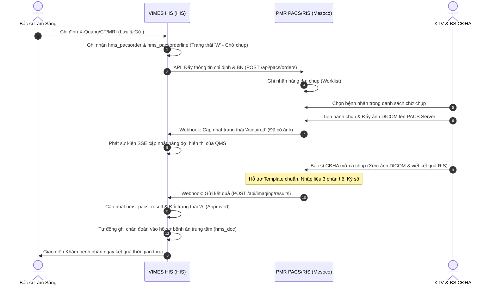

# Phương án và Các bước Tích hợp PMR PACS & RIS trên VIMES HIS

Tài liệu này đề xuất phương án kiến trúc, luồng nghiệp vụ và các bước triển khai tích hợp hệ thống **PMR PACS & RIS (Mesoco)** với nền tảng **VIMES HIS (HIS)**.

---

## 1. Mục tiêu Tích hợp
*   **Thông suốt quy trình:** Bác sĩ lâm sàng chỉ định cận lâm sàng (CĐHA) trên HIS -> Dữ liệu đồng bộ tức thời sang PACS/RIS để kỹ thuật viên chụp và bác sĩ chẩn đoán hình ảnh đọc kết quả.
*   **Đồng bộ kết quả tự động:** Kết quả (Mô tả, Kết luận, Ảnh Key Image/Link DICOM) từ PACS/RIS tự động đẩy về bệnh án điện tử (EMR) trên HIS.
*   **Trải nghiệm người dùng tốt nhất:** Bác sĩ CĐHA có thể mở trình xem ảnh DICOM trực tiếp từ giao diện VIMES HIS mà không cần đăng nhập lại (Single Sign-On - SSO).
*   **Cập nhật hàng đợi thời gian thực:** Đồng bộ trạng thái hàng đợi phòng chụp giữa hệ thống QMS VIMES HIS và PACS Worklist.

---

## 2. Kiến trúc & Phương án Tích hợp

Chúng ta có 3 phương án tích hợp chính dựa trên mức độ can thiệp vào hệ thống của hai bên:

### Phương án 1: Tích hợp qua RESTful API & Webhooks (Đề xuất & Khuyên dùng)
VIMES HIS HIS và PMR PACS/RIS giao tiếp với nhau thông qua hệ thống API bảo mật sử dụng JWT Token.
*   **HIS -> PACS (Đồng bộ chỉ định):** Khi bác sĩ lâm sàng lưu chỉ định CĐHA, VIMES HIS gọi API của PMR PACS để đẩy thông tin bệnh nhân và dịch vụ chỉ định sang.
*   **PACS/RIS -> HIS (Đồng bộ kết quả):** Khi bác sĩ CĐHA duyệt kết quả trên RIS, hệ thống RIS của PMR gọi Webhook của VIMES HIS (`POST /api/imaging/results`) để cập nhật kết quả và ảnh đại diện vào cơ sở dữ liệu VIMES HIS.
*   **PACS Viewer:** VIMES HIS nhúng trình xem ảnh của PMR PACS qua thẻ `<iframe>` bảo mật hoặc mở tab mới kèm mã xác thực Token định danh phiên làm việc (SSO).
*   *Đánh giá:* Tối ưu về mặt hiệu năng, dễ triển khai, kiểm soát lỗi tốt, giao diện đồng bộ.

### Phương án 2: Tích hợp tiêu chuẩn HL7 V2 & DICOM Modality Worklist (MWL)
Sử dụng các tiêu chuẩn y tế quốc tế để giao tiếp.
*   **HIS -> PACS (Worklist):** VIMES HIS chạy một dịch vụ DICOM Worklist SCP (hoặc HL7 ORM Listener). Máy chụp (Modality) hoặc PACS sẽ query danh sách chờ chụp qua giao thức DICOM MWL Query.
*   **PACS/RIS -> HIS (Kết quả):** PMR RIS gửi thông điệp HL7 ORU (Observation Result) chứa mô tả và kết luận chẩn đoán về VIMES HIS HIS. VIMES HIS phân tích cú pháp HL7 để cập nhật vào EMR.
*   *Đánh giá:* Chuẩn hóa quốc tế, độc lập vendor, tuy nhiên thời gian triển khai lâu hơn và đòi hỏi cấu hình hạ tầng mạng/phần mềm DICOM trung gian (DICOM Router/Broker).

### Phương án 3: Tích hợp mức Cơ sở Dữ liệu (Database Link)
Hai hệ thống chia sẻ hoặc đồng bộ trực tiếp dữ liệu qua các bảng tạm hoặc database link (ví dụ: PostgreSQL Foreign Data Wrappers - FDW hoặc SQL Server Linked Server).
*   *Đánh giá:* Không khuyến khích do tính bảo mật kém, dễ gây xung đột khóa/deadlock và phụ thuộc chặt chẽ vào cấu trúc database của nhau khi nâng cấp phiên bản.

---

## 3. Luồng dữ liệu chi tiết (Workflow)

---

## 4. Các bước triển khai cụ thể

### Bước 1: Thống nhất đặc tả API và Đồng bộ Danh mục
*   Đồng bộ danh mục Modality (X-Quang, CT, MRI, Siêu âm,...) giữa HIS và PACS.
*   Đồng bộ danh mục Dịch vụ kỹ thuật (Mã dịch vụ từ HIS tương ứng với mã chụp/quy trình trên PACS).
*   Định nghĩa cấu trúc JWT Token để thực hiện SSO từ VIMES HIS sang PMR PACS Viewer.

### Bước 2: Nâng cấp và Phát triển Backend VIMES HIS
*   **API Nhận kết quả:** Hoàn thiện API `/api/imaging/results` trong [qms.controller.ts](file:///d:/AI/VIMES HIS/backend/src/controllers/qms/qms.controller.ts) để tiếp nhận đầy đủ thông tin từ RIS gửi sang:
    *   `technique` (Kỹ thuật khảo sát)
    *   `findings` (Mô tả hình ảnh)
    *   `conclusion` (Kết luận)
    *   `imageUrl` / `pacsStudyURL` (Đường dẫn xem ảnh DICOM hoặc ảnh đại diện)
*   **Trình đồng bộ chỉ định (Sync Worker):** Viết Background Service lắng nghe thay đổi của bảng `hms_pacsorderline` để tự động đẩy chỉ định mới sang PMR PACS.

### Bước 3: Hoàn thiện Giao diện Frontend VIMES HIS (RIS/PACS Module)
*   **PACS Worklist:** Cập nhật màn hình [WorklistView.tsx](file:///d:/AI/VIMES HIS/modules/imaging-results/views/WorklistView.tsx) kết nối trực tiếp với API thật thay vì dữ liệu mock.
*   **SSO Link:** Tích hợp nút "Mở PACS Viewer" trong [ReadingView.tsx](file:///d:/AI/VIMES HIS/modules/imaging-results/views/ReadingView.tsx) tạo URL có kèm token tự động đăng nhập vào cổng PMR PACS.
*   **RIS Report Entry:** Cập nhật giao diện soạn thảo kết quả, tích hợp thư viện mẫu kết quả chuẩn từ [ConfigurationView.tsx](file:///d:/AI/VIMES HIS/modules/imaging-results/views/ConfigurationView.tsx) để bác sĩ CĐHA chọn nhanh.

### Bước 4: Kiểm thử liên thông (Integration Testing)
*   Chạy giả lập các ca chỉ định từ Phòng khám Lâm sàng -> Đẩy sang PACS.
*   Giả lập đẩy tệp DICOM lên PACS, tạo kết quả giả lập từ RIS gửi về HIS.
*   Kiểm tra tính toàn vẹn dữ liệu trong cơ sở dữ liệu HIS (bảng `hms_pacs_result`, `hms_pacsorderline`, `hms_doc`).

### Bước 5: Triển khai thực tế & Giám sát (Deployment & Monitoring)
*   Cấu hình thông số kết nối (PACS URL, API Keys) trong file cấu hình `.env` của hệ thống.
*   Triển khai thực tế tại bệnh viện, giám sát log lỗi đồng bộ qua hệ thống Audit Logs của VIMES HIS.
