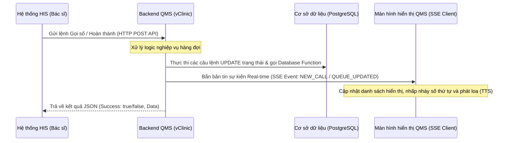

# Hướng dẫn Tích hợp Hệ thống Gọi số (QMS) với Hệ thống HIS

Tài liệu này cung cấp chi tiết kỹ thuật để tích hợp hệ thống Thông tin Bệnh viện (HIS) với Module Điều phối và Gọi số hàng đợi (QMS) của vClinic. Việc tích hợp giúp bác sĩ có thể thao tác gọi số trực tiếp trên phần mềm HIS, đồng thời đồng bộ trạng thái hiển thị thời gian thực lên các màn hình hiển thị (Display Screen) ngoài phòng khám.

---

## 1. Kiến trúc luồng xử lý (Workflow Architecture)

Sự tương tác giữa các hệ thống được thực hiện qua mô hình sau:



---

## 2. Mô hình Dữ liệu Hàng đợi (Database Schema)

Module QMS sử dụng bảng dữ liệu tiếp nhận dùng chung **`hms_exam_pending`** trong cơ sở dữ liệu PostgreSQL để quản lý hàng đợi.

### Chi tiết các trường thông tin trong bảng `hms_exam_pending`:

| Tên Trường | Kiểu Dữ Liệu | Ý Nghĩa / Mô Tả |
| :--- | :--- | :--- |
| `hep_docno` | `INTEGER` / `NUMERIC` | Mã số tiếp nhận / Hồ sơ khám bệnh (`hd_docno` từ HIS) |
| `hep_receptno` | `INTEGER` | Số thứ tự hàng đợi cấp cho bệnh nhân (Ví dụ: `1`, `2`, `3`...) |
| `hep_receptidx` | `INTEGER` | Chỉ số tiếp nhận phân biệt giữa các lần chuyển phòng khám trong ngày |
| `hep_deptid` | `VARCHAR` | Mã khoa lâm sàng (Ví dụ: `KB` - Khoa khám bệnh, `KBYC`...) |
| `hep_roomid` | `INTEGER` | ID phòng khám / ID quầy tiếp nhận (`hrl_id` từ `hms_roomlist`) |
| `hep_date` | `DATE` | Ngày tạo vé (Mặc định lọc theo ngày hiện tại: `CURRENT_DATE`) |
| `hep_pending` | `CHAR(1)` | **Trạng thái hàng đợi:**<br>• `'O'` (Open): Đang chờ khám.<br>• `'C'` (Calling): Đang gọi / Đang phục vụ.<br>• `'A'` (Accepted): Đã hoàn thành khám hoặc đã bỏ qua. |
| `hep_type` | `CHAR(1)` | Loại hàng đợi:<br>• `'E'` (Examination): Khám lâm sàng.<br>• `'I'` (Paraclinic/Execution): Thực hiện dịch vụ kỹ thuật (Xét nghiệm, CĐHA...) |
| `hep_callstatus` | `VARCHAR` | Trạng thái phụ (`'PRIORITY'` nếu là bệnh nhân diện ưu tiên) |

### Hàm xử lý nội bộ cơ sở dữ liệu:
Backend QMS khi gọi bệnh nhân vào phòng khám sẽ thực thi stored procedure:
```sql
SELECT hms_exam_pending_call(hep_docno, hep_deptid, hep_roomid, hep_receptidx, 'O');
```

---

## 3. Danh sách các API Tích hợp (API Reference)

**Base URL:** `http://<SERVER_IP>:<PORT>/api` (Mặc định Port là `3000`)  
**Content-Type:** `application/json`

> [!IMPORTANT]
> **Quy định tránh trùng lặp số giữa các Khoa (Department Collision):**
> Ở các bệnh viện lớn, `counterId` (hay `hep_roomid`) và số thứ tự bệnh nhân `receptNo` có thể bị trùng lặp giữa các khoa khác nhau (Ví dụ: Phòng khám 101 của Khoa Khám Bệnh và Phòng khám 101 của Khoa Sản).
> Do đó, **bắt buộc truyền thêm tham số `deptId` (hoặc `hep_deptid`)** trong tất cả các lệnh gọi để hệ thống xác định chính xác hàng đợi cần xử lý.

---

### 3.1. Gọi bệnh nhân tiếp theo (Call Next)
Bác sĩ nhấn nút để gọi bệnh nhân tiếp theo trong danh sách chờ của phòng khám/khoa tương ứng.

- **URL:** `/queue/call-next`
- **Method:** `POST`
- **Request Body:**
  ```json
  {
    "counterId": 105,       // ID phòng khám / Quầy (hep_roomid)
    "deptId": "KB",         // Mã khoa (hep_deptid) - BẮT BUỘC để tránh trùng phòng khoa khác
    "isPriority": false,    // Ưu tiên gọi người lớn tuổi (>= 75 tuổi) trước hay không
    "type": "EXECUTION"     // Loại hàng đợi ("EXECUTION" cho phòng kỹ thuật, hoặc null cho phòng khám thường)
  }
  ```
  *Chú thích tham số:*
  - `counterId` hoặc `roomId` hoặc `hep_roomid` *(Bắt buộc - number)*: ID phòng khám.
  - `deptId` hoặc `hep_deptid` *(Bắt buộc - string)*: Mã khoa.

- **Response (Khi có bệnh nhân tiếp theo):**
  ```json
  {
    "success": true,
    "data": {
      "id": "1002344-5",
      "ticket_number": 5,
      "patient_name": "NGUYỄN VĂN MẪU",
      "is_priority": false,
      "created_at": "2026-06-23T00:00:00.000Z",
      "doc_no": 1002344,
      "dept_code": "KB",
      "room_id": 105,
      "status": "CALLING"
    }
  }
  ```
- **Response (Khi không còn bệnh nhân nào đang chờ):**
  ```json
  {
    "success": true,
    "message": "Hết bệnh nhân đang chờ",
    "data": null
  }
  ```

---

### 3.2. Gọi số chỉ định cụ thể (Call Specific)
Dùng khi bác sĩ muốn gọi lại hoặc gọi đích danh một bệnh nhân cụ thể.

- **URL:** `/queue/call-specific`
- **Method:** `POST`
- **Request Body (Khuyên dùng cho HIS):**
  ```json
  {
    "docNo": 1002344,       // Số tiếp nhận của bệnh nhân (hep_docno)
    "receptNo": 5,          // Số thứ tự cấp của bệnh nhân (hep_receptno)
    "deptId": "KB",         // Mã khoa (hep_deptid) - Bắt buộc để tránh trùng lặp
    "counterId": 105        // ID phòng khám gọi vào (hep_roomid)
  }
  ```
- **Response:**
  ```json
  {
    "success": true,
    "data": {
      "id": "1002344-5",
      "ticket_number": 5,
      "patient_name": "NGUYỄN VĂN MẪU",
      "status": "CALLING",
      "doc_no": 1002344,
      "dept_code": "KB",
      "room_id": 105
    }
  }
  ```

---

### 3.3. Gọi nhắc lại loa (Call Again)
Bắn lại bản tin âm thanh gọi số thứ tự hiện tại lên loa phát thanh (nhắc lại lượt gọi mà không đổi trạng thái của phòng khám).

- **URL:** `/queue/call-again`
- **Method:** `POST`
- **Request Body (Khuyên dùng cho HIS):**
  ```json
  {
    "docNo": 1002344,
    "receptNo": 5,
    "deptId": "KB"
  }
  ```
- **Response:** Tương tự như API **Call Specific**.

---

### 3.4. Hoàn thành lượt khám (Complete)
Cập nhật trạng thái bệnh nhân hiện tại sang đã khám xong để giải phóng phòng khám.

- **URL:** `/queue/complete`
- **Method:** `POST`
- **Request Body (Khuyên dùng cho HIS):**
  ```json
  {
    "counterId": 105,       // ID phòng khám (hep_roomid)
    "deptId": "KB",         // Mã khoa (hep_deptid)
    "docNo": 1002344,       // Số tiếp nhận (hep_docno)
    "receptNo": 5           // Số thứ tự (hep_receptno)
  }
  ```
- **Response:**
  ```json
  {
    "success": true
  }
  ```

---

### 3.5. Bỏ qua lượt / Báo vắng (Skip)
Cập nhật trạng thái của bệnh nhân sang đã qua lượt (vắng mặt). Trạng thái chuyển đổi của `hep_pending` sẽ là `'A'`.

- **URL:** `/queue/skip`
- **Method:** `POST`
- **Request Body (Khuyên dùng cho HIS):**
  ```json
  {
    "docNo": 1002344,
    "receptNo": 5,
    "deptId": "KB"
  }
  ```
- **Response:**
  ```json
  {
    "success": true
  }
  ```

---

### 3.6. Chuyển phòng khám / Chuyển chỉ định (Transfer)
Chuyển bệnh nhân cùng mã tiếp nhận sang hàng đợi của một phòng khám hoặc phòng chức năng khác.

- **URL:** `/queue/transfer`
- **Method:** `POST`
- **Request Body (Khuyên dùng cho HIS):**
  ```json
  {
    "docNo": 1002344,
    "receptNo": 5,
    "deptId": "KB",           // Khoa hiện tại
    "targetRoomId": 108,      // ID phòng mới muốn chuyển bệnh nhân đến
    "notes": "Chuyển phòng siêu âm"
  }
  ```
- **Response:**
  ```json
  {
    "success": true
  }
  ```

---

## 4. Tích hợp Real-time Screen & Loa phát thanh (SSE Stream)

Các màn hình LCD hiển thị hàng đợi sử dụng luồng sự kiện **Server-Sent Events (SSE)** để lắng nghe thông báo. Đối với hệ thống HIS, bạn không cần gọi trực tiếp đến kênh này, QMS Backend sẽ tự động phát sóng. Tuy nhiên, nếu HIS có ứng dụng riêng cần nghe thông tin gọi số để cập nhật giao diện riêng, có thể kết nối vào:

**SSE URL:** `http://<SERVER_IP>:<PORT>/api/queue/events`

### Bản tin sự kiện dạng SSE:
Khi có cuộc gọi mới (`call-next`, `call-specific`, `call-again`):
```text
event: message
data: {
  "type": "NEW_CALL",
  "areaId": 1,
  "ticket": {
    "id": "1002344-5",
    "ticket_number": 5,
    "patient_name": "NGUYỄN VĂN MẪU",
    "room_id": 105,
    "status": "CALLING"
  },
  "counterId": 105,
  "counterName": "Phòng khám Nội 01"
}
```

---

## 5. Ví dụ mã nguồn Tích hợp cho các Ngôn ngữ lập trình (Sử dụng dữ liệu cấu trúc gốc từ HIS)

### 5.1. Ví dụ cURL
```bash
# Thực hiện gọi chỉ định số thứ tự 5 có hồ sơ 1002344 tại khoa KB vào phòng khám 105
curl -X POST http://127.0.0.1:3000/api/queue/call-specific \
  -H "Content-Type: application/json" \
  -d '{
    "docNo": 1002344,
    "receptNo": 5,
    "deptId": "KB",
    "counterId": 105
  }'
```

### 5.2. Ví dụ C# (.NET)
```csharp
using System;
using System.Net.Http;
using System.Text;
using System.Text.Json;
using System.Threading.Tasks;

public class QmsClient
{
    private static readonly HttpClient _httpClient = new HttpClient();
    private readonly string _qmsBaseUrl;

    public QmsClient(string serverIp, int port = 3000)
    {
        _qmsBaseUrl = $"http://{serverIp}:{port}/api/queue";
    }

    public async Task<string> CallSpecificPatient(int docNo, int receptNo, string deptId, int roomId)
    {
        var url = $"{_qmsBaseUrl}/call-specific";
        var payload = new
        {
            docNo = docNo,          // hep_docno
            receptNo = receptNo,    // hep_receptno
            deptId = deptId,        // hep_deptid
            counterId = roomId      // hep_roomid
        };

        var content = new StringContent(JsonSerializer.Serialize(payload), Encoding.UTF8, "application/json");
        var response = await _httpClient.PostAsync(url, content);
        
        response.EnsureSuccessStatusCode();
        return await response.Content.ReadAsStringAsync();
    }
}
```

### 5.3. Ví dụ Java
```java
import java.net.URI;
import java.net.http.HttpClient;
import java.net.http.HttpRequest;
import java.net.http.HttpResponse;
import java.net.http.HttpRequest.BodyPublishers;

public class QmsService {
    private final HttpClient client = HttpClient.newHttpClient();
    private final String baseUrl = "http://localhost:3000/api/queue";

    public void completeTicketDirect(int roomId, String deptId, int docNo, int receptNo) throws Exception {
        String url = baseUrl + "/complete";
        String jsonPayload = String.format(
            "{\"counterId\": %d, \"deptId\": \"%s\", \"docNo\": %d, \"receptNo\": %d}", 
            roomId, deptId, docNo, receptNo
        );

        HttpRequest request = HttpRequest.newBuilder()
                .uri(URI.create(url))
                .header("Content-Type", "application/json")
                .POST(BodyPublishers.ofString(jsonPayload))
                .build();

        HttpResponse<String> response = client.send(request, HttpResponse.BodyHandlers.ofString());
        if (response.statusCode() == 200) {
            System.out.println("Hoàn thành lượt khám thành công.");
        } else {
            System.err.println("Lỗi từ máy chủ QMS: " + response.statusCode());
        }
    }
}
```

---

*Lưu ý: Mọi thắc mắc hoặc cần tùy biến thêm cấu trúc dữ liệu trả về, vui lòng liên hệ đội ngũ phát triển vClinic để được cập nhật.*
