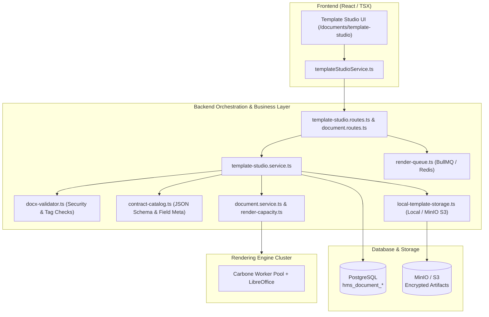

# Báo cáo Review Chi tiết: Phân hệ Document Engine & Template Studio

> **Dự án:** VIMES Hospital Information System (VIMES_HIS)  
> **Module:** Document Engine & Template Studio (`modules/document-engine`)  
> **Ngày đánh giá:** 12/08/2026  
> **Trạng thái:** Sẵn sàng cho Staging & Production (Production-Ready)

---

## 1. Tổng quan Kiến trúc & Phạm vi Module (Architecture Overview)

Module **Document Engine & Template Studio** giải quyết bài toán cốt lõi trong hệ thống HIS: **Thiết kế, kiểm thử, quản lý phiên bản và kết xuất tài liệu y tế** (Đơn thuốc, Phiếu xét nghiệm, Giấy ra viện, Bệnh án ngoại trú, Tờ điều trị, v.v.) bằng **Microsoft Word (.docx)** kết hợp công nghệ render **Carbone v5 + LibreOffice** sang định dạng **PDF/DOCX**.

---

## 2. Các điểm mạnh nổi bật (Key Strengths & Best Practices)

### 🛡️ 2.1. Bảo mật & An toàn dữ liệu (Security-by-Design)
- **Chống ZIP Slip & Path Traversal:** File `.docx` được đọc qua ZIP streaming/extraction tùy biến (`readEntries` & `extract` trong [`backend/src/template-studio/docx-validator.ts`](file:///d:/AI/VIMES_HIS/backend/src/template-studio/docx-validator.ts)), kiểm tra đường dẫn an toàn, chặn tuyệt đối `..` và prefix ngoài thư mục root.
- **Chống tấn công từ chối dịch vụ (ZIP Bomb / Memory Exhaustion):** Giới hạn DOCX tối đa 20MB, số lượng entry $\le$ 2,000, XML uncompressed $\le$ 10MB/entry và tổng giải nén $\le$ 100MB.
- **Vô hiệu hóa Active Content độc hại:** Chủ động quét và chặn các file chứa Macro/OLE như `vbaproject.bin`, `/embeddings/`, `.ole`.
- **Phòng chống Prototype Pollution:** Hàm `assertSafeData` trong [`backend/src/document-engine/document.service.ts`](file:///d:/AI/VIMES_HIS/backend/src/document-engine/document.service.ts) chặn các key nhạy cảm `__proto__`, `prototype`, `constructor`, giới hạn độ sâu JSON $\le$ 12 cấp và tối đa 2,000 phần tử mảng.

### 🔄 2.2. Vòng đời Biểu mẫu & Kiểm soát Phân quyền (Governance & Lifecycle)
- **State Machine nghiêm ngặt:** `DRAFT ➔ IN_REVIEW ➔ APPROVED ➔ PUBLISHED ➔ RETIRED`.
- **Nguyên tắc Phân tách nhiệm vụ (Segregation of Duties - SoD):** Ngăn chặn người tạo mẫu tự phê duyệt (`row.created_by !== actor`) trong môi trường production.
- **Quality Gatekeeper:** Bắt buộc tất cả các test case cấu hình `isRequired: true` phải có trạng thái `PASSED` thì mới cho phép gửi duyệt (`IN_REVIEW`).
- **Phát hiện xung đột & Tương thích Font:** Validator phân tích font trong `word/fonttable.xml` và cảnh báo nếu sử dụng các font không tương thích máy chủ Linux/Docker Carbone; kiểm tra kiểu dữ liệu của tag (chặn dùng tag scalar cho mảng mà thiếu `[i]`, kiểm tra formatter số/ngày).
- **Rollback an toàn & Cache Invalidation:** Rollback chỉ trỏ lại con trỏ `active_version_id` mà không làm thay đổi các artifact đã phát hành, đồng thời tự động gọi `templateRegistry.invalidate(code)` để đồng bộ ngay lập tức.

### ⚡ 2.3. Hiệu năng, Concurrency & Hàng đợi (Resilience & Scalability)
- **Quản lý Concurrency & Overload:** [`backend/src/document-engine/render-capacity.ts`](file:///d:/AI/VIMES_HIS/backend/src/document-engine/render-capacity.ts) giới hạn số luồng render đồng thời (mặc định 8 workers), hàng đợi 200 tasks kèm cơ chế timeout 15 giây và trả mã HTTP `503` kèm header `Retry-After`.
- **Request Coalescing (Deduplication):** Trong [`backend/src/document-engine/document.service.ts`](file:///d:/AI/VIMES_HIS/backend/src/document-engine/document.service.ts), các request render có cùng nội dung data + template version được băm SHA-256; các request trùng lặp trong thời gian đang xử lý sẽ dùng chung một Promise, giảm tải cho cụm Carbone.
- **Phân tách Hàng đợi (Queue Isolation):** Tách biệt luồng in lâm sàng khẩn cấp (`document-production`, priority 1), in hàng loạt (`document-batch`, priority 10) và luồng xem trước của thiết kế viên (`template-studio-preview`). Có Dead-letter queue (`template-studio-preview-dlq`) và worker tái thử.
- **Storage Trừu tượng (Storage Abstraction):** Hỗ trợ chuyển đổi liền mạch giữa `LocalTemplateArtifactStorage` (cho máy Dev) và `S3TemplateArtifactStorage` (MinIO/AWS S3) với cơ chế bảo mật cấp Pre-signed URL thời hạn ngắn (30–900s).

### 📚 2.4. Tuân thủ Quy chuẩn Dự án (Compliance & Documentation)
- **Quy tắc tổ chức tài liệu:** Toàn bộ 14 tài liệu thiết kế, checklist, runbook khôi phục thảm họa, vận hành queue, MinIO runbook đều được đặt đúng quy định tại [`modules/document-engine/docs/`](file:///d:/AI/VIMES_HIS/modules/document-engine/docs/).
- **Quy tắc Migration Database:** Tất cả các thay đổi schema đều được viết trong các migration file tuần tự `047`, `048`, `049`, `050`, `051` có kiểm tra an toàn `IF NOT EXISTS` và tiền tố bảng thống nhất `hms_document_*`.

---

## 3. Các điểm cần lưu ý & Khuyến nghị cải tiến (Observations & Recommendations)

| Vấn đề / Hạng mục | Mức độ | Mô tả chi tiết & Vị trí | Giải pháp khuyến nghị |
|---|---|---|---|
| **Fallback `templateRoot` khi chạy ở Root** | ⚠️ Vừa | Trong [`document.service.ts#L8`](file:///d:/AI/VIMES_HIS/backend/src/document-engine/document.service.ts#L8) & [`template-studio.service.ts#L13`](file:///d:/AI/VIMES_HIS/backend/src/template-studio/template-studio.service.ts#L13): `path.join(process.cwd(), 'templates', 'documents')`. Khi chạy lệnh từ thư mục gốc dự án mà chưa set biến môi trường, đường dẫn sẽ trỏ nhầm sang `./templates/documents` thay vì `./backend/templates/documents`. | Khai báo đường dẫn fallback an toàn: kiểm tra `fs.existsSync(path.join(process.cwd(), 'backend', 'templates', 'documents'))` nếu thư mục gốc không có. |
| **Trạng thái UI khi Redis chưa bật** | ℹ️ Nhẹ | Trên [`TemplateStudioView.tsx#L233`](file:///d:/AI/VIMES_HIS/modules/document-engine/views/TemplateStudioView.tsx#L233), nút **"Queue PDF"** luôn hiển thị. Khi hệ thống chạy ở chế độ dev không có Redis, ấn vào sẽ nhận thông báo lỗi từ backend. | Tận dụng kết quả từ endpoint `GET /api/v1/template-studio/health` (`queueEnabled`) để ẩn hoặc disable nút "Queue PDF" nếu Redis đang ở trạng thái `disabled`/`down`. |
| **Dọn dẹp File Preview tạm thời (Retention)** | ℹ️ Nhẹ | Các bản preview tạo ra trong quá trình kiểm thử lưu tại `queue-previews/` hoặc local storage sẽ tích tụ theo thời gian nếu không có tác vụ định kỳ dọn dẹp. | Lên lịch chạy định kỳ script [`backend/scripts/cleanup-preview-artifacts.ts`](file:///d:/AI/VIMES_HIS/backend/scripts/cleanup-preview-artifacts.ts) thông qua Cron job/Schedule của hệ thống. |
| **Phân trang Lịch sử Test Runs & Audit** | ℹ️ Nhẹ | Trong [`template-studio.repository.ts#L168`](file:///d:/AI/VIMES_HIS/backend/src/template-studio/template-studio.repository.ts#L168), hàm `listAudit` và `listTestRuns` đang fix `LIMIT 200` và `LIMIT 100`. | Khi số lượng test run lớn sau thời gian dài sử dụng, nên bổ sung cursor/offset pagination cho UI Test Lab và Audit Tab. |

---

## 4. Đánh giá Tổng thể & Chấm điểm

| Tiêu chí | Đánh giá / Điểm (Thang 10) |
|---|---|
| **1. Kiến trúc & Thiết kế hệ thống** | **9.5 / 10** (Rõ ràng, phân tách trách nhiệm tốt) |
| **2. An toàn & Bảo mật (Security)** | **9.5 / 10** (Phòng thủ đa lớp: Zip Slip, Bomb, Proto pollution) |
| **3. Xử lý tải & Khả năng mở rộng** | **9.0 / 10** (Queue cách ly + Worker Pool + Capacity limit) |
| **4. Trải nghiệm & Giao diện (UI/UX)** | **9.0 / 10** (Test Lab, Field Catalog, Diff, Audit đầy đủ) |
| **5. Tài liệu & Runbook (Docs)** | **10.0 / 10** (Bộ 14 runbooks và checklist chi tiết) |
| **6. Unit Test & Coverage** | **9.0 / 10** (Bao phủ đầy đủ validator, storage, workflow) |
| **TỔNG ĐIỂM TRUNG BÌNH** | **9.3 / 10** (XUẤT SẮC / PRODUCTION-READY) |
