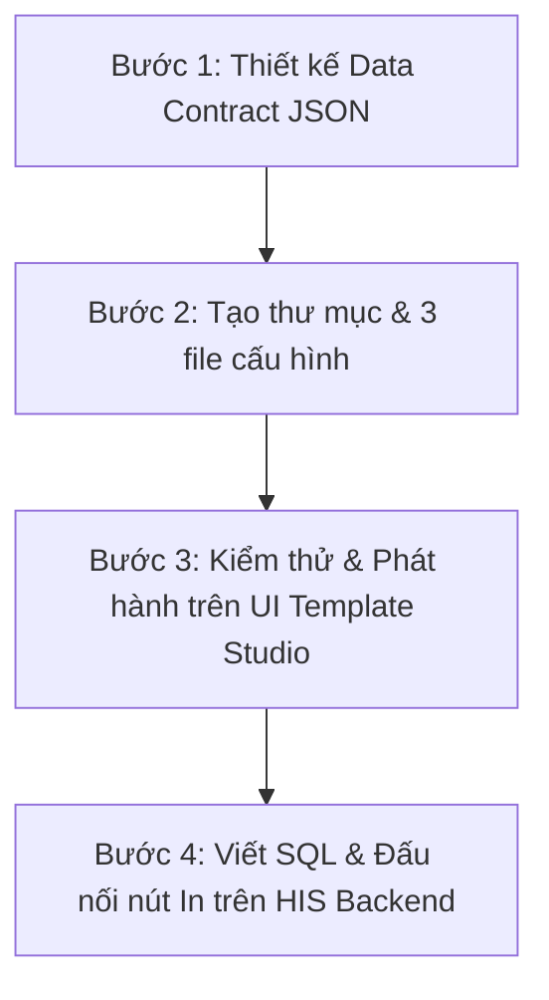

# HƯỚNG DẪN TẠO MỚI MỘT MẪU BIỂU TRONG HỆ THỐNG VIMES HIS
## (HOW TO CREATE & INTEGRATE A NEW DOCUMENT TEMPLATE)

---

## 📌 MỤC LỤC
1. [Tổng quan quy trình](#1-tổng-quan-quy-trình)
2. [Bước 1: Thiết kế cấu trúc dữ liệu (Data Contract & JSON Schema)](#2-bước-1-thiết-kế-cấu-trúc-dữ-liệu-data-contract--json-schema)
3. [Bước 2: Chuẩn bị 3 file cấu hình mẫu](#3-bước-2-chuẩn-bị-3-file-cấu-hình-mẫu)
   - [3.1. File `manifest.json`](#31-file-manifestjson)
   - [3.2. File `sample-data.json`](#32-file-sample-datajson)
   - [3.3. File Word mẫu `template.docx`](#33-file-word-mẫu-templatedocx)
4. [Bước 3: Quản lý & Phát hành trên UI Template Studio](#4-bước-3-quản-lý--phát-hành-trên-ui-template-studio)
5. [Bước 4: Viết câu lệnh SQL & Đấu nối Backend Controller](#5-bước-4-viết-câu-lệnh-sql--đấu-nối-backend-controller)
6. [Mẹo nâng cao cho bảng biểu phức tạp (Bảng kê viện phí)](#6-mẹo-nâng-cao-cho-bảng-biểu-phức-tạp-bảng-kê-viện-phí)

---

## 1. Tổng quan quy trình

Để tích hợp một mẫu biểu hoàn toàn mới vào hệ thống VIMES HIS (ví dụ: **"Bảng kê chi phí khám chữa bệnh / Viện phí"** — mã `BILLING_SUMMARY`), bạn chỉ cần thực hiện 4 bước tiêu chuẩn:



---

## 2. Bước 1: Thiết kế cấu trúc dữ liệu (Data Contract & JSON Schema)

Xác định toàn bộ các thông tin cần hiển thị trên biểu mẫu:

* 🏥 **Thông tin bệnh viện**: Tên cơ sở, mã số thuế, địa chỉ, khoa phòng (`hospital.name`, `hospital.department`...).
* 👤 **Thông tin người bệnh**: Mã bệnh nhân, Họ tên, Ngày sinh, Giới tính, Địa chỉ, Số thẻ BHYT, Mức hưởng BHYT (`patient.*`).
* 🩺 **Thông tin đợt khám / điều trị**: Số bệnh án, Ngày vào, Ngày ra, Số ngày điều trị, Khoa điều trị, Chẩn đoán ICD-10 (`stay.*`).
* 📑 **Bảng chi tiết chi phí (Phân nhóm 2 cấp)**:
  - Tên nhóm: *1. Khám bệnh, 2. Xét nghiệm, 3. CĐHA, 4. Thuốc, 5. Phẫu thuật thủ thuật, 6. Tiền giường...* (`feeGroups[i].groupName`).
  - Chi tiết từng dịch vụ: Tên dịch vụ, ĐVT, Số lượng, Đơn giá, Thành tiền, Tiền BHYT chi trả, Tiền Người bệnh trả (`feeGroups[i].items[j].*`).
* 💰 **Tổng kết tài chính**: Tổng chi phí, BHYT chi trả, Người bệnh trả, Tạm ứng, Số tiền hoàn lại/thu thêm (`summary.*`).
* ✍️ **Chữ ký**: Người lập bảng kê, Thu ngân, Người bệnh/Thân nhân (`signatures.*`).

---

## 3. Bước 2: Chuẩn bị 3 file cấu hình mẫu

Tạo một thư mục mới tại đường dẫn:
```
backend/templates/documents/<TÊN_MÃ_MẪU>/v1/
```
*Ví dụ:* `backend/templates/documents/BILLING_SUMMARY/v1/`

### 3.1. File `manifest.json`
Khai báo mã mẫu, tên hiển thị, phiên bản và trạng thái ban đầu:

```json
{
  "code": "BILLING_SUMMARY",
  "name": "Bảng kê chi phí khám chữa bệnh (Viện phí)",
  "version": 1,
  "file": "template.docx",
  "documentType": "BILLING_SUMMARY",
  "status": "published"
}
```

---

### 3.2. File `sample-data.json`
Chứa dữ liệu mẫu chuẩn theo cấu trúc đã thiết kế ở Bước 1. Hệ thống sẽ tự động đọc file này để:
1. Sinh ra **Từ điển trường dữ liệu (Field Catalog)** và các tag Carbone.
2. Cung cấp dữ liệu mẫu cho **Phòng kiểm thử (Test Lab)**.

```json
{
  "hospital": {
    "name": "BỆNH VIỆN ĐA KHOA VIMES",
    "code": "01005",
    "department": "PHÒNG TÀI CHÍNH KẾ TOÁN"
  },
  "document": {
    "number": "BK-2026-001289",
    "createdDate": "12/08/2026"
  },
  "patient": {
    "code": "BN000125",
    "fullName": "NGUYỄN VĂN AN",
    "dob": "15/08/1980",
    "gender": "Nam",
    "address": "Phường Tràng Tiền, Quận Hoàn Kiếm, Hà Nội",
    "insuranceNumber": "DN4010123456789",
    "insuranceRate": "80%"
  },
  "stay": {
    "admittedAt": "08/08/2026 08:30",
    "dischargedAt": "12/08/2026 15:00",
    "totalDays": 5,
    "department": "KHOA NỘI TIM MẠCH",
    "diagnosis": "I10 - Tăng huyết áp độ 2"
  },
  "feeGroups": [
    {
      "i": 1,
      "groupName": "I. Tiền khám bệnh",
      "groupTotal": 150000,
      "items": [
        { "j": 1, "name": "Khám chuyên khoa Tim mạch", "unit": "Lần", "quantity": 1, "price": 150000, "amount": 150000, "bhytAmount": 120000, "patientAmount": 30000 }
      ]
    },
    {
      "i": 2,
      "groupName": "II. Xét nghiệm",
      "groupTotal": 450000,
      "items": [
        { "j": 1, "name": "Tổng phân tích tế bào máu ngoại vi", "unit": "Lần", "quantity": 1, "price": 100000, "amount": 100000, "bhytAmount": 80000, "patientAmount": 20000 },
        { "j": 2, "name": "Sinh hóa máu (Glucose, Ure, Creatinin)", "unit": "Lần", "quantity": 1, "price": 350000, "amount": 350000, "bhytAmount": 280000, "patientAmount": 70000 }
      ]
    }
  ],
  "summary": {
    "totalAmount": 600000,
    "bhytPaid": 480000,
    "patientPaid": 120000,
    "deposit": 500000,
    "refundAmount": 380000,
    "amountInWords": "Sáu trăm nghìn đồng chẵn."
  },
  "signatures": {
    "cashier": "NGUYỄN THỊ THU HẰNG",
    "accountant": "TRẦN VĂN MINH"
  }
}
```

---

### 3.3. File Word mẫu `template.docx`
1. Mở Microsoft Word, thiết kế mẫu Bảng kê viện phí (khổ A4 dọc hoặc ngang tùy yêu cầu).
2. Đặt các thẻ dữ liệu Carbone tương ứng:
   - Header: `{d.hospital.name}`, `{d.hospital.department}`, Số: `{d.document.number}`.
   - Bệnh nhân: `{d.patient.fullName}`, Mã: `{d.patient.code}`, Thẻ BHYT: `{d.patient.insuranceNumber}`.
   - Dòng tiêu đề nhóm (Lặp cấp 1): `{d.feeGroups[i].groupName}`.
   - Dòng dịch vụ chi tiết (Lặp cấp 2): `{d.feeGroups[i].items[j].name}`, `{d.feeGroups[i].items[j].unit}`, `{d.feeGroups[i].items[j].quantity}`, `{d.feeGroups[i].items[j].price}`, `{d.feeGroups[i].items[j].amount}`, `{d.feeGroups[i].items[j].bhytAmount}`, `{d.feeGroups[i].items[j].patientAmount}`.
   - Tổng cộng: `{d.summary.totalAmount}`, BHYT trả: `{d.summary.bhytPaid}`, Người bệnh trả: `{d.summary.patientPaid}`, Tạm ứng: `{d.summary.deposit}`, Bằng chữ: `{d.summary.amountInWords}`.
3. Lưu lại với tên `template.docx` vào thư mục `backend/templates/documents/BILLING_SUMMARY/v1/`.

---

## 4. Bước 3: Quản lý & Phát hành trên UI Template Studio

1. Mở trình duyệt vào **Staff Dashboard** (`#/staff-dashboard`) ➔ Bấm vào ô **"Thiết lập Mẫu biểu"**.
2. Phân hệ tự động quét và hiển thị mẫu mới:
   > 📑 **Bảng kê chi phí khám chữa bệnh (Viện phí)** `BILLING_SUMMARY · v1`
3. Vào tab **"Trường dữ liệu"**: Kiểm tra các thẻ dữ liệu đã nhận diện đúng.
4. Vào tab **"Test Lab"**: Bấm nút **`Test PDF`** để xem ngay kết quả in thực tế trên trình duyệt.
5. Tiến hành quy trình duyệt & phát hành:
   - Bấm **`Tạo version mới`** nếu cần sửa đổi.
   - Bấm **`Gửi duyệt`** ➔ Reviewer bấm **`Duyệt`** ➔ Quản trị viên bấm **`Phát hành`**.

---

## 5. Bước 4: Viết câu lệnh SQL & Đấu nối Backend Controller

Khi thu ngân hoặc điều dưỡng bấm nút **"In bảng kê chi phí"** trên giao diện Viện phí / Nội trú:

```typescript
// backend/src/controllers/billing/billing-print.controller.ts
import { Request, Response } from 'express';
import { db } from '../../config/database';
import { documentService } from '../../document-engine/document.service';

export async function printBillingStatement(req: Request, res: Response) {
    try {
        const { docNo } = req.params;

        // 1. Câu lệnh SQL truy vấn từ cơ sở dữ liệu VIMES HIS
        const sql = `
            SELECT 
                -- Thông tin bệnh viện
                jsonb_build_object(
                    'name', c.sc_name,
                    'code', c.sc_taxcode,
                    'department', 'PHÒNG TÀI CHÍNH KẾ TOÁN'
                ) AS hospital,

                -- Thông tin bảng kê
                jsonb_build_object(
                    'number', concat('BK-', doc.hd_docno),
                    'createdDate', to_char(CURRENT_DATE, 'DD/MM/YYYY')
                ) AS document,

                -- Thông tin người bệnh
                jsonb_build_object(
                    'code', p.hp_patientno,
                    'fullName', CONCAT_WS(' ', p.hp_surname, p.hp_midname, p.hp_firstname),
                    'dob', to_char(p.hp_birthdate, 'DD/MM/YYYY'),
                    'gender', CASE WHEN p.hp_sex = 'M' THEN 'Nam' ELSE 'Nữ' END,
                    'address', p.hp_addr,
                    'insuranceNumber', doc.hd_cardno,
                    'insuranceRate', '80%'
                ) AS patient,

                -- Thông tin đợt điều trị
                jsonb_build_object(
                    'admittedAt', to_char(doc.hd_admitdate, 'DD/MM/YYYY HH24:MI'),
                    'dischargedAt', to_char(doc.hd_dischargedate, 'DD/MM/YYYY HH24:MI'),
                    'totalDays', COALESCE((doc.hd_dischargedate::date - doc.hd_admitdate::date) + 1, 1),
                    'department', dept.sd_name,
                    'diagnosis', doc.hd_diagnostic
                ) AS stay,

                -- Gom nhóm chi phí viện phí thành mảng feeGroups (Nhóm lặp cấp 1 + Dịch vụ lặp cấp 2)
                (
                    SELECT jsonb_agg(jsonb_build_object(
                        'i', grp.row_no,
                        'groupName', grp.group_name,
                        'groupTotal', grp.total_amount,
                        'items', grp.items
                    ))
                    FROM (
                        SELECT 
                            row_number() OVER () as row_no,
                            fg.hfg_name as group_name,
                            SUM(f.hfe_cost) as total_amount,
                            jsonb_agg(jsonb_build_object(
                                'j', row_number() OVER (),
                                'name', fl.hfl_name,
                                'unit', fl.hfl_unit,
                                'quantity', f.hfe_quantity,
                                'price', f.hfe_unitprice,
                                'amount', f.hfe_cost,
                                'bhytAmount', f.hfe_insamount,
                                'patientAmount', f.hfe_patamount
                            )) as items
                        FROM hms_fee f
                        JOIN hms_feelist fl ON fl.hfl_feeid = f.hfe_itemid
                        LEFT JOIN hms_fee_group fg ON fg.hfg_id = fl.hfl_groupid
                        WHERE f.hfe_docno = doc.hd_docno
                        GROUP BY fg.hfg_name
                    ) grp
                ) AS "feeGroups",

                -- Tổng kết số tiền
                jsonb_build_object(
                    'totalAmount', doc.hd_cost,
                    'bhytPaid', doc.hd_insamount,
                    'patientPaid', doc.hd_patamount,
                    'deposit', doc.hd_deposit,
                    'refundAmount', (doc.hd_deposit - doc.hd_patamount),
                    'amountInWords', hms_money_to_words(doc.hd_cost)
                ) AS summary,

                -- Chữ ký
                jsonb_build_object(
                    'cashier', u.su_fullname,
                    'accountant', 'Phạm Thị Lan'
                ) AS signatures

            FROM hms_doc doc
            JOIN hms_patient p ON p.hp_patientno = doc.hd_patientno
            LEFT JOIN sys_dept dept ON dept.sd_id = doc.hd_deptid
            LEFT JOIN sys_user u ON u.su_userid = doc.hd_cashier
            LEFT JOIN sys_company c ON c.sc_id = 1
            WHERE doc.hd_docno = $1;
        `;

        const result = await db.query(sql, [docNo]);
        if (result.rows.length === 0) {
            return res.status(404).json({ success: false, message: 'Không tìm thấy hồ sơ đợt khám' });
        }

        const billingData = result.rows[0];

        // 2. Gọi Document Engine kết xuất file PDF
        const rendered = await documentService.render({
            templateCode: 'BILLING_SUMMARY',
            outputFormat: 'pdf',
            data: billingData
        });

        // 3. Trả file PDF về trình duyệt để in trực tiếp
        res.setHeader('Content-Type', 'application/pdf');
        res.setHeader('Content-Disposition', `inline; filename="BangKeVienPhi_${docNo}.pdf"`);
        return res.send(rendered.content);

    } catch (error: any) {
        console.error('Lỗi in bảng kê viện phí:', error);
        return res.status(500).json({ success: false, message: error.message });
    }
}
```

---

## 6. Mẹo nâng cao cho bảng biểu phức tạp (Bảng kê viện phí)

1. **Định dạng số tiền có dấu chấm phân cách hàng nghìn**:
   - Sử dụng bộ lọc format của Carbone trong file Word: `{d.feeGroups[i].items[j].amount:formatN('0,0')}` hoặc định dạng sẵn từ câu lệnh SQL.
2. **Định dạng ngày tháng**:
   - Có thể dùng format ngày: `{d.stay.admittedAt:formatD('DD/MM/YYYY')}`.
3. **Ẩn dòng nếu dữ liệu rỗng (Conditional Rendering)**:
   - Ví dụ chỉ hiển thị dòng tiền tạm ứng nếu có tạm ứng: `{d.summary.deposit > 0 ? show : hide}`.

---

*Tài liệu được lưu trữ chính thức tại: `modules/document-engine/docs/HOW_TO_CREATE_NEW_TEMPLATE.md` tuân thủ Quy định Quản lý Tài liệu Dự án VIMES HIS.*
