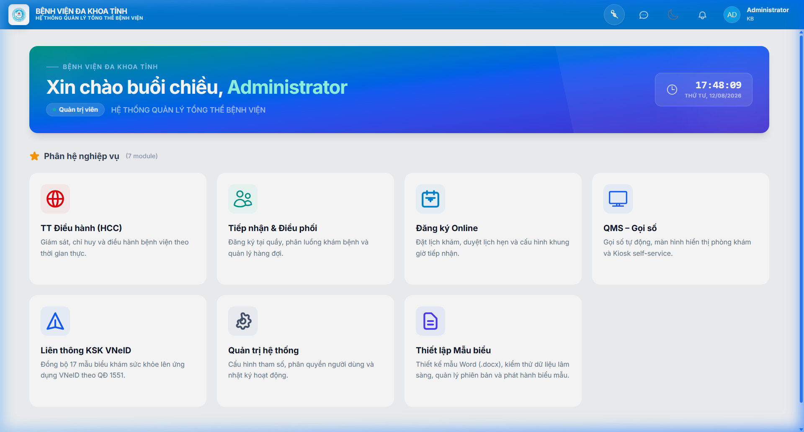
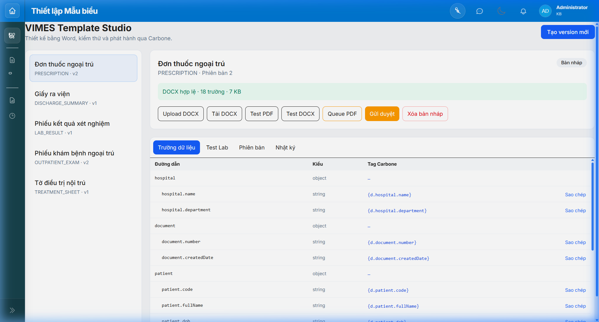
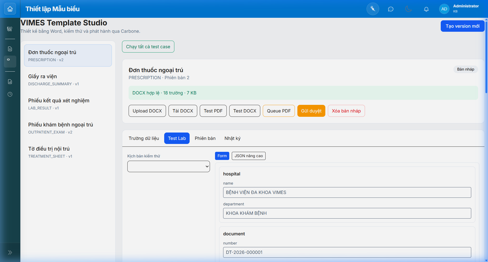
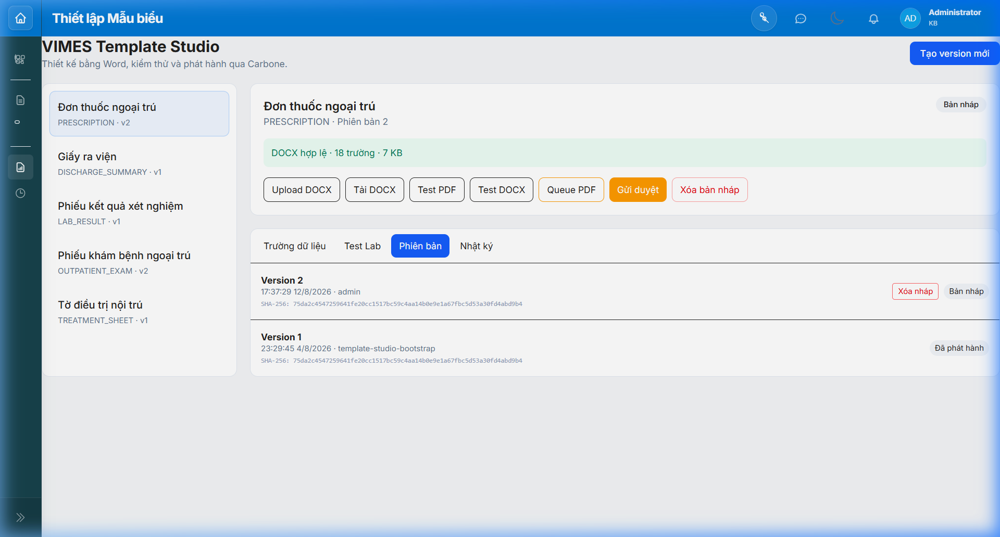
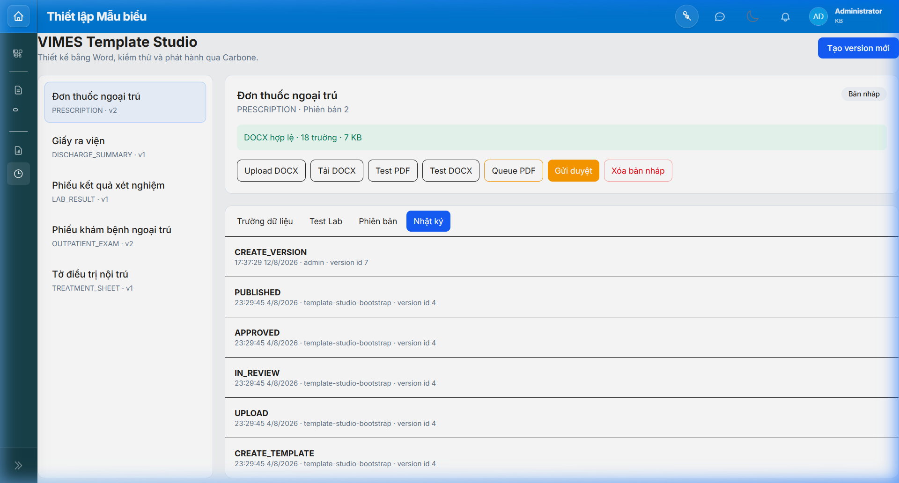
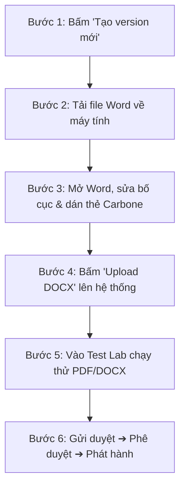

# HƯỚNG DẪN SỬ DỤNG PHÂN HỆ THIẾT LẬP MẪU BIỂU
## (VIMES TEMPLATE STUDIO USER GUIDE)

---

## 📌 MỤC LỤC
1. [Giới thiệu tổng quan](#1-giới-thiệu-tổng-quan)
2. [Phân quyền và Vai trò người dùng](#2-phân-quyền-và-vai-trò-người-dùng)
3. [Truy cập phân hệ từ Dashboard](#3-truy-cập-phân-hệ-từ-dashboard)
4. [Bố cục giao diện làm việc](#4-bố-cục-giao-diện-làm-việc)
5. [Hướng dẫn chi tiết 4 Tab chức năng](#5-hướng-dẫn-chi-tiết-4-tab-chức-năng)
   - [5.1. Tab Trường dữ liệu (Field Catalog)](#51-tab-trường-dữ-liệu-field-catalog)
   - [5.2. Tab Phòng kiểm thử (Test Lab)](#52-tab-phòng-kiểm-thử-test-lab)
   - [5.3. Tab Quản lý phiên bản (Versions)](#53-tab-quản-lý-phiên-bản-versions)
   - [5.4. Tab Nhật ký hoạt động (Audit Log)](#54-tab-nhật-ký-hoạt-động-audit-log)
6. [Quy trình 6 bước thiết kế và phát hành mẫu biểu](#6-quy-trình-6-bước-thiết-kế-và-phát-hành-mẫu-biểu)
7. [Cơ chế Rollback (Phục hồi phiên bản khẩn cấp)](#7-cơ-chế-rollback-phục-hồi-phiên-bản-khẩn-cấp)
8. [Quy chuẩn thiết kế file Word (.docx) & Lưu ý](#8-quy-chuẩn-thiết-kế-file-word-docx--lưu-ý)
9. [Xử lý sự cố thường gặp (FAQ)](#9-xử-lý-sự-cố-thường-gặp-faq)

---

## 1. Giới thiệu tổng quan

**VIMES Template Studio** là phân hệ quản lý và thiết lập biểu mẫu y tế động dành cho Cán bộ kỹ thuật VIMES và Đội ngũ IT Bệnh viện.

Phân hệ cho phép:
* 📄 **Thiết kế mẫu biểu bằng Microsoft Word (.docx)** quen thuộc (kẻ bảng, chèn logo viện, căn lề A4/A5).
* 🏷️ **Tự động gắn thẻ dữ liệu Carbone v5** để kết nối trực tiếp với cơ sở dữ liệu bệnh viện (HIS).
* 🧪 **Phòng kiểm thử lâm sàng (Test Lab)**: Xem trước kết quả PDF/DOCX tức thì với các kịch bản thực tế (bình thường, tên cực dài, nhiều dòng).
* 📋 **Vòng đời quản lý phiên bản chuẩn Enterprise**: Bản nháp (Draft) ➔ Chờ duyệt (In Review) ➔ Đã duyệt (Approved) ➔ Phát hành (Published) ➔ Ngừng sử dụng (Retired).
* 🛡️ **Rollback 1 chạm**: Khôi phục phiên bản trước ngay lập tức khi có sự cố.

---

## 2. Phân quyền và Vai trò người dùng

| Vai trò | Mã quyền hệ thống | Nhiệm vụ & Quyền hạn |
|---|---|---|
| **Designer (Thiết kế)** | `DOCUMENT_TEMPLATE_EDIT` | Tạo bản nháp, tải/upload file Word, chỉnh sửa dữ liệu test, gửi duyệt. |
| **Tester (Kiểm thử)** | `DOCUMENT_TEMPLATE_TEST` | Chạy các kịch bản kiểm thử lâm sàng, xuất file PDF/DOCX thử nghiệm. |
| **Reviewer (Thẩm duyệt)** | `DOCUMENT_TEMPLATE_REVIEW` | Xem xét mẫu biểu, duyệt (`APPROVE`) hoặc trả lại bản nháp (`REJECT`). |
| **Publisher (Phát hành)** | `DOCUMENT_TEMPLATE_PUBLISH` | Phát hành phiên bản ra toàn viện (`PUBLISH`), thực hiện `ROLLBACK`. |
| **Quản trị viên (Admin)** | `DOCUMENT_TEMPLATE_ADMIN` / `admin` | Toàn quyền thao tác trên tất cả các mẫu biểu của bệnh viện. |

---

## 3. Truy cập phân hệ từ Dashboard

1. Đăng nhập vào hệ thống VIMES HIS bằng tài khoản được cấp quyền (ví dụ: `admin / 1`).
2. Trên màn hình **Staff Dashboard** (`#/staff-dashboard`), tìm thẻ **"Thiết lập Mẫu biểu"** tại vị trí số 7 (nhóm Phân hệ nghiệp vụ).
3. Bấm vào thẻ để chuyển thẳng tới giao diện **Template Studio**.

*Hình 1: Thẻ phân hệ "Thiết lập Mẫu biểu" trên Staff Dashboard.*

---

## 4. Bố cục giao diện làm việc

Giao diện Template Studio được thiết kế chia làm 2 khu vực chính:
1. **Cột bên trái (Danh sách mẫu biểu)**: Liệt kê các mẫu biểu y tế trong hệ thống (`Đơn thuốc ngoại trú`, `Giấy ra viện`, `Phiếu kết quả xét nghiệm`, `Phiếu khám ngoại trú`, `Tờ điều trị nội trú`...).
2. **Khu vực làm việc chính bên phải**:
   - **Thanh tiêu đề**: Tên mẫu, phiên bản hiện tại, trạng thái (`Bản nháp`, `Đã phát hành`).
   - **Thanh cảnh báo trạng thái DOCX**: Báo màu xanh (`DOCX hợp lệ · 18 trường · 7 KB`) hoặc màu đỏ khi file có lỗi cú pháp.
   - **Hàng nút tác vụ nhanh**:
     - `Upload DOCX`: Tải file Word mới lên hệ thống.
     - `Tải DOCX`: Tải file Word hiện tại về máy tính để chỉnh sửa.
     - `Test PDF`: Xuất file PDF thử nghiệm mở xem ngay trong tab mới.
     - `Test DOCX`: Xuất file DOCX thử nghiệm đã điền dữ liệu.
     - `Gửi duyệt`: Chuyển bản nháp sang trạng thái chờ duyệt.
     - `Tạo version mới`: Tạo một bản nháp mới từ phiên bản hiện tại.

---

## 5. Hướng dẫn chi tiết 4 Tab chức năng

### 5.1. Tab Trường dữ liệu (Field Catalog)
Tab này cung cấp danh mục toàn bộ các trường thông tin y tế mà hệ thống HIS cung cấp cho mẫu biểu này.

*Hình 2: Tab "Trường dữ liệu" liệt kê cấu trúc dữ liệu và thẻ Carbone tương ứng.*

* **Đường dẫn**: Tên thuộc tính trong cơ sở dữ liệu (ví dụ: `patient.fullName`, `items.name`).
* **Kiểu**: Kiểu dữ liệu (`string`, `number`, `array`, `object`).
* **Tag Carbone**: Thẻ cú pháp dùng để dán vào file Word (ví dụ: `{d.patient.fullName}`, `{d.items[i].name}`).
* **Nút Sao chép**: Bấm để sao chép nhanh tag vào bộ nhớ đệm (Clipboard), sau đó dán vào file Word.

---

### 5.2. Tab Phòng kiểm thử (Test Lab)
Nơi kiểm tra mẫu biểu với các bộ dữ liệu lâm sàng thực tế trước khi phát hành.

*Hình 3: Tab "Test Lab" hỗ trợ kiểm thử theo kịch bản và chỉnh sửa dữ liệu mẫu.*

* **Kịch bản kiểm thử**: Menu chọn các bộ test mẫu (Test Cases) có sẵn:
  - *Bình thường (Normal)*: Dữ liệu chuẩn của ca khám thông thường.
  - *Tên siêu dài (Long Text)*: Kiểm tra tên bệnh nhân/địa chỉ dài xem có bị tràn lề hay không.
  - *Nhiều dòng (Multi-rows)*: Kiểm tra đơn thuốc 20-50 loại thuốc xem ngắt trang có chuẩn không.
* **Chế độ chỉnh sửa**:
  - **Form**: Giao diện nhập liệu thân thiện từng ô (Họ tên, ngày sinh, chẩn đoán...).
  - **JSON nâng cao**: Dành cho kỹ sư IT muốn dán trực tiếp chuỗi JSON nghiệp vụ phức tạp.
* **Nút `Lưu dữ liệu test`**: Lưu lại bộ dữ liệu test hiện tại cho phiên bản nháp.
* **Nút `Chạy tất cả test case`**: Tự động chạy toàn bộ các kịch bản kiểm thử để đánh giá độ tin cậy của mẫu.

---

### 5.3. Tab Quản lý phiên bản (Versions)
Quản lý lịch sử toàn bộ các phiên bản của mẫu biểu từ lúc khởi tạo đến hiện tại.

*Hình 4: Tab "Phiên bản" theo dõi lịch sử phát hành và mã băm SHA-256.*

* **Mã băm SHA-256**: Xác thực tệp Word gốc chưa từng bị can thiệp trái phép.
* **Người tạo & Thời gian**: Định danh rõ ai là người sửa đổi phiên bản.
* **Nhãn trạng thái**: `Bản nháp`, `Chờ duyệt`, `Đã duyệt`, `Đã phát hành`, `Ngừng sử dụng`.
* **Xóa bản nháp**: Cho phép xóa bỏ bản nháp chưa phát hành nếu không còn nhu cầu sử dụng.

---

### 5.4. Tab Nhật ký hoạt động (Audit Log)
Theo dõi nhật ký kiểm toán (Audit Trail) phục vụ công tác thanh tra và kiểm soát chất lượng bệnh viện.

*Hình 5: Tab "Nhật ký" lưu trữ chi tiết mọi thao tác và người thực hiện.*

* Ghi nhận đầy đủ các sự kiện: `CREATE_TEMPLATE`, `UPLOAD`, `IN_REVIEW`, `APPROVED`, `PUBLISHED`, `ROLLBACK`.
* Định danh rõ `actorId` (tài khoản thực hiện) và dấu vết thời gian chính xác từng giây.

---

## 6. Quy trình 6 bước thiết kế và phát hành mẫu biểu

### Chi tiết các bước thực hiện:

1. **Bước 1: Tạo bản nháp mới**
   - Vào mẫu biểu cần chỉnh sửa, bấm nút màu xanh **`Tạo version mới`** ở góc phải trên.
   - Hệ thống tự động sinh ra bản nháp mới (ví dụ: `Version 2 - Bản nháp`).

2. **Bước 2: Lấy file Word gốc & Tra cứu Tag**
   - Bấm nút **`Tải DOCX`** để tải mẫu Word hiện tại về máy tính.
   - Mở tab **"Trường dữ liệu"** để xem và bấm **"Sao chép"** các biến dữ liệu cần dùng.

3. **Bước 3: Thiết kế trên Microsoft Word**
   - Mở file `.docx` trên máy tính bằng Word.
   - Chỉnh sửa: thay Logo bệnh viện, kẻ thêm cột/hàng, chỉnh font chữ, cỡ chữ, căn lề.
   - Dán các thẻ Carbone vào vị trí mong muốn:
     - Thẻ đơn: `{d.patient.fullName}`, `{d.document.number}`
     - Thẻ lặp dòng bảng: `{d.items[i].name}`, `{d.items[i].quantity}`, `{d.items[i].usage}`
   - Nhấn **Ctrl + S** để lưu file Word.

4. **Bước 4: Upload file Word lên hệ thống**
   - Bấm nút **`Upload DOCX`** trên thanh công cụ và chọn file Word vừa lưu.
   - Hệ thống tự động phân tích OpenXML:
     - Nếu file chuẩn: Khung xanh `DOCX hợp lệ · X trường · Y KB` xuất hiện.
     - Nếu phát hiện lỗi (ví dụ gõ nhầm thẻ): Hệ thống hiện khung cảnh báo đỏ và chỉ rõ tên thẻ sai.

5. **Bước 5: Thử nghiệm tại Test Lab**
   - Chuyển sang tab **`Test Lab`**.
   - Bấm nút **`Test PDF`** để trình duyệt mở file PDF xuất ra trong tab mới.
   - Kiểm tra kỹ: Bố cục có bị lệch không, font chữ tiếng Việt có bị lỗi dấu không, bảng thuốc có ngắt dòng đẹp không.

6. **Bước 6: Trình duyệt và Phát hành**
   - **Gửi duyệt (Submit)**: Designer bấm nút **`Gửi duyệt`** ➔ Nhập nội dung thay đổi (ví dụ: *"Cập nhật logo viện và hotline 2026"*). Trạng thái chuyển sang `Chờ duyệt`.
   - **Phê duyệt (Approve)**: Reviewer/Trưởng khoa xem trước PDF, bấm **`Duyệt`**. Trạng thái chuyển sang `Đã duyệt`.
   - **Phát hành (Publish)**: Quản trị viên bấm **`Phát hành`**. Phiên bản mới chính thức có hiệu lực trên toàn bệnh viện.

---

## 7. Cơ chế Rollback (Phục hồi phiên bản khẩn cấp)

Khi phiên bản mới phát hành ra viện phát sinh lỗi ngoài ý muốn, quản trị viên có thể quay về phiên bản cũ ngay lập tức:

1. Vào tab **`Phiên bản`**.
2. Tìm đến phiên bản cũ hoạt động ổn định trước đó (ví dụ: `Version 1`).
3. Bấm nút **`Rollback`** bên cạnh phiên bản đó.
4. Nhập lý do phục hồi (ví dụ: *"Quay lại Version 1 do mẫu mới bị lỗi ngắt trang"*).
5. Hệ thống ngay lập tức kích hoạt lại phiên bản cũ làm bản chính thức (`PUBLISHED`) chỉ trong **1 giây** mà không cần khởi động lại máy chủ.

---

## 8. Quy chuẩn thiết kế file Word (.docx) & Lưu ý

* 🔤 **Font chữ khuyên dùng**:
  - Nên dùng các font chữ Unicode chuẩn được cài sẵn trên server: **Times New Roman**, **Arial**, **Noto Sans**, **Liberation Serif**.
  - Tránh dùng font VNI hoặc TCVN3 (font .VNTime) để không bị lỗi mã tiếng Việt.
* 📑 **Bảng dữ liệu lặp dòng (Repeating Table Rows)**:
  - Khi tạo bảng lặp dòng (danh sách thuốc, chỉ số xét nghiệm), chỉ cần tạo **01 dòng mẫu** chứa thẻ `{d.items[i].tên_cột}`.
  - Carbone Engine sẽ tự động nhân bản số dòng tương ứng với dữ liệu thực tế của bệnh nhân.
* 🔒 **Bảo mật**:
  - File Word tuyệt đối **không chứa Macro VBA** (`.docm`). Hệ thống sẽ tự động từ chối upload các tệp chứa mã thực thi.

---

## 9. Xử lý sự cố thường gặp (FAQ)

#### Q1: Tại sao bấm "Upload DOCX" lại báo lỗi "Thẻ Carbone không hợp lệ"?
> **Trả lời:** Kiểm tra lại các thẻ trong file Word. Có thể bạn đã gõ nhầm tên thuộc tính (ví dụ: `{d.patient.fulname}` thiếu chữ `l`, đúng phải là `{d.patient.fullName}`). Vào tab **Trường dữ liệu** bấm nút **Sao chép** để đảm bảo chính xác.

#### Q2: Tại sao bấm nút "Queue PDF" lại báo "Render queue is not enabled"?
> **Trả lời:** Nút **Queue PDF** dùng cho chế độ in hàng đợi nền nặng (hồ sơ hàng trăm trang) yêu cầu máy chủ Redis. Trong môi trường làm việc thông thường, bạn chỉ cần dùng nút **`Test PDF`** để xem trước kết quả trực tiếp nhanh nhất.

#### Q3: Sau khi bấm "Phát hành", khi nào bác sĩ trên phòng khám in được mẫu mới?
> **Trả lời:** Ngay lập tức. Cơ chế Hot-Reload của Document Engine tự động xóa cache và phục vụ phiên bản mới nhất ngay trong giây tiếp theo.

---

*Tài liệu được biên soạn và lưu trữ chính thức tại phân hệ: `modules/document-engine/docs/` theo Quy định Quản lý Tài liệu Dự án VIMES HIS.*
