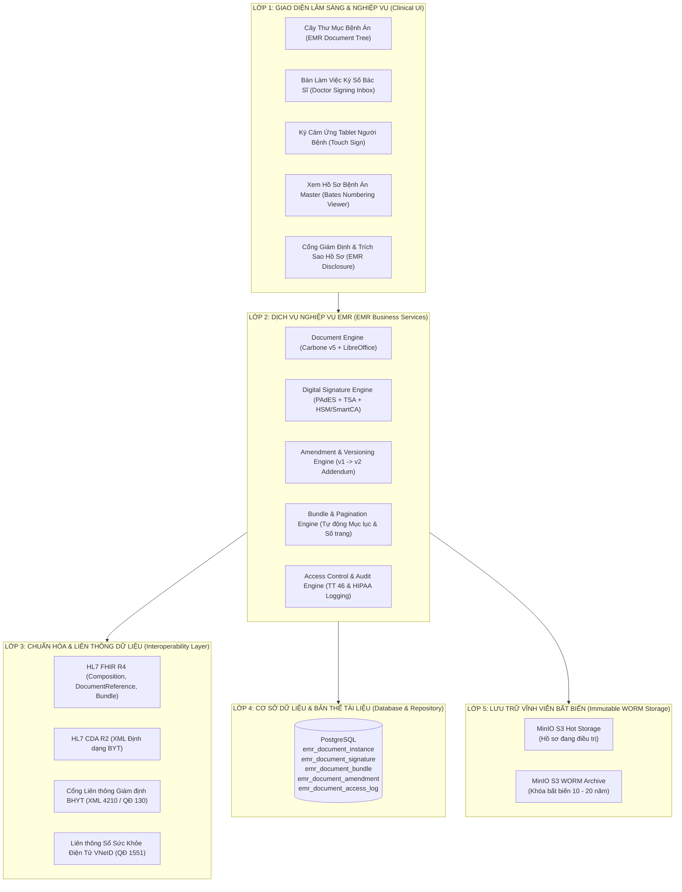

# BẢN THIẾT KẾ KIẾN TRÚC TỔNG THỂ PHÂN HỆ BỆNH ÁN ĐIỆN TỬ (VIMES EMR)
## THEO THÔNG TƯ 46/2018/TT-BYT, THÔNG TƯ 54/2017/TT-BYT & CHUẨN QUỐC TẾ (HL7 FHIR / CDA)

> **Cơ quan ban hành:** Dự án Hệ thống Thông tin Y tế ViMES (VIMES_HIS & EMR)  
> **Căn cứ pháp lý:**  
> • **Thông tư 46/2018/TT-BYT:** Quy định về Hồ sơ Bệnh án Điện tử.  
> • **Thông tư 54/2017/TT-BYT:** Tiêu chí Ứng dụng CNTT tại Cơ sở Khám chữa bệnh (Đạt Mức 6 & 7 - Bệnh viện Không Giấy Tờ).  
> • **Quyết định 1551/QĐ-BYT & Quyết định 130/QĐ-BYT:** Chuẩn dữ liệu đầu ra và liên thông VNeID / BHYT.  
> • **Chuẩn quốc tế:** HL7 FHIR Release 4, HL7 CDA R2, DICOM PS3.10 / WADO-RS, IHE XDS.b, ISO/TS 18308.  

---

## 🏛️ 1. TỔNG QUAN KIẾN TRÚC HỆ THỐNG EMR (5 LỚP)



---

## 📑 2. CẤU TRÚC HỒ SƠ BỆNH ÁN ĐIỆN TỬ CHUẨN BỘ Y TẾ (ĐIỀU 4 - TT 46/2018)

Theo quy định Điều 4 Thông tư 46/2018/TT-BYT, hồ sơ bệnh án điện tử gồm **5 phần bắt buộc**, được số hóa và quản lý bằng mã loại biểu mẫu (`form_type_code`):

```text
HỒ SƠ BỆNH ÁN ĐIỆN TỬ (EMR MASTER BUNDLE)
│
├── PHẦN I: THÔNG TIN HÀNH CHÍNH & VỎ BỆNH ÁN
│   ├── [VO_BENH_AN] Vỏ Bệnh Án (Nội trú / Ngoại trú / Nhi...) (MS: 01/BV)
│   ├── [BAN_KHAM_BENH_VAO_VIEN] Bản Khám Bệnh Lúc Vào Viện (MS: 02/BV)
│   └── [GIAY_CAM_DOAN_VAO_VIEN] Giấy Cam Đoan Điều Trị (Ký Tablet) (MS: 03/BV)
│
├── PHẦN II: QUÁ TRÌNH KHÁM BỆNH & ĐIỀU TRỊ HÀNG NGÀY
│   ├── [TO_DIEU_TRI_HANG_NGAY] Tờ Điều Trị Ngày 1, 2, 3... (Diễn biến & Y lệnh) (MS: 13/BV)
│   ├── [PHIEU_CHAM_SOC_DIEU_DUONG] Phiếu Theo Dõi & Chăm Sóc Của Điều Dưỡng (MS: 14/BV)
│   ├── [PHIEU_THEO_DOI_CHUC_NANG_SONG] Biểu Đồ Mạch, Nhiệt Độ, Huyết Áp (MS: 15/BV)
│   ├── [PHIEU_TRUYEN_DICH] Phiếu Theo Dõi Truyền Dịch & Dược Lâm Sàng (MS: 06/BV)
│   └── [BIEN_BAN_HOI_CHAN] Biên Bản Hội Chẩn Khoa / Toàn Viện (MS: 16/BV)
│
├── PHẦN III: KẾT QUẢ CẬN LÂM SÀNG (LIS / PACS / TDCN)
│   ├── [PHIEU_CHI_DINH_CLS] Phiếu Chỉ Định Cận Lâm Sàng Tổng Hợp (MS: 04/BV)
│   ├── [KET_QUA_XET_NGHIEM] Kết Quả Xét Nghiệm (Huyết học, Sinh hóa, Vi sinh) (MS: 07/BV)
│   ├── [KET_QUA_CDHA_XQUANG] Kết Quả X-Quang Kỹ Thuật Số (MS: 08/BV)
│   ├── [KET_QUA_CDHA_CT_MRI] Kết Quả Cắt Lớp CT / Cộng Hưởng Từ MRI (MS: 09/BV)
│   ├── [KET_QUA_SIEU_AM] Kết Quả Siêu Âm Màu 3D/4D (MS: 10/BV)
│   └── [KET_QUA_NOI_SOI] Kết Quả Nội Soi Tiêu Hóa / TMH (MS: 11/BV)
│
├── PHẦN IV: PHẪU THUẬT & THỦ THUẬT
│   ├── [GIAY_CAM_DOAN_PHAU_THUAT] Giấy Cam Đoan Mổ (Người Bệnh Ký Tablet) (MS: 17/BV)
│   ├── [PHIEU_KHAM_TIEN_ME] Phiếu Khám & Đánh Giá Tiền Mê (MS: 18/BV)
│   └── [TUONG_TRINH_PHAU_THUAT] Phiếu Phẫu Thuật / Thủ Thuật (Tường trình) (MS: 19/BV)
│
└── PHẦN V: KẾT THÚC ĐIỀU TRỊ & RA VIỆN
    ├── [GIAY_RA_VIEN] Giấy Ra Viện (Có Dấu Pháp Nhân Viện) (MS: 20/BV)
    ├── [DON_THUOC_NGOAI_TRU] Đơn Thuốc Ra Viện (MS: 05/BV)
    ├── [TRICH_SAO_BENH_AN] Trích Sao / Tóm Tắt Hồ Sơ Bệnh Án (MS: 21/BV)
    ├── [GIAY_CHUYEN_TUYEN] Giấy Chuyển Tuyến BHYT (MS: 22/BV)
    ├── [GIAY_HEN_KHAM_LAI] Giấy Hẹn Tái Khám (MS: 23/BV)
    └── [BANG_KE_CHI_PHI_BHYT] Bảng Kê Chi Phí KCB (Mẫu 01/BV & 02/BV) (MS: 24/BV)
```

---

## 🔒 3. TIÊU CHUẨN PHÁP LÝ & BẢO MẬT EMR (TT 46 & TT 54)

### 3.1. Chữ Ký Số & Dấu Thời Gian (Digital Signatures & TSA)
- **Định dạng tài liệu:** **PDF/A-1b** hoặc **PDF/A-2b** (chuẩn ISO 19005-1/2, nhúng sẵn font chữ, không bị biến dạng sau 20 năm).
- **Chữ ký số Bác sĩ / Điều dưỡng / KTV:** Chuẩn PAdES-LTV (Long-Term Validation) có nhúng chứng thư số X.509 và Dấu thời gian (Timestamp Authority - TSA).
- **Chữ ký Bệnh nhân / Người nhà:** Ký điện tử cảm ứng (Biometric Touch Signature trên Tablet) $\rightarrow$ Nhúng ảnh chữ ký, tọa độ GPS, địa chỉ IP và timestamp trước khi Bác sĩ ký niêm phong.
- **Con dấu Bệnh viện:** Ký số HSM / Cloud CA pháp nhân trên Giấy ra viện và Trích sao bệnh án.

### 3.2. Quy trình Sửa đổi & Đính chính (Addendum Workflow - Điều 10 TT 46)
- Tuyệt đối không xóa bản gốc `v1`.
- Khi đính chính:
  1. Tạo bản `v2` với nội dung sửa đổi.
  2. Bản cũ `v1` tự động đóng dấu watermark chìm *"ĐÃ ĐƯỢC THAY THẾ BỞI BẢN V2"*.
  3. Bản `v2` ghi rõ lý do đính chính và bác sĩ phê duyệt.
  4. Cả 2 bản được lưu song song trong cây hồ sơ phục vụ thanh tra y tế.

### 3.3. Đóng Bệnh Án & Lưu Trữ Bất Biến (WORM Storage - Điều 8 & 9 TT 46)
- Khi bệnh nhân **Xuất viện $\rightarrow$ Trưởng khoa duyệt $\rightarrow$ Phòng KHTH đóng bệnh án**:
  1. Tự động kiểm tra checklist (100% các tờ bắt buộc đã được ký số).
  2. Đánh số trang liên tục (Bates Numbering: `Trang 1/N` đến `Trang N/N`).
  3. Tự động sinh **Tờ Mục Lục Hồ Sơ Bệnh Án Master**.
  4. Toàn bộ file PDF được chuyển sang trạng thái **Khóa bất biến (WORM - Write Once, Read Many)** trên MinIO S3.
  5. Thời gian lưu trữ: **10 năm (ngoại trú), 20 năm (nội trú)** theo quy định của Luật Khám bệnh, Chữa bệnh.

---

## 🌐 4. CHUẨN LIÊN THÔNG QUỐC TẾ (HL7 FHIR R4 & VNeID)

Hệ thống EMR ánh xạ toàn bộ dữ liệu lâm sàng sang định dạng chuẩn quốc tế **HL7 FHIR Release 4**:

```json
{
  "resourceType": "Bundle",
  "type": "document",
  "identifier": {
    "system": "urn:vimes:emr:bundle",
    "value": "260817001"
  },
  "timestamp": "2026-08-17T08:30:00+07:00",
  "entry": [
    {
      "resource": {
        "resourceType": "Composition",
        "status": "final",
        "type": {
          "coding": [{
            "system": "http://loinc.org",
            "code": "11488-4",
            "display": "Consultation note"
          }]
        },
        "subject": { "reference": "Patient/BN88291", "display": "TRẦN VĂN MẠNH" },
        "date": "2026-08-17T08:30:00+07:00",
        "author": [{ "reference": "Practitioner/BS_AN", "display": "BS. CKII. Nguyễn Văn An" }],
        "title": "Hồ Sơ Bệnh Án Điện Tử Nội Trú"
      }
    }
  ]
}
```

---

## 🎯 5. LỘ TRÌNH ĐÁNH GIÁ ĐẠT MỨC 6 & 7 THEO THÔNG TƯ 54/2017/TT-BYT

| Nhóm Tiêu Chí Thông tư 54 | Yêu Cầu Cốt Lõi | Mức Đạt Được Của VIMES |
| :--- | :--- | :---: |
| **Tiêu chí 1: Hệ thống EMR** | Đầy đủ 5 phần bệnh án, ký số bác sĩ, quản lý đợt điều trị nội/ngoại trú, liên thông hồ sơ cũ. | **Mức 6 & 7 (Hoàn thành)** |
| **Tiêu chí 2: Hệ thống PACS** | Không in phim X-Quang/CT/MRI, xem ảnh DICOM trực tiếp, ký số trả kết quả trực tuyến. | **Mức 6 & 7 (Hoàn thành)** |
| **Tiêu chí 3: Chữ ký số** | 100% tài liệu y tế được ký số (SmartCA/HSM), có Timestamp TSA, có Tablet ký người bệnh. | **Mức 7 (Hoàn thành)** |
| **Tiêu chí 4: Bệnh viện Không Giấy Tờ** | Không in giấy tờ bệnh án, đóng gói PDF/A WORM lưu trữ 10-20 năm, tra cứu mã QR. | **Mức 7 (Hoàn thành)** |
| **Tiêu chí 5: An toàn Thông tin** | Ghi log kiểm toán `emr_document_access_log`, phân quyền RBAC, mã hóa SHA-256 / AES. | **Cấp độ 3 (Hoàn thành)** |
