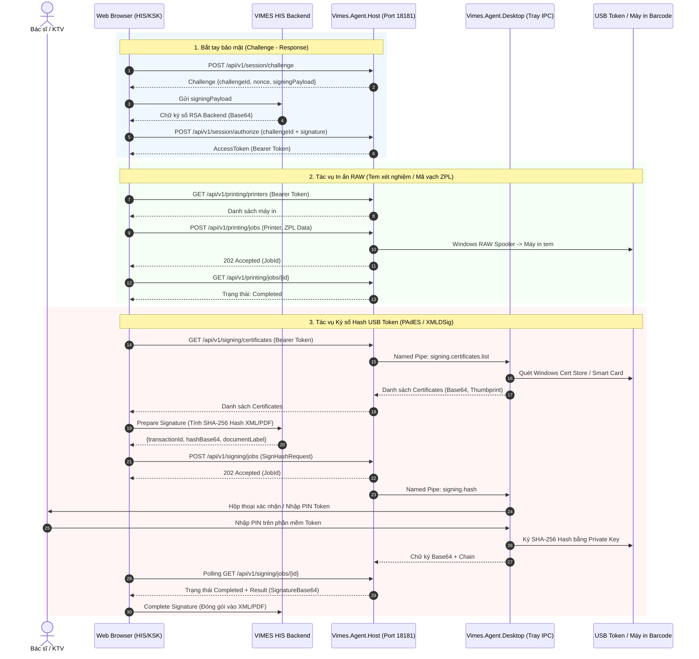

# Tài Liệu Kỹ Thuật API - VIMES Workstation Agent (v1.2.0)

> **Phân hệ:** VIMES HIS / Module Khám Sức Khỏe & EMR  
> **Dịch vụ:** VIMES Workstation Agent (`Vimes.WorkstationAgent`)  
> **Phiên bản API:** `v1`  
> **Cổng dịch vụ (Localhost):**  
> - HTTP: `http://127.0.0.1:18181`  
> - HTTPS: `https://127.0.0.1:18182` (Tự sinh chứng chỉ SSL cục bộ)  
> **Mã nguồn Agent:** `d:/AI/VIMES_HIS/modules/health-check-sync/tools/Vimes.PrintAgent`

---

## 1. Tổng quan Kiến trúc & Nguyên lý Hoạt động

`VIMES Workstation Agent` là dịch vụ trung gian bảo mật chạy trên máy trạm Windows của nhân viên y tế / kỹ thuật viên, cho phép ứng dụng Web (HIS/LIS/PACS/EMR/KSK) giao tiếp an toàn với các phần cứng cục bộ:
1. **Ký số USB Token (Chữ ký số cá nhân / tổ chức):** Đọc chứng thư từ Windows Certificate Store / USB Token PKCS#11/CSP/CNG/KSP và thực hiện ký số băm (hash) mà **không làm lộ Private Key** hoặc mã PIN ra môi trường web.
2. **In ấn phần cứng (In tem mã vạch ZPL, in phiếu khám, kết quả):** Đẩy lệnh in trực tiếp vào Windows RAW Spooler mà không cần qua hộp thoại in mặc định của trình duyệt.
3. **Mô hình kiến trúc kép (Dual-Process Architecture):**
   - **Agent Host (Windows Service / Console):** Lắng nghe port `18181`/`18182`, quản lý hàng đợi (Queue), bảo vệ dữ liệu SQLite bằng Windows DPAPI, xác thực phiên bằng RSA Challenge-Response.
   - **Desktop Companion (System Tray App theo Session Windows):** Chạy trong phiên người dùng tương tác (`console session`), kết nối với Agent Host qua Windows Named Pipe an toàn (`\\.\pipe\Vimes.Agent.Desktop.<sessionId>`), tương tác trực tiếp với Driver USB Token, hiển thị hộp thoại xác nhận ký / nhập mã PIN.



---

## 2. Quy Định Chung & Bảo Mật

### 2.1. Headers Bắt Buộc
| Header | Giá trị / Ý nghĩa | Bắt buộc |
| :--- | :--- | :--- |
| `Content-Type` | `application/json` | Bắt buộc đối với phương thức `POST` |
| `Origin` | Ví dụ: `http://localhost:3000` hoặc domain HIS | Bắt buộc cho toàn bộ request từ Web browser |
| `Authorization` | `Bearer <access_token>` | Bắt buộc với các endpoint `/printing/*`, `/desktop/*`, `/signing/*` |
| `X-Correlation-Id` | Chuỗi định danh luồng (GUID) | Tùy chọn (dùng để truy vết log) |

### 2.2. Hỗ trợ Private Network Access (PNA) & Trình Duyệt Web
Chromium (Google Chrome, Microsoft Edge) chặn các website gọi tới localhost (`127.0.0.1`) do chính sách W3C Private Network Access.  
Agent xử lý điều này qua 2 cơ chế:
1. **Preflight CORS Header:** Agent tự động phản hồi `Access-Control-Allow-Private-Network: true` khi trình duyệt gửi preflight request `Access-Control-Request-Private-Network: true`.
2. **VIMES Chrome Extension (Khuyên dùng khi triển khai):** Nếu trình duyệt kích hoạt cờ chặn triệt để, hệ thống sử dụng Extension cầu nối cục bộ (`d:/AI/VIMES_HIS/modules/health-check-sync/tools/vimes-extension`).

### 2.3. Rate Limiting
- Các endpoint nhạy cảm (Tạo phiên, Gửi lệnh in, Gửi lệnh ký) áp dụng chính sách **30 requests / phút** theo từng IP gọi.
- Khi vượt ngưỡng sẽ nhận mã lỗi `HTTP 429 Too Many Requests`.

---

## 3. Chi Tiết API Hệ Thống & Kiểm Tra Trạng Thái

### 3.1. Kiểm tra Sức khỏe Agent (Health Check)
Kiểm tra xem Windows Service của Agent có đang chạy hay không. Không yêu cầu xác thực.

- **Endpoint:** `GET /api/v1/health`
- **Headers:** Không yêu cầu
- **Phản hồi mẫu (`HTTP 200 OK`):**
```json
{
  "status": "ok",
  "product": "VIMES Workstation Agent",
  "version": "1.2.0",
  "sslEnabled": true,
  "timestamp": "2026-09-29T10:30:00.1234567Z"
}
```

### 3.2. Lấy Thông tin Phiên bản (Version)
- **Endpoint:** `GET /api/v1/version`
- **Phản hồi mẫu (`HTTP 200 OK`):**
```json
{
  "product": "VIMES Workstation Agent",
  "version": "1.2.0",
  "apiVersion": "v1",
  "sslEnabled": true,
  "httpsPort": 18182
}
```

### 3.3. Lấy Danh sách Năng lực Khả dụng (Capabilities)
- **Endpoint:** `GET /api/v1/capabilities`
- **Phản hồi mẫu (`HTTP 200 OK`):**
```json
[
  { "name": "printing", "version": "1.0", "status": "available" },
  { "name": "desktop-companion", "version": "1.0", "status": "available" },
  { "name": "signing", "version": "1.0", "status": "available" }
]
```

### 3.4. Kiểm tra Trạng thái Desktop Companion (Tray App)
Kiểm tra xem ứng dụng khay hệ thống (phụ trách PIN USB Token) có đang chạy trong session của người dùng Windows hiện tại hay không.

- **Endpoint:** `GET /api/v1/desktop/status?sessionId={optional}`
- **Headers:** `Authorization: Bearer <access_token>`
- **Query Params:**
  - `sessionId` *(int, tùy chọn)*: ID phiên Windows. Mặc định tự động nhận diện console session đang hoạt động.
- **Phản hồi mẫu (`HTTP 200 OK`):**
```json
{
  "requestId": "6cf6dfa811234bce",
  "success": true,
  "code": "OK",
  "message": "Desktop Companion đang hoạt động.",
  "payload": {
    "userName": "bacsi_tuan",
    "userSid": "S-1-5-21-123456789-...",
    "sessionId": 1,
    "productVersion": "1.2.0"
  }
}
```
- **Lỗi thường gặp:**
  - `HTTP 503`: Mã `DESKTOP_COMPANION_UNAVAILABLE` (Người dùng chưa mở ứng dụng VIMES Desktop Companion ở khay hệ thống).

---

## 4. Chi Tiết API Bắt Tay Xác Thực Phiên (Session Handshake)

Nhằm chống tấn công CSRF / độc hại từ các trang web lạ gọi vào `localhost`, Agent yêu cầu xác thực bằng cơ chế **RSA Challenge-Response**. Chỉ Backend VIMES được ủy quyền (nắm giữ Private Key) mới có thể sinh chữ ký hợp lệ để cấp `AccessToken`.

### 4.1. Lấy Challenge từ Agent
- **Endpoint:** `POST /api/v1/session/challenge`
- **Headers:**  
  - `Origin: http://localhost:3000` (hoặc domain của HIS)
  - `Content-Type: application/json`
- **Body:** `{}`
- **Phản hồi mẫu (`HTTP 200 OK`):**
```json
{
  "challengeId": "a1b2c3d4e5f60718",
  "nonce": "oJ8d9A+N3R7vV8s/w2D0qF6...==",
  "origin": "http://localhost:3000",
  "expiresAt": "2026-09-29T10:31:00.0000000Z",
  "signingPayload": "VIMES-AGENT-CHALLENGE\na1b2c3d4e5f60718\noJ8d9A+N3R7vV8s/w2D0qF6...==\nhttp://localhost:3000\n1790677860"
}
```

### 4.2. Cấp Quyền Phiên (Authorize Session)
Trình duyệt gửi `signingPayload` lên Backend HIS để ký số bằng RSA SHA-256 PKCS#1 v1.5, sau đó gửi lại chữ ký lên Agent để nhận Token.

- **Endpoint:** `POST /api/v1/session/authorize`
- **Headers:**  
  - `Origin: http://localhost:3000`
  - `Content-Type: application/json`
- **Body:**
```json
{
  "challengeId": "a1b2c3d4e5f60718",
  "signature": "MEYCIQC...Base64SignatureOfSigningPayload..."
}
```
- **Phản hồi mẫu (`HTTP 200 OK`):**
```json
{
  "accessToken": "bKxY98ZaQ1wOp2kLmN87VvXyZ...",
  "expiresAt": "2026-09-29T10:40:00.0000000Z"
}
```
- **Lưu ý:**
  - Token có thời hạn sử dụng mặc định **10 phút** (cấu hình qua `SessionLifetimeMinutes`).
  - Hết hạn phiên cần thực hiện lại bước bắt tay.

---

## 5. Chi Tiết API In Ấn (Printing API)

### 5.1. Lấy Danh Sách Máy In Trên Máy Trạm
- **Endpoint:** `GET /api/v1/printing/printers`
- **Headers:** `Authorization: Bearer <access_token>`
- **Phản hồi mẫu (`HTTP 200 OK`):**
```json
[
  "Zebra ZD230",
  "Xprinter XP-350B",
  "Canon LBP2900",
  "Microsoft Print to PDF"
]
```

### 5.2. Đẩy Tác Vụ In Vào Hàng Đợi (Enqueue Print Job)
Hỗ trợ gửi chuỗi RAW (ZPL, EPL, ESC/POS, Raw Bytes).

- **Endpoint:** `POST /api/v1/printing/jobs`
- **Headers:**  
  - `Authorization: Bearer <access_token>`
  - `Content-Type: application/json`
- **Body Model (`PrintJobRequest`):**
```json
{
  "printer": "Xprinter XP-350B",
  "data": "^XA^PW400^LL240^FO20,30^BY2^BCN,60,Y,N,N^FD12345678^FS^FO20,120^A0N,28,28^FDNGUYEN VAN A - 1985^FS^XZ",
  "copies": 1,
  "idempotencyKey": "print_barcode_benh_nhan_12345678_01"
}
```

| Trường | Kiểu dữ liệu | Bắt buộc | Mô tả |
| :--- | :--- | :--- | :--- |
| `printer` | `string` | Có | Tên máy in chính xác từ danh sách máy in |
| `data` | `string` | Có | Nội dung lệnh in (ZPL, ESC/POS, bản mã Base64 hoặc text RAW) |
| `copies` | `int` | Không | Số lượng bản in (từ 1 đến 20, mặc định: 1) |
| `idempotencyKey` | `string` | Không | Khóa chống trùng lặp tác vụ (tối đa 128 ký tự) |

- **Phản hồi mẫu (`HTTP 202 Accepted`):**
```json
{
  "jobId": "prn_7f8a9b0c1d2e",
  "status": "Queued",
  "duplicate": false
}
```

### 5.3. Kiểm Tra Trạng Thái Lệnh In (Polling Print Job)
- **Endpoint:** `GET /api/v1/printing/jobs/{id}`
- **Headers:** `Authorization: Bearer <access_token>`
- **Phản hồi mẫu (`HTTP 200 OK`):**
```json
{
  "jobId": "prn_7f8a9b0c1d2e",
  "status": "Completed",
  "printer": "Xprinter XP-350B",
  "copies": 1,
  "createdAt": "2026-09-29T10:32:01.0000000Z",
  "updatedAt": "2026-09-29T10:32:02.5000000Z",
  "errorCode": null,
  "errorMessage": null
}
```

**Các trạng thái `status` của Print Job:**
- `Queued`: Đang chờ trong hàng đợi nội bộ SQLite.
- `Processing`: Đang mở kết nối Win32 Spooler và đẩy luồng byte vào máy in.
- `Completed`: Đã gửi dữ liệu sang bộ đệm máy in thành công.
- `Failed`: Thất bại (Kèm theo `errorCode` và `errorMessage`).
- `Cancelled`: Đã bị hủy.
- `Expired`: Hết hạn lưu trữ.

---

## 6. Chi Tiết API Ký Số USB Token (Signing API)

### 6.1. Lấy Danh Sách Nhà Cung Cấp Ký (Signing Providers)
- **Endpoint:** `GET /api/v1/signing/providers`
- **Headers:** Không yêu cầu xác thực
- **Phản hồi mẫu (`HTTP 200 OK`):**
```json
[
  {
    "id": "windows-cert-store",
    "displayName": "Windows Certificate Store (USB Token / SmartCard)",
    "version": "1.0",
    "status": "available",
    "keyAlgorithms": ["RSA", "ECDSA"],
    "hashAlgorithms": ["SHA256", "SHA384", "SHA512"],
    "requiresDesktopSession": true
  }
]
```

### 6.2. Quét Chứng Thư Số Trên USB Token / SmartCard
Đọc danh sách các chứng thư số cá nhân/tổ chức hợp lệ đang cắm trên máy trạm thông qua Desktop Companion.

- **Endpoint:** `GET /api/v1/signing/certificates?sessionId={optional}`
- **Headers:** `Authorization: Bearer <access_token>`
- **Query Params:**
  - `sessionId` *(int, tùy chọn)*: ID phiên Windows người dùng.
- **Phản hồi mẫu (`HTTP 200 OK`):**
```json
[
  {
    "thumbprint": "3A89C2F5E0D71B498A1B2C3D4E5F6A7B8C9D0E1F",
    "subject": "CN=BS. NGUYEN VAN TUAN, O=BENH VIEN DA KHOA VIMES, C=VN",
    "issuer": "CN=BAN CO YEU CHINH PHU CA, O=BAN CO YEU CHINH PHU, C=VN",
    "serialNumber": "540102030405060708090A0B0C0D0E0F",
    "notBefore": "2024-01-01T00:00:00.0000000Z",
    "notAfter": "2027-01-01T23:59:59.0000000Z",
    "keyAlgorithm": "RSA",
    "isValidNow": true,
    "certificateBase64": "MIIFvDCCA6SgAwIBAgIQ...",
    "certificateChainBase64": [
      "MIIFvDCCA6SgAwIBAgIQ...",
      "MIIEkjCCA3qgAwIBAgIQ..."
    ]
  }
]
```

### 6.3. Khởi Tạo Tác Vụ Ký Hash (Enqueue Sign Hash Job)
Gửi giá trị băm (Digest) đã tính toán từ backend/frontend để ký số bằng Private Key trên Token.

- **Endpoint:** `POST /api/v1/signing/jobs?sessionId={optional}`
- **Headers:**  
  - `Authorization: Bearer <access_token>`
  - `Content-Type: application/json`
- **Body Model (`SignHashRequest`):**
```json
{
  "transactionId": "tx_sign_ksk_doc_99182371",
  "certificateThumbprint": "3A89C2F5E0D71B498A1B2C3D4E5F6A7B8C9D0E1F",
  "hashBase64": "47DEQpj8HBSa+/TImW+5JCeuQeRkm5NMpJWZG3hSuFU=",
  "hashAlgorithm": "SHA256",
  "documentLabel": "Giấy khám sức khỏe lái xe - BN: Nguyễn Văn A (Mã: 24001234)",
  "patientCode": "24001234",
  "expiresAt": "2026-09-29T10:35:00.0000000Z"
}
```

| Trường | Kiểu dữ liệu | Bắt buộc | Mô tả |
| :--- | :--- | :--- | :--- |
| `transactionId` | `string` | Có | Định danh giao dịch duy nhất cho lần ký này |
| `certificateThumbprint`| `string` | Có | Mã băm Thumbprint (SHA1) của chứng thư cần ký |
| `hashBase64` | `string` | Có | Giá trị băm SHA-256 (hoặc SHA384/512) dưới dạng Base64 |
| `hashAlgorithm` | `string` | Có | `SHA256`, `SHA384` hoặc `SHA512` |
| `documentLabel` | `string` | Có | Tiêu đề tài liệu (Hiển thị trên thông báo xác nhận của Desktop) |
| `patientCode` | `string` | Không | Mã bệnh nhân / hồ sơ y tế |
| `expiresAt` | `ISO8601 string` | Có | Thời điểm hết hạn của giao dịch ký |

- **Phản hồi mẫu (`HTTP 202 Accepted`):**
```json
{
  "jobId": "sig_5e4d3c2b1a0f",
  "transactionId": "tx_sign_ksk_doc_99182371",
  "status": "Queued",
  "duplicate": false
}
```

### 6.4. Kiểm Tra Trạng Thái & Lấy Chữ Ký (Polling Signing Job)
Trình duyệt thực hiện polling mỗi 300ms - 500ms cho đến khi hoàn thành.

- **Endpoint:** `GET /api/v1/signing/jobs/{id}`
- **Headers:** `Authorization: Bearer <access_token>`
- **Phản hồi mẫu hoàn thành (`HTTP 200 OK`):**
```json
{
  "jobId": "sig_5e4d3c2b1a0f",
  "transactionId": "tx_sign_ksk_doc_99182371",
  "status": "Completed",
  "createdAt": "2026-09-29T10:32:10.0000000Z",
  "updatedAt": "2026-09-29T10:32:14.2000000Z",
  "expiresAt": "2026-09-29T10:35:00.0000000Z",
  "result": {
    "transactionId": "tx_sign_ksk_doc_99182371",
    "signatureBase64": "Gz8sK9x...PKCS1v1_5_Signature_Base64...==",
    "certificateBase64": "MIIFvDCCA6SgAwIBAgIQ...",
    "certificateThumbprint": "3A89C2F5E0D71B498A1B2C3D4E5F6A7B8C9D0E1F",
    "signatureAlgorithm": "RSA",
    "signedAt": "2026-09-29T10:32:14.1500000Z",
    "certificateChainBase64": [
      "MIIFvDCCA6SgAwIBAgIQ...",
      "MIIEkjCCA3qgAwIBAgIQ..."
    ]
  },
  "errorCode": null,
  "errorMessage": null
}
```

**Các trạng thái `status` của Signing Job:**
- `Queued`: Đang chờ trong hàng đợi Agent.
- `AwaitingUser`: Đang đợi người dùng nhập mã PIN trên popup của USB Token hoặc bấm Xác nhận.
- `Processing`: Đang giao tiếp với vi mạch SmartCard của Token để tính toán chữ ký.
- `Completed`: Ký thành công, `result` chứa đầy đủ chữ ký Base64 và chuỗi chứng thư.
- `Failed`: Ký thất bại (Ví dụ: Sai PIN, Rút Token đột ngột, Lỗi driver).
- `Cancelled`: Người dùng chủ động bấm Hủy trên thông báo.
- `Expired`: Tác vụ bị hủy do quá thời gian `expiresAt`.

### 6.5. Hủy Tác Vụ Ký Đang Chờ
- **Endpoint:** `POST /api/v1/signing/jobs/{id}/cancel`
- **Headers:** `Authorization: Bearer <access_token>`
- **Phản hồi mẫu:**
  - `HTTP 200 OK`: Hủy thành công.
  - `HTTP 409 Conflict`: Tác vụ đã chạy xong hoặc đã hoàn tất, không thể hủy.

---

## 7. Bảng Mã Lỗi Chi Tiết (Error Codes)

Toàn bộ response lỗi trả về theo định dạng:
```json
{
  "code": "MA_LOI",
  "message": "Mô tả chi tiết bằng tiếng Việt",
  "correlationId": "6cf6dfa811234bce"
}
```

| Mã Lỗi (`code`) | HTTP Status | Nguyên nhân & Hướng khắc phục |
| :--- | :---: | :--- |
| `AGENT_SESSION_REQUIRED` | 401 | Thiếu hoặc sai header `Authorization: Bearer <token>`. Cần chạy lại luồng handshake. |
| `CHALLENGE_EXPIRED` | 401 | Challenge đã quá thời gian hiệu lực (60s). Cần sinh challenge mới. |
| `INVALID_SIGNATURE` | 401 | Chữ ký xác thực challenge của backend không hợp lệ hoặc sai Public Key cấu hình. |
| `ORIGIN_REQUIRED` | 403 | Request thiếu header `Origin` hoặc `X-Agent-Origin`. |
| `ORIGIN_NOT_ALLOWED` | 403 | Domain gọi tới không nằm trong danh sách `AllowedOrigins` tại `appsettings.json`. |
| `JOB_NOT_FOUND` / `SIGNING_JOB_NOT_FOUND` | 404 | Không tìm thấy mã `jobId` trong SQLite DB của Agent. |
| `PRINTER_NOT_FOUND` | 400 | Tên máy in không tồn tại trên hệ thống Windows. |
| `PRINT_DATA_TOO_LARGE` | 400 | Kích thước payload in vượt quá cấu hình `MaximumPrintPayloadBytes` (mặc định 10MB). |
| `INVALID_COPIES` | 400 | Số lượng bản in nằm ngoài khoảng `1 - 20`. |
| `DESKTOP_COMPANION_UNAVAILABLE` | 503 | Dịch vụ Tray Desktop Companion chưa khởi động hoặc bị tắt ở máy trạm. |
| `CERTIFICATE_NOT_FOUND` | 422 | Không tìm thấy chứng thư số theo `certificateThumbprint` đã chỉ định. |
| `USER_CANCELLED` | 422 | Người dùng bấm "No" trên hộp thoại xác nhận ký số. |
| `RATE_LIMITED` | 429 | Gọi API nhạy cảm quá 30 lần/phút từ 1 IP. |

---

## 8. Hướng Dẫn Tích Hợp Code (Code Examples)

### 8.1. TypeScript (Sử dụng Client có sẵn trong `health-check-sync`)

#### A. In tem mã vạch ZPL
Tái sử dụng service tại `modules/health-check-sync/services/workstationAgentPrintClient.ts`:

```typescript
import { 
  getAvailablePrintersViaAgent, 
  printZplViaWorkstationAgent 
} from '@/modules/health-check-sync/services/workstationAgentPrintClient';

async function handlePrintBarcode(patientCode: string, patientName: string) {
  try {
    // 1. Lấy danh sách máy in từ Agent
    const printers = await getAvailablePrintersViaAgent();
    console.log('Máy in khả dụng:', printers);

    // 2. Chuẩn bị lệnh ZPL
    const zpl = `
      ^XA
      ^PW400^LL240
      ^FO20,30^BY2^BCN,60,Y,N,N^FD${patientCode}^FS
      ^FO20,110^A0N,28,28^FD${patientName}^FS
      ^XZ
    `;

    // 3. Gửi lệnh in trực tiếp vào máy in tem (ví dụ: Xprinter hoặc Zebra)
    await printZplViaWorkstationAgent('Xprinter XP-350B', zpl, `job_${Date.now()}`);
    alert('Đã in tem thành công!');
  } catch (error: any) {
    console.error('Lỗi in tem:', error.message);
    alert('In thất bại: ' + error.message);
  }
}
```

#### B. Ký số tài liệu XML / PDF qua USB Token
Tái sử dụng client tại `modules/health-check-sync/services/workstationAgentSigningClient.ts` và `healthCheckAgentXmlSigner.ts`:

```typescript
import { 
  createAgentSession, 
  createSmartAgentClient, 
  selectCertificate 
} from '@/modules/health-check-sync/services/healthCheckAgentXmlSigner';
import { healthCheckService } from '@/services/healthCheckService';

async function handleSignDocument(documentId: string) {
  // 1. Bắt tay tạo phiên Agent (Session Handshake)
  const token = await createAgentSession();
  const agentClient = createSmartAgentClient(token);

  // 2. Lấy danh sách chứng thư số từ USB Token
  const certs = await agentClient.certificates();
  const selectedCert = selectCertificate(certs);

  // 3. Gửi chứng thư lên Backend để chuẩn bị hash (PAdES hoặc XMLDSig)
  const prepared = await healthCheckService.prepareXmlSignature(
    documentId, 
    selectedCert.certificateBase64!, 
    selectedCert.certificateChainBase64 || []
  );

  // 4. Đẩy tác vụ ký hash vào Agent
  const accepted = await agentClient.createJob({
    transactionId: prepared.transactionId,
    certificateThumbprint: selectedCert.thumbprint,
    hashBase64: prepared.hashBase64,
    hashAlgorithm: prepared.hashAlgorithm, // 'SHA256'
    documentLabel: prepared.documentLabel,
    expiresAt: prepared.expiresAt
  });

  // 5. Polling kết quả ký số (Người dùng nhập PIN trên Token)
  const terminalJob = await agentClient.waitForTerminalJob(accepted.jobId, {
    pollIntervalMs: 500,
    timeoutMs: 120_000 // Chờ tối đa 2 phút để người dùng nhập mã PIN
  });

  if (terminalJob.status !== 'completed' || !terminalJob.result) {
    throw new Error(terminalJob.errorMessage || 'Ký số thất bại.');
  }

  // 6. Gửi chữ ký Base64 về Backend đóng gói vào file PDF/XML
  const completeResult = await healthCheckService.completeXmlSignature(
    documentId,
    prepared.transactionId,
    terminalJob.result.signatureBase64
  );

  console.log('Ký số hoàn tất:', completeResult);
  alert('Đã ký số tài liệu thành công!');
}
```

---

### 8.2. Ví Dụ Gọi Trực Tiếp Bằng `curl`

#### Bước 1: Tạo Challenge
```bash
curl -X POST "http://127.0.0.1:18181/api/v1/session/challenge" \
     -H "Origin: http://localhost:3000" \
     -H "Content-Type: application/json" \
     -d "{}"
```

#### Bước 2: Authorize nhận Token
```bash
curl -X POST "http://127.0.0.1:18181/api/v1/session/authorize" \
     -H "Origin: http://localhost:3000" \
     -H "Content-Type: application/json" \
     -d "{\"challengeId\":\"<CHALLENGE_ID>\",\"signature\":\"<BASE64_SIGNATURE_FROM_HIS_BACKEND>\"}"
```

#### Bước 3: Lấy danh sách chứng thư số
```bash
curl -X GET "http://127.0.0.1:18181/api/v1/signing/certificates" \
     -H "Origin: http://localhost:3000" \
     -H "Authorization: Bearer <ACCESS_TOKEN>"
```

#### Bước 4: Tạo lệnh in ZPL
```bash
curl -X POST "http://127.0.0.1:18181/api/v1/printing/jobs" \
     -H "Origin: http://localhost:3000" \
     -H "Authorization: Bearer <ACCESS_TOKEN>" \
     -H "Content-Type: application/json" \
     -d "{\"printer\":\"Xprinter XP-350B\",\"data\":\"^XA^FO50,50^A0N,36,36^FDTEST PRINT^FS^XZ\",\"copies\":1}"
```

#### Bước 5: Tra cứu kết quả lệnh in
```bash
curl -X GET "http://127.0.0.1:18181/api/v1/printing/jobs/<JOB_ID>" \
     -H "Origin: http://localhost:3000" \
     -H "Authorization: Bearer <ACCESS_TOKEN>"
```

---

## 9. Hướng Dẫn Vận Hành & Khắc Phục Sự Cố

1. **Khởi động dịch vụ:**
   - Dịch vụ Windows Service: Mở `services.msc` -> Tìm `VIMES Workstation Agent` -> Bấm **Restart**.
   - Ứng dụng Desktop Companion: Chạy file `Vimes.Agent.Desktop.exe` từ thư mục cài đặt hoặc shortcut Desktop. Đảm bảo icon VIMES xuất hiện tại khay hệ thống (System Tray).
2. **Kiểm tra kết nối cổng:**
   - Mở PowerShell: `Test-NetConnection -ComputerName 127.0.0.1 -Port 18181`
3. **Lỗi USB Token không nhận diện:**
   - Kiểm tra dịch vụ Windows Smart Card: Chạy `Get-Service SCardSvr` trên PowerShell (Phải ở trạng thái `Running`).
   - Mở ứng dụng quản lý Token của nhà mạng (Viettel-CA, VNPT-CA, BkavCA, Ban Cơ Yếu...) để đảm bảo máy tính đã nhận chứng thư.
4. **Vị trí lưu trữ Database & Log:**
   - Database SQLite & Khóa: `C:\ProgramData\VIMES\WorkstationAgent\agent.db`
   - Cấu hình tùy biến: `C:\ProgramData\VIMES\WorkstationAgent\appsettings.json`
