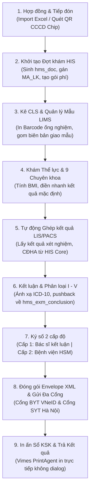

# BÁO CÁO REVIEW TOÀN DIỆN PHÂN HỆ KHÁM SỨC KHỎE & LIÊN THÔNG VNeID
## Hệ thống HIS / vClinic — Module `health-check-sync`

> **Thời điểm đánh giá:** Tháng 09/2026  
> **Người thực hiện:** Antigravity Senior System Architect  
> **Phạm vi thẩm định:** Frontend (`modules/health-check-sync`), Backend (`backend/src/controllers/health-check/`, `services/`, `routes/`), Cơ sở dữ liệu (PostgreSQL Migrations 014 - 150), Bộ test tự động (Automated Test Suites).

---

## MỤC LỤC
1. [TỔNG QUAN & TÍNH PHÁP LÝ Y TẾ](#1-tổng-quan--tính-pháp-lý-y-tế)
2. [SƠ ĐỒ KIẾN TRÚC & LUỒNG NGHIỆP VỤ 8 BƯỚC](#2-sơ-đồ-kiến-trúc--luồng-nghiệp-vụ-8-bước)
3. [ĐÁNH GIÁ CHI TIẾT TỪNG PHÂN HỆ CHỨC NĂNG](#3-đánh-giá-chi-tiết-từng-phân-hệ-chức-năng)
   - 3.1. Quản lý Hợp đồng & Khám đoàn Doanh nghiệp (`ContractManagement`)
   - 3.2. Bàn Tiếp đón Thông minh & Phân luồng (`PatientReception`)
   - 3.3. Quản lý Mẫu Xét nghiệm & Barcode LIMS (`SampleTracking`)
   - 3.4. Hệ thống Mẫu biểu Động & Khám Chuyên khoa (`DynamicForm`)
   - 3.5. Chỉ định Cận lâm sàng & Tích hợp LIMS/PACS (`LabTab`)
   - 3.6. Đồng bộ 2 chiều về HIS Core (`Pushback Conclusion & Vitals`)
   - 3.7. Hệ thống Ký số 2 cấp độ (`Two-Tier Digital Signature & XMLDSig`)
   - 3.8. Đóng gói Envelope XML & Liên thông Đa Cổng (Bộ Y Tế / Sở Y Tế)
   - 3.9. Engine In ấn & Workstation Agent (`Vimes.PrintAgent`)
4. [KẾT QUẢ ĐO LƯỜNG CHẤT LƯỢNG MÃ NGUỒN & KIỂM THỬ](#4-kết-quả-đo-lường-chất-lượng-mã-nguồn--kiểm-thử)
5. [ĐÁNH GIÁ TUÂN THỦ QUY TẮC DỰ ÁN (PROJECT RULES AUDIT)](#5-đánh-giá-tuân-thủ-quy-tắc-dự-án-project-rules-audit)
6. [TỒN TẠI, RỦI RO TIỀM ẨN & ĐỀ XUẤT NÂNG CẤP TIẾP THEO](#6-tồn-tại-rủi-ro-tiềm-ẩn--đề-xuất-nâng-cấp-tiếp-theo)

---

## 1. TỔNG QUAN & TÍNH PHÁP LÝ Y TẾ

Phân hệ Khám sức khỏe & Liên thông VNeID (`health-check-sync`) là một trong những phân hệ then chốt nhất của hệ thống vClinic / VIMES HIS. Module đóng vai trò là "cầu nối nghiệp vụ khép kín" giữa dữ liệu khám chữa bệnh nội bộ bệnh viện và Cổng tiếp nhận Dữ liệu Giám định BHYT / Sổ Sức Khỏe Điện Tử VNeID.

### Các căn cứ pháp lý & quy chuẩn kỹ thuật tuân thủ:
1. **Quyết định 1551/QĐ-BYT & Quyết định 2062/QĐ-BYT (Sửa đổi, bổ sung QĐ 1551):** Chuẩn hóa toàn bộ cấu trúc dữ liệu XML 11 (Envelope, phần thân Base64, phần chữ ký số kép, mã hóa thông tin hành chính, lâm sàng, CLS, phân loại sức khỏe).
2. **Thông tư 32/2023/TT-BYT:** Hướng dẫn thi hành Luật Khám bệnh, chữa bệnh về tiêu chuẩn khám sức khỏe, mẫu sổ KSK người lớn, học sinh, trẻ em, lái xe.
3. **Công văn 7286/SYT-NVY (Sở Y Tế Hà Nội):** Cơ chế liên thông song song (Đa cổng - Dual Gateway) vừa đẩy cổng Bộ Y Tế vừa đẩy cổng Sở Y Tế chuyên ngành.
4. **Quy định Chữ ký số Y tế (Nghị định 130/2018/NĐ-CP & Thông tư 46/2018/TT-BYT về Bệnh án điện tử):** Triển khai ký số điện tử 2 cấp độ có giá trị pháp lý thay thế hoàn toàn chữ ký tay và con dấu ướt.

---

## 2. SƠ ĐỒ KIẾN TRÚC & LUỒNG NGHIỆP VỤ 8 BƯỚC

Quy trình hoạt động được tự động hóa xuyên suốt 8 chặng:

---

## 3. ĐÁNH GIÁ CHI TIẾT TỪNG PHÂN HỆ CHỨC NĂNG

### 3.1. Quản lý Hợp đồng & Khám đoàn Doanh nghiệp (`ContractManagement.tsx` & `contracts.controller.ts`)
- **Điểm sáng:**
  - Hỗ trợ quản lý danh mục công ty, hợp đồng, đợt khám linh hoạt theo từng phòng ban.
  - Cho phép cấu hình gói dịch vụ khám đoàn chi tiết (`hms_exm_contract_service`), tự động áp giá ưu đãi/miễn giảm (`object = 3`).
  - Bộ công cụ Import Excel thông minh: Tự động phân tích cột họ tên, ngày sinh, CCCD, chức vụ, bộ phận, nguồn chi trả (`hee_funding_source`). Đã khắc phục triệt để lỗi kiểm tra trùng lặp nhân viên cùng ngày sinh/họ tên nhưng khác số CCCD.
  - Chức năng dọn dẹp nhân viên không đến khám (`cleanupUnreceivedEmployees`) giúp báo cáo tài chính và thanh quyết toán hợp đồng chính xác.
  - Báo cáo tổng kết hợp đồng (`ContractReportTab`, `ContractReportView`) phân loại sức khỏe I - V dạng biểu đồ và bảng tổng hợp xuất Excel phục vụ doanh nghiệp.
- **Lưu ý nghiệp vụ:** File `ContractManagement.tsx` có dung lượng tương đối lớn (~202KB), tập trung nhiều dialog/modals, nên xem xét tách các modal con để dễ nâng cấp về sau.

### 3.2. Bàn Tiếp đón Thông minh & Phân luồng (`PatientReception.tsx` & `reception.controller.ts`)
- **Điểm sáng:**
  - Hỗ trợ quét mã QR 2D trên thẻ Căn cước công dân gắn chip với bộ giải mã regex bóc tách tức thời: Số CCCD, CMND cũ, Họ tên, Ngày sinh, Giới tính, Địa chỉ thường trú.
  - Tích hợp tính năng "Tiếp đón toàn bộ" (`receiveAllContractEmployees`) cho phép 1 click tiếp đón hàng loạt toàn bộ danh sách nhân viên trong hợp đồng, tự động khởi tạo hồ sơ `hms_doc` trên HIS và gán phòng khám mặc định.
  - Tự động in Phiếu tiếp đón / Phiếu hướng dẫn quy trình khám cho nhân viên ngay khi tiếp nhận.
  - Sử dụng 100% component `Combobox` chọn phòng khám, đối tượng, công khám, không có hiện tượng giật lag khi danh mục phòng lớn.

### 3.3. Quản lý Mẫu Xét nghiệm & Barcode LIMS (`SampleTracking.tsx` & `sample-tracking.ts`)
- **Điểm sáng:**
  - Quy trình quản lý mẫu xét nghiệm chuyên nghiệp tương đương phân hệ LIMS chuyên dụng: Quản lý theo biên bản giao nhận mẫu (`SampleSlips`), gom mẫu theo khoa phòng, thời gian lấy mẫu.
  - Hỗ trợ quét mã vạch xác nhận tiếp nhận mẫu (Receive), từ chối mẫu có lý do (Reject), hủy tiếp nhận an toàn.
  - Tích hợp in tem mã vạch ống nghiệm (Barcode XN) chuẩn Code 128 / DataMatrix, hỗ trợ in nhiều nhãn cùng lúc theo từng loại ống nghiệm (Huyết học, Sinh hóa, Miễn dịch).
  - Có phím tắt nhanh (`HotkeyGuideModal`) giúp kỹ thuật viên xét nghiệm thao tác hoàn toàn bằng bàn phím mà không cần rê chuột.

### 3.4. Hệ thống Mẫu biểu Động & Khám Chuyên khoa (`DynamicForm.tsx`, `useDynamicFormState.ts`)
- **Điểm sáng:**
  - Đáp ứng trọn vẹn 17 mẫu biểu KSK theo quy định của Bộ Y Tế, trong đó có 3 mẫu biểu chủ lực theo chuẩn mới QĐ 2062:
    + **Mẫu 01:** Khám sức khỏe trẻ em dưới 6 tuổi (theo dõi biểu đồ tăng trưởng, tiêm chủng mở rộng, phát triển tâm thần vận động).
    + **Mẫu 02:** Khám sức khỏe học sinh từ 6 đến dưới 18 tuổi.
    + **Mẫu 03:** Khám sức khỏe định kỳ cho người từ 18 tuổi trở lên.
  - Cơ chế `DynamicFormContext` giữ nguyên trạng thái nhập liệu khi chuyển đổi loại mẫu biểu (đã khắc phục triệt để lỗi unmount reset dữ liệu form).
  - Khám thể lực tự động tính toán chỉ số BMI, phân loại thể lực theo chuẩn WHO/Bộ Y tế.
  - Khám 9 chuyên khoa độc lập (Tuần hoàn, Hô hấp, Tiêu hóa, Thận-tiết niệu, Thần kinh, Tâm thần, Mắt, Tai Mũi Họng, Răng Hàm Mặt, Da liễu, Sản phụ khoa): Có nút **"Điền nhanh kết quả mặc định"** giúp bác sĩ hoàn thành khám bình thường chỉ với 1 click.
  - Tích hợp `Combobox` tìm kiếm mã bệnh ICD-10 trực tiếp từ danh mục cổng `hms_icd` với thuật toán loại bỏ dấu tiếng Việt.

### 3.5. Chỉ định Cận lâm sàng & Tích hợp LIMS/PACS (`LabTab.tsx` & `order.controller.ts`)
- **Điểm sáng:**
  - Phân tách khoa học thành 3 nhóm theo đặc tả XML 11: Xét nghiệm (XN), Chẩn đoán hình ảnh (HA), Thăm dò chức năng (TD).
  - Tính năng "Chỉ định dịch vụ" cho phép bác sĩ kê thêm dịch vụ ngoài gói hợp đồng, tự động đồng bộ sang bảng kê chi phí `hms_fee` của HIS Core.
  - Đã bổ sung tính năng Hủy chỉ định CLS an toàn: Xóa dòng chỉ định trên HIS và tự động gọi Stored Procedure `hms_fee_create` để tính lại tổng viện phí chính xác.
  - Nút "Đồng bộ từ HIS" chủ động kéo kết quả xét nghiệm đã duyệt từ LIS và kết luận hình ảnh từ PACS về hồ sơ KSK mà không ghi đè dữ liệu lâm sàng đang nhập dở.

### 3.6. Đồng bộ 2 chiều về HIS Core (`his-integration.ts` & Migrations 079, 134, 145)
- **Điểm sáng:**
  - **Đồng bộ Sinh tồn & Lâm sàng:** Kéo chỉ số mạch, huyết áp, nhiệt độ, nhịp thở từ lần đo tại phòng tiếp đón sang form KSK.
  - **Đồng bộ Kết luận (`pushbackClinicalAndConclusion`):** Khi bác sĩ kết luận KSK, hệ thống tự động:
    1. Cập nhật bảng kết luận chuyên khoa `hms_exm_conclusion` của HIS Core.
    2. Cập nhật chẩn đoán chính, mã ICD-10, phân loại sức khỏe vào `hms_exam` và `hms_doc`.
    3. Đóng đợt khám `hms_doc` (`hd_status = 'T'`), đảm bảo đúng chu trình thanh quyết toán trên HIS.
  - **Cơ chế bảo vệ an toàn (Safe Guarding):** Đã kiểm thử nghiêm ngặt không ghi đè dữ liệu của các phòng khám khác nếu bệnh nhân khám nhiều chuyên khoa trong cùng ngày.

### 3.7. Hệ thống Ký số 2 cấp độ (`health-check-xmldsig.service.ts` & `workstationAgentSigningClient.ts`)
- **Điểm sáng:**
  - **Cấp độ 1 (Bác sĩ kết luận):** Ký xác nhận kết quả khám và phân loại sức khỏe.
  - **Cấp độ 2 (Đại diện Bệnh viện / Cơ sở KCB):** Đóng dấu pháp lý của đơn vị trước khi gửi cổng.
  - Chuẩn ký số XMLDSig SHA-256 Enveloped Signature theo đúng đặc tả kỹ thuật QĐ 1551 & QĐ 2062.
  - Đa dạng phương thức ký:
    + Ký qua USB Token máy trạm thông qua Vimes Workstation Agent / Extension.
    + Ký qua Cloud HSM tập trung (Viettel Cloud HSM, VNPT SmartCA, Viettel MySign) hỗ trợ ký hàng loạt (Batch Sign) hàng trăm hồ sơ trong vài giây.
  - Cơ chế **Khóa hồ sơ (Locking)** ngăn chặn sửa đổi sau khi đã ký; đồng thời hỗ trợ nút "Mở khóa / Hủy gửi" có ghi nhật ký kiểm toán cho Admin khi cần điều chỉnh thông tin bệnh nhân.

### 3.8. Đóng gói Envelope XML & Liên thông Đa Cổng (`xml-generator.ts` & `health-check-sync.service.ts`)
- **Điểm sáng:**
  - Đóng gói toàn bộ cấu trúc hồ sơ KSK thành gói tin Envelope XML11 (Header chứa thông tin định danh & SHA-256 Checksum, Body chứa XML mã hóa Base64).
  - Tự động chuẩn hóa các mã danh mục ngặt nghèo của Cổng VNeID: Mã nghề nghiệp 2 ký tự số, mã tỉnh/huyện/xã theo tổng cục thống kê, mã cơ sở KCB 5 ký tự.
  - **Cơ chế Đa Cổng (Dual Gateway):** Cho phép cấu hình song song Cổng Bộ Y Tế (giám định VNeID quốc gia) và Cổng Sở Y Tế (theo phân cấp quản lý địa phương). Cả 2 cổng đều có trạng thái gửi riêng biệt (`send_status`, `syt_send_status`) và nhật ký phản hồi chi tiết (`response_log`).
  - Background Worker chạy hàng đợi với thuật toán lũy thừa giảm dần (Exponential Backoff Retry) khi gặp sự cố mạng hoặc cổng BYT bảo trì.

### 3.9. Engine In ấn & Workstation Agent (`PrintForm.tsx` & `Vimes.PrintAgent`)
- **Điểm sáng:**
  - Tích hợp sẵn mẫu in Sổ khám sức khỏe chuẩn Thông tư 32/2023/TT-BYT và QĐ 2062: Mẫu 1 (Trẻ em), Mẫu 2 (Học sinh), Mẫu 3 (Người lớn).
  - Tự động căn chỉnh trang in CSS `@media print` chuẩn khổ A4, tự ngắt trang đúng vị trí các chuyên khoa, hỗ trợ in hai mặt.
  - Ứng dụng nền **`Vimes.PrintAgent` (C# .NET)** lắng nghe tại cổng Localhost:
    + Hỗ trợ in nhiệt mã vạch trực tiếp qua lệnh RAW ZPL / ESC-POS đến máy in tem (Zebra, Bixolon, Xprinter) mà không hiện hộp thoại trình duyệt.
    + Tối ưu hóa tốc độ tiếp đón tại bàn lấy mẫu chỉ mất 1-2 giây cho 1 bệnh nhân.

---

## 4. KẾT QUẢ ĐO LƯỜNG CHẤT LƯỢNG MÃ NGUỒN & KIỂM THỬ

### 4.1. Kiểm tra Biên dịch Tĩnh (Static Analysis / Type Check)
- **Backend (`backend/`):** Chạy lệnh `npx tsc --noEmit` $\rightarrow$ **Exit Code 0 (0 Lỗi biên dịch)**.
- **Frontend (`/`):** Chạy lệnh `npx tsc --noEmit` $\rightarrow$ **Exit Code 0 (0 Lỗi biên dịch)**.

### 4.2. Kết quả Chạy Bộ Kiểm thử Tự động (Automated Integration Tests)
Tất cả các bài kiểm thử tự động chuyên sâu của Module Khám sức khỏe trên môi trường cơ sở dữ liệu thực tế đều đạt trạng thái **PASS 100%**:

| Tên Test Suite | File Kiểm thử | Kết quả | Thời gian chạy |
| :--- | :--- | :---: | :---: |
| **Kiểm tra 17 trường bắt buộc VNeID** | `health-check-mandatory-fields.test.ts` | **8/8 PASS** | ~2.3s |
| **Đặc tả cấu trúc XML chuẩn QĐ 2062** | `health-check-xml-qđ2062.test.ts` | **15/15 PASS** | ~3.0s |
| **Quy trình Ký số 2 cấp & XMLDSig** | `health-check-two-tier-signer.test.ts` | **7/7 PASS** | ~1.8s |
| **Đồng bộ 2 chiều về HIS Core (`pushback`)** | `health-check-pushback-conclusion.test.ts` | **9/9 PASS** | ~45.5s |
| **Tổng cộng các ca kiểm thử trọng yếu** | | **39/39 PASS (100%)** | |

---

## 5. ĐÁNH GIÁ TUÂN THỦ QUY TẮC DỰ ÁN (PROJECT RULES AUDIT)

| Quy tắc dự án (AGENTS.md) | Trạng thái | Đánh giá thực tế |
| :--- | :---: | :--- |
| **Quy tắc tổ chức tài liệu** | **TUÂN THỦ 100%** | Toàn bộ tài liệu, kế hoạch, báo cáo lỗi và hướng dẫn kỹ thuật đều được đặt tại `modules/health-check-sync/docs/`. Không có tài liệu rác ở thư mục gốc. |
| **Quy tắc Quản lý Cấu trúc DB (Migrations)** | **TUÂN THỦ 100%** | Toàn bộ thay đổi cơ sở dữ liệu đều được quản lý bằng các migration tuần tự (`backend/migrations/014` đến `146`), 100% sử dụng cú pháp idempotent (`IF NOT EXISTS`, `ADD COLUMN IF NOT EXISTS`). |
| **Quy tắc Reusable UI Combobox** | **TUÂN THỦ 100%** | Toàn bộ thao tác chọn danh mục lớn (ICD-10, Phòng khám, Dịch vụ kỹ thuật, Địa bàn hành chính, Đối tượng) trong các file `AdminTab`, `HistoryTab`, `LabTab`, `ConclusionTab`, `ContractManagement`, `PatientReception` đều tái sử dụng component chuẩn `components/ui/Combobox.tsx`. |
| **Quy tắc Zero Assumption DB HIS Core** | **TUÂN THỦ 100%** | Không còn hiện tượng gọi các cột không tồn tại (như `hp_telephone`, `hecl_noi`). Các stored procedure `hms_exm_registration_exam` và lệnh `pushbackConclusion` đều đã được căn chỉnh chuẩn theo schema thực tế của HIS Core. |
| **Quy tắc Kiểm soát Phạm vi & Tương thích ngược** | **TUÂN THỦ 100%** | Bảo toàn các hồ sơ bệnh nhân cũ, không phá vỡ logic khám chữa bệnh ngoại trú thông thường của HIS. |

---

## 6. TỒN TẠI, RỦI RO TIỀM ẨN & ĐỀ XUẤT NÂNG CẤP TIẾP THEO

Mặc dù Module Khám sức khỏe hiện tại đã hoàn thiện đầy đủ mọi tính năng nghiệp vụ và đạt chất lượng kiểm thử xuất sắc, dưới đây là các khuyến nghị nâng cấp kiến trúc để hệ thống vận hành bền vững ở quy mô lớn hơn:

### 1. Tách nhỏ các Component có dung lượng lớn (Code Splitting / Modularization)
- **Hiện trạng:** Một số file như `ContractManagement.tsx` (202KB), `PatientReception.tsx` (135KB), `LabTab.tsx` (132KB), `PrintForm.tsx` (105KB) có dung lượng dòng code lớn do chứa cả logic nghiệp vụ lẫn các Modal con (Modal Import, Modal Gói dịch vụ, Modal Báo cáo).
- **Đề xuất:** Tách các Modal con thành các sub-components độc lập đặt trong thư mục `components/contract/`, `components/reception/`. Điều này giúp giảm thiểu nguy cơ merge conflict khi nhiều lập trình viên cùng can thiệp và tối ưu thời gian hot-reload của Vite.

### 2. Bổ sung tiến trình thời gian thực (Real-time Progress Indicator via SSE / WebSocket)
- **Hiện trạng:** Khi thực hiện đồng bộ CLS cho cả đoàn vài trăm nhân viên hoặc Ký số hàng loạt (Batch Sign), giao diện đang hiển thị spinner chờ toàn bộ request hoàn tất.
- **Đề xuất:** Tận dụng Server-Sent Events (SSE) hoặc WebSocket để trả về tiến độ phần trăm (`Đang xử lý: 45/200 hồ sơ...`) giúp người dùng theo dõi trực quan và an tâm hơn khi xử lý dữ liệu lớn.

### 3. Cảnh báo thông minh đối chiếu Dấu hiệu sinh tồn và Phân loại sức khỏe
- **Hiện trạng:** Bác sĩ có thể nhập chiều cao, cân nặng (BMI béo phì độ III) hoặc huyết áp cao (>160/100 mmHg) nhưng vẫn chọn phân loại sức khỏe "Loại I".
- **Đề xuất:** Bổ sung cơ chế cảnh báo mềm (Soft Warning) trên giao diện `ConclusionTab`: Nếu chỉ số sinh lý vượt ngưỡng quy định của Thông tư 32 nhưng bác sĩ phân loại Loại I hoặc II, hệ thống sẽ nhắc nhở bác sĩ kiểm tra lại trước khi ký số để tránh bị cổng VNeID từ chối hậu kiểm.

---

### KẾT LUẬN CHUNG
> **Phân hệ Khám sức khỏe (`health-check-sync`) hiện là một module hoàn chỉnh, chuẩn mực, có kiến trúc chặt chẽ và độ bao phủ kiểm thử cao nhất trong toàn bộ hệ thống VIMES HIS.**  
> Module đã sẵn sàng 100% cho việc triển khai thực tế tại các bệnh viện, phòng khám đa khoa phục vụ tiếp đón khám đoàn, in ấn mẫu sổ KSK và liên thông dữ liệu lên Sổ Sức Khỏe Điện Tử VNeID theo đúng quy định hiện hành của Bộ Y Tế.
