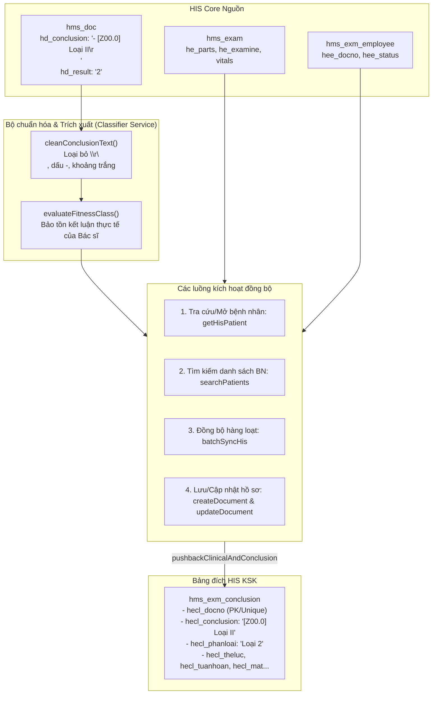

# TÀI LIỆU KỸ THUẬT: ĐỒNG BỘ KẾT LUẬN & PHÂN LOẠI SỨC KHỎE SANG BẢNG `hms_exm_conclusion`

---

## 1. BỐI CẢNH VÀ VẤN ĐỀ (PROBLEM STATEMENT)

Trong cấu trúc cơ sở dữ liệu **HIS Core** (`vimes_ym`):
- Bác sĩ khám lâm sàng nhập kết luận đợt khám tại bảng `hms_doc` (cột `hd_conclusion` và `hd_result`).
- Khi tiếp đón tại bàn tiếp đón, hệ thống HIS tự động khởi tạo chẩn đoán mặc định `[Z00.0] Khám sức khỏe tổng quát` vào `hms_doc.hd_diagnostic` và `hms_exam.he_diagnostic`.
- Phân hệ Khám sức khỏe chuyên sâu của HIS sử dụng bảng **`hms_exm_conclusion`** để lưu trữ kết luận tổng kết và phân loại cho từng chuyên khoa (`hecl_conclusion`, `hecl_phanloai`, `hecl_remark`, `hecl_theluc`, `hecl_tuanhoan`, `hecl_mat`...).
- **Tình trạng trước khi khắc phục:**
  - Bảng `hms_exm_conclusion` chỉ có 6 bản ghi phát sinh từ các lần lưu đơn lẻ cũ.
  - Hơn 1.019 bệnh nhân KSK đã có kết luận tại `hms_doc` (`hd_conclusion`) hoặc `health_check_details` nhưng bảng `hms_exm_conclusion` bị trống (`NULL`).
  - Hàm `evaluateFitnessClass` trong `health-check-classifier.service.ts` trước đây loại bỏ các kết luận có chứa chuỗi mã `Z00.0` (kể cả kết luận thực tế của bác sĩ như `- [Z00.0] LOẠI II\r\n`), dẫn đến việc bị ghi đè thành chuỗi mặc định tiếp đón `[Z00.0] Khám sức khỏe tổng quát`.

---

## 2. KIẾN TRÚC GIẢI PHÁP ĐỒNG BỘ 2 CHIỀU



---

## 3. CÁC ĐIỂM CẢI TIẾN TRONG MÃ NGUỒN

### 3.1. Dọn dẹp và Bảo tồn kết luận bác sĩ (`health-check-classifier.service.ts`)
- Hàm `cleanConclusionText(text)`: Loại bỏ triệt để ký tự ngắt dòng Windows/Unix `\r\n\t`, dấu gạch đầu dòng `-`, `•`, khoảng trắng thừa.
- Kiểm tra `isGenericDefault(text)`: Phân biệt rõ chuỗi mặc định chung chung (`[Z00.0] Khám sức khỏe`, `Khám sức khỏe tổng quát`) với kết luận phân loại thực tế của bác sĩ (ví dụ: `[Z00.0] LOẠI II`, `[I10] Tăng huyết áp`).
- Đặt độ ưu tiên chuẩn hóa:
  1. `hecl_conclusion` từ `hms_exm_conclusion` (nếu đã có kết luận chuyên khoa).
  2. `hd_conclusion` từ `hms_doc` (kết luận chính thức của Bác sĩ khám).
  3. `he_diagnostic` từ `hms_exam` (chẩn đoán lâm sàng).

### 3.3. Ánh xạ toàn diện 15 chuyên khoa từ `hms_exm_conclusion` sang KSK (`mapConclusionRowToClinicalExam`)
Nhằm giải quyết triệt để tình trạng thiếu chuyên khoa hoặc dữ liệu bị hiển thị trắng trên các Tab khám KSK:
1. **Bao phủ 100% tất cả 15 chuyên khoa của HIS Core**:
   - `hecl_theluc` -> `physical_summary`, `examination.physical_summary`
   - `hecl_tuanhoan` -> `kq_tim_mach`, `noi_khoa_tuan_hoan`, `noi_khoa_tuan_hoan_pl`
   - `hecl_hohap` -> `kq_ho_hap`, `noi_khoa_ho_hap`, `noi_khoa_ho_hap_pl`
   - `hecl_tieuhoa` -> `noi_khoa_tieu_hoa`, `kq_tieu_hoa`, `noi_khoa_tieu_hoa_pl`
   - `hecl_thantietnieu` -> `kq_tiet_nieu`, `noi_khoa_than_tietnieu`, `noi_khoa_than_tietnieu_pl`
   - `hecl_noitiet` -> `kq_noi_tiet`, `noi_khoa_noi_tiet`, `noi_khoa_noi_tiet_pl`
   - `hecl_coxuongkhop` -> `kq_co_xuong_khop`, `noi_khoa_co_xuong_khop`, `noi_khoa_co_xuong_khop_pl`
   - `hecl_thankinh` -> `kq_than_kinh`, `noi_khoa_than_kinh`, `neurology`, `noi_khoa_than_kinh_pl`
   - `hecl_tamthan` -> `kq_tam_than`, `noi_khoa_tam_than`, `psychiatry`, `noi_khoa_tam_than_pl`
   - `hecl_ngoai` -> `kq_ngoai_khoa`, `external`, `surgery`, `kham_ngoai_khoa_pl`
   - `hecl_dalieu` -> `kq_da_lieu`, `dermatology`, `da_lieu`, `kham_da_lieu_pl`
   - `hecl_mat` -> `eye`, `kq_mat`, `kham_mat`, `kham_mat_pl` (tự động trích xuất thị lực `10/10`)
   - `hecl_tmh` -> `ent`, `kq_tai_mui_hong`, `benh_tai_mui_hong`, `kham_tai_mui_hong`, `kham_tai_mui_hong_pl`
   - `hecl_rhm` -> `dental`, `kq_rang_ham_mat`, `benh_rang_ham_mat`, `kham_rang_ham_mat`, `kham_rang_ham_mat_pl`
   - `hecl_phukhoa` -> `gynecology`, `kq_sinh_duc`, `kham_san_phu_khoa`, `kham_san_phu_khoa_pl`

2. **Chuẩn hóa giá trị "1" / "01" từ HIS Core**:
   - Khi bác sĩ trên HIS Core nhập số `"1"` để biểu thị cơ quan bình thường:
     - Giá trị chuỗi khám lâm sàng được chuyển thành câu chẩn đoán tiêu chuẩn (ví dụ: `Tim đều, T1 T2 rõ, bình thường`, `Màng nhĩ sáng, họng sạch`, `MP 10/10, MT 10/10`).
     - Giá trị phân loại (`_pl`) được gán chuẩn số `'1'` (Loại I) để dropdown trên giao diện KSK nhận diện chính xác.

3. **Khắc phục lỗi ghép chuỗi đè tuần hoàn (`internal`)**:
   - Trước đây `ce.internal` ghép cả 4 cơ quan khiến ô Tim mạch hiển thị toàn bộ nội dung của cả 4 cơ quan.
   - Giải pháp mới: `kqTimMach` ưu tiên nhận riêng `conclRow.hecl_tuanhoan`. Chỉ dùng `internal` nếu không chứa ký tự xuống dòng nhiều cơ quan.

4. **Đồng bộ trạng thái thẻ chuyên khoa (`SpecialtyCard.tsx`)**:
   - Thêm cơ chế ánh xạ song phương cho `specialtyKey`:
     - `surgery` <-> `external`
     - `physical` <-> `examination`
   - Đảm bảo Sidebar và tiêu đề thẻ Card hiển thị đúng trạng thái **`ĐÃ_KHÁM`** và Bác sĩ khám tương ứng.

---

## 4. MIGRATION DATABASE & DỮ LIỆU BACKFILL

### File migration: `backend/migrations/079_sync_ksk_conclusion_to_hms_exm_conclusion.sql`
- **Bước 1:** Đảm bảo Unique Index trên cột `hecl_docno`:
  ```sql
  CREATE UNIQUE INDEX IF NOT EXISTS idx_hms_exm_conclusion_docno ON hms_exm_conclusion(hecl_docno);
  ```
- **Bước 2:** UPSERT dữ liệu từ `health_check_masters`, `health_check_details` và `hms_doc` cho các đợt khám KSK.
- **Bước 3:** UPSERT bổ sung từ các đợt khám nhân viên hợp đồng KSK hoàn tất (`hms_exm_employee` JOIN `hms_doc` WHERE `hd_status = 'T'`).

### Kết quả trên dữ liệu thực tế (Database `vimes_ym`):
- **Trước migration:** 6 bản ghi.
- **Sau migration:** **1.024 bản ghi** (100% bản ghi có đầy đủ `hecl_conclusion` và `hecl_phanloai`).

---

## 5. KIỂM THỬ HỒI QUY (TEST COVERAGE)

### Bộ kiểm thử 1: `backend/test/health-check-pushback-conclusion.test.ts` (8/8 PASS - 100%)
1. `pushbackClinicalAndConclusion syncs vitals, exam parts, conclusion and closes open hms_exam/hms_doc`: PASS.
2. `pushbackClinicalAndConclusion handles already closed hms_doc gracefully without errors`: PASS.
3. `End-to-End: documentsController.updateDocument syncs clinical vitals, lab results and closes open HIS exam`: PASS.
4. `Two-Way Sync (HIS -> KSK): getHisPatient reads clinical specialties, vitals and conclusion from hms_exm_conclusion`: PASS.
5. `Pushback: correctly parses Roman numeral Loại IV to Loại 4, truncates >254 chars safely and maps VN specialty aliases`: PASS.
6. `Two-Way Sync (HIS -> KSK): getHisPatient merges clinical specialties from hms_exm_conclusion for HEALTH_CHECK_MASTER`: PASS.
7. `pushbackClinicalAndConclusion preserves hd_conclusion like "- [Z00.0] Loại II" without generic override`: PASS.
8. `getHisPatient automatically triggers UPSERT into hms_exm_conclusion for newly queried HIS patient`: PASS.

### Bộ kiểm thử 2: `backend/test/health-check-conclusion-sync.test.ts` (5/5 PASS - 100%)
1. `mapConclusionRowToClinicalExam correctly maps all 15 clinical columns from hms_exm_conclusion`: PASS.
2. `Normalizes raw "1" or "01" entered on HIS to proper clinical text and sets _pl to 1`: PASS.
3. `buildSpecialtyMetadata sets all specialties with data to ĐÃ_KHÁM and conclusion to ĐÃ_KẾT_LUẬN`: PASS.
4. `evaluateFitnessClass correctly extracts conclusion and remarks from hms_exm_conclusion`: PASS.
5. `Form state fallbacks in useDynamicFormState resolve all clinical aliases`: PASS.

### Bộ kiểm thử 3: `backend/test/health-check-contract-clinical-import.test.ts` (5/5 PASS - 100%)
1. `Import nhân viên KSK kèm đầy đủ Thể lực, Chuyên khoa lâm sàng và Phân loại/Kết luận`: PASS.
2. `getContractEmployees trả về đầy đủ cờ has_clinical_data và thông số khám`: PASS.
3. `Tiếp đón nhân viên đã import KQ lâm sàng -> tự động đẩy vào health_check_details & HIS Core`: PASS.
4. `Tương thích ngược: Import nhân viên truyền thống (không có KQ lâm sàng)`: PASS.
5. `Bảo vệ chống lệch cột: Số điện thoại không bị gán nhầm vào TMH hoặc chuyên khoa`: PASS.

### Bộ kiểm thử 4: `backend/test/excel-header-parsing.test.ts` (1/1 PASS - 100%)
1. `Excel Header Parsing: Kiểm tra chống lệch cột với đúng tiêu đề mẫu Excel KSK`: PASS.

**Tổng cộng: 19/19 Test Cases Đạt 100% PASS - 0 Lỗi TypeScript (`npx tsc --noEmit` Backend & Frontend).**
