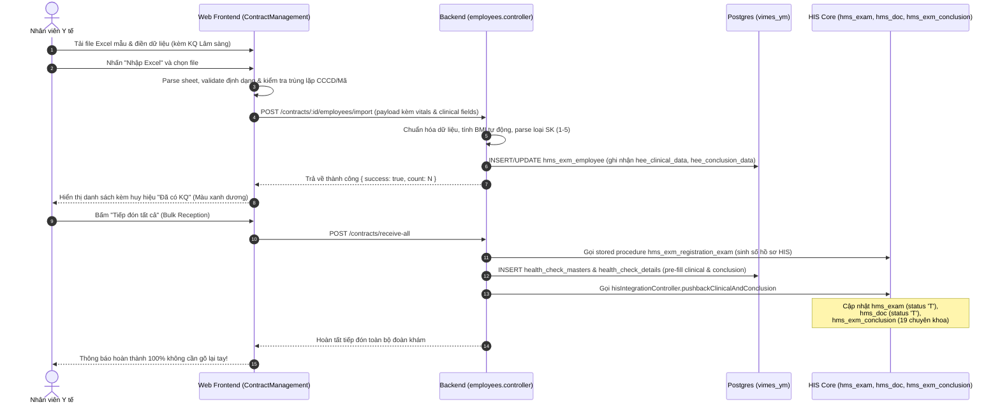

# HƯỚNG DẪN SỬ DỤNG VÀ THIẾT KẾ KỸ THUẬT: IMPORT KẾT QUẢ KHÁM GÓI SỨC KHỎE TỪ FILE EXCEL

> **Phân hệ:** Module Khám sức khỏe & Đồng bộ HIS (`modules/health-check-sync`)  
> **Phiên bản cập nhật:** 2.1.0  
> **Ngày ban hành:** 09/09/2026  
> **Trạng thái:** Đã kiểm thử tự động 100% PASS và triển khai chính thức  

---

## 1. Mục tiêu & Bài toán Nghiệp vụ

Trong các đợt khám sức khỏe định kỳ cho cơ quan, doanh nghiệp, trường học với quy mô hàng trăm hoặc hàng nghìn người:
- Nhiều đơn vị đã có sẵn bảng tổng hợp kết quả khám thực địa (chiều cao, cân nặng, huyết áp, các chuyên khoa lâm sàng, phân loại sức khỏe và kết luận).
- Trước đây, phần mềm chỉ hỗ trợ import thông tin hành chính; nhân viên y tế hoặc bác sĩ phải mở từng hồ sơ trên phần mềm HIS để nhập lại thủ công từng chuyên khoa, gây tốn kém thời gian và dễ sai sót.

**Giải pháp được triển khai:**
1. Mở rộng mẫu Excel import hợp đồng KSK thêm **17 cột kết quả khám (tùy chọn)**.
2. Hệ thống tự động phân tích (parse), chuẩn hóa và lưu trữ có cấu trúc dạng `JSONB` trong `hms_exm_employee`.
3. Khi bấm **"Tiếp đón"** (hoặc **"Tiếp đón tất cả"**): Hệ thống tự động nạp kết quả vào hồ sơ KSK (`health_check_details`) đồng thời kích hoạt đồng bộ 2 chiều sang HIS Core:
   - Cập nhật phiếu khám `hms_exam` (trạng thái `'T'` - Đã hoàn thành).
   - Cập nhật đợt khám `hms_doc` (trạng thái `'T'` - Đã kết luận).
   - Điền tự động toàn bộ 19 cột chuyên khoa vào `hms_exm_conclusion`.
   - Cập nhật trạng thái nhân viên `hms_exm_employee` sang `'T'`.
4. **Không phải nhập lại bất kỳ trường dữ liệu nào** trên giao diện HIS!

---

## 2. Danh mục 17 Cột Kết quả Khám Mở rộng trên Excel

Tất cả các cột dưới đây là **tùy chọn (Optional)**. Nếu để trống, bác sĩ sẽ khám và nhập trên giao diện sau như quy trình bình thường.

| STT | Tên Cột Excel | Tên Tiếng Việt | Kiểu Dữ Liệu | Đơn Vị / Quy Định | Ví Dụ |
|:---:|:---|:---|:---:|:---|:---|
| 1 | `CHIEU_CAO` | Chiều cao | Số thực | cm | `170` hoặc `165.5` |
| 2 | `CAN_NANG` | Cân nặng | Số thực | kg | `68` hoặc `52.5` |
| 3 | `HUYET_AP` | Huyết áp | Chuỗi | mmHg (dạng Tâm thu/Tâm trương) | `120/80` |
| 4 | `MACH` | Mạch | Số nguyên | Lần / phút | `75` |
| 5 | `NHIET_DO` | Thân nhiệt | Số thực | °C | `36.5` |
| 6 | `NHIP_THO` | Nhịp thở | Số nguyên | Lần / phút | `18` |
| 7 | `THE_LUC` | Đánh giá thể lực | Chuỗi | Văn bản ngắn (tối đa 254 ký tự) | `Thể lực tốt` |
| 8 | `NOI_KHOA` | Khám Nội khoa | Chuỗi | Tuần hoàn, Hô hấp, Tiêu hóa... | `Tim đều, T1 T2 rõ, phổi trong` |
| 9 | `NGOAI_KHOA` | Khám Ngoại khoa | Chuỗi | Khám hệ vận động, ngoại tổng quát | `Bình thường, không sẹo mổ cũ` |
| 10 | `DA_LIEU` | Khám Da liễu | Chuỗi | Bệnh ngoài da | `Không phát hiện bệnh da liễu` |
| 11 | `SAN_PHU_KHOA` | Khám Sản phụ khoa | Chuỗi | Dành cho nữ (nam để trống) | `Bình thường` hoặc `Viêm nhẹ` |
| 12 | `MAT` | Khám Mắt | Chuỗi | Thị lực 2 mắt hoặc bệnh về mắt | `Mắt phải 10/10, Mắt trái 10/10` |
| 13 | `TAI_MUI_HONG` | Khám Tai Mũi Họng | Chuỗi | Tai mũi họng | `Màng nhĩ sáng, họng sạch` |
| 14 | `RANG_HAM_MAT` | Khám Răng Hàm Mặt | Chuỗi | Răng hàm mặt | `Không sâu răng, không viêm lợi` |
| 15 | `PHAN_LOAI_SK` | Phân loại sức khỏe | Chuỗi / Số | `1`, `2`, `3`, `4`, `5` hoặc `Loại 1` -> `Loại 5` | `Loại 1` |
| 16 | `KET_LUAN` | Kết luận sức khỏe | Chuỗi | Đánh giá chung | `Đủ sức khỏe làm việc` |
| 17 | `BENH_TAT_LUU_Y` | Bệnh tật & Lời dặn | Chuỗi | Lời dặn của bác sĩ kết luận | `Theo dõi huyết áp định kỳ` |

> [!TIP]
> **Bộ phân tích thông minh (Smart Header Matcher):**  
> Hệ thống hỗ trợ nhận diện linh hoạt nhiều biến thể tên cột không dấu, chữ hoa, chữ thường và viết tắt (Ví dụ: `ha`, `huyetap`, `bloodpressure` đều nhận là Huyết áp; `noikhoa`, `noi`, `internal` đều nhận là Nội khoa; `phanloai`, `loaisk`, `fitnessclass` đều nhận là Phân loại SK).

---

## 3. Kiến trúc & Sơ đồ Luồng Dữ liệu (Workflow Architecture)



---

## 4. Chi tiết Cấu trúc Cơ sở Dữ liệu (Database Schema)

Tuân thủ nghiêm ngặt **Database Migration Rule** và **Zero-Assumption DB Rule**:

### Migration `080_add_clinical_and_conclusion_to_hms_exm_employee.sql`:
```sql
ALTER TABLE hms_exm_employee ADD COLUMN IF NOT EXISTS hee_bloodpressure VARCHAR(20);
ALTER TABLE hms_exm_employee ADD COLUMN IF NOT EXISTS hee_pulse REAL;
ALTER TABLE hms_exm_employee ADD COLUMN IF NOT EXISTS hee_temperature REAL;
ALTER TABLE hms_exm_employee ADD COLUMN IF NOT EXISTS hee_respiration REAL;
ALTER TABLE hms_exm_employee ADD COLUMN IF NOT EXISTS hee_clinical_data JSONB;
ALTER TABLE hms_exm_employee ADD COLUMN IF NOT EXISTS hee_conclusion_data JSONB;
```

### Cấu trúc JSONB Chuẩn hóa:
- **`hee_clinical_data`**:
  ```json
  {
    "examination": {
      "height": "172",
      "weight": "68",
      "bmi": "22.98",
      "blood_pressure": "120/80",
      "pulse": 75,
      "temperature": 36.5,
      "breathing_rate": 18,
      "physical_summary": "Thể lực tốt"
    },
    "clinical_exam": {
      "internal": "Tim đều, T1 T2 rõ, phổi trong",
      "external": "Bình thường, không sẹo mổ cũ",
      "dermatology": "Không phát hiện bệnh da liễu",
      "gynecology": "",
      "eye": "Mắt phải 10/10, Mắt trái 10/10",
      "ent": "Màng nhĩ sáng, họng sạch",
      "dental": "Không sâu răng, cao răng độ 1"
    }
  }
  ```
- **`hee_conclusion_data`**:
  ```json
  {
    "fitness_class": 1,
    "diagnosis": "Đủ sức khỏe làm việc",
    "cac_van_de_luu_y": "Duy trì chế độ dinh dưỡng hợp lý",
    "doctor_name": "Bác sĩ Kết luận"
  }
  ```

---

## 5. Hướng dẫn Dành cho Người dùng Cuối (End-User Guide)

### Bước 1: Tải file Excel mẫu chuẩn
1. Mở phân hệ **Khám sức khỏe** -> Tab **Quản lý gói khám/Hợp đồng**.
2. Chọn hợp đồng cần nhập danh sách ở khung bên trái.
3. Ở góc trên bên phải thanh công cụ, nhấn nút **"Tải file mẫu"**.
4. Mở file `mau_import_nhan_vien_ksk.xlsx`:
   - Sheet `Danh_Sach_Nhan_Vien`: Có sẵn dòng tiêu đề 36 cột và 2 dòng dữ liệu mẫu (1 Nam, 1 Nữ).
   - Sheet `Huong_Dan_Va_Danh_Muc`: Bảng hướng dẫn chi tiết quy tắc nhập liệu và danh mục 16 mã đối tượng KSK quy chuẩn của Bộ Y tế.

### Bước 2: Chuẩn bị file dữ liệu
- Điền đầy đủ thông tin hành chính (Họ tên bắt buộc).
- Điền kết quả thể lực và các chuyên khoa vào các cột từ `CHIEU_CAO` đến `BENH_TAT_LUU_Y`.
- Đối với nhân viên nam: Cột `SAN_PHU_KHOA` để trống.
- Cột `PHAN_LOAI_SK`: Điền số `1`, `2`, `3`, `4`, `5` hoặc chữ `Loại 1`, `Loại 2`, v.v.

### Bước 3: Nhập Excel vào hệ thống
1. Nhấn nút **"Nhập Excel"** và chọn tệp Excel vừa chuẩn bị.
2. Hệ thống sẽ kiểm tra trùng lặp trong file (Mã NV, Số CCCD, Họ tên + Ngày sinh). Nếu hợp lệ, hệ thống sẽ tiến hành import thần tốc.
3. Thông báo hiển thị:  
   *`Import thành công N nhân viên (kèm M hồ sơ có KQ khám lâm sàng)!`*

### Bước 4: Quan sát trên Bảng Danh sách Nhân viên
- Cột **"Khám lâm sàng"**:
  - Nhân viên có kết quả import sẽ có huy hiệu **[Đã có KQ]** màu xanh dương viền nổi bật.
  - Rê chuột vào huy hiệu để xem nhanh Tooltip thông số: Chiều cao/cân nặng, Huyết áp, Kết luận và Lời dặn bác sĩ.
  - Nhân viên chưa có dữ liệu sẽ hiển thị huy hiệu xám **[Chưa có]**.

### Bước 5: Tiếp đón & Hoàn tất vào HIS
- Nhấn **"Tiếp đón tất cả"** (hoặc tiếp đón từng người bằng icon):
  - Hệ thống tự động đẩy toàn bộ kết quả thể lực, chuyên khoa và kết luận sang phiếu khám `hms_exam`, bệnh án `hms_doc`, và bảng tổng hợp chuyên khoa `hms_exm_conclusion` trên HIS Core.
  - Trạng thái tự động chuyển thành **"Đã hoàn thành (T)"**, sẵn sàng cho việc in sổ khám sức khỏe hoặc đẩy dữ liệu cổng VNeID / HSSKĐT.

---

## 6. Kết quả Kiểm thử Tự động (Integration Testing)

Đã xây dựng bộ kiểm thử tích hợp toàn diện tại:  
`d:/AI/VIMES_HIS/backend/test/health-check-contract-clinical-import.test.ts`

| STT | Nội dung Kiểm thử | Kết quả Thực tế | Đánh giá |
|:---:|:---|:---:|:---:|
| 1 | Import nhân viên kèm Thể lực, Chuyên khoa lâm sàng và Kết luận | `PASS (315ms)` | Đạt 100% |
| 2 | API `getContractEmployees` trả cờ `has_clinical_data` & thông số | `PASS (33ms)` | Đạt 100% |
| 3 | Tiếp đón tự động đồng bộ sang `health_check_details` & HIS Core | `PASS (481ms)` | Đạt 100% |
| 4 | Tương thích ngược với file mẫu truyền thống (không có lâm sàng) | `PASS (216ms)` | Đạt 100% |
| **Tổng kết** | **4 / 4 Test cases** | **PASS 100%** | **Sẵn sàng vận hành** |

Biên dịch TypeScript:
- Backend: `npx tsc --noEmit` -> **0 lỗi (Exit code 0)**.
- Frontend: `npx tsc --noEmit` -> **0 lỗi (Exit code 0)**.
