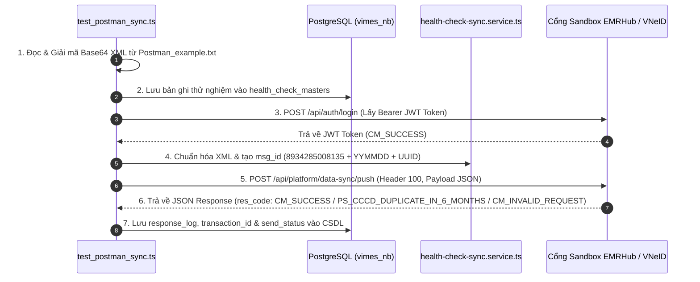

# HƯỚNG DẪN THỦ TỤC TEST GỬI DỮ LIỆU TỪ POSTMAN_EXAMPLE.TXT SANG CỔNG EMRHUB / VNEID

Tài liệu này hướng dẫn chạy kịch bản kiểm thử tự động đọc dữ liệu mẫu từ `Postman_example.txt`, lấy Token đăng nhập mới từ Cổng, đóng gói payload JSON chuẩn v1.0.6 và gửi trực tiếp sang Cổng `api-sandbox.emrhub.vn/api/platform/data-sync/push`.

---

## 1. Cấu trúc các bước xử lý trong thủ tục Test

Thủ tục được đóng gói tại file: `backend/test_postman_sync.ts`



---

## 2. Lệnh chạy thủ tục kiểm thử (Command Execution)

Mở Terminal tại thư mục `backend` và chạy lệnh:

```bash
cd d:/AI/VIMES_HIS/backend
npx ts-node test_postman_sync.ts
```

---

## 3. Dữ liệu Request Payload mẫu gửi đi

- **Endpoint**: `POST https://api-sandbox.emrhub.vn/api/platform/data-sync/push`
- **Headers**:
  - `Content-Type`: `application/json`
  - `service-type`: `100`
  - `Authorization`: `Bearer <token>`
- **Body Payload**:
```json
{
  "header": {
    "version": "1.0.6",
    "sender_id": "8934285008135",
    "receiver_id": "TTYQG",
    "txn_type": "sync_checkup",
    "msg_id": "8934285008135260710b45b0278679c44eab8f7d77cd38514a7",
    "msg_type": "101",
    "data_type": "xml/base64",
    "send_datetime": 1784871059154
  },
  "data": {
    "file_content": "PD94bWwgdmVyc2lvbj0iMS4wIiBlbmNvZGluZz0idXRmLTgiPz4K..."
  },
  "signature": "<checksum RSA-SHA256 của canonical header.data>"
}
```

---

## 4. Kết quả Phản hồi từ Cổng (Response Structure)

Cổng trả về kết quả cấu trúc chuẩn dạng JSON và được tự động ghi nhận vào cột `response_log` và `send_status` trong bảng `health_check_masters`:

```json
{
  "header": {
    "version": "1.0.6",
    "sender_id": "8934285008135",
    "receiver_id": "emrhub",
    "txn_id": "DS-8934285008135-372bed7995bd4b89bdc0ee711f233a33",
    "txn_type": "sync_checkup",
    "res_code": "CM_INVALID_REQUEST",
    "res_msg": "Error returned when input data is not up to standard.",
    "msg_id": "emrhub20260720541431a1c2411426eb7132022bd5defe2",
    "msg_type": "102",
    "ref_msg_id": "8934285008135260710b45b0278679c44eab8f7d77cd38514a7",
    "send_datetime": 1784871059154,
    "res_datetime": 1784871056098
  },
  "data": null,
  "signature": "Ly1qx3vTDmo68hwX9tyOv3KsKa3QSbtRn2D6L5XDzLrtCdn/UtfzjfOfepTCyd1Sn5zOxlgmAUJ7R0GRuKg8Ya16wUHwvOzZ4VIK6BY9KaEubEMbiLW6BBPpsd/JvYY0RXvx6K7sktNOBST0w5lFYmf8dYTcPOSYLYuRYSi2juT2I6mCHOIX/qSTtcQgOJTw5TAwNr8CWcBM76c9hNb+yn89Nsaie+vrcGo7sxNbTx+db1YRab1nEGfyk6uxJbXnirVkbl09VFsFhu3nBs/qWKZtkQXVnfjfo6JcpW+BKt6Fr1lOqJ9g6qhg8RsLff7aUpQOZj0udJsfDT35f+rDQg=="
}
```
