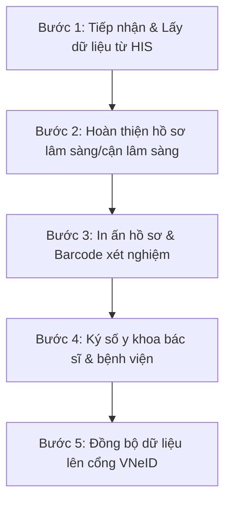

# HƯỚNG DẪN SỬ DỤNG MODULE LIÊN THÔNG KHÁM SỨC KHỎE (VNeID)

Tài liệu này hướng dẫn chi tiết quy trình vận hành và sử dụng Module **Liên thông Khám sức khỏe (health-check-sync)** trên hệ thống vClinic, đáp ứng tiêu chuẩn **Quyết định 1551/QĐ-BYT** của Bộ Y tế để liên thông dữ liệu lên Cổng Sức khỏe điện tử VNeID.

---

## 1. Tổng quan quy trình nghiệp vụ (Workflow)

Quy trình liên thông dữ liệu khám sức khỏe (KSK) gồm 5 bước cốt lõi:

---

## 2. Hướng dẫn chi tiết từng bước vận hành

### 2.1. Bước 1: Tiếp nhận và lấy dữ liệu khám từ HIS
Hệ thống hỗ trợ lấy dữ liệu tự động từ phần mềm Quản lý Bệnh viện (HIS) để giảm thiểu nhập liệu thủ công.

1. Truy cập vào menu **Khám sức khỏe VNeID** -> Chọn tab **Đồng bộ từ HIS**.
2. Thiết lập bộ lọc:
   * **Từ ngày - Đến ngày:** Chọn khoảng thời gian bệnh nhân đến khám sức khỏe.
   * **Đoàn khám/Công ty:** Chọn danh sách theo gói khám sức khỏe cơ quan/doanh nghiệp (nếu khám theo đoàn).
3. Nhấn **Quét dữ liệu HIS**: Hệ thống hiển thị danh sách các hồ sơ đủ điều kiện liên thông.
4. Chọn các bệnh nhân cần xử lý -> Nhấn **Khởi tạo hồ sơ VNeID**. Hệ thống sẽ tự động ánh xạ thông tin hành chính và tạo hồ sơ nháp tương ứng với 1 trong 17 mẫu biểu.

---

### 2.2. Bước 2: Hoàn thiện hồ sơ nhập liệu động (Dynamic Form)
Với 17 mẫu biểu khám sức khỏe khác nhau (ví dụ: Mẫu 1 cho học sinh, Mẫu 2 cho người lớn, Mẫu 3 cho người lái xe...), hệ thống tự động hiển thị biểu mẫu tương thích:

1. Tại danh sách hồ sơ, nhấn **Chi tiết** hoặc **Chỉnh sửa** (Icon cây bút) tại dòng của bệnh nhân.
2. Giao diện **Form nhập liệu động** sẽ xuất hiện:
   * **Thông tin hành chính:** Được điền sẵn từ dữ liệu CCCD/HIS. Cho phép chỉnh sửa thông tin người giám hộ (đối với học sinh - Mẫu 1).
   * **Khám thể lực:** Nhập `Chiều cao (cm)` và `Cân nặng (kg)`. Chỉ số **BMI** sẽ tự động được tính toán. Nhập huyết áp theo định dạng `Tối đa/Tối thiểu` (VD: `120/80`).
   * **Tiền sử bản thân & gia đình:** Bật/Tắt switch Đã mắc bệnh. Nếu có, hỗ trợ tìm kiếm nhanh mã bệnh bằng từ khóa hoặc mã **ICD-10**.
   * **Khám các chuyên khoa:** Nhập đánh giá lâm sàng và phân loại sức khỏe chuyên khoa (Dropdown từ Loại I đến Loại V).
3. Nhấn **Lưu hồ sơ**. Trạng thái ký số của hồ sơ sẽ tự động chuyển về `Chưa ký (Unsigned)` và trạng thái đồng bộ về `Chưa gửi (Unsent)` nếu có chỉnh sửa.

---

### 2.3. Bước 3: In ấn hồ sơ và Barcode định danh
Hỗ trợ in ấn mẫu biểu chuẩn phục vụ lưu trữ bản cứng và dán mã vạch xét nghiệm.

1. **In hồ sơ khám bệnh:**
   * Tại danh sách hồ sơ, nhấn nút **In hồ sơ** (Icon máy in).
   * Hệ thống hiển thị bản in chuẩn khổ A4. Nếu hồ sơ đã được ký số, hệ thống sẽ tự động chèn **Mộc ký số y khoa điện tử** (Digital Signature Seal) trực quan lên bản in.
2. **In Barcode xét nghiệm / Khám:**
   * Chọn bệnh nhân cần in -> Chọn **In Barcode**.
   * Hỗ trợ in Barcode KSK hoặc Barcode Xét nghiệm (XN) kích thước chuẩn `50x30` phục vụ dán lên các ống nghiệm, đảm bảo tính liên kết dữ liệu cận lâm sàng chính xác.

---

### 2.4. Bước 4: Ký số y khoa (Digital Signature)
Tất cả hồ sơ KSK bắt buộc phải được ký số trước khi gửi lên cổng liên thông VNeID. Hệ thống hỗ trợ 2 phương thức ký:
* **Ký bằng USB Token:** Bác sĩ cắm USB Token cá nhân/bệnh viện vào máy trạm để ký trực tiếp.
* **Ký bằng Cloud HSM (Khuyên dùng):** Ký số tập trung qua tài khoản đám mây tốc độ cao.

**Cách thực hiện ký số hàng loạt:**
1. Trên màn hình danh sách hồ sơ, tích chọn các hồ sơ có trạng thái **Chưa ký**.
2. Chọn phương thức ký: **USB** hoặc **HSM**.
3. Nhấn nút **Ký số hàng loạt** (Icon chiếc bút ký).
4. Nhập mã PIN ký số. Trạng thái chữ ký của các hồ sơ chuyển sang **Đã ký (Signed)** kèm thông tin chữ ký Base64 hiển thị chi tiết trong XML.

---

### 2.5. Bước 5: Đồng bộ dữ liệu lên cổng VNeID
Gửi các hồ sơ đã ký số hợp lệ lên cổng giám định VNeID của Bộ Y tế.

1. Chọn các hồ sơ có trạng thái **Đã ký** và trạng thái đồng bộ là **Chưa gửi** hoặc **Gửi lỗi**.
2. Nhấn nút **Đồng bộ cổng VNeID** (Icon máy bay giấy).
3. Hệ thống tiến hành đóng gói XML đã ký, gọi API cổng liên thông.
4. **Kiểm tra kết quả:**
   * Nếu thành công: Trạng thái chuyển sang **Thành công (Success)** kèm mã giao dịch `Transaction ID`.
   * Nếu thất bại: Trạng thái chuyển sang **Lỗi (Error)**. Người dùng có thể click vào dòng lỗi để xem chi tiết thông báo lỗi trả về từ cổng (ví dụ: sai định dạng CCCD, thiếu trường thông tin bắt buộc) để tiến hành sửa lại hồ sơ và đồng bộ lại.

---

## 3. Các lưu ý quan trọng khi vận hành
* **Định dạng CCCD:** Phải đúng 12 chữ số hợp lệ của bệnh nhân hoặc người giám hộ.
* **Quy chuẩn mã ICD-10:** Toàn bộ tiền sử và kết luận bệnh chính bắt buộc phải chọn mã ICD-10 hợp lệ từ danh mục tích hợp của Bộ Y tế.
* **Chỉnh sửa sau khi ký số:** Bất kỳ thao tác chỉnh sửa thông tin nào trên hồ sơ đã ký sẽ làm mất hiệu lực của chữ ký số hiện tại. Hệ thống sẽ tự động reset trạng thái hồ sơ về **Chưa ký** và yêu cầu thực hiện ký số lại từ đầu để đảm bảo tính toàn vẹn dữ liệu.
* **Cấu hình Barcode:** Người dùng có thể cấu hình hiển thị tên bệnh viện, ngày khám và loại mẫu xét nghiệm trên nhãn Barcode tại tab **Cấu hình hệ thống**.

---
**Bộ phận Hỗ trợ Vận hành vClinic**
