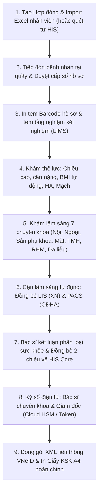
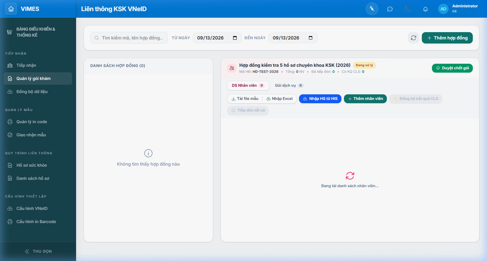
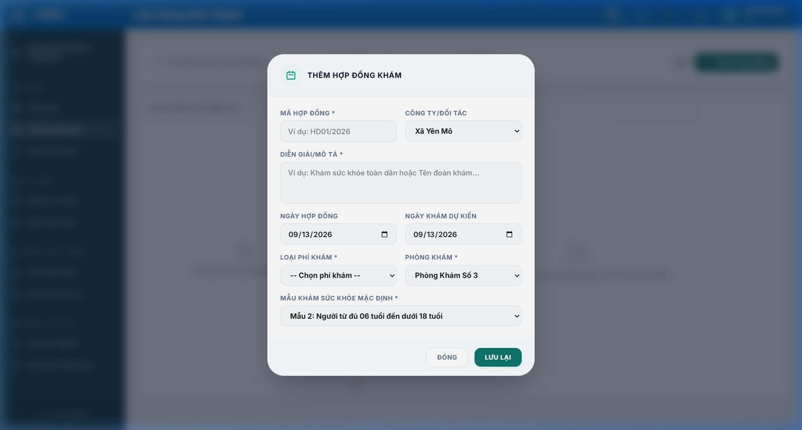
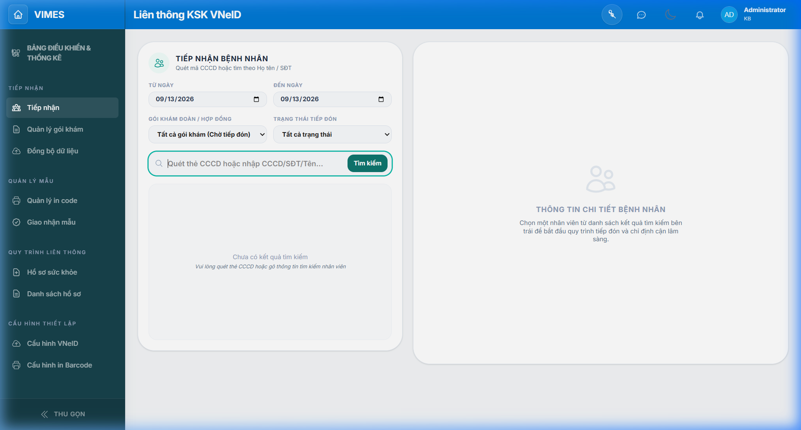
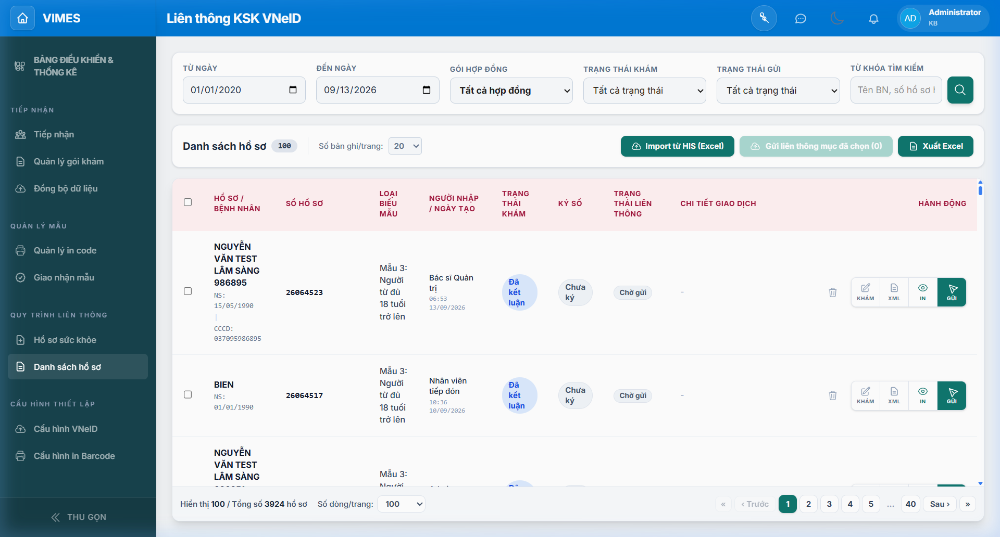
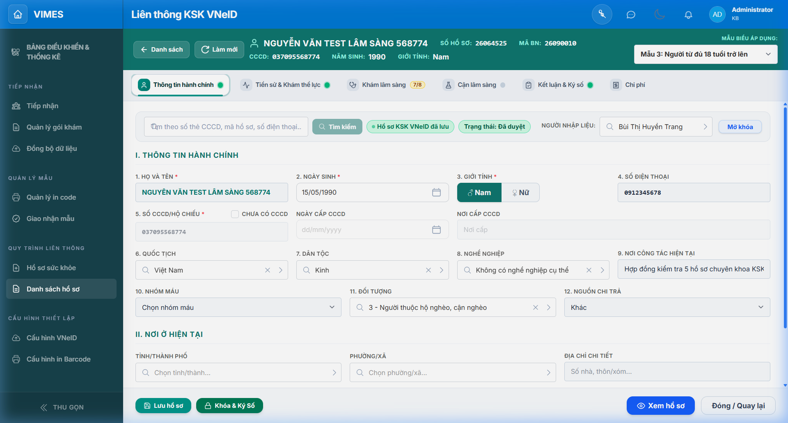
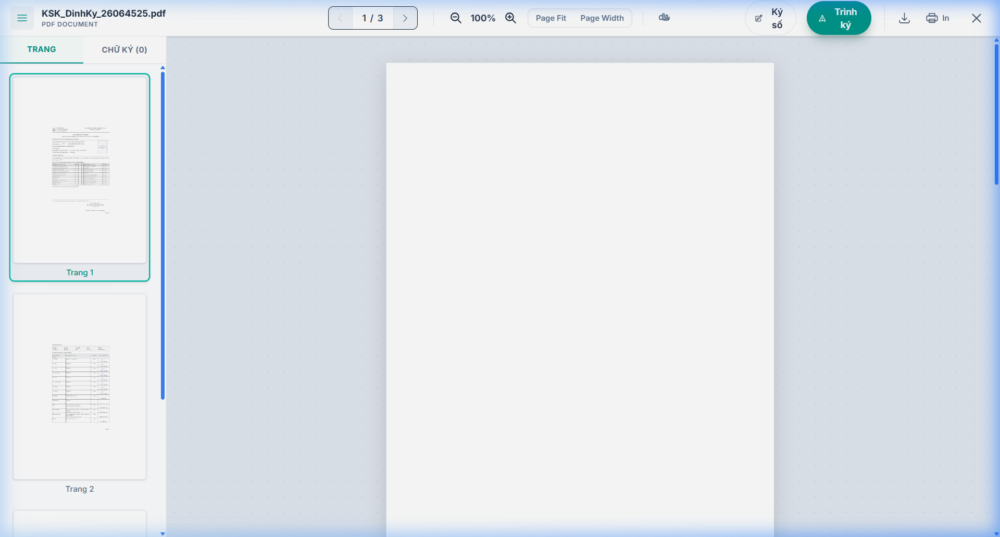
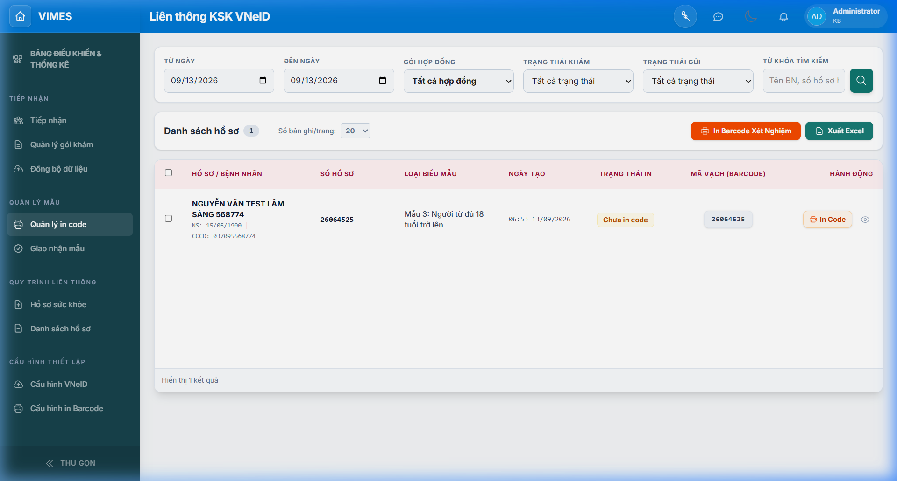

# SỔ TAY HƯỚNG DẪN SỬ DỤNG VẬN HÀNH
## PHÂN HỆ KHÁM SỨC KHỎE ĐỊNH KỲ & LIÊN THÔNG DỮ LIỆU VNeID (VIMES HIS)

> **Cơ quan phát triển:** Khối Giải pháp Y tế số VIMES  
> **Phiên bản:** 3.2.0 (Cập nhật tháng 09/2026)  
> **Tài liệu Word hoàn chỉnh (.docx):** [Huong_Dan_Su_Dung_Module_Kham_Suc_Khoe_VNeID.docx](./Huong_Dan_Su_Dung_Module_Kham_Suc_Khoe_VNeID.docx)  
> **Căn cứ pháp lý:** Thông tư 32/2023/TT-BYT, Quyết định 1551/QĐ-BYT, Quyết định 2062/QĐ-BYT của Bộ Y tế, Thông tư 36/2024/TT-BYT.

---

## MỤC LỤC HƯỚNG DẪN THEO VAI TRÒ NGHIỆP VỤ

| Phân hệ / Vị trí | Nội dung hướng dẫn chính | Màn hình tương ứng |
|---|---|---|
| **Bộ phận Kế hoạch / Khám đoàn** | Tạo hợp đồng, Import danh sách nhân viên từ Excel, gán gói khám | Menu: Quản lý hợp đồng (`#/health-check?step=contracts`) |
| **Bộ phận Tiếp đón bệnh nhân** | Tìm kiếm nhân viên, phân phòng khám, duyệt bệnh nhân, in tem Barcode | Menu: Tiếp đón bệnh nhân (`#/health-check?step=reception`) |
| **Bác sĩ Khám lâm sàng** | Khám thể lực (BMI), khám 7 chuyên khoa, duyệt chuyên khoa | Menu: Quản lý hồ sơ -> [Sửa / Khám] (`DynamicForm`) |
| **Khoa Xét nghiệm & CĐHA** | Đồng bộ kết quả LIS/PACS, in tem ống nghiệm Barcode 50x30mm | Menu: In mã hồ sơ (`#/health-check?step=print-code`) |
| **Bác sĩ Kết luận & Lãnh đạo** | Phân loại sức khỏe I - V, chẩn đoán ICD-10, ký số Cloud HSM / Token | Menu: Quản lý hồ sơ -> [Xem XML] & [Ký số] |
| **Tổ Công nghệ thông tin** | Đóng gói XML QĐ 1551, gửi liên thông VNeID, cấu hình hệ thống | Menu: Cấu hình VNeID (`#/health-check?step=settings`) |

---

## CHƯƠNG 1: TỔNG QUAN HỆ THỐNG VÀ QUY TRÌNH NGHIỆP VỤ

### Danh mục các biểu mẫu khám sức khỏe chuẩn Bộ Y tế
- **Mẫu 01:** Giấy khám sức khỏe định kỳ cho trẻ em dưới 06 tuổi (Phụ lục XXIV - TT 32/2023/TT-BYT).
- **Mẫu 02:** Giấy khám sức khỏe định kỳ học sinh, thiếu niên từ đủ 06 tuổi đến dưới 18 tuổi (Phụ lục XXV - TT 32/2023/TT-BYT).
- **Mẫu 03:** Giấy khám sức khỏe định kỳ người lớn từ đủ 18 tuổi trở lên (Phụ lục XXVI - TT 32/2023/TT-BYT).
- **Mẫu Lái xe:** Giấy khám sức khỏe người lái xe (Thông tư số 36/2024/TT-BYT).
- **Mẫu Thuyền viên:** Giấy khám sức khỏe định kỳ thuyền viên đi biển.

---

## CHƯƠNG 2: QUẢN LÝ HỢP ĐỒNG KSK & IMPORT DANH SÁCH NHÂN VIÊN TỪ EXCEL

Chức năng Quản lý hợp đồng (truy cập tại: `#/health-check?step=contracts`) phục vụ thiết lập các đợt khám sức khỏe đoàn cho cơ quan, công ty, nhà máy, trường học.

### 2.1. Thao tác Tạo mới Hợp đồng Khám sức khỏe
1. **Bước 1:** Tại màn hình Quản lý hợp đồng, bấm nút **[+ Thêm hợp đồng]** ở góc trên bên phải.
2. **Bước 2:** Điền các thông tin trong hộp thoại:
   - **Mã hợp đồng:** Nhập mã định danh (VD: `HD2026-XIMANG`, `HD-MAYMAC`...).
   - **Tên hợp đồng:** Tên đợt khám (VD: *Khám sức khỏe định kỳ năm 2026 - Công ty Xi măng Vicem*).
   - **Công ty / Doanh nghiệp:** Chọn hoặc nhập tên cơ quan/doanh nghiệp ký kết.
   - **Ngày ký & Ngày khám:** Chọn ngày ký hợp đồng và ngày tổ chức khám thực tế.
   - **Loại đối tượng:** KSK Doanh nghiệp, BHYT, Dịch vụ...
   - **Biểu mẫu áp dụng:** Chọn Mẫu 03 (người lớn) hoặc Mẫu 02 (học sinh).
3. **Bước 3:** Nhấn nút **[Lưu hợp đồng]**. Hợp đồng mới tạo sẽ xuất hiện ngay trên danh sách.

### 2.2. Thao tác Import danh sách nhân viên từ file Excel
1. **Bước 1 (Tải file mẫu):** Chọn hợp đồng trên danh sách, bấm nút **[Tải file mẫu Excel]**. Hệ thống xuất file Excel mẫu `.xlsx` chuẩn.
2. **Bước 2 (Chuẩn bị dữ liệu):** Nhập danh sách nhân sự công ty vào file:
   - Cột bắt buộc: *Mã nhân viên, Họ và tên, Ngày sinh (DD/MM/YYYY), Giới tính (Nam/Nữ), Số CCCD (12 số)*.
   - Cột bổ sung: *Số điện thoại, Địa chỉ cư trú, Phòng ban, Chức vụ*.
3. **Bước 3 (Nạp file):** Bấm nút **[Nhập từ Excel]** -> Chọn file Excel vừa điền. Hệ thống quét dữ liệu, tự động kiểm tra tính hợp lệ và hiển thị bảng xem trước (Preview). Dòng lỗi (trùng CCCD, sai ngày sinh) sẽ có cảnh báo đỏ rõ ràng.
4. **Bước 4 (Xác nhận):** Bấm nút **[Xác nhận Import]**. Toàn bộ nhân viên hợp lệ được nạp vào hợp đồng và sẵn sàng cho khâu tiếp đón.

### 2.3. Thiết lập Gói dịch vụ khám cho hợp đồng
1. Chọn hợp đồng -> Chuyển sang Tab **"Gói dịch vụ khám"**.
2. Tích chọn các kỹ thuật trong gói: Khám lâm sàng đa khoa, Xét nghiệm máu, Xét nghiệm nước tiểu, X-quang tim phổi, Siêu âm ổ bụng, Điện tim...
3. Bấm **[Lưu gói dịch vụ]**. Khi bệnh nhân được tiếp đón, hệ thống sẽ tự động chỉ định toàn bộ danh mục dịch vụ này.

### 2.4. Tính năng Import danh sách số hồ sơ từ HIS (HisBatchImportModal)
Tại màn hình Quản lý hồ sơ, nút **[Import từ HIS (Excel)]** cho phép nạp danh sách các số hồ sơ khám (`doc_no`) đã tiếp nhận trước trên HIS. Hệ thống tự động quét và đồng bộ dữ liệu vào hồ sơ KSK hàng loạt có hiển thị thanh tiến trình trực quan.

---

## CHƯƠNG 3: TIẾP ĐÓN BỆNH NHÂN & PHÊ DUYỆT CẤP SỐ HỒ SƠ TẠI QUẦY

Màn hình Tiếp đón bệnh nhân (truy cập tại: `#/health-check?step=reception`) là nơi điều dưỡng và nhân viên đón tiếp thực hiện thủ tục cho người đến khám.

### Quy trình 4 bước Tiếp đón & Duyệt bệnh nhân:
1. **Tìm kiếm:**
   - Quét mã vạch CCCD bằng máy đọc Barcode/QR Code.
   - Hoặc nhập số CCCD, Mã nhân viên, Họ tên vào ô tìm kiếm.
   - Hoặc chọn Hợp đồng công ty để lọc toàn bộ nhân viên của đoàn.
2. **Kiểm tra thông tin:** Đối soát thông tin cá nhân. Nếu có thay đổi, bấm nút **[Sửa thông tin]** (biểu tượng bút chì) để cập nhật ngay tại quầy.
3. **Phân phòng khám:** Tại mục *"Phòng khám tiếp nhận"*, chọn phòng khám ban đầu phù hợp (VD: Phòng khám Thể lực, Phòng KSK 1...).
4. **Duyệt tiếp đón & Cấp số hồ sơ:**
   - Nhấn nút **[Duyệt & Cấp số hồ sơ]** (hoặc bấm phím nóng **F4** / **Ctrl + Enter**).
   - Hệ thống tự động cấp số hồ sơ khám ngoại trú (`doc_no`), sinh Barcode Code 128, chuyển trạng thái sang **"ĐÃ TIẾP ĐÓN"** và kích hoạt máy in in Phiếu hướng dẫn khám.

> ⚡ **Mẹo thao tác nhanh:** Khi bật tùy chọn *"Tự động làm mới"*, hệ thống sẽ tự động làm trống ô tìm kiếm ngay sau khi duyệt xong, giúp nhân viên tiếp đón bệnh nhân kế tiếp chỉ trong 3 - 5 giây!

---

## CHƯƠNG 4: QUẢN LÝ DANH SÁCH & ĐIỀU PHỐI HỒ SƠ TOÀN VIỆN

Màn hình Quản lý hồ sơ (`#/health-check?step=manage`) giúp điều phối luồng người bệnh giữa các phòng chuyên khoa:

### Các thao tác nhanh trên từng dòng hồ sơ:
- **[IN] (Xanh lá):** Mở trực tiếp bản in PDF Giấy khám sức khỏe A4 hoàn chỉnh với dữ liệu chuyên khoa mới nhất từ server.
- **[Sửa / Khám] (Xanh dương):** Mở Form nhập liệu DynamicForm để bác sĩ tiến hành khám, cho điểm và phân loại.
- **[Xem XML] (Xám đậm):** Hiển thị dữ liệu XML đóng gói chuẩn QĐ 1551/QĐ-BYT để kiểm tra cấu trúc trước khi truyền.
- **[Gửi VNeID] (Tím):** Gửi trực tiếp hồ sơ đã ký số lên Cổng tiếp nhận dữ liệu Bộ Y tế.
- **[Xóa] (Đỏ):** Hủy hồ sơ nháp khỏi danh sách (yêu cầu quyền quản trị).

---

## CHƯƠNG 5: NHẬP LIỆU KHÁM LÂM SÀNG CHUYÊN KHOA (DYNAMIC FORM)

Biểu mẫu khám DynamicForm tự động thích ứng theo từng loại mẫu biểu khám:

### Nội dung chi tiết các tab khám:
1. **Khám Thể lực & Tự động tính BMI:**
   - Nhập Chiều cao ($cm$) và Cân nặng ($kg$), hệ thống tự tính:
     $$\text{BMI} = \frac{\text{Cân nặng (kg)}}{[\text{Chiều cao (m)}]^2}$$
   - Tự động đề xuất phân loại thể lực: Loại I (BMI 18.5 - 22.9), Loại II, Loại III hoặc Thừa cân / Suy dinh dưỡng.
   - Đo Huyết áp tâm thu/tâm trương, mạch đập, vòng ngực trung bình.
2. **Khám 7 chuyên khoa lâm sàng bắt buộc:**
   - **Nội khoa:** Tuần hoàn, Hô hấp, Tiêu hóa, Thận - Tiết niệu, Cơ xương khớp, Thần kinh, Tâm thần.
   - **Ngoại khoa:** Hệ vận động, cột sống, vết mổ cũ, dị tật.
   - **Sản phụ khoa (Dành cho nữ):** Khám sản khoa, phụ khoa. Đối với nam, hệ thống tự động khóa và in chữ *"Không khám"*.
   - **Mắt:** Thị lực từng mắt (không kính / có kính), sắc giác, thị trường ngang/đứng.
   - **Tai - Mũi - Họng:** Thính lực tai trái/phải (nói thường, nói thầm), thính lực tần số 500 - 6000 Hz.
   - **Răng - Hàm - Mặt:** Đếm răng sâu, mất răng, hàm trên, hàm dưới, nha chu.
   - **Da liễu:** Bệnh ngoài da, dị ứng tiếp xúc.

> 💡 **Tính năng "Điền nhanh kết quả mặc định":** Nhấn nút *Điền nhanh bình thường* ở góc trên form để tự động điền các kết quả lâm sàng bình thường cho tất cả chuyên khoa, tiết kiệm 80% thời gian khám đoàn.

---

## CHƯƠNG 6: ĐỒNG BỘ CẬN LÂM SÀNG TỰ ĐỘNG & ĐẨY NGƯỢC HIS CORE

- **Đồng bộ tự động từ máy xét nghiệm (LIS) & Chẩn đoán hình ảnh (PACS):** Bác sĩ bấm nút **[🔄 Đồng bộ kết quả từ HIS]** để nạp kết quả Công thức máu, Sinh hóa, Nước tiểu 10 thông số, X-quang, Siêu âm, Điện tim (ECG).
- **Đồng bộ ngược về HIS Core (`hms_exm_conclusion`):** Khi lưu hồ sơ, hệ thống tự động cập nhật phân loại sức khỏe, danh sách bệnh tật chính và tên bác sĩ kết luận vào bảng Core HIS ngoại trú.

---

## CHƯƠNG 7: KẾT LUẬN, PHÂN LOẠI SỨC KHỎE & KÝ SỐ ĐIỆN TỬ

### Tiêu chuẩn phân loại sức khỏe tổng thể (Thông tư 32/2023/TT-BYT)
- **Loại I (Rất khỏe):** Tất cả các chuyên khoa đều xếp Loại I.
- **Loại II (Khỏe):** Có ít nhất một chuyên khoa xếp Loại II, không có chuyên khoa nào xếp Loại III trở xuống.
- **Loại III (Trung bình):** Có ít nhất một chuyên khoa xếp Loại III, không có chuyên khoa nào xếp Loại IV hoặc V.
- **Loại IV (Yếu):** Có ít nhất một chuyên khoa xếp Loại IV, người khám cần theo dõi và điều trị.
- **Loại V (Rất yếu):** Có chuyên khoa xếp Loại V hoặc mắc các bệnh mạn tính nặng.

### Ký số điện tử & Đóng gói XML liên thông VNeID
- Hỗ trợ Cloud HSM ký số từ xa và USB Token cắm trực tiếp máy trạm qua VIMES Signer Agent.
- Đóng gói dữ liệu XML chuẩn QĐ 1551/QĐ-BYT và QĐ 2062/QĐ-BYT (XML1, XML2, XML3).
- Bấm **[Gửi VNeID]** để truyền tải qua kênh bảo mật TLS 1.3 và nhận mã giao dịch `Transaction ID`.

---

## CHƯƠNG 8: IN ẤN GIẤY KHÁM SỨC KHỎE & QUẢN LÝ IN MÃ VẠCH (BARCODE)

### Bản in Giấy khám sức khỏe A4 chuẩn Bộ Y tế
Dàn trang 2 mặt A4 tự động, hiển thị sắc nét toàn bộ các chuyên khoa, phân loại và chữ ký số:

### Quản lý In mã vạch hồ sơ & Tem Barcode ống nghiệm
Tại tab In mã hồ sơ (`#/health-check?step=print-code`), hỗ trợ in tem Barcode hồ sơ và in tem nhiệt 50x30 mm dán ống nghiệm phòng Lab:

---

## CHƯƠNG 9: HƯỚNG DẪN XỬ LÝ SỰ CỐ & CÂU HỎI THƯỜNG GẶP (FAQ)

| Hiện tượng / Câu hỏi | Nguyên nhân | Cách xử lý nhanh |
|---|---|---|
| **Không thấy nhân viên trong hợp đồng tại quầy Tiếp đón?** | Hợp đồng chưa được nạp danh sách nhân viên hoặc chọn sai hợp đồng. | Vào mục Quản lý hợp đồng, kiểm tra cột "Số nhân viên". Nếu là 0, thực hiện Import Excel danh sách nhân viên. |
| **Import Excel báo lỗi "Trùng số CCCD"?** | File Excel có 2 dòng trùng số CCCD hoặc nhân viên đã có hồ sơ trong hợp đồng khác. | Kiểm tra lại số CCCD trên file Excel hoặc xóa dòng nhân viên trùng lặp trước khi import lại. |
| **Mục Sản phụ khoa hiển thị "Chưa khám" khi in Mẫu 03?** | Bác sĩ chưa chọn trạng thái "Đã khám/Đã duyệt" hoặc chưa bấm Lưu hồ sơ. | Mở form khám, kiểm tra tab Sản phụ khoa, chọn trạng thái "Đã khám", chọn bác sĩ khám và bấm [Lưu hồ sơ]. |
| **Bệnh nhân nam có hiển thị mục Sản phụ khoa không?** | Quy chuẩn Bộ Y tế yêu cầu thể hiện đủ 7 chuyên khoa. | Hệ thống tự động nhận diện giới tính Nam và in chữ "Không khám", hoàn toàn đúng chuẩn pháp lý. |
| **Cổng VNeID báo lỗi "Mã ICD-10 không hợp lệ"?** | Bác sĩ nhập sai mã chẩn đoán hoặc gõ mã không có trong danh mục Bộ Y tế. | Mở Tab V (Kết luận), xóa mã cũ và chọn mã bệnh chuẩn từ danh mục gợi ý tự động của hệ thống. |
| **Lỗi không kết nối được USB Token ký số?** | Chưa cắm USB Token hoặc phần mềm Signer Agent chưa được bật. | Cắm lại USB Token, khởi chạy ứng dụng VIMES Signer Agent dưới thanh Taskbar và thực hiện ký lại. |

---
**BAN PHÁT TRIỂN & VẬN HÀNH HỆ THỐNG VIMES HIS**  
*Mọi yêu cầu hỗ trợ kỹ thuật, vui lòng liên hệ Bộ phận Kỹ thuật VIMES HIS.*
