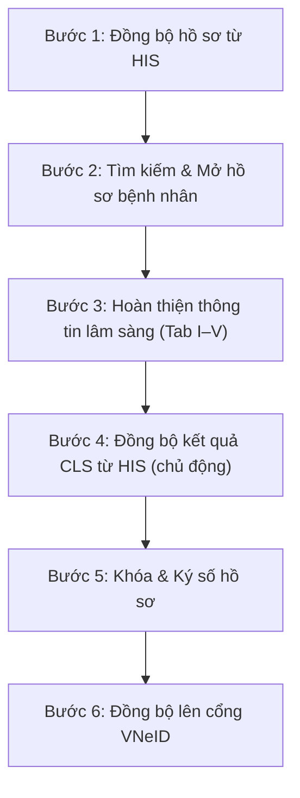

# HƯỚNG DẪN SỬ DỤNG MODULE LIÊN THÔNG KHÁM SỨC KHỎE (VNeID)

> **Phiên bản tài liệu:** 2.0 — Cập nhật ngày 30/06/2026  
> Tài liệu này hướng dẫn chi tiết quy trình vận hành và sử dụng Module **Liên thông Khám sức khỏe (health-check-sync)** trên hệ thống vClinic, đáp ứng tiêu chuẩn **Quyết định 1551/QĐ-BYT** của Bộ Y tế để liên thông dữ liệu lên Cổng Sức khỏe điện tử VNeID.

---

## 1. Tổng quan quy trình nghiệp vụ (Workflow)

> **Lưu ý quan trọng về luồng Cận lâm sàng (CLS):**  
> Sau khi bệnh nhân được chỉ định xét nghiệm/chụp chiếu tại buổi khám, kết quả sẽ được cập nhật vào HIS sau khi máy phân tích xong. Vì vậy, việc lấy kết quả CLS là **chủ động** — bác sĩ nhấn nút **Đồng bộ kết quả từ HIS** tại bất kỳ thời điểm nào cần cập nhật.

---

## 2. Hướng dẫn chi tiết từng bước vận hành

### 2.1. Bước 1: Đồng bộ hồ sơ từ HIS (Tiếp nhận)

Hệ thống hỗ trợ lấy dữ liệu tự động từ phần mềm Quản lý Bệnh viện (HIS) để giảm thiểu nhập liệu thủ công.

1. Truy cập menu **Khám sức khỏe VNeID** → Chọn tab **Đồng bộ dữ liệu**.
2. Thiết lập bộ lọc:
   - **Từ ngày — Đến ngày:** Chọn khoảng thời gian bệnh nhân đến khám.
   - **Đoàn khám/Công ty:** Chọn theo gói khám sức khỏe cơ quan/doanh nghiệp (nếu khám theo đoàn).
3. Nhấn **Quét dữ liệu HIS** — Hệ thống hiển thị danh sách hồ sơ đủ điều kiện.
4. Chọn các bệnh nhân cần xử lý → Nhấn **Khởi tạo hồ sơ VNeID**. Hệ thống tự động ánh xạ thông tin hành chính và tạo hồ sơ nháp tương ứng với 1 trong 17 mẫu biểu.

---

### 2.2. Bước 2: Tìm kiếm và mở hồ sơ bệnh nhân

Từ tab **Hồ sơ sức khỏe**, người dùng tìm kiếm bệnh nhân để bắt đầu quy trình nhập liệu.

#### Tìm kiếm từ danh sách hồ sơ (Nội bộ)
- Ô tìm kiếm chấp nhận: **Số CCCD**, **Mã hồ sơ (MHS)**, **Số điện thoại**.
- Dữ liệu tra cứu từ bảng hồ sơ nội bộ `health_check_masters`.

#### Tìm kiếm từ HIS (Tra cứu trực tiếp)
1. Nhập thông tin vào ô **Tìm kiếm HIS** trên **Tab I. Hành chính & Đặc thù**.
2. Nhấn **Tìm từ HIS** — Hệ thống tra cứu bệnh nhân từ dữ liệu tiếp nhận HIS và tự động điền thông tin hành chính.

> ⚠️ **Yêu cầu bắt buộc:** Khi chưa có thông tin bệnh nhân, các tab chuyên khoa **(II–V)** và nút **Lưu hồ sơ** / **Khóa & Ký Số** sẽ bị **vô hiệu hóa** để tránh tạo hồ sơ trắng không hợp lệ.

---

### 2.3. Bước 3: Hoàn thiện thông tin lâm sàng — Form nhập liệu động

Với 17 mẫu biểu khám sức khỏe, hệ thống tự động hiển thị biểu mẫu tương thích:

| Tab | Nội dung | Ghi chú |
|---|---|---|
| **I. Hành chính & Đặc thù** | Thông tin cơ bản BN, chọn mẫu biểu | Điền sẵn từ HIS |
| **II. Tiền sử & Vaccine** | Tiền sử bản thân/gia đình, lịch tiêm chủng | Hỗ trợ tìm kiếm mã ICD-10 |
| **III. Thể lực & Lâm sàng** | Chiều cao, cân nặng, BMI, HA, khám chuyên khoa | BMI tự tính |
| **IV. Cận lâm sàng** | Xét nghiệm, CĐHA, thăm dò chức năng | **Đồng bộ từ HIS** (xem Bước 4) |
| **V. Kết luận** | Kết luận loại sức khỏe, mã ICD-10 chính | Chọn mã bệnh hợp lệ |

**Tính năng hỗ trợ nhập liệu:**
- **Điền nhanh mặc định:** Nút *Điền nhanh kết quả mặc định* — Tự động điền giá trị bình thường chuẩn, tăng tốc nhập liệu.
- **Mã ICD-10:** Tìm kiếm theo từ khóa hoặc mã. Hỗ trợ chọn **nhiều mã bệnh**. Dữ liệu từ bảng `hms_icd`.
- **BMI:** Tự động tính khi đủ chiều cao và cân nặng.

---

### 2.4. Bước 4: Đồng bộ kết quả Cận lâm sàng từ HIS ⚡

Đây là tính năng **chủ động**, bác sĩ nhấn bất kỳ lúc nào sau khi có kết quả xét nghiệm/chụp chiếu từ HIS.

#### Cách thực hiện:
1. Tại **Tab IV. Cận lâm sàng**, nhấn nút **🔄 Đồng bộ kết quả từ HIS** (góc trên bên phải).
2. Hệ thống truy vấn trực tiếp từ HIS theo mã hồ sơ (`his_doc_no`) và tải về:
   - **Tất cả dịch vụ đã chỉ định** — kể cả **chưa có kết quả** (chờ máy xét nghiệm).
   - **Kết quả xét nghiệm** nếu máy phân tích đã trả về.
   - **Kết quả CĐHA và TĐCN** nếu bác sĩ đã nhập mô tả.
3. Dịch vụ tự động phân loại vào đúng tab con:
   - **Xét nghiệm (XN)** — Mã nhóm `A...` hoặc `B1...`
   - **Chẩn đoán hình ảnh (HA)** — Mã nhóm `B2...` hoặc tên chứa *siêu âm, X-quang, MRI...*
   - **Thăm dò chức năng (TD)** — Mã nhóm `B3...` hoặc tên chứa *điện tim, thính lực, thị lực...*
4. Thông báo kết quả hiển thị **trực tiếp trong Tab** (xanh lá = thành công, đỏ = lỗi).

> 💡 **Thực hiện nhiều lần an toàn:** Nhấn đồng bộ lại bất kỳ lúc nào. Dữ liệu đã nhập ở các tab khác (hành chính, lâm sàng, kết luận) **không bị ảnh hưởng**.

---

### 2.5. Bước 5: Khóa & Ký số hồ sơ

**Ký số từng hồ sơ:**
1. Nhấn nút **Khóa & Ký Số** ở chân trang form nhập liệu.
2. Xác nhận trong hộp thoại → Hồ sơ chuyển sang trạng thái **Đã khóa** — không thể chỉnh sửa.
3. Để mở lại: Nhấn **Mở khóa hồ sơ** (chỉ dành cho quản lý có thẩm quyền).

**Ký số hàng loạt:**
1. Trên danh sách hồ sơ, tích chọn các hồ sơ **Chưa ký**.
2. Chọn phương thức: **USB Token** hoặc **Cloud HSM** (khuyên dùng).
3. Nhấn **Ký số hàng loạt** → Nhập mã PIN → Hoàn thành.

> ⚠️ **Sau khi mở khóa và chỉnh sửa:** Hồ sơ reset về **Chưa ký** — bắt buộc ký lại trước khi gửi VNeID.

---

### 2.6. Bước 6: Đồng bộ lên cổng VNeID

Gửi hồ sơ đã khóa/ký số lên cổng giám định VNeID của Bộ Y tế.

1. Chọn hồ sơ có trạng thái **Đã ký** và đồng bộ **Chưa gửi** hoặc **Gửi lỗi**.
2. Nhấn **Đồng bộ cổng VNeID** (biểu tượng máy bay giấy).
3. Hệ thống đóng gói XML chuẩn, gọi API cổng liên thông:
   - ✅ **Thành công:** Trạng thái chuyển sang *Thành công* kèm mã giao dịch `Transaction ID`.
   - ❌ **Lỗi:** Trạng thái chuyển sang *Lỗi*. Bấm vào dòng lỗi để xem chi tiết → Sửa hồ sơ → Đồng bộ lại.

---

### 2.7. In ấn hồ sơ và Barcode định danh

**In hồ sơ khám bệnh:**
- Tại danh sách, nhấn biểu tượng **In hồ sơ** (máy in).
- Bản in chuẩn A4. Nếu đã ký số, tự động chèn **Mộc ký số điện tử** lên bản in.

**In Barcode xét nghiệm / Khám:**
- Chọn bệnh nhân → Nhấn **In Barcode**.
- Hỗ trợ Barcode KSK hoặc Barcode XN kích thước `50×30` dán lên ống nghiệm.
- Cấu hình tên bệnh viện, ngày khám, loại mẫu tại **Cấu hình Barcode** (menu Cài đặt).

---

## 3. Bảng tra cứu nhanh — Các trạng thái hồ sơ

| Trạng thái | Ý nghĩa | Hành động tiếp theo |
|---|---|---|
| **Nháp** | Mới tạo, chưa hoàn thiện | Nhập liệu, đồng bộ CLS |
| **Hoàn thiện** | Đã nhập đủ thông tin | Khóa & Ký số |
| **Đã khóa / Đã ký** | Đã Khóa & Ký số | Gửi VNeID |
| **Thành công** | Gửi VNeID thành công | Lưu trữ |
| **Gửi lỗi** | Gửi VNeID thất bại | Xem lỗi → Sửa → Gửi lại |

---

## 4. Các lưu ý quan trọng khi vận hành

- **Định dạng CCCD:** Phải đúng **12 chữ số** hợp lệ của bệnh nhân hoặc người giám hộ.
- **Mã ICD-10:** Tiền sử và kết luận bệnh bắt buộc chọn mã hợp lệ từ danh mục `hms_icd`.
- **Chỉnh sửa sau khi khóa:** Bất kỳ thao tác chỉnh sửa nào sau khi ký số sẽ mất hiệu lực chữ ký. Hệ thống tự động reset về **Chưa ký** — bắt buộc ký lại.
- **Đồng bộ CLS nhiều lần:** An toàn — không ghi đè dữ liệu lâm sàng đã nhập thủ công.
- **Bảo mật dữ liệu:** Toàn bộ API yêu cầu xác thực JWT. Dữ liệu bệnh nhân chỉ truy cập được khi đăng nhập hợp lệ.

---
**Bộ phận Hỗ trợ Vận hành vClinic**  
*Tài liệu được cập nhật theo phiên bản phần mềm.*
