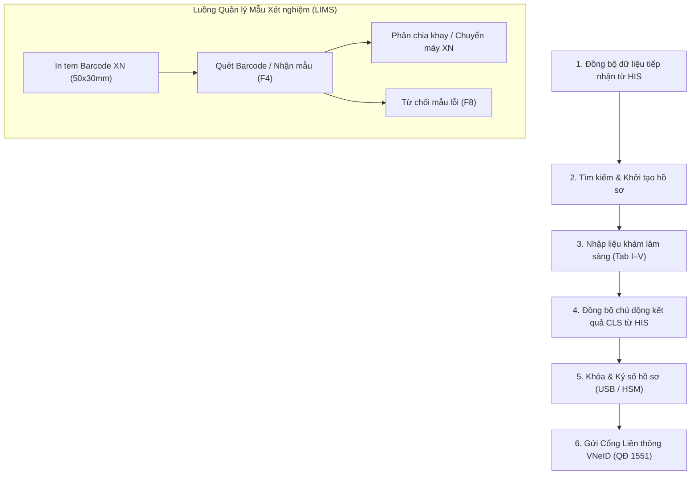
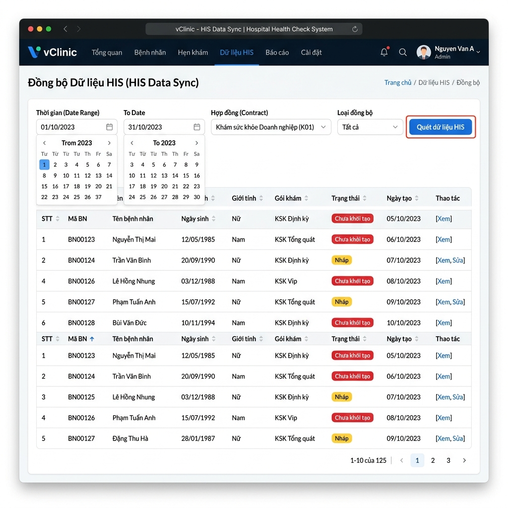
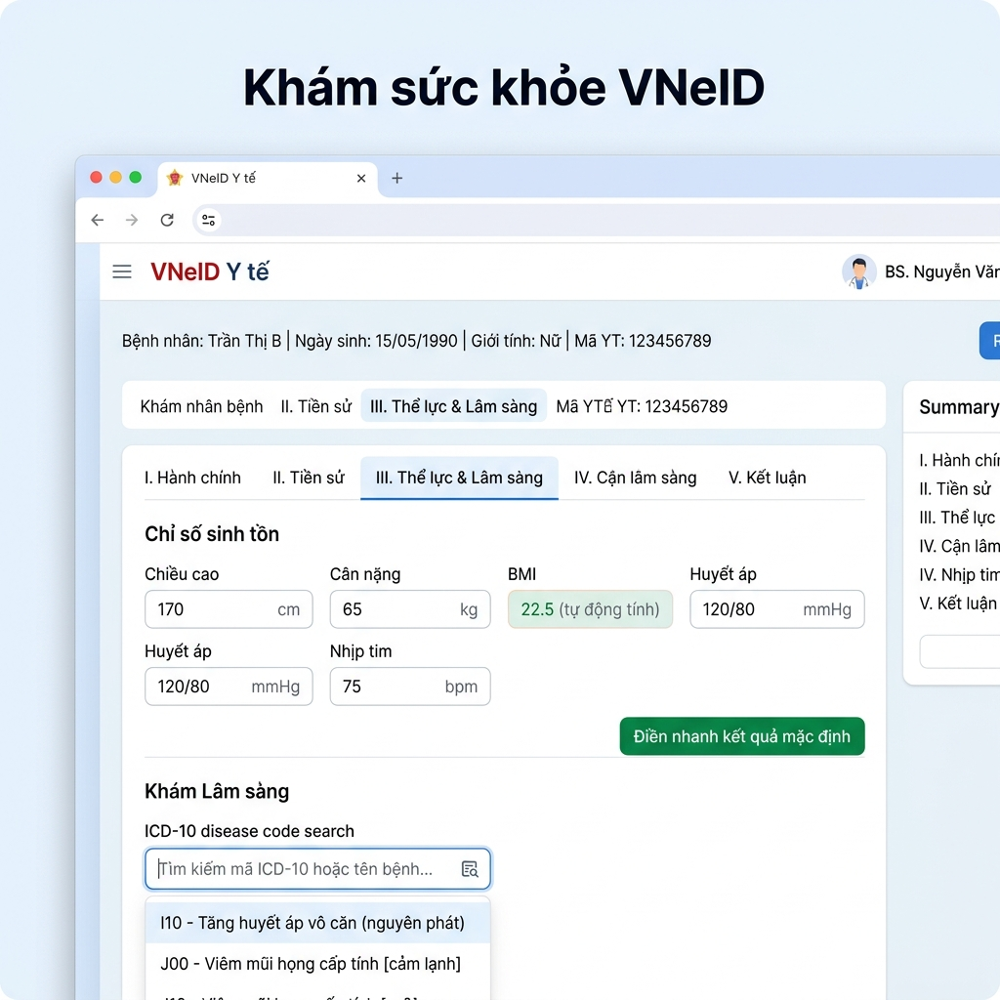
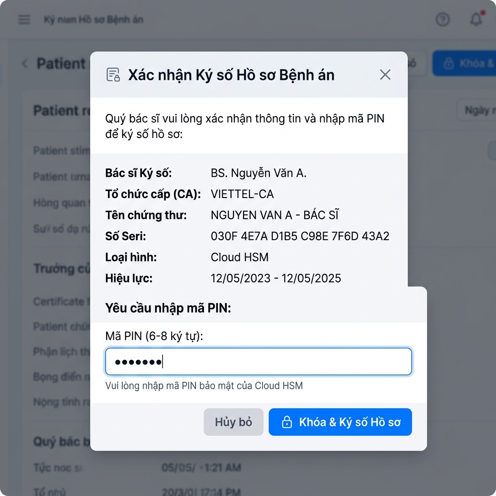
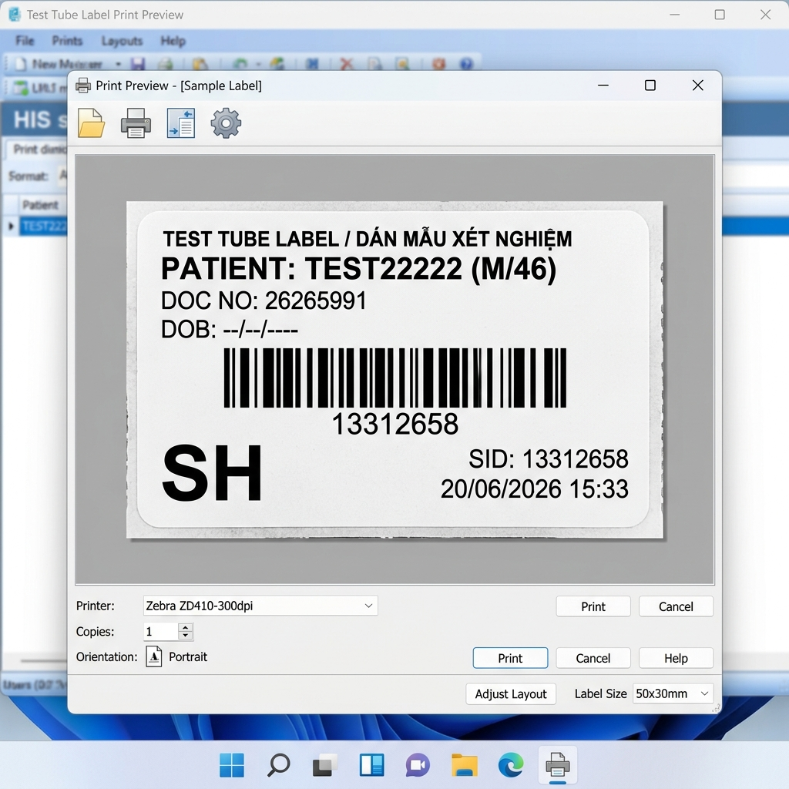

# HƯỚNG DẪN SỬ DỤNG MODULE LIÊN THÔNG KHÁM SỨC KHỎE (VNeID) & QUẢN LÝ MẪU XÉT NGHIỆM

> **Phiên bản tài liệu:** 3.0 — Cập nhật đầy đủ kèm Hình ảnh Hướng dẫn  
> **Áp dụng cho:** Phân hệ **Liên thông Khám sức khỏe VNeID (Quyết định 1551/QĐ-BYT)** và **Quản lý Giao nhận Mẫu Xét nghiệm (LIMS Sample Tracking)**.

---

## 1. Tổng quan quy trình nghiệp vụ (Workflow Diagram)

---

## 2. Hướng dẫn chi tiết từng bước vận hành

### 2.1. Bước 1: Đồng bộ hồ sơ tiếp nhận từ HIS

1. Truy cập menu **Khám sức khỏe VNeID** → chọn tab **Đồng bộ dữ liệu**.
2. Thiết lập bộ lọc:
   - **Từ ngày — Đến ngày:** Chọn khoảng thời gian bệnh nhân đến khám.
   - **Đoàn khám / Công ty:** Chọn gói khám sức khỏe doanh nghiệp (nếu có).
3. Nhấn **Quét dữ liệu HIS** — Hệ thống truy vấn danh sách bệnh nhân từ tiếp nhận HIS.
4. Tích chọn các hồ sơ cần xử lý → Nhấn **Khởi tạo hồ sơ VNeID**. Hệ thống tự động điền thông tin hành chính và tạo hồ sơ nháp tương ứng với 1 trong 3 mẫu biểu chuẩn.

---

### 2.2. Bước 2: Tìm kiếm và mở hồ sơ bệnh nhân

- **Tìm kiếm nội bộ:** Nhập **Số CCCD**, **Mã hồ sơ (MHS)**, hoặc **Số điện thoại** tại tab *Hồ sơ sức khỏe*.
- **Tìm kiếm trực tiếp từ HIS:**
  1. Nhập thông tin tìm kiếm tại **Tab I. Hành chính & Đặc thù**.
  2. Nhấn **Tìm từ HIS** — Hệ thống tự động nạp thông tin bệnh nhân.

> ⚠️ **Lưu ý:** Khi chưa chọn bệnh nhân hợp lệ, các tab chuyên khoa **(II–V)** và nút **Lưu / Ký số** sẽ bị vô hiệu hóa để bảo vệ tính toàn vẹn dữ liệu.

---

### 2.3. Bước 3: Hoàn thiện thông tin khám lâm sàng (3 Mẫu biểu chuẩn)

Hệ thống tự động nạp form tương thích với loại khám sức khỏe được chọn:
- **Mẫu 1:** Trẻ em (6T - dưới 18T)
- **Mẫu 2:** Người lớn (>= 18T)
- **Mẫu 3:** Khám sức khỏe Lái xe

| Tab | Nội dung nghiệp vụ | Tính năng hỗ trợ |
|---|---|---|
| **I. Hành chính & Đặc thù** | Thông tin cá nhân, chọn biểu mẫu | Điền tự động từ HIS |
| **II. Tiền sử & Tiêm chủng** | Tiền sử gia đình, bản thân, vaccine | Gợi ý mã ICD-10 |
| **III. Thể lực & Lâm sàng** | Chiều cao, cân nặng, HA, chuyên khoa | **BMI tự động tính** |
| **IV. Cận lâm sàng** | Xét nghiệm, CĐHA, TDCN | **Đồng bộ tự động từ HIS** |
| **V. Kết luận** | Kết luận phân loại SK, mã ICD-10 chính | Tìm kiếm mã bệnh hợp lệ |

* **Điền nhanh mặc định:** Nhấn nút *Điền nhanh kết quả mặc định* để điền tự động các chỉ số bình thường chuẩn, giúp tăng tốc khám đoàn.

---

### 2.4. Bước 4: Đồng bộ kết quả Cận lâm sàng từ HIS ⚡

1. Tại **Tab IV. Cận lâm sàng**, nhấn nút **🔄 Đồng bộ kết quả từ HIS**.
2. Hệ thống tải trực tiếp các dịch vụ chỉ định và kết quả xét nghiệm/CĐHA/TDCN từ HIS theo `his_doc_no`.
3. Dịch vụ tự động phân loại đúng tab con:
   - **Xét nghiệm (XN)** — Mã nhóm `A...` hoặc `B1...`
   - **Chẩn đoán hình ảnh (HA)** — Siêu âm, X-quang, MRI...
   - **Thăm dò chức năng (TD)** — Điện tâm đồ, thính lực, thị lực...
4. Bác sĩ có thể bấm đồng bộ nhiều lần mà không làm mất dữ liệu đã nhập ở các tab khác.

---

### 2.5. Bước 5: Khóa & Ký số hồ sơ (Chữ ký điện tử)

#### Ký từng hồ sơ:
1. Nhấn nút **Khóa & Ký Số** tại chân trang form nhập liệu.
2. Xác nhận hộp thoại → Hồ sơ chuyển sang trạng thái **Đã khóa** (chống sửa đổi).

#### Ký số hàng loạt:
1. Tại danh sách hồ sơ, tích chọn các hồ sơ có trạng thái **Chưa ký**.
2. Chọn phương thức: **USB Token** hoặc **Cloud HSM**.
3. Nhấn **Ký số hàng loạt** → Nhập PIN → Hoàn tất.

---

### 2.6. Bước 6: Liên thông dữ liệu Cổng VNeID (QĐ 1551/QĐ-BYT)

1. Tích chọn hồ sơ **Đã ký** có trạng thái đồng bộ *Chưa gửi* hoặc *Gửi lỗi*.
2. Nhấn **Đồng bộ Cổng VNeID**.
3. Hệ thống đóng gói dữ liệu chuẩn XML, gửi trực tiếp tới API liên thông của Bộ Y tế:
   - ✅ **Thành công:** Trạng thái chuyển sang *Thành công* kèm mã giao dịch `Transaction ID`.
   - ❌ **Thất bại:** Trạng thái chuyển sang *Lỗi*. Nhấn vào dòng thông báo để xem nguyên nhân chi tiết.

---

### 2.7. Quản lý Giao nhận Mẫu Xét nghiệm (LIMS Sample Tracking)

Phân hệ dành riêng cho phòng Lab để kiểm soát luồng giao nhận ống mẫu xét nghiệm từ các khoa phòng:

#### Các phím tắt thao tác nhanh (Hotkeys):
* **`F2`**: Mở hộp thoại Nhận mẫu theo Khay/Batch (`BatchReceivingModal`).
* **`F4`** hoặc **`Ctrl + Enter`**: Xác nhận nhận mẫu bệnh nhân đang chọn.
* **`F5`**: Tải lại danh sách phiếu giao nhận mẫu.
* **`F8`** hoặc **`Alt + R`**: Mở hộp thoại từ chối mẫu hỏng/hủy mẫu.
* **`Shift + ?`**: Hiển thị bảng hướng dẫn phím tắt.
* **`Esc`**: Đóng cửa sổ modal hoặc quay lại danh sách.

---

### 2.8. In tem Barcode định danh mẫu xét nghiệm (50×30 mm)

1. Chọn bệnh nhân / phiếu xét nghiệm → Nhấn **In Barcode**.
2. Hệ thống render tem theo đúng quy chuẩn máy in nhiệt (Zebra, Xprinter, Godex) và máy phân tích xét nghiệm tự động:

---

## 3. Bảng tra cứu trạng thái hồ sơ

| Trạng thái | Ý nghĩa hệ thống | Hành động xử lý |
|---|---|---|
| **Nháp** | Hồ sơ mới khởi tạo, chưa đủ dữ liệu | Tiếp tục nhập liệu / Đồng bộ CLS |
| **Hoàn thiện** | Đã điền đủ các thông tin khám | Tiến hành Khóa & Ký số |
| **Đã khóa / Đã ký** | Hồ sơ đã ký số pháp lý | Gửi liên thông Cổng VNeID |
| **Thành công** | Đã gửi và Cổng BYT chấp nhận | Hoàn tất lưu trữ |
| **Gửi lỗi** | Cổng BYT từ chối (lỗi CCCD, mã ICD...) | Mở khóa → Sửa dữ liệu → Ký lại → Gửi lại |

---

## 4. Xử lý sự cố thường gặp (Troubleshooting)

1. **Lỗi không ký số được qua USB Token:**
   - Kiểm tra USB Token đã cắm vào máy tính và phần mềm ký số (SignServer/Plugin) đang chạy.
2. **Không đồng bộ được kết quả Cận lâm sàng từ HIS:**
   - Kiểm tra mã `his_doc_no` của bệnh nhân có chính xác với dữ liệu tiếp nhận trên HIS hay chưa.
3. **Cổng VNeID báo lỗi mã ICD-10 không hợp lệ:**
   - Vào Tab V (Kết luận), chọn lại mã bệnh chính xác từ danh mục gợi ý `hms_icd`.

---
**Bộ phận Hỗ trợ Vận hành vClinic & HIS**  
*Tài liệu được cập nhật tự động kèm bộ ảnh hướng dẫn quy trình.*
