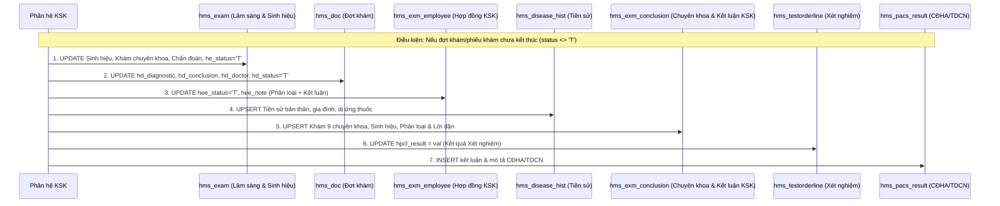

# TÀI LIỆU KỸ THUẬT: CƠ CHẾ ĐỒNG BỘ DỮ LIỆU GIỮA HIS CORE VÀ PHÂN HỆ KHÁM SỨC KHỎE (KSK)

---

## 1. TỔNG QUAN KIẾN TRÚC & LUỒNG ĐỒNG BỘ 2 CHIỀU

Phân hệ **Khám sức khỏe (KSK)** hoạt động tích hợp chặt chẽ với cơ sở dữ liệu **HIS Core** theo mô hình đồng bộ 2 chiều (Bi-directional Synchronization):

```mermaid
flowchart TD
    subgraph HIS_CORE["HỆ THỐNG HIS CORE"]
        H_PAT["Bệnh nhân: hms_patient"]
        H_DOC["Hồ sơ khám: hms_doc"]
        H_CONTRACT["Hợp đồng & Nhân viên: hms_exm_contract, hms_exm_employee"]
        H_EXAM["Khám lâm sàng & Sinh hiệu: hms_exam, hms_disease_hist"]
        H_LIS["Xét nghiệm (LIS): hms_testorder, hms_testorderline, hms_testorder_pack"]
        H_PACS["CĐHA & TDCN (PACS): hms_pacsorder, hms_pacsorderline, hms_pacs_result"]
        H_FEE["Danh mục & Viện phí: hms_fee_list, hms_fee_group, hms_fee"]
    end

    subgraph KSK_SYNC["MODULE KHÁM SỨC KHỎE (KSK)"]
        K_RECEPT["Tiếp đón KSK (Patient Reception)"]
        K_DOCS["Quản lý Hồ sơ KSK (health_check_masters & details)"]
        K_FORM["Biểu mẫu Khám đa chuyên khoa (Dynamic Form)"]
        K_LIS_PACS["Chỉ định & Kết quả Cận lâm sàng (Paraclinical Grid)"]
        K_XML["Sinh XML 130 / QĐ 2062 liên thông BHYT & VNeID"]
    end

    %% Chiều 1: HIS Core -> Module KSK
    H_CONTRACT -->|1. seedFromHis / searchEmployeeByCard| K_RECEPT
    H_PAT & H_DOC -->|2. getHisPatient (Tra cứu đợt khám)| K_DOCS
    H_EXAM -->|3. Live Vitals & History Sync| K_FORM
    H_LIS & H_PACS -->|4. fetchStructuredParaclinicalData| K_LIS_PACS
    H_FEE -->|5. Danh mục CLS & hfl_ma_chi_so| K_LIS_PACS

    %% Chiều 2: Module KSK -> HIS Core
    K_RECEPT -->|6. Stored Procedure hms_exm_registration_exam| H_DOC
    K_RECEPT -->|7. Tạo BN mới: hms_getnextpatientno()| H_PAT
    K_LIS_PACS -->|8. Kê CLS: hms_paraclinic_add| H_LIS & H_PACS
    K_FORM -->|9. Pushback kết quả CLS: pushbackTestAndPacsResults| H_LIS & H_PACS
    K_DOCS -->|10. Xuất XML11 với MA_DICH_VU từ hfl_ma_chi_so| K_XML
```

---

## 2. DANH MỤC CÁC API ĐỒNG BỘ DỮ LIỆU

### 2.1. Nhóm API Tiếp đón & Nhận diện Bệnh nhân

#### `GET /api/health-check/reception/search`
- **Chức năng:** Tìm kiếm nhân viên trong hợp đồng KSK phục vụ tiếp đón nhanh.
- **Controller:** `receptionController.searchEmployeeByCard` ([reception.controller.ts](file:///d:/AI/VIMES_HIS/backend/src/controllers/health-check/reception.controller.ts))
- **Tham số truy vấn (`req.query`):**
  - `queryStr`: Số CCCD, SĐT hoặc Họ và tên nhân viên.
  - `contractId`: ID hợp đồng KSK (`hee_contract_id`).
- **Nghiệp vụ HIS:** Truy vấn `hms_exm_employee` JOIN `hms_exm_contract`, `hms_workplace`, `sys_prov`, `sys_vill`.

#### `POST /api/health-check/reception/receive`
- **Chức năng:** Thực hiện tiếp đón 1 nhân viên hợp đồng KSK vào HIS Core và tự động tạo hồ sơ KSK.
- **Controller:** `receptionController.receiveContractEmployee` -> `processSingleEmployeeReception`
- **Payload (`req.body`):** `{ employeeId, roomId, examType }`
- **Nghiệp vụ HIS & Cơ chế thực thi:**
  1. Kiểm tra `hee_patientno`. Nếu chưa có, kiểm tra CCCD trên `hms_patient`, nếu chưa có sẽ gọi `hms_getnextpatientno()` để sinh mã mới và INSERT vào `hms_patient`.
  2. Gọi Stored Procedure HIS:
     ```sql
     SELECT hms_exm_registration_exam(
         $1::integer, -- employeeId
         $2::varchar, -- currentUser
         $3::varchar, -- activeDeptId
         $4::integer, -- roomId
         $5::varchar, -- examType (VD: 'E01')
         $6::varchar, -- formattedDate 'YYYY-MM-DD HH24:MI'
         'Y'          -- auto order package services
     ) AS doc_no
     ```
  3. Đảm bảo đối tượng viện phí `hms_doc.hd_object = '7'` (Dịch vụ).
  4. Lấy danh sách dịch vụ kỹ thuật đã tự động chèn vào `hms_fee`.
  5. Tự động nạp chỉ định cận lâm sàng (`fetchStructuredParaclinicalData`).
  6. Khởi tạo/cập nhật hồ sơ KSK trong `health_check_masters` và `health_check_details`.

#### `POST /api/health-check/contracts/:id/receive-all`
- **Chức năng:** Tiếp đón hàng loạt toàn bộ nhân viên trong hợp đồng KSK vào HIS Core.
- **Controller:** `receptionController.receiveAllContractEmployees`

#### `GET /api/health-check/reception/rooms`
- **Chức năng:** Tải danh mục phòng khám đang hoạt động theo khoa phòng đăng nhập (`hms_roomlist`).

---

### 2.2. Nhóm API Tra cứu & Đồng bộ Dữ liệu Khám (Sinh hiệu, Lâm sàng, Cận lâm sàng)

#### `GET /api/health-check/his-patient/:identifier`
- **Chức năng:** Tra cứu đợt khám theo thời gian thực (Real-time Sync) từ HIS Core để đổ vào biểu mẫu khám.
- **Controller:** `hisIntegrationController.getHisPatient` ([his-integration.ts](file:///d:/AI/VIMES_HIS/backend/src/controllers/health-check/his-integration.ts))
- **Tham số URL:** `:identifier` (Mã hồ sơ `hd_docno`, CCCD `hp_sin`, SĐT `hd_telephone`, hoặc `patient_id`).
- **Nghiệp vụ HIS đồng bộ:**
  - **Hành chính:** `hms_doc`, `hms_patient`, `hms_card`.
  - **Sinh hiệu & Lâm sàng:** `hms_exam` (`he_height`, `he_weight`, `he_bmi`, `he_pulse`, `he_bloodpressure`, `he_bloodpressurex`, `he_temperature`, `he_breathinterval`, `he_examine`, `he_diagnostic`, `he_doctor`).
  - **Tiền sử & Dị ứng:** `hms_disease_hist` (`hdh_owner`, `hdh_family`, `hdh_drugallergy`).
  - **Cận lâm sàng:** `hms_testorderline`, `hms_pacs_result`.
- **Cơ chế Smart Merge Cận lâm sàng:** Kết hợp kết quả từ HIS với các giá trị bác sĩ đã chỉnh sửa tay trước đó (`user_edited`), ưu tiên kết quả mới nếu HIS đã có giá trị đo thực tế.

#### `POST /api/health-check/documents/seed-from-his`
- **Chức năng:** Quét và đồng bộ hàng loạt hồ sơ nhân viên theo hợp đồng KSK từ HIS sang Module KSK (**Smart UPSERT**).
- **Controller:** `hisIntegrationController.seedFromHis`
- **Payload (`req.body`):** `{ workplaceId, startDate, endDate }`
- **Quy tắc an toàn (Smart UPSERT Rules):**
  - Đã gửi VNeID (`send_status = 'Success'`): Bỏ qua.
  - Đã ký số (`signature_status = 'Signed'`): Bỏ qua.
  - Đã có dữ liệu khám: Chỉ cập nhật bổ sung trường thông tin hành chính, không ghi đè dữ liệu khám chuyên khoa.
  - Chưa có dữ liệu khám: Cập nhật đầy đủ từ HIS.
  - Chưa tồn tại: Chèn mới (`INSERT INTO health_check_masters / details`).

---

### 2.3. Nhóm API Kê & Hủy Chỉ định Cận lâm sàng trên HIS Core

#### `POST /api/health-check/orders/create-his-order`
- **Chức năng:** Bác sĩ KSK kê thêm chỉ định xét nghiệm/CĐHA trực tiếp vào HIS Core từ giao diện KSK.
- **Controller:** `orderController.createHisParaclinicOrder` ([order.controller.ts](file:///d:/AI/VIMES_HIS/backend/src/controllers/health-check/order.controller.ts))
- **Payload:** `{ docNo, patientNo, doctorId, deptId, roomId, items }`
- **Nghiệp vụ HIS:**
  - Tra cứu nhóm dịch vụ (`hfl_groupid`) từ `hms_fee_list`.
  - Gọi Stored Procedure HIS:
    ```sql
    SELECT hms_paraclinic_add(
        $1::varchar, -- createdBy
        $2::varchar, -- deptId
        0,           -- refidx
        $4::integer, -- roomId
        $5::integer, -- docNo
        $6::integer, -- patientNo
        0,           -- objectId (Dịch vụ)
        $8::varchar, -- orderDate
        'N',         -- isemergency
        $10::varchar,-- note
        'O',         -- status
        'X',         -- paymentStatus
        $13::integer -- feeGroupId
    ) AS order_id
    ```
  - Chèn chi tiết vào `hms_testorderline` hoặc `hms_pacsorderline`.
  - Tự động đồng bộ mảng `paraclinical_items` trong `health_check_details`.

#### `POST /api/health-check/orders/cancel-his-order`
- **Chức năng:** Hủy chỉ định dịch vụ CLS trên HIS Core.
- **Controller:** `orderController.cancelHisParaclinicItem`
- **Nghiệp vụ HIS:** Xóa bản ghi trong `hms_testorderline` / `hms_pacsorderline` (nếu trạng thái chưa lấy mẫu/chưa thực hiện) và cập nhật lại mảng `paraclinical_items` trong KSK.

---

### 2.4. Nhóm API Quản lý Mẫu Xét nghiệm (LIS Sample Tracking)

| Endpoint | Chức năng | Bảng HIS liên quan |
| :--- | :--- | :--- |
| `GET /api/health-check/samples/slips` | Danh sách phiếu giao nhận mẫu | `hms_testorder_pack` |
| `GET /api/health-check/samples/slips/:slipId/patients` | Danh sách ống mẫu/bệnh nhân theo phiếu | `hms_testorder`, `hms_doc` |
| `GET /api/health-check/samples/orders/:orderId/items` | Chi tiết các chỉ số xét nghiệm | `hms_testorderline`, `hms_fee_list` |
| `POST /api/health-check/samples/receive` | Xác nhận tiếp nhận/lấy mẫu xét nghiệm | Cập nhật trạng thái `hpcl_status = 'S'` |
| `POST /api/health-check/samples/cancel` | Từ chối mẫu / hủy mẫu xét nghiệm | Cập nhật lý do hủy mẫu `hms_testorder_pack` |

---

### 2.5. Cơ chế Đẩy ngược Toàn diện Kết quả từ KSK về HIS Core (Full Pushback Mechanism)

Khi bác sĩ thực hiện lưu / kết luận / duyệt hồ sơ KSK tại `documentsController.createDocument` hoặc `documentsController.updateDocument`, hệ thống tự động kiểm tra trạng thái trên HIS Core và kích hoạt 2 cơ chế đồng bộ ngược song song:



1. **Đồng bộ Lâm sàng, Sinh hiệu, Tiền sử, Kết luận và Chuyên khoa (`pushbackClinicalAndConclusion`):**
   - **Phiếu khám lâm sàng (`hms_exam`):** Cập nhật toàn bộ các chỉ số sinh hiệu (Chiều cao, cân nặng, BMI, mạch, huyết áp tâm thu/tâm trương, nhiệt độ, nhịp thở), khám thể lực (`he_examine`), khám các chuyên khoa (`he_parts`), tiền sử bệnh lý (`he_medical`), chẩn đoán (`he_diagnostic`), mã ICD-10 (`he_icd10`), lời dặn (`he_remark`), bác sĩ khám (`he_doctor`), thời gian kết luận và chuyển `he_status = 'T'`.
   - **Hồ sơ đợt khám (`hms_doc`):** Cập nhật chẩn đoán (`hd_diagnostic`), phân loại sức khỏe (`hd_conclusion` - VD: "Loại 1"), mã bệnh (`hd_icd`), bác sĩ (`hd_doctor`), ngày kết thúc (`hd_enddate`), khoa phòng kết thúc (`hd_enddept`) và chuyển `hd_status = 'T'`.
   - **Nhân viên hợp đồng KSK (`hms_exm_employee`):** Cập nhật `hee_status = 'T'`, `hee_note` (Phân loại sức khỏe và chẩn đoán), `hee_updateddate`, `hee_updatedby`.
   - **Tiền sử bệnh tật (`hms_disease_hist`):** Cập nhật hoặc chèn mới tiền sử bản thân (`hdh_owner`), gia đình (`hdh_family`), dị ứng thuốc (`hdh_drugallergy`).
   - **Bảng chuyên khoa & kết luận KSK (`hms_exm_conclusion`):** UPSERT toàn bộ 28 trường chuyên khoa chi tiết:
     - *Sinh hiệu:* `hecl_height`, `hecl_weight`, `hecl_bmi`, `hecl_pulse`, `hecl_temperature`, `hecl_bloodpressure`, `hecl_bloodpressurex`, `hecl_breathinterval`.
     - *Chuyên khoa lâm sàng:* `hecl_theluc`, `hecl_noi`, `hecl_tuanhoan`, `hecl_hohap`, `hecl_tieuhoa`, `hecl_thantietnieu`, `hecl_noitiet`, `hecl_coxuongkhop`, `hecl_thankinh`, `hecl_tamthan`, `hecl_ngoai`, `hecl_dalieu`, `hecl_mat`, `hecl_tmh`, `hecl_rhm`, `hecl_phukhoa`.
     - *Kết luận:* `hecl_phanloai`, `hecl_conclusion`, `hecl_remark`.

2. **Đồng bộ Cận lâm sàng (`pushbackTestAndPacsResults`):**
   - **Xét nghiệm (LIS):**
     ```sql
     UPDATE hms_testorderline
     SET hpcl_result = $1
     WHERE hpcl_docno = $2 AND hpcl_itemid = $3;
     ```
   - **Chẩn đoán hình ảnh & Thăm dò chức năng (PACS):**
     ```sql
     INSERT INTO hms_pacs_result (hpr_docno, hpr_orderid, hpr_itemid, hpr_name, hpr_desc)
     VALUES ($1, $2, $3, 'conclusion', $4);
     ```

3. **Cơ chế Đọc 2 Chiều (HIS -> KSK) qua `getHisPatient`:**
   - Khi tra cứu đợt khám trực tiếp từ HIS, hệ thống ưu tiên đọc các trường kết luận và khám chuyên khoa từ `hms_exm_conclusion` để đổ dữ liệu tự động vào form nhập liệu KSK, đảm bảo tính đồng bộ 2 chiều toàn diện giữa 2 phân hệ.

---

## 3. ĐẶC TẢ ĐỒNG BỘ CẬN LÂM SÀNG & XUẤT XML11 THEO `hfl_ma_chi_so`

### 3.1. Cấu trúc ánh xạ trường trong XML11 (`KHAM_CAN_LAM_SANG`)

Theo quy định Bộ Y tế (QĐ 130 / QĐ 1551 / QĐ 2062), tệp con XML11 chứa danh sách kết quả cận lâm sàng chi tiết:

| Thẻ XML11 | Nguồn dữ liệu trong HIS Core | Mô tả |
| :--- | :--- | :--- |
| `<MA_DICH_VU>` | `hms_fee_list.hfl_ma_chi_so` | **Mã chỉ số/mã dịch vụ chuẩn** (Fallback: `hfl_regcode` -> `hfl_feeid`) |
| `<MA_CHI_SO>` | `hms_fee_list.hfl_feeid` / `index_code` | Mã chỉ số xét nghiệm nội bộ HIS / mã chỉ định con |
| `<GIA_TRI>` | `hms_testorderline.hpcl_result` / `value` | Giá trị định lượng/định tính đo được (đã tách đơn vị) |
| `<DON_VI_DO>` | `hms_fee_list.hfl_unit` / `unit` | Đơn vị đo lường (mmol/L, g/L, T/L, ...) |
| `<MO_TA>` | `hms_pacs_result.hpr_desc` (remark) | Mô tả chi tiết kết quả hình ảnh X-quang/Siêu âm |
| `<KET_LUAN>` | `hms_pacs_result.hpr_desc` (conclusion) | Kết luận cận lâm sàng (Bình thường / Bất thường) |

### 3.2. Đoạn mã xử lý xuất XML11 ([xml-generator.ts](file:///d:/AI/VIMES_HIS/backend/src/controllers/health-check/xml-generator.ts#L810-L840))

```typescript
for (const item of itemsList) {
    // Ưu tiên lấy trực tiếp trường hfl_ma_chi_so từ hms_fee_list
    const svcCode = item.hfl_ma_chi_so || item.ma_chi_so || item.reg_code || item.hfl_regcode || item.service_code || 'B1100467';
    const idxCode = item.index_code || item.service_code || svcCode;

    let rawVal = item.value !== null && item.value !== undefined ? String(item.value).trim() : '';
    let itemUnit = item.unit ? String(item.unit).trim() : '';

    // Tự động tách số và đơn vị nếu rawVal dạng "4.1 mmol/L"
    const valUnitMatch = rawVal.match(/^([\d.,><=+-]+)\s+([a-zA-Z%µ/^\d*]+.*)$/);
    if (valUnitMatch) {
        rawVal = valUnitMatch[1].trim();
        if (!itemUnit || itemUnit.toLowerCase() === 'lần' || itemUnit.toLowerCase() === 'gói') {
            itemUnit = valUnitMatch[2].trim();
        }
    }
    if (!itemUnit) itemUnit = 'Lần';

    const itemDesc = item.description ? String(item.description).trim() : '';
    const itemConc = item.conclusion ? String(item.conclusion).trim() : '';

    paraclItems += `
        <CHI_TIET_CLS>
            <MA_DICH_VU>${escapeXml(svcCode)}</MA_DICH_VU>
            <MA_CHI_SO>${escapeXml(idxCode)}</MA_CHI_SO>
            <GIA_TRI>${escapeXml(rawVal)}</GIA_TRI>
            <DON_VI_DO>${escapeXml(itemUnit)}</DON_VI_DO>
            <MO_TA>${escapeXml(itemDesc)}</MO_TA>
            <KET_LUAN>${escapeXml(itemConc)}</KET_LUAN>
        </CHI_TIET_CLS>`;
}
```

---

## 4. TỔNG HỢP CÁC BẢNG CƠ SỞ DỮ LIỆU THAM GIA ĐỒNG BỘ

| STT | Tên bảng dữ liệu | Phân vùng | Vai trò nghiệp vụ trong luồng đồng bộ |
| :---: | :--- | :--- | :--- |
| 1 | `hms_exm_contract` | HIS Core | Thông tin hợp đồng khám sức khỏe đoàn, công ty, mẫu biểu cấu hình. |
| 2 | `hms_exm_employee` | HIS Core | Danh sách nhân viên trong hợp đồng, trạng thái tiếp nhận, liên kết `hee_docno`. |
| 3 | `hms_patient` | HIS Core | Thông tin định danh bệnh nhân (họ tên, CCCD, ngày sinh, giới tính, địa chỉ). |
| 4 | `hms_doc` | HIS Core | Thông tin đợt khám (`hd_docno`, ngày tiếp đón, bác sĩ, đối tượng viện phí `hd_object`). |
| 5 | `hms_exam` | HIS Core | Sinh hiệu (chiều cao, cân nặng, BMI, huyết áp...) và kết quả khám lâm sàng ban đầu. |
| 6 | `hms_disease_hist` | HIS Core | Tiền sử bệnh tật bản thân, gia đình, tiền sử dị ứng thuốc. |
| 7 | `hms_testorder` / `hms_testorderline` | HIS Core | Chỉ định và kết quả xét nghiệm huyết học, sinh hóa, nước tiểu. |
| 8 | `hms_pacsorder` / `hms_pacs_result` | HIS Core | Chỉ định và kết quả chẩn đoán hình ảnh (X-quang, Siêu âm), thăm dò chức năng. |
| 9 | `hms_fee_list` / `hms_fee_group` | HIS Core | Danh mục viện phí, nhóm dịch vụ, mã bảo hiểm `hfl_regcode`, mã chỉ số `hfl_ma_chi_so`. |
| 10 | `sys_user` / `sys_filedir` | HIS Core | Tài khoản bác sĩ và dữ liệu ảnh chữ ký điện tử. |
| 11 | `health_check_masters` | Module KSK | Thông tin hành chính, số hồ sơ KSK, trạng thái ký số, gửi cổng VNeID. |
| 12 | `health_check_details` | Module KSK | Chi tiết dữ liệu JSON lâm sàng (`clinical_data`), cận lâm sàng (`lab_data`), kết luận (`conclusion_data`). |
| 13 | `health_check_service_mappings` | Module KSK | Bản đồ phân loại dịch vụ kỹ thuật (`XN` - Xét nghiệm, `HA` - Chẩn đoán hình ảnh, `TD` - Thăm dò chức năng). |

---

## 5. TÀI LIỆU KIỂM THỬ LIÊN QUAN

- [test_xml11_enrichment.ts](file:///d:/AI/VIMES_HIS/backend/test/test_xml11_enrichment.ts): Kiểm thử trích xuất metadata `hfl_ma_chi_so` và sinh thẻ XML11.
- [health-check-pdf-updates-24-08.test.ts](file:///d:/AI/VIMES_HIS/backend/test/health-check-pdf-updates-24-08.test.ts): Kiểm thử giải mã Base64 XML11 và các trường tiền sử XML1.
- [test-multi-desk-concurrency.ts](file:///d:/AI/VIMES_HIS/backend/test/test-multi-desk-concurrency.ts): Kiểm thử chống xung đột và bảo toàn dữ liệu khi 8 bàn khám đồng thời duyệt hồ sơ.
- [health-check-merge.test.ts](file:///d:/AI/VIMES_HIS/backend/test/health-check-merge.test.ts): Kiểm thử thuật toán Smart Merge lâm sàng và cận lâm sàng.
