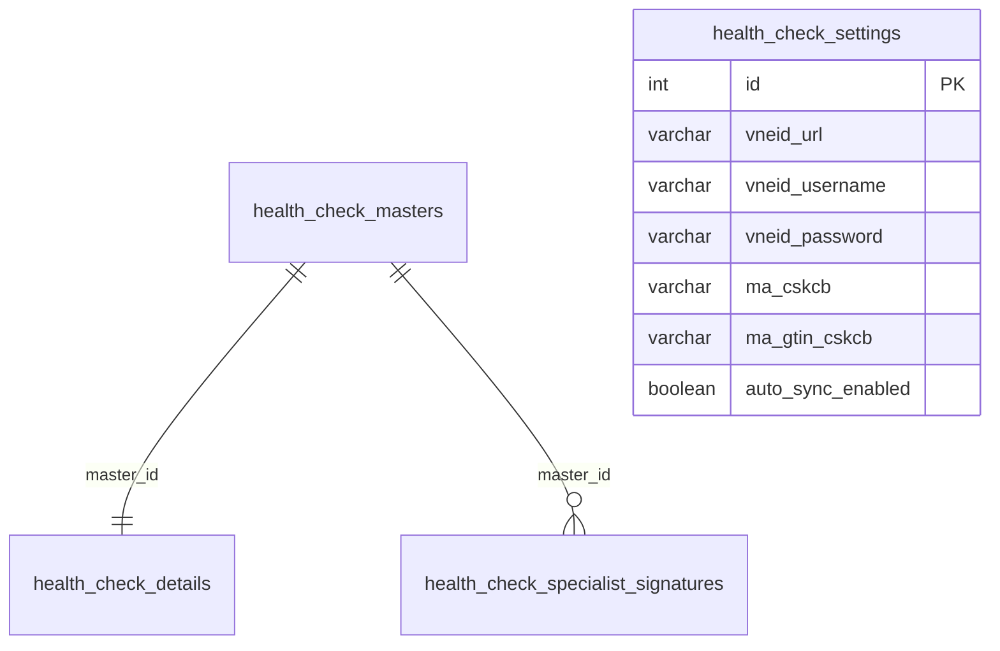

# THIẾT KẾ CƠ SỞ DỮ LIỆU KHÁM SỨC KHỎE LIÊN THÔNG (QĐ 2062/QĐ-BYT)

Tài liệu này đặc tả thiết kế cơ sở dữ liệu vật lý PostgreSQL cho module Khám sức khỏe liên thông VNeID phục vụ hệ thống vClinic HIS.

---

## 1. Sơ đồ thực thể quan hệ (ERD)



---

## 2. Đặc tả các bảng dữ liệu

### Bảng Master: `health_check_masters`
Lưu trữ thông tin hành chính cốt lõi và trạng thái đồng bộ cổng VNeID.

| Tên Cột | Kiểu Dữ Liệu | Ràng Buộc | Diễn Giải |
| :--- | :--- | :---: | :--- |
| `id` | SERIAL | PK, Unique | Khóa chính tự tăng |
| `patient_id` | VARCHAR(50) | Not Null | Mã bệnh nhân nội bộ |
| `patient_name` | VARCHAR(255) | Not Null | Họ và tên bệnh nhân (in hoa có dấu) |
| `cccd` | VARCHAR(12) | Not Null | Số CCCD/Định danh công dân |
| `dob` | DATE | Not Null | Ngày sinh |
| `gender` | VARCHAR(10) | Not Null | Giới tính (Nam/Nữ) |
| `doc_no` | VARCHAR(100) | Unique, Not Null | Số hồ sơ liên thông (`MA_LK`) |
| `form_type` | VARCHAR(10) | Not Null | Mã nhóm tuổi (`1`: dưới 6T, `2`: 6-18T, `3`: trên 18T) |
| `send_status` | VARCHAR(20) | Default 'Unsent' | Trạng thái: `Unsent`, `Pending`, `Success`, `Error` |
| `signature_status` | VARCHAR(20) | Default 'Unsigned' | Trạng thái ký: `Unsigned`, `Signed` |
| `xml_data` | TEXT | | Dữ liệu XML Envelope liên thông |
| `guardian_name` | VARCHAR(255) | | Họ tên bố/mẹ/người giám hộ (trẻ < 6 tuổi) |
| `guardian_cccd` | VARCHAR(12) | | Số CCCD người giám hộ |
| `guardian_relation` | VARCHAR(50) | | Mối quan hệ với trẻ |
| `guardian_phone` | VARCHAR(15) | | Điện thoại liên hệ người giám hộ |
| `created_at` | TIMESTAMP | Default NOW() | Thời điểm tạo hồ sơ |
| `updated_at` | TIMESTAMP | Default NOW() | Thời điểm cập nhật cuối |

### Bảng Detail: `health_check_details`
Lưu trữ kết quả lâm sàng, cận lâm sàng chi tiết dưới dạng JSONB động.

| Tên Cột | Kiểu Dữ Liệu | Ràng Buộc | Diễn Giải |
| :--- | :--- | :---: | :--- |
| `id` | SERIAL | PK, Unique | Khóa chính detail |
| `master_id` | INTEGER | FK | Liên kết 1-1 với `health_check_masters(id)` |
| `clinical_data` | JSONB | Not Null | Kết quả khám thể lực, lâm sàng chuyên khoa |
| `lab_data` | JSONB | | Kết quả xét nghiệm máu, nước tiểu, CĐHA |
| `conclusion_data` | JSONB | Not Null | Phân loại sức khỏe và kết luận bệnh |

### Bảng Chữ ký chuyên khoa: `health_check_specialist_signatures`
Lưu trữ chữ ký số điện tử của từng bác sỹ khám chuyên khoa lâm sàng.

| Tên Cột | Kiểu Dữ Liệu | Ràng Buộc | Diễn Giải |
| :--- | :--- | :---: | :--- |
| `id` | SERIAL | PK, Unique | Khóa chính tự tăng |
| `master_id` | INTEGER | FK | Liên kết tới `health_check_masters(id)` |
| `specialty_code` | VARCHAR(50) | Not Null | Mã chuyên khoa (ví dụ: `internal`, `eye`, `ent`...) |
| `doctor_id` | VARCHAR(50) | Not Null | Mã định danh bác sỹ khám |
| `doctor_name` | VARCHAR(255) | Not Null | Họ tên bác sỹ chuyên khoa |
| `signature_data` | TEXT | Not Null | Chuỗi chữ ký số Base64 của bác sỹ |
| `signed_at` | TIMESTAMP | Default NOW() | Thời điểm ký số |

---

## 3. SQL DDL Scripts (PostgreSQL)

```sql
-- Thêm các cột người giám hộ vào bảng master
ALTER TABLE health_check_masters ADD COLUMN IF NOT EXISTS guardian_name VARCHAR(255);
ALTER TABLE health_check_masters ADD COLUMN IF NOT EXISTS guardian_cccd VARCHAR(12);
ALTER TABLE health_check_masters ADD COLUMN IF NOT EXISTS guardian_relation VARCHAR(50);
ALTER TABLE health_check_masters ADD COLUMN IF NOT EXISTS guardian_phone VARCHAR(15);

-- Thêm cột mã GLN vào cấu hình settings
ALTER TABLE health_check_settings ADD COLUMN IF NOT EXISTS ma_gtin_cskcb VARCHAR(13);

-- Tạo bảng lưu chữ ký số chuyên khoa của bác sỹ
CREATE TABLE IF NOT EXISTS health_check_specialist_signatures (
    id SERIAL PRIMARY KEY,
    master_id INTEGER NOT NULL REFERENCES health_check_masters(id) ON DELETE CASCADE,
    specialty_code VARCHAR(50) NOT NULL,
    doctor_id VARCHAR(50) NOT NULL,
    doctor_name VARCHAR(255) NOT NULL,
    signature_data TEXT NOT NULL,
    signed_at TIMESTAMP DEFAULT NOW(),
    CONSTRAINT uq_master_specialty UNIQUE (master_id, specialty_code)
);

-- Tạo các index tăng tốc độ truy vấn
CREATE INDEX IF NOT EXISTS idx_hc_masters_guardian ON health_check_masters(guardian_cccd);
CREATE INDEX IF NOT EXISTS idx_hc_masters_form ON health_check_masters(form_type);
```
