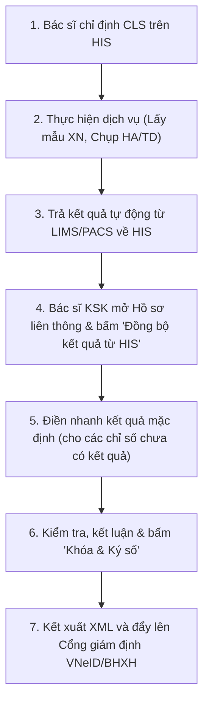

# Phân tích luồng tích hợp Cận lâm sàng (Paraclinical Workflow Analysis)

Tài liệu này phân tích chi tiết luồng nghiệp vụ, cấu trúc dữ liệu tích hợp, các vấn đề hiện tại và đề xuất giải pháp tối ưu cho Tab IV (Cận lâm sàng) trong phân hệ Khám sức khỏe liên thông VNeID.

---

## 1. Luồng nghiệp vụ chuẩn (Business Workflow)

Luồng xử lý chỉ định và kết quả cận lâm sàng (Xét nghiệm - XN, Chẩn đoán hình ảnh - HA, Thăm dò chức năng - TD) diễn ra qua các giai đoạn sau:



### Các bước chi tiết tại Tab Cận lâm sàng:
1. **Lấy thông tin chỉ định**: Hệ thống tự động dùng mã hồ sơ (`hpc_docno` / `his_doc_no`) để truy vấn toàn bộ các dịch vụ cận lâm sàng đã chỉ định cho bệnh nhân trên HIS.
2. **Kéo kết quả thực tế**:
   - **Xét nghiệm (XN)**: Lấy kết quả từ `hms_testorderline.hpcl_result`.
   - **CĐHA (HA) & Thăm dò chức năng (TD)**: Lấy mô tả chi tiết từ `hms_pacs_result` (kết quả và kết luận).
3. **Điền mặc định**: Hỗ trợ điền nhanh giá trị bình thường chuẩn đối với các dịch vụ chưa chạy máy hoặc không có kết quả tự động.
4. **Lưu trữ**: Dữ liệu cận lâm sàng được lưu trữ dưới dạng mảng JSON cấu trúc tại trường `lab_data` của bảng `health_check_details` phục vụ kết xuất XML.

---

## 2. Cấu trúc tích hợp dữ liệu Database

### 2.1. Sơ đồ thực thể HIS liên quan
* **`hms_testorderline`**: Lưu chi tiết chỉ định và kết quả xét nghiệm.
  - `hpcl_docno`: Mã hồ sơ liên kết.
  - `hpcl_itemid`: Mã dịch vụ xét nghiệm.
  - `hpcl_result`: Kết quả xét nghiệm từ LIMS hoặc nhập tay.
* **`hms_pacsorderline`** & **`hms_pacs_result`**: Lưu chỉ định và kết quả chẩn đoán hình ảnh / thăm dò chức năng.
  - `hpr_desc`: Mô tả chi tiết kết quả hình ảnh.
  - `hpr_name`: Tên kết quả (thường dùng `CONCLUSION` hoặc `RESULT` để lấy kết luận).
* **`hms_fee_list`**: Danh mục dịch vụ, dùng để xác định đơn vị đo (`hfl_unit`), mã nhóm (`hfl_groupid`) và mối quan hệ cha-con (`hfl_subitem`).

### 2.2. Trường dữ liệu lưu trong vClinic (`health_check_details`)
Trường `lab_data` chứa JSON có cấu trúc như sau:
```json
{
  "blood_test": {
    "hemoglobin": "142",
    "glycemia": "5.4"
  },
  "urine_test": {
    "protein": "Âm tính"
  },
  "paraclinical_items": [
    {
      "service_code": "A01.002",
      "service_name": "WBC (Số lượng bạch cầu)",
      "value": "7.5",
      "unit": "10^9/L",
      "conclusion": "Bình thường",
      "group_id": "A01",
      "group_name": "Xét nghiệm Huyết học",
      "type": "XN"
    }
  ]
}
```

---

## 3. Các vấn đề hiện tại và Đề xuất tối ưu

### ⚠ Vấn đề 1: Phân loại dịch vụ (XN, HA, TD) chưa tuyệt đối chính xác
* **Hiện tại**: Việc phân loại dịch vụ vào các tab phụ đang dựa trên tiền tố mã nhóm hoặc phán đoán theo chuỗi tên dịch vụ (`determinePacsType` trong code backend). Nếu bệnh viện khai báo tên dịch vụ khác chuẩn (ví dụ: "Đo điện tim" thay vì "Điện tim"), dịch vụ có thể bị phân loại sai tab.
* **Đề xuất**: 
  - Chuyển sang cấu hình bảng ánh xạ nhóm dịch vụ (`hms_fee_group`) rõ ràng trong Database.
  - Thêm cột phân loại dịch vụ chuẩn (`vclinic_cls_type` với giá trị `XN`, `HA`, `TD`) trong danh mục dịch vụ của vClinic để đối chiếu chính xác 100%.

### ⚠ Vấn đề 2: Nguy cơ ghi đè mất dữ liệu đã sửa tay
* **Hiện tại**: Khi bấm nút "Đồng bộ kết quả từ HIS", toàn bộ mảng `paraclinical_items` được tải lại từ HIS và ghi đè trực tiếp lên dữ liệu hiện tại ở client. Nếu bác sĩ đã chỉnh sửa tay một số chỉ số kết quả cận lâm sàng trước đó, các chỉnh sửa này sẽ bị mất sạch.
* **Đề xuất**:
  - Áp dụng cơ chế **Smart Merge (Trộn thông minh)**: Khi đồng bộ từ HIS, hệ thống sẽ đối chiếu:
    - Nếu dịch vụ trên HIS có kết quả mới -> Cập nhật.
    - Nếu dịch vụ trên HIS chưa có kết quả nhưng bác sĩ đã nhập tay trên giao diện -> Giữ nguyên giá trị bác sĩ đã nhập.
    - Hiển thị bảng đối chiếu (Diff view) trực quan nếu có sự xung đột dữ liệu để bác sĩ lựa chọn ghi đè hoặc giữ nguyên.

### ⚠ Vấn đề 3: Thiếu nhận diện trạng thái kết quả CLS trên giao diện
* **Hiện tại**: Giao diện hiển thị danh sách chỉ định giống nhau giữa dịch vụ đã có kết quả từ máy LIMS/PACS và dịch vụ chưa thực hiện (đang chờ kết quả). Bác sĩ phải dò từng dòng rất mất thời gian.
* **Đề xuất**:
  - Thêm một badge trạng thái trực quan bên cạnh mỗi dịch vụ trên bảng:
    - <span style="color: #0f766e; font-weight: bold;">[Đã có kết quả từ HIS]</span> (Màu xanh) cho các dịch vụ được đồng bộ tự động có giá trị từ máy.
    - <span style="color: #d97706; font-weight: bold;">[Chờ kết quả]</span> (Màu cam) cho các dịch vụ đã chỉ định nhưng chưa có kết quả chạy máy.
    - <span style="color: #64748b; font-weight: bold;">[Nhập tay]</span> (Màu xám) cho các dịch vụ bác sĩ tự thêm thủ công trực tiếp trên Web.

---

## 4. Kế hoạch triển khai nâng cấp tiếp theo

| Giai đoạn | Nội dung công việc | Phân hệ ảnh hưởng | Trạng thái |
| :--- | :--- | :--- | :--- |
| **Giai đoạn 1** | Tách và làm sạch APIs Giao nhận mẫu (Delivery Slips) | Backend Router & Controllers | **Hoàn thành** |
| **Giai đoạn 2** | Nâng cấp thuật toán phân loại và trộn thông minh (Smart Merge) CLS | `his-integration.ts` | **Sẵn sàng** |
| **Giai đoạn 3** | Cải tiến UI hiển thị trạng thái CLS và Badge chỉ định tự động | `LabTab.tsx` | **Sẵn sàng** |
