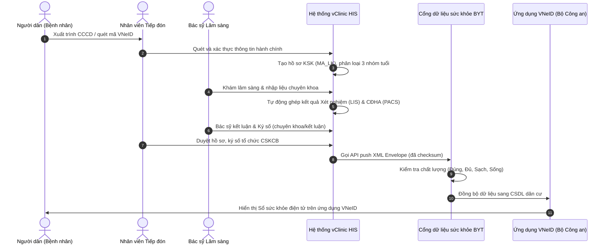

# SƠ ĐỒ QUY TRÌNH NGHIỆP VỤ LIÊN THÔNG (WORKFLOW)

Tài liệu này mô tả các luồng nghiệp vụ y tế và kỹ thuật từ khâu tiếp tiếp nhận bệnh nhân cho đến khi đồng bộ thành công dữ liệu Khám sức khỏe lên cổng Sức khỏe điện tử VNeID.

---

## 1. Sơ đồ quy trình tổng thể (Mermaid Flowchart)

---

## 2. Chi tiết các bước quy trình

### Bước 1: Tiếp đón và xác thực thông tin
* **Nghiệp vụ**: Nhân viên tiếp đón quét thẻ căn cước công dân hoặc quét mã QR trên ứng dụng VNeID của người dân.
* **Kỹ thuật**: Hệ thống HIS đối chiếu thông tin với Cơ sở dữ liệu quốc gia về dân cư để đảm bảo thông tin hành chính chính xác 100%. Tự động tạo hồ sơ KSK Master và gán mã liên kết `MA_LK`.

### Bước 2: Khám lâm sàng chuyên khoa
* **Nghiệp vụ**: Bác sĩ khám lâm sàng thực hiện khám và nhập kết quả vào form.
* **Kỹ thuật**: Mỗi chuyên khoa hiển thị nhận xét và phân loại (từ 1 đến 5). Bác sỹ chuyên khoa ký số trực tiếp trên phần kết quả chuyên khoa của mình.

### Bước 3: Ghép cận lâm sàng (LIMS/PACS)
* **Nghiệp vụ**: Người bệnh thực hiện xét nghiệm, chụp chiếu CLS.
* **Kỹ thuật**: HIS tự động lắng nghe kết quả hoàn thành từ máy xét nghiệm (LIS) và chẩn đoán hình ảnh (PACS) để đổ vào tệp XML11 tương ứng của hồ sơ KSK.

### Bước 4: Kết luận & Ký số tổ chức
* **Nghiệp vụ**: Bác sĩ kết luận phân loại sức khỏe chung, đưa ra chẩn đoán chính (mã ICD-10) và ký số duyệt hồ sơ.
* **Kỹ thuật**: Hệ thống tạo Envelope XML lớn, thực hiện ký số bác sỹ kết luận và đóng dấu chữ ký số tổ chức (Token/HSM) của bệnh viện.

### Bước 5: Liên thông dữ liệu
* **Kỹ thuật**: Hệ thống chạy background worker (hoặc gửi chủ động) tính toán Checksum RSA-SHA256 kép và POST payload JSON lên cổng API `csdlksk.vn` / `emrhub.vn`.
* **Đồng bộ VNeID**: Cổng Bộ Y tế chuyển tiếp dữ liệu sang Cơ sở dữ liệu dân cư để hiển thị lên ứng dụng VNeID của người dân.
