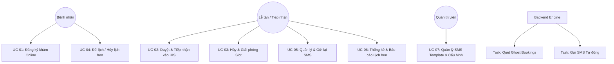
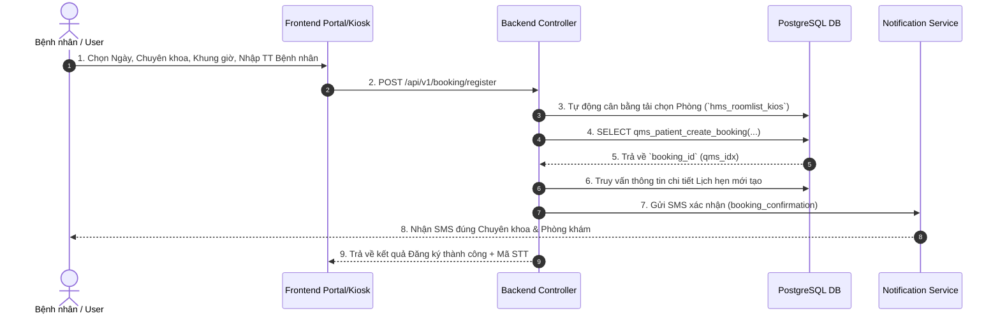

# Tài Liệu Thiết Kế Kỹ Thuật Use Case - Module Đăng Ký Khám Online (VIMES HIS)

---

## 1. Tổng Quan Phân Hệ (Module Overview)

Phân hệ **Đăng ký khám Online (Online Booking Module)** của hệ thống VIMES HIS cho phép bệnh nhân chủ động đăng ký lịch khám, chọn chuyên khoa, phòng khám và khung giờ khám thông qua các kênh số (Website Portal, Mobile App, Kiosk). Hệ thống tự động cân bằng tải phòng khám, cấp mã đăng ký, tự động gửi SMS xác nhận/duyệt/hủy/nhắc lịch và đồng bộ dữ liệu vào hệ thống tiếp nhận khám bệnh HIS (`hms_doc`).

### 1.1 Mục đích tài liệu
- Chuẩn hóa toàn bộ các luồng nghiệp vụ và quy trình xử lý kỹ thuật của phân hệ Đăng ký khám Online.
- Làm căn cứ chuẩn cho đội ngũ Phát triển (Developers) khi chỉnh sửa, nâng cấp hệ thống.
- Làm căn cứ chuẩn cho đội ngũ Kiểm thử (QA/Tester) để xây dựng Kịch bản kiểm thử (Test Cases) và Test Matrix.

### 1.2 Cấu trúc thư mục tài liệu
Tài liệu này được lưu trữ đúng quy định dự án tại: `d:/AI/VIMES_HIS/modules/online-booking/doc/use-case-technical-spec.md`.

---

## 2. Actors & Sơ Đồ Use Case Tổng Quan

### 2.1 Các Tác Nhân (Actors)

| Tác nhân (Actor) | Loại | Mô tả |
| :--- | :--- | :--- |
| **Bệnh nhân (Patient)** | External | Người dùng đăng ký lịch khám qua Portal/App/Kiosk. |
| **Nhân viên Lễ tân (Reception Staff)** | Internal | Nhân viên y tế duyệt lịch hẹn, tiếp nhận bệnh nhân tại quầy. |
| **Quản trị viên (Admin)** | Internal | Quản lý danh mục, cấu hình khung giờ, mẫu SMS Template. |
| **Backend Service** | System | API Server xử lý logic, cân bằng tải phòng, tự động gửi SMS. |
| **Database Engine (PostgreSQL)** | System | Thực thi Stored Procedures (`qms_patient_create_booking`), quản lý khóa giao dịch (Transaction Lock). |
| **SMS Provider (Caresoft/Mock)** | System | Cổng gửi tin nhắn SMS thương hiệu (SMS Brandname). |

### 2.2 Sơ đồ Use Case Tổng quan (Diagram)



---

## 3. Chi Tiết Các Use Case Nghiệp Vụ & Kỹ Thuật

### UC-01: Đăng Ký Lịch Khám Online (Single / Multi-specialty)

#### 1. Mô tả nghiệp vụ
Bệnh nhân thực hiện chọn ngày khám, chọn chuyên khoa (hoặc nhiều chuyên khoa), chọn khung giờ và điền thông tin hành chính để đặt lịch khám bệnh trực tuyến.

#### 2. Điều kiện tiên quyết (Pre-conditions)
- Lịch làm việc của bác sĩ/phòng khám (`hms_schedule_exam`) đã được tạo và ở trạng thái mở (`hse_status = 'O'`).
- Khung giờ khám chọn còn trống slot khả dụng.

#### 3. Luồng xử lý chính (Main Success Scenario)


#### 4. Quy tắc Kỹ thuật & Thuật toán Cân bằng tải (Load Balancing)
- **Tự động gán Phòng khám (Auto-assign Room):** Nếu người dùng không chỉ định phòng, hệ thống đếm số lượng lịch hẹn hiện có trong ngày của các phòng thuộc chuyên khoa đó và chọn phòng có `current_bookings` nhỏ nhất:
  ```sql
  SELECT k.hrk_id, COUNT(q.qms_idx) as current_bookings
  FROM hms_roomlist_kios k
  JOIN hms_schedule_exam hse ON (hse.hse_deptid = k.hrk_deptid AND hse.hse_roomid = k.hrk_id)
  WHERE k.hrk_code = $speciality AND hse.hse_date = $date AND hse.hse_time = $time
  ORDER BY current_bookings ASC, k.hrk_id ASC
  ```
- **Xử lý Đăng ký Nhiều Chuyên khoa (Multi-Specialty Scope Isolation):** 
  - Mỗi lần đăng ký chuyên khoa tạo ra một record `qms_patient` riêng biệt với `booking_id` riêng.
  - Vòng lặp gửi SMS phải khởi tạo đối tượng `NotificationData` độc lập (Block scope `let`/`const`) để đảm bảo không bị đè dữ liệu phòng giữa các chuyên khoa.

#### 5. Mã lỗi trả về (Error Codes from Stored Procedure)
- `-1`: Khung giờ này đã được đặt kín slot (`Status = Full`).
- `-2`: Khung giờ chưa được mở lịch trong hệ thống.
- `-3`: Bệnh nhân đã đăng ký lịch hẹn cho chuyên khoa này trong cùng ngày (Tránh trùng lặp).

---

### UC-02: Duyệt & Tiếp Nhận Lịch Khám Vào HIS (Approve & Push to HIS)

#### 1. Mô tả nghiệp vụ
Nhân viên lễ tân xem danh sách các lịch hẹn đăng ký online, kiểm tra thông tin và nhấn "Duyệt". Hệ thống sẽ đẩy dữ liệu vào bảng tiếp nhận khám bệnh của HIS (`hms_doc`), cấp số hồ sơ (`docNo`) và chuyển trạng thái lịch hẹn sang `S` (Scheduled / Approved).

#### 2. Điều kiện tiên quyết
- Lịch hẹn đang ở trạng thái chờ duyệt (`qms_status = 'O'`).

#### 3. Luồng xử lý kỹ thuật
1. API gọi: `POST /api/v1/booking/:id/approve`
2. Backend thực thi Stored Procedure: `SELECT * FROM qms_register_ticket_online(...)`
3. Stored Procedure tự động:
   - Tạo hồ sơ tiếp nhận trong bảng `hms_doc`.
   - Tạo chỉ định khám ban đầu trong bảng `hms_exam`.
   - Cập nhật trạng thái `qms_status = 'S'`, gán `qms_docno = doc_no`.
4. Backend gọi `notificationService.sendSMS(phone, 'booking_approved', data)` để báo SMS duyệt lịch thành công cho bệnh nhân.

---

### UC-03: Hủy Lịch Khám & Tự Động Quét "Ghost Bookings"

#### 1. Mô tả nghiệp vụ
- **Hủy thủ công:** Bệnh nhân hoặc Nhân viên y tế chủ động hủy lịch hẹn (kèm lý do). Trạng thái chuyển sang `C` (Cancelled).
- **Quét Ghost Bookings (Lịch ảo):** Tự động giải phóng các lịch hẹn giữ slot nhưng bệnh nhân không hoàn tất xác nhận hoặc không đến khám quá thời gian cho phép.

#### 2. Luồng xử lý kỹ thuật
- **Hủy thủ công:** `POST /api/v1/booking/:id/cancel` -> Cập nhật `qms_status = 'C'` -> Gửi SMS `booking_cancellation`.
- **API Ghost Bookings:**
  - `GET /api/v1/booking/ghost-bookings`: Truy vấn các booking `qms_status = 'O'` quá hạn X phút.
  - `POST /api/v1/booking/cancel-ghost-bookings`: Hủy hàng loạt và giải phóng slot cho bệnh nhân khác.

---

### UC-04: Đổi Lịch Khám (Reschedule Booking)

#### 1. Mô tả nghiệp vụ
Bệnh nhân hoặc nhân viên thay đổi ngày/giờ khám đã đặt.

#### 2. Quy tắc xử lý
1. Kiểm tra slot khả dụng tại Ngày mới & Giờ mới.
2. Cập nhật `qms_appointment_date`, `qms_appointment_time` và `qms_roomid` mới.
3. Gửi SMS thông báo đổi lịch (`booking_reschedule`) chứa thông tin `newDate` và `newTime`.

---

### UC-05: Quản Lý & Gửi Tự Động SMS Thông Báo

#### 1. Mô tả nghiệp vụ
Quản lý việc gửi SMS thương hiệu tự động khi có sự kiện lịch hẹn, lưu vết nhật ký gửi SMS (`SMS Logs`), hỗ trợ gửi lại SMS và quản lý Template tin nhắn theo Khoa / Đối tượng bệnh nhân.

#### 2. Cấu trúc Fallback 4 cấp cho SMS Template (`SMSTemplateService`)
Khi lấy mẫu SMS theo Chuyên khoa (`dept_code`) và Đối tượng (`patient_type`: BH / DV), hệ thống ưu tiên theo thứ tự:
1. **Đúng Khoa + Đúng Đối tượng** (`dept_code` = X AND `patient_type` = Y)
2. **Đúng Khoa + Tất cả Đối tượng** (`dept_code` = X AND `patient_type` IS NULL/'ALL')
3. **Mẫu Chung Toàn Viện + Đúng Đối tượng** (`dept_code` IS NULL AND `patient_type` = Y)
4. **Mẫu Chung Toàn Viện + Tất cả Đối tượng** (Global Fallback Default)

#### 3. Danh sách Từ khóa Động (Placeholders) Hỗ trợ trong SMS
- `{patientName}`: Họ tên bệnh nhân
- `{bookingId}`: Mã số đăng ký
- `{date}`: Ngày khám (dd/mm/yyyy)
- `{time}`: Giờ khám (hh:mm)
- `{specialty}`: Tên Chuyên khoa khám
- `{roomName}`: Tên Phòng khám (VD: Phòng 21)
- `{queueNumber}`: Số thứ tự khám (STT)
- `{hospitalName}`: Tên bệnh viện
- `{hotline}`: Số tổng đài hỗ trợ

#### 4. Tính Năng Xem Trước (Preview) Tin Nhắn SMS Trước Khi Duyệt
- **Bài toán nghiệp vụ:** Nhân viên lễ tân cần kiểm tra xem trước nội dung tin nhắn SMS dự kiến trước khi bấm nút Duyệt đăng ký.
- **Quy trình kỹ thuật xử lý:**
  1. Khi người dùng bấm nút `[ 👁 ] Xem tin nhắn SMS` đối với lượt khám đang ở trạng thái **Chờ duyệt** (`qms_status = 'O'`), API `GET /api/v1/booking/:id/sms-history` sẽ tự động truy vấn thông tin lượt khám từ `qms_patient` / `hms_doc` / `hms_exam`.
  2. Hệ thống gọi `smsTemplateService` lấy mẫu SMS theo Cấu hình Fallback 4 cấp, điền thông tin bệnh nhân, phòng khám, giờ khám để trả về bản ghi **`status: 'PREVIEW'`**.
  3. Giao diện Modal `SMSHistoryModal` hiển thị Huy hiệu `👁️ Xem trước (Chưa duyệt)`, Cảnh báo hướng dẫn và Khung hiển thị nội dung tin nhắn dự kiến sẽ tự động gửi sau khi duyệt.

---

### UC-06: Thống Kê & Báo Cáo Lịch Hẹn (Analytics & KPIs)

#### 1. Các chỉ số KPI
- **Total Bookings:** Tổng số lượt đăng ký.
- **Pending Bookings:** Số lịch hẹn chờ duyệt (`qms_status = 'O'`).
- **Approved Bookings:** Số lịch hẹn đã duyệt (`qms_status = 'S'`).
- **Arrived Bookings:** Số bệnh nhân đã đến khám thực tế (đã có `doc_no`).
- **Cancelled / Rejected:** Số lịch hẹn đã bị hủy.

#### 2. API Cung cấp
- `GET /api/v1/booking/statistics`

---

## 4. Ma Trận Kiểm Thử Nghiệp Vụ (QA Test Matrix)

Dành cho Tester / Developer chạy nghiệm thu (Regression Testing):

| STT | Mã Test Case | Luồng kiểm thử | Dữ liệu đầu vào | Kết quả kỳ vọng | Trạng thái |
| :--- | :--- | :--- | :--- | :--- | :--- |
| 1 | **TC_REG_01** | Đăng ký 1 chuyên khoa thành công | Ngày hợp lệ, Khung giờ trống | Đăng ký thành công, tạo `qms_idx`, SMS gửi báo đúng phòng/giờ | PASSED |
| 2 | **TC_REG_02** | Đăng ký **2 chuyên khoa trở lên** cùng ngày | Đăng ký CK 1 (Phòng 21), CK 2 (Phòng 35) | Tạo 2 booking. SMS 1 báo **Phòng 21**, SMS 2 báo **Phòng 35** (KHÔNG bị đè) | PASSED |
| 3 | **TC_REG_03** | Đăng ký trùng chuyên khoa trong ngày | Cùng Bệnh nhân, Cùng CK, Cùng ngày | Báo lỗi code `-3`: "Bạn đã đăng ký lịch hẹn cho chuyên khoa này hôm nay rồi." | PASSED |
| 4 | **TC_REG_04** | Đăng ký vào khung giờ đã đầy (Full Slot) | Slot khả dụng = 0 | Báo lỗi code `-1`: "Khung giờ này đã được đặt." | PASSED |
| 5 | **TC_APP_01** | Duyệt lịch hẹn và tiếp nhận vào HIS | Booking status = 'O' | Status chuyển sang 'S', tạo `hms_doc`, gửi SMS `booking_approved` | PASSED |
| 6 | **TC_SMS_01** | Gửi lại SMS (Resend SMS) | Booking ID tồn tại | API `/resend-sms` trả về success, ghi log trong `hms_booking_sms_logs` | PASSED |
| 7 | **TC_SMS_02** | Kiểm tra Fallback Template SMS | Khoa không có template riêng | Hệ thống lấy Template Global Fallback cấp 4 gửi thành công | PASSED |
| 8 | **TC_GHOST_01**| Quét và hủy Ghost Bookings | Booking 'O' quá 30 phút không xác nhận | Hủy tự động, giải phóng slot | PASSED |

---

## 5. Quy Định Nâng Cấp & Bảo Trì Codebase

1. **Khi chỉnh sửa DB / Stored Procedure:**
   - Bắt buộc tạo file Migration SQL tại `backend/migrations/<Số_Thứ_Tự>_<Mô_tả>.sql` theo đúng User Rule của dự án.
   - Tuyệt đối không chỉnh sửa trực tiếp trên DB Production.
2. **Khi chỉnh sửa Logic SMS:**
   - Không được mutate biến template hoặc object truyền vào.
   - Phải chạy lại Unit Test `backend/test/sms-notification.test.ts` để verify tính độc lập dữ liệu giữa các chuyên khoa.
